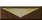
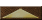

# ERM scripts

URL: /en/erm/

Game events, ERM commands, and the ERA ERM Framework library.

## About the reference {#ref-cont-abouthelp}

:::erm
<section class="erm-reference" lang="en">
<div>


<div class="erm-paragraph">The reference book uses the following <strong>notation system</strong>:<br>
If any parameter is displayed as <strong>#</strong>, then it cannot be verified or obtained, it can only be installed.<br>
If any parameter is displayed as <strong>?$</strong>, then it can only be written to a variable; it cannot be set or checked.<br>
If any parameter is displayed as <strong>$</strong>, then it can be installed, verified or retrieved.<br>
This is all true unless the command comment states otherwise.</div>

<div class="erm-paragraph"><strong>Install</strong> value - direct recording of the value.<br>
<strong>Check</strong> value - checking the value and writing the result to flag 1.<br>
<strong>Get</strong> value - writing a value to a variable.<br>
<u>Examples</u>:
<pre class="erm-example"><code class="language-erm">!!OW:R0/6/9000;	 - set Red's gold to 9000.
!!OW:R0/6/=9000; - flag 1 will be true if Red has exactly 9000 gold, and false if not.
!!OW:R0/6/?v1;	 - write the amount of Red gold into the variable v1.</code></pre></div>

<div class="erm-paragraph">If you wish <strong>install</strong> any<strong> parameter</strong> to the value <strong>0</strong>, you can simply not specify anything in place of the number.
<pre class="erm-example"><code class="language-erm">;Command !!OW:R/6/9000; is equivalent to the command !!OW:R0/6/9000;</code></pre>
If a command contains many parameters, and their zero value means “nothing” (for example, for <a href="receivers/if/#ref-rec-if-g">IF:G</a>), you
you can simply omit further parameters.<br>
For example...
<pre class="erm-example"><code class="language-erm">!!IF:G1/1/0/33/34/35/36/37;		#1
!!IF:G1/1/0/33/34/35/36/37////////;	#2</code></pre>
Command option #1 is equivalent to option #2 because here 0 means "nothing". 
Further parameters are simply automatically set to 0.</div>

<div class="erm-paragraph">In some options you may find a syntax extension with the prefix “without updating”. 
This means that the screen will not be redrawn when a command is executed, which is very useful for combat scripts 
(otherwise some problems arise in the rendering) and scripts that perform many actions (acceleration of actions).</div>

<div class="erm-paragraph">To view <strong><u>examples</u></strong> and <strong><u>comments</u></strong>, 
Click on this word (this block of information will open below).</div>


</div>
</section>
:::

## References {#ref-cont-links}

:::erm
<section class="erm-reference" lang="en">
<div>
<h3 class="erm-align-center">Links</h3>
<dl><strong><ul>
<li><a href="http://wakeofthegods.strategyplanet.gamespy.com/">Of. New Life of Heroes website</a><br>
</li><li><a href="http://wforum.heroes35.net">Of. forum "New Life of Heroes"</a><br>
</li><li><a href="http://forum.df2.ru">Old forum</a><br>
</li><li><a href="http://heroes.obninsk.ru">WoG Heroes Files 3.58f</a><br>
</li><li><a href="http://wforum.heroes35.net/files/wog358_sources.rar">WoG 3.58f source code</a>
</li><li><a href="http://www.dracolich.narod.ru">ERM assistance</a><br>
</li><li><a href="http://h3disk.narod.ru/index1.htm">Lots of stuff for Heroes 3.58</a>
</li></ul></strong></dl></div>
</section>
:::

## ERM-HELP {#ref-cont-main}

:::erm
<section class="erm-reference" lang="en">
<div><div class="erm-align-center erm-paragraph"><span class="erm-source-title"><br>
ERM-HELP</span><br>
<span>version 2.10b<br>
<u><strong>ERM Version: 2914 (WoG 3.58f, TE, ERA2)</strong></u></span></div>
<div class="erm-align-left erm-paragraph"><strong><u>Introduction</u><br>
ERM</strong> means <strong>Event Related Model</strong> (event-related module) and 
is an addition to the game <strong>Heroes 3: Breath of Death™</strong>.<br>
ERM is a new technology that allows dynamic changes in the game depending on 
actions of the player or computer.<br>
At the moment, 78 official scripts have been prepared, affecting a wide variety of 
aspects of the game.<br>
You can create your own scripts, and this help can help in this matter.<br>
Beginners are advised to read <a href="learn/">training</a>.
</div><div class="erm-paragraph">
Early versions lacked support for online play (only one player and 
hotseat), but WoG now fully supports online play over TCP/IP. 
Exceptions for now are only for some scripts, but unsupported scripts 
turn off automatically.<br>
 </div><span class="erm-anchor" id="ref-cont-main-1"></span><div>
<span class="erm-source-title"><a href="./#ref-cont-abouthelp">About this help</a><br>
<a href="./#ref-cont-links" data-context="true">Links</a></span></div>

</div>
</section>
:::

## ERM-HELP {#ref-index}

:::erm
<section class="erm-reference" lang="en">
<div>


</div>
</section>
:::

## ERM Help {#ref-titre}

:::erm
<section class="erm-reference" lang="en">
<div>
<div class="table-wrap erm-reference-table"><table width="100%"><tr>
  <td><span>
	<div class="table-wrap erm-reference-table"><table width="100%">
	<tr><td><a href="./#ref-cont-main" title="Home">Home</a></td></tr>
	<tr><td><a href="start/#ref-cont-adv" title="Articles about ERM, WoG/ERA files and more..">Articles</a></td></tr>
	<tr><td><a href="variables/#ref-cont-flags" title="Flags and Variables">Flag, variable</a></td></tr>
	<tr><td><a href="variables/#ref-cont-usedvar" title="Table of variables used">Spanish AC</a></td></tr>
	<tr><td><a href="index/#ref-cont-list" data-context="true" title="Mini alphabetical index of the most popular options">Contents</a></td></tr>
	</table></div>
  </span></td>
  <td><span>
<span class="erm-anchor" id="ref-titre-1"></span><details class="erm-comment"><summary></summary><div class="erm-comment-body">
	<div class="table-wrap erm-reference-table"><table width="100%">
	<tr>
	<td><a href="receivers/cb/#ref-rec-cb" title="Setting parameters for the Creature Bank">CB</a></td>
	<td><a href="receivers/ch/#ref-rec-ch" title="Setting Treasure Chest Options">CH</a></td>
	<td><a href="receivers/dw/#ref-rec-dw" title="Setting parameters for external Creature Dwellings">DW</a></td>
	<td><a href="receivers/fr/#ref-rec-fr" title="Setting parameters for Campfires on the map">FR</a></td>
	<td><a href="receivers/gd/#ref-rec-gd" title="Configuring Mystic Gardens Options">GD</a></td>
	<td><a href="receivers/gr/#ref-rec-gr" title="Setting up Garrisons parameters">GR</a></td>
	<td><a href="receivers/kt/#ref-rec-kt" title="Configuring Tree of Knowledge settings">KT</a></td>
	<td><a href="receivers/ln/#ref-rec-ln" title="Setting up the Canopy (cellar) parameters on the map">LN</a></td>
	<td><a href="receivers/ml/#ref-rec-ml" title="Configuring Windmill Parameters">ML</a></td>
	<td><a href="receivers/mn/#ref-rec-mn" title="Setting up the parameters of Mines (Beacon)">MN</a></td>
	<td><a href="receivers/mt/#ref-rec-mt" title="Configuring Obelisk Parameters">MT</a></td>
	<td><a href="receivers/pa/#ref-rec-pa" title="Configuring Pandora&#x27;s Box settings on the map">PA</a></td>
	<td><a href="receivers/pm/#ref-rec-pm" title="Setting up Pyramid or new WoG objects">PM</a></td>
	</tr>
	<tr>
	<td><a href="receivers/qu/#ref-rec-qu" title="Setting the Seer&#x27;s Hut or Border Guard Settings">QU</a></td>
	<td><a href="receivers/sc/#ref-rec-sc" title="Setting up Scientist parameters on the map">SC</a></td>
	<td><a href="receivers/sg/#ref-rec-sg" title="Setting the parameters of the Sign (Bottles)">SG</a></td>
	<td><a href="receivers/sk/#ref-rec-sk" title="Setting the parameters of the Skeleton (corpse) on the map">SK</a></td>
	<td><a href="receivers/sp/#ref-rec-sp" title="Setting the parameters of the Magic Stream on the map">SP</a></td>
	<td><a href="receivers/sr/#ref-rec-sr" title="Setting the parameters of Magic Shrines">SR</a></td>
	<td><a href="receivers/st/#ref-rec-st" title="Setting the parameters of the Knowledge Stone">ST</a></td>
	<td><a href="receivers/sw/#ref-rec-sw" title="Setting attributes for Swan Pond">SW</a></td>
	<td><a href="receivers/sy/#ref-rec-sy" title="Setting up Shipyard parameters on the map">SY</a></td>
	<td><a href="receivers/ur/#ref-rec-ur" title="Setting up Universities on the map">UR</a></td>
	<td><a href="receivers/wg/#ref-rec-wg" title="Configuring settings for the Cart">WG</a></td>
	<td><a href="receivers/wh/#ref-rec-wh" title="Configuring Witch&#x27;s Hut Options">WH</a></td>
	<td><a href="receivers/wm/#ref-rec-wm" title="Setting the Water Wheel Parameters">WM</a></td>
	</tr>
	<tr>
	<td colspan="6"></td>
	<td><a href="receivers/wt/#ref-rec-wt" title="Configuring Warrior Tombs settings">WT</a></td>
	<td colspan="6"></td>
	</tr>
	<tr>
	<td colspan="13"></td>
	</tr>
	<tr>
	<td colspan="6"></td>
	<td><a href="./#ref-titre"></a></td>
	<td colspan="6"></td>
	</tr></table></div>
</div></details>
<div class="table-wrap erm-reference-table"><table width="100%">
	<tr>
	<td><a href="triggers/ae/#ref-tr-ae" title="Trigger removing and putting on an artifact">AE</a></td>
	<td><a href="receivers/ai/#ref-rec-ai" title="AI movement control">AI</a></td>
	<td><a href="receivers/ar/#ref-rec-ar" title="Used to configure a resource or artifact on the map">AR</a></td>
	<td><a href="receivers/ba/#ref-rec-ba" title="Setting up battle attributes. Typically used after trigger !?BA0">BA</a></td>
	<td><a href="receivers/bf/#ref-rec-bf" title="Allows you to customize the battlefield (place obstacles/objects, or remove them)">BF</a></td>
	<td><a href="receivers/bg/#ref-rec-bg" title="Setting/receiving parameters in battle">BG</a></td>
	<td><a href="receivers/bh/#ref-rec-bh" title="Combat parameters: for the hero from any side">BH</a></td>
	<td><a href="receivers/bm/#ref-rec-bm" title="Combat parameters: for any creature squad (stack), placing mines on battlefield">BM</a></td>
	<td><a href="triggers/br/#ref-tr-br" title="Trigger each battle round">BR</a></td>
	<td><a href="receivers/bu/#ref-rec-bu" title="Universal combat commands (end battle, summon creature, show message, etc.)">BU</a></td>
	<td><a href="receivers/ca/#ref-rec-ca" title="Setting up town parameters (from name and appearance to buildings and hero in the garrison)">CA</a></td>
	<td><a href="receivers/cd/#ref-rec-cd" title="Setting parameters for the destruction of castles by the player, dependencies of buildings or their prohibition, etc.">CD</a></td>
	<td><a href="receivers/ce/#ref-rec-ce" title="Used to change the parameters of town events">CE</a></td>
	</tr>
	<tr>
	<td><a href="receivers/cm/#ref-rec-cm" title="Operations on mouse click information">CM</a></td>
	<td><a href="receivers/co/#ref-rec-co" title="Configuring Commander Options">CO</a></td>
	<td><span><span class="erm-tone-accent">DC</span></span></td>
	<td><a href="receivers/dl/#ref-rec-dl" title="Allows you to customize your own (non-standard) dialogs">DL</a></td>
	<td><a href="receivers/do/#ref-rec-do" title="Calling a cyclic function">DO</a></td>
	<td><a href="receivers/ea/#ref-rec-ea" title="Ability to customize bonus lines of creatures using ERM">EA</a></td>
	<td><a href="receivers/ex/#ref-rec-ex" title="Creature experience support">EX</a></td>
	<td><a href="receivers/fu/#ref-rec-fu" title="Calling a function, interrupting code execution">FU</a></td>
	<td><a href="receivers/ge/#ref-rec-ge" title="Used to change global event parameters">GE</a></td>
	<td><a href="triggers/gm/#ref-tr-gm" title="Trigger loads and saves (autosave)">GM</a></td>
	<td><a href="receivers/he/#ref-rec-he" title="Customizing hero parameters (from name and skills to his troops, artifacts and murder)">HE</a></td>
	<td><a href="receivers/hl/#ref-rec-hl" title="Control when leveling up the hero. Must be used in trigger !?HL">HL</a></td>
	<td><a href="triggers/hm/#ref-tr-hm" title="Trigger hero movements">HM</a></td>
	</tr>
	<tr>
	<td><a href="receivers/ho/#ref-rec-ho" title="Setting parameters for interactions with heroes">HO</a></td>
	<td><a href="receivers/ht/#ref-rec-ht" title="Setting up hints for any objects on a map of a certain type">HT</a></td>
	<td><a href="conditions/#ref-rec-iee" title="The If-else-endif construct is used to set conditions without using new functions">IEE</a></td>
	<td><a href="receivers/if/#ref-rec-if" title="Working with flags, specifying hero variables; setting up dialogues with the player, displaying messages and pictures, extended WoG dialogues">IF</a></td>
	<td><a href="receivers/ip/#ref-rec-ip" title="Game support via TCP/IP">IP</a></td>
	<td><a href="receivers/le/#ref-rec-le" title="Configuring local event settings on the map">LE</a></td>
	<td><a href="receivers/ma/#ref-rec-ma" title="Setting the parameters of all creatures of a certain type">MA</a></td>
	<td><a href="receivers/mc/#ref-rec-mc" title="Installing macros (named links to your data)">MC</a></td>
	<td><a href="receivers/mf/#ref-rec-mf" title="Controlling physical damage received by the stack">MF</a></td>
	<td><a href="triggers/mg/#ref-tr-mg" title="Trigger casting spells on the adventure map by the player">MG</a></td>
	<td><a href="receivers/mm/#ref-rec-mm" title="Setting battle text or getting mouse position on battlefield">MM</a></td>
	<td><a href="receivers/mo/#ref-rec-mo" title="Setting the parameters of creatures in a specific position on the map">MO</a></td>
	<td><a href="receivers/mp/#ref-rec-mp-era" title="Control of playback of mp3 tracks">MP</a></td>
	</tr>
	<tr>
	<td><a href="receivers/mr/#ref-rec-mr" title="Magic resistance control. Works only with trigger !?MR">MR</a></td>
	<td><a href="receivers/mw/#ref-rec-mw" title="Setting Up Roaming Creatures">MW</a></td>
	<td><a href="receivers/ob/#ref-rec-ob" title="Setting object parameters in specific coordinates">OB</a></td>
	<td><a href="receivers/ow/#ref-rec-ow" title="Used for commands aimed at a specific player to configure resources; commands that control heroes and life time without castles, etc.">OW</a></td>
	<td><a href="triggers/pi/#ref-tr-pi" title="Trigger-instruction (post-instruction)">PI</a></td>
	<td><a href="receivers/po/#ref-rec-po" title="Used to work with numerical information for any map square">PO</a></td>
	<td><a href="receivers/qw/#ref-rec-qw" title="Configuring Hero&#x27;s Journal Options">QW</a></td>
	<td><a href="loops/#ref-rec-re" title="New high-level speed cycles: RE/BR/CO">RE</a></td>
	<td><a href="receivers/rd/#ref-rec-rd" title="Setting up the game dialogue for hiring creatures">RD</a></td>
	<td><a href="receivers/sn/#ref-rec-sn-era" title="Information on new teams in ERA">SN</a></td>
	<td><a href="receivers/ss/#ref-rec-ss" title="Setting Spell Options">SS</a></td>
	<td><a href="triggers/th/#ref-tr-th" title="Trigger entrance/exit to the town hall">TH</a></td>
	<td><a href="receivers/tl/#ref-rec-tl" title="Multiplayer turn time controller.
Real time timer">TL</a></td>
	</tr>
	<tr>
	<td><a href="receivers/tm/#ref-rec-tm" title="Equivalent to ERM for time events in game cards (code repetition at intervals, start/end of action on a specific game date)">TM</a></td>
	<td><a href="receivers/tr/#ref-rec-tr" title="Setting up territories or changing the passability of squares">TR</a></td>
	<td><span><span class="erm-tone-accent">VA</span></span></td>
	<td colspan="3"></td>
	<td></td>
	<td colspan="3"></td>
	<td><a href="receivers/vc/#ref-rec-vc" title="Used to control variables, functions, timers, etc. used in the script">VC</a></td>
	<td><a href="receivers/vr/#ref-rec-vr" title="Used to configure numeric and string variables (setting, comparison and mathematical and logical operations with them)">VR</a></td>
	<td><a href="receivers/un/#ref-rec-un" title="A universal command to influence the map and/or the game (from working with combo artifacts and controlling visibility on the map to the appearance of the cursor and directly working with the game memory)">UN</a></td>
	</tr></table></div>
	<td><span>
	<div class="table-wrap erm-reference-table"><table width="100%">
	<tr><td><a href="triggers/#ref-cont-triggers" title="List of ERM triggers">Triggers</a></td></tr>
	<tr><td><a href="receivers/#ref-cont-receivers" title="List of ERM receivers">Receivers</a></td></tr>
	<tr><td><div><a href="receivers/#ref-cont-receiversa" title="Receiver table for objects">Dr. objects</a></div></td></tr>
	<tr><td><a href="triggers/#ref-era-new-events" title="Description of new ERA triggers, named events">Events</a></td></tr>
	<tr><td><a href="tables/#ref-cont-form" data-context="true" title="List of tables">Tables</a></td>
	</tr></table></div>
  </span></td>
  </span></td></tr>
</table></div>
<a href="../../assets/erm/eb127b364e491583.eot"></a>
<a href="../../assets/erm/1b20b818be881cf1.ttf"></a></div>
</section>
:::

## Finding your way {#reference}

ERM connects game events to commands: visiting an object, starting a battle, or pressing a key runs a handler whose receivers read and change game state. This reference covers classic ERM and ERA extensions. New scripts can use named events, variables, and constants in ERM 2.0.

- [Introduction](start/) — script placement and execution.
- [Syntax](syntax/) — headers, commands, arguments, and comments.
- [Variables](variables/) — scope, strings, and arrays.
- [Conditions](conditions/), [loops](loops/), and [functions](functions/) — control flow.

## Find a command or event {#catalogs}

- [Triggers and events](triggers/) — execution points, legacy codes, and registered names.
- [Receivers](receivers/) — command syntax, parameters, and limitations.
- [Tables](tables/) — identifiers for objects, resources, and game entities.
- [Alphabetical index](index/) — lookup by name or ERM code.

## ERA ERM Framework {#framework}

Framework is an ERM library providing functions, constants, and prepared event context. The supplied library declares **ERA 3.9.15+** as its requirement. An ERA command being available does not imply that a corresponding Framework function is installed.

[Overview](framework/) · [Functions](framework/functions/) · [Events](framework/events/) · [Global variables](framework/globals/) · [Constants](framework/constants/)

## Practical tasks {#practice}

[Examples](examples/) demonstrate individual techniques. [UN:C](un-c/) covers memory, [SN:E](examples/sn-e/) calls functions by address, [SN:F](examples/sn-f/) calls exported functions, and [ERM Hooker](hooker/) creates custom interception points. Address-based operations require checking the executable version and the relevant plugin first.

[Compatibility](compatibility/) explains why identical syntax need not behave identically in WoG and different ERA versions.

## Related commands and tables {#reference-links}

[ERM syntax: ZVSE and ZVSE2](syntax/) · [Local map events (LE)](receivers/le/) · [Map artifacts and resources (AR)](receivers/ar/) · [Heroes (HE)](receivers/he/) · [Global events (GE)](receivers/ge/) · [Variables and expressions (VR)](receivers/vr/) · [Town events (CE)](receivers/ce/) · [Map objects (OB)](receivers/ob/) · [ERM triggers and events](triggers/) · [ERM triggers and events](triggers/#use) · [Battle start and completion (BA)](triggers/ba/) · [Object visits (OB)](triggers/ob/) · [Visiting a hero (HE)](triggers/he/) · [Variables, strings and arrays](variables/)

---

# ERM debugging and compatibility

URL: /en/erm/compatibility/

Version differences, execution context and script validation.

## HoMM 3 HD {#ref-cont-hd}

:::erm
<section class="erm-reference" lang="en">
<div><h3 class="erm-align-center">HoMM 3 HD</h3>
<div class="erm-paragraph"><strong>HoMM 3 HD</strong> (HD-mod) is an unofficial addition (global functional patch) to the game <strong>Heroes of Might and Magic 3</strong>.</div>
<div class="erm-paragraph">The HD mod was originally created to change the game's original 800x600 resolution to a higher resolution, but now its functionality is much broader. 
The HD mod does not affect the original gameplay, but improves the functional part of the interface, makes the game much more convenient, fixes a number of bugs in the original game and 
adds functionality indispensable for online games.</div>
<div class="erm-paragraph">All extensions and fixes are optional, each player will be able to customize the game according to their needs. 
All minor graphics changes are made while maintaining the original style.</div>
<div class="erm-paragraph">The HD mod does not affect the files of the original game on which it is installed at all. 
(that is, the absolutely unchanged original can be launched from the same folder in which the HD mod is installed).</div>
<div class="erm-paragraph">More complete information on the HD mod can be found on the website dedicated to the project, at <a href="https://www.sites.google.com/site/heroes3hd/">link</a>.</div>
</div>
</section>
:::

## Tournament Edition {#ref-cont-te}

:::erm
<section class="erm-reference" lang="en">
<div><h3 class="erm-align-center">Tournament Edition, TE</h3>
<div class="erm-paragraph"><strong>HoMM3 TE</strong> - this <strong>Heroes of Might and Magic 3 Tournament Edition</strong> - 
project based <strong>Heroes 3.5 WoG</strong>.</div>
<div class="erm-paragraph">The history of the project is as follows.<br>
After the release of the third part of the game <strong>Heroes of Might and Magic</strong> companies <strong>New World Computing</strong>, 
a group of enthusiasts led by <span class="erm-anchor" id="ref-cont-te-n1"></span><strong class="erm-tone-purple erm-strong">Slava Salnikov</strong> aka <strong class="erm-tone-purple erm-strong">ZVS</strong> developed an add-on, 
dubbed <strong>HoMM3.5 In the Wake of Gods</strong> (abbreviated as <strong>WoG</strong>). 
During its creation, a special programming language was developed - <strong>ERM</strong> (<strong>Event Related Model</strong>), 
with which anyone can make further changes to the game. But <strong>WoG</strong>, 
like the whole series <strong>HMM</strong>, more focused on playing against computer opponents, 
to create and play exciting maps and campaigns. Therefore, in the spring of 2002, St. Petersburg players 
<strong class="erm-tone-purple erm-strong">A_K_Zyzop</strong> (<strong class="erm-tone-purple erm-strong">Alexander Karpeko</strong>, one of WoG-Team) 
and <strong class="erm-tone-purple erm-strong">Horn</strong> (<strong class="erm-tone-purple erm-strong">Alex Vinogradov</strong>) decided to create another version of the game, designed for tournaments 
(both full-time and correspondence) by <strong>HMM</strong>. The project developed unevenly, almost stopped twice, 
but with a way out <strong>WoG</strong> version 3.58f introduced new features that spurred the development of the project. 
The support of the project by the leader was also important <strong>WoG-team</strong> <strong class="erm-tone-purple erm-strong">Slava Salnikov</strong>.</div>
<div class="erm-paragraph">The project is designed to collect all the best from the Heroic Series and, adding new features, 
get an interesting balanced multiplayer strategy.<br>
Three "whales" <strong>HoMM TE</strong> - this <strong>variety of strategies</strong>, <strong>balance</strong> and <strong>user-friendly interface</strong>. 
All changes made to the game are aimed at achieving these goals.</div>
<div class="erm-paragraph">You can find out more on the subforum dedicated to the project at <a href="http://forum.df2.ru/index.php?showforum=39">link</a>.</div>
</div>
</section>
:::

## What is an era? {#ref-era-index}

:::erm
<section class="erm-reference" lang="en">
<div>
<div>
<div class="table-wrap erm-reference-table"><table width="100%">
	<tr><td class="erm-align-center"><a href="http://wforum.heroes35.net/index.php">
	</a></td></tr>
</table></div>
</div>

<div class="erm-paragraph"><span class="erm-anchor" id="ref-era-index-n1"></span><strong class="erm-tone-purple erm-strong">ERA</strong> is a technical extension for “Heroes of Might and Magic: In the Wake of Gods”, version 3.5.</div>

<h3>
Main tasks solved by the project:</h3>
<ul>
<li> Ability to use third-party plug-ins and patches;</li>
<li> Correcting errors in the game and the ERM scripting language, simplifying development and debugging, increasing script compatibility;</li>
<li> ERM Language Extension <a href="../receivers/sn/#ref-rec-sn-era">new teams</a> and <a href="../triggers/#ref-era-new-events">events</a>;</li>
<li> <a href="../receivers/if/#ref-era-color-text">Colored text</a> in game dialogues;</li>
<li> Simplifying the creation and installation of mods;</li>
<li> <a href="../receivers/sn/#ref-era-api">Unification</a> and standardization of game engine development.</li>
</ul>

<h3>What does the user get?</h3>
<ul>
<li> The ability to freely and safely combine modules and patches to suit your taste;</li>
<li> Correction of such annoying game errors as high CPU load, crashes, disabling ERM scripts, etc.;</li>
<li> The ability to enjoy colored text in dialogues;</li>
<li> Ability to use advanced scripts and mods with access to external functions, keyboard and game memory;</li>
<li> Useful features, such as automatic highlighting of the latest file in the loading dialog, accelerated game launch, etc.</li>
</ul>

<h3>What does a programmer get?</h3>
<ul>
<li> Complete sources of the project and related programs;</li>
<li> Modules in Object Pascal and C++ for faster writing of plugins;</li>
<li> New ERM events including keyboard handling;</li>
<li> Unlimited extended ERM memory with the ability to automatically allocate and deallocate blocks to overcome compatibility issues and index control;</li>
<li> Ability to generate new events in plugins and ERM scripts and use third-party extensions;</li>
<li> The ability to quickly load and recompile EPM scripts using a hotkey without disrupting the progress of the game;</li>
<li> The ability to export main scripts from a saved game using a hotkey for their further analysis and refinement;</li>
<li> Ability to load dynamic libraries (DLL) from ERM, obtain addresses of machine functions and call them. All basic calling conventions and returning integer or fractional results are supported;</li>
<li> API for installing interceptors, securely writing to memory, working with cached ini files, user sections in saved files, getting game state, etc.;</li>
<li> Toolkit for creating and converting patches;</li>
<li> Automatic loading of LOD archives and the ResMan utility will allow you to create mods without being tied to the WoG installer;</li>
<li> Support for ERM/Era Events in plugins with the ability to execute ERM commands on the fly.</li>
</ul>
</div>
</section>
:::

## Choosing a contract {#baseline}

Pages combine legacy Help 2.10b, ERA source, ERA 2/3 changes and the supplied Framework. Newer behavior is marked explicitly. Framework requires ERA 3.9.15+, which does not mean every command was introduced in that version. ZVSE2 selects ERM 2.0, introduced in ERA 3.0.0.

## Porting a legacy script {#porting}

Check y/e/z scopes, shared v/f..t variables, special flags 996..1000 and reserved indices. Prefix your functions and i^/s^ globals. Preserve technical-name case. Modern FU/DO argument gaps retain positions; a missing argument is not a universal d0.

## Strings and messages {#strings}

ERA 3.9.15 accepts arbitrary strings in CA/LE/GE and fixes DL:H and IF:L; old numeric references to another event’s message are disabled. The fast string buffer grew from 1 to 3 MB, but individual z-buffer and resource limits remain. Artifact SN:H was added in 3.0.3.

## Combat, previews and UI {#battle}

Do not use BM/EA before battle structures are ready. OnStackToStackDamage also serves previews and AI: inspect theoretical. BG1 may already see the next stack; OnBattleActionEnd provides action-completion timing. Current registration aliases OnCombatRound to OnBattleRound despite older descriptions distinguishing them.

## Networking and saves {#network}

Local CM, keyboard and TL events are not automatically replayed on another PC. Distinguish the active player from this PC’s player, and AI from remote humans. ERA 3.9.14 fixed OnGameEnter/OnGameLeave in the network cycle. Never carry pointers, DLL handles or temporary arrays from an old process through a savegame.

## Diagnosing a failure {#errors}

Start with the first ERM error and current function: header, semicolon, argument count, GET/SET and ranges. Temporarily reduce the handler to one action. Check if/re/en pairing and nesting for control flow. For SN:E verify the address, ABI, argument widths and memory lifetime. ERA diagnostics live in Debug/Era; the hook report is erm hooks.txt.

## Minimum mod checks {#checklist}

Check a new map, loading, repeated events, return to menu and another start without restarting the process. For combat include tactics, waiting, morale, quick combat and AI. For UI include cancellation and switching heroes/towns. Verify results and absence of side effects, not merely absence of error messages.

## Framework snapshot findings {#framework}

requires-review cards record concrete issues: EnableErrors sets MUTE=TRUE, H3Dlg_UpdateItemRange ignores min/max, and Array_Move has a questionable destInd declaration. Findings are tied to the inspected source; check whether your library has fixed them.

<!-- ERA3-GENERATED:START -->
## Current ERA 3 rules {#current-era3}

The archived ERM Help describes historical behavior. The rules below and the versioned entries take precedence for ERA 3.9.30. Game entity names use the official English ERM Help terminology.

- ERA 3.9.29 supports `SN:F^plugin:function^/...` for calling an export from a particular `.era` or `.dll`; the extension may be omitted.
- Since ERA 3.9.22, `CM:H` returns a valid hero ID outside click events and `undefined` when no hero meeting dialog is active.
- ERA 3.9.16 rewrote `IF:D`, `IF:F`, and `IF:E`: string parameters accept variables or literals and are copied to internal storage. ERA 3.9.17 fixed the order of parameters 3 and 4 in `IF:D`.
- `BM:C` and `BM:Q` automatically redraw shadows, the grid, and selection (3.9.18–3.9.19). `BM:C` uses the side controlling the actual casting stack.
- Network PvP battles require deterministic randomness. `VR:R` accepts a fourth `free_param` that separates independent random sequences (3.9.16).
- Since 3.3, `re/if/en` instructions may omit the trailing colon before `;`; `VR:S?$` is supported again.
- `SN:Q` is deprecated since 3.4.0 and `SN:G` since 3.1.0. New scripts should not use them.
- Since 3.2.0, `OnBattleRound` is an alias of `OnCombatRound`, and `v997` contains a valid battle round throughout combat.
- `IF:N` is the current complex-dialog interface. `IF:Q` remains for compatibility and has corrected picture-selection rules.
- `UN:U` ends a search with `x = -1` and supports the fast six-parameter form; `TR:T` accepts any number of arguments.
- Receiver parameters support global named variables. Trigger-local strings and arrays live until the whole handler chain for the same trigger ends.

<!-- ERA3-GENERATED:END -->

---

# Conditions and branches

URL: /en/erm/conditions/

Variable and flag checks, AND/OR conditions, and if/el/en blocks.

## IF ELSE END {#ref-rec-iee}

:::erm
<section class="erm-reference" lang="en">
<div>
<div class="erm-align-center erm-paragraph"><strong><span class="erm-source-title">IF-ELSE-ENDIF construction</span></strong><a href="../compatibility/#ref-cont-te" title="Only works with HoMM3:TE or later.."></a><br>
<span>(if – otherwise – end_if)</span></div>
<div class="erm-paragraph"><br><strong>Construction <span class="erm-anchor" id="ref-rec-iee-red"></span><code class="erm-tone-red">IF-ELSE-ENDIF</code> used to set conditions without using new features or tons of triggers.</strong></div>

<hr>
<div class="erm-paragraph">
To get started <u>section IF</u>, use the following receiver/instruction:
<pre class="erm-example"><code class="language-erm">!!if&amp;condition:;</code></pre>
Note that 'if' is written in lowercase.<br>
The conditions are standard AND and OR, which you can still use in any receiver. 
If the condition is TRUE when executing the script, the next part will be executed. 
If FALSE, further portions are skipped until the beginning of the ELSE or ENDIF section is found.</div>

<div class="erm-paragraph">To get started <u>ELSE section</u>, use the following receiver/instruction:
<pre class="erm-example"><code class="language-erm">!!el:;   'el' is lowercase.</code></pre>
There are no conditions required for this receiver.
The ELSE section always expects an IF and "binds" to the last IF found in the script.<br>
</div><span class="erm-anchor" id="ref-rec-iee-2"></span><details class="erm-comment"><summary><strong>Syntax extension</strong><a href="../compatibility/#ref-era-index" title="Works only with ERA.."></a>(<span class="erm-anchor" id="ref-rec-iee-show2"></span><u class="erm-toggle-label">show</u>)</summary><div class="erm-comment-body">
Added ELSEIF syntax for receiver !!el.<br>
If an ELSE section has a condition and it is not satisfied (the value is FALSE), the code continues to execute until the next ELSEIF section with a condition or until an ENDIF section is encountered.
<pre class="erm-example"><code class="language-erm">!!if&amp;v1&gt;=0:;
; commands if v1&gt;=0
!!el&amp;v2&lt;42:;
; commands if v1&lt;0 and v2&lt;42
!!el&amp;v3&lt;100/v3&gt;=0:;
; commands, if v1&lt;0, v2&gt;=42 and v3 is included in [0;100)
!!el:;
; commands, if v1&lt;0, v2&gt;=42 and v3 is not included in [0;100)
!!en:;</code></pre></div></details>


<div class="erm-paragraph">For <u>IF completion</u> or IF-ELSE section the following receiver/instruction is used:
<pre class="erm-example"><code class="language-erm">!!en:;   'en' is lowercase.</code></pre>
There are no conditions required for this receiver.<br>
The ENDIF section always expects an IF or IF-ELSE part, and "binds" to the last IF or IF-ELSE found in the script.</div>

<div class="erm-paragraph">You can nest IF-ELSE-ENDIF sections within each other, but no deeper than 10 levels (and no deeper than 16 for <a href="../compatibility/#ref-era-index">ERA</a>).<br>
Each trigger (and function) has its own IF-ELSE-ENDIF, so it is possible to exceed the 10-enable limit by calling functions.<br>
When you call a function in any IF-ELSE-ENDIF section, it (the section) remains active, 
and saves its own <em>y</em>-variables (like functions).</div>
<div class="erm-paragraph">
<strong></strong></div><span class="erm-anchor" id="ref-rec-iee-1"></span><details class="erm-comment"><summary>Example (<span class="erm-anchor" id="ref-rec-iee-show1"></span><strong class="erm-toggle-label">show</strong>)</summary><div class="erm-comment-body">
<pre class="erm-example"><code class="language-erm">ZVSE
!?HM-1;
!!VRv10:S5;
!!if&amp;v10=5:;
  !!IF:M^First IF^;
  !!VRv10:S10;
  !!if&amp;v10&lt;&gt;10:;
    !!IF:M^Second IF^;
  !!el:;
    !!IF:M^Second ELSE^;
  !!en:;
  !!IF:M^Second IF ended^;
!!el:;
  !!IF:M^First ELSE^;
  !!VRv10:S99;
  !!if&amp;v10=99:;
    !!IF:M^Third IF^;
  !!el:;
    !!IF:M^Third ELSE^;
  !!en:;
  !!IF:M^Third IF ended^;
!!en:;
!!IF:M^First IF ended^;</code></pre>

You should see the following messages:
<pre class="erm-example"><code class="language-erm">First IF
Second ELSE
Second IF ended
The first IF is over</code></pre></div></details>


</div>
</section>
:::

## Comparisons {#comparison}

Place a condition after the selector and before the command’s `:`, or before a trigger’s `;`. Comparisons include `=`, `<>`, `<`, `>`, `<=`, and `>=`. For example, `!!IF&v1>0:M^positive^;` runs only when `v1` is positive. Each command’s condition is checked when that command is reached.

## Combining checks {#and-or}

`&` combines checks with AND and a vertical bar combines them with OR; `/` separates the checks. `&v1>=0/v1<8` requires both comparisons to succeed. Do not assume C or JavaScript operator precedence; express complicated logic using nested blocks.

## Flags {#flags}

`&1000` checks whether flag 1000 is true; `&-1000` checks whether it is false. Neither compares a variable with the number 1000. System flags may change with event context; flag 1000, for example, depends on the current player context. Use `!!IF:Vnumber/value;` to set a flag, after checking that another script does not own it.

## if, el, and en blocks {#blocks}

Lowercase `!!if`, `!!el`, and `!!en` implement branching. An `el` with a condition is an else-if branch. All branches end at the matching `if` block’s single `en`. ERA allows a combined nesting depth of 16 `if`/`re` blocks; a called function has its own block structure.
```erm
ZVSE2
!?FU(MyMod_Classify);
!#VA(value:x) (result:x);
!!if&(value)<0;
  !!VR(result):S-1;
!!el&(value)>0;
  !!VR(result):S1;
!!el;
  !!VR(result):S0;
!!en;
```

## Early exit {#exit}

`!!FU&condition:E;` exits the current function or handler when the condition succeeds. It is useful for guarding preconditions. Leaving a handler does not cancel the game’s default action; cancellation requires support from that particular event.

[Functions](../functions/) · [Loops](../loops/)

## Related commands and tables {#reference-links}

[Variables, strings and arrays](../variables/) · [Flags, messages and choices (IF)](../receivers/if/#command-a0100010000-s0100010000-r0100010000-v) · [Flags, messages and choices (IF)](../receivers/if/) · [Battle start and completion (BA)](../triggers/ba/) · [Battle actions (BG)](../triggers/bg/) · [Battlefield setup (BF)](../triggers/bf/) · [Global events (GE)](../receivers/ge/) · [ERM debugging and compatibility](../compatibility/) · [ERA services, memory and sound (SN)](../receivers/sn/#command-xvalues) · [Variables and expressions (VR)](../receivers/vr/) · [Flags, messages and choices (IF)](../receivers/if/#command-w-x) · [Object-type hints (HT)](../receivers/ht/#command-w-1-2-3) · [Function calls (FU)](../receivers/fu/) · [Repeated function calls (DO)](../receivers/do/) · [Hero level-up (HL)](../triggers/hl/) · [Classic ERM macros (MC)](../receivers/mc/) · [ERM triggers and events](../triggers/) · [ERM syntax: ZVSE and ZVSE2](../syntax/) · [ERM triggers and events](../triggers/#use) · [Object visits (OB)](../triggers/ob/) · [Visiting a hero (HE)](../triggers/he/) · [Function calls (FU)](../receivers/fu/#command-a) · [Function calls (FU)](../receivers/fu/#command-c) · [Function calls (FU)](../receivers/fu/#command-d-1-16) · [Function calls (FU)](../receivers/fu/#command-e) · [Function calls (FU)](../receivers/fu/#command-p-1-16) · [Function calls (FU)](../receivers/fu/#command-s) · [Function handler (FU)](../triggers/fu/) · [Network synchronization (IP)](../receivers/ip/#command-f-1-2-v-1-2) · [Network synchronization (IP)](../receivers/ip/) · [Loops: re, br, co, and DO](../loops/)

---

# ERM examples

URL: /en/erm/examples/

Small examples with explained preconditions and results.

## Feature Library {#ref-cont-lib}

:::erm
<section class="erm-reference" lang="en">
<div>


<span class="erm-anchor" id="ref-cont-lib-text"></span><div>

<div class="erm-align-center erm-paragraph"><strong><span class="erm-source-title">Function library UN:C</span></strong></div>
<div class="erm-align-left erm-paragraph"><span>Team <a href="../receivers/un/#ref-rec-un-c">UN:C</a> works with memory. Using it, you can edit even those areas of heroes 
which seemed beyond the reachable. Here are a few useful features that are not standard. Use it!</span></div>
<div class="erm-align-center erm-paragraph"><span class="erm-source-title"><strong><span class="erm-anchor" id="ref-cont-lib-portal1"></span>Controlling the type of creature hired in the Summoning Portal</strong></span></div>
<div class="erm-align-left erm-paragraph">
<pre class="erm-example"><code class="language-erm">!?FU20114&amp;x1=-1;
!!UN:C6919500/4/?y1;
!!VRy1:+56;
!!UN:Cy1/4/?y2;
!!VRy2:+60;
!!UN&amp;x3=0:Cy2/4/x2;
!!UN&amp;x3&lt;&gt;0:Cy2/4/?x2;
!?FU20114&amp;x1&lt;&gt;-1;
!!UN:C6933756/4/?y1;
!!VRy1:+2884;
!!UN:Cy1/4/?y2;
!!VRx1:*360 +60 +y2;
!!UN&amp;x3=0:Cx1/4/x2;
!!UN&amp;x3&lt;&gt;0:Cx1/4/?x2;</code></pre>
<em>Call:</em>
<pre class="erm-example"><code class="language-erm">!!FU20114:P#1/$/#2;
!!FU20114:P#1/$; (#2=0)</code></pre>
<strong>#1</strong>:     Town No. (-1 = current)<br>
<strong>$</strong>:        
<a href="../tables/creatures/#ref-form-creature" data-context="true">creature type</a>. -1 – means there is no Portal, 
or the type has not yet been generated (it will be generated when entering the castle window).<br>
<strong>#2</strong>:     0 - 
set $, any other value - get $.</div>
<div class="erm-align-center erm-paragraph"><span class="erm-source-title">
<span class="erm-anchor" id="ref-cont-lib-portal2"></span>Controlling the number of creatures hired in the Summoning Portal</span></div>
<div class="erm-align-left erm-paragraph">
<pre class="erm-example"><code class="language-erm">!?FU20115&amp;x1=-1;
!!UN:C6919500/4/?y1;
!!VRy1:+56;
!!UN:Cy1/4/?y2;
!!VRy2:+64;
!!UN&amp;x3=0:Cy2/2/x2;
!!UN&amp;x3&lt;&gt;0:Cy2/2/?x2;
!?FU20115&amp;x1&lt;&gt;-1;
!!UN:C6933756/4/?y1;
!!VRy1:+2884;
!!UN:Cy1/4/?y2;
!!VRx1:*360 +64 +y2;
!!UN&amp;x3=0:Cx1/2/x2;
!!UN&amp;x3&lt;&gt;0:Cx1/2/?x2;</code></pre>
<em>Call:</em>
<pre class="erm-example"><code class="language-erm">!!FU20115:P#1/$/#2;
!!FU20115:P#1/$; (#2=0)</code></pre>
#1:     Town No. (-1 = current)<br>
<strong>$:</strong>     number of creatures<br>
<strong>#2:    </strong> 0 - set $, 
any other value - get $.<br>
<strong>
Note</strong> - if in the first week in town not once 
entered (or not the Portal), the type and number of creatures have not yet been generated, 
and the quantity will produce all sorts of garbage.</div>
<div class="erm-align-center erm-paragraph"><strong><span class="erm-source-title"><span class="erm-anchor" id="ref-cont-lib-he"></span>Reading the results of the dialogue HE:C</span></strong></div>
<div class="erm-align-left erm-paragraph"><em>Allows after command
<a href="../receivers/he/#ref-rec-he-c">HE:C</a> see what's left at the top 
(added) slots, and use it not only to add creatures, but also 
for leaving, without any special difficulties. For WoG 3.58f and <a href="../compatibility/#ref-cont-te"><span class="erm-anchor" id="ref-cont-lib-red"></span><span class="erm-tone-red">TE</span></a>.<br>
</em>
<pre class="erm-example"><code class="language-erm">!?FU20116;
!!UN:V=358/?i;
!!VRy1&amp;1:S8585652;
!!VRy1&amp;-1:S8647508;
!!UN:Cy1/4/?x1;
!!VRy1:+4;
!!UN:Cy1/4/?x3;
!!VRy1:+4;
!!UN:Cy1/4/?x5;
!!VRy1:+4;
!!UN:Cy1/4/?x7;
!!VRy1:+4;
!!UN:Cy1/4/?x9;
!!VRy1:+4;
!!UN:Cy1/4/?x11;
!!VRy1:+4;
!!UN:Cy1/4/?x13;
!!VRy1:+4;
!!UN:Cy1/4/?x2;
!!VRy1:+4;
!!UN:Cy1/4/?x4;
!!VRy1:+4;
!!UN:Cy1/4/?x6;
!!VRy1:+4;
!!UN:Cy1/4/?x8;
!!VRy1:+4;
!!UN:Cy1/4/?x10;
!!VRy1:+4;
!!UN:Cy1/4/?x12;
!!VRy1:+4;
!!UN:Cy1/4/?x14;</code></pre>
<em>Call:</em>
<pre class="erm-example"><code class="language-erm">!!FU20116:P?1/?2/?3/?4/?5/?6/?7/?8/?9/?10/?11/?12/?13/?14;</code></pre>
?1,?3…?13 - types of creatures in slots 1..7, respectively,<br>
?2,?4...?14 - their number.</div>

<div class="erm-align-center erm-paragraph"><strong><span class="erm-source-title"><span class="erm-anchor" id="ref-cont-lib-str"></span>Function for working with strings at a low level</span></strong></div>
<em>Sometimes when working with !!UN:C you need 
work with strings. We have to write functions for this. It's easy to write them 
and I decided to share:</em><br>
<br>
Getting an address <em>z</em>-variable number x1 (return to x2)<br>
Versions supported: <strong>3.58f, <a href="../compatibility/#ref-cont-te"><span class="erm-tone-red">TE</span></a></strong>
<pre class="erm-example"><code class="language-erm">!?FU12925;
!!UN:V?y1/?y2;
!!VRy3&amp;y1=358:S40225400;
!!VRy3&amp;y1=359:S9597416;
!!VRx2&amp;y3=0:S0;
!!FU&amp;y3=0:E;
!!VRx2:Sx1*512+y3;

!?FU12926; Copying a string by address. x1 - source, x2 - receiver.
!!DO12927/0/511/1:Px1/x2;

!?FU12927;
!!VRy1:Sx1+x16;
!!VRy2:Sx2+x16;
!!UN:Cy1/1/?y3 Cy2/1/y3;
!!VRx16&amp;y3=0:S511;</code></pre>
<div class="erm-paragraph"><em>And now immediately a useful script that uses them.</em></div>
<div class="erm-align-center erm-paragraph"><strong><span class="erm-source-title"><span class="erm-anchor" id="ref-cont-lib-def"></span>Playing any animation on a unit in battle</span></strong><br></div>
<br>
<em>This script allows you to play any animation (from DEF) on any unit in battle (i.e. 
not only from the list <a href="../tables/combat-animations/#ref-form-formatanimation" data-context="true">animations</a>). 
Requires feature 12925 to work (see above).<br>
</em>
<pre class="erm-example"><code class="language-erm">!?FU12930;
!!UN:V?y10/?y11;
!!VRy12&amp;y10=358:S69016332;
!!VRy12&amp;y10=359:S61479692;
!!UN&amp;y12&lt;&gt;0:Cy12/4/-1;
!!UN:C4454270/4/?y1;
!!VRy1:+660;
!!VRy2:Sy1+8;
!!VRx4:*256+x3;
!!FU12925:Px2/?y5;
!!UN:Cy1/4/?y3Cy2/4/?y4Cy1/4/y5Cy2/4/x4;
!!BMx1:V55;
!!UN:Cy1/4/y3Cy2/4/y4;</code></pre>

Using the function:<br>
<strong>x1</strong> - stack number in battle<br>
<strong>x2</strong> - number <em>z</em>-variable that stores the name of the def file for playback<br>
<strong>Note:</strong> Requires function 12925 from functions for working with strings<br>
<strong>x3</strong> - position relative to the creature:<br>
<strong>0</strong>: The bottom of the animation matches the bottom of the creature (like prayer)<br>
<strong>1</strong>: The center of the animation coincides with the center of the creature (for example, inferno)<br>
<strong>2</strong>: The animation is on top of the creature (I can’t think of an example)<br>
<strong>3</strong>: Animation is on the front of the creature (Gnomish Resistance triggered)<br>
<strong>4</strong>: The animation is in the corner near the attacking hero<br>
<strong>x4</strong> - Translucency (0 - none, i.e. the animation is opaque, 1 - animation 
translucent)<br>
For example, translucency is like prayer, resurrection, healing, 
fear...<br>
Opaque: Morality, curse, old age, illness, ... <br>
<br>
Any def files work, even from an adventure map, any. Animation 
plays once and then disappears.<div class="erm-paragraph"><em>Unfortunately the script is now 
It's better not to use it, because... There are some caching issues. "Good" 
Unfortunately, it was not possible to find a solution to this problem...</em></div>
<div class="erm-align-center erm-paragraph"><span class="erm-source-title"><strong><span class="erm-anchor" id="ref-cont-lib-str2"></span>Obtaining addresses of VoG variables</strong></span></div>
<div class="erm-align-left erm-paragraph"><em>When working with UN:C it may be necessary to obtain an address of some kind 
Z-variable.<br>
Here is a script that writes the address z1 to v4138.<br>
For WoG 3.58f and <a href="../compatibility/#ref-cont-te"><span class="erm-tone-red">TE</span></a></em></div>
<div class="erm-paragraph">
<pre class="erm-example"><code class="language-erm">!#UN:A0/9/?y10; [backup variable number Z]
!#UN&amp;y10&lt;0:A0/9/?z-1; [text backup (3.59)]

!#UN:A0/9/1; [art0.Name = z1]&gt;
!#UN:C6687592/4/?y1; [get artifact array address]
!#UN:Cy1/4/?v4138; [get art0. Name - address z1. The name comes first in the artifact info, so y1 points to art0.Name]
[v4138 stores the address z1]

!#UN&amp;y10&gt;=0:A0/9/y10; [restore variable number Z]
!#UN&amp;y10&lt;0:A0/9/z-1; [restore text (3.59)]</code></pre></div>

</div>
</div>
</section>
:::

## Example catalog {#catalog}

- [SN:E: call by address](./sn-e/)
- [SN:F: call an export](./sn-f/)
- [UN:C: memory recipes](../un-c/)
- [ERM Hooker: installation and removal](../hooker/)
- [Named locals and local arrays](../variables/#local-arrays)
- [Framework: dynamic arrays](../framework/#example)

## Checking an example {#validation}

Check new games and loading, repeated invocation and missing objects; for combat code, test tactics, quick combat and theoretical AI calculations. Reference signatures containing #/$ are templates; example blocks contain ERM code. ZVSE2 does not automatically load Framework.

---

# SN:E — calling by address

URL: /en/erm/examples/sn-e/

Resolve GetKeyState from user32.dll, check the export, then call with left Shift code 160. The pressed state is bit 15 of the SHORT result; the example does not mutate game state.

## Purpose {#purpose}

Resolve GetKeyState from user32.dll, check the export, then call with left Shift code 160. The pressed state is bit 15 of the SHORT result; the example does not mutate game state.

## Example {#code}

```erm
ZVSE2
!?FU(MyMod_ReadShift);
!#VA(pressed:x);
!!VR(pressed):S0;
!!SN:L^user32.dll^/?(module:y);
!!FU&(module)=0:E;
!!SN:A(module)/^GetKeyState^/?(getKeyState:y);
!!FU&(getKeyState)=0:E;
!!VR(savedV1:y):Sv1;
!!SN:E(getKeyState)/1/160;
!!VR(pressed):Sv1 Sd>>15 &1;
!!VRv1:S(savedV1);
```

## Parameters and result {#contract}

Call `!!FU(MyMod_ReadShift):P?(pressed:y);`. Requires Windows and ERA. UI handlers are local; keyboard state is not automatically synchronized multiplayer gameplay. The example was checked against source but not separately run in game.

## Related {#related}

[SN](../../receivers/sn/) · [Framework function](../../framework/functions/getkeymodsstate/) · [Other examples](../)

## Related commands and tables {#reference-links}

[ERA services, memory and sound (SN)](../../receivers/sn/#command-l-library-handle-ahandle-export-address) · [ERA services, memory and sound (SN)](../../receivers/sn/#command-d-o-x-y-level) · [ERA services, memory and sound (SN)](../../receivers/sn/#command-eaddress-convention-args) · [ERA services, memory and sound (SN)](../../receivers/sn/#command-f-export-args) · [ERA services, memory and sound (SN)](../../receivers/sn/#command-g-label-q) · [ERA services, memory and sound (SN)](../../receivers/sn/#command-h-monname-h-secskill) · [ERA services, memory and sound (SN)](../../receivers/sn/#command-istring-result-t-key-result-name-value) · [ERA services, memory and sound (SN)](../../receivers/sn/) · [ERA services, memory and sound (SN)](../../receivers/sn/#command-m-m-m-index-m-address-index) · [ERA services, memory and sound (SN)](../../receivers/sn/#command-r-old-new) · [ERA services, memory and sound (SN)](../../receivers/sn/#command-w-w-key-w-key) · [ERA services, memory and sound (SN)](../../receivers/sn/#command-xvalues) · [ERM debugging and compatibility](../../compatibility/) · [MP3 music (MP)](../../receivers/mp/) · [Creature recruitment (RD)](../../receivers/rd/) · [General game operations (UN)](../../receivers/un/#command-q-1-r) · [Conditions and branches](../../conditions/) · [Loops: re, br, co, and DO](../../loops/) · [ERA services, memory and sound (SN)](../../receivers/sn/#command-h-spec-h-art-h-spell) · [Creature table](../../tables/creatures/) · [General game operations (UN)](../../receivers/un/#command-g0-skill-text-z-g1-monster-text-z-g2-hero-field-value) · [Game object table](../../tables/objects/) · [Map objects (OB)](../../receivers/ob/#command-b-h) · [Object-type hints (HT)](../../receivers/ht/) · [Secondary skills](../../tables/secondary-skills/) · [Hero table](../../tables/heroes/) · [Function calls (FU)](../../receivers/fu/#command-e) · [ERM triggers and events](../../triggers/) · [Text resources: ERT, ERS and JSON](../../tables/text-resources/) · [Variables and expressions (VR)](../../receivers/vr/#command-mask-or-xmask-sd-bits-sd-bits) · [Map-cell data (PO)](../../receivers/po/)

---

# SN:F — calling an export

URL: /en/erm/examples/sn-f/

SN:F resolves and caches GetKeyState. Copy the result from v1 into the output argument immediately, then restore v1. Export names and ABI cannot be selected by superficial similarity.

## Purpose {#purpose}

SN:F resolves and caches GetKeyState. Copy the result from v1 into the output argument immediately, then restore v1. Export names and ABI cannot be selected by superficial similarity.

## Example {#code}

```erm
ZVSE2
!?FU(MyMod_ReadShift);
!#VA(pressed:x);
!!VR(savedV1:y):Sv1;
!!SN:F^GetKeyState^/160;
!!VR(pressed):Sv1 Sd>>15 &1;
!!VRv1:S(savedV1);
```

## Parameters and result {#contract}

Call `!!FU(MyMod_ReadShift):P?(pressed:y);`. Requires Windows and ERA. UI handlers are local; keyboard state is not automatically synchronized multiplayer gameplay. The example was checked against source but not separately run in game.

## Related {#related}

[SN](../../receivers/sn/) · [Framework function](../../framework/functions/getkeymodsstate/) · [Other examples](../)

## Related commands and tables {#reference-links}

[ERA services, memory and sound (SN)](../../receivers/sn/#command-l-library-handle-ahandle-export-address) · [ERA services, memory and sound (SN)](../../receivers/sn/#command-d-o-x-y-level) · [ERA services, memory and sound (SN)](../../receivers/sn/#command-eaddress-convention-args) · [ERA services, memory and sound (SN)](../../receivers/sn/#command-f-export-args) · [ERA services, memory and sound (SN)](../../receivers/sn/#command-g-label-q) · [ERA services, memory and sound (SN)](../../receivers/sn/#command-h-monname-h-secskill) · [ERA services, memory and sound (SN)](../../receivers/sn/#command-istring-result-t-key-result-name-value) · [ERA services, memory and sound (SN)](../../receivers/sn/) · [ERA services, memory and sound (SN)](../../receivers/sn/#command-m-m-m-index-m-address-index) · [ERA services, memory and sound (SN)](../../receivers/sn/#command-r-old-new) · [ERA services, memory and sound (SN)](../../receivers/sn/#command-w-w-key-w-key) · [ERA services, memory and sound (SN)](../../receivers/sn/#command-xvalues) · [ERM debugging and compatibility](../../compatibility/) · [MP3 music (MP)](../../receivers/mp/) · [Creature recruitment (RD)](../../receivers/rd/) · [General game operations (UN)](../../receivers/un/#command-q-1-r) · [Conditions and branches](../../conditions/) · [Loops: re, br, co, and DO](../../loops/) · [ERA services, memory and sound (SN)](../../receivers/sn/#command-h-spec-h-art-h-spell) · [Creature table](../../tables/creatures/) · [General game operations (UN)](../../receivers/un/#command-g0-skill-text-z-g1-monster-text-z-g2-hero-field-value) · [Game object table](../../tables/objects/) · [Map objects (OB)](../../receivers/ob/#command-b-h) · [Object-type hints (HT)](../../receivers/ht/) · [Secondary skills](../../tables/secondary-skills/) · [Hero table](../../tables/heroes/) · [Function calls (FU)](../../receivers/fu/#command-e) · [ERM triggers and events](../../triggers/) · [Text resources: ERT, ERS and JSON](../../tables/text-resources/) · [Variables and expressions (VR)](../../receivers/vr/#command-mask-or-xmask-sd-bits-sd-bits) · [Map-cell data (PO)](../../receivers/po/)

---

# ERA ERM Framework

URL: /en/erm/framework/

Standard helper library, event context and named constants.

## Files and load order {#layout}

Framework requires ERA 3.9.15+. Place the three lib files in Data/s/lib and the final file in Data/s/lib_end, preserving names. Constants and initial handlers must load before mod scripts; final handlers must load afterwards. Do not copy individual functions without their dependencies.

## References {#reference}

[185 functions and handlers](./functions/) · [Events](./events/) · [Globals](./globals/) · [1,838 constants](./constants/)

## Event-local array {#example}

The helpers below create three integers, change the second item, and read the second item; the default lifetime is local.

```erm
ZVSE2
!?FU(MyMod_ArrayExample);
!!FU(NewIntArray):P3/10/?(items:y);
!!SN:V(items)/1/20;
!!SN:V(items)/1/?(second:y);
```

## Implementation status {#review}

The catalog distinguishes public, internal, event-handler, quit-handler and requires-review. The last status explains a concrete discrepancy between code and stated behavior. For example, EnableErrors sets the error-muting flag in the supplied snapshot. This documents the implementation; it does not patch the library.

---

# ERA ERM Framework constants

URL: /en/erm/framework/constants/

1838 definitions: game IDs, flags, command parameters, and key codes.

## How to use {#usage}

Use `(RES_GOLD)` instead of a numeric resource ID when the Framework constants file is installed. Names are case-sensitive. Declare your own constants with a unique prefix and uppercase letters. Zero may identify a real entity and -1 may be a sentinel; each group determines the meaning.

## Groups {#groups}

- [Universal](universal/) — 4
- [Erm Commands](erm-commands/) — 9
- [Mouse Clicks](mouse-clicks/) — 5
- [Mouse Click Subtypes](mouse-click-subtypes/) — 4
- [Mouse Wheel Subtypes](mouse-wheel-subtypes/) — 2
- [Players](players/) — 15
- [Player Bits](player-bits/) — 8
- [Resources](resources/) — 13
- [Monster Flags](monster-flags/) — 32
- [Hero Skills](hero-skills/) — 41
- [Hero Classes](hero-classes/) — 20
- [Heroes](heroes/) — 164
- [Monsters](monsters/) — 205
- [Monster Aggression Level](monster-aggression-level/) — 10
- [Spell Schools](spell-schools/) — 4
- [Spell Texts For Sn H](spell-texts-for-sn-h/) — 7
- [Spells](spells/) — 78
- [Hero Artifact Slots](hero-artifact-slots/) — 28
- [Hero Artifact Levels](hero-artifact-levels/) — 6
- [Artifacts](artifacts/) — 177
- [Artifact Modifiers](artfiact-modifiers/) — 1
- [Quest Types](quest-types/) — 10
- [Quest Rewards](quest-rewards/) — 11
- [Object Types](object-types/) — 230
- [Towns](towns/) — 15
- [Erm Flags](erm-flags/) — 4
- [Wog Options](wog-options/) — 22
- [Army Slots](army-slots/) — 9
- [Battle](battle/) — 18
- [Battle Type Flags](battle-type-flags/) — 6
- [Battle Actions](battle-actions/) — 14
- [Battle Hexes](battle-hexes/) — 3
- [Bm:G Field Offsets](bm-g-field-offsets/) — 14
- [Stack Experience](stack-experience/) — 1
- [Game Limits](game-limits/) — 12
- [Game Settings](game-settings/) — 39
- [Game Types](game-types/) — 6
- [Calling Conventions](calling-conventions/) — 11
- [Un:C Data Types](un-c-data-types/) — 8
- [Data Types](data-types/) — 21
- [Dialogs](dialogs/) — 18
- [Dialog Action Types](dialog-action-types/) — 5
- [Dialog Item Ids](dialog-item-ids/) — 92
- [H3 Message Dialog Types](h3-message-dialog-types/) — 5
- [H3 Dialog Text Alignment](h3-dialog-text-alignment/) — 6
- [H3 Dialog Commands](h3-dialog-commands/) — 5
- [H3 Dialog Picture Types](h3-dialog-picture-types/) — 47
- [Era Chat Event](era-chat-event/) — 6
- [Useful Addresses](useful-addresses/) — 6
- [Bits](bits/) — 32
- [Bit Masks](bit-masks/) — 32
- [Bit Sizes](bit-sizes/) — 5
- [Game Structures](game-structures/) — 26
- [Game Functions](game-functions/) — 2
- [Game Managers](game-managers/) — 10
- [Special Enums](special-enums/) — 12
- [Win32 Api](win32-api/) — 3
- [Assembler](assembler/) — 3
- [Character Codes](character-codes/) — 62
- [Key Codes](key-codes/) — 171
- [Radio Dialogs](radio-dialogs/) — 3

## Registry contents {#snapshot}

`9999 era - consts.erm` contains 1664 definitions; `9999 era - key codes.erm` contains 171. Another 3 definitions are in stdlib. Internal constants have their own group; memory addresses require version checks.

---

# Army Slots

URL: /en/erm/framework/constants/army-slots/

9 named values: army slots.

## Purpose {#meaning}

The **Army Slots** group from the supplied Framework. Names and values below correspond to `!#DC` definitions in the supplied files. Use a constant as `(NAME)` in ERM; it does not allocate a variable.

## Values {#values}

| Constant | Value |
| --- | --- |
| `ARMY_SLOT_FIRST` {#const-army-slot-first} | `0` |
| `ARMY_SLOT_0` {#const-army-slot-0} | `0` |
| `ARMY_SLOT_1` {#const-army-slot-1} | `1` |
| `ARMY_SLOT_2` {#const-army-slot-2} | `2` |
| `ARMY_SLOT_3` {#const-army-slot-3} | `3` |
| `ARMY_SLOT_4` {#const-army-slot-4} | `4` |
| `ARMY_SLOT_5` {#const-army-slot-5} | `5` |
| `ARMY_SLOT_6` {#const-army-slot-6} | `6` |
| `ARMY_SLOT_LAST` {#const-army-slot-last} | `6` |

## All groups {#related}

[Constant catalog](../) · [Variables](../../../variables/)

---

# Artifact Modifiers

URL: /en/erm/framework/constants/artfiact-modifiers/

1 named values: artifact modifiers.

## Purpose {#meaning}

The **Artifact Modifiers** group from the supplied Framework. Names and values below correspond to `!#DC` definitions in the supplied files. Use a constant as `(NAME)` in ERM; it does not allocate a variable.

## Values {#values}

| Constant | Value |
| --- | --- |
| `NO_ART_MOD` {#const-no-art-mod} | `-1` |

## All groups {#related}

[Constant catalog](../) · [Variables](../../../variables/)

## Used by Framework {#used-by}

[ChangeArtModAtSlot](../../functions/changeartmodatslot/) · [AddArtToHero](../../functions/addarttohero/) · [EquipArtToSlot](../../functions/equiparttoslot/)

---

# Artifacts

URL: /en/erm/framework/constants/artifacts/

177 named values: artifacts.

## Purpose {#meaning}

The **Artifacts** group from the supplied Framework. Names and values below correspond to `!#DC` definitions in the supplied files. Use a constant as `(NAME)` in ERM; it does not allocate a variable.

## Values {#values}

| Constant | Value |
| --- | --- |
| `NO_ART` {#const-no-art} | `-1` |
| `ANY_ART` {#const-any-art} | `-1` |
| `ART_FIRST` {#const-art-first} | `0` |
| `ART_SPELL_BOOK` {#const-art-spell-book} | `0` |
| `ART_SPELL_SCROLL` {#const-art-spell-scroll} | `1` |
| `ART_GRAIL` {#const-art-grail} | `2` |
| `ART_CATAPULT` {#const-art-catapult} | `3` |
| `ART_BALLISTA` {#const-art-ballista} | `4` |
| `ART_AMMO_CART` {#const-art-ammo-cart} | `5` |
| `ART_FIRST_AID_TENT` {#const-art-first-aid-tent} | `6` |
| `ART_CENTAUR_AXE` {#const-art-centaur-axe} | `7` |
| `ART_BLACKSHARD_OF_THE_DEAD_KNIGHT` {#const-art-blackshard-of-the-dead-knight} | `8` |
| `ART_GREATER_GNOLLS_FLAIL` {#const-art-greater-gnolls-flail} | `9` |
| `ART_OGRES_CLUB_OF_HAVOC` {#const-art-ogres-club-of-havoc} | `10` |
| `ART_SWORD_OF_HELLFIRE` {#const-art-sword-of-hellfire} | `11` |
| `ART_TITANS_GLADIUS` {#const-art-titans-gladius} | `12` |
| `ART_SHIELD_OF_THE_DWARVEN_LORDS` {#const-art-shield-of-the-dwarven-lords} | `13` |
| `ART_SHIELD_OF_THE_YAWNING_DEAD` {#const-art-shield-of-the-yawning-dead} | `14` |
| `ART_BUCKLER_OF_THE_GNOLL_KING` {#const-art-buckler-of-the-gnoll-king} | `15` |
| `ART_TARG_OF_THE_RAMPAGING_OGRE` {#const-art-targ-of-the-rampaging-ogre} | `16` |
| `ART_SHIELD_OF_THE_DAMNED` {#const-art-shield-of-the-damned} | `17` |
| `ART_SENTINELS_SHIELD` {#const-art-sentinels-shield} | `18` |
| `ART_HELM_OF_THE_ALABASTER_UNICORN` {#const-art-helm-of-the-alabaster-unicorn} | `19` |
| `ART_SKULL_HELMET` {#const-art-skull-helmet} | `20` |
| `ART_HELM_OF_CHAOS` {#const-art-helm-of-chaos} | `21` |
| `ART_CROWN_OF_THE_SUPREME_MAGI` {#const-art-crown-of-the-supreme-magi} | `22` |
| `ART_HELLSTORM_HELMET` {#const-art-hellstorm-helmet} | `23` |
| `ART_THUNDER_HELMET` {#const-art-thunder-helmet} | `24` |
| `ART_BREASTPLATE_OF_PETRIFIED_WOOD` {#const-art-breastplate-of-petrified-wood} | `25` |
| `ART_RIB_CAGE` {#const-art-rib-cage} | `26` |
| `ART_SCALES_OF_THE_GREATER_BASILISK` {#const-art-scales-of-the-greater-basilisk} | `27` |
| `ART_TUNIC_OF_THE_CYCLOPS_KING` {#const-art-tunic-of-the-cyclops-king} | `28` |
| `ART_BREASTPLATE_OF_BRIMSTONE` {#const-art-breastplate-of-brimstone} | `29` |
| `ART_TITANS_CUIRASS` {#const-art-titans-cuirass} | `30` |
| `ART_ARMOR_OF_WONDER` {#const-art-armor-of-wonder} | `31` |
| `ART_SANDALS_OF_THE_SAINT` {#const-art-sandals-of-the-saint} | `32` |
| `ART_CELESTIAL_NECKLACE_OF_BLISS` {#const-art-celestial-necklace-of-bliss} | `33` |
| `ART_LIONS_SHIELD_OF_COURAGE` {#const-art-lions-shield-of-courage} | `34` |
| `ART_SWORD_OF_JUDGEMENT` {#const-art-sword-of-judgement} | `35` |
| `ART_HELM_OF_HEAVENLY_ENLIGHTENMENT` {#const-art-helm-of-heavenly-enlightenment} | `36` |
| `ART_QUIET_EYE_OF_THE_DRAGON` {#const-art-quiet-eye-of-the-dragon} | `37` |
| `ART_RED_DRAGON_FLAME_TONGUE` {#const-art-red-dragon-flame-tongue} | `38` |
| `ART_DRAGON_SCALE_SHIELD` {#const-art-dragon-scale-shield} | `39` |
| `ART_DRAGON_SCALE_ARMOR` {#const-art-dragon-scale-armor} | `40` |
| `ART_DRAGONBONE_GREAVES` {#const-art-dragonbone-greaves} | `41` |
| `ART_DRAGON_WING_TABARD` {#const-art-dragon-wing-tabard} | `42` |
| `ART_NECKLACE_OF_DRAGONTEETH` {#const-art-necklace-of-dragonteeth} | `43` |
| `ART_CROWN_OF_DRAGONTOOTH` {#const-art-crown-of-dragontooth} | `44` |
| `ART_STILL_EYE_OF_THE_DRAGON` {#const-art-still-eye-of-the-dragon} | `45` |
| `ART_CLOVER_OF_FORTUNE` {#const-art-clover-of-fortune} | `46` |
| `ART_CARDS_OF_PROPHECY` {#const-art-cards-of-prophecy} | `47` |
| `ART_LADYBIRD_OF_LUCK` {#const-art-ladybird-of-luck} | `48` |
| `ART_BADGE_OF_COURAGE` {#const-art-badge-of-courage} | `49` |
| `ART_CREST_OF_VALOR` {#const-art-crest-of-valor} | `50` |
| `ART_GLYPH_OF_GALLANTRY` {#const-art-glyph-of-gallantry} | `51` |
| `ART_SPECULUM` {#const-art-speculum} | `52` |
| `ART_SPYGLASS` {#const-art-spyglass} | `53` |
| `ART_AMULET_OF_THE_UNDERTAKER` {#const-art-amulet-of-the-undertaker} | `54` |
| `ART_VAMPIRES_COWL` {#const-art-vampires-cowl} | `55` |
| `ART_DEAD_MANS_BOOTS` {#const-art-dead-mans-boots} | `56` |
| `ART_GARNITURE_OF_INTERFERENCE` {#const-art-garniture-of-interference} | `57` |
| `ART_SURCOAT_OF_COUNTERPOISE` {#const-art-surcoat-of-counterpoise} | `58` |
| `ART_BOOTS_OF_POLARITY` {#const-art-boots-of-polarity} | `59` |
| `ART_BOW_OF_ELVEN_CHERRYWOOD` {#const-art-bow-of-elven-cherrywood} | `60` |
| `ART_BOWSTRING_OF_THE_UNICORNS_MANE` {#const-art-bowstring-of-the-unicorns-mane} | `61` |
| `ART_ANGEL_FEATHER_ARROWS` {#const-art-angel-feather-arrows} | `62` |
| `ART_BIRD_OF_PERCEPTION` {#const-art-bird-of-perception} | `63` |
| `ART_STOIC_WATCHMAN` {#const-art-stoic-watchman} | `64` |
| `ART_EMBLEM_OF_COGNIZANCE` {#const-art-emblem-of-cognizance} | `65` |
| `ART_STATESMANS_MEDAL` {#const-art-statesmans-medal} | `66` |
| `ART_DIPLOMATS_RING` {#const-art-diplomats-ring} | `67` |
| `ART_AMBASSADORS_SASH` {#const-art-ambassadors-sash} | `68` |
| `ART_RING_OF_THE_WAYFARER` {#const-art-ring-of-the-wayfarer} | `69` |
| `ART_EQUESTRIANS_GLOVES` {#const-art-equestrians-gloves} | `70` |
| `ART_NECKLACE_OF_OCEAN_GUIDANCE` {#const-art-necklace-of-ocean-guidance} | `71` |
| `ART_ANGEL_WINGS` {#const-art-angel-wings} | `72` |
| `ART_CHARM_OF_MANA` {#const-art-charm-of-mana} | `73` |
| `ART_TALISMAN_OF_MANA` {#const-art-talisman-of-mana} | `74` |
| `ART_MYSTIC_ORB_OF_MANA` {#const-art-mystic-orb-of-mana} | `75` |
| `ART_COLLAR_OF_CONJURING` {#const-art-collar-of-conjuring} | `76` |
| `ART_RING_OF_CONJURING` {#const-art-ring-of-conjuring} | `77` |
| `ART_CAPE_OF_CONJURING` {#const-art-cape-of-conjuring} | `78` |
| `ART_ORB_OF_THE_FIRMAMENT` {#const-art-orb-of-the-firmament} | `79` |
| `ART_ORB_OF_SILT` {#const-art-orb-of-silt} | `80` |
| `ART_ORB_OF_TEMPESTUOUS_FIRE` {#const-art-orb-of-tempestuous-fire} | `81` |
| `ART_ORB_OF_DRIVING_RAIN` {#const-art-orb-of-driving-rain} | `82` |
| `ART_RECANTERS_CLOAK` {#const-art-recanters-cloak} | `83` |
| `ART_SPIRIT_OF_OPPRESSION` {#const-art-spirit-of-oppression} | `84` |
| `ART_HOURGLASS_OF_THE_EVIL_HOUR` {#const-art-hourglass-of-the-evil-hour} | `85` |
| `ART_TOME_OF_FIRE_MAGIC` {#const-art-tome-of-fire-magic} | `86` |
| `ART_TOME_OF_AIR_MAGIC` {#const-art-tome-of-air-magic} | `87` |
| `ART_TOME_OF_WATER_MAGIC` {#const-art-tome-of-water-magic} | `88` |
| `ART_TOME_OF_EARTH_MAGIC` {#const-art-tome-of-earth-magic} | `89` |
| `ART_BOOTS_OF_LEVITATION` {#const-art-boots-of-levitation} | `90` |
| `ART_GOLDEN_BOW` {#const-art-golden-bow} | `91` |
| `ART_SPHERE_OF_PERMANENCE` {#const-art-sphere-of-permanence} | `92` |
| `ART_ORB_OF_VULNERABILITY` {#const-art-orb-of-vulnerability} | `93` |
| `ART_RING_OF_VITALITY` {#const-art-ring-of-vitality} | `94` |
| `ART_RING_OF_LIFE` {#const-art-ring-of-life} | `95` |
| `ART_VIAL_OF_LIFEBLOOD` {#const-art-vial-of-lifeblood} | `96` |
| `ART_NECKLACE_OF_SWIFTNESS` {#const-art-necklace-of-swiftness} | `97` |
| `ART_BOOTS_OF_SPEED` {#const-art-boots-of-speed} | `98` |
| `ART_CAPE_OF_VELOCITY` {#const-art-cape-of-velocity} | `99` |
| `ART_PENDANT_OF_DISPASSION` {#const-art-pendant-of-dispassion} | `100` |
| `ART_PENDANT_OF_SECOND_SIGHT` {#const-art-pendant-of-second-sight} | `101` |
| `ART_PENDANT_OF_HOLINESS` {#const-art-pendant-of-holiness} | `102` |
| `ART_PENDANT_OF_LIFE` {#const-art-pendant-of-life} | `103` |
| `ART_PENDANT_OF_DEATH` {#const-art-pendant-of-death} | `104` |
| `ART_PENDANT_OF_FREE_WILL` {#const-art-pendant-of-free-will} | `105` |
| `ART_PENDANT_OF_NEGATIVITY` {#const-art-pendant-of-negativity} | `106` |
| `ART_PENDANT_OF_TOTAL_RECALL` {#const-art-pendant-of-total-recall} | `107` |
| `ART_PENDANT_OF_COURAGE` {#const-art-pendant-of-courage} | `108` |
| `ART_EVERFLOWING_CRYSTAL_CLOAK` {#const-art-everflowing-crystal-cloak} | `109` |
| `ART_RING_OF_INFINITE_GEMS` {#const-art-ring-of-infinite-gems} | `110` |
| `ART_EVERPOURING_VIAL_OF_MERCURY` {#const-art-everpouring-vial-of-mercury} | `111` |
| `ART_INEXHAUSTIBLE_CART_OF_ORE` {#const-art-inexhaustible-cart-of-ore} | `112` |
| `ART_EVERSMOKING_RING_OF_SULFUR` {#const-art-eversmoking-ring-of-sulfur} | `113` |
| `ART_INEXHAUSTIBLE_CART_OF_LUMBER` {#const-art-inexhaustible-cart-of-lumber} | `114` |
| `ART_ENDLESS_SACK_OF_GOLD` {#const-art-endless-sack-of-gold} | `115` |
| `ART_ENDLESS_BAG_OF_GOLD` {#const-art-endless-bag-of-gold} | `116` |
| `ART_ENDLESS_PURSE_OF_GOLD` {#const-art-endless-purse-of-gold} | `117` |
| `ART_LEGS_OF_LEGION` {#const-art-legs-of-legion} | `118` |
| `ART_LOINS_OF_LEGION` {#const-art-loins-of-legion} | `119` |
| `ART_TORSO_OF_LEGION` {#const-art-torso-of-legion} | `120` |
| `ART_ARMS_OF_LEGION` {#const-art-arms-of-legion} | `121` |
| `ART_HEAD_OF_LEGION` {#const-art-head-of-legion} | `122` |
| `ART_SEA_CAPTAINS_HAT` {#const-art-sea-captains-hat} | `123` |
| `ART_SPELLBINDERS_HAT` {#const-art-spellbinders-hat} | `124` |
| `ART_SHACKLES_OF_WAR` {#const-art-shackles-of-war} | `125` |
| `ART_ORB_OF_INHIBITION` {#const-art-orb-of-inhibition} | `126` |
| `ART_VIAL_OF_DRAGON_BLOOD` {#const-art-vial-of-dragon-blood} | `127` |
| `ART_ARMAGEDDONS_BLADE` {#const-art-armageddons-blade} | `128` |
| `ART_ANGELIC_ALLIANCE` {#const-art-angelic-alliance} | `129` |
| `ART_CLOAK_OF_THE_UNDEAD_KING` {#const-art-cloak-of-the-undead-king} | `130` |
| `ART_ELIXIR_OF_LIFE` {#const-art-elixir-of-life} | `131` |
| `ART_ARMOR_OF_THE_DAMNED` {#const-art-armor-of-the-damned} | `132` |
| `ART_STATUE_OF_LEGION` {#const-art-statue-of-legion} | `133` |
| `ART_POWER_OF_THE_DRAGON_FATHER` {#const-art-power-of-the-dragon-father} | `134` |
| `ART_TITANS_THUNDER` {#const-art-titans-thunder} | `135` |
| `ART_ADMIRALS_HAT` {#const-art-admirals-hat} | `136` |
| `ART_BOW_OF_THE_SHARPSHOOTER` {#const-art-bow-of-the-sharpshooter} | `137` |
| `ART_WIZARDS_WELL` {#const-art-wizards-well} | `138` |
| `ART_RING_OF_THE_MAGI` {#const-art-ring-of-the-magi} | `139` |
| `ART_CORNUCOPIA` {#const-art-cornucopia} | `140` |
| `ART_MAGIC_WAND` {#const-art-magic-wand} | `141` |
| `ART_GOLD_TOWER_ARROW` {#const-art-gold-tower-arrow} | `142` |
| `ART_MONSTERS_POWER` {#const-art-monsters-power} | `143` |
| `ART_HIGHLIGHTED_SLOT` {#const-art-highlighted-slot} | `144` |
| `ART_ARTIFACT_LOCK` {#const-art-artifact-lock} | `145` |
| `ART_AXE_OF_SMASHING` {#const-art-axe-of-smashing} | `146` |
| `ART_MITHRIL_MAIL` {#const-art-mithril-mail} | `147` |
| `ART_SWORD_OF_SHARPNESS` {#const-art-sword-of-sharpness} | `148` |
| `ART_HELM_OF_IMMORTALITY` {#const-art-helm-of-immortality} | `149` |
| `ART_PENDANT_OF_SORCERY` {#const-art-pendant-of-sorcery} | `150` |
| `ART_BOOTS_OF_HASTE` {#const-art-boots-of-haste} | `151` |
| `ART_BOW_OF_SEEKING` {#const-art-bow-of-seeking} | `152` |
| `ART_DRAGON_EYE_RING` {#const-art-dragon-eye-ring} | `153` |
| `ART_HARDENED_SHIELD` {#const-art-hardened-shield} | `154` |
| `ART_SLAVAS_RING_OF_POWER` {#const-art-slavas-ring-of-power} | `155` |
| `ART_WARLORDS_BANNER` {#const-art-warlords-banner} | `156` |
| `ART_CRIMSON_SHIELD_OF_RETRIBUTION` {#const-art-crimson-shield-of-retribution} | `157` |
| `ART_BARBARIAN_LORDS_AXE_OF_FEROCITY` {#const-art-barbarian-lords-axe-of-ferocity} | `158` |
| `ART_DRAGONHEART` {#const-art-dragonheart} | `159` |
| `ART_GATE_KEY` {#const-art-gate-key} | `160` |
| `ART_BLANK_HELMET` {#const-art-blank-helmet} | `161` |
| `ART_BLANK_SWORD` {#const-art-blank-sword} | `162` |
| `ART_BLANK_SHIELD` {#const-art-blank-shield} | `163` |
| `ART_BLANK_HORNED_RING` {#const-art-blank-horned-ring} | `164` |
| `ART_BLANK_GEMMED_RING` {#const-art-blank-gemmed-ring} | `165` |
| `ART_BLANK_NECK_BROACH` {#const-art-blank-neck-broach} | `166` |
| `ART_BLANK_ARMOR` {#const-art-blank-armor} | `167` |
| `ART_BLANK_SURCOAT` {#const-art-blank-surcoat} | `168` |
| `ART_BLANK_BOOTS` {#const-art-blank-boots} | `169` |
| `ART_BLANK_HORN` {#const-art-blank-horn} | `170` |
| `ART_LAST_WOG` {#const-art-last-wog} | `170` |
| `ART_META_SPELLBOOK` {#const-art-meta-spellbook} | `1000` |
| `ART_META_SPELL_SCROLL_FIRST` {#const-art-meta-spell-scroll-first} | `1001` |

## All groups {#related}

[Constant catalog](../) · [Variables](../../../variables/)

## Used by Framework {#used-by}

[GetHeroPrimarySkillsWithoutArts](../../functions/getheroprimaryskillswithoutarts/) · [GetMaxArtifactId](../../functions/getmaxartifactid/)

---

# Assembler

URL: /en/erm/framework/constants/assembler/

3 named values: assembler.

## Purpose {#meaning}

The **Assembler** group from the supplied Framework. Names and values below correspond to `!#DC` definitions in the supplied files. Use a constant as `(NAME)` in ERM; it does not allocate a variable.

## Values {#values}

| Constant | Value |
| --- | --- |
| `OPCODE_NOP_1` {#const-opcode-nop-1} | `144` |
| `OPCODE_NOP_2` {#const-opcode-nop-2} | `37008` |
| `OPCODE_NOP_4` {#const-opcode-nop-4} | `-1869574000` |

## Implementation dependency {#compatibility}

This group contains internal values, offsets, or addresses. They describe the supplied implementation and do not guarantee compatibility with another executable or a plugin replacing a structure. A named constant does not make address access safe without checking the structure’s lifetime.

## All groups {#related}

[Constant catalog](../) · [Variables](../../../variables/)

---

# Battle Actions

URL: /en/erm/framework/constants/battle-actions/

14 named values: battle actions.

## Purpose {#meaning}

The **Battle Actions** group from the supplied Framework. Names and values below correspond to `!#DC` definitions in the supplied files. Use a constant as `(NAME)` in ERM; it does not allocate a variable.

## Values {#values}

| Constant | Value |
| --- | --- |
| `NO_BATTLE_ACTION` {#const-no-battle-action} | `-1` |
| `BATTLE_ACTION_CANCEL` {#const-battle-action-cancel} | `0` |
| `BATTLE_ACTION_HERO_CAST` {#const-battle-action-hero-cast} | `1` |
| `BATTLE_ACTION_WALK` {#const-battle-action-walk} | `2` |
| `BATTLE_ACTION_DEFEND` {#const-battle-action-defend} | `3` |
| `BATTLE_ACTION_RETREAT` {#const-battle-action-retreat} | `4` |
| `BATTLE_ACTION_SURRENDER` {#const-battle-action-surrender} | `5` |
| `BATTLE_ACTION_WALK_AND_ATTACK` {#const-battle-action-walk-and-attack} | `6` |
| `BATTLE_ACTION_SHOOT` {#const-battle-action-shoot} | `7` |
| `BATTLE_ACTION_WAIT` {#const-battle-action-wait} | `8` |
| `BATTLE_ACTION_CATAPULT` {#const-battle-action-catapult} | `9` |
| `BATTLE_ACTION_MONSTER_CAST` {#const-battle-action-monster-cast} | `10` |
| `BATTLE_ACTION_TENT_HEAL` {#const-battle-action-tent-heal} | `11` |
| `BATTLE_ACTION_SKIP` {#const-battle-action-skip} | `12` |

## All groups {#related}

[Constant catalog](../) · [Variables](../../../variables/)

---

# Battle Hexes

URL: /en/erm/framework/constants/battle-hexes/

3 named values: battle hexes.

## Purpose {#meaning}

The **Battle Hexes** group from the supplied Framework. Names and values below correspond to `!#DC` definitions in the supplied files. Use a constant as `(NAME)` in ERM; it does not allocate a variable.

## Values {#values}

| Constant | Value |
| --- | --- |
| `BATTLE_HEX_FIRST` {#const-battle-hex-first} | `0` |
| `BATTLE_HEX_LAST` {#const-battle-hex-last} | `186` |
| `BATTLE_HEXES_PER_ROW` {#const-battle-hexes-per-row} | `17` |

## All groups {#related}

[Constant catalog](../) · [Variables](../../../variables/)

---

# Battle Type Flags

URL: /en/erm/framework/constants/battle-type-flags/

6 named values: battle type flags.

## Purpose {#meaning}

The **Battle Type Flags** group from the supplied Framework. Names and values below correspond to `!#DC` definitions in the supplied files. Use a constant as `(NAME)` in ERM; it does not allocate a variable.

## Values {#values}

| Constant | Value |
| --- | --- |
| `BATTLE_TYPE_FLAG_LEFT_IS_HUMAN` {#const-battle-type-flag-left-is-human} | `1` |
| `BATTLE_TYPE_FLAG_RIGHT_IS_HUMAN` {#const-battle-type-flag-right-is-human} | `2` |
| `BATTLE_TYPE_FLAG_LEFT_HAS_OWNER` {#const-battle-type-flag-left-has-owner} | `4` |
| `BATTLE_TYPE_FLAG_RIGHT_HAS_OWNER` {#const-battle-type-flag-right-has-owner} | `8` |
| `BATTLE_TYPE_FLAG_LEFT_HAS_HERO` {#const-battle-type-flag-left-has-hero} | `16` |
| `BATTLE_TYPE_FLAG_RIGHT_HAS_HERO` {#const-battle-type-flag-right-has-hero} | `32` |

## All groups {#related}

[Constant catalog](../) · [Variables](../../../variables/)

## Used by Framework {#used-by}

[UpdateBattleVars](../../functions/updatebattlevars/)

---

# Battle

URL: /en/erm/framework/constants/battle/

18 named values: battle.

## Purpose {#meaning}

The **Battle** group from the supplied Framework. Names and values below correspond to `!#DC` definitions in the supplied files. Use a constant as `(NAME)` in ERM; it does not allocate a variable.

## Values {#values}

| Constant | Value |
| --- | --- |
| `NO_STACK` {#const-no-stack} | `-1` |
| `BATTLE_STACK_FIRST` {#const-battle-stack-first} | `0` |
| `BATTLE_STACK_LAST` {#const-battle-stack-last} | `41` |
| `BATTLE_MAX_STACKS` {#const-battle-max-stacks} | `42` |
| `BATTLE_ATTACKER_STACK_FIRST` {#const-battle-attacker-stack-first} | `0` |
| `BATTLE_ATTACKER_STACK_LAST` {#const-battle-attacker-stack-last} | `20` |
| `BATTLE_DEFENDER_STACK_FIRST` {#const-battle-defender-stack-first} | `21` |
| `BATTLE_DEFENDER_STACK_LAST` {#const-battle-defender-stack-last} | `41` |
| `BATTLE_ATTACKER_BASE_STACK_FIRST` {#const-battle-attacker-base-stack-first} | `0` |
| `BATTLE_ATTACKER_BASE_STACK_LAST` {#const-battle-attacker-base-stack-last} | `6` |
| `BATTLE_DEFENDER_BASE_STACK_FIRST` {#const-battle-defender-base-stack-first} | `21` |
| `BATTLE_DEFENDER_BASE_STACK_LAST` {#const-battle-defender-base-stack-last} | `27` |
| `BATTLE_STACKS_PER_SIDE` {#const-battle-stacks-per-side} | `21` |
| `BATTLE_BASE_STACKS_PER_SIDE` {#const-battle-base-stacks-per-side} | `7` |
| `BATTLE_LEFT` {#const-battle-left} | `0` |
| `BATTLE_RIGHT` {#const-battle-right} | `1` |
| `FIRST_TACTICS_ROUND` {#const-first-tactics-round} | `-1000000000` |
| `FIRST_NON_TACTICS_ROUND` {#const-first-non-tactics-round} | `0` |

## All groups {#related}

[Constant catalog](../) · [Variables](../../../variables/)

## Used by Framework {#used-by}

[OnBeforeBattleUniversal](../../functions/onbeforebattleuniversal/) · [OnBattleStackObtainsTurn](../../functions/onbattlestackobtainsturn/) · [BattleStack_MakeActive](../../functions/battlestack-makeactive/) · [OnBattleReplay](../../functions/onbattlereplay/)

---

# Bit Masks

URL: /en/erm/framework/constants/bit-masks/

32 named values: bit masks.

## Purpose {#meaning}

The **Bit Masks** group from the supplied Framework. Names and values below correspond to `!#DC` definitions in the supplied files. Use a constant as `(NAME)` in ERM; it does not allocate a variable.

## Values {#values}

| Constant | Value |
| --- | --- |
| `BITS_1_MASK` {#const-bits-1-mask} | `1` |
| `BITS_2_MASK` {#const-bits-2-mask} | `3` |
| `BITS_3_MASK` {#const-bits-3-mask} | `7` |
| `BITS_4_MASK` {#const-bits-4-mask} | `15` |
| `BITS_5_MASK` {#const-bits-5-mask} | `31` |
| `BITS_6_MASK` {#const-bits-6-mask} | `63` |
| `BITS_7_MASK` {#const-bits-7-mask} | `127` |
| `BITS_8_MASK` {#const-bits-8-mask} | `255` |
| `BITS_9_MASK` {#const-bits-9-mask} | `511` |
| `BITS_10_MASK` {#const-bits-10-mask} | `1023` |
| `BITS_11_MASK` {#const-bits-11-mask} | `2047` |
| `BITS_12_MASK` {#const-bits-12-mask} | `4095` |
| `BITS_13_MASK` {#const-bits-13-mask} | `8191` |
| `BITS_14_MASK` {#const-bits-14-mask} | `16383` |
| `BITS_15_MASK` {#const-bits-15-mask} | `32767` |
| `BITS_16_MASK` {#const-bits-16-mask} | `65535` |
| `BITS_17_MASK` {#const-bits-17-mask} | `131071` |
| `BITS_18_MASK` {#const-bits-18-mask} | `262143` |
| `BITS_19_MASK` {#const-bits-19-mask} | `524287` |
| `BITS_20_MASK` {#const-bits-20-mask} | `1048575` |
| `BITS_21_MASK` {#const-bits-21-mask} | `2097151` |
| `BITS_22_MASK` {#const-bits-22-mask} | `4194303` |
| `BITS_23_MASK` {#const-bits-23-mask} | `8388607` |
| `BITS_24_MASK` {#const-bits-24-mask} | `16777215` |
| `BITS_25_MASK` {#const-bits-25-mask} | `33554431` |
| `BITS_26_MASK` {#const-bits-26-mask} | `67108863` |
| `BITS_27_MASK` {#const-bits-27-mask} | `134217727` |
| `BITS_28_MASK` {#const-bits-28-mask} | `268435455` |
| `BITS_29_MASK` {#const-bits-29-mask} | `536870911` |
| `BITS_30_MASK` {#const-bits-30-mask} | `1073741823` |
| `BITS_31_MASK` {#const-bits-31-mask} | `2147483647` |
| `BITS_32_MASK` {#const-bits-32-mask} | `-1` |

## All groups {#related}

[Constant catalog](../) · [Variables](../../../variables/)

## Used by Framework {#used-by}

[ActivateNextStack](../../functions/activatenextstack/)

---

# Bit Sizes

URL: /en/erm/framework/constants/bit-sizes/

5 named values: bit sizes.

## Purpose {#meaning}

The **Bit Sizes** group from the supplied Framework. Names and values below correspond to `!#DC` definitions in the supplied files. Use a constant as `(NAME)` in ERM; it does not allocate a variable.

## Values {#values}

| Constant | Value |
| --- | --- |
| `BITS_IN_INT4` {#const-bits-in-int4} | `4` |
| `BITS_IN_INT8` {#const-bits-in-int8} | `8` |
| `BITS_IN_INT16` {#const-bits-in-int16} | `16` |
| `BITS_IN_INT32` {#const-bits-in-int32} | `32` |
| `BITS_IN_INT` {#const-bits-in-int} | `32` |

## All groups {#related}

[Constant catalog](../) · [Variables](../../../variables/)

## Used by Framework {#used-by}

[PackUnion](../../functions/packunion/) · [UnpackUnion](../../functions/unpackunion/)

---

# Bits

URL: /en/erm/framework/constants/bits/

32 named values: bits.

## Purpose {#meaning}

The **Bits** group from the supplied Framework. Names and values below correspond to `!#DC` definitions in the supplied files. Use a constant as `(NAME)` in ERM; it does not allocate a variable.

## Values {#values}

| Constant | Value |
| --- | --- |
| `BIT_0` {#const-bit-0} | `1` |
| `BIT_1` {#const-bit-1} | `2` |
| `BIT_2` {#const-bit-2} | `4` |
| `BIT_3` {#const-bit-3} | `8` |
| `BIT_4` {#const-bit-4} | `16` |
| `BIT_5` {#const-bit-5} | `32` |
| `BIT_6` {#const-bit-6} | `64` |
| `BIT_7` {#const-bit-7} | `128` |
| `BIT_8` {#const-bit-8} | `256` |
| `BIT_9` {#const-bit-9} | `512` |
| `BIT_10` {#const-bit-10} | `1024` |
| `BIT_11` {#const-bit-11} | `2048` |
| `BIT_12` {#const-bit-12} | `4096` |
| `BIT_13` {#const-bit-13} | `8192` |
| `BIT_14` {#const-bit-14} | `16384` |
| `BIT_15` {#const-bit-15} | `32768` |
| `BIT_16` {#const-bit-16} | `65536` |
| `BIT_17` {#const-bit-17} | `131072` |
| `BIT_18` {#const-bit-18} | `262144` |
| `BIT_19` {#const-bit-19} | `524288` |
| `BIT_20` {#const-bit-20} | `1048576` |
| `BIT_21` {#const-bit-21} | `2097152` |
| `BIT_22` {#const-bit-22} | `4194304` |
| `BIT_23` {#const-bit-23} | `8388608` |
| `BIT_24` {#const-bit-24} | `16777216` |
| `BIT_25` {#const-bit-25} | `33554432` |
| `BIT_26` {#const-bit-26} | `67108864` |
| `BIT_27` {#const-bit-27} | `134217728` |
| `BIT_28` {#const-bit-28} | `268435456` |
| `BIT_29` {#const-bit-29} | `536870912` |
| `BIT_30` {#const-bit-30} | `1073741824` |
| `BIT_31` {#const-bit-31} | `-2147483648` |

## All groups {#related}

[Constant catalog](../) · [Variables](../../../variables/)

---

# Bm:G Field Offsets

URL: /en/erm/framework/constants/bm-g-field-offsets/

14 named values: bm:g field offsets.

## Purpose {#meaning}

The **Bm:G Field Offsets** group from the supplied Framework. Names and values below correspond to `!#DC` definitions in the supplied files. Use a constant as `(NAME)` in ERM; it does not allocate a variable.

## Values {#values}

| Constant | Value |
| --- | --- |
| `BMG_FIELD_VALUE_VISIBLE` {#const-bmg-field-value-visible} | `4` |
| `BMG_FIELD_VALUE_INVISIBLE` {#const-bmg-field-value-invisible} | `8` |
| `BMG_FIELD_VALUE_DISPLAY_REAL_NUM_MONS` {#const-bmg-field-value-display-real-num-mons} | `-1` |
| `BMG_FIELD_VISIBILITY` {#const-bmg-field-visibility} | `-100` |
| `BMG_FIELD_HIDDEN_QUANTITY` {#const-bmg-field-hidden-quantity} | `-90` |
| `BMG_FIELD_MON_TYPE` {#const-bmg-field-mon-type} | `-89` |
| `BMG_FIELD_MON_POS` {#const-bmg-field-mon-pos} | `-88` |
| `BMG_FIELD_DEF_GROUP_IND` {#const-bmg-field-def-group-ind} | `-87` |
| `BMG_FIELD_DEF_FRAME_IND` {#const-bmg-field-def-frame-ind} | `-86` |
| `BMG_FIELD_NUM_MONS` {#const-bmg-field-num-mons} | `-83` |
| `BMG_FIELD_NUM_DISPLAYED_MONS` {#const-bmg-field-num-displayed-mons} | `-82` |
| `BMG_FIELD_IRRECOVERABLE_LOSS` {#const-bmg-field-irrecoverable-loss} | `-81` |
| `BMG_FIELD_MORALE` {#const-bmg-field-morale} | `212` |
| `BMG_FIELD_LUCK` {#const-bmg-field-luck} | `213` |

## Implementation dependency {#compatibility}

This group contains internal values, offsets, or addresses. They describe the supplied implementation and do not guarantee compatibility with another executable or a plugin replacing a structure. A named constant does not make address access safe without checking the structure’s lifetime.

## All groups {#related}

[Constant catalog](../) · [Variables](../../../variables/)

---

# Calling Conventions

URL: /en/erm/framework/constants/calling-conventions/

11 named values: calling conventions.

## Purpose {#meaning}

The **Calling Conventions** group from the supplied Framework. Names and values below correspond to `!#DC` definitions in the supplied files. Use a constant as `(NAME)` in ERM; it does not allocate a variable.

## Values {#values}

| Constant | Value |
| --- | --- |
| `CALLCONV_PASCAL` {#const-callconv-pascal} | `0` |
| `CALLCONV_CDECL` {#const-callconv-cdecl} | `1` |
| `CALLCONV_STDCALL` {#const-callconv-stdcall} | `1` |
| `CALLCONV_THISCALL` {#const-callconv-thiscall} | `2` |
| `CALLCONV_FASTCALL` {#const-callconv-fastcall} | `3` |
| `CALLCONV_PASCAL_FLOAT` {#const-callconv-pascal-float} | `4` |
| `CALLCONV_CDECL_FLOAT` {#const-callconv-cdecl-float} | `5` |
| `CALLCONV_STDCALL_FLOAT` {#const-callconv-stdcall-float} | `5` |
| `CALLCONV_THISCALL_FLOAT` {#const-callconv-thiscall-float} | `6` |
| `CALLCONV_FASTCALL_FLOAT` {#const-callconv-fastcall-float} | `7` |
| `CALLCONV_FLOAT_RES` {#const-callconv-float-res} | `4` |

## All groups {#related}

[Constant catalog](../) · [Variables](../../../variables/)

## Used by Framework {#used-by}

[GetModList](../../functions/getmodlist/) · [SaveGame](../../functions/savegame/) · [H3Dlg_ShowPopup](../../functions/h3dlg-showpopup/) · [H3Dlg_CenterAtMouse](../../functions/h3dlg-centeratmouse/) · [H3Dlg_SendCmdToItem](../../functions/h3dlg-sendcmdtoitem/) · [H3Dlg_DrawItemOnScreen](../../functions/h3dlg-drawitemonscreen/) · [H3Dlg_UpdateItemRange](../../functions/h3dlg-updateitemrange/) · [AdvMap_SetInfoPanelText](../../functions/advmap-setinfopaneltext/) · [AdvMap_SetInfoPanelDef](../../functions/advmap-setinfopaneldef/) · [ShowAnimatedDefDlg](../../functions/showanimateddefdlg/) · [Battle_RedrawGridShadow](../../functions/battle-redrawgridshadow/) · [BattleStack_Shoot](../../functions/battlestack-shoot/) · [BattleStack_MakeActive](../../functions/battlestack-makeactive/) · [ActivateNextStack](../../functions/activatenextstack/) · [GetTimeMsec](../../functions/gettimemsec/) · [GetUpgradedMonster](../../functions/getupgradedmonster/) · [AddArtToHero](../../functions/addarttohero/) · [EquipArtToSlot](../../functions/equiparttoslot/) · [UnequipArtFromSlot](../../functions/unequipartfromslot/) · [GetTextTableString](../../functions/gettexttablestring/) · [H3Quests_RefreshData](../../functions/h3quests-refreshdata/)

---

# Character Codes

URL: /en/erm/framework/constants/character-codes/

62 named values: character codes.

## Purpose {#meaning}

The **Character Codes** group from the supplied Framework. Names and values below correspond to `!#DC` definitions in the supplied files. Use a constant as `(NAME)` in ERM; it does not allocate a variable.

## Values {#values}

| Constant | Value |
| --- | --- |
| `ORD_0` {#const-ord-0} | `48` |
| `ORD_1` {#const-ord-1} | `49` |
| `ORD_2` {#const-ord-2} | `50` |
| `ORD_3` {#const-ord-3} | `51` |
| `ORD_4` {#const-ord-4} | `52` |
| `ORD_5` {#const-ord-5} | `53` |
| `ORD_6` {#const-ord-6} | `54` |
| `ORD_7` {#const-ord-7} | `55` |
| `ORD_8` {#const-ord-8} | `56` |
| `ORD_9` {#const-ord-9} | `57` |
| `ORD_LOWER_A` {#const-ord-lower-a} | `97` |
| `ORD_LOWER_B` {#const-ord-lower-b} | `98` |
| `ORD_LOWER_C` {#const-ord-lower-c} | `99` |
| `ORD_LOWER_D` {#const-ord-lower-d} | `100` |
| `ORD_LOWER_E` {#const-ord-lower-e} | `101` |
| `ORD_LOWER_F` {#const-ord-lower-f} | `102` |
| `ORD_LOWER_G` {#const-ord-lower-g} | `103` |
| `ORD_LOWER_H` {#const-ord-lower-h} | `104` |
| `ORD_LOWER_I` {#const-ord-lower-i} | `105` |
| `ORD_LOWER_J` {#const-ord-lower-j} | `106` |
| `ORD_LOWER_K` {#const-ord-lower-k} | `107` |
| `ORD_LOWER_L` {#const-ord-lower-l} | `108` |
| `ORD_LOWER_M` {#const-ord-lower-m} | `109` |
| `ORD_LOWER_N` {#const-ord-lower-n} | `110` |
| `ORD_LOWER_O` {#const-ord-lower-o} | `111` |
| `ORD_LOWER_P` {#const-ord-lower-p} | `112` |
| `ORD_LOWER_Q` {#const-ord-lower-q} | `113` |
| `ORD_LOWER_R` {#const-ord-lower-r} | `114` |
| `ORD_LOWER_S` {#const-ord-lower-s} | `115` |
| `ORD_LOWER_T` {#const-ord-lower-t} | `116` |
| `ORD_LOWER_U` {#const-ord-lower-u} | `117` |
| `ORD_LOWER_V` {#const-ord-lower-v} | `118` |
| `ORD_LOWER_W` {#const-ord-lower-w} | `119` |
| `ORD_LOWER_X` {#const-ord-lower-x} | `120` |
| `ORD_LOWER_Y` {#const-ord-lower-y} | `121` |
| `ORD_LOWER_Z` {#const-ord-lower-z} | `122` |
| `ORD_UPPER_A` {#const-ord-upper-a} | `65` |
| `ORD_UPPER_B` {#const-ord-upper-b} | `66` |
| `ORD_UPPER_C` {#const-ord-upper-c} | `67` |
| `ORD_UPPER_D` {#const-ord-upper-d} | `68` |
| `ORD_UPPER_E` {#const-ord-upper-e} | `69` |
| `ORD_UPPER_F` {#const-ord-upper-f} | `70` |
| `ORD_UPPER_G` {#const-ord-upper-g} | `71` |
| `ORD_UPPER_H` {#const-ord-upper-h} | `72` |
| `ORD_UPPER_I` {#const-ord-upper-i} | `73` |
| `ORD_UPPER_J` {#const-ord-upper-j} | `74` |
| `ORD_UPPER_K` {#const-ord-upper-k} | `75` |
| `ORD_UPPER_L` {#const-ord-upper-l} | `76` |
| `ORD_UPPER_M` {#const-ord-upper-m} | `77` |
| `ORD_UPPER_N` {#const-ord-upper-n} | `78` |
| `ORD_UPPER_O` {#const-ord-upper-o} | `79` |
| `ORD_UPPER_P` {#const-ord-upper-p} | `80` |
| `ORD_UPPER_Q` {#const-ord-upper-q} | `81` |
| `ORD_UPPER_R` {#const-ord-upper-r} | `82` |
| `ORD_UPPER_S` {#const-ord-upper-s} | `83` |
| `ORD_UPPER_T` {#const-ord-upper-t} | `84` |
| `ORD_UPPER_U` {#const-ord-upper-u} | `85` |
| `ORD_UPPER_V` {#const-ord-upper-v} | `86` |
| `ORD_UPPER_W` {#const-ord-upper-w} | `87` |
| `ORD_UPPER_X` {#const-ord-upper-x} | `88` |
| `ORD_UPPER_Y` {#const-ord-upper-y} | `89` |
| `ORD_UPPER_Z` {#const-ord-upper-z} | `90` |

## All groups {#related}

[Constant catalog](../) · [Variables](../../../variables/)

---

# Data Types

URL: /en/erm/framework/constants/data-types/

21 named values: data types.

## Purpose {#meaning}

The **Data Types** group from the supplied Framework. Names and values below correspond to `!#DC` definitions in the supplied files. Use a constant as `(NAME)` in ERM; it does not allocate a variable.

## Values {#values}

| Constant | Value |
| --- | --- |
| `INT_MAX` {#const-int-max} | `2147483647` |
| `INT_MIN` {#const-int-min} | `-2147483648` |
| `INT32_MAX` {#const-int32-max} | `2147483647` |
| `INT32_MIN` {#const-int32-min} | `-2147483648` |
| `SIZEOF_BYTE` {#const-sizeof-byte} | `1` |
| `SIZEOF_WORD` {#const-sizeof-word} | `2` |
| `SIZEOF_DWORD` {#const-sizeof-dword} | `4` |
| `SIZEOF_INT` {#const-sizeof-int} | `4` |
| `SIZEOF_INT8` {#const-sizeof-int8} | `1` |
| `SIZEOF_UINT8` {#const-sizeof-uint8} | `1` |
| `SIZEOF_INT16` {#const-sizeof-int16} | `2` |
| `SIZEOF_UINT16` {#const-sizeof-uint16} | `2` |
| `SIZEOF_INT32` {#const-sizeof-int32} | `4` |
| `SIZEOF_UINT32` {#const-sizeof-uint32} | `4` |
| `SIZEOF_PTR` {#const-sizeof-ptr} | `4` |
| `SIZEOF_ZSTR` {#const-sizeof-zstr} | `512` |
| `SIZEOF_BATTLE_STACK_STRUCT` {#const-sizeof-battle-stack-struct} | `1352` |
| `SIZEOF_COMMANDER_STRUCT` {#const-sizeof-commander-struct} | `296` |
| `SIZEOF_SPELL_STRUCT` {#const-sizeof-spell-struct} | `136` |
| `SIZEOF_WIN32_FIND_DATA` {#const-sizeof-win32-find-data} | `320` |
| `SIZEOF_WIN32_FIND_DATA_IN_INTS` {#const-sizeof-win32-find-data-in-ints} | `80` |

## All groups {#related}

[Constant catalog](../) · [Variables](../../../variables/)

## Used by Framework {#used-by}

[OnBeforeBattle](../../functions/onbeforebattle/) · [OnBeforeBattleUniversal](../../functions/onbeforebattleuniversal/) · [Array_Move](../../functions/array-move/) · [Array_Copy](../../functions/array-copy/) · [Array_Merge](../../functions/array-merge/) · [Array_Slice](../../functions/array-slice/) · [Array_Shuffle](../../functions/array-shuffle/) · [Array_CountValue](../../functions/array-countvalue/) · [Array_IndexOf](../../functions/array-indexof/) · [MakeRngSeed](../../functions/makerngseed/) · [SplitMix32](../../functions/splitmix32/) · [FormatQuantity](../../functions/formatquantity/) · [GetModList](../../functions/getmodlist/) · [OnBattleReplay](../../functions/onbattlereplay/) · [MonCountToFuzzyText](../../functions/moncounttofuzzytext/)

---

# Dialog Action Types

URL: /en/erm/framework/constants/dialog-action-types/

5 named values: dialog action types.

## Purpose {#meaning}

The **Dialog Action Types** group from the supplied Framework. Names and values below correspond to `!#DC` definitions in the supplied files. Use a constant as `(NAME)` in ERM; it does not allocate a variable.

## Values {#values}

| Constant | Value |
| --- | --- |
| `DLG_ACTION_HOVER` {#const-dlg-action-hover} | `4` |
| `DLG_ACTION_INDLG_CLICK` {#const-dlg-action-indlg-click} | `512` |
| `DLG_ACTION_OUTDLG_CLICK` {#const-dlg-action-outdlg-click} | `8` |
| `DLG_ACTION_MOUSE_WHEEL` {#const-dlg-action-mouse-wheel} | `522` |
| `DLG_ACTION_KEY_PRESSED` {#const-dlg-action-key-pressed} | `256` |

## All groups {#related}

[Constant catalog](../) · [Variables](../../../variables/)

## Used by Framework {#used-by}

[CollectMouseEventData](../../functions/collectmouseeventdata/)

---

# Dialog Item Ids

URL: /en/erm/framework/constants/dialog-item-ids/

92 named values: dialog item ids.

## Purpose {#meaning}

The **Dialog Item Ids** group from the supplied Framework. Names and values below correspond to `!#DC` definitions in the supplied files. Use a constant as `(NAME)` in ERM; it does not allocate a variable.

## Values {#values}

| Constant | Value |
| --- | --- |
| `ITEM_OUTSIDE_DLG` {#const-item-outside-dlg} | `-2` |
| `ITEM_INSIDE_DLG` {#const-item-inside-dlg} | `-1` |
| `ITEM_ADVMAP_BACK` {#const-item-advmap-back} | `0` |
| `ITEM_ADVMAP_MINI_MAP` {#const-item-advmap-mini-map} | `1` |
| `ITEM_ADVMAP_HERO_INFO_BOX_BORDER` {#const-item-advmap-hero-info-box-border} | `2` |
| `ITEM_ADVMAP_KINGDOM_OVERVIEW_BTN` {#const-item-advmap-kingdom-overview-btn} | `3` |
| `ITEM_ADVMAP_SURFACE_UNDERWORLD_BTN` {#const-item-advmap-surface-underworld-btn} | `4` |
| `ITEM_ADVMAP_QUEST_LOG_BTN` {#const-item-advmap-quest-log-btn} | `5` |
| `ITEM_ADVMAP_SLEEP_WAKE_HERO_BTN` {#const-item-advmap-sleep-wake-hero-btn} | `6` |
| `ITEM_ADVMAP_MOVE_HERO_BTN` {#const-item-advmap-move-hero-btn} | `7` |
| `ITEM_ADVMAP_CAST_SPELL_BTN` {#const-item-advmap-cast-spell-btn} | `8` |
| `ITEM_ADVMAP_ADVENTURE_OPTIONS_BTN` {#const-item-advmap-adventure-options-btn} | `9` |
| `ITEM_ADVMAP_SYSTEM_OPTIONS_BTN` {#const-item-advmap-system-options-btn} | `10` |
| `ITEM_ADVMAP_NEXT_HERO_BTN` {#const-item-advmap-next-hero-btn} | `11` |
| `ITEM_ADVMAP_END_TURN_BTN` {#const-item-advmap-end-turn-btn} | `12` |
| `ITEM_ADVMAP_HERO_LIST_SCROLL_UP_ARROW` {#const-item-advmap-hero-list-scroll-up-arrow} | `13` |
| `ITEM_ADVMAP_HERO_LIST_SCROLL_DOWN_ARROW` {#const-item-advmap-hero-list-scroll-down-arrow} | `14` |
| `ITEM_ADVMAP_HERO_LIST_MOVE_BAR_1` {#const-item-advmap-hero-list-move-bar-1} | `20` |
| `ITEM_ADVMAP_HERO_LIST_MOVE_BAR_2` {#const-item-advmap-hero-list-move-bar-2} | `21` |
| `ITEM_ADVMAP_HERO_LIST_MOVE_BAR_3` {#const-item-advmap-hero-list-move-bar-3} | `22` |
| `ITEM_ADVMAP_HERO_LIST_MOVE_BAR_4` {#const-item-advmap-hero-list-move-bar-4} | `23` |
| `ITEM_ADVMAP_HERO_LIST_MOVE_BAR_5` {#const-item-advmap-hero-list-move-bar-5} | `24` |
| `ITEM_ADVMAP_HERO_LIST_MANA_BAR_1` {#const-item-advmap-hero-list-mana-bar-1} | `25` |
| `ITEM_ADVMAP_HERO_LIST_MANA_BAR_2` {#const-item-advmap-hero-list-mana-bar-2} | `26` |
| `ITEM_ADVMAP_HERO_LIST_MANA_BAR_3` {#const-item-advmap-hero-list-mana-bar-3} | `27` |
| `ITEM_ADVMAP_HERO_LIST_MANA_BAR_4` {#const-item-advmap-hero-list-mana-bar-4} | `28` |
| `ITEM_ADVMAP_HERO_LIST_MANA_BAR_5` {#const-item-advmap-hero-list-mana-bar-5} | `29` |
| `ITEM_ADVMAP_TOWN_LIST_SCROLL_UP_ARROW` {#const-item-advmap-town-list-scroll-up-arrow} | `30` |
| `ITEM_ADVMAP_TOWN_LIST_SCROLL_DOWN_ARROW` {#const-item-advmap-town-list-scroll-down-arrow} | `31` |
| `ITEM_ADVMAP_TOWN_LIST_TOWN_1` {#const-item-advmap-town-list-town-1} | `32` |
| `ITEM_ADVMAP_TOWN_LIST_TOWN_2` {#const-item-advmap-town-list-town-2} | `33` |
| `ITEM_ADVMAP_TOWN_LIST_TOWN_3` {#const-item-advmap-town-list-town-3} | `34` |
| `ITEM_ADVMAP_TOWN_LIST_TOWN_4` {#const-item-advmap-town-list-town-4} | `35` |
| `ITEM_ADVMAP_TOWN_LIST_TOWN_5` {#const-item-advmap-town-list-town-5} | `36` |
| `ITEM_ADVMAP_ADVENTURE_MAP` {#const-item-advmap-adventure-map} | `37` |
| `ITEM_ADVMAP_CHAT_BAR` {#const-item-advmap-chat-bar} | `38` |
| `ITEM_ADVMAP_HERO_LIST_HERO_1` {#const-item-advmap-hero-list-hero-1} | `39` |
| `ITEM_ADVMAP_HERO_LIST_HERO_2` {#const-item-advmap-hero-list-hero-2} | `40` |
| `ITEM_ADVMAP_HERO_LIST_HERO_3` {#const-item-advmap-hero-list-hero-3} | `41` |
| `ITEM_ADVMAP_HERO_LIST_HERO_4` {#const-item-advmap-hero-list-hero-4} | `42` |
| `ITEM_ADVMAP_HERO_LIST_HERO_5` {#const-item-advmap-hero-list-hero-5} | `43` |
| `ITEM_ADVMAP_HERO_LIST_HERO_6` {#const-item-advmap-hero-list-hero-6} | `44` |
| `ITEM_ADVMAP_HERO_LIST_HERO_7` {#const-item-advmap-hero-list-hero-7} | `45` |
| `ITEM_ADVMAP_HERO_LIST_HERO_8` {#const-item-advmap-hero-list-hero-8} | `46` |
| `ITEM_ADVMAP_HINT` {#const-item-advmap-hint} | `200` |
| `ITEM_ADVMAP_RESOURCE_DATE_BAR_BACK` {#const-item-advmap-resource-date-bar-back} | `1000` |
| `ITEM_ADVMAP_WOOD_VALUE` {#const-item-advmap-wood-value} | `1001` |
| `ITEM_ADVMAP_MERCURY_VALUE` {#const-item-advmap-mercury-value} | `1002` |
| `ITEM_ADVMAP_ORE_VALUE` {#const-item-advmap-ore-value} | `1003` |
| `ITEM_ADVMAP_SULPHUR_VALUE` {#const-item-advmap-sulphur-value} | `1004` |
| `ITEM_ADVMAP_CRYSTAL_VALUE` {#const-item-advmap-crystal-value} | `1005` |
| `ITEM_ADVMAP_GEMS_VALUE` {#const-item-advmap-gems-value} | `1006` |
| `ITEM_ADVMAP_GOLD_VALUE` {#const-item-advmap-gold-value} | `1007` |
| `ITEM_ADVMAP_RES_VALUE_FIRST` {#const-item-advmap-res-value-first} | `(ITEM_ADVMAP_WOOD_VALUE)` |
| `ITEM_ADVMAP_RES_VALUE_1` {#const-item-advmap-res-value-1} | `(ITEM_ADVMAP_WOOD_VALUE)` |
| `ITEM_ADVMAP_RES_VALUE_2` {#const-item-advmap-res-value-2} | `(ITEM_ADVMAP_MERCURY_VALUE)` |
| `ITEM_ADVMAP_RES_VALUE_3` {#const-item-advmap-res-value-3} | `(ITEM_ADVMAP_ORE_VALUE)` |
| `ITEM_ADVMAP_RES_VALUE_4` {#const-item-advmap-res-value-4} | `(ITEM_ADVMAP_SULPHUR_VALUE)` |
| `ITEM_ADVMAP_RES_VALUE_5` {#const-item-advmap-res-value-5} | `(ITEM_ADVMAP_CRYSTAL_VALUE)` |
| `ITEM_ADVMAP_RES_VALUE_6` {#const-item-advmap-res-value-6} | `(ITEM_ADVMAP_GEMS_VALUE)` |
| `ITEM_ADVMAP_RES_VALUE_7` {#const-item-advmap-res-value-7} | `(ITEM_ADVMAP_GOLD_VALUE)` |
| `ITEM_ADVMAP_RES_VALUE_LAST` {#const-item-advmap-res-value-last} | `(ITEM_ADVMAP_GOLD_VALUE)` |
| `ITEM_ADVMAP_DATE` {#const-item-advmap-date} | `1008` |
| `ITEM_ADVMAP_WOOD_ICON` {#const-item-advmap-wood-icon} | `1009` |
| `ITEM_ADVMAP_MERCURY_ICON` {#const-item-advmap-mercury-icon} | `1010` |
| `ITEM_ADVMAP_ORE_ICON` {#const-item-advmap-ore-icon} | `1011` |
| `ITEM_ADVMAP_SULPHUR_ICON` {#const-item-advmap-sulphur-icon} | `1012` |
| `ITEM_ADVMAP_CRYSTAL_ICON` {#const-item-advmap-crystal-icon} | `1013` |
| `ITEM_ADVMAP_GEMS_ICON` {#const-item-advmap-gems-icon} | `1014` |
| `ITEM_ADVMAP_GOLD_ICON` {#const-item-advmap-gold-icon} | `1015` |
| `ITEM_ADVMAP_RES_ICON_FIRST` {#const-item-advmap-res-icon-first} | `(ITEM_ADVMAP_WOOD_ICON)` |
| `ITEM_ADVMAP_RES_ICON_1` {#const-item-advmap-res-icon-1} | `(ITEM_ADVMAP_WOOD_ICON)` |
| `ITEM_ADVMAP_RES_ICON_2` {#const-item-advmap-res-icon-2} | `(ITEM_ADVMAP_MERCURY_ICON)` |
| `ITEM_ADVMAP_RES_ICON_3` {#const-item-advmap-res-icon-3} | `(ITEM_ADVMAP_ORE_ICON)` |
| `ITEM_ADVMAP_RES_ICON_4` {#const-item-advmap-res-icon-4} | `(ITEM_ADVMAP_SULPHUR_ICON)` |
| `ITEM_ADVMAP_RES_ICON_5` {#const-item-advmap-res-icon-5} | `(ITEM_ADVMAP_CRYSTAL_ICON)` |
| `ITEM_ADVMAP_RES_ICON_6` {#const-item-advmap-res-icon-6} | `(ITEM_ADVMAP_GEMS_ICON)` |
| `ITEM_ADVMAP_RES_ICON_7` {#const-item-advmap-res-icon-7} | `(ITEM_ADVMAP_GOLD_ICON)` |
| `ITEM_ADVMAP_RES_ICON_LAST` {#const-item-advmap-res-icon-last} | `(ITEM_ADVMAP_GOLD_ICON)` |
| `ITEM_ADVMAP_HERO_INFO_BOX` {#const-item-advmap-hero-info-box} | `2000` |
| `ITEM_ADVMAP_HERO_INFO_BOX_PORTRAIT` {#const-item-advmap-hero-info-box-portrait} | `2001` |
| `ITEM_ADVMAP_HERO_INFO_BOX_NAME` {#const-item-advmap-hero-info-box-name} | `2002` |
| `ITEM_ADVMAP_HERO_INFO_BOX_ATTACK_VALUE` {#const-item-advmap-hero-info-box-attack-value} | `2003` |
| `ITEM_ADVMAP_HERO_INFO_BOX_DEFENCE_VALUE` {#const-item-advmap-hero-info-box-defence-value} | `2004` |
| `ITEM_ADVMAP_HERO_INFO_BOX_POWER_VALUE` {#const-item-advmap-hero-info-box-power-value} | `2005` |
| `ITEM_ADVMAP_HERO_INFO_BOX_KNOWLEDGE_VALUE` {#const-item-advmap-hero-info-box-knowledge-value} | `2006` |
| `ITEM_ADVMAP_HERO_INFO_BOX_PRIM_SKILL_VALUE_FIRST` {#const-item-advmap-hero-info-box-prim-skill-value-first} | `(ITEM_ADVMAP_HERO_INFO_BOX_ATTACK_VALUE)` |
| `ITEM_ADVMAP_HERO_INFO_BOX_PRIM_SKILL_VALUE_1` {#const-item-advmap-hero-info-box-prim-skill-value-1} | `(ITEM_ADVMAP_HERO_INFO_BOX_ATTACK_VALUE)` |
| `ITEM_ADVMAP_HERO_INFO_BOX_PRIM_SKILL_VALUE_2` {#const-item-advmap-hero-info-box-prim-skill-value-2} | `(ITEM_ADVMAP_HERO_INFO_BOX_DEFENCE_VALUE)` |
| `ITEM_ADVMAP_HERO_INFO_BOX_PRIM_SKILL_VALUE_3` {#const-item-advmap-hero-info-box-prim-skill-value-3} | `(ITEM_ADVMAP_HERO_INFO_BOX_POWER_VALUE)` |
| `ITEM_ADVMAP_HERO_INFO_BOX_PRIM_SKILL_VALUE_4` {#const-item-advmap-hero-info-box-prim-skill-value-4} | `(ITEM_ADVMAP_HERO_INFO_BOX_KNOWLEDGE_VALUE)` |
| `ITEM_ADVMAP_HERO_INFO_BOX_PRIM_SKILL_VALUE_LAST` {#const-item-advmap-hero-info-box-prim-skill-value-last} | `(ITEM_ADVMAP_HERO_INFO_BOX_KNOWLEDGE_VALUE)` |

## All groups {#related}

[Constant catalog](../) · [Variables](../../../variables/)

## Used by Framework {#used-by}

[AdvMap_SetHint](../../functions/advmap-sethint/)

---

# Dialogs

URL: /en/erm/framework/constants/dialogs/

18 named values: dialogs.

## Purpose {#meaning}

The **Dialogs** group from the supplied Framework. Names and values below correspond to `!#DC` definitions in the supplied files. Use a constant as `(NAME)` in ERM; it does not allocate a variable.

## Values {#values}

| Constant | Value |
| --- | --- |
| `DLG_BOX_SHADOW_WIDTH` {#const-dlg-box-shadow-width} | `8` |
| `DLG_ADVMAP` {#const-dlg-advmap} | `4205280` |
| `DLG_BATTLE` {#const-dlg-battle} | `4662240` |
| `DLG_HERO_SCREEN` {#const-dlg-hero-screen} | `5117840` |
| `DLG_HERO_MEETING_SCREEN` {#const-dlg-hero-meeting-screen} | `5957344` |
| `DLG_TOWN_SCREEN` {#const-dlg-town-screen} | `6053040` |
| `DLG_NO_SELECTION` {#const-dlg-no-selection} | `-1` |
| `DLG_RESULT_CANCEL` {#const-dlg-result-cancel} | `-1` |
| `DLG_RESULT_PIC_FIRST` {#const-dlg-result-pic-first} | `0` |
| `DLG_RESULT_PIC_1` {#const-dlg-result-pic-1} | `0` |
| `DLG_RESULT_PIC_2` {#const-dlg-result-pic-2} | `1` |
| `DLG_RESULT_PIC_3` {#const-dlg-result-pic-3} | `2` |
| `DLG_RESULT_PIC_4` {#const-dlg-result-pic-4} | `3` |
| `DLG_RESULT_PIC_5` {#const-dlg-result-pic-5} | `4` |
| `DLG_RESULT_PIC_6` {#const-dlg-result-pic-6} | `5` |
| `DLG_RESULT_PIC_7` {#const-dlg-result-pic-7} | `6` |
| `DLG_RESULT_PIC_8` {#const-dlg-result-pic-8} | `7` |
| `DLG_RESULT_PIC_LAST` {#const-dlg-result-pic-last} | `7` |

## All groups {#related}

[Constant catalog](../) · [Variables](../../../variables/)

## Used by Framework {#used-by}

[H3Dlg_Coords](../../functions/h3dlg-coords/) · [AdvMap_SetHint](../../functions/advmap-sethint/) · [OnKeyPressed_Quit](../../functions/onkeypressed-quit/) · [OnKeyReleased_Quit](../../functions/onkeyreleased-quit/)

---

# Era Chat Event

URL: /en/erm/framework/constants/era-chat-event/

6 named values: era chat event.

## Purpose {#meaning}

The **Era Chat Event** group from the supplied Framework. Names and values below correspond to `!#DC` definitions in the supplied files. Use a constant as `(NAME)` in ERM; it does not allocate a variable.

## Values {#values}

| Constant | Value |
| --- | --- |
| `CHAT_EVENT_TYPE_ENTER` {#const-chat-event-type-enter} | `0` |
| `CHAT_EVENT_TYPE_INPUT` {#const-chat-event-type-input} | `1` |
| `CHAT_EVENT_TYPE_LEAVE` {#const-chat-event-type-leave} | `2` |
| `CHAT_EVENT_RESULT_CLEAR` {#const-chat-event-result-clear} | `0` |
| `CHAT_EVENT_RESULT_CLOSE` {#const-chat-event-result-close} | `1` |
| `CHAT_EVENT_RESULT_DEFAULT` {#const-chat-event-result-default} | `2` |

## All groups {#related}

[Constant catalog](../) · [Variables](../../../variables/)

---

# Erm Commands

URL: /en/erm/framework/constants/erm-commands/

9 named values: erm commands.

## Purpose {#meaning}

The **Erm Commands** group from the supplied Framework. Names and values below correspond to `!#DC` definitions in the supplied files. Use a constant as `(NAME)` in ERM; it does not allocate a variable.

## Values {#values}

| Constant | Value |
| --- | --- |
| `M_AUTO_ID` {#const-m-auto-id} | `-1` |
| `M_INT` {#const-m-int} | `0` |
| `M_STR` {#const-m-str} | `1` |
| `M_STORED` {#const-m-stored} | `1` |
| `M_TEMP` {#const-m-temp} | `0` |
| `M_TRIGGER_LOCAL` {#const-m-trigger-local} | `-1` |
| `ARG_SYNTAX_GET` {#const-arg-syntax-get} | `0` |
| `ARG_SYNTAX_SET` {#const-arg-syntax-set} | `1` |
| `ARG_SYNTAX_ADD` {#const-arg-syntax-add} | `2` |

## All groups {#related}

[Constant catalog](../) · [Variables](../../../variables/)

## Used by Framework {#used-by}

[NewIntArray](../../functions/newintarray/) · [NewStrArray](../../functions/newstrarray/) · [Array_Push](../../functions/array-push/) · [Array_Pop](../../functions/array-pop/) · [Array_Move](../../functions/array-move/) · [Array_Splice](../../functions/array-splice/) · [Array_Copy](../../functions/array-copy/) · [Array_Clone](../../functions/array-clone/) · [Array_Merge](../../functions/array-merge/) · [Array_Slice](../../functions/array-slice/) · [Array_Join](../../functions/array-join/) · [Array_Sort](../../functions/array-sort/) · [Array_CustomSort](../../functions/array-customsort/) · [Array_SortedUnique](../../functions/array-sortedunique/) · [Array_Shuffle](../../functions/array-shuffle/) · [Array_Resize](../../functions/array-resize/) · [Array_CountValue](../../functions/array-countvalue/) · [Array_IndexOf](../../functions/array-indexof/) · [Array_Find](../../functions/array-find/) · [DeconstructBitMask](../../functions/deconstructbitmask/) · [StrToUpper](../../functions/strtoupper/) · [StrToLower](../../functions/strtolower/) · [ReadJsonIntArray](../../functions/readjsonintarray/) · [ReadJsonStrArray](../../functions/readjsonstrarray/) · [ScanDir](../../functions/scandir/) · [H3Dlg_Coords](../../functions/h3dlg-coords/) · [DL_Coords](../../functions/dl-coords/) · [AdvMap_SetInfoPanelDef](../../functions/advmap-setinfopaneldef/) · [GetDegradedMonCandidates](../../functions/getdegradedmoncandidates/)

---

# Erm Flags

URL: /en/erm/framework/constants/erm-flags/

4 named values: erm flags.

## Purpose {#meaning}

The **Erm Flags** group from the supplied Framework. Names and values below correspond to `!#DC` definitions in the supplied files. Use a constant as `(NAME)` in ERM; it does not allocate a variable.

## Values {#values}

| Constant | Value |
| --- | --- |
| `ERM_FLAG_REAL_BATTLE` {#const-erm-flag-real-battle} | `1000` |
| `ERM_FLAG_IS_HUMAN` {#const-erm-flag-is-human} | `1000` |
| `ERM_FLAG_NETWORK_BATTLE` {#const-erm-flag-network-battle} | `997` |
| `ERM_FLAG_HUMAN_VS_HUMAN_BATTLE` {#const-erm-flag-human-vs-human-battle} | `998` |

## All groups {#related}

[Constant catalog](../) · [Variables](../../../variables/)

---

# Game Functions

URL: /en/erm/framework/constants/game-functions/

2 named values: game functions.

## Purpose {#meaning}

The **Game Functions** group from the supplied Framework. Names and values below correspond to `!#DC` definitions in the supplied files. Use a constant as `(NAME)` in ERM; it does not allocate a variable.

## Values {#values}

| Constant | Value |
| --- | --- |
| `FUNC_MEM_ALLOC` {#const-func-mem-alloc} | `6386834` |
| `FUNC_MEM_FREE` {#const-func-mem-free} | `6336752` |

## Implementation dependency {#compatibility}

This group contains internal values, offsets, or addresses. They describe the supplied implementation and do not guarantee compatibility with another executable or a plugin replacing a structure. A named constant does not make address access safe without checking the structure’s lifetime.

## All groups {#related}

[Constant catalog](../) · [Variables](../../../variables/)

---

# Game Limits

URL: /en/erm/framework/constants/game-limits/

12 named values: game limits.

## Purpose {#meaning}

The **Game Limits** group from the supplied Framework. Names and values below correspond to `!#DC` definitions in the supplied files. Use a constant as `(NAME)` in ERM; it does not allocate a variable.

## Values {#values}

| Constant | Value |
| --- | --- |
| `MONS_PER_TOWN` {#const-mons-per-town} | `14` |
| `HERO_BACKPACK_CAPACITY` {#const-hero-backpack-capacity} | `64` |
| `ADV_MAP_MON_MAX_QUANTITY` {#const-adv-map-mon-max-quantity} | `4095` |
| `DAYS_IN_MONTH` {#const-days-in-month} | `28` |
| `WEEKS_IN_MONTH` {#const-weeks-in-month} | `4` |
| `DAYS_IN_WEEK` {#const-days-in-week} | `7` |
| `MON_MIN_LEVEL` {#const-mon-min-level} | `0` |
| `MON_MAX_LEVEL` {#const-mon-max-level} | `6` |
| `MON_NUM_LEVELS` {#const-mon-num-levels} | `7` |
| `NUM_PRIMARY_SKILLS` {#const-num-primary-skills} | `4` |
| `NUM_SECONDARY_SKILLS` {#const-num-secondary-skills} | `28` |
| `NUM_PLAYERS` {#const-num-players} | `8` |

## All groups {#related}

[Constant catalog](../) · [Variables](../../../variables/)

## Used by Framework {#used-by}

[OnEveryDay](../../functions/oneveryday/)

---

# Game Managers

URL: /en/erm/framework/constants/game-managers/

10 named values: game managers.

## Purpose {#meaning}

The **Game Managers** group from the supplied Framework. Names and values below correspond to `!#DC` definitions in the supplied files. Use a constant as `(NAME)` in ERM; it does not allocate a variable.

## Values {#values}

| Constant | Value |
| --- | --- |
| `ADV_MANAGER` {#const-adv-manager} | `6918840` |
| `INPUT_MANAGER` {#const-input-manager} | `6919472` |
| `GAME_MANAGER` {#const-game-manager} | `6919480` |
| `TOWN_MANAGER` {#const-town-manager} | `6919500` |
| `WND_MANAGER` {#const-wnd-manager} | `6918864` |
| `SOUND_MANAGER` {#const-sound-manager} | `6919188` |
| `COMBAT_MANAGER` {#const-combat-manager} | `6919200` |
| `MOUSE_MANAGER` {#const-mouse-manager} | `6918832` |
| `SWAP_MANAGER` {#const-swap-manager} | `6962576` |
| `RECRUIT_MANAGER` {#const-recruit-manager} | `6990524` |

## Implementation dependency {#compatibility}

This group contains internal values, offsets, or addresses. They describe the supplied implementation and do not guarantee compatibility with another executable or a plugin replacing a structure. A named constant does not make address access safe without checking the structure’s lifetime.

## All groups {#related}

[Constant catalog](../) · [Variables](../../../variables/)

## Used by Framework {#used-by}

[SaveGame](../../functions/savegame/) · [H3Dlg_GetRootDlg](../../functions/h3dlg-getrootdlg/) · [H3Dlg_GetCurrentDlg](../../functions/h3dlg-getcurrentdlg/) · [H3Dlg_GetCurrentDlgId](../../functions/h3dlg-getcurrentdlgid/) · [AdvMap_SetInfoPanelText](../../functions/advmap-setinfopaneltext/) · [AdvMap_SetInfoPanelDef](../../functions/advmap-setinfopaneldef/) · [Battle_RedrawGridShadow](../../functions/battle-redrawgridshadow/) · [BattleStack_MakeActive](../../functions/battlestack-makeactive/) · [ActivateNextStack](../../functions/activatenextstack/) · [EquipArtToSlot](../../functions/equiparttoslot/) · [H3Quests_RefreshData](../../functions/h3quests-refreshdata/)

---

# Game Settings

URL: /en/erm/framework/constants/game-settings/

39 named values: game settings.

## Purpose {#meaning}

The **Game Settings** group from the supplied Framework. Names and values below correspond to `!#DC` definitions in the supplied files. Use a constant as `(NAME)` in ERM; it does not allocate a variable.

## Values {#values}

| Constant | Value |
| --- | --- |
| `GAME_SETTING_SHOW_INTRO` {#const-game-setting-show-intro} | `6919184` |
| `GAME_SETTING_MUSIC_VOLUME` {#const-game-setting-music-volume} | `6916016` |
| `GAME_SETTING_SOUND_VOLUME` {#const-game-setting-sound-volume} | `6916020` |
| `GAME_SETTING_LAST_MUSIC_VOLUME` {#const-game-setting-last-music-volume} | `6916024` |
| `GAME_SETTING_LAST_SOUND_VOLUME` {#const-game-setting-last-sound-volume} | `6916028` |
| `GAME_SETTING_WALK_SPEED` {#const-game-setting-walk-speed} | `6916012` |
| `GAME_SETTING_COMP_WALK_SPEED` {#const-game-setting-comp-walk-speed} | `6916008` |
| `GAME_SETTING_SHOW_ROUTE` {#const-game-setting-show-route} | `6916036` |
| `GAME_SETTING_MOVE_REMINDER` {#const-game-setting-move-reminder} | `6916040` |
| `GAME_SETTING_QUICK_COMBAT` {#const-game-setting-quick-combat} | `6916044` |
| `GAME_SETTING_VIDEO_SUBTITLES` {#const-game-setting-video-subtitles} | `6916048` |
| `GAME_SETTING_TOWN_OUTLINES` {#const-game-setting-town-outlines} | `6916052` |
| `GAME_SETTING_ANIMATE_SPELLBOOK` {#const-game-setting-animate-spellbook} | `6916056` |
| `GAME_SETTING_WINDOW_SCROLL_SPEED` {#const-game-setting-window-scroll-speed} | `6916060` |
| `GAME_SETTING_BLACKOUT_COMPUTER` {#const-game-setting-blackout-computer} | `6916064` |
| `GAME_SETTING_FIRST_TIME` {#const-game-setting-first-time} | `6919540` |
| `GAME_SETTING_TEST_DECOMP` {#const-game-setting-test-decomp} | `6919544` |
| `GAME_SETTING_TEST_READ` {#const-game-setting-test-read} | `6919548` |
| `GAME_SETTING_TEST_BLIT` {#const-game-setting-test-blit} | `6919552` |
| `GAME_SETTING_BINK_VIDEO` {#const-game-setting-bink-video} | `6916088` |
| `GAME_SETTING_UNIQUE_SYSTEM_ID` {#const-game-setting-unique-system-id} | `6916152` |
| `GAME_SETTING_NETWORK_DEF_NAME` {#const-game-setting-network-def-name} | `6916199` |
| `GAME_SETTING_AUTOSAVE` {#const-game-setting-autosave} | `6916032` |
| `GAME_SETTING_SHOW_COMBAT_GRID` {#const-game-setting-show-combat-grid} | `6916108` |
| `GAME_SETTING_SHOW_COMBAT_MOUSE_HEX` {#const-game-setting-show-combat-mouse-hex} | `6916112` |
| `GAME_SETTING_COMBAT_SHADE_LEVEL` {#const-game-setting-combat-shade-level} | `6916116` |
| `GAME_SETTING_COMBAT_ARMY_INFO_LEVEL` {#const-game-setting-combat-army-info-level} | `6916120` |
| `GAME_SETTING_COMBAT_AUTO_CREATURES` {#const-game-setting-combat-auto-creatures} | `6916068` |
| `GAME_SETTING_COMBAT_AUTO_SPELLS` {#const-game-setting-combat-auto-spells} | `6916072` |
| `GAME_SETTING_COMBAT_CATAPULT` {#const-game-setting-combat-catapult} | `6916076` |
| `GAME_SETTING_COMBAT_BALLISTA` {#const-game-setting-combat-ballista} | `6916080` |
| `GAME_SETTING_COMBAT_FIRST_AID_TENT` {#const-game-setting-combat-first-aid-tent} | `6916084` |
| `GAME_SETTING_COMBAT_SPEED` {#const-game-setting-combat-speed} | `6916156` |
| `GAME_SETTING_MAIN_GAME_SHOW_MENU` {#const-game-setting-main-game-show-menu} | `6916092` |
| `GAME_SETTING_MAIN_GAME_X` {#const-game-setting-main-game-x} | `6916096` |
| `GAME_SETTING_MAIN_GAME_Y` {#const-game-setting-main-game-y} | `6916100` |
| `GAME_SETTING_MAIN_GAME_FULL_SCREEN` {#const-game-setting-main-game-full-screen} | `6916104` |
| `GAME_SETTING_APP_PATH` {#const-game-setting-app-path} | `6915604` |
| `GAME_SETTING_CD_DRIVE` {#const-game-setting-cd-drive} | `6916232` |

## All groups {#related}

[Constant catalog](../) · [Variables](../../../variables/)

---

# Game Structures

URL: /en/erm/framework/constants/game-structures/

26 named values: game structures.

## Purpose {#meaning}

The **Game Structures** group from the supplied Framework. Names and values below correspond to `!#DC` definitions in the supplied files. Use a constant as `(NAME)` in ERM; it does not allocate a variable.

## Values {#values}

| Constant | Value |
| --- | --- |
| `STRUCT_H3DLG_VTABLE` {#const-struct-h3dlg-vtable} | `0` |
| `STRUCT_H3DLG_WIDTH` {#const-struct-h3dlg-width} | `32` |
| `STRUCT_H3DLG_HEIGHT` {#const-struct-h3dlg-height} | `36` |
| `STRUCT_H3DLG_X` {#const-struct-h3dlg-x} | `24` |
| `STRUCT_H3DLG_Y` {#const-struct-h3dlg-y} | `28` |
| `STRUCT_SNDMAN_UNLOCKED` {#const-struct-sndman-unlocked} | `132` |
| `STRUCT_COMBATMAN_ATTACKER_ARMY` {#const-struct-combatman-attacker-army} | `21700` |
| `STRUCT_COMBATMAN_DEFENDER_ARMY` {#const-struct-combatman-defender-army} | `21704` |
| `STRUCT_COMBATMAN_IS_WAITING_PHASE` {#const-struct-combatman-is-waiting-phase} | `81380` |
| `STRUCT_SPELL_NAME` {#const-struct-spell-name} | `16` |
| `STRUCT_SPELL_SHORT_NAME` {#const-struct-spell-short-name} | `20` |
| `STRUCT_SPELL_DESCR` {#const-struct-spell-descr} | `120` |
| `STRUCT_SPELL_DESCR_BASIC` {#const-struct-spell-descr-basic} | `124` |
| `STRUCT_SPELL_DESCR_ADVANCED` {#const-struct-spell-descr-advanced} | `128` |
| `STRUCT_SPELL_DESCR_EXPERT` {#const-struct-spell-descr-expert} | `132` |
| `STRUCT_WIN32_FIND_DATA_ATTRS` {#const-struct-win32-find-data-attrs} | `0` |
| `STRUCT_WIN32_FIND_DATA_FILENAME` {#const-struct-win32-find-data-filename} | `44` |
| `STRUCT_HOOK_CONTEXT_EDI` {#const-struct-hook-context-edi} | `0` |
| `STRUCT_HOOK_CONTEXT_ESI` {#const-struct-hook-context-esi} | `4` |
| `STRUCT_HOOK_CONTEXT_EBP` {#const-struct-hook-context-ebp} | `8` |
| `STRUCT_HOOK_CONTEXT_ESP` {#const-struct-hook-context-esp} | `12` |
| `STRUCT_HOOK_CONTEXT_EBX` {#const-struct-hook-context-ebx} | `16` |
| `STRUCT_HOOK_CONTEXT_EDX` {#const-struct-hook-context-edx} | `20` |
| `STRUCT_HOOK_CONTEXT_ECX` {#const-struct-hook-context-ecx} | `24` |
| `STRUCT_HOOK_CONTEXT_EAX` {#const-struct-hook-context-eax} | `28` |
| `STRUCT_HOOK_CONTEXT_RET` {#const-struct-hook-context-ret} | `32` |

## Implementation dependency {#compatibility}

This group contains internal values, offsets, or addresses. They describe the supplied implementation and do not guarantee compatibility with another executable or a plugin replacing a structure. A named constant does not make address access safe without checking the structure’s lifetime.

## All groups {#related}

[Constant catalog](../) · [Variables](../../../variables/)

## Used by Framework {#used-by}

[ScanDir](../../functions/scandir/) · [H3Dlg_Coords](../../functions/h3dlg-coords/) · [H3Dlg_CenterAtMouse](../../functions/h3dlg-centeratmouse/) · [H3Dlg_UpdateItemRange](../../functions/h3dlg-updateitemrange/) · [DL_GetSize](../../functions/dl-getsize/) · [DL_SetSize](../../functions/dl-setsize/) · [DL_AlignDlg](../../functions/dl-aligndlg/) · [AdvMap_SetHint](../../functions/advmap-sethint/)

---

# Game Types

URL: /en/erm/framework/constants/game-types/

6 named values: game types.

## Purpose {#meaning}

The **Game Types** group from the supplied Framework. Names and values below correspond to `!#DC` definitions in the supplied files. Use a constant as `(NAME)` in ERM; it does not allocate a variable.

## Values {#values}

| Constant | Value |
| --- | --- |
| `GAME_TYPE_SINGLE` {#const-game-type-single} | `0` |
| `GAME_TYPE_IPX` {#const-game-type-ipx} | `1` |
| `GAME_TYPE_TCP` {#const-game-type-tcp} | `2` |
| `GAME_TYPE_HOTSEAT` {#const-game-type-hotseat} | `3` |
| `GAME_TYPE_DIRECT_CONNECT` {#const-game-type-direct-connect} | `4` |
| `GAME_TYPE_MODEM` {#const-game-type-modem} | `5` |

## All groups {#related}

[Constant catalog](../) · [Variables](../../../variables/)

---

# H3 Dialog Commands

URL: /en/erm/framework/constants/h3-dialog-commands/

5 named values: h3 dialog commands.

## Purpose {#meaning}

The **H3 Dialog Commands** group from the supplied Framework. Names and values below correspond to `!#DC` definitions in the supplied files. Use a constant as `(NAME)` in ERM; it does not allocate a variable.

## Values {#values}

| Constant | Value |
| --- | --- |
| `DLG_CMD_SET_TEXT` {#const-dlg-cmd-set-text} | `3` |
| `DLG_CMD_SET_DEF_FRAME` {#const-dlg-cmd-set-def-frame} | `4` |
| `DLG_CMD_SET_DEF` {#const-dlg-cmd-set-def} | `9` |
| `DLG_CMD_SET_PCX` {#const-dlg-cmd-set-pcx} | `11` |
| `DLG_CMD_TYPE_DEFAULT` {#const-dlg-cmd-type-default} | `512` |

## All groups {#related}

[Constant catalog](../) · [Variables](../../../variables/)

## Used by Framework {#used-by}

[H3Dlg_SendCmdToItem](../../functions/h3dlg-sendcmdtoitem/) · [AdvMap_SetHint](../../functions/advmap-sethint/)

---

# H3 Dialog Picture Types

URL: /en/erm/framework/constants/h3-dialog-picture-types/

47 named values: h3 dialog picture types.

## Purpose {#meaning}

The **H3 Dialog Picture Types** group from the supplied Framework. Names and values below correspond to `!#DC` definitions in the supplied files. Use a constant as `(NAME)` in ERM; it does not allocate a variable.

## Values {#values}

| Constant | Value |
| --- | --- |
| `NO_PIC_TYPE` {#const-no-pic-type} | `-1` |
| `PIC_TYPE_FLAG_DISPLAY_ZEROS` {#const-pic-type-flag-display-zeros} | `-2147483648` |
| `PIC_TYPE_RES_WOOD` {#const-pic-type-res-wood} | `0` |
| `PIC_TYPE_RES_MERCURY` {#const-pic-type-res-mercury} | `1` |
| `PIC_TYPE_RES_ORE` {#const-pic-type-res-ore} | `2` |
| `PIC_TYPE_RES_SULFUR` {#const-pic-type-res-sulfur} | `3` |
| `PIC_TYPE_RES_CRYSTAL` {#const-pic-type-res-crystal} | `4` |
| `PIC_TYPE_RES_GEMS` {#const-pic-type-res-gems} | `5` |
| `PIC_TYPE_RES_GOLD` {#const-pic-type-res-gold} | `6` |
| `PIC_TYPE_RES_MITHRIL` {#const-pic-type-res-mithril} | `7` |
| `PIC_TYPE_RES_FIRST` {#const-pic-type-res-first} | `(PIC_TYPE_RES_WOOD)` |
| `PIC_TYPE_RES_LAST` {#const-pic-type-res-last} | `(PIC_TYPE_RES_MITHRIL)` |
| `PIC_TYPE_ART` {#const-pic-type-art} | `8` |
| `PIC_TYPE_SPELL` {#const-pic-type-spell} | `9` |
| `PIC_TYPE_FLAG` {#const-pic-type-flag} | `10` |
| `PIC_TYPE_LUCK_FIRST` {#const-pic-type-luck-first} | `11` |
| `PIC_TYPE_LUCK_POSITIVE` {#const-pic-type-luck-positive} | `11` |
| `PIC_TYPE_LUCK_NEUTRAL` {#const-pic-type-luck-neutral} | `12` |
| `PIC_TYPE_LUCK_NEGATIVE` {#const-pic-type-luck-negative} | `13` |
| `PIC_TYPE_LUCK_LAST` {#const-pic-type-luck-last} | `13` |
| `PIC_TYPE_MORALE_FIRST` {#const-pic-type-morale-first} | `14` |
| `PIC_TYPE_MORALE_POSITIVE` {#const-pic-type-morale-positive} | `14` |
| `PIC_TYPE_MORALE_NEUTRAL` {#const-pic-type-morale-neutral} | `15` |
| `PIC_TYPE_MORALE_NEGATIVE` {#const-pic-type-morale-negative} | `16` |
| `PIC_TYPE_MORALE_LAST` {#const-pic-type-morale-last} | `16` |
| `PIC_TYPE_EXPERIENCE` {#const-pic-type-experience} | `17` |
| `PIC_TYPE_SEC_SKILL` {#const-pic-type-sec-skill} | `20` |
| `PIC_TYPE_MONSTER` {#const-pic-type-monster} | `21` |
| `PIC_TYPE_FIRST_TOWN_BUILDING` {#const-pic-type-first-town-building} | `22` |
| `PIC_TYPE_CASTLE_TOWN_BUILDING` {#const-pic-type-castle-town-building} | `22` |
| `PIC_TYPE_RAMPART_TOWN_BUILDING` {#const-pic-type-rampart-town-building} | `23` |
| `PIC_TYPE_TOWER_TOWN_BUILDING` {#const-pic-type-tower-town-building} | `24` |
| `PIC_TYPE_INFERNO_TOWN_BUILDING` {#const-pic-type-inferno-town-building} | `25` |
| `PIC_TYPE_NECROPOLIS_TOWN_BUILDING` {#const-pic-type-necropolis-town-building} | `26` |
| `PIC_TYPE_DUNGEON_TOWN_BUILDING` {#const-pic-type-dungeon-town-building} | `27` |
| `PIC_TYPE_STRONGHOLD_TOWN_BUILDING` {#const-pic-type-stronghold-town-building} | `28` |
| `PIC_TYPE_FORTRESS_TOWN_BUILDING` {#const-pic-type-fortress-town-building} | `29` |
| `PIC_TYPE_CONFLUX_TOWN_BUILDING` {#const-pic-type-conflux-town-building} | `30` |
| `PIC_TYPE_LAST_TOWN_BUILDING` {#const-pic-type-last-town-building} | `30` |
| `PIC_TYPE_PRIM_SKILL_FIRST` {#const-pic-type-prim-skill-first} | `31` |
| `PIC_TYPE_SKILL_ATTACK` {#const-pic-type-skill-attack} | `31` |
| `PIC_TYPE_SKILL_DEFENSE` {#const-pic-type-skill-defense} | `32` |
| `PIC_TYPE_SKILL_POWER` {#const-pic-type-skill-power} | `33` |
| `PIC_TYPE_SKILL_KNOWLEDGE` {#const-pic-type-skill-knowledge} | `34` |
| `PIC_TYPE_PRIM_SKILL_LAST` {#const-pic-type-prim-skill-last} | `(PIC_TYPE_SKILL_KNOWLEDGE)` |
| `PIC_TYPE_SPELL_POINTS` {#const-pic-type-spell-points} | `35` |
| `PIC_TYPE_MONEY` {#const-pic-type-money} | `36` |

## All groups {#related}

[Constant catalog](../) · [Variables](../../../variables/)

## Used by Framework {#used-by}

[PrepareMultiPicDialog](../../functions/preparemultipicdialog/)

---

# H3 Dialog Text Alignment

URL: /en/erm/framework/constants/h3-dialog-text-alignment/

6 named values: h3 dialog text alignment.

## Purpose {#meaning}

The **H3 Dialog Text Alignment** group from the supplied Framework. Names and values below correspond to `!#DC` definitions in the supplied files. Use a constant as `(NAME)` in ERM; it does not allocate a variable.

## Values {#values}

| Constant | Value |
| --- | --- |
| `TEXT_ALIGN_LEFT` {#const-text-align-left} | `0` |
| `TEXT_ALIGN_CENTER` {#const-text-align-center} | `1` |
| `TEXT_ALIGN_RIGHT` {#const-text-align-right} | `2` |
| `TEXT_ALIGN_TOP` {#const-text-align-top} | `0` |
| `TEXT_ALIGN_MIDDLE` {#const-text-align-middle} | `4` |
| `TEXT_ALIGN_BOTTOM` {#const-text-align-bottom} | `8` |

## All groups {#related}

[Constant catalog](../) · [Variables](../../../variables/)

## Used by Framework {#used-by}

[DL_AlignDlg](../../functions/dl-aligndlg/)

---

# H3 Message Dialog Types

URL: /en/erm/framework/constants/h3-message-dialog-types/

5 named values: h3 message dialog types.

## Purpose {#meaning}

The **H3 Message Dialog Types** group from the supplied Framework. Names and values below correspond to `!#DC` definitions in the supplied files. Use a constant as `(NAME)` in ERM; it does not allocate a variable.

## Values {#values}

| Constant | Value |
| --- | --- |
| `MSG_TYPE_MES` {#const-msg-type-mes} | `1` |
| `MSG_TYPE_QUESTION` {#const-msg-type-question} | `2` |
| `MSG_TYPE_POPUP` {#const-msg-type-popup} | `4` |
| `MSG_TYPE_CHOOSE_PIC` {#const-msg-type-choose-pic} | `7` |
| `MSG_TYPE_CHOOSE_PIC_OR_CANCEL` {#const-msg-type-choose-pic-or-cancel} | `10` |

## All groups {#related}

[Constant catalog](../) · [Variables](../../../variables/)

---

# Hero Artifact Levels

URL: /en/erm/framework/constants/hero-artifact-levels/

6 named values: hero artifact levels.

## Purpose {#meaning}

The **Hero Artifact Levels** group from the supplied Framework. Names and values below correspond to `!#DC` definitions in the supplied files. Use a constant as `(NAME)` in ERM; it does not allocate a variable.

## Values {#values}

| Constant | Value |
| --- | --- |
| `ART_LEVEL_RANDOM` {#const-art-level-random} | `-1` |
| `ART_LEVEL_SPECIAL` {#const-art-level-special} | `1` |
| `ART_LEVEL_TREASURE` {#const-art-level-treasure} | `2` |
| `ART_LEVEL_MINOR` {#const-art-level-minor} | `4` |
| `ART_LEVEL_MAJOR` {#const-art-level-major} | `8` |
| `ART_LEVEL_RELIC` {#const-art-level-relic} | `16` |

## All groups {#related}

[Constant catalog](../) · [Variables](../../../variables/)

---

# Hero Artifact Slots

URL: /en/erm/framework/constants/hero-artifact-slots/

28 named values: hero artifact slots.

## Purpose {#meaning}

The **Hero Artifact Slots** group from the supplied Framework. Names and values below correspond to `!#DC` definitions in the supplied files. Use a constant as `(NAME)` in ERM; it does not allocate a variable.

## Values {#values}

| Constant | Value |
| --- | --- |
| `NO_ART_SLOT` {#const-no-art-slot} | `-1` |
| `ART_SLOT_FIRST` {#const-art-slot-first} | `0` |
| `ART_SLOT_EQUIPPED_FIRST` {#const-art-slot-equipped-first} | `0` |
| `ART_SLOT_HEAD` {#const-art-slot-head} | `0` |
| `ART_SLOT_SHOULDERS` {#const-art-slot-shoulders} | `1` |
| `ART_SLOT_NECK` {#const-art-slot-neck} | `2` |
| `ART_SLOT_RIGHT_HAND` {#const-art-slot-right-hand} | `3` |
| `ART_SLOT_LEFT_HAND` {#const-art-slot-left-hand} | `4` |
| `ART_SLOT_TORSO` {#const-art-slot-torso} | `5` |
| `ART_SLOT_RIGHT_RING` {#const-art-slot-right-ring} | `6` |
| `ART_SLOT_LEFT_RING` {#const-art-slot-left-ring} | `7` |
| `ART_SLOT_FEET` {#const-art-slot-feet} | `8` |
| `ART_SLOT_MISC_1` {#const-art-slot-misc-1} | `9` |
| `ART_SLOT_MISC_2` {#const-art-slot-misc-2} | `10` |
| `ART_SLOT_MISC_3` {#const-art-slot-misc-3} | `11` |
| `ART_SLOT_MISC_4` {#const-art-slot-misc-4} | `12` |
| `ART_SLOT_WAR_MACHINE_FIRST` {#const-art-slot-war-machine-first} | `13` |
| `ART_SLOT_WAR_MACHINE_LAST` {#const-art-slot-war-machine-last} | `16` |
| `ART_SLOT_BALLISTA` {#const-art-slot-ballista} | `13` |
| `ART_SLOT_AMMO_CART` {#const-art-slot-ammo-cart} | `14` |
| `ART_SLOT_FIRST_AID_TENT` {#const-art-slot-first-aid-tent} | `15` |
| `ART_SLOT_CATAPULT` {#const-art-slot-catapult} | `16` |
| `ART_SLOT_SPELL_BOOK` {#const-art-slot-spell-book} | `17` |
| `ART_SLOT_MISC_5` {#const-art-slot-misc-5} | `18` |
| `ART_SLOT_EQUIPPED_LAST` {#const-art-slot-equipped-last} | `(ART_SLOT_MISC_5)` |
| `ART_SLOT_BACKPACK_FIRST` {#const-art-slot-backpack-first} | `19` |
| `ART_SLOT_BACKPACK_LAST` {#const-art-slot-backpack-last} | `82` |
| `ART_SLOT_LAST` {#const-art-slot-last} | `(ART_SLOT_BACKPACK_LAST)` |

## All groups {#related}

[Constant catalog](../) · [Variables](../../../variables/)

## Used by Framework {#used-by}

[GetArtAtSlot](../../functions/getartatslot/) · [ChangeArtModAtSlot](../../functions/changeartmodatslot/) · [EquipArtToSlot](../../functions/equiparttoslot/)

---

# Hero Classes

URL: /en/erm/framework/constants/hero-classes/

20 named values: hero classes.

## Purpose {#meaning}

The **Hero Classes** group from the supplied Framework. Names and values below correspond to `!#DC` definitions in the supplied files. Use a constant as `(NAME)` in ERM; it does not allocate a variable.

## Values {#values}

| Constant | Value |
| --- | --- |
| `HERO_CLASS_FIRST` {#const-hero-class-first} | `0` |
| `HERO_CLASS_KNIGHT` {#const-hero-class-knight} | `0` |
| `HERO_CLASS_CLERIC` {#const-hero-class-cleric} | `1` |
| `HERO_CLASS_RANGER` {#const-hero-class-ranger} | `2` |
| `HERO_CLASS_DRUID` {#const-hero-class-druid} | `3` |
| `HERO_CLASS_ALCHEMIST` {#const-hero-class-alchemist} | `4` |
| `HERO_CLASS_WIZARD` {#const-hero-class-wizard} | `5` |
| `HERO_CLASS_DEMONIAC` {#const-hero-class-demoniac} | `6` |
| `HERO_CLASS_HERETIC` {#const-hero-class-heretic} | `7` |
| `HERO_CLASS_DEATH_KNIGHT` {#const-hero-class-death-knight} | `8` |
| `HERO_CLASS_NECROMANCER` {#const-hero-class-necromancer} | `9` |
| `HERO_CLASS_OVERLORD` {#const-hero-class-overlord} | `10` |
| `HERO_CLASS_WARLOCK` {#const-hero-class-warlock} | `11` |
| `HERO_CLASS_BARBARIAN` {#const-hero-class-barbarian} | `12` |
| `HERO_CLASS_BATTLE_MAGE` {#const-hero-class-battle-mage} | `13` |
| `HERO_CLASS_BEASTMASTER` {#const-hero-class-beastmaster} | `14` |
| `HERO_CLASS_WITCH` {#const-hero-class-witch} | `15` |
| `HERO_CLASS_PLANESWALKER` {#const-hero-class-planeswalker} | `16` |
| `HERO_CLASS_ELEMENTALIST` {#const-hero-class-elementalist} | `17` |
| `HERO_CLASS_LAST` {#const-hero-class-last} | `(HERO_CLASS_ELEMENTALIST)` |

## All groups {#related}

[Constant catalog](../) · [Variables](../../../variables/)

---

# Hero Skills

URL: /en/erm/framework/constants/hero-skills/

41 named values: hero skills.

## Primary Skills Table {#ref-form-primaryskill}

:::erm
<section class="erm-reference" lang="en">
<div>
<div class="erm-align-left erm-paragraph"><span class="erm-source-title">Primary Skills Table</span></div>
<div class="table-wrap erm-reference-table"><table width="100%">
<span class="erm-anchor" id="ref-form-primaryskill-n2"></span><tr class="erm-tone-purple erm-strong">
	<td width="15%">Number</td>
	<td>Title</td></tr>
<tr>
	<td>0</td>
	<td>Attack</td></tr>
<tr>
	<td><span class="erm-tone-red">1</span></td>
	<td><span class="erm-tone-red">Protection</span></td></tr>
<tr>
	<td>2</td>
	<td>The Spell Power</td></tr>
<tr>
	<td><span class="erm-tone-red">3</span></td>
	<td><span class="erm-tone-red">Knowledge</span></td></tr>
</table></div></div>
</section>
:::

## Purpose {#meaning}

The **Hero Skills** group from the supplied Framework. Names and values below correspond to `!#DC` definitions in the supplied files. Use a constant as `(NAME)` in ERM; it does not allocate a variable.

## Values {#values}

| Constant | Value |
| --- | --- |
| `PRIM_SKILL_FIRST` {#const-prim-skill-first} | `0` |
| `SKILL_ATTACK` {#const-skill-attack} | `0` |
| `SKILL_DEFENSE` {#const-skill-defense} | `1` |
| `SKILL_POWER` {#const-skill-power} | `2` |
| `SKILL_KNOWLEDGE` {#const-skill-knowledge} | `3` |
| `PRIM_SKILL_LAST` {#const-prim-skill-last} | `3` |
| `SKILL_NOT_LEARNED` {#const-skill-not-learned} | `0` |
| `SKILL_BASIC` {#const-skill-basic} | `1` |
| `SKILL_ADVANCED` {#const-skill-advanced} | `2` |
| `SKILL_EXPERT` {#const-skill-expert} | `3` |
| `NO_SKILL` {#const-no-skill} | `-1` |
| `SEC_SKILL_FIRST` {#const-sec-skill-first} | `0` |
| `SKILL_PATHFINDING` {#const-skill-pathfinding} | `0` |
| `SKILL_ARCHERY` {#const-skill-archery} | `1` |
| `SKILL_LOGISTICS` {#const-skill-logistics} | `2` |
| `SKILL_SCOUTING` {#const-skill-scouting} | `3` |
| `SKILL_DIPLOMACY` {#const-skill-diplomacy} | `4` |
| `SKILL_NAVIGATION` {#const-skill-navigation} | `5` |
| `SKILL_LEADERSHIP` {#const-skill-leadership} | `6` |
| `SKILL_WISDOM` {#const-skill-wisdom} | `7` |
| `SKILL_MYSTICISM` {#const-skill-mysticism} | `8` |
| `SKILL_LUCK` {#const-skill-luck} | `9` |
| `SKILL_BALLISTICS` {#const-skill-ballistics} | `10` |
| `SKILL_EAGLE_EYE` {#const-skill-eagle-eye} | `11` |
| `SKILL_NECROMANCY` {#const-skill-necromancy} | `12` |
| `SKILL_ESTATES` {#const-skill-estates} | `13` |
| `SKILL_FIRE_MAGIC` {#const-skill-fire-magic} | `14` |
| `SKILL_AIR_MAGIC` {#const-skill-air-magic} | `15` |
| `SKILL_WATER_MAGIC` {#const-skill-water-magic} | `16` |
| `SKILL_EARTH_MAGIC` {#const-skill-earth-magic} | `17` |
| `SKILL_SCHOLAR` {#const-skill-scholar} | `18` |
| `SKILL_TACTICS` {#const-skill-tactics} | `19` |
| `SKILL_ARTILLERY` {#const-skill-artillery} | `20` |
| `SKILL_LEARNING` {#const-skill-learning} | `21` |
| `SKILL_OFFENCE` {#const-skill-offence} | `22` |
| `SKILL_ARMORER` {#const-skill-armorer} | `23` |
| `SKILL_INTELLIGENCE` {#const-skill-intelligence} | `24` |
| `SKILL_SORCERY` {#const-skill-sorcery} | `25` |
| `SKILL_RESISTANCE` {#const-skill-resistance} | `26` |
| `SKILL_FIRST_AID` {#const-skill-first-aid} | `27` |
| `SEC_SKILL_LAST` {#const-sec-skill-last} | `27` |

## All groups {#related}

[Constant catalog](../) · [Variables](../../../variables/)

---

# Heroes

URL: /en/erm/framework/constants/heroes/

164 named values: heroes.

## Purpose {#meaning}

The **Heroes** group from the supplied Framework. Names and values below correspond to `!#DC` definitions in the supplied files. Use a constant as `(NAME)` in ERM; it does not allocate a variable.

## Values {#values}

| Constant | Value |
| --- | --- |
| `NO_HERO` {#const-no-hero} | `-1` |
| `ANY_HERO` {#const-any-hero} | `-1` |
| `NO_DEFENDING_HERO` {#const-no-defending-hero} | `-2` |
| `CURRENT_HERO` {#const-current-hero} | `-1` |
| `HERO_ATTACKER` {#const-hero-attacker} | `-10` |
| `HERO_DEFENDER` {#const-hero-defender} | `-20` |
| `HERO_FIRST` {#const-hero-first} | `0` |
| `HERO_ORRIN` {#const-hero-orrin} | `0` |
| `HERO_VALESKA` {#const-hero-valeska} | `1` |
| `HERO_EDRIC` {#const-hero-edric} | `2` |
| `HERO_SYLVIA` {#const-hero-sylvia} | `3` |
| `HERO_LORD_HAART` {#const-hero-lord-haart} | `4` |
| `HERO_SORSHA` {#const-hero-sorsha} | `5` |
| `HERO_CHRISTIAN` {#const-hero-christian} | `6` |
| `HERO_TYRIS` {#const-hero-tyris} | `7` |
| `HERO_RION` {#const-hero-rion} | `8` |
| `HERO_ADELA` {#const-hero-adela} | `9` |
| `HERO_CUTHBERT` {#const-hero-cuthbert} | `10` |
| `HERO_ADELAIDE` {#const-hero-adelaide} | `11` |
| `HERO_INGHAM` {#const-hero-ingham} | `12` |
| `HERO_SANYA` {#const-hero-sanya} | `13` |
| `HERO_LOYNIS` {#const-hero-loynis} | `14` |
| `HERO_CAITLIN` {#const-hero-caitlin} | `15` |
| `HERO_MEPHALA` {#const-hero-mephala} | `16` |
| `HERO_UFRETIN` {#const-hero-ufretin} | `17` |
| `HERO_JENOVA` {#const-hero-jenova} | `18` |
| `HERO_RYLAND` {#const-hero-ryland} | `19` |
| `HERO_THORGRIM` {#const-hero-thorgrim} | `20` |
| `HERO_IVOR` {#const-hero-ivor} | `21` |
| `HERO_CLANCY` {#const-hero-clancy} | `22` |
| `HERO_KYRRE` {#const-hero-kyrre} | `23` |
| `HERO_CORONIUS` {#const-hero-coronius} | `24` |
| `HERO_ULAND` {#const-hero-uland} | `25` |
| `HERO_ELLESHAR` {#const-hero-elleshar} | `26` |
| `HERO_GEM` {#const-hero-gem} | `27` |
| `HERO_MALCOM` {#const-hero-malcom} | `28` |
| `HERO_MELODIA` {#const-hero-melodia} | `29` |
| `HERO_ALAGAR` {#const-hero-alagar} | `30` |
| `HERO_AERIS` {#const-hero-aeris} | `31` |
| `HERO_PIQUEDRAM` {#const-hero-piquedram} | `32` |
| `HERO_THANE` {#const-hero-thane} | `33` |
| `HERO_JOSEPHINE` {#const-hero-josephine} | `34` |
| `HERO_NEELA` {#const-hero-neela} | `35` |
| `HERO_TOROSAR` {#const-hero-torosar} | `36` |
| `HERO_FAFNER` {#const-hero-fafner} | `37` |
| `HERO_RISSA` {#const-hero-rissa} | `38` |
| `HERO_IONA` {#const-hero-iona} | `39` |
| `HERO_ASTRAL` {#const-hero-astral} | `40` |
| `HERO_HALON` {#const-hero-halon} | `41` |
| `HERO_SERENA` {#const-hero-serena} | `42` |
| `HERO_DAREMYTH` {#const-hero-daremyth} | `43` |
| `HERO_THEODORUS` {#const-hero-theodorus} | `44` |
| `HERO_SOLMYR` {#const-hero-solmyr} | `45` |
| `HERO_CYRA` {#const-hero-cyra} | `46` |
| `HERO_AINE` {#const-hero-aine} | `47` |
| `HERO_FIONA` {#const-hero-fiona} | `48` |
| `HERO_RASHKA` {#const-hero-rashka} | `49` |
| `HERO_MARIUS` {#const-hero-marius} | `50` |
| `HERO_IGNATIUS` {#const-hero-ignatius} | `51` |
| `HERO_OCTAVIA` {#const-hero-octavia} | `52` |
| `HERO_CALH` {#const-hero-calh} | `53` |
| `HERO_PYRE` {#const-hero-pyre} | `54` |
| `HERO_NYMUS` {#const-hero-nymus} | `55` |
| `HERO_AYDEN` {#const-hero-ayden} | `56` |
| `HERO_XYRON` {#const-hero-xyron} | `57` |
| `HERO_AXSIS` {#const-hero-axsis} | `58` |
| `HERO_OLEMA` {#const-hero-olema} | `59` |
| `HERO_CALID` {#const-hero-calid} | `60` |
| `HERO_ASH` {#const-hero-ash} | `61` |
| `HERO_ZYDAR` {#const-hero-zydar} | `62` |
| `HERO_XARFAX` {#const-hero-xarfax} | `63` |
| `HERO_STRAKER` {#const-hero-straker} | `64` |
| `HERO_VOKIAL` {#const-hero-vokial} | `65` |
| `HERO_MOANDOR` {#const-hero-moandor} | `66` |
| `HERO_CHARNA` {#const-hero-charna} | `67` |
| `HERO_TAMIKA` {#const-hero-tamika} | `68` |
| `HERO_ISRA` {#const-hero-isra} | `69` |
| `HERO_CLAVIUS` {#const-hero-clavius} | `70` |
| `HERO_GALTHRAN` {#const-hero-galthran} | `71` |
| `HERO_SEPTIENNA` {#const-hero-septienna} | `72` |
| `HERO_AISLINN` {#const-hero-aislinn} | `73` |
| `HERO_SANDRO` {#const-hero-sandro} | `74` |
| `HERO_NIMBUS` {#const-hero-nimbus} | `75` |
| `HERO_THANT` {#const-hero-thant} | `76` |
| `HERO_XSI` {#const-hero-xsi} | `77` |
| `HERO_VIDOMINA` {#const-hero-vidomina} | `78` |
| `HERO_NAGASH` {#const-hero-nagash} | `79` |
| `HERO_LORELEI` {#const-hero-lorelei} | `80` |
| `HERO_ARLACH` {#const-hero-arlach} | `81` |
| `HERO_DACE` {#const-hero-dace} | `82` |
| `HERO_AJIT` {#const-hero-ajit} | `83` |
| `HERO_DAMACON` {#const-hero-damacon} | `84` |
| `HERO_GUNNAR` {#const-hero-gunnar} | `85` |
| `HERO_SYNCA` {#const-hero-synca} | `86` |
| `HERO_SHAKTI` {#const-hero-shakti} | `87` |
| `HERO_ALAMAR` {#const-hero-alamar} | `88` |
| `HERO_JAEGAR` {#const-hero-jaegar} | `89` |
| `HERO_MALEKITH` {#const-hero-malekith} | `90` |
| `HERO_JEDDITE` {#const-hero-jeddite} | `91` |
| `HERO_GEON` {#const-hero-geon} | `92` |
| `HERO_DEEMER` {#const-hero-deemer} | `93` |
| `HERO_SEPHINROTH` {#const-hero-sephinroth} | `94` |
| `HERO_DARKSTORN` {#const-hero-darkstorn} | `95` |
| `HERO_YOG` {#const-hero-yog} | `96` |
| `HERO_GURNISSON` {#const-hero-gurnisson} | `97` |
| `HERO_JABARKAS` {#const-hero-jabarkas} | `98` |
| `HERO_SHIVA` {#const-hero-shiva} | `99` |
| `HERO_GRETCHIN` {#const-hero-gretchin} | `100` |
| `HERO_KRELLION` {#const-hero-krellion} | `101` |
| `HERO_CRAG_HACK` {#const-hero-crag-hack} | `102` |
| `HERO_TYRAXOR` {#const-hero-tyraxor} | `103` |
| `HERO_GIRD` {#const-hero-gird} | `104` |
| `HERO_VEY` {#const-hero-vey} | `105` |
| `HERO_DESSA` {#const-hero-dessa} | `106` |
| `HERO_TEREK` {#const-hero-terek} | `107` |
| `HERO_ZUBIN` {#const-hero-zubin} | `108` |
| `HERO_GUNDULA` {#const-hero-gundula} | `109` |
| `HERO_ORIS` {#const-hero-oris} | `110` |
| `HERO_SAURUG` {#const-hero-saurug} | `111` |
| `HERO_BRON` {#const-hero-bron} | `112` |
| `HERO_DRAKON` {#const-hero-drakon} | `113` |
| `HERO_WYSTAN` {#const-hero-wystan} | `114` |
| `HERO_TAZAR` {#const-hero-tazar} | `115` |
| `HERO_ALKIN` {#const-hero-alkin} | `116` |
| `HERO_KORBAC` {#const-hero-korbac} | `117` |
| `HERO_GERWULF` {#const-hero-gerwulf} | `118` |
| `HERO_BROGHILD` {#const-hero-broghild} | `119` |
| `HERO_MIRLANDA` {#const-hero-mirlanda} | `120` |
| `HERO_ROSIC` {#const-hero-rosic} | `121` |
| `HERO_VOY` {#const-hero-voy} | `122` |
| `HERO_VERDISH` {#const-hero-verdish} | `123` |
| `HERO_MERIST` {#const-hero-merist} | `124` |
| `HERO_STYG` {#const-hero-styg} | `125` |
| `HERO_ANDRA` {#const-hero-andra} | `126` |
| `HERO_TIVA` {#const-hero-tiva} | `127` |
| `HERO_PASIS` {#const-hero-pasis} | `128` |
| `HERO_THUNAR` {#const-hero-thunar} | `129` |
| `HERO_IGNISSA` {#const-hero-ignissa} | `130` |
| `HERO_LACUS` {#const-hero-lacus} | `131` |
| `HERO_MONERE` {#const-hero-monere} | `132` |
| `HERO_ERDAMON` {#const-hero-erdamon} | `133` |
| `HERO_FIUR` {#const-hero-fiur} | `134` |
| `HERO_KALT` {#const-hero-kalt} | `135` |
| `HERO_LUNA` {#const-hero-luna} | `136` |
| `HERO_BRISSA` {#const-hero-brissa} | `137` |
| `HERO_CIELE` {#const-hero-ciele} | `138` |
| `HERO_LABETHA` {#const-hero-labetha} | `139` |
| `HERO_INTEUS` {#const-hero-inteus} | `140` |
| `HERO_AENAIN` {#const-hero-aenain} | `141` |
| `HERO_GELARE` {#const-hero-gelare} | `142` |
| `HERO_GRINDAN` {#const-hero-grindan} | `143` |
| `HERO_SIR_MULLICH` {#const-hero-sir-mullich} | `144` |
| `HERO_ADRIENNE` {#const-hero-adrienne} | `145` |
| `HERO_CATHERINE` {#const-hero-catherine} | `146` |
| `HERO_DRACON` {#const-hero-dracon} | `147` |
| `HERO_GELU` {#const-hero-gelu} | `148` |
| `HERO_KILGOR` {#const-hero-kilgor} | `149` |
| `HERO_LORD_HAART_2` {#const-hero-lord-haart-2} | `150` |
| `HERO_MUTARE` {#const-hero-mutare} | `151` |
| `HERO_ROLAND` {#const-hero-roland} | `152` |
| `HERO_MUTARE_DRAKE` {#const-hero-mutare-drake} | `153` |
| `HERO_BORAGUS` {#const-hero-boragus} | `154` |
| `HERO_XERON` {#const-hero-xeron} | `155` |
| `HERO_LAST_WOG` {#const-hero-last-wog} | `155` |

## All groups {#related}

[Constant catalog](../) · [Variables](../../../variables/)

## Used by Framework {#used-by}

[WriteIniInts](../../functions/writeiniints/) · [WriteIniStrings](../../functions/writeinistrings/) · [ReadIniStrings](../../functions/readinistrings/) · [ReadIniInts](../../functions/readiniints/) · [UpdateBattleVars](../../functions/updatebattlevars/) · [GetHeroPrimarySkillsWithoutArts](../../functions/getheroprimaryskillswithoutarts/) · [GetArtAtSlot](../../functions/getartatslot/) · [ChangeArtModAtSlot](../../functions/changeartmodatslot/)

---

# Key Codes

URL: /en/erm/framework/constants/key-codes/

171 named values: key codes.

## Key codes {#ref-form-keys}

:::erm
<section class="erm-reference" lang="en">
<div>
<div class="erm-align-left erm-paragraph">
<span class="erm-source-title">Virtual key codes</span></div>
<span class="erm-anchor" id="ref-form-keys-q1"></span><div class="erm-tone-quote erm-note">The table lists the codes for a standard 101-key keyboard.</div><br>
<div class="table-wrap erm-reference-table"><table class="erm-table-zebra">
<span class="erm-anchor" id="ref-form-keys-n1"></span><tr class="erm-tone-purple erm-strong">
<td width="33%">Key</td><td width="40">Code</td><td>HEX code</td>
</tr><tr>
<td>Backspace </td><td>8</td><td>0x08</td>
</tr><tr>
<td>Tab</td><td>9</td><td>0x09</td>
</tr><tr>
<td>Enter</td><td>13</td><td>0x0D</td>
</tr><tr>
<td>Shift</td><td>16</td><td>0x10</td>
</tr><tr>
<td>Ctrl</td><td>17</td><td>0x11</td>
</tr><tr>
<td>Alt</td><td>18</td><td>0x12</td>
</tr><tr>
<td>Pause</td><td>19</td><td>0x13</td>
</tr><tr>
<td>CapsLock</td><td>20</td><td>0x14</td>
</tr><tr>
<td>Esc</td><td>27</td><td>0x1B</td>
</tr><tr>
<td>Space (space)</td><td>32</td><td>0x20</td>
</tr><tr>
<td>PageUp</td><td>33</td><td>0x21</td>
</tr><tr>
<td>PageDown</td><td>34</td><td>0x22</td>
</tr><tr>
<td>End</td><td>35</td><td>0x23</td>
</tr><tr>
<td>Home</td><td>36</td><td>0x24</td>
</tr><tr>
<td>← (left)</td><td>37</td><td>0x25</td>
</tr><tr>
<td>↑ (up)</td><td>38</td><td>0x26</td>
</tr><tr>
<td>→ (right)</td><td>39</td><td>0x27</td>
</tr><tr>
<td>↓ (down)</td><td>40</td><td>0x28</td>
</tr><tr>
<td>Insert</td><td>45</td><td>0x2D</td>
</tr><tr>
<td>Delete</td><td>46</td><td>0x2E</td>
</tr><tr>
<td>0</td><td>48</td><td>0x30</td>
</tr><tr>
<td>1</td><td>49</td><td>0x31</td>
</tr><tr>
<td>2</td><td>50</td><td>0x32</td>
</tr><tr>
<td>3</td><td>51</td><td>0x33</td>
</tr><tr>
<td>4</td><td>52</td><td>0x34</td>
</tr><tr>
<td>5</td><td>53</td><td>0x35</td>
</tr><tr>
<td>6</td><td>54</td><td>0x36</td>
</tr><tr>
<td>7</td><td>55</td><td>0x37</td>
</tr><tr>
<td>8</td><td>56</td><td>0x38</td>
</tr><tr>
<td>9</td><td>57</td><td>0x39</td>
</tr><tr>
<td>A</td><td>65</td><td>0x41</td>
</tr><tr>
<td>B</td><td>66</td><td>0x42</td>
</tr><tr>
<td>C</td><td>67</td><td>0x43</td>
</tr><tr>
<td>D</td><td>68</td><td>0x44</td>
</tr><tr>
<td>E</td><td>69</td><td>0x45</td>
</tr><tr>
<td>F</td><td>70</td><td>0x46</td>
</tr><tr>
<td>G</td><td>71</td><td>0x47</td>
</tr><tr>
<td>H</td><td>72</td><td>0x48</td>
</tr><tr>
<td>I</td><td>73</td><td>0x49</td>
</tr><tr>
<td>J</td><td>74</td><td>0x4A</td>
</tr><tr>
<td>K</td><td>75</td><td>0x4B</td>
</tr><tr>
<td>L</td><td>76</td><td>0x4C</td>
</tr><tr>
<td>M</td><td>77</td><td>0x4D</td>
</tr><tr>
<td>N</td><td>78</td><td>0x4E</td>
</tr><tr>
<td>O</td><td>79</td><td>0x4F</td>
</tr><tr>
<td>P</td><td>80</td><td>0x50</td>
</tr><tr>
<td>Q</td><td>81</td><td>0x51</td>
</tr><tr>
<td>R</td><td>82</td><td>0x52</td>
</tr><tr>
<td>S</td><td>83</td><td>0x53</td>
</tr><tr>
<td>T</td><td>84</td><td>0x54</td>
</tr><tr>
<td>U</td><td>85</td><td>0x55</td>
</tr><tr>
<td>V</td><td>86</td><td>0x56</td>
</tr><tr>
<td>W</td><td>87</td><td>0x57</td>
</tr><tr>
<td>X</td><td>88</td><td>0x58</td>
</tr><tr>
<td>Y</td><td>89</td><td>0x59</td>
</tr><tr>
<td>Z</td><td>90</td><td>0x5A</td>
</tr><tr>
<td>Left cell Windows</td><td>91</td><td>0x5B</td>
</tr><tr>
<td>Right cell Windows</td><td>92</td><td>0x5C</td>
</tr><tr>
<td>Applications key </td><td>93</td><td>0x5D</td>
</tr><tr>
<td>NumPad 0</td><td>96</td><td>0x60</td>
</tr><tr>
<td>NumPad 1</td><td>97</td><td>0x61</td>
</tr><tr>
<td>NumPad 2</td><td>98</td><td>0x62</td>
</tr><tr>
<td>NumPad 3</td><td>99</td><td>0x63</td>
</tr><tr>
<td>NumPad 4</td><td>100</td><td>0x64</td>
</tr><tr>
<td>NumPad 5</td><td>101</td><td>0x65</td>
</tr><tr>
<td>NumPad 6</td><td>102</td><td>0x66</td>
</tr><tr>
<td>NumPad 7</td><td>103</td><td>0x67</td>
</tr><tr>
<td>NumPad 8</td><td>104</td><td>0x68</td>
</tr><tr>
<td>NumPad 9</td><td>105</td><td>0x69</td>
</tr><tr>
<td>NumPad *</td><td>106</td><td>0x6A</td>
</tr><tr>
<td>NumPad +</td><td>107</td><td>0x6B</td>
</tr><tr>
<td>NumPad –</td><td>109</td><td>0x6D</td>
</tr><tr>
<td>NumPad .</td><td>110</td><td>0x6E</td>
</tr><tr>
<td>NumPad /</td><td>111</td><td>0x6F</td>
</tr><tr>
<td>F1</td><td>112</td><td>0x70</td>
</tr><tr>
<td>F2</td><td>113</td><td>0x71</td>
</tr><tr>
<td>F3</td><td>114</td><td>0x72</td>
</tr><tr>
<td>F4</td><td>115</td><td>0x73</td>
</tr><tr>
<td>F5</td><td>116</td><td>0x74</td>
</tr><tr>
<td>F6</td><td>117</td><td>0x75</td>
</tr><tr>
<td>F7</td><td>118</td><td>0x76</td>
</tr><tr>
<td>F8</td><td>119</td><td>0x77</td>
</tr><tr>
<td>F9</td><td>120</td><td>0x78</td>
</tr><tr>
<td>F10</td><td>121</td><td>0x79</td>
</tr><tr>
<td>F11</td><td>122</td><td>0x7A</td>
</tr><tr>
<td>F12</td><td>123</td><td>0x7B</td>
</tr><tr>
<td>NumLock</td><td>144</td><td>0x90</td>
</tr><tr>
<td>ScrollLock</td><td>145</td><td>0x91</td>
</tr><tr>
<td>PrintScreen</td><td>154</td><td>0x9A</td>
</tr><tr>
<td>Meta</td><td>157</td><td>0x9D</td>
</tr><tr>
<td>;</td><td>186</td><td>0xBA</td>
</tr><tr>
<td>=</td><td>187</td><td>0xBB</td>
</tr><tr>
<td>,</td><td>188</td><td>0xBC</td>
</tr><tr>
<td>-</td><td>189</td><td>0xBD</td>
</tr><tr>
<td>.</td><td>190</td><td>0xBE</td>
</tr><tr>
<td>/</td><td>191</td><td>0xBF</td>
</tr><tr>
<td>~</td><td>192</td><td>0xC0</td>
</tr><tr>
<td>[</td><td>219</td><td>0xDB</td>
</tr><tr>
<td>\</td><td>220</td><td>0xDC</td>
</tr><tr>
<td>]</td><td>221</td><td>0xDD</td>
</tr><tr>
<td>'</td><td>222</td><td>0xDE</td>
</tr></table></div>
</div>
</section>
:::

## Purpose {#meaning}

The **Key Codes** group from the supplied Framework. Names and values below correspond to `!#DC` definitions in the supplied files. Use a constant as `(NAME)` in ERM; it does not allocate a variable.

## Values {#values}

| Constant | Value |
| --- | --- |
| `KEY_BACKSPACE` {#const-key-backspace} | `8` |
| `KEY_TAB` {#const-key-tab} | `9` |
| `KEY_CLEAR` {#const-key-clear} | `12` |
| `KEY_RETURN` {#const-key-return} | `13` |
| `KEY_ENTER` {#const-key-enter} | `13` |
| `KEY_SHIFT` {#const-key-shift} | `16` |
| `KEY_CONTROL` {#const-key-control} | `17` |
| `KEY_ALT` {#const-key-alt} | `18` |
| `KEY_PAUSE` {#const-key-pause} | `19` |
| `KEY_CAPITAL` {#const-key-capital} | `20` |
| `KEY_KANA` {#const-key-kana} | `21` |
| `KEY_HANGUEL` {#const-key-hanguel} | `21` |
| `KEY_HANGUL` {#const-key-hangul} | `21` |
| `KEY_IME_ON` {#const-key-ime-on} | `22` |
| `KEY_JUNJA` {#const-key-junja} | `23` |
| `KEY_FINAL` {#const-key-final} | `24` |
| `KEY_HANJA` {#const-key-hanja} | `25` |
| `KEY_KANJI` {#const-key-kanji} | `25` |
| `KEY_IME_OFF` {#const-key-ime-off} | `26` |
| `KEY_ESCAPE` {#const-key-escape} | `27` |
| `KEY_CONVERT` {#const-key-convert} | `28` |
| `KEY_NONCONVERT` {#const-key-nonconvert} | `29` |
| `KEY_ACCEPT` {#const-key-accept} | `30` |
| `KEY_MODECHANGE` {#const-key-modechange} | `31` |
| `KEY_SPACE` {#const-key-space} | `32` |
| `KEY_PRIOR` {#const-key-prior} | `33` |
| `KEY_NEXT` {#const-key-next} | `34` |
| `KEY_END` {#const-key-end} | `35` |
| `KEY_HOME` {#const-key-home} | `36` |
| `KEY_LEFT` {#const-key-left} | `37` |
| `KEY_UP` {#const-key-up} | `38` |
| `KEY_RIGHT` {#const-key-right} | `39` |
| `KEY_DOWN` {#const-key-down} | `40` |
| `KEY_SELECT` {#const-key-select} | `41` |
| `KEY_PRINT` {#const-key-print} | `42` |
| `KEY_EXECUTE` {#const-key-execute} | `43` |
| `KEY_SNAPSHOT` {#const-key-snapshot} | `44` |
| `KEY_INSERT` {#const-key-insert} | `45` |
| `KEY_DELETE` {#const-key-delete} | `46` |
| `KEY_HELP` {#const-key-help} | `47` |
| `KEY_0` {#const-key-0} | `48` |
| `KEY_1` {#const-key-1} | `49` |
| `KEY_2` {#const-key-2} | `50` |
| `KEY_3` {#const-key-3} | `51` |
| `KEY_4` {#const-key-4} | `52` |
| `KEY_5` {#const-key-5} | `53` |
| `KEY_6` {#const-key-6} | `54` |
| `KEY_7` {#const-key-7} | `55` |
| `KEY_8` {#const-key-8} | `56` |
| `KEY_9` {#const-key-9} | `57` |
| `KEY_A` {#const-key-a} | `65` |
| `KEY_B` {#const-key-b} | `66` |
| `KEY_C` {#const-key-c} | `67` |
| `KEY_D` {#const-key-d} | `68` |
| `KEY_E` {#const-key-e} | `69` |
| `KEY_F` {#const-key-f} | `70` |
| `KEY_G` {#const-key-g} | `71` |
| `KEY_H` {#const-key-h} | `72` |
| `KEY_I` {#const-key-i} | `73` |
| `KEY_J` {#const-key-j} | `74` |
| `KEY_K` {#const-key-k} | `75` |
| `KEY_L` {#const-key-l} | `76` |
| `KEY_M` {#const-key-m} | `77` |
| `KEY_N` {#const-key-n} | `78` |
| `KEY_O` {#const-key-o} | `79` |
| `KEY_P` {#const-key-p} | `80` |
| `KEY_Q` {#const-key-q} | `81` |
| `KEY_R` {#const-key-r} | `82` |
| `KEY_S` {#const-key-s} | `83` |
| `KEY_T` {#const-key-t} | `84` |
| `KEY_U` {#const-key-u} | `85` |
| `KEY_V` {#const-key-v} | `86` |
| `KEY_W` {#const-key-w} | `87` |
| `KEY_X` {#const-key-x} | `88` |
| `KEY_Y` {#const-key-y} | `89` |
| `KEY_Z` {#const-key-z} | `90` |
| `KEY_LWIN` {#const-key-lwin} | `91` |
| `KEY_RWIN` {#const-key-rwin} | `92` |
| `KEY_APPS` {#const-key-apps} | `93` |
| `KEY_SLEEP` {#const-key-sleep} | `95` |
| `KEY_NUMPAD0` {#const-key-numpad0} | `96` |
| `KEY_NUMPAD1` {#const-key-numpad1} | `97` |
| `KEY_NUMPAD2` {#const-key-numpad2} | `98` |
| `KEY_NUMPAD3` {#const-key-numpad3} | `99` |
| `KEY_NUMPAD4` {#const-key-numpad4} | `100` |
| `KEY_NUMPAD5` {#const-key-numpad5} | `101` |
| `KEY_NUMPAD6` {#const-key-numpad6} | `102` |
| `KEY_NUMPAD7` {#const-key-numpad7} | `103` |
| `KEY_NUMPAD8` {#const-key-numpad8} | `104` |
| `KEY_NUMPAD9` {#const-key-numpad9} | `105` |
| `KEY_MULTIPLY` {#const-key-multiply} | `106` |
| `KEY_ADD` {#const-key-add} | `107` |
| `KEY_SEPARATOR` {#const-key-separator} | `108` |
| `KEY_SUBTRACT` {#const-key-subtract} | `109` |
| `KEY_DECIMAL` {#const-key-decimal} | `110` |
| `KEY_DIVIDE` {#const-key-divide} | `111` |
| `KEY_F1` {#const-key-f1} | `112` |
| `KEY_F2` {#const-key-f2} | `113` |
| `KEY_F3` {#const-key-f3} | `114` |
| `KEY_F4` {#const-key-f4} | `115` |
| `KEY_F5` {#const-key-f5} | `116` |
| `KEY_F6` {#const-key-f6} | `117` |
| `KEY_F7` {#const-key-f7} | `118` |
| `KEY_F8` {#const-key-f8} | `119` |
| `KEY_F9` {#const-key-f9} | `120` |
| `KEY_F10` {#const-key-f10} | `121` |
| `KEY_F11` {#const-key-f11} | `122` |
| `KEY_F12` {#const-key-f12} | `123` |
| `KEY_F13` {#const-key-f13} | `124` |
| `KEY_F14` {#const-key-f14} | `125` |
| `KEY_F15` {#const-key-f15} | `126` |
| `KEY_F16` {#const-key-f16} | `127` |
| `KEY_F17` {#const-key-f17} | `128` |
| `KEY_F18` {#const-key-f18} | `129` |
| `KEY_F19` {#const-key-f19} | `130` |
| `KEY_F20` {#const-key-f20} | `131` |
| `KEY_F21` {#const-key-f21} | `132` |
| `KEY_F22` {#const-key-f22} | `133` |
| `KEY_F23` {#const-key-f23} | `134` |
| `KEY_F24` {#const-key-f24} | `135` |
| `KEY_NUMLOCK` {#const-key-numlock} | `144` |
| `KEY_SCROLL` {#const-key-scroll} | `145` |
| `KEY_LSHIFT` {#const-key-lshift} | `160` |
| `KEY_RSHIFT` {#const-key-rshift} | `161` |
| `KEY_LCONTROL` {#const-key-lcontrol} | `162` |
| `KEY_RCONTROL` {#const-key-rcontrol} | `163` |
| `KEY_LMENU` {#const-key-lmenu} | `164` |
| `KEY_RMENU` {#const-key-rmenu} | `165` |
| `KEY_BROWSER_BACK` {#const-key-browser-back} | `166` |
| `KEY_BROWSER_FORWARD` {#const-key-browser-forward} | `167` |
| `KEY_BROWSER_REFRESH` {#const-key-browser-refresh} | `168` |
| `KEY_BROWSER_STOP` {#const-key-browser-stop} | `169` |
| `KEY_BROWSER_SEARCH` {#const-key-browser-search} | `170` |
| `KEY_BROWSER_FAVORITES` {#const-key-browser-favorites} | `171` |
| `KEY_BROWSER_HOME` {#const-key-browser-home} | `172` |
| `KEY_VOLUME_MUTE` {#const-key-volume-mute} | `173` |
| `KEY_VOLUME_DOWN` {#const-key-volume-down} | `174` |
| `KEY_VOLUME_UP` {#const-key-volume-up} | `175` |
| `KEY_MEDIA_NEXT_TRACK` {#const-key-media-next-track} | `176` |
| `KEY_MEDIA_PREV_TRACK` {#const-key-media-prev-track} | `177` |
| `KEY_MEDIA_STOP` {#const-key-media-stop} | `178` |
| `KEY_MEDIA_PLAY_PAUSE` {#const-key-media-play-pause} | `179` |
| `KEY_LAUNCH_MAIL` {#const-key-launch-mail} | `180` |
| `KEY_LAUNCH_MEDIA_SELECT` {#const-key-launch-media-select} | `181` |
| `KEY_LAUNCH_APP1` {#const-key-launch-app1} | `182` |
| `KEY_LAUNCH_APP2` {#const-key-launch-app2} | `183` |
| `KEY_OEM_1` {#const-key-oem-1} | `186` |
| `KEY_OEM_PLUS` {#const-key-oem-plus} | `187` |
| `KEY_OEM_COMMA` {#const-key-oem-comma} | `188` |
| `KEY_OEM_MINUS` {#const-key-oem-minus} | `189` |
| `KEY_OEM_PERIOD` {#const-key-oem-period} | `190` |
| `KEY_OEM_2` {#const-key-oem-2} | `191` |
| `KEY_OEM_3` {#const-key-oem-3} | `192` |
| `KEY_TILDE` {#const-key-tilde} | `(KEY_OEM_3)` |
| `KEY_OEM_4` {#const-key-oem-4} | `219` |
| `KEY_OEM_5` {#const-key-oem-5} | `220` |
| `KEY_OEM_6` {#const-key-oem-6} | `221` |
| `KEY_OEM_7` {#const-key-oem-7} | `222` |
| `KEY_OEM_8` {#const-key-oem-8} | `223` |
| `KEY_OEM_102` {#const-key-oem-102} | `226` |
| `KEY_PROCESSKEY` {#const-key-processkey} | `229` |
| `KEY_PACKET` {#const-key-packet} | `231` |
| `KEY_ATTN` {#const-key-attn} | `246` |
| `KEY_CRSEL` {#const-key-crsel} | `247` |
| `KEY_EXSEL` {#const-key-exsel} | `248` |
| `KEY_EREOF` {#const-key-ereof} | `249` |
| `KEY_PLAY` {#const-key-play} | `250` |
| `KEY_ZOOM` {#const-key-zoom} | `251` |
| `KEY_NONAME` {#const-key-noname} | `252` |
| `KEY_PA1` {#const-key-pa1} | `253` |
| `KEY_OEM_CLEAR` {#const-key-oem-clear} | `254` |

## All groups {#related}

[Constant catalog](../) · [Variables](../../../variables/)

## Used by Framework {#used-by}

[GetKeyModsState](../../functions/getkeymodsstate/)

---

# Monster Aggression Level

URL: /en/erm/framework/constants/monster-aggression-level/

10 named values: monster aggression level.

## Purpose {#meaning}

The **Monster Aggression Level** group from the supplied Framework. Names and values below correspond to `!#DC` definitions in the supplied files. Use a constant as `(NAME)` in ERM; it does not allocate a variable.

## Values {#values}

| Constant | Value |
| --- | --- |
| `ADV_MON_AGGRESSION_MIN` {#const-adv-mon-aggression-min} | `0` |
| `ADV_MON_AGGRESSION_COMPLIENT` {#const-adv-mon-aggression-complient} | `0` |
| `ADV_MON_AGGRESSION_FRIENDLY_MIN` {#const-adv-mon-aggression-friendly-min} | `1` |
| `ADV_MON_AGGRESSION_FRIENDLY_MAX` {#const-adv-mon-aggression-friendly-max} | `7` |
| `ADV_MON_AGGRESSION_AGGRESSIVE_MIN` {#const-adv-mon-aggression-aggressive-min} | `1` |
| `ADV_MON_AGGRESSION_AGGRESSIVE_MAX` {#const-adv-mon-aggression-aggressive-max} | `10` |
| `ADV_MON_AGGRESSION_HOSTILE_MIN` {#const-adv-mon-aggression-hostile-min} | `4` |
| `ADV_MON_AGGRESSION_HOSTILE_MAX` {#const-adv-mon-aggression-hostile-max} | `10` |
| `ADV_MON_AGGRESSION_SAVAGE` {#const-adv-mon-aggression-savage} | `10` |
| `ADV_MON_AGGRESSION_MAX` {#const-adv-mon-aggression-max} | `10` |

## All groups {#related}

[Constant catalog](../) · [Variables](../../../variables/)

---

# Monster Flags

URL: /en/erm/framework/constants/monster-flags/

32 named values: monster flags.

## Purpose {#meaning}

The **Monster Flags** group from the supplied Framework. Names and values below correspond to `!#DC` definitions in the supplied files. Use a constant as `(NAME)` in ERM; it does not allocate a variable.

## Values {#values}

| Constant | Value |
| --- | --- |
| `MON_FLAG_WIDE` {#const-mon-flag-wide} | `1` |
| `MON_FLAG_FLYER` {#const-mon-flag-flyer} | `2` |
| `MON_FLAG_SHOOTER` {#const-mon-flag-shooter} | `4` |
| `MON_FLAG_WIDE_ATTACK` {#const-mon-flag-wide-attack} | `8` |
| `MON_FLAG_ALIVE` {#const-mon-flag-alive} | `16` |
| `MON_FLAG_DESTROYS_WALLS` {#const-mon-flag-destroys-walls} | `32` |
| `MON_FLAG_SIEGE_WEAPON` {#const-mon-flag-siege-weapon} | `64` |
| `MON_FLAG_KING_1` {#const-mon-flag-king-1} | `128` |
| `MON_FLAG_KING_2` {#const-mon-flag-king-2} | `256` |
| `MON_FLAG_KING_3` {#const-mon-flag-king-3} | `512` |
| `MON_FLAG_MIND_IMMUNITY` {#const-mon-flag-mind-immunity} | `1024` |
| `MON_FLAG_RAY_SHOOT` {#const-mon-flag-ray-shoot} | `2048` |
| `MON_FLAG_NO_MELEE_PENALTY` {#const-mon-flag-no-melee-penalty} | `4096` |
| `MON_FLAG_UNUSED_1` {#const-mon-flag-unused-1} | `8192` |
| `MON_FLAG_FIRE_IMMUNITY` {#const-mon-flag-fire-immunity} | `16384` |
| `MON_FLAG_ATTACKS_TWICE` {#const-mon-flag-attacks-twice} | `32768` |
| `MON_FLAG_NO_RETALIATION` {#const-mon-flag-no-retaliation} | `65536` |
| `MON_FLAG_NO_MORALE` {#const-mon-flag-no-morale} | `131072` |
| `MON_FLAG_UNDEAD` {#const-mon-flag-undead} | `262144` |
| `MON_FLAG_ATTACKS_ALL_AROUND` {#const-mon-flag-attacks-all-around} | `524288` |
| `MON_FLAG_SPLASH_SHOOTER` {#const-mon-flag-splash-shooter} | `1048576` |
| `MON_FLAG_DIED` {#const-mon-flag-died} | `2097152` |
| `MON_FLAG_SUMMONED` {#const-mon-flag-summoned} | `4194304` |
| `MON_FLAG_CLONE` {#const-mon-flag-clone} | `8388608` |
| `MON_FLAG_MORALE` {#const-mon-flag-morale} | `16777216` |
| `MON_FLAG_WAITING` {#const-mon-flag-waiting} | `33554432` |
| `MON_FLAG_ACTED` {#const-mon-flag-acted} | `67108864` |
| `MON_FLAG_DEFENDING` {#const-mon-flag-defending} | `134217728` |
| `MON_FLAG_SACRIFICED` {#const-mon-flag-sacrificed} | `268435456` |
| `MON_FLAG_NO_COLORING` {#const-mon-flag-no-coloring} | `536870912` |
| `MON_FLAG_GRAY` {#const-mon-flag-gray} | `1073741824` |
| `MON_FLAG_DRAGON` {#const-mon-flag-dragon} | `-2147483648` |

## All groups {#related}

[Constant catalog](../) · [Variables](../../../variables/)

---

# Monsters

URL: /en/erm/framework/constants/monsters/

205 named values: monsters.

## Purpose {#meaning}

The **Monsters** group from the supplied Framework. Names and values below correspond to `!#DC` definitions in the supplied files. Use a constant as `(NAME)` in ERM; it does not allocate a variable.

## Values {#values}

| Constant | Value |
| --- | --- |
| `NO_MON` {#const-no-mon} | `-1` |
| `ANY_MON` {#const-any-mon} | `-1` |
| `MON_FIRST` {#const-mon-first} | `0` |
| `MON_PIKEMAN` {#const-mon-pikeman} | `0` |
| `MON_HALBERDIER` {#const-mon-halberdier} | `1` |
| `MON_ARCHER` {#const-mon-archer} | `2` |
| `MON_MARKSMAN` {#const-mon-marksman} | `3` |
| `MON_GRIFFIN` {#const-mon-griffin} | `4` |
| `MON_ROYAL_GRIFFIN` {#const-mon-royal-griffin} | `5` |
| `MON_SWORDSMAN` {#const-mon-swordsman} | `6` |
| `MON_CRUSADER` {#const-mon-crusader} | `7` |
| `MON_MONK` {#const-mon-monk} | `8` |
| `MON_ZEALOT` {#const-mon-zealot} | `9` |
| `MON_CAVALIER` {#const-mon-cavalier} | `10` |
| `MON_CHAMPION` {#const-mon-champion} | `11` |
| `MON_ANGEL` {#const-mon-angel} | `12` |
| `MON_ARCHANGEL` {#const-mon-archangel} | `13` |
| `MON_CENTAUR` {#const-mon-centaur} | `14` |
| `MON_CENTAUR_CAPTAIN` {#const-mon-centaur-captain} | `15` |
| `MON_DWARF` {#const-mon-dwarf} | `16` |
| `MON_BATTLE_DWARF` {#const-mon-battle-dwarf} | `17` |
| `MON_WOOD_ELF` {#const-mon-wood-elf} | `18` |
| `MON_GRAND_ELF` {#const-mon-grand-elf} | `19` |
| `MON_PEGASUS` {#const-mon-pegasus} | `20` |
| `MON_SILVER_PEGASUS` {#const-mon-silver-pegasus} | `21` |
| `MON_DENDROID_GUARD` {#const-mon-dendroid-guard} | `22` |
| `MON_DENDROID_SOLDIER` {#const-mon-dendroid-soldier} | `23` |
| `MON_UNICORN` {#const-mon-unicorn} | `24` |
| `MON_WAR_UNICORN` {#const-mon-war-unicorn} | `25` |
| `MON_GREEN_DRAGON` {#const-mon-green-dragon} | `26` |
| `MON_GOLD_DRAGON` {#const-mon-gold-dragon} | `27` |
| `MON_GREMLIN` {#const-mon-gremlin} | `28` |
| `MON_MASTER_GREMLIN` {#const-mon-master-gremlin} | `29` |
| `MON_STONE_GARGOYLE` {#const-mon-stone-gargoyle} | `30` |
| `MON_OBSIDIAN_GARGOYLE` {#const-mon-obsidian-gargoyle} | `31` |
| `MON_STONE_GOLEM` {#const-mon-stone-golem} | `32` |
| `MON_IRON_GOLEM` {#const-mon-iron-golem} | `33` |
| `MON_MAGE` {#const-mon-mage} | `34` |
| `MON_ARCH_MAGE` {#const-mon-arch-mage} | `35` |
| `MON_GENIE` {#const-mon-genie} | `36` |
| `MON_MASTER_GENIE` {#const-mon-master-genie} | `37` |
| `MON_NAGA` {#const-mon-naga} | `38` |
| `MON_NAGA_QUEEN` {#const-mon-naga-queen} | `39` |
| `MON_GIANT` {#const-mon-giant} | `40` |
| `MON_TITAN` {#const-mon-titan} | `41` |
| `MON_IMP` {#const-mon-imp} | `42` |
| `MON_FAMILIAR` {#const-mon-familiar} | `43` |
| `MON_GOG` {#const-mon-gog} | `44` |
| `MON_MAGOG` {#const-mon-magog} | `45` |
| `MON_HELL_HOUND` {#const-mon-hell-hound} | `46` |
| `MON_CERBERUS` {#const-mon-cerberus} | `47` |
| `MON_DEMON` {#const-mon-demon} | `48` |
| `MON_HORNED_DEMON` {#const-mon-horned-demon} | `49` |
| `MON_PIT_FIEND` {#const-mon-pit-fiend} | `50` |
| `MON_PIT_LORD` {#const-mon-pit-lord} | `51` |
| `MON_EFREETI` {#const-mon-efreeti} | `52` |
| `MON_EFREET_SULTAN` {#const-mon-efreet-sultan} | `53` |
| `MON_DEVIL` {#const-mon-devil} | `54` |
| `MON_ARCH_DEVIL` {#const-mon-arch-devil} | `55` |
| `MON_SKELETON` {#const-mon-skeleton} | `56` |
| `MON_SKELETON_WARRIOR` {#const-mon-skeleton-warrior} | `57` |
| `MON_WALKING_DEAD` {#const-mon-walking-dead} | `58` |
| `MON_ZOMBIE` {#const-mon-zombie} | `59` |
| `MON_WIGHT` {#const-mon-wight} | `60` |
| `MON_WRAITH` {#const-mon-wraith} | `61` |
| `MON_VAMPIRE` {#const-mon-vampire} | `62` |
| `MON_VAMPIRE_LORD` {#const-mon-vampire-lord} | `63` |
| `MON_LICH` {#const-mon-lich} | `64` |
| `MON_POWER_LICH` {#const-mon-power-lich} | `65` |
| `MON_BLACK_KNIGHT` {#const-mon-black-knight} | `66` |
| `MON_DREAD_KNIGHT` {#const-mon-dread-knight} | `67` |
| `MON_BONE_DRAGON` {#const-mon-bone-dragon} | `68` |
| `MON_GHOST_DRAGON` {#const-mon-ghost-dragon} | `69` |
| `MON_TROGLODYTE` {#const-mon-troglodyte} | `70` |
| `MON_INFERNAL_TROGLODYTE` {#const-mon-infernal-troglodyte} | `71` |
| `MON_HARPY` {#const-mon-harpy} | `72` |
| `MON_HARPY_HAG` {#const-mon-harpy-hag} | `73` |
| `MON_BEHOLDER` {#const-mon-beholder} | `74` |
| `MON_EVIL_EYE` {#const-mon-evil-eye} | `75` |
| `MON_MEDUSA` {#const-mon-medusa} | `76` |
| `MON_MEDUSA_QUEEN` {#const-mon-medusa-queen} | `77` |
| `MON_MINOTAUR` {#const-mon-minotaur} | `78` |
| `MON_MINOTAUR_KING` {#const-mon-minotaur-king} | `79` |
| `MON_MANTICORE` {#const-mon-manticore} | `80` |
| `MON_SCORPICORE` {#const-mon-scorpicore} | `81` |
| `MON_RED_DRAGON` {#const-mon-red-dragon} | `82` |
| `MON_BLACK_DRAGON` {#const-mon-black-dragon} | `83` |
| `MON_GOBLIN` {#const-mon-goblin} | `84` |
| `MON_HOBGOBLIN` {#const-mon-hobgoblin} | `85` |
| `MON_WOLF_RIDER` {#const-mon-wolf-rider} | `86` |
| `MON_WOLF_RAIDER` {#const-mon-wolf-raider} | `87` |
| `MON_ORC` {#const-mon-orc} | `88` |
| `MON_ORC_CHIEFTAIN` {#const-mon-orc-chieftain} | `89` |
| `MON_OGRE` {#const-mon-ogre} | `90` |
| `MON_OGRE_MAGE` {#const-mon-ogre-mage} | `91` |
| `MON_ROC` {#const-mon-roc} | `92` |
| `MON_THUNDERBIRD` {#const-mon-thunderbird} | `93` |
| `MON_CYCLOPS` {#const-mon-cyclops} | `94` |
| `MON_CYCLOPS_KING` {#const-mon-cyclops-king} | `95` |
| `MON_BEHEMOTH` {#const-mon-behemoth} | `96` |
| `MON_ANCIENT_BEHEMOTH` {#const-mon-ancient-behemoth} | `97` |
| `MON_GNOLL` {#const-mon-gnoll} | `98` |
| `MON_GNOLL_MARAUDER` {#const-mon-gnoll-marauder} | `99` |
| `MON_LIZARDMAN` {#const-mon-lizardman} | `100` |
| `MON_LIZARD_WARRIOR` {#const-mon-lizard-warrior} | `101` |
| `MON_GORGON` {#const-mon-gorgon} | `102` |
| `MON_MIGHTY_GORGON` {#const-mon-mighty-gorgon} | `103` |
| `MON_SERPENT_FLY` {#const-mon-serpent-fly} | `104` |
| `MON_DRAGON_FLY` {#const-mon-dragon-fly} | `105` |
| `MON_BASILISK` {#const-mon-basilisk} | `106` |
| `MON_GREATER_BASILISK` {#const-mon-greater-basilisk} | `107` |
| `MON_WYVERN` {#const-mon-wyvern} | `108` |
| `MON_WYVERN_MONARCH` {#const-mon-wyvern-monarch} | `109` |
| `MON_HYDRA` {#const-mon-hydra} | `110` |
| `MON_CHAOS_HYDRA` {#const-mon-chaos-hydra} | `111` |
| `MON_AIR_ELEMENTAL` {#const-mon-air-elemental} | `112` |
| `MON_EARTH_ELEMENTAL` {#const-mon-earth-elemental} | `113` |
| `MON_FIRE_ELEMENTAL` {#const-mon-fire-elemental} | `114` |
| `MON_WATER_ELEMENTAL` {#const-mon-water-elemental} | `115` |
| `MON_GOLD_GOLEM` {#const-mon-gold-golem} | `116` |
| `MON_DIAMOND_GOLEM` {#const-mon-diamond-golem} | `117` |
| `MON_PIXIE` {#const-mon-pixie} | `118` |
| `MON_SPRITE` {#const-mon-sprite} | `119` |
| `MON_PSYCHIC_ELEMENTAL` {#const-mon-psychic-elemental} | `120` |
| `MON_MAGIC_ELEMENTAL` {#const-mon-magic-elemental} | `121` |
| `MON_NOT_USED_1` {#const-mon-not-used-1} | `122` |
| `MON_ICE_ELEMENTAL` {#const-mon-ice-elemental} | `123` |
| `MON_NOT_USED_2` {#const-mon-not-used-2} | `124` |
| `MON_MAGMA_ELEMENTAL` {#const-mon-magma-elemental} | `125` |
| `MON_NOT_USED_3` {#const-mon-not-used-3} | `126` |
| `MON_STORM_ELEMENTAL` {#const-mon-storm-elemental} | `127` |
| `MON_NOT_USED_4` {#const-mon-not-used-4} | `128` |
| `MON_ENERGY_ELEMENTAL` {#const-mon-energy-elemental} | `129` |
| `MON_FIREBIRD` {#const-mon-firebird} | `130` |
| `MON_PHOENIX` {#const-mon-phoenix} | `131` |
| `MON_AZURE_DRAGON` {#const-mon-azure-dragon} | `132` |
| `MON_CRYSTAL_DRAGON` {#const-mon-crystal-dragon} | `133` |
| `MON_FAERIE_DRAGON` {#const-mon-faerie-dragon} | `134` |
| `MON_RUST_DRAGON` {#const-mon-rust-dragon} | `135` |
| `MON_ENCHANTER` {#const-mon-enchanter} | `136` |
| `MON_SHARPSHOOTER` {#const-mon-sharpshooter} | `137` |
| `MON_HALFLING` {#const-mon-halfling} | `138` |
| `MON_PEASANT` {#const-mon-peasant} | `139` |
| `MON_BOAR` {#const-mon-boar} | `140` |
| `MON_MUMMY` {#const-mon-mummy} | `141` |
| `MON_NOMAD` {#const-mon-nomad} | `142` |
| `MON_ROGUE` {#const-mon-rogue} | `143` |
| `MON_TROLL` {#const-mon-troll} | `144` |
| `MON_CATAPULT` {#const-mon-catapult} | `145` |
| `MON_BALLISTA` {#const-mon-ballista} | `146` |
| `MON_FIRST_AID_TENT` {#const-mon-first-aid-tent} | `147` |
| `MON_AMMO_CART` {#const-mon-ammo-cart} | `148` |
| `MON_ARROW_TOWERS` {#const-mon-arrow-towers} | `149` |
| `MON_SUPREME_ARCHANGEL` {#const-mon-supreme-archangel} | `150` |
| `MON_DIAMOND_DRAGON` {#const-mon-diamond-dragon} | `151` |
| `MON_LORD_OF_THUNDER` {#const-mon-lord-of-thunder} | `152` |
| `MON_HELL_BARON` {#const-mon-hell-baron} | `153` |
| `MON_BLOOD_DRAGON` {#const-mon-blood-dragon} | `154` |
| `MON_DARKNESS_DRAGON` {#const-mon-darkness-dragon} | `155` |
| `MON_GHOST_BEHEMOTH` {#const-mon-ghost-behemoth} | `156` |
| `MON_HELL_HYDRA` {#const-mon-hell-hydra} | `157` |
| `MON_SACRED_PHOENIX` {#const-mon-sacred-phoenix} | `158` |
| `MON_GHOST` {#const-mon-ghost} | `159` |
| `MON_EMISSARY_OF_WAR` {#const-mon-emissary-of-war} | `160` |
| `MON_EMISSARY_OF_PEACE` {#const-mon-emissary-of-peace} | `161` |
| `MON_EMISSARY_OF_MANA` {#const-mon-emissary-of-mana} | `162` |
| `MON_EMISSARY_OF_LORE` {#const-mon-emissary-of-lore} | `163` |
| `MON_FIRE_MESSENGER` {#const-mon-fire-messenger} | `164` |
| `MON_EARTH_MESSENGER` {#const-mon-earth-messenger} | `165` |
| `MON_AIR_MESSENGER` {#const-mon-air-messenger} | `166` |
| `MON_WATER_MESSENGER` {#const-mon-water-messenger} | `167` |
| `MON_GORYNYCH` {#const-mon-gorynych} | `168` |
| `MON_WAR_ZEALOT` {#const-mon-war-zealot} | `169` |
| `MON_ARCTIC_SHARPSHOOTER` {#const-mon-arctic-sharpshooter} | `170` |
| `MON_LAVA_SHARPSHOOTER` {#const-mon-lava-sharpshooter} | `171` |
| `MON_NIGHTMARE` {#const-mon-nightmare} | `172` |
| `MON_SANTA_GREMLIN` {#const-mon-santa-gremlin} | `173` |
| `MON_COMMANDER_FIRST_A` {#const-mon-commander-first-a} | `174` |
| `MON_PALADIN_A` {#const-mon-paladin-a} | `174` |
| `MON_HIEROPHANT_A` {#const-mon-hierophant-a} | `175` |
| `MON_TEMPLE_GUARDIAN_A` {#const-mon-temple-guardian-a} | `176` |
| `MON_SUCCUBUS_A` {#const-mon-succubus-a} | `177` |
| `MON_SOUL_EATER_A` {#const-mon-soul-eater-a} | `178` |
| `MON_BRUTE_A` {#const-mon-brute-a} | `179` |
| `MON_OGRE_LEADER_A` {#const-mon-ogre-leader-a} | `180` |
| `MON_SHAMAN_A` {#const-mon-shaman-a} | `181` |
| `MON_ASTRAL_SPIRIT_A` {#const-mon-astral-spirit-a} | `182` |
| `MON_COMMANDER_LAST_A` {#const-mon-commander-last-a} | `182` |
| `MON_COMMANDER_FIRST_D` {#const-mon-commander-first-d} | `183` |
| `MON_PALADIN_D` {#const-mon-paladin-d} | `183` |
| `MON_HIEROPHANT_D` {#const-mon-hierophant-d} | `184` |
| `MON_TEMPLE_GUARDIAN_D` {#const-mon-temple-guardian-d} | `185` |
| `MON_SUCCUBUS_D` {#const-mon-succubus-d} | `186` |
| `MON_SOUL_EATER_D` {#const-mon-soul-eater-d} | `187` |
| `MON_BRUTE_D` {#const-mon-brute-d} | `188` |
| `MON_OGRE_LEADER_D` {#const-mon-ogre-leader-d} | `189` |
| `MON_SHAMAN_D` {#const-mon-shaman-d} | `190` |
| `MON_ASTRAL_SPIRIT_D` {#const-mon-astral-spirit-d} | `191` |
| `MON_COMMANDER_LAST_D` {#const-mon-commander-last-d} | `191` |
| `MON_SYLVAN_CENTAUR` {#const-mon-sylvan-centaur} | `192` |
| `MON_SORCERESS` {#const-mon-sorceress} | `193` |
| `MON_WEREWOLF` {#const-mon-werewolf} | `194` |
| `MON_HELL_STEED` {#const-mon-hell-steed} | `195` |
| `MON_DRACOLICH` {#const-mon-dracolich} | `196` |
| `MON_LAST_WOG` {#const-mon-last-wog} | `196` |

## All groups {#related}

[Constant catalog](../) · [Variables](../../../variables/)

## Used by Framework {#used-by}

[PrepareMultiPicDialog](../../functions/preparemultipicdialog/) · [GetDegradedMonCandidates](../../functions/getdegradedmoncandidates/) · [H3Quests_RefreshData](../../functions/h3quests-refreshdata/)

---

# Mouse Click Subtypes

URL: /en/erm/framework/constants/mouse-click-subtypes/

4 named values: mouse click subtypes.

## Purpose {#meaning}

The **Mouse Click Subtypes** group from the supplied Framework. Names and values below correspond to `!#DC` definitions in the supplied files. Use a constant as `(NAME)` in ERM; it does not allocate a variable.

## Values {#values}

| Constant | Value |
| --- | --- |
| `MOUSE_EXIT_BTN_LMB_RELEASED` {#const-mouse-exit-btn-lmb-released} | `10` |
| `MOUSE_LMB_PRESSED` {#const-mouse-lmb-pressed} | `12` |
| `MOUSE_LMB_RELEASED` {#const-mouse-lmb-released} | `13` |
| `MOUSE_RMB_PRESSED` {#const-mouse-rmb-pressed} | `14` |

## All groups {#related}

[Constant catalog](../) · [Variables](../../../variables/)

## Used by Framework {#used-by}

[CollectMouseEventData](../../functions/collectmouseeventdata/)

---

# Mouse Clicks

URL: /en/erm/framework/constants/mouse-clicks/

5 named values: mouse clicks.

## Purpose {#meaning}

The **Mouse Clicks** group from the supplied Framework. Names and values below correspond to `!#DC` definitions in the supplied files. Use a constant as `(NAME)` in ERM; it does not allocate a variable.

## Values {#values}

| Constant | Value |
| --- | --- |
| `NO_MOUSE_FLAGS` {#const-no-mouse-flags} | `0` |
| `MOUSE_FLAG_SHIFT` {#const-mouse-flag-shift} | `1` |
| `MOUSE_FLAG_CTRL` {#const-mouse-flag-ctrl} | `4` |
| `MOUSE_FLAG_ALT` {#const-mouse-flag-alt} | `32` |
| `MOUSE_FLAG_RMB` {#const-mouse-flag-rmb} | `512` |

## All groups {#related}

[Constant catalog](../) · [Variables](../../../variables/)

---

# Mouse Wheel Subtypes

URL: /en/erm/framework/constants/mouse-wheel-subtypes/

2 named values: mouse wheel subtypes.

## Purpose {#meaning}

The **Mouse Wheel Subtypes** group from the supplied Framework. Names and values below correspond to `!#DC` definitions in the supplied files. Use a constant as `(NAME)` in ERM; it does not allocate a variable.

## Values {#values}

| Constant | Value |
| --- | --- |
| `MOUSE_WHEEL_UP` {#const-mouse-wheel-up} | `1` |
| `MOUSE_WHEEL_DOWN` {#const-mouse-wheel-down} | `-1` |

## All groups {#related}

[Constant catalog](../) · [Variables](../../../variables/)

---

# Object Types

URL: /en/erm/framework/constants/object-types/

230 named values: object types.

## Purpose {#meaning}

The **Object Types** group from the supplied Framework. Names and values below correspond to `!#DC` definitions in the supplied files. Use a constant as `(NAME)` in ERM; it does not allocate a variable.

## Values {#values}

| Constant | Value |
| --- | --- |
| `NO_OBJ` {#const-no-obj} | `-1` |
| `ANY_OBJ` {#const-any-obj} | `-1` |
| `CURRENT_OBJ` {#const-current-obj} | `998` |
| `OBJ_FIRST` {#const-obj-first} | `0` |
| `OBJ_STUB` {#const-obj-stub} | `0` |
| `OBJ_BLANK_1` {#const-obj-blank-1} | `1` |
| `OBJ_ALTAR_OF_SACRIFICE` {#const-obj-altar-of-sacrifice} | `2` |
| `OBJ_ANCHOR_POINT` {#const-obj-anchor-point} | `3` |
| `OBJ_ARENA` {#const-obj-arena} | `4` |
| `OBJ_ARTIFACT` {#const-obj-artifact} | `5` |
| `OBJ_PANDORAS_BOX` {#const-obj-pandoras-box} | `6` |
| `OBJ_BLACK_MARKET` {#const-obj-black-market} | `7` |
| `OBJ_BOAT` {#const-obj-boat} | `8` |
| `OBJ_BORDERGUARD` {#const-obj-borderguard} | `9` |
| `OBJ_KEYMASTERS_TENT` {#const-obj-keymasters-tent} | `10` |
| `OBJ_BUOY` {#const-obj-buoy} | `11` |
| `OBJ_CAMPFIRE` {#const-obj-campfire} | `12` |
| `OBJ_CARTOGRAPHER` {#const-obj-cartographer} | `13` |
| `OBJ_SWAN_POND` {#const-obj-swan-pond} | `14` |
| `OBJ_COVER_OF_DARKNESS` {#const-obj-cover-of-darkness} | `15` |
| `OBJ_CREATURE_BANK` {#const-obj-creature-bank} | `16` |
| `OBJ_CREATURE_GENERATOR_1` {#const-obj-creature-generator-1} | `17` |
| `OBJ_CREATURE_GENERATOR_2` {#const-obj-creature-generator-2} | `18` |
| `OBJ_CREATURE_GENERATOR_3` {#const-obj-creature-generator-3} | `19` |
| `OBJ_CREATURE_GENERATOR_4` {#const-obj-creature-generator-4} | `20` |
| `OBJ_CURSED_GROUND` {#const-obj-cursed-ground} | `21` |
| `OBJ_CORPSE` {#const-obj-corpse} | `22` |
| `OBJ_MARLETTO_TOWER` {#const-obj-marletto-tower} | `23` |
| `OBJ_DERELICT_SHIP` {#const-obj-derelict-ship} | `24` |
| `OBJ_DRAGON_UTOPIA` {#const-obj-dragon-utopia} | `25` |
| `OBJ_EVENT` {#const-obj-event} | `26` |
| `OBJ_EYE_OF_THE_MAGI` {#const-obj-eye-of-the-magi} | `27` |
| `OBJ_FAERIE_RING` {#const-obj-faerie-ring} | `28` |
| `OBJ_FLOTSAM` {#const-obj-flotsam} | `29` |
| `OBJ_FOUNTAIN_OF_FORTUNE` {#const-obj-fountain-of-fortune} | `30` |
| `OBJ_FOUNTAIN_OF_YOUTH` {#const-obj-fountain-of-youth} | `31` |
| `OBJ_GARDEN_OF_REVELATION` {#const-obj-garden-of-revelation} | `32` |
| `OBJ_GARRISON` {#const-obj-garrison} | `33` |
| `OBJ_HERO` {#const-obj-hero} | `34` |
| `OBJ_HILL_FORT` {#const-obj-hill-fort} | `35` |
| `OBJ_GRAIL` {#const-obj-grail} | `36` |
| `OBJ_HUT_OF_THE_MAGI` {#const-obj-hut-of-the-magi} | `37` |
| `OBJ_IDOL_OF_FORTUNE` {#const-obj-idol-of-fortune} | `38` |
| `OBJ_LEAN_TO` {#const-obj-lean-to} | `39` |
| `OBJ_DECORATIVE_OBJECT` {#const-obj-decorative-object} | `40` |
| `OBJ_LIBRARY_OF_ENLIGHTENMENT` {#const-obj-library-of-enlightenment} | `41` |
| `OBJ_LIGHTHOUSE` {#const-obj-lighthouse} | `42` |
| `OBJ_MONOLITH_ONE_WAY_ENTRANCE` {#const-obj-monolith-one-way-entrance} | `43` |
| `OBJ_MONOLITH_ONE_WAY_EXIT` {#const-obj-monolith-one-way-exit} | `44` |
| `OBJ_MONOLITH_TWO_WAY` {#const-obj-monolith-two-way} | `45` |
| `OBJ_MAGIC_PLAINS` {#const-obj-magic-plains} | `46` |
| `OBJ_SCHOOL_OF_MAGIC` {#const-obj-school-of-magic} | `47` |
| `OBJ_MAGIC_SPRING` {#const-obj-magic-spring} | `48` |
| `OBJ_MAGIC_WELL` {#const-obj-magic-well} | `49` |
| `OBJ_BLANK_2` {#const-obj-blank-2} | `50` |
| `OBJ_MERCENARY_CAMP` {#const-obj-mercenary-camp} | `51` |
| `OBJ_MERMAID` {#const-obj-mermaid} | `52` |
| `OBJ_MINE` {#const-obj-mine} | `53` |
| `OBJ_MONSTER` {#const-obj-monster} | `54` |
| `OBJ_MYSTICAL_GARDEN` {#const-obj-mystical-garden} | `55` |
| `OBJ_OASIS` {#const-obj-oasis} | `56` |
| `OBJ_OBELISK` {#const-obj-obelisk} | `57` |
| `OBJ_REDWOOD_OBSERVATORY` {#const-obj-redwood-observatory} | `58` |
| `OBJ_OCEAN_BOTTLE` {#const-obj-ocean-bottle} | `59` |
| `OBJ_PILLAR_OF_FIRE` {#const-obj-pillar-of-fire} | `60` |
| `OBJ_STAR_AXIS` {#const-obj-star-axis} | `61` |
| `OBJ_PRISON` {#const-obj-prison} | `62` |
| `OBJ_NEW_WOG_OBJECTS` {#const-obj-new-wog-objects} | `63` |
| `OBJ_RALLY_FLAG` {#const-obj-rally-flag} | `64` |
| `OBJ_RANDOM_ARTIFACT` {#const-obj-random-artifact} | `65` |
| `OBJ_RANDOM_TREASURE_ARTIFACT` {#const-obj-random-treasure-artifact} | `66` |
| `OBJ_RANDOM_MINOR_ARTIFACT` {#const-obj-random-minor-artifact} | `67` |
| `OBJ_RANDOM_MAJOR_ARTIFACT` {#const-obj-random-major-artifact} | `68` |
| `OBJ_RANDOM_RELIC` {#const-obj-random-relic} | `69` |
| `OBJ_RANDOM_HERO` {#const-obj-random-hero} | `70` |
| `OBJ_RANDOM_MONSTER` {#const-obj-random-monster} | `71` |
| `OBJ_RANDOM_MONSTER_1` {#const-obj-random-monster-1} | `72` |
| `OBJ_RANDOM_MONSTER_2` {#const-obj-random-monster-2} | `73` |
| `OBJ_RANDOM_MONSTER_3` {#const-obj-random-monster-3} | `74` |
| `OBJ_RANDOM_MONSTER_4` {#const-obj-random-monster-4} | `75` |
| `OBJ_RANDOM_RESOURCE` {#const-obj-random-resource} | `76` |
| `OBJ_RANDOM_TOWN` {#const-obj-random-town} | `77` |
| `OBJ_REFUGEE_CAMP` {#const-obj-refugee-camp} | `78` |
| `OBJ_RESOURCE` {#const-obj-resource} | `79` |
| `OBJ_SANCTUARY` {#const-obj-sanctuary} | `80` |
| `OBJ_SCHOLAR` {#const-obj-scholar} | `81` |
| `OBJ_SEA_CHEST` {#const-obj-sea-chest} | `82` |
| `OBJ_SEERS_HUT` {#const-obj-seers-hut} | `83` |
| `OBJ_CRYPT` {#const-obj-crypt} | `84` |
| `OBJ_SHIPWRECK` {#const-obj-shipwreck} | `85` |
| `OBJ_SHIPWRECK_SURVIVOR` {#const-obj-shipwreck-survivor} | `86` |
| `OBJ_SHIPYARD` {#const-obj-shipyard} | `87` |
| `OBJ_SHRINE_OF_MAGIC_INCANTATION` {#const-obj-shrine-of-magic-incantation} | `88` |
| `OBJ_SHRINE_OF_MAGIC_GESTURE` {#const-obj-shrine-of-magic-gesture} | `89` |
| `OBJ_SHRINE_OF_MAGIC_THOUGHT` {#const-obj-shrine-of-magic-thought} | `90` |
| `OBJ_SIGN` {#const-obj-sign} | `91` |
| `OBJ_SIRENS` {#const-obj-sirens} | `92` |
| `OBJ_SPELL_SCROLL` {#const-obj-spell-scroll} | `93` |
| `OBJ_STABLES` {#const-obj-stables} | `94` |
| `OBJ_TAVERN` {#const-obj-tavern} | `95` |
| `OBJ_TEMPLE` {#const-obj-temple} | `96` |
| `OBJ_DEN_OF_THIEVES` {#const-obj-den-of-thieves} | `97` |
| `OBJ_TOWN` {#const-obj-town} | `98` |
| `OBJ_TRADING_POST` {#const-obj-trading-post} | `99` |
| `OBJ_LEARNING_STONE` {#const-obj-learning-stone} | `100` |
| `OBJ_TREASURE_CHEST` {#const-obj-treasure-chest} | `101` |
| `OBJ_TREE_OF_KNOWLEDGE` {#const-obj-tree-of-knowledge} | `102` |
| `OBJ_SUBTERRANEAN_GATE` {#const-obj-subterranean-gate} | `103` |
| `OBJ_UNIVERSITY` {#const-obj-university} | `104` |
| `OBJ_WAGON` {#const-obj-wagon} | `105` |
| `OBJ_WAR_MACHINE_FACTORY` {#const-obj-war-machine-factory} | `106` |
| `OBJ_SCHOOL_OF_WAR` {#const-obj-school-of-war} | `107` |
| `OBJ_WARRIORS_TOMB` {#const-obj-warriors-tomb} | `108` |
| `OBJ_WATER_WHEEL` {#const-obj-water-wheel} | `109` |
| `OBJ_WATERING_HOLE` {#const-obj-watering-hole} | `110` |
| `OBJ_WHIRLPOOL` {#const-obj-whirlpool} | `111` |
| `OBJ_WINDMILL` {#const-obj-windmill} | `112` |
| `OBJ_WITCH_HUT` {#const-obj-witch-hut} | `113` |
| `OBJ_BRUSH` {#const-obj-brush} | `114` |
| `OBJ_BUSH` {#const-obj-bush} | `115` |
| `OBJ_CACTUS` {#const-obj-cactus} | `116` |
| `OBJ_CANYON` {#const-obj-canyon} | `117` |
| `OBJ_CRATER` {#const-obj-crater} | `118` |
| `OBJ_DEAD_VEGETATION` {#const-obj-dead-vegetation} | `119` |
| `OBJ_FLOWERS` {#const-obj-flowers} | `120` |
| `OBJ_FROZEN_LAKE` {#const-obj-frozen-lake} | `121` |
| `OBJ_HEDGE` {#const-obj-hedge} | `122` |
| `OBJ_HILL` {#const-obj-hill} | `123` |
| `OBJ_HOLE` {#const-obj-hole} | `124` |
| `OBJ_KELP` {#const-obj-kelp} | `125` |
| `OBJ_LAKE` {#const-obj-lake} | `126` |
| `OBJ_LAVA_FLOW` {#const-obj-lava-flow} | `127` |
| `OBJ_LAVA_LAKE` {#const-obj-lava-lake} | `128` |
| `OBJ_MUSHROOMS` {#const-obj-mushrooms} | `129` |
| `OBJ_LOG` {#const-obj-log} | `130` |
| `OBJ_MANDRAKE` {#const-obj-mandrake} | `131` |
| `OBJ_MOSS` {#const-obj-moss} | `132` |
| `OBJ_MOUND` {#const-obj-mound} | `133` |
| `OBJ_MOUNTAIN` {#const-obj-mountain} | `134` |
| `OBJ_OAK_TREES` {#const-obj-oak-trees} | `135` |
| `OBJ_OUTCROPPING` {#const-obj-outcropping} | `136` |
| `OBJ_PINE_TREES` {#const-obj-pine-trees} | `137` |
| `OBJ_PLANT` {#const-obj-plant} | `138` |
| `OBJ_RIVER_DELTA` {#const-obj-river-delta} | `143` |
| `OBJ_ROCK` {#const-obj-rock} | `147` |
| `OBJ_SAND_DUNE` {#const-obj-sand-dune} | `148` |
| `OBJ_SAND_PIT` {#const-obj-sand-pit} | `149` |
| `OBJ_SHRUB` {#const-obj-shrub} | `150` |
| `OBJ_SKULL` {#const-obj-skull} | `151` |
| `OBJ_STALAGMITE` {#const-obj-stalagmite} | `152` |
| `OBJ_STUMP` {#const-obj-stump} | `153` |
| `OBJ_TAR_PIT` {#const-obj-tar-pit} | `154` |
| `OBJ_TREES` {#const-obj-trees} | `155` |
| `OBJ_VINE` {#const-obj-vine} | `156` |
| `OBJ_VOLCANIC_VENT` {#const-obj-volcanic-vent} | `157` |
| `OBJ_VOLCANO` {#const-obj-volcano} | `158` |
| `OBJ_WILLOW_TREES` {#const-obj-willow-trees} | `159` |
| `OBJ_YUCCA_TREES` {#const-obj-yucca-trees} | `160` |
| `OBJ_REEF` {#const-obj-reef} | `161` |
| `OBJ_RANDOM_MONSTER_5` {#const-obj-random-monster-5} | `162` |
| `OBJ_RANDOM_MONSTER_6` {#const-obj-random-monster-6} | `163` |
| `OBJ_RANDOM_MONSTER_7` {#const-obj-random-monster-7} | `164` |
| `OBJ_BRUSH_2` {#const-obj-brush-2} | `165` |
| `OBJ_BUSH_2` {#const-obj-bush-2} | `166` |
| `OBJ_CACTUS_2` {#const-obj-cactus-2} | `167` |
| `OBJ_CANYON_2` {#const-obj-canyon-2} | `168` |
| `OBJ_CRATER_2` {#const-obj-crater-2} | `169` |
| `OBJ_DEAD_VEGETATION_2` {#const-obj-dead-vegetation-2} | `170` |
| `OBJ_FLOWERS_2` {#const-obj-flowers-2} | `171` |
| `OBJ_FROZEN_LAKE_2` {#const-obj-frozen-lake-2} | `172` |
| `OBJ_HEDGE_2` {#const-obj-hedge-2} | `173` |
| `OBJ_HILL_2` {#const-obj-hill-2} | `174` |
| `OBJ_HOLE_2` {#const-obj-hole-2} | `175` |
| `OBJ_KELP_2` {#const-obj-kelp-2} | `176` |
| `OBJ_LAKE_2` {#const-obj-lake-2} | `177` |
| `OBJ_LAVA_FLOW_2` {#const-obj-lava-flow-2} | `178` |
| `OBJ_LAVA_LAKE_2` {#const-obj-lava-lake-2} | `179` |
| `OBJ_MUSHROOMS_2` {#const-obj-mushrooms-2} | `180` |
| `OBJ_LOG_2` {#const-obj-log-2} | `181` |
| `OBJ_MANDRAKE_2` {#const-obj-mandrake-2} | `182` |
| `OBJ_MOSS_2` {#const-obj-moss-2} | `183` |
| `OBJ_MOUND_2` {#const-obj-mound-2} | `184` |
| `OBJ_MOUNTAIN_2` {#const-obj-mountain-2} | `185` |
| `OBJ_OAK_TREES_2` {#const-obj-oak-trees-2} | `186` |
| `OBJ_OUTCROPPING_2` {#const-obj-outcropping-2} | `187` |
| `OBJ_PINE_TREES_2` {#const-obj-pine-trees-2} | `188` |
| `OBJ_PLANT_2` {#const-obj-plant-2} | `189` |
| `OBJ_RIVER_DELTA_2` {#const-obj-river-delta-2} | `190` |
| `OBJ_ROCK_2` {#const-obj-rock-2} | `191` |
| `OBJ_SAND_DUNE_2` {#const-obj-sand-dune-2} | `192` |
| `OBJ_SAND_PIT_2` {#const-obj-sand-pit-2} | `193` |
| `OBJ_SHRUB_2` {#const-obj-shrub-2} | `194` |
| `OBJ_SKULL_2` {#const-obj-skull-2} | `195` |
| `OBJ_STALAGMITE_2` {#const-obj-stalagmite-2} | `196` |
| `OBJ_STUMP_2` {#const-obj-stump-2} | `197` |
| `OBJ_TAR_PIT_2` {#const-obj-tar-pit-2} | `198` |
| `OBJ_TREES_2` {#const-obj-trees-2} | `199` |
| `OBJ_VINE_2` {#const-obj-vine-2} | `200` |
| `OBJ_VOLCANIC_VENT_2` {#const-obj-volcanic-vent-2} | `201` |
| `OBJ_VOLCANO_2` {#const-obj-volcano-2} | `202` |
| `OBJ_WILLOW_TREES_2` {#const-obj-willow-trees-2} | `203` |
| `OBJ_YUCCA_TREES_2` {#const-obj-yucca-trees-2} | `204` |
| `OBJ_REEF_2` {#const-obj-reef-2} | `205` |
| `OBJ_DESERT_HILLS` {#const-obj-desert-hills} | `206` |
| `OBJ_DIRT_HILLS` {#const-obj-dirt-hills} | `207` |
| `OBJ_GRASS_HILLS` {#const-obj-grass-hills} | `208` |
| `OBJ_ROUGH_HILLS` {#const-obj-rough-hills} | `209` |
| `OBJ_SUBTERRANEAN_ROCKS` {#const-obj-subterranean-rocks} | `210` |
| `OBJ_SWAMP_FOLIAGE` {#const-obj-swamp-foliage} | `211` |
| `OBJ_BORDER_GATE` {#const-obj-border-gate} | `212` |
| `OBJ_FREELANCERS_GUILD` {#const-obj-freelancers-guild} | `213` |
| `OBJ_HERO_PLACEHOLDER` {#const-obj-hero-placeholder} | `214` |
| `OBJ_QUEST_GUARD` {#const-obj-quest-guard} | `215` |
| `OBJ_RANDOM_DWELLING` {#const-obj-random-dwelling} | `216` |
| `OBJ_BLANK_3` {#const-obj-blank-3} | `217` |
| `OBJ_BLANK_4` {#const-obj-blank-4} | `218` |
| `OBJ_GARRISON_2` {#const-obj-garrison-2} | `219` |
| `OBJ_MINE_2` {#const-obj-mine-2} | `220` |
| `OBJ_TRADING_POST_2` {#const-obj-trading-post-2} | `221` |
| `OBJ_CLOVER_FIELD` {#const-obj-clover-field} | `222` |
| `OBJ_CURSED_GROUND_2` {#const-obj-cursed-ground-2} | `223` |
| `OBJ_EVIL_FOG` {#const-obj-evil-fog} | `224` |
| `OBJ_FAVOURABLE_WINDS` {#const-obj-favourable-winds} | `225` |
| `OBJ_FIERY_FIELDS` {#const-obj-fiery-fields} | `226` |
| `OBJ_HOLY_GROUND` {#const-obj-holy-ground} | `227` |
| `OBJ_LUCID_POOLS` {#const-obj-lucid-pools} | `228` |
| `OBJ_MAGIC_CLOUDS` {#const-obj-magic-clouds} | `229` |
| `OBJ_MAGIC_PLAINS_2` {#const-obj-magic-plains-2} | `230` |
| `OBJ_ROCKLANDS` {#const-obj-rocklands} | `231` |
| `OBJ_LAST_WOG` {#const-obj-last-wog} | `231` |

## All groups {#related}

[Constant catalog](../) · [Variables](../../../variables/)

## Used by Framework {#used-by}

[H3Quests_RefreshData](../../functions/h3quests-refreshdata/)

---

# Player Bits

URL: /en/erm/framework/constants/player-bits/

8 named values: player bits.

## Purpose {#meaning}

The **Player Bits** group from the supplied Framework. Names and values below correspond to `!#DC` definitions in the supplied files. Use a constant as `(NAME)` in ERM; it does not allocate a variable.

## Values {#values}

| Constant | Value |
| --- | --- |
| `PLAYER_BIT_RED` {#const-player-bit-red} | `1` |
| `PLAYER_BIT_BLUE` {#const-player-bit-blue} | `2` |
| `PLAYER_BIT_TAN` {#const-player-bit-tan} | `4` |
| `PLAYER_BIT_GREEN` {#const-player-bit-green} | `8` |
| `PLAYER_BIT_ORANGE` {#const-player-bit-orange} | `16` |
| `PLAYER_BIT_PURPLE` {#const-player-bit-purple} | `32` |
| `PLAYER_BIT_TEAL` {#const-player-bit-teal} | `64` |
| `PLAYER_BIT_PINK` {#const-player-bit-pink} | `128` |

## All groups {#related}

[Constant catalog](../) · [Variables](../../../variables/)

---

# Players

URL: /en/erm/framework/constants/players/

15 named values: players.

## Purpose {#meaning}

The **Players** group from the supplied Framework. Names and values below correspond to `!#DC` definitions in the supplied files. Use a constant as `(NAME)` in ERM; it does not allocate a variable.

## Values {#values}

| Constant | Value |
| --- | --- |
| `NO_PLAYER` {#const-no-player} | `-1` |
| `ANY_PLAYER` {#const-any-player} | `-1` |
| `NO_OWNER` {#const-no-owner} | `-1` |
| `ANY_OWNER` {#const-any-owner} | `-1` |
| `CURRENT_PLAYER` {#const-current-player} | `-1` |
| `PLAYER_FIRST` {#const-player-first} | `0` |
| `PLAYER_RED` {#const-player-red} | `0` |
| `PLAYER_BLUE` {#const-player-blue} | `1` |
| `PLAYER_TAN` {#const-player-tan} | `2` |
| `PLAYER_GREEN` {#const-player-green} | `3` |
| `PLAYER_ORANGE` {#const-player-orange} | `4` |
| `PLAYER_PURPLE` {#const-player-purple} | `5` |
| `PLAYER_TEAL` {#const-player-teal} | `6` |
| `PLAYER_PINK` {#const-player-pink} | `7` |
| `PLAYER_LAST` {#const-player-last} | `7` |

## All groups {#related}

[Constant catalog](../) · [Variables](../../../variables/)

## Used by Framework {#used-by}

[DL_SetPlayerColor](../../functions/dl-setplayercolor/) · [UpdateBattleVars](../../functions/updatebattlevars/)

---

# Quest Rewards

URL: /en/erm/framework/constants/quest-rewards/

11 named values: quest rewards.

## Purpose {#meaning}

The **Quest Rewards** group from the supplied Framework. Names and values below correspond to `!#DC` definitions in the supplied files. Use a constant as `(NAME)` in ERM; it does not allocate a variable.

## Values {#values}

| Constant | Value |
| --- | --- |
| `QUEST_REWARD_NONE` {#const-quest-reward-none} | `0` |
| `QUEST_REWARD_EXPERIENCE` {#const-quest-reward-experience} | `1` |
| `QUEST_REWARD_SPELL_POINTS` {#const-quest-reward-spell-points} | `2` |
| `QUEST_REWARD_MORALE` {#const-quest-reward-morale} | `3` |
| `QUEST_REWARD_LUCK` {#const-quest-reward-luck} | `4` |
| `QUEST_REWARD_RESOURCE` {#const-quest-reward-resource} | `5` |
| `QUEST_REWARD_PRIMARY_SKILL` {#const-quest-reward-primary-skill} | `6` |
| `QUEST_REWARD_SECONDARY_SKILL` {#const-quest-reward-secondary-skill} | `7` |
| `QUEST_REWARD_ARTIFACT` {#const-quest-reward-artifact} | `8` |
| `QUEST_REWARD_SPELL` {#const-quest-reward-spell} | `9` |
| `QUEST_REWARD_CREATURE` {#const-quest-reward-creature} | `10` |

## All groups {#related}

[Constant catalog](../) · [Variables](../../../variables/)

---

# Quest Types

URL: /en/erm/framework/constants/quest-types/

10 named values: quest types.

## Purpose {#meaning}

The **Quest Types** group from the supplied Framework. Names and values below correspond to `!#DC` definitions in the supplied files. Use a constant as `(NAME)` in ERM; it does not allocate a variable.

## Values {#values}

| Constant | Value |
| --- | --- |
| `QUEST_TYPE_NONE` {#const-quest-type-none} | `0` |
| `QUEST_TYPE_EXPERIENCE_LEVEL` {#const-quest-type-experience-level} | `1` |
| `QUEST_TYPE_PRIMARY_SKILL` {#const-quest-type-primary-skill} | `2` |
| `QUEST_TYPE_DEFEAT_HERO` {#const-quest-type-defeat-hero} | `3` |
| `QUEST_TYPE_DEFEAT_MONSTER` {#const-quest-type-defeat-monster} | `4` |
| `QUEST_TYPE_BRING_ARTIFACTS` {#const-quest-type-bring-artifacts} | `5` |
| `QUEST_TYPE_BRING_CREATURES` {#const-quest-type-bring-creatures} | `6` |
| `QUEST_TYPE_BRING_RESOURCES` {#const-quest-type-bring-resources} | `7` |
| `QUEST_TYPE_BE_HERO` {#const-quest-type-be-hero} | `8` |
| `QUEST_TYPE_BE_PLAYER` {#const-quest-type-be-player} | `9` |

## All groups {#related}

[Constant catalog](../) · [Variables](../../../variables/)

## Used by Framework {#used-by}

[H3Quests_RefreshData](../../functions/h3quests-refreshdata/)

---

# Radio Dialogs

URL: /en/erm/framework/constants/radio-dialogs/

3 named values: radio dialogs.

## Purpose {#meaning}

The **Radio Dialogs** group from the supplied Framework. Names and values below correspond to `!#DC` definitions in the supplied files. Use a constant as `(NAME)` in ERM; it does not allocate a variable.

## Values {#values}

| Constant | Value |
| --- | --- |
| `NO_RADIO_DLG_ITEM` {#const-no-radio-dlg-item} | `-1` |
| `RADIO_DLG_MAX_ITEMS` {#const-radio-dlg-max-items} | `12` |
| `RADIO_DLG_FLAG_BTN_CANCEL` {#const-radio-dlg-flag-btn-cancel} | `1` |

## All groups {#related}

[Constant catalog](../) · [Variables](../../../variables/)

## Used by Framework {#used-by}

[AdvMap_SetInfoPanelDef](../../functions/advmap-setinfopaneldef/) · [RadioDlg_Reset](../../functions/radiodlg-reset/) · [RadioDlg_AddCancelButton](../../functions/radiodlg-addcancelbutton/) · [RadioDlg_SelectItem](../../functions/radiodlg-selectitem/) · [RadioDlg_SelectItemByValue](../../functions/radiodlg-selectitembyvalue/) · [RadioDlg_SelectItemByTag](../../functions/radiodlg-selectitembytag/) · [RadioDlg_AddItem](../../functions/radiodlg-additem/) · [RadioDlg_Show](../../functions/radiodlg-show/)

---

# Resources

URL: /en/erm/framework/constants/resources/

13 named values: resources.

## Purpose {#meaning}

The **Resources** group from the supplied Framework. Names and values below correspond to `!#DC` definitions in the supplied files. Use a constant as `(NAME)` in ERM; it does not allocate a variable.

## Values {#values}

| Constant | Value |
| --- | --- |
| `NO_RES` {#const-no-res} | `-1` |
| `ANY_RES` {#const-any-res} | `-1` |
| `RES_FIRST` {#const-res-first} | `0` |
| `RES_WOOD` {#const-res-wood} | `0` |
| `RES_MERCURY` {#const-res-mercury} | `1` |
| `RES_ORE` {#const-res-ore} | `2` |
| `RES_SULFUR` {#const-res-sulfur} | `3` |
| `RES_CRYSTAL` {#const-res-crystal} | `4` |
| `RES_GEMS` {#const-res-gems} | `5` |
| `RES_GOLD` {#const-res-gold} | `6` |
| `RES_LAST_SOD` {#const-res-last-sod} | `6` |
| `RES_MITHRIL` {#const-res-mithril} | `7` |
| `RES_LAST_WOG` {#const-res-last-wog} | `7` |

## All groups {#related}

[Constant catalog](../) · [Variables](../../../variables/)

---

# Special Enums

URL: /en/erm/framework/constants/special-enums/

12 named values: special enums.

## Purpose {#meaning}

The **Special Enums** group from the supplied Framework. Names and values below correspond to `!#DC` definitions in the supplied files. Use a constant as `(NAME)` in ERM; it does not allocate a variable.

## Values {#values}

| Constant | Value |
| --- | --- |
| `MON_COUNT_EXTRA_SHORT` {#const-mon-count-extra-short} | `0` |
| `MON_COUNT_SHORT` {#const-mon-count-short} | `1` |
| `MON_COUNT_HUMAN_FRIENDLY` {#const-mon-count-human-friendly} | `2` |
| `MON_COUNT_LONG` {#const-mon-count-long} | `3` |
| `MON_FUZZY_COUNT_EXTRA_SHORT` {#const-mon-fuzzy-count-extra-short} | `5` |
| `MON_FUZZY_COUNT_SHORT` {#const-mon-fuzzy-count-short} | `7` |
| `MON_FUZZY_COUNT_HUMAN_FRIENDLY` {#const-mon-fuzzy-count-human-friendly} | `999999` |
| `DONT_DECORATE_SMALL_INTS` {#const-dont-decorate-small-ints} | `(TRUE)` |
| `SCAN_FILES_AND_DIRS` {#const-scan-files-and-dirs} | `0` |
| `SCAN_FILES_ONLY` {#const-scan-files-only} | `1` |
| `SCAN_DIRS_ONLY` {#const-scan-dirs-only} | `2` |
| `SCAN_RETURN_FULL_PATHS` {#const-scan-return-full-paths} | `(TRUE)` |

## All groups {#related}

[Constant catalog](../) · [Variables](../../../variables/)

## Used by Framework {#used-by}

[ScanDir](../../functions/scandir/) · [MonCountToFuzzyText](../../functions/moncounttofuzzytext/)

---

# Spell Schools

URL: /en/erm/framework/constants/spell-schools/

4 named values: spell schools.

## Purpose {#meaning}

The **Spell Schools** group from the supplied Framework. Names and values below correspond to `!#DC` definitions in the supplied files. Use a constant as `(NAME)` in ERM; it does not allocate a variable.

## Values {#values}

| Constant | Value |
| --- | --- |
| `SPELL_SCHOOL_AIR` {#const-spell-school-air} | `1` |
| `SPELL_SCHOOL_FIRE` {#const-spell-school-fire} | `2` |
| `SPELL_SCHOOL_WATER` {#const-spell-school-water} | `4` |
| `SPELL_SCHOOL_EARTH` {#const-spell-school-earth} | `8` |

## All groups {#related}

[Constant catalog](../) · [Variables](../../../variables/)

---

# Spell Texts For Sn H

URL: /en/erm/framework/constants/spell-texts-for-sn-h/

7 named values: spell texts for sn h.

## Purpose {#meaning}

The **Spell Texts For Sn H** group from the supplied Framework. Names and values below correspond to `!#DC` definitions in the supplied files. Use a constant as `(NAME)` in ERM; it does not allocate a variable.

## Values {#values}

| Constant | Value |
| --- | --- |
| `SPELL_TEXT_NAME` {#const-spell-text-name} | `0` |
| `SPELL_TEXT_SHORT_NAME` {#const-spell-text-short-name} | `1` |
| `SPELL_TEXT_DESCR` {#const-spell-text-descr} | `2` |
| `SPELL_TEXT_DESCR_BASIC` {#const-spell-text-descr-basic} | `3` |
| `SPELL_TEXT_DESCR_ADVANCED` {#const-spell-text-descr-advanced} | `4` |
| `SPELL_TEXT_DESCR_EXPERT` {#const-spell-text-descr-expert} | `5` |
| `SPELL_TEXT_SOUND` {#const-spell-text-sound} | `6` |

## All groups {#related}

[Constant catalog](../) · [Variables](../../../variables/)

---

# Spells

URL: /en/erm/framework/constants/spells/

78 named values: spells.

## Purpose {#meaning}

The **Spells** group from the supplied Framework. Names and values below correspond to `!#DC` definitions in the supplied files. Use a constant as `(NAME)` in ERM; it does not allocate a variable.

## Values {#values}

| Constant | Value |
| --- | --- |
| `NO_SPELL` {#const-no-spell} | `-1` |
| `ANY_SPELL` {#const-any-spell} | `-1` |
| `SPELL_FIRST` {#const-spell-first} | `0` |
| `SPELL_FIRST_ADVENTURE` {#const-spell-first-adventure} | `0` |
| `SPELL_SUMMON_BOAT` {#const-spell-summon-boat} | `0` |
| `SPELL_SCUTTLE_BOAT` {#const-spell-scuttle-boat} | `1` |
| `SPELL_VISIONS` {#const-spell-visions} | `2` |
| `SPELL_VIEW_EARTH` {#const-spell-view-earth} | `3` |
| `SPELL_DISGUISE` {#const-spell-disguise} | `4` |
| `SPELL_VIEW_AIR` {#const-spell-view-air} | `5` |
| `SPELL_FLY` {#const-spell-fly} | `6` |
| `SPELL_WATER_WALK` {#const-spell-water-walk} | `7` |
| `SPELL_DIMENSION_DOOR` {#const-spell-dimension-door} | `8` |
| `SPELL_TOWN_PORTAL` {#const-spell-town-portal} | `9` |
| `SPELL_LAST_ADVENTURE` {#const-spell-last-adventure} | `9` |
| `SPELL_FIRST_BATTLE` {#const-spell-first-battle} | `10` |
| `SPELL_QUICKSAND` {#const-spell-quicksand} | `10` |
| `SPELL_LAND_MINE` {#const-spell-land-mine} | `11` |
| `SPELL_FORCE_FIELD` {#const-spell-force-field} | `12` |
| `SPELL_FIRE_WALL` {#const-spell-fire-wall} | `13` |
| `SPELL_EARTHQUAKE` {#const-spell-earthquake} | `14` |
| `SPELL_MAGIC_ARROW` {#const-spell-magic-arrow} | `15` |
| `SPELL_ICE_BOLT` {#const-spell-ice-bolt} | `16` |
| `SPELL_LIGHTNING_BOLT` {#const-spell-lightning-bolt} | `17` |
| `SPELL_IMPLOSION` {#const-spell-implosion} | `18` |
| `SPELL_CHAIN_LIGHTNING` {#const-spell-chain-lightning} | `19` |
| `SPELL_FROST_RING` {#const-spell-frost-ring} | `20` |
| `SPELL_FIREBALL` {#const-spell-fireball} | `21` |
| `SPELL_INFERNO` {#const-spell-inferno} | `22` |
| `SPELL_METEOR_SHOWER` {#const-spell-meteor-shower} | `23` |
| `SPELL_DEATH_RIPPLE` {#const-spell-death-ripple} | `24` |
| `SPELL_DESTROY_UNDEAD` {#const-spell-destroy-undead} | `25` |
| `SPELL_ARMAGEDDON` {#const-spell-armageddon} | `26` |
| `SPELL_SHIELD` {#const-spell-shield} | `27` |
| `SPELL_AIR_SHIELD` {#const-spell-air-shield} | `28` |
| `SPELL_FIRE_SHIELD` {#const-spell-fire-shield} | `29` |
| `SPELL_PROTECTION_FROM_AIR` {#const-spell-protection-from-air} | `30` |
| `SPELL_PROTECTION_FROM_FIRE` {#const-spell-protection-from-fire} | `31` |
| `SPELL_PROTECTION_FROM_WATER` {#const-spell-protection-from-water} | `32` |
| `SPELL_PROTECTION_FROM_EARTH` {#const-spell-protection-from-earth} | `33` |
| `SPELL_ANTI_MAGIC` {#const-spell-anti-magic} | `34` |
| `SPELL_DISPEL` {#const-spell-dispel} | `35` |
| `SPELL_MAGIC_MIRROR` {#const-spell-magic-mirror} | `36` |
| `SPELL_CURE` {#const-spell-cure} | `37` |
| `SPELL_RESURRECTION` {#const-spell-resurrection} | `38` |
| `SPELL_ANIMATE_DEAD` {#const-spell-animate-dead} | `39` |
| `SPELL_SACRIFICE` {#const-spell-sacrifice} | `40` |
| `SPELL_BLESS` {#const-spell-bless} | `41` |
| `SPELL_CURSE` {#const-spell-curse} | `42` |
| `SPELL_BLOODLUST` {#const-spell-bloodlust} | `43` |
| `SPELL_PRECISION` {#const-spell-precision} | `44` |
| `SPELL_WEAKNESS` {#const-spell-weakness} | `45` |
| `SPELL_STONE_SKIN` {#const-spell-stone-skin} | `46` |
| `SPELL_DISRUPTING_RAY` {#const-spell-disrupting-ray} | `47` |
| `SPELL_PRAYER` {#const-spell-prayer} | `48` |
| `SPELL_MIRTH` {#const-spell-mirth} | `49` |
| `SPELL_SORROW` {#const-spell-sorrow} | `50` |
| `SPELL_FORTUNE` {#const-spell-fortune} | `51` |
| `SPELL_MISFORTUNE` {#const-spell-misfortune} | `52` |
| `SPELL_HASTE` {#const-spell-haste} | `53` |
| `SPELL_SLOW` {#const-spell-slow} | `54` |
| `SPELL_SLAYER` {#const-spell-slayer} | `55` |
| `SPELL_FRENZY` {#const-spell-frenzy} | `56` |
| `SPELL_TITANS_LIGHTNING_BOLT` {#const-spell-titans-lightning-bolt} | `57` |
| `SPELL_COUNTERSTRIKE` {#const-spell-counterstrike} | `58` |
| `SPELL_BERSERK` {#const-spell-berserk} | `59` |
| `SPELL_HYPNOTIZE` {#const-spell-hypnotize} | `60` |
| `SPELL_FORGETFULNESS` {#const-spell-forgetfulness} | `61` |
| `SPELL_BLIND` {#const-spell-blind} | `62` |
| `SPELL_TELEPORT` {#const-spell-teleport} | `63` |
| `SPELL_REMOVE_OBSTACLE` {#const-spell-remove-obstacle} | `64` |
| `SPELL_CLONE` {#const-spell-clone} | `65` |
| `SPELL_FIRE_ELEMENTAL` {#const-spell-fire-elemental} | `66` |
| `SPELL_EARTH_ELEMENTAL` {#const-spell-earth-elemental} | `67` |
| `SPELL_WATER_ELEMENTAL` {#const-spell-water-elemental} | `68` |
| `SPELL_AIR_ELEMENTAL` {#const-spell-air-elemental} | `69` |
| `SPELL_LAST_BATTLE` {#const-spell-last-battle} | `69` |
| `SPELL_LAST_WOG` {#const-spell-last-wog} | `69` |

## All groups {#related}

[Constant catalog](../) · [Variables](../../../variables/)

## Used by Framework {#used-by}

[OnBattleStackObtainsTurn](../../functions/onbattlestackobtainsturn/) · [GetMaxSpellId](../../functions/getmaxspellid/)

---

# Stack Experience

URL: /en/erm/framework/constants/stack-experience/

1 named values: stack experience.

## Purpose {#meaning}

The **Stack Experience** group from the supplied Framework. Names and values below correspond to `!#DC` definitions in the supplied files. Use a constant as `(NAME)` in ERM; it does not allocate a variable.

## Values {#values}

| Constant | Value |
| --- | --- |
| `STACK_EXP_MAX_BONUS_LINES` {#const-stack-exp-max-bonus-lines} | `20` |

## All groups {#related}

[Constant catalog](../) · [Variables](../../../variables/)

---

# Towns

URL: /en/erm/framework/constants/towns/

15 named values: towns.

## Purpose {#meaning}

The **Towns** group from the supplied Framework. Names and values below correspond to `!#DC` definitions in the supplied files. Use a constant as `(NAME)` in ERM; it does not allocate a variable.

## Values {#values}

| Constant | Value |
| --- | --- |
| `NO_TOWN` {#const-no-town} | `-1` |
| `CURRENT_TOWN` {#const-current-town} | `-1` |
| `TOWN_FIRST` {#const-town-first} | `0` |
| `TOWN_CASTLE` {#const-town-castle} | `0` |
| `TOWN_RAMPART` {#const-town-rampart} | `1` |
| `TOWN_TOWER` {#const-town-tower} | `2` |
| `TOWN_INFERNO` {#const-town-inferno} | `3` |
| `TOWN_NECROPOLIS` {#const-town-necropolis} | `4` |
| `TOWN_DUNGEON` {#const-town-dungeon} | `5` |
| `TOWN_STRONGHOLD` {#const-town-stronghold} | `6` |
| `TOWN_FORTRESS` {#const-town-fortress} | `7` |
| `TOWN_CONFLUX` {#const-town-conflux} | `8` |
| `TOWN_LAST_WOG` {#const-town-last-wog} | `8` |
| `MAP_TOWN_FIRST` {#const-map-town-first} | `0` |
| `MAP_TOWN_LAST` {#const-map-town-last} | `47` |

## All groups {#related}

[Constant catalog](../) · [Variables](../../../variables/)

---

# Un:C Data Types

URL: /en/erm/framework/constants/un-c-data-types/

8 named values: un:c data types.

## Purpose {#meaning}

The **Un:C Data Types** group from the supplied Framework. Names and values below correspond to `!#DC` definitions in the supplied files. Use a constant as `(NAME)` in ERM; it does not allocate a variable.

## Values {#values}

| Constant | Value |
| --- | --- |
| `UNC_UINT8` {#const-unc-uint8} | `-1` |
| `UNC_INT8` {#const-unc-int8} | `1` |
| `UNC_UINT16` {#const-unc-uint16} | `-2` |
| `UNC_INT16` {#const-unc-int16} | `2` |
| `UNC_UINT32` {#const-unc-uint32} | `-4` |
| `UNC_INT32` {#const-unc-int32} | `4` |
| `UNC_INT` {#const-unc-int} | `4` |
| `UNC_UINT` {#const-unc-uint} | `4` |

## All groups {#related}

[Constant catalog](../) · [Variables](../../../variables/)

## Used by Framework {#used-by}

[Array_Merge](../../functions/array-merge/) · [Array_Slice](../../functions/array-slice/) · [Array_Shuffle](../../functions/array-shuffle/) · [Array_CountValue](../../functions/array-countvalue/) · [Array_IndexOf](../../functions/array-indexof/) · [SaveGame](../../functions/savegame/) · [H3Dlg_Coords](../../functions/h3dlg-coords/) · [H3Dlg_CenterAtMouse](../../functions/h3dlg-centeratmouse/) · [H3Dlg_GetRootDlg](../../functions/h3dlg-getrootdlg/) · [H3Dlg_GetCurrentDlg](../../functions/h3dlg-getcurrentdlg/) · [H3Dlg_GetCurrentDlgId](../../functions/h3dlg-getcurrentdlgid/) · [H3Dlg_UpdateItemRange](../../functions/h3dlg-updateitemrange/) · [DL_ShowPopup](../../functions/dl-showpopup/) · [DL_CenterAtMouse](../../functions/dl-centeratmouse/) · [DL_Coords](../../functions/dl-coords/) · [DL_GetSize](../../functions/dl-getsize/) · [DL_SetSize](../../functions/dl-setsize/) · [DL_AlignDlg](../../functions/dl-aligndlg/) · [DL_SetPlayerColor](../../functions/dl-setplayercolor/) · [AdvMap_SetHint](../../functions/advmap-sethint/) · [BattleStack_Shoot](../../functions/battlestack-shoot/) · [BattleStack_MakeActive](../../functions/battlestack-makeactive/) · [GetTimeMsec](../../functions/gettimemsec/) · [GetMaxMonsterId](../../functions/getmaxmonsterid/) · [GetMaxHeroId](../../functions/getmaxheroid/) · [GetArtAtSlot](../../functions/getartatslot/) · [ChangeArtModAtSlot](../../functions/changeartmodatslot/) · [EquipArtToSlot](../../functions/equiparttoslot/) · [GetTextFileString](../../functions/gettextfilestring/)

---

# Universal

URL: /en/erm/framework/constants/universal/

4 named values: universal.

## Purpose {#meaning}

The **Universal** group from the supplied Framework. Names and values below correspond to `!#DC` definitions in the supplied files. Use a constant as `(NAME)` in ERM; it does not allocate a variable.

## Values {#values}

| Constant | Value |
| --- | --- |
| `TRUE` {#const-true} | `1` |
| `FALSE` {#const-false} | `0` |
| `NULL` {#const-null} | `0` |
| `DUMMY` {#const-dummy} | `0` |

## All groups {#related}

[Constant catalog](../) · [Variables](../../../variables/)

## Used by Framework {#used-by}

[OnEveryDay](../../functions/oneveryday/) · [OnBeforeBattleAction](../../functions/onbeforebattleaction/) · [Array_Merge](../../functions/array-merge/) · [Array_Slice](../../functions/array-slice/) · [Array_Find](../../functions/array-find/) · [FileExists](../../functions/fileexists/) · [DirExists](../../functions/direxists/) · [DeleteFile](../../functions/deletefile/) · [LoadIntGlobalsFromJson](../../functions/loadintglobalsfromjson/) · [ScanDir](../../functions/scandir/) · [GetModList](../../functions/getmodlist/) · [SaveGame](../../functions/savegame/) · [DisableErrors](../../functions/disableerrors/) · [EnableErrors](../../functions/enableerrors/) · [H3Dlg_Coords](../../functions/h3dlg-coords/) · [H3Dlg_GetCurrentDlgId](../../functions/h3dlg-getcurrentdlgid/) · [H3Dlg_SendCmdToItem](../../functions/h3dlg-sendcmdtoitem/) · [H3Dlg_DrawItemOnScreen](../../functions/h3dlg-drawitemonscreen/) · [H3Dlg_UpdateItemRange](../../functions/h3dlg-updateitemrange/) · [DL_FindById](../../functions/dl-findbyid/) · [DL_ShowPopup](../../functions/dl-showpopup/) · [DL_Coords](../../functions/dl-coords/) · [DL_GetSize](../../functions/dl-getsize/) · [DL_SetSize](../../functions/dl-setsize/) · [DL_AlignDlg](../../functions/dl-aligndlg/) · [DL_SetPlayerColor](../../functions/dl-setplayercolor/) · [AdvMap_SetHint](../../functions/advmap-sethint/) · [AdvMap_SetInfoPanelDef](../../functions/advmap-setinfopaneldef/) · [RadioDlg_Reset](../../functions/radiodlg-reset/) · [RadioDlg_AddCancelButton](../../functions/radiodlg-addcancelbutton/) · [RadioDlg_AddItem](../../functions/radiodlg-additem/) · [RadioDlg_Show](../../functions/radiodlg-show/) · [ActivateNextStack](../../functions/activatenextstack/) · [UpdateBattleVars](../../functions/updatebattlevars/) · [IsDllLoaded](../../functions/isdllloaded/) · [EquipArtToSlot](../../functions/equiparttoslot/) · [H3Quests_RefreshData](../../functions/h3quests-refreshdata/) · [OnAfterErmInstructions_Quit](../../functions/onaftererminstructions-quit/) · [OnAfterLoadGame_Quit](../../functions/onafterloadgame-quit/)

---

# Useful Addresses

URL: /en/erm/framework/constants/useful-addresses/

6 named values: useful addresses.

## Purpose {#meaning}

The **Useful Addresses** group from the supplied Framework. Names and values below correspond to `!#DC` definitions in the supplied files. Use a constant as `(NAME)` in ERM; it does not allocate a variable.

## Values {#values}

| Constant | Value |
| --- | --- |
| `ADDR_GAME_SCREEN_WIDTH` {#const-addr-game-screen-width} | `4199496` |
| `ADDR_GAME_SCREEN_HEIGHT` {#const-addr-game-screen-height} | `4199503` |
| `ADDR_MARKED_SAVEGAME_NAME` {#const-addr-marked-savegame-name} | `6828940` |
| `ADDR_TEXT_BUFFER` {#const-addr-text-buffer} | `6911016` |
| `ADDR_WOG_SPELLS_TABLE` {#const-addr-wog-spells-table} | `8114880` |
| `ADDR_WOG_COMMANDERS_TABLE` {#const-addr-wog-commanders-table} | `42344640` |

## Implementation dependency {#compatibility}

This group contains internal values, offsets, or addresses. They describe the supplied implementation and do not guarantee compatibility with another executable or a plugin replacing a structure. A named constant does not make address access safe without checking the structure’s lifetime.

## All groups {#related}

[Constant catalog](../) · [Variables](../../../variables/)

## Used by Framework {#used-by}

[SaveGame](../../functions/savegame/) · [H3Dlg_Coords](../../functions/h3dlg-coords/) · [DL_AlignDlg](../../functions/dl-aligndlg/)

---

# Win32 Api

URL: /en/erm/framework/constants/win32-api/

3 named values: win32 api.

## Purpose {#meaning}

The **Win32 Api** group from the supplied Framework. Names and values below correspond to `!#DC` definitions in the supplied files. Use a constant as `(NAME)` in ERM; it does not allocate a variable.

## Values {#values}

| Constant | Value |
| --- | --- |
| `INVALID_HANDLE_VALUE` {#const-invalid-handle-value} | `-1` |
| `INVALID_FILE_ATTRIBUTES` {#const-invalid-file-attributes} | `-1` |
| `FILE_ATTRIBUTE_DIRECTORY` {#const-file-attribute-directory} | `16` |

## All groups {#related}

[Constant catalog](../) · [Variables](../../../variables/)

## Used by Framework {#used-by}

[FileExists](../../functions/fileexists/) · [DirExists](../../functions/direxists/) · [ScanDir](../../functions/scandir/)

---

# Wog Options

URL: /en/erm/framework/constants/wog-options/

22 named values: wog options.

## Purpose {#meaning}

The **Wog Options** group from the supplied Framework. Names and values below correspond to `!#DC` definitions in the supplied files. Use a constant as `(NAME)` in ERM; it does not allocate a variable.

## Values {#values}

| Constant | Value |
| --- | --- |
| `WOG_OPT_REGULAR_LEVEL8_DWELLINGS` {#const-wog-opt-regular-level8-dwellings} | `0` |
| `WOG_OPT_TOWERS_EXPERIENCE` {#const-wog-opt-towers-experience} | `1` |
| `WOG_OPT_DISALLOW_LEAVE_TROOPS_ON_MAP` {#const-wog-opt-disallow-leave-troops-on-map} | `2` |
| `WOG_OPT_DISABLE_COMMANDERS` {#const-wog-opt-disable-commanders} | `3` |
| `WOG_OPT_DISABLE_TOWN_DEMOLISHING` {#const-wog-opt-disable-town-demolishing} | `4` |
| `WOG_OPT_ENABLE_GLOBAL_SCRIPTS` {#const-wog-opt-enable-global-scripts} | `5` |
| `WOG_OPT_COMMANDERS_NEED_HIRING` {#const-wog-opt-commanders-need-hiring} | `6` |
| `WOG_OPT_CREATURE_DWELLINGS_ACCUMULATE_CREATURES` {#const-wog-opt-creature-dwellings-accumulate-creatures} | `7` |
| `WOG_OPT_CREATURE_DWELLINGS_ACCUMULATE_GUARDS` {#const-wog-opt-creature-dwellings-accumulate-guards} | `8` |
| `WOG_OPT_SYLVAN_CENTAUR_CREATION` {#const-wog-opt-sylvan-centaur-creation} | `9` |
| `WOG_OPT_LEFT_TROOPS_REJOIN_OWNER` {#const-wog-opt-left-troops-rejoin-owner} | `10` |
| `WOG_OPT_STACK_EXPERIENCE` {#const-wog-opt-stack-experience} | `900` |
| `WOG_OPT_STACK_EXPERIENCE_ALGO` {#const-wog-opt-stack-experience-algo} | `901` |
| `WOG_OPT_LEAVE_ART_ON_MAP` {#const-wog-opt-leave-art-on-map} | `902` |
| `WOG_OPT_DISABLE_CHEATING` {#const-wog-opt-disable-cheating} | `903` |
| `WOG_OPT_MUTE_ERRORS` {#const-wog-opt-mute-errors} | `904` |
| `WOG_OPT_LAST_ERROR` {#const-wog-opt-last-error} | `905` |
| `WOG_OPT_DISABLE_STACK_EXP_FROM_BATTLES` {#const-wog-opt-disable-stack-exp-from-battles} | `906` |
| `STACK_EXP_ALGO_EQUAL_SHARES_TO_EACH` {#const-stack-exp-algo-equal-shares-to-each} | `0` |
| `STACK_EXP_ALGO_WEIGHTED_SHARES_LOW_LEVELS_PRIORITY` {#const-stack-exp-algo-weighted-shares-low-levels-priority} | `1` |
| `STACK_EXP_ALGO_WEIGHTED_SHARES_HIGH_LEVELS_PRIORITY` {#const-stack-exp-algo-weighted-shares-high-levels-priority} | `2` |
| `STACK_EXP_ALGO_EQUAL_SHARES_DIVIDE_BY_ALL` {#const-stack-exp-algo-equal-shares-divide-by-all} | `3` |

## All groups {#related}

[Constant catalog](../) · [Variables](../../../variables/)

## Used by Framework {#used-by}

[DisableErrors](../../functions/disableerrors/) · [EnableErrors](../../functions/enableerrors/)

---

# Framework events

URL: /en/erm/framework/events/

Additional events, extended context, and final-handler ordering.

## Loading the library {#installation}

Requires matching Framework lib and lib_end files for ERA 3.9.15+. The initial file prepares context before mod scripts; the final file restores it and dispatches additional events. Do not call *_Quit manually.

## OnAfterErmInited {#onaftererminited}

```erm
!?FU(OnAfterErmInited);
```
No arguments. After the complete OnAfterErmInstructions chain, before OnStartOrLoad(TRUE).

## OnStartOrLoad {#onstartorload}

```erm
!?FU(OnStartOrLoad);
```
x1 is TRUE for a new game, FALSE for loading. Joins temporary-data initialization after start and load.

## OnAfterBattleSetup {#onafterbattlesetup}

```erm
!?FU(OnAfterBattleSetup);
```
No arguments. After OnBeforeBattleUniversal; base coordinates, heroes and battle flags have been refreshed. BM/EA readiness still depends on the combat phase.

## OnKeyPressed_AdvMap {#onkeypressed-advmap}

```erm
!?FU(OnKeyPressed_AdvMap);
```
x1 is key, x2 mutable prevention flag. Filtered by the current main dialog AdvMap. The reliable contract contains two arguments.

## OnKeyPressed_Battle {#onkeypressed-battle}

```erm
!?FU(OnKeyPressed_Battle);
```
x1 is key, x2 mutable prevention flag. Filtered by the current main dialog Battle. The reliable contract contains two arguments.

## OnKeyPressed_HeroScreen {#onkeypressed-heroscreen}

```erm
!?FU(OnKeyPressed_HeroScreen);
```
x1 is key, x2 mutable prevention flag. Filtered by the current main dialog HeroScreen. The reliable contract contains two arguments.

## OnKeyPressed_HeroMeetingScreen {#onkeypressed-heromeetingscreen}

```erm
!?FU(OnKeyPressed_HeroMeetingScreen);
```
x1 is key, x2 mutable prevention flag. Filtered by the current main dialog HeroMeetingScreen. The reliable contract contains two arguments.

## OnKeyPressed_Town {#onkeypressed-town}

```erm
!?FU(OnKeyPressed_Town);
```
x1 is key, x2 mutable prevention flag. Filtered by the current main dialog Town. The reliable contract contains two arguments.

## OnKeyReleased_AdvMap {#onkeyreleased-advmap}

```erm
!?FU(OnKeyReleased_AdvMap);
```
x1 is key, x2 mutable prevention flag. Filtered by the current main dialog AdvMap. The reliable contract contains two arguments.

## OnKeyReleased_Battle {#onkeyreleased-battle}

```erm
!?FU(OnKeyReleased_Battle);
```
x1 is key, x2 mutable prevention flag. Filtered by the current main dialog Battle. The reliable contract contains two arguments.

## OnKeyReleased_HeroScreen {#onkeyreleased-heroscreen}

```erm
!?FU(OnKeyReleased_HeroScreen);
```
x1 is key, x2 mutable prevention flag. Filtered by the current main dialog HeroScreen. The reliable contract contains two arguments.

## OnKeyReleased_HeroMeetingScreen {#onkeyreleased-heromeetingscreen}

```erm
!?FU(OnKeyReleased_HeroMeetingScreen);
```
x1 is key, x2 mutable prevention flag. Filtered by the current main dialog HeroMeetingScreen. The reliable contract contains two arguments.

## OnKeyReleased_Town {#onkeyreleased-town}

```erm
!?FU(OnKeyReleased_Town);
```
x1 is key, x2 mutable prevention flag. Filtered by the current main dialog Town. The reliable contract contains two arguments.

## Extending engine events {#extensions}

OnEveryDay gains five arguments and timer* globals. Keyboard and mouse events gain global context; OnKeyPressed_* forwards only x1/x2, not x3 from the engine event. OnKeyReleased_Quit forwards a third argument absent from the engine contract: do not use it as isDown. Framework’s OnTownHallMouseClick is stale relative to the engine’s OnTownFortMouseClick.

## Contracts and handlers {#links}

[Engine events](../../triggers/) · [Globals](../globals/) · [Library handlers](../functions/#events)


---

# Framework functions

URL: /en/erm/framework/functions/

Complete catalog of 185 functions and handlers, with contracts and limitations.

## Reading the reference {#contract}

All 185 function declarations were examined as complete bodies from both stdlib files. Event/final handlers are separated from callable helpers. `requires-review` identifies a specific discrepancy or risk explained on its page. Pass output arguments with `?`; never retain temporary string/array addresses across events.

## Internal functions {#internal}

| Function | Status | Purpose |
| --- | --- | --- |
| [ClearEventChainData](./cleareventchaindata/) | internal | Clears the internal event-context stack and its position when loading a save. |
| [SaveEventData](./saveeventdata/) | internal | Pushes integer arguments onto the event stack. RestoreEventData must receive the same number of outputs in the same order. A zero-argument call exits before RestoreErmTracking. |
| [RestoreEventData](./restoreeventdata/) | internal | Restores integers to ? outputs. This snapshot reads savedNumArgs but repeats the buffer-size check instead of validating it. Save/restore calls must match exactly. |
| [SavePrevKeyModsState](./saveprevkeymodsstate/) | internal | Saves 11 key and modifier globals for a nested event. |
| [RestorePrevKeyModsState](./restoreprevkeymodsstate/) | internal | Restores key and modifier globals after a nested event. |
| [GetKeyModsState](./getkeymodsstate/) | internal | Polls left/right Alt, Ctrl and Shift with GetKeyState and updates key_*; each combined flag is the OR of both sides. |
| [CollectMouseEventData](./collectmouseeventdata/) | internal | Copies CM context to mouse_* and dlg_action. Exit-button release is normalized to ordinary LMB release; a DL keyboard event places its key code in key. |
| [SavePrevMouseEventData](./saveprevmouseeventdata/) | internal | Saves/restores ten mouse_* values. mouse_hero_1 and dlg_action are not included, so the pair does not restore the entire context. |
| [RestorePrevMouseEventData](./restoreprevmouseeventdata/) | internal | Saves/restores ten mouse_* values. mouse_hero_1 and dlg_action are not included, so the pair does not restore the entire context. |
| [EnterMouseEvent](./entermouseevent/) | internal | Saves previous keyboard/mouse context, then reads modifiers and CM for the new event. |
| [LeaveMouseEvent](./leavemouseevent/) | internal | Restores mouse context followed by keyboard context from the final handlers. |
| [CompareStrings_Bridge_INTERNAL](./comparestrings-bridge-internal/) | internal | String-comparator bridge: converts addresses to ERM strings and invokes the callback with state and an output. A null address becomes an empty string. |

## Event handlers {#events}

| Function | Status | Purpose |
| --- | --- | --- |
| [OnSavegameRead](./onsavegameread/) | event-handler | Clears event-chain state after save data is read. |
| [OnKeyPressed](./onkeypressed/) | event-handler | Saves keyboard context and updates key/modifiers. KeyPressed also stores isDown; the final handler restores previous state. |
| [OnKeyReleased](./onkeyreleased/) | event-handler | Saves keyboard context and updates key/modifiers. KeyPressed also stores isDown; the final handler restores previous state. |
| [OnAdventureMapRightMouseClick](./onadventuremaprightmouseclick/) | event-handler | Prepares mouse context through EnterMouseEvent. Data is available in mouse_*; OnCustomDialogEvent also saves dlg_id. |
| [OnTownMouseClick](./ontownmouseclick/) | event-handler | Prepares mouse context through EnterMouseEvent. Data is available in mouse_*; OnCustomDialogEvent also saves dlg_id. |
| [OnHeroScreenMouseClick](./onheroscreenmouseclick/) | event-handler | Prepares mouse context through EnterMouseEvent. Data is available in mouse_*; OnCustomDialogEvent also saves dlg_id. |
| [OnHeroesMeetScreenMouseClick](./onheroesmeetscreenmouseclick/) | event-handler | Prepares mouse context through EnterMouseEvent. Data is available in mouse_*; OnCustomDialogEvent also saves dlg_id. |
| [OnBattleScreenMouseClick](./onbattlescreenmouseclick/) | event-handler | Prepares mouse context through EnterMouseEvent. Data is available in mouse_*; OnCustomDialogEvent also saves dlg_id. |
| [OnAdventureMapLeftMouseClick](./onadventuremapleftmouseclick/) | event-handler | Prepares mouse context through EnterMouseEvent. Data is available in mouse_*; OnCustomDialogEvent also saves dlg_id. |
| [OnRecruitDlgMouseClick](./onrecruitdlgmouseclick/) | event-handler | Prepares mouse context through EnterMouseEvent. Data is available in mouse_*; OnCustomDialogEvent also saves dlg_id. |
| [OnTownHallMouseClick](./ontownhallmouseclick/) | event-handler | Prepares mouse context through EnterMouseEvent. Data is available in mouse_*; OnCustomDialogEvent also saves dlg_id. |
| [OnKingdomOverviewMouseClick](./onkingdomoverviewmouseclick/) | event-handler | Prepares mouse context through EnterMouseEvent. Data is available in mouse_*; OnCustomDialogEvent also saves dlg_id. |
| [OnBattleMouseHint](./onbattlemousehint/) | event-handler | Prepares mouse context through EnterMouseEvent. Data is available in mouse_*; OnCustomDialogEvent also saves dlg_id. |
| [OnTownMouseHint](./ontownmousehint/) | event-handler | Prepares mouse context through EnterMouseEvent. Data is available in mouse_*; OnCustomDialogEvent also saves dlg_id. |
| [OnCustomDialogEvent](./oncustomdialogevent/) | event-handler | Prepares mouse context through EnterMouseEvent. Data is available in mouse_*; OnCustomDialogEvent also saves dlg_id. |
| [OnAfterErmInstructions](./onaftererminstructions/) | event-handler | Creates the Framework daily timer and resets last-day tracking. |
| [OnEveryDay](./oneveryday/) | event-handler | Adds day, weekDay (1..7), once, owner, isAi arguments. once is TRUE only for the first invocation that day, not for every player. |
| [OnBeforeBattle](./onbeforebattle/) | event-handler | Resets battle_round to INT_MIN before actual combat. |
| [OnBeforeBattleUniversal](./onbeforebattleuniversal/) | event-handler | Refreshes battle_* and resets current/acting stack context. May run in theoretical AI combat with no combat manager. |
| [OnSetupBattlefield](./onsetupbattlefield/) | event-handler | Refreshes battle_* during battlefield setup. |
| [OnBattleRound](./onbattleround/) | event-handler | Updates battle_round from the current round context. |
| [OnBeforeBattleStackTurn](./onbeforebattlestackturn/) | event-handler | Stores activeStack in battle_current_stack. |
| [OnBattleStackObtainsTurn](./onbattlestackobtainsturn/) | event-handler | Converts side/index to a global stack ID and accounts for hypnosis when determining the current side. |
| [OnBeforeBattleAction](./onbeforebattleaction/) | event-handler | Reads BG:N/Q into battle_acting_stack/side and updates visible/quick combat flags. |
| [OnStartOrLoad](./onstartorload/) | event-handler | Updates maxArtifacId, maxHeroId, maxMonsterId, maxSpellId. The source spells maxArtifacId without the second t. |
| [OnBattleReplay](./onbattlereplay/) | event-handler | Resets round/acting stack and refreshes combat parameters for replay. |
| [OnAfterErmInstructions_Quit](./onaftererminstructions-quit/) | quit-handler | Final handler for OnAfterErmInstructions: performs the calls listed below after the main chain. Do not invoke it manually; it closes Framework context. |
| [OnAfterLoadGame_Quit](./onafterloadgame-quit/) | quit-handler | Final handler for OnAfterLoadGame: performs the calls listed below after the main chain. Do not invoke it manually; it closes Framework context. |
| [OnKeyPressed_Quit](./onkeypressed-quit/) | quit-handler | Final handler for OnKeyPressed: performs the calls listed below after the main chain. Do not invoke it manually; it closes Framework context. |
| [OnKeyReleased_Quit](./onkeyreleased-quit/) | quit-handler | Final handler for OnKeyReleased: performs the calls listed below after the main chain. Do not invoke it manually; it closes Framework context. |
| [OnAdventureMapRightMouseClick_Quit](./onadventuremaprightmouseclick-quit/) | quit-handler | Final handler for OnAdventureMapRightMouseClick: performs the calls listed below after the main chain. Do not invoke it manually; it closes Framework context. |
| [OnTownMouseClick_Quit](./ontownmouseclick-quit/) | quit-handler | Final handler for OnTownMouseClick: performs the calls listed below after the main chain. Do not invoke it manually; it closes Framework context. |
| [OnHeroScreenMouseClick_Quit](./onheroscreenmouseclick-quit/) | quit-handler | Final handler for OnHeroScreenMouseClick: performs the calls listed below after the main chain. Do not invoke it manually; it closes Framework context. |
| [OnHeroesMeetScreenMouseClick_Quit](./onheroesmeetscreenmouseclick-quit/) | quit-handler | Final handler for OnHeroesMeetScreenMouseClick: performs the calls listed below after the main chain. Do not invoke it manually; it closes Framework context. |
| [OnBattleScreenMouseClick_Quit](./onbattlescreenmouseclick-quit/) | quit-handler | Final handler for OnBattleScreenMouseClick: performs the calls listed below after the main chain. Do not invoke it manually; it closes Framework context. |
| [OnAdventureMapLeftMouseClick_Quit](./onadventuremapleftmouseclick-quit/) | quit-handler | Final handler for OnAdventureMapLeftMouseClick: performs the calls listed below after the main chain. Do not invoke it manually; it closes Framework context. |
| [OnRecruitDlgMouseClick_Quit](./onrecruitdlgmouseclick-quit/) | quit-handler | Final handler for OnRecruitDlgMouseClick: performs the calls listed below after the main chain. Do not invoke it manually; it closes Framework context. |
| [OnTownHallMouseClick_Quit](./ontownhallmouseclick-quit/) | quit-handler | Final handler for OnTownHallMouseClick: performs the calls listed below after the main chain. Do not invoke it manually; it closes Framework context. |
| [OnKingdomOverviewMouseClick_Quit](./onkingdomoverviewmouseclick-quit/) | quit-handler | Final handler for OnKingdomOverviewMouseClick: performs the calls listed below after the main chain. Do not invoke it manually; it closes Framework context. |
| [OnBattleMouseHint_Quit](./onbattlemousehint-quit/) | quit-handler | Final handler for OnBattleMouseHint: performs the calls listed below after the main chain. Do not invoke it manually; it closes Framework context. |
| [OnTownMouseHint_Quit](./ontownmousehint-quit/) | quit-handler | Final handler for OnTownMouseHint: performs the calls listed below after the main chain. Do not invoke it manually; it closes Framework context. |
| [OnCustomDialogEvent_Quit](./oncustomdialogevent-quit/) | quit-handler | Final handler for OnCustomDialogEvent: performs the calls listed below after the main chain. Do not invoke it manually; it closes Framework context. |
| [OnBeforeBattle_Quit](./onbeforebattle-quit/) | quit-handler | Final handler for OnBeforeBattle: performs the calls listed below after the main chain. Do not invoke it manually; it closes Framework context. |
| [OnBeforeBattleUniversal_Quit](./onbeforebattleuniversal-quit/) | quit-handler | Final handler for OnBeforeBattleUniversal: performs the calls listed below after the main chain. Do not invoke it manually; it closes Framework context. |

## Arrays {#arrays}

| Function | Status | Purpose |
| --- | --- | --- |
| [NewIntArray](./newintarray/) | public | Creates an integer array: P?result, Psize/?result, or Psize/fill/?result. Storage may follow the output; the default is M_TRIGGER_LOCAL, extended to the caller context. Default fill is 0. |
| [NewStrArray](./newstrarray/) | public | Creates a string array using the NewIntArray overloads. Fill is a string, empty by default. Returns an array ID, not a memory address. |
| [Array_Push](./array-push/) | public | Appends up to 15 values and grows the array. Values must match its element type. An invalid array is skipped. |
| [Array_Pop](./array-pop/) | public | Removes trailing elements; up to 15 outputs receive values from last to first. With no outputs, removes one element. Missing values become 0 or empty strings. |
| [Array_Move](./array-move/) | requires-review | Moves length elements from offset to destInd within an array without resizing; handles overlap and clips at the end. This snapshot declares destInd with !#VR instead of !#VA: verify the library correction before use. |
| [Array_Splice](./array-splice/) | requires-review | Deletes a range and inserts up to 13 values, resizing the array. Negative startIndex counts from the end; omitted numItemsToDelete removes the remainder, while a negative count preserves that many trailing items. Depends on Array_Move. |
| [Array_Copy](./array-copy/) | public | Replaces dstArray with srcArray contents and resizes it. Both arrays must exist and share an element type. |
| [Array_Clone](./array-clone/) | public | Creates an array copy owned by the caller trigger and returns its ID. Strings are copied as values. |
| [Array_Merge](./array-merge/) | public | Appends one or more arrays to dstArray. All element types must match; the destination is modified. |
| [Array_Slice](./array-slice/) | public | Copies a range to a new array. Negative start/count mean an end-relative start/trailing exclusion. Default storage is M_TRIGGER_LOCAL. An empty or invalid source returns NULL; check the result. |
| [Array_Join](./array-join/) | public | Joins integer or string elements using gluePtr, empty by default. Returns an ERM string and uses/clears s^result^ and s^temp^. |
| [Array_Sort](./array-sort/) | public | Sorts an array or inclusive startInd..endInd range in ascending order. Defaults to 0..size-1; bounds are clipped. |
| [Array_CustomSort](./array-customsort/) | public | Stable sort using callback(value1,value2,state,?result), with negative/zero/positive results defining order. String values are z indices. State defaults to 0; the inclusive range defaults to the entire array. |
| [Array_SortedUnique](./array-sortedunique/) | public | Sorts an integer array and removes duplicates, shrinking it. String arrays are rejected. |
| [Array_Shuffle](./array-shuffle/) | public | Shuffles items in place using VR:R and swaps. String pointers are swapped without copying text. Verify RNG synchronization for multiplayer logic. |
| [Array_Revert](./array-revert/) | public | Reverses the entire array or an inclusive range, defaulting to 0..size-1. Supports integers and strings. |
| [Array_Fill](./array-fill/) | public | Fills an integer array with startValue, startValue+step…; step defaults to 0. The inclusive range defaults to the whole array. It writes raw 32-bit values; do not pass a string array. |
| [Array_Resize](./array-resize/) | public | Resizes an array. New items receive 0/empty text or fillValue; existing items remain, truncated items are removed. |
| [Array_EnsureMinSize](./array-ensureminsize/) | public | Grows an array to minSize when needed and fills new items. Never shrinks it. |
| [Array_CountValue](./array-countvalue/) | public | Returns the number of value matches. For strings, caseInsensitive defaults to FALSE; uses lstrcmpA/lstrcmpiA. |
| [Array_IndexOf](./array-indexof/) | public | Returns the first matching index or -1. Integers compare exactly; strings optionally use caseInsensitive. |
| [Array_Find](./array-find/) | public | Calls callback(value,?found,listId,customArg) until the first TRUE. Returns an index or -1; string values are ERM strings. found and optional customArg default to 0. |

## Numbers, bits and randomness {#math}

| Function | Status | Purpose |
| --- | --- | --- |
| [Pow](./pow/) | public | Exponentiation. Both inputs and output are floats; the result is copied from e1 with VR:C without numeric conversion. |
| [Sqrt](./sqrt/) | public | Float square root. Input/output are floating point and e1 changes. Negative inputs have no real square root. |
| [IntLog2](./intlog2/) | public | Returns ceil(log2(value)), or 0 when value<=0. Also used to identify a single set bit. |
| [ConstructBitMask](./constructbitmask/) | public | Combines up to 15 bit positions 0..31 into a mask; the last argument is the output. Repeated positions do not double a bit because OR is used. Requires a position and an output. |
| [DeconstructBitMask](./deconstructbitmask/) | public | Returns a new local integer array of set-bit positions 0..31, with lifetime extended to the caller context. |
| [PackUnion](./packunion/) | public | PackUnion takes value/width pairs and a final ?result; UnpackUnion takes packedValue and ?value/width pairs. Fields start at the low bit, totaling at most 32. Checks for widths 0 and 32 differ from the stated 1..32 contract; use positive fields below 32 bits and validate the total. |
| [UnpackUnion](./unpackunion/) | public | PackUnion takes value/width pairs and a final ?result; UnpackUnion takes packedValue and ?value/width pairs. Fields start at the low bit, totaling at most 32. Checks for widths 0 and 32 differ from the stated 1..32 contract; use positive fields below 32 bits and validate the total. |
| [Tm32Encode](./tm32encode/) | public | Reversible 32-bit mixing, inverted by Tm32Decode. Changes fast variables f and g. This is not encryption. |
| [Tm32Decode](./tm32decode/) | public | Inverts Tm32Encode for a 32-bit value. Changes f and g. |
| [Hash32](./hash32/) | public | Hashes dataLen bytes at data (or a string) into 32 bits. The caller must supply accessible memory and a valid length; no cryptographic properties are promised. |
| [MakeRngSeed](./makerngseed/) | public | Derives a deterministic seed from up to 15 integers; the last argument is the output. The same input sequence produces the same seed. |
| [SplitMix32](./splitmix32/) | public | P?seed/?result yields an int32; P?seed/min/max/?result yields an inclusive-range value. Seed changes and must use ?. Does not use the ordinary VR:R state. |

## Strings {#strings}

| Function | Status | Purpose |
| --- | --- | --- |
| [Trim](./trim/) | public | Trims spaces and control bytes 0..32 from both ends; returns a new ERM string. |
| [GetStrAtAddr](./getstrataddr/) | public | Copies a null-terminated string at strAddr into an output ERM string; NULL yields empty text. Non-null memory must be readable. |
| [CompareStrings](./comparestrings/) | public | Compares two ERM strings with language operators and returns -1, 0, or 1. |
| [StrToUpper](./strtoupper/) | public | Creates an upper/lower-case string with CharUpperA/CharLowerA. This is Windows ANSI conversion, not general Unicode normalization. |
| [StrToLower](./strtolower/) | public | Creates an upper/lower-case string with CharUpperA/CharLowerA. This is Windows ANSI conversion, not general Unicode normalization. |
| [Substr](./substr/) | public | Returns a substring: start is zero-based or end-relative when negative; count is a length, or a trailing exclusion when negative. |
| [StrPos](./strpos/) | public | Finds the first needlePtr in haystackPtr from offset (default 0). Returns a zero-based offset or -1. |
| [StrReplace](./strreplace/) | public | Replaces all patternPtr occurrences in sourcePtr with replacementPtr and returns a string. Call only inside a trigger. |
| [Interpolate](./interpolate/) | public | Expands current ERM variables in a string template. Timing matters: a template and already expanded text are different inputs. |
| [DecorateInt](./decorateint/) | public | Formats an integer using era.locale.thousand_separator. ignoreSmallNumbers=DONT_DECORATE_SMALL_INTS leaves values up to 9999 ungrouped. Output is a string. |
| [FormatQuantity](./formatquantity/) | public | Formats a quantity with locale settings and K/M/G suffixes. maxLen defaults to 5 logical characters and maxDigits to 4; negative values are supported. |

## Files, INI and JSON {#files}

| Function | Status | Purpose |
| --- | --- | --- |
| [FileExists](./fileexists/) | public | Checks path attributes and returns TRUE only for the requested kind: FileExists for files, DirExists for directories. Access failure also returns FALSE. |
| [DirExists](./direxists/) | public | Checks path attributes and returns TRUE only for the requested kind: FileExists for files, DirExists for directories. Access failure also returns FALSE. |
| [DeleteFile](./deletefile/) | public | Deletes a file using DeleteFileA; TRUE means deletion succeeded. Does not delete directory trees. |
| [ClearIniCache](./clearinicache/) | public | Forgets one INI cache. The next read/write reloads the file from disk. Does not delete the file. |
| [EmptyIniCache](./emptyinicache/) | public | Replaces the INI cache with empty contents for recreation. Call SaveIni to write it to disk. |
| [CreateDir](./createdir/) | public | Calls CreateDirectoryA for one directory without returning its result. Does not guarantee creation of missing parent directories. |
| [SaveIni](./saveini/) | public | Writes the INI cache to disk and creates parent directories. Loads the original file first if no cache exists. |
| [MergeIniWithDefault](./mergeiniwithdefault/) | public | Adds missing source keys to the target cache without replacing existing values. Persist separately with SaveIni. |
| [WriteIniInts](./writeiniints/) | public | Takes up to 7 key/value pairs after the path and section. Writes only to cache; call SaveIni. WriteIniInts formats decimal text, while WriteIniStrings takes string values. |
| [WriteIniStrings](./writeinistrings/) | public | Takes up to 7 key/value pairs after the path and section. Writes only to cache; call SaveIni. WriteIniInts formats decimal text, while WriteIniStrings takes string values. |
| [ReadIniStrings](./readinistrings/) | public | Takes up to 4 key/?value/default triples after path and section. An empty stored string also uses default. ReadIniInts converts nonempty text to an integer; this is not a separate numeric-validity check. |
| [ReadIniInts](./readiniints/) | public | Takes up to 4 key/?value/default triples after path and section. An empty stored string also uses default. ReadIniInts converts nonempty text to an integer; this is not a separate numeric-validity check. |
| [ReadJsonIntArray](./readjsonintarray/) | public | Reads JSON keys prefix.0, prefix.1… until the first missing key. Passing the second argument with ? creates a local array; otherwise the existing array is cleared and filled. ReadJsonIntArray converts strings to integers. |
| [ReadJsonStrArray](./readjsonstrarray/) | public | Reads JSON keys prefix.0, prefix.1… until the first missing key. Passing the second argument with ? creates a local array; otherwise the existing array is cleared and filled. ReadJsonIntArray converts strings to integers. |
| [LoadIntGlobalsFromJson](./loadintglobalsfromjson/) | public | Takes up to 14 names after JSON and global-variable prefixes. Resolves values as ERM constants first, then as integers; a missing key leaves the global unchanged. |
| [ScanDir](./scandir/) | public | Clears a supplied string array and fills names excluding . and ... itemsType is SCAN_* (files and directories by default); fullPaths prefixes the path (FALSE). The early exit after FindFirstFileA does not restore v1 in this snapshot. |
| [GetModList](./getmodlist/) | public | Returns a local array of active VFS mods. toLower and reverse default to FALSE. With zero mods the output is not initialized; initialize it to NULL and check it. |

## Game operations {#game}

| Function | Status | Purpose |
| --- | --- | --- |
| [SaveGame](./savegame/) | public | Saves using a name without extension. Defaults: appendExtension=TRUE, compressFile=TRUE, saveToData=FALSE, markInList=TRUE. Calls the native save address and may change the dialog selection. |
| [DisableErrors](./disableerrors/) | public | Enables WOG_OPT_MUTE_ERRORS and clears WOG_OPT_LAST_ERROR. Use only around a controlled operation. |
| [EnableErrors](./enableerrors/) | requires-review | Reads the last error flag, but this snapshot sets WOG_OPT_MUTE_ERRORS=TRUE again. Its comment promises to enable messages; the code does not. Restore explicitly with UN:P/FALSE or use a corrected library. |
| [Battle_RedrawGridShadow](./battle-redrawgridshadow/) | public | Refreshes movement-range shading after a speed change. Requires an existing combat manager. |
| [BattleStack_Shoot](./battlestack-shoot/) | public | Forces attackerStackId to shoot defenderStackId, temporarily changing/restoring the attacker target-position field. Validate both stacks first. |
| [BattleStack_MakeActive](./battlestack-makeactive/) | public | Passes control to stack 0..41 and runs regeneration if needed. An in-range index alone does not guarantee a live stack exists. |
| [ActivateNextStack](./activatenextstack/) | requires-review | Invokes next-stack selection. This snapshot assigns the result only when result<>0: an output initialized to 0 is not updated. Initialize it nonzero or use a corrected version. |
| [UpdateBattleVars](./updatebattlevars/) | public | Refreshes BA/OW data in battle_*: heroes, owners, quick/network/visible combat and side flags. Call after changing BA except creature composition. Normalizes a missing defender hero to NO_HERO. |
| [GetTimeMsec](./gettimemsec/) | public | Returns milliseconds since OS startup via timeGetTime. The 32-bit counter wraps after about 49.71 days; it is not the in-game date. |
| [GetProcessGuid](./getprocessguid/) | public | Returns a 32-character identifier for this game-process run. Distinguishes a restart from loading a save in the same process. |
| [IsDllLoaded](./isdllloaded/) | public | Checks a DLL filename including extension with GetModuleHandleA. Returns TRUE/FALSE without loading a missing module. |
| [MonCountToFuzzyText](./moncounttofuzzytext/) | public | Returns an approximate count: 1–4, 5–9, 10–19, 20–49, 50–99, 100–249, 250–499, 500–999 and K+/M+. MON_FUZZY_COUNT_* selects formatting; 0 falls into 1–4 and negative input is an error. |
| [GetMaxMonsterId](./getmaxmonsterid/) | public | Reads the engine limit and subtracts 1. The last supported ID does not mean every slot contains a configured entity. |
| [GetUpgradedMonster](./getupgradedmonster/) | public | Returns the creature upgrade or NO_MON (-1) when absent. |
| [GetDegradedMonCandidates](./getdegradedmoncandidates/) | public | Scans all supported types and returns a local array of creatures upgrading to monId. Multiple candidates are possible; a full scan is expensive with extended limits. |
| [GetMaxHeroId](./getmaxheroid/) | public | Reads the engine limit and subtracts 1. The last supported ID does not mean every slot contains a configured entity. |
| [GetHeroPortraitName](./getheroportraitname/) | public | Returns current small/large portrait filenames for a hero. Reads the structure table by ID; validate the range first. |
| [GetHeroPrimarySkillsWithoutArts](./getheroprimaryskillswithoutarts/) | public | Temporarily removes 19 equipped artifacts, reads HE:F, then re-equips them. Fires OnUnequipArt/OnEquipArt; this operation has event side effects. |
| [GetArtAtSlot](./getartatslot/) | public | Returns artifact ID and modifier for a hero slot, including backpack slots. Handle NO_ART for an empty slot. |
| [ChangeArtModAtSlot](./changeartmodatslot/) | public | Changes an artifact modifier in an equipped/backpack slot. A scroll modifier is its spell ID; ordinary artifacts usually use NO_ART_MOD. |
| [AddArtToHero](./addarttohero/) | public | Tries to equip an artifact, then falls back to the backpack; returns success. Automatically assembles combination artifacts and checks victory conditions. |
| [EquipArtToSlot](./equiparttoslot/) | public | Equips an artifact in a doll slot or auto-selects for NO_ART_SLOT. Returns TRUE/FALSE and fires OnEquipArt. Does not write arbitrary backpack slots. |
| [UnequipArtFromSlot](./unequipartfromslot/) | public | Unequips a doll slot and fires OnUnequipArt. Save artifact IDs/modifiers yourself when temporarily removing equipment. |
| [GetMaxArtifactId](./getmaxartifactid/) | public | This snapshot simply returns ART_LAST_WOG. Despite its comment about extensions, it does not query a dynamic plugin limit. |
| [GetMaxSpellId](./getmaxspellid/) | public | Returns SPELL_LAST_WOG, not a dynamic limit from a spell-expansion plugin. |
| [GetTextFileString](./gettextfilestring/) | public | Reads a zero-based row from loaded randtvrn, arraytxt, genrltxt, tcommand, artevent, crgen1, crgen4, dwelling, minename, objnames, towntype, plcolors, priskill, restypes, skilllev, advevent resources. Normalizes the name; unknown names return Wrong txt filename!. Does not validate row bounds. |
| [GetTextTableString](./gettexttablestring/) | public | Reads a bldgspec, help, or znpc00 cell by rowIndex/colIndex. Despite the “get or set” comment, this snapshot has no write branch. The caller must validate indices. |
| [H3Quests_RefreshData](./h3quests-refreshdata/) | public | Refreshes quests after creature/name replacements. For defeat-monster quests, checks the actual type at coordinates; forceRefreshText rebuilds all quest text. Uses internal game structures. |

## Dialogs {#dialogs}

| Function | Status | Purpose |
| --- | --- | --- |
| [H3Dlg_StopAnimation](./h3dlg-stopanimation/) | public | Stops/resumes current dialog animation through native functions. Keep calls balanced. |
| [H3Dlg_ResumeAnimation](./h3dlg-resumeanimation/) | public | Stops/resumes current dialog animation through native functions. Keep calls balanced. |
| [H3Dlg_ShowPopup](./h3dlg-showpopup/) | public | Shows an H3 dialog as an RMB popup while suspending/resuming animation. Requires a valid H3Dlg address. |
| [H3Dlg_Coords](./h3dlg-coords/) | public | Coordinates x/y support GET, SET and ADD. Position is clamped against screen size and shadow. H3Dlg_Coords takes an H3Dlg address; DL_Coords takes the ID of a dialog already created with DL:N. |
| [H3Dlg_CenterAtMouse](./h3dlg-centeratmouse/) | public | Centers an existing dialog at the mouse. H3Dlg takes an address; DL takes an ID. The DL wrapper does not check NULL after lookup: create the dialog first. |
| [H3Dlg_GetRootDlg](./h3dlg-getrootdlg/) | public | Returns the root dialog address or NULL; usually the adventure map. |
| [H3Dlg_GetCurrentDlg](./h3dlg-getcurrentdlg/) | public | Returns the topmost dialog address or NULL. This address is not its DLG_* identifier. |
| [H3Dlg_GetCurrentDlgId](./h3dlg-getcurrentdlgid/) | public | Returns the top dialog identifier from its virtual table, comparable to DLG_*, or NULL. |
| [H3Dlg_SendCmdToItem](./h3dlg-sendcmdtoitem/) | public | Sends a DLG_CMD_* to itemId; cmdType defaults to DLG_CMD_TYPE_DEFAULT. SET_TEXT/SET_DEF/SET_PCX interpret param as a string; other commands receive a number. |
| [H3Dlg_DrawItemOnScreen](./h3dlg-drawitemonscreen/) | public | Draws itemId or the entire dialog for ALL_ITEMS. The H3Dlg object must exist. |
| [H3Dlg_UpdateItemRange](./h3dlg-updateitemrange/) | requires-review | Updates dialog state before redraw. In this snapshot minItemId/maxItemId are unused: a virtual method is called with 0/200/200. Do not rely on range-limited updates. |
| [DL_FindById](./dl-findbyid/) | public | Returns a DL wrapper address by ID or NULL. This is not the H3Dlg address, which is stored in its first field. Changes v1. |
| [DL_Destroy](./dl-destroy/) | public | Destroys a DL wrapper by address. Do not reuse the destroyed address. |
| [DL_ShowPopup](./dl-showpopup/) | public | Shows a DL dialog by ID as an RMB popup, then destroys it. Call DL:N again before another display. |
| [DL_CenterAtMouse](./dl-centeratmouse/) | public | Centers an existing dialog at the mouse. H3Dlg takes an address; DL takes an ID. The DL wrapper does not check NULL after lookup: create the dialog first. |
| [DL_Coords](./dl-coords/) | public | Coordinates x/y support GET, SET and ADD. Position is clamped against screen size and shadow. H3Dlg_Coords takes an H3Dlg address; DL_Coords takes the ID of a dialog already created with DL:N. |
| [DL_GetSize](./dl-getsize/) | public | Returns the width and height of an existing DL dialog; reports an error if absent. |
| [DL_SetSize](./dl-setsize/) | public | Changes an existing DL dialog width/height. Zero or omitted values preserve that dimension; items are not automatically rearranged. |
| [DL_AlignDlg](./dl-aligndlg/) | public | Aligns an existing DL dialog using TEXT_ALIGN_* bits. CENTER/MIDDLE take precedence over RIGHT/BOTTOM. |
| [DL_SetPlayerColor](./dl-setplayercolor/) | public | Changes a DL dialog frame color. playerId defaults to the interacting player; validates PLAYER_FIRST..PLAYER_LAST. |
| [ClearScreenLog](./clearscreenlog/) | public | Clears green on-screen log messages. |
| [AdvMap_SetHint](./advmap-sethint/) | public | Immediately updates the adventure-map hint only when the root window is DLG_ADVMAP. Chat text may remain hidden until the next input. |
| [AdvMap_SetInfoPanelText](./advmap-setinfopaneltext/) | public | Shows nonempty text in the map information panel for timeToDisplay milliseconds (default 5000). Uses s^temp_text^ and changes v1. |
| [AdvMap_SetInfoPanelDef](./advmap-setinfopaneldef/) | public | Shows text and a DEF frame in the map panel, defaulting to 5000 ms. Temporarily replaces and restores two native DEF-name operands. Changes z1/v1; without defName calls the text variant. |
| [RadioDlg_Reset](./radiodlg-reset/) | public | Resets the shared radio dialog title, items, selection, and flags. Call before constructing a new dialog. |
| [RadioDlg_SetTitle](./radiodlg-settitle/) | public | Copies the title into radio-dialog state. |
| [RadioDlg_AddCancelButton](./radiodlg-addcancelbutton/) | public | Reserves one of 12 positions for Cancel. If full, drops the last item and reports an error once. Repeated calls do not add another button. |
| [RadioDlg_SelectItem](./radiodlg-selectitem/) | public | Selects index 0..numItems-1; an invalid index clears selection to NO_RADIO_DLG_ITEM. |
| [RadioDlg_SelectItemByValue](./radiodlg-selectitembyvalue/) | public | Selects the first matching value/string tag. Clears selection if no match exists. |
| [RadioDlg_SelectItemByTag](./radiodlg-selectitembytag/) | public | Selects the first matching value/string tag. Clears selection if no match exists. |
| [RadioDlg_AddItem](./radiodlg-additem/) | public | Adds a caption, number, tag and optional selectItem. Defaults: empty, 0, empty, FALSE. An empty caption displays as -/-. Capacity is 12, or 11 with Cancel. |
| [RadioDlg_AddItems](./radiodlg-additems/) | public | Adds up to 5 caption/value/tag triples. An incomplete final triple is ignored; no item is automatically selected. |
| [RadioDlg_GetNumItems](./radiodlg-getnumitems/) | public | Returns the item count excluding Cancel. |
| [RadioDlg_GetItemValue](./radiodlg-getitemvalue/) | public | Returns a value/string tag by index. An invalid index reports an error and returns -1; for tags this is not an empty string. |
| [RadioDlg_GetItemTag](./radiodlg-getitemtag/) | public | Returns a value/string tag by index. An invalid index reports an error and returns -1; for tags this is not an empty string. |
| [RadioDlg_Show](./radiodlg-show/) | public | Shows the dialog through IF:G and returns ?resultItem/?resultValue/?resultTagPtr. Cancel/empty lists yield -1/-1/empty. Copies state first so a nested dialog cannot alter current items. |
| [PrepareMultiPicDialog](./preparemultipicdialog/) | public | Prepares pictures for the next IF:N: no arguments clear them; accepts type/subtype pairs or one array ID containing pairs. Skips NO_PIC_TYPE and negative creature subtypes; up to 8 nonempty pairs. Does not show the dialog. |
| [ShowAnimatedDefDlg](./showanimateddefdlg/) | public | Shows an OK message with an animated DEF. With an absent/empty DEF name, uses ordinary IF:M1. |
| [PrepareMessageBoxText](./preparemessageboxtext/) | requires-review | Passes name/hint pairs for the next message to wog native dialogs:PrepareMessageBoxText. In this snapshot l<argsNum skips the last hint for an even argument count; verify the library version. |


---

# ActivateNextStack

URL: /en/erm/framework/functions/activatenextstack/

Invokes next-stack selection. This snapshot assigns the result only when result<>0: an output initialized to 0 is not updated. Initialize it nonzero or use a corrected version.

## Purpose {#purpose}

Invokes next-stack selection. This snapshot assigns the result only when result<>0: an output initialized to 0 is not updated. Initialize it nonzero or use a corrected version.

## Call contract {#signature}

```erm
!!FU(ActivateNextStack):P(result);
```

## Parameter order {#parameters}

| Position | Source name | Usage |
| --- | --- | --- |
| x1 | `result` | output / mutable |

## State and dependencies {#context}

The body does not access named global variables.

The implementation accesses memory or native functions directly. Use a compatible game build; addresses cannot be transferred to another EXE without verification.

## Version and status {#provenance}

Status: `requires-review`. The complete block in `lib/9999 era - stdlib.erm`, lines 2837–2847, was examined. Framework declares ERA 3.9.15+. Behavior describes this snapshot; examples have not been separately executed in game.

## Constants used {#constants}

[BITS_1_MASK](../../constants/bit-masks/#const-bits-1-mask) · [CALLCONV_THISCALL](../../constants/calling-conventions/#const-callconv-thiscall) · [COMBAT_MANAGER](../../constants/game-managers/#const-combat-manager) · [TRUE](../../constants/universal/#const-true)

---

# AddArtToHero

URL: /en/erm/framework/functions/addarttohero/

Tries to equip an artifact, then falls back to the backpack; returns success. Automatically assembles combination artifacts and checks victory conditions.

## Purpose {#purpose}

Tries to equip an artifact, then falls back to the backpack; returns success. Automatically assembles combination artifacts and checks victory conditions.

## Call contract {#signature}

```erm
!!FU(AddArtToHero):P(hero)/(art)/(artMod)/(result);
```

## Parameter order {#parameters}

| Position | Source name | Usage |
| --- | --- | --- |
| x1 | `hero` | input |
| x2 | `art` | input |
| x3 | `artMod` | input |
| x4 | `result` | output / mutable |

## State and dependencies {#context}

The body does not access named global variables.

The implementation accesses memory or native functions directly. Use a compatible game build; addresses cannot be transferred to another EXE without verification.

## Version and status {#provenance}

Status: `public`. The complete block in `lib/9999 era - stdlib.erm`, lines 3155–3169, was examined. Framework declares ERA 3.9.15+. Behavior describes this snapshot; examples have not been separately executed in game.

## Constants used {#constants}

[CALLCONV_CDECL](../../constants/calling-conventions/#const-callconv-cdecl) · [NO_ART_MOD](../../constants/artfiact-modifiers/#const-no-art-mod)

---

# AdvMap_SetHint

URL: /en/erm/framework/functions/advmap-sethint/

Immediately updates the adventure-map hint only when the root window is DLG_ADVMAP. Chat text may remain hidden until the next input.

## Purpose {#purpose}

Immediately updates the adventure-map hint only when the root window is DLG_ADVMAP. Chat text may remain hidden until the next input.

## Call contract {#signature}

```erm
!!FU(AdvMap_SetHint):P(newHint);
```

## Parameter order {#parameters}

| Position | Source name | Usage |
| --- | --- | --- |
| x1 | `newHint` | input |

## State and dependencies {#context}

The body does not access named global variables.

The implementation accesses memory or native functions directly. Use a compatible game build; addresses cannot be transferred to another EXE without verification.

## Related functions {#calls}

[H3Dlg_DrawItemOnScreen](../h3dlg-drawitemonscreen/) · [H3Dlg_GetRootDlg](../h3dlg-getrootdlg/) · [H3Dlg_SendCmdToItem](../h3dlg-sendcmdtoitem/) · [H3Dlg_UpdateItemRange](../h3dlg-updateitemrange/)

## Version and status {#provenance}

Status: `public`. The complete block in `lib/9999 era - stdlib.erm`, lines 2363–2376, was examined. Framework declares ERA 3.9.15+. Behavior describes this snapshot; examples have not been separately executed in game.

## Constants used {#constants}

[DLG_ADVMAP](../../constants/dialogs/#const-dlg-advmap) · [DLG_CMD_SET_TEXT](../../constants/h3-dialog-commands/#const-dlg-cmd-set-text) · [ITEM_ADVMAP_HINT](../../constants/dialog-item-ids/#const-item-advmap-hint) · [NULL](../../constants/universal/#const-null) · [STRUCT_H3DLG_VTABLE](../../constants/game-structures/#const-struct-h3dlg-vtable) · [UNC_INT](../../constants/un-c-data-types/#const-unc-int)

---

# AdvMap_SetInfoPanelDef

URL: /en/erm/framework/functions/advmap-setinfopaneldef/

Shows text and a DEF frame in the map panel, defaulting to 5000 ms. Temporarily replaces and restores two native DEF-name operands. Changes z1/v1; without defName calls the text variant.

## Purpose {#purpose}

Shows text and a DEF frame in the map panel, defaulting to 5000 ms. Temporarily replaces and restores two native DEF-name operands. Changes z1/v1; without defName calls the text variant.

## Call contract {#signature}

```erm
!!FU(AdvMap_SetInfoPanelDef):P(text)/(defName)/(defFrameId)/(timeToDisplay);
```

## Parameter order {#parameters}

| Position | Source name | Usage |
| --- | --- | --- |
| x1 | `text` | input |
| x2 | `defName` | input |
| x3 | `defFrameId` | input |
| x4 | `timeToDisplay` | output / mutable |

## State and dependencies {#context}

Named globals: [i^radioDlg_captions^](../../globals/#global-i-radiodlg-captions) · [i^radioDlg_tags^](../../globals/#global-i-radiodlg-tags) · [i^radioDlg_values^](../../globals/#global-i-radiodlg-values) · [i^radioDlg_numItems^](../../globals/#global-i-radiodlg-numitems) · [i^radioDlg_selectedItemInd^](../../globals/#global-i-radiodlg-selecteditemind) · [i^radioDlg_flags^](../../globals/#global-i-radiodlg-flags) · [i^radioDlg_freeSpaceAlerted^](../../globals/#global-i-radiodlg-freespacealerted) · [s^radioDlg_title^](../../globals/#global-s-radiodlg-title) · [s^temp_text^](../../globals/#global-s-temp-text).

The implementation accesses memory or native functions directly. Use a compatible game build; addresses cannot be transferred to another EXE without verification.

## Related functions {#calls}

[AdvMap_SetInfoPanelText](../advmap-setinfopaneltext/)

## Version and status {#provenance}

Status: `public`. The complete block in `lib/9999 era - stdlib.erm`, lines 2404–2455, was examined. Framework declares ERA 3.9.15+. Behavior describes this snapshot; examples have not been separately executed in game.

## Constants used {#constants}

[ADV_MANAGER](../../constants/game-managers/#const-adv-manager) · [CALLCONV_CDECL](../../constants/calling-conventions/#const-callconv-cdecl) · [CALLCONV_THISCALL](../../constants/calling-conventions/#const-callconv-thiscall) · [FALSE](../../constants/universal/#const-false) · [M_AUTO_ID](../../constants/erm-commands/#const-m-auto-id) · [M_INT](../../constants/erm-commands/#const-m-int) · [M_STORED](../../constants/erm-commands/#const-m-stored) · [M_STR](../../constants/erm-commands/#const-m-str) · [NO_RADIO_DLG_ITEM](../../constants/radio-dialogs/#const-no-radio-dlg-item) · [RADIO_DLG_FLAG_BTN_CANCEL](../../constants/radio-dialogs/#const-radio-dlg-flag-btn-cancel) · [RADIO_DLG_MAX_ITEMS](../../constants/radio-dialogs/#const-radio-dlg-max-items)

---

# AdvMap_SetInfoPanelText

URL: /en/erm/framework/functions/advmap-setinfopaneltext/

Shows nonempty text in the map information panel for timeToDisplay milliseconds (default 5000). Uses s^temp_text^ and changes v1.

## Purpose {#purpose}

Shows nonempty text in the map information panel for timeToDisplay milliseconds (default 5000). Uses s^temp_text^ and changes v1.

## Call contract {#signature}

```erm
!!FU(AdvMap_SetInfoPanelText):P(text)/(timeToDisplay);
```

## Parameter order {#parameters}

| Position | Source name | Usage |
| --- | --- | --- |
| x1 | `text` | input |
| x2 | `timeToDisplay` | output / mutable |

## State and dependencies {#context}

Named globals: [s^temp_text^](../../globals/#global-s-temp-text).

The implementation accesses memory or native functions directly. Use a compatible game build; addresses cannot be transferred to another EXE without verification.

## Version and status {#provenance}

Status: `public`. The complete block in `lib/9999 era - stdlib.erm`, lines 2377–2403, was examined. Framework declares ERA 3.9.15+. Behavior describes this snapshot; examples have not been separately executed in game.

## Constants used {#constants}

[ADV_MANAGER](../../constants/game-managers/#const-adv-manager) · [CALLCONV_CDECL](../../constants/calling-conventions/#const-callconv-cdecl) · [CALLCONV_THISCALL](../../constants/calling-conventions/#const-callconv-thiscall)

---

# Array_Clone

URL: /en/erm/framework/functions/array-clone/

Creates an array copy owned by the caller trigger and returns its ID. Strings are copied as values.

## Purpose {#purpose}

Creates an array copy owned by the caller trigger and returns its ID. Strings are copied as values.

## Call contract {#signature}

```erm
!!FU(Array_Clone):P(srcArray)/(result);
```

## Parameter order {#parameters}

| Position | Source name | Usage |
| --- | --- | --- |
| x1 | `srcArray` | input |
| x2 | `result` | output / mutable |

## State and dependencies {#context}

The body does not access named global variables.

Export calls: `ExtendArrayLifetime`.

## Related functions {#calls}

[Array_Copy](../array-copy/)

## Version and status {#provenance}

Status: `public`. The complete block in `lib/9999 era - stdlib.erm`, lines 619–630, was examined. Framework declares ERA 3.9.15+. Behavior describes this snapshot; examples have not been separately executed in game.

## Constants used {#constants}

[M_AUTO_ID](../../constants/erm-commands/#const-m-auto-id) · [M_TRIGGER_LOCAL](../../constants/erm-commands/#const-m-trigger-local)

---

# Array_Copy

URL: /en/erm/framework/functions/array-copy/

Replaces dstArray with srcArray contents and resizes it. Both arrays must exist and share an element type.

## Purpose {#purpose}

Replaces dstArray with srcArray contents and resizes it. Both arrays must exist and share an element type.

## Call contract {#signature}

```erm
!!FU(Array_Copy):P(srcArray)/(dstArray);
```

## Parameter order {#parameters}

| Position | Source name | Usage |
| --- | --- | --- |
| x1 | `srcArray` | input |
| x2 | `dstArray` | input |

## State and dependencies {#context}

The body does not access named global variables.

Export calls: `ShowErmError`.

## Version and status {#provenance}

Status: `public`. The complete block in `lib/9999 era - stdlib.erm`, lines 587–618, was examined. Framework declares ERA 3.9.15+. Behavior describes this snapshot; examples have not been separately executed in game.

## Constants used {#constants}

[M_INT](../../constants/erm-commands/#const-m-int) · [SIZEOF_INT](../../constants/data-types/#const-sizeof-int)

---

# Array_CountValue

URL: /en/erm/framework/functions/array-countvalue/

Returns the number of value matches. For strings, caseInsensitive defaults to FALSE; uses lstrcmpA/lstrcmpiA.

## Purpose {#purpose}

Returns the number of value matches. For strings, caseInsensitive defaults to FALSE; uses lstrcmpA/lstrcmpiA.

## Call contract {#signature}

```erm
!!FU(Array_CountValue):P(list)/(value)/(result)/(caseInsensitive);
```

## Parameter order {#parameters}

| Position | Source name | Usage |
| --- | --- | --- |
| x1 | `list` | input |
| x2 | `value` | input |
| x3 | `result` | output / mutable |
| x4 | `caseInsensitive` | input |

## State and dependencies {#context}

The body does not access named global variables.

The implementation accesses memory or native functions directly. Use a compatible game build; addresses cannot be transferred to another EXE without verification.

## Version and status {#provenance}

Status: `public`. The complete block in `lib/9999 era - stdlib.erm`, lines 1054–1084, was examined. Framework declares ERA 3.9.15+. Behavior describes this snapshot; examples have not been separately executed in game.

## Constants used {#constants}

[M_INT](../../constants/erm-commands/#const-m-int) · [SIZEOF_PTR](../../constants/data-types/#const-sizeof-ptr) · [UNC_INT](../../constants/un-c-data-types/#const-unc-int)

---

# Array_CustomSort

URL: /en/erm/framework/functions/array-customsort/

Stable sort using callback(value1,value2,state,?result), with negative/zero/positive results defining order. String values are z indices. State defaults to 0; the inclusive range defaults to the entire array.

## Purpose {#purpose}

Stable sort using callback(value1,value2,state,?result), with negative/zero/positive results defining order. String values are z indices. State defaults to 0; the inclusive range defaults to the entire array.

## Call contract {#signature}

```erm
!!FU(Array_CustomSort):P(list)/(compareFunc)/(state)/(startInd)/(endInd);
```

## Parameter order {#parameters}

| Position | Source name | Usage |
| --- | --- | --- |
| x1 | `list` | input |
| x2 | `compareFunc` | input |
| x3 | `state` | input |
| x4 | `startInd` | output / mutable |
| x5 | `endInd` | output / mutable |

## State and dependencies {#context}

The body does not access named global variables.

Export calls: `Erm_CustomStableSortInt32Array`, `ShowErmError`.

## Version and status {#provenance}

Status: `public`. The complete block in `lib/9999 era - stdlib.erm`, lines 835–889, was examined. Framework declares ERA 3.9.15+. Behavior describes this snapshot; examples have not been separately executed in game.

## Constants used {#constants}

[M_AUTO_ID](../../constants/erm-commands/#const-m-auto-id) · [M_INT](../../constants/erm-commands/#const-m-int) · [M_STR](../../constants/erm-commands/#const-m-str) · [M_TRIGGER_LOCAL](../../constants/erm-commands/#const-m-trigger-local)

---

# Array_EnsureMinSize

URL: /en/erm/framework/functions/array-ensureminsize/

Grows an array to minSize when needed and fills new items. Never shrinks it.

## Purpose {#purpose}

Grows an array to minSize when needed and fills new items. Never shrinks it.

## Call contract {#signature}

```erm
!!FU(Array_EnsureMinSize):P(list)/(minSize)/(fillValue);
```

## Parameter order {#parameters}

| Position | Source name | Usage |
| --- | --- | --- |
| x1 | `list` | input |
| x2 | `minSize` | input |
| x3 | `fillValue` | input |

## State and dependencies {#context}

The body does not access named global variables.

## Related functions {#calls}

[Array_Resize](../array-resize/)

## Version and status {#provenance}

Status: `public`. The complete block in `lib/9999 era - stdlib.erm`, lines 1041–1053, was examined. Framework declares ERA 3.9.15+. Behavior describes this snapshot; examples have not been separately executed in game.

---

# Array_Fill

URL: /en/erm/framework/functions/array-fill/

Fills an integer array with startValue, startValue+step…; step defaults to 0. The inclusive range defaults to the whole array. It writes raw 32-bit values; do not pass a string array.

## Purpose {#purpose}

Fills an integer array with startValue, startValue+step…; step defaults to 0. The inclusive range defaults to the whole array. It writes raw 32-bit values; do not pass a string array.

## Call contract {#signature}

```erm
!!FU(Array_Fill):P(list)/(startValue)/(step)/(startInd)/(endInd);
```

## Parameter order {#parameters}

| Position | Source name | Usage |
| --- | --- | --- |
| x1 | `list` | input |
| x2 | `startValue` | input |
| x3 | `step` | input |
| x4 | `startInd` | output / mutable |
| x5 | `endInd` | output / mutable |

## State and dependencies {#context}

The body does not access named global variables.

Export calls: `Erm_FillInt32Array`.

## Version and status {#provenance}

Status: `public`. The complete block in `lib/9999 era - stdlib.erm`, lines 982–1010, was examined. Framework declares ERA 3.9.15+. Behavior describes this snapshot; examples have not been separately executed in game.

---

# Array_Find

URL: /en/erm/framework/functions/array-find/

Calls callback(value,?found,listId,customArg) until the first TRUE. Returns an index or -1; string values are ERM strings. found and optional customArg default to 0.

## Purpose {#purpose}

Calls callback(value,?found,listId,customArg) until the first TRUE. Returns an index or -1; string values are ERM strings. found and optional customArg default to 0.

## Call contract {#signature}

```erm
!!FU(Array_Find):P(list)/(callback)/(result)/(customArg);
```

## Parameter order {#parameters}

| Position | Source name | Usage |
| --- | --- | --- |
| x1 | `list` | input |
| x2 | `callback` | input |
| x3 | `result` | output / mutable |
| x4 | `customArg` | input |

## State and dependencies {#context}

The body does not access named global variables.

## Version and status {#provenance}

Status: `public`. The complete block in `lib/9999 era - stdlib.erm`, lines 1124–1165, was examined. Framework declares ERA 3.9.15+. Behavior describes this snapshot; examples have not been separately executed in game.

## Constants used {#constants}

[FALSE](../../constants/universal/#const-false) · [M_INT](../../constants/erm-commands/#const-m-int) · [TRUE](../../constants/universal/#const-true)

---

# Array_IndexOf

URL: /en/erm/framework/functions/array-indexof/

Returns the first matching index or -1. Integers compare exactly; strings optionally use caseInsensitive.

## Purpose {#purpose}

Returns the first matching index or -1. Integers compare exactly; strings optionally use caseInsensitive.

## Call contract {#signature}

```erm
!!FU(Array_IndexOf):P(list)/(value)/(result)/(caseInsensitive);
```

## Parameter order {#parameters}

| Position | Source name | Usage |
| --- | --- | --- |
| x1 | `list` | input |
| x2 | `value` | input |
| x3 | `result` | output / mutable |
| x4 | `caseInsensitive` | input |

## State and dependencies {#context}

The body does not access named global variables.

The implementation accesses memory or native functions directly. Use a compatible game build; addresses cannot be transferred to another EXE without verification.

## Version and status {#provenance}

Status: `public`. The complete block in `lib/9999 era - stdlib.erm`, lines 1085–1123, was examined. Framework declares ERA 3.9.15+. Behavior describes this snapshot; examples have not been separately executed in game.

## Constants used {#constants}

[M_INT](../../constants/erm-commands/#const-m-int) · [SIZEOF_PTR](../../constants/data-types/#const-sizeof-ptr) · [UNC_INT](../../constants/un-c-data-types/#const-unc-int)

---

# Array_Join

URL: /en/erm/framework/functions/array-join/

Joins integer or string elements using gluePtr, empty by default. Returns an ERM string and uses/clears s^result^ and s^temp^.

## Purpose {#purpose}

Joins integer or string elements using gluePtr, empty by default. Returns an ERM string and uses/clears s^result^ and s^temp^.

## Call contract {#signature}

```erm
!!FU(Array_Join):P(list)/(resultPtr)/(gluePtr);
```

## Parameter order {#parameters}

| Position | Source name | Usage |
| --- | --- | --- |
| x1 | `list` | input |
| x2 | `resultPtr` | output / mutable |
| x3 | `gluePtr` | output / mutable |

## State and dependencies {#context}

Named globals: [s^temp^](../../globals/#global-s-temp) · [s^result^](../../globals/#global-s-result).

## Version and status {#provenance}

Status: `public`. The complete block in `lib/9999 era - stdlib.erm`, lines 744–780, was examined. Framework declares ERA 3.9.15+. Behavior describes this snapshot; examples have not been separately executed in game.

## Constants used {#constants}

[M_INT](../../constants/erm-commands/#const-m-int)

---

# Array_Merge

URL: /en/erm/framework/functions/array-merge/

Appends one or more arrays to dstArray. All element types must match; the destination is modified.

## Purpose {#purpose}

Appends one or more arrays to dstArray. All element types must match; the destination is modified.

## Call contract {#signature}

```erm
!!FU(Array_Merge):P(dstArray)/(firstArrayToMerge);
```

## Parameter order {#parameters}

| Position | Source name | Usage |
| --- | --- | --- |
| x1 | `dstArray` | input |
| x2 | `firstArrayToMerge` | input |

## State and dependencies {#context}

Named globals: —.
  !!FU:E;
!!en;

!!VR(dstArraySize:y):S-1;
!!SN:M(dstArray)/?(dstArraySize)/?(dstArrayItemsType:y)/d;
!!FU&(dstArraySize)<0:E;

!!VR(numNewItems:y):S0;

!!re (argInd:y)/(@firstArrayToMerge)/(numArgs);
  !!VR(array:y):Sx(argInd);
  !!VR(arraySize:y):S-1;
  !!SN:M(array)/?(arraySize)/?(arrayItemsType:y)/d;
  !!FU&(arraySize)<0:E;

  !!if&(arrayItemsType)<>(dstArrayItemsType);
    !!SN:F^`.

Export calls: `ShowErmError`.

The implementation accesses memory or native functions directly. Use a compatible game build; addresses cannot be transferred to another EXE without verification.

## Version and status {#provenance}

Status: `public`. The complete block in `lib/9999 era - stdlib.erm`, lines 631–688, was examined. Framework declares ERA 3.9.15+. Behavior describes this snapshot; examples have not been separately executed in game.

## Constants used {#constants}

[DUMMY](../../constants/universal/#const-dummy) · [M_INT](../../constants/erm-commands/#const-m-int) · [NULL](../../constants/universal/#const-null) · [SIZEOF_INT](../../constants/data-types/#const-sizeof-int) · [SIZEOF_PTR](../../constants/data-types/#const-sizeof-ptr) · [UNC_INT](../../constants/un-c-data-types/#const-unc-int)

---

# Array_Move

URL: /en/erm/framework/functions/array-move/

Moves length elements from offset to destInd within an array without resizing; handles overlap and clips at the end. This snapshot declares destInd with !#VR instead of !#VA: verify the library correction before use.

## Purpose {#purpose}

Moves length elements from offset to destInd within an array without resizing; handles overlap and clips at the end. This snapshot declares destInd with !#VR instead of !#VA: verify the library correction before use.

## Call contract {#signature}

```erm
!!FU(Array_Move):P(list)/(offset)/(length)/(destInd);
```

## Parameter order {#parameters}

| Position | Source name | Usage |
| --- | --- | --- |
| x1 | `list` | input |
| x2 | `offset` | input |
| x3 | `length` | input |
| x4 | `destInd` | input |

## State and dependencies {#context}

Named globals: [s^temp^](../../globals/#global-s-temp).
  !!FU:E;
!!en;

!!FU|(offset)>=(listSize)/(destInd)>=(listSize)/(offset)=(destInd)/(length)=0:E;

!!if&(offset)<0;
  !!SN:F^`, `s^temp^`.

Export calls: `ShowErmError`.

## Version and status {#provenance}

Status: `requires-review`. The complete block in `lib/9999 era - stdlib.erm`, lines 446–517, was examined. Framework declares ERA 3.9.15+. Behavior describes this snapshot; examples have not been separately executed in game.

## Constants used {#constants}

[M_INT](../../constants/erm-commands/#const-m-int) · [SIZEOF_INT](../../constants/data-types/#const-sizeof-int)

---

# Array_Pop

URL: /en/erm/framework/functions/array-pop/

Removes trailing elements; up to 15 outputs receive values from last to first. With no outputs, removes one element. Missing values become 0 or empty strings.

## Purpose {#purpose}

Removes trailing elements; up to 15 outputs receive values from last to first. With no outputs, removes one element. Missing values become 0 or empty strings.

## Call contract {#signature}

```erm
!!FU(Array_Pop):P(list)/(firstItem);
```

## Parameter order {#parameters}

| Position | Source name | Usage |
| --- | --- | --- |
| x1 | `list` | input |
| x2 | `firstItem` | input |

## State and dependencies {#context}

Named globals: [s^temp^](../../globals/#global-s-temp).

## Version and status {#provenance}

Status: `public`. The complete block in `lib/9999 era - stdlib.erm`, lines 401–445, was examined. Framework declares ERA 3.9.15+. Behavior describes this snapshot; examples have not been separately executed in game.

## Constants used {#constants}

[M_INT](../../constants/erm-commands/#const-m-int)

---

# Array_Push

URL: /en/erm/framework/functions/array-push/

Appends up to 15 values and grows the array. Values must match its element type. An invalid array is skipped.

## Purpose {#purpose}

Appends up to 15 values and grows the array. Values must match its element type. An invalid array is skipped.

## Call contract {#signature}

```erm
!!FU(Array_Push):P(list)/(firstItem);
```

## Parameter order {#parameters}

| Position | Source name | Usage |
| --- | --- | --- |
| x1 | `list` | input |
| x2 | `firstItem` | input |

## State and dependencies {#context}

The body does not access named global variables.

## Version and status {#provenance}

Status: `public`. The complete block in `lib/9999 era - stdlib.erm`, lines 376–400, was examined. Framework declares ERA 3.9.15+. Behavior describes this snapshot; examples have not been separately executed in game.

## Constants used {#constants}

[M_INT](../../constants/erm-commands/#const-m-int)

---

# Array_Resize

URL: /en/erm/framework/functions/array-resize/

Resizes an array. New items receive 0/empty text or fillValue; existing items remain, truncated items are removed.

## Purpose {#purpose}

Resizes an array. New items receive 0/empty text or fillValue; existing items remain, truncated items are removed.

## Call contract {#signature}

```erm
!!FU(Array_Resize):P(list)/(newSize)/(fillValue);
```

## Parameter order {#parameters}

| Position | Source name | Usage |
| --- | --- | --- |
| x1 | `list` | input |
| x2 | `newSize` | input |
| x3 | `fillValue` | input |

## State and dependencies {#context}

The body does not access named global variables.

## Version and status {#provenance}

Status: `public`. The complete block in `lib/9999 era - stdlib.erm`, lines 1011–1040, was examined. Framework declares ERA 3.9.15+. Behavior describes this snapshot; examples have not been separately executed in game.

## Constants used {#constants}

[M_INT](../../constants/erm-commands/#const-m-int) · [M_STR](../../constants/erm-commands/#const-m-str)

---

# Array_Revert

URL: /en/erm/framework/functions/array-revert/

Reverses the entire array or an inclusive range, defaulting to 0..size-1. Supports integers and strings.

## Purpose {#purpose}

Reverses the entire array or an inclusive range, defaulting to 0..size-1. Supports integers and strings.

## Call contract {#signature}

```erm
!!FU(Array_Revert):P(list)/(startInd)/(endInd);
```

## Parameter order {#parameters}

| Position | Source name | Usage |
| --- | --- | --- |
| x1 | `list` | input |
| x2 | `startInd` | output / mutable |
| x3 | `endInd` | output / mutable |

## State and dependencies {#context}

The body does not access named global variables.

Export calls: `Erm_RevertInt32Array`.

## Version and status {#provenance}

Status: `public`. The complete block in `lib/9999 era - stdlib.erm`, lines 956–981, was examined. Framework declares ERA 3.9.15+. Behavior describes this snapshot; examples have not been separately executed in game.

---

# Array_Shuffle

URL: /en/erm/framework/functions/array-shuffle/

Shuffles items in place using VR:R and swaps. String pointers are swapped without copying text. Verify RNG synchronization for multiplayer logic.

## Purpose {#purpose}

Shuffles items in place using VR:R and swaps. String pointers are swapped without copying text. Verify RNG synchronization for multiplayer logic.

## Call contract {#signature}

```erm
!!FU(Array_Shuffle):P(list);
```

## Parameter order {#parameters}

| Position | Source name | Usage |
| --- | --- | --- |
| x1 | `list` | input |

## State and dependencies {#context}

The body does not access named global variables.

The implementation accesses memory or native functions directly. Use a compatible game build; addresses cannot be transferred to another EXE without verification.

## Version and status {#provenance}

Status: `public`. The complete block in `lib/9999 era - stdlib.erm`, lines 934–955, was examined. Framework declares ERA 3.9.15+. Behavior describes this snapshot; examples have not been separately executed in game.

## Constants used {#constants}

[M_INT](../../constants/erm-commands/#const-m-int) · [SIZEOF_INT](../../constants/data-types/#const-sizeof-int) · [UNC_INT](../../constants/un-c-data-types/#const-unc-int)

---

# Array_Slice

URL: /en/erm/framework/functions/array-slice/

Copies a range to a new array. Negative start/count mean an end-relative start/trailing exclusion. Default storage is M_TRIGGER_LOCAL. An empty or invalid source returns NULL; check the result.

## Purpose {#purpose}

Copies a range to a new array. Negative start/count mean an end-relative start/trailing exclusion. Default storage is M_TRIGGER_LOCAL. An empty or invalid source returns NULL; check the result.

## Call contract {#signature}

```erm
!!FU(Array_Slice):P(list)/(start)/(count)/(result)/(arrayStorageType);
```

## Parameter order {#parameters}

| Position | Source name | Usage |
| --- | --- | --- |
| x1 | `list` | input |
| x2 | `start` | input |
| x3 | `count` | output / mutable |
| x4 | `result` | output / mutable |
| x5 | `arrayStorageType` | output / mutable |

## State and dependencies {#context}

Named globals: —.
  !!FU:E;
!!en;

!!VR(listSize:y):S-1;
!!SN:M(list)/?(listSize)/?(listItemsType:y)/d/?(listAddr:y);
!!FU&(listSize)<=0:E;

!!VR(arrayStorageType)&(numArgs)<(@arrayStorageType):S(M_TRIGGER_LOCAL);
!!SN:M(M_AUTO_ID)/0/(listItemsType)/(arrayStorageType)/?(result);
!!SN&(arrayStorageType)=(M_TRIGGER_LOCAL):F^`.

Export calls: `ExtendArrayLifetime`, `ShowErmError`.

The implementation accesses memory or native functions directly. Use a compatible game build; addresses cannot be transferred to another EXE without verification.

## Version and status {#provenance}

Status: `public`. The complete block in `lib/9999 era - stdlib.erm`, lines 689–743, was examined. Framework declares ERA 3.9.15+. Behavior describes this snapshot; examples have not been separately executed in game.

## Constants used {#constants}

[DUMMY](../../constants/universal/#const-dummy) · [INT_MAX](../../constants/data-types/#const-int-max) · [M_AUTO_ID](../../constants/erm-commands/#const-m-auto-id) · [M_INT](../../constants/erm-commands/#const-m-int) · [M_TRIGGER_LOCAL](../../constants/erm-commands/#const-m-trigger-local) · [NULL](../../constants/universal/#const-null) · [SIZEOF_INT](../../constants/data-types/#const-sizeof-int) · [UNC_INT](../../constants/un-c-data-types/#const-unc-int)

---

# Array_Sort

URL: /en/erm/framework/functions/array-sort/

Sorts an array or inclusive startInd..endInd range in ascending order. Defaults to 0..size-1; bounds are clipped.

## Purpose {#purpose}

Sorts an array or inclusive startInd..endInd range in ascending order. Defaults to 0..size-1; bounds are clipped.

## Call contract {#signature}

```erm
!!FU(Array_Sort):P(list)/(startInd)/(endInd);
```

## Parameter order {#parameters}

| Position | Source name | Usage |
| --- | --- | --- |
| x1 | `list` | input |
| x2 | `startInd` | output / mutable |
| x3 | `endInd` | output / mutable |

## State and dependencies {#context}

The body does not access named global variables.

Export calls: `Erm_SortInt32Array`, `Erm_SortStrArray`.

## Version and status {#provenance}

Status: `public`. The complete block in `lib/9999 era - stdlib.erm`, lines 781–812, was examined. Framework declares ERA 3.9.15+. Behavior describes this snapshot; examples have not been separately executed in game.

## Constants used {#constants}

[M_STR](../../constants/erm-commands/#const-m-str)

---

# Array_SortedUnique

URL: /en/erm/framework/functions/array-sortedunique/

Sorts an integer array and removes duplicates, shrinking it. String arrays are rejected.

## Purpose {#purpose}

Sorts an integer array and removes duplicates, shrinking it. String arrays are rejected.

## Call contract {#signature}

```erm
!!FU(Array_SortedUnique):P(list);
```

## Parameter order {#parameters}

| Position | Source name | Usage |
| --- | --- | --- |
| x1 | `list` | input |

## State and dependencies {#context}

The body does not access named global variables.

Export calls: `ShowErmError`.

## Related functions {#calls}

[Array_Sort](../array-sort/)

## Version and status {#provenance}

Status: `public`. The complete block in `lib/9999 era - stdlib.erm`, lines 890–933, was examined. Framework declares ERA 3.9.15+. Behavior describes this snapshot; examples have not been separately executed in game.

## Constants used {#constants}

[M_INT](../../constants/erm-commands/#const-m-int)

---

# Array_Splice

URL: /en/erm/framework/functions/array-splice/

Deletes a range and inserts up to 13 values, resizing the array. Negative startIndex counts from the end; omitted numItemsToDelete removes the remainder, while a negative count preserves that many trailing items. Depends on Array_Move.

## Purpose {#purpose}

Deletes a range and inserts up to 13 values, resizing the array. Negative startIndex counts from the end; omitted numItemsToDelete removes the remainder, while a negative count preserves that many trailing items. Depends on Array_Move.

## Call contract {#signature}

```erm
!!FU(Array_Splice):P(list)/(startIndex)/(numItemsToDelete)/(firstItemToInsert);
```

## Parameter order {#parameters}

| Position | Source name | Usage |
| --- | --- | --- |
| x1 | `list` | input |
| x2 | `startIndex` | input |
| x3 | `numItemsToDelete` | output / mutable |
| x4 | `firstItemToInsert` | input |

## State and dependencies {#context}

Named globals: [s^temp^](../../globals/#global-s-temp).
  !!FU:E;
!!en;

!!VR(startIndex)&(startIndex)<0:+(listSize);
!!VR(startIndex):F0/(listSize);

!!VR(maxItemsToDelete:y):S(listSize) -(startIndex);
!!VR(numItemsToDelete)&(numArgs)<(@numItemsToDelete):S(listSize);
!!VR(numItemsToDelete)&(numItemsToDelete)<0:S(listSize) +(numItemsToDelete) -(startIndex);
!!VR(numItemsToDelete):F0/(maxItemsToDelete);

!!VR(numInsertions:y):S(numArgs) -(@firstItemToInsert) +1;
!!VR(listSizeDiff:y):S(numInsertions) -(numItemsToDelete);
!!VR(newListSize:y):S(listSize) +(listSizeDiff);

; Determine, where to move the right (tail) part of array
!!VR(chunkStartInd:y):S(startIndex) +(numItemsToDelete);
!!VR(chunkDestInd:y):S(chunkStartInd) +(listSizeDiff);

; The number of deleted items is greater, than the number of inserted ones. We should shift tail items to the left BEFORE array is shrinked
; L L L [insert 1] [insert 2] [deleted 3] [deleted 4] R R R R => L L L [insert 1] [insert 2] R R R R [garbage] [garbage]
!!FU(Array_Move)&(listSizeDiff)<0:P(list)/(chunkStartInd)/(listSize)/(chunkDestInd);

; Perform array resize only if its length actually changed
!!SN&(listSizeDiff)<>0:M(list)/(newListSize);

; The number of inserted items is greater, than the number of deleted ones. We should shift tail items to the right AFTER array is expanded
; L L L [replaced 1] [replaced 2] [R vs insert 3] [R vs insert 4] R R => L L L [replaced 1] [replaced 2] [insert 3] [insert 4] R R R R
!!FU(Array_Move)&(listSizeDiff)>0:P(list)/(chunkStartInd)/(listSize)/(chunkDestInd);

; Write inserted/replaced items
!!if&(numInsertions)>0;
  !!VR(endIndex:y):S(startIndex) +(numInsertions) -1;
  !!VR(insertedItemPtr:y):S(@firstItemToInsert);

  !!re i/(startIndex)/(endIndex);
    !!if&(itemsType)=(M_INT);
      !!SN:M(list)/i/x(insertedItemPtr);
    !!el;
      !!VR(strPtr:y):Sx(insertedItemPtr);
      !!SN:M(list)/i/z(strPtr);
    !!en;

    !!VR(insertedItemPtr):+1;
  !!en;
!!en;

!!VRs^`.

Export calls: `ShowErmError`.

## Related functions {#calls}

[Array_Move](../array-move/)

## Version and status {#provenance}

Status: `requires-review`. The complete block in `lib/9999 era - stdlib.erm`, lines 518–586, was examined. Framework declares ERA 3.9.15+. Behavior describes this snapshot; examples have not been separately executed in game.

## Constants used {#constants}

[M_INT](../../constants/erm-commands/#const-m-int)

---

# Battle_RedrawGridShadow

URL: /en/erm/framework/functions/battle-redrawgridshadow/

Refreshes movement-range shading after a speed change. Requires an existing combat manager.

## Purpose {#purpose}

Refreshes movement-range shading after a speed change. Requires an existing combat manager.

## Call contract {#signature}

```erm
!!FU(Battle_RedrawGridShadow):P;
```

## State and dependencies {#context}

The body does not access named global variables.

The implementation accesses memory or native functions directly. Use a compatible game build; addresses cannot be transferred to another EXE without verification.

## Version and status {#provenance}

Status: `public`. The complete block in `lib/9999 era - stdlib.erm`, lines 2799–2803, was examined. Framework declares ERA 3.9.15+. Behavior describes this snapshot; examples have not been separately executed in game.

## Constants used {#constants}

[CALLCONV_THISCALL](../../constants/calling-conventions/#const-callconv-thiscall) · [COMBAT_MANAGER](../../constants/game-managers/#const-combat-manager)

---

# BattleStack_MakeActive

URL: /en/erm/framework/functions/battlestack-makeactive/

Passes control to stack 0..41 and runs regeneration if needed. An in-range index alone does not guarantee a live stack exists.

## Purpose {#purpose}

Passes control to stack 0..41 and runs regeneration if needed. An in-range index alone does not guarantee a live stack exists.

## Call contract {#signature}

```erm
!!FU(BattleStack_MakeActive):P(stackId);
```

## Parameter order {#parameters}

| Position | Source name | Usage |
| --- | --- | --- |
| x1 | `stackId` | input |

## State and dependencies {#context}

The body does not access named global variables.

Export calls: `ShowErmError`.

The implementation accesses memory or native functions directly. Use a compatible game build; addresses cannot be transferred to another EXE without verification.

## Version and status {#provenance}

Status: `public`. The complete block in `lib/9999 era - stdlib.erm`, lines 2817–2836, was examined. Framework declares ERA 3.9.15+. Behavior describes this snapshot; examples have not been separately executed in game.

## Constants used {#constants}

[BATTLE_MAX_STACKS](../../constants/battle/#const-battle-max-stacks) · [BATTLE_STACKS_PER_SIDE](../../constants/battle/#const-battle-stacks-per-side) · [CALLCONV_THISCALL](../../constants/calling-conventions/#const-callconv-thiscall) · [COMBAT_MANAGER](../../constants/game-managers/#const-combat-manager) · [UNC_INT](../../constants/un-c-data-types/#const-unc-int)

---

# BattleStack_Shoot

URL: /en/erm/framework/functions/battlestack-shoot/

Forces attackerStackId to shoot defenderStackId, temporarily changing/restoring the attacker target-position field. Validate both stacks first.

## Purpose {#purpose}

Forces attackerStackId to shoot defenderStackId, temporarily changing/restoring the attacker target-position field. Validate both stacks first.

## Call contract {#signature}

```erm
!!FU(BattleStack_Shoot):P(attackerStackId)/(defenderStackId);
```

## Parameter order {#parameters}

| Position | Source name | Usage |
| --- | --- | --- |
| x1 | `attackerStackId` | input |
| x2 | `defenderStackId` | input |

## State and dependencies {#context}

The body does not access named global variables.

The implementation accesses memory or native functions directly. Use a compatible game build; addresses cannot be transferred to another EXE without verification.

## Version and status {#provenance}

Status: `public`. The complete block in `lib/9999 era - stdlib.erm`, lines 2804–2816, was examined. Framework declares ERA 3.9.15+. Behavior describes this snapshot; examples have not been separately executed in game.

## Constants used {#constants}

[CALLCONV_THISCALL](../../constants/calling-conventions/#const-callconv-thiscall) · [UNC_INT](../../constants/un-c-data-types/#const-unc-int)

---

# ChangeArtModAtSlot

URL: /en/erm/framework/functions/changeartmodatslot/

Changes an artifact modifier in an equipped/backpack slot. A scroll modifier is its spell ID; ordinary artifacts usually use NO_ART_MOD.

## Purpose {#purpose}

Changes an artifact modifier in an equipped/backpack slot. A scroll modifier is its spell ID; ordinary artifacts usually use NO_ART_MOD.

## Call contract {#signature}

```erm
!!FU(ChangeArtModAtSlot):P(hero)/(slot)/(artMod);
```

## Parameter order {#parameters}

| Position | Source name | Usage |
| --- | --- | --- |
| x1 | `hero` | input |
| x2 | `slot` | input |
| x3 | `artMod` | input |

## State and dependencies {#context}

The body does not access named global variables.

Export calls: `ShowErmError`.

The implementation accesses memory or native functions directly. Use a compatible game build; addresses cannot be transferred to another EXE without verification.

## Version and status {#provenance}

Status: `public`. The complete block in `lib/9999 era - stdlib.erm`, lines 3134–3154, was examined. Framework declares ERA 3.9.15+. Behavior describes this snapshot; examples have not been separately executed in game.

## Constants used {#constants}

[ART_SLOT_EQUIPPED_FIRST](../../constants/hero-artifact-slots/#const-art-slot-equipped-first) · [ART_SLOT_EQUIPPED_LAST](../../constants/hero-artifact-slots/#const-art-slot-equipped-last) · [ART_SLOT_FIRST](../../constants/hero-artifact-slots/#const-art-slot-first) · [ART_SLOT_LAST](../../constants/hero-artifact-slots/#const-art-slot-last) · [CURRENT_HERO](../../constants/heroes/#const-current-hero) · [NO_ART_MOD](../../constants/artfiact-modifiers/#const-no-art-mod) · [UNC_INT](../../constants/un-c-data-types/#const-unc-int)

---

# ClearEventChainData

URL: /en/erm/framework/functions/cleareventchaindata/

Clears the internal event-context stack and its position when loading a save.

## Purpose {#purpose}

Clears the internal event-context stack and its position when loading a save.

## Call contract {#signature}

```erm
!!FU(ClearEventChainData):P;
```

## State and dependencies {#context}

Named globals: [i^savedEventData^](../../globals/#global-i-savedeventdata) · [i^savedEventDataPos^](../../globals/#global-i-savedeventdatapos).

## Version and status {#provenance}

Status: `internal`. The complete block in `lib/9999 era - stdlib.erm`, lines 12–15, was examined. Framework declares ERA 3.9.15+. Behavior describes this snapshot; examples have not been separately executed in game.

---

# ClearIniCache

URL: /en/erm/framework/functions/clearinicache/

Forgets one INI cache. The next read/write reloads the file from disk. Does not delete the file.

## Purpose {#purpose}

Forgets one INI cache. The next read/write reloads the file from disk. Does not delete the file.

## Call contract {#signature}

```erm
!!FU(ClearIniCache):P(filePathPtr);
```

## Parameter order {#parameters}

| Position | Source name | Usage |
| --- | --- | --- |
| x1 | `filePathPtr` | input |

## State and dependencies {#context}

The body does not access named global variables.

Export calls: `ClearIniCache`.

## Version and status {#provenance}

Status: `public`. The complete block in `lib/9999 era - stdlib.erm`, lines 1589–1596, was examined. Framework declares ERA 3.9.15+. Behavior describes this snapshot; examples have not been separately executed in game.

---

# ClearScreenLog

URL: /en/erm/framework/functions/clearscreenlog/

Clears green on-screen log messages.

## Purpose {#purpose}

Clears green on-screen log messages.

## Call contract {#signature}

```erm
!!FU(ClearScreenLog):P;
```

## State and dependencies {#context}

The body does not access named global variables.

The implementation accesses memory or native functions directly. Use a compatible game build; addresses cannot be transferred to another EXE without verification.

## Version and status {#provenance}

Status: `public`. The complete block in `lib/9999 era - stdlib.erm`, lines 2357–2362, was examined. Framework declares ERA 3.9.15+. Behavior describes this snapshot; examples have not been separately executed in game.

---

# CollectMouseEventData

URL: /en/erm/framework/functions/collectmouseeventdata/

Copies CM context to mouse_ and dlg_action. Exit-button release is normalized to ordinary LMB release; a DL keyboard event places its key code in key.

## Purpose {#purpose}

Copies CM context to mouse_* and dlg_action. Exit-button release is normalized to ordinary LMB release; a DL keyboard event places its key code in key.

## Call contract {#signature}

```erm
!!FU(CollectMouseEventData):P;
```

## State and dependencies {#context}

Named globals: [i^key^](../../globals/#global-i-key) · [i^mouse_x^](../../globals/#global-i-mouse-x) · [i^mouse_y^](../../globals/#global-i-mouse-y) · [i^mouse_battleHex^](../../globals/#global-i-mouse-battlehex) · [i^mouse_flags^](../../globals/#global-i-mouse-flags) · [i^mouse_hero_0^](../../globals/#global-i-mouse-hero-0) · [i^mouse_hero_1^](../../globals/#global-i-mouse-hero-1) · [i^mouse_item^](../../globals/#global-i-mouse-item) · [i^mouse_mapX^](../../globals/#global-i-mouse-mapx) · [i^mouse_mapY^](../../globals/#global-i-mouse-mapy) · [i^mouse_mapZ^](../../globals/#global-i-mouse-mapz) · [i^mouse_action^](../../globals/#global-i-mouse-action) · [i^dlg_action^](../../globals/#global-i-dlg-action).

## Version and status {#provenance}

Status: `internal`. The complete block in `lib/9999 era - stdlib.erm`, lines 129–138, was examined. Framework declares ERA 3.9.15+. Behavior describes this snapshot; examples have not been separately executed in game.

## Constants used {#constants}

[DLG_ACTION_KEY_PRESSED](../../constants/dialog-action-types/#const-dlg-action-key-pressed) · [MOUSE_EXIT_BTN_LMB_RELEASED](../../constants/mouse-click-subtypes/#const-mouse-exit-btn-lmb-released) · [MOUSE_LMB_RELEASED](../../constants/mouse-click-subtypes/#const-mouse-lmb-released)

---

# CompareStrings_Bridge_INTERNAL

URL: /en/erm/framework/functions/comparestrings-bridge-internal/

String-comparator bridge: converts addresses to ERM strings and invokes the callback with state and an output. A null address becomes an empty string.

## Purpose {#purpose}

String-comparator bridge: converts addresses to ERM strings and invokes the callback with state and an output. A null address becomes an empty string.

## Call contract {#signature}

```erm
!!FU(CompareStrings_Bridge_INTERNAL):P(str1Addr)/(str2Addr)/(bridgeState)/(result);
```

## Parameter order {#parameters}

| Position | Source name | Usage |
| --- | --- | --- |
| x1 | `str1Addr` | input |
| x2 | `str2Addr` | input |
| x3 | `bridgeState` | input |
| x4 | `result` | output / mutable |

## State and dependencies {#context}

Named globals: [s^temp^](../../globals/#global-s-temp).

## Version and status {#provenance}

Status: `internal`. The complete block in `lib/9999 era - stdlib.erm`, lines 813–834, was examined. Framework declares ERA 3.9.15+. Behavior describes this snapshot; examples have not been separately executed in game.

---

# CompareStrings

URL: /en/erm/framework/functions/comparestrings/

Compares two ERM strings with language operators and returns -1, 0, or 1.

## Purpose {#purpose}

Compares two ERM strings with language operators and returns -1, 0, or 1.

## Call contract {#signature}

```erm
!!FU(CompareStrings):P(str1Ptr)/(str2Ptr)/(result);
```

## Parameter order {#parameters}

| Position | Source name | Usage |
| --- | --- | --- |
| x1 | `str1Ptr` | input |
| x2 | `str2Ptr` | input |
| x3 | `result` | output / mutable |

## State and dependencies {#context}

The body does not access named global variables.

## Version and status {#provenance}

Status: `public`. The complete block in `lib/9999 era - stdlib.erm`, lines 1431–1442, was examined. Framework declares ERA 3.9.15+. Behavior describes this snapshot; examples have not been separately executed in game.

---

# ConstructBitMask

URL: /en/erm/framework/functions/constructbitmask/

Combines up to 15 bit positions 0..31 into a mask; the last argument is the output. Repeated positions do not double a bit because OR is used. Requires a position and an output.

## Purpose {#purpose}

Combines up to 15 bit positions 0..31 into a mask; the last argument is the output. Repeated positions do not double a bit because OR is used. Requires a position and an output.

## Call contract {#signature}

```erm
!!FU(ConstructBitMask):P(args)/(result);
```

## Parameter order {#parameters}

| Position | Source name | Usage |
| --- | --- | --- |
| x1 | `args` | input |
| x2 | `result` | input |

## State and dependencies {#context}

Named globals: —.
  !!FU:E;
!!en;

!!VR(mask:y):S0;

!!re i/(@args)/(numArgs)/1/-1;
  !!VR(arg:y):Sxi;

  !!if&(arg)>=0/(arg)<=31;
    !!VR(bit:y):S1 Sd<<(arg);
    !!VR(mask):|(bit);
  !!el;
    !!SN:F^`.

Export calls: `ShowErmError`.

## Version and status {#provenance}

Status: `public`. The complete block in `lib/9999 era - stdlib.erm`, lines 1194–1223, was examined. Framework declares ERA 3.9.15+. Behavior describes this snapshot; examples have not been separately executed in game.

---

# CreateDir

URL: /en/erm/framework/functions/createdir/

Calls CreateDirectoryA for one directory without returning its result. Does not guarantee creation of missing parent directories.

## Purpose {#purpose}

Calls CreateDirectoryA for one directory without returning its result. Does not guarantee creation of missing parent directories.

## Call contract {#signature}

```erm
!!FU(CreateDir):P(dirPathPtr);
```

## Parameter order {#parameters}

| Position | Source name | Usage |
| --- | --- | --- |
| x1 | `dirPathPtr` | input |

## State and dependencies {#context}

The body does not access named global variables.

Export calls: `CreateDirectoryA`.

## Version and status {#provenance}

Status: `public`. The complete block in `lib/9999 era - stdlib.erm`, lines 1605–1612, was examined. Framework declares ERA 3.9.15+. Behavior describes this snapshot; examples have not been separately executed in game.

---

# DeconstructBitMask

URL: /en/erm/framework/functions/deconstructbitmask/

Returns a new local integer array of set-bit positions 0..31, with lifetime extended to the caller context.

## Purpose {#purpose}

Returns a new local integer array of set-bit positions 0..31, with lifetime extended to the caller context.

## Call contract {#signature}

```erm
!!FU(DeconstructBitMask):P(mask)/(result);
```

## Parameter order {#parameters}

| Position | Source name | Usage |
| --- | --- | --- |
| x1 | `mask` | input |
| x2 | `result` | output / mutable |

## State and dependencies {#context}

The body does not access named global variables.

Export calls: `ExtendArrayLifetime`.

## Version and status {#provenance}

Status: `public`. The complete block in `lib/9999 era - stdlib.erm`, lines 1224–1240, was examined. Framework declares ERA 3.9.15+. Behavior describes this snapshot; examples have not been separately executed in game.

## Constants used {#constants}

[M_AUTO_ID](../../constants/erm-commands/#const-m-auto-id) · [M_INT](../../constants/erm-commands/#const-m-int) · [M_TRIGGER_LOCAL](../../constants/erm-commands/#const-m-trigger-local)

---

# DecorateInt

URL: /en/erm/framework/functions/decorateint/

Formats an integer using era.locale.thousand_separator. ignoreSmallNumbers=DONT_DECORATE_SMALL_INTS leaves values up to 9999 ungrouped. Output is a string.

## Purpose {#purpose}

Formats an integer using era.locale.thousand_separator. ignoreSmallNumbers=DONT_DECORATE_SMALL_INTS leaves values up to 9999 ungrouped. Output is a string.

## Call contract {#signature}

```erm
!!FU(DecorateInt):P(value)/(resultPtr)/(ignoreSmallNumbers);
```

## Parameter order {#parameters}

| Position | Source name | Usage |
| --- | --- | --- |
| x1 | `value` | input |
| x2 | `resultPtr` | output / mutable |
| x3 | `ignoreSmallNumbers` | input |

## State and dependencies {#context}

The body does not access named global variables.

Export calls: `DecorateInt`.

## Version and status {#provenance}

Status: `public`. The complete block in `lib/9999 era - stdlib.erm`, lines 1521–1532, was examined. Framework declares ERA 3.9.15+. Behavior describes this snapshot; examples have not been separately executed in game.

---

# DeleteFile

URL: /en/erm/framework/functions/deletefile/

Deletes a file using DeleteFileA; TRUE means deletion succeeded. Does not delete directory trees.

## Purpose {#purpose}

Deletes a file using DeleteFileA; TRUE means deletion succeeded. Does not delete directory trees.

## Call contract {#signature}

```erm
!!FU(DeleteFile):P(filePathPtr)/(result);
```

## Parameter order {#parameters}

| Position | Source name | Usage |
| --- | --- | --- |
| x1 | `filePathPtr` | input |
| x2 | `result` | output / mutable |

## State and dependencies {#context}

The body does not access named global variables.

Export calls: `DeleteFileA`.

## Version and status {#provenance}

Status: `public`. The complete block in `lib/9999 era - stdlib.erm`, lines 1578–1588, was examined. Framework declares ERA 3.9.15+. Behavior describes this snapshot; examples have not been separately executed in game.

## Constants used {#constants}

[FALSE](../../constants/universal/#const-false) · [TRUE](../../constants/universal/#const-true)

---

# DirExists

URL: /en/erm/framework/functions/direxists/

Checks path attributes and returns TRUE only for the requested kind: FileExists for files, DirExists for directories. Access failure also returns FALSE.

## Purpose {#purpose}

Checks path attributes and returns TRUE only for the requested kind: FileExists for files, DirExists for directories. Access failure also returns FALSE.

## Call contract {#signature}

```erm
!!FU(DirExists):P(dirPathPtr)/(result);
```

## Parameter order {#parameters}

| Position | Source name | Usage |
| --- | --- | --- |
| x1 | `dirPathPtr` | input |
| x2 | `result` | output / mutable |

## State and dependencies {#context}

The body does not access named global variables.

Export calls: `GetFileAttributesA`.

## Version and status {#provenance}

Status: `public`. The complete block in `lib/9999 era - stdlib.erm`, lines 1566–1577, was examined. Framework declares ERA 3.9.15+. Behavior describes this snapshot; examples have not been separately executed in game.

## Constants used {#constants}

[FALSE](../../constants/universal/#const-false) · [FILE_ATTRIBUTE_DIRECTORY](../../constants/win32-api/#const-file-attribute-directory) · [INVALID_FILE_ATTRIBUTES](../../constants/win32-api/#const-invalid-file-attributes) · [TRUE](../../constants/universal/#const-true)

---

# DisableErrors

URL: /en/erm/framework/functions/disableerrors/

Enables WOG_OPT_MUTE_ERRORS and clears WOG_OPT_LAST_ERROR. Use only around a controlled operation.

## Purpose {#purpose}

Enables WOG_OPT_MUTE_ERRORS and clears WOG_OPT_LAST_ERROR. Use only around a controlled operation.

## Call contract {#signature}

```erm
!!FU(DisableErrors):P;
```

## State and dependencies {#context}

The body does not access named global variables.

## Version and status {#provenance}

Status: `public`. The complete block in `lib/9999 era - stdlib.erm`, lines 2010–2013, was examined. Framework declares ERA 3.9.15+. Behavior describes this snapshot; examples have not been separately executed in game.

## Constants used {#constants}

[FALSE](../../constants/universal/#const-false) · [TRUE](../../constants/universal/#const-true) · [WOG_OPT_LAST_ERROR](../../constants/wog-options/#const-wog-opt-last-error) · [WOG_OPT_MUTE_ERRORS](../../constants/wog-options/#const-wog-opt-mute-errors)

---

# DL_AlignDlg

URL: /en/erm/framework/functions/dl-aligndlg/

Aligns an existing DL dialog using TEXT_ALIGN_ bits. CENTER/MIDDLE take precedence over RIGHT/BOTTOM.

## Purpose {#purpose}

Aligns an existing DL dialog using TEXT_ALIGN_* bits. CENTER/MIDDLE take precedence over RIGHT/BOTTOM.

## Call contract {#signature}

```erm
!!FU(DL_AlignDlg):P(dlgId)/(alignment);
```

## Parameter order {#parameters}

| Position | Source name | Usage |
| --- | --- | --- |
| x1 | `dlgId` | input |
| x2 | `alignment` | input |

## State and dependencies {#context}

The body does not access named global variables.

Export calls: `ShowErmError`.

The implementation accesses memory or native functions directly. Use a compatible game build; addresses cannot be transferred to another EXE without verification.

## Related functions {#calls}

[DL_FindById](../dl-findbyid/)

## Version and status {#provenance}

Status: `public`. The complete block in `lib/9999 era - stdlib.erm`, lines 2290–2331, was examined. Framework declares ERA 3.9.15+. Behavior describes this snapshot; examples have not been separately executed in game.

## Constants used {#constants}

[ADDR_GAME_SCREEN_HEIGHT](../../constants/useful-addresses/#const-addr-game-screen-height) · [ADDR_GAME_SCREEN_WIDTH](../../constants/useful-addresses/#const-addr-game-screen-width) · [FALSE](../../constants/universal/#const-false) · [NULL](../../constants/universal/#const-null) · [STRUCT_H3DLG_HEIGHT](../../constants/game-structures/#const-struct-h3dlg-height) · [STRUCT_H3DLG_WIDTH](../../constants/game-structures/#const-struct-h3dlg-width) · [STRUCT_H3DLG_X](../../constants/game-structures/#const-struct-h3dlg-x) · [STRUCT_H3DLG_Y](../../constants/game-structures/#const-struct-h3dlg-y) · [TEXT_ALIGN_BOTTOM](../../constants/h3-dialog-text-alignment/#const-text-align-bottom) · [TEXT_ALIGN_CENTER](../../constants/h3-dialog-text-alignment/#const-text-align-center) · [TEXT_ALIGN_MIDDLE](../../constants/h3-dialog-text-alignment/#const-text-align-middle) · [TEXT_ALIGN_RIGHT](../../constants/h3-dialog-text-alignment/#const-text-align-right) · [UNC_INT](../../constants/un-c-data-types/#const-unc-int) · [UNC_INT16](../../constants/un-c-data-types/#const-unc-int16)

---

# DL_CenterAtMouse

URL: /en/erm/framework/functions/dl-centeratmouse/

Centers an existing dialog at the mouse. H3Dlg takes an address; DL takes an ID. The DL wrapper does not check NULL after lookup: create the dialog first.

## Purpose {#purpose}

Centers an existing dialog at the mouse. H3Dlg takes an address; DL takes an ID. The DL wrapper does not check NULL after lookup: create the dialog first.

## Call contract {#signature}

```erm
!!FU(DL_CenterAtMouse):P(dlgId);
```

## Parameter order {#parameters}

| Position | Source name | Usage |
| --- | --- | --- |
| x1 | `dlgId` | input |

## State and dependencies {#context}

The body does not access named global variables.

The implementation accesses memory or native functions directly. Use a compatible game build; addresses cannot be transferred to another EXE without verification.

## Related functions {#calls}

[DL_FindById](../dl-findbyid/) · [H3Dlg_CenterAtMouse](../h3dlg-centeratmouse/)

## Version and status {#provenance}

Status: `public`. The complete block in `lib/9999 era - stdlib.erm`, lines 2215–2222, was examined. Framework declares ERA 3.9.15+. Behavior describes this snapshot; examples have not been separately executed in game.

## Constants used {#constants}

[UNC_INT](../../constants/un-c-data-types/#const-unc-int)

---

# DL_Coords

URL: /en/erm/framework/functions/dl-coords/

Coordinates x/y support GET, SET and ADD. Position is clamped against screen size and shadow. H3Dlg_Coords takes an H3Dlg address; DL_Coords takes the ID of a dialog already created with DL:N.

## Purpose {#purpose}

Coordinates x/y support GET, SET and ADD. Position is clamped against screen size and shadow. H3Dlg_Coords takes an H3Dlg address; DL_Coords takes the ID of a dialog already created with DL:N.

## Call contract {#signature}

```erm
!!FU(DL_Coords):P(dlgId)/(x)/(y);
```

## Parameter order {#parameters}

| Position | Source name | Usage |
| --- | --- | --- |
| x1 | `dlgId` | input |
| x2 | `x` | output / mutable |
| x3 | `y` | output / mutable |

## State and dependencies {#context}

Named globals: —.
  !!FU:E;
!!en;

!!if&(dlgObj)=(NULL);
  !!SN:F^`.

Export calls: `ShowErmError`.

The implementation accesses memory or native functions directly. Use a compatible game build; addresses cannot be transferred to another EXE without verification.

## Related functions {#calls}

[DL_FindById](../dl-findbyid/) · [H3Dlg_Coords](../h3dlg-coords/)

## Version and status {#provenance}

Status: `public`. The complete block in `lib/9999 era - stdlib.erm`, lines 2223–2255, was examined. Framework declares ERA 3.9.15+. Behavior describes this snapshot; examples have not been separately executed in game.

## Constants used {#constants}

[ARG_SYNTAX_ADD](../../constants/erm-commands/#const-arg-syntax-add) · [ARG_SYNTAX_GET](../../constants/erm-commands/#const-arg-syntax-get) · [NULL](../../constants/universal/#const-null) · [UNC_INT](../../constants/un-c-data-types/#const-unc-int)

---

# DL_Destroy

URL: /en/erm/framework/functions/dl-destroy/

Destroys a DL wrapper by address. Do not reuse the destroyed address.

## Purpose {#purpose}

Destroys a DL wrapper by address. Do not reuse the destroyed address.

## Call contract {#signature}

```erm
!!FU(DL_Destroy):P(dlgObj);
```

## Parameter order {#parameters}

| Position | Source name | Usage |
| --- | --- | --- |
| x1 | `dlgObj` | input |

## State and dependencies {#context}

The body does not access named global variables.

The implementation accesses memory or native functions directly. Use a compatible game build; addresses cannot be transferred to another EXE without verification.

## Version and status {#provenance}

Status: `public`. The complete block in `lib/9999 era - stdlib.erm`, lines 2192–2197, was examined. Framework declares ERA 3.9.15+. Behavior describes this snapshot; examples have not been separately executed in game.

---

# DL_FindById

URL: /en/erm/framework/functions/dl-findbyid/

Returns a DL wrapper address by ID or NULL. This is not the H3Dlg address, which is stored in its first field. Changes v1.

## Purpose {#purpose}

Returns a DL wrapper address by ID or NULL. This is not the H3Dlg address, which is stored in its first field. Changes v1.

## Call contract {#signature}

```erm
!!FU(DL_FindById):P(dlgId)/(result);
```

## Parameter order {#parameters}

| Position | Source name | Usage |
| --- | --- | --- |
| x1 | `dlgId` | input |
| x2 | `result` | output / mutable |

## State and dependencies {#context}

The body does not access named global variables.

The implementation accesses memory or native functions directly. Use a compatible game build; addresses cannot be transferred to another EXE without verification.

## Version and status {#provenance}

Status: `public`. The complete block in `lib/9999 era - stdlib.erm`, lines 2184–2191, was examined. Framework declares ERA 3.9.15+. Behavior describes this snapshot; examples have not been separately executed in game.

## Constants used {#constants}

[NULL](../../constants/universal/#const-null)

---

# DL_GetSize

URL: /en/erm/framework/functions/dl-getsize/

Returns the width and height of an existing DL dialog; reports an error if absent.

## Purpose {#purpose}

Returns the width and height of an existing DL dialog; reports an error if absent.

## Call contract {#signature}

```erm
!!FU(DL_GetSize):P(dlgId)/(width)/(height);
```

## Parameter order {#parameters}

| Position | Source name | Usage |
| --- | --- | --- |
| x1 | `dlgId` | input |
| x2 | `width` | output / mutable |
| x3 | `height` | output / mutable |

## State and dependencies {#context}

The body does not access named global variables.

Export calls: `ShowErmError`.

The implementation accesses memory or native functions directly. Use a compatible game build; addresses cannot be transferred to another EXE without verification.

## Related functions {#calls}

[DL_FindById](../dl-findbyid/)

## Version and status {#provenance}

Status: `public`. The complete block in `lib/9999 era - stdlib.erm`, lines 2256–2272, was examined. Framework declares ERA 3.9.15+. Behavior describes this snapshot; examples have not been separately executed in game.

## Constants used {#constants}

[NULL](../../constants/universal/#const-null) · [STRUCT_H3DLG_HEIGHT](../../constants/game-structures/#const-struct-h3dlg-height) · [STRUCT_H3DLG_WIDTH](../../constants/game-structures/#const-struct-h3dlg-width) · [UNC_INT](../../constants/un-c-data-types/#const-unc-int)

---

# DL_SetPlayerColor

URL: /en/erm/framework/functions/dl-setplayercolor/

Changes a DL dialog frame color. playerId defaults to the interacting player; validates PLAYER_FIRST..PLAYER_LAST.

## Purpose {#purpose}

Changes a DL dialog frame color. playerId defaults to the interacting player; validates PLAYER_FIRST..PLAYER_LAST.

## Call contract {#signature}

```erm
!!FU(DL_SetPlayerColor):P(dlgId)/(playerId);
```

## Parameter order {#parameters}

| Position | Source name | Usage |
| --- | --- | --- |
| x1 | `dlgId` | input |
| x2 | `playerId` | output / mutable |

## State and dependencies {#context}

The body does not access named global variables.

Export calls: `ShowErmError`.

The implementation accesses memory or native functions directly. Use a compatible game build; addresses cannot be transferred to another EXE without verification.

## Related functions {#calls}

[DL_FindById](../dl-findbyid/) · [H3Dlg_SendCmdToItem](../h3dlg-sendcmdtoitem/)

## Version and status {#provenance}

Status: `public`. The complete block in `lib/9999 era - stdlib.erm`, lines 2332–2356, was examined. Framework declares ERA 3.9.15+. Behavior describes this snapshot; examples have not been separately executed in game.

## Constants used {#constants}

[NULL](../../constants/universal/#const-null) · [PLAYER_FIRST](../../constants/players/#const-player-first) · [PLAYER_LAST](../../constants/players/#const-player-last) · [UNC_INT](../../constants/un-c-data-types/#const-unc-int)

---

# DL_SetSize

URL: /en/erm/framework/functions/dl-setsize/

Changes an existing DL dialog width/height. Zero or omitted values preserve that dimension; items are not automatically rearranged.

## Purpose {#purpose}

Changes an existing DL dialog width/height. Zero or omitted values preserve that dimension; items are not automatically rearranged.

## Call contract {#signature}

```erm
!!FU(DL_SetSize):P(dlgId)/(width)/(height);
```

## Parameter order {#parameters}

| Position | Source name | Usage |
| --- | --- | --- |
| x1 | `dlgId` | input |
| x2 | `width` | input |
| x3 | `height` | input |

## State and dependencies {#context}

The body does not access named global variables.

Export calls: `ShowErmError`.

The implementation accesses memory or native functions directly. Use a compatible game build; addresses cannot be transferred to another EXE without verification.

## Related functions {#calls}

[DL_FindById](../dl-findbyid/)

## Version and status {#provenance}

Status: `public`. The complete block in `lib/9999 era - stdlib.erm`, lines 2273–2289, was examined. Framework declares ERA 3.9.15+. Behavior describes this snapshot; examples have not been separately executed in game.

## Constants used {#constants}

[NULL](../../constants/universal/#const-null) · [STRUCT_H3DLG_HEIGHT](../../constants/game-structures/#const-struct-h3dlg-height) · [STRUCT_H3DLG_WIDTH](../../constants/game-structures/#const-struct-h3dlg-width) · [UNC_INT](../../constants/un-c-data-types/#const-unc-int)

---

# DL_ShowPopup

URL: /en/erm/framework/functions/dl-showpopup/

Shows a DL dialog by ID as an RMB popup, then destroys it. Call DL:N again before another display.

## Purpose {#purpose}

Shows a DL dialog by ID as an RMB popup, then destroys it. Call DL:N again before another display.

## Call contract {#signature}

```erm
!!FU(DL_ShowPopup):P(dlgId);
```

## Parameter order {#parameters}

| Position | Source name | Usage |
| --- | --- | --- |
| x1 | `dlgId` | input |

## State and dependencies {#context}

The body does not access named global variables.

The implementation accesses memory or native functions directly. Use a compatible game build; addresses cannot be transferred to another EXE without verification.

## Related functions {#calls}

[DL_Destroy](../dl-destroy/) · [DL_FindById](../dl-findbyid/) · [H3Dlg_ShowPopup](../h3dlg-showpopup/)

## Version and status {#provenance}

Status: `public`. The complete block in `lib/9999 era - stdlib.erm`, lines 2198–2214, was examined. Framework declares ERA 3.9.15+. Behavior describes this snapshot; examples have not been separately executed in game.

## Constants used {#constants}

[NULL](../../constants/universal/#const-null) · [UNC_INT](../../constants/un-c-data-types/#const-unc-int)

---

# EmptyIniCache

URL: /en/erm/framework/functions/emptyinicache/

Replaces the INI cache with empty contents for recreation. Call SaveIni to write it to disk.

## Purpose {#purpose}

Replaces the INI cache with empty contents for recreation. Call SaveIni to write it to disk.

## Call contract {#signature}

```erm
!!FU(EmptyIniCache):P(filePathPtr);
```

## Parameter order {#parameters}

| Position | Source name | Usage |
| --- | --- | --- |
| x1 | `filePathPtr` | input |

## State and dependencies {#context}

The body does not access named global variables.

Export calls: `EmptyIniCache`.

## Version and status {#provenance}

Status: `public`. The complete block in `lib/9999 era - stdlib.erm`, lines 1597–1604, was examined. Framework declares ERA 3.9.15+. Behavior describes this snapshot; examples have not been separately executed in game.

---

# EnableErrors

URL: /en/erm/framework/functions/enableerrors/

Reads the last error flag, but this snapshot sets WOG_OPT_MUTE_ERRORS=TRUE again. Its comment promises to enable messages; the code does not. Restore explicitly with UN:P/FALSE or use a corrected library.

## Purpose {#purpose}

Reads the last error flag, but this snapshot sets WOG_OPT_MUTE_ERRORS=TRUE again. Its comment promises to enable messages; the code does not. Restore explicitly with UN:P/FALSE or use a corrected library.

## Call contract {#signature}

```erm
!!FU(EnableErrors):P(result);
```

## Parameter order {#parameters}

| Position | Source name | Usage |
| --- | --- | --- |
| x1 | `result` | output / mutable |

## State and dependencies {#context}

The body does not access named global variables.

## Version and status {#provenance}

Status: `requires-review`. The complete block in `lib/9999 era - stdlib.erm`, lines 2014–2021, was examined. Framework declares ERA 3.9.15+. Behavior describes this snapshot; examples have not been separately executed in game.

## Constants used {#constants}

[TRUE](../../constants/universal/#const-true) · [WOG_OPT_LAST_ERROR](../../constants/wog-options/#const-wog-opt-last-error) · [WOG_OPT_MUTE_ERRORS](../../constants/wog-options/#const-wog-opt-mute-errors)

---

# EnterMouseEvent

URL: /en/erm/framework/functions/entermouseevent/

Saves previous keyboard/mouse context, then reads modifiers and CM for the new event.

## Purpose {#purpose}

Saves previous keyboard/mouse context, then reads modifiers and CM for the new event.

## Call contract {#signature}

```erm
!!FU(EnterMouseEvent):P;
```

## State and dependencies {#context}

The body does not access named global variables.

## Related functions {#calls}

[CollectMouseEventData](../collectmouseeventdata/) · [GetKeyModsState](../getkeymodsstate/) · [SavePrevKeyModsState](../saveprevkeymodsstate/) · [SavePrevMouseEventData](../saveprevmouseeventdata/)

## Version and status {#provenance}

Status: `internal`. The complete block in `lib/9999 era - stdlib.erm`, lines 165–170, was examined. Framework declares ERA 3.9.15+. Behavior describes this snapshot; examples have not been separately executed in game.

---

# EquipArtToSlot

URL: /en/erm/framework/functions/equiparttoslot/

Equips an artifact in a doll slot or auto-selects for NO_ART_SLOT. Returns TRUE/FALSE and fires OnEquipArt. Does not write arbitrary backpack slots.

## Purpose {#purpose}

Equips an artifact in a doll slot or auto-selects for NO_ART_SLOT. Returns TRUE/FALSE and fires OnEquipArt. Does not write arbitrary backpack slots.

## Call contract {#signature}

```erm
!!FU(EquipArtToSlot):P(hero)/(art)/(artMod)/(slot)/(result);
```

## Parameter order {#parameters}

| Position | Source name | Usage |
| --- | --- | --- |
| x1 | `hero` | input |
| x2 | `art` | output / mutable |
| x3 | `artMod` | input |
| x4 | `slot` | input |
| x5 | `result` | output / mutable |

## State and dependencies {#context}

The body does not access named global variables.

The implementation accesses memory or native functions directly. Use a compatible game build; addresses cannot be transferred to another EXE without verification.

## Version and status {#provenance}

Status: `public`. The complete block in `lib/9999 era - stdlib.erm`, lines 3170–3190, was examined. Framework declares ERA 3.9.15+. Behavior describes this snapshot; examples have not been separately executed in game.

## Constants used {#constants}

[ART_SLOT_MISC_5](../../constants/hero-artifact-slots/#const-art-slot-misc-5) · [CALLCONV_THISCALL](../../constants/calling-conventions/#const-callconv-thiscall) · [FALSE](../../constants/universal/#const-false) · [GAME_MANAGER](../../constants/game-managers/#const-game-manager) · [NO_ART_MOD](../../constants/artfiact-modifiers/#const-no-art-mod) · [NO_ART_SLOT](../../constants/hero-artifact-slots/#const-no-art-slot) · [UNC_INT](../../constants/un-c-data-types/#const-unc-int)

---

# FileExists

URL: /en/erm/framework/functions/fileexists/

Checks path attributes and returns TRUE only for the requested kind: FileExists for files, DirExists for directories. Access failure also returns FALSE.

## Purpose {#purpose}

Checks path attributes and returns TRUE only for the requested kind: FileExists for files, DirExists for directories. Access failure also returns FALSE.

## Call contract {#signature}

```erm
!!FU(FileExists):P(filePathPtr)/(result);
```

## Parameter order {#parameters}

| Position | Source name | Usage |
| --- | --- | --- |
| x1 | `filePathPtr` | input |
| x2 | `result` | output / mutable |

## State and dependencies {#context}

The body does not access named global variables.

Export calls: `GetFileAttributesA`.

## Version and status {#provenance}

Status: `public`. The complete block in `lib/9999 era - stdlib.erm`, lines 1554–1565, was examined. Framework declares ERA 3.9.15+. Behavior describes this snapshot; examples have not been separately executed in game.

## Constants used {#constants}

[FALSE](../../constants/universal/#const-false) · [FILE_ATTRIBUTE_DIRECTORY](../../constants/win32-api/#const-file-attribute-directory) · [INVALID_FILE_ATTRIBUTES](../../constants/win32-api/#const-invalid-file-attributes) · [TRUE](../../constants/universal/#const-true)

---

# FormatQuantity

URL: /en/erm/framework/functions/formatquantity/

Formats a quantity with locale settings and K/M/G suffixes. maxLen defaults to 5 logical characters and maxDigits to 4; negative values are supported.

## Purpose {#purpose}

Formats a quantity with locale settings and K/M/G suffixes. maxLen defaults to 5 logical characters and maxDigits to 4; negative values are supported.

## Call contract {#signature}

```erm
!!FU(FormatQuantity):P(value)/(resultPtr)/(maxLen)/(maxDigits);
```

## Parameter order {#parameters}

| Position | Source name | Usage |
| --- | --- | --- |
| x1 | `value` | input |
| x2 | `resultPtr` | output / mutable |
| x3 | `maxLen` | output / mutable |
| x4 | `maxDigits` | output / mutable |

## State and dependencies {#context}

The body does not access named global variables.

Export calls: `FormatQuantity`.

## Version and status {#provenance}

Status: `public`. The complete block in `lib/9999 era - stdlib.erm`, lines 1533–1553, was examined. Framework declares ERA 3.9.15+. Behavior describes this snapshot; examples have not been separately executed in game.

## Constants used {#constants}

[SIZEOF_ZSTR](../../constants/data-types/#const-sizeof-zstr)

---

# GetArtAtSlot

URL: /en/erm/framework/functions/getartatslot/

Returns artifact ID and modifier for a hero slot, including backpack slots. Handle NO_ART for an empty slot.

## Purpose {#purpose}

Returns artifact ID and modifier for a hero slot, including backpack slots. Handle NO_ART for an empty slot.

## Call contract {#signature}

```erm
!!FU(GetArtAtSlot):P(hero)/(slot)/(artId)/(artMod);
```

## Parameter order {#parameters}

| Position | Source name | Usage |
| --- | --- | --- |
| x1 | `hero` | input |
| x2 | `slot` | input |
| x3 | `artId` | output / mutable |
| x4 | `artMod` | output / mutable |

## State and dependencies {#context}

The body does not access named global variables.

Export calls: `ShowErmError`.

The implementation accesses memory or native functions directly. Use a compatible game build; addresses cannot be transferred to another EXE without verification.

## Version and status {#provenance}

Status: `public`. The complete block in `lib/9999 era - stdlib.erm`, lines 3111–3133, was examined. Framework declares ERA 3.9.15+. Behavior describes this snapshot; examples have not been separately executed in game.

## Constants used {#constants}

[ART_SLOT_EQUIPPED_FIRST](../../constants/hero-artifact-slots/#const-art-slot-equipped-first) · [ART_SLOT_EQUIPPED_LAST](../../constants/hero-artifact-slots/#const-art-slot-equipped-last) · [ART_SLOT_FIRST](../../constants/hero-artifact-slots/#const-art-slot-first) · [ART_SLOT_LAST](../../constants/hero-artifact-slots/#const-art-slot-last) · [CURRENT_HERO](../../constants/heroes/#const-current-hero) · [UNC_INT](../../constants/un-c-data-types/#const-unc-int)

---

# GetDegradedMonCandidates

URL: /en/erm/framework/functions/getdegradedmoncandidates/

Scans all supported types and returns a local array of creatures upgrading to monId. Multiple candidates are possible; a full scan is expensive with extended limits.

## Purpose {#purpose}

Scans all supported types and returns a local array of creatures upgrading to monId. Multiple candidates are possible; a full scan is expensive with extended limits.

## Call contract {#signature}

```erm
!!FU(GetDegradedMonCandidates):P(monId)/(degradesList);
```

## Parameter order {#parameters}

| Position | Source name | Usage |
| --- | --- | --- |
| x1 | `monId` | input |
| x2 | `degradesList` | output / mutable |

## State and dependencies {#context}

The body does not access named global variables.

Export calls: `ExtendArrayLifetime`.

## Related functions {#calls}

[GetMaxMonsterId](../getmaxmonsterid/) · [GetUpgradedMonster](../getupgradedmonster/)

## Version and status {#provenance}

Status: `public`. The complete block in `lib/9999 era - stdlib.erm`, lines 3038–3054, was examined. Framework declares ERA 3.9.15+. Behavior describes this snapshot; examples have not been separately executed in game.

## Constants used {#constants}

[MON_FIRST](../../constants/monsters/#const-mon-first) · [M_AUTO_ID](../../constants/erm-commands/#const-m-auto-id) · [M_INT](../../constants/erm-commands/#const-m-int) · [M_TRIGGER_LOCAL](../../constants/erm-commands/#const-m-trigger-local)

---

# GetHeroPortraitName

URL: /en/erm/framework/functions/getheroportraitname/

Returns current small/large portrait filenames for a hero. Reads the structure table by ID; validate the range first.

## Purpose {#purpose}

Returns current small/large portrait filenames for a hero. Reads the structure table by ID; validate the range first.

## Call contract {#signature}

```erm
!!FU(GetHeroPortraitName):P(heroId)/(small)/(large);
```

## Parameter order {#parameters}

| Position | Source name | Usage |
| --- | --- | --- |
| x1 | `heroId` | input |
| x2 | `small` | input |
| x3 | `large` | input |

## State and dependencies {#context}

Named globals: [s^temp^](../../globals/#global-s-temp).

The implementation accesses memory or native functions directly. Use a compatible game build; addresses cannot be transferred to another EXE without verification.

## Version and status {#provenance}

Status: `public`. The complete block in `lib/9999 era - stdlib.erm`, lines 3062–3080, was examined. Framework declares ERA 3.9.15+. Behavior describes this snapshot; examples have not been separately executed in game.

---

# GetHeroPrimarySkillsWithoutArts

URL: /en/erm/framework/functions/getheroprimaryskillswithoutarts/

Temporarily removes 19 equipped artifacts, reads HE:F, then re-equips them. Fires OnUnequipArt/OnEquipArt; this operation has event side effects.

## Purpose {#purpose}

Temporarily removes 19 equipped artifacts, reads HE:F, then re-equips them. Fires OnUnequipArt/OnEquipArt; this operation has event side effects.

## Call contract {#signature}

```erm
!!FU(GetHeroPrimarySkillsWithoutArts):P(hero)/(attack)/(defense)/(power)/(knowledge);
```

## Parameter order {#parameters}

| Position | Source name | Usage |
| --- | --- | --- |
| x1 | `hero` | input |
| x2 | `attack` | output / mutable |
| x3 | `defense` | output / mutable |
| x4 | `power` | output / mutable |
| x5 | `knowledge` | output / mutable |

## State and dependencies {#context}

The body does not access named global variables.

## Related functions {#calls}

[EquipArtToSlot](../equiparttoslot/) · [GetArtAtSlot](../getartatslot/) · [UnequipArtFromSlot](../unequipartfromslot/)

## Version and status {#provenance}

Status: `public`. The complete block in `lib/9999 era - stdlib.erm`, lines 3081–3110, was examined. Framework declares ERA 3.9.15+. Behavior describes this snapshot; examples have not been separately executed in game.

## Constants used {#constants}

[ART_ARTIFACT_LOCK](../../constants/artifacts/#const-art-artifact-lock) · [ART_HIGHLIGHTED_SLOT](../../constants/artifacts/#const-art-highlighted-slot) · [CURRENT_HERO](../../constants/heroes/#const-current-hero) · [NO_ART](../../constants/artifacts/#const-no-art)

---

# GetKeyModsState

URL: /en/erm/framework/functions/getkeymodsstate/

Polls left/right Alt, Ctrl and Shift with GetKeyState and updates key_; each combined flag is the OR of both sides.

## Purpose {#purpose}

Polls left/right Alt, Ctrl and Shift with GetKeyState and updates key_*; each combined flag is the OR of both sides.

## Call contract {#signature}

```erm
!!FU(GetKeyModsState):P;
```

## State and dependencies {#context}

Named globals: [i^key_leftAlt^](../../globals/#global-i-key-leftalt) · [i^key_rightAlt^](../../globals/#global-i-key-rightalt) · [i^key_alt^](../../globals/#global-i-key-alt) · [i^key_leftCtrl^](../../globals/#global-i-key-leftctrl) · [i^key_rightCtrl^](../../globals/#global-i-key-rightctrl) · [i^key_ctrl^](../../globals/#global-i-key-ctrl) · [i^key_leftShift^](../../globals/#global-i-key-leftshift) · [i^key_rightShift^](../../globals/#global-i-key-rightshift) · [i^key_shift^](../../globals/#global-i-key-shift).

Export calls: `DisableErmTracking`, `GetKeyState`, `RestoreErmTracking`.

## Version and status {#provenance}

Status: `internal`. The complete block in `lib/9999 era - stdlib.erm`, lines 94–128, was examined. Framework declares ERA 3.9.15+. Behavior describes this snapshot; examples have not been separately executed in game.

## Constants used {#constants}

[KEY_LCONTROL](../../constants/key-codes/#const-key-lcontrol) · [KEY_LMENU](../../constants/key-codes/#const-key-lmenu) · [KEY_LSHIFT](../../constants/key-codes/#const-key-lshift) · [KEY_RCONTROL](../../constants/key-codes/#const-key-rcontrol) · [KEY_RMENU](../../constants/key-codes/#const-key-rmenu) · [KEY_RSHIFT](../../constants/key-codes/#const-key-rshift)

Source discrepancy: the implementation tests GetKeyState with `d>>7`, whereas WinAPI returns a SHORT with the pressed flag in bit 15. Do not treat that fragment as a validated key test; see the [corrected example](../../../examples/sn-e/) and [Microsoft contract](https://learn.microsoft.com/en-us/windows/win32/api/winuser/nf-winuser-getkeystate).

---

# GetMaxArtifactId

URL: /en/erm/framework/functions/getmaxartifactid/

This snapshot simply returns ART_LAST_WOG. Despite its comment about extensions, it does not query a dynamic plugin limit.

## Purpose {#purpose}

This snapshot simply returns ART_LAST_WOG. Despite its comment about extensions, it does not query a dynamic plugin limit.

## Call contract {#signature}

```erm
!!FU(GetMaxArtifactId):P(result);
```

## Parameter order {#parameters}

| Position | Source name | Usage |
| --- | --- | --- |
| x1 | `result` | output / mutable |

## State and dependencies {#context}

The body does not access named global variables.

## Version and status {#provenance}

Status: `public`. The complete block in `lib/9999 era - stdlib.erm`, lines 3199–3208, was examined. Framework declares ERA 3.9.15+. Behavior describes this snapshot; examples have not been separately executed in game.

## Constants used {#constants}

[ART_LAST_WOG](../../constants/artifacts/#const-art-last-wog)

---

# GetMaxHeroId

URL: /en/erm/framework/functions/getmaxheroid/

Reads the engine limit and subtracts 1. The last supported ID does not mean every slot contains a configured entity.

## Purpose {#purpose}

Reads the engine limit and subtracts 1. The last supported ID does not mean every slot contains a configured entity.

## Call contract {#signature}

```erm
!!FU(GetMaxHeroId):P(result);
```

## Parameter order {#parameters}

| Position | Source name | Usage |
| --- | --- | --- |
| x1 | `result` | output / mutable |

## State and dependencies {#context}

The body does not access named global variables.

The implementation accesses memory or native functions directly. Use a compatible game build; addresses cannot be transferred to another EXE without verification.

## Version and status {#provenance}

Status: `public`. The complete block in `lib/9999 era - stdlib.erm`, lines 3055–3061, was examined. Framework declares ERA 3.9.15+. Behavior describes this snapshot; examples have not been separately executed in game.

## Constants used {#constants}

[UNC_INT](../../constants/un-c-data-types/#const-unc-int)

---

# GetMaxMonsterId

URL: /en/erm/framework/functions/getmaxmonsterid/

Reads the engine limit and subtracts 1. The last supported ID does not mean every slot contains a configured entity.

## Purpose {#purpose}

Reads the engine limit and subtracts 1. The last supported ID does not mean every slot contains a configured entity.

## Call contract {#signature}

```erm
!!FU(GetMaxMonsterId):P(result);
```

## Parameter order {#parameters}

| Position | Source name | Usage |
| --- | --- | --- |
| x1 | `result` | output / mutable |

## State and dependencies {#context}

The body does not access named global variables.

The implementation accesses memory or native functions directly. Use a compatible game build; addresses cannot be transferred to another EXE without verification.

## Version and status {#provenance}

Status: `public`. The complete block in `lib/9999 era - stdlib.erm`, lines 3020–3027, was examined. Framework declares ERA 3.9.15+. Behavior describes this snapshot; examples have not been separately executed in game.

## Constants used {#constants}

[UNC_INT](../../constants/un-c-data-types/#const-unc-int)

---

# GetMaxSpellId

URL: /en/erm/framework/functions/getmaxspellid/

Returns SPELL_LAST_WOG, not a dynamic limit from a spell-expansion plugin.

## Purpose {#purpose}

Returns SPELL_LAST_WOG, not a dynamic limit from a spell-expansion plugin.

## Call contract {#signature}

```erm
!!FU(GetMaxSpellId):P(result);
```

## Parameter order {#parameters}

| Position | Source name | Usage |
| --- | --- | --- |
| x1 | `result` | output / mutable |

## State and dependencies {#context}

The body does not access named global variables.

## Version and status {#provenance}

Status: `public`. The complete block in `lib/9999 era - stdlib.erm`, lines 3209–3216, was examined. Framework declares ERA 3.9.15+. Behavior describes this snapshot; examples have not been separately executed in game.

## Constants used {#constants}

[SPELL_LAST_WOG](../../constants/spells/#const-spell-last-wog)

---

# GetModList

URL: /en/erm/framework/functions/getmodlist/

Returns a local array of active VFS mods. toLower and reverse default to FALSE. With zero mods the output is not initialized; initialize it to NULL and check it.

## Purpose {#purpose}

Returns a local array of active VFS mods. toLower and reverse default to FALSE. With zero mods the output is not initialized; initialize it to NULL and check it.

## Call contract {#signature}

```erm
!!FU(GetModList):P(arrayId)/(toLower)/(reverse);
```

## Parameter order {#parameters}

| Position | Source name | Usage |
| --- | --- | --- |
| x1 | `arrayId` | output / mutable |
| x2 | `toLower` | output / mutable |
| x3 | `reverse` | output / mutable |

## State and dependencies {#context}

The body does not access named global variables.

Export calls: `ExtendArrayLifetime`, `ShowErmError`.

The implementation accesses memory or native functions directly. Use a compatible game build; addresses cannot be transferred to another EXE without verification.

## Related functions {#calls}

[Array_Revert](../array-revert/) · [NewStrArray](../newstrarray/) · [StrToLower](../strtolower/) · [Substr](../substr/)

## Version and status {#provenance}

Status: `public`. The complete block in `lib/9999 era - stdlib.erm`, lines 1932–1986, was examined. Framework declares ERA 3.9.15+. Behavior describes this snapshot; examples have not been separately executed in game.

## Constants used {#constants}

[CALLCONV_STDCALL](../../constants/calling-conventions/#const-callconv-stdcall) · [FALSE](../../constants/universal/#const-false) · [SIZEOF_INT](../../constants/data-types/#const-sizeof-int)

---

# GetProcessGuid

URL: /en/erm/framework/functions/getprocessguid/

Returns a 32-character identifier for this game-process run. Distinguishes a restart from loading a save in the same process.

## Purpose {#purpose}

Returns a 32-character identifier for this game-process run. Distinguishes a restart from loading a save in the same process.

## Call contract {#signature}

```erm
!!FU(GetProcessGuid):P(result);
```

## Parameter order {#parameters}

| Position | Source name | Usage |
| --- | --- | --- |
| x1 | `result` | output / mutable |

## State and dependencies {#context}

The body does not access named global variables.

Export calls: `GetProcessGuid`.

## Version and status {#provenance}

Status: `public`. The complete block in `lib/9999 era - stdlib.erm`, lines 2926–2935, was examined. Framework declares ERA 3.9.15+. Behavior describes this snapshot; examples have not been separately executed in game.

---

# GetStrAtAddr

URL: /en/erm/framework/functions/getstrataddr/

Copies a null-terminated string at strAddr into an output ERM string; NULL yields empty text. Non-null memory must be readable.

## Purpose {#purpose}

Copies a null-terminated string at strAddr into an output ERM string; NULL yields empty text. Non-null memory must be readable.

## Call contract {#signature}

```erm
!!FU(GetStrAtAddr):P(strAddr)/(resultPtr);
```

## Parameter order {#parameters}

| Position | Source name | Usage |
| --- | --- | --- |
| x1 | `strAddr` | input |
| x2 | `resultPtr` | output / mutable |

## State and dependencies {#context}

Named globals: [s^temp^](../../globals/#global-s-temp) · [s^result^](../../globals/#global-s-result).

## Version and status {#provenance}

Status: `public`. The complete block in `lib/9999 era - stdlib.erm`, lines 1421–1430, was examined. Framework declares ERA 3.9.15+. Behavior describes this snapshot; examples have not been separately executed in game.

---

# GetTextFileString

URL: /en/erm/framework/functions/gettextfilestring/

Reads a zero-based row from loaded randtvrn, arraytxt, genrltxt, tcommand, artevent, crgen1, crgen4, dwelling, minename, objnames, towntype, plcolors, priskill, restypes, skilllev, advevent resources. Normalizes the name; unknown names return Wrong txt filename!. Does not validate row bounds.

## Purpose {#purpose}

Reads a zero-based row from loaded randtvrn, arraytxt, genrltxt, tcommand, artevent, crgen1, crgen4, dwelling, minename, objnames, towntype, plcolors, priskill, restypes, skilllev, advevent resources. Normalizes the name; unknown names return Wrong txt filename!. Does not validate row bounds.

## Call contract {#signature}

```erm
!!FU(GetTextFileString):P(txtFilename)/(rowIndex)/(string);
```

## Parameter order {#parameters}

| Position | Source name | Usage |
| --- | --- | --- |
| x1 | `txtFilename` | input |
| x2 | `rowIndex` | input |
| x3 | `string` | output / mutable |

## State and dependencies {#context}

Named globals: —.
  !!VR(address):S6968208;               [resources]
!!el&(text)=^`, `s^;
  !!VR(address):S6974640;               [object names]
; Special treatment for town type names
!!el&(text)=^`, `s^;
  !!VR(address):S6976900;               [player colour]
!!el&(text)=^`.

The implementation accesses memory or native functions directly. Use a compatible game build; addresses cannot be transferred to another EXE without verification.

## Related functions {#calls}

[StrToLower](../strtolower/) · [Substr](../substr/)

## Version and status {#provenance}

Status: `public`. The complete block in `lib/9999 era - stdlib.erm`, lines 3217–3284, was examined. Framework declares ERA 3.9.15+. Behavior describes this snapshot; examples have not been separately executed in game.

## Constants used {#constants}

[UNC_INT](../../constants/un-c-data-types/#const-unc-int)

---

# GetTextTableString

URL: /en/erm/framework/functions/gettexttablestring/

Reads a bldgspec, help, or znpc00 cell by rowIndex/colIndex. Despite the “get or set” comment, this snapshot has no write branch. The caller must validate indices.

## Purpose {#purpose}

Reads a bldgspec, help, or znpc00 cell by rowIndex/colIndex. Despite the “get or set” comment, this snapshot has no write branch. The caller must validate indices.

## Call contract {#signature}

```erm
!!FU(GetTextTableString):P(txtFilename)/(rowIndex)/(colIndex)/(string);
```

## Parameter order {#parameters}

| Position | Source name | Usage |
| --- | --- | --- |
| x1 | `txtFilename` | input |
| x2 | `rowIndex` | input |
| x3 | `colIndex` | input |
| x4 | `string` | output / mutable |

## State and dependencies {#context}

The body does not access named global variables.

The implementation accesses memory or native functions directly. Use a compatible game build; addresses cannot be transferred to another EXE without verification.

## Related functions {#calls}

[StrToLower](../strtolower/) · [Substr](../substr/)

## Version and status {#provenance}

Status: `public`. The complete block in `lib/9999 era - stdlib.erm`, lines 3285–3320, was examined. Framework declares ERA 3.9.15+. Behavior describes this snapshot; examples have not been separately executed in game.

## Constants used {#constants}

[CALLCONV_CDECL](../../constants/calling-conventions/#const-callconv-cdecl)

---

# GetTimeMsec

URL: /en/erm/framework/functions/gettimemsec/

Returns milliseconds since OS startup via timeGetTime. The 32-bit counter wraps after about 49.71 days; it is not the in-game date.

## Purpose {#purpose}

Returns milliseconds since OS startup via timeGetTime. The 32-bit counter wraps after about 49.71 days; it is not the in-game date.

## Call contract {#signature}

```erm
!!FU(GetTimeMsec):P(result);
```

## Parameter order {#parameters}

| Position | Source name | Usage |
| --- | --- | --- |
| x1 | `result` | output / mutable |

## State and dependencies {#context}

The body does not access named global variables.

The implementation accesses memory or native functions directly. Use a compatible game build; addresses cannot be transferred to another EXE without verification.

## Version and status {#provenance}

Status: `public`. The complete block in `lib/9999 era - stdlib.erm`, lines 2914–2925, was examined. Framework declares ERA 3.9.15+. Behavior describes this snapshot; examples have not been separately executed in game.

## Constants used {#constants}

[CALLCONV_STDCALL](../../constants/calling-conventions/#const-callconv-stdcall) · [UNC_INT](../../constants/un-c-data-types/#const-unc-int)

---

# GetUpgradedMonster

URL: /en/erm/framework/functions/getupgradedmonster/

Returns the creature upgrade or NO_MON (-1) when absent.

## Purpose {#purpose}

Returns the creature upgrade or NO_MON (-1) when absent.

## Call contract {#signature}

```erm
!!FU(GetUpgradedMonster):P(monId)/(result);
```

## Parameter order {#parameters}

| Position | Source name | Usage |
| --- | --- | --- |
| x1 | `monId` | input |
| x2 | `result` | output / mutable |

## State and dependencies {#context}

The body does not access named global variables.

The implementation accesses memory or native functions directly. Use a compatible game build; addresses cannot be transferred to another EXE without verification.

## Version and status {#provenance}

Status: `public`. The complete block in `lib/9999 era - stdlib.erm`, lines 3028–3037, was examined. Framework declares ERA 3.9.15+. Behavior describes this snapshot; examples have not been separately executed in game.

## Constants used {#constants}

[CALLCONV_FASTCALL](../../constants/calling-conventions/#const-callconv-fastcall)

---

# H3Dlg_CenterAtMouse

URL: /en/erm/framework/functions/h3dlg-centeratmouse/

Centers an existing dialog at the mouse. H3Dlg takes an address; DL takes an ID. The DL wrapper does not check NULL after lookup: create the dialog first.

## Purpose {#purpose}

Centers an existing dialog at the mouse. H3Dlg takes an address; DL takes an ID. The DL wrapper does not check NULL after lookup: create the dialog first.

## Call contract {#signature}

```erm
!!FU(H3Dlg_CenterAtMouse):P(h3Dlg);
```

## Parameter order {#parameters}

| Position | Source name | Usage |
| --- | --- | --- |
| x1 | `h3Dlg` | input |

## State and dependencies {#context}

The body does not access named global variables.

The implementation accesses memory or native functions directly. Use a compatible game build; addresses cannot be transferred to another EXE without verification.

## Version and status {#provenance}

Status: `public`. The complete block in `lib/9999 era - stdlib.erm`, lines 2088–2102, was examined. Framework declares ERA 3.9.15+. Behavior describes this snapshot; examples have not been separately executed in game.

## Constants used {#constants}

[CALLCONV_STDCALL](../../constants/calling-conventions/#const-callconv-stdcall) · [CALLCONV_THISCALL](../../constants/calling-conventions/#const-callconv-thiscall) · [STRUCT_H3DLG_HEIGHT](../../constants/game-structures/#const-struct-h3dlg-height) · [STRUCT_H3DLG_WIDTH](../../constants/game-structures/#const-struct-h3dlg-width) · [UNC_INT](../../constants/un-c-data-types/#const-unc-int)

---

# H3Dlg_Coords

URL: /en/erm/framework/functions/h3dlg-coords/

Coordinates x/y support GET, SET and ADD. Position is clamped against screen size and shadow. H3Dlg_Coords takes an H3Dlg address; DL_Coords takes the ID of a dialog already created with DL:N.

## Purpose {#purpose}

Coordinates x/y support GET, SET and ADD. Position is clamped against screen size and shadow. H3Dlg_Coords takes an H3Dlg address; DL_Coords takes the ID of a dialog already created with DL:N.

## Call contract {#signature}

```erm
!!FU(H3Dlg_Coords):P(h3Dlg)/(x)/(y);
```

## Parameter order {#parameters}

| Position | Source name | Usage |
| --- | --- | --- |
| x1 | `h3Dlg` | input |
| x2 | `x` | output / mutable |
| x3 | `y` | output / mutable |

## State and dependencies {#context}

Named globals: —.
  !!FU:E;
!!en;

!!if&(h3Dlg)=(NULL);
  !!SN:F^`.

Export calls: `ShowErmError`.

The implementation accesses memory or native functions directly. Use a compatible game build; addresses cannot be transferred to another EXE without verification.

## Version and status {#provenance}

Status: `public`. The complete block in `lib/9999 era - stdlib.erm`, lines 2038–2087, was examined. Framework declares ERA 3.9.15+. Behavior describes this snapshot; examples have not been separately executed in game.

## Constants used {#constants}

[ADDR_GAME_SCREEN_HEIGHT](../../constants/useful-addresses/#const-addr-game-screen-height) · [ADDR_GAME_SCREEN_WIDTH](../../constants/useful-addresses/#const-addr-game-screen-width) · [ARG_SYNTAX_ADD](../../constants/erm-commands/#const-arg-syntax-add) · [ARG_SYNTAX_GET](../../constants/erm-commands/#const-arg-syntax-get) · [DLG_BOX_SHADOW_WIDTH](../../constants/dialogs/#const-dlg-box-shadow-width) · [NULL](../../constants/universal/#const-null) · [STRUCT_H3DLG_HEIGHT](../../constants/game-structures/#const-struct-h3dlg-height) · [STRUCT_H3DLG_WIDTH](../../constants/game-structures/#const-struct-h3dlg-width) · [STRUCT_H3DLG_X](../../constants/game-structures/#const-struct-h3dlg-x) · [STRUCT_H3DLG_Y](../../constants/game-structures/#const-struct-h3dlg-y) · [UNC_INT](../../constants/un-c-data-types/#const-unc-int) · [UNC_INT16](../../constants/un-c-data-types/#const-unc-int16)

---

# H3Dlg_DrawItemOnScreen

URL: /en/erm/framework/functions/h3dlg-drawitemonscreen/

Draws itemId or the entire dialog for ALL_ITEMS. The H3Dlg object must exist.

## Purpose {#purpose}

Draws itemId or the entire dialog for ALL_ITEMS. The H3Dlg object must exist.

## Call contract {#signature}

```erm
!!FU(H3Dlg_DrawItemOnScreen):P(h3Dlg)/(itemId);
```

## Parameter order {#parameters}

| Position | Source name | Usage |
| --- | --- | --- |
| x1 | `h3Dlg` | input |
| x2 | `itemId` | input |

## State and dependencies {#context}

The body does not access named global variables.

Export calls: `ShowErmError`.

The implementation accesses memory or native functions directly. Use a compatible game build; addresses cannot be transferred to another EXE without verification.

## Version and status {#provenance}

Status: `public`. The complete block in `lib/9999 era - stdlib.erm`, lines 2152–2166, was examined. Framework declares ERA 3.9.15+. Behavior describes this snapshot; examples have not been separately executed in game.

## Constants used {#constants}

[CALLCONV_THISCALL](../../constants/calling-conventions/#const-callconv-thiscall) · [NULL](../../constants/universal/#const-null)

---

# H3Dlg_GetCurrentDlg

URL: /en/erm/framework/functions/h3dlg-getcurrentdlg/

Returns the topmost dialog address or NULL. This address is not its DLG_ identifier.

## Purpose {#purpose}

Returns the topmost dialog address or NULL. This address is not its DLG_* identifier.

## Call contract {#signature}

```erm
!!FU(H3Dlg_GetCurrentDlg):P(result);
```

## Parameter order {#parameters}

| Position | Source name | Usage |
| --- | --- | --- |
| x1 | `result` | output / mutable |

## State and dependencies {#context}

The body does not access named global variables.

The implementation accesses memory or native functions directly. Use a compatible game build; addresses cannot be transferred to another EXE without verification.

## Version and status {#provenance}

Status: `public`. The complete block in `lib/9999 era - stdlib.erm`, lines 2109–2114, was examined. Framework declares ERA 3.9.15+. Behavior describes this snapshot; examples have not been separately executed in game.

## Constants used {#constants}

[UNC_INT](../../constants/un-c-data-types/#const-unc-int) · [WND_MANAGER](../../constants/game-managers/#const-wnd-manager)

---

# H3Dlg_GetCurrentDlgId

URL: /en/erm/framework/functions/h3dlg-getcurrentdlgid/

Returns the top dialog identifier from its virtual table, comparable to DLG_, or NULL.

## Purpose {#purpose}

Returns the top dialog identifier from its virtual table, comparable to DLG_*, or NULL.

## Call contract {#signature}

```erm
!!FU(H3Dlg_GetCurrentDlgId):P(result);
```

## Parameter order {#parameters}

| Position | Source name | Usage |
| --- | --- | --- |
| x1 | `result` | output / mutable |

## State and dependencies {#context}

The body does not access named global variables.

The implementation accesses memory or native functions directly. Use a compatible game build; addresses cannot be transferred to another EXE without verification.

## Version and status {#provenance}

Status: `public`. The complete block in `lib/9999 era - stdlib.erm`, lines 2115–2125, was examined. Framework declares ERA 3.9.15+. Behavior describes this snapshot; examples have not been separately executed in game.

## Constants used {#constants}

[NULL](../../constants/universal/#const-null) · [UNC_INT](../../constants/un-c-data-types/#const-unc-int) · [WND_MANAGER](../../constants/game-managers/#const-wnd-manager)

---

# H3Dlg_GetRootDlg

URL: /en/erm/framework/functions/h3dlg-getrootdlg/

Returns the root dialog address or NULL; usually the adventure map.

## Purpose {#purpose}

Returns the root dialog address or NULL; usually the adventure map.

## Call contract {#signature}

```erm
!!FU(H3Dlg_GetRootDlg):P(result);
```

## Parameter order {#parameters}

| Position | Source name | Usage |
| --- | --- | --- |
| x1 | `result` | output / mutable |

## State and dependencies {#context}

The body does not access named global variables.

The implementation accesses memory or native functions directly. Use a compatible game build; addresses cannot be transferred to another EXE without verification.

## Version and status {#provenance}

Status: `public`. The complete block in `lib/9999 era - stdlib.erm`, lines 2103–2108, was examined. Framework declares ERA 3.9.15+. Behavior describes this snapshot; examples have not been separately executed in game.

## Constants used {#constants}

[UNC_INT](../../constants/un-c-data-types/#const-unc-int) · [WND_MANAGER](../../constants/game-managers/#const-wnd-manager)

---

# H3Dlg_ResumeAnimation

URL: /en/erm/framework/functions/h3dlg-resumeanimation/

Stops/resumes current dialog animation through native functions. Keep calls balanced.

## Purpose {#purpose}

Stops/resumes current dialog animation through native functions. Keep calls balanced.

## Call contract {#signature}

```erm
!!FU(H3Dlg_ResumeAnimation):P;
```

## State and dependencies {#context}

The body does not access named global variables.

The implementation accesses memory or native functions directly. Use a compatible game build; addresses cannot be transferred to another EXE without verification.

## Version and status {#provenance}

Status: `public`. The complete block in `lib/9999 era - stdlib.erm`, lines 2026–2029, was examined. Framework declares ERA 3.9.15+. Behavior describes this snapshot; examples have not been separately executed in game.

---

# H3Dlg_SendCmdToItem

URL: /en/erm/framework/functions/h3dlg-sendcmdtoitem/

Sends a DLG_CMD_ to itemId; cmdType defaults to DLG_CMD_TYPE_DEFAULT. SET_TEXT/SET_DEF/SET_PCX interpret param as a string; other commands receive a number.

## Purpose {#purpose}

Sends a DLG_CMD_* to itemId; cmdType defaults to DLG_CMD_TYPE_DEFAULT. SET_TEXT/SET_DEF/SET_PCX interpret param as a string; other commands receive a number.

## Call contract {#signature}

```erm
!!FU(H3Dlg_SendCmdToItem):P(h3Dlg)/(itemId)/(cmdSubtype)/(param)/(cmdType);
```

## Parameter order {#parameters}

| Position | Source name | Usage |
| --- | --- | --- |
| x1 | `h3Dlg` | input |
| x2 | `itemId` | input |
| x3 | `cmdSubtype` | input |
| x4 | `param` | input |
| x5 | `cmdType` | output / mutable |

## State and dependencies {#context}

The body does not access named global variables.

Export calls: `ShowErmError`.

The implementation accesses memory or native functions directly. Use a compatible game build; addresses cannot be transferred to another EXE without verification.

## Version and status {#provenance}

Status: `public`. The complete block in `lib/9999 era - stdlib.erm`, lines 2126–2151, was examined. Framework declares ERA 3.9.15+. Behavior describes this snapshot; examples have not been separately executed in game.

## Constants used {#constants}

[CALLCONV_THISCALL](../../constants/calling-conventions/#const-callconv-thiscall) · [DLG_CMD_SET_DEF](../../constants/h3-dialog-commands/#const-dlg-cmd-set-def) · [DLG_CMD_SET_PCX](../../constants/h3-dialog-commands/#const-dlg-cmd-set-pcx) · [DLG_CMD_SET_TEXT](../../constants/h3-dialog-commands/#const-dlg-cmd-set-text) · [DLG_CMD_TYPE_DEFAULT](../../constants/h3-dialog-commands/#const-dlg-cmd-type-default) · [NULL](../../constants/universal/#const-null)

---

# H3Dlg_ShowPopup

URL: /en/erm/framework/functions/h3dlg-showpopup/

Shows an H3 dialog as an RMB popup while suspending/resuming animation. Requires a valid H3Dlg address.

## Purpose {#purpose}

Shows an H3 dialog as an RMB popup while suspending/resuming animation. Requires a valid H3Dlg address.

## Call contract {#signature}

```erm
!!FU(H3Dlg_ShowPopup):P(h3Dlg);
```

## Parameter order {#parameters}

| Position | Source name | Usage |
| --- | --- | --- |
| x1 | `h3Dlg` | input |

## State and dependencies {#context}

The body does not access named global variables.

The implementation accesses memory or native functions directly. Use a compatible game build; addresses cannot be transferred to another EXE without verification.

## Related functions {#calls}

[H3Dlg_ResumeAnimation](../h3dlg-resumeanimation/) · [H3Dlg_StopAnimation](../h3dlg-stopanimation/)

## Version and status {#provenance}

Status: `public`. The complete block in `lib/9999 era - stdlib.erm`, lines 2030–2037, was examined. Framework declares ERA 3.9.15+. Behavior describes this snapshot; examples have not been separately executed in game.

## Constants used {#constants}

[CALLCONV_THISCALL](../../constants/calling-conventions/#const-callconv-thiscall)

---

# H3Dlg_StopAnimation

URL: /en/erm/framework/functions/h3dlg-stopanimation/

Stops/resumes current dialog animation through native functions. Keep calls balanced.

## Purpose {#purpose}

Stops/resumes current dialog animation through native functions. Keep calls balanced.

## Call contract {#signature}

```erm
!!FU(H3Dlg_StopAnimation):P;
```

## State and dependencies {#context}

The body does not access named global variables.

The implementation accesses memory or native functions directly. Use a compatible game build; addresses cannot be transferred to another EXE without verification.

## Version and status {#provenance}

Status: `public`. The complete block in `lib/9999 era - stdlib.erm`, lines 2022–2025, was examined. Framework declares ERA 3.9.15+. Behavior describes this snapshot; examples have not been separately executed in game.

---

# H3Dlg_UpdateItemRange

URL: /en/erm/framework/functions/h3dlg-updateitemrange/

Updates dialog state before redraw. In this snapshot minItemId/maxItemId are unused: a virtual method is called with 0/200/200. Do not rely on range-limited updates.

## Purpose {#purpose}

Updates dialog state before redraw. In this snapshot minItemId/maxItemId are unused: a virtual method is called with 0/200/200. Do not rely on range-limited updates.

## Call contract {#signature}

```erm
!!FU(H3Dlg_UpdateItemRange):P(h3Dlg)/(minItemId)/(maxItemId);
```

## Parameter order {#parameters}

| Position | Source name | Usage |
| --- | --- | --- |
| x1 | `h3Dlg` | input |
| x2 | `minItemId` | input |
| x3 | `maxItemId` | input |

## State and dependencies {#context}

The body does not access named global variables.

Export calls: `ShowErmError`.

The implementation accesses memory or native functions directly. Use a compatible game build; addresses cannot be transferred to another EXE without verification.

## Version and status {#provenance}

Status: `requires-review`. The complete block in `lib/9999 era - stdlib.erm`, lines 2167–2183, was examined. Framework declares ERA 3.9.15+. Behavior describes this snapshot; examples have not been separately executed in game.

## Constants used {#constants}

[CALLCONV_THISCALL](../../constants/calling-conventions/#const-callconv-thiscall) · [NULL](../../constants/universal/#const-null) · [STRUCT_H3DLG_VTABLE](../../constants/game-structures/#const-struct-h3dlg-vtable) · [UNC_INT](../../constants/un-c-data-types/#const-unc-int)

---

# H3Quests_RefreshData

URL: /en/erm/framework/functions/h3quests-refreshdata/

Refreshes quests after creature/name replacements. For defeat-monster quests, checks the actual type at coordinates; forceRefreshText rebuilds all quest text. Uses internal game structures.

## Purpose {#purpose}

Refreshes quests after creature/name replacements. For defeat-monster quests, checks the actual type at coordinates; forceRefreshText rebuilds all quest text. Uses internal game structures.

## Call contract {#signature}

```erm
!!FU(H3Quests_RefreshData):P(forceRefreshText);
```

## Parameter order {#parameters}

| Position | Source name | Usage |
| --- | --- | --- |
| x1 | `forceRefreshText` | input |

## State and dependencies {#context}

The body does not access named global variables.

The implementation accesses memory or native functions directly. Use a compatible game build; addresses cannot be transferred to another EXE without verification.

## Version and status {#provenance}

Status: `public`. The complete block in `lib/9999 era - stdlib.erm`, lines 3321–3370, was examined. Framework declares ERA 3.9.15+. Behavior describes this snapshot; examples have not been separately executed in game.

## Constants used {#constants}

[CALLCONV_THISCALL](../../constants/calling-conventions/#const-callconv-thiscall) · [GAME_MANAGER](../../constants/game-managers/#const-game-manager) · [NO_MON](../../constants/monsters/#const-no-mon) · [OBJ_MONSTER](../../constants/object-types/#const-obj-monster) · [QUEST_TYPE_DEFEAT_MONSTER](../../constants/quest-types/#const-quest-type-defeat-monster) · [TRUE](../../constants/universal/#const-true)

---

# Hash32

URL: /en/erm/framework/functions/hash32/

Hashes dataLen bytes at data (or a string) into 32 bits. The caller must supply accessible memory and a valid length; no cryptographic properties are promised.

## Purpose {#purpose}

Hashes dataLen bytes at data (or a string) into 32 bits. The caller must supply accessible memory and a valid length; no cryptographic properties are promised.

## Call contract {#signature}

```erm
!!FU(Hash32):P(data)/(dataLen)/(result);
```

## Parameter order {#parameters}

| Position | Source name | Usage |
| --- | --- | --- |
| x1 | `data` | input |
| x2 | `dataLen` | input |
| x3 | `result` | output / mutable |

## State and dependencies {#context}

The body does not access named global variables.

Export calls: `Hash32`.

## Version and status {#provenance}

Status: `public`. The complete block in `lib/9999 era - stdlib.erm`, lines 1350–1360, was examined. Framework declares ERA 3.9.15+. Behavior describes this snapshot; examples have not been separately executed in game.

---

# Interpolate

URL: /en/erm/framework/functions/interpolate/

Expands current ERM variables in a string template. Timing matters: a template and already expanded text are different inputs.

## Purpose {#purpose}

Expands current ERM variables in a string template. Timing matters: a template and already expanded text are different inputs.

## Call contract {#signature}

```erm
!!FU(Interpolate):P(strPtr)/(resultPtr);
```

## Parameter order {#parameters}

| Position | Source name | Usage |
| --- | --- | --- |
| x1 | `strPtr` | input |
| x2 | `resultPtr` | output / mutable |

## State and dependencies {#context}

The body does not access named global variables.

Export calls: `Erm_Interpolate`.

## Version and status {#provenance}

Status: `public`. The complete block in `lib/9999 era - stdlib.erm`, lines 1511–1520, was examined. Framework declares ERA 3.9.15+. Behavior describes this snapshot; examples have not been separately executed in game.

---

# IntLog2

URL: /en/erm/framework/functions/intlog2/

Returns ceil(log2(value)), or 0 when value<=0. Also used to identify a single set bit.

## Purpose {#purpose}

Returns ceil(log2(value)), or 0 when value<=0. Also used to identify a single set bit.

## Call contract {#signature}

```erm
!!FU(IntLog2):P(value)/(result);
```

## Parameter order {#parameters}

| Position | Source name | Usage |
| --- | --- | --- |
| x1 | `value` | input |
| x2 | `result` | output / mutable |

## State and dependencies {#context}

The body does not access named global variables.

Export calls: `Erm_IntLog2`.

## Version and status {#provenance}

Status: `public`. The complete block in `lib/9999 era - stdlib.erm`, lines 1180–1193, was examined. Framework declares ERA 3.9.15+. Behavior describes this snapshot; examples have not been separately executed in game.

---

# IsDllLoaded

URL: /en/erm/framework/functions/isdllloaded/

Checks a DLL filename including extension with GetModuleHandleA. Returns TRUE/FALSE without loading a missing module.

## Purpose {#purpose}

Checks a DLL filename including extension with GetModuleHandleA. Returns TRUE/FALSE without loading a missing module.

## Call contract {#signature}

```erm
!!FU(IsDllLoaded):P(dllFileNamePtr)/(result);
```

## Parameter order {#parameters}

| Position | Source name | Usage |
| --- | --- | --- |
| x1 | `dllFileNamePtr` | input |
| x2 | `result` | output / mutable |

## State and dependencies {#context}

The body does not access named global variables.

Export calls: `GetModuleHandleA`.

## Version and status {#provenance}

Status: `public`. The complete block in `lib/9999 era - stdlib.erm`, lines 2936–2949, was examined. Framework declares ERA 3.9.15+. Behavior describes this snapshot; examples have not been separately executed in game.

## Constants used {#constants}

[FALSE](../../constants/universal/#const-false) · [NULL](../../constants/universal/#const-null) · [TRUE](../../constants/universal/#const-true)

---

# LeaveMouseEvent

URL: /en/erm/framework/functions/leavemouseevent/

Restores mouse context followed by keyboard context from the final handlers.

## Purpose {#purpose}

Restores mouse context followed by keyboard context from the final handlers.

## Call contract {#signature}

```erm
!!FU(LeaveMouseEvent):P;
```

## State and dependencies {#context}

The body does not access named global variables.

## Related functions {#calls}

[RestorePrevKeyModsState](../restoreprevkeymodsstate/) · [RestorePrevMouseEventData](../restoreprevmouseeventdata/)

## Version and status {#provenance}

Status: `internal`. The complete block in `lib/9999 era - stdlib.erm`, lines 171–174, was examined. Framework declares ERA 3.9.15+. Behavior describes this snapshot; examples have not been separately executed in game.

---

# LoadIntGlobalsFromJson

URL: /en/erm/framework/functions/loadintglobalsfromjson/

Takes up to 14 names after JSON and global-variable prefixes. Resolves values as ERM constants first, then as integers; a missing key leaves the global unchanged.

## Purpose {#purpose}

Takes up to 14 names after JSON and global-variable prefixes. Resolves values as ERM constants first, then as integers; a missing key leaves the global unchanged.

## Call contract {#signature}

```erm
!!FU(LoadIntGlobalsFromJson):P(jsonKeysPrefixPtr)/(globalVarsPrefixPtr)/(firstKeyNamePtr);
```

## Parameter order {#parameters}

| Position | Source name | Usage |
| --- | --- | --- |
| x1 | `jsonKeysPrefixPtr` | input |
| x2 | `globalVarsPrefixPtr` | input |
| x3 | `firstKeyNamePtr` | input |

## State and dependencies {#context}

Named globals: —.

Export calls: `ShowErmError`.

## Version and status {#provenance}

Status: `public`. The complete block in `lib/9999 era - stdlib.erm`, lines 1835–1869, was examined. Framework declares ERA 3.9.15+. Behavior describes this snapshot; examples have not been separately executed in game.

## Constants used {#constants}

[TRUE](../../constants/universal/#const-true)

---

# MakeRngSeed

URL: /en/erm/framework/functions/makerngseed/

Derives a deterministic seed from up to 15 integers; the last argument is the output. The same input sequence produces the same seed.

## Purpose {#purpose}

Derives a deterministic seed from up to 15 integers; the last argument is the output. The same input sequence produces the same seed.

## Call contract {#signature}

```erm
!!FU(MakeRngSeed):P(firstArg);
```

## Parameter order {#parameters}

| Position | Source name | Usage |
| --- | --- | --- |
| x1 | `firstArg` | output / mutable |

## State and dependencies {#context}

The body does not access named global variables.

Export calls: `Hash32`.

## Version and status {#provenance}

Status: `public`. The complete block in `lib/9999 era - stdlib.erm`, lines 1361–1375, was examined. Framework declares ERA 3.9.15+. Behavior describes this snapshot; examples have not been separately executed in game.

## Constants used {#constants}

[SIZEOF_INT](../../constants/data-types/#const-sizeof-int)

---

# MergeIniWithDefault

URL: /en/erm/framework/functions/mergeiniwithdefault/

Adds missing source keys to the target cache without replacing existing values. Persist separately with SaveIni.

## Purpose {#purpose}

Adds missing source keys to the target cache without replacing existing values. Persist separately with SaveIni.

## Call contract {#signature}

```erm
!!FU(MergeIniWithDefault):P(targetPathPtr)/(sourcePathPtr);
```

## Parameter order {#parameters}

| Position | Source name | Usage |
| --- | --- | --- |
| x1 | `targetPathPtr` | input |
| x2 | `sourcePathPtr` | input |

## State and dependencies {#context}

The body does not access named global variables.

Export calls: `MergeIniWithDefault`.

## Version and status {#provenance}

Status: `public`. The complete block in `lib/9999 era - stdlib.erm`, lines 1621–1629, was examined. Framework declares ERA 3.9.15+. Behavior describes this snapshot; examples have not been separately executed in game.

---

# MonCountToFuzzyText

URL: /en/erm/framework/functions/moncounttofuzzytext/

Returns an approximate count: 1–4, 5–9, 10–19, 20–49, 50–99, 100–249, 250–499, 500–999 and K+/M+. MON_FUZZY_COUNT_ selects formatting; 0 falls into 1–4 and negative input is an error.

## Purpose {#purpose}

Returns an approximate count: 1–4, 5–9, 10–19, 20–49, 50–99, 100–249, 250–499, 500–999 and K+/M+. MON_FUZZY_COUNT_* selects formatting; 0 falls into 1–4 and negative input is an error.

## Call contract {#signature}

```erm
!!FU(MonCountToFuzzyText):P(monNum)/(resultPtr)/(maxTextLength);
```

## Parameter order {#parameters}

| Position | Source name | Usage |
| --- | --- | --- |
| x1 | `monNum` | input |
| x2 | `resultPtr` | output / mutable |
| x3 | `maxTextLength` | input |

## State and dependencies {#context}

Named globals: [s^result^](../../globals/#global-s-result).

Export calls: `ShowErmError`.

The implementation accesses memory or native functions directly. Use a compatible game build; addresses cannot be transferred to another EXE without verification.

## Related functions {#calls}

[IntLog2](../intlog2/)

## Version and status {#provenance}

Status: `public`. The complete block in `lib/9999 era - stdlib.erm`, lines 2950–3019, was examined. Framework declares ERA 3.9.15+. Behavior describes this snapshot; examples have not been separately executed in game.

## Constants used {#constants}

[INT_MAX](../../constants/data-types/#const-int-max) · [MON_FUZZY_COUNT_EXTRA_SHORT](../../constants/special-enums/#const-mon-fuzzy-count-extra-short) · [MON_FUZZY_COUNT_HUMAN_FRIENDLY](../../constants/special-enums/#const-mon-fuzzy-count-human-friendly) · [MON_FUZZY_COUNT_SHORT](../../constants/special-enums/#const-mon-fuzzy-count-short) · [SIZEOF_INT](../../constants/data-types/#const-sizeof-int) · [SIZEOF_PTR](../../constants/data-types/#const-sizeof-ptr)

---

# NewIntArray

URL: /en/erm/framework/functions/newintarray/

Creates an integer array: P?result, Psize/?result, or Psize/fill/?result. Storage may follow the output; the default is M_TRIGGER_LOCAL, extended to the caller context. Default fill is 0.

## Purpose {#purpose}

Creates an integer array: P?result, Psize/?result, or Psize/fill/?result. Storage may follow the output; the default is M_TRIGGER_LOCAL, extended to the caller context. Default fill is 0.

## Call contract {#signature}

```erm
!!FU(NewIntArray):P?(result:y);
!!FU(NewIntArray):P(size)/?(result:y);
!!FU(NewIntArray):P(size)/(fill)/?(result:y)/(storage);
```

## Parameter order {#parameters}

| Position | Source name | Usage |
| --- | --- | --- |
| x1 | `arg1` | output / mutable |
| x2 | `arg2` | output / mutable |
| x3 | `arg3` | output / mutable |

## State and dependencies {#context}

The body does not access named global variables.

Export calls: `ExtendArrayLifetime`.

## Related functions {#calls}

[Array_Fill](../array-fill/)

## Version and status {#provenance}

Status: `public`. The complete block in `lib/9999 era - stdlib.erm`, lines 301–336, was examined. Framework declares ERA 3.9.15+. Behavior describes this snapshot; examples have not been separately executed in game.

## Constants used {#constants}

[ARG_SYNTAX_GET](../../constants/erm-commands/#const-arg-syntax-get) · [M_AUTO_ID](../../constants/erm-commands/#const-m-auto-id) · [M_INT](../../constants/erm-commands/#const-m-int) · [M_TRIGGER_LOCAL](../../constants/erm-commands/#const-m-trigger-local)

---

# NewStrArray

URL: /en/erm/framework/functions/newstrarray/

Creates a string array using the NewIntArray overloads. Fill is a string, empty by default. Returns an array ID, not a memory address.

## Purpose {#purpose}

Creates a string array using the NewIntArray overloads. Fill is a string, empty by default. Returns an array ID, not a memory address.

## Call contract {#signature}

```erm
!!FU(NewStrArray):P?(result:y);
!!FU(NewStrArray):P(size)/?(result:y);
!!FU(NewStrArray):P(size)/(fill)/?(result:y)/(storage);
```

## Parameter order {#parameters}

| Position | Source name | Usage |
| --- | --- | --- |
| x1 | `arg1` | input |
| x2 | `arg2` | input |
| x3 | `arg3` | input |

## State and dependencies {#context}

The body does not access named global variables.

Export calls: `ExtendArrayLifetime`.

## Version and status {#provenance}

Status: `public`. The complete block in `lib/9999 era - stdlib.erm`, lines 337–375, was examined. Framework declares ERA 3.9.15+. Behavior describes this snapshot; examples have not been separately executed in game.

## Constants used {#constants}

[ARG_SYNTAX_GET](../../constants/erm-commands/#const-arg-syntax-get) · [M_AUTO_ID](../../constants/erm-commands/#const-m-auto-id) · [M_STR](../../constants/erm-commands/#const-m-str) · [M_TRIGGER_LOCAL](../../constants/erm-commands/#const-m-trigger-local)

---

# OnAdventureMapLeftMouseClick_Quit

URL: /en/erm/framework/functions/onadventuremapleftmouseclick-quit/

Final handler for OnAdventureMapLeftMouseClick: performs the calls listed below after the main chain. Do not invoke it manually; it closes Framework context.

## Purpose {#purpose}

Final handler for OnAdventureMapLeftMouseClick: performs the calls listed below after the main chain. Do not invoke it manually; it closes Framework context.

## Call contract {#signature}

```erm
!?FU(OnAdventureMapLeftMouseClick_Quit);
```

## State and dependencies {#context}

The body does not access named global variables.

## Related functions {#calls}

[LeaveMouseEvent](../leavemouseevent/)

## Version and status {#provenance}

Status: `quit-handler`. The complete block in `lib_end/-9999 era - stdlib.erm`, lines 52–54, was examined. Framework declares ERA 3.9.15+. Behavior describes this snapshot; examples have not been separately executed in game.

---

# OnAdventureMapLeftMouseClick

URL: /en/erm/framework/functions/onadventuremapleftmouseclick/

Prepares mouse context through EnterMouseEvent. Data is available in mouse_; OnCustomDialogEvent also saves dlg_id.

## Purpose {#purpose}

Prepares mouse context through EnterMouseEvent. Data is available in mouse_*; OnCustomDialogEvent also saves dlg_id.

## Call contract {#signature}

```erm
!?FU(OnAdventureMapLeftMouseClick);
```

## State and dependencies {#context}

The body does not access named global variables.

## Related functions {#calls}

[EnterMouseEvent](../entermouseevent/)

## Version and status {#provenance}

Status: `event-handler`. The complete block in `lib/9999 era - stdlib.erm`, lines 190–192, was examined. Framework declares ERA 3.9.15+. Behavior describes this snapshot; examples have not been separately executed in game.

---

# OnAdventureMapRightMouseClick_Quit

URL: /en/erm/framework/functions/onadventuremaprightmouseclick-quit/

Final handler for OnAdventureMapRightMouseClick: performs the calls listed below after the main chain. Do not invoke it manually; it closes Framework context.

## Purpose {#purpose}

Final handler for OnAdventureMapRightMouseClick: performs the calls listed below after the main chain. Do not invoke it manually; it closes Framework context.

## Call contract {#signature}

```erm
!?FU(OnAdventureMapRightMouseClick_Quit);
```

## State and dependencies {#context}

The body does not access named global variables.

## Related functions {#calls}

[LeaveMouseEvent](../leavemouseevent/)

## Version and status {#provenance}

Status: `quit-handler`. The complete block in `lib_end/-9999 era - stdlib.erm`, lines 37–39, was examined. Framework declares ERA 3.9.15+. Behavior describes this snapshot; examples have not been separately executed in game.

---

# OnAdventureMapRightMouseClick

URL: /en/erm/framework/functions/onadventuremaprightmouseclick/

Prepares mouse context through EnterMouseEvent. Data is available in mouse_; OnCustomDialogEvent also saves dlg_id.

## Purpose {#purpose}

Prepares mouse context through EnterMouseEvent. Data is available in mouse_*; OnCustomDialogEvent also saves dlg_id.

## Call contract {#signature}

```erm
!?FU(OnAdventureMapRightMouseClick);
```

## State and dependencies {#context}

The body does not access named global variables.

## Related functions {#calls}

[EnterMouseEvent](../entermouseevent/)

## Version and status {#provenance}

Status: `event-handler`. The complete block in `lib/9999 era - stdlib.erm`, lines 175–177, was examined. Framework declares ERA 3.9.15+. Behavior describes this snapshot; examples have not been separately executed in game.

---

# OnAfterErmInstructions_Quit

URL: /en/erm/framework/functions/onaftererminstructions-quit/

Final handler for OnAfterErmInstructions: performs the calls listed below after the main chain. Do not invoke it manually; it closes Framework context.

## Purpose {#purpose}

Final handler for OnAfterErmInstructions: performs the calls listed below after the main chain. Do not invoke it manually; it closes Framework context.

## Call contract {#signature}

```erm
!?FU(OnAfterErmInstructions_Quit);
```

## State and dependencies {#context}

The body does not access named global variables.

## Related functions {#calls}

[OnStartOrLoad](../onstartorload/)

## Version and status {#provenance}

Status: `quit-handler`. The complete block in `lib_end/-9999 era - stdlib.erm`, lines 3–7, was examined. Framework declares ERA 3.9.15+. Behavior describes this snapshot; examples have not been separately executed in game.

## Constants used {#constants}

[TRUE](../../constants/universal/#const-true)

---

# OnAfterErmInstructions

URL: /en/erm/framework/functions/onaftererminstructions/

Creates the Framework daily timer and resets last-day tracking.

## Purpose {#purpose}

Creates the Framework daily timer and resets last-day tracking.

## Call contract {#signature}

```erm
!?FU(OnAfterErmInstructions);
```

## State and dependencies {#context}

Named globals: [i^timerDay^](../../globals/#global-i-timerday) · [i^timerWeekDay^](../../globals/#global-i-timerweekday) · [i^timerMonthDay^](../../globals/#global-i-timermonthday) · [i^timerWeek^](../../globals/#global-i-timerweek) · [i^timerMonthWeek^](../../globals/#global-i-timermonthweek) · [i^timerMonth^](../../globals/#global-i-timermonth) · [i^timerOnce^](../../globals/#global-i-timeronce) · [i^timerOwner^](../../globals/#global-i-timerowner) · [i^timerIsAi^](../../globals/#global-i-timerisai) · [i^timerIsHuman^](../../globals/#global-i-timerishuman) · [i^era_everyDayTimerLastDay^](../../globals/#global-i-era-everydaytimerlastday).

## Version and status {#provenance}

Status: `event-handler`. The complete block in `lib/9999 era - stdlib.erm`, lines 214–227, was examined. Framework declares ERA 3.9.15+. Behavior describes this snapshot; examples have not been separately executed in game.

---

# OnAfterLoadGame_Quit

URL: /en/erm/framework/functions/onafterloadgame-quit/

Final handler for OnAfterLoadGame: performs the calls listed below after the main chain. Do not invoke it manually; it closes Framework context.

## Purpose {#purpose}

Final handler for OnAfterLoadGame: performs the calls listed below after the main chain. Do not invoke it manually; it closes Framework context.

## Call contract {#signature}

```erm
!?FU(OnAfterLoadGame_Quit);
```

## State and dependencies {#context}

The body does not access named global variables.

## Related functions {#calls}

[OnStartOrLoad](../onstartorload/)

## Version and status {#provenance}

Status: `quit-handler`. The complete block in `lib_end/-9999 era - stdlib.erm`, lines 8–12, was examined. Framework declares ERA 3.9.15+. Behavior describes this snapshot; examples have not been separately executed in game.

## Constants used {#constants}

[FALSE](../../constants/universal/#const-false)

---

# OnBattleMouseHint_Quit

URL: /en/erm/framework/functions/onbattlemousehint-quit/

Final handler for OnBattleMouseHint: performs the calls listed below after the main chain. Do not invoke it manually; it closes Framework context.

## Purpose {#purpose}

Final handler for OnBattleMouseHint: performs the calls listed below after the main chain. Do not invoke it manually; it closes Framework context.

## Call contract {#signature}

```erm
!?FU(OnBattleMouseHint_Quit);
```

## State and dependencies {#context}

The body does not access named global variables.

## Related functions {#calls}

[LeaveMouseEvent](../leavemouseevent/)

## Version and status {#provenance}

Status: `quit-handler`. The complete block in `lib_end/-9999 era - stdlib.erm`, lines 64–66, was examined. Framework declares ERA 3.9.15+. Behavior describes this snapshot; examples have not been separately executed in game.

---

# OnBattleMouseHint

URL: /en/erm/framework/functions/onbattlemousehint/

Prepares mouse context through EnterMouseEvent. Data is available in mouse_; OnCustomDialogEvent also saves dlg_id.

## Purpose {#purpose}

Prepares mouse context through EnterMouseEvent. Data is available in mouse_*; OnCustomDialogEvent also saves dlg_id.

## Call contract {#signature}

```erm
!?FU(OnBattleMouseHint);
```

## State and dependencies {#context}

The body does not access named global variables.

## Related functions {#calls}

[EnterMouseEvent](../entermouseevent/)

## Version and status {#provenance}

Status: `event-handler`. The complete block in `lib/9999 era - stdlib.erm`, lines 202–204, was examined. Framework declares ERA 3.9.15+. Behavior describes this snapshot; examples have not been separately executed in game.

---

# OnBattleReplay

URL: /en/erm/framework/functions/onbattlereplay/

Resets round/acting stack and refreshes combat parameters for replay.

## Purpose {#purpose}

Resets round/acting stack and refreshes combat parameters for replay.

## Call contract {#signature}

```erm
!?FU(OnBattleReplay);
```

## State and dependencies {#context}

Named globals: [i^battle_round^](../../globals/#global-i-battle-round) · [i^battle_acting_stack^](../../globals/#global-i-battle-acting-stack) · [i^battle_acting_side^](../../globals/#global-i-battle-acting-side).

## Related functions {#calls}

[UpdateBattleVars](../updatebattlevars/)

## Version and status {#provenance}

Status: `event-handler`. The complete block in `lib/9999 era - stdlib.erm`, lines 2905–2913, was examined. Framework declares ERA 3.9.15+. Behavior describes this snapshot; examples have not been separately executed in game.

## Constants used {#constants}

[BATTLE_LEFT](../../constants/battle/#const-battle-left) · [INT_MIN](../../constants/data-types/#const-int-min) · [NO_STACK](../../constants/battle/#const-no-stack)

---

# OnBattleRound

URL: /en/erm/framework/functions/onbattleround/

Updates battle_round from the current round context.

## Purpose {#purpose}

Updates battle_round from the current round context.

## Call contract {#signature}

```erm
!?FU(OnBattleRound);
```

## State and dependencies {#context}

Named globals: [i^battle_round^](../../globals/#global-i-battle-round).

## Version and status {#provenance}

Status: `event-handler`. The complete block in `lib/9999 era - stdlib.erm`, lines 266–268, was examined. Framework declares ERA 3.9.15+. Behavior describes this snapshot; examples have not been separately executed in game.

---

# OnBattleScreenMouseClick_Quit

URL: /en/erm/framework/functions/onbattlescreenmouseclick-quit/

Final handler for OnBattleScreenMouseClick: performs the calls listed below after the main chain. Do not invoke it manually; it closes Framework context.

## Purpose {#purpose}

Final handler for OnBattleScreenMouseClick: performs the calls listed below after the main chain. Do not invoke it manually; it closes Framework context.

## Call contract {#signature}

```erm
!?FU(OnBattleScreenMouseClick_Quit);
```

## State and dependencies {#context}

The body does not access named global variables.

## Related functions {#calls}

[LeaveMouseEvent](../leavemouseevent/)

## Version and status {#provenance}

Status: `quit-handler`. The complete block in `lib_end/-9999 era - stdlib.erm`, lines 49–51, was examined. Framework declares ERA 3.9.15+. Behavior describes this snapshot; examples have not been separately executed in game.

---

# OnBattleScreenMouseClick

URL: /en/erm/framework/functions/onbattlescreenmouseclick/

Prepares mouse context through EnterMouseEvent. Data is available in mouse_; OnCustomDialogEvent also saves dlg_id.

## Purpose {#purpose}

Prepares mouse context through EnterMouseEvent. Data is available in mouse_*; OnCustomDialogEvent also saves dlg_id.

## Call contract {#signature}

```erm
!?FU(OnBattleScreenMouseClick);
```

## State and dependencies {#context}

The body does not access named global variables.

## Related functions {#calls}

[EnterMouseEvent](../entermouseevent/)

## Version and status {#provenance}

Status: `event-handler`. The complete block in `lib/9999 era - stdlib.erm`, lines 187–189, was examined. Framework declares ERA 3.9.15+. Behavior describes this snapshot; examples have not been separately executed in game.

---

# OnBattleStackObtainsTurn

URL: /en/erm/framework/functions/onbattlestackobtainsturn/

Converts side/index to a global stack ID and accounts for hypnosis when determining the current side.

## Purpose {#purpose}

Converts side/index to a global stack ID and accounts for hypnosis when determining the current side.

## Call contract {#signature}

```erm
!?FU(OnBattleStackObtainsTurn);
```

## Parameter order {#parameters}

| Position | Source name | Usage |
| --- | --- | --- |
| x1 | `stackSide` | input |
| x2 | `stackInd` | input |

## State and dependencies {#context}

Named globals: [i^battle_current_stack^](../../globals/#global-i-battle-current-stack) · [i^battle_current_side^](../../globals/#global-i-battle-current-side) · [i^battle_isActingSideUiUser^](../../globals/#global-i-battle-isactingsideuiuser).

## Version and status {#provenance}

Status: `event-handler`. The complete block in `lib/9999 era - stdlib.erm`, lines 275–284, was examined. Framework declares ERA 3.9.15+. Behavior describes this snapshot; examples have not been separately executed in game.

## Constants used {#constants}

[BATTLE_STACKS_PER_SIDE](../../constants/battle/#const-battle-stacks-per-side) · [SPELL_HYPNOTIZE](../../constants/spells/#const-spell-hypnotize)

---

# OnBeforeBattle_Quit

URL: /en/erm/framework/functions/onbeforebattle-quit/

Final handler for OnBeforeBattle: performs the calls listed below after the main chain. Do not invoke it manually; it closes Framework context.

## Purpose {#purpose}

Final handler for OnBeforeBattle: performs the calls listed below after the main chain. Do not invoke it manually; it closes Framework context.

## Call contract {#signature}

```erm
!?FU(OnBeforeBattle_Quit);
```

## State and dependencies {#context}

The body does not access named global variables.

## Related functions {#calls}

[UpdateBattleVars](../updatebattlevars/)

## Version and status {#provenance}

Status: `quit-handler`. The complete block in `lib_end/-9999 era - stdlib.erm`, lines 74–76, was examined. Framework declares ERA 3.9.15+. Behavior describes this snapshot; examples have not been separately executed in game.

---

# OnBeforeBattle

URL: /en/erm/framework/functions/onbeforebattle/

Resets battle_round to INT_MIN before actual combat.

## Purpose {#purpose}

Resets battle_round to INT_MIN before actual combat.

## Call contract {#signature}

```erm
!?FU(OnBeforeBattle);
```

## State and dependencies {#context}

Named globals: [i^battle_round^](../../globals/#global-i-battle-round).

## Related functions {#calls}

[UpdateBattleVars](../updatebattlevars/)

## Version and status {#provenance}

Status: `event-handler`. The complete block in `lib/9999 era - stdlib.erm`, lines 251–254, was examined. Framework declares ERA 3.9.15+. Behavior describes this snapshot; examples have not been separately executed in game.

## Constants used {#constants}

[INT_MIN](../../constants/data-types/#const-int-min)

---

# OnBeforeBattleAction

URL: /en/erm/framework/functions/onbeforebattleaction/

Reads BG:N/Q into battle_acting_stack/side and updates visible/quick combat flags.

## Purpose {#purpose}

Reads BG:N/Q into battle_acting_stack/side and updates visible/quick combat flags.

## Call contract {#signature}

```erm
!?FU(OnBeforeBattleAction);
```

## State and dependencies {#context}

Named globals: [i^battle_acting_stack^](../../globals/#global-i-battle-acting-stack) · [i^battle_acting_side^](../../globals/#global-i-battle-acting-side) · [i^battle_aiOnly^](../../globals/#global-i-battle-aionly) · [i^battle_isQuick^](../../globals/#global-i-battle-isquick) · [i^battle_isVisible^](../../globals/#global-i-battle-isvisible) · [i^battle_isActingSideUiUser^](../../globals/#global-i-battle-isactingsideuiuser).

## Version and status {#provenance}

Status: `event-handler`. The complete block in `lib/9999 era - stdlib.erm`, lines 285–291, was examined. Framework declares ERA 3.9.15+. Behavior describes this snapshot; examples have not been separately executed in game.

## Constants used {#constants}

[TRUE](../../constants/universal/#const-true)

---

# OnBeforeBattleStackTurn

URL: /en/erm/framework/functions/onbeforebattlestackturn/

Stores activeStack in battle_current_stack.

## Purpose {#purpose}

Stores activeStack in battle_current_stack.

## Call contract {#signature}

```erm
!?FU(OnBeforeBattleStackTurn);
```

## Parameter order {#parameters}

| Position | Source name | Usage |
| --- | --- | --- |
| x1 | `activeStack` | input |

## State and dependencies {#context}

Named globals: [i^battle_current_stack^](../../globals/#global-i-battle-current-stack) · [i^battle_current_side^](../../globals/#global-i-battle-current-side) · [i^battle_isActingSideUiUser^](../../globals/#global-i-battle-isactingsideuiuser).

## Version and status {#provenance}

Status: `event-handler`. The complete block in `lib/9999 era - stdlib.erm`, lines 269–274, was examined. Framework declares ERA 3.9.15+. Behavior describes this snapshot; examples have not been separately executed in game.

---

# OnBeforeBattleUniversal_Quit

URL: /en/erm/framework/functions/onbeforebattleuniversal-quit/

Final handler for OnBeforeBattleUniversal: performs the calls listed below after the main chain. Do not invoke it manually; it closes Framework context.

## Purpose {#purpose}

Final handler for OnBeforeBattleUniversal: performs the calls listed below after the main chain. Do not invoke it manually; it closes Framework context.

## Call contract {#signature}

```erm
!?FU(OnBeforeBattleUniversal_Quit);
```

## State and dependencies {#context}

The body does not access named global variables.

## Related functions {#calls}

[UpdateBattleVars](../updatebattlevars/)

## Version and status {#provenance}

Status: `quit-handler`. The complete block in `lib_end/-9999 era - stdlib.erm`, lines 77–83, was examined. Framework declares ERA 3.9.15+. Behavior describes this snapshot; examples have not been separately executed in game.

---

# OnBeforeBattleUniversal

URL: /en/erm/framework/functions/onbeforebattleuniversal/

Refreshes battle_ and resets current/acting stack context. May run in theoretical AI combat with no combat manager.

## Purpose {#purpose}

Refreshes battle_* and resets current/acting stack context. May run in theoretical AI combat with no combat manager.

## Call contract {#signature}

```erm
!?FU(OnBeforeBattleUniversal);
```

## State and dependencies {#context}

Named globals: [i^battle_round^](../../globals/#global-i-battle-round) · [i^battle_current_stack^](../../globals/#global-i-battle-current-stack) · [i^battle_current_side^](../../globals/#global-i-battle-current-side) · [i^battle_acting_stack^](../../globals/#global-i-battle-acting-stack) · [i^battle_acting_side^](../../globals/#global-i-battle-acting-side).

## Related functions {#calls}

[UpdateBattleVars](../updatebattlevars/)

## Version and status {#provenance}

Status: `event-handler`. The complete block in `lib/9999 era - stdlib.erm`, lines 255–262, was examined. Framework declares ERA 3.9.15+. Behavior describes this snapshot; examples have not been separately executed in game.

## Constants used {#constants}

[BATTLE_LEFT](../../constants/battle/#const-battle-left) · [INT_MIN](../../constants/data-types/#const-int-min) · [NO_STACK](../../constants/battle/#const-no-stack)

---

# OnCustomDialogEvent_Quit

URL: /en/erm/framework/functions/oncustomdialogevent-quit/

Final handler for OnCustomDialogEvent: performs the calls listed below after the main chain. Do not invoke it manually; it closes Framework context.

## Purpose {#purpose}

Final handler for OnCustomDialogEvent: performs the calls listed below after the main chain. Do not invoke it manually; it closes Framework context.

## Call contract {#signature}

```erm
!?FU(OnCustomDialogEvent_Quit);
```

## State and dependencies {#context}

Named globals: [i^dlg_id^](../../globals/#global-i-dlg-id).

## Related functions {#calls}

[LeaveMouseEvent](../leavemouseevent/) · [RestoreEventData](../restoreeventdata/)

## Version and status {#provenance}

Status: `quit-handler`. The complete block in `lib_end/-9999 era - stdlib.erm`, lines 70–73, was examined. Framework declares ERA 3.9.15+. Behavior describes this snapshot; examples have not been separately executed in game.

---

# OnCustomDialogEvent

URL: /en/erm/framework/functions/oncustomdialogevent/

Prepares mouse context through EnterMouseEvent. Data is available in mouse_; OnCustomDialogEvent also saves dlg_id.

## Purpose {#purpose}

Prepares mouse context through EnterMouseEvent. Data is available in mouse_*; OnCustomDialogEvent also saves dlg_id.

## Call contract {#signature}

```erm
!?FU(OnCustomDialogEvent);
```

## Parameter order {#parameters}

| Position | Source name | Usage |
| --- | --- | --- |
| x1 | `dlgId` | input |

## State and dependencies {#context}

Named globals: [i^dlg_id^](../../globals/#global-i-dlg-id).

## Related functions {#calls}

[EnterMouseEvent](../entermouseevent/) · [SaveEventData](../saveeventdata/)

## Version and status {#provenance}

Status: `event-handler`. The complete block in `lib/9999 era - stdlib.erm`, lines 208–213, was examined. Framework declares ERA 3.9.15+. Behavior describes this snapshot; examples have not been separately executed in game.

---

# OnEveryDay

URL: /en/erm/framework/functions/oneveryday/

Adds day, weekDay (1..7), once, owner, isAi arguments. once is TRUE only for the first invocation that day, not for every player.

## Purpose {#purpose}

Adds day, weekDay (1..7), once, owner, isAi arguments. once is TRUE only for the first invocation that day, not for every player.

## Call contract {#signature}

```erm
!?FU(OnEveryDay);
```

## Parameter order {#parameters}

| Position | Source name | Usage |
| --- | --- | --- |
| x1 | `day` | output / mutable |
| x2 | `weekDay` | output / mutable |
| x3 | `once` | output / mutable |
| x4 | `owner` | output / mutable |
| x5 | `isAi` | output / mutable |

## State and dependencies {#context}

Named globals: [i^timerDay^](../../globals/#global-i-timerday) · [i^timerWeekDay^](../../globals/#global-i-timerweekday) · [i^timerMonthDay^](../../globals/#global-i-timermonthday) · [i^timerWeek^](../../globals/#global-i-timerweek) · [i^timerMonthWeek^](../../globals/#global-i-timermonthweek) · [i^timerMonth^](../../globals/#global-i-timermonth) · [i^timerOnce^](../../globals/#global-i-timeronce) · [i^timerOwner^](../../globals/#global-i-timerowner) · [i^timerIsAi^](../../globals/#global-i-timerisai) · [i^timerIsHuman^](../../globals/#global-i-timerishuman) · [i^era_everyDayTimerLastDay^](../../globals/#global-i-era-everydaytimerlastday).

## Version and status {#provenance}

Status: `event-handler`. The complete block in `lib/9999 era - stdlib.erm`, lines 228–250, was examined. Framework declares ERA 3.9.15+. Behavior describes this snapshot; examples have not been separately executed in game.

## Constants used {#constants}

[DAYS_IN_MONTH](../../constants/game-limits/#const-days-in-month) · [DAYS_IN_WEEK](../../constants/game-limits/#const-days-in-week) · [FALSE](../../constants/universal/#const-false) · [TRUE](../../constants/universal/#const-true)

---

# OnHeroesMeetScreenMouseClick_Quit

URL: /en/erm/framework/functions/onheroesmeetscreenmouseclick-quit/

Final handler for OnHeroesMeetScreenMouseClick: performs the calls listed below after the main chain. Do not invoke it manually; it closes Framework context.

## Purpose {#purpose}

Final handler for OnHeroesMeetScreenMouseClick: performs the calls listed below after the main chain. Do not invoke it manually; it closes Framework context.

## Call contract {#signature}

```erm
!?FU(OnHeroesMeetScreenMouseClick_Quit);
```

## State and dependencies {#context}

The body does not access named global variables.

## Related functions {#calls}

[LeaveMouseEvent](../leavemouseevent/)

## Version and status {#provenance}

Status: `quit-handler`. The complete block in `lib_end/-9999 era - stdlib.erm`, lines 46–48, was examined. Framework declares ERA 3.9.15+. Behavior describes this snapshot; examples have not been separately executed in game.

---

# OnHeroesMeetScreenMouseClick

URL: /en/erm/framework/functions/onheroesmeetscreenmouseclick/

Prepares mouse context through EnterMouseEvent. Data is available in mouse_; OnCustomDialogEvent also saves dlg_id.

## Purpose {#purpose}

Prepares mouse context through EnterMouseEvent. Data is available in mouse_*; OnCustomDialogEvent also saves dlg_id.

## Call contract {#signature}

```erm
!?FU(OnHeroesMeetScreenMouseClick);
```

## State and dependencies {#context}

The body does not access named global variables.

## Related functions {#calls}

[EnterMouseEvent](../entermouseevent/)

## Version and status {#provenance}

Status: `event-handler`. The complete block in `lib/9999 era - stdlib.erm`, lines 184–186, was examined. Framework declares ERA 3.9.15+. Behavior describes this snapshot; examples have not been separately executed in game.

---

# OnHeroScreenMouseClick_Quit

URL: /en/erm/framework/functions/onheroscreenmouseclick-quit/

Final handler for OnHeroScreenMouseClick: performs the calls listed below after the main chain. Do not invoke it manually; it closes Framework context.

## Purpose {#purpose}

Final handler for OnHeroScreenMouseClick: performs the calls listed below after the main chain. Do not invoke it manually; it closes Framework context.

## Call contract {#signature}

```erm
!?FU(OnHeroScreenMouseClick_Quit);
```

## State and dependencies {#context}

The body does not access named global variables.

## Related functions {#calls}

[LeaveMouseEvent](../leavemouseevent/)

## Version and status {#provenance}

Status: `quit-handler`. The complete block in `lib_end/-9999 era - stdlib.erm`, lines 43–45, was examined. Framework declares ERA 3.9.15+. Behavior describes this snapshot; examples have not been separately executed in game.

---

# OnHeroScreenMouseClick

URL: /en/erm/framework/functions/onheroscreenmouseclick/

Prepares mouse context through EnterMouseEvent. Data is available in mouse_; OnCustomDialogEvent also saves dlg_id.

## Purpose {#purpose}

Prepares mouse context through EnterMouseEvent. Data is available in mouse_*; OnCustomDialogEvent also saves dlg_id.

## Call contract {#signature}

```erm
!?FU(OnHeroScreenMouseClick);
```

## State and dependencies {#context}

The body does not access named global variables.

## Related functions {#calls}

[EnterMouseEvent](../entermouseevent/)

## Version and status {#provenance}

Status: `event-handler`. The complete block in `lib/9999 era - stdlib.erm`, lines 181–183, was examined. Framework declares ERA 3.9.15+. Behavior describes this snapshot; examples have not been separately executed in game.

---

# OnKeyPressed_Quit

URL: /en/erm/framework/functions/onkeypressed-quit/

Final handler for OnKeyPressed: performs the calls listed below after the main chain. Do not invoke it manually; it closes Framework context.

## Purpose {#purpose}

Final handler for OnKeyPressed: performs the calls listed below after the main chain. Do not invoke it manually; it closes Framework context.

## Call contract {#signature}

```erm
!?FU(OnKeyPressed_Quit);
```

## Parameter order {#parameters}

| Position | Source name | Usage |
| --- | --- | --- |
| x1 | `key` | output / mutable |
| x2 | `preventDefault` | output / mutable |

## State and dependencies {#context}

The body does not access named global variables.

Export calls: `GetGameState`.

## Related functions {#calls}

[RestorePrevKeyModsState](../restoreprevkeymodsstate/)

## Version and status {#provenance}

Status: `quit-handler`. The complete block in `lib_end/-9999 era - stdlib.erm`, lines 13–25, was examined. Framework declares ERA 3.9.15+. Behavior describes this snapshot; examples have not been separately executed in game.

## Constants used {#constants}

[DLG_ADVMAP](../../constants/dialogs/#const-dlg-advmap) · [DLG_BATTLE](../../constants/dialogs/#const-dlg-battle) · [DLG_HERO_MEETING_SCREEN](../../constants/dialogs/#const-dlg-hero-meeting-screen) · [DLG_HERO_SCREEN](../../constants/dialogs/#const-dlg-hero-screen) · [DLG_TOWN_SCREEN](../../constants/dialogs/#const-dlg-town-screen)

---

# OnKeyPressed

URL: /en/erm/framework/functions/onkeypressed/

Saves keyboard context and updates key/modifiers. KeyPressed also stores isDown; the final handler restores previous state.

## Purpose {#purpose}

Saves keyboard context and updates key/modifiers. KeyPressed also stores isDown; the final handler restores previous state.

## Call contract {#signature}

```erm
!?FU(OnKeyPressed);
```

## Parameter order {#parameters}

| Position | Source name | Usage |
| --- | --- | --- |
| x1 | `key` | input |
| x2 | `preventDefault` | input |
| x3 | `isDown` | input |

## State and dependencies {#context}

Named globals: [i^key^](../../globals/#global-i-key) · [i^key_down^](../../globals/#global-i-key-down).

## Related functions {#calls}

[GetKeyModsState](../getkeymodsstate/) · [SavePrevKeyModsState](../saveprevkeymodsstate/)

## Version and status {#provenance}

Status: `event-handler`. The complete block in `lib/9999 era - stdlib.erm`, lines 148–156, was examined. Framework declares ERA 3.9.15+. Behavior describes this snapshot; examples have not been separately executed in game.

---

# OnKeyReleased_Quit

URL: /en/erm/framework/functions/onkeyreleased-quit/

Final handler for OnKeyReleased: performs the calls listed below after the main chain. Do not invoke it manually; it closes Framework context.

## Purpose {#purpose}

Final handler for OnKeyReleased: performs the calls listed below after the main chain. Do not invoke it manually; it closes Framework context.

## Call contract {#signature}

```erm
!?FU(OnKeyReleased_Quit);
```

## Parameter order {#parameters}

| Position | Source name | Usage |
| --- | --- | --- |
| x1 | `key` | output / mutable |
| x2 | `preventDefault` | output / mutable |
| x3 | `isDown` | input |

## State and dependencies {#context}

The body does not access named global variables.

Export calls: `GetGameState`.

## Related functions {#calls}

[RestorePrevKeyModsState](../restoreprevkeymodsstate/)

## Version and status {#provenance}

Status: `quit-handler`. The complete block in `lib_end/-9999 era - stdlib.erm`, lines 26–36, was examined. Framework declares ERA 3.9.15+. Behavior describes this snapshot; examples have not been separately executed in game.

## Constants used {#constants}

[DLG_ADVMAP](../../constants/dialogs/#const-dlg-advmap) · [DLG_BATTLE](../../constants/dialogs/#const-dlg-battle) · [DLG_HERO_MEETING_SCREEN](../../constants/dialogs/#const-dlg-hero-meeting-screen) · [DLG_HERO_SCREEN](../../constants/dialogs/#const-dlg-hero-screen) · [DLG_TOWN_SCREEN](../../constants/dialogs/#const-dlg-town-screen)

---

# OnKeyReleased

URL: /en/erm/framework/functions/onkeyreleased/

Saves keyboard context and updates key/modifiers. KeyPressed also stores isDown; the final handler restores previous state.

## Purpose {#purpose}

Saves keyboard context and updates key/modifiers. KeyPressed also stores isDown; the final handler restores previous state.

## Call contract {#signature}

```erm
!?FU(OnKeyReleased);
```

## Parameter order {#parameters}

| Position | Source name | Usage |
| --- | --- | --- |
| x1 | `key` | input |
| x2 | `preventDefault` | input |

## State and dependencies {#context}

Named globals: [i^key^](../../globals/#global-i-key).

## Related functions {#calls}

[GetKeyModsState](../getkeymodsstate/) · [SavePrevKeyModsState](../saveprevkeymodsstate/)

## Version and status {#provenance}

Status: `event-handler`. The complete block in `lib/9999 era - stdlib.erm`, lines 157–164, was examined. Framework declares ERA 3.9.15+. Behavior describes this snapshot; examples have not been separately executed in game.

---

# OnKingdomOverviewMouseClick_Quit

URL: /en/erm/framework/functions/onkingdomoverviewmouseclick-quit/

Final handler for OnKingdomOverviewMouseClick: performs the calls listed below after the main chain. Do not invoke it manually; it closes Framework context.

## Purpose {#purpose}

Final handler for OnKingdomOverviewMouseClick: performs the calls listed below after the main chain. Do not invoke it manually; it closes Framework context.

## Call contract {#signature}

```erm
!?FU(OnKingdomOverviewMouseClick_Quit);
```

## State and dependencies {#context}

The body does not access named global variables.

## Related functions {#calls}

[LeaveMouseEvent](../leavemouseevent/)

## Version and status {#provenance}

Status: `quit-handler`. The complete block in `lib_end/-9999 era - stdlib.erm`, lines 61–63, was examined. Framework declares ERA 3.9.15+. Behavior describes this snapshot; examples have not been separately executed in game.

---

# OnKingdomOverviewMouseClick

URL: /en/erm/framework/functions/onkingdomoverviewmouseclick/

Prepares mouse context through EnterMouseEvent. Data is available in mouse_; OnCustomDialogEvent also saves dlg_id.

## Purpose {#purpose}

Prepares mouse context through EnterMouseEvent. Data is available in mouse_*; OnCustomDialogEvent also saves dlg_id.

## Call contract {#signature}

```erm
!?FU(OnKingdomOverviewMouseClick);
```

## State and dependencies {#context}

The body does not access named global variables.

## Related functions {#calls}

[EnterMouseEvent](../entermouseevent/)

## Version and status {#provenance}

Status: `event-handler`. The complete block in `lib/9999 era - stdlib.erm`, lines 199–201, was examined. Framework declares ERA 3.9.15+. Behavior describes this snapshot; examples have not been separately executed in game.

---

# OnRecruitDlgMouseClick_Quit

URL: /en/erm/framework/functions/onrecruitdlgmouseclick-quit/

Final handler for OnRecruitDlgMouseClick: performs the calls listed below after the main chain. Do not invoke it manually; it closes Framework context.

## Purpose {#purpose}

Final handler for OnRecruitDlgMouseClick: performs the calls listed below after the main chain. Do not invoke it manually; it closes Framework context.

## Call contract {#signature}

```erm
!?FU(OnRecruitDlgMouseClick_Quit);
```

## State and dependencies {#context}

The body does not access named global variables.

## Related functions {#calls}

[LeaveMouseEvent](../leavemouseevent/)

## Version and status {#provenance}

Status: `quit-handler`. The complete block in `lib_end/-9999 era - stdlib.erm`, lines 55–57, was examined. Framework declares ERA 3.9.15+. Behavior describes this snapshot; examples have not been separately executed in game.

---

# OnRecruitDlgMouseClick

URL: /en/erm/framework/functions/onrecruitdlgmouseclick/

Prepares mouse context through EnterMouseEvent. Data is available in mouse_; OnCustomDialogEvent also saves dlg_id.

## Purpose {#purpose}

Prepares mouse context through EnterMouseEvent. Data is available in mouse_*; OnCustomDialogEvent also saves dlg_id.

## Call contract {#signature}

```erm
!?FU(OnRecruitDlgMouseClick);
```

## State and dependencies {#context}

The body does not access named global variables.

## Related functions {#calls}

[EnterMouseEvent](../entermouseevent/)

## Version and status {#provenance}

Status: `event-handler`. The complete block in `lib/9999 era - stdlib.erm`, lines 193–195, was examined. Framework declares ERA 3.9.15+. Behavior describes this snapshot; examples have not been separately executed in game.

---

# OnSavegameRead

URL: /en/erm/framework/functions/onsavegameread/

Clears event-chain state after save data is read.

## Purpose {#purpose}

Clears event-chain state after save data is read.

## Call contract {#signature}

```erm
!?FU(OnSavegameRead);
```

## State and dependencies {#context}

The body does not access named global variables.

## Related functions {#calls}

[ClearEventChainData](../cleareventchaindata/)

## Version and status {#provenance}

Status: `event-handler`. The complete block in `lib/9999 era - stdlib.erm`, lines 145–147, was examined. Framework declares ERA 3.9.15+. Behavior describes this snapshot; examples have not been separately executed in game.

---

# OnSetupBattlefield

URL: /en/erm/framework/functions/onsetupbattlefield/

Refreshes battle_ during battlefield setup.

## Purpose {#purpose}

Refreshes battle_* during battlefield setup.

## Call contract {#signature}

```erm
!?FU(OnSetupBattlefield);
```

## State and dependencies {#context}

The body does not access named global variables.

## Related functions {#calls}

[UpdateBattleVars](../updatebattlevars/)

## Version and status {#provenance}

Status: `event-handler`. The complete block in `lib/9999 era - stdlib.erm`, lines 263–265, was examined. Framework declares ERA 3.9.15+. Behavior describes this snapshot; examples have not been separately executed in game.

---

# OnStartOrLoad

URL: /en/erm/framework/functions/onstartorload/

Updates maxArtifacId, maxHeroId, maxMonsterId, maxSpellId. The source spells maxArtifacId without the second t.

## Purpose {#purpose}

Updates maxArtifacId, maxHeroId, maxMonsterId, maxSpellId. The source spells maxArtifacId without the second t.

## Call contract {#signature}

```erm
!?FU(OnStartOrLoad);
```

## State and dependencies {#context}

Named globals: [i^maxArtifacId^](../../globals/#global-i-maxartifacid) · [i^maxHeroId^](../../globals/#global-i-maxheroid) · [i^maxMonsterId^](../../globals/#global-i-maxmonsterid) · [i^maxSpellId^](../../globals/#global-i-maxspellid).

## Related functions {#calls}

[GetMaxArtifactId](../getmaxartifactid/) · [GetMaxHeroId](../getmaxheroid/) · [GetMaxMonsterId](../getmaxmonsterid/) · [GetMaxSpellId](../getmaxspellid/)

## Version and status {#provenance}

Status: `event-handler`. The complete block in `lib/9999 era - stdlib.erm`, lines 292–300, was examined. Framework declares ERA 3.9.15+. Behavior describes this snapshot; examples have not been separately executed in game.

---

# OnTownHallMouseClick_Quit

URL: /en/erm/framework/functions/ontownhallmouseclick-quit/

Final handler for OnTownHallMouseClick: performs the calls listed below after the main chain. Do not invoke it manually; it closes Framework context.

## Purpose {#purpose}

Final handler for OnTownHallMouseClick: performs the calls listed below after the main chain. Do not invoke it manually; it closes Framework context.

## Call contract {#signature}

```erm
!?FU(OnTownHallMouseClick_Quit);
```

## State and dependencies {#context}

The body does not access named global variables.

## Related functions {#calls}

[LeaveMouseEvent](../leavemouseevent/)

## Version and status {#provenance}

Status: `quit-handler`. The complete block in `lib_end/-9999 era - stdlib.erm`, lines 58–60, was examined. Framework declares ERA 3.9.15+. Behavior describes this snapshot; examples have not been separately executed in game.

---

# OnTownHallMouseClick

URL: /en/erm/framework/functions/ontownhallmouseclick/

Prepares mouse context through EnterMouseEvent. Data is available in mouse_; OnCustomDialogEvent also saves dlg_id.

## Purpose {#purpose}

Prepares mouse context through EnterMouseEvent. Data is available in mouse_*; OnCustomDialogEvent also saves dlg_id.

## Call contract {#signature}

```erm
!?FU(OnTownHallMouseClick);
```

## State and dependencies {#context}

The body does not access named global variables.

## Related functions {#calls}

[EnterMouseEvent](../entermouseevent/)

## Version and status {#provenance}

Status: `event-handler`. The complete block in `lib/9999 era - stdlib.erm`, lines 196–198, was examined. Framework declares ERA 3.9.15+. Behavior describes this snapshot; examples have not been separately executed in game.

---

# OnTownMouseClick_Quit

URL: /en/erm/framework/functions/ontownmouseclick-quit/

Final handler for OnTownMouseClick: performs the calls listed below after the main chain. Do not invoke it manually; it closes Framework context.

## Purpose {#purpose}

Final handler for OnTownMouseClick: performs the calls listed below after the main chain. Do not invoke it manually; it closes Framework context.

## Call contract {#signature}

```erm
!?FU(OnTownMouseClick_Quit);
```

## State and dependencies {#context}

The body does not access named global variables.

## Related functions {#calls}

[LeaveMouseEvent](../leavemouseevent/)

## Version and status {#provenance}

Status: `quit-handler`. The complete block in `lib_end/-9999 era - stdlib.erm`, lines 40–42, was examined. Framework declares ERA 3.9.15+. Behavior describes this snapshot; examples have not been separately executed in game.

---

# OnTownMouseClick

URL: /en/erm/framework/functions/ontownmouseclick/

Prepares mouse context through EnterMouseEvent. Data is available in mouse_; OnCustomDialogEvent also saves dlg_id.

## Purpose {#purpose}

Prepares mouse context through EnterMouseEvent. Data is available in mouse_*; OnCustomDialogEvent also saves dlg_id.

## Call contract {#signature}

```erm
!?FU(OnTownMouseClick);
```

## State and dependencies {#context}

The body does not access named global variables.

## Related functions {#calls}

[EnterMouseEvent](../entermouseevent/)

## Version and status {#provenance}

Status: `event-handler`. The complete block in `lib/9999 era - stdlib.erm`, lines 178–180, was examined. Framework declares ERA 3.9.15+. Behavior describes this snapshot; examples have not been separately executed in game.

---

# OnTownMouseHint_Quit

URL: /en/erm/framework/functions/ontownmousehint-quit/

Final handler for OnTownMouseHint: performs the calls listed below after the main chain. Do not invoke it manually; it closes Framework context.

## Purpose {#purpose}

Final handler for OnTownMouseHint: performs the calls listed below after the main chain. Do not invoke it manually; it closes Framework context.

## Call contract {#signature}

```erm
!?FU(OnTownMouseHint_Quit);
```

## State and dependencies {#context}

The body does not access named global variables.

## Related functions {#calls}

[LeaveMouseEvent](../leavemouseevent/)

## Version and status {#provenance}

Status: `quit-handler`. The complete block in `lib_end/-9999 era - stdlib.erm`, lines 67–69, was examined. Framework declares ERA 3.9.15+. Behavior describes this snapshot; examples have not been separately executed in game.

---

# OnTownMouseHint

URL: /en/erm/framework/functions/ontownmousehint/

Prepares mouse context through EnterMouseEvent. Data is available in mouse_; OnCustomDialogEvent also saves dlg_id.

## Purpose {#purpose}

Prepares mouse context through EnterMouseEvent. Data is available in mouse_*; OnCustomDialogEvent also saves dlg_id.

## Call contract {#signature}

```erm
!?FU(OnTownMouseHint);
```

## State and dependencies {#context}

The body does not access named global variables.

## Related functions {#calls}

[EnterMouseEvent](../entermouseevent/)

## Version and status {#provenance}

Status: `event-handler`. The complete block in `lib/9999 era - stdlib.erm`, lines 205–207, was examined. Framework declares ERA 3.9.15+. Behavior describes this snapshot; examples have not been separately executed in game.

---

# PackUnion

URL: /en/erm/framework/functions/packunion/

PackUnion takes value/width pairs and a final ?result; UnpackUnion takes packedValue and ?value/width pairs. Fields start at the low bit, totaling at most 32. Checks for widths 0 and 32 differ from the stated 1..32 contract; use positive fields below 32 bits and validate the total.

## Purpose {#purpose}

PackUnion takes value/width pairs and a final ?result; UnpackUnion takes packedValue and ?value/width pairs. Fields start at the low bit, totaling at most 32. Checks for widths 0 and 32 differ from the stated 1..32 contract; use positive fields below 32 bits and validate the total.

## Call contract {#signature}

```erm
!!FU(PackUnion):P(firstArg);
```

## Parameter order {#parameters}

| Position | Source name | Usage |
| --- | --- | --- |
| x1 | `firstArg` | input |

## State and dependencies {#context}

Named globals: —.
    !!FU:E;
  !!en;

  !!VR(fieldValue):&(fieldMask) Sd<<(totalFieldsSize);
  !!VR(totalFieldsSize):+(fieldSize);

  !!if&(totalFieldsSize)>(BITS_IN_INT32);
    !!SN:F^`.

Export calls: `ShowErmError`.

## Version and status {#provenance}

Status: `public`. The complete block in `lib/9999 era - stdlib.erm`, lines 1241–1294, was examined. Framework declares ERA 3.9.15+. Behavior describes this snapshot; examples have not been separately executed in game.

## Constants used {#constants}

[BITS_IN_INT32](../../constants/bit-sizes/#const-bits-in-int32)

---

# Pow

URL: /en/erm/framework/functions/pow/

Exponentiation. Both inputs and output are floats; the result is copied from e1 with VR:C without numeric conversion.

## Purpose {#purpose}

Exponentiation. Both inputs and output are floats; the result is copied from e1 with VR:C without numeric conversion.

## Call contract {#signature}

```erm
!!FU(Pow):P(base)/(power)/(result);
```

## Parameter order {#parameters}

| Position | Source name | Usage |
| --- | --- | --- |
| x1 | `base` | input |
| x2 | `power` | input |
| x3 | `result` | output / mutable |

## State and dependencies {#context}

The body does not access named global variables.

Export calls: `.Erm_Pow`.

## Version and status {#provenance}

Status: `public`. The complete block in `lib/9999 era - stdlib.erm`, lines 1166–1172, was examined. Framework declares ERA 3.9.15+. Behavior describes this snapshot; examples have not been separately executed in game.

---

# PrepareMessageBoxText

URL: /en/erm/framework/functions/preparemessageboxtext/

Passes name/hint pairs for the next message to wog native dialogs:PrepareMessageBoxText. In this snapshot l<argsNum skips the last hint for an even argument count; verify the library version.

## Purpose {#purpose}

Passes name/hint pairs for the next message to wog native dialogs:PrepareMessageBoxText. In this snapshot l<argsNum skips the last hint for an even argument count; verify the library version.

## Call contract {#signature}

```erm
!!FU(PrepareMessageBoxText):P(text[16]);
```

## Parameter order {#parameters}

| Position | Source name | Usage |
| --- | --- | --- |
| x1 | `text[16]` | input |

## State and dependencies {#context}

The body does not access named global variables.

Export calls: `wog native dialogs:PrepareMessageBoxText`.

## Related functions {#calls}

[NewStrArray](../newstrarray/)

## Version and status {#provenance}

Status: `requires-review`. The complete block in `lib/9999 era - stdlib.erm`, lines 2767–2798, was examined. Framework declares ERA 3.9.15+. Behavior describes this snapshot; examples have not been separately executed in game.

---

# PrepareMultiPicDialog

URL: /en/erm/framework/functions/preparemultipicdialog/

Prepares pictures for the next IF:N: no arguments clear them; accepts type/subtype pairs or one array ID containing pairs. Skips NO_PIC_TYPE and negative creature subtypes; up to 8 nonempty pairs. Does not show the dialog.

## Purpose {#purpose}

Prepares pictures for the next IF:N: no arguments clear them; accepts type/subtype pairs or one array ID containing pairs. Skips NO_PIC_TYPE and negative creature subtypes; up to 8 nonempty pairs. Does not show the dialog.

## Call contract {#signature}

```erm
!!FU(PrepareMultiPicDialog):P(firstArg);
```

## Parameter order {#parameters}

| Position | Source name | Usage |
| --- | --- | --- |
| x1 | `firstArg` | input |

## State and dependencies {#context}

The body does not access named global variables.

## Version and status {#provenance}

Status: `public`. The complete block in `lib/9999 era - stdlib.erm`, lines 2679–2755, was examined. Framework declares ERA 3.9.15+. Behavior describes this snapshot; examples have not been separately executed in game.

## Constants used {#constants}

[MON_FIRST](../../constants/monsters/#const-mon-first) · [NO_PIC_TYPE](../../constants/h3-dialog-picture-types/#const-no-pic-type) · [PIC_TYPE_MONSTER](../../constants/h3-dialog-picture-types/#const-pic-type-monster)

---

# RadioDlg_AddCancelButton

URL: /en/erm/framework/functions/radiodlg-addcancelbutton/

Reserves one of 12 positions for Cancel. If full, drops the last item and reports an error once. Repeated calls do not add another button.

## Purpose {#purpose}

Reserves one of 12 positions for Cancel. If full, drops the last item and reports an error once. Repeated calls do not add another button.

## Call contract {#signature}

```erm
!!FU(RadioDlg_AddCancelButton):P;
```

## State and dependencies {#context}

Named globals: [i^radioDlg_numItems^](../../globals/#global-i-radiodlg-numitems) · [i^radioDlg_flags^](../../globals/#global-i-radiodlg-flags) · [i^radioDlg_freeSpaceAlerted^](../../globals/#global-i-radiodlg-freespacealerted).

Export calls: `ShowErmError`.

## Version and status {#provenance}

Status: `public`. The complete block in `lib/9999 era - stdlib.erm`, lines 2474–2489, was examined. Framework declares ERA 3.9.15+. Behavior describes this snapshot; examples have not been separately executed in game.

## Constants used {#constants}

[FALSE](../../constants/universal/#const-false) · [RADIO_DLG_FLAG_BTN_CANCEL](../../constants/radio-dialogs/#const-radio-dlg-flag-btn-cancel) · [RADIO_DLG_MAX_ITEMS](../../constants/radio-dialogs/#const-radio-dlg-max-items) · [TRUE](../../constants/universal/#const-true)

---

# RadioDlg_AddItem

URL: /en/erm/framework/functions/radiodlg-additem/

Adds a caption, number, tag and optional selectItem. Defaults: empty, 0, empty, FALSE. An empty caption displays as -/-. Capacity is 12, or 11 with Cancel.

## Purpose {#purpose}

Adds a caption, number, tag and optional selectItem. Defaults: empty, 0, empty, FALSE. An empty caption displays as -/-. Capacity is 12, or 11 with Cancel.

## Call contract {#signature}

```erm
!!FU(RadioDlg_AddItem):P(itemCaptionPtr)/(itemValue)/(itemTagPtr)/(selectItem);
```

## Parameter order {#parameters}

| Position | Source name | Usage |
| --- | --- | --- |
| x1 | `itemCaptionPtr` | input |
| x2 | `itemValue` | input |
| x3 | `itemTagPtr` | output / mutable |
| x4 | `selectItem` | input |

## State and dependencies {#context}

Named globals: [i^radioDlg_captions^](../../globals/#global-i-radiodlg-captions) · [i^radioDlg_tags^](../../globals/#global-i-radiodlg-tags) · [i^radioDlg_values^](../../globals/#global-i-radiodlg-values) · [i^radioDlg_numItems^](../../globals/#global-i-radiodlg-numitems) · [i^radioDlg_selectedItemInd^](../../globals/#global-i-radiodlg-selecteditemind) · [i^radioDlg_flags^](../../globals/#global-i-radiodlg-flags) · [i^radioDlg_freeSpaceAlerted^](../../globals/#global-i-radiodlg-freespacealerted).

Export calls: `ShowErmError`.

## Version and status {#provenance}

Status: `public`. The complete block in `lib/9999 era - stdlib.erm`, lines 2532–2560, was examined. Framework declares ERA 3.9.15+. Behavior describes this snapshot; examples have not been separately executed in game.

## Constants used {#constants}

[FALSE](../../constants/universal/#const-false) · [NULL](../../constants/universal/#const-null) · [RADIO_DLG_FLAG_BTN_CANCEL](../../constants/radio-dialogs/#const-radio-dlg-flag-btn-cancel) · [RADIO_DLG_MAX_ITEMS](../../constants/radio-dialogs/#const-radio-dlg-max-items) · [TRUE](../../constants/universal/#const-true)

---

# RadioDlg_AddItems

URL: /en/erm/framework/functions/radiodlg-additems/

Adds up to 5 caption/value/tag triples. An incomplete final triple is ignored; no item is automatically selected.

## Purpose {#purpose}

Adds up to 5 caption/value/tag triples. An incomplete final triple is ignored; no item is automatically selected.

## Call contract {#signature}

```erm
!!FU(RadioDlg_AddItems):P(firstItemCaptionPtr)/(firstItemValue)/(firstItemTagPtr);
```

## Parameter order {#parameters}

| Position | Source name | Usage |
| --- | --- | --- |
| x1 | `firstItemCaptionPtr` | input |
| x2 | `firstItemValue` | input |
| x3 | `firstItemTagPtr` | input |

## State and dependencies {#context}

The body does not access named global variables.

## Related functions {#calls}

[RadioDlg_AddItem](../radiodlg-additem/)

## Version and status {#provenance}

Status: `public`. The complete block in `lib/9999 era - stdlib.erm`, lines 2561–2577, was examined. Framework declares ERA 3.9.15+. Behavior describes this snapshot; examples have not been separately executed in game.

---

# RadioDlg_GetItemTag

URL: /en/erm/framework/functions/radiodlg-getitemtag/

Returns a value/string tag by index. An invalid index reports an error and returns -1; for tags this is not an empty string.

## Purpose {#purpose}

Returns a value/string tag by index. An invalid index reports an error and returns -1; for tags this is not an empty string.

## Call contract {#signature}

```erm
!!FU(RadioDlg_GetItemTag):P(itemInd)/(result);
```

## Parameter order {#parameters}

| Position | Source name | Usage |
| --- | --- | --- |
| x1 | `itemInd` | input |
| x2 | `result` | output / mutable |

## State and dependencies {#context}

Named globals: [i^radioDlg_tags^](../../globals/#global-i-radiodlg-tags) · [i^radioDlg_numItems^](../../globals/#global-i-radiodlg-numitems) · [s^temp^](../../globals/#global-s-temp).

Export calls: `ShowErmError`.

## Version and status {#provenance}

Status: `public`. The complete block in `lib/9999 era - stdlib.erm`, lines 2597–2611, was examined. Framework declares ERA 3.9.15+. Behavior describes this snapshot; examples have not been separately executed in game.

---

# RadioDlg_GetItemValue

URL: /en/erm/framework/functions/radiodlg-getitemvalue/

Returns a value/string tag by index. An invalid index reports an error and returns -1; for tags this is not an empty string.

## Purpose {#purpose}

Returns a value/string tag by index. An invalid index reports an error and returns -1; for tags this is not an empty string.

## Call contract {#signature}

```erm
!!FU(RadioDlg_GetItemValue):P(itemInd)/(result);
```

## Parameter order {#parameters}

| Position | Source name | Usage |
| --- | --- | --- |
| x1 | `itemInd` | input |
| x2 | `result` | output / mutable |

## State and dependencies {#context}

Named globals: [i^radioDlg_values^](../../globals/#global-i-radiodlg-values) · [i^radioDlg_numItems^](../../globals/#global-i-radiodlg-numitems).

Export calls: `ShowErmError`.

## Version and status {#provenance}

Status: `public`. The complete block in `lib/9999 era - stdlib.erm`, lines 2584–2596, was examined. Framework declares ERA 3.9.15+. Behavior describes this snapshot; examples have not been separately executed in game.

---

# RadioDlg_GetNumItems

URL: /en/erm/framework/functions/radiodlg-getnumitems/

Returns the item count excluding Cancel.

## Purpose {#purpose}

Returns the item count excluding Cancel.

## Call contract {#signature}

```erm
!!FU(RadioDlg_GetNumItems):P(result);
```

## Parameter order {#parameters}

| Position | Source name | Usage |
| --- | --- | --- |
| x1 | `result` | output / mutable |

## State and dependencies {#context}

Named globals: [i^radioDlg_numItems^](../../globals/#global-i-radiodlg-numitems).

## Version and status {#provenance}

Status: `public`. The complete block in `lib/9999 era - stdlib.erm`, lines 2578–2583, was examined. Framework declares ERA 3.9.15+. Behavior describes this snapshot; examples have not been separately executed in game.

---

# RadioDlg_Reset

URL: /en/erm/framework/functions/radiodlg-reset/

Resets the shared radio dialog title, items, selection, and flags. Call before constructing a new dialog.

## Purpose {#purpose}

Resets the shared radio dialog title, items, selection, and flags. Call before constructing a new dialog.

## Call contract {#signature}

```erm
!!FU(RadioDlg_Reset):P;
```

## State and dependencies {#context}

Named globals: [i^radioDlg_captions^](../../globals/#global-i-radiodlg-captions) · [i^radioDlg_tags^](../../globals/#global-i-radiodlg-tags) · [i^radioDlg_values^](../../globals/#global-i-radiodlg-values) · [i^radioDlg_numItems^](../../globals/#global-i-radiodlg-numitems) · [i^radioDlg_selectedItemInd^](../../globals/#global-i-radiodlg-selecteditemind) · [i^radioDlg_flags^](../../globals/#global-i-radiodlg-flags) · [i^radioDlg_freeSpaceAlerted^](../../globals/#global-i-radiodlg-freespacealerted) · [s^radioDlg_title^](../../globals/#global-s-radiodlg-title).

## Version and status {#provenance}

Status: `public`. The complete block in `lib/9999 era - stdlib.erm`, lines 2456–2467, was examined. Framework declares ERA 3.9.15+. Behavior describes this snapshot; examples have not been separately executed in game.

## Constants used {#constants}

[FALSE](../../constants/universal/#const-false) · [NO_RADIO_DLG_ITEM](../../constants/radio-dialogs/#const-no-radio-dlg-item) · [RADIO_DLG_MAX_ITEMS](../../constants/radio-dialogs/#const-radio-dlg-max-items)

---

# RadioDlg_SelectItem

URL: /en/erm/framework/functions/radiodlg-selectitem/

Selects index 0..numItems-1; an invalid index clears selection to NO_RADIO_DLG_ITEM.

## Purpose {#purpose}

Selects index 0..numItems-1; an invalid index clears selection to NO_RADIO_DLG_ITEM.

## Call contract {#signature}

```erm
!!FU(RadioDlg_SelectItem):P(itemInd);
```

## Parameter order {#parameters}

| Position | Source name | Usage |
| --- | --- | --- |
| x1 | `itemInd` | input |

## State and dependencies {#context}

Named globals: [i^radioDlg_numItems^](../../globals/#global-i-radiodlg-numitems) · [i^radioDlg_selectedItemInd^](../../globals/#global-i-radiodlg-selecteditemind).

## Version and status {#provenance}

Status: `public`. The complete block in `lib/9999 era - stdlib.erm`, lines 2490–2496, was examined. Framework declares ERA 3.9.15+. Behavior describes this snapshot; examples have not been separately executed in game.

## Constants used {#constants}

[NO_RADIO_DLG_ITEM](../../constants/radio-dialogs/#const-no-radio-dlg-item)

---

# RadioDlg_SelectItemByTag

URL: /en/erm/framework/functions/radiodlg-selectitembytag/

Selects the first matching value/string tag. Clears selection if no match exists.

## Purpose {#purpose}

Selects the first matching value/string tag. Clears selection if no match exists.

## Call contract {#signature}

```erm
!!FU(RadioDlg_SelectItemByTag):P(itemTagPtr);
```

## Parameter order {#parameters}

| Position | Source name | Usage |
| --- | --- | --- |
| x1 | `itemTagPtr` | input |

## State and dependencies {#context}

Named globals: [i^radioDlg_tags^](../../globals/#global-i-radiodlg-tags) · [i^radioDlg_numItems^](../../globals/#global-i-radiodlg-numitems) · [i^radioDlg_selectedItemInd^](../../globals/#global-i-radiodlg-selecteditemind) · [s^temp^](../../globals/#global-s-temp).

## Version and status {#provenance}

Status: `public`. The complete block in `lib/9999 era - stdlib.erm`, lines 2514–2531, was examined. Framework declares ERA 3.9.15+. Behavior describes this snapshot; examples have not been separately executed in game.

## Constants used {#constants}

[NO_RADIO_DLG_ITEM](../../constants/radio-dialogs/#const-no-radio-dlg-item)

---

# RadioDlg_SelectItemByValue

URL: /en/erm/framework/functions/radiodlg-selectitembyvalue/

Selects the first matching value/string tag. Clears selection if no match exists.

## Purpose {#purpose}

Selects the first matching value/string tag. Clears selection if no match exists.

## Call contract {#signature}

```erm
!!FU(RadioDlg_SelectItemByValue):P(itemValue);
```

## Parameter order {#parameters}

| Position | Source name | Usage |
| --- | --- | --- |
| x1 | `itemValue` | input |

## State and dependencies {#context}

Named globals: [i^radioDlg_values^](../../globals/#global-i-radiodlg-values) · [i^radioDlg_numItems^](../../globals/#global-i-radiodlg-numitems) · [i^radioDlg_selectedItemInd^](../../globals/#global-i-radiodlg-selecteditemind).

## Version and status {#provenance}

Status: `public`. The complete block in `lib/9999 era - stdlib.erm`, lines 2497–2513, was examined. Framework declares ERA 3.9.15+. Behavior describes this snapshot; examples have not been separately executed in game.

## Constants used {#constants}

[NO_RADIO_DLG_ITEM](../../constants/radio-dialogs/#const-no-radio-dlg-item)

---

# RadioDlg_SetTitle

URL: /en/erm/framework/functions/radiodlg-settitle/

Copies the title into radio-dialog state.

## Purpose {#purpose}

Copies the title into radio-dialog state.

## Call contract {#signature}

```erm
!!FU(RadioDlg_SetTitle):P(titlePtr);
```

## Parameter order {#parameters}

| Position | Source name | Usage |
| --- | --- | --- |
| x1 | `titlePtr` | input |

## State and dependencies {#context}

Named globals: [s^radioDlg_title^](../../globals/#global-s-radiodlg-title).

## Version and status {#provenance}

Status: `public`. The complete block in `lib/9999 era - stdlib.erm`, lines 2468–2473, was examined. Framework declares ERA 3.9.15+. Behavior describes this snapshot; examples have not been separately executed in game.

---

# RadioDlg_Show

URL: /en/erm/framework/functions/radiodlg-show/

Shows the dialog through IF:G and returns ?resultItem/?resultValue/?resultTagPtr. Cancel/empty lists yield -1/-1/empty. Copies state first so a nested dialog cannot alter current items.

## Purpose {#purpose}

Shows the dialog through IF:G and returns ?resultItem/?resultValue/?resultTagPtr. Cancel/empty lists yield -1/-1/empty. Copies state first so a nested dialog cannot alter current items.

## Call contract {#signature}

```erm
!!FU(RadioDlg_Show):P(resultItem)/(resultValue)/(resultTagPtr);
```

## Parameter order {#parameters}

| Position | Source name | Usage |
| --- | --- | --- |
| x1 | `resultItem` | output / mutable |
| x2 | `resultValue` | output / mutable |
| x3 | `resultTagPtr` | output / mutable |

## State and dependencies {#context}

Named globals: [i^radioDlg_captions^](../../globals/#global-i-radiodlg-captions) · [i^radioDlg_tags^](../../globals/#global-i-radiodlg-tags) · [i^radioDlg_values^](../../globals/#global-i-radiodlg-values) · [i^radioDlg_numItems^](../../globals/#global-i-radiodlg-numitems) · [i^radioDlg_selectedItemInd^](../../globals/#global-i-radiodlg-selecteditemind) · [i^radioDlg_flags^](../../globals/#global-i-radiodlg-flags) · [s^radioDlg_title^](../../globals/#global-s-radiodlg-title) · [s^temp^](../../globals/#global-s-temp).

## Related functions {#calls}

[Array_Copy](../array-copy/) · [IntLog2](../intlog2/) · [NewIntArray](../newintarray/) · [NewStrArray](../newstrarray/)

## Version and status {#provenance}

Status: `public`. The complete block in `lib/9999 era - stdlib.erm`, lines 2612–2678, was examined. Framework declares ERA 3.9.15+. Behavior describes this snapshot; examples have not been separately executed in game.

## Constants used {#constants}

[FALSE](../../constants/universal/#const-false) · [NO_RADIO_DLG_ITEM](../../constants/radio-dialogs/#const-no-radio-dlg-item) · [RADIO_DLG_FLAG_BTN_CANCEL](../../constants/radio-dialogs/#const-radio-dlg-flag-btn-cancel) · [TRUE](../../constants/universal/#const-true)

---

# ReadIniInts

URL: /en/erm/framework/functions/readiniints/

Takes up to 4 key/?value/default triples after path and section. An empty stored string also uses default. ReadIniInts converts nonempty text to an integer; this is not a separate numeric-validity check.

## Purpose {#purpose}

Takes up to 4 key/?value/default triples after path and section. An empty stored string also uses default. ReadIniInts converts nonempty text to an integer; this is not a separate numeric-validity check.

## Call contract {#signature}

```erm
!!FU(ReadIniInts):P(filePathPtr)/(sectionNamePtr)/(firstKeyPtr)/(firstValue)/(firstValueDefault);
```

## Parameter order {#parameters}

| Position | Source name | Usage |
| --- | --- | --- |
| x1 | `filePathPtr` | input |
| x2 | `sectionNamePtr` | input |
| x3 | `firstKeyPtr` | input |
| x4 | `firstValue` | input |
| x5 | `firstValueDefault` | input |

## State and dependencies {#context}

Named globals: —.

  !!if&(valueStr)=^`, `s^/^`, `s^;
  !!FU:E;
!!en;

!!VR(numVariadicArgs:y):S(numArgs) -(@firstKeyPtr) +1;
!!VR(numTripples:y):S(numVariadicArgs) :3;

!!VRt:S(numVariadicArgs) %3;

!!if&t<>0;
  !!SN:F^`.

Export calls: `ReadStrFromIni`, `ShowErmError`.

## Version and status {#provenance}

Status: `public`. The complete block in `lib/9999 era - stdlib.erm`, lines 1736–1777, was examined. Framework declares ERA 3.9.15+. Behavior describes this snapshot; examples have not been separately executed in game.

## Constants used {#constants}

[HERO_ORRIN](../../constants/heroes/#const-hero-orrin) · [HERO_XERON](../../constants/heroes/#const-hero-xeron)

---

# ReadIniStrings

URL: /en/erm/framework/functions/readinistrings/

Takes up to 4 key/?value/default triples after path and section. An empty stored string also uses default. ReadIniInts converts nonempty text to an integer; this is not a separate numeric-validity check.

## Purpose {#purpose}

Takes up to 4 key/?value/default triples after path and section. An empty stored string also uses default. ReadIniInts converts nonempty text to an integer; this is not a separate numeric-validity check.

## Call contract {#signature}

```erm
!!FU(ReadIniStrings):P(filePathPtr)/(sectionNamePtr)/(firstKeyPtr)/(firstValue)/(firstValueDefault);
```

## Parameter order {#parameters}

| Position | Source name | Usage |
| --- | --- | --- |
| x1 | `filePathPtr` | input |
| x2 | `sectionNamePtr` | input |
| x3 | `firstKeyPtr` | input |
| x4 | `firstValue` | input |
| x5 | `firstValueDefault` | input |

## State and dependencies {#context}

Named globals: —.

  !!VR(valueStr)&(valueStr)=^`, `s^;
  !!FU:E;
!!en;

!!VR(numVariadicArgs:y):S(numArgs) -(@firstKeyPtr) +1;
!!VR(numTripples:y):S(numVariadicArgs) :3;

!!VRt:S(numVariadicArgs) %3;

!!if&t<>0;
  !!SN:F^`.

Export calls: `ReadStrFromIni`, `ShowErmError`.

## Version and status {#provenance}

Status: `public`. The complete block in `lib/9999 era - stdlib.erm`, lines 1697–1735, was examined. Framework declares ERA 3.9.15+. Behavior describes this snapshot; examples have not been separately executed in game.

## Constants used {#constants}

[HERO_ORRIN](../../constants/heroes/#const-hero-orrin) · [HERO_XERON](../../constants/heroes/#const-hero-xeron)

---

# ReadJsonIntArray

URL: /en/erm/framework/functions/readjsonintarray/

Reads JSON keys prefix.0, prefix.1… until the first missing key. Passing the second argument with ? creates a local array; otherwise the existing array is cleared and filled. ReadJsonIntArray converts strings to integers.

## Purpose {#purpose}

Reads JSON keys prefix.0, prefix.1… until the first missing key. Passing the second argument with ? creates a local array; otherwise the existing array is cleared and filled. ReadJsonIntArray converts strings to integers.

## Call contract {#signature}

```erm
!!FU(ReadJsonIntArray):P(jsonKeyPtr)/(intArray);
```

## Parameter order {#parameters}

| Position | Source name | Usage |
| --- | --- | --- |
| x1 | `jsonKeyPtr` | input |
| x2 | `intArray` | output / mutable |

## State and dependencies {#context}

Named globals: —.
  !!SN:T^`.

Export calls: `ExtendArrayLifetime`.

## Related functions {#calls}

[Array_Push](../array-push/) · [NewIntArray](../newintarray/)

## Version and status {#provenance}

Status: `public`. The complete block in `lib/9999 era - stdlib.erm`, lines 1778–1806, was examined. Framework declares ERA 3.9.15+. Behavior describes this snapshot; examples have not been separately executed in game.

## Constants used {#constants}

[ARG_SYNTAX_GET](../../constants/erm-commands/#const-arg-syntax-get)

---

# ReadJsonStrArray

URL: /en/erm/framework/functions/readjsonstrarray/

Reads JSON keys prefix.0, prefix.1… until the first missing key. Passing the second argument with ? creates a local array; otherwise the existing array is cleared and filled. ReadJsonIntArray converts strings to integers.

## Purpose {#purpose}

Reads JSON keys prefix.0, prefix.1… until the first missing key. Passing the second argument with ? creates a local array; otherwise the existing array is cleared and filled. ReadJsonIntArray converts strings to integers.

## Call contract {#signature}

```erm
!!FU(ReadJsonStrArray):P(jsonKeyPtr)/(strArray);
```

## Parameter order {#parameters}

| Position | Source name | Usage |
| --- | --- | --- |
| x1 | `jsonKeyPtr` | input |
| x2 | `strArray` | output / mutable |

## State and dependencies {#context}

Named globals: —.
  !!SN:T^`.

Export calls: `ExtendArrayLifetime`.

## Related functions {#calls}

[Array_Push](../array-push/) · [NewStrArray](../newstrarray/)

## Version and status {#provenance}

Status: `public`. The complete block in `lib/9999 era - stdlib.erm`, lines 1807–1834, was examined. Framework declares ERA 3.9.15+. Behavior describes this snapshot; examples have not been separately executed in game.

## Constants used {#constants}

[ARG_SYNTAX_GET](../../constants/erm-commands/#const-arg-syntax-get)

---

# RestoreEventData

URL: /en/erm/framework/functions/restoreeventdata/

Restores integers to ? outputs. This snapshot reads savedNumArgs but repeats the buffer-size check instead of validating it. Save/restore calls must match exactly.

## Purpose {#purpose}

Restores integers to ? outputs. This snapshot reads savedNumArgs but repeats the buffer-size check instead of validating it. Save/restore calls must match exactly.

## Call contract {#signature}

```erm
!!FU(RestoreEventData):P(firstArg);
```

## Parameter order {#parameters}

| Position | Source name | Usage |
| --- | --- | --- |
| x1 | `firstArg` | input |

## State and dependencies {#context}

Named globals: [i^savedEventData^](../../globals/#global-i-savedeventdata) · [i^savedEventDataPos^](../../globals/#global-i-savedeventdatapos).

Export calls: `DisableErmTracking`, `RestoreErmTracking`, `ShowErmError`.

## Related functions {#calls}

[ClearEventChainData](../cleareventchaindata/)

## Version and status {#provenance}

Status: `internal`. The complete block in `lib/9999 era - stdlib.erm`, lines 47–87, was examined. Framework declares ERA 3.9.15+. Behavior describes this snapshot; examples have not been separately executed in game.

---

# RestorePrevKeyModsState

URL: /en/erm/framework/functions/restoreprevkeymodsstate/

Restores key and modifier globals after a nested event.

## Purpose {#purpose}

Restores key and modifier globals after a nested event.

## Call contract {#signature}

```erm
!!FU(RestorePrevKeyModsState):P;
```

## State and dependencies {#context}

Named globals: [i^key^](../../globals/#global-i-key) · [i^key_down^](../../globals/#global-i-key-down) · [i^key_leftAlt^](../../globals/#global-i-key-leftalt) · [i^key_rightAlt^](../../globals/#global-i-key-rightalt) · [i^key_alt^](../../globals/#global-i-key-alt) · [i^key_leftCtrl^](../../globals/#global-i-key-leftctrl) · [i^key_rightCtrl^](../../globals/#global-i-key-rightctrl) · [i^key_ctrl^](../../globals/#global-i-key-ctrl) · [i^key_leftShift^](../../globals/#global-i-key-leftshift) · [i^key_rightShift^](../../globals/#global-i-key-rightshift) · [i^key_shift^](../../globals/#global-i-key-shift).

## Related functions {#calls}

[RestoreEventData](../restoreeventdata/)

## Version and status {#provenance}

Status: `internal`. The complete block in `lib/9999 era - stdlib.erm`, lines 91–93, was examined. Framework declares ERA 3.9.15+. Behavior describes this snapshot; examples have not been separately executed in game.

---

# RestorePrevMouseEventData

URL: /en/erm/framework/functions/restoreprevmouseeventdata/

Saves/restores ten mouse_ values. mouse_hero_1 and dlg_action are not included, so the pair does not restore the entire context.

## Purpose {#purpose}

Saves/restores ten mouse_* values. mouse_hero_1 and dlg_action are not included, so the pair does not restore the entire context.

## Call contract {#signature}

```erm
!!FU(RestorePrevMouseEventData):P;
```

## State and dependencies {#context}

Named globals: [i^mouse_x^](../../globals/#global-i-mouse-x) · [i^mouse_y^](../../globals/#global-i-mouse-y) · [i^mouse_battleHex^](../../globals/#global-i-mouse-battlehex) · [i^mouse_flags^](../../globals/#global-i-mouse-flags) · [i^mouse_hero_0^](../../globals/#global-i-mouse-hero-0) · [i^mouse_item^](../../globals/#global-i-mouse-item) · [i^mouse_mapX^](../../globals/#global-i-mouse-mapx) · [i^mouse_mapY^](../../globals/#global-i-mouse-mapy) · [i^mouse_mapZ^](../../globals/#global-i-mouse-mapz) · [i^mouse_action^](../../globals/#global-i-mouse-action).

## Related functions {#calls}

[RestoreEventData](../restoreeventdata/)

## Version and status {#provenance}

Status: `internal`. The complete block in `lib/9999 era - stdlib.erm`, lines 142–144, was examined. Framework declares ERA 3.9.15+. Behavior describes this snapshot; examples have not been separately executed in game.

---

# SaveEventData

URL: /en/erm/framework/functions/saveeventdata/

Pushes integer arguments onto the event stack. RestoreEventData must receive the same number of outputs in the same order. A zero-argument call exits before RestoreErmTracking.

## Purpose {#purpose}

Pushes integer arguments onto the event stack. RestoreEventData must receive the same number of outputs in the same order. A zero-argument call exits before RestoreErmTracking.

## Call contract {#signature}

```erm
!!FU(SaveEventData):P(firstArg);
```

## Parameter order {#parameters}

| Position | Source name | Usage |
| --- | --- | --- |
| x1 | `firstArg` | input |

## State and dependencies {#context}

Named globals: [i^savedEventData^](../../globals/#global-i-savedeventdata) · [i^savedEventDataPos^](../../globals/#global-i-savedeventdatapos).

Export calls: `DisableErmTracking`, `RestoreErmTracking`.

## Version and status {#provenance}

Status: `internal`. The complete block in `lib/9999 era - stdlib.erm`, lines 16–46, was examined. Framework declares ERA 3.9.15+. Behavior describes this snapshot; examples have not been separately executed in game.

---

# SaveGame

URL: /en/erm/framework/functions/savegame/

Saves using a name without extension. Defaults: appendExtension=TRUE, compressFile=TRUE, saveToData=FALSE, markInList=TRUE. Calls the native save address and may change the dialog selection.

## Purpose {#purpose}

Saves using a name without extension. Defaults: appendExtension=TRUE, compressFile=TRUE, saveToData=FALSE, markInList=TRUE. Calls the native save address and may change the dialog selection.

## Call contract {#signature}

```erm
!!FU(SaveGame):P(fileNamePtr)/(appendExtension)/(compressFile)/(saveToData)/(markInList);
```

## Parameter order {#parameters}

| Position | Source name | Usage |
| --- | --- | --- |
| x1 | `fileNamePtr` | input |
| x2 | `appendExtension` | output / mutable |
| x3 | `compressFile` | output / mutable |
| x4 | `saveToData` | input |
| x5 | `markInList` | output / mutable |

## State and dependencies {#context}

The body does not access named global variables.

Export calls: `lstrcpyA`.

The implementation accesses memory or native functions directly. Use a compatible game build; addresses cannot be transferred to another EXE without verification.

## Version and status {#provenance}

Status: `public`. The complete block in `lib/9999 era - stdlib.erm`, lines 1987–2009, was examined. Framework declares ERA 3.9.15+. Behavior describes this snapshot; examples have not been separately executed in game.

## Constants used {#constants}

[ADDR_MARKED_SAVEGAME_NAME](../../constants/useful-addresses/#const-addr-marked-savegame-name) · [CALLCONV_THISCALL](../../constants/calling-conventions/#const-callconv-thiscall) · [FALSE](../../constants/universal/#const-false) · [GAME_MANAGER](../../constants/game-managers/#const-game-manager) · [TRUE](../../constants/universal/#const-true) · [UNC_INT](../../constants/un-c-data-types/#const-unc-int)

---

# SaveIni

URL: /en/erm/framework/functions/saveini/

Writes the INI cache to disk and creates parent directories. Loads the original file first if no cache exists.

## Purpose {#purpose}

Writes the INI cache to disk and creates parent directories. Loads the original file first if no cache exists.

## Call contract {#signature}

```erm
!!FU(SaveIni):P(filePathPtr);
```

## Parameter order {#parameters}

| Position | Source name | Usage |
| --- | --- | --- |
| x1 | `filePathPtr` | input |

## State and dependencies {#context}

The body does not access named global variables.

Export calls: `SaveIni`.

## Version and status {#provenance}

Status: `public`. The complete block in `lib/9999 era - stdlib.erm`, lines 1613–1620, was examined. Framework declares ERA 3.9.15+. Behavior describes this snapshot; examples have not been separately executed in game.

---

# SavePrevKeyModsState

URL: /en/erm/framework/functions/saveprevkeymodsstate/

Saves 11 key and modifier globals for a nested event.

## Purpose {#purpose}

Saves 11 key and modifier globals for a nested event.

## Call contract {#signature}

```erm
!!FU(SavePrevKeyModsState):P;
```

## State and dependencies {#context}

Named globals: [i^key^](../../globals/#global-i-key) · [i^key_down^](../../globals/#global-i-key-down) · [i^key_leftAlt^](../../globals/#global-i-key-leftalt) · [i^key_rightAlt^](../../globals/#global-i-key-rightalt) · [i^key_alt^](../../globals/#global-i-key-alt) · [i^key_leftCtrl^](../../globals/#global-i-key-leftctrl) · [i^key_rightCtrl^](../../globals/#global-i-key-rightctrl) · [i^key_ctrl^](../../globals/#global-i-key-ctrl) · [i^key_leftShift^](../../globals/#global-i-key-leftshift) · [i^key_rightShift^](../../globals/#global-i-key-rightshift) · [i^key_shift^](../../globals/#global-i-key-shift).

## Related functions {#calls}

[SaveEventData](../saveeventdata/)

## Version and status {#provenance}

Status: `internal`. The complete block in `lib/9999 era - stdlib.erm`, lines 88–90, was examined. Framework declares ERA 3.9.15+. Behavior describes this snapshot; examples have not been separately executed in game.

---

# SavePrevMouseEventData

URL: /en/erm/framework/functions/saveprevmouseeventdata/

Saves/restores ten mouse_ values. mouse_hero_1 and dlg_action are not included, so the pair does not restore the entire context.

## Purpose {#purpose}

Saves/restores ten mouse_* values. mouse_hero_1 and dlg_action are not included, so the pair does not restore the entire context.

## Call contract {#signature}

```erm
!!FU(SavePrevMouseEventData):P;
```

## State and dependencies {#context}

Named globals: [i^mouse_x^](../../globals/#global-i-mouse-x) · [i^mouse_y^](../../globals/#global-i-mouse-y) · [i^mouse_battleHex^](../../globals/#global-i-mouse-battlehex) · [i^mouse_flags^](../../globals/#global-i-mouse-flags) · [i^mouse_hero_0^](../../globals/#global-i-mouse-hero-0) · [i^mouse_item^](../../globals/#global-i-mouse-item) · [i^mouse_mapX^](../../globals/#global-i-mouse-mapx) · [i^mouse_mapY^](../../globals/#global-i-mouse-mapy) · [i^mouse_mapZ^](../../globals/#global-i-mouse-mapz) · [i^mouse_action^](../../globals/#global-i-mouse-action).

## Related functions {#calls}

[SaveEventData](../saveeventdata/)

## Version and status {#provenance}

Status: `internal`. The complete block in `lib/9999 era - stdlib.erm`, lines 139–141, was examined. Framework declares ERA 3.9.15+. Behavior describes this snapshot; examples have not been separately executed in game.

---

# ScanDir

URL: /en/erm/framework/functions/scandir/

Clears a supplied string array and fills names excluding . and ... itemsType is SCAN_ (files and directories by default); fullPaths prefixes the path (FALSE). The early exit after FindFirstFileA does not restore v1 in this snapshot.

## Purpose {#purpose}

Clears a supplied string array and fills names excluding . and ... itemsType is SCAN_* (files and directories by default); fullPaths prefixes the path (FALSE). The early exit after FindFirstFileA does not restore v1 in this snapshot.

## Call contract {#signature}

```erm
!!FU(ScanDir):P(dirPathPtr)/(fileList)/(itemsType)/(fullPaths);
```

## Parameter order {#parameters}

| Position | Source name | Usage |
| --- | --- | --- |
| x1 | `dirPathPtr` | input |
| x2 | `fileList` | input |
| x3 | `itemsType` | input |
| x4 | `fullPaths` | input |

## State and dependencies {#context}

Named globals: —.
  !!FU:E;
!!en;

!!VR(savedV1:y):Sv1;
!#VA(foundData[SIZEOF_WIN32_FIND_DATA_IN_INTS]:y);

!!SN:M(fileList)/0;

!!SN:B?(foundData)/?(foundDataAddr:y);
!!VR(fileAttrsAddr:y):S(foundDataAddr) +(STRUCT_WIN32_FIND_DATA_ATTRS);
!!VR(fileNameBuf:y):S(foundDataAddr) +(STRUCT_WIN32_FIND_DATA_FILENAME);

!!SN:F^`.

Export calls: `FindClose`, `FindFirstFileA`, `FindNextFileA`, `ShowErmError`.

## Version and status {#provenance}

Status: `public`. The complete block in `lib/9999 era - stdlib.erm`, lines 1870–1931, was examined. Framework declares ERA 3.9.15+. Behavior describes this snapshot; examples have not been separately executed in game.

## Constants used {#constants}

[FALSE](../../constants/universal/#const-false) · [FILE_ATTRIBUTE_DIRECTORY](../../constants/win32-api/#const-file-attribute-directory) · [INVALID_HANDLE_VALUE](../../constants/win32-api/#const-invalid-handle-value) · [M_STR](../../constants/erm-commands/#const-m-str) · [SCAN_DIRS_ONLY](../../constants/special-enums/#const-scan-dirs-only) · [SCAN_FILES_ONLY](../../constants/special-enums/#const-scan-files-only) · [STRUCT_WIN32_FIND_DATA_ATTRS](../../constants/game-structures/#const-struct-win32-find-data-attrs) · [STRUCT_WIN32_FIND_DATA_FILENAME](../../constants/game-structures/#const-struct-win32-find-data-filename) · [TRUE](../../constants/universal/#const-true)

---

# ShowAnimatedDefDlg

URL: /en/erm/framework/functions/showanimateddefdlg/

Shows an OK message with an animated DEF. With an absent/empty DEF name, uses ordinary IF:M1.

## Purpose {#purpose}

Shows an OK message with an animated DEF. With an absent/empty DEF name, uses ordinary IF:M1.

## Call contract {#signature}

```erm
!!FU(ShowAnimatedDefDlg):P(textPtr)/(defNamePtr);
```

## Parameter order {#parameters}

| Position | Source name | Usage |
| --- | --- | --- |
| x1 | `textPtr` | input |
| x2 | `defNamePtr` | input |

## State and dependencies {#context}

The body does not access named global variables.

The implementation accesses memory or native functions directly. Use a compatible game build; addresses cannot be transferred to another EXE without verification.

## Version and status {#provenance}

Status: `public`. The complete block in `lib/9999 era - stdlib.erm`, lines 2756–2766, was examined. Framework declares ERA 3.9.15+. Behavior describes this snapshot; examples have not been separately executed in game.

## Constants used {#constants}

[CALLCONV_CDECL](../../constants/calling-conventions/#const-callconv-cdecl)

---

# SplitMix32

URL: /en/erm/framework/functions/splitmix32/

P?seed/?result yields an int32; P?seed/min/max/?result yields an inclusive-range value. Seed changes and must use ?. Does not use the ordinary VR:R state.

## Purpose {#purpose}

P?seed/?result yields an int32; P?seed/min/max/?result yields an inclusive-range value. Seed changes and must use ?. Does not use the ordinary VR:R state.

## Call contract {#signature}

```erm
!!FU(SplitMix32):P(seed)/(min)/(max)/(result);
```

## Parameter order {#parameters}

| Position | Source name | Usage |
| --- | --- | --- |
| x1 | `seed` | output / mutable |
| x2 | `min` | input |
| x3 | `max` | input |
| x4 | `result` | input |

## State and dependencies {#context}

Named globals: —.
  !!FU:E;
!!en;

!!if&(numArgs)=2;
  !!VR(minValue:y):S(INT_MIN);
  !!VR(maxValue:y):S(INT_MAX);
  !!VR(resultPtr:y):S(@min);
!!el;
  !!VR(minValue:y):S(min);
  !!VR(maxValue:y):S(max);
  !!VR(resultPtr:y):S(@result);
!!en;

!!VR(savedV1:y):Sv1;
!!SN:F^`.

Export calls: `ShowErmError`, `SplitMix32`.

## Version and status {#provenance}

Status: `public`. The complete block in `lib/9999 era - stdlib.erm`, lines 1376–1410, was examined. Framework declares ERA 3.9.15+. Behavior describes this snapshot; examples have not been separately executed in game.

## Constants used {#constants}

[INT_MAX](../../constants/data-types/#const-int-max) · [INT_MIN](../../constants/data-types/#const-int-min)

---

# Sqrt

URL: /en/erm/framework/functions/sqrt/

Float square root. Input/output are floating point and e1 changes. Negative inputs have no real square root.

## Purpose {#purpose}

Float square root. Input/output are floating point and e1 changes. Negative inputs have no real square root.

## Call contract {#signature}

```erm
!!FU(Sqrt):P(value)/(result);
```

## Parameter order {#parameters}

| Position | Source name | Usage |
| --- | --- | --- |
| x1 | `value` | input |
| x2 | `result` | output / mutable |

## State and dependencies {#context}

The body does not access named global variables.

Export calls: `.Erm_Sqrt`.

## Version and status {#provenance}

Status: `public`. The complete block in `lib/9999 era - stdlib.erm`, lines 1173–1179, was examined. Framework declares ERA 3.9.15+. Behavior describes this snapshot; examples have not been separately executed in game.

---

# StrPos

URL: /en/erm/framework/functions/strpos/

Finds the first needlePtr in haystackPtr from offset (default 0). Returns a zero-based offset or -1.

## Purpose {#purpose}

Finds the first needlePtr in haystackPtr from offset (default 0). Returns a zero-based offset or -1.

## Call contract {#signature}

```erm
!!FU(StrPos):P(haystackPtr)/(needlePtr)/(result)/(offset);
```

## Parameter order {#parameters}

| Position | Source name | Usage |
| --- | --- | --- |
| x1 | `haystackPtr` | input |
| x2 | `needlePtr` | input |
| x3 | `result` | output / mutable |
| x4 | `offset` | input |

## State and dependencies {#context}

The body does not access named global variables.

Export calls: `Erm_StrPos`.

## Version and status {#provenance}

Status: `public`. The complete block in `lib/9999 era - stdlib.erm`, lines 1486–1497, was examined. Framework declares ERA 3.9.15+. Behavior describes this snapshot; examples have not been separately executed in game.

---

# StrReplace

URL: /en/erm/framework/functions/strreplace/

Replaces all patternPtr occurrences in sourcePtr with replacementPtr and returns a string. Call only inside a trigger.

## Purpose {#purpose}

Replaces all patternPtr occurrences in sourcePtr with replacementPtr and returns a string. Call only inside a trigger.

## Call contract {#signature}

```erm
!!FU(StrReplace):P(sourcePtr)/(patternPtr)/(replacementPtr)/(result);
```

## Parameter order {#parameters}

| Position | Source name | Usage |
| --- | --- | --- |
| x1 | `sourcePtr` | input |
| x2 | `patternPtr` | input |
| x3 | `replacementPtr` | input |
| x4 | `result` | output / mutable |

## State and dependencies {#context}

The body does not access named global variables.

Export calls: `Erm_StrReplace`.

## Version and status {#provenance}

Status: `public`. The complete block in `lib/9999 era - stdlib.erm`, lines 1498–1510, was examined. Framework declares ERA 3.9.15+. Behavior describes this snapshot; examples have not been separately executed in game.

---

# StrToLower

URL: /en/erm/framework/functions/strtolower/

Creates an upper/lower-case string with CharUpperA/CharLowerA. This is Windows ANSI conversion, not general Unicode normalization.

## Purpose {#purpose}

Creates an upper/lower-case string with CharUpperA/CharLowerA. This is Windows ANSI conversion, not general Unicode normalization.

## Call contract {#signature}

```erm
!!FU(StrToLower):P(strPtr)/(resultPtr);
```

## Parameter order {#parameters}

| Position | Source name | Usage |
| --- | --- | --- |
| x1 | `strPtr` | input |
| x2 | `resultPtr` | output / mutable |

## State and dependencies {#context}

Named globals: [s^temp^](../../globals/#global-s-temp).

Export calls: `CharLowerA`.

## Version and status {#provenance}

Status: `public`. The complete block in `lib/9999 era - stdlib.erm`, lines 1458–1472, was examined. Framework declares ERA 3.9.15+. Behavior describes this snapshot; examples have not been separately executed in game.

## Constants used {#constants}

[M_AUTO_ID](../../constants/erm-commands/#const-m-auto-id) · [M_STR](../../constants/erm-commands/#const-m-str) · [M_TRIGGER_LOCAL](../../constants/erm-commands/#const-m-trigger-local)

---

# StrToUpper

URL: /en/erm/framework/functions/strtoupper/

Creates an upper/lower-case string with CharUpperA/CharLowerA. This is Windows ANSI conversion, not general Unicode normalization.

## Purpose {#purpose}

Creates an upper/lower-case string with CharUpperA/CharLowerA. This is Windows ANSI conversion, not general Unicode normalization.

## Call contract {#signature}

```erm
!!FU(StrToUpper):P(strPtr)/(resultPtr);
```

## Parameter order {#parameters}

| Position | Source name | Usage |
| --- | --- | --- |
| x1 | `strPtr` | input |
| x2 | `resultPtr` | output / mutable |

## State and dependencies {#context}

Named globals: [s^temp^](../../globals/#global-s-temp).

Export calls: `CharUpperA`.

## Version and status {#provenance}

Status: `public`. The complete block in `lib/9999 era - stdlib.erm`, lines 1443–1457, was examined. Framework declares ERA 3.9.15+. Behavior describes this snapshot; examples have not been separately executed in game.

## Constants used {#constants}

[M_AUTO_ID](../../constants/erm-commands/#const-m-auto-id) · [M_STR](../../constants/erm-commands/#const-m-str) · [M_TRIGGER_LOCAL](../../constants/erm-commands/#const-m-trigger-local)

---

# Substr

URL: /en/erm/framework/functions/substr/

Returns a substring: start is zero-based or end-relative when negative; count is a length, or a trailing exclusion when negative.

## Purpose {#purpose}

Returns a substring: start is zero-based or end-relative when negative; count is a length, or a trailing exclusion when negative.

## Call contract {#signature}

```erm
!!FU(Substr):P(strPtr)/(start)/(count)/(result);
```

## Parameter order {#parameters}

| Position | Source name | Usage |
| --- | --- | --- |
| x1 | `strPtr` | input |
| x2 | `start` | input |
| x3 | `count` | input |
| x4 | `result` | output / mutable |

## State and dependencies {#context}

The body does not access named global variables.

Export calls: `Erm_Substr`.

## Version and status {#provenance}

Status: `public`. The complete block in `lib/9999 era - stdlib.erm`, lines 1473–1485, was examined. Framework declares ERA 3.9.15+. Behavior describes this snapshot; examples have not been separately executed in game.

---

# Tm32Decode

URL: /en/erm/framework/functions/tm32decode/

Inverts Tm32Encode for a 32-bit value. Changes f and g.

## Purpose {#purpose}

Inverts Tm32Encode for a 32-bit value. Changes f and g.

## Call contract {#signature}

```erm
!!FU(Tm32Decode):P(value)/(result);
```

## Parameter order {#parameters}

| Position | Source name | Usage |
| --- | --- | --- |
| x1 | `value` | input |
| x2 | `result` | output / mutable |

## State and dependencies {#context}

The body does not access named global variables.

## Version and status {#provenance}

Status: `public`. The complete block in `lib/9999 era - stdlib.erm`, lines 1342–1349, was examined. Framework declares ERA 3.9.15+. Behavior describes this snapshot; examples have not been separately executed in game.

---

# Tm32Encode

URL: /en/erm/framework/functions/tm32encode/

Reversible 32-bit mixing, inverted by Tm32Decode. Changes fast variables f and g. This is not encryption.

## Purpose {#purpose}

Reversible 32-bit mixing, inverted by Tm32Decode. Changes fast variables f and g. This is not encryption.

## Call contract {#signature}

```erm
!!FU(Tm32Encode):P(value)/(result);
```

## Parameter order {#parameters}

| Position | Source name | Usage |
| --- | --- | --- |
| x1 | `value` | input |
| x2 | `result` | output / mutable |

## State and dependencies {#context}

The body does not access named global variables.

## Version and status {#provenance}

Status: `public`. The complete block in `lib/9999 era - stdlib.erm`, lines 1334–1341, was examined. Framework declares ERA 3.9.15+. Behavior describes this snapshot; examples have not been separately executed in game.

---

# Trim

URL: /en/erm/framework/functions/trim/

Trims spaces and control bytes 0..32 from both ends; returns a new ERM string.

## Purpose {#purpose}

Trims spaces and control bytes 0..32 from both ends; returns a new ERM string.

## Call contract {#signature}

```erm
!!FU(Trim):P(strPtr)/(resultPtr);
```

## Parameter order {#parameters}

| Position | Source name | Usage |
| --- | --- | --- |
| x1 | `strPtr` | input |
| x2 | `resultPtr` | output / mutable |

## State and dependencies {#context}

The body does not access named global variables.

Export calls: `Erm_StrTrim`.

## Version and status {#provenance}

Status: `public`. The complete block in `lib/9999 era - stdlib.erm`, lines 1411–1420, was examined. Framework declares ERA 3.9.15+. Behavior describes this snapshot; examples have not been separately executed in game.

---

# UnequipArtFromSlot

URL: /en/erm/framework/functions/unequipartfromslot/

Unequips a doll slot and fires OnUnequipArt. Save artifact IDs/modifiers yourself when temporarily removing equipment.

## Purpose {#purpose}

Unequips a doll slot and fires OnUnequipArt. Save artifact IDs/modifiers yourself when temporarily removing equipment.

## Call contract {#signature}

```erm
!!FU(UnequipArtFromSlot):P(hero)/(slot);
```

## Parameter order {#parameters}

| Position | Source name | Usage |
| --- | --- | --- |
| x1 | `hero` | input |
| x2 | `slot` | input |

## State and dependencies {#context}

The body does not access named global variables.

The implementation accesses memory or native functions directly. Use a compatible game build; addresses cannot be transferred to another EXE without verification.

## Version and status {#provenance}

Status: `public`. The complete block in `lib/9999 era - stdlib.erm`, lines 3191–3198, was examined. Framework declares ERA 3.9.15+. Behavior describes this snapshot; examples have not been separately executed in game.

## Constants used {#constants}

[CALLCONV_THISCALL](../../constants/calling-conventions/#const-callconv-thiscall)

---

# UnpackUnion

URL: /en/erm/framework/functions/unpackunion/

PackUnion takes value/width pairs and a final ?result; UnpackUnion takes packedValue and ?value/width pairs. Fields start at the low bit, totaling at most 32. Checks for widths 0 and 32 differ from the stated 1..32 contract; use positive fields below 32 bits and validate the total.

## Purpose {#purpose}

PackUnion takes value/width pairs and a final ?result; UnpackUnion takes packedValue and ?value/width pairs. Fields start at the low bit, totaling at most 32. Checks for widths 0 and 32 differ from the stated 1..32 contract; use positive fields below 32 bits and validate the total.

## Call contract {#signature}

```erm
!!FU(UnpackUnion):P(packedValue)/(firstFieldArg);
```

## Parameter order {#parameters}

| Position | Source name | Usage |
| --- | --- | --- |
| x1 | `packedValue` | input |
| x2 | `firstFieldArg` | input |

## State and dependencies {#context}

The body does not access named global variables.

Export calls: `ShowErmError`.

## Version and status {#provenance}

Status: `public`. The complete block in `lib/9999 era - stdlib.erm`, lines 1295–1333, was examined. Framework declares ERA 3.9.15+. Behavior describes this snapshot; examples have not been separately executed in game.

## Constants used {#constants}

[BITS_IN_INT32](../../constants/bit-sizes/#const-bits-in-int32)

---

# UpdateBattleVars

URL: /en/erm/framework/functions/updatebattlevars/

Refreshes BA/OW data in battle_: heroes, owners, quick/network/visible combat and side flags. Call after changing BA except creature composition. Normalizes a missing defender hero to NO_HERO.

## Purpose {#purpose}

Refreshes BA/OW data in battle_*: heroes, owners, quick/network/visible combat and side flags. Call after changing BA except creature composition. Normalizes a missing defender hero to NO_HERO.

## Call contract {#signature}

```erm
!!FU(UpdateBattleVars):P;
```

## State and dependencies {#context}

Named globals: [i^battle_x^](../../globals/#global-i-battle-x) · [i^battle_y^](../../globals/#global-i-battle-y) · [i^battle_z^](../../globals/#global-i-battle-z) · [i^battle_hero_vs_hero^](../../globals/#global-i-battle-hero-vs-hero) · [i^battle_hasHuman^](../../globals/#global-i-battle-hashuman) · [i^battle_humanOnly^](../../globals/#global-i-battle-humanonly) · [i^battle_aiOnly^](../../globals/#global-i-battle-aionly) · [i^battle_isQuick^](../../globals/#global-i-battle-isquick) · [i^battle_isVisible^](../../globals/#global-i-battle-isvisible) · [i^battle_isNetwork^](../../globals/#global-i-battle-isnetwork) · [i^battle_type^](../../globals/#global-i-battle-type) · [i^battle_owner_0^](../../globals/#global-i-battle-owner-0) · [i^battle_hero_0^](../../globals/#global-i-battle-hero-0) · [i^battle_ai_0^](../../globals/#global-i-battle-ai-0) · [i^battle_human_0^](../../globals/#global-i-battle-human-0) · [i^battle_remote_0^](../../globals/#global-i-battle-remote-0) · [i^battle_local_0^](../../globals/#global-i-battle-local-0) · [i^battle_localHuman_0^](../../globals/#global-i-battle-localhuman-0) · [i^battle_owner_1^](../../globals/#global-i-battle-owner-1) · [i^battle_hero_1^](../../globals/#global-i-battle-hero-1) · [i^battle_ai_1^](../../globals/#global-i-battle-ai-1) · [i^battle_human_1^](../../globals/#global-i-battle-human-1) · [i^battle_remote_1^](../../globals/#global-i-battle-remote-1) · [i^battle_local_1^](../../globals/#global-i-battle-local-1) · [i^battle_localHuman_1^](../../globals/#global-i-battle-localhuman-1).

## Version and status {#provenance}

Status: `public`. The complete block in `lib/9999 era - stdlib.erm`, lines 2848–2904, was examined. Framework declares ERA 3.9.15+. Behavior describes this snapshot; examples have not been separately executed in game.

## Constants used {#constants}

[BATTLE_TYPE_FLAG_LEFT_HAS_HERO](../../constants/battle-type-flags/#const-battle-type-flag-left-has-hero) · [BATTLE_TYPE_FLAG_LEFT_HAS_OWNER](../../constants/battle-type-flags/#const-battle-type-flag-left-has-owner) · [BATTLE_TYPE_FLAG_LEFT_IS_HUMAN](../../constants/battle-type-flags/#const-battle-type-flag-left-is-human) · [BATTLE_TYPE_FLAG_RIGHT_HAS_HERO](../../constants/battle-type-flags/#const-battle-type-flag-right-has-hero) · [BATTLE_TYPE_FLAG_RIGHT_HAS_OWNER](../../constants/battle-type-flags/#const-battle-type-flag-right-has-owner) · [BATTLE_TYPE_FLAG_RIGHT_IS_HUMAN](../../constants/battle-type-flags/#const-battle-type-flag-right-is-human) · [FALSE](../../constants/universal/#const-false) · [HERO_FIRST](../../constants/heroes/#const-hero-first) · [NO_DEFENDING_HERO](../../constants/heroes/#const-no-defending-hero) · [NO_HERO](../../constants/heroes/#const-no-hero) · [NO_OWNER](../../constants/players/#const-no-owner) · [TRUE](../../constants/universal/#const-true)

---

# WriteIniInts

URL: /en/erm/framework/functions/writeiniints/

Takes up to 7 key/value pairs after the path and section. Writes only to cache; call SaveIni. WriteIniInts formats decimal text, while WriteIniStrings takes string values.

## Purpose {#purpose}

Takes up to 7 key/value pairs after the path and section. Writes only to cache; call SaveIni. WriteIniInts formats decimal text, while WriteIniStrings takes string values.

## Call contract {#signature}

```erm
!!FU(WriteIniInts):P(filePathPtr)/(sectionNamePtr)/(firstKeyPtr)/(firstValue);
```

## Parameter order {#parameters}

| Position | Source name | Usage |
| --- | --- | --- |
| x1 | `filePathPtr` | input |
| x2 | `sectionNamePtr` | input |
| x3 | `firstKeyPtr` | input |
| x4 | `firstValue` | input |

## State and dependencies {#context}

Named globals: —.
!#VA(filePathPtr:x);    Absolute or relative path to ini file
!#VA(sectionNamePtr:x); Section name in ini file.
!#VA(firstKeyPtr:x);    ... Up to 7 key, value pairs to write.
!#VA(firstValue:x);

!!FU:A?(numArgs:y);

!!if&(numArgs)<(@firstValue);
  !!SN:F^`, `s^;
  !!FU:E;
!!en;

!!VR(numKeyValueArgs:y):S(numArgs) -(@firstKeyPtr) +1;
!!VR(numPairs:y):S(numKeyValueArgs) :2;

!!VRt:S(numKeyValueArgs) %2;

!!if&t<>0;
  !!SN:F^`.

Export calls: `ShowErmError`, `WriteStrToIni`.

## Version and status {#provenance}

Status: `public`. The complete block in `lib/9999 era - stdlib.erm`, lines 1630–1662, was examined. Framework declares ERA 3.9.15+. Behavior describes this snapshot; examples have not been separately executed in game.

## Constants used {#constants}

[HERO_ORRIN](../../constants/heroes/#const-hero-orrin) · [HERO_XERON](../../constants/heroes/#const-hero-xeron)

---

# WriteIniStrings

URL: /en/erm/framework/functions/writeinistrings/

Takes up to 7 key/value pairs after the path and section. Writes only to cache; call SaveIni. WriteIniInts formats decimal text, while WriteIniStrings takes string values.

## Purpose {#purpose}

Takes up to 7 key/value pairs after the path and section. Writes only to cache; call SaveIni. WriteIniInts formats decimal text, while WriteIniStrings takes string values.

## Call contract {#signature}

```erm
!!FU(WriteIniStrings):P(filePathPtr)/(sectionNamePtr)/(firstKeyPtr)/(firstValue);
```

## Parameter order {#parameters}

| Position | Source name | Usage |
| --- | --- | --- |
| x1 | `filePathPtr` | input |
| x2 | `sectionNamePtr` | input |
| x3 | `firstKeyPtr` | input |
| x4 | `firstValue` | input |

## State and dependencies {#context}

Named globals: —.
  !!FU:E;
!!en;

!!VR(numKeyValueArgs:y):S(numArgs) -(@firstKeyPtr) +1;
!!VR(numPairs:y):S(numKeyValueArgs) :2;

!!VRt:S(numKeyValueArgs) %2;

!!if&t<>0;
  !!SN:F^`.

Export calls: `ShowErmError`, `WriteStrToIni`.

## Version and status {#provenance}

Status: `public`. The complete block in `lib/9999 era - stdlib.erm`, lines 1663–1696, was examined. Framework declares ERA 3.9.15+. Behavior describes this snapshot; examples have not been separately executed in game.

## Constants used {#constants}

[HERO_ORRIN](../../constants/heroes/#const-hero-orrin) · [HERO_XERON](../../constants/heroes/#const-hero-xeron)

---

# Framework globals

URL: /en/erm/framework/globals/

Combat, calendar, keyboard and mouse context; public data and internal state.

## Lifetime {#lifetime}

Public variables provide event context prepared by Framework. Read them inside the relevant chain; writing them does not replace changing event arguments or engine commands. Final handlers restore keyboard and part of mouse context. UpdateBattleVars and battle events update combat state, OnEveryDay updates calendar data, and OnStartOrLoad updates ID bounds.

## Calendar {#timer}

| Variable | Meaning | References |
| --- | --- | --- |
| `i^timerDay^` {#global-i-timerday} | Day since game start, 1.. | [OnAfterErmInstructions](../functions/onaftererminstructions/) · [OnEveryDay](../functions/oneveryday/) |
| `i^timerWeekDay^` {#global-i-timerweekday} | Day of week, 1..7 | [OnAfterErmInstructions](../functions/onaftererminstructions/) · [OnEveryDay](../functions/oneveryday/) |
| `i^timerMonthDay^` {#global-i-timermonthday} | Day of month, 1..28 | [OnAfterErmInstructions](../functions/onaftererminstructions/) · [OnEveryDay](../functions/oneveryday/) |
| `i^timerWeek^` {#global-i-timerweek} | Week since game start, 1.. | [OnAfterErmInstructions](../functions/onaftererminstructions/) · [OnEveryDay](../functions/oneveryday/) |
| `i^timerMonthWeek^` {#global-i-timermonthweek} | Week of month, 1..4 | [OnAfterErmInstructions](../functions/onaftererminstructions/) · [OnEveryDay](../functions/oneveryday/) |
| `i^timerMonth^` {#global-i-timermonth} | Month since game start, 1.. | [OnAfterErmInstructions](../functions/onaftererminstructions/) · [OnEveryDay](../functions/oneveryday/) |
| `i^timerOnce^` {#global-i-timeronce} | TRUE on the first invocation that day | [OnAfterErmInstructions](../functions/onaftererminstructions/) · [OnEveryDay](../functions/oneveryday/) |
| `i^timerOwner^` {#global-i-timerowner} | Current player, 0..7 | [OnAfterErmInstructions](../functions/onaftererminstructions/) · [OnEveryDay](../functions/oneveryday/) |
| `i^timerIsAi^` {#global-i-timerisai} | TRUE for an AI player | [OnAfterErmInstructions](../functions/onaftererminstructions/) · [OnEveryDay](../functions/oneveryday/) |
| `i^timerIsHuman^` {#global-i-timerishuman} | TRUE for a human | [OnAfterErmInstructions](../functions/onaftererminstructions/) · [OnEveryDay](../functions/oneveryday/) |

## Keyboard {#keyboard}

| Variable | Meaning | References |
| --- | --- | --- |
| `i^key^` {#global-i-key} | Current key code | [SavePrevKeyModsState](../functions/saveprevkeymodsstate/) · [RestorePrevKeyModsState](../functions/restoreprevkeymodsstate/) · [CollectMouseEventData](../functions/collectmouseeventdata/) · [OnKeyPressed](../functions/onkeypressed/) · [OnKeyReleased](../functions/onkeyreleased/) |
| `i^key_down^` {#global-i-key-down} | TRUE on initial KeyPressed; does not define KeyReleased state | [SavePrevKeyModsState](../functions/saveprevkeymodsstate/) · [RestorePrevKeyModsState](../functions/restoreprevkeymodsstate/) · [OnKeyPressed](../functions/onkeypressed/) |
| `i^key_leftAlt^` {#global-i-key-leftalt} | State of leftAlt: 0/1. A combined modifier joins left and right keys. | [SavePrevKeyModsState](../functions/saveprevkeymodsstate/) · [RestorePrevKeyModsState](../functions/restoreprevkeymodsstate/) · [GetKeyModsState](../functions/getkeymodsstate/) |
| `i^key_rightAlt^` {#global-i-key-rightalt} | State of rightAlt: 0/1. A combined modifier joins left and right keys. | [SavePrevKeyModsState](../functions/saveprevkeymodsstate/) · [RestorePrevKeyModsState](../functions/restoreprevkeymodsstate/) · [GetKeyModsState](../functions/getkeymodsstate/) |
| `i^key_alt^` {#global-i-key-alt} | State of alt: 0/1. A combined modifier joins left and right keys. | [SavePrevKeyModsState](../functions/saveprevkeymodsstate/) · [RestorePrevKeyModsState](../functions/restoreprevkeymodsstate/) · [GetKeyModsState](../functions/getkeymodsstate/) |
| `i^key_leftCtrl^` {#global-i-key-leftctrl} | State of leftCtrl: 0/1. A combined modifier joins left and right keys. | [SavePrevKeyModsState](../functions/saveprevkeymodsstate/) · [RestorePrevKeyModsState](../functions/restoreprevkeymodsstate/) · [GetKeyModsState](../functions/getkeymodsstate/) |
| `i^key_rightCtrl^` {#global-i-key-rightctrl} | State of rightCtrl: 0/1. A combined modifier joins left and right keys. | [SavePrevKeyModsState](../functions/saveprevkeymodsstate/) · [RestorePrevKeyModsState](../functions/restoreprevkeymodsstate/) · [GetKeyModsState](../functions/getkeymodsstate/) |
| `i^key_ctrl^` {#global-i-key-ctrl} | State of ctrl: 0/1. A combined modifier joins left and right keys. | [SavePrevKeyModsState](../functions/saveprevkeymodsstate/) · [RestorePrevKeyModsState](../functions/restoreprevkeymodsstate/) · [GetKeyModsState](../functions/getkeymodsstate/) |
| `i^key_leftShift^` {#global-i-key-leftshift} | State of leftShift: 0/1. A combined modifier joins left and right keys. | [SavePrevKeyModsState](../functions/saveprevkeymodsstate/) · [RestorePrevKeyModsState](../functions/restoreprevkeymodsstate/) · [GetKeyModsState](../functions/getkeymodsstate/) |
| `i^key_rightShift^` {#global-i-key-rightshift} | State of rightShift: 0/1. A combined modifier joins left and right keys. | [SavePrevKeyModsState](../functions/saveprevkeymodsstate/) · [RestorePrevKeyModsState](../functions/restoreprevkeymodsstate/) · [GetKeyModsState](../functions/getkeymodsstate/) |
| `i^key_shift^` {#global-i-key-shift} | State of shift: 0/1. A combined modifier joins left and right keys. | [SavePrevKeyModsState](../functions/saveprevkeymodsstate/) · [RestorePrevKeyModsState](../functions/restoreprevkeymodsstate/) · [GetKeyModsState](../functions/getkeymodsstate/) |

## Mouse and dialogs {#mouse}

| Variable | Meaning | References |
| --- | --- | --- |
| `i^mouse_x^` {#global-i-mouse-x} | Cursor X in the window | [CollectMouseEventData](../functions/collectmouseeventdata/) · [SavePrevMouseEventData](../functions/saveprevmouseeventdata/) · [RestorePrevMouseEventData](../functions/restoreprevmouseeventdata/) |
| `i^mouse_y^` {#global-i-mouse-y} | Cursor Y in the window | [CollectMouseEventData](../functions/collectmouseeventdata/) · [SavePrevMouseEventData](../functions/saveprevmouseeventdata/) · [RestorePrevMouseEventData](../functions/restoreprevmouseeventdata/) |
| `i^mouse_battleHex^` {#global-i-mouse-battlehex} | Battle hex from CM:D context | [CollectMouseEventData](../functions/collectmouseeventdata/) · [SavePrevMouseEventData](../functions/saveprevmouseeventdata/) · [RestorePrevMouseEventData](../functions/restoreprevmouseeventdata/) |
| `i^mouse_flags^` {#global-i-mouse-flags} | Mouse flags from CM:F | [CollectMouseEventData](../functions/collectmouseeventdata/) · [SavePrevMouseEventData](../functions/saveprevmouseeventdata/) · [RestorePrevMouseEventData](../functions/restoreprevmouseeventdata/) |
| `i^mouse_hero_0^` {#global-i-mouse-hero-0} | First hero from CM:H | [CollectMouseEventData](../functions/collectmouseeventdata/) · [SavePrevMouseEventData](../functions/saveprevmouseeventdata/) · [RestorePrevMouseEventData](../functions/restoreprevmouseeventdata/) |
| `i^mouse_hero_1^` {#global-i-mouse-hero-1} | Second hero from CM:H; not included in this snapshot’s restoration stack | [CollectMouseEventData](../functions/collectmouseeventdata/) |
| `i^mouse_item^` {#global-i-mouse-item} | Item ID from CM:I | [CollectMouseEventData](../functions/collectmouseeventdata/) · [SavePrevMouseEventData](../functions/saveprevmouseeventdata/) · [RestorePrevMouseEventData](../functions/restoreprevmouseeventdata/) |
| `i^mouse_mapX^` {#global-i-mouse-mapx} | Map X from CM:P | [CollectMouseEventData](../functions/collectmouseeventdata/) · [SavePrevMouseEventData](../functions/saveprevmouseeventdata/) · [RestorePrevMouseEventData](../functions/restoreprevmouseeventdata/) |
| `i^mouse_mapY^` {#global-i-mouse-mapy} | Map Y from CM:P | [CollectMouseEventData](../functions/collectmouseeventdata/) · [SavePrevMouseEventData](../functions/saveprevmouseeventdata/) · [RestorePrevMouseEventData](../functions/restoreprevmouseeventdata/) |
| `i^mouse_mapZ^` {#global-i-mouse-mapz} | Map level from CM:P | [CollectMouseEventData](../functions/collectmouseeventdata/) · [SavePrevMouseEventData](../functions/saveprevmouseeventdata/) · [RestorePrevMouseEventData](../functions/restoreprevmouseeventdata/) |
| `i^mouse_action^` {#global-i-mouse-action} | CM:S; exit-button LMB release is normalized to ordinary release | [CollectMouseEventData](../functions/collectmouseeventdata/) · [SavePrevMouseEventData](../functions/saveprevmouseeventdata/) · [RestorePrevMouseEventData](../functions/restoreprevmouseeventdata/) |
| `i^dlg_id^` {#global-i-dlg-id} | Custom dialog ID; saved and restored around the event. | [OnCustomDialogEvent](../functions/oncustomdialogevent/) · [OnCustomDialogEvent_Quit](../functions/oncustomdialogevent-quit/) |
| `i^dlg_action^` {#global-i-dlg-action} | CM:T action; not included in this snapshot’s mouse restoration stack. | [CollectMouseEventData](../functions/collectmouseeventdata/) |

## Combat {#battle}

| Variable | Meaning | References |
| --- | --- | --- |
| `i^battle_round^` {#global-i-battle-round} | Round, INT_MIN before initialization | [OnBeforeBattle](../functions/onbeforebattle/) · [OnBeforeBattleUniversal](../functions/onbeforebattleuniversal/) · [OnBattleRound](../functions/onbattleround/) · [OnBattleReplay](../functions/onbattlereplay/) |
| `i^battle_current_stack^` {#global-i-battle-current-stack} | Stack receiving control, or NO_STACK | [OnBeforeBattleUniversal](../functions/onbeforebattleuniversal/) · [OnBeforeBattleStackTurn](../functions/onbeforebattlestackturn/) · [OnBattleStackObtainsTurn](../functions/onbattlestackobtainsturn/) |
| `i^battle_current_side^` {#global-i-battle-current-side} | Current stack side, accounting for hypnosis | [OnBeforeBattleUniversal](../functions/onbeforebattleuniversal/) · [OnBeforeBattleStackTurn](../functions/onbeforebattlestackturn/) · [OnBattleStackObtainsTurn](../functions/onbattlestackobtainsturn/) |
| `i^battle_acting_stack^` {#global-i-battle-acting-stack} | BG:N at the latest action start | [OnBeforeBattleUniversal](../functions/onbeforebattleuniversal/) · [OnBeforeBattleAction](../functions/onbeforebattleaction/) · [OnBattleReplay](../functions/onbattlereplay/) |
| `i^battle_acting_side^` {#global-i-battle-acting-side} | BG:Q at the latest action start | [OnBeforeBattleUniversal](../functions/onbeforebattleuniversal/) · [OnBeforeBattleAction](../functions/onbeforebattleaction/) · [OnBattleReplay](../functions/onbattlereplay/) |
| `i^battle_x^` {#global-i-battle-x} | Battle location X | [UpdateBattleVars](../functions/updatebattlevars/) |
| `i^battle_y^` {#global-i-battle-y} | Battle location Y | [UpdateBattleVars](../functions/updatebattlevars/) |
| `i^battle_z^` {#global-i-battle-z} | Battle location level | [UpdateBattleVars](../functions/updatebattlevars/) |
| `i^battle_hero_vs_hero^` {#global-i-battle-hero-vs-hero} | Defender has a hero | [UpdateBattleVars](../functions/updatebattlevars/) |
| `i^battle_hasHuman^` {#global-i-battle-hashuman} | At least one side is human | [UpdateBattleVars](../functions/updatebattlevars/) |
| `i^battle_humanOnly^` {#global-i-battle-humanonly} | Both sides are human | [UpdateBattleVars](../functions/updatebattlevars/) |
| `i^battle_aiOnly^` {#global-i-battle-aionly} | Both sides are AI-controlled | [OnBeforeBattleAction](../functions/onbeforebattleaction/) · [UpdateBattleVars](../functions/updatebattlevars/) |
| `i^battle_isQuick^` {#global-i-battle-isquick} | Quick combat; may change during battle | [OnBeforeBattleAction](../functions/onbeforebattleaction/) · [UpdateBattleVars](../functions/updatebattlevars/) |
| `i^battle_isVisible^` {#global-i-battle-isvisible} | Neither aiOnly nor isQuick | [OnBeforeBattleAction](../functions/onbeforebattleaction/) · [UpdateBattleVars](../functions/updatebattlevars/) |
| `i^battle_isNetwork^` {#global-i-battle-isnetwork} | At least one side is remote | [UpdateBattleVars](../functions/updatebattlevars/) |
| `i^battle_isActingSideUiUser^` {#global-i-battle-isactingsideuiuser} | Computed from battle_current_side and battle_localHuman_*, despite Acting in the name | [OnBeforeBattleStackTurn](../functions/onbeforebattlestackturn/) · [OnBattleStackObtainsTurn](../functions/onbattlestackobtainsturn/) · [OnBeforeBattleAction](../functions/onbeforebattleaction/) |
| `i^battle_type^` {#global-i-battle-type} | BATTLE_TYPE_FLAG_* mask | [UpdateBattleVars](../functions/updatebattlevars/) |
| `i^battle_owner_0^` {#global-i-battle-owner-0} | Owner or NO_OWNER; side 0. | [UpdateBattleVars](../functions/updatebattlevars/) |
| `i^battle_hero_0^` {#global-i-battle-hero-0} | Hero or NO_HERO; side 0. | [UpdateBattleVars](../functions/updatebattlevars/) |
| `i^battle_ai_0^` {#global-i-battle-ai-0} | Side is AI-controlled; side 0. | [UpdateBattleVars](../functions/updatebattlevars/) |
| `i^battle_human_0^` {#global-i-battle-human-0} | Side is human-controlled; side 0. | [UpdateBattleVars](../functions/updatebattlevars/) |
| `i^battle_remote_0^` {#global-i-battle-remote-0} | Remote human; side 0. | [UpdateBattleVars](../functions/updatebattlevars/) |
| `i^battle_local_0^` {#global-i-battle-local-0} | Non-remote side, including local AI; side 0. | [UpdateBattleVars](../functions/updatebattlevars/) |
| `i^battle_localHuman_0^` {#global-i-battle-localhuman-0} | Local human; side 0. | [UpdateBattleVars](../functions/updatebattlevars/) |
| `i^battle_owner_1^` {#global-i-battle-owner-1} | Owner or NO_OWNER; side 1. | [UpdateBattleVars](../functions/updatebattlevars/) |
| `i^battle_hero_1^` {#global-i-battle-hero-1} | Hero or NO_HERO; side 1. | [UpdateBattleVars](../functions/updatebattlevars/) |
| `i^battle_ai_1^` {#global-i-battle-ai-1} | Side is AI-controlled; side 1. | [UpdateBattleVars](../functions/updatebattlevars/) |
| `i^battle_human_1^` {#global-i-battle-human-1} | Side is human-controlled; side 1. | [UpdateBattleVars](../functions/updatebattlevars/) |
| `i^battle_remote_1^` {#global-i-battle-remote-1} | Remote human; side 1. | [UpdateBattleVars](../functions/updatebattlevars/) |
| `i^battle_local_1^` {#global-i-battle-local-1} | Non-remote side, including local AI; side 1. | [UpdateBattleVars](../functions/updatebattlevars/) |
| `i^battle_localHuman_1^` {#global-i-battle-localhuman-1} | Local human; side 1. | [UpdateBattleVars](../functions/updatebattlevars/) |

## ID bounds {#limits}

| Variable | Meaning | References |
| --- | --- | --- |
| `i^maxArtifacId^` {#global-i-maxartifacid} | GetMaxArtifactId: ART_LAST_WOG; spelling Artifac without t is preserved | [OnStartOrLoad](../functions/onstartorload/) |
| `i^maxHeroId^` {#global-i-maxheroid} | GetMaxHeroId: upper hero ID bound | [OnStartOrLoad](../functions/onstartorload/) |
| `i^maxMonsterId^` {#global-i-maxmonsterid} | GetMaxMonsterId: upper creature ID bound | [OnStartOrLoad](../functions/onstartorload/) |
| `i^maxSpellId^` {#global-i-maxspellid} | GetMaxSpellId: SPELL_LAST_WOG | [OnStartOrLoad](../functions/onstartorload/) |

## Internal state {#internal}

| Variable | Meaning | References |
| --- | --- | --- |
| `i^savedEventData^` {#global-i-savedeventdata} | Temporary saved-context array ID | [ClearEventChainData](../functions/cleareventchaindata/) · [SaveEventData](../functions/saveeventdata/) · [RestoreEventData](../functions/restoreeventdata/) |
| `i^savedEventDataPos^` {#global-i-savedeventdatapos} | Current context-stack position | [ClearEventChainData](../functions/cleareventchaindata/) · [SaveEventData](../functions/saveeventdata/) · [RestoreEventData](../functions/restoreeventdata/) |
| `i^era_everyDayTimerLastDay^` {#global-i-era-everydaytimerlastday} | Last day used to compute timerOnce | [OnAfterErmInstructions](../functions/onaftererminstructions/) · [OnEveryDay](../functions/oneveryday/) |
| `i^radioDlg_captions^` {#global-i-radiodlg-captions} | Caption array ID | [AdvMap_SetInfoPanelDef](../functions/advmap-setinfopaneldef/) · [RadioDlg_Reset](../functions/radiodlg-reset/) · [RadioDlg_AddItem](../functions/radiodlg-additem/) · [RadioDlg_Show](../functions/radiodlg-show/) |
| `i^radioDlg_tags^` {#global-i-radiodlg-tags} | Tag array ID | [AdvMap_SetInfoPanelDef](../functions/advmap-setinfopaneldef/) · [RadioDlg_Reset](../functions/radiodlg-reset/) · [RadioDlg_SelectItemByTag](../functions/radiodlg-selectitembytag/) · [RadioDlg_AddItem](../functions/radiodlg-additem/) · [RadioDlg_GetItemTag](../functions/radiodlg-getitemtag/) · [RadioDlg_Show](../functions/radiodlg-show/) |
| `i^radioDlg_values^` {#global-i-radiodlg-values} | Value array ID | [AdvMap_SetInfoPanelDef](../functions/advmap-setinfopaneldef/) · [RadioDlg_Reset](../functions/radiodlg-reset/) · [RadioDlg_SelectItemByValue](../functions/radiodlg-selectitembyvalue/) · [RadioDlg_AddItem](../functions/radiodlg-additem/) · [RadioDlg_GetItemValue](../functions/radiodlg-getitemvalue/) · [RadioDlg_Show](../functions/radiodlg-show/) |
| `i^radioDlg_numItems^` {#global-i-radiodlg-numitems} | Item count | [AdvMap_SetInfoPanelDef](../functions/advmap-setinfopaneldef/) · [RadioDlg_Reset](../functions/radiodlg-reset/) · [RadioDlg_AddCancelButton](../functions/radiodlg-addcancelbutton/) · [RadioDlg_SelectItem](../functions/radiodlg-selectitem/) · [RadioDlg_SelectItemByValue](../functions/radiodlg-selectitembyvalue/) · [RadioDlg_SelectItemByTag](../functions/radiodlg-selectitembytag/) · [RadioDlg_AddItem](../functions/radiodlg-additem/) · [RadioDlg_GetNumItems](../functions/radiodlg-getnumitems/) · [RadioDlg_GetItemValue](../functions/radiodlg-getitemvalue/) · [RadioDlg_GetItemTag](../functions/radiodlg-getitemtag/) · [RadioDlg_Show](../functions/radiodlg-show/) |
| `i^radioDlg_selectedItemInd^` {#global-i-radiodlg-selecteditemind} | Selected index or NO_RADIO_DLG_ITEM | [AdvMap_SetInfoPanelDef](../functions/advmap-setinfopaneldef/) · [RadioDlg_Reset](../functions/radiodlg-reset/) · [RadioDlg_SelectItem](../functions/radiodlg-selectitem/) · [RadioDlg_SelectItemByValue](../functions/radiodlg-selectitembyvalue/) · [RadioDlg_SelectItemByTag](../functions/radiodlg-selectitembytag/) · [RadioDlg_AddItem](../functions/radiodlg-additem/) · [RadioDlg_Show](../functions/radiodlg-show/) |
| `i^radioDlg_flags^` {#global-i-radiodlg-flags} | Dialog flag mask | [AdvMap_SetInfoPanelDef](../functions/advmap-setinfopaneldef/) · [RadioDlg_Reset](../functions/radiodlg-reset/) · [RadioDlg_AddCancelButton](../functions/radiodlg-addcancelbutton/) · [RadioDlg_AddItem](../functions/radiodlg-additem/) · [RadioDlg_Show](../functions/radiodlg-show/) |
| `i^radioDlg_freeSpaceAlerted^` {#global-i-radiodlg-freespacealerted} | Out-of-space error already shown | [AdvMap_SetInfoPanelDef](../functions/advmap-setinfopaneldef/) · [RadioDlg_Reset](../functions/radiodlg-reset/) · [RadioDlg_AddCancelButton](../functions/radiodlg-addcancelbutton/) · [RadioDlg_AddItem](../functions/radiodlg-additem/) |
| `s^radioDlg_title^` {#global-s-radiodlg-title} | Title of the RadioDlg being built. Change through RadioDlg_SetTitle. | [AdvMap_SetInfoPanelDef](../functions/advmap-setinfopaneldef/) · [RadioDlg_Reset](../functions/radiodlg-reset/) · [RadioDlg_SetTitle](../functions/radiodlg-settitle/) · [RadioDlg_Show](../functions/radiodlg-show/) |
| `s^temp^` {#global-s-temp} | Implementation scratch string. Helpers overwrite and clear it; it is not persistent result storage. | [Array_Pop](../functions/array-pop/) · [Array_Move](../functions/array-move/) · [Array_Splice](../functions/array-splice/) · [Array_Join](../functions/array-join/) · [CompareStrings_Bridge_INTERNAL](../functions/comparestrings-bridge-internal/) · [GetStrAtAddr](../functions/getstrataddr/) · [StrToUpper](../functions/strtoupper/) · [StrToLower](../functions/strtolower/) · [RadioDlg_SelectItemByTag](../functions/radiodlg-selectitembytag/) · [RadioDlg_GetItemTag](../functions/radiodlg-getitemtag/) · [RadioDlg_Show](../functions/radiodlg-show/) · [GetHeroPortraitName](../functions/getheroportraitname/) |
| `s^temp_text^` {#global-s-temp-text} | Implementation scratch string. Helpers overwrite and clear it; it is not persistent result storage. | [AdvMap_SetInfoPanelText](../functions/advmap-setinfopaneltext/) · [AdvMap_SetInfoPanelDef](../functions/advmap-setinfopaneldef/) |
| `s^result^` {#global-s-result} | Implementation scratch string. Helpers overwrite and clear it; it is not persistent result storage. | [Array_Join](../functions/array-join/) · [GetStrAtAddr](../functions/getstrataddr/) · [MonCountToFuzzyText](../functions/moncounttofuzzytext/) |

## Registry boundaries {#audit}

The names `i^umt_randomizationIntervalDays^` and `i^umt_playAltThemesSequently^` occur only in a configuration example for another mod, and are not Framework API. Dynamic `i^%z(globalVarsPrefixPtr)%z(configKeyPtr)^` names derive from caller arguments. A naive regular expression also captures string endings as false i^/s^ matches; these are excluded.

---

# Functions and parameters

URL: /en/erm/functions/

FU declarations, x arguments, returning through GET arguments, and local variables.

## Declaration and call {#call}

`!?FU(MyMod_Name);` declares a function and `!!FU(MyMod_Name):P...;` calls it. Named functions reduce numeric-ID collisions, but identical names still combine handlers. Use a mod-specific prefix. Classic `!?FU12345;` and `!!FU12345:P;` remain relevant when reading older scripts.

## Argument order {#arguments}

`P` arguments populate `x1..x16` in order. `!#VA(value:x) (result:x);` gives readable names to the first two slots. `!!FU:A?variable;` returns the actual number of supplied arguments. Set optional-argument defaults explicitly using this count; do not rely on incidental contents of omitted slots.

## Output parameters {#return}

Pass a variable with `?` to receive the final value of the corresponding `x` parameter. The function assigns its result using `VR`. `FU:Sindex/?type` distinguishes GET (0), SET (1), and relative assignment (2). The function must define which contract it supports.
```erm
ZVSE2
!?FU(MyMod_Double);
!#VA(value:x) (result:x);
!!VR(result):S(value) *2;

!?FU(OnAfterErmInstructions);
!!FU(MyMod_Double):P21/?(answer:y);
!!IF:M^%(answer)^;
```

## Local state and nested calls {#scope}

Local `y` variables belong to a call. A nested function must not treat the caller’s local index as global storage. Pass values as arguments. String pointers and temporary arrays have their own lifetimes; do not retain an address to a temporary result beyond its owning context.

## Exit and network calls {#exit-network}

`!!FU:E;` exits the current handler or function. `FU:D` invokes a function on the network opponent’s computer and is not equivalent to local `P`. Passing arguments does not automatically synchronize all globals and gameplay changes. Network scenarios must account for `IP` and the event’s execution side.

[FU receiver](../receivers/fu/) · [Framework](../framework/functions/)

## Related commands and tables {#reference-links}

[Repeated function calls (DO)](../receivers/do/#command-p-1-15) · [Function calls (FU)](../receivers/fu/) · [ERM debugging and compatibility](../compatibility/) · [Repeated function calls (DO)](../receivers/do/) · [Loops: re, br, co, and DO](../loops/) · [Function calls (FU)](../receivers/fu/#command-a) · [Function calls (FU)](../receivers/fu/#command-c) · [Function calls (FU)](../receivers/fu/#command-d-1-16) · [Function calls (FU)](../receivers/fu/#command-e) · [Function calls (FU)](../receivers/fu/#command-p-1-16) · [Function calls (FU)](../receivers/fu/#command-s) · [Function handler (FU)](../triggers/fu/) · [Network synchronization (IP)](../receivers/ip/#command-f-1-2-v-1-2) · [Network synchronization (IP)](../receivers/ip/)

---

# ERM Hooker — custom events

URL: /en/erm/hooker/

Installing hooks, register context and removing code hooks.

## When a hook is needed {#purpose}

erm_hooker.era binds a machine-code location to an ERM function. Check the event catalog first: an existing On* event usually provides a more stable contract. Verify hook addresses for the specific EXE and plugins; never select an arbitrary byte inside an instruction.

## Installing and removing {#api}

SetHook(address, handler) returns nonzero on success; an occupied address fails. UnsetHook(address) removes an existing hook and reports whether one existed. Call through SN:E convention 1. The wrappers below do not choose an address: a caller that has verified the build must provide it.

## Wrappers with export checks {#example}

```erm
ZVSE2
!?FU(MyMod_SetHook);
!#VA(address:x) (handler:x) (success:x);
!!VR(success):S0;
!!SN:L^EraPlugins\erm_hooker.era^/?(module:y);
!!FU&(module)=0:E;
!!SN:A(module)/^SetHook^/?(setHook:y);
!!FU&(setHook)=0:E;
!!VR(savedV1:y):Sv1;
!!SN:E(setHook)/1/(address)/(handler);
!!VR(success):Sv1;
!!VRv1:S(savedV1);

!?FU(MyMod_UnsetHook);
!#VA(address:x) (removed:x);
!!VR(removed):S0;
!!SN:L^EraPlugins\erm_hooker.era^/?(module:y);
!!FU&(module)=0:E;
!!SN:A(module)/^UnsetHook^/?(unsetHook:y);
!!FU&(unsetHook)=0:E;
!!VR(savedV1:y):Sv1;
!!SN:E(unsetHook)/1/(address);
!!VR(removed):Sv1;
!!VRv1:S(savedV1);
```

## Handler context {#context}

`!!SN:X?(context:y)/?(executeOriginal:y);` reads the context pointer and whether overwritten code should execute, default 1. Four-byte offsets: EDI 0, ESI 4, EBP 8, ESP 12, EBX 16, EDX 20, ECX 24, EAX 28, RetAddr 32. Disabling original code requires a correct RetAddr. This order differs from some patcher_x86 structures; do not mix them.

## Lifecycle and ownership {#lifetime}

Track successful installation and remove only hooks owned by your mod. The plugin automatically removes hooks on start, load and exit (historically ERA 2.55+). OnGameEnter installation in modern builds handles network reloads; support was fixed in ERA 3.9.14. Plugin 3.0 in ERA 3.9.15 added overlap protection and restoration checks for bytes changed by other code. PrintHooks writes Debug/Era/erm hooks.txt.

## Plugin contract {#evidence}

The API is documented in [Berserker’s documentation reproduced in this post](https://www.h3wog.com/archiver/tid-58865.html); [igrik’s example](https://wforum.heroes35.net/showthread.php?tid=5118&pid=98296#pid98296) also confirms the context. Lifecycle changes were cross-checked against the supplied ERA changelog.

---

# Command and symbol index

URL: /en/erm/index/

Command codes, event names, functions, variables and constants.

## Receivers {#ref-cont-list}

:::erm
<section class="erm-reference" lang="en">
<div>


<span class="erm-anchor" id="ref-cont-list-text"></span><div>
<div class="erm-align-center erm-paragraph"><span>Alphabetical 
pointer</span></div> 
<pre><span class="erm-anchor" id="ref-cont-list-1"></span><a href="../receivers/un/#ref-rec-un-j5">Autosave</a>
<a href="../receivers/ar/#ref-rec-ar">Artifact</a>
	<a href="../receivers/un/#ref-rec-un-a">Availability</a>
	<a href="../receivers/un/#ref-rec-un-a2">Combo artifacts</a>
	<a href="../receivers/un/#ref-rec-un-a1">Spell number</a>
	<a href="../receivers/ar/#ref-rec-ar-v">Spell number (scroll)</a>
	<a href="../receivers/ar/#ref-rec-ar-x">Security</a>
	<a href="../receivers/un/#ref-rec-un-a1">Artifact parameters</a>
	<a href="../receivers/ar/#ref-rec-ar-m">Message</a>
	<a href="../receivers/un/#ref-rec-un-j7">Artifact trade</a>

<span class="erm-anchor" id="ref-cont-list-2"></span><a href="../receivers/cb/#ref-rec-cb">Creature Bank</a>
<a href="../receivers/ba/#ref-rec-ba">Battle</a>
	<a href="../receivers/bm/#ref-rec-bm-v">Spell Animation</a>
	<a href="../receivers/ba/#ref-rec-ba-m">Armies at the beginning of the battle</a>
	<a href="../receivers/ba/#ref-rec-ba-q">Quick battle</a>
	<a href="../receivers/bu/#ref-rec-bu-s">Summon a creature</a>
	<a href="../receivers/ba/#ref-rec-ba-h">Heroes</a>
	<a href="../receivers/bg/#ref-rec-bg-a">Creature Action</a>
	<a href="../receivers/bh/#ref-rec-bh-m">Witchcraft Availability</a>
	<a href="../receivers/bh/#ref-rec-bh-c">Witchcraft spells</a>
	<a href="../receivers/bh/#ref-rec-bh-q">Mines/quicksand</a>
	<a href="../receivers/bg/#ref-rec-bg-n">Active stack number</a>
	<a href="../receivers/ba/#ref-rec-ba-s">Siege</a>
	<a href="../receivers/ba/#ref-rec-ba-d">Cancellation of the fight</a>
	<a href="../receivers/bm/#ref-rec-bm">Creature parameters</a>
	<a href="../receivers/bu/#ref-rec-bu-v">Victory</a>
	<a href="../receivers/un/#ref-rec-un-j11">Mouse behavior on a squad</a>
	<a href="../receivers/mm/#ref-rec-mm-d">Cursor position on the field</a>
	<a href="../tables/battlefield/#ref-form-bf">Battlefield</a>
	<a href="../receivers/bu/#ref-rec-bu-g">Soil</a>
	<a href="../tables/obstacles/#ref-form-obstacles">Obstacles (list)</a>
	<a href="../receivers/bf/#ref-rec-bf-o">Obstacles (set)</a>
	<a href="../receivers/bu/#ref-rec-bu-e">Checking if creature is alive</a>
	<a href="../receivers/bu/#ref-rec-bu-t">Checking for the tactical phase</a>
	<a href="../receivers/bu/#ref-rec-bu-d">Check for creature corpse</a>
	<a href="../receivers/mm/#ref-rec-mm">Message in battle</a>
	<a href="../receivers/bu/#ref-rec-bu-m">Text in the history of the battle</a>
	<a href="../receivers/bm/#ref-rec-bm-p">Teleportation</a>
	<a href="../receivers/bf/#ref-rec-bf-c">Remove obstacles</a>
	<a href="../receivers/bg/#ref-rec-bg-d">Set the goal of the action</a>
	<a href="../receivers/ba/#ref-rec-ba-b">Battle background</a>
	<a href="../receivers/ba/#ref-rec-ba-o">Masters of the combatants</a>
<a href="../receivers/he/#ref-rec-he-y">Blessings and Curses</a>
<a href="../receivers/mw/#ref-rec-mw">Stray Creatures</a>
<a href="../receivers/sg/#ref-rec-sg">Bottle and sign</a>

<span class="erm-anchor" id="ref-cont-list-3"></span><a href="../receivers/un/#ref-rec-un-v">ERM and WoG/ERA version</a>
<a href="../receivers/sy/#ref-rec-sy">Shipyard</a>
<a href="../receivers/ml/#ref-rec-ml">Windmill</a>
<a href="../receivers/wm/#ref-rec-wm">Water Wheel</a>
<a href="../receivers/un/#ref-rec-un-g">Secondary skill: description</a>
<a href="../triggers/ob/#ref-tr-ob">Entrance to the facility</a>

<span class="erm-anchor" id="ref-cont-list-4"></span><a href="../receivers/gr/#ref-rec-gr">Garrison</a>
<a href="../receivers/he/#ref-rec-he">Hero</a>
	<a href="../receivers/he/#ref-rec-he-a">Artifacts</a>
	<a href="../receivers/he/#ref-rec-he-b1">Biography</a>
	<a href="../receivers/he/#ref-rec-he-y">Blessings and Curses</a>
	<a href="../receivers/ho/#ref-rec-ho">Interactions</a>
	<a href="../receivers/he/#ref-rec-he-s">Secondary Skills</a>
	<a href="../receivers/he/#ref-rec-he-t">Call a battle</a>
	<a href="../receivers/he/#ref-rec-he-r3">Availability</a>
	<a href="../receivers/he/#ref-rec-he-m">Spells</a>
	<a href="../receivers/he/#ref-rec-he-b0">Name</a>
	<a href="../receivers/he/#ref-rec-he-b2">Class</a>
	<a href="../receivers/he/#ref-rec-he-p">Coordinates</a>
	<a href="../receivers/he/#ref-rec-he-i">Mana</a>
	<a href="../receivers/he/#ref-rec-he-c">Creatures</a>
	<a href="../receivers/he/#ref-rec-he-r">Moral</a>
	<a href="../receivers/if/#ref-rec-if-w">Settings <em>w</em>-variables</a>
	<a href="../receivers/he/#ref-rec-he-h">Initial army</a>
	<a href="../receivers/he/#ref-rec-he-g">Initial movement points</a>
	<a href="../receivers/he/#ref-rec-he-n">Number</a>
	<a href="../receivers/he/#ref-rec-he-e">Experience</a>
	<a href="../receivers/he/#ref-rec-he-w">Movement Points</a>
	<a href="../receivers/he/#ref-rec-he-u">Patrol</a>
	<a href="../receivers/he/#ref-rec-he-f">Primary parameters</a>
	<a href="../receivers/ho/#ref-rec-ho-h">Hint</a>
	<a href="../receivers/he/#ref-rec-he-r2">Gender</a>
	<a href="../receivers/he/#ref-rec-he-l">Portrait</a>
	<a href="../receivers/he/#ref-rec-he-v">Objects visited</a>
	<a href="../receivers/he/#ref-rec-he-x">Specialty</a>
	<a href="../receivers/sn/#ref-rec-sn-era-h-spec">Specialty: text</a>
	<a href="../receivers/un/#ref-rec-un-g2">Specialty: picture</a>
	<a href="../receivers/he/#ref-rec-he-k">Kill</a>
	<a href="../receivers/he/#ref-rec-he-r1">Luck</a>
	<a href="../receivers/he/#ref-rec-he-d">Creature Upgrade</a>
	<a href="../receivers/un/#ref-rec-un-j1">Level: limit</a>
	<a href="../receivers/hl/#ref-rec-hl">Level: receiving</a>
	<a href="../receivers/he/#ref-rec-he-o">Owner</a>
<a href="../receivers/ge/#ref-rec-ge">Global event</a>
<a href="../receivers/ca/#ref-rec-ca">Town</a>
	<a href="../receivers/ca/#ref-rec-ca-i">Appearance</a>
	<a href="../receivers/ca/#ref-rec-ca-m">Garrison</a>
	<a href="../receivers/ca/#ref-rec-ca-h">Heroes</a>
	<a href="../receivers/ca/#ref-rec-ca-g">Mage Guild</a>
	<a href="../triggers/th/#ref-tr-th">Town Hall</a>
	<a href="../receivers/ca/#ref-rec-ca-m">Available creatures (not purchased)</a>
	<a href="../receivers/un/#ref-rec-un-t">Available creatures (for recruitment)</a>
	<a href="../receivers/ca/#ref-rec-ca-g">Spells</a>
	<a href="../receivers/ca/#ref-rec-ca-b">Buildings</a>
	<a href="../receivers/ca/#ref-rec-ca-n">Name</a>
	<a href="../receivers/ca/#ref-rec-ca-u">Number on the card</a>
	<a href="../receivers/cd/#ref-rec-cd">Destruction</a>
	<a href="../receivers/ca/#ref-rec-ca-r">Status of buildings</a>
	<a href="../receivers/ca/#ref-rec-ca-t">Type</a>
	<a href="../receivers/ca/#ref-rec-ca-o">Owner</a>
<a href="../receivers/wt/#ref-rec-wt">Warrior's Tomb</a>

<span class="erm-anchor" id="ref-cont-list-5"></span><a href="../triggers/hm/#ref-tr-hm">Hero Movements</a>
<a href="../receivers/kt/#ref-rec-kt">Wood Knowledge</a>
<a href="../receivers/if/#ref-rec-if">Dialogues</a>
	<a href="../receivers/if/#ref-rec-if-x">Question of the Sphinx</a>
	<a href="../receivers/if/#ref-rec-if-q">Questions</a>
	<a href="../receivers/if/#ref-rec-if-g">Select from options</a>
	<a href="../receivers/if/#ref-rec-if-e">Dialogue</a>
	<a href="../receivers/rd/#ref-rec-rd">Dialogue for hiring creatures</a>
	<a href="../receivers/if/#ref-rec-if-f">Add hints</a>
	<a href="../receivers/if/#ref-rec-if-p">Showing a picture (animation)</a>
	<a href="../receivers/if/#ref-rec-if-m">Message</a>

<span class="erm-anchor" id="ref-cont-list-7"></span><a href="../receivers/dw/#ref-rec-dw">Creature dwellings</a>
<a href="../receivers/qw/#ref-rec-qw">Magazine</a>

<span class="erm-anchor" id="ref-cont-list-8"></span><a href="../receivers/un/#ref-rec-un-r6">Delay</a>
<a href="../triggers/gm/#ref-tr-gm">Loading and saving</a>
<a href="../receivers/ss/#ref-rec-ss">Spells</a>
	<a href="../receivers/un/#ref-rec-un-j">Prohibit</a>
	<a href="../triggers/mg/#ref-tr-mg">Witchcraft on the map</a> (trigger)
	<a href="../receivers/ow/#ref-rec-ow-s">Witchcraft on the map</a> (execute)
<a href="../receivers/sn/#ref-rec-sn">Sounds</a> (wav)
	<a href="../receivers/mp/#ref-rec-mp-era">mp3 files</a>
<a href="../receivers/sg/#ref-rec-sg">Sign and bottle</a>

<span class="erm-anchor" id="ref-cont-list-9"></span><a href="../receivers/ow/#ref-rec-ow">Player</a>
<a href="../receivers/ai/#ref-rec-ai">AI</a>
<a href="../syntax/#ref-cont-receiversol-instr">Instructions</a>
<a href="../variables/#ref-cont-usedvar">Variables used</a>

<span class="erm-anchor" id="ref-cont-list-10"></span><a href="../receivers/st/#ref-rec-st">Stone of Knowledge</a>
<a href="../receivers/un/#ref-rec-un-h">Map: close area</a>
	<a href="../receivers/un/#ref-rec-un-s">Open</a>
	<a href="../receivers/un/#ref-rec-un-l">Move your gaze</a>
	<a href="../receivers/un/#ref-rec-un-x">Size</a>
<a href="../tables/bits/#ref-form-16to10" data-context="true">HEX value converter</a>
<a href="../receivers/co/#ref-rec-co">Commanders</a>
	<a href="../receivers/un/#ref-rec-un-j13">Reset</a>
<a href="../tables/object-control-words/#ref-cont-conwords">Object control words</a>
<a href="../receivers/fr/#ref-rec-fr">Campfire</a>
<a href="../receivers/un/#ref-rec-un-r5">Cursor</a>
	<a href="../receivers/un/#ref-rec-un-r7">Show/hide</a>

<span class="erm-anchor" id="ref-cont-list-11"></span><a href="../receivers/sw/#ref-rec-sw">Swan Pond</a>
<a href="../tables/object-control-words/#ref-cont-conwords-logic">Logical bit operations</a>
	<a href="../receivers/vr/#ref-rec-vr-and">And</a>
	<a href="../receivers/vr/#ref-rec-vr-or">OR</a>
	<a href="../receivers/vr/#ref-rec-vr-xor">Exclusive OR</a>
<a href="../receivers/le/#ref-rec-le">Local event</a>

<span class="erm-anchor" id="ref-cont-list-12"></span><a href="../receivers/mc/#ref-rec-mc">Macros</a>
<a href="../receivers/mn/#ref-rec-mn">Lighthouse</a>
<a href="../receivers/un/#ref-rec-un-m">month</a>
<a href="../receivers/gd/#ref-rec-gd">Mystical Garden</a>
<a href="../receivers/ma/#ref-rec-ma">Creature</a>
	<a href="../receivers/sn/#ref-rec-sn-era-h-mon">Name/Description</a>
	<a href="../tables/projectiles/#ref-form-weapon" data-context="true">Projectile type</a>
<a href="../receivers/mo/#ref-rec-mo">Creature on the map</a>
<a href="../receivers/cm/#ref-rec-cm">Mouse</a>

<span class="erm-anchor" id="ref-cont-list-13"></span><a href="../receivers/ln/#ref-rec-ln">Lean To</a>
<a href="../receivers/un/#ref-rec-un-n">Title</a>
<a href="../receivers/un/#ref-rec-un-k">Week</a>

<span class="erm-anchor" id="ref-cont-list-14"></span><a href="../receivers/mt/#ref-rec-mt">Obelisk</a>
<a href="../receivers/un/#ref-rec-un-r">Screen update</a>
<a href="../receivers/ob/#ref-rec-ob">Object</a>
	<a href="../tables/wog-object-variants/#ref-form-newobj" data-context="true">New WoG objects</a>
	<a href="../receivers/un/#ref-rec-un-u">Counting</a>
	<a href="../receivers/un/#ref-rec-un-i">Placement on the map</a>
	<a href="../receivers/un/#ref-rec-un-o">Removing from the card</a>
<a href="../receivers/un/#ref-rec-un-p2">WoG Options</a>
<a href="../receivers/ex/#ref-rec-ex">Unit Experience</a>
<a href="../receivers/ea/#ref-rec-ea">Creature Experience</a>

<span class="erm-anchor" id="ref-cont-list-15"></span><a href="../receivers/po/#ref-rec-po">Square parameters</a>
<a href="../receivers/vr/#ref-rec-vr">Variables</a>
<a href="../receivers/pm/#ref-rec-pm">Pyramids</a>
<a href="../receivers/un/#ref-rec-un-q">Winning the game</a>
<a href="../receivers/ht/#ref-rec-ht">Hints</a>
<a href="../triggers/hl/#ref-tr-hl">Getting a level as a hero</a>

<span class="erm-anchor" id="ref-cont-list-16"></span><a href="../syntax/#ref-cont-receiversol">Receivers</a>
<a href="../receivers/ar/#ref-rec-ar">Resources on the map</a>
<a href="../receivers/ow/#ref-rec-ow-r">Player resources</a>

<span class="erm-anchor" id="ref-cont-list-17"></span><a href="../receivers/sr/#ref-rec-sr">Shrine of Magic</a>
<a href="../receivers/ip/#ref-rec-ip">Network game</a>
	<a href="../variables/#ref-cont-flags-mp">Control flags</a>
	<a href="../receivers/un/#ref-rec-un-v2">In-game check</a>
	<a href="../receivers/ba/#ref-rec-ba-e">Check in battle</a>
	<a href="../receivers/fu/#ref-rec-fu-d">Remote function call</a>
<a href="../receivers/sk/#ref-rec-sk">Corpse</a>
<a href="../receivers/ce/#ref-rec-ce">Event in the town</a>
<a href="../receivers/mr/#ref-rec-mr">Resistance magic</a>
<a href="../receivers/qu/#ref-rec-qu">Wight Boundaries</a>
<a href="../receivers/ch/#ref-rec-ch">Treasure Chest</a>

<span class="erm-anchor" id="ref-cont-list-18"></span><a href="../receivers/tm/#ref-rec-tm">Timer</a>
<a href="../receivers/wg/#ref-rec-wg">Wagon</a>
<a href="../receivers/tr/#ref-rec-tr">Territory</a>
<a href="../receivers/if/#ref-rec-if-select">Text (highlight)</a>
	<a href="../receivers/if/#ref-era-color-text">Colored text</a>
<a href="../triggers/#ref-cont-triggersol">Triggers</a>
<a href="../tables/object-control-words/#ref-cont-conwords-t62">Prison, hero</a>

<span class="erm-anchor" id="ref-cont-list-19"></span><a href="../receivers/ur/#ref-rec-ur">University</a>
<a href="../receivers/sc/#ref-rec-sc">Scholar</a>

<span class="erm-anchor" id="ref-cont-list-20"></span><a href="../receivers/mf/#ref-rec-mf">Physical Damage</a>
<a href="../receivers/if/#ref-rec-if-v">Flags</a>
<a href="../receivers/fu/#ref-rec-fu">Function</a>
	<a href="../receivers/do/#ref-rec-do">Circular</a>

<span class="erm-anchor" id="ref-cont-list-21"></span><a href="../receivers/wh/#ref-rec-wh">Witch's Hut</a>
<a href="../receivers/qu/#ref-rec-qu">Seer's Hut</a>

<span class="erm-anchor" id="ref-cont-list-22"></span><a href="../loops/#ref-rec-re">Cycle</a>

<span class="erm-anchor" id="ref-cont-list-23"></span><a href="../receivers/un/#ref-rec-un-v3">Cheat codes (check)</a>
	<a href="../receivers/un/#ref-rec-un-cheat">Allow/deny</a>

<span class="erm-anchor" id="ref-cont-list-24"></span><a href="../receivers/mn/#ref-rec-mn">Mine</a>

<span class="erm-anchor" id="ref-cont-list-26"></span><a href="../compatibility/#ref-era-index">ERA</a> (ERA)
	<a href="../receivers/sn/#ref-rec-sn-era">New teams</a>
	<a href="../triggers/#ref-cont-triggers-era">Triggers/events</a>
	<a href="../receivers/sn/#ref-era-api">Functions/procedures</a>

<span class="erm-anchor" id="ref-cont-list-28"></span><a href="../receivers/pa/#ref-rec-pa">Pandora's Box</a>


</pre>
</div></div>
</section>
:::

## Find a symbol {#catalog}

Filter by code, name or letter. The index includes subcommands, events and aliases, Framework functions, globals and every constant. Exact names are identical in RU and EN.

## Topic catalogs {#references}

[Triggers](../triggers/) · [Receivers](../receivers/) · [Functions](../framework/functions/) · [Globals](../framework/globals/) · [Constants](../framework/constants/) · [Tables](../tables/)

## Related commands and tables {#reference-links}

[General game operations (UN)](../receivers/un/#command-j3-file-j4-j5) · [Map artifacts and resources (AR)](../receivers/ar/) · [General game operations (UN)](../receivers/un/#command-a-a) · [General game operations (UN)](../receivers/un/) · [Map artifacts and resources (AR)](../receivers/ar/#command-v) · [Map artifacts and resources (AR)](../receivers/ar/#command-x) · [Map artifacts and resources (AR)](../receivers/ar/#command-m-text) · [General game operations (UN)](../receivers/un/#command-j6-class-artifact-j7-slot-artifact) · [Creature banks (CB)](../receivers/cb/) · [Battle configuration (BA)](../receivers/ba/) · [Battle stack (BM)](../receivers/bm/#command-v-z) · [Battle configuration (BA)](../receivers/ba/#command-m-1-2-1-2) · [Battle configuration (BA)](../receivers/ba/#command-q) · [Battlefield operations (BU)](../receivers/bu/#command-s-1-2-3-4-5-6) · [Battle configuration (BA)](../receivers/ba/#command-h) · [Current battle action (BG)](../receivers/bg/#command-a) · [Battle hero actions (BH)](../receivers/bh/#command-m) · [Battle hero actions (BH)](../receivers/bh/#command-c-1-2-3-4) · [Battle hero actions (BH)](../receivers/bh/#command-q-1-2-3) · [Current battle action (BG)](../receivers/bg/#command-n) · [Battle configuration (BA)](../receivers/ba/#command-s) · [Battle configuration (BA)](../receivers/ba/#command-d) · [Battle stack (BM)](../receivers/bm/) · [Battlefield operations (BU)](../receivers/bu/#command-v) · [General game operations (UN)](../receivers/un/#command-j11-j13-k1-k2-m) · [Battle hint text (MM)](../receivers/mm/#command-d) · [Battlefield hexes](../tables/battlefield/) · [Battlefield operations (BU)](../receivers/bu/#command-g) · [Battlefield obstacles](../tables/obstacles/) · [Battlefield setup (BF)](../receivers/bf/#command-o-1-2) · [Battlefield operations (BU)](../receivers/bu/#command-e) · [Battlefield operations (BU)](../receivers/bu/#command-t) · [Battlefield operations (BU)](../receivers/bu/#command-d) · [Battle hint text (MM)](../receivers/mm/) · [Battlefield operations (BU)](../receivers/bu/#command-mz) · [Battle stack (BM)](../receivers/bm/#command-p-r) · [Battlefield setup (BF)](../receivers/bf/#command-c) · [Current battle action (BG)](../receivers/bg/#command-d) · [Battle configuration (BA)](../receivers/ba/#command-b) · [Battle configuration (BA)](../receivers/ba/#command-o-1-2) · [Heroes (HE)](../receivers/he/#command-y-1-2-3-4-z) · [Wandering monsters (MW)](../receivers/mw/) · [Sign and ocean bottle (SG)](../receivers/sg/) · [General game operations (UN)](../receivers/un/#command-v-1-2-3-4-5-6-7-x-1-2) · [Shipyard (SY)](../receivers/sy/) · [Windmill (ML)](../receivers/ml/) · [Water wheel (WM)](../receivers/wm/) · [General game operations (UN)](../receivers/un/#command-g0-skill-text-z-g1-monster-text-z-g2-hero-field-value) · [Object visits (OB)](../triggers/ob/) · [Garrison (GR)](../receivers/gr/) · [Heroes (HE)](../receivers/he/) · [Heroes (HE)](../receivers/he/#command-a) · [Heroes (HE)](../receivers/he/#command-b0-b1-b2-b3) · [Hero interaction permissions (HO)](../receivers/ho/) · [Heroes (HE)](../receivers/he/#command-s-s-s-1-2-1) · [Heroes (HE)](../receivers/he/#command-t-1-2-3-4-5-u-1-2-3) · [Heroes (HE)](../receivers/he/#command-m-m-1) · [Heroes (HE)](../receivers/he/#command-n-o-1-p-1-2-3-4) · [Heroes (HE)](../receivers/he/#command-g-w-1-i-1) · [Heroes (HE)](../receivers/he/#command-c-experience-modes) · [Heroes (HE)](../receivers/he/#command-r-refresh) · [Flags, messages and choices (IF)](../receivers/if/#command-w-x) · [Heroes (HE)](../receivers/he/#command-h-1-2-3) · [Heroes (HE)](../receivers/he/#command-e-2-1-f-1-2-3-4-1) · [Hero interaction permissions (HO)](../receivers/ho/#command-h) · [Heroes (HE)](../receivers/he/#command-l1-file-l2-file-l0-l3-l4-l5-1-2) · [Heroes (HE)](../receivers/he/#command-v-v) · [Heroes (HE)](../receivers/he/#command-x-2-3-4-5-6-7) · [ERA services, memory and sound (SN)](../receivers/sn/#command-h-spec-h-art-h-spell) · [Heroes (HE)](../receivers/he/#command-k-k1) · [Heroes (HE)](../receivers/he/#command-c2-c-1-14-d) · [General game operations (UN)](../receivers/un/#command-j0-spell-j1-level-experience-j2) · [Level-up skill selection (HL)](../receivers/hl/) · [Global events (GE)](../receivers/ge/) · [Towns (CA)](../receivers/ca/) · [Towns (CA)](../receivers/ca/#command-i) · [Towns (CA)](../receivers/ca/#command-m1-1-2-3) · [Towns (CA)](../receivers/ca/#command-h) · [Towns (CA)](../receivers/ca/#command-g-g-1-2-g-1-2-3) · [Town hall (TH)](../triggers/th/) · [General game operations (UN)](../receivers/un/#command-t-town-tier-upgrade-monster-u-type-subtype-count) · [Towns (CA)](../receivers/ca/#command-b) · [Towns (CA)](../receivers/ca/#command-n-text-n-z) · [Towns (CA)](../receivers/ca/#command-t-u) · [Town demolition and building dependencies (CD)](../receivers/cd/) · [Towns (CA)](../receivers/ca/#command-r) · [Towns (CA)](../receivers/ca/#command-o-p-1-2-3) · [Warrior tomb (WT)](../receivers/wt/) · [Hero movement (HM)](../triggers/hm/) · [Tree of knowledge (KT)](../receivers/kt/) · [Flags, messages and choices (IF)](../receivers/if/) · [Flags, messages and choices (IF)](../receivers/if/#command-q-text-q-type-subtype-type-subtype-mode-text) · [Flags, messages and choices (IF)](../receivers/if/#command-g-single-result-mask-title-item1-item12) · [Flags, messages and choices (IF)](../receivers/if/#command-d-1-15-f-1-2-3-4-5-e) · [Creature recruitment (RD)](../receivers/rd/) · [Flags, messages and choices (IF)](../receivers/if/#command-b-1-2-p) · [Flags, messages and choices (IF)](../receivers/if/#command-l-text-m-text-m0-4-text-m1-z) · [Creature dwellings (DW)](../receivers/dw/) · [Supplementary quest log (QW)](../receivers/qw/) · [General game operations (UN)](../receivers/un/#command-r5-r6-r7) · [Saving and loading (GM)](../triggers/gm/) · [Spell attributes (SS)](../receivers/ss/) · [Adventure-map magic (MG)](../triggers/mg/) · [Players (OW)](../receivers/ow/#command-s) · [ERA services, memory and sound (SN)](../receivers/sn/) · [MP3 music (MP)](../receivers/mp/) · [Players (OW)](../receivers/ow/) · [AI destinations (AI)](../receivers/ai/) · [ERM syntax: ZVSE and ZVSE2](../syntax/) · [Variables, strings and arrays](../variables/) · [Learning stone (ST)](../receivers/st/) · [General game operations (UN)](../receivers/un/#command-h-x-y-level-player-radius-s-x-y-level-player-radius) · [General game operations (UN)](../receivers/un/#command-l-x-y-level-time-l-player-obelisk) · [Bits, masks and hexadecimal](../tables/bits/) · [Commanders (CO)](../receivers/co/) · [Object control words](../tables/object-control-words/) · [Campfire (FR)](../receivers/fr/) · [Swan pond (SW)](../receivers/sw/) · [Object control words](../tables/object-control-words/#values) · [Variables and expressions (VR)](../receivers/vr/) · [Variables and expressions (VR)](../receivers/vr/#command-mask-or-xmask-sd-bits-sd-bits) · [Local map events (LE)](../receivers/le/) · [Classic ERM macros (MC)](../receivers/mc/) · [Mines (MN)](../receivers/mn/) · [Mystical garden (GD)](../receivers/gd/) · [Creature-type attributes (MA)](../receivers/ma/) · [ERA services, memory and sound (SN)](../receivers/sn/#command-h-monname-h-secskill) · [Projectiles and beams](../tables/projectiles/) · [Neutral map monsters (MO)](../receivers/mo/) · [Mouse-event context (CM)](../receivers/cm/) · [Lean-to (LN)](../receivers/ln/) · [General game operations (UN)](../receivers/un/#command-n0-z-id-n1-z-id-n2-z-town-building-n3-z-monster-plural-n4-z-skill) · [Obelisk (MT)](../receivers/mt/) · [General game operations (UN)](../receivers/un/#command-q-1-r) · [Map objects (OB)](../receivers/ob/) · [WoG object variants](../tables/wog-object-variants/) · [General game operations (UN)](../receivers/un/#command-i-x-y-level-type-subtype-refresh) · [General game operations (UN)](../receivers/un/#command-o-x-y-level-hint-refresh) · [Army stack experience (EX)](../receivers/ex/) · [Creature experience and bonuses (EA)](../receivers/ea/) · [Map-cell data (PO)](../receivers/po/) · [Pyramids and new objects (PM)](../receivers/pm/) · [Object-type hints (HT)](../receivers/ht/) · [Hero level-up (HL)](../triggers/hl/) · [Players (OW)](../receivers/ow/#command-r) · [Shrine of magic (SR)](../receivers/sr/) · [Network synchronization (IP)](../receivers/ip/) · [Battle configuration (BA)](../receivers/ba/#command-e) · [Function calls (FU)](../receivers/fu/#command-d-1-16) · [Map skeleton (SK)](../receivers/sk/) · [Town events (CE)](../receivers/ce/) · [Spell resistance (MR)](../receivers/mr/) · [Object quests (QU)](../receivers/qu/) · [Treasure chest (CH)](../receivers/ch/) · [Game timers (TM)](../receivers/tm/) · [Wagon (WG)](../receivers/wg/) · [Map tiles (TR)](../receivers/tr/) · [ERM triggers and events](../triggers/) · [Object control words](../tables/object-control-words/#type-62) · [University (UR)](../receivers/ur/) · [Scholar (SC)](../receivers/sc/) · [Physical damage (MF)](../receivers/mf/) · [Flags, messages and choices (IF)](../receivers/if/#command-a0100010000-s0100010000-r0100010000-v) · [Function calls (FU)](../receivers/fu/) · [Repeated function calls (DO)](../receivers/do/) · [Witch hut (WH)](../receivers/wh/) · [Loops: re, br, co, and DO](../loops/) · [ERM debugging and compatibility](../compatibility/) · [Pandora box (PA)](../receivers/pa/)

---

# Loops: re, br, co, and DO

URL: /en/erm/loops/

Loop bounds, steps, nesting, and repeated function calls.

## re-br-co {#ref-rec-re}

:::erm
<section class="erm-reference" lang="en">
<div>
<div class="erm-align-center erm-paragraph"><span class="erm-source-title">Receivers <strong>RE</strong>/<strong>BR</strong>/<strong>CO</strong></span><a href="../compatibility/#ref-era-index" title="Works only with ERA.."></a><br>
<span>(repeat – interrupt – continue)</span></div>
<div class="erm-paragraph"><br>ERA made it possible, among other things, to use high-speed cycles through new receivers to write ERM scripts: <a href="./#ref-rec-re">!!re</a>, <a href="./#ref-rec-re-br-co">!!br</a>, <a href="./#ref-rec-re-br-co">!!co</a>.</div>
<hr>
<div class="erm-paragraph"><strong><span class="erm-anchor" id="ref-rec-re-red"></span><span class="erm-tone-red">!!re $1[/#2/#3/#4]:;<br>
   …<br>
!!en:;</span></strong><br>
Repeats a block of code. Only the first argument ($1) is required.
</div><pre>         $1 – loop counter variable (any numeric local or global variable)
         #2 – initial counter value (optional). Default: value of the loop counter variable.
         #3 – final counter value (optional). Default: initial value of the loop counter.
         #4 – cycle step (optional). Default: 1 if set to #3, otherwise 0.</pre>
<u>Example</u>:
<pre class="erm-example"><code class="language-erm">; An endless loop of annoying messages:
!!re i:;
  !!IF:M^Give me the money, brotherly!^;
!!en:;</code></pre>
<strong></strong><span class="erm-anchor" id="ref-rec-re-2"></span><details class="erm-comment"><summary>Comments (<span class="erm-anchor" id="ref-rec-re-show2"></span><strong class="erm-toggle-label">show</strong>)</summary><div class="erm-comment-body">
First, the loop counter variable is initialized.<br>
Values #2 and #3 are remembered for the entire loop and will not be evaluated on each iteration (repeat).<br>
The step determines what value needs to be added to the counter variable after each iteration. 
It also defines the type of iteration stopping condition.<br>
The positive step checks if the value is $1&gt;#3.<br>
The negative step checks whether the value $1&lt;#3.
<pre class="erm-example"><code class="language-erm">; Disband the current hero's army
!!re i/0/6:;
  !!HE-1:C0/i/-1/0;
!!en:;

; Show 10, 8, 6, 4, 2 (1 and 0 will not be shown)
!!re i/10/1/-2:;
  !!IF:M^%Vi^;
!!en:;</code></pre>
</div></details>
<div class="erm-paragraph"><span class="erm-anchor" id="ref-rec-re-br-co"></span>The logic of the receiver is as follows:
</div><span class="erm-anchor" id="ref-rec-re-t0"></span><ul class="erm-margin-top-zero">
<li>On <strong><span class="erm-tone-red">!!re</span></strong> ("<em>repeat</em>" – repeat) checks whether the counter has gone beyond the final value #3? If yes, then execution is transferred to the corresponding block !!en.</li>
<li>Counter on <strong><span class="erm-tone-red">!!en</span></strong> is incremented, and if the stopping condition is not met, the next receiver after the nearest !!re will be executed.</li>
<li><strong><span class="erm-tone-red">!!co</span></strong> ("<em>continue</em>" – continue) with the condition (optional) immediately goes to the loop receiver !!en, which, in turn, will be executed in accordance with the operating logic.</li>
<li><strong><span class="erm-tone-red">!!br</span></strong> ("<em>break</em>" – abort) with the condition (optional) immediately goes beyond the receiver cycle !!en.</li>
</ul>
<u>Example</u>:
<pre class="erm-example"><code class="language-erm">; Show the number of the 1st empty hero slot, if found
!!re i/0/6:;
  !!HE-1:C0/i/?t/?k; get the type of creatures in slot i and their number
  !!if|t=-1/k=0:;
    !!IF:M^Free slot number %Vi^;
    !!br:; interrupt and exit the loop
  !!en:;
!!en:;
!!IF&amp;i&gt;6:M^No free slots found^;</code></pre>
Maximum allowed 16 nested blocks <a href="../conditions/#ref-rec-iee">!!if</a> / <a href="./#ref-rec-re">!!re</a>.<br>
<span class="erm-anchor" id="ref-rec-re-bold"></span><em class="erm-strong">Note:</em> <a href="./#ref-rec-re">!!re</a> does not support direct use of conditions, but there is nothing stopping you from using the receiver to "wrap" the loop <a href="../conditions/#ref-rec-iee">!!if</a>.
<pre class="erm-example"><code class="language-erm">!!if&amp;condition:;
  !!re ...:;
    ...
  !!en:;
!!en:;</code></pre>
<div class="erm-paragraph">Loops for most tasks are of the WHILE DO type, that is, with the possibility of zero iterations. But nevertheless, !!re allows you to write any: from FOR <em>i</em> FROM <em>x</em> TO <em>y</em> BY <em>step</em>, to LOOP and DO WHILE.<br>
<u>Example</u>:
<pre class="erm-example"><code class="language-erm">!!re i;
  ...
  !!br&amp;exit condition:; this is DO...WHILE
!!en:;

!!re i;
  !!br&amp;exit condition:; this is WHILE...DO
  ...
!!en:;</code></pre></div>
<div class="erm-paragraph">For cycle control receivers <a href="./#ref-rec-re-br-co">!!br</a> / <a href="./#ref-rec-re-br-co">!!co</a> There is support for loop levels.<br>
<span class="erm-anchor" id="ref-rec-re-erm"></span><strong class="erm-inline-code"><span class="erm-tone-purple erm-legacy-strong">!!br</span> 1:;</strong> equivalent <strong class="erm-inline-code"><span class="erm-tone-purple erm-legacy-strong">!!br</span>:;</strong> and means to interrupt the current (most nested) loop.<br>
<strong class="erm-inline-code"><span class="erm-tone-purple erm-legacy-strong">!!br</span> 2:;</strong> will interrupt the cycle to a higher level, and <strong class="erm-inline-code"><span class="erm-tone-purple erm-legacy-strong">!!br</span> 3:;</strong> – even higher in level, etc. ...<br>
<u>Example</u>:
<pre class="erm-example"><code class="language-erm">!!re i/0/6:; 2nd level cycle
  !!re j/0/4:; 1st level cycle
    !!IF:M^%Vi %Vj^;
      !!if&amp;i=3:; The last message shown will be "3 0"
        !!br 2:; interrupt the 2nd level cycle
      !!en;
  !!en:;
!!en:;</code></pre>
</div>


</div>
</section>
:::

## The re loop {#repeat}

`!!re counter/start/end/step;` repeats a block through its matching `!!en;`. The end bound is inclusive. Start and end are evaluated on entry, not on each iteration. A positive step stops when the counter exceeds the end; a negative step stops when it falls below the end. Zero iterations are possible. Choose a step that agrees with the bounds.

## Optional parameters {#defaults}

Only the counter is required. Omitting the start uses the counter’s current value; omitting the end uses the start. The default step is 1 when an end is supplied, otherwise 0. A zero-step loop needs an explicit exit to avoid running forever. `re` does not accept an ordinary condition suffix; wrap it in `if`.

## Continue and break {#control}

`!!co;` jumps to the closing `en`, so the counter still advances. `!!br;` exits beyond `en`. Both accept conditions. Level `1` selects the innermost loop; `!!br 2:;` exits two nested loops. The combined `if` and `re` nesting limit is 16.

## Summing a range {#example}

This function returns the sum from 1 through a positive limit. A limit below 1 produces zero iterations.
```erm
ZVSE2
!?FU(MyMod_Sum);
!#VA(limit:x) (result:x);
!!VR(result):S0;
!!re (index:y)/1/(limit);
  !!VR(result):+(index);
!!en;
```

## Repeated calls with DO {#do}

`!!DOfunction/start/end/step:Parguments;` invokes an ERM function at each step. Inside it, `x16` holds the current counter value, leaving `x1..x15` for ordinary arguments. Do not assume `x16` always counts iterations from 1: start and step determine its value. Changing `x16` affects the loop. For new code, `re` is usually simpler when no separate function is needed.

[DO receiver](../receivers/do/) · [Functions](../functions/)

## Stop modifier {#stop-modifier}

Since ERA 3.0.4, the fifth argument in `!!re counter/start/stop/step/stop_modifier;` is added to the stop value. For 0..count-1 use `!!re i/0/(count)/1/-1;`. Bounds are evaluated on entry; changing count in the body does not recalculate the limit.

## Related commands and tables {#reference-links}

[Repeated function calls (DO)](../receivers/do/#command-p-1-15) · [Function calls (FU)](../receivers/fu/) · [ERM debugging and compatibility](../compatibility/) · [Repeated function calls (DO)](../receivers/do/) · [Conditions and branches](../conditions/)

---

# Receivers and subcommands

URL: /en/erm/receivers/

Alphabetical command catalog with parameters, limitations and context.

## Receivers {#ref-cont-receivers}

:::erm
<section class="erm-reference" lang="en">
<div>
<div>
<h3 class="erm-align-center">Receivers and instructions</h3>
<span class="erm-anchor" id="ref-cont-receivers-q1"></span><div class="erm-tone-quote erm-legacy-code erm-note erm-paragraph"><span><a href="../syntax/#ref-cont-receiversol">Receivers: general information</a><br>
<a href="./#ref-cont-receiversa">Receivers for objects</a><br>
<a href="sn/#ref-rec-sn-era">New ERA teams</a></span></div></div>

<div>
<div class="table-wrap erm-reference-table"><table width="100%">
	<tr>
		<td width="14%"><a href="ar/#ref-rec-ar">!!AR</a></td><td width="22"></td>
		<td>Artifact (resource) at a specific position</td>
	</tr>
	<tr>
		<td><a href="ba/#ref-rec-ba">!!BA</a></td><td></td>
		<td>Battle</td>
	</tr>
	<tr>
		<td><a href="bf/#ref-rec-bf">!!BF</a></td><td></td>
		<td>Obstacles at battlefield</td>
	</tr>
	<tr>
		<td><a href="bg/#ref-rec-bg">!!BG</a></td><td></td>
		<td>Actions of creatures in battle</td>
	</tr>
	<tr>
		<td><a href="bh/#ref-rec-bh">!!BH</a></td><td></td>
		<td>Actions of the hero in battle</td>
	</tr>
	<tr>
		<td><a href="bm/#ref-rec-bm">!!BM</a></td><td></td>
		<td>Stacks of creatures/vehicles in battle</td>
	</tr>
	<tr>
		<td><a href="bu/#ref-rec-bu">!!BU</a></td><td></td>
		<td>Universal battle parameters</td>
	</tr>
	<tr>
		<td><a href="ca/#ref-rec-ca">!!CA</a></td><td></td>
		<td>Town</td>
	</tr>
	<tr>
		<td><a href="cd/#ref-rec-cd">!!CD</a></td><td></td>
		<td>Castle destruction</td>
	</tr>
	<tr>
		<td><a href="ce/#ref-rec-ce">!!CE</a></td><td></td>
		<td>Events in the castle</td>
	</tr>
	<tr>
		<td><a href="cm/#ref-rec-cm">!!CM</a></td><td></td>
		<td>Mouse click control</td>
	</tr>
	<tr>
		<td><a href="dl/#ref-rec-dl">!!DL</a></td><td class="erm-align-right"><a href="../compatibility/#ref-cont-te" title="Only works with HoMM3:TE or later.."></a></td>
		<td>Non-standard dialogue</td>
	</tr>
	<tr>
		<td><a href="co/#ref-rec-co">!!CO</a></td><td></td>
		<td>Commanders</td>
	</tr>
	<tr>
		<td><a href="do/#ref-rec-do">!!DO</a></td><td></td>
		<td>Multiple function calls</td>
	</tr>
	<tr>
		<td><a href="ea/#ref-rec-ea">!!EA</a></td><td></td>
		<td>Creature Experience Bonuses</td>
	</tr>
	<tr>
		<td><a href="ex/#ref-rec-ex">!!EX</a></td><td></td>
		<td>Stack Experience</td>
	</tr>
	<tr>
		<td><a href="fu/#ref-rec-fu">!!FU</a></td><td></td>
		<td>Single function call</td>
	</tr>
	<tr>
		<td><a href="ge/#ref-rec-ge">!!GE</a></td><td></td>
		<td>Global event</td>
	</tr>
	<tr>
		<td><a href="he/#ref-rec-he">!!HE</a></td><td></td>
		<td>Hero</td>
	</tr>
	<tr>
		<td><a href="hl/#ref-rec-hl">!!HL</a></td><td></td>
		<td>New hero level</td>
	</tr>
	<tr>
		<td><a href="ho/#ref-rec-ho">!!HO</a></td><td></td>
		<td>Hero interactions</td>
	</tr>
	<tr>
		<td><a href="ht/#ref-rec-ht">!!HT</a></td><td></td>
		<td>Right-click tooltips</td>
	</tr>
	<tr>
		<td><a href="if/#ref-rec-if">!!IF</a></td><td></td>
		<td>Dialogues and flag management</td>
	</tr>
	<tr>
		<td><a href="../conditions/#ref-rec-iee">!!if-else-end</a></td><td class="erm-align-right"><a href="../compatibility/#ref-cont-te" title="Only works with HoMM3:TE or later.."></a></td>
		<td>Setting conditions</td>
	</tr>
	<tr>
		<td><a href="ip/#ref-rec-ip">!!IP</a></td><td></td>
		<td>Network battle service</td>
	</tr>
	<tr>
		<td><a href="le/#ref-rec-le">!!LE</a></td><td></td>
		<td>Local Events</td>
	</tr>
	<tr>
		<td><a href="ma/#ref-rec-ma">!!MA</a></td><td></td>
		<td>General creature parameters</td>
	</tr>
	<tr>
		<td><a href="mc/#ref-rec-mc">!!MC</a></td><td></td>
		<td>Macros</td>
	</tr>
	<tr>
		<td><a href="mf/#ref-rec-mf">!!MF</a></td><td></td>
		<td>Taking physical damage in combat</td>
	</tr>
	<tr>
		<td><a href="mm/#ref-rec-mm">!!MM</a></td><td></td>
		<td>Text in battle</td>
	</tr>
	<tr>
		<td><a href="mo/#ref-rec-mo">!!MO</a></td><td></td>
		<td>Creature at a specific position</td>
	</tr>
	<tr>
		<td><a href="mp/#ref-rec-mp">!!MP</a></td><td></td>
		<td>MP3 control</td>
	</tr>
	<tr>
		<td><a href="mr/#ref-rec-mr">!!MR</a></td><td></td>
		<td>Resistance magic</td>
	</tr>
	<tr>
		<td><a href="mw/#ref-rec-mw">!!MW</a></td><td></td>
		<td>Stray Creatures</td>
	</tr>
	<tr>
		<td><a href="ob/#ref-rec-ob">!!OB</a></td><td></td>
		<td>Object at a certain position</td>
	</tr>
	<tr>
		<td><a href="ow/#ref-rec-ow">!!OW</a></td><td></td>
		<td>Player Options</td>
	</tr>
	<tr>
		<td><a href="po/#ref-rec-po">!!PO</a></td><td></td>
		<td>Information for a specific map square</td>
	</tr>
	<tr>
		<td><a href="qw/#ref-rec-qw">!!QW</a></td><td></td>
		<td>Hero's Journal</td>
	</tr>
	<tr>
		<td><a href="../loops/#ref-rec-re">!!re<span class="erm-anchor" id="ref-cont-receivers-black"></span><em class="erm-tone-text">/</em><wbr>!!br<em class="erm-tone-text">/</em><wbr>!!co</a></td><td class="erm-align-right"><a href="../compatibility/#ref-era-index" title="Works only with ERA.."></a></td>
		<td>High speed cycles</td>
	</tr>
	<tr>
		<td><a href="rd/#ref-rec-rd">!!RD</a></td><td class="erm-align-right"><a href="../compatibility/#ref-era-index" title="Works only with ERA.."></a></td>
		<td>Dialogue for hiring creatures</td>
	</tr>
	<tr>
		<td><a href="sn/#ref-rec-sn">!!SN</a></td><td></td>
		<td>Played sounds</td>
	</tr>
	<tr>
		<td><a href="ss/#ref-rec-ss">!!SS</a></td><td class="erm-align-right"><a href="../compatibility/#ref-cont-te" title="Only works with HoMM3:TE or later.."></a></td>
		<td>Spell Customization</td>
	</tr>
	<tr>
		<td><a href="tl/#ref-rec-tl">!!TL</a></td><td class="erm-align-right"><a href="../compatibility/#ref-cont-te" title="Only works with HoMM3:TE or later.."></a></td>
		<td>Running time control</td>
	</tr>
	<tr>
		<td><a href="tm/#ref-rec-tm">!!TM</a></td><td></td>
		<td>Time Timer</td>
	</tr>
	<tr>
		<td><a href="tr/#ref-rec-tr">!!TR</a></td><td></td>
		<td>Map square (soil, cross-country ability, etc.)</td>
	</tr>
	<tr>
		<td><a href="un/#ref-rec-un">!!UN</a></td><td></td>
		<td>Universal team</td>
	</tr>
	<tr>
		<td><a href="vc/#ref-rec-vc">!#VC</a></td><td></td>
		<td>Controlling Variables</td>
	</tr>
	<tr>
		<td><a href="vr/#ref-rec-vr">!!VR</a></td><td></td>
		<td>Setting Variables</td>
	</tr>
</table></div>


</div></div>
</section>
:::

## Receivers {#ref-cont-receiversa}

:::erm
<section class="erm-reference" lang="en">
<div>
<div>
<h3 class="erm-align-center">Receivers and instructions<br><span>for objects</span></h3>
<span class="erm-anchor" id="ref-cont-receiversa-q1"></span><div class="erm-tone-quote erm-legacy-code erm-note erm-paragraph"><span><a href="../syntax/#ref-cont-receiversol">Receivers: general information</a><br>
<a href="./#ref-cont-receivers">Receivers (main list)</a></span></div></div>

<div>
<div class="table-wrap erm-reference-table"><table width="100%">

	<tr>
		<td width="15%"><a href="cb/#ref-rec-cb">!!CB</a></td><td width="22"></td>
		<td>creature bank</td>
	</tr>
	<tr>
		<td><a href="ch/#ref-rec-ch">!!CH</a></td><td></td>
		<td>treasure chest</td>
	</tr>
	<tr>
		<td><a href="dw/#ref-rec-dw">!!DW</a></td><td></td>
		<td>creatures' homes</td>
	</tr>
	<tr>
		<td><a href="fr/#ref-rec-fr">!!FR</a></td><td></td>
		<td>abandoned camp fire</td>
	</tr>
	<tr>
		<td><a href="gd/#ref-rec-gd">!!GD</a></td><td></td>
		<td>mystical garden</td>
	</tr>
	<tr>
		<td><a href="gr/#ref-rec-gr">!!GR</a></td><td></td>
		<td>garrison</td>
	</tr>
	<tr>
		<td><a href="kt/#ref-rec-kt">!!KT</a></td><td></td>
		<td>tree of knowledge</td>
	</tr>
	<tr>
		<td><a href="ln/#ref-rec-ln">!!LN</a></td><td></td>
		<td>canopy</td>
	</tr>
	<tr>
		<td><a href="ml/#ref-rec-ml">!!ML</a></td><td></td>
		<td>windmill</td>
	</tr>
	<tr>
		<td><a href="mn/#ref-rec-mn">!!MN</a></td><td></td>
		<td>mine (lighthouse)</td>
	</tr>
	<tr>
		<td><a href="mt/#ref-rec-mt">!!MT</a></td><td></td>
		<td>obelisk</td>
	</tr>
	<tr>
		<td><a href="pa/#ref-rec-pa">!!PA</a></td><td class="erm-align-right"><a href="../compatibility/#ref-era-index" title="Works only with ERA.."></a></td>
		<td>Pandora's box</td>
	</tr>
	<tr>
		<td><a href="pm/#ref-rec-pm">!!PM</a></td><td></td>
		<td>pyramid/new WoG objects</td>
	</tr>
	<tr>
		<td><a href="qu/#ref-rec-qu">!!QU</a></td><td class="erm-align-right"><a href="../compatibility/#ref-era-index" title="Works only with ERA.."></a></td>
		<td>task objects</td>
	</tr>
	<tr>
		<td><a href="sc/#ref-rec-sc">!!SC</a></td><td></td>
		<td>scientist</td>
	</tr>
	<tr>
		<td><a href="sg/#ref-rec-sg">!!SG</a></td><td></td>
		<td>sign (bottle)</td>
	</tr>
	<tr>
		<td><a href="sk/#ref-rec-sk">!!SK</a></td><td></td>
		<td>skeleton</td>
	</tr>
	<tr>
		<td><a href="sp/#ref-rec-sp">!!SP</a></td><td></td>
		<td>magic stream</td>
	</tr>
	<tr>
		<td><a href="sr/#ref-rec-sr">!!SR</a></td><td></td>
		<td>magical shrine</td>
	</tr>
	<tr>
		<td><a href="st/#ref-rec-st">!!ST</a></td><td></td>
		<td>stone of knowledge</td>
	</tr>
	<tr>
		<td><a href="sw/#ref-rec-sw">!!SW</a></td><td></td>
		<td>swan lake</td>
	</tr>
	<tr>
		<td><a href="sy/#ref-rec-sy">!!SY</a></td><td></td>
		<td>shipyard</td>
	</tr>
	<tr>
		<td><a href="ur/#ref-rec-ur">!!UR</a></td><td></td>
		<td>university</td>
	</tr>
	<tr>
		<td><a href="wg/#ref-rec-wg">!!WG</a></td><td></td>
		<td>cart</td>
	</tr>
	<tr>
		<td><a href="wh/#ref-rec-wh">!!WH</a></td><td></td>
		<td>witch hut</td>
	</tr>
	<tr>
		<td><a href="wm/#ref-rec-wm">!!WM</a></td><td></td>
		<td>water mill</td>
	</tr>
	<tr>
		<td><a href="wt/#ref-rec-wt">!!WT</a></td><td></td>
		<td>warrior's tomb</td>
	</tr>
</table></div>
<div class="erm-paragraph">Any of these receivers is capable of receiving 
as coordinates (x/y/l) variables, including sequential ones 
(for example, <span class="erm-anchor" id="ref-cont-receiversa-erm"></span><strong class="erm-inline-code"><span class="erm-tone-purple erm-legacy-strong">!!MN</span>v1:…</strong> to configure the shaft in v1/v2/v3)</div>

</div></div>
</section>
:::

## Reading signatures {#use}

A receiver selects a game entity or service and executes subcommands after the colon. `#` is input, `$` supports GET/SET, and `?$` is output. These are reference placeholders. Read, write, compare and relative-update support is specific to each subcommand.

## Complete catalog {#catalog}

| Code | Receiver |
| --- | --- |
| `AI` | [AI destinations (AI)](./ai/) |
| `AR` | [Map artifacts and resources (AR)](./ar/) |
| `BA` | [Battle configuration (BA)](./ba/) |
| `BF` | [Battlefield setup (BF)](./bf/) |
| `BG` | [Current battle action (BG)](./bg/) |
| `BH` | [Battle hero actions (BH)](./bh/) |
| `BM` | [Battle stack (BM)](./bm/) |
| `BU` | [Battlefield operations (BU)](./bu/) |
| `CA` | [Towns (CA)](./ca/) |
| `CB` | [Creature banks (CB)](./cb/) |
| `CD` | [Town demolition and building dependencies (CD)](./cd/) |
| `CE` | [Town events (CE)](./ce/) |
| `CH` | [Treasure chest (CH)](./ch/) |
| `CM` | [Mouse-event context (CM)](./cm/) |
| `CO` | [Commanders (CO)](./co/) |
| `DL` | [Custom dialogs (DL)](./dl/) |
| `DO` | [Repeated function calls (DO)](./do/) |
| `DW` | [Creature dwellings (DW)](./dw/) |
| `EA` | [Creature experience and bonuses (EA)](./ea/) |
| `EX` | [Army stack experience (EX)](./ex/) |
| `FC` | [Town-faction parameters (FC)](./fc/) |
| `FR` | [Campfire (FR)](./fr/) |
| `FU` | [Function calls (FU)](./fu/) |
| `GD` | [Mystical garden (GD)](./gd/) |
| `GE` | [Global events (GE)](./ge/) |
| `GR` | [Garrison (GR)](./gr/) |
| `HE` | [Heroes (HE)](./he/) |
| `HL` | [Level-up skill selection (HL)](./hl/) |
| `HO` | [Hero interaction permissions (HO)](./ho/) |
| `HT` | [Object-type hints (HT)](./ht/) |
| `IF` | [Flags, messages and choices (IF)](./if/) |
| `IP` | [Network synchronization (IP)](./ip/) |
| `KT` | [Tree of knowledge (KT)](./kt/) |
| `LE` | [Local map events (LE)](./le/) |
| `LN` | [Lean-to (LN)](./ln/) |
| `MA` | [Creature-type attributes (MA)](./ma/) |
| `MC` | [Classic ERM macros (MC)](./mc/) |
| `MF` | [Physical damage (MF)](./mf/) |
| `ML` | [Windmill (ML)](./ml/) |
| `MM` | [Battle hint text (MM)](./mm/) |
| `MN` | [Mines (MN)](./mn/) |
| `MO` | [Neutral map monsters (MO)](./mo/) |
| `MP` | [MP3 music (MP)](./mp/) |
| `MR` | [Spell resistance (MR)](./mr/) |
| `MT` | [Obelisk (MT)](./mt/) |
| `MW` | [Wandering monsters (MW)](./mw/) |
| `OB` | [Map objects (OB)](./ob/) |
| `OW` | [Players (OW)](./ow/) |
| `PA` | [Pandora box (PA)](./pa/) |
| `PM` | [Pyramids and new objects (PM)](./pm/) |
| `PO` | [Map-cell data (PO)](./po/) |
| `PR` | [Prison (PR)](./pr/) |
| `QU` | [Object quests (QU)](./qu/) |
| `QW` | [Supplementary quest log (QW)](./qw/) |
| `RD` | [Creature recruitment (RD)](./rd/) |
| `SC` | [Scholar (SC)](./sc/) |
| `SG` | [Sign and ocean bottle (SG)](./sg/) |
| `SK` | [Map skeleton (SK)](./sk/) |
| `SN` | [ERA services, memory and sound (SN)](./sn/) |
| `SP` | [Magic spring (SP)](./sp/) |
| `SR` | [Shrine of magic (SR)](./sr/) |
| `SS` | [Spell attributes (SS)](./ss/) |
| `ST` | [Learning stone (ST)](./st/) |
| `SW` | [Swan pond (SW)](./sw/) |
| `SY` | [Shipyard (SY)](./sy/) |
| `TL` | [Turn time limit (TL)](./tl/) |
| `TM` | [Game timers (TM)](./tm/) |
| `TR` | [Map tiles (TR)](./tr/) |
| `UN` | [General game operations (UN)](./un/) |
| `UR` | [University (UR)](./ur/) |
| `VC` | [Variable-usage logging (VC)](./vc/) |
| `VR` | [Variables and expressions (VR)](./vr/) |
| `WG` | [Wagon (WG)](./wg/) |
| `WH` | [Witch hut (WH)](./wh/) |
| `WM` | [Water wheel (WM)](./wm/) |
| `WT` | [Warrior tomb (WT)](./wt/) |

## Control-flow commands {#control}

Lowercase `if/el/en` and `re/br/co` are documented in [conditions](../conditions/) and [loops](../loops/). They are distinct from game receivers IF, BR and CO. SN_era and MP_era additions are merged into SN and MP.

## Related commands and tables {#reference-links}

[ERM syntax: ZVSE and ZVSE2](../syntax/) · [ERA services, memory and sound (SN)](sn/) · [Map artifacts and resources (AR)](ar/) · [Battle configuration (BA)](ba/) · [Battlefield setup (BF)](bf/) · [Current battle action (BG)](bg/) · [Battle hero actions (BH)](bh/) · [Battle stack (BM)](bm/) · [Battlefield operations (BU)](bu/) · [Towns (CA)](ca/) · [Town demolition and building dependencies (CD)](cd/) · [Town events (CE)](ce/) · [Mouse-event context (CM)](cm/) · [Custom dialogs (DL)](dl/) · [ERM debugging and compatibility](../compatibility/) · [Commanders (CO)](co/) · [Repeated function calls (DO)](do/) · [Creature experience and bonuses (EA)](ea/) · [Army stack experience (EX)](ex/) · [Function calls (FU)](fu/) · [Global events (GE)](ge/) · [Heroes (HE)](he/) · [Level-up skill selection (HL)](hl/) · [Hero interaction permissions (HO)](ho/) · [Object-type hints (HT)](ht/) · [Flags, messages and choices (IF)](if/) · [Conditions and branches](../conditions/) · [Network synchronization (IP)](ip/) · [Local map events (LE)](le/) · [Creature-type attributes (MA)](ma/) · [Classic ERM macros (MC)](mc/) · [Physical damage (MF)](mf/) · [Battle hint text (MM)](mm/) · [Neutral map monsters (MO)](mo/) · [MP3 music (MP)](mp/) · [Spell resistance (MR)](mr/) · [Wandering monsters (MW)](mw/) · [Map objects (OB)](ob/) · [Players (OW)](ow/) · [Map-cell data (PO)](po/) · [Supplementary quest log (QW)](qw/) · [Loops: re, br, co, and DO](../loops/) · [Creature recruitment (RD)](rd/) · [Spell attributes (SS)](ss/) · [Turn time limit (TL)](tl/) · [Game timers (TM)](tm/) · [Map tiles (TR)](tr/) · [General game operations (UN)](un/) · [Variable-usage logging (VC)](vc/) · [Variables and expressions (VR)](vr/) · [Creature banks (CB)](cb/) · [Treasure chest (CH)](ch/) · [Creature dwellings (DW)](dw/) · [Campfire (FR)](fr/) · [Mystical garden (GD)](gd/) · [Garrison (GR)](gr/) · [Tree of knowledge (KT)](kt/) · [Lean-to (LN)](ln/) · [Windmill (ML)](ml/) · [Mines (MN)](mn/) · [Obelisk (MT)](mt/) · [Pandora box (PA)](pa/) · [Pyramids and new objects (PM)](pm/) · [Object quests (QU)](qu/) · [Scholar (SC)](sc/) · [Sign and ocean bottle (SG)](sg/) · [Map skeleton (SK)](sk/) · [Magic spring (SP)](sp/) · [Shrine of magic (SR)](sr/) · [Learning stone (ST)](st/) · [Swan pond (SW)](sw/) · [Shipyard (SY)](sy/) · [University (UR)](ur/) · [Wagon (WG)](wg/) · [Witch hut (WH)](wh/) · [Water wheel (WM)](wm/) · [Warrior tomb (WT)](wt/)

---

# AI destinations (AI)

URL: /en/erm/receivers/ai/

AI receiver: ai destinations, command parameters, and limitations.

## Receiver AI {#ref-rec-ai}

:::erm
<section class="erm-reference" lang="en"><span class="erm-anchor" id="notes"></span><span class="erm-anchor" id="syntax"></span>
<div>


<span class="erm-anchor" id="ref-rec-ai-text"></span><div>
<div class="erm-align-center erm-paragraph">
<span class="erm-source-title">
<div class="erm-align-center erm-paragraph">Receiver<strong> AI </strong>(AI - controller)</div></span>
</div><div class="erm-align-left erm-paragraph">
<strong><span class="erm-anchor" id="ref-rec-ai-red"></span><span class="erm-tone-red"><br>
!!AI:XXXX;</span></strong> 
- <strong>allows you to set a destination for the computer player by specifying it 
significance.<br></strong>
This receiver gives you some control over the AI's movement. You can 
use it to force AI heroes to move to a specific location on the map. 
Depending on the set significance of the point, the AI may deviate from the path for 
collecting treasure, attacking weaker creatures or heroes, capturing a mine, or 
towns. Even using maximum significance, AI cannot always be forced 
go to the desired point if the circumstances are stronger (for example, he has an army, 
he lost the last town, but there is an empty town nearby), but this is rare. 
Another option for using this receiver is to set up waypoints for both 
patrolling the area. You can also link the coordinates of the enemy hero and 
coordinates of the destination point, and hero AI will relentlessly pursue the hero 
player.<br>
This command slows down quite noticeably 
actions of the computer, while the AI remains unpredictable - it can 
"disobey" the order to go to this point. That is using this command 
irrational.<br><br>
</div><hr>
<div class="erm-paragraph">
<span class="erm-anchor" id="ref-rec-ai-d"></span><span class="erm-anchor" id="command-d-1-2-3"></span><strong><span class="erm-tone-red">D#1/#2/#3</span></strong><br>
Delete destination<br>
         #1 – <a href="../../tables/heroes/#ref-form-numberheroes" data-context="true">hero number</a> 
(-1 = any)<br>
         #2 – <a href="../../tables/players/#ref-form-gamerscolor" data-context="true">player number</a> 
(-1 = any)<br>
         #3 – destination point number (-1 = delete all points 
assignments for this hero or player)</div>
<hr>
<div class="erm-paragraph">
<span class="erm-anchor" id="ref-rec-ai-s"></span><span class="erm-anchor" id="command-s-1-2-3-1-2-3-4-5"></span><strong><span class="erm-tone-red">S#1/#2/#3/$1/$2/$3/$4/$5</span></strong><br>
Set new destination<br>
         #1 – <a href="../../tables/heroes/#ref-form-numberheroes" data-context="true">hero number</a> (-1 = any) <br>
         #2 – <a href="../../tables/players/#ref-form-gamerscolor" data-context="true">player number</a> (-1 = any)<br>
         #3 – sequential point number<br>
         $1 – X<br>
         $2 – Y<br>
         $3 – L<br>
         $4 – significance of the point (500000 – significant, 5000000 – very 
significant)<br>
         $5 is a flag. Values:</div><pre>
	0 = no flag,
	1 = start from this point,
	2 = do not delete this point after visiting,
	3 = start from this point and do not delete it after visiting.</pre> 
<strong></strong><br><span class="erm-anchor" id="ref-rec-ai-1"></span><details class="erm-comment"><summary>Comments (<span class="erm-anchor" id="ref-rec-ai-show1"></span><strong class="erm-toggle-label">show</strong>)</summary><div class="erm-comment-body">
<ol><li> The order works like this. If you set destinations numbered 2, 4, 5, 6, 88, 99 and set flag 1 
for number 6, hero will move like this: 6, 88, 99, 2, 4, 5 and then if you 
set the “Do not delete” flag (for example, for 88, 4 and 5), hero will run like this: 
88, 4, 5, 88, 4, 5, 88, 4, 5…</li>
<li> You can set any player (-1) and this will mean that hero will go to the point regardless 
owner.</li>
<li> You can set any hero (-1) and this will mean that all heroes will move towards this point.</li>
<li> If the first point is also the last, and is set to “not deleted” after visiting, on 
A phantom clone of the hero will appear on the map.</li>
<li> If hero is not defined and there are multiple destinations, then the first hero AI will move to 
first point. After reaching the point, the second hero will begin to move towards the next destination. 
Therefore, it is better to assign a specific hero to avoid chaos.</li></ol></div></details>
<hr>


</div>

</div>
</section>
:::

## Related commands and tables {#reference-links}

[Hero table](../../tables/heroes/) · [Player colors](../../tables/players/)

---

# Map artifacts and resources (AR)

URL: /en/erm/receivers/ar/

AR receiver: map artifacts and resources, command parameters, and limitations.

## Receiver AR {#ref-rec-ar}

:::erm
<section class="erm-reference" lang="en"><span class="erm-anchor" id="notes"></span><span class="erm-anchor" id="syntax"></span>
<div>


<span class="erm-anchor" id="ref-rec-ar-text"></span><div>
<div class="erm-align-center erm-paragraph"><span class="erm-source-title">Receiver <strong>AR</strong> (artifacts or resources)</span></div>
<div class="erm-paragraph"><br>
<strong><span class="erm-anchor" id="ref-rec-ar-red"></span><span class="erm-tone-red">!!AR#1/#2/#3:XXXX;</span> - artifact or resource in X Y L coordinates (#1/#2/#3).</strong><br>
<em>Syntax extension:</em><br>
<strong><span class="erm-tone-red">!!AR$:XXXX;</span> - </strong>artifact OR resource in coordinates v[$], v[$+1], v[$+2] respectively.<br>
<strong>Used to modify the attributes of artifacts or resources at a specific position.</strong><br>
<a href="../../tables/artifacts/#ref-form-a1" data-context="true">Artifacts</a> – <a href="../../tables/objects/#ref-form-objects" data-context="true">type 5</a>, 
scrolls with <a href="../../tables/spells/#ref-form-spell" data-context="true">spells</a> – <a href="../../tables/objects/#ref-form-objects" data-context="true">type 93</a>; 
<a href="../../tables/resources/#ref-form-resource" data-context="true">resources</a> – <a href="../../tables/objects/#ref-form-objects" data-context="true">type 79</a>.</div>
<div class="erm-paragraph">
Artifacts and resources are numbered separately.</div>
<div class="erm-paragraph">
<strong></strong></div><span class="erm-anchor" id="ref-rec-ar-1"></span><details class="erm-comment"><summary>Important note (<span class="erm-anchor" id="ref-rec-ar-show1"></span><strong class="erm-toggle-label">show</strong>)</summary><div class="erm-comment-body">
Most of these commands will not affect artifact or the heap 
resources, if it does not have certain settings made in the Map Editor. This 
can be a simple setup of security for a resource or artifact. If artifact 
or resource does not have any special setting, a message about 
ERM error. You can use error output option statuses with commands 
<a href="../un/#ref-rec-un-p904">UN:P904 P905</a>, to avoid problems; you can also use the command <a href="../ob/#ref-rec-ob-c">
OB:C</a> to obtain a check number and process its value (but the command 
V$ will work correctly even if the scroll or resource does not have 
any installation).</div></details>
<hr>
<div class="erm-paragraph">
<strong><span class="erm-tone-red">
<span class="erm-anchor" id="ref-rec-ar-g"></span><span class="erm-anchor" id="command-g-1-2-3"></span>G#1/$2/$3</span></strong><br>
Set/check/get creatures - guards <br>
         #1 – position (0..6)  <br>
         $2 – <a href="../../tables/creatures/#ref-form-creature" data-context="true">creature type</a><br>
         $3 – number of creatures<br>
The team cannot turn on guards, it can only place them. Use 
option <a href="./#ref-rec-ar-x">X</a> to turn on.</div>
<hr>
<div class="erm-paragraph">
<strong><span class="erm-anchor" id="ref-rec-ar-m"></span><span class="erm-anchor" id="command-m-text"></span><span class="erm-tone-red">M^TEXT^</span></strong><br>
Set text message TEXT. The length of the text may exceed 
original. The message can contain any characters except "^" and ";"</div>
<hr>
<div class="erm-paragraph"><span class="erm-tone-red"><strong>M#</strong></span><br>
Set the message text to the same as in <a href="../ge/#ref-rec-ge">
global event</a> under number #.</div>
<hr><div class="erm-paragraph">
<strong><span class="erm-tone-red">M-1</span></strong><br>
Restore original message for artifact</div>
<hr>
<div class="erm-paragraph">
<span class="erm-tone-red"><strong>Mz#</strong></span><br>
Set text from text variable z#</div>
<hr>
<div class="erm-paragraph"><span class="erm-tone-red"><strong>M1/$</strong></span><br>
Set and get a text parameter. You can use 
this option when the M command is used to set a name or message.<br>
         $ – text variable number<br>
         = -1 – disable message (restore default)</div>
<hr><div class="erm-paragraph">
<span class="erm-tone-red"><strong>
<span class="erm-anchor" id="ref-rec-ar-v"></span><span class="erm-anchor" id="command-v"></span>V$</strong></span><br>
Set/check/get a number 
<a href="../../tables/spells/#ref-form-spell" data-context="true">spells</a> in a scroll (if resource, then the number 
resource)<br>
<strong></strong></div><span class="erm-anchor" id="ref-rec-ar-2"></span><details class="erm-comment"><summary>Comment (<span class="erm-anchor" id="ref-rec-ar-show2"></span><strong class="erm-toggle-label">show</strong>)</summary><div class="erm-comment-body">For artifacts, this value specifies the lifting type:<br>
0 – Artifact just rises<br>
1 – Offer to buy artifact for 2000 coins<br>
2 – Raising an artifact requires wisdom<br>
3 – Leadership is required to pick up an artifact<br>
4 – Offer to buy artifact for 2500 coins and 3 wood<br>
5 – Offer to buy artifact for 3000 coins and 5 wood<br>
6 – The artifact has security (another way to turn it on)<br>
All values greater than 6 make artifact unraveable.</div></details>
<hr><div class="erm-paragraph">
<span class="erm-tone-red"><strong>
<span class="erm-anchor" id="ref-rec-ar-x"></span><span class="erm-anchor" id="command-x"></span>X#</strong></span><br>
Enable guards if # is non-zero, otherwise disable. Checks for 
there are no security guards.</div>
<hr>


</div>

</div>
</section>
:::

## Related reference {#related}

[OB](../../receivers/ob/)


## Related commands and tables {#reference-links}

[Artifact table](../../tables/artifacts/) · [Game object table](../../tables/objects/) · [Spell table](../../tables/spells/) · [Resources](../../tables/resources/) · [General game operations (UN)](../un/) · [Map objects (OB)](../ob/#command-c) · [Creature table](../../tables/creatures/) · [Global events (GE)](../ge/)

---

# Battle configuration (BA)

URL: /en/erm/receivers/ba/

BA receiver: battle configuration, command parameters, and limitations.

## Receiver BA {#ref-rec-ba}

:::erm
<section class="erm-reference" lang="en"><span class="erm-anchor" id="notes"></span><span class="erm-anchor" id="syntax"></span>
<div>


<span class="erm-anchor" id="ref-rec-ba-text"></span><div>
<div class="erm-align-center erm-paragraph">
<span class="erm-source-title">Receiver <strong>BA</strong> (battle attributes)</span></div><br>
<strong><span class="erm-anchor" id="ref-rec-ba-red"></span><span class="erm-tone-red">!!BA:XXXX;</span> - used to set battle attributes.</strong>
<div class="erm-paragraph">You can use internal links to heroes (copy of information):<br>
<span class="erm-anchor" id="ref-rec-ba-erm"></span><strong class="erm-inline-code"><span class="erm-tone-purple erm-legacy-strong">!!HE-10:</span>…</strong> applies changes to a copy of the attacking hero's information.<br>
<strong class="erm-inline-code"><span class="erm-tone-purple erm-legacy-strong">!!HE-20:</span>…</strong> applies changes to a copy of the defending hero's information.</div>
<div class="erm-paragraph"><em>Note:</em><br>
Checking the coordinates after the battle will not work, since hero disappears from the coordinates after the battle. The same with creatures - they disappear immediately after they are destroyed. 
The simplest way is to check the current owner of the hero - if it is -1, then the player has lost the battle.</div>
<span class="erm-anchor" id="ref-rec-ba-q1"></span><div class="erm-tone-quote erm-note erm-paragraph">See also: trigger <a href="../../triggers/ba/#ref-tr-ba">!?BA</a></div>
<hr><div class="erm-paragraph">
<strong><span class="erm-tone-red"><span class="erm-anchor" id="ref-rec-ba-a"></span><span class="erm-anchor" id="command-a"></span>A$</span></strong><br>
Get or check (NOT set) if battle is AI only<br>
         $ – 1 if it's only a theoretical battle (fully AI battle)<br>
         $ – 0 if this is a real or quick battle<br>
<strong></strong></div><span class="erm-anchor" id="ref-rec-ba-1"></span><details class="erm-comment"><summary>Comment (<span class="erm-anchor" id="ref-rec-ba-show1"></span><strong class="erm-toggle-label">show</strong>)</summary><div class="erm-comment-body">
You can set this parameter, but it will not lead to anything. If there is a battle on the map (hero on the hero, hero on creatures, hero on the defending object...), 
always fires trigger !?BA#; Also the corresponding receiver !!BA... works great. BUT. If the battle takes place WITHOUT a human player 
(fully AI battle, not quick battle!), no real simulation occurs. The AI ​​simply calculates possible losses using the AI ​​value of the creatures, nothing more. 
This means that the following receivers cannot be used in such battles (the corresponding triggers will also not work in this case):<br>
<a href="../bg/#ref-rec-bg">!!BG</a>, <a href="../bm/#ref-rec-bm">!!BM</a>, 
<a href="../bh/#ref-rec-bh">!!BH</a>, <a href="../bu/#ref-rec-bu">!!BU</a>, <a href="../bf/#ref-rec-bf">!!BF</a><br>
This is important for anyone who wants to change the course of the battle with certain parameters. The game will most likely just crash.<br>
Even in a human player battle, the battle manager is not fully defined in the !?BA trigger section; yes, you <strong>you can't</strong> use <br>
<pre class="erm-example"><code class="language-erm">!?BA0;
!!BH0:N?v426;</code></pre>
Receiver BH must be used in the corresponding trigger section or later.</div></details>
<hr><div class="erm-paragraph">
<span class="erm-tone-red"><strong><span class="erm-anchor" id="ref-rec-ba-b"></span><span class="erm-anchor" id="command-b"></span>B#</strong></span><br>
Install <a href="../../tables/battle-backgrounds/#ref-form-ba-b" data-context="true">background #</a> battlefields.<br>
<strong><br><span class="erm-anchor" id="ref-rec-ba-2"></span><details class="erm-comment"><summary>Comment (<span class="erm-anchor" id="ref-rec-ba-show2"></span><strong class="erm-toggle-label">show</strong>)</summary><div class="erm-comment-body">
Background 21 is a clean field; I'm guessing there was supposed to be a background for the Battle of Tailwind, but it wasn't completed.<br>
Background 24 (ship-to-ship battle) does not change the cells of the space between ships to impassable if the battle is not carried out on the water and not against a ship. 
Those. It will be possible for creatures to pass through the water space and stand there.<br></div></details></strong></div>
<div class="erm-paragraph"><span class="erm-tone-red"><strong>B^file.pcx^</strong></span><br>
Set your own picture for the battlefield.<br>
The background file is searched in the folder <em class="erm-legacy-file">DATA</em>. As usual, the file name + extension must not exceed 12 characters.</div>
<hr><div class="erm-paragraph">
<strong><span class="erm-tone-red"><span class="erm-anchor" id="ref-rec-ba-d"></span><span class="erm-anchor" id="command-d"></span>D#</span></strong><br>
Cancel or resolve battle<br>
         # – 1 to cancel (automatic win)<br>
         # – 0 to resolve battle</div>
<hr><div class="erm-paragraph">
<strong><span class="erm-tone-red"><span class="erm-anchor" id="ref-rec-ba-e"></span><span class="erm-anchor" id="command-e"></span>E$</span></strong><br>
Check for MP battle:<br>
         $ is the battle status:<br>
            = 2 – AI battle against an inactive Human (on a remote computer)<br>
            = 1 – person per person (2 computers)<br>
            = 0 – if this is any other battle (on this computer)<br>
<strong></strong><br></div><span class="erm-anchor" id="ref-rec-ba-3"></span><details class="erm-comment"><summary>Comment (<span class="erm-anchor" id="ref-rec-ba-show3"></span><strong class="erm-toggle-label">show</strong>)</summary><div class="erm-comment-body">
Use this command to disable scripts that do not support MP battles.<br>
If $ is greater than zero, the battle becomes difficult to control with ERM.<br>
In Hot Site this value is always 0, the same for a single player game.</div></details>
<hr><div class="erm-paragraph">
<strong><span class="erm-tone-red"><span class="erm-anchor" id="ref-rec-ba-h"></span><span class="erm-anchor" id="command-h"></span>H#/$</span></strong><br>
Set fighting heroes<br>
         # – 0 for attacker <br>
         # – 1 for defender <br>
         $ – <a href="../../tables/heroes/#ref-form-numberheroes" data-context="true">hero number</a>. 
$ = -2 if there is no hero (this value is only possible for the defender)<br>
Don't try to set the attacking hero to -2 (i.e. make him disappear from the battlefield). The game will simply crash in such a battle.</div>
<hr><div class="erm-paragraph">
<span class="erm-tone-red"><strong><span class="erm-anchor" id="ref-rec-ba-m"></span><span class="erm-anchor" id="command-m-1-2-1-2"></span>M#1/#2/$1/$2</strong></span><br>
Set/check/get creatures in battle<br>
         #1 – attacker creature (0) or defender (1)<br>
         #2 – slot (0..6)<br>
         $1 – <a href="../../tables/creatures/#ref-form-creature" data-context="true">creature type</a> ( -1 if slot is empty)<br>
         $2 – number of creatures</div>
<hr><div class="erm-paragraph">
<span class="erm-tone-red"><strong>
<span class="erm-anchor" id="ref-rec-ba-o"></span><span class="erm-anchor" id="command-o-1-2"></span>O$1/$2</strong></span><br>
Get attacking and defending player<br>
         $1 – <a href="../../tables/players/#ref-form-gamerscolor" data-context="true">owner</a> attacker<br>
         $2 – <a href="../../tables/players/#ref-form-gamerscolor" data-context="true">owner</a> protector (master of a hero or creature)<br>
<strong><u>Comment</u>:</strong> you can only check or get, setting the value will not change anything.</div>
<hr><div class="erm-paragraph">
<span class="erm-tone-red"><strong><span class="erm-anchor" id="ref-rec-ba-p"></span><span class="erm-anchor" id="command-p-1-2-3"></span>P$1/$2/$3</strong></span><br>
Position on the map (only affects the background and homeland bonuses)<br>
        $1 – X; <br>
        $2 – Y; <br>
        $3 – L (level)<br>
<u>
</u></div><span class="erm-anchor" id="ref-rec-ba-4"></span><details class="erm-comment"><summary>Example (<span class="erm-anchor" id="ref-rec-ba-show4"></span><strong class="erm-toggle-label">show</strong>)</summary><div class="erm-comment-body">
<pre class="erm-example"><code class="language-erm">!!BA:P10/15/0; - establish that the battle is taking place in square 10/15/0 (it doesn’t matter what is located there)</code></pre></div></details>
<hr><div class="erm-paragraph">
<span class="erm-tone-red"><strong><span class="erm-anchor" id="ref-rec-ba-q"></span><span class="erm-anchor" id="command-q"></span>Q$</strong></span><br>
Set/check/get the flag of a quick battle<br>
         $ – 1 if quick battle is activated<br>
         $ – 0 if disabled</div>
<hr><div class="erm-paragraph">
<span class="erm-tone-red"><strong>
<span class="erm-anchor" id="ref-rec-ba-s"></span><span class="erm-anchor" id="command-s"></span>S$</strong></span><br>
Check/get siege battle type<br>
         $ – battle type,
<br>
            = 0 – normal battle<br>
            = 1 – siege of the fort<br>
            = 2 – siege of the citadel<br>
            = 3 – castle siege<br>
You will get the correct value in the trigger <a href="../../triggers/br/#ref-tr-br">!?BR</a> or later. In trigger <a href="../../triggers/ba/#ref-tr-ba">!?BA</a> value is not defined.<br>
You can set the parameter, but it won't change anything.</div>

<hr>


</div>
</div>
</section>
:::

## Related reference {#related}

[BA](../../triggers/ba/) · [BM](../../receivers/bm/)


## Related commands and tables {#reference-links}

[Battle start and completion (BA)](../../triggers/ba/) · [Current battle action (BG)](../bg/) · [Battle stack (BM)](../bm/) · [Battle hero actions (BH)](../bh/) · [Battlefield operations (BU)](../bu/) · [Battlefield setup (BF)](../bf/) · [Battle backgrounds](../../tables/battle-backgrounds/) · [Hero table](../../tables/heroes/) · [Creature table](../../tables/creatures/) · [Player colors](../../tables/players/) · [Battle rounds (BR)](../../triggers/br/)


---

# Battlefield setup (BF)

URL: /en/erm/receivers/bf/

BF receiver: battlefield setup, command parameters, and limitations.

## Receiver BF {#ref-rec-bf}

:::erm
<section class="erm-reference" lang="en"><span class="erm-anchor" id="notes"></span><span class="erm-anchor" id="syntax"></span>
<div>

<span class="erm-anchor" id="ref-rec-bf-text"></span><div>

<div class="erm-align-center erm-paragraph"><span class="erm-source-title">Receiver <strong>BF</strong> (battlefield)</span></div>
<div class="erm-paragraph"><br>
<span class="erm-anchor" id="ref-rec-bf-red"></span><span class="erm-tone-red"><strong>!!BF:XXXX;</strong></span> <strong>- installations <a href="../../tables/battlefield/#ref-form-bf" data-context="true">battlefields</a>.</strong><br>
This command allows you to customize the battlefield and can only be used after trigger <a href="../../triggers/bf/#ref-tr-bf">!?BF</a>, 
because Preparation of the battlefield begins before the battle, although the placement of obstacles IS POSSIBLE during the battle itself.<br>
<strong></strong><br></div><span class="erm-anchor" id="ref-rec-bf-1"></span><details class="erm-comment"><summary>Comment (<span class="erm-anchor" id="ref-rec-bf-show1"></span><strong class="erm-toggle-label">show</strong>)</summary><div class="erm-comment-body">
We also noticed that <a href="../vr/#ref-rec-vr-r">VR:R</a> doesn't work inside the BF trigger, or rather plays the same series of numbers for every battle. 
The first number generated in a battle is always the same number generated in any other battle. 
Although, the team <a href="../vr/#ref-rec-vr-t">VR:T</a> works great, but obviously can only be used once in the !?BF trigger.<br>
<strong>Reply from <span class="erm-anchor" id="ref-rec-bf-n1"></span><strong class="erm-tone-purple erm-strong">Slava Salnikov</strong> aka <strong class="erm-tone-purple erm-strong">ZVS</strong>:</strong><br>
I think this is done on purpose so that you can use the same battle pattern every time you load the map. 
But there is a way around this:<br>
1. Generate a number with the command VR:T → n<br>
2. Now we generate n-random numbers with the command VR:R and skip them<br>
3. Now you are ready to use VR:R in your script.</div></details>
<span class="erm-anchor" id="ref-rec-bf-q1"></span><div class="erm-tone-quote erm-note erm-paragraph">See also: trigger <a href="../../triggers/bf/#ref-tr-bf">!?BF</a></div>
<hr>
<div class="erm-paragraph">
<span class="erm-anchor" id="ref-rec-bf-c"></span><span class="erm-anchor" id="command-c"></span><span class="erm-tone-red"><strong>C</strong></span><br>
Clear battlefield (each square is available)
<br>
<strong><u>Comment</u>:</strong> If you need to remove a specific obstacle without erasing the rest battlefield, try casting spell "Remove Obstacle" on it.<br>
<span class="erm-anchor" id="ref-rec-bf-bold"></span><em class="erm-strong">Note:</em> If you use the command during a castle siege, town will lose all walls and towers (will be considered broken).</div>
<hr>
<div class="erm-paragraph">
<span class="erm-anchor" id="ref-rec-bf-m"></span><span class="erm-anchor" id="command-m-1-11-12"></span><strong><span class="erm-tone-red">
M#1/#2/#3/#4/#5/#6/#7/#8/#9/#10/#11(/#12)</span></strong><br>
Place a rock at a specific position on battlefield<br>
         #1 – bit position from 0 to 16<br>
         #2 – bit position from 17 to 33<br>
         #3 – bit position from 34 to 50…<br>
        …<br>
         #11 – bit position from 170 to 186<br>
         #12 – <a href="../../tables/obstacles/#ref-form-obstacles" data-context="true">type of obstacle</a> (0..90)<br>
<strong></strong></div><span class="erm-anchor" id="ref-rec-bf-2"></span><details class="erm-comment"><summary>Comment (<span class="erm-anchor" id="ref-rec-bf-show2"></span><strong class="erm-toggle-label">show</strong>)</summary><div class="erm-comment-body">
This command includes the functionality <a href="./#ref-rec-bf-c">BF:C</a>.<br>
If the 12th parameter is omitted, obstacle 84 is used.<br>
You can also place an "invisible" obstacle by setting #12 to -1. It is invisible and occupies 1 cell. 
So, you can create a special background for the battlefield, taking into account the impassability of some places, which are made impassable through the script using invisible obstacles. 
Such obstacles cannot be removed with the spells "Remove Obstacle" and "Remove Spells".<br>
<u>Example</u>: (<a href="../../tables/battlefield/#ref-form-bf-s1" data-context="true">see screenshot</a>)<br>
Beaten position: let there be rocks in the top row of the battlefield: 11111111111111111 = 131071 (1+2+4+8+…+65536)<br>
In the rest - let there be only one rock at the beginning and one at the end: 100000000000000001 = 65537 (65536+1)
<pre class="erm-example"><code class="language-erm">ZVSE
!?BF;
!!BF:M131071/65537/65537/65537/65537/65537/65537/65537/65537/65537/131071;</code></pre></div></details>
<hr>
<div class="erm-paragraph">
<span class="erm-tone-red">
<span class="erm-anchor" id="ref-rec-bf-o"></span><span class="erm-anchor" id="command-o-1-2"></span><strong>O#1/#2</strong></span><br>
Place a separate object<br>
         #1 – <a href="../../tables/obstacles/#ref-form-obstacles" data-context="true">type of obstacle</a> (0..90)<br>
         #2 – <a href="../../tables/battlefield/#ref-form-bf" data-context="true">position</a> (0..186)<br>
<strong><u>Comment</u>:</strong> some obstacles look proper only on their “native” soil</div>

<hr>
<div class="erm-paragraph"><strong>Battlefield:</strong><br>Battlefield grid: cells 0–186, 11 rows of 17 cells.</div>


</div>
</div>
</section>
:::

## Related reference {#related}

[BF](../../triggers/bf/) · [BU](../../receivers/bu/)


## Related commands and tables {#reference-links}

[Battlefield hexes](../../tables/battlefield/) · [Battlefield setup (BF)](../../triggers/bf/) · [Variables and expressions (VR)](../vr/#command-r-r-r0-min-max-free-t) · [Battlefield obstacles](../../tables/obstacles/)

---

# Current battle action (BG)

URL: /en/erm/receivers/bg/

BG receiver: current battle action, command parameters, and limitations.

## Receiver BG {#ref-rec-bg}

:::erm
<section class="erm-reference" lang="en"><span class="erm-anchor" id="notes"></span><span class="erm-anchor" id="syntax"></span>
<div>


<span class="erm-anchor" id="ref-rec-bg-text"></span><div> 
<div class="erm-align-center erm-paragraph"><span class="erm-source-title">Receiver <strong>BG</strong> (actions in battle)</span></div>
<div class="erm-paragraph"><br>
<strong><span class="erm-anchor" id="ref-rec-bg-red"></span><span class="erm-tone-red">!!BG:XXXX;</span> - in battle you can set/check/get the parameters of creature action.</strong></div>
<span class="erm-anchor" id="ref-rec-bg-q1"></span><div class="erm-tone-quote erm-note erm-paragraph">See also: triggers <a href="../../triggers/bg/#ref-tr-bg">!?BG</a> and <a href="../../triggers/br/#ref-tr-br">?!BR</a></div>
<hr>
<div class="erm-paragraph">
<span class="erm-anchor" id="ref-rec-bg-a"></span><span class="erm-anchor" id="command-a"></span><strong><span class="erm-tone-red">A$</span></strong><br>
Action type:<br>
        $ = <br>
             0 – cancel action (stack 
theoretically can do this action, but it is impossible to do for some reason 
reason, for example, trying to escape from the shackles of war uses exactly this 
steps to cancel)<br>
             1 – hero casts spell<br>
             2 – walking<br>
             3 – protection<br>
             4 – run away from the battle<br>
             5 – pay off<br>
             6 – go and attack<br>
             7 – shoot<br>
             8 – wait<br>
             9 – wall attack (Catapult (specialty X1), Cyclops)<br>
             10 – creature casts spell (Fairytale dragon)<br>
             11 – First aid tent (treatment)<br>
             12 – no action (can be used as a waste of a unit’s turn)<br>
<strong></strong></div><span class="erm-anchor" id="ref-rec-bg-1"></span><details class="erm-comment"><summary>Comment (<span class="erm-anchor" id="ref-rec-bg-show1"></span><strong class="erm-toggle-label">show</strong>)</summary><div class="erm-comment-body">
Attacking castle towers is considered normal shooting. You can check the shooting towers via <a href="../mf/#ref-rec-mf-w">MF:W</a>.<br>
<span class="erm-anchor" id="ref-rec-bg-bold"></span><em class="erm-strong">Note:</em> when using BG:A flags (wait, walked, protect) are not set to the active stack.</div></details>
<hr><div class="erm-paragraph">
<span class="erm-anchor" id="ref-rec-bg-d"></span><span class="erm-anchor" id="command-d"></span><span class="erm-tone-red"><strong>D$</strong></span><br>
Destination point (magic on a creature, movement or attack). See
<a href="../../tables/battlefield/#ref-form-bf" data-context="true">battlefield</a></div>
<hr><div class="erm-paragraph">
<span class="erm-anchor" id="ref-rec-bg-e"></span><span class="erm-anchor" id="command-e"></span><span class="erm-tone-red"><strong>E$</strong></span><br>
Get the number of the unit to which the action of the stack is directed (-1 if the creature 
no)</div>
<hr><div class="erm-paragraph">
<strong>
<span class="erm-anchor" id="ref-rec-bg-h"></span><span class="erm-anchor" id="command-h"></span><span class="erm-tone-red">H$</span></strong><br>
<a href="../../tables/heroes/#ref-form-numberheroes" data-context="true">Number</a> hero – owner of the active stack (-1 = no hero)</div>
<hr><div class="erm-paragraph">
<span class="erm-anchor" id="ref-rec-bg-n"></span><span class="erm-anchor" id="command-n"></span><span class="erm-tone-red"><strong>N$</strong></span><br>
Number of the current active stack (0..41).<br>
If used in a trigger <a href="../../triggers/bg/#ref-tr-bg">!?BG1</a>, returns the number of the unit to which the move will be transferred</div>
<hr><div class="erm-paragraph">
<span class="erm-anchor" id="ref-rec-bg-q"></span><span class="erm-anchor" id="command-q"></span><span class="erm-tone-red"><strong>Q?$</strong></span><br>
Current walking side: left (0) or right (1). Only receive or check.</div>
<hr><div class="erm-paragraph">
<span class="erm-anchor" id="ref-rec-bg-s"></span><span class="erm-anchor" id="command-s"></span><span class="erm-tone-red"><strong>S$</strong></span><br>
Number of the person being conjured <a href="../../tables/spells/#ref-form-spell" data-context="true">spells</a><br>
<strong></strong></div><span class="erm-anchor" id="ref-rec-bg-2"></span><details class="erm-comment"><summary>Comment (<span class="erm-anchor" id="ref-rec-bg-show2"></span><strong class="erm-toggle-label">show</strong>)</summary><div class="erm-comment-body">
If creature casts spell before an action (Sorcerers or Trolls (regeneration)), it goes <a href="../../triggers/#ref-era-new-events-2-7">before the trigger</a>.<br>
If creature comes up to attack, then this option allows you to get the cell number where he will attack from. 
If creature fires, the value is -1.<br>
The number of the spell cast by creature is always -1.
<pre class="erm-example"><code class="language-erm">!!BG:A1; casts Hero
!!BG:S?v1; v1 contains the number of this spell
~~~~~~~~~~~~~~~~~~~~~
!!BG:A10; casts creature
!!BG:S?v1; the value in v1 will always be -1</code></pre>

An example of how you can force a creature with spell to conjure it:
<pre class="erm-example"><code class="language-erm">!!BG:A10 S-1 Dx1; At position x1 there should be an object on which magic is cast</code></pre>
</div></details>
<hr>


</div>
</div>
</section>
:::

## Notes on modern ERA versions {#era-notes}

:::erm
<section class="erm-reference"><div class="erm-paragraph"><code>!!BG:subcommands;</code></div>
<div class="erm-paragraph">In the table, <code>$</code> denotes a read/write parameter, <code>#</code> an input, and <code>?$</code> an output. Individual commands define their identifiers and ranges.</div>
<hr>
<div class="erm-paragraph">Action: 0 cancel, 1 hero spell, 2 move, 3 defend, 4 flee, 5 surrender, 6 move and attack, 7 shoot, 8 wait, 9 attack wall, 10 creature spell, 11 first-aid tent, 12 no action while spending the turn. Writing A does not automatically set the stack’s waited/defended/moved flags.</div>
<hr>
<div class="erm-paragraph">Destination cell for movement, an attack, or a spell.</div>
<hr>
<div class="erm-paragraph">Target stack; -1 if there is none.</div>
<hr>
<div class="erm-paragraph">Hero owning the active stack; -1 if no hero exists.</div>
<hr>
<div class="erm-paragraph">Active stack 0..41. In classic BG1 this can already be the next stack receiving control; use the separate OnBattleActionEnd event when exact action completion matters.</div>
<hr>
<div class="erm-paragraph">Acting side: 0 attacker, 1 defender. Read only.</div>
<hr>
<div class="erm-paragraph">Meaning depends on the action: the hero’s spell ID, the attack-origin cell for move-and-attack, or -1 for shooting and creature casting in the classic implementation.</div>
<hr>
<div class="erm-paragraph">This receiver requires active battle context. Change an action before execution. Do not interpret S as a spell ID without checking A. Tower damage counts as shooting; MF provides additional context.</div></section>
:::

## Related reference {#related}

[BG](../../triggers/bg/) · [MF](../../receivers/mf/)


## Related commands and tables {#reference-links}

[Battle actions (BG)](../../triggers/bg/) · [Battle rounds (BR)](../../triggers/br/) · [Physical damage (MF)](../mf/#command-w) · [Battlefield hexes](../../tables/battlefield/) · [Hero table](../../tables/heroes/) · [Spell table](../../tables/spells/) · [ERM triggers and events](../../triggers/)

---

# Battle hero actions (BH)

URL: /en/erm/receivers/bh/

BH receiver: battle hero actions, command parameters, and limitations.

## Receiver BH {#ref-rec-bh}

:::erm
<section class="erm-reference" lang="en"><span class="erm-anchor" id="notes"></span><span class="erm-anchor" id="syntax"></span>
<div>


<span class="erm-anchor" id="ref-rec-bh-text"></span><div>
<div class="erm-align-center erm-paragraph"><span class="erm-source-title">Receiver 
<strong>BH </strong>(actions of the hero)</span></div>
<div class="erm-paragraph">
<strong><span class="erm-anchor" id="ref-rec-bh-red"></span><span class="erm-tone-red"><br>
!!BH#:XXXX;</span> 
- in battle you can set/check/get the parameters of the hero's action.</strong><br>
# – the side that will perform the action (0 – attacker, 1 – defender)</div>
<hr>
<div class="erm-paragraph">
<span class="erm-anchor" id="ref-rec-bh-c"></span><span class="erm-anchor" id="command-c-1-2-3-4"></span><span class="erm-tone-red"><strong>C#1/#2/#3/#4</strong></span><br>
Cast spell<br>
         #1 –
<a href="../../tables/spells/#ref-form-spell" data-context="true">spell</a><br>
         #2 –
<a href="../../tables/battlefield/#ref-form-bf" data-context="true">position</a><br>
         #3 – hero skill level (0..3)<br>
         #4 – check existence 
targets (0=ignore, spell will trigger on all allies of the caster)<br>
<u></u> </div><span class="erm-anchor" id="ref-rec-bh-1"></span><details class="erm-comment"><summary>Comment (<span class="erm-anchor" id="ref-rec-bh-show1"></span><strong class="erm-toggle-label">show</strong>)</summary><div class="erm-comment-body">
	You can cast spells that do not have a mass effect on all allied creatures (for example, Magic Mirror); for 
use 0 as the 4th parameter. But not all spells work correctly using this method (for example, Clone).<br>
<u>Example</u>:
<pre class="erm-example"><code class="language-erm">!!BH:C36/0/0/0; - apply Magic Mirror to the entire allied army for 3 rounds
!!BH:C36/18/3/1; - cast Magic Mirror for 3 rounds on creature in square 18, if it is there.</code></pre>
</div></details>
<hr><div class="erm-paragraph">
<span class="erm-tone-red"><strong>
<span class="erm-anchor" id="ref-rec-bh-m"></span><span class="erm-anchor" id="command-m"></span>M$</strong></span><br>
Allow (0) or deny (1) spell casting<br>
<strong></strong> 
</div><span class="erm-anchor" id="ref-rec-bh-2"></span><details class="erm-comment"><summary>Comment (<span class="erm-anchor" id="ref-rec-bh-show2"></span><strong class="erm-toggle-label">show</strong>)</summary><div class="erm-comment-body">If you re-enable the casting of a spell after the casting has occurred, the Spell Book button will only become active after performing some in-game action in battle (for example, changing the active unit). However, the actual summoning of the Book of Spells (click on the hero/key C) will be available immediately as soon as you re-enable the spell.</div></details>
<hr><div class="erm-paragraph">
<span class="erm-anchor" id="ref-rec-bh-n"></span><span class="erm-anchor" id="command-n"></span><span class="erm-tone-red"><strong>N?$</strong></span><br>
Receive or check 
	<a href="../../tables/heroes/#ref-form-numberheroes" data-context="true">number</a> walking hero (-1 if not 
hero)</div>
<hr><div class="erm-paragraph">
<span class="erm-anchor" id="ref-rec-bh-q"></span><span class="erm-anchor" id="command-q-1-2-3"></span><span class="erm-tone-red"><strong>Q#1/#2/#3</strong></span><br>
Place a section of Quicksand or Mine in position<br>
         #1 – type (0 = quicksand, 1 
= mines)<br>
         #2 –
<a href="../../tables/battlefield/#ref-form-bf" data-context="true">position</a><br>
         #3 – update (1) or not (0)<br>
The position will be checked automatically for the presence of an obstacle (if there is one, then spell will not place anything)</div>

<hr>


</div>
</div>
</section>
:::

## Related reference {#related}

[BA](../../receivers/ba/)


## Related commands and tables {#reference-links}

[Spell table](../../tables/spells/) · [Battlefield hexes](../../tables/battlefield/) · [Hero table](../../tables/heroes/)

---

# Battle stack (BM)

URL: /en/erm/receivers/bm/

BM receiver: battle stack, command parameters, and limitations.

## Receiver BM {#ref-rec-bm}

:::erm
<section class="erm-reference" lang="en"><span class="erm-anchor" id="notes"></span><span class="erm-anchor" id="syntax"></span>
<div>


<span class="erm-anchor" id="ref-rec-bm-text"></span><div>
<span class="erm-anchor" id="ref-rec-bm-up"></span>
<div class="erm-align-center erm-paragraph"><span class="erm-source-title">Receiver <strong>BM</strong> (parameters of creatures in battle)</span></div>
<div class="erm-paragraph"><br>
<strong><span class="erm-anchor" id="ref-rec-bm-red"></span><span class="erm-tone-red">
!!BM#:XXXX;</span> 
- set/check/get some creature stack options.</strong><br>
# - stack number (0..41). The numbers used are 0..20 for the first (0) player and 21..41 for the second (1) player.</div>
<hr>
<div class="erm-paragraph">
<span class="erm-anchor" id="ref-rec-bm-a"></span><span class="erm-anchor" id="command-a-d-h-s"></span><span class="erm-tone-red"><strong>A$</strong><br>

</span>Attack (parameter) of the creature</div>
<hr><div class="erm-paragraph">
<span class="erm-anchor" id="ref-rec-bm-b"></span><span class="erm-anchor" id="command-b-n"></span><span class="erm-tone-red"><strong>B$</strong></span><br>
Number of creatures on the stack (at the beginning of the battle)<br>
<u>
</u></div><span class="erm-anchor" id="ref-rec-bm-1"></span><details class="erm-comment"><summary>Example (<span class="erm-anchor" id="ref-rec-bm-show1"></span><strong class="erm-toggle-label">show</strong>)</summary><div class="erm-comment-body">
<pre class="erm-example"><code class="language-erm">!!BM0:B?v51; - write the initial number of creatures in v51
!!BM0:B100; - set the number of creatures at the beginning of the battle (creatures will not be added)
Losses are calculated as follows: The number of units at the beginning of the battle (BM:B) minus those left alive (BM:N) - there cannot be negative losses.</code></pre>
</div></details>
<hr><div class="erm-paragraph">
<span class="erm-anchor" id="ref-rec-bm-c"></span><span class="erm-anchor" id="command-c-1-2-3-4-5"></span><span class="erm-tone-red"><strong>C#1/#2/#3/#4/#5</strong></span><br>
Cast spell:<br>
         #1 – <a href="../../tables/spells/#ref-form-spell" data-context="true">spell number</a><br>
         #2 – <a href="../../tables/battlefield/#ref-form-bf" data-context="true">spell position</a><br>
         #3 – spell level (0..3): this is like skill level (no/baz/ADV./expert)<br>
         #4 – Spell Power (Strength/Duration): This is like Spell Hero Power<br>
         #5 – check for the existence of a creature (0 - do not perform, 1 - perform)<br>
<strong></strong></div><span class="erm-anchor" id="ref-rec-bm-2"></span><details class="erm-comment"><summary>Comment (<span class="erm-anchor" id="ref-rec-bm-show2"></span><strong class="erm-toggle-label">show</strong>)</summary><div class="erm-comment-body">The 5th parameter must be equal to 1 so as not to cause 
errors during execution, but most spells work with 0.<br>
There is a bug that it is impossible to apply Resurrection using this method (the game goes into a dark screen). </div></details>
<hr><div class="erm-paragraph">
<span class="erm-anchor" id="ref-rec-bm-d"></span><span class="erm-tone-red"><strong>D$</strong></span><br>
Defense (parameter) of the creature</div>
<hr><div class="erm-paragraph">
<span class="erm-anchor" id="ref-rec-bm-e"></span><span class="erm-anchor" id="command-e-f"></span><span class="erm-tone-red"><strong>E$</strong></span><br>
Number of spells (for sorcerer creatures)<br>
<strong></strong></div><span class="erm-anchor" id="ref-rec-bm-3"></span><details class="erm-comment"><summary>Comment (<span class="erm-anchor" id="ref-rec-bm-show3"></span><strong class="erm-toggle-label">show</strong>)</summary><div class="erm-comment-body">
This is the number of spells that creature can cast in one battle.<br>
For example, for Archangels this value is 1. After they resurrect someone, the value is set to 0.<br>
For trigger <a href="../../triggers/bg/#ref-tr-bg">!?BG</a>: value changes <strong>after</strong> trigger for casting a spell.</div></details>
<hr><div class="erm-paragraph">
<span class="erm-anchor" id="ref-rec-bm-f"></span><span class="erm-tone-red"><strong>F$</strong></span><br>
<a href="../../tables/creature-flags/#ref-form-flaggedabilities" data-context="true">Flags</a> creatures<br>
<u></u><br></div><span class="erm-anchor" id="ref-rec-bm-4"></span><details class="erm-comment"><summary>Comment (<span class="erm-anchor" id="ref-rec-bm-show4"></span><strong class="erm-toggle-label">show</strong>)</summary><div class="erm-comment-body">
To check these bits use BM:F, then <a href="../vr/#ref-rec-vr-and">VR:&amp;</a> with 
the value of the corresponding bit that interests you. Remember that flags are 32-bit.<br>
<u>Example</u>:
<pre class="erm-example"><code class="language-erm">!!BM0:F?i; write the values of the flags of the first stack to the variable i
!!VRi:&amp;33554432; check for waiting
!!IF&amp;i&gt;0:M^Stack is waiting for the best moment to act^;</code></pre>
However, it is worth adding that in this example the wait flag returns "true" while there is no general wait phase in the battle (when all units have already received the opportunity to take an action). And this universal phase can already be determined through:
<pre class="erm-example"><code class="language-erm">!!UN:C6919200/4/?y9;
!!VRy10:Sy9 +81380;
!!UN:Cy10/1/?y11; check for wait phase: 0=NO, 1=YES</code></pre>
Thus, in order to find out whether stack is waiting or not, when the general waiting phase has arrived, you need to check for the phase itself, check for special flags 26 (the stack was in use) and 27 (the stack was protected).</div></details>
<hr><div class="erm-paragraph">
<span class="erm-anchor" id="ref-rec-bm-g"></span><span class="erm-anchor" id="command-g-1-2"></span><span class="erm-tone-red"><strong>G#/$1/$2</strong></span><br>
Set/check/get active spell parameters<br>
         # – <a href="../../tables/spells/#ref-form-spell" data-context="true">spell number</a><br>
         $1 – set/check/get duration<br>
         $2 – set/check/get spell power<br>
When setting the spell's duration to 0, the image still remains, but the effect of the spell disappears.<br>
<br></div><span class="erm-anchor" id="ref-rec-bm-5"></span><details class="erm-comment"><summary><strong>Additionally</strong> (<span class="erm-anchor" id="ref-rec-bm-show5"></span><u class="erm-toggle-label">show</u>)</summary><div class="erm-comment-body">
<strong>BM:G</strong> - This is a “sloppy” feature, and allows you to change hundreds of characteristics of a creature, not just the spells cast.<br>
<div class="erm-paragraph">Call: <span class="erm-anchor" id="ref-rec-bm-erm"></span><strong class="erm-inline-code"><span class="erm-tone-purple erm-legacy-strong">!!BM</span>x:G#/$/d;</strong>, where:<br>
    <strong>#</strong> - a certain numerical parameter (see the table below), using which you can change any information about the creature, both available (attack, health, etc.) and inaccessible (for example, sounds, animation).<br>
    <strong>$</strong> - value for parameter #.<br>
To avoid errors, "/d" at the end of the command is required.</div>
<span class="erm-anchor" id="ref-rec-bm-n2"></span><h4 class="erm-tone-purple erm-strong">Table of known values for BM:G:</h4>
<span class="erm-anchor" id="ref-rec-bm-q1"></span><blockquote class="erm-tone-quote erm-note"><span class="erm-tone-red">Red</span> string parameters are highlighted - to change you will need <a href="../../examples/#ref-cont-lib-str">functions for working with strings at a low level</a>.<br>
<span class="erm-tone-accent">Gray</span> It is highlighted that changing is problematic - we can only advise reading the data from one creature and putting it on another.</blockquote>
<div class="erm-paragraph"><strong>-100</strong>: Creature visibility (4 - visible, 8 - invisible)<br>
Units lose invisibility upon any action on battlefield. But it can be restored in the trigger <a href="../../triggers/bg/#ref-tr-bg">!?BG1</a>.<br>
<strong>-90</strong>: Are there numbers for the number of creatures? (0 = yes, 1 = no)<br>
Stack does not have a designation for the number of creatures, until it looks like it. At the same time, you can cast magic on him and beat him. 
Quantity is shown when clicked <span class="erm-anchor" id="ref-rec-bm-vc"></span> in the lower right corner of the picture (where it usually is, in general).<br>
<strong>-89</strong>: Creature type<br>
The unit’s parameters become the same as those of the creature whose number is set, but are immediately reduced to the standard parameters of the creature that is being changed. 
Squad name in menu when clicked  essentially changes; when he is beaten, his name remains changed. 
When the battle is over, the picture will show the configured stack, not the old one. If you change the type of creature, the battle becomes impossible to win 
(the logic of the game requires killing the one who attacked, and changing the type of creatures is equivalent to summoning another creature, without destroying the old one (according to the logic of the game again)). 
This problem renders the option virtually useless.<br>
<strong>-88</strong>: Creature's position <br>
If you change it, a copy will remain in the old place. The copy cannot walk or be attacked, it takes up space.<br>
<strong>-87</strong>: Animation number<br>
With a value of 2,6,9... (many other places) the game displays a black screen. Frames are taken in the same order as when created.<br>
<strong>-86</strong>: Frame number in animation<br>
The animation returns to normal when hovered over with the mouse<br>
<strong>-83</strong>: Number of creatures (real)<br>
<strong>-82</strong>: Number of creatures to display <br>
May not match the quantity. In this case, one thing will be written, but in reality something else. Default is <strong>-1</strong> – means “completely coincides with the real thing.”<br>
After any creature comes under attack, this value will become equal to the real quantity; the results of the battle show the actual number of killed; 
when attacking a modified creature, phantom creatures are not taken into account (i.e., if you change 10 creatures to 100 with this command and attack, then the damage will be done by these 10). 
But it can be restored in trigger !?BG1.<br>
<strong>-81</strong>: Irreversible loss.<br>
The number of creatures after a won battle (or after a payoff) is equal to the “current number of creatures” minus “irretrievable losses”. 
Losses can be recorded as irrevocable when used, for example, after Resurrection without the Earth Magic skill or with it, but at a basic level.<br>
<strong>-80</strong>: The difference between current health and full health.<br>
If 0 means the stack is healthy.<br>
<strong>-79</strong>: Hero slot number (0..6), -1 – will be deleted after the battle<br>
<strong>-78</strong>: Number of creatures at the beginning of the battle<br>
<strong>-73</strong>: Town-owner (creatures)<br>
<strong>-69</strong>: Creature flags<br>
<span class="erm-tone-red"><strong>-68</strong>: Creature name<br>
<strong>-67: </strong>Creature name (plural)<br>
<strong>-66</strong>: Status bar (e.g. "No melee penalty")</span><br>
<strong>-54</strong>: Health (full)<br>
<strong>-53</strong>: Speed<br>
<strong>-52</strong>: Attack<br>
<strong>-51</strong>: Protection<br>
<strong>-50</strong>: Min. damage<br>
<strong>-49</strong>: Max. damage<br>
<strong>-48</strong>: Ammunition<br>
<strong>-41</strong>: Owner (does not work quite correctly)<br>
<strong>-40</strong>: Stack number (0..21)<br>
<strong>-38</strong>: Creature's Y displacement<br>
<strong>-37</strong>: Creature's displacement in X<br>
From where creature should be. In pixels.<br>
<strong>-19</strong>: Offset along the OX axis of the rectangle with the number of creatures.<br>
<strong>-17</strong>: Random animation playback frequency.<br>
The less, the more often. So, a value of 200 will give a continuous animation.<br>
<span class="erm-tone-accent"><strong>-13</strong>: Creature animation<br>
<strong>-12</strong>: Projectile animation (see. <a href="../../tables/projectiles/#ref-form-weapon" data-context="true">table</a>)<br>
<strong>-10</strong>: Moving sound<br>
<strong>-9</strong>: Attack sound<br>
<strong>-8</strong>: Sound of damage<br>
<strong>-7</strong>: Shot sound<br>
<strong>-6</strong>: Sound of Death<br>
<strong>-5</strong>: Sound of protection</span><br>
<strong>-1</strong>: Number of active spells (to display the color of the number of creatures).<br>
[<span class="erm-anchor" id="ref-rec-bm-wt"></span><strong class="erm-legacy-label">0..65</strong>]: working with spells (normal operation of command BM:G)<br>
<strong>173</strong>: Number of active spells (to display when clicked ).<br>
<strong>212</strong>: Creature Morality<br>
<strong>213</strong>: Luck creatures<br>
Morale and luck are recalculated when the turn is transferred to another creature. Therefore only useful for receiving or checking. 
If you really need to change, then you can do it either before the attack, or every turn.</div></div></details>
<hr><div class="erm-paragraph">
<span class="erm-anchor" id="ref-rec-bm-h"></span><span class="erm-tone-red"><strong>H$</strong></span><br>
Maximum creature health</div>
<hr><div class="erm-paragraph">
<span class="erm-anchor" id="ref-rec-bm-i"></span><span class="erm-anchor" id="command-i-o-t"></span><span class="erm-tone-red"><strong>I$</strong></span><br>
Hero Affiliation $: <br>
         0 – left<br>
         1 – right</div>
<hr><div class="erm-paragraph">
<span class="erm-anchor" id="ref-rec-bm-j"></span><span class="erm-anchor" id="command-j-k-l"></span><span class="erm-tone-red"><strong>J?$</strong></span><br>
Get or check the number of active spells</div>
<hr><div class="erm-paragraph">
<span class="erm-anchor" id="ref-rec-bm-k"></span><span class="erm-tone-red"><strong>K#</strong></span><br>
Deal # damage to a creature<br>
With this action trigger 
<a href="../../triggers/mf/#ref-tr-mf">!?MF</a> doesn't work</div>
<hr><div class="erm-paragraph">
<span class="erm-anchor" id="ref-rec-bm-l"></span><span class="erm-tone-red"><strong>L$</strong></span><br>
Amount of creature health lost on the stack<br>
<strong></strong></div><span class="erm-anchor" id="ref-rec-bm-6"></span><details class="erm-comment"><summary>Comment (<span class="erm-anchor" id="ref-rec-bm-show6"></span><strong class="erm-toggle-label">show</strong>)</summary><div class="erm-comment-body">
For example, if the Crossbowman has 10 health, and he was dealt 4 units. damage, then the command value will be 4.<br>
If you dealt 10 units. damage, then Archer dies, and the next Archer will have the value of this command 0.</div></details>
<hr><div class="erm-paragraph">
<span class="erm-anchor" id="ref-rec-bm-m"></span><span class="erm-anchor" id="command-m-1-2-3"></span><span class="erm-tone-red"><strong>M#1/#2/#3</strong></span><br>
Cast spell on a creature<br>
         #1 – <a href="../../tables/spells/#ref-form-spell" data-context="true">spell number</a><br>
         #2 – duration<br>
         #3 – skill level (0 – none, 1 – basic, 2 – advanced, 3 – expert)<br>
If you cast spell that creature already has, it will be ignored. But you can use "Dispel" :)<br>
<br></div><span class="erm-anchor" id="ref-rec-bm-7"></span><details class="erm-comment"><summary><strong>Additionally</strong> (<span class="erm-anchor" id="ref-rec-bm-show7"></span><u class="erm-toggle-label">show</u>)</summary><div class="erm-comment-body">
You can also cast special spells:<br>
70. Petrification<br>
71. Poison<br>
72. Roots<br>
73. Disease<br>
74. Paralysis<br>
75. Old age<br>
You can set these 6 spells with no problem, except that Bound creature will never be able to move (duration ignored), 
and the poisoned creature will not take damage in the first round of battle. And, of course, there are no spell casting graphics, 
although everything inside the creature is displayed correctly - the petrified creature looks like a stone and does not get a move, etc.<br>
You can set any other spell with this command, even those that do not matter in the battle - 
for example, you can give a creature Summon Ship for 3 rounds.<br>
The graphics will be shown when you right click on a creature, and will look like a "summon ship". Creature will have a green quantity indicator 
(i.e. positive spell), with the exception of spells shown in red (Magic Arrow, Implosion). 
The extra spells from number 76 seem to have been used for creature abilities that have an image and an effect, but do not permanently affect the stack 
(i.e. it is not shown when right clicking on creature). You can set these spells on creature with this command, but no picture will be shown 
(but, nevertheless, the name is shown when you hover over an empty square) or the game will crash (and this is not consistent - sometimes it crashes, sometimes you see an empty square).<br>
And if you use <a href="./#ref-rec-bm-c">BG:C</a>to try to “cast” one of these spells, either nothing happens or it crashes.<br>
76. Cloud of Death<br>
77. Lightning Bolt<br>
78. Removing useful spells<br>
79. Death Glare<br>
80. Acid breath</div></details>
<hr><div class="erm-paragraph">
<span class="erm-anchor" id="ref-rec-bm-n"></span><span class="erm-tone-red"><strong>N$</strong></span><br>
Number of creatures on stack (current)</div>
<hr><div class="erm-paragraph">
<span class="erm-anchor" id="ref-rec-bm-o"></span><span class="erm-tone-red"><strong>O$</strong></span><br>
Creature slot number in the hero's army (0..6, -1)<br>
If $ = -1, the stack does not belong to the hero's army 
(summoned)<br>
<span class="erm-anchor" id="ref-rec-bm-bold"></span><em class="erm-strong">Note:</em> Stacks 20 and 41 always have a value of 0.</div>
<hr><div class="erm-paragraph">
<span class="erm-anchor" id="ref-rec-bm-p"></span><span class="erm-anchor" id="command-p-r"></span><span class="erm-tone-red"><strong>P$</strong></span><br>
Position on <a href="../../tables/battlefield/#ref-form-bf" data-context="true">battlefield</a><br>
Can be used as a teleporter</div>
<hr><div class="erm-paragraph">
<span class="erm-anchor" id="ref-rec-bm-q"></span><span class="erm-anchor" id="command-q-1-2-3"></span><span class="erm-tone-red"><strong>Q#1/#2/#3</strong></span><br>
Place a patch of Quicksand or a mine in position<br>
         #1 – type (0 – sand, 1 – mines)<br>
         #2 – <a href="../../tables/battlefield/#ref-form-bf" data-context="true">position</a><br>
         #3 – update (1 – yes, 0 – no)<br>
<u></u></div><span class="erm-anchor" id="ref-rec-bm-8"></span><details class="erm-comment"><summary>Comment (<span class="erm-anchor" id="ref-rec-bm-show8"></span><strong class="erm-toggle-label">show</strong>)</summary><div class="erm-comment-body">
This command automatically checks if you can place a mine or sand. You can use stack number 0 for the left hero and 21 for the right one, 
to be sure of placing an obstacle (the stack can be dead - all you need is the side number (i.e. you can use 0-20 for the left hero and 21-41 for the right)</div></details>
<hr><div class="erm-paragraph">
<span class="erm-anchor" id="ref-rec-bm-r"></span><span class="erm-tone-red"><strong>R$</strong></span><br>
Number of responses to attacks (check for Royal Griffins)<br>
<strong></strong></div><span class="erm-anchor" id="ref-rec-bm-9"></span><details class="erm-comment"><summary>Comment (<span class="erm-anchor" id="ref-rec-bm-show9"></span><strong class="erm-toggle-label">show</strong>)</summary><div class="erm-comment-body">
This is the number of stack responses remaining until the end of the round. It is equal to one every round and after the answer is equal to 0. Royal griffins have 5000 answers every round.</div></details>
<hr><div class="erm-paragraph">
<span class="erm-anchor" id="ref-rec-bm-s"></span><span class="erm-tone-red"><strong>S$</strong></span><br>
Creature speed.<br>
<strong><u>Comment</u>:</strong> the resulting value does not include magical speed effects.</div>
<div class="erm-tone-quote erm-note erm-paragraph">See also: team <a href="./#ref-rec-bm-u6">BM:U6</a></div>
<hr><div class="erm-paragraph">
<span class="erm-anchor" id="ref-rec-bm-t"></span><span class="erm-tone-red"><strong>T$</strong></span><br>
<a href="../../tables/creatures/#ref-form-creature" data-context="true">Creature type</a></div>
<hr><div class="erm-paragraph">
<span class="erm-anchor" id="ref-rec-bm-u"></span><span class="erm-anchor" id="command-u"></span><span class="erm-tone-red"><strong>U#/$</strong></span><br>
Change creature parameters<br>
         # = 1 – set/check/get minimum damage in $<br>
         # = 2 – set/check/get maximum damage in $<br>
         # = 3 – set/check/get the number of shots in $<br>
         # = 4 – change spell creatures to $<br>
         # = 5 - stack clone. If no stack clones exist, $ = -1. 
otherwise it is equal to 0..41 - the number of the clone stack of the sought stack (the sought one is # in <strong class="erm-inline-code"><span class="erm-tone-purple erm-legacy-strong">!!BM</span>#:U5/$;</strong>). 
If creature dies, its clones die too.<br>
<u></u> </div><span class="erm-anchor" id="ref-rec-bm-10"></span><details class="erm-comment"><summary>Comments (<span class="erm-anchor" id="ref-rec-bm-show10"></span><strong class="erm-toggle-label">show</strong>)</summary><div class="erm-comment-body">
You can only change spell creatures to related ones. For example, if creature casts spell on allied creatures 
(say, Ogre Shaman - Bloodlust), you can change spell to any single positive spell (for example, Mirth or Haste), 
but not attacking (Magic Arrow or Slow), otherwise the AI will never use it. However, if you need, 
To ensure that only human players have this feature, you can configure almost any spell without problems.<br>
This example is confirmed by the Commanders, they cast spell like Ogre shamans.<br>
Also remember that this command does not affect creatures that cast a random spell (for example, Fairy Dragon and Master Genie)</div></details> 
<hr><div class="erm-paragraph">
<span class="erm-anchor" id="ref-rec-bm-u6"></span><span class="erm-tone-red"><strong>U6/?$</strong></span><a href="../../compatibility/#ref-era-index" title="Works only with ERA.."></a><br>
Get the real stack speed (all bonuses/penalties are taken into account).</div>
<div class="erm-tone-quote erm-note erm-paragraph">See also: team <a href="./#ref-rec-bm-s">BM:S</a>.
</div>
<hr>
<div class="erm-paragraph">
<span class="erm-anchor" id="ref-rec-bm-v"></span><span class="erm-anchor" id="command-v-z"></span><span class="erm-tone-red"><strong>V#</strong></span><br>
Show <a href="../../tables/combat-animations/#ref-form-formatanimation" data-context="true">animation #</a> for the stack.</div>
<hr>
<div class="erm-paragraph">
<span class="erm-anchor" id="ref-rec-bm-z"></span><span class="erm-tone-red"><strong>Z?$</strong></span><a href="../../compatibility/#ref-era-index" title="Works only with ERA.."></a><br>
The command returns the memory address <a href="../../tables/combat-stack-structure/#ref-form-combatmon" data-context="true">structure of the specified stack</a>.<br>
<strong></strong></div><span class="erm-anchor" id="ref-rec-bm-11"></span><details class="erm-comment"><summary>Example (<span class="erm-anchor" id="ref-rec-bm-show11"></span><strong class="erm-toggle-label">show</strong>)</summary><div class="erm-comment-body">
<pre class="erm-example"><code class="language-erm">; This function finds out the total number of spells (x2=404 and x3=4 bytes) cast on the first stack of the attacking side (x1=0)
!!FU(BattleStack_GetParam):P0/404/4/?y10; the result will be entered in y10

!?FU(BattleStack_GetParam);
; Sample function for getting combat stack parameters:
; x1 - stack number in the battle
; x2 - offset to the specified parameter
; x3 - number of bytes (1, 2, 4)
; x4 - return value
!!BMx1:Z?y1;
!!UN:Cy1/x2/x3/?x4;</code></pre></div></details>

<hr>


</div>
</div>
</section>
:::

## Related reference {#related}

[MA](../../receivers/ma/) · [UN:C](../../un-c/)


## Related commands and tables {#reference-links}

[Spell table](../../tables/spells/) · [Battlefield hexes](../../tables/battlefield/) · [Battle actions (BG)](../../triggers/bg/) · [Creature bit flags](../../tables/creature-flags/) · [Variables and expressions (VR)](../vr/) · [ERM examples](../../examples/) · [Projectiles and beams](../../tables/projectiles/) · [Physical damage calculation (MF)](../../triggers/mf/) · [Creature table](../../tables/creatures/) · [ERM debugging and compatibility](../../compatibility/) · [BM:V animations](../../tables/combat-animations/) · [Combat stack fields](../../tables/combat-stack-structure/)


---

# Battlefield operations (BU)

URL: /en/erm/receivers/bu/

BU receiver: battlefield operations, command parameters, and limitations.

## Receiver BU {#ref-rec-bu}

:::erm
<section class="erm-reference" lang="en"><span class="erm-anchor" id="notes"></span><span class="erm-anchor" id="syntax"></span>
<div>


<span class="erm-anchor" id="ref-rec-bu-text"></span><div>
<div class="erm-align-center erm-paragraph"><span class="erm-source-title">Receiver <strong>BU</strong> 
(universal battle parameters)</span></div>
<div class="erm-paragraph">
<strong><span class="erm-anchor" id="ref-rec-bu-red"></span><span class="erm-tone-red"><br>
!!BU:XXXX;</span> 
- set/check/get some universal battle parameters.</strong> </div>
<hr>
<div class="erm-paragraph">
<span class="erm-anchor" id="ref-rec-bu-c"></span><span class="erm-anchor" id="command-c"></span><span class="erm-tone-red"><strong>C?$</strong><br>

</span>Used to accurately determine whether the battle is over or not<br>
         $ = 1 if yes<br>
         $ = 0 if not.<br>
Rational use in <a href="../../triggers/bg/#ref-tr-bg">!?BG1</a>;</div>
<hr><div class="erm-paragraph">
<span class="erm-anchor" id="ref-rec-bu-d"></span><span class="erm-anchor" id="command-d"></span><span class="erm-tone-red"><strong>D#/?$</strong></span><br>
Receive or check <a href="../../tables/battlefield/#ref-form-bf" data-context="true">position 
#</a> for dead creatures ($ will contain the number of the dead stack).<br>
         $ = stack number of dead creatures<br>
           -1 if not at all 
creatures in position<br>
           -2 if in position 
live stack</div>
<hr><div class="erm-paragraph">
<span class="erm-anchor" id="ref-rec-bu-e"></span><span class="erm-anchor" id="command-e"></span><span class="erm-tone-red"><strong>E#/?$</strong></span><br>
Get or check $stack number on live creatures in 
<a href="../../tables/battlefield/#ref-form-bf" data-context="true">positions #</a>. If there are living creatures in this 
no position, $ = -1.</div>
<hr><div class="erm-paragraph">
<span class="erm-anchor" id="ref-rec-bu-g"></span><span class="erm-anchor" id="command-g"></span><span class="erm-tone-red"><strong>G$</strong></span><br>
Set/check/get special landscapes and their bonuses in battle.<br>
     $ – <a href="../../tables/battle-terrain/#ref-form-bug" data-context="true">landscape type</a><br>
<u></u></div><span class="erm-anchor" id="ref-rec-bu-1"></span><details class="erm-comment"><summary>Comment (<span class="erm-anchor" id="ref-rec-bu-show1"></span><strong class="erm-toggle-label">show</strong>)</summary><div class="erm-comment-body">
If you set this parameter before processing the battle, the game will select the correct background. 
If you change this value during battle, the background will not change, but the bonuses of the set terrain will still work.</div></details>
<hr><div class="erm-paragraph">
<span class="erm-anchor" id="ref-rec-bu-m"></span><span class="erm-anchor" id="command-mz"></span><span class="erm-tone-red"><strong>Mz#</strong></span><br>
Add a message to the battle<br>
         z# – <em>z</em>-variable with text<br>
<strong></strong></div><span class="erm-anchor" id="ref-rec-bu-2"></span><details class="erm-comment"><summary>Comment (<span class="erm-anchor" id="ref-rec-bu-show2"></span><strong class="erm-toggle-label">show</strong>)</summary><div class="erm-comment-body">
This command is different from the command <a href="../mm/#ref-rec-mm-m">MM:M</a> the fact that the MM:M message is only shown in the battle log, without saving it, 
when, as through BU:M, the text is shown and added to the event table, i.e. You can use the up and down arrows to scroll through and find that message later.<br>
Remember that you cannot eliminate the original text.</div></details>
<hr><div class="erm-paragraph">
<span class="erm-anchor" id="ref-rec-bu-o"></span><span class="erm-anchor" id="command-o"></span><span class="erm-tone-red"><strong>O#/?$</strong></span><br>
Receive or check <a href="../../tables/obstacle-flags/#ref-form-obstacles-bit" data-context="true">obstacle flags</a> ($) for <a href="../../tables/battlefield/#ref-form-bf" data-context="true">positions #</a> to battlefield.<br>
         $ = 0 if there are no obstacles<br>
<strong></strong></div><span class="erm-anchor" id="ref-rec-bu-5"></span><details class="erm-comment"><summary>Comment (<span class="erm-anchor" id="ref-rec-bu-show5"></span><strong class="erm-toggle-label">show</strong>)</summary><div class="erm-comment-body">
The command can be used to check obstacle bits on a battlefield hex of interest.<br>
So, if there is a mine at the position, then we get $ = 9 (1+8)<br>
<span class="erm-anchor" id="ref-rec-bu-bold"></span><em class="erm-strong">Note:</em> for the Force field for the initial cell (bottom), the game sets the value $=35 (1+2+32), and for the rest - $=34 (2+32). 
The same goes for all obstacles set by the team. <a href="../bf/#ref-rec-bf-o">BF:O</a>, in which the initial cell will have $=3 (1+2), and all others will have $=2 (when the obstacle occupies more than 1 cell).<br>
<span class="erm-anchor" id="ref-rec-bu-4"></span><details class="erm-comment"><summary><strong>Additionally</strong><a href="../../compatibility/#ref-era-index" title="Works only with ERA.."></a>(<span class="erm-anchor" id="ref-rec-bu-show4"></span><u class="erm-toggle-label">show</u>)</summary><div class="erm-comment-body">
When working with obstacles, the BU:O command cannot always help. For example, when you need to check the cells at the gate (during a siege).

<pre class="erm-example"><code class="language-erm">!!UN:C6919200/4/?y50; Battle Manager
!!SN:E4625904/2/y50/[hex index]; We write down in v1 whether it is possible to stand in this place. 0 - possible, 1 - impossible.
; If the gate is not breached, the value for the attacker will be 1, otherwise - 0.</code></pre>
</div></details></div></details>
<hr><div class="erm-paragraph">
<span class="erm-anchor" id="ref-rec-bu-r"></span><span class="erm-anchor" id="command-r"></span><span class="erm-tone-red"><strong>R</strong></span><br>
Update battlefield after any action<br>
<em class="erm-strong">Note:</em> do not use this command in a trigger <a href="../../triggers/bf/#ref-tr-bf">!?BF</a>.<br>
<u></u></div><span class="erm-anchor" id="ref-rec-bu-3"></span><details class="erm-comment"><summary>Example (<span class="erm-anchor" id="ref-rec-bu-show3"></span><strong class="erm-toggle-label">show</strong>)</summary><div class="erm-comment-body">
Unfortunately, this command does not update the active stack's movement grid. However, this can be done using the features <a href="../../compatibility/#ref-era-index">ERA</a>:
<pre class="erm-example"><code class="language-erm">; Update shadow of possible movement after changing stack speed
!!UN:C6919200/4/?y2;    [Battle Manager]
!!SN:E4797616/2/y2/0/1; [update battlefield grid]
!!BU:R;</code></pre></div></details>
<hr><div class="erm-paragraph">
<span class="erm-anchor" id="ref-rec-bu-s"></span><span class="erm-anchor" id="command-s-1-2-3-4-5-6"></span><span class="erm-tone-red"><strong>S#1/#2/#3/#4/#5/#6</strong></span><br>
Summon creatures to battlefield<br>
         #1 –
<a href="../../tables/creatures/#ref-form-creature" data-context="true">creature type</a><br>
         #2 – number of creatures<br>
         #3 –
<a href="../../tables/battlefield/#ref-form-bf" data-context="true">position</a><br>
         #4 – side (0 – left hero, 
1 – right)<br>
         #5 – hero slot number (-1 – 
missing (will disappear after the battle))<br>
         #6 – update (1 – yes, 0 – no)<br>
The position must be correct, free from 
other creatures and obstacles, and there cannot be more than 20 stacks on each side.</div>
<hr><div class="erm-paragraph">
<span class="erm-anchor" id="ref-rec-bu-t"></span><span class="erm-anchor" id="command-t"></span><span class="erm-tone-red"><strong>T?$</strong></span><br>
Check if the battle has a tactical phase<br>
         $ = 1 if yes<br>
         $ = 0 if not</div>
<hr><div class="erm-paragraph">
<span class="erm-anchor" id="ref-rec-bu-v"></span><span class="erm-anchor" id="command-v"></span><span class="erm-tone-red"><strong>V#</strong></span><br>
Win the battle<br>
         # - winning side<br>
                   
0 = right (defender)<br>
                   
1 = left (attacking)</div>

<hr>


</div>
</div>
</section>
:::

## Related reference {#related}

[BF](../../receivers/bf/) · [BM](../../receivers/bm/)


## Related commands and tables {#reference-links}

[Battle actions (BG)](../../triggers/bg/) · [Battlefield hexes](../../tables/battlefield/) · [BU:G special battle terrain](../../tables/battle-terrain/) · [Battle hint text (MM)](../mm/#command-mz-m-z) · [Obstacle flags](../../tables/obstacle-flags/) · [Battlefield setup (BF)](../bf/#command-o-1-2) · [ERM debugging and compatibility](../../compatibility/) · [Battlefield setup (BF)](../../triggers/bf/) · [Creature table](../../tables/creatures/)


---

# Towns (CA)

URL: /en/erm/receivers/ca/

CA receiver: towns, command parameters, and limitations.

## Receiver CA {#ref-rec-ca}

:::erm
<section class="erm-reference" lang="en"><span class="erm-anchor" id="command-m1-1-2-3"></span><span class="erm-anchor" id="command-m2-1-2-3"></span><span class="erm-anchor" id="modern-strings"></span><span class="erm-anchor" id="notes"></span><span class="erm-anchor" id="syntax"></span>
<div>


<span class="erm-anchor" id="ref-rec-ca-text"></span><div>
<span class="erm-anchor" id="ref-rec-ca-up"></span>
<div class="erm-align-center erm-paragraph"><span class="erm-source-title">Receiver <strong>CA</strong> (lock settings)</span></div>
<div class="erm-paragraph">
<span class="erm-anchor" id="ref-rec-ca-red"></span><span class="erm-tone-red"><strong><br>
!!CA#1/#2/#3:XXXX;</strong></span><strong> 
- used to change lock parameters in X Y L.</strong><em><br>
Syntax extension:<br>
</em><span class="erm-tone-red"><strong>!!CA#:XXXX;</strong></span> 
- town in v[#], v[#+1], v[#+2]<em><br>
Syntax extension:<br>
</em><span class="erm-tone-red"><strong>!!CA0/#:XXXX;</strong></span> 
- town under number # on the card (see option <a href="./#ref-rec-ca-u">U</a>)<br>
<em>
Syntax extension:</em><br>
<span class="erm-tone-red"><strong>!!CA-1:XXXX;</strong></span> 
- current town. Can only be used in the town screen!<br>
Town - <a href="../../tables/objects/#ref-form-objects" data-context="true">type 98</a>. See also: <a href="../../tables/towns/#ref-form-towns" data-context="true">table of towns</a></div>
<hr>
<div class="erm-paragraph">
<span class="erm-anchor" id="ref-rec-ca-b"></span><span class="erm-anchor" id="command-b"></span><span class="erm-tone-red"><strong>B#/$</strong></span><br>
Setting up town buildings:<br>
         # = 1 – build <a href="../../tables/buildings/#ref-form-buldings" data-context="true">building $</a><br>
         # = 2 – destroy <a href="../../tables/buildings/#ref-form-buldings" data-context="true">building $</a> <br>
         # = 3 – check if it is built <a href="../../tables/buildings/#ref-form-buldings" data-context="true">building $</a> (to flag 1)<br>
         # = 4 – allow for construction <a href="../../tables/buildings/#ref-form-buldings" data-context="true">building $</a><br>
         # = 5 – prohibit for construction <a href="../../tables/buildings/#ref-form-buldings" data-context="true">building $</a><br>
         # = 6 – build 
<a href="../../tables/buildings/#ref-form-buldings" data-context="true">building $</a> in the town using the internal function<br>
The sixth option is an improvement of the first; it allows you to build multi-level buildings (magicians' guild, for example) without errors.</div>
<hr><div class="erm-paragraph">
<span class="erm-anchor" id="ref-rec-ca-g"></span><span class="erm-anchor" id="command-g-g-1-2-g-1-2-3"></span><span class="erm-tone-red"><strong>G$</strong></span><br>
Set/check/get mages guild level (in spell screen) (0..4)</div>
<hr><div class="erm-paragraph">
<span class="erm-tone-red"><strong>G$1/$2</strong></span><br>
Set/check/get the number of available spells ($2) on the $1st floor of the Mage Guild</div>
<hr><div class="erm-paragraph">
<span class="erm-tone-red"><strong>G$1/$2/$3</strong></span><br>
Set/check/get <a href="../../tables/spells/#ref-form-spell" data-context="true">spell</a> in slot $2, guild level $1 into variable $3.<br>
When improving the guild, the spells added (i.e., in excess of the available number of spells for this level - 5 for the 1st level, 4 for the second, etc.) are erased</div>
<hr><div class="erm-paragraph">
<span class="erm-anchor" id="ref-rec-ca-h"></span><span class="erm-anchor" id="command-h"></span><span class="erm-tone-red"><strong>H#/$</strong></span><br>
Set/check/get the hero's number in the garrison of the town or guest<br>
         # = 0 – hero in the town garrison<br>
         # = 1 – hero-guest<br>
         $ - <a href="../../tables/heroes/#ref-form-numberheroes" data-context="true">hero number</a> (-1 = no)<br>
You can get or install a hero. If you're going to install it, don't forget to put the old one away somewhere.</div>
<hr>
<div class="erm-paragraph">
<span class="erm-tone-red"><strong><span class="erm-anchor" id="ref-rec-ca-i"></span><span class="erm-anchor" id="command-i"></span>I#</strong></span><br>
Set the appearance of the castle. You can only set this value.<br>
Meanings for #:<br>
       0 = normal (sync with built buildings, e.g. Capitol or fort)<br>
       -1 = completely destroyed<br>
       1 = slightly damaged<br>
       2 = moderately damaged<br>
       3 = severely damaged</div>
<hr><div class="erm-paragraph">
<span class="erm-anchor" id="ref-rec-ca-m"></span><span class="erm-tone-red"><strong>M1/$1/$2/$3</strong></span><br>
Set/check/get the number of available creatures <br>
        $1 – creature level (0..6)<br>
        $2 – number of unimproved<br>
        $3 – number of improved</div>
<div class="erm-paragraph">If an improved dwelling is built, the value of $2 is not taken into account.</div>
<hr><div class="erm-paragraph">
<span class="erm-tone-red"><strong>M2/$1/$2/$3</strong></span><br>
Set/check/get the number of guards<br>
         $1 – position (0..6)<br>
         $2 – <a href="../../tables/creatures/#ref-form-creature" data-context="true">creature type</a><br>
         $3 – quantity</div>
<hr><div class="erm-paragraph">
<span class="erm-anchor" id="ref-rec-ca-n"></span><span class="erm-anchor" id="command-n-text-n-z"></span><span class="erm-tone-red"><strong>N^Town Name^<br>
Nz#<br>
N?z#</strong></span><br>
Set/get town name</div>
<hr><div class="erm-paragraph">
<span class="erm-anchor" id="ref-rec-ca-o"></span><span class="erm-anchor" id="command-o-p-1-2-3"></span><span class="erm-tone-red"><strong>O$</strong></span><br>
Set/check/get a host (<a href="../../tables/players/#ref-form-gamerscolor" data-context="true">-1, 0..7</a>)</div>
<hr>
<div class="erm-paragraph"><span class="erm-anchor" id="ref-rec-ca-p"></span><span class="erm-tone-red"><strong>P?$1/?$2/?$3</strong></span><br>
Check or get town coordinates<br>
        $1 = X; <br>
        $2 = Y; <br>
        $3 = L (level)</div>
<hr><div class="erm-paragraph">
<span class="erm-anchor" id="ref-rec-ca-r"></span><span class="erm-anchor" id="command-r"></span><span class="erm-tone-red"><strong>R$</strong></span><br>
Set/check if the player can build in the town today.<br>
         $ = 0 if possible<br>
         $ = 1 if not<br>
You can use R0 to reset the building counter any number of times during a turn.</div>
<hr><div class="erm-paragraph">
<span class="erm-anchor" id="ref-rec-ca-t"></span><span class="erm-anchor" id="command-t-u"></span><span class="erm-tone-red"><strong>T$</strong></span><br>
Set/check/get <a href="../../tables/towns/#ref-form-towns" data-context="true">town type</a> (true, independent of appearance). 
Use the command <a href="./#ref-rec-ca-i">CA:I</a>to give the town an appearance that matches its type.<br>
<u></u></div><span class="erm-anchor" id="ref-rec-ca-1"></span><details class="erm-comment"><summary>Example (<span class="erm-anchor" id="ref-rec-ca-show1"></span><strong class="erm-toggle-label">show</strong>)</summary><div class="erm-comment-body">
<pre class="erm-example"><code class="language-erm">ZVSE
!?HM-1;             with every step of the hero
!!CA12/12/0:T?y1;   check the lock type in 12/12/0
!!VRy2:S8 -y1;      find "reverse" town
!!CA12/12/0:Ty2 I0; change the lock type to the opposite one and synchronize its appearance</code></pre></div></details>
<hr><div class="erm-paragraph">
<span class="erm-anchor" id="ref-rec-ca-u"></span><span class="erm-tone-red"><strong>U$</strong></span><br>
Check/get town number on the map (not in the player window)<br>
You can set the value, but we wouldn't recommend it ;)</div>

<hr>


</div>
</div>
</section>
:::

## Notes on modern ERA versions {#era-notes}

:::erm
<section class="erm-reference"><div class="erm-paragraph"><code>!!CA#x/#y/#level:subcommands;</code></div>
<div class="erm-paragraph">In the table, <code>$</code> denotes a read/write parameter, <code>#</code> an input, and <code>?$</code> an output. Individual commands define their identifiers and ranges.</div>
<hr>
<div class="erm-paragraph">Modes: 1 build, 2 destroy, 3 test into flag 1, 4 allow construction, 5 forbid, 6 build through the native function. Prefer 6 for multilevel buildings. $ is the building ID.</div>
<hr>
<div class="erm-paragraph">One parameter: displayed guild floor 0..4; two: floor/spell count; three: floor/slot/spell ID. Upgrading the guild can erase additional spells.</div>
<hr>
<div class="erm-paragraph">Garrison hero (0) or visitor (1), -1 means absent. Relocate the previous hero correctly before assigning another.</div>
<hr>
<div class="erm-paragraph">Appearance: 0 synchronize with buildings; -1 completely ruined; 1/2/3 increasing damage. Write only.</div>
<hr>
<div class="erm-paragraph">Recruitable creatures: tier 0..6, basic count, upgraded count. Basic count is ignored when the upgraded dwelling exists.</div>
<hr>
<div class="erm-paragraph">Garrison: slot 0..6, creature type, count.</div>
<hr>
<div class="erm-paragraph">Town name; supports assignment from a z variable.</div>
<hr>
<div class="erm-paragraph">O is owner -1 or 0..7. P reads X/Y/level coordinates.</div>
<hr>
<div class="erm-paragraph">0 allows construction today, 1 blocks it. R0 resets the daily limit.</div>
<hr>
<div class="erm-paragraph">T is actual town type; use I0 after writing to synchronize appearance. U is the map town index; use it for reading.</div>
<hr>
<div class="erm-paragraph">Other selectors: CAindex takes coordinates from three consecutive v variables; CA0/id selects a map town ID; CA-1 is the current town only inside its screen.</div>
<hr>
<div class="erm-paragraph">ERA 3.9.15 rewrote message handling to accept arbitrary strings. Numeric references to another event’s message (such as GE:M30) are disabled. -1 instead of an empty string is deprecated; pass <code>^^</code>. Numeric forms above are retained for reading legacy scripts.</div></section>
:::

## Related reference {#related}

[OW](../../receivers/ow/)


## Related commands and tables {#reference-links}

[Game object table](../../tables/objects/) · [Town types](../../tables/towns/) · [Town building IDs](../../tables/buildings/) · [Spell table](../../tables/spells/) · [Hero table](../../tables/heroes/) · [Creature table](../../tables/creatures/) · [Player colors](../../tables/players/)

---

# Creature banks (CB)

URL: /en/erm/receivers/cb/

CB receiver: creature banks, command parameters, and limitations.

## Receiver CB {#ref-rec-cb}

:::erm
<section class="erm-reference" lang="en"><span class="erm-anchor" id="command-a1"></span><span class="erm-anchor" id="command-a2"></span><span class="erm-anchor" id="command-a3-a4"></span><span class="erm-anchor" id="notes"></span><span class="erm-anchor" id="syntax"></span>
<div>


<span class="erm-anchor" id="ref-rec-cb-text"></span><div>
<div class="erm-align-center erm-paragraph"><span class="erm-source-title">Receiver <strong>CB</strong> (creature banks)</span></div>
<div class="erm-paragraph"><br>
<strong><span class="erm-anchor" id="ref-rec-cb-red"></span><span class="erm-tone-red">!!CB#1/#2/#3:XXXX;</span> 
- setting the parameters of the bank (storage) of creatures in X Y L.</strong> Creature Bank – <a href="../../tables/objects/#ref-form-objects-cb" data-context="true">type 16</a>.<br>
You can give an unlimited number of artifacts as a reward, except for scrolls with spells.
If you put a scroll as a reward, the game will crash.<br>
This receiver also works for Decrepit Ship (type 24), Dragon Utopia (type 25), Crypt (type 84), Shipwreck (type 85) (see. <a href="../../tables/objects/#ref-form-objects" data-context="true">objects</a>).</div>
<span class="erm-anchor" id="ref-rec-cb-q1"></span><div class="erm-tone-quote erm-note erm-paragraph">See also: table <a href="../../tables/creature-banks/#ref-form-cb" data-context="true">creature storage</a></div>
<hr>
<div class="erm-paragraph">
<span class="erm-anchor" id="ref-rec-cb-a"></span><strong><span class="erm-tone-red">A</span></strong><br>
Bonus – <a href="../../tables/artifacts/#ref-form-a1" data-context="true">artifact</a><br>
<span class="erm-tone-red"><strong>A1/$</strong></span> - check/get the number of artifacts in the bonus table (cannot be installed!)<br>
<span class="erm-tone-red"><strong>A2/#/$</strong></span> - set/check/get <a href="../../tables/artifacts/#ref-form-a1" data-context="true">artifact $</a> in position # (0...) in the bonus table<br>
<span class="erm-tone-red"><strong>A3/$</strong></span> - add <a href="../../tables/artifacts/#ref-form-a1" data-context="true">artifact $</a> to the end of the bonus table<br>
<span class="erm-tone-red"><strong>A4/$</strong></span> - remove artifact in position $ (0...) in the bonus table.</div>
<hr><div class="erm-paragraph">
<span class="erm-anchor" id="ref-rec-cb-g"></span><span class="erm-anchor" id="command-g-1-2-3"></span><span class="erm-tone-red"><strong>G#1/$2/$3</strong></span><br>
Set/check/get <a href="../../tables/creatures/#ref-form-creature" data-context="true">security guards</a> in slot #1 (0..6), type $2 and quantity $3.<br>
<u></u><br></div><span class="erm-anchor" id="ref-rec-cb-1"></span><details class="erm-comment"><summary>Additionally (<span class="erm-anchor" id="ref-rec-cb-show1"></span><strong class="erm-toggle-label">show</strong>)</summary><div class="erm-comment-body">
<div class="erm-paragraph">The creatures are located like this:<br>
</div><div class="table-wrap erm-reference-table"><table class="erm-table-offset">
<tr><td>3</td><td>6</td><td>0</td></tr>
<tr><td>5</td><td title="[X] - schematic location of the hero’s army">[X]</td><td>4</td></tr>
<tr><td>2</td><td> </td><td>1</td></tr>
</table></div>
Moreover, even if you have configured any creatures in slots 0..4 inclusive, then slots 5 and 6 will be occupied by spearmen. 
To avoid this, use a guard creature value of -1 with a count of 0 for slots 5 and 6.
<div class="erm-paragraph">It is worth noting that it is possible to change the type of protection of treasuries directly by making changes to the game memory.<br>
Here is a list of memory addresses and their default values (provided by <span class="erm-anchor" id="ref-rec-cb-n1"></span><strong class="erm-tone-purple erm-strong">Igor</strong>): </div><span class="erm-anchor" id="ref-rec-cb-4"></span><details class="erm-comment"><summary>(<span class="erm-anchor" id="ref-rec-cb-show4"></span><strong class="erm-toggle-label">show</strong>)</summary><div class="erm-comment-body">
<pre class="erm-example"><code class="language-erm">!!UN:C6750880/1/94;  Cyclops Vault
!!UN:C6750900/1/16;  Treasury of the Dwarves
!!UN:C6750920/1/4;   Griffin Conservatory
!!UN:C6751108/1/12;  Conservatory of Griffins award - Angels
!!UN:C6750940/1/42;  Sanctuary of Demons
!!UN:C6750960/1/76;  Medusa Warehouses
!!UN:C6750980/1/38;  Nag Bank
!!UN:C6751000/1/104; Hive Zmiev
!!UN:C6751124/1/108; Hive of the Wyrm Reward - Wyverns
!!UN:C6751020/1/115; Derelict Ship (Water Elemental)
!!UN:C6751040/1/60;  Shipwreck (Guardians)

** Crypt
!!UN:C6751060/1/56;  Corpse
!!UN:C6751064/1/58;  Zombie
!!UN:C6751068/1/60;  Wight
!!UN:C6751072/1/62;  Vampire

** Dragon Utopia
!!UN:C6751080/1/26;  Green dragon
!!UN:C6751084/1/82;  Red Dragon
!!UN:C6751088/1/27;  golden dragon
!!UN:C6751092/1/83;  Black Dragon</code></pre></div></details>
</div></details>

<hr><div class="erm-paragraph">
<span class="erm-anchor" id="ref-rec-cb-m"></span><span class="erm-anchor" id="command-m-1-2"></span><span class="erm-tone-red"><strong>M$1/$2</strong></span><br>
Set/check/get bonus creatures <a href="../../tables/creatures/#ref-form-creature" data-context="true">like $1</a> and quantity $2 (1..127).<br>
To remove bonus creature, set type to -1 and quantity to 0.</div>
<hr><div class="erm-paragraph">
<span class="erm-anchor" id="ref-rec-cb-r"></span><span class="erm-anchor" id="command-r-1-2"></span><span class="erm-tone-red"><strong>R#1/$2</strong></span><br>
Set/check/get a resource bonus <a href="../../tables/resources/#ref-form-resource" data-context="true">type #1</a> and quantity $2. you 
you can install all 7 resources.</div>
<hr><div class="erm-paragraph">
<span class="erm-anchor" id="ref-rec-cb-t"></span><span class="erm-anchor" id="command-t"></span><span class="erm-tone-red"><strong>T$</strong></span><br>
Set/check/get whether the bank is visited (1) or not (0).<br>
<strong></strong></div><span class="erm-anchor" id="ref-rec-cb-2"></span><details class="erm-comment"><summary>Comment (<span class="erm-anchor" id="ref-rec-cb-show2"></span><strong class="erm-toggle-label">show</strong>)</summary><div class="erm-comment-body">
If you enable the store again (set this command to 0), you need to set at least one guard, 
otherwise, the next hero who visits this vault will receive the entire reward without a battle.</div></details>
<hr><div class="erm-paragraph">
<span class="erm-anchor" id="ref-rec-cb-v"></span><span class="erm-anchor" id="command-v"></span><span class="erm-tone-red"><strong>V$</strong></span><br>
Set/check/get a word “Visited” for
<a href="../../tables/players/#ref-form-gamerscolor-bit" data-context="true">player $</a>.<br>
<strong></strong></div><span class="erm-anchor" id="ref-rec-cb-3"></span><details class="erm-comment"><summary>Comment (<span class="erm-anchor" id="ref-rec-cb-show3"></span><strong class="erm-toggle-label">show</strong>)</summary><div class="erm-comment-body">
This is a beaten mask, for example, if the vault was visited by blue, red and green, and it was robbed by blue at once, 
$ will be equal to 2(blue)+1(red)+8(green)=11. These players will have an inscription on their home that it has been visited. Also, if the player visited the vault, 
but did not attack, its bits will still be included in the value edited by this option, and the number of guards will be indicated to the player in the tooltip.</div></details>

<hr>


</div>
</div>
</section>
:::

## Related reference {#related}

[OB](../../receivers/ob/)


## Related commands and tables {#reference-links}

[Game object table](../../tables/objects/#values) · [Game object table](../../tables/objects/) · [Creature banks](../../tables/creature-banks/) · [Artifact table](../../tables/artifacts/) · [Creature table](../../tables/creatures/) · [Resources](../../tables/resources/) · [Player colors](../../tables/players/)

---

# Town demolition and building dependencies (CD)

URL: /en/erm/receivers/cd/

CD receiver: town demolition and building dependencies, command parameters, and limitations.

## Receiver CD {#ref-rec-cd}

:::erm
<section class="erm-reference" lang="en"><span class="erm-anchor" id="command-b0-1-2"></span><span class="erm-anchor" id="command-b1-1-2-1-2"></span><span class="erm-anchor" id="command-b2-1-2"></span><span class="erm-anchor" id="command-b3-1-2-1-2"></span><span class="erm-anchor" id="notes"></span><span class="erm-anchor" id="syntax"></span>
<div>


<span class="erm-anchor" id="ref-rec-cd-text"></span><div>
<div class="erm-align-center erm-paragraph"><span class="erm-source-title">Receiver <strong>CD</strong> (destruction of castles)</span></div>
<div class="erm-paragraph"><br>
<strong><span class="erm-anchor" id="ref-rec-cd-red"></span><span class="erm-tone-red">!!CD:XXXX;</span> - used to set the parameters for the destruction of the town by the player<br>
</strong> <br></div><span class="erm-anchor" id="ref-rec-cd-1"></span><details class="erm-comment"><summary>Questions and answers (<span class="erm-anchor" id="ref-rec-cd-show1"></span><strong class="erm-toggle-label">show</strong>)</summary><div class="erm-comment-body">
<span class="erm-anchor" id="ref-rec-cd-q1"></span><div class="erm-tone-quote erm-note erm-paragraph"><span class="erm-anchor" id="ref-rec-cd-bold"></span><em class="erm-strong">What happens if I completely destroy the town where my hero is garrisoned?</em></div>
External hero (hero-guest) has no choice but to leave for 6 days. Hero in the garrison will be lost by the owner :-) He will become no one's hero. 
He will always stand inside and protect town from everyone. If he wins, he will gain experience :-)
<br>
<div class="erm-tone-quote erm-note erm-paragraph"><em class="erm-strong">Can AI destroy castles?</em></div>
Currently the AI cannot destroy castles. The problem is that it is very difficult to derive a formula for when to do this AI 
(if at all possible). If you want the AI to destroy its town, use an ERM script (monitor when the AI visits town, 
decide for him what to do and enjoy). But the AI ​​will rebuild town into native town hero.</div></details>
<hr>
<div class="erm-paragraph">
<span class="erm-anchor" id="ref-rec-cd-a"></span><span class="erm-anchor" id="command-a-1-2-3"></span><span class="erm-tone-red"><strong>A#1/#$2/$3</strong></span><br>
Set the minimum amount of health for the hero's army to destroy a building in 
certain type of town<br>
         $1 –
<a href="../../tables/towns/#ref-form-towns" data-context="true">town type</a><br>
         $2 –
<a href="../../tables/building-pictures/#ref-form-buldingsintowns" data-context="true">building type</a><br>
         $3 – minimum army health 
hero</div>
<hr>
<div class="erm-paragraph"><span class="erm-tone-red"><strong><span class="erm-anchor" id="ref-rec-cd-b"></span>B0/#1/#2/$</strong></span><a href="../../compatibility/#ref-cont-te" title="Only works with HoMM3:TE or later.."></a><br>
Global permission/prohibition of buildings<br>
        #1 – <a href="../../tables/towns/#ref-form-towns" data-context="true">town type</a><br>
        #2 – <a href="../../tables/buildings/#ref-form-buldings" data-context="true">building number</a><br>
        $ – 0=deny, 1=enable<br>
<u>
</u></div><span class="erm-anchor" id="ref-rec-cd-2"></span><details class="erm-comment"><summary>Example (<span class="erm-anchor" id="ref-rec-cd-show2"></span><strong class="erm-toggle-label">show</strong>)</summary><div class="erm-comment-body">
<pre class="erm-example"><code class="language-erm">!#CD:B0/7/2/0; - ban on level 3 guilds (2) for all Fortresses (7) from the very start of the game</code></pre></div></details>
<hr>
<div class="erm-paragraph"><span class="erm-tone-red"><strong>B1/#1/#2/$1/$2</strong></span><a href="../../compatibility/#ref-cont-te" title="Only works with HoMM3:TE or later.."></a><br>
Set building dependencies for a building.<br>
        #1 – <a href="../../tables/towns/#ref-form-towns" data-context="true">town type</a><br>
        #2 – <a href="../../tables/buildings/#ref-form-buldings" data-context="true">building number</a><br>
        $1 – first value (bytes 0..3), see <a href="../../tables/buildings/#ref-form-buldings" data-context="true">
building numbers</a><br>
        $2 – second value (bytes 4..5), see <a href="../../tables/buildings/#ref-form-buldings" data-context="true">building numbers</a><br>
<strong></strong></div><span class="erm-anchor" id="ref-rec-cd-3"></span><details class="erm-comment"><summary>Comment (<span class="erm-anchor" id="ref-rec-cd-show3"></span><strong class="erm-toggle-label">show</strong>)</summary><div class="erm-comment-body">Each bit of $1 (first value) or $2 (second value) means that a building can be built when all buildings with those bits included in the specified values are built.<br>
<u>Example</u>:
<pre class="erm-example"><code class="language-erm">!!CD:B1/0/3/36/0; 4 (3rd level guild) + 32 (tavern) = 36
This command means that a level 4 mage guild in Castle (0) can only be built with a level 3 mage guild and a Tavern.</code></pre></div></details>
<hr>
<div class="erm-paragraph"><span class="erm-tone-red"><strong>B2/#1/#2/#3/#4/#5/#6/#7/#8/#9/#10/#11/#12/#13/#14/#15/#16</strong></span><br>
Set construction dependency for a building<br>
        #1 – <a href="../../tables/towns/#ref-form-towns" data-context="true">town type</a><br>
        #2 – <a href="../../tables/building-pictures/#ref-form-buldingsintowns" data-context="true">building type</a><br>
        #3…#16 – numbers of buildings on which building #2 depends<br>
Can be used as instructions, omit unnecessary parameters. Cannot be verified or obtained.</div>
<hr>
<div class="erm-paragraph"><strong><span class="erm-tone-red">B3/#1/#2/$1/$2</span><a href="../../compatibility/#ref-cont-te" title="Only works with HoMM3:TE or later.."></a></strong><br>
Establish exclusion dependencies for the building.<br>
        #1 – <a href="../../tables/towns/#ref-form-towns" data-context="true">town type</a><br>
        #2 – <a href="../../tables/buildings/#ref-form-buldings" data-context="true">building number</a><br>
        $1 – first value (bytes 0..3), see <a href="../../tables/buildings/#ref-form-buldings" data-context="true">building numbers</a><br>
        $2 – second value (bytes 4..5), see <a href="../../tables/buildings/#ref-form-buldings" data-context="true">
building numbers</a><br>
<u></u> </div><span class="erm-anchor" id="ref-rec-cd-4"></span><details class="erm-comment"><summary>Comment (<span class="erm-anchor" id="ref-rec-cd-show4"></span><strong class="erm-toggle-label">show</strong>)</summary><div class="erm-comment-body">
	Each bit in $1 (first value) or in $2 
(second) means that if building #2 is built, all buildings with included 
the specified bit values will be hidden (visually) from the town screen.<br>
<u>Example</u>:
<pre class="erm-example"><code class="language-erm">!!CD:B3/0/43/31/0;  entire mage guild = 1 + 2 + 4 + 8 + 16 = 31
This command means that after the construction of Improved. Portal of Glory (43)(Town) the mage guild (if any) will not be shown.</code></pre></div></details>
<hr>
<div class="erm-paragraph">
<span class="erm-anchor" id="ref-rec-cd-d"></span><span class="erm-anchor" id="command-d-m"></span><span class="erm-tone-red"><strong>D$</strong></span><br>
$ - maximum number of destructions per day</div>
<hr><div class="erm-paragraph">
<span class="erm-anchor" id="ref-rec-cd-e"></span><span class="erm-anchor" id="command-e-1-2-3"></span><span class="erm-tone-red"><strong>E#1/#2/$3</strong></span><br>
Set the minimum hero experience level for destroying a certain building in 
town.<br>
         $1 –
<a href="../../tables/towns/#ref-form-towns" data-context="true">town type</a><br>
         $2 –
<a href="../../tables/building-pictures/#ref-form-buldingsintowns" data-context="true">building type</a><br>
         $3 – experience</div>
<hr><div class="erm-paragraph">
<span class="erm-anchor" id="ref-rec-cd-m"></span><span class="erm-tone-red"><strong>M$</strong></span><br>
       
$ – number of hero turn points spent on each destruction.</div>
<hr><div class="erm-paragraph">
<span class="erm-anchor" id="ref-rec-cd-n"></span><span class="erm-anchor" id="command-n-1-2"></span><span class="erm-tone-red"><strong>N#1/$2</strong></span><br>
         $1 – destruction number on 
today (first, second, etc.)<br>
         $2 – cost per destruction 
next building on the same day</div>
<hr><div class="erm-paragraph">
<span class="erm-anchor" id="ref-rec-cd-p"></span><span class="erm-anchor" id="command-p-1-2-3-4-5"></span><span class="erm-tone-red"><strong>P$1/$2/$3/$4/$5</strong></span><br>
Used to set the location on the map where the battle will take place. 
creatures (if you want to destroy a dwelling with non-hired creatures in it). 
Used only for land type and territorial bonuses, nothing more.<br>
         $1 – creature number in the town 
(0..7 – unimproved, 8..13 – improved)<br>
         $2 – X<br>
         $3 – Y<br>
         $4 – L (level)<br>
         $5 – corresponding (1)/exact (0) coordinates.<em><br>
Note</em><strong>:</strong> the corresponding coordinates (1) mean that the battle will be 
be carried out on the ground, which is located at the entrance to town.</div>

<hr>


</div>
</div>
</section>
:::

## Related reference {#related}

[CA](../../receivers/ca/) · [FC](../../receivers/fc/)


## Related commands and tables {#reference-links}

[Town types](../../tables/towns/) · [Building pictures by town](../../tables/building-pictures/) · [ERM debugging and compatibility](../../compatibility/) · [Town building IDs](../../tables/buildings/)

---

# Town events (CE)

URL: /en/erm/receivers/ce/

CE receiver: town events, command parameters, and limitations.

## Receiver CE {#ref-rec-ce}

:::erm
<section class="erm-reference" lang="en"><span class="erm-anchor" id="notes"></span><span class="erm-anchor" id="syntax"></span>
<div>


<span class="erm-anchor" id="ref-rec-ce-text"></span><div>
<div class="erm-align-center erm-paragraph"><span class="erm-source-title">Receiver <strong>CE</strong> (event in the town)</span></div>
<div class="erm-paragraph">
<strong><span class="erm-anchor" id="ref-rec-ce-red"></span><span class="erm-tone-red"><br>
!!CE#:XXXX;</span> 
- setting up an event in the town.</strong><br>
# - event number. This is the number that comes first in the message text. It's not 
affects the text of the message itself.</div>
<hr>
<div class="erm-paragraph">
<span class="erm-anchor" id="ref-rec-ce-b"></span><span class="erm-anchor" id="command-b-1-2"></span><span class="erm-tone-red"><strong>B#1/$2</strong></span><br>
Set/check/get qty. 
<a href="../../tables/resources/#ref-form-resource" data-context="true">resources #1</a> at $2 (can be negative).</div>
<hr><div class="erm-paragraph">
<span class="erm-anchor" id="ref-rec-ce-c"></span><span class="erm-anchor" id="command-c-1-2"></span><span class="erm-tone-red"><strong>C#1/$2</strong></span><br>
Set/check/get "gift" creatures amounting to $2 in level #1 dwelling (0..6)</div>
<hr><div class="erm-paragraph">
<span class="erm-anchor" id="ref-rec-ce-d"></span><span class="erm-anchor" id="command-d-u"></span><span class="erm-tone-red"><strong>D#</strong></span><br>
Don't build a building # (<a href="../../tables/building-pictures/#ref-form-buldingsintowns" data-context="true">0..40</a>)</div>
<hr><div class="erm-paragraph">
<span class="erm-anchor" id="ref-rec-ce-e"></span><span class="erm-anchor" id="command-e-n"></span><span class="erm-tone-red"><strong>E$</strong></span><br>
Set the possibility of event activation for <a href="../../tables/players/#ref-form-gamerscolor-bit" data-context="true">
players</a> 
$ (bitwise - add the bits of the required players).<br>
<strong></strong></div><span class="erm-anchor" id="ref-rec-ce-1"></span><details class="erm-comment"><summary>Comment (<span class="erm-anchor" id="ref-rec-ce-show1"></span><strong class="erm-toggle-label">show</strong>)</summary><div class="erm-comment-body">
	If you use $ starting with the d parameter, 
it will mean like "or", i.e. you can give players the opportunity 
activate the event without changing the remaining players. Example: E3 gives 
the ability to activate an event only for the red and blue player, while 
Ed3 allows the event to be activated by the red and blue players, and the rest 
colors set in the event itself in the editor are not considered excluded.</div></details>
<hr><div class="erm-paragraph">
<span class="erm-anchor" id="ref-rec-ce-f"></span><span class="erm-anchor" id="command-f-r"></span><span class="erm-tone-red"><strong>F$</strong></span><br>
Set/check/get the day of first appearance on $</div>
<hr><div class="erm-paragraph">
<span class="erm-anchor" id="ref-rec-ce-h"></span><span class="erm-anchor" id="command-h-q"></span><span class="erm-tone-red"><strong>H#</strong></span><br>
Apply or check permission to use an event by a human player 
(if # = 1, then it’s possible)</div>
<hr><div class="erm-paragraph">
<span class="erm-anchor" id="ref-rec-ce-m"></span><span class="erm-anchor" id="command-m-text-m-m-1"></span><span class="erm-tone-red"><strong>M^TEXT^</strong></span><br>
Set message TEXT. The length of the text should not exceed the original. Maybe 
contain any characters except "^" and ";"</div>
<hr><div class="erm-paragraph">
<span class="erm-tone-red"><strong>M#</strong></span><br>
Set the event text to the same as in global event number #</div>
<hr>
<div class="erm-paragraph">
<span class="erm-tone-red"><strong>M-1</strong></span><br>
Do not display message on screen</div>
<hr><div class="erm-paragraph">
<span class="erm-anchor" id="ref-rec-ce-n"></span><span class="erm-tone-red"><strong>N$</strong></span><br>
Establish that 
<a href="../../tables/players/#ref-form-gamerscolor-bit" data-context="true">player(s)</a> $cannot activate 
event (add the bits of the required players).<br>
<strong></strong></div><span class="erm-anchor" id="ref-rec-ce-2"></span><details class="erm-comment"><summary>Comment (<span class="erm-anchor" id="ref-rec-ce-show2"></span><strong class="erm-toggle-label">show</strong>)</summary><div class="erm-comment-body">
	If you use $ starting with d it will be 
be regarded as the meaning of "or", i.e. you can prevent players from activating 
event without changing the remaining players. Example: N3 prohibits red and blue 
player to activate the event and allows everyone else. Nd3 prohibits 
activating the event for the red and blue player, but not changing the exception for 
other players.</div></details>
<hr><div class="erm-paragraph">
<span class="erm-anchor" id="ref-rec-ce-q"></span><span class="erm-tone-red"><strong>Q#</strong></span><br>
Apply event for computer players if # = 1.</div>
<hr><div class="erm-paragraph">
<span class="erm-anchor" id="ref-rec-ce-r"></span><span class="erm-tone-red"><strong>R$</strong></span><br>
Set/check/get the interval between the occurrences of an event in $</div>
<hr><div class="erm-paragraph">
<span class="erm-anchor" id="ref-rec-ce-u"></span><span class="erm-tone-red"><strong>U#</strong></span><br>
Build building # (<a href="../../tables/building-pictures/#ref-form-buldingsintowns" data-context="true">0..40</a>)</div>

<hr>


</div>

</div>
</section>
:::

## Related reference {#related}

[GE](../../triggers/ge/)


## Related commands and tables {#reference-links}

[Resources](../../tables/resources/) · [Building pictures by town](../../tables/building-pictures/) · [Player colors](../../tables/players/)

---

# Treasure chest (CH)

URL: /en/erm/receivers/ch/

CH receiver: treasure chest, command parameters, and limitations.

## Receiver CH {#ref-rec-ch}

:::erm
<section class="erm-reference" lang="en"><span class="erm-anchor" id="notes"></span><span class="erm-anchor" id="syntax"></span>
<div>


<span class="erm-anchor" id="ref-rec-ch-text"></span><div>
<div class="erm-align-center erm-paragraph"><span class="erm-source-title">Receiver 
<strong>CH</strong> 
(treasure chest)</span></div>
<div class="erm-paragraph">
<strong><span class="erm-anchor" id="ref-rec-ch-red"></span><span class="erm-tone-red"><br>
!!CH#1/#2/#3:XXXX;</span> 
- treasure chest settings in X Y L (#1, #2, #3)</strong>. Treasure chest - <a href="../../tables/objects/#ref-form-objects" data-context="true">type 101</a>.</div>
<hr>
<div class="erm-paragraph">
<span class="erm-anchor" id="ref-rec-ch-a"></span><span class="erm-anchor" id="command-a"></span><span class="erm-tone-red"><strong>A$</strong></span><br>
$ – number <a href="../../tables/artifacts/#ref-form-a1" data-context="true">artifact</a></div>
<hr><div class="erm-paragraph">
<span class="erm-anchor" id="ref-rec-ch-b"></span><span class="erm-anchor" id="command-b"></span><span class="erm-tone-red"><strong>B$</strong></span><br>
Bonus of gold or experience in $ ($ ($ can be 0..15):<br>
Gold = $*500,<br>
Experience = $*500-500.<br>
If $ = 0, the choice will be between 0 gold and -500 experience.<br>
As you can see, the maximum you can get is up to 7500 gold or 7000 experience.</div>
<hr><div class="erm-paragraph">
<span class="erm-anchor" id="ref-rec-ch-s"></span><span class="erm-anchor" id="command-s"></span><span class="erm-tone-red"><strong>S$</strong></span><br>
Content Type:<br>
         $ = 1 – 
<a href="../../tables/artifacts/#ref-form-a1" data-context="true">artifact</a><br>
         $ = 0 – gold/experience</div>

<hr>


</div>

</div>
</section>
:::

## Related reference {#related}

[OB](../../receivers/ob/) · [UN](../../receivers/un/)


## Related commands and tables {#reference-links}

[Game object table](../../tables/objects/) · [Artifact table](../../tables/artifacts/)

---

# Mouse-event context (CM)

URL: /en/erm/receivers/cm/

CM receiver: mouse-event context, command parameters, and limitations.

## Receiver CM {#ref-rec-cm}

:::erm
<section class="erm-reference" lang="en"><span class="erm-anchor" id="notes"></span><span class="erm-anchor" id="syntax"></span>
<div>


<span class="erm-anchor" id="ref-rec-cm-text"></span><div>
<div class="erm-align-center erm-paragraph"><span class="erm-source-title">Receiver 
<strong>CM</strong> (info by mouse click)</span></div>
<div class="erm-paragraph">
<strong><span class="erm-anchor" id="ref-rec-cm-red"></span><span class="erm-tone-red"><br>
!!CM:XXXX;</span> 
- set/check/get information by clicking.</strong> <br>
Must follow the trigger <a href="../../triggers/cm/#ref-tr-cm">!?CM</a>.<br>
<strong></strong></div><span class="erm-anchor" id="ref-rec-cm-1"></span><details class="erm-comment"><summary>Comment (<span class="erm-anchor" id="ref-rec-cm-show1"></span><strong class="erm-toggle-label">show</strong>)</summary><div class="erm-comment-body">
	If you want to show a dialog box that is not 
will linger on the screen (as with a normal click <span class="erm-anchor" id="ref-rec-cm-vc"></span>), 
use the command <a href="../if/#ref-rec-if-q">IF:Q</a> with option 4. This will create 
a text window without buttons that will disappear immediately after releasing the mouse button. 
If you don't need an image, use -1 values ​​for the image type/subtype.</div></details>
<hr>
<div class="erm-paragraph">
<span class="erm-anchor" id="ref-rec-cm-a"></span><span class="erm-anchor" id="command-a-1-2"></span><strong><span class="erm-tone-red">A$1/$2</span></strong><br>
Absolute cursor position in pixels<br>
         $1 – X<br>
         $2 – Y</div>
<hr><div class="erm-paragraph">
<span class="erm-anchor" id="ref-rec-cm-d"></span><span class="erm-anchor" id="command-d"></span><span class="erm-tone-red"><strong>D$</strong></span><br>
Set/check/get a position on battlefield<br>
         $ - 
	<a href="../../tables/battlefield/#ref-form-bf" data-context="true">item number</a><br>
<strong></strong></div><span class="erm-anchor" id="ref-rec-cm-2"></span><details class="erm-comment"><summary>Comment (<span class="erm-anchor" id="ref-rec-cm-show2"></span><strong class="erm-toggle-label">show</strong>)</summary><div class="erm-comment-body">
	Field grid squares have values from 0 to 186, background and 
the outer squares have a value of -1. The left hero has square number 252, 
right - 253.<br>
The central and upper towers have position values of 254 and 255 respectively.</div></details>
<hr><div class="erm-paragraph">
<span class="erm-anchor" id="ref-rec-cm-f"></span><span class="erm-anchor" id="command-f"></span><span class="erm-tone-red"><strong>F$</strong></span><br>
Mouse click flags<br>
         0 =  (left mouse button)<br>
         1 = <span class="erm-key">Shift</span> + <br>
         4 = <span class="erm-key">Ctrl</span> + <br>
         32 = <span class="erm-key">Alt</span> + <br>
         512 =  (right mouse button)<br>
Numbers can be combined, for example 5 would mean 
what should be pressed <span class="erm-key">Shift</span>+<span class="erm-key">Ctrl</span>+.<br>
The right button cannot be combined with anything.</div>
<hr>
<div class="erm-paragraph">
<span class="erm-tone-red"><strong><span class="erm-anchor" id="ref-rec-cm-h"></span><span class="erm-anchor" id="command-h-1-2"></span>H$1/$2</strong></span><br>
Get hero number<br>
        $1 – number of the left hero<br>
        $2 – number of the right hero<br>
You can only receive or check them.<br>
You can also use this option in body <a href="../../triggers/cm/#ref-tr-cm">
!?CM2</a> to get the left hero as active, the second one is a phantom, he is not 
exists.</div>
<hr><div class="erm-paragraph">
<span class="erm-anchor" id="ref-rec-cm-i"></span><span class="erm-anchor" id="command-i"></span><span class="erm-tone-red"><strong>I$</strong></span><br>
Conventionally designated 
	<a href="../../tables/dialog-items/#ref-form-cmi" data-context="true">place</a>, where the cursor is placed when clicked.<br>
<u></u> </div><span class="erm-anchor" id="ref-rec-cm-3"></span><details class="erm-comment"><summary>Comment (<span class="erm-anchor" id="ref-rec-cm-show3"></span><strong class="erm-toggle-label">show</strong>)</summary><div class="erm-comment-body">Some areas will not register when right clicked, and some have a value of 0.<br>
This command always gets the correct value in the town screen, even if one building overlaps another. 
It is also set to -1 if no building is found under the cursor.<br>
A description of a town area marked "inactive" means that the object registers when clicked, but has no game function. 
Such objects are different for each town.
<br>
The area number when clicking on a mage guild always takes the value of the highest level of the guild 
(i.e. if you have the 3rd level of the mage guild, when you click anywhere in the guild, the value of the area will be equal to the value of the third level of the guild). 
Also, improved dwellings always take on the values ​​of improved. 
In addition, the buildings of hordes of creatures, when they are built, replace their number with their number 
dwellings. Other objects behave in exactly the same way: for example, the Tavern (5) of the Castle is transformed into the Brotherhood of the Sword (22) when it is rebuilt.</div></details>
<hr><div class="erm-paragraph">
<span class="erm-anchor" id="ref-rec-cm-m"></span><span class="erm-anchor" id="command-mz"></span><span class="erm-tone-red"><strong>Mz#</strong></span><br>
Set the text – description in the town window, changing the usual one to your own. You can 
use shared (z1…z1000) or local (z-1…z-10) <em>z</em>-variables.</div>
<hr><div class="erm-paragraph">
<span class="erm-anchor" id="ref-rec-cm-p"></span><span class="erm-anchor" id="command-p-1-2-3"></span><span class="erm-tone-red"><strong>P$1/$2/$3</strong></span><br>
Position on the map<br>
         $1 – X<br>
         $2 – Y<br>
         $3 – L (level)<br>
Only works for adventure map and minimap (<a href="../../tables/dialog-items/#ref-form-cmi" data-context="true">area numbers</a> of which there are 1 and 37, respectively).</div>
<hr><div class="erm-paragraph">
<span class="erm-anchor" id="ref-rec-cm-r"></span><span class="erm-anchor" id="command-r"></span><span class="erm-tone-red"><strong>R$</strong></span><br>
Enable/disable standard action<br>
         0 – disable<br>
         1 – enable<br>
If you want to right click on the adventure map for 
anything, you can use this command to disable the default 
dialogue about abandonment of creatures.</div>
<hr><div class="erm-paragraph">
<span class="erm-anchor" id="ref-rec-cm-s"></span><span class="erm-anchor" id="command-s-t"></span><span class="erm-tone-red"><strong>S$</strong></span><br>
$action subtype:<br>
	       10 – OK button released in town screen<br>
	       12 – pressed <br>
	       13 – released <br>
	       14 – pressed </div>
<hr><div class="erm-paragraph">
<span class="erm-anchor" id="ref-rec-cm-t"></span><span class="erm-tone-red"><strong>T$</strong></span><br>
Action type (usually 512)</div>

<hr>


</div>

</div>
</section>
:::

## Related reference {#related}

[CM](../../triggers/cm/) · [Framework](../../framework/events/)


## Related commands and tables {#reference-links}

[Mouse clicks (CM)](../../triggers/cm/) · [Flags, messages and choices (IF)](../if/#command-q-text-q-type-subtype-type-subtype-mode-text) · [Battlefield hexes](../../tables/battlefield/) · [CM:I click areas](../../tables/dialog-items/)


---

# Commanders (CO)

URL: /en/erm/receivers/co/

CO receiver: commanders, command parameters, and limitations.

## Receiver CO {#ref-rec-co}

:::erm
<section class="erm-reference" lang="en"><span class="erm-anchor" id="command-a1-1-2"></span><span class="erm-anchor" id="command-a2-a3-1-2-a4-1-12"></span><span class="erm-anchor" id="command-b0-b1-1-2"></span><span class="erm-anchor" id="command-b2-b3-1-2"></span><span class="erm-anchor" id="notes"></span><span class="erm-anchor" id="syntax"></span>
<div>


<span class="erm-anchor" id="ref-rec-co-text"></span><div>
<span class="erm-anchor" id="ref-rec-co-up"></span>
<div class="erm-align-center erm-paragraph"><span class="erm-source-title">Receiver <strong>CO</strong> (commanders)</span></div>
<div class="erm-paragraph"><br>
<span class="erm-anchor" id="ref-rec-co-red"></span><span class="erm-tone-red"><strong>!!CO#:XXXX;</strong></span><strong> – This receiver allows you to set, check and change commander parameters.</strong><br>
         # = -4 – apply to all commanders of the defending side<br>
         # = -3 – apply to all commanders of the attacking side<br>
         # = -2 – apply to all commanders<br>
         # = -1 – apply to the current commander (for the current hero)<br>
         # ≥ 0 – apply to a specific commander (corresponding to the hero number)</div>
<span class="erm-anchor" id="ref-rec-co-q1"></span><div class="erm-tone-quote erm-note erm-paragraph"><u>See also</u>: trigger <a href="../../triggers/co/#ref-tr-co">!?CO</a>, <a href="../../un-c/commander-structure/#ref-form-commstr" data-context="true">Commander structure</a>, team <a href="../un/#ref-rec-un-j13">!!UN:J13</a>.</div>
<div class="erm-paragraph"><u></u></div><span class="erm-anchor" id="ref-rec-co-1"></span><details class="erm-comment"><summary>Comment (<span class="erm-anchor" id="ref-rec-co-show1"></span><strong class="erm-toggle-label">show</strong>)</summary><div class="erm-comment-body">
All commanders placed on the map using ERM have the same secondary and primary skills (but abilities vary depending on their type). 
In fact, this is one Commander with different capabilities. If you have not set any parameters for these commanders, they will have the standard parameters for the start of the game. 
To strengthen them, use this receiver. To apply all changes to only these additional commanders, use number -3 
(all commanders on the attacking side) and -4 (all commanders on the defending side).<br>
To turn them into a real commander, you must set the commander's status to "alive" (via the [<a href="./#ref-rec-co-d">D</a>]), and also set its type. 
You can give any commander special bonuses or set the parameters of any commander as normal.
If you do NOT set the status to "alive", the commander will be treated as "commander-creature", and will always have Fly and the ability to Shoot. 
The parameters and other bonuses for such a "creature commander" must be set by other ERM commands, not by the CO receiver.<br>
Note that you can set everything in the triggers section <a href="../../triggers/ba/#ref-tr-ba">!?BA0</a>/<a href="../../triggers/ba/#ref-tr-ba">!?BA50</a> or later in the battle. 
All settings will be lost after the battle and will not be saved in the game.</div></details>
<hr>
<div class="erm-paragraph">
<span class="erm-anchor" id="ref-rec-co-a"></span><span class="erm-tone-red"><strong>A</strong></span><br>
Commander Artifact Support<br>
<span class="erm-tone-red"><strong>A1/#1/#2</strong></span><br>
Add artifact<br>
        #1 – artifact number (<a href="../../tables/artifacts/#ref-form-a1-c" data-context="true">146..155</a>)<br>
        #2 – number of battles won<br>
<u>
</u></div><span class="erm-anchor" id="ref-rec-co-2"></span><details class="erm-comment"><summary>Possible results (<span class="erm-anchor" id="ref-rec-co-show2"></span><strong class="erm-toggle-label">show</strong>)</summary><div class="erm-comment-body">
v1 = 0 – artifact added<br>
v1 = 1 – this is not a commander artifact<br>
v1 = 3 – the commander already has this artifact<br>
v1 = 4 – no free slots</div></details>
<hr><div class="erm-paragraph">
<span class="erm-tone-red"><strong>A2/#1</strong></span><br>
Delete artifact commander<br>
        #1 – artifact number (<a href="../../tables/artifacts/#ref-form-a1-c" data-context="true">146..155</a>)<br>
<u>
</u><br></div><span class="erm-anchor" id="ref-rec-co-3"></span><details class="erm-comment"><summary>Possible results (<span class="erm-anchor" id="ref-rec-co-show3"></span><strong class="erm-toggle-label">show</strong>)</summary><div class="erm-comment-body">
v1 = 0 – artifact deleted<br>
v1 = 1 – the commander does not have this artifact</div></details>
<hr><div class="erm-paragraph">
<span class="erm-tone-red"><strong>A3/#1/$1/$2</strong></span><br>
Control of a commander's artifact in a specific slot.<br>
         #1 – artifact slot (0..5)<br>
         $1 – artifact number 
<a href="../../tables/artifacts/#ref-form-a1-c" data-context="true">(146..155)</a><br>
         $2 – number of battles won<br>
<u>
</u> </div><span class="erm-anchor" id="ref-rec-co-4"></span><details class="erm-comment"><summary>Possible results (<span class="erm-anchor" id="ref-rec-co-show4"></span><strong class="erm-toggle-label">show</strong>)</summary><div class="erm-comment-body">
You can get/check or set artifact and/or the number of battles won yourself. Remember - there is no check for the artifact number, check the correctness of the number yourself. 
If artifact is not a commander skill, then instead of its picture, a picture of the commander’s secondary skill may appear 
(however, when returning this skill artifact to the hero, artifact will look as usual), or emptiness.</div></details>
<hr><div class="erm-paragraph">
<span class="erm-tone-red"><strong>A4/$1/$2/$3/$4/$5/$6/$7/$8/$9/$10/$11/$12</strong></span><br>
Control of commander artifacts in all slots at once.<br>
You can get/check or set artifact and/or number of battles won.<br>
         $1 – artifact number (<a href="../../tables/artifacts/#ref-form-a1-c" data-context="true">146..155</a>) in slot 0<br>
         $2 – number of battles won for the artifact in slot 0<br>
         $3 – artifact number (<a href="../../tables/artifacts/#ref-form-a1-c" data-context="true">146..155</a>) in slot 1<br>
         $4 – number of battles won for the artifact in slot 1<br>
         $5 – artifact number (<a href="../../tables/artifacts/#ref-form-a1-c" data-context="true">146..155</a>) in slot 2<br>
         $6 – number of battles won for the artifact in slot 2<br>
         $7 – artifact number (<a href="../../tables/artifacts/#ref-form-a1-c" data-context="true">146..155</a>) in slot 3<br>
         $8 – number of battles won for the artifact in slot 3<br>
         $9 – artifact number (<a href="../../tables/artifacts/#ref-form-a1-c" data-context="true">146..155</a>) in slot 4<br>
         $10 – number of battles won for the artifact) in slot 4<br>
         $11 – artifact number (<a href="../../tables/artifacts/#ref-form-a1-c" data-context="true">146..155</a>) in slot 5<br>
         $12 – number of battles won for the artifact in slot 5<br>
Cannot be applied to all commanders (-2)<br>
 </div>
<hr><div class="erm-paragraph">
<span class="erm-anchor" id="ref-rec-co-b"></span><span class="erm-tone-red"><strong>B#/$1/$2</strong></span><br>
Special bonuses<span class="erm-tone-red"><strong><br>
B0/$</strong></span><br>
Give the commander certain abilities<br>
         $ = sum of bits <a href="../../tables/commander-bonuses/#ref-form-cobo" data-context="true">abilities</a><br>
The command sets bonuses, and disables all those that you did not take into account in the bit value.<br>
<u></u></div><span class="erm-anchor" id="ref-rec-co-6"></span><details class="erm-comment"><summary>Example (<span class="erm-anchor" id="ref-rec-co-show6"></span><strong class="erm-toggle-label">show</strong>)</summary><div class="erm-comment-body">
<pre class="erm-example"><code class="language-erm">!!CO0:B0/3; - will give Orrin's commander Fear and Reduce Enemy Defense, but will disable the rest of the available bonuses.</code></pre></div></details>

<hr><div class="erm-paragraph">
<span class="erm-tone-red"><strong>B1/$1/$2</strong></span><br>
Special bonus: one special. bonus<br>
         $1 – number <a href="../../tables/commander-bonuses/#ref-form-cobo" data-context="true">bonus</a> (0..14)<br>
         $2 – yes (1) or not (0)</div>
<hr><div class="erm-paragraph">
<span class="erm-tone-red"><strong>B2/$</strong></span><br>
Special Bonus: Ban multiple selected bonuses<br>
         $ – sum of forbidden bits <a href="../../tables/commander-bonuses/#ref-form-cobo" data-context="true">bonuses</a></div>
<hr><div class="erm-paragraph">
<span class="erm-tone-red"><strong>B3/$1/$2</strong></span><br>
Special Bonus: Ban one special. bonus<br>
         $1 – number <a href="../../tables/commander-bonuses/#ref-form-cobo" data-context="true">bonus</a> (0..14)<br>
         $2 – allowed (1) or not (0)<br>
You can use any B option for all commanders, but only to set parameters. 
For an individual commander, setup, acquisition, and verification can be used as usual.</div>
<hr><div class="erm-paragraph">
<span class="erm-anchor" id="ref-rec-co-d"></span><span class="erm-anchor" id="command-d-e"></span><span class="erm-tone-red"><strong>D$</strong></span><br>
Is the commander dead or alive?<br>
         $=1 – dead<br>
         $=0 – alive<br>
A clear example of using the command <a href="./#ref-rec-co-ex">see below</a></div>
<hr><div class="erm-paragraph">
<span class="erm-anchor" id="ref-rec-co-e"></span><span class="erm-tone-red"><strong>E$</strong></span><br>
Allow or deny commander(s).<br>
       
$ = <br>
            0 – prohibit commanders<br>
            1 – allow commanders<br>
           -1 – if commanders are disabled</div>
<hr><div class="erm-paragraph">
<span class="erm-anchor" id="ref-rec-co-n"></span><span class="erm-anchor" id="command-n"></span><span class="erm-tone-red"><strong>N$</strong></span><br>
Set or get the commander's name.<br>
         $ – number <em>z</em>-variable (1..1000, -1..-10)<br>
You can change <em>z</em>-variable after use (the name is copied into the commander structure). This command cannot be used for all commanders.</div>
<hr><div class="erm-paragraph">
<span class="erm-anchor" id="ref-rec-co-p"></span><span class="erm-anchor" id="command-p"></span><span class="erm-tone-red"><strong>P#/$</strong></span><br>
Commander Options<br>
         # – parameter type<br>
                   0 – attack<br>
                   1 – protection<br>
                   2 – health<br>
                   3 – damage<br>
                   4 – magic power<br>
                   5 – speed<br>
                   6 – magic resistance<br>
         $ – value</div>
<hr><div class="erm-paragraph">
<span class="erm-tone-red"><strong>P$</strong></span><br>
Set/check/get “primary skills control”<br>
         $ = 0 – disabled<br>
         $ = 1 – enabled<br>
If you set it to 1 (on), primary skills will not change with advancement 
commander by level. If set to 0, then health and damage will be 
automatically added along with the commander's level.</div>
<hr><div class="erm-paragraph">
<span class="erm-anchor" id="ref-rec-co-s"></span><span class="erm-anchor" id="command-s-t-x"></span><span class="erm-tone-red"><strong>S#/$</strong></span><br>
Secondary Commander Skills<br>
         # – skill type<br>
                   0 – attack<br>
                   1 – protection<br>
                   2 – health<br>
                   3 – damage<br>
                   4 – magic power<br>
                   5 – speed<br>
                   6 – magic resistance<br>
         $ – value</div>
<hr><div class="erm-paragraph">
<span class="erm-anchor" id="ref-rec-co-t"></span><span class="erm-tone-red"><strong>T$</strong></span><br>
Commander type (<a href="../../tables/commanders/#ref-form-commanders" data-context="true">0..8</a>)</div>
<hr>
<div class="erm-paragraph">
<span class="erm-anchor" id="ref-rec-co-x"></span><span class="erm-tone-red"><strong>X#/$</strong></span><br>
Set/get <a href="../../tables/hero-levels/#ref-form-heroeslevels" data-context="true">experience</a> commander<br>
         # – type<br>
                   0 – required amount of experience to the next level<br>
                   1 – current commander experience<br>
                   2 – current commander level<br>
        $ – value</div>

<hr>

<div class="erm-paragraph"><span class="erm-anchor" id="ref-rec-co-ex"></span>
Demo application script <a href="./#ref-rec-co-d">CO:D</a> from <span class="erm-anchor" id="ref-rec-co-n1"></span><code class="erm-tone-purple erm-strong">Timothy Pulver</code><strong> ()</strong></div><span class="erm-anchor" id="ref-rec-co-5"></span><details class="erm-comment"><summary>show</summary><div class="erm-comment-body">

<pre class="erm-example"><code class="language-erm">** Sanctuary commander 0.2 by Timothy Pulver

!$OB80;		[post-trigger to visit the Sanctuary]
!!UN:P3/?y-1;	[check if commanders are enabled: y-1=0 if enabled]
!!CO-1:D?y-2;	[check if the commander is alive: y-2=1 if dead]
!!UN:P76/?y-7;	[check if the script is enabled: y-7=1 if enabled]
!!FU|y-1&lt;&gt;0/y-2&lt;&gt;1/y-7&lt;&gt;1:E;	[exit if commanders or script are not enabled or the commander is not dead]

!!CO-1:T?y-3;	[commander type: y-3]
!!VRy-4:S174 +y-3 +65536;	[picture number for commander]

!!VRy-5:S4 R1;	[random - gems or crystals]
!!IF&amp;999:Q2/21/y-4/y-5/2/2^The monks led you inside and offered to heal your Commander in exchange for a small donation.

Do you agree?^;

!!IF&amp;-2/999:Q1/21/8/1^"You can stay in our Sanctuary as long as you wish."^;
!!FU&amp;-2/999:E;	[stop if the player refused to heal the commander]

!!OW:R-1/y-5/?y-6;		[Check the current player for resource availability: y-6]
!!OW&amp;y-6&gt;=2:R-1/y-5/d-2;	[Take 2 units. resource from the player]

!!VRz10&amp;999:S^
The monks took your Commander to a small alcove, where they performed mystical rituals and spells for several hours.
Finally they told you it was over.
You are glad to see your Commander in good health!^;

!!IF&amp;y-6&lt;2/999:Q1/21/8/1^"We see that you do not have enough funds to donate.
But don't worry, we won't deny you treatment.
You may be able to donate later."
%Z10^;

!!IF&amp;y-6&gt;=2/999:Q1/21/8/1^"Thank you for showing us respect by donating to our humble Sanctuary."
%Z10^;

!!CO-1:D0;	[Revive commander]</code></pre>
</div></details>


</div>
</div>
</section>
:::

## Related reference {#related}

[CO](../../triggers/co/)


## Related commands and tables {#reference-links}

[Commander events (CO)](../../triggers/co/) · [Commander structure](../../un-c/commander-structure/) · [General game operations (UN)](../un/#command-j11-j13-k1-k2-m) · [Battle start and completion (BA)](../../triggers/ba/) · [Artifact table](../../tables/artifacts/#values) · [Commander special bonuses](../../tables/commander-bonuses/) · [Commander classes](../../tables/commanders/) · [Hero experience thresholds](../../tables/hero-levels/)

---

# Custom dialogs (DL)

URL: /en/erm/receivers/dl/

DL receiver: custom dialogs, command parameters, and limitations.

## Receiver DL {#ref-rec-dl}

:::erm
<section class="erm-reference" lang="en"><span class="erm-anchor" id="notes"></span><span class="erm-anchor" id="syntax"></span>
<div>


<span class="erm-anchor" id="ref-rec-dl-text"></span><div>
<span class="erm-anchor" id="ref-rec-dl-up"></span>
<div class="erm-align-center erm-paragraph"><span class="erm-source-title">Receiver <strong>DL</strong>(non-standard dialogues)</span></div>
<div class="erm-paragraph">
<br><strong><span class="erm-anchor" id="ref-rec-dl-red"></span><span class="erm-tone-red">!!DL#:XXXX;</span> working with dialogue # (#&gt;0)</strong><br>
At the moment (TE) command is "raw", <u>full</u> 
functionality and description <u>none</u>.</div>
<span class="erm-anchor" id="ref-rec-dl-23"></span><details class="erm-comment"><summary><strong>Additionally</strong><a href="../../compatibility/#ref-era-index" title="Works only with ERA.."></a>(<span class="erm-anchor" id="ref-rec-dl-show23"></span><u class="erm-toggle-label">hide</u>)</summary><div class="erm-comment-body">
When using user dialogs, tasks/desires often arise that cannot be solved using standard EPM capabilities. 
For such purposes, experienced scripters wrote special functions to influence the game’s memory:
<ul><li> Show/delete dialog on click <span class="erm-anchor" id="ref-rec-dl-vc"></span>
<pre class="erm-example"><code class="language-erm">!!SN:E5864096/1;                    [Stop the animation]
; y2 = dialog id
!!UN:Cy2/4/?v1;                     [v1 = find our dialogue in memory]
!!SN:E6245264/2/v1;                 [show window]
!!SN:E5864272/1;                    [Bringing back animation]
!!SN:E7518240/2/y2;                 [Destroy HDlg]</code></pre></li>
<li>By default, user dialogs are displayed in the center of the screen.<br>
To change the display coordinates of DL dialogs, use the following function:
<pre class="erm-example"><code class="language-erm">!!DL[No.]:N^Dialog.ini^;   [file with dialog settings]
!!FU(DL_ChangeCoords):P[№]/[X]/[Y];  [change dialog coordinates]
!!DL[No.]:S?v1;            [dialogue call]

!?FU(DL_ChangeCoords);
; x1 - WoG dialog id
; x2 - coord X (-1 center)
; x3 - coord Y (-1 center)
!!VRy1:Sv1;
!!SN:E7510739/1/x1;
!!VRy2:Sv1;
!!if&amp;y2&lt;&gt;0:;
  !!UN:Cy2/4/?y3;
  !!if&amp;x2&gt;=0:;  
    !!UN:Cy3/32/4/?y4;
    !!VRy5:Sy4 :2;
    !!VRx2:-y5;
    ; check for out of bounds X &lt; 0
    !!if&amp;x2&lt;0:;
      !!VRx2:S0; 
    !!el:  
      ; check for out of bounds X &gt; HD_X
      !!UN:C4199496/2/?y6;
      !!VRy7:Sy6 -16 -y4;
      !!VRx2&amp;x2&gt;y7:Sy7;
    !!en;
    ; set x coord
    !!UN:Cy3/24/4/x2;
  !!en:;
  !!if&amp;x3&gt;=0:;  
    !!UN:Cy3/36/4/?y8;
    !!VRy9:Sy8 :2;
    !!VRx3:-y9;
    ; check for out of bounds Y &lt; 0
    !!if&amp;x3&lt;0:;
      !!VRx3:S0; 
    !!el:  
      ; check for out of bounds Y &gt; HD_Y
      !!UN:C4199503/2/?y10;
      !!VRy11:Sy10 -16 -y8;
      !!VRx3&amp;x3&gt;y11:Sy11;
    !!en;    
    ; set y coord
    !!UN:Cy3/28/4/x3;
  !!en:;
!!en:;
!!VRv1:Sy1;</code></pre></li>
<li>If for some reason the DL dialog frame does not draw the colors corresponding to the player, then use the following function in the code:
<pre class="erm-example"><code class="language-erm">!?FU(test_DlgSetColor);
; x1 - dialogue number
!!SN:E7510739/1/x1;
!!UN:Cv1/4/?y1;
!!VRy2:Sy1 +76;
!!UN:Cy2/4/?y3;
!!OW:C?y4;
!!SN:E6288384/2/y1/512/13/y3/y4;</code></pre></li>
<li>When debugging DL dialogue elements, it is very popular to update the txt template on the fly (without restarting the game).<br>
Just execute the following code with any click or tap for convenience:
<pre class="erm-example"><code class="language-erm">!!VRz1:S^TEMPLATE.txt^; enter the name of your template here
!!SN:E5620400/3/z1;
!!VRv2:Sv1+24;
!!UN:Cv2/4/1;
!!SN:E5624576/3/v1;
; The template has been updated in memory - you can watch your DL dialogue again ;)</code></pre></li>
</ul>
</div></details>
<span class="erm-anchor" id="ref-rec-dl-q1"></span><div class="erm-tone-quote erm-note erm-paragraph">See also: trigger <a href="../../triggers/dl/#ref-tr-dl">!?DL</a>, <a href="./#ref-rec-dl-format">Template format</a>, <a href="./#ref-rec-dl-name">Template elements</a>.</div>

<hr>
<div class="erm-paragraph"><span class="erm-tone-red"><strong><span class="erm-anchor" id="ref-rec-dl-a"></span><span class="erm-anchor" id="command-a-item-command-value-1"></span>A#1/#2/#3/1<br></strong></span>Change dialog element parameter<br>
        #1 – element number<br>
        #2 – parameter:<br>
</div><span class="erm-anchor" id="ref-rec-dl-t0"></span><blockquote class="erm-margin-top-zero erm-note"><span class="erm-anchor" id="ref-rec-dl-step"></span><div class="erm-indent">
<strong></strong><span class="erm-anchor" id="ref-rec-dl-1"></span><details class="erm-comment"><summary>Subtypes of any control (<span class="erm-anchor" id="ref-rec-dl-show1"></span><strong class="erm-toggle-label">show</strong>)</summary><div class="erm-comment-body">
52 – set X position (without redrawing) (number/numeric variable)<br>
53 – set Y position (without redrawing) (number/numeric variable)<br>
61 – set width (without redrawing) (number/numeric variable)</div></details><br>
<strong></strong><span class="erm-anchor" id="ref-rec-dl-2"></span><details class="erm-comment"><summary>Subtypes def (<span class="erm-anchor" id="ref-rec-dl-show2"></span><strong class="erm-toggle-label">show</strong>)</summary><div class="erm-comment-body">
9 – set the file name (text variable)<br>
4 – set frame (number/numeric variable)<br>
12 – set group (number/numeric variable)<br>
8 – set CloseDialog?<br>
10 – set the palette (devices)?<br>
13 – set the player color to use<br></div></details><br>
<u></u><span class="erm-anchor" id="ref-rec-dl-3"></span><details class="erm-comment"><summary>Button subtypes (<span class="erm-anchor" id="ref-rec-dl-show3"></span><strong class="erm-toggle-label">show</strong>)</summary><div class="erm-comment-body">
9 – set the file name (text variable)<br>
10 – set the palette (devices)?<br>
13 – set the player color to use<br></div></details><br>
<u></u><span class="erm-anchor" id="ref-rec-dl-4"></span><details class="erm-comment"><summary>Subtypes pcx (<span class="erm-anchor" id="ref-rec-dl-show4"></span><strong class="erm-toggle-label">show</strong>)</summary><div class="erm-comment-body">
11 – set the file name (text variable)<br>
10 – set the palette (devices)?<br>
13 – set the player color to use<br></div></details><br>
<u></u><span class="erm-anchor" id="ref-rec-dl-5"></span><details class="erm-comment"><summary>Scroll subtypes (<span class="erm-anchor" id="ref-rec-dl-show5"></span><strong class="erm-toggle-label">show</strong>)</summary><div class="erm-comment-body">
49 – set position (number/numeric variable)<br>
50 – set the number of positions (number/numeric variable)<br></div></details><br>
<u></u><span class="erm-anchor" id="ref-rec-dl-6"></span><details class="erm-comment"><summary>Input field subtypes (<span class="erm-anchor" id="ref-rec-dl-show6"></span><strong class="erm-toggle-label">show</strong>)</summary><div class="erm-comment-body">
51 – set maximum length (number/numeric variable)<br>
3 – set text (text variable)<br>
7 – get text ?</div></details></div>
</blockquote>
<div class="erm-paragraph">        #3 – value depends on #2<br>
The last element of the command [1] is update (a phantom parameter that is best not ignored)</div>
<div class="erm-paragraph"><span class="erm-anchor" id="ref-rec-dl-bold"></span><em class="erm-strong">Note:</em> the command can be called in a trigger <a href="../../triggers/dl/#ref-tr-dl">!?DL</a>, as well as for editing dialogue on the fly.<br>
Sets flag 1 to True after execution.</div>
<hr><div class="erm-paragraph">
<strong><span class="erm-tone-red"><span class="erm-anchor" id="ref-rec-dl-c"></span><span class="erm-anchor" id="command-c"></span>C#/$2/$3</span></strong><br>
Set special <a href="./#ref-rec-dl-cb">callback</a>-action OR change the mouse cursor.
</div><pre>        # - action type:
	= 1 - close the dialog and return this code as a result
	= (1000 + #) - set the cursor # (see. <a href="../../tables/cursors/#ref-form-mousepointers-c1" data-context="true">cursor table</a>)</pre>
<u></u><br><span class="erm-anchor" id="ref-rec-dl-7"></span><details class="erm-comment"><summary>Comment (<span class="erm-anchor" id="ref-rec-dl-show7"></span><strong class="erm-toggle-label">show</strong>)</summary><div class="erm-comment-body">
For this command you don't need to set the dialog number in the trigger part<a href="../../triggers/dl/#ref-tr-dl">!?DL</a>. 
It will work for active dialogue and on any object.<br>
<u>Example</u>:
<pre class="erm-example"><code class="language-erm">!!DL:C1; - close the dialog
!!DL:C1000; - change the cursor to an arrow (regular cursor)
!!DL:C1042; - change the cursor to "sink the ship"</code></pre>
<div class="erm-paragraph">
<span class="erm-anchor" id="ref-rec-dl-cb"></span><strong>Callback</strong>-action (or function in programming) is an action, 
which will be executed (called if we are talking about a function) upon exiting the current block of code (usually a function).<br>
Using examples <span class="erm-anchor" id="ref-rec-dl-n1"></span><strong class="erm-tone-purple erm-strong">Glory</strong> it can be seen that with each dialog event (such as mouse movement) a certain ERM function is called, 
which controls all other logic. In the function we choose which actions to react to and what to ignore. 
Team <span class="erm-anchor" id="ref-rec-dl-erm"></span><strong class="erm-inline-code"><span class="erm-tone-purple erm-legacy-strong">DL</span>:C1</strong> would be a normal function if it closed the dialog and immediately exited the current block of code. 
But the code is executed right up to the end of the trigger.</div></div></details>
<hr><div class="erm-paragraph">
<span class="erm-tone-red"><strong>
<span class="erm-anchor" id="ref-rec-dl-e"></span><span class="erm-anchor" id="command-e-h"></span>E#1/#2</strong></span><br>
Enable Dialog Element<br>
        #1 – element number<br>
        #2 – enable (1) or disable (0)<br>
<strong><u>Comment</u>:</strong> When you turn off the button on the element, the next frame in the def source will be displayed.<br>
Sets flag 1 to True after execution</div>
<hr><div class="erm-paragraph">
<span class="erm-tone-red"><strong>
<span class="erm-anchor" id="ref-rec-dl-h"></span>H#1/#2</strong></span><br>
Set a tooltip for a dialog element<br>
        #1 – dialogue item number<br>
        #2 – tooltip (appears when you hover the mouse over an element)<br>
<u></u><br></div><span class="erm-anchor" id="ref-rec-dl-9"></span><details class="erm-comment"><summary>Comments (<span class="erm-anchor" id="ref-rec-dl-show9"></span><strong class="erm-toggle-label">show</strong>)</summary><div class="erm-comment-body">
Parameter #2 can be global or static <em>z</em>-variable.<br>
The command sets flag 1 to False after execution.<br>
<em class="erm-strong">Note:</em> If you set a hint for an element that has already been given a hint in the text dialog template, the game will crash. But if a tooltip for an element is NOT specified in the template (an empty line), it is normally set via <strong class="erm-inline-code"><span class="erm-tone-purple erm-legacy-strong">!!DL</span>:H…</strong> .</div></details>
<hr> 
<div class="erm-paragraph">
<span class="erm-tone-red"><strong>
<span class="erm-anchor" id="ref-rec-dl-n"></span><span class="erm-anchor" id="command-n-template-txt-s"></span>Nz#<br>
N^text^</strong></span><br>
Dialogue Pattern Analysis<br>
        # – template file name (can be text or any <em>z</em>-variable)<br>
<u></u><br></div><span class="erm-anchor" id="ref-rec-dl-8"></span><details class="erm-comment"><summary>Comments (<span class="erm-anchor" id="ref-rec-dl-show8"></span><strong class="erm-toggle-label">show</strong>)</summary><div class="erm-comment-body">
The text is analyzed before use.<br>
This command loads the template file (if not already loaded), searches for the dialog 
(using Id) in the file and parses it.<br>
It doesn't show dialogue.<br>
The main purpose of this is to give us a chance to customize the loaded dialog before showing it.<br>
Result:<br>
Flag 1 = 1 if successful<br>
Flag 1 = 0 if errors occurred (dialog template not found, for example)<br>
The template format is described <a href="./#ref-rec-dl-format">below</a>.</div></details>
<hr><div class="erm-paragraph">
<span class="erm-tone-red"><strong>
<span class="erm-anchor" id="ref-rec-dl-p"></span><span class="erm-anchor" id="command-p-function"></span>P$</strong></span><br>
Pass action to function $<br>
Function parameters:
</div><pre>        x1 – action:
	0 – mouse moves to another square
	12 – left button pressed
	13 – left button released
	14 – right button pressed
        x2 – X-coordinate of the clicked square
        x3 – Y-coordinate of the clicked square
        x4 – Level of the clicked square</pre>
<u>
</u><span class="erm-anchor" id="ref-rec-dl-10"></span><details class="erm-comment"><summary>Example (<span class="erm-anchor" id="ref-rec-dl-show10"></span><strong class="erm-toggle-label">show</strong>)</summary><div class="erm-comment-body">
<pre class="erm-example"><code class="language-erm">!?OB8/11/0;
!!DL:P12345;
!!IF:M^Now spell is over.^;
!?FU12345;
!!if&amp;x1=0:;          the mouse moves
  !!OBx2/x3/x4:T?y1; get object type squared
  !!if&amp;y1=34:;       hero?
    !!DL:C1042;      cursor "Scuttle Boat"
  !!el:;
    !!DL:C1000;      arrow cursor
  !!en:;
  !!FU:E;
!!en:;
!!if&amp;x1=13:;         left button released
  !!OBx2/x3/x4:T?y1 C?y2;
  !!if&amp;y1=34:;       hero
    !!HEy2:K;        kill the hero
    !!DL:C1000;      arrow cursor
  !!en:;
  !!FU:E;
!!en:;
!!if&amp;x1=14:;         left button pressed
  !!DL:C1;
!!en:;</code></pre>
</div></details>
<hr><div class="erm-paragraph">
<strong>
<span class="erm-tone-red">
<span class="erm-anchor" id="ref-rec-dl-s"></span>S$</span><br>

</strong>Show dialogue<br>
        $ – received object (active object when closing)<br>
Sets flag 1 to False after execution<br>
<u></u> </div><span class="erm-anchor" id="ref-rec-dl-11"></span><details class="erm-comment"><summary>Comment (<span class="erm-anchor" id="ref-rec-dl-show11"></span><strong class="erm-toggle-label">show</strong>)</summary><div class="erm-comment-body">
Shows a dialog (with a specific number) and waits for it to close. Those. further commands will not be executed immediately, but only after the dialog is closed. You may not use the parameter at all, then the resulting item will simply be ignored. 
You can show one dialogue "from another" and the sequence can be endless, 
but you can only have ONE dialog of the same type on the screen. Those. you can't call dialog X from dialog X.</div></details>
<hr>
<h3><span class="erm-anchor" id="ref-rec-dl-format"></span>Template format.</h3>
<div class="erm-paragraph">This is a standard Hero 3 text table file.<br>
The first two lines are skipped (can be filled with text or left blank).<br>
The leftmost column is also ignored (can be filled with text or left empty).</div>
<div class="erm-paragraph">The template must have at least 14 columns. The last column in the item description 
(immediately after "flag") this is always the tooltip text - if a text item for the tooltip is present. 
A hint requires a place for itself even where it is not needed. If the column is empty, then there is no hint. 
If the template is “cut”, for example, to 13 columns, then for the “Text” item 
(as the “longest”), instead of an empty and “invisible” tooltip, the inscription will be displayed <span class="erm-anchor" id="ref-rec-dl-dl3"></span><span class="erm-game-text">…not 
found the text resourse…</span>.</div>
<div class="erm-paragraph">The dialogue begins with the following lines (in column order):
</div><blockquote class="erm-note">0: skipped (can be used for internal notes)<br>
1: '#' sign - means the beginning of a new dialog template<br>
2: xxx number - unique dialogue ID<br>
3: x position number - X position from top left corner (-1 = screen center)<br>
4: y position number - Y position from top left corner (-1 = screen center)<br>
5: dx number - horizontal size of the dialog<br>
6: dy number - vertical size of the dialog<br>
7: xxx number - number of dialogue items (you can use less, but not more than you chose)<br>
8: xxx number - set the color of the dialog frame to match the color of the player number (-1 = for the current player)<br>
9: text - the name of the PCX file that will be the background. 
<span class="erm-anchor" id="ref-rec-dl-20"></span><details class="erm-comment"><summary><strong>Note</strong> (<span class="erm-anchor" id="ref-rec-dl-show20"></span><u class="erm-toggle-label">hide</u>)</summary><div class="erm-comment-body">
If you do not specify the name of the PCX file (leave the field empty), the background will be created automatically to fit the specified dimensions of the dialog 
(standard background of game dialogues).<br></div></details><br>
10: XXX number - Id of the text item, which is used as a field with the 'hint' description 
(to ignore, enter an empty field value).</blockquote>
<div class="erm-paragraph">The following lines are parsed as dialogue items until there is a '#' sign in the first column. 
This could be just an empty line with a '#', or a line that starts a new dialog.</div>

<div class="erm-paragraph"><span class="erm-anchor" id="ref-rec-dl-name"></span>The most important element is the first character in the first column.<br>
Currently supported elements:</div>
<div class="erm-paragraph"><u></u></div><span class="erm-anchor" id="ref-rec-dl-12"></span><details class="erm-comment"><summary>'P' - PCX drawing (<span class="erm-anchor" id="ref-rec-dl-show12"></span><strong class="erm-toggle-label">show</strong>)</summary><div class="erm-comment-body">
0: skipped<br>
1: 'P'…<br>
2: xxx number - unique Id of the item<br>
3: x position number - X position in the dialog from the top left corner<br>
4: y position number - Y position in the dialog from the top left corner<br>
5: dx number - horizontal point size<br>
6: dy number is the vertical size of the item<br>
7: text - PCX file name<br>
8: flags - for 'P' element the value is 2048<br>
9: 'hint' - text displayed in the description dialog box when hovering the cursor over this dialog element</div></details>
<div class="erm-paragraph">
<u></u></div><span class="erm-anchor" id="ref-rec-dl-13"></span><details class="erm-comment"><summary>'D' - frame DEF of the drawing (<span class="erm-anchor" id="ref-rec-dl-show13"></span><strong class="erm-toggle-label">show</strong>)</summary><div class="erm-comment-body">
0: skipped<br>
1: 'D'…<br>
2: xxx number - unique Id of the item<br>
3: x position number - X position in the dialog from the top left corner<br>
4: y position number - Y position in the dialog from the top left corner<br>
5: dx number - horizontal point size<br>
6: dy number is the vertical size of the item<br>
7: text - DEF file name<br>
8: frame - images inside DEF for output<br>
9: flags - for 'D' element the value is 16<br>
10: 'hint' - text displayed in the description dialog box when hovering the cursor over this dialog element</div></details>
<div class="erm-paragraph">
<strong>'A' - animated DEF drawing</strong><br>
 Not supported yet</div>
<div class="erm-paragraph">
<u></u></div><span class="erm-anchor" id="ref-rec-dl-14"></span><details class="erm-comment"><summary>'B' - button (special DEF) (<span class="erm-anchor" id="ref-rec-dl-show14"></span><strong class="erm-toggle-label">show</strong>)</summary><div class="erm-comment-body">
0: skipped<br>
1: 'B'…<br>
2: xxx number - unique Id of the item<br>
3: x position number - X position in the dialog from the top left corner<br>
4: y position number - Y position in the dialog from the top left corner<br>
5: dx number - horizontal point size<br>
6: dy number is the vertical size of the item<br>
7: text - DEF file name<br>
8: flags - for the 'B' element the value corresponds to the game code <span class="erm-anchor" id="ref-rec-dl-21"></span><details class="erm-comment"><summary><strong>hotkey</strong> (<span class="erm-anchor" id="ref-rec-dl-show21"></span><u class="erm-toggle-label">show</u>)</summary><div class="erm-comment-body">
<div class="erm-indent erm-paragraph"></div></div></details><br>
9: 'hint' - text displayed in the description dialog box when hovering the cursor over this dialog element<br>
<div class="erm-tone-quote erm-note erm-paragraph"><em class="erm-strong">Note</em>: button DEF must have at least 2 frames. When you click on 
button, the second frame is shown. Also, when disabling a button (translating an element 
dialog to off mode) the second frame is shown. For example, if you do 
DEF button with spells, the “Call Boat” spells will be displayed, and when 
When you press or turn it off, you will see the following spell - “Flood the boat”.<br>
When you press the button (without holding it down), you exit the dialog (exit to the previous dialog, 
if the dialog was opened from another dialog, and of course the button must be enabled).</div>
<div class="erm-paragraph"><u>Advice</u> from <strong class="erm-tone-purple erm-strong">Master</strong>'a: it is always better to give buttons negative identifiers (Id = -32768…-1). 
This is guaranteed to eliminate coincidences and conflicts with other elements of hero windows (other buttons, inscriptions, pictures, DEFs, etc.), 
many of which are not documented in the ERM reference. Negative Ids work completely fine, but are never encountered in hero code.</div></div></details>
<div class="erm-paragraph">
<u></u></div><span class="erm-anchor" id="ref-rec-dl-15"></span><details class="erm-comment"><summary>'T' - text (<span class="erm-anchor" id="ref-rec-dl-show15"></span><strong class="erm-toggle-label">show</strong>)</summary><div class="erm-comment-body">
0: skipped<br>
1: 'T'…<br>
2: xxx number - unique Id of the item<br>
3: x position number - X position in the dialog from the top left corner<br>
4: y position number - Y position in the dialog from the top left corner<br>
5: dx number - horizontal point size<br>
6: dy number is the vertical size of the item<br>
7: text - text (can be empty and filled in later)<br>
8: font - font file name<br>
9: color - text color (<a href="./#ref-rec-dl-color">see below</a>)<br>
10: bkcol - <span class="erm-anchor" id="ref-rec-dl-25"></span><details class="erm-comment"><summary><strong>background colors</strong> (<span class="erm-anchor" id="ref-rec-dl-show25"></span><u class="erm-toggle-label">show</u>)</summary><div class="erm-comment-body">
<br>
<div class="table-wrap erm-reference-table"><table class="erm-tone-text">
<tr class="erm-small">
	<td width="20">0</td>
	<td width="20">-1</td>
	<td width="20">-4</td>
	<td width="20">-13</td>
	<td width="20">-18</td>
	<td width="20">4</td>
	<td width="20">33</td>
	<td width="20">-16</td>
	<td width="20">-14</td>
	<td width="20">9</td>
	<td width="20">35</td>

	<td width="20">6</td>
	<td width="20">2</td>
	<td width="20">24</td>
	<td width="20">22</td>
	<td width="20">3</td>
	<td width="20">-5</td>
	<td width="20">-11</td>
	<td width="20">23</td>
	<td width="20">8</td>

	<td width="20">12</td>
	<td width="20">11</td>
	<td width="20">16</td>
	<td width="20">25</td>
	<td width="20">10</td>

	<td width="20">-6</td>
	<td width="20">1</td>

	<td width="20">-12</td>
	<td width="20">-10</td>
	<td width="20">5</td>
	<td width="20">7</td>
	
	<td width="20">13</td>
</tr><tr>
	<td class="erm-align-center" height="22">-</td>
	<td style="background-color:black"></td>
	<td></td>
	<td></td>
	<td></td>
	<td></td>
	<td style="background-color:blue"></td>
	<td></td>
	<td></td>
	<td></td>
	<td style="background-color:Aqua"></td>

	<td></td>
	<td></td>
	<td></td>
	<td style="background-color:lime"></td>
	<td></td>
	<td></td>
	<td></td>
	<td></td>
	<td></td>

	<td></td>
	<td></td>
	<td></td>
	<td></td>
	<td></td>

	<td></td>
	<td></td>

	<td></td>
	<td></td>
	<td></td>
	<td></td>
	
	<td style="background-color:white"></td>
</tr><tr><td class="erm-small"> </td></tr></table></div>
</div></details><br>
11: alignment - <a href="../../tables/text-alignment/#ref-form-align" data-context="true">text alignment</a><br>
12: flags - for 'T' element the value is 8<br>
13: 'hint' - text displayed in the description dialog box when hovering the cursor over this dialog element</div></details>
<div class="erm-paragraph">
<u></u></div><span class="erm-anchor" id="ref-rec-dl-16"></span><details class="erm-comment"><summary>'S' - vertically scrolling text (<span class="erm-anchor" id="ref-rec-dl-show16"></span><strong class="erm-toggle-label">show</strong>)</summary><div class="erm-comment-body">
0: skipped<br>
1: 'S'…<br>
2: xxx number - unique Id of the item<br>
3: x position number - X position in the dialog from the top left corner<br>
4: y position number - Y position in the dialog from the top left corner<br>
5: dx number - horizontal point size<br>
6: dy number is the vertical size of the item<br>
7: text - text (can be empty and filled in later)<br>
8: font - font file name<br>
9: color - text color (<a href="./#ref-rec-dl-color">see below</a>)<br>
10: color2 - scrollbar color (0 = do not color; any other value = color blue)<br>
11: 'hint' - text displayed in the description dialog box when hovering the cursor over this dialog element (works only if the scroll element has id=-1)<br></div></details>
<div class="erm-paragraph">
<u></u></div><span class="erm-anchor" id="ref-rec-dl-17"></span><details class="erm-comment"><summary>'E' - edited text (<span class="erm-anchor" id="ref-rec-dl-show17"></span><strong class="erm-toggle-label">show</strong>)</summary><div class="erm-comment-body">
0: skipped<br>
1: 'E'…<br>
2: xxx number - unique Id of the item<br>
3: x position number - X position in the dialog from the top left corner<br>
4: y position number - Y position in the dialog from the top left corner<br>
5: dx number - horizontal point size<br>
6: dy number is the vertical size of the item<br>
7: text - text (can be empty and filled in later)<br>
8: font - font file name<br>
9: 'hint' - text displayed in the description dialog box when hovering the cursor over this dialog element</div></details>
<div class="erm-paragraph">
<u></u></div><span class="erm-anchor" id="ref-rec-dl-18"></span><details class="erm-comment"><summary>'V' - SMK or BIK video (<span class="erm-anchor" id="ref-rec-dl-show18"></span><strong class="erm-toggle-label">show</strong>)</summary><div class="erm-comment-body">
0: skipped<br>
1: 'V'…<br>
2: xxx number - unique Id of the item<br>
3: x position number - X position in the dialog from the top left corner<br>
4: y position number - Y position in the dialog from the top left corner<br>
5: video number - internal number <a href="../../tables/videos/#ref-form-video" data-context="true">gaming video</a><br>
The video is displayed on top of any other dialogue items and does not support 'hint' descriptions. 
This means that you need to make sure that the video does not extend beyond the boundaries of the dialog window, 
to avoid problems with redrawing.<br>
You can also only use one video per conversation.</div></details>
<div class="erm-paragraph">
<em>Notes:</em><br>
You can store more than one dialog in a template file.<br>
You should not use the same dialog IDs in different template files. 
Each dialogue must have its own unique Id. This also means that some Ids will be busy with WoG dialogues.<br>
Item number 30721 is the default cancellation item. So, if the player presses the button <span class="erm-key">ESC</span> when the dialog is displayed, the dialog will close.</div>

<div class="erm-paragraph"><span class="erm-anchor" id="ref-rec-dl-color"></span>
<u></u></div><span class="erm-anchor" id="ref-rec-dl-19"></span><details class="erm-comment"><summary>Text colors (<span class="erm-anchor" id="ref-rec-dl-show19"></span><strong class="erm-toggle-label">show</strong>)</summary><div class="erm-comment-body">
<div class="table-wrap erm-reference-table"><table>
<tr class="erm-small">
	<td width="18"> </td>
	<td width="18">0</td>
	<td width="18">1</td>
	<td width="18">2</td>
	<td width="18">3</td>
	<td width="18">4</td>
	<td width="18">5</td>
	<td width="18">6</td>
	<td width="18">7</td>
	<td width="18">8</td>
	<td width="18">9</td>
	<td width="18">10</td>
	<td width="18">11</td>
	<td width="18">12</td>
	<td width="18">13</td>
	<td width="18">14</td>
	<td width="18">15</td>
	<td width="18">16</td><td></td>
</tr><tr>
	<td>Text color (for 'T' and 'S' elements)</td>
	<td></td>
	<td></td>
	<td></td>
	<td></td>
	<td style="background-color:white"></td>
	<td></td>
	<td></td>
	<td></td>
	<td></td>
	<td></td>
	<td></td>
	<td style="background-color:white"></td>
	<td></td>
	<td style="background-color:lime"></td>
	<td></td>
	<td></td>
	<td></td>
	<td></td>
</tr><tr><td><br><br><br><br><br><br><br><br><br><br></td><td colspan="18"><span class="erm-anchor" id="ref-rec-dl-24"></span><details class="erm-comment"><summary>more colors...</summary><div class="erm-comment-body">
<em>White: 17, 18, 30 <br>
Light yellow: 19, 21, 22<br>
Yellow: 20, 29<br>
Light green: -6<br>
Green: -10, -4, 25<br>
Blue: -8.26<br>
Blue: 24<br>
Purple: 28<br>
Red: 27<br>
Dark red: -2<br>
Black: -9, -7, -5, -3, -1, 23</em></div></details></td>
</tr></table></div>
</div></details>

</div>
</div>
</section>
:::

## Notes on modern ERA versions {#era-notes}

:::erm
<section class="erm-reference"><div class="erm-paragraph"><code>!!DL#id:subcommands;</code></div>
<div class="erm-paragraph">In the table, <code>$</code> denotes a read/write parameter, <code>#</code> an input, and <code>?$</code> an output. Individual commands define their identifiers and ranges.</div>
<hr>
<div class="erm-paragraph">N loads/parses the template for the selected ID without displaying it; flag 1 reports success. S shows it and waits for closure, returning the active closing item.</div>
<hr>
<div class="erm-paragraph">Item commands: 52 X, 53 Y, 61 width; DEF 9 filename/4 frame/12 group/13 player color; PCX 11 filename; scroll 49 position/50 position count; input 51 length/3 text. Final 1 is the classic service parameter. ERA 3.0.4 accepts direct strings and fixes crashes from an omitted fourth argument.</div>
<hr>
<div class="erm-paragraph">C1 schedules active-dialog closure after the handler, without interrupting remaining ERM code. C(1000+cursor) changes the cursor.</div>
<hr>
<div class="erm-paragraph">E enables an item with 1 or disables it with 0. H assigns a hint; legacy code cannot replace a nonempty template hint, so leave it empty when creating the item.</div>
<hr>
<div class="erm-paragraph">Starts map-cell selection with callback: x1 action 0 move/12 LMB down/13 LMB up/14 RMB, x2/x3/x4 coordinates. DL:C1 ends this mode.</div>
<hr>
<div class="erm-paragraph">Dialog IDs must be unique across files. Do not open a second instance of the same ID from the first. Use Framework DL_* helpers for positioning, frame color and RMB display.</div></section>
:::

## Related reference {#related}

[DL](../../triggers/dl/) · [Template](../../tables/dialog-templates/) · [Framework](../../framework/functions/)


## Related commands and tables {#reference-links}

[ERM debugging and compatibility](../../compatibility/) · [Custom dialog events (DL)](../../triggers/dl/) · [Mouse cursors](../../tables/cursors/#c1) · [DL text alignment](../../tables/text-alignment/) · [Game videos](../../tables/videos/)


---

# Repeated function calls (DO)

URL: /en/erm/receivers/do/

DO receiver: repeated function calls, command parameters, and limitations.

## Receiver DO {#ref-rec-do}

:::erm
<section class="erm-reference" lang="en"><span class="erm-anchor" id="notes"></span><span class="erm-anchor" id="syntax"></span>
<div>


<span class="erm-anchor" id="ref-rec-do-text"></span><div>
<div class="erm-align-center erm-paragraph"><span class="erm-source-title">Receiver <strong>DO</strong> 
(cyclic function)</span></div>
<div class="erm-paragraph">
<br>
<strong><span class="erm-anchor" id="ref-rec-do-red"></span><span class="erm-tone-red">!!DO#1/#2/#3/#4:XXXX;</span> 
- calls the function several times.</strong><br>
         #1 – function number<br>
         #2 – initial value<br>
         #3 – final value<br>
         #4 – step<br>
<strong></strong></div><span class="erm-anchor" id="ref-rec-do-1"></span><details class="erm-comment"><summary>Comment (<span class="erm-anchor" id="ref-rec-do-show1"></span><strong class="erm-toggle-label">show</strong>)</summary><div class="erm-comment-body">
As for <a href="../fu/#ref-rec-fu">FU</a>, if you call a cyclic function with an instruction, the body of the function must be described BEFORE the !#DO instruction.<br>
The variable x16 always stores the number of the current function circle. For example, if the delta of a function (final value minus initial value) is 12, 
the first time x16 will be equal to 1, the second time 2, etc. until 12. 
By changing the variable x16 you can actually slow down or speed up the execution of the function, or terminate it, 
by setting x16 to the final value of the function (more than the final value is possible). 
Remember - function parameters can only be set inside the function itself!
For every function everything <em>x</em>-variables (x1..x16) are unique, i.e. two different functions will have different values <em>x</em>-variables.<br>
<span class="erm-anchor" id="ref-rec-do-7"></span><details class="erm-comment"><summary><strong>Note</strong><a href="../../compatibility/#ref-era-index" title="Works only with ERA.."></a>(<span class="erm-anchor" id="ref-rec-do-show7"></span><u class="erm-toggle-label">show</u>)</summary><div class="erm-comment-body">Variables x1..x15 are set only once at the start of the function, and x16 - once for each circle of the cyclic function.<br>
Syntax "<strong>?$</strong>" is supported, but the values will be set at the end of the function execution, and not on each of its circles, as described <a href="./#ref-rec-do-more">below</a>.</div></details><br>
<br><u></u><span class="erm-anchor" id="ref-rec-do-2"></span><details class="erm-comment"><summary>Example 1 (<span class="erm-anchor" id="ref-rec-do-show2"></span><strong class="erm-toggle-label">show</strong>)</summary><div class="erm-comment-body">
<pre class="erm-example"><code class="language-erm">!!DO1/2/10/2:P5;
...
!?FU1;
!!IF:M^Variable x1=%X1 and x16=%X16^;
!!VRx1:+1;
!!VRx16:+1;</code></pre>
You should see the following:
<pre class="erm-example"><code class="language-erm"> Variable x1=5 and x16=2
 Variable x1=6 and x16=5
 Variable x1=7 and x16=8</code></pre></div></details><br>
<u></u><span class="erm-anchor" id="ref-rec-do-3"></span><details class="erm-comment"><summary>Example 2 (<span class="erm-anchor" id="ref-rec-do-show3"></span><strong class="erm-toggle-label">show</strong>)</summary><div class="erm-comment-body">
<pre class="erm-example"><code class="language-erm">!!DO2/1/66/1:P47/11; - set the value 47 for the variable x1
!?FU2;
!!VRv5:Sx1+1-x16;
!!IF:M^Variable values: x16=%X16 , and v5=%V5^;
!!VRx16:+7; - jump 8</code></pre>
Instead of 66 you will get only 9 cycles, with these values:<pre>
<strong>x16:</strong>	 1	 9	17	25	33	41	49	57	 65
<strong>v5:</strong>	47	39	31	23	15	 7	-1	-9	-17</pre>

Also <span class="erm-anchor" id="ref-rec-do-erm"></span><span class="erm-inline-code"><strong class="erm-tone-purple erm-legacy-strong">!!VR</strong>x16:+7;</span> can be replaced (for example) by R7:
<pre class="erm-example"><code class="language-erm">!!VRx16:R7; - the next jump will be immediately on the seventh cycle</code></pre>
or (for example) with Rx2: 
<pre class="erm-example"><code class="language-erm">!!VRx16:Rx2; - adding a random number up to x2, in the case above x2 is 11.</code></pre></div></details>
</div></details>
<div class="erm-paragraph">
<u></u></div><span class="erm-anchor" id="ref-rec-do-8"></span><details class="erm-comment"><summary>Questions and answers (<span class="erm-anchor" id="ref-rec-do-show8"></span><strong class="erm-toggle-label">show</strong>)</summary><div class="erm-comment-body">
<span class="erm-anchor" id="ref-rec-do-q1"></span><div class="erm-tone-quote erm-note"><span class="erm-anchor" id="ref-rec-do-bold"></span><em class="erm-strong">How does x16 affect "nested" DO receivers?</em></div>
Each DO-receiver has its own separate value x16.
<div class="erm-tone-quote erm-note"><em class="erm-strong">Let's say I have the following code: (this would reflect, say, checking a 10x11 array for something).
<pre class="erm-example"><code class="language-erm">!!DO1/1/10/1:P;
!?FU1;
!!DO2/20/30/1:P;
;point A
!?FU2;
;point B</code></pre>
My question is - will point B have a value x16 between 1 and 10 or between 20 and 30?</em></div>
Between 20 and 30.
<div class="erm-tone-quote erm-note"><em class="erm-strong">Also, at point A, will x16 take the value from DO1 or DO2?</em></div>
DO1 because the line is inside the FU1 function.
<div class="erm-tone-quote erm-note"><em class="erm-strong">I have a main function covering all heroes (DO1/0/155/1), 
but for each hero I have to recognize the creatures in his slots (DO2/0/6/1). How is this possible?</em></div>
This can be solved by simply “nesting” one function within another.</div></details>
<div class="erm-tone-quote erm-note erm-paragraph">See also: cycle receivers <a href="../../loops/#ref-rec-re">re/br/co</a></div>
<hr>
<div class="erm-paragraph">
<span class="erm-anchor" id="ref-rec-do-p"></span><span class="erm-anchor" id="command-p-1-15"></span><strong><span class="erm-tone-red">P$1[/$2/$3/../$16]</span></strong><br>
$1, $2 … $16 are used to install x1..x16. These parameters can be used anywhere (within the function) 
instead of using standard variables. When you call another function, all parameters will be inherited.<br>
The function starts working after specifying the P command, for example:
<pre class="erm-example"><code class="language-erm">!!DO1/1/15/1:P; - correct
!!DO1/1/15/1; - wrong</code></pre>
All ERM commands (receivers, instructions) for use have at least one 
parameter is required.</div>
<div class="erm-paragraph"><span class="erm-anchor" id="ref-rec-do-more"></span>
<strong><u></u></strong><br></div><span class="erm-anchor" id="ref-rec-do-4"></span><details class="erm-comment"><summary>DO receiver syntax extension (<span class="erm-anchor" id="ref-rec-do-show4"></span><strong class="erm-toggle-label">show</strong>)</summary><div class="erm-comment-body">
FU and DO receivers have an extended syntax to remember some values. 
You can now use the syntax "<strong>?$</strong>" (get) to write a value to a variable. 
You can use <em>v</em>, <em>y-</em> or <em>y</em> variables for recording values.<br>
For example:
<pre class="erm-example"><code class="language-erm">!!FU...:Pv1/v2/v3/?v4;</code></pre>
Now, if you change the value of the variable x4 inside the function, for example: 
<strong class="erm-inline-code"><span class="erm-tone-purple erm-legacy-strong">!!VR</span>x4:Sx1;</strong>, - the value will be copied to v4 after the end of the cyclic function (cycle). 
The value of the variable (v4) itself is not passed to x4 when calling the function; instead, it passes the variable number (in the example x4 will be 4). 
In a DO receiver, the value of number (4) will be the same for each cycle.<br>
So, if you set it inside the function body, the value will be copied to the destination variable after the loop ends 
and restored to the variable index at the beginning of the next loop.<br>
<u></u><span class="erm-anchor" id="ref-rec-do-5"></span><details class="erm-comment"><summary>Example (<span class="erm-anchor" id="ref-rec-do-show5"></span><strong class="erm-toggle-label">show</strong>)</summary><div class="erm-comment-body">
<pre class="erm-example"><code class="language-erm">!?FU2;
!!VRx2:Sx2+17;
!!VRx3:Sx1+17;

!?FU1;
!!FU2:P13/?y-1/?y-2;

!#IF:M^%Y-1, %Y-2^;
!#FU1:P;
!#IF:M^%Y-1, %Y-2^;
You will see "0, 0" and then "16, 30"</code></pre></div></details>

<div class="erm-paragraph">Also, you can use the syntax "<strong>=$</strong>" to set the value on each DO cycle. That is, if you change this variable inside the body of the function, the variable will be accepted into the next cycle of the function as changed.<br>
<em class="erm-strong">Note:</em> use this syntax for cyclic. functions very carefully, otherwise your script will not work as intended, and you will not immediately understand the cause of the error.</div>
<u></u><span class="erm-anchor" id="ref-rec-do-6"></span><details class="erm-comment"><summary>Examples (<span class="erm-anchor" id="ref-rec-do-show6"></span><strong class="erm-toggle-label">show</strong>)</summary><div class="erm-comment-body"><div class="erm-paragraph">
<pre class="erm-example"><code class="language-erm">...
!!VRv35:S10;
!!DO3...:P=v35;
!?FU3;
!!VRv35:Sx1 +1;</code></pre>
In this case, you will get x1 values ​​of 10, 11, 12, 13... at the start of each cycle.<br>
But if you write the code like
<pre class="erm-example"><code class="language-erm">...
!!VRv35:S10;
!!DO3...:Pv35;
!?FU3;
!!VRv35:Sx1 +1;</code></pre>
then x1 will be 10, 10, 10... at the beginning of each cycle.<br>
You can use several of these variables in a function.</div>
<div class="erm-paragraph">You can use similar variables (see example below) with the syntax "<strong>?$</strong>" and "<strong>=$</strong>".
<pre class="erm-example"><code class="language-erm">!?FU2;
!!VRx2:Sx1 +17;
!!IF:M^x=%X1^;

!?FU1;
!!VRy-1:S33;
!!DO2/1/20/1:P=y-1/?y-1;

!#FU1:P;
You will see 33, 50, 67...</code></pre></div>
</div></details>

<hr>


</div></details>
</div></div>
</section>
:::

## Related reference {#related}

[Loops](../../loops/) · [FU](../../receivers/fu/)


## Related commands and tables {#reference-links}

[Function calls (FU)](../fu/) · [ERM debugging and compatibility](../../compatibility/) · [Loops: re, br, co, and DO](../../loops/)


---

# Creature dwellings (DW)

URL: /en/erm/receivers/dw/

DW receiver: creature dwellings, command parameters, and limitations.

## Receiver DW {#ref-rec-dw}

:::erm
<section class="erm-reference" lang="en"><span class="erm-anchor" id="notes"></span><span class="erm-anchor" id="syntax"></span>
<div>


<span class="erm-anchor" id="ref-rec-dw-text"></span><div>
<div class="erm-align-center erm-paragraph"><span class="erm-source-title">Receiver <strong>DW</strong> (home 
creatures)</span></div>
<div class="erm-paragraph">
<strong><span class="erm-anchor" id="ref-rec-dw-red"></span><span class="erm-tone-red"><br>
!!DW#1/#2/#3:XXXX;</span> 
- creatures' home in X Y L.</strong> 
Housing – <a href="../../tables/creature-dwellings/#ref-form-creaturedwellings" data-context="true">type 17 and 20</a>.</div>
<hr>
<div class="erm-paragraph">
<span class="erm-tone-red"><strong>
<span class="erm-anchor" id="ref-rec-dw-g"></span><span class="erm-anchor" id="command-g-1-2-3"></span>G#1/$2/$3</strong></span><br>
Set guard creatures:<br>
         #1 – slot number (0..6)<br>
         #2 –
<a href="../../tables/creatures/#ref-form-creature" data-context="true">creature type</a> 
(-1 – no)<br>
         #3 – number of creatures</div>
<hr><div class="erm-paragraph">
<span class="erm-tone-red"><strong>
<span class="erm-anchor" id="ref-rec-dw-m"></span><span class="erm-anchor" id="command-m-1-2-3"></span>M#1/$2/$3</strong></span><br>
Set creatures to hire:<br>
         #1 – slot (0..3) - you can 
install up to four different creatures in one dwelling<br>
         #2 –
<a href="../../tables/creatures/#ref-form-creature" data-context="true">creature type</a> 
(-1 – disable slot)<br>
         #3 – quantity to hire</div>
<hr><div class="erm-paragraph">
<span class="erm-tone-red"><strong>
<span class="erm-anchor" id="ref-rec-dw-o"></span><span class="erm-anchor" id="command-o-o-1"></span>O$</strong></span><br>
Install 
<a href="../../tables/players/#ref-form-gamerscolor" data-context="true">owner $</a> (no update)<br>
<em>Extended syntax:</em><span class="erm-tone-red"><strong><br>
O$/1</strong></span><br>
Transfer control to another player, $ – <a href="../../tables/players/#ref-form-gamerscolor" data-context="true">owner</a><br>
<strong><u>Comment</u>:</strong> Unlike DW:O$, this syntax changes the owner of the dwelling by updating the internal game structures (all indicators in the weekly growth statistics in the towns of the corresponding faction are adjusted; the viewing radius around the dwelling is updated).<br>
<span class="erm-anchor" id="ref-rec-dw-bold"></span><em class="erm-strong">Note:</em> For correct operation of your scripts in network mode, use only this syntax.</div>

<hr>


</div>

</div>
</section>
:::

## Related reference {#related}

[OB](../../receivers/ob/) · [UN](../../receivers/un/)


## Related commands and tables {#reference-links}

[Creature dwellings on the map](../../tables/creature-dwellings/) · [Creature table](../../tables/creatures/) · [Player colors](../../tables/players/)

---

# Creature experience and bonuses (EA)

URL: /en/erm/receivers/ea/

EA receiver: creature experience and bonuses, command parameters, and limitations.

## Receiver EA {#ref-rec-ea}

:::erm
<section class="erm-reference" lang="en"><span class="erm-anchor" id="notes"></span><span class="erm-anchor" id="syntax"></span>
<div>


<span class="erm-anchor" id="ref-rec-ea-text"></span><div>
<span class="erm-anchor" id="ref-rec-ea-up"></span>
<div class="erm-align-center erm-paragraph"><span class="erm-source-title">Receiver <strong>EA</strong> (creature experience)</span></div>
<div class="erm-paragraph"><br>
<span class="erm-anchor" id="ref-rec-ea-red"></span><span class="erm-tone-red"><strong>!!EA$:XXXX;</strong></span> - <strong>receiver to add bonus line support using ERM.</strong> $ - <a href="../../tables/creatures/#ref-form-creature" data-context="true">creature type</a>.<br>
<strong></strong></div><span class="erm-anchor" id="ref-rec-ea-1"></span><details class="erm-comment"><summary>Comment (<span class="erm-anchor" id="ref-rec-ea-show1"></span><strong class="erm-toggle-label">show</strong>)</summary><div class="erm-comment-body">
Settings are written to the saved game. In commands A, S and T, the creature type can be anything, for example 0, because this value is not used.<br>
<em>Additional syntax</em>: You can set the experience, experience line, and experience parameters for any creature in battle. 
To do this, use the stack number at battlefield with a negative sign:
<pre class="erm-example"><code class="language-erm">!!EA-1:...;	 stack 0
!!EA-2:...;	 stack 1
...
!!EA-42:...;	 stack 41</code></pre>
As before, you can use positive values to apply to creatures in general. 
You can set the experience parameters for any stack to battlefield directly in the trigger <a href="../../triggers/ba/#ref-tr-ba">!?BA0</a> 
(<a href="../../triggers/ba/#ref-tr-ba">!?BA50</a>) or later, during the battle itself.</div></details>
<span class="erm-anchor" id="ref-rec-ea-q1"></span><div class="erm-tone-quote erm-note erm-paragraph">See also <a href="../../learn/">Learning: adding experience lines to creatures</a>.</div>
<hr>
<div class="erm-paragraph">
<strong>
<span class="erm-tone-red">
<span class="erm-anchor" id="ref-rec-ea-a"></span><span class="erm-anchor" id="command-a-h-s-t"></span>
A$1/$2</span></strong><br>
Set AI experience multiplier<br>
         $1 – difficulty: easy (0), normal (1), medium (2), hard (3), impossible (4).<br>
         $2 – value (used as a multiplier for the experience gained by AI hero creatures. It is equal to 1 (easy)…5 (impossible; default)).<br>
Any type of creature can be used as the stack number.</div>
<hr>
<div class="erm-paragraph">
<span class="erm-tone-red"><strong>
<span class="erm-anchor" id="ref-rec-ea-b"></span><span class="erm-anchor" id="command-b-2-3-4-5-15"></span>B#1/$2/$3/$4/$5/$6/$7/$8/$9/$10/$11/$12/$13/$14/$15</strong></span><br>
Set/get experience line<br>
         #1 – bonus line (0..19) 
(can't get value)<br>
         $2 – flag value (1 – 
ability is on, 0 is off)<br>
         $3 –
<a href="../../tables/stack-experience-abilities/#ref-form-specexp1" data-context="true">ability</a><br>
         $4 – 
<a href="../../tables/stack-experience-modifiers/#ref-form-specexp5" data-context="true">modifier</a> (clarification of ability, for example, 
number of a creature, spell, something; in some cases it doesn't matter)<br>
         $5 – value for the first 
level (no experience)<br>
         …<br>
         $15 – value for 11 
level (maximum experience)
<br>
<u></u> </div><span class="erm-anchor" id="ref-rec-ea-2"></span><details class="erm-comment"><summary>Comment (<span class="erm-anchor" id="ref-rec-ea-show2"></span><strong class="erm-toggle-label">show</strong>)</summary><div class="erm-comment-body">
Some abilities are applied to creatures in battle incorrectly (there is a picture, but no effect). 
For example: Reduced price of spells (price does not decrease), Champion Bonus (additional damage is calculated, but not dealt). 
Also possibly Death Glare and Lightning Strike.<br>
If $2 = 0, then, regardless of other parameters, the line will disappear.
<pre class="erm-example"><code class="language-erm">; remove bonus line #6 from Sorceresses (193)
!#EA193:B6/0/////////////;</code></pre></div></details>

<hr>
<div class="erm-paragraph">
<span class="erm-tone-red"><strong>
<span class="erm-anchor" id="ref-rec-ea-c"></span><span class="erm-anchor" id="command-c-l-m-p-u"></span>C$</strong></span><br>
Set/get the highest experience level. This is the maximum 
percentage of experience that creature can gain in one battle.
</div>
<hr>
<div class="erm-paragraph">
<span class="erm-tone-red"><strong>
<span class="erm-anchor" id="ref-rec-ea-d"></span><span class="erm-anchor" id="command-d"></span>EA#:D?$</strong></span><br>
<em><strong>Can only be used in combat</strong></em><span class="erm-tone-red"><strong></strong></span><br>
Check if the experience line has been copied to the stack at battlefield<br>
         # – stack number (-1..-42)<br>
	         $ – variable receiving the “copied” value<br>
	<u></u> </div><span class="erm-anchor" id="ref-rec-ea-3"></span><details class="erm-comment"><summary>Comment (<span class="erm-anchor" id="ref-rec-ea-show3"></span><strong class="erm-toggle-label">show</strong>)</summary><div class="erm-comment-body">If $ = 0, the settings are taken from the standard ones 
creature bonuses and were not copied to the temporary BF settings for the current 
stack. This may be needed when calling the stack.<br>
	* If $ is equal to a number between 1 and 7, the stack bonus lines have been copied and this 
there was a stack numbered from 0 to 6, respectively, in the attacker’s army.<br>
	* If $ is equal to a number between 8 and 14, the stack bonus lines have been copied and 
this was the stack numbered from 0 to 6, respectively, in the defending army.<br>
	* If $ is -1, this stack was not in the attacker's or defender's army, but 
its bonus lines have already been copied.<br>
	So if you call the stack and use this command, it will get the value 
0 (bonus lines were not copied). If you then used any command 
EA: [<a href="./#ref-rec-ea-m">M</a>] [<a href="./#ref-rec-ea-u">U</a>] [<a href="./#ref-rec-ea-l">L</a>] [<a href="./#ref-rec-ea-p">P</a>] 
[<a href="./#ref-rec-ea-c">C</a>] [<a href="./#ref-rec-ea-b">B</a>] [<a href="./#ref-rec-ea-o">O</a>] not for testing, 
and to install anything for that specific stack and then check again 
value EA:D, it will become equal to -1.<br>
	Normal order:<br>
	* Check for copying bonus lines using this command;<br>
	*If not, use it <a href="./#ref-rec-ea-o">EA:O</a> for copying;<br>
	* Now make any changes using EA: [<a href="./#ref-rec-ea-m">M</a>] [<a href="./#ref-rec-ea-u">U</a>] 
[<a href="./#ref-rec-ea-l">L</a>] [<a href="./#ref-rec-ea-p">P</a>] [<a href="./#ref-rec-ea-c">C</a>] [<a href="./#ref-rec-ea-b">B</a>].</div></details>

<hr>
<div class="erm-paragraph">
<span class="erm-tone-red"><strong>
<span class="erm-anchor" id="ref-rec-ea-e"></span><span class="erm-anchor" id="command-e-1-2-3-4"></span>E$1/$2/$3/$4</strong></span><br>
<em><strong>Can only be used in combat</strong></em><span class="erm-tone-red"><strong></strong></span><br>
Set experience for stack in battle<br>
         $1 – experience points<br>
         $2 – modifier (as for 
modifier 6 V <a href="../he/#ref-rec-he-c">HE:C</a>)<br>
         $3 –
<a href="../../tables/creatures/#ref-form-creature" data-context="true">creature type</a><br>
         $4 – number of creatures<br>
You can use the d parameter in $3 and $4 to avoid changing the creature's type 
(will be automatically set to the correct type).<br>
<u>Example</u>:
<pre class="erm-example"><code class="language-erm">!!EA-2:E1000/2/d/d;
Set (2) experience points (1000) for the creature on stack #1 on the battlefield.</code></pre>
You can ONLY use this command on the battlefield stack (negative !!EA# values only).<br>
<span class="erm-anchor" id="ref-rec-ea-bold"></span><em class="erm-strong">Note:</em> using the command causes the stack parameters to be recalculated (Attack, Defense, Damage, Speed, etc.), due to which the bonuses of spells placed on the stack may be lost (for example, the speed bonus from Acceleration).</div>
<hr>
<div class="erm-paragraph"><span class="erm-tone-red"><strong>
<span class="erm-anchor" id="ref-rec-ea-f"></span><span class="erm-anchor" id="command-f-f"></span>F$1/$2</strong></span><br>
Get the line number of a certain bonus, or find the first empty line<br>
         $1 –
<a href="../../tables/stack-experience-abilities/#ref-form-specexp1" data-context="true">ability number</a><br>
         $2 – line number (-1, 0..13)<br>
<strong></strong></div><span class="erm-anchor" id="ref-rec-ea-4"></span><details class="erm-comment"><summary>Comment (<span class="erm-anchor" id="ref-rec-ea-show4"></span><strong class="erm-toggle-label">show</strong>)</summary><div class="erm-comment-body">You can only get or check the second parameter, but not 
install it. Here's the standard view:
<pre class="erm-example"><code class="language-erm">!!EA...:F65/?v100;
This way we will get the number of the line containing the “Attack” bonus (65) of a certain creature.</code></pre>
If the line is not found, v100 will take the value of the empty line number. 
If you set $1 to 0, you will find the first empty bonus line. 
If $2 takes the value -1, there is no free space in the creature's abilities.</div></details>
<div class="erm-paragraph"><em>Syntax extension:</em><br>
<span class="erm-tone-red"><strong>F$1/$2/$3</strong></span><br>
        $1 – 
<a href="../../tables/stack-experience-abilities/#ref-form-specexp1" data-context="true">ability number</a><br>
        $2 – modifier (-1 = does not have 
values, the very first suitable line is selected)<br>
        $3 – variable to record the result
</div>
<hr>
<div class="erm-paragraph"><span class="erm-tone-red"><strong><span class="erm-anchor" id="ref-rec-ea-h"></span>H$</strong></span><br>
Set experience multiplier for human players<br>
Used for heroes controlled by human players to customize the experience, 
received by each unit of the hero's army after a won battle. Standard 
value 100%. The value is saved when the game is saved. As stack number 
You can use any type of creature.</div>
<hr>
<div class="erm-paragraph">
<span class="erm-tone-red"><strong>
<span class="erm-anchor" id="ref-rec-ea-l"></span>L$</strong></span><br>
Set/get experience scale and limit<br>
Allows you to customize the experience the creature needs to 
reaching rank 10, from this number the percentage of experience for each is calculated 
level in the game itself</div>
<hr>
<div class="erm-paragraph">
<span class="erm-tone-red"><strong>
<span class="erm-anchor" id="ref-rec-ea-m"></span>M$</strong></span><br>
Set/get experience multiplier. The value of $ is 1000 times smaller 
entered, i.e., to get 0.75, you need to enter 750. If you want 
set to 1, use M1000
</div>
<hr>
<div class="erm-paragraph">
<span class="erm-tone-red"><strong>
<span class="erm-anchor" id="ref-rec-ea-o"></span><span class="erm-anchor" id="command-o-mode"></span>EA#1:O$/#2;</strong></span><br>
<em><strong>Can only be used in b</strong></em><strong><em>oh</em></strong><br>
Copy all lines of bonuses and parameters of a creature or stack to battlefield to another 
creature or stack on battlefield.<br>
         #1 – target stack (<a href="../../tables/creatures/#ref-form-creature" data-context="true">creature</a>)<br>
         $ – initial stack<br>
         #2 – copy type:<br>
	                   
0 (normal) - simply copy the original bonuses to the target creature.<br>
	                   
1 - if the target stack is battlefield (PB), then the parameters of the source squad 
will be copied 
targets and all similar creatures of friendly troops. If the target stack is a regular number 
creature, nothing will happen.<br>
                   
2 - if the target stack is on the PB, then the parameters of the original squad will be copied to the target and all 
similar creatures of enemy troops. If the target stack is a normal creature number, 
nothing will happen.<br>
	                   
3 - if the target stack is on the PB, then the parameters of the original squad will be copied to the target plus 
to all similar creatures of the attacking side. If the target is a regular creature number, then 
copy parameters to all similar creatures on the attacking side.<br>
	                   
4 - if the target stack is on the PB, then the parameters of the original squad will be copied to the target plus everyone 
similar creatures of the defending side. If the target is a regular creature number, then 
copy the parameters to all similar creatures of the defending side.<br>
	                   
5 - if the target stack is on the PB, then the parameters of the original squad will be copied to the target plus 
to all similar creatures to battlefield. If the target is a regular creature number, then 
copy the parameters of the original unit to all target similar creatures.<u><strong></strong><br>
</u>“Similar creatures” are the same (Gryphons and griffins).
</div>
<hr>
<div class="erm-paragraph">
<span class="erm-tone-red"><strong>
EA#:O$</strong></span><br>
<em><strong>Can only be used in b</strong></em><strong><em>oh</em></strong><span class="erm-tone-red"><strong></strong></span><br>
Copy all bonus lines and parameters<br>
         # – target stack or 
<a href="../../tables/creatures/#ref-form-creature" data-context="true">creature</a><br>
         $ – original 
<a href="../../tables/creatures/#ref-form-creature" data-context="true">creature</a><span><br>
K</span>The command copies all bonuses and experience parameters of one creature (on battlefield or a specific creature) to another stack or creature.<br>
<u>
</u><br></div><span class="erm-anchor" id="ref-rec-ea-5"></span><details class="erm-comment"><summary>Example (<span class="erm-anchor" id="ref-rec-ea-show5"></span><strong class="erm-toggle-label">show</strong>)</summary><div class="erm-comment-body">
<pre class="erm-example"><code class="language-erm">!!EA-2:O0;</code></pre>
This command will set all bonuses and experience parameters of stack 1 to battlefield (-2) like the Spearmen.
All experience parameters (upgrade multiplier, etc.) will also be copied.
This command is useful if you summon a stack and want to give it special bonuses from other creatures or to dynamically change any experience parameter.
This command does not set experience points.</div></details>

<hr>
<div class="erm-paragraph">
<span class="erm-tone-red"><strong>
<span class="erm-anchor" id="ref-rec-ea-p"></span>P$</strong></span><br>
Set the value of the last experience level. After level 10, experience is still gained, and this number is the maximum experience a creature can gain.<br>
<u>
</u><br></div><span class="erm-anchor" id="ref-rec-ea-6"></span><details class="erm-comment"><summary>Comment (<span class="erm-anchor" id="ref-rec-ea-show6"></span><strong class="erm-toggle-label">show</strong>)</summary><div class="erm-comment-body">Moreover, this command allows you to set /check/get the number of experiences between the 10th (last) rank of the unit and the maximum limit of the creature's experience.<br>
Let's say that for rank 10 spearmen need 17,500 units of experience. Max. limit = 29750 experience units.<br>
Then using <span class="erm-anchor" id="ref-rec-ea-erm"></span><strong class="erm-inline-code"><span class="erm-tone-purple erm-legacy-strong">!!EA0</span>:P?y1;</strong>, we learn that ace spearmen will still be able to gain 12,250 units of experience in battle (29,750 - 17,500) before reaching the “leveling ceiling.”</div></details>

<hr>
<div class="erm-paragraph">
<span class="erm-tone-red"><strong>
<span class="erm-anchor" id="ref-rec-ea-r"></span><span class="erm-anchor" id="command-r-1-2"></span>R$1/$2</strong></span><br>
<em><strong>Can be used in battle</strong></em><span class="erm-tone-red"><strong></strong></span><br>
Artifact support for stacks in battle, set/check/get 
artifact and option:<br>
         $1 – artifact number<br>
         $2 – artifact option<br>
Currently only artifact number 156 is supported 
(banner) and options 0..8 ($2).
</div>
<hr>
<div class="erm-paragraph">
<span class="erm-tone-red">
<strong>
<span class="erm-anchor" id="ref-rec-ea-s"></span>S$1/$2</strong></span><br>
Set additional experience for AI<br>
         $1 – difficulty level number 
(0..4)<br>
         $2 – modifier<br>
	This is an additional experience modifier for the AI to add to its stacks. This is 50 
(easy), 100, 200, 300, 400 (impossible), respectively.
Any type of creature can be used as the stack number.</div>
<hr>
<div class="erm-paragraph">
<span class="erm-tone-red"><strong>
<span class="erm-anchor" id="ref-rec-ea-t"></span>T$1/$2</strong></span><br>
Set garrison experience multiplier for AI<br>
         $1 – difficulty level (0..4)<br>
         $2 – value<br>
	Values: 10 (easy), 25, 50, 75, 100 (impossible), respectively. If 
EA:A value is 0, then AI experience gain would be zero regardless 
meanings. Any type of creature can be used as the stack number.</div>
<hr>
<div class="erm-paragraph">
<span class="erm-tone-red"><strong>
<span class="erm-anchor" id="ref-rec-ea-u"></span>U$</strong></span><br>
Set/get experience multiplier when upgrading. Value in 1000 
times less than the value specified in $.</div>

<hr>


</div>
</div>
</section>
:::

## Experience Bonuses: Optional {#ref-cont-stackexpbonus}

:::erm
<section class="erm-reference" lang="en">
<div>
<div class="erm-align-center erm-paragraph"><span class="erm-source-title"><strong>Creature Experience Bonuses</strong></span><br>
<span>version 2.2, June 30, 2004</span></div>
<div class="erm-paragraph">After a hero wins a battle, all his surviving troops gain experience.<br>
Creatures without a hero do not gain experience. Experience is equal to the experience gained by the hero. Thus, each creature receives an equal amount of experience per battle. 
Creatures do not gain experience from Knowledge Stones, Treasure Chests, or similar objects.</div>
<div class="erm-paragraph">If two beings with different experience levels connect, their experience is averaged. For example, you have a stack of 10 creatures with 10,000 experience, and you pair it with 20 creatures, 
having 1000 experience, as a result a stack of 30 creatures will have 4000 experience: (10x10000 + 20x1000) / 30 = 4000.</div>
<div class="erm-paragraph">To view creature experience details (current and future features), click on creature to bring up the creature information dialog, and then right-click on the creature's portrait. 
You can do this in the hero window, in the garrison, or on battlefield.<br>
<span class="erm-anchor" id="ref-cont-stackexpbonus-bold"></span><em class="erm-strong">Note:</em> creature stat bonuses are not visible (except in the experience window) anywhere outside of combat, and special ability bonuses are not shown in the creature's normal ability window.</div>
<div class="erm-paragraph">There are two text files that store stack experience:<br>
<em class="erm-legacy-file">Crexpmod.txt</em> - setting the experience required for a new level and losing experience when improving.<br>
<em class="erm-legacy-file">Crexpbon.txt</em> - setting all parameters and special skills obtained at each level.</div>
<div class="erm-paragraph">Text files must be placed in a folder <em class="erm-legacy-file">Heroes3\Data</em> for work.</div>
<div class="erm-paragraph">The easiest way to edit files is to open them with the latest ERM script.<br>
To do this, open the file as usual and then click <span class="erm-key">Ctrl</span>+<span class="erm-key">Alt</span>+<span class="erm-key">Q</span> to open the file as a table to edit columns.</div>
<div class="erm-paragraph"><span class="erm-anchor" id="ref-cont-stackexpbonus-n2"></span><strong class="erm-tone-purple erm-strong">CREXPMOD.TXT</strong><br>
This file can have one line per creature, if you want you can make fewer lines and use standard values.</div>
<div class="erm-paragraph"><strong>Column 1</strong>: creature type (using the creature table). Alternatively, you can use values -1...-7 to apply line settings to all creatures of a certain level: 
-1 = all 1st level creatures; -2 = all 2nd level creatures, etc. Based on internal creature level values, so creatures above level 7 will be considered level 7.
 Finally, you can use -8 to apply the string to all creatures in the game. Lines for certain creatures will be voided.</div>
<div class="erm-paragraph"><strong>Column 2</strong>: multiplier for calculating experience. Allows one creature to gain more or less experience per battle than another. 1.0 default</div>
<div class="erm-paragraph"><strong>Column 3</strong>: multiplier for adjusting experience when upgrading. The default is 0.5, but we are currently using 0.75, i.e. creature will lose 25% of its experience when upgraded.</div>
<div class="erm-paragraph"><strong>Column 4</strong>: full level 10 experience. This value is equal to full level 10 experience. The values ​​for each level below are calculated from this value. 
The values ​​we use now allow low-level creatures to level up faster than high-level creatures to compensate for the larger gain and lower stats.</div>
<div class="erm-paragraph"><strong>Column 5</strong>: experience cap per battle. This is the percentage of the creature's maximum experience that can be gained in one battle. 
For example, a value of 40 means that the stack cannot gain more than 40% of the total (level 10) experience from one battle, regardless of the amount of experience gained in it. 
This prevents a creature from going from level zero to level ten after one big battle. If you prefer not to have a limiter, simply set this value to 100.</div>
<div class="erm-paragraph"><strong>Column 6</strong>: Level 11 experience. This is an extra experience that can be obtained by creature after reaching level 10. Based on the “reserve” of experience - so, 
you can add several new creatures without immediately dropping to level 9. The current value gives troops of the first level 70% of the reserve, the second - 60%, etc., creatures of the 7th level have only 10% of the reserve.</div>
<div class="erm-paragraph"><strong>Column 7</strong>: comment. Can contain any text to remind the meaning of the string (for example, the name of the creature)</div>
<div class="erm-paragraph"><strong class="erm-tone-purple erm-strong">CREXPBON.TXT</strong><br>
This file can have multiple lines for each creature, you can also make fewer lines using standard values. The exact number of lines depends on the number of bonuses.</div>
<div class="erm-paragraph"><strong>Column 1</strong>: creature type (using the creature table). Alternatively, you can use values -1...-7 to apply line settings to all creatures of a certain level: 
-1 = all 1st level creatures; -2 = all 2nd level creatures, etc. Based on internal creature level values, so creatures above level 7 will be considered level 7. 
Finally, you can use -8 to apply the string to all creatures in the game. Lines for certain creatures will be voided.<br>
<em class="erm-strong">Note:</em> special flag abilities (bonus type f) cannot be set normally.</div>
<div class="erm-paragraph"><strong>Column 2</strong>: bonus type. This could be a stat bonus, a special flag ability, or another type of ability.<br>
<em class="erm-strong">Note:</em> the letter code is case sensitive, so "a" is different from "A". A blank space in this column means the line is ignored.</div>
<div class="erm-paragraph"><strong>Column 3</strong>: modifier. Varies depending on the type of bonus set in column 2. Possible modifiers: + , : , % , #xx (where xx could be a creature or a spell number).</div>
<div class="erm-paragraph"><strong>Column 4..14</strong>: bonus values at the corresponding level (0%...100%). Varies depending on the bonus type in column 2 and/or the modifier in column 3. 
If you set it to 0%, creature will have this bonus from the start of the game.<br>
<em class="erm-strong">Note:</em> bonuses of different levels do not stack. Only the bonus for the current level is given to the stack.</div>
<div class="erm-paragraph"><strong>Column 15</strong>: comments. You can enter anything there to describe the bonus line.<br>
<em class="erm-strong">Note:</em> If you are setting up or checking a bonus line through ERM, use the number in angle brackets &lt; &gt; instead of the letter. 
For example, if you are setting Attack, use 65 for the third parameter in the ERM command.</div>
<div class="erm-paragraph">Parameter bonuses (column 2):<br>
<strong>A : attack &lt;65&gt;<br>
D : protection &lt;68&gt;<br>
H : health &lt;72&gt;<br>
S : speed &lt;83&gt;<br>
m: min. damage &lt;109&gt;<br>
M: max. damage &lt;77&gt;<br>
O : number of shots &lt;79&gt;<br>
P: number of spells in battle &lt;80&gt;</strong> (applies only to creatures that already have their spells: Archangels have Resurrection, Master Djinn have a random useful spell, etc.)</div>
<div class="erm-paragraph">In column 3 for parameters you can set:<br>
<strong>+</strong> : &lt;43&gt; fixed stat bonus, e.g. +10 will add +10 to the creature's current stat<br>
<strong>=</strong> : &lt;61&gt; absolute parameter, i.e. =10 sets the creature's stat to 10 (even if the default is higher)<br>
<strong>%</strong> : &lt;37&gt; percentage bonus to the parameter. For example, %10 increases the creature's current stat by 10%.<br>
<em class="erm-strong">Note:</em> x.4 is rounded down and x.5 is rounded up, so 10% of 14 = 1.4 (rounded to 1) and 10% of 16 = 1.6 (rounded to 2).</div><div class="erm-paragraph">
In columns 4..14 for parameters you can set any integer value in the range 0..254.</div>
<div class="erm-paragraph">Special ability bonus (column 2):</div>
<div class="erm-paragraph">The following abilities can be given and are described below (click on the ability for details):<br>
</div><ol>
<li><span class="erm-anchor" id="ref-cont-stackexpbonus-1"></span><details class="erm-comment"><summary>Casts an expert (mass) spell after an attack (a) &lt;97&gt;</summary><div class="erm-comment-body">
<blockquote class="erm-note">After any melee attack, there is a percentage chance that this spell will be cast on an Expert level target for three rounds, regardless of whether creature has resistance to it or not. 
If spell has a mass effect, it will be cast on all creatures of the enemy or your army (depending on the type of spell - impact or utility), regardless of whether they are immune.<br>
<em class="erm-strong">Note 1:</em> this ability does not work for ranged attacks. However, if the shooter creature goes into melee, the ability will work. Use (p), (c), (j) or (J) to make the shooter cast a spell.<br>
<em class="erm-strong">Note 2:</em> if you cast this ability multiple times (with the same or different spells), the maximum will be one spell per action. 
If you have 3 spells with a 50% chance each, any of them can be cast after an attack. If you need more spells to cast, you can also use the (c), (p), (j), (J), (k), or (K) abilities. 
They can be combined for greater effect.<br>
<strong>In column 3 for (a) you can set:</strong><br>
#xx : casts a spell <a href="../../tables/spells/#ref-form-spell" data-context="true">spell xx</a><br>
Almost all combat spells are available for this ability, including Quicksand, Fire Wall and Summon Elemental. 
Friendly spells (eg Shield) will be cast as a massive Shield on all allied troops whenever creature attacks an enemy, but if spell does not have a mass effect 
(for example, Anti-Magic, Magic Mirror, Fire Shield), he will cast a spell on the enemy. Spell Clone (65) will create a clone of an enemy creature you control, but be careful - don't give the ability at level 0, 
because the game will crash if a clone is cast from the side without a hero. Roots (72) bind the enemy and prevent him from moving until the binder moves away from the target or dies.<br>
Spells that cannot be cast and will cause the game to crash or have no effect include: Resurrection, Animate Undead, Sacrifice, Death Cloud, Titan Thunder and Death Glare. 
Teleport works, but makes the battle unwinnable for that player - the target stack "disappears" but still counts for the battle. He cannot move or attack in melee (or be attacked) 
but if he is a marksman, he can still shoot. You can also give spell Paralysis (74) and Petrification (70).<br>
<strong>In columns 4..14 you can set:</strong><br>
Any integer in the range 0..100. This is the percentage chance of the spell working.</blockquote></div></details></li>
<li><span class="erm-anchor" id="ref-cont-stackexpbonus-2"></span><details class="erm-comment"><summary>Reduces target's defense (b) &lt;98&gt;</summary><div class="erm-comment-body">
<blockquote class="erm-note"><strong>In column 3 for (b) you can set:</strong><br>
= : &lt;37&gt; The percentage of chance that the target's defense will decrease when attacked by this creature.<br>
<strong>In columns 4..14 for (b) you can set:</strong><br>
Any integer in the range 0..100. This is the percentage of how much protection will be removed during an attack. For Beasts, Ancient Beasts, and Wraith Beasts, you can adjust their defense reduction bonus up or down with this ability. 
If you do not set this bonus to a creature, the default ones are used (40 for Beasts, 80 for Ancient Beasts, 100 for Wraith Beasts). 
An example of increasing the bonus of Ancient Creatures:   97   b   =   80   82   85  …</blockquote></div></details></li>
<li><span class="erm-anchor" id="ref-cont-stackexpbonus-3"></span><details class="erm-comment"><summary>Block (B) &lt;66&gt;</summary><div class="erm-comment-body">
<blockquote class="erm-note"><strong>In column 3 for (B) you can set:</strong><br>
+ (or =) : &lt;43&gt; (or &lt;61&gt;) Percentage chance (0..100) of triggering 
abilities.<br>
<strong>In columns 4..14 for (B) you can set:</strong><br>
Any integer from 0 to 100. This is the percentage chance of the block being triggered.</blockquote></div></details></li>
<li><span class="erm-anchor" id="ref-cont-stackexpbonus-4"></span><details class="erm-comment"><summary>Casts a non-target spell (c) &lt;99&gt;</summary><div class="erm-comment-body">
<blockquote class="erm-note">After any attack (melee or ranged), there is a chance that this spell will be cast on the target creature for three rounds, regardless of spell immunity or whether the enemy already has it.<br>
<em class="erm-strong">Note:</em> if you grant this ability multiple times (with the same spell or with different spells), a maximum of one spell will be cast per action. 
The effects of the creatures themselves are included, such as Curse Black Knights, Weakness Serpents or Disease Zombie. If you have 3 spells with a 50% chance each, only the first spell will trigger 
(unlike other abilities where any one of them can work). If you need more than one spell, you can also use the (p), (j), (J), (a), (k), or (K) abilities. 
They can all be combined for greater effect.<br>
<strong>In column 3 for (c) you can set:</strong><br>
#xx : casts a spell <a href="../../tables/spells/#ref-form-spell" data-context="true">spell xx</a><br>
The following spells are available:<br>
78: remove useful spells<br>
42: Curse<br>
45: Weakness<br>
47: Disrupting Ray<br>
50: Sorrow<br>
52: Misfortune<br>
54: Slow<br>
59: Berserk<br>
60: Hypnotize<br>
61: Forgetfulness<br>
62: Blind<br>
71: Poison<br>
73: Disease<br>
75: Old Age<br>
80: Acid Breath<br>
<strong>In columns 4..14 for (c) you can set:</strong><br>
Any integer between 0 and 100. This will be the percentage chance of the spell working.</blockquote></div></details></li>
<li><span class="erm-anchor" id="ref-cont-stackexpbonus-5"></span><details class="erm-comment"><summary>Reduces the cost of spells (C) &lt;67&gt;</summary><div class="erm-comment-body">
<blockquote class="erm-note"><strong>In column 3 for (C) you can set:</strong><br>
+ : &lt;43&gt; add magic cost reduction bonus. For Mages and Archmages the default value is 2. For other creatures = 0. So, if you set +5, then for Mages the value will be 7, for other creatures - 5.<br>
= : &lt;61&gt; set a magic cost reduction bonus. For example, = 4 will set the required mana reduction to 4, regardless of creature type<br>
% : &lt;37&gt; percentage reduction bonus. For Mages and Archmages, a percentage of their normal value is added (for example, %50 will add 50% to 2, i.e. 1). For other creatures the usual value = 0, i.e. The command will have no effect on them.<br>
<strong>In columns 4..14 for (C) you can set:</strong><br>
Any integer from 0 to 255.</blockquote></div></details></li>
<li><span class="erm-anchor" id="ref-cont-stackexpbonus-6"></span><details class="erm-comment"><summary>Defense Bonus (d) &lt;100&gt;</summary><div class="erm-comment-body">
<blockquote class="erm-note"><strong>In column 3 for (d) you can put:</strong><br>
+ : &lt;43&gt; add a bonus to the normal defense bonus when choosing this action<br>
= : &lt;61&gt; a certain defense bonus for the “defend” action. You can set the bonus more or less than the standard one.<br>
% : &lt;37&gt; percentage bonus to defense on a defend action, e.g. if the stack has 20 defense, a 75% bonus will add 15 defense on a defend action<br>
<strong>In columns 4..14 for (d) you can set:</strong><br>
Any integer value.</blockquote></div></details></li>
<li><span class="erm-anchor" id="ref-cont-stackexpbonus-7"></span><details class="erm-comment"><summary>Double damage with Mortal Strike (e) &lt;101&gt;</summary><div class="erm-comment-body">
<blockquote class="erm-note"><strong>In column 3 for (c) you can set:</strong><br>
+ : &lt;43&gt; add bonus to Deathblow chance as a percentage (0..100). Death Knights have a base chance of 20%, all others have a base chance of 0%.<br>
= : &lt;61&gt; set the percentage of Deathblow drops (0..100)<br>
% : &lt;37&gt; percentage bonus to Deathblow chance. For Death Knights, adds a percentage to their current value (for example, for Death Knights, %50 will add 50% of 20, i.e. 10, giving them a total chance of 30%). 
For other creatures the value = 0, so % will have no effect.<br>
<strong>In columns 4..14 for (e) you can set:</strong><br>
Any integer value from 0 to 255.</blockquote></div></details></li>
<li><span class="erm-anchor" id="ref-cont-stackexpbonus-8"></span><details class="erm-comment"><summary>Death Glare (E) &lt;69&gt;</summary><div class="erm-comment-body">
<blockquote class="erm-note">
<div class="erm-paragraph"><span class="erm-anchor" id="ref-cont-stackexpbonus-q1"></span><span class="erm-tone-quote erm-note">[only works for Mighty Gorgons and Nightmares]</span></div>
If you give a bonus to these creatures, you must set up an entire line with the normal chance to trigger.<br>
<strong>In column 3 for (E) you can set:</strong><br>
+ (or =) : &lt;43&gt; (or &lt;61&gt;) Percentage chance (0..100) for the ability to trigger.<br>
<strong>In columns 4..14 for (E) you can set:</strong><br>
Any integer value from 0 to 100.</blockquote></div></details></li>
<li><span class="erm-anchor" id="ref-cont-stackexpbonus-9"></span><details class="erm-comment"><summary>Flag abilities 1 (f) </summary><div class="erm-comment-body">
<blockquote class="erm-note"><strong>In column 3 for (f) you can set:</strong><br>
F : &lt;70&gt; Fly. If creature does not have a flight animation, it will simply walk through obstacles (such as Ghost Beasts)<br>
S : &lt;83&gt; Archery. If creature does not have a shooting animation, nothing will happen. Right now, the only creature that don't normally shoot but have a shooting animation are Centaurs and Centaur Captains. 
Only use 0 and 1 for them, not 2.<br>
B : &lt;66&gt; Dragon's Breath. Gives the creature a dragon attack - in melee it hits the target stack and which is located behind it.<br>
L: &lt;76&gt; Alive.<br>
1 : &lt;49&gt; King 1. Creature with this flag is vulnerable to the basic Executioner<br>
2 : &lt;50&gt; King 2. Creature with this flag is vulnerable to advanced Executioner<br>
3 : &lt;51&gt; King 3. Creature with this flag is vulnerable to expert Executioner<br>
P: &lt;80&gt; Mind Spell Immunity<br>
E : &lt;69&gt; No melee penalty for shooting creatures.<br>
I : &lt;73&gt; Immunity to Fire school spells<br>
D : &lt;68&gt; Double strike. Works for melee and marksmen.<br>
R: &lt;82&gt; Unresponsive. Enemies do not respond to this creature's attacks<br>
M : &lt;77&gt; Immune to morality. Creature does not benefit from good or bad morale in battle.<br>
U : &lt;85&gt; Undead. Unliving creatures can be animated by the Raise Undead spell. "Immune to Mind Spells" and "Immune to Morale" must be set separately.<br>
A : &lt;65&gt; Attacks everyone around. Creature attacks all enemies near it.<br>
G : &lt;71&gt; Dracon. Creature will receive bonuses from Dragon Blood Vial and similar items.<br>
<strong>In column 4..14 for (f) you can set:</strong><br>
0 : No ability. Creature does not have an ability and will be removed if it has one.<br>
1: has the ability. Creature gains the ability if it didn't have it before.<br>
2 : Do not change the ability value. If creature already has the ability, it will remain. If he didn’t have it, then he won’t have it.</blockquote></div></details></li>
<li><span class="erm-anchor" id="ref-cont-stackexpbonus-10"></span><details class="erm-comment"><summary>Flag abilities 2 (f) </summary><div class="erm-comment-body">
<blockquote class="erm-note"><strong>In column 3 for (f) you can set:</strong><br>
b : &lt;98&gt; Strike and return. Any creature that moves for a melee attack will return to the starting square after attacking (like Harpies).<br>
<em class="erm-strong">Note:</em> you cannot remove this ability from Harpies, Harpy Witches, and Dark Dragons.<br>
c : &lt;99&gt; Takeoff run. Adds 5% damage for each square passed to the target (like Champions)<br>
f : &lt;102&gt; Fearlessness. Creature is immune to Fear.<br>
m : &lt;109&gt; Always positive morals.<br>
r : &lt;114&gt; Revival. 20% of creatures will be resurrected after all creatures die.<br>
For this ability, you must also set the number of resurrections with the P ability.<br>
For example, let's allow Spearmen to respawn 99 times:<br>
0    f    r    1    1   …<br>
0    P    =    99    99    99   …<br>
s : &lt;115&gt; Shoots close. Allows ranged creatures to use shooting while being close to the enemy.<br>
u : &lt;117&gt; Unicorn Aura of Magic Resistance. Adds 20% magic resistance to all creatures around the creature with this ability.<br>
<strong>In columns 4..14 for (f) you can set:</strong><br>
0 : No ability. Creature does not have an ability and will be removed if it has one.<br>
1: has the ability. Creature gains the ability if it didn't have it before.<br>
2 : Do not change the ability value. If creature already has the ability, it will remain. If he didn’t have it, then he won’t have it.</blockquote></div></details></li>
<li><span class="erm-anchor" id="ref-cont-stackexpbonus-11"></span><details class="erm-comment"><summary>Fear (F) &lt;70&gt;</summary><div class="erm-comment-body">
<blockquote class="erm-note"><strong>In column 3 for (F) you can set:</strong><br>
+ (or = ): &lt;43&gt; (or &lt;61&gt; ) Gives the ability of Fear or not.<br>
<em class="erm-strong">Note:</em> you cannot remove the Fear ability from creatures that already have it (such as Azure Dragons).<br>
<strong>In columns 4..14 for (F) you can set:</strong><br>
0 (do not give Fear ability)<br>
1 (give Fear ability)</blockquote></div></details></li>
<li><span class="erm-anchor" id="ref-cont-stackexpbonus-12"></span><details class="erm-comment"><summary>Resistance magic (Golem) (g) &lt;103&gt;</summary><div class="erm-comment-body">
<blockquote class="erm-note">Reduces damage dealt by targeted impact spells. If you set this ability to a creature that already has it (such as a Golem), you need to adjust it for all levels. 
Example for Golden Golems (only deal 15% damage), you should set the line:<br>
116    g    %    85    90    95   …<br>
Or if you want to lower its resistance, try<br>
116    g    %    80    85    90   …<br>
If you don't install this bonus line on a creature that already has its own resistance, it will be used as a normal resistance.<br>
<strong>In column 3 for (g) you can set:</strong><br>
% : &lt;37&gt; Magic resistance percentage</blockquote></div></details></li>
<li><span class="erm-anchor" id="ref-cont-stackexpbonus-13"></span><details class="erm-comment"><summary>Additional Santa Gremlin Guards (G) &lt;71&gt;</summary><div class="erm-comment-body">
<blockquote class="erm-note">Use this ability to increase the guards around the Santa Gremlins, or change the guards to improved ones (for example, Halberdiers for the Castle hero, Gremlin Master for the Tower hero, etc.)<br>
<em class="erm-strong">Note:</em> this ability cannot be used by creature other than Santa Gremlin.<br>
<strong>In column 3 for (G) you can set:</strong><br>
= : &lt;61&gt; use to upgrade guards<br>
+ : &lt;43&gt; use to add a certain number of guards<br>
% : &lt;37&gt; use to add guards to percentages<br>
<strong>In column 4..14 for (G) you can set:</strong><br>
For = in column 3, use 0 or 1. 1 will improve the guards.<br>
For +, use any integer value from 0 to 255. This will be the number of guards added.<br>
For %, use any integer value between 0 and 255. This is the percentage of extra guards on each stack.</blockquote></div></details></li>
<li><span class="erm-anchor" id="ref-cont-stackexpbonus-14"></span><details class="erm-comment"><summary>Hatred (h) &lt;104&gt;</summary><div class="erm-comment-body">
<blockquote class="erm-note">You can also set the attack to decrease instead of increasing the attack, but the texts of the combat messages will not change.<br>
<strong>In column 3 for (h) you can set:</strong><br>
#xx : deals extra (or reduced) damage <a href="../../tables/creatures/#ref-form-creature" data-context="true">essence xx</a>.<br>
<strong>In columns 4..14 for (h) you can set:</strong><br>
1…200 (10% extra damage per 1)<br>
or 201…210 (10% less damage by 1)<br>
<u>Example</u>:<br>
-1    h    #52    5    …<br>
Means that all level 1 (-1) creatures hate (h) Ifrits (#52) and deal 50% extra damage to them (5*10)<br>
-2    h    #53    203    …<br>
Means that all creatures of level 2 (-2) “hate” Ifrit Sultans and deal 30% less damage ((200-203)*10)</blockquote></div></details></li>
<li><span class="erm-anchor" id="ref-cont-stackexpbonus-15"></span><details class="erm-comment"><summary>No range penalty (i) &lt;105&gt;</summary><div class="erm-comment-body">
<blockquote class="erm-note"><strong>In column 3 for (i) you can set:</strong><br>
+ ( or = ) : &lt;43&gt; (or &lt;61&gt; ) Give ability No range penalty or not.
<em class="erm-strong">Note:</em> you cannot take this ability away from creatures that already have it (such as Snipers).<br>
<strong>In columns 4..14 for (i) you can set:</strong><br>
0 (do not give ability)<br>
1 (give ability)</blockquote></div></details></li>
<li><span class="erm-anchor" id="ref-cont-stackexpbonus-16"></span><details class="erm-comment"><summary>Casts Basic spell before attacking (j) &lt;106&gt;</summary><div class="erm-comment-body">
<blockquote class="erm-note">Before an attack (melee or ranged), there is a chance that this spell will be cast on the target for 3 rounds, regardless of whether they are immune.<br>
Note: If you grant this ability multiple times (with different or the same spells), a maximum of one spell will trigger per action. 
If you have 3 spells with a 50% chance each, any of them can be cast on the target after an attack. If you need more spells, you can use abilities (c), (p), (J), (a), (k), or (K). 
They can be combined for greater effect.<br>
<strong>In column 3 for (j) you can set:</strong><br>
#xx : casts a spell <a href="../../tables/spells/#ref-form-spell" data-context="true">spell xx</a><br>
Almost all combat spells are available for this ability, including Quicksand, Fire Wall and Summon Elemental. 
Friendly spells (eg Shield) will be cast as a massive Shield on all allied troops every time creature attacks an enemy, 
but if spell does not have a mass effect (for example, Anti-Magic, Magic Mirror, Fire Shield), it will cast a spell on the enemy. 
Spell Clone (65) will create a clone of an enemy creature under your control, but be careful - do not give the ability at level 0, because the game will crash if the clone is cast from the side without a hero. 
Roots (72) bind the enemy and prevent him from moving until the binder moves away from the target or dies.<br>
Spells that cannot be cast and will cause the game to crash or not work include: Resurrection, Raise Undead, Sacrifice, Death Cloud, Titan Thunder and Death Glare. 
Teleport works, but makes the battle unwinnable for that player - the target stack "disappears" but still counts in the battle. He cannot move or attack in melee 
(or be attacked), but if he is a shooter, he can still shoot. The spells Paralyze (74), Petrify (70) or Blind (62) have little utility with ability j, 
because their effect is immediately canceled by the attack: use ability (a) on them.<br>
<strong>In columns 4..14 for (j) you can set:</strong><br>
Any integer value from 0 to 100. This is the percentage chance of the spell working.</blockquote></div></details></li>
<li><span class="erm-anchor" id="ref-cont-stackexpbonus-17"></span><details class="erm-comment"><summary>Cast Advanced spell before attacking (J) &lt;74&gt;</summary><div class="erm-comment-body">
<blockquote class="erm-note">Before an attack (melee or ranged), there is a chance that this spell will be cast on the target for 3 rounds, regardless of whether they are immune.<br>
<em class="erm-strong">Note:</em> if you grant this ability multiple times (with different or the same spells), a maximum of one spell will trigger per action. 
If you have 3 spells with a 50% chance each, any of them can be cast on the target after an attack. If you need more spells, 
you can use abilities (c), (p), (j), (a), (k) or (K). They can be combined for greater effect.<br>
<strong>In column 3 for (J) you can set:</strong><br>#xx : casts a spell <a href="../../tables/spells/#ref-form-spell" data-context="true">spell xx</a><br>
Almost all combat spells are available for this ability, including Quicksand, Fire Wall and Summon Elemental. 
Friendly spells (eg Shield) will be cast as a massive Shield on all allied troops whenever creature attacks an enemy, but if spell does not have a massive 
effect (for example, Anti-Magic, Magic Mirror, Fire Shield), he will cast a spell on the enemy. Spell Clone (65) will create a clone of an enemy creature under your control, 
but be careful - don't give the ability at level 0, because the game will crash if the clone is cast from the side without a hero. Roots (72) bind the enemy and prevent him from moving, 
until the binder moves away from the target or dies.<br>
Spells that cannot be cast and will cause the game to crash or not work include: Resurrection, Raise Undead, Sacrifice, Death Cloud, Titan Thunder and Death Glare. 
Teleport works, but makes the battle unwinnable for that player - the target stack "disappears" but still counts in the battle. He cannot move or attack in melee 
(or be attacked), but if he is a shooter, he can still shoot. The spells Paralyze (74), Petrify (70) or Blind (62) have little utility with ability j, 
because their effect is immediately canceled by the attack: use ability (a) on them.<br>
<strong>In columns 4..14 for (J) you can set:</strong><br>
Any integer value from 0 to 100. This is the percentage chance of the spell working.</blockquote></div></details></li>
<li><span class="erm-anchor" id="ref-cont-stackexpbonus-18"></span><details class="erm-comment"><summary>Casts Basic spell after attack (k) &lt;107&gt;</summary><div class="erm-comment-body">
<blockquote class="erm-note">After any melee attack, there is a chance that the target will be enchanted with this spell for 3 rounds, regardless of the presence of immunity.<br>
<em class="erm-strong">Note 1:</em> this ability does not work for ranged attacks. However, it will work if the shooter goes into melee. 
You can use (p), (c), (j) or (J) to cast a spell on a ranged attack.<br>
<em class="erm-strong">Note 2:</em> if you grant this ability multiple times (with different or the same spells), a maximum of one spell will trigger per action. 
If you have 3 spells with a 50% chance each, any of them can be cast on the target after an attack. If you need more spells, 
you can use abilities (c), (p), (j), (J), (a) or (K). They can be combined for greater effect.<br>
<strong>In column 3 for (k) you can set:</strong><br>
#xx : casts a spell <a href="../../tables/spells/#ref-form-spell" data-context="true">spell xx</a><br>
Almost all combat spells are available for this ability, including Quicksand, Fire Wall and Summon Elemental. Friendly Spells 
(for example, Shield) will be cast as a massive Shield on all allied troops every time creature attacks an enemy, but if spell does not have a mass effect 
(for example, Anti-Magic, Magic Mirror, Fire Shield), he will cast a spell on the enemy. Spell Clone (65) will create a clone of an enemy creature under your control, 
but be careful - don't give the ability at level 0, because the game will crash if the clone is cast from the side without a hero. Roots (72) bind the enemy and prevent him from moving, 
until the binder moves away from the target or dies.<br>
Spells that cannot be cast and will cause the game to crash or have no effect include: Resurrection, Animate Undead, Sacrifice, Death Cloud, Titan Thunder and Death Glare. 
Teleport works, but makes the battle unwinnable for that player - the target stack "disappears" but still counts for the battle. He cannot move or attack in melee 
(or be attacked), but if he is a shooter, he can still shoot. You can also give spell Paralysis (74) and Petrification (70).<br>
<strong>In columns 4..14 for (k) you can set:</strong><br>
Any integer value from 0 to 100. This is the percentage chance of the spell working.</blockquote></div></details></li>
<li><span class="erm-anchor" id="ref-cont-stackexpbonus-19"></span><details class="erm-comment"><summary>Casts Advanced spell after attack (K) &lt;75&gt;</summary><div class="erm-comment-body">
<blockquote class="erm-note">After any melee attack, there is a chance that the target will be enchanted with this spell for 3 rounds, regardless of the presence of immunity.<br>
<em class="erm-strong">Note 1:</em> this ability does not work for ranged attacks. However, it will work if the shooter goes into melee. 
You can use (p), (c), (j) or (J) to cast a spell on a ranged attack.<br>
<em class="erm-strong">Note 2:</em>  if you grant this ability multiple times (with different or the same spells), a maximum of one spell will trigger per action. 
If you have 3 spells with a 50% chance each, any of them can be cast on the target after an attack. If you need more spells, you can use abilities (c), (p), (j), (J), (a) 
or (k). They can be combined for greater effect.<br>
<strong>In column 3 for (K) you can set:</strong><br>
#xx : casts a spell
<a href="../../tables/spells/#ref-form-spell" data-context="true">spell xx</a><br>
Almost all combat spells are available for this ability, including Quicksand, Fire Wall and Summon Elemental. Friendly Spells 
(for example, Shield) will be cast as a massive Shield on all allied troops every time creature attacks an enemy, but if spell does not have a mass effect 
(for example, Anti-Magic, Magic Mirror, Fire Shield), he will cast a spell on the enemy. Spell Clone (65) will create a clone of an enemy creature under your control, 
but be careful - don't give the ability at level 0, because the game will crash if the clone is cast from the side without a hero. Roots (72) bind the enemy and prevent him from moving, 
until the binder moves away from the target or dies.<br>
Spells that cannot be cast and will cause the game to crash or have no effect include: Resurrection, Animate Undead, Sacrifice, Death Cloud, Titan Thunder and Death Glare. 
Teleport works, but makes the battle unwinnable for that player - the target stack "disappears" but still counts for the battle. He cannot move or attack in melee 
(or be attacked), but if he is a shooter, he can still shoot. You can also give spell Paralysis (74) and Petrification (70).<br>
<strong>In columns 4..14 for (K) you can set:</strong><br>
Any integer value from 0 to 100. This is the percentage chance of the spell working.</blockquote></div></details></li>
<li><span class="erm-anchor" id="ref-cont-stackexpbonus-20"></span><details class="erm-comment"><summary>Summons clone (l) &lt;108&gt;</summary><div class="erm-comment-body">
<blockquote class="erm-note">Summons a clone of a creature for battlefield from the beginning of the second round and again every round as long as there is free space around the creature. 
The number of creatures in the cloned stack is calculated as a percentage of the number of summoner creatures.<br>
The called stack might look like this:<br>
.#.<br>
.X#<br>
.#.<br>
. - empty cell<br>
# = possible position for the summoned clone<br>
X = creature with Summon ability<br>
The summoned stack does not spawn on an obstacle, but can spawn on a dead creature.<br>
<strong>In column 3 for (l) you can set:</strong><br>
#xx : xx = <a href="../../tables/creatures/#ref-form-creature" data-context="true">creature type</a> to call. Creature can be the same type as the caller or any other.<br>
<strong>In columns 4..14 for (l) you can set:</strong><br>
any integer value from 0 to 255. This is the number of creatures that will appear on the summoned stack as a percentage of summoners. 
So if you set it to 25 and 12 creatures are summoned, the summoner stack will be 3 (25% of 12 = 3).</blockquote></div></details></li>
<li><span class="erm-anchor" id="ref-cont-stackexpbonus-21"></span><details class="erm-comment"><summary>Evasion (L) &lt;76&gt;</summary><div class="erm-comment-body">
<blockquote class="erm-note">You can install it in two ways:<br>
1) Fixed evasion with variable chance of triggering<br>
2) Fixed percentage chance of triggering with variable deviation<br>
For the first method, the modifier must be between 0 and 99, and this is the percentage of damage minus 1. So, #33 means that the damage will be reduced by 34%. 
The level bonus is the percentage chance of the ability triggering against attacks.<br>
For the second method, the modifier must be between 100 and 200, and this is the proc percentage minus 100. So, #133 means that the ability will have a 33% chance to proc against attacks. 
The level bonus is the percentage of damage reduction.<br>
<u>Example</u>:<br>
L    #33    0    10    20   …<br>
means that dodging 33% damage will work with a 0% chance at level 0, 10% chance at level 1, etc.<br>
L    #133    0    10    20   …<br>
means it has a 33% chance to proc and reduces damage by 0% at level 0, 10% at level 1, etc.<br>
You can only use one type of evasion on a creature, not both, but creature can also have a full block ability in addition to Evasion.<br>
<strong>In column 3 for (L) you can set:</strong><br>
#xx : xx = damage percentage minus one if 0..99<br>
#xx : xx = chance of the ability to trigger minus 100, if 100..200<br>
<strong>In columns 4..14 for (L) you can set:</strong><br>
Any integer value from 0 to 100. for method 1 this is the chance of the ability triggering, for method 2 - the percentage of damage reduction.</blockquote></div></details></li>
<li><span class="erm-anchor" id="ref-cont-stackexpbonus-22"></span><details class="erm-comment"><summary>No obstacle penalty (o) &lt;111&gt;</summary><div class="erm-comment-body">
<blockquote class="erm-note"><strong>In column 3 for (o) you can set:</strong><br>
+ ( or = ) : &lt;43&gt; ( or &lt;61&gt; ) Give or not the ability No penalty obstacles.<br>
<em class="erm-strong">Note:</em> you cannot take this ability away from creatures that already have it (such as Archmages)<br>
<strong>In columns 4..14 for (o) you can set:</strong><br>
0 (do not give bonus)<br>
1 (give bonus)</blockquote></div></details></li>
<li><span class="erm-anchor" id="ref-cont-stackexpbonus-23"></span><details class="erm-comment"><summary>Casts Expert (mass) spell before attacking (p) &lt;112&gt;</summary><div class="erm-comment-body">
<blockquote class="erm-note">Before an attack (melee or ranged), there is a chance that this spell will be cast on the target for 3 rounds, regardless of whether they are immune.<br>
<em class="erm-strong">Note:</em> if you grant this ability multiple times (with different or the same spells), a maximum of one spell will trigger per action. 
If you have 3 spells with a 50% chance each, any of them can be cast on the target after an attack. If you need more spells, 
you can use abilities (c), (J), (j), (a), (k) or (K). They can be combined for greater effect.<br>
<strong>In column 3 for (p) you can set:</strong><br>
#xx : casts a spell <a href="../../tables/spells/#ref-form-spell" data-context="true">spell xx</a><br>
Almost all combat spells are available for this ability, including Quicksand, Fire Wall and Summon Elemental. Friendly Spells 
(for example, Shield) will be cast as a massive Shield on all allied troops every time creature attacks an enemy, but if spell does not have a mass effect 
(for example, Anti-Magic, Magic Mirror, Fire Shield), he will cast a spell on the enemy. Spell Clone (65) will create a clone of an enemy creature under your control, 
but be careful - don't give the ability at level 0, because the game will crash if the clone is cast from the side without a hero. 
Roots (72) bind the enemy and prevent him from moving until the binder moves away from the target or dies.<br>
Spells that cannot be cast and will cause the game to crash or not work include: Resurrection, Raise Undead, Sacrifice, Death Cloud, Titan Thunder and Death Glare. 
Teleport works, but makes the battle unwinnable for that player - the target stack "disappears" but still counts in the battle. He cannot move or attack in melee 
(or be attacked), but if he is a shooter, he can still shoot. The spells Paralyze (74), Petrify (70) or Blind (62) have little utility with the ability (p), 
because their effect is immediately canceled by the attack: use ability (a) on them.<br>
<strong>In columns 4..14 for (p) you can set:</strong><br>
Any integer value from 0 to 100. This is the percentage chance of the spell working.</blockquote></div></details></li>
<li><span class="erm-anchor" id="ref-cont-stackexpbonus-24"></span><details class="erm-comment"><summary>Regeneration (r) &lt;114&gt;</summary><div class="erm-comment-body">
<blockquote class="erm-note">This ability allows you to set the percentage chance for a creature to regenerate lost health each round. 
You can also choose the maximum amount of health to restore (up to 255).<br>
<strong>In column 3 for (r) you can set:</strong><br>
#xx : xx = percentage chance (0..100) for a creature to regenerate lost health at the start of each round.<br>
<strong>In columns 4..14 for (r) you can set:</strong><br>
Any integer between 0 and 255. This is the maximum health that will be regenerated if regeneration occurs.</blockquote></div></details></li>
<li><span class="erm-anchor" id="ref-cont-stackexpbonus-25"></span><details class="erm-comment"><summary>Additional Answers (R) &lt;82&gt;</summary><div class="erm-comment-body">
<blockquote class="erm-note"><strong>In column 3 for (R) you can set:</strong><br>
+ : &lt;43&gt; Add to the number of creature responses already available (for example, +1 for Griffins will give them 3 responses per round)<br>
= : &lt;61&gt; Set the number of answers for each round<br>
<strong>In columns 4..14 for (R) you can set:</strong><br>
Any integer value between 0 and 254 (use 254 as a sort of infinite answer)</blockquote></div></details></li>
<li><span class="erm-anchor" id="ref-cont-stackexpbonus-26"></span><details class="erm-comment"><summary>Enchanted by spell(s) &lt;115&gt;</summary><div class="erm-comment-body">
<blockquote class="erm-note">Applies creature spell (for example, Slayer) for the entire battle (999 rounds).<br>
<em class="erm-strong">Note:</em> spell can be cleared.<br>
You can also set spells that affect your entire army (for example, mass Bless).<br>
<strong>In column 3 for (s) you can set:</strong><br>
#xx : cast <a href="../../tables/spells/#ref-form-spell" data-context="true">spell xx</a><br>
Any spell can be cast on creatures, even ones that don't affect the battle like Call Boat or Stealth.<br>
However, only these spells will be useful:<br>
xx = 27 : Shield<br>
xx = 28 : Air Shield<br>
xx = 29 : Fire Shield <br>
xx = 30 : Air Defense <br>
xx = 31 : Fire Protection<br>
xx = 32 : Water protection <br>
xx = 33 : Earth protection <br>
xx = 34 : Anti-Magic<br>
xx = 36 : Magic Mirror <br>
xx = 41 : Bless <br>
xx = 43 Bloodlust<br>
xx = 44 : Precision <br>
xx = 46 : Stone Skin <br>
xx = 48 : Prayer<br>
xx = 49 : Mirth<br>
xx = 51 : Luck<br>
xx = 53 : Haste<br>
xx = 55 : Slayer<br>
xx = 56 : Frenzy<br>
xx = 58 : Counterstrike<br>
<strong>In columns 4..14 for (s) you can set:</strong><br>
0 : no magic<br>
1 : casts Basic version<br>
2 : casts Advanced version<br>
3 : casts the Expert version, but the “mass” spell only affects this creature<br>
4: casts Expert version on the entire army. Immunity is ignored<br>
5: casts the Expert version on the entire army, except those immune to this spell.<br>
6: Casts Expert version on the entire army except those immune to this spell, but ignores the immunity of a creature with this ability.</blockquote></div></details></li>
<li><span class="erm-anchor" id="ref-cont-stackexpbonus-27"></span><details class="erm-comment"><summary>Calls creature once (u) &lt;117&gt;</summary><div class="erm-comment-body">
<blockquote class="erm-note">Will summon creatures for battlefield from the beginning of the second round if there is an empty square nearby for the summoned creature.<br>
The called stack might look like this:<br>
.#.<br>
.X#<br>
.#.<br>
. - empty cell<br>
# = possible position for the summoned creature<br>
X = creature with Summon ability<br>
The summoned creature does not spawn on an obstacle, but can spawn on a dead creature.<br>
<strong>In column 3 for (u) you can set:</strong><br>
#xx : xx = <a href="../../tables/creatures/#ref-form-creature" data-context="true">creature type</a> to call. Creature can be the same type as the caller or any other.<br>
<strong>In columns 4..14 for (u) you can set:</strong><br>
any integer value from 0 to 255. This is the number of creatures that will appear on the summoned stack as a percentage of summoners. 
So if you set it to 25 and 12 creatures are summoned, the summoner stack will be 3 (25% of 12 = 3).</blockquote></div></details></li>
<li><span class="erm-anchor" id="ref-cont-stackexpbonus-28"></span><details class="erm-comment"><summary>Calls creature multiple times (U) &lt;85&gt;</summary><div class="erm-comment-body">
<blockquote class="erm-note">Creature will spawn creatures on battlefield several times, starting with the second round and again every four rounds (for example, rounds 2, 6, 10, 14, etc.), 
if there is an empty cell nearby. The number of creatures is calculated as a percentage of the number of summoners.<br>
The called stack might look like this:<br>
.#.<br>
.X#<br>
.#.<br>
. - empty cell<br>
# = possible position for the summoned creature<br>
X = creature with Summon ability<br>
The summoned creature does not spawn on an obstacle, but can spawn on a dead creature.<br>
<strong>In column 3 for (U) you can set:</strong><br>
#xx : xx = <a href="../../tables/creatures/#ref-form-creature" data-context="true">creature type</a> to call. Creature can be the same type as the caller or any other.<br>
<strong>In columns 4..14 for (U) you can set:</strong><br>
any integer value from 0 to 255. This is the number of creatures that will appear on the summoned stack as a percentage of summoners. 
So if you set it to 25 and 12 creatures are summoned, the summoner stack will be 3 (25% of 12 = 3).</blockquote></div></details></li>
<li><span class="erm-anchor" id="ref-cont-stackexpbonus-29"></span><details class="erm-comment"><summary>Magic Immunity (w) &lt;199&gt;</summary><div class="erm-comment-body">
<blockquote class="erm-note">Grants immunity to a specific spell, all spells of a certain level and below (for example, all level 1 spells, or all levels 4, 3, 2 and 1), 
or to all spells of a certain school of magic (for example, all Water spells). There are also several groups of spells that can also be given immunity to 
(for example, immunity to Lightning or immunity to Fire damage)<br>
<strong>In column 3 for (w) you can set:</strong><br>
0 : &lt;48&gt; Removes all immunity to allied spells. You can use this ability with other immunities, e.g. 
so that Black Dragons do not resist friendly spells, except for Water magic. Use 0 first, then a certain resistance.<br>
<u>Example</u>:<br>
83    w    0    1    1    1    1   …<br>
83    w    w    1    1    1    1   …<br>
1 : &lt;49&gt; Immunity to all level 1 spells except allied ones.<br>
2 : &lt;50&gt; Immunity to all level 1 and 2 spells, except allied ones.<br>
3 : &lt;51&gt; Immunity to all spells of levels 1, 2 and 3, except allied ones.<br>
4 : &lt;52&gt; Immunity to all spells of levels 1, 2, 3 and 4, except allied ones.<br>
5 : &lt;53&gt; Immunity to all spells of levels 1, 2, 3, 4 and 5, except allied ones.<br>
6 : &lt;54&gt; Immunity to all level 1 spells, including allied ones.<br>
7 : &lt;55&gt; Immunity to all level 1 and 2 spells, including allied ones.<br>
8 : &lt;56&gt; Immunity to all level 1, 2 and 3 spells, including allied ones.<br>
9 : &lt;57&gt; Immunity to all level 1, 2, 3 and 4 spells, including allied ones.<br>
: : &lt;58&gt; Immunity to all level 1, 2, 3, 4 and 5 spells, including allied ones.<br>
B : &lt;66&gt; Immunity to Blindness<br>
C : &lt;67&gt; Immunity to cold spells (Ice Bolt and Ring of Cold)<br>
D : &lt;68&gt; Immunity to all targeted hit spells except:<br>
Magic Arrow, Lightning Strike, Chain Lightning, Meteor Shower, Implosion, Fireball, Armageddon, Fire Shield damage, Inferno, Ice Bolt and Frost Ring.<br>
H : &lt;72&gt; Hypnosis Immunity<br>
I : &lt;73&gt; Explosion Immunity<br>
K : &lt;75&gt; Berserker Immunity<br>
L : &lt;76&gt; Immunity to Lightning spells : Lightning Bolt, Titan Thunder, Chain Lightning.<br>
m : &lt;109&gt; Immunity to Blindness, Berserk, Sadness, Hypnosis and Forgetfulness.<br>
M : &lt;77&gt; Immunity to Meteor Shower<br>
N : &lt;78&gt; Spell Immunity Remove useful spells (e.g. Serpents)<br>
O : &lt;79&gt; Immunity to all Fire strike magics (except Magic Missile):<br>
Fire Wall, Fireball, Mines, Armageddon, Fire Shield Damage, Inferno.<br>
p : &lt;112&gt; Immunity to hostile Dispel Spells<br>
P : &lt;80&gt; Immunity to any Dispel Spells<br>
R: &lt;82&gt; Armageddon Immunity<br>
S : &lt;83&gt; Slow Immunity<br>
A : &lt;65&gt; Immunity to all Air spells except allies<br>
E : &lt;69&gt; Immunity to all Earth spells except allied ones<br>
F: &lt;70&gt; Immunity to all Fire spells except allied ones<br>
W : &lt;87&gt; Immunity to all Water spells except allied ones<br>
a : &lt;97&gt; Immunity to all Air spells, including allied ones<br>
e : &lt;101&gt; Immunity to all Earth spells, including allied ones<br>
f : &lt;102&gt; Immunity to all Fire spells, including allied ones<br>
w : &lt;119&gt; Immunity to all Air spells, including allied ones.<br>
<strong>In columns 4..14 for (w) you can set:</strong><br>
0: has no immunity<br>
1: has immunity</blockquote></div></details></li>
<li><span class="erm-anchor" id="ref-cont-stackexpbonus-30"></span><details class="erm-comment"><summary>Resistance magic (W) &lt;87&gt;</summary><div class="erm-comment-body">
<blockquote class="erm-note">Gives a chance to completely avoid any enemy spell. Also included are area effect spells like Meteor Shower 
(exception: resistance does not trigger for Chain Lightning if creature is not the target stack).<br>
<strong>In column 3 for (W) you can set:</strong><br>
+ : &lt;43&gt; Add bonus to resistance chance (0..100)<br>
= : &lt;61&gt; Set resistance chance (0..100)<br>
% : &lt;37&gt; Percentage bonus to resistance chance. For creatures with natural resistances, a percentage of their normal resistance is added 
(for example, for Dwarves, %50 will add 50% of 20, i.e. 10, in total they will receive only 30% resistance). Other creatures have a natural resistance of 0, so the command will have no effect.<br>
<strong>In columns 4..14 for (W) you can set:</strong><br>
Any integer value from 0 to 255.</blockquote></div></details></li>
</ol>

</div>
</section>
:::

## Related reference {#related}

[HE:C](../../receivers/he/) · [BM](../../receivers/bm/)


## Related commands and tables {#reference-links}

[Creature table](../../tables/creatures/) · [Battle start and completion (BA)](../../triggers/ba/) · [Stack experience abilities](../../tables/stack-experience-abilities/) · [EA:B modifiers](../../tables/stack-experience-modifiers/) · [Heroes (HE)](../he/#command-c-experience-modes)


---

# Army stack experience (EX)

URL: /en/erm/receivers/ex/

EX receiver: army stack experience, command parameters, and limitations.

## Receiver EX {#ref-rec-ex}

:::erm
<section class="erm-reference" lang="en"><span class="erm-anchor" id="notes"></span><span class="erm-anchor" id="syntax"></span>
<div>


<span class="erm-anchor" id="ref-rec-ex-text"></span><div>
<div class="erm-align-center erm-paragraph"><span class="erm-source-title">Receiver <strong>EX</strong> (stack experience)</span></div>
<div class="erm-paragraph">
<span class="erm-anchor" id="ref-rec-ex-red"></span><span class="erm-tone-red">
<br>
<strong>!!EX$1/$2:XXXX;</strong></span> 
- <strong>creature stack experience.</strong> 
 <br>
    $1 – hero number (<a href="../../tables/heroes/#ref-form-numberheroes" data-context="true">0..155</a>, 
-1),     <br>
    $2 – slot number (0..6).<br>
<em>Syntax extension 1:<br>
</em><span class="erm-tone-red"><strong>!!EX$1/$2/$3/$4:XXXX;</strong></span>
<br>
    $1 – X (0…)<br>
    $2 – Y (0…)<br>
    $3 – L (0 - Surface, 1 - Underground)<br>
    $4 – slot number (this position may contain hero, town, 
garrison or mine)<br>
<em>Syntax extension 2:<br>
</em><span class="erm-tone-red"><strong>!!EX$1/$2/$3/$4/$5:XXXX;</strong></span><br>
    $1 – X<br>
    $2 – Y<br>
    $3 – L<br>
    $4 – slot number (0..6)<br>
    $5 – object type<br>
         1 = hero<br>
         2 = town<br>
         3 = mine<br>
         4 = garrison<br>
         other number = any higher 
listed<br>
If you use 4 parameters, the fifth one is default 
is in the "first found" state. The search proceeds in the following order: heroes, 
towns, mines, garrisons.</div>
<hr>
<div class="erm-paragraph">
<strong><span class="erm-tone-red">
<span class="erm-anchor" id="ref-rec-ex-a"></span><span class="erm-anchor" id="command-a-1-2-3"></span>A$1/$2/$3</span></strong><br>
Set/check/get information on the stack:<br>
         $1 –
<a href="../../tables/creatures/#ref-form-creature" data-context="true">creature type</a> (255 is an empty slot)<br>
         $2 – number of creatures<br>
         $3 – amount of experience the creature has</div>
<hr><div class="erm-paragraph">
<span class="erm-tone-red"><strong>
<span class="erm-anchor" id="ref-rec-ex-c"></span><span class="erm-anchor" id="command-c-1-2-3-4-5-6"></span>C$1/$2/$3[/$4/$5/$6]</strong></span><br>
Connect stacks<br>
         
<strong>$1</strong> – source stack type<br>
             $1 = 0 
- from the hero<br>
                 $2 – 
hero number (-1 – current)<br>
                 $3 – 
hero slot (0..6)<br>
                [$4] – 
display warning (see below)<br>
            $1=1 – hero in coordinates <br>
            $1=2 – town in coordinates <br>
            $1=3 – mine in coordinates <br>
            $1=4 – garrison in coordinates <br>
        $2 – X-position<br>
        $3 – Y-position<br>
        $4 – level (0 = Surface, 1 = Underground)<br>
        $5 – army slot (0..6)<br>
       [$6] – show warning<br>
<strong>Results</strong><br>
This command will set the variable v1 to:<br>
    -1 if they are different creatures (cannot be combined)<br>
    0 if an error occurred (cannot be combined)<br>
    1 if the combination was successful.<br>
<u></u></div><span class="erm-anchor" id="ref-rec-ex-1"></span><details class="erm-comment"><summary>Comment (<span class="erm-anchor" id="ref-rec-ex-show1"></span><strong class="erm-toggle-label">show</strong>)</summary><div class="erm-comment-body">
This command will add the original stack to the army slot, along with the combination 
parameters. All experience will be distributed equally to all soldiers, artifacts 
are summed up. If you install <strong>warning type</strong> to 1 (default 0), 
you won't get a message that these stacks are different.<br>
<u>Example 1</u>:<br>
Hero visits the object and its stack 3 is added to stack 1 (they must be the same type):
<pre class="erm-example"><code class="language-erm">!?OB5/3/0;
!!EX-1/1:C0/-1/3;</code></pre>
<br>
<u>Example 2</u>:<br>
You visit the object and your current hero “adds” the first stack in town (input 3/2/0) to stack #3.
<pre class="erm-example"><code class="language-erm">!?OB5/3/0;
!!EX-1/3:C2/3/2/0/1;</code></pre></div></details>
<hr><div class="erm-paragraph">
<span class="erm-tone-red"><strong>
<span class="erm-anchor" id="ref-rec-ex-e"></span><span class="erm-anchor" id="command-e-n-t"></span>E$</strong></span><br>
Set/check/get the experience of creatures:<br>
         $ – creature experience</div>
<hr><div class="erm-paragraph">
<span class="erm-tone-red"><strong>
<span class="erm-anchor" id="ref-rec-ex-n"></span>N$</strong></span><br>
Set/check/get number of creatures<br>
	         $ – quantity
</div>
<hr>
<div class="erm-paragraph">
<span class="erm-tone-red"><strong>
<span class="erm-anchor" id="ref-rec-ex-r"></span><span class="erm-anchor" id="command-r-1-2"></span><span class="erm-anchor" id="command-r-1-2-3-4"></span>R$1/$2</strong></span><br>
Set/check/get artifact and option<br>
         $1 – artifact number (available only <a href="../../tables/artifacts/#ref-form-a1-z" data-context="true" title="Warlord&#x27;s Banner">artifact #156</a>)<br>
         $2 – </div><span class="erm-anchor" id="ref-rec-ex-2"></span><details class="erm-comment"><summary>artifact option (0..8)</summary><div class="erm-comment-body"><span class="erm-anchor" id="ref-rec-ex-t0"></span><blockquote class="erm-margin-top-zero erm-note">
	<div class="table-wrap erm-reference-table"><table width="100%">
		<tr>
			<td class="erm-align-center" width="40">0</td>
			<td> +2 health plus double current health bonus in combat</td>
		</tr>
		<tr>
			<td class="erm-align-center">1</td>
			<td> +2 attack plus double current attack bonus in combat</td>
		</tr>
		<tr>
			<td class="erm-align-center">2</td>
			<td> +2 defense plus double current combat defense bonus</td>
		</tr>
		<tr>
			<td class="erm-align-center">3</td>
			<td> +1 damage plus double the current minimum and maximum damage bonus in combat</td>
		</tr>
		<tr>
			<td class="erm-align-center">4</td>
			<td> +1 speed plus double current combat speed bonus</td>
		</tr>
		<tr>
			<td class="erm-align-center">5</td>
			<td> +50% squad experience per battle</td>
		</tr>
		<tr>
			<td class="erm-align-center">6</td>
			<td> Reduces target's defense by 25%</td>
		</tr>
		<tr>
			<td class="erm-align-center">7</td>
			<td> 25% chance to block 50% damage</td>
		</tr>
		<tr>
			<td class="erm-align-center">8</td>
			<td> 2 additional answers</td>
		</tr>
	</table></div></blockquote></div></details>
<div class="erm-paragraph">
<em>Syntax extension: </em> <br>
<span class="erm-tone-red"><strong>R$1/$2/$3/$4</strong></span><br>
         $1 – whether there is artifact or not (0 = 
no, 1 = yes)<br>
         $2 – artifact number (currently 
only 156)<br>
         $3 – artifact subtype (options 
0..15 – not all are used yet)<br>
         $4 – number of copies of the artifact 
(0..3)</div>
<hr><div class="erm-paragraph">
<span class="erm-tone-red"><strong>
<span class="erm-anchor" id="ref-rec-ex-t"></span>T$</strong></span><br>
Set/check/get creature type<br>
         $ – 
<a href="../../tables/creatures/#ref-form-creature" data-context="true">creature type</a> (255 is an empty slot)</div>

<hr>


</div>
</div>
</section>
:::

## Related reference {#related}

[EA](../../receivers/ea/)


## Related commands and tables {#reference-links}

[Hero table](../../tables/heroes/) · [Creature table](../../tables/creatures/) · [Artifact table](../../tables/artifacts/#values)

---

# Town-faction parameters (FC)

URL: /en/erm/receivers/fc/

FC receiver: town-faction parameters, command parameters, and limitations.

## Receiver FC {#ref-rec-fc}

:::erm
<section class="erm-reference" lang="en"><span class="erm-anchor" id="notes"></span><span class="erm-anchor" id="syntax"></span>
<div>


<span class="erm-anchor" id="ref-rec-fc-text"></span><div> 
<div class="erm-align-center erm-paragraph"><span class="erm-source-title">Receiver <strong>FC</strong> 
(town faction management)</span></div>
<div class="erm-paragraph">
<br>
<strong><span class="erm-anchor" id="ref-rec-fc-red"></span><span class="erm-tone-red">!!FC#:XXXX;</span> – changing the attributes of town factions # (0..9).</strong> <br>
<u></u></div><span class="erm-anchor" id="ref-rec-fc-1"></span><details class="erm-comment"><summary>Comment (<span class="erm-anchor" id="ref-rec-fc-show1"></span><strong class="erm-toggle-label">show</strong>)</summary><div class="erm-comment-body">
This receiver was conceived not so much for changing town templates, but for working in tandem with associative arrays. However, thanks to it, many things can now actually be implemented without plugins and patches.</div></details>
<hr>
<div class="erm-paragraph">
<span class="erm-tone-red"><strong>
<span class="erm-anchor" id="ref-rec-fc-b0"></span><span class="erm-anchor" id="command-b0-b1"></span>B0/$</strong></span><br>
Set/check/get creature, purchased at the forge.</div>
<div class="erm-paragraph">
<span class="erm-tone-red"><strong>
<span class="erm-anchor" id="ref-rec-fc-b1"></span>B1/$</strong></span><br>
Set/check/get the essence of shown in the forge.<br>
<u>Example</u>:
<pre class="erm-example"><code class="language-erm">!!FC0:B0/7 B1/7; You can buy a Crusader in the Castle forge</code></pre></div>
<hr>
<div class="erm-paragraph">
<span class="erm-tone-red"><strong>
<span class="erm-anchor" id="ref-rec-fc-c"></span><span class="erm-anchor" id="command-c-1-2-3-4"></span>C$1/$2/$3/$4</strong></span><br>
Coordinates of buildings on the town screen.<br>
         $1 – building number<br>
         $2 – number of frames in DEF<br>
         $3/$4 – X/Y positions.<br>
<strong><u>Comment</u>:</strong> if some parameter does not need to be modified, the values -1 or d0 can be used.</div>
<hr>
<div class="erm-paragraph">
<span class="erm-tone-red"><strong>
<span class="erm-anchor" id="ref-rec-fc-d"></span><span class="erm-anchor" id="command-d-1-2"></span>D$1/$2</strong></span><br>
Set/check/get the priority of displaying buildings.<br>
         $1 – array element index<br>
         $2 – building number</div>
<hr>
<div class="erm-paragraph">
<span class="erm-tone-red"><strong>
<span class="erm-anchor" id="ref-rec-fc-h"></span><span class="erm-anchor" id="command-h-1-2"></span>H#/$1/$2</strong></span><br>
Setting the parameters of the “Horde #” structure ($1 - unimproved creature, $2 – improved creature).<br>
         # = 0 – increase in horde structure 1<br>
         # = 1 - increase in horde structure 2<br>
         # = 2 – level of creatures in the horde structure 1<br>
         # = 3 - level of creatures in horde structure 2<br>
<u>Example</u>:
<pre class="erm-example"><code class="language-erm">!!FC2:H0/10/10; Sculptor's wings increase the growth of Gargoyles by 10</code></pre></div>
<hr>
<div class="erm-paragraph">
<span class="erm-tone-red"><strong>
<span class="erm-anchor" id="ref-rec-fc-h4"></span>H4/$1/$2/$3</strong></span><br>
Type of simple $2 and improved $3 creatures in a $1 (1/2) horde structure.</div>
<hr>
<div class="erm-paragraph">
<span class="erm-tone-red"><strong>
<span class="erm-anchor" id="ref-rec-fc-m"></span><span class="erm-anchor" id="command-m-m0-m1"></span>M</strong></span><br>
Get the width of the ditch (0..2; 0 = no ditch) into the variable v1.</div>
<hr>
<div class="erm-paragraph">
<span class="erm-tone-red"><strong>
<span class="erm-anchor" id="ref-rec-fc-m0"></span>M0/#</strong></span><br>
Set ditch type (2, 1, none).</div>
<hr>
<div class="erm-paragraph">
<span class="erm-tone-red"><strong>
<span class="erm-anchor" id="ref-rec-fc-m1"></span>M1/$</strong></span><br>
Set/check/get damage from a moat.</div>
<hr>
<div class="erm-paragraph">
<span class="erm-tone-red"><strong>
<span class="erm-anchor" id="ref-rec-fc-r"></span><span class="erm-anchor" id="command-r-1-2"></span>R$1/$2</strong></span><br>
Set/check/get resources $1 (0..6) in the resource storage (where $2 is the quantity).<br>
<u>Example</u>:
<pre class="erm-example"><code class="language-erm">!!FC1:R4/1000; Stronghold Vault brings 1000 crystals</code></pre></div>
<hr>
<div class="erm-paragraph">
<span class="erm-tone-red"><strong>
<span class="erm-anchor" id="ref-rec-fc-s"></span><span class="erm-anchor" id="command-s-t"></span>S$</strong></span><br>
Set/check/get creature in the Arrow Tower.<br>
<u>Example</u>:
<pre class="erm-example"><code class="language-erm">!!FC8:S8; There will now be Monks in the Conjugation Towers</code></pre></div>
<hr>
<div class="erm-paragraph">
<span class="erm-tone-red"><strong>
<span class="erm-anchor" id="ref-rec-fc-t"></span>T$</strong></span><br>
Set/check/to obtain the native soil of the fraction (0..9).</div>
<hr>


</div>
</div>
</section>
:::

## Related reference {#related}

[CA](../../receivers/ca/)

---

# Campfire (FR)

URL: /en/erm/receivers/fr/

FR receiver: campfire, command parameters, and limitations.

## Receiver FR {#ref-rec-fr}

:::erm
<section class="erm-reference" lang="en"><span class="erm-anchor" id="notes"></span><span class="erm-anchor" id="syntax"></span>
<div>


<span class="erm-anchor" id="ref-rec-fr-text"></span><div>
<div class="erm-align-center erm-paragraph"><span class="erm-source-title">Receiver 
<strong>FR</strong> 
(bonfire of an abandoned camp)</span></div>
<div class="erm-paragraph">
<br>
<strong><span class="erm-anchor" id="ref-rec-fr-red"></span><span class="erm-tone-red">!!FR#1/#2/#3:XXXX;</span> 
- fire of an abandoned camp at coordinates X Y L (#1, #2, #3).</strong> 
Bonfire – <a href="../../tables/objects/#ref-form-objects" data-context="true">type 12</a>.</div>
<hr>
<div class="erm-paragraph">
<span class="erm-tone-red"><strong>
<span class="erm-anchor" id="ref-rec-fr-b"></span><span class="erm-anchor" id="command-b-1-2"></span>B$1/$2</strong></span><br>
Bonus:<br>
         $1 – type 
<a href="../../tables/resources/#ref-form-resource" data-context="true">resource</a><br>
         $2 – quantity<br>
A fire always has gold in it. So if the value of $2 = 5, then in the fire 
there will be 5 units <a href="../../tables/resources/#ref-form-resource" data-context="true">resource</a> $1 and 500 gold.<br>
Also, you can set the type in the range 8..15, and you will see the picture 
corresponding resource number from the format <a href="../../tables/dialog-pictures/#ref-form-picts" data-context="true">
IF:Q</a>. But nothing will be given to the hero.</div>

<hr>


</div> 

</div>
</section>
:::

## Related reference {#related}

[OB](../../receivers/ob/) · [UN](../../receivers/un/)


## Related commands and tables {#reference-links}

[Game object table](../../tables/objects/) · [Resources](../../tables/resources/) · [IF:Q picture types](../../tables/dialog-pictures/)

---

# Function calls (FU)

URL: /en/erm/receivers/fu/

FU receiver: function calls, command parameters, and limitations.

## Receiver FU {#ref-rec-fu}

:::erm
<section class="erm-reference" lang="en"><span class="erm-anchor" id="notes"></span><span class="erm-anchor" id="syntax"></span>
<div>


<span class="erm-anchor" id="ref-rec-fu-text"></span><div>
<div class="erm-align-center erm-paragraph"><span class="erm-source-title">Receiver <strong>FU</strong> (function)</span></div>
<div class="erm-paragraph">
<strong><span class="erm-anchor" id="ref-rec-fu-red"></span><span class="erm-tone-red"><br>
!!FU#:XXXX;</span> 
- receiver functions – transfers control to the ERM code of the function.</strong><br>
         # = 1..30000</div>
<div class="erm-paragraph">Used to create a special section of code that can be accessed from multiple places and reused.<br>
The functions are called by the FU receiver. A trigger functions (<a href="../../triggers/fu/#ref-tr-fu">!?FU</a>) defines the beginning of the function code.<br>
<u></u></div><span class="erm-anchor" id="ref-rec-fu-5"></span><details class="erm-comment"><summary>Comments (<span class="erm-anchor" id="ref-rec-fu-show5"></span><strong class="erm-toggle-label">show</strong>)</summary><div class="erm-comment-body">
If you call a function with a statement, the function must be declared BEFORE the statement. For example, if you want 
call the FU100 function at the beginning of the map, you can put it as an instruction <span class="erm-anchor" id="ref-rec-fu-erm"></span><span class="erm-inline-code"><strong class="erm-tone-gold erm-legacy-strong">!#FU</strong>100:P;</span> 
but it will not work if the function has not been described previously. So the trigger function (and its code) should come first.
<pre class="erm-example"><code class="language-erm">ZVSE
!?FU100;
!!IF:M^This is function 100.^;
!#FU100:P;</code></pre>
The example above works fine, but if <span class="erm-inline-code"><strong class="erm-tone-gold erm-legacy-strong">!#FU</strong>100:P;</span> put first 
(right after ZVSE), it won't work. You will not receive an error message, but the function will not execute.<br>
You can use variables in the function receiver. So, you can, for example, use code like this: 
<span class="erm-inline-code"><strong class="erm-tone-purple erm-legacy-strong">!!FU</strong>v10:P;</span> and a function with a number equal to the number written <em>now</em> in v10, 
will start working (if trigger of this function exists).<br>
<br>
<u>
</u><span class="erm-anchor" id="ref-rec-fu-1"></span><details class="erm-comment"><summary>Examples of functions (<span class="erm-anchor" id="ref-rec-fu-show1"></span><strong class="erm-toggle-label">show</strong>)</summary><div class="erm-comment-body">
<u>Example 1</u>
<pre class="erm-example"><code class="language-erm">!?FU1;
!!IF:M^Here we are at the beginning. %X1 %X16^;
!!VRx1:+1;
!!FU2:Px1;
!!IF:M^And here - at the end. %X1 %X16^;</code></pre>
<br><u>Example 2</u>
<pre class="erm-example"><code class="language-erm">...
!!VRv10:S5;
!!FUv10:P;</code></pre>
In this example, the function will be number 5 and will only work if trigger !?FU5 exists.<br>
<br>
Each function has 100 unique variables (y1..y100). You can set, check and get these variables. 
Each call creates individual variables, which will return to zero after the function is executed. 
So all operations on local variables can only take place in the function body.<br>
<br>
<u>Example 3</u>
<pre class="erm-example"><code class="language-erm">...
!!FU1:Pi/102/v10/35;
!?FU1;
!!IF:M^x1=%X1, x2=%X2^;</code></pre>
<br>
Here, if you call a function with parameters, the variables x1...x16 in the function body will have the corresponding values.
<pre class="erm-example"><code class="language-erm">...
!!FU1:P10/20;	will show "x1=10, x2=20"
!!VRv5:S33;
!!FU1:Pv5/0;	it will show "x1=33, x2=0"</code></pre>
The variables y1..y100 serve as local variables. You can use them inside a function for any need. 
All functions have their own unique local variables, even if you call new functions. 
When the function ends, <em>y</em>-variables are reset to 0.
<pre class="erm-example"><code class="language-erm">!!FU1:P;	call function 1

!?FU1;		y1 not configured (y1=0)
!!VRy1:S1;	y1=1
!!FU2:P;	call function 2
!!IF:M^y1=%Y1^; "y1=1" (y1 will return the original value 1, set before calling function 2)
!?FU2;		y1 not configured (y1=0)
!!VRy1:S2;	y1=2
!!IF:M^y1=%Y1^;	"y1=2"</code></pre>
You can add code (receivers) to an already existing function trigger, 
using the same triggers two or more times.<br>
<br>
<u>Example 4</u>
<pre class="erm-example"><code class="language-erm">!?FU1;
!!...receivers 1
...
!?FU1;
!!...receivers 2
...
!!FU1:...</code></pre>
The last call will execute all receivers 1 and then all receivers 2 in the same order.
</div></details></div></details>
<hr>
<div class="erm-paragraph">
<span class="erm-tone-red"><strong><span class="erm-anchor" id="ref-rec-fu-a"></span><span class="erm-anchor" id="command-a"></span>A?$</strong></span><a href="../../compatibility/#ref-era-index" title="Works only with ERA.."></a><br>
Returns the quantity <em>x</em>-arguments (not including x16 for <a href="../do/#ref-rec-do">DO:P</a>) obtained by the function.<br>
<u>
</u></div><span class="erm-anchor" id="ref-rec-fu-10"></span><details class="erm-comment"><summary>Comment (<span class="erm-anchor" id="ref-rec-fu-show10"></span><strong class="erm-toggle-label">show</strong>)</summary><div class="erm-comment-body">
That is makes it possible to request the number of arguments of functions called via FU:P, FU:D, DO:P.<br>
This mechanism allows you to write functions with optional parameters (parameters with default values) and 
functions with a variable number of arguments.<br>
<u>Example 1</u>:
<pre class="erm-example"><code class="language-erm">!?FU(KillHero);
; Kill the specified hero. Demonstration of optional parameters.
; [x1] - hero number (optional, -1 = default)
!!FU:A?k;       get the number of function arguments
!!VRx1&amp;k=0:S-1; set x1 to -1 if there are no arguments
!!HEx1:K;       kill the hero

!?CM0;
!!FU(KillHero):P; kill the current hero
!!FU(KillHero):P155; kill Xeron</code></pre><br>
<u>Example 2</u>:
<pre class="erm-example"><code class="language-erm"> !?FU(sum);
; Calculate the sum of all specified parameters
; x1..x[n] - arguments for summation
; x[n+1] - calculation result
!!FU:A?k;  count the number of arguments
!!VRxk:S0; set result = 0

!!VRi:S0;
[:for]
!!SN&amp;i&gt;=k:G[end-for]; repeat k times
!!VRxk:+xi; add the value of the next argument to the result
!!VRi:+1;
!!SN:G[for];
[:end-for]

!?CM0;
!!FU(sum):P100/200/300/400/?s; get 100 + 200 + 300 + 400 into variable "s"
!!IF:M^%Vs^; will show "1000"
</code></pre></div></details>
<hr>
<div class="erm-paragraph">
<span class="erm-tone-red"><strong>
<span class="erm-anchor" id="ref-rec-fu-c"></span><span class="erm-anchor" id="command-c"></span>C$</strong></span><br>
Check for incorrect <em>y</em>-variables. Can be used without 
parameters, which is equivalent to !!FU:C0;<br>
         $ = 0 – allow checking (you can just FU:C)<br>
         $ =1 – disable checking (set by default at start)
<br>
The command will only check if you have used <em>y</em>-variables outside the function body (during execution), 
after all, this is often the main source of problems. The most logical way to use this command is as an instruction and it can 
be useful when testing scripts.<br>
<u>
</u></div><span class="erm-anchor" id="ref-rec-fu-2"></span><details class="erm-comment"><summary>Example (<span class="erm-anchor" id="ref-rec-fu-show2"></span><strong class="erm-toggle-label">show</strong>)</summary><div class="erm-comment-body">
<pre class="erm-example"><code class="language-erm">ZVSE
!#FU:C;
!#TM1:S1/999/1/1; - set timer 1 for red player
!?TM1;
!!VRy1:S1;
!!FU123:P;
!?FU123;
!!VRy1:S2;</code></pre>
In this example, when the timer starts, you will receive a message that 
<em>y</em>-variable is used outside the function body.</div></details>
<hr>
<div class="erm-paragraph"><span class="erm-tone-red"><strong><span class="erm-anchor" id="ref-rec-fu-d"></span><span class="erm-anchor" id="command-d-1-16"></span>D$1[/$2/$3/…/$16]</strong></span><br>
Support for online games. Calls a function on the network opponent's side. 
The syntax is the same as <a href="./#ref-rec-fu-p">FU:P</a>, and, accordingly, features 
the same. To access parameters, use the x# syntax (# = 
1..16). They can be used anywhere (within a function) like regular ones 
variables. When you call a function, all parameters that were not 
installed will be inherited.<br>
<em>Note:</em> parameter D$1 must be placed in the !!FU call (even if 
there are no values required to be passed to the function) for the command to work correctly.<br>
<u>
</u></div><span class="erm-anchor" id="ref-rec-fu-3"></span><details class="erm-comment"><summary>Example 1 (<span class="erm-anchor" id="ref-rec-fu-show3"></span><strong class="erm-toggle-label">show</strong>)</summary><div class="erm-comment-body">
Let's say you use some specific commands that will have an effect on battlefield (for example, casting spells with 
using ERM). Again, if you do things on one side, there will be a problem because nothing happened on the other side. 
Now you can use remote calling for such cases. This means you are calling a function, 
but it runs not on this current computer, but on the second one (the opponent’s computer). Up to 16 parameters are passed.<br>
For example, on your side you have:
<pre class="erm-example"><code class="language-erm">...
!!BMv10:Mi/y5/5;</code></pre>
To execute correctly you must do some things:
<pre class="erm-example"><code class="language-erm">!!BMv10:Mi/y5/5;
!!FU12345:Dv10/i/y5/5;
!?FU12345;
!!BMx1:Mx2/x3/x4;
</code></pre>
That's all. Operating principle: FU:D transmits everything immediately <em>x</em>-parameters to another 
computer and call function 12345 there. So the command <span class="erm-inline-code"><strong class="erm-tone-purple erm-legacy-strong">!!BM</strong>v10:M...;</span> will work for 
one computer and team <span class="erm-inline-code"><strong class="erm-tone-purple erm-legacy-strong">!!BM</strong>x1:M...;</span> on the other. If you do it right 
you will get the same effect on both sides.<br>
Note that you can pass the values of some variables with the command <a href="../ip/#ref-rec-ip-v">IP:V</a> and then 
call FU:D to transfer more than 16 <em>x</em>-parameters to another computer.</div></details>
<u>
</u><span class="erm-anchor" id="ref-rec-fu-4"></span><details class="erm-comment"><summary>Example 2 (<span class="erm-anchor" id="ref-rec-fu-show4"></span><strong class="erm-toggle-label">show</strong>)</summary><div class="erm-comment-body">
<pre class="erm-example"><code class="language-erm">ZVSE

!?BG0;
!!IF:M^Hello!^;
!!VRv99:S99;
!!VRv100:S100;
!!VRv101:S101;
!!IP:V99/100;
!!FU123:D1/2/3/4/5;

!?FU123;
!!IF:M^V99=%V99, V100=%V100, V101=%V101, X1=%X1, X2=%X2, X3=%X3, X4=%X4, X5=%X5^;
</code></pre>
You will see a message <em>"Hello!"</em> For any stack action, you will see a message next <em>
"V99=99, V100=100, V101=0, X1=1, X2=2, X3=3, X4=4, X5=5"</em> on another computer. 
Then you will receive a message <em>"Hello!"</em> on another computer.<br>
If you continue, the next message you receive will be <em>"V99=99, V100=100, 
V101=101, X1=1, X2=2, X3=3, X4=4, X5=5"</em>. So, v101 has changed. It's because you 
sent v99 and v100 over the network and called a function that will show the message 
(so v101 = 0). But then trigger !?BG0 worked on the defender’s side and 
v101 has been set to 101.<br>
This example is just a demonstration of actions, because this script:
<pre class="erm-example"><code class="language-erm">!?BG0;
!!IF:M^Hello!^:
!!VRv99:S99;
!!VRv100:S100;
!!VRv101:S101;</code></pre>...will work the same on both sides. But, if you run the script like 
reaction to a human action (usually a mouse click), you will need to think about 
transferring changes to another computer.</div></details><br>
See also: <a href="../ip/#ref-rec-ip">receiver IP</a>
<hr>
<div class="erm-paragraph">
<span class="erm-tone-red"><strong>
<span class="erm-anchor" id="ref-rec-fu-e"></span><span class="erm-anchor" id="command-e"></span>E</strong></span><br>
This command immediately exits the last running function or 
trigger.<br>
You can use this command to avoid 
restart the function.<br>
<u></u> </div><span class="erm-anchor" id="ref-rec-fu-6"></span><details class="erm-comment"><summary>Example 1 (<span class="erm-anchor" id="ref-rec-fu-show6"></span><strong class="erm-toggle-label">show</strong>)</summary><div class="erm-comment-body">
Was:<pre class="erm-example"><code class="language-erm">!?FU123;
...
!!VRv10:S0 T10; get random value
!?FU123&amp;v10&lt;5; continue only if random value is less than 5
...</code></pre>
Now you can use the following method:
<pre class="erm-example"><code class="language-erm">!?FU123;
...
!!VRv10:S0 T10; get random value
!!FU&amp;v10&gt;=5:E; exit the function only if the random value is greater than or equal to 5
...</code></pre></div></details>
<u></u><span class="erm-anchor" id="ref-rec-fu-7"></span><details class="erm-comment"><summary>Example 2 (<span class="erm-anchor" id="ref-rec-fu-show7"></span><strong class="erm-toggle-label">show</strong>)</summary><div class="erm-comment-body">
<pre class="erm-example"><code class="language-erm">ZVSE
!?LE3/4/0; all triggers for local events
!!IF:M^L0-0^;
!!FU123:P;
!!IF:M^L0-1^;
!!FU:E; 	exit
!!IF:M^L0-2^;

!?FU123;
!!IF:M^L1-0^;
!!FU124:P;

!!IF:M^L1-1^;
!!FU:E; 	exit
!!IF:M^L1-2^;

!?FU124;
!!IF:M^L2-0^;
!!FU125:P;
!!IF:M^L2-1^;
!!IF:M^L2-1a^;

!?FU125;
!!IF:M^L3-0^;
!!FU126:P;
!!IF:M^L3-1^;
!!FU:E; exit
!!IF:M^L3-2^;

!?FU126;
!!IF:M^L4-0^;
!!IF:M^L4-1^;

!!FU:E; exit
!!IF:M^L4-2^;
</code></pre>
<br>
You will receive the following messages:<pre class="erm-example"><code class="language-erm">L0-0
L1-0
L2-0
L3-0
L4-0
L4-1
L3-1
L2-1
L2-1a
L1-1
L0-1</code></pre></div></details>
<hr>
<div class="erm-paragraph">
<span class="erm-tone-red"><strong>
<span class="erm-anchor" id="ref-rec-fu-p"></span><span class="erm-anchor" id="command-p-1-16"></span>P$1[/$2/$3/../$16]</strong></span><br>
Indicates the start of the function, allows you to access the parameters x1..x16.<br>
Option P must always exist to start a function:
<pre class="erm-example"><code class="language-erm">!!FU1:P; - that's right,
!!FU1;	 - wrong</code></pre></div>
<hr>
<div class="erm-paragraph">
<span class="erm-tone-red"><strong><span class="erm-anchor" id="ref-rec-fu-s"></span><span class="erm-anchor" id="command-s"></span>S#/?$</strong></span><a href="../../compatibility/#ref-era-index" title="Works only with ERA.."></a><br>
Provides the ability to query the syntax that was used for a specific function parameter.
</div><pre>        # – argument index
        $ – syntax type:
	0 - get: for example <strong class="erm-inline-code"><span class="erm-tone-purple erm-legacy-strong">!!FU</span>..:P?y1;</strong>
	1 - install: for example <strong class="erm-inline-code"><span class="erm-tone-purple erm-legacy-strong">!!FU</span>..:P10;</strong>
	2 - add: applied through the prefix "<em>d</em>", for example <strong class="erm-inline-code"><span class="erm-tone-purple erm-legacy-strong">!!FU</span>..:Pd200;</strong></pre>
<div class="erm-paragraph"><strong><u>Comment</u>:</strong> Using this command, scripters will be able to write functions that will act just like regular ERM commands. For example, one function to get/of installation/adding recruits to creature dwellings.
</div>
<hr>


</div>
</div>
</section>
:::

## Notes on modern ERA versions {#era-notes}

:::erm
<section class="erm-reference"><div class="erm-paragraph"><code>!!FU(FunctionName):subcommands;</code></div>
<div class="erm-paragraph">In the table, <code>$</code> denotes a read/write parameter, <code>#</code> an input, and <code>?$</code> an output. Individual commands define their identifiers and ranges.</div>
<hr>
<div class="erm-paragraph">Number of supplied arguments, excluding the DO counter x16.</div>
<hr>
<div class="erm-paragraph">Legacy validation of y outside functions: 0 enables, 1 disables. Modern ERA local-variable contexts extend beyond classic WoG.</div>
<hr>
<div class="erm-paragraph">Remote call in multiplayer. Both sides must have the code; memory addresses are not transferable values.</div>
<hr>
<div class="erm-paragraph">Ends the current handler. Does not cancel the game action or stop other handlers of that event; SN:Q stops the chain.</div>
<hr>
<div class="erm-paragraph">Calls a function with x1..x16. Pass outputs using ?; see the function article for modern GET/SET/ADD rules.</div>
<hr>
<div class="erm-paragraph">Argument syntax by position: 0 GET, 1 SET, 2 ADD. Supports read/write helper APIs.</div>
<hr>
<div class="erm-paragraph">Use unique mod-prefixed names for your own functions. An instruction call runs in load order: its definition must already exist.</div></section>
:::

## Related reference {#related}

[FU](../../functions/) · [DO](../../receivers/do/)


## Related commands and tables {#reference-links}

[Function handler (FU)](../../triggers/fu/) · [ERM debugging and compatibility](../../compatibility/) · [Repeated function calls (DO)](../do/) · [Network synchronization (IP)](../ip/#command-f-1-2-v-1-2) · [Network synchronization (IP)](../ip/)


---

# Mystical garden (GD)

URL: /en/erm/receivers/gd/

GD receiver: mystical garden, command parameters, and limitations.

## Receiver GD {#ref-rec-gd}

:::erm
<section class="erm-reference" lang="en"><span class="erm-anchor" id="notes"></span><span class="erm-anchor" id="syntax"></span>
<div>


<span class="erm-anchor" id="ref-rec-gd-text"></span><div>
<div class="erm-align-center erm-paragraph"><span class="erm-source-title">Receiver 
<strong>GD</strong> (mystical garden)</span></div>
<div class="erm-paragraph">
<br>
<strong><span class="erm-anchor" id="ref-rec-gd-red"></span><span class="erm-tone-red">!!GD#1/#2/#3:XXXX;</span> 
- mystical garden in X Y L.</strong> Mystical Garden - 
<a href="../../tables/objects/#ref-form-objects" data-context="true">type 55</a>.</div>
<hr>
<div class="erm-paragraph">
<span class="erm-tone-red"><strong>
<span class="erm-anchor" id="ref-rec-gd-b"></span><span class="erm-anchor" id="command-b"></span>B$</strong></span><br>
Type 
	<a href="../../tables/resources/#ref-form-resource" data-context="true">resource</a> 
	(usually 5)</div>
<hr><div class="erm-paragraph">
<span class="erm-tone-red"><strong>
<span class="erm-anchor" id="ref-rec-gd-n"></span><span class="erm-anchor" id="command-n"></span>N$</strong></span><br>
Mystical garden number (0..31)</div>
<hr><div class="erm-paragraph">
<span class="erm-tone-red"><strong>
<span class="erm-anchor" id="ref-rec-gd-t"></span><span class="erm-anchor" id="command-t"></span>T$</strong></span><br>
Flag for resource availability in the garden: <br>
        1 – yes <br>
        0 – no</div>

<hr>


</div>

</div>
</section>
:::

## Related reference {#related}

[OB](../../receivers/ob/) · [UN](../../receivers/un/)


## Related commands and tables {#reference-links}

[Game object table](../../tables/objects/) · [Resources](../../tables/resources/)

---

# Global events (GE)

URL: /en/erm/receivers/ge/

GE receiver: global events, command parameters, and limitations.

## Receiver GE {#ref-rec-ge}

:::erm
<section class="erm-reference" lang="en"><span class="erm-anchor" id="modern-strings"></span><span class="erm-anchor" id="notes"></span><span class="erm-anchor" id="syntax"></span>
<div>


<span class="erm-anchor" id="ref-rec-ge-text"></span><div>
<div class="erm-align-center erm-paragraph"><span class="erm-source-title">Receiver <strong>GE</strong> (global events)</span></div>
<div class="erm-paragraph">
<br>
<strong><span class="erm-anchor" id="ref-rec-ge-red"></span><span class="erm-tone-red">!!GE#:XXXX;</span> 
- receiver for global events (# - event number).</strong> 
Number – the first number in the message text (for example, “100Hello!” will be shown as “Hello!”, 
and the event will be numbered 100). Used to change the parameters of global (timed) events.<br>
<u>
</u></div><span class="erm-anchor" id="ref-rec-ge-1"></span><details class="erm-comment"><summary>Example (<span class="erm-anchor" id="ref-rec-ge-show1"></span><strong class="erm-toggle-label">show</strong>)</summary><div class="erm-comment-body">
Resetting the player’s starting resources to zero without any explanations or pictures (the instructions cannot be used):
<pre class="erm-example"><code class="language-erm">!?GE1; - there must be a global event starting with 1.
!!OW:R0/0/0; - reset all resources of player 0 (red)
!!OW:R0/1/0;
!!OW:R0/2/0;
!!OW:R0/3/0;
!!OW:R0/4/0;
!!OW:R0/5/0;
!!OW:R0/6/0;</code></pre></div></details>
<span class="erm-anchor" id="ref-rec-ge-q1"></span><div class="erm-tone-quote erm-note erm-paragraph">See also: trigger <a href="../../triggers/ge/#ref-tr-ge">!?GE</a></div>
<hr>
<div class="erm-paragraph">
<span class="erm-tone-red"><strong>
<span class="erm-anchor" id="ref-rec-ge-b"></span><span class="erm-anchor" id="command-b-1-2"></span>B#1/$2</strong></span><br>
Set/check/get the number of resource #1 (<a href="../../tables/resources/#ref-form-resource" data-context="true">0..6</a>) 
by $2 (can be negative)</div>
<hr>
<div class="erm-paragraph">
<span class="erm-tone-red"><strong>
<span class="erm-anchor" id="ref-rec-ge-d"></span><span class="erm-anchor" id="command-d-1-2"></span>D#1/#2</strong></span><br>
Disable (#2 = 1) or enable (#2 = 0) event for <a href="../../tables/players/#ref-form-gamerscolor" data-context="true">player #1</a>.</div>
<hr>
<div class="erm-paragraph">
<span class="erm-tone-red"><strong>
<span class="erm-anchor" id="ref-rec-ge-e"></span><span class="erm-anchor" id="command-e-n"></span>E$</strong></span><br>
Install <a href="../../tables/players/#ref-form-gamerscolor-bit" data-context="true">players</a>who are allowed to receive the event.<br>
<u></u> </div><span class="erm-anchor" id="ref-rec-ge-2"></span><details class="erm-comment"><summary>Comment (<span class="erm-anchor" id="ref-rec-ge-show2"></span><strong class="erm-toggle-label">show</strong>)</summary><div class="erm-comment-body">If you use $ starting with d parameter it will be 
mean like "or", i.e. you can allow players to receive an event, 
without changing the other players.<br>
Example: E3 allows only the red and blue players to receive the event, 
while Ed3 allows the red and blue player to receive the event, with the remaining colors, 
set in the event itself in the editor remain unchanged.</div></details>
<hr>
<div class="erm-paragraph">
<span class="erm-tone-red"><strong>
<span class="erm-anchor" id="ref-rec-ge-f"></span><span class="erm-anchor" id="command-f-r"></span>F$</strong></span><br>
Set/check/get the day of first appearance on $</div>
<hr>
<div class="erm-paragraph">
<span class="erm-tone-red"><strong>
<span class="erm-anchor" id="ref-rec-ge-h"></span><span class="erm-anchor" id="command-h-q"></span>H#</strong></span><br>
Apply or check if events are allowed for human players (1 = allowed, 0 = disabled)</div>
<hr>
<div class="erm-paragraph">
<span class="erm-tone-red"><strong>
<span class="erm-anchor" id="ref-rec-ge-m"></span><span class="erm-anchor" id="command-m-text-m-m-1"></span>M^Text^</strong></span><br>
Set text message. It can't be longer 
original. Can contain any characters except "^" and ";"</div>
<hr>
<div class="erm-paragraph">
<span class="erm-tone-red"><strong>M#</strong></span><br>
Set the event text to the same as in the global event numbered #.</div>
<hr>
<div class="erm-paragraph">
<span class="erm-tone-red"><strong>M-1</strong></span><br>
Do not show the message recorded in the event itself</div>
<hr>
<div class="erm-paragraph">
<span class="erm-tone-red"><strong>
<span class="erm-anchor" id="ref-rec-ge-n"></span>N$</strong></span><br>
Install <a href="../../tables/players/#ref-form-gamerscolor-bit" data-context="true">players</a>, which can NOT trigger an event.<br>
<u></u></div><span class="erm-anchor" id="ref-rec-ge-3"></span><details class="erm-comment"><summary>Comment (<span class="erm-anchor" id="ref-rec-ge-show3"></span><strong class="erm-toggle-label">show</strong>)</summary><div class="erm-comment-body">
If you use $ starting with the parameter d, it will mean like "AND" 
i.e. you can prevent players from receiving the event without changing other players.<br>
Example: N3 prohibits only the red and blue players from receiving the event, 
while Nd3 prohibits the red and blue player from receiving the event, and the remaining colors, 
set in the event itself in the editor remain unchanged.</div></details>
<hr>
<div class="erm-paragraph">
<span class="erm-tone-red"><strong>
<span class="erm-anchor" id="ref-rec-ge-q"></span>Q#</strong></span><br>
Apply or check if an event is allowed for computer players (1 = allowed, 0 = disabled)</div>
<hr>
<div class="erm-paragraph">
<span class="erm-tone-red"><strong>
<span class="erm-anchor" id="ref-rec-ge-r"></span>R$</strong></span><br>
Set/check/get the interval between appearances on $.</div>
<hr>


</div>
</div>
</section>
:::

## Notes on modern ERA versions {#era-notes}

:::erm
<section class="erm-reference"><div class="erm-paragraph"><code>!!GE#:subcommands;</code></div>
<div class="erm-paragraph">In the table, <code>$</code> denotes a read/write parameter, <code>#</code> an input, and <code>?$</code> an output. Individual commands define their identifiers and ranges.</div>
<hr>
<div class="erm-paragraph">Resource 0..6 and amount; a negative reward removes resources.</div>
<hr>
<div class="erm-paragraph">Allowed (E) or forbidden (N) player mask. Prefix d adjusts the listed permissions while preserving others, rather than simply adding a number to the mask.</div>
<hr>
<div class="erm-paragraph">F is the first game day; R is the repeat interval.</div>
<hr>
<div class="erm-paragraph">H allows the event for humans; Q for AI: 1 allowed, 0 forbidden.</div>
<hr>
<div class="erm-paragraph">Message text, another global event’s text by number, or suppress the message (-1). In the classic implementation a new literal must not exceed the original text length.</div>
<hr>
<div class="erm-paragraph">Player ID and event prohibition: 1 forbid, 0 allow.</div>
<hr>
<div class="erm-paragraph">The number is the first number in the event text, not its position in the editor list. The event must already exist on the map; the receiver edits its settings.</div>
<hr>
<div class="erm-paragraph">ERA 3.9.15 rewrote message handling to accept arbitrary strings. Numeric references to another event’s message (such as GE:M30) are disabled. -1 instead of an empty string is deprecated; pass <code>^^</code>. Numeric forms above are retained for reading legacy scripts.</div></section>
:::

## Related reference {#related}

[GE](../../triggers/ge/)


## Related commands and tables {#reference-links}

[Global map event (GE)](../../triggers/ge/) · [Resources](../../tables/resources/) · [Player colors](../../tables/players/)


---

# Garrison (GR)

URL: /en/erm/receivers/gr/

GR receiver: garrison, command parameters, and limitations.

## Receiver GR {#ref-rec-gr}

:::erm
<section class="erm-reference" lang="en"><span class="erm-anchor" id="notes"></span><span class="erm-anchor" id="syntax"></span>
<div>


<span class="erm-anchor" id="ref-rec-gr-text"></span><div>
<div class="erm-align-center erm-paragraph"><span class="erm-source-title">Receiver <strong>GR</strong> (garrisons)</span></div>
<div class="erm-paragraph">
<br>
<strong><span class="erm-anchor" id="ref-rec-gr-red"></span><span class="erm-tone-red">!!GR#1/#2/#3:XXXX;</span> - garrison in X Y L.</strong> 
Garrisons - <a href="../../tables/objects/#ref-form-objects" data-context="true">type 33</a>.</div>
<div class="erm-paragraph">In the game tables there is an object with type 219 - Garrison (perpendicular). However, the object is not a garrison, and is replaced by the game when loading a map to type 33 (for more details, see the description <a href="../un/#ref-rec-un-i">UN:I</a>).</div>
<hr>
<div class="erm-paragraph">
<span class="erm-tone-red"><strong>
<span class="erm-anchor" id="ref-rec-gr-f"></span><span class="erm-anchor" id="command-f"></span>F$</strong></span><br>
Set/check whether it is possible to remove guards.<br>
         $ – not allowed (1), possible (0)</div>
<hr>
<div class="erm-paragraph">
<span class="erm-tone-red"><strong>
<span class="erm-anchor" id="ref-rec-gr-g"></span><span class="erm-anchor" id="command-g-1-1-2"></span>G#1/$1/$2</strong></span><br>
Set/check/get creatures – guards<br>
         #1 – slot number (0..6)<br>
         $1 – <a href="../../tables/creatures/#ref-form-creature" data-context="true">
creature type</a> (-1 = no) <br>
         $2 – number of creatures</div>
<hr>
<div class="erm-paragraph">
<span class="erm-tone-red"><strong>
<span class="erm-anchor" id="ref-rec-gr-o"></span><span class="erm-anchor" id="command-o"></span>O$</strong></span><br>
Set/check/get a host (<a href="../../tables/players/#ref-form-gamerscolor" data-context="true">-1, 0..7</a>)</div>
<hr>


</div>

</div>
</section>
:::

## Related reference {#related}

[OB](../../receivers/ob/) · [UN](../../receivers/un/)


## Related commands and tables {#reference-links}

[Game object table](../../tables/objects/) · [General game operations (UN)](../un/#command-i-x-y-level-type-subtype-refresh) · [Creature table](../../tables/creatures/) · [Player colors](../../tables/players/)

---

# Heroes (HE)

URL: /en/erm/receivers/he/

HE receiver: heroes, command parameters, and limitations.

## Receiver HE {#ref-rec-he}

:::erm
<section class="erm-reference" lang="en"><span class="erm-anchor" id="command-a1-1-2"></span><span class="erm-anchor" id="command-a2-1-2-a3-a4"></span><span class="erm-anchor" id="command-c0-1-2-3-4-c1-1-2-3-4"></span><span class="erm-anchor" id="command-c2-c-1-14-d"></span><span class="erm-anchor" id="command-l1-file-l2-file-l0-l3-l4-l5-1-2"></span><span class="erm-anchor" id="notes"></span><span class="erm-anchor" id="syntax"></span>
<div>


<span class="erm-anchor" id="ref-rec-he-text"></span><div>
<span class="erm-anchor" id="ref-rec-he-up"></span>
<div class="erm-align-center erm-paragraph"><span class="erm-source-title">Receiver <strong>HE</strong> (hero options)</span></div>
<div class="erm-paragraph"><br>
<strong><span class="erm-anchor" id="ref-rec-he-red"></span><span class="erm-tone-red">!!HE#:XXXX;</span> – hero with number #.</strong> Hero - <a href="../../tables/objects/#ref-form-objects" data-context="true">type 34</a>.<br>
Each hero in the game has its own unique <a href="../../tables/heroes/#ref-form-numberheroes" data-context="true">number</a>.<br>
<em>Syntax extension:</em><br>
<span class="erm-tone-red"><strong>!!HE#1/#2/#3:XXXX;</strong></span> – hero in certain coordinates X Y L<br>
<span class="erm-tone-red"><strong>!!HE-1:XXXX;</strong></span> – hero, which activated trigger. 
This command greatly simplifies the script, since you do not need to save the hero’s coordinates every time you call the HE receiver.<br>
Used to change stats, troops, inventory, skills, location and just anything imaginable on the hero. 
Also allows you to cast a curse or blessing.<br>
<strong><u>Comment</u>:</strong> you can use indirect links to heroes (copies of information):
<pre class="erm-example"><code class="language-erm">!!HE-10:...; apply changes to the attacking hero
!!HE-20:...; apply changes to the defending hero</code></pre></div>
<span class="erm-anchor" id="ref-rec-he-q1"></span><div class="erm-tone-quote erm-note erm-paragraph">See also: trigger <a href="../../triggers/he/#ref-tr-he">!?HE</a></div>
<hr><div class="erm-paragraph">
<span class="erm-tone-red"><strong><span class="erm-anchor" id="ref-rec-he-a"></span><span class="erm-anchor" id="command-a"></span>A#</strong></span><br>
Get/let/remove artifact<br>
        # – <a href="../../tables/artifacts/#ref-form-a1" data-context="true">artifact number</a><br>
If # &gt; 0, artifact will be added<br>
If # &lt; 0, artifact will be removed from all slots.<br>
<span class="erm-anchor" id="ref-rec-he-bold"></span><em class="erm-strong">Note:</em> The artifact received by this command will not be equipped automatically, but will be placed in the backpack. 
If the backpack is completely full (contains 64 artifacts), then hero specified by the artifact command will not receive.<br>
<u></u></div><span class="erm-anchor" id="ref-rec-he-38"></span><details class="erm-comment"><summary>Example (<span class="erm-anchor" id="ref-rec-he-show38"></span><strong class="erm-toggle-label">show</strong>)</summary><div class="erm-comment-body">
<pre class="erm-example"><code class="language-erm">!!HE106:A-1; - remove all scrolls with spells from Dessa (hero #106)</code></pre></div></details>
<u></u> <span class="erm-anchor" id="ref-rec-he-1"></span><details class="erm-comment"><summary>Comment (<span class="erm-anchor" id="ref-rec-he-show1"></span><strong class="erm-toggle-label">show</strong>)</summary><div class="erm-comment-body"><ul>
<li>If you remove artifact, which adds spell to the hero, using ERM 
(HE:A- or <a href="./#ref-rec-he-a3">HE:A3</a>), spell will disappear from the hero’s book forever.<br>
</li><li>If you delete artifact with the command !!HE:A-, the bonuses will be removed correctly, but if you delete it with the command HE:A3, it will not remove the bonuses.<br>
</li><li>If you delete the combo-artifact with the command HE:A-, the blocked slots will be unlocked, but if you delete it with the command HE:A3, the block will not be removed!</li></ul></div></details>
<hr><div class="erm-paragraph">
<span class="erm-tone-red"><strong>A1/$1/$2</strong></span><br>
Put on artifact<br>
        $1 – <a href="../../tables/artifacts/#ref-form-a1" data-context="true">artifact number</a><br>
        $2 – <a href="../../tables/artifact-slots/#ref-form-ap" data-context="true">position</a>where to wear<br>
If the slot is busy, flag 1 is set to 0.<br>
To find out which artifact is located in a specific slot, use the syntax to get the first parameter ($1):<br>
<span class="erm-anchor" id="ref-rec-he-erm"></span><strong class="erm-inline-code"><span class="erm-tone-purple erm-legacy-strong">!!HE</span>:A1/?@/x;</strong> - where @ - <a href="../../variables/#ref-cont-flags-var">variable</a> to save the result, 
x - number of the person being checked <a href="../../tables/artifact-slots/#ref-form-ap" data-context="true">slot</a>. 
If there is no artifact, the value of the variable is -1.<br>
<strong></strong></div><span class="erm-anchor" id="ref-rec-he-2"></span><details class="erm-comment"><summary>Comment (<span class="erm-anchor" id="ref-rec-he-show2"></span><strong class="erm-toggle-label">show</strong>)</summary><div class="erm-comment-body"><ul>
<li>If you use HE:A1 to equip the hero with a artifact that grants any spells (Tome of Magic, Spell Scroll or Speaker's Hat), 
then they will not be added until the player himself removes and puts back artifact. 
New team <a href="./#ref-rec-he-a4">HE:A4</a>, added in 3.58, will correctly give spells to the hero.
</li><li>If you use the HE:A1 command to equip an artifact, it will be equipped regardless of whether it is blocked or occupied. 
Again, command HE:A4 will only equip artifacts to slots that are not blocked or occupied.</li></ul></div></details>
<hr>
<div class="erm-paragraph"><span class="erm-tone-red"><strong>A2/$1/?$2/?$3</strong></span><br>
Count the number of artifacts (receive or check):<br>
        $1 – <a href="../../tables/artifacts/#ref-form-a1" data-context="true">artifact number</a><br>
        $2 – get $1 number of artifacts from the hero (receive or check)<br>
        $3 – get a number of $1 artifacts equipped on the hero (receive or check)<br>
Quantity cannot be set. When you try to set the quantity, nothing will happen.</div>
<hr><div class="erm-paragraph">
<span class="erm-anchor" id="ref-rec-he-a3"></span><span class="erm-tone-red"><strong>A3/$1/$2/$3</strong></span><br>
Delete multiple copies of an artifact:<br>
        $1 – <a href="../../tables/artifacts/#ref-form-a1" data-context="true">artifact number</a> <br>
        $2 – number of copies to delete<br>
        $3 – remove first those worn (1) or in the backpack (0)<br>
<strong></strong></div><span class="erm-anchor" id="ref-rec-he-39"></span><details class="erm-comment"><summary>Comment (<span class="erm-anchor" id="ref-rec-he-show39"></span><strong class="erm-toggle-label">show</strong>)</summary><div class="erm-comment-body"><ul>
<li>If artifact gave spell, it will not be deleted from the hero’s book
</li><li>If artifact was deleted by this command, then all closed slots and bonuses will remain in their original places.
</li><li>Removing with this command does not update the number of artifacts in the backpack in memory, which may result in the inability to place any new artifact 
(even if nominally there is still room in the backpack; backpack capacity is 64 objects)</li></ul>
<u>Example</u> from <span class="erm-anchor" id="ref-rec-he-n1"></span><strong class="erm-tone-purple erm-strong">Algor</strong>'a:<br>
Correctly removing an equipped scroll with a spell.<br>
Spell will be removed from the hero if it was given only by this scroll.
<pre class="erm-example"><code class="language-erm">!!HE-1:A3/y1/1/1 A4/1080 A3/1080/1/1;
; y1 - scroll number = 1001 + [spell number]</code></pre></div></details>
<hr><div class="erm-paragraph">
<span class="erm-anchor" id="ref-rec-he-a4"></span><span class="erm-tone-red"><strong>A4/#</strong></span><br>
Put on <a href="../../tables/artifacts/#ref-form-a1" data-context="true">artifact #</a>. You can now add artifact spells automatically. 
The problem of blocked slots has also been resolved. In fact, this uses the internal artifact retrieval function. 
If artifact can be equipped, it is equipped.</div>
<hr><div class="erm-paragraph"><span class="erm-anchor" id="ref-rec-he-b0"></span><span class="erm-anchor" id="command-b0-b1-b2-b3"></span>
<span class="erm-tone-red"><strong>B0/$</strong></span><br>
Set/get hero name<br>
        $ is a text variable.<br>
<em class="erm-strong">Note:</em> The name will not change in the biography!</div>
<hr><div class="erm-paragraph"><span class="erm-anchor" id="ref-rec-he-b1"></span>
<span class="erm-tone-red"><strong>B1/$</strong></span><br>
Set/get hero biography<br>
        $ is a text variable.<br>
If the hero's bio or name is the same as the default, you will receive an empty text variable rather than the standard text.</div>
<hr><div class="erm-paragraph"><span class="erm-anchor" id="ref-rec-he-b2"></span>
<span class="erm-tone-red"><strong>B2/$</strong></span><br>
Set/get hero class<br>
        $ – class (<a href="../../tables/hero-classes/#ref-form-heroesclasses" data-context="true">0..17</a>)<br>
Divide the resulting value by 2 and you get <a href="../../tables/towns/#ref-form-towns" data-context="true">town type</a> hero.<br>
<u></u></div><span class="erm-anchor" id="ref-rec-he-3"></span><details class="erm-comment"><summary>Additionally (<span class="erm-anchor" id="ref-rec-he-show3"></span><strong class="erm-toggle-label">show</strong>)</summary><div class="erm-comment-body">
<div class="erm-paragraph">A value of 18, 19, 20 will set the hero's appearance to a boat - dark, light and narrow, respectively. With a value of 18, you can enter the hero window, 
in the case of 19 and 20, this will lead to a critical error (even simply pointing the cursor at the changed hero), entering the battle will also cause a critical error in all three forms. 
Class 21,22 is a trace from the movement of the player's boat; any calls to the program to obtain a hero class will end in the game crashing 
(hovering the cursor, entering the hero window, etc.). Class above 23 is almost the same as 21, but with the next numbered player's flag on top of the current flag. 
In general, it follows DEFs from <em class="erm-legacy-file">H3sprite.lod</em>, adding/replacing the hero with a new animation.<br>
<u>Example</u>:
Let's find out, based on the hero's class, who he is in life ;-)
<pre class="erm-example"><code class="language-erm">!!HE-1:B0/?z1 B2/?v2;   get the name (in z1) and class (in v2) of the current hero
!!VRv2:%2;		we get the remainder of division by 2
!!VRz2&amp;v2=0:S^warrior^;	
!!VRz2&amp;v2=1:S^maga^;
!!IF:M^Hero %Z1 chose path %Z2.^;</code></pre></div>
<div class="erm-paragraph">It is worth noting that it is possible to change the name of the hero classes using the options <a href="../../compatibility/#ref-era-index">ERA</a>.<br>
Here is an example of a finished function from <strong class="erm-tone-purple erm-strong">igrik</strong>'a: </div><span class="erm-anchor" id="ref-rec-he-44"></span><details class="erm-comment"><summary>(<span class="erm-anchor" id="ref-rec-he-show44"></span><strong class="erm-toggle-label">show</strong>)</summary><div class="erm-comment-body">
<pre class="erm-example"><code class="language-erm">!?FU(WOG_CreateERMHook);
!!SN:Ex1/1/5083661/(SetHeroClassName1);
!!SN:Ex1/1/5093760/(SetHeroClassName2);
!!SN:Ex1/1/5094903/(SetHeroClassName2);
!!SN:Ex1/1/5119462/(SetHeroClassName3);

!?FU(SetHeroClassName1);
!!SN:X?y1/0; !!VRy2:Sy1 +24;
!!FU(GetHeroClassName):Py2/?y4;
!!VRy3:Sy1 +28; !!UN:Cy3/4/y4;
!!VRy5:Sy1 +32; !!UN:Cy5/4/5083660;

!?FU(SetHeroClassName2);
!!SN:X?y1; !!VRy2:Sy1 +24;
!!FU(GetHeroClassName):Py2/?y4;
!!VRy3:Sy1 +28; !!UN:Cy3/4/y4;

!?FU(SetHeroClassName3);
!!SN:X?y1; !!VRy2:Sy1 +28;
!!FU(GetHeroClassName):Py2/?y4;
!!VRy3:Sy1 +24; !!UN:Cy3/4/y4;

!?FU(GetHeroClassName);
; x1 - pointer to the hero structure
; x2 - address of the link to the text (returned)
!!UN:Cx1/4/?y1; 
!!VRy1:+26; 
!!UN:Cy1/4/?x1; [x1 - now hero number]

** we set all the names of hero classes from ERT
!!SN:E7824928/1/[ERT variable number];  [all heroes will have the class name from the specified ERT variable]
!!SN&amp;x1=28:E7824928/1/[ERT variable number];  [hero 28 Malkom will have his class name from another ERT variable]
!!VRx2:Sv1;</code></pre></div></details>
</div></details>
<hr><div class="erm-paragraph">
<span class="erm-tone-red"><strong>B3/?$</strong></span><br>
Get the original hero biography into a text variable (z).<br>
This command will always get the default text, regardless of whether you changed the bio text or not.<br>
You can only use get syntax, like this:
<pre class="erm-example"><code class="language-erm">!!HE0:B3/?z25; write Orrin's biography to the variable z25</code></pre></div>
<hr><div class="erm-paragraph">
<span class="erm-tone-red"><strong>
<span class="erm-anchor" id="ref-rec-he-c"></span><span class="erm-anchor" id="command-c-experience-modes"></span>C0/#1/$2/$3</strong></span><br>
Change creatures<br>
        #1 – slot number (0..6)<br>
        $2 – <a href="../../tables/creatures/#ref-form-creature" data-context="true">creature type</a><br>
        $3 – number of creatures
<pre class="erm-example"><code class="language-erm">; Dismiss the entire army of the current hero:
!!HE-1:C0/0/-1/0 C0/1/-1/0 C0/2/-1/0 C0/3/-1/0 C0/4/-1/0 C0/5/-1/0 C0/6/-1/0;</code></pre></div>
<hr><div class="erm-paragraph">
<span class="erm-tone-red"><strong>C1/#1/$2/$3</strong></span><br>
Change Creatures: All Creatures <a href="../../tables/creatures/#ref-form-creature" data-context="true">like #</a> will be changed to<br>
        $2 – <a href="../../tables/creatures/#ref-form-creature" data-context="true">creature type</a><br>
        $3 – quantity<br>
<u>
</u></div><span class="erm-anchor" id="ref-rec-he-4"></span><details class="erm-comment"><summary>Example (<span class="erm-anchor" id="ref-rec-he-show4"></span><strong class="erm-toggle-label">show</strong>)</summary><div class="erm-comment-body">
<pre class="erm-example"><code class="language-erm">!!HE-1:C1/0/1/d20; add 20 units to each slot with spearmen (d20) and replace all spearmen (0) with halberdiers (1)</code></pre>
If you use -1 in $2 or 0 in $3, all creatures of that type will be removed from the hero:
<pre class="erm-example"><code class="language-erm">!!HE-1:C1/143/-1/0; drive all Thieves out of the army</code></pre>
You can also get qty ($3). Finding the number allows you to quickly check whether hero has creatures of a given type, without using <a href="../do/#ref-rec-do">cycles</a>. 
But, if hero has several units, you will receive the number of creatures of this type in the last (!) slot with such creatures.
<br>For example, active hero has the following army:<br> 
<br>
<pre class="erm-example"><code class="language-erm">Then the command !!HE-1:C1/94/?y11/?y12; will give us y11=94, y12=9 - i.e. will find us Cyclops (94)
Ah, here is the command !!HE-1:C1/96/?y11/?y12; will return y11=0, y12=0 - there are no Creatures in the army (96)</code></pre></div></details>
<hr>
<div class="erm-paragraph"><em>Syntax extension for C0 and C1 commands:<br>
</em><span class="erm-tone-red"><strong>C#/#1/$2/$3/$4/$5</strong></span> <br>
        $4 – amount of experience (default 0)<br>
        $5 – experience modifier (default 0)<br></div>
<div class="erm-paragraph">        Supported values for $5:<br>
<u></u></div><span class="erm-anchor" id="ref-rec-he-5"></span><details class="erm-comment"><summary>Mod 0 (<span class="erm-anchor" id="ref-rec-he-show5"></span><strong class="erm-toggle-label">show</strong>)</summary><div class="erm-comment-body">
Use this mod to add creatures that already have experience. New creatures will have $4 experience, 
but old creatures (if you "add" creatures) will retain their experience. The result of the amount of experience on creature can be calculated:<br>
<span class="erm-anchor" id="ref-rec-he-step"></span><div class="erm-indent erm-paragraph"><strong>Experience</strong> = [Experience of Old * number of Old Creatures + Experience of New * number of New] / [number of Old + number of New]
</div><ol>
	<li>Let's say you have a stack of Monks with 1000 experience (hereinafter - at creature) and want to add 5 Monks with 3000 experience.<br>
	The result will be: (1000*10+300*5)/15=1666
	<pre class="erm-example"><code class="language-erm">!!HE...:C0/0/d/d100/5000/0; Add 100 creatures with 5000 experience to the 0th stack.</code></pre></li>
	<li>If you add creatures of different types, only the experience of the new creatures is taken into account.<br>
	So, if you have 10 Griffins with 1000 experience and want to add 5 Monks with 3000 experience. The result will be 3000;</li>
</ol>
This is used to avoid a problem where you move stacks from one slot to another and the experience gets mixed up.<br>
Let's say you put a stack of Griffins in slot 1 and then change them to Monks, accidentally forgetting to change the experience 
(so it's a Monk stack, although the system thinks it's a Griffin stack). Now, adding Monks, 
the system will think that you have changed the type of creatures and will only take the experience of new creatures.
<span class="erm-anchor" id="ref-rec-he-q2"></span><blockquote class="erm-tone-quote erm-note"><strong>Exception:</strong> if the stack has not yet gained experience, the experience will be averaged as if you had added them without changing the type (like mod 1, see below).</blockquote>
<em class="erm-strong">Note:</em> do not use the "d" parameter for $4 with mod 0.</div></details>
<u></u> <span class="erm-anchor" id="ref-rec-he-6"></span><details class="erm-comment"><summary>Mod 1 (<span class="erm-anchor" id="ref-rec-he-show6"></span><strong class="erm-toggle-label">show</strong>)</summary><div class="erm-comment-body">
Similar to mod 0, except that there is no check for the type of creature. So the command always works according to the formula (above), 
regardless of experience and creatures you have.<br>
<u>Example</u>:<br>
You want to set creatures in the slot as Spearmen and they must have the experience (by creature) of the previous creatures in the slot (whoever they are) plus 7 new creatures with 
50 experience points.
<pre class="erm-example"><code class="language-erm">!!HE...:C0/1/0/d7/50/1;</code></pre>
<em class="erm-strong">Note:</em> do not use the "d" parameter for $4 with mod 1.</div></details><br>
<u></u> <span class="erm-anchor" id="ref-rec-he-7"></span><details class="erm-comment"><summary>Mod 2 (<span class="erm-anchor" id="ref-rec-he-show7"></span><strong class="erm-toggle-label">show</strong>)</summary><div class="erm-comment-body">
Use this mod to set the experience for the entire stack.<br>
The stack will have $4 experience.<br>
<u>Example</u>:
<pre class="erm-example"><code class="language-erm">!!HE...:C0/0/d/d/5000/2; Stack has 5000 experience</code></pre>
<em class="erm-strong">Note:</em> if you use the "d" option for $4 with mod 2, the experience will be added to the existing one (like mod 3, see below).</div></details><br>
<u></u> <span class="erm-anchor" id="ref-rec-he-8"></span><details class="erm-comment"><summary>Mod 3 (<span class="erm-anchor" id="ref-rec-he-show8"></span><strong class="erm-toggle-label">show</strong>)</summary><div class="erm-comment-body">
Use this mod to add experience to your stack.<br>
<u>Example</u>:
<pre class="erm-example"><code class="language-erm">!!HE...:C0/0/d/d/5000/3; The stack will receive an additional 5000 experience.</code></pre>
New creatures will receive the experience of old creatures plus $4. Experience is not distributed.<br>
So, if you have a stack with 10 Monks with 1000 experience, you want to add 5 monks and add 3000 experience with mod 3, the result will be: 1000+3000=4000.<br>
<u>Example</u>:
<pre class="erm-example"><code class="language-erm">!!HE...:C0/0/d/d5/3000/3; The stack will receive +5 creatures and +3000 experience.</code></pre>
You can also use this mod to add creatures to the stack without reducing the stack's experience, 
or changing the type of creatures on the stack, keeping the experience unchanged.<br>
You can use this modifier to temporarily change a creature's type, 
since after returning to his normal state he will retain all his experience.<u>Example</u>:
<pre class="erm-example"><code class="language-erm">!!HE...:C0/1/0/d/0/3;
!!HE...:C0/1/99/d/0/3;
!!HE...:C0/1/0/d/0/3;</code></pre>
<em class="erm-strong">Note:</em> if you use the "d" parameter for $4 with mod 3, it works like this:<br>
<blockquote class="erm-note">Stack Experience = OldExperience+OldExperience+AdditionalExperience.</blockquote>
So, if you had a stack with 2000 experience, and add 1000 experience using this method, you get 2000+2000+1000=5000.<br>
Then if you add another 1000 exp you get 5000+5000+1000=11000.</div></details><br>
<u></u> <span class="erm-anchor" id="ref-rec-he-9"></span><details class="erm-comment"><summary>Mod 4 (<span class="erm-anchor" id="ref-rec-he-show9"></span><strong class="erm-toggle-label">show</strong>)</summary><div class="erm-comment-body">
Use this mod to add experience levels (ranks) to your stack.<br>
New creatures will receive the experience of old creatures plus experience equal to the $4 rank.<br>
Experience is not distributed.<br>
So if you had a stack of 10 Monks with 1000 experience and want to add 5 Monks and 3 levels of experience, the result is 1000+3ranks = ????<br>
We use the following calculations:<br>
 - we have E experience<br>
 - get the current level of experience stack L0<br>
 - we get the amount of experience E0 for level L0<br>
 - we get: dE as E-E0<br>
 - we have a level L bonus<br>
 - we get the resulting level L1 as L0+L<br>
 - we get the amount of experience E1 for level L1<br>
 - we get the final experience E as E1+dE<br>
<u>Example</u>:
<pre class="erm-example"><code class="language-erm">!!HE...:C0/0/d/d/5/4; The stack will receive +5 experience levels.</code></pre>
<em class="erm-strong">Note:</em> Don't use the "d" parameter for $4 with mod 4.</div></details><br>
<u></u> <span class="erm-anchor" id="ref-rec-he-10"></span><details class="erm-comment"><summary>Mod 5 (<span class="erm-anchor" id="ref-rec-he-show10"></span><strong class="erm-toggle-label">show</strong>)</summary><div class="erm-comment-body">
Use this mod if you are upgrading creatures.<br>
Similar to mod 3, but the experience of new creatures is equivalent to the improvement of creatures. 
New experience will be old experience multiplied by the upgrade multiplier plus the experience bonus.<br>
<u>Example</u>:
<pre class="erm-example"><code class="language-erm">!!HE...:C0/0/d/d/500/5; The stack will have experience as improved + 500 experience.</code></pre>
<em class="erm-strong">Note:</em> Don't use the "d" parameter for $4 with mod 5.</div></details><br>
<u></u> <span class="erm-anchor" id="ref-rec-he-11"></span><details class="erm-comment"><summary>Mod 10 (<span class="erm-anchor" id="ref-rec-he-show11"></span><strong class="erm-toggle-label">show</strong>)</summary><div class="erm-comment-body">
Use this mod to add additional creatures with experience levels (ranks).<br>
This is similar to mod 0, but $4 shows additional levels (ranks) of experience for new creatures.<br>
<u>Example</u>:
<pre class="erm-example"><code class="language-erm">!!HE...:C0/0/d/d100/5/10; Add 100 creatures with experience level 5 to the stack.</code></pre>
<em class="erm-strong">Note:</em> Don't use the "d" parameter for $4 with mod 10.</div></details><br>
<u></u> <span class="erm-anchor" id="ref-rec-he-12"></span><details class="erm-comment"><summary>Mod 11 (<span class="erm-anchor" id="ref-rec-he-show12"></span><strong class="erm-toggle-label">show</strong>)</summary><div class="erm-comment-body">
Same as mod 10, but independent of the type of creatures.<br>
Similar to mod 1, but you add creatures with $4 experience rank.<br>
<u>Example</u>:
<pre class="erm-example"><code class="language-erm">!!HE...:C0/0/3/d100/5/11; Add 100 creatures with experience rank 5 to the stack, but also change their type to Marksmen.</code></pre></div></details><br>
<u></u> <span class="erm-anchor" id="ref-rec-he-13"></span><details class="erm-comment"><summary>Mod 12 (<span class="erm-anchor" id="ref-rec-he-show13"></span><strong class="erm-toggle-label">show</strong>)</summary><div class="erm-comment-body">
Use this mod to set the experience level (rank) for the entire stack.<br>
Similar to mod 2, but $4 means experience level (rank)<br>
<u>Example</u>:
<pre class="erm-example"><code class="language-erm">!!HE...:C0/0/d/d/5/12; The stack will have 5 levels (ranks) of experience.</code></pre></div></details><br>
<u></u> <span class="erm-anchor" id="ref-rec-he-14"></span><details class="erm-comment"><summary>Mod 13 (<span class="erm-anchor" id="ref-rec-he-show14"></span><strong class="erm-toggle-label">show</strong>)</summary><div class="erm-comment-body">
Use this mod to set the equivalent experience percentage for a new type of creature.<br>
Similar to mod 3, but assumes that you have changed the type of creature and the experience of new creatures is taken as a percentage of that of old creatures.<br>
So, if you have a stack of Monks with X experience and change the stack to Angels, the new experience will be X*MaxAngels/MaxMonks+dE, 
where MaxAngels is the maximum experience of Angels and MaxMonks is the maximum experience of Monks, dE is the added experience.<br>
<u>Example</u>:
<pre class="erm-example"><code class="language-erm">!!HE...:C0/0/../d/1000/13; The new stack will receive the corresponding experience that the old stack has, plus 1000 experience.</code></pre>
<blockquote class="erm-note"><strong>NewExperience</strong> = [Old Experience]*[Experience of New Creatures at Rank 10] / [Experience of Old Creatures at Rank 10 + Extra Experience].</blockquote></div></details><br>
<u></u> <span class="erm-anchor" id="ref-rec-he-15"></span><details class="erm-comment"><summary>Mod 14 (<span class="erm-anchor" id="ref-rec-he-show15"></span><strong class="erm-toggle-label">show</strong>)</summary><div class="erm-comment-body">
Similar to mod 13, but adds experience levels (ranks).<br>
<u>Example</u>:
<pre class="erm-example"><code class="language-erm">!!HE...:C0/0/../d/3/14; The new stack will receive the corresponding experience from the old stack plus 3 levels (ranks) of experience.</code></pre></div></details>
<hr><div class="erm-paragraph">
<span class="erm-tone-red"><strong>C2/#1/#2/#3</strong></span><br>
Add a new stack of creatures to the hero:<br>
        #1 – <a href="../../tables/creatures/#ref-form-creature" data-context="true">creature type</a><br>
        #2 – number of creatures<br>
        #3 = 1 (ask human to join if all slots are occupied), = 0 (use AI, 
i.e. if all stacks are occupied, replace the less significant one automatically)</div>
<hr>
<div class="erm-paragraph">
<span class="erm-tone-red"><strong>C#1/#2/…/#14</strong></span><br>
Change Creatures: Give the player a choice of creatures. The C command is used with 14 parameters:<br>
        #1 – <a href="../../tables/creatures/#ref-form-creature" data-context="true">creature type</a> 
1 (-1 means no) <br>
        #2 – number of creatures 1<br>
        #3 – <a href="../../tables/creatures/#ref-form-creature" data-context="true">creature type</a> 2 (-1 means no)<br>
        #4 – number of creatures 2<br>
        #5 – <a href="../../tables/creatures/#ref-form-creature" data-context="true">creature type</a> 3 (-1 means no)<br>
        #6 – number of creatures 3<br>
        #7 – <a href="../../tables/creatures/#ref-form-creature" data-context="true">creature type</a> 4 (-1 means no)<br>
        #8 – number of creatures 4<br>
        #9 – <a href="../../tables/creatures/#ref-form-creature" data-context="true">creature type</a> 5 (-1 means no)<br>
        #10 – number of creatures 5<br>
        #11 – <a href="../../tables/creatures/#ref-form-creature" data-context="true">creature type</a> 6 (-1 means no)<br>
        #12 – number of creatures 6<br>
        #13 – <a href="../../tables/creatures/#ref-form-creature" data-context="true">creature type</a> 7 (-1 means no)<br>
        #14 – number of creatures 7<br>
<u>
</u></div><span class="erm-anchor" id="ref-rec-he-16"></span><details class="erm-comment"><summary>Example (<span class="erm-anchor" id="ref-rec-he-show16"></span><strong class="erm-toggle-label">show</strong>)</summary><div class="erm-comment-body">
This will be presented as a dialog for placing creatures on the map:
<pre class="erm-example"><code class="language-erm">!!HE-1:C5/6/7/8/9/10/11/12/13/14/15/16/17/18;
!!HE-1:C1/2/-1/0/-1/0/-1/0/-1/0/-1/0/-1/0;</code></pre></div></details>

<hr> 
<div class="erm-paragraph">
<span class="erm-tone-red"><strong><span class="erm-anchor" id="ref-rec-he-d"></span>D</strong></span><br>
Call a dialogue to improve the hero's army (no parameters)</div>
<hr><div class="erm-paragraph">
<span class="erm-tone-red"><strong>
<span class="erm-anchor" id="ref-rec-he-e"></span><span class="erm-anchor" id="command-e-2-1-f-1-2-3-4-1"></span>E$</strong></span><br>
Set/check/get the hero's experience in $<br>
<a href="../../tables/hero-levels/#ref-form-heroeslevels" data-context="true">Hero experience table</a></div>
<hr><div class="erm-paragraph">
<span class="erm-tone-red"><strong>E$1/$2</strong></span><br>
Set/check/gain hero experience (optional syntax)<br>
        $1 – experience points<br>
        $2 – <a href="../../tables/hero-levels/#ref-form-heroeslevels" data-context="true">level</a> hero<br>
<u>
</u></div><span class="erm-anchor" id="ref-rec-he-17"></span><details class="erm-comment"><summary>Example (<span class="erm-anchor" id="ref-rec-he-show17"></span><strong class="erm-toggle-label">show</strong>)</summary><div class="erm-comment-body">
<pre class="erm-example"><code class="language-erm">!!HE-1:Ed/d2; - add level 2 to the hero
In this case, the actual level gain does not occur.</code></pre></div></details>
<div class="erm-paragraph"><span class="erm-tone-red"><strong>E$1/$2/1</strong></span><br>
Same as HE:E$1/$2, but without updating. For standard syntax, an update occurs, even with a simple check.</div>
<hr><div class="erm-paragraph">
<span class="erm-tone-red"><strong>
<span class="erm-anchor" id="ref-rec-he-f"></span>F$1/$2/$3/$4</strong></span><br>
Set/check/get primary skills<br>
        $1 – attack<br>
        $2 – protection<br>
        $3 – magic power<br>
        $4 – knowledge</div>
<hr><div class="erm-paragraph">
<span class="erm-tone-red"><strong>F?$1/?$2/?$3/?$4/1</strong></span><br>
Additional syntax for testing primary skills. Add /1 to the end of the command to get values ​​without artifact effects.<br>
        $1 – attack<br>
        $2 – protection<br>
        $3 – magic power<br>
        $4 – knowledge<br>
You can only use get or check syntax.<br>
<u></u></div><span class="erm-anchor" id="ref-rec-he-40"></span><details class="erm-comment"><summary>Example (<span class="erm-anchor" id="ref-rec-he-show40"></span><strong class="erm-toggle-label">show</strong>)</summary><div class="erm-comment-body">
<pre class="erm-example"><code class="language-erm">!!HE-1:F?v100/?v101/?v102/?v103/1;</code></pre></div></details>
<div class="erm-paragraph">The command takes away only the standard values of artifacts. If artifact was modified using a script, the values ​​may not be retrieved correctly.<br>
You can also set the values, but nothing will happen.</div>
<hr><div class="erm-paragraph">
<span class="erm-tone-red"><strong>
<span class="erm-anchor" id="ref-rec-he-g"></span><span class="erm-anchor" id="command-g-w-1-i-1"></span>G$</strong></span><br>
Set the hero's initial movement points<br>
        $ – initial movement points<br>
If you set the options <a href="./#ref-rec-he-w">HE:W</a> and HE:G are the same, you can dig Grail.</div>
<hr><div class="erm-paragraph">
<span class="erm-tone-red"><strong>
<span class="erm-anchor" id="ref-rec-he-h"></span><span class="erm-anchor" id="command-h-1-2-3"></span>H$1/$2/$3/$4</strong></span><br>
Set up an army of a recruitable hero.<br>
        $1 – slot number (0, 1, 2)<br>
        $2 – <a href="../../tables/creatures/#ref-form-creature" data-context="true">creature type</a> (-1 – no creature)<br>
        $3 – min. number of creatures<br>
        $4 – max. number of creatures (may be $3 for a certain number)<br>
The team can install an army of a hero that none of the players currently have in the tavern. 
If he is in a tavern, no changes to his starting army will occur until next week.<br>
<u>
</u></div><span class="erm-anchor" id="ref-rec-he-18"></span><details class="erm-comment"><summary>Example (<span class="erm-anchor" id="ref-rec-he-show18"></span><strong class="erm-toggle-label">show</strong>)</summary><div class="erm-comment-body">
<pre class="erm-example"><code class="language-erm">!#HE0:H0/98/3/3 H1/-1/2/2 H2/-1/0/0; Set Orrin's army to Gnolls at the beginning of the game
The command can be executed at any time during the game.</code></pre></div></details>
<hr><div class="erm-paragraph">
<span class="erm-tone-red"><strong>
<span class="erm-anchor" id="ref-rec-he-i"></span>I$</strong></span><br>
Set/check/get the mana amount.<br>
Use the "d" option to make changes easier if you want to add or subtract mana.<br>
The amount of mana can be negative.<br>
<u>
</u></div><span class="erm-anchor" id="ref-rec-he-24"></span><details class="erm-comment"><summary>Example (<span class="erm-anchor" id="ref-rec-he-show24"></span><strong class="erm-toggle-label">show</strong>)</summary><div class="erm-comment-body">
<pre class="erm-example"><code class="language-erm">!!HE-1:Id-1; take 1 mana point from the current hero</code></pre></div></details>

<div class="erm-paragraph"><span class="erm-tone-red"><strong>I$/1</strong></span><br>
Same as HE:I$, but without updating. In standard syntax, it causes an update even if you did a check.</div>
<hr><div class="erm-paragraph">
<span class="erm-tone-red"><strong>
<span class="erm-anchor" id="ref-rec-he-k"></span><span class="erm-anchor" id="command-k-k1"></span>K</strong></span><br>
Immediately kill the hero (for example, when visiting a well, fall into it :) )</div>
<div class="erm-paragraph"><span class="erm-tone-red"><strong>K1</strong></span><br>
Same as HE:K, but without update</div>
<hr><div class="erm-paragraph">
<span class="erm-tone-red"><strong>
<span class="erm-anchor" id="ref-rec-he-l"></span>L#^Portrait.pcx^</strong></span><br>
Install hero portrait from external files<br>
        # = 1 – set small portrait – <em class="erm-legacy-file">file.pcx</em><br>
        # = 2 – set a large portrait – <em class="erm-legacy-file">file.pcx</em><br>
<u></u> </div><span class="erm-anchor" id="ref-rec-he-19"></span><details class="erm-comment"><summary>Comments (<span class="erm-anchor" id="ref-rec-he-show19"></span><strong class="erm-toggle-label">show</strong>)</summary><div class="erm-comment-body">
<div class="erm-paragraph"><em class="erm-legacy-file">File.pcx</em> will be searched in the directory <em class="erm-legacy-file">DATA</em>, but you can change the subdirectory.<br>
For example: <em class="erm-legacy-file">^p\name.pcx^</em> - in a folder <em class="erm-legacy-file">p</em> directories <em class="erm-legacy-file">DATA</em>. 
Or <em class="erm-legacy-file">^..\maps\1.pcx^</em> - in the directory <em class="erm-legacy-file">Maps</em> in the game folder.<br>
<strong>IMPORTANT!</strong> The full length of the file name cannot be more than 12 characters (including the path to the folder: dots and slashes are counted).<br>
You can also set portrait from file <em class="erm-legacy-file">DATA\H3bitmap.lod</em>, simply indicating the full name of the portrait.<br>
<u>Examples</u>:
<pre class="erm-example"><code class="language-erm">!!HE-1:L1^..\Mods\WoG\Data\p\1.pcx^; the path to the portrait is too long and causes an error
...
!!HE18:L1^HPS045WZ.pcx^ L2^HPL045WZ.pcx^; give Enova the face of Solmir</code></pre>
The screen will be updated automatically if you change the hero's portrait.<br>
<u>Image requirements</u>: <em>256 colors; Dimensions:  58×64 (large), 48×32 (small)</em></div>
<div class="erm-paragraph">It is worth noting that it is possible to obtain hero portraits using the capabilities <a href="../../compatibility/#ref-era-index">ERA</a>.<br>
Here is an example of a ready-made function for this: 
</div><span class="erm-anchor" id="ref-rec-he-42"></span><details class="erm-comment"><summary>(<span class="erm-anchor" id="ref-rec-he-show42"></span><strong class="erm-toggle-label">show</strong>)</summary><div class="erm-comment-body">
<pre class="erm-example"><code class="language-erm">; getting hero portraits into specified z-variables

!?FU(Hero_GetPortret_Names); 
; x1 - hero number
; x2 - number Z of the variable for recording a small portrait
; x3 - number Z of the variable for recording a large portrait
!!SN:E7411341/1/x1;
!!VRy10:Sv1 +52;
!!UN:Cy10/1/?y11;
!!VRx1&amp;y11&gt;=0:Sy11;
!!VRx1&amp;y11&lt;0:S256 +y11;
!!UN:C6806760/4/?y1;
!!VRzx2:S^^;
!!VRzx3:S^^;
!!VRx1:*92 +y1 +48;
!!UN:Cx1/4/?y2;
!!VRx1:+4;
!!UN:Cx1/4/?y3;
!!VRx2:*512+9597416;
!!VRx3:*512+9597416;
!!DO(Hero_GetPortret_Names_CopyF)/1/512/1:Py2/x2 Py3/x3;


!?FU(Hero_GetPortret_Names_CopyF); 
!!UN:Cx1/1/?y1 Cx2/1/y1;
!!VRx16&amp;y1=0:S600;
!!VRx1:+1;
!!VRx2:+1;</code></pre></div></details>
</div></details>
<hr><div class="erm-paragraph">
<span class="erm-tone-red"><strong>L0/$</strong></span><br>
Set a portrait for the hero, like his <a href="../../tables/heroes/#ref-form-numberheroes" data-context="true">hero $</a></div>
<hr><div class="erm-paragraph">
<span class="erm-anchor" id="ref-rec-he-l3"></span><span class="erm-tone-red"><strong>L3</strong></span><br>
Restore original portraits<br>
<u>Example</u>:
<pre class="erm-example"><code class="language-erm">!!HE18:L3; return Enova to her native appearance</code></pre></div>
<hr><div class="erm-paragraph">
<span class="erm-tone-red"><strong>L4/$</strong></span><br>
Install both portraits from the game from <a href="../../tables/heroes/#ref-form-numberheroes" data-context="true">hero $</a></div>
<hr><div class="erm-paragraph">
<span class="erm-tone-red"><strong>L5/$1/$2</strong></span><br>
Set hero portrait from variable<br>
        $1 – text variable (z) for a large image (0 – do not change)<br>
        $2 – text variable (z) for a small image (0 – do not change)</div>
<hr><div class="erm-paragraph">
<span class="erm-tone-red"><strong>
<span class="erm-anchor" id="ref-rec-he-m"></span><span class="erm-anchor" id="command-m-m-1"></span>M#1/$2</strong></span><br>
Set/check/get the hero's spell status<br>
        #1 – <a href="../../tables/spells/#ref-form-spell" data-context="true">spell</a><br>
        $2 – value (0 = delete, 1 = give (when checking for presence 1 = yes, 0 = no))<br>
<strong></strong></div><span class="erm-anchor" id="ref-rec-he-20"></span><details class="erm-comment"><summary>Comment (<span class="erm-anchor" id="ref-rec-he-show20"></span><strong class="erm-toggle-label">show</strong>)</summary><div class="erm-comment-body">
To check whether spell has been studied/received or actually studied, there are 2 methods:
<ol><li>You can check for spell that hero has studied OR has on a scroll or artifact with a spell, 
using<strong class="erm-inline-code"><span class="erm-tone-purple erm-legacy-strong">!!HE</span>:M#/?$</strong>.<br>
In any case, the variable will become = 1 if hero has spell.</li>
<li>You can check for spell, which is learned by the hero, but NOT from a scroll or artifact, 
using <strong class="erm-inline-code"><span class="erm-tone-purple erm-legacy-strong">!!HE</span>:M=#/1</strong>.<br>
Flag 1 will be set to True (1) if hero has learned spell.<br>
If hero knows spell thanks to a scroll/artifact, flag 1 will be set to False (0).</li>
</ol></div></details>
<hr><div class="erm-paragraph">
<span class="erm-tone-red"><strong><span class="erm-anchor" id="ref-rec-he-n"></span><span class="erm-anchor" id="command-n-o-1-p-1-2-3-4"></span>N?$</strong></span><br>
Check or get <a href="../../tables/heroes/#ref-form-numberheroes" data-context="true">hero number</a>.<br>
Do not try to establish the hero's number. It won't work, or it will cause instability.</div>
<hr><div class="erm-paragraph">
<span class="erm-tone-red"><strong>
<span class="erm-anchor" id="ref-rec-he-o"></span>O$</strong></span><br>
Set/check/get the hero's master (<a href="../../tables/players/#ref-form-gamerscolor" data-context="true">0..7</a>).<br>
        $ – number of the player controlling the hero.<br>
If the hero is not on the map or he is not hired, the owner is -1.<br>
<strong></strong>
</div><span class="erm-anchor" id="ref-rec-he-21"></span><details class="erm-comment"><summary>Comments (<span class="erm-anchor" id="ref-rec-he-show21"></span><strong class="erm-toggle-label">show</strong>)</summary><div class="erm-comment-body">If you try to give a hero to a player who already has 8 active 
heroes, the command will simply be cancelled. <a href="../ow/#ref-rec-ow-h">Check</a> player's heroes to ensure that the transfer is completed successfully.<br>
Using the second phantom parameter in this command (for example, <strong class="erm-inline-code"><span class="erm-tone-purple erm-legacy-strong">!!HE</span>..:O5/1</strong>), 
you will instantly change the owner of the hero. You can use this to set up an idle hero to protect neutral creatures, 
but make sure to return to the -1 owner after the battle. If you change the owner of an unrecruited hero using a temporary owner (from 0 to 7), 
this can be recognized via HE:O, but <a href="../ba/#ref-rec-ba-o">!!BA:O</a> will receive the value -1.</div></details>
<hr><div class="erm-paragraph">
<span class="erm-tone-red"><strong>
<span class="erm-anchor" id="ref-rec-he-p"></span>P$1/$2/$3</strong></span><br>
Set/check/get the coordinates of the hero (if you set the coordinates, it will be something like a teleport). 
You can also “pull” an unhired hero into the game by indicating the coordinates of his appearance and then assigning him an owner.<br>
<em>Syntax extension:</em><br>
<span class="erm-tone-red"><strong>P$1/$2/$3/$4</strong></span><br>
Move enemy hero (not your color) with sound and update operation:<br>
        if $4&lt;&gt;0 – move the hero with sound and update (ala Teleport)<br>
        if $4 = 0 – old style (hero immediately moves to point)<br>
<u></u></div><span class="erm-anchor" id="ref-rec-he-41"></span><details class="erm-comment"><summary>Comments (<span class="erm-anchor" id="ref-rec-he-show41"></span><strong class="erm-toggle-label">show</strong>)</summary><div class="erm-comment-body">
<ul><li>Old command style (no $4) <strong class="erm-inline-code"><span class="erm-tone-purple erm-legacy-strong">!!HE</span>..:P$1/$2/$3;</strong> works like <strong class="erm-inline-code"><span class="erm-tone-purple erm-legacy-strong">!!HE</span>..:P$1/$2/$3/0;</strong></li>
<li>The specified number for $4 will be interpreted by the game as <a href="../../tables/players/#ref-form-gamerscolor-bit" data-context="true">players' bats</a>, 
which will open the destination along with the teleported hero.</li></ul></div></details>
<hr><div class="erm-paragraph">
<span class="erm-tone-red"><strong>
<span class="erm-anchor" id="ref-rec-he-r"></span><span class="erm-anchor" id="command-r-refresh"></span>R0/$</strong></span><br>
Set/check/get hero morality (until next battle)</div>
<hr><div class="erm-paragraph">
<span class="erm-anchor" id="ref-rec-he-r1"></span><span class="erm-tone-red"><strong>R1/$</strong></span><br>
Set/check/get the hero's luck (until next battle)</div>
<hr><div class="erm-paragraph">
<span class="erm-anchor" id="ref-rec-he-r2"></span><span class="erm-tone-red"><strong>R2/$</strong></span><br>
Set/check/get the hero's gender<br>
        $ = 0 – man<br>
        $ = 1 – woman</div>
<hr><div class="erm-paragraph">
<span class="erm-anchor" id="ref-rec-he-r3"></span><span class="erm-tone-red"><strong>R3/$1</strong></span><br>
Set/check/get the hero's accessibility in the tavern for ALL PLAYERS.<br>
        $1 – allow (1) or deny (0) hero to hire<br>
<em>Syntax extension:</em><br>
<span class="erm-tone-red"><strong>R3/$1/$2</strong></span><br>
Set/check/get the availability of the hero in the tavern for each player.<br>
        $2 – <a href="../../tables/players/#ref-form-gamerscolor" data-context="true">players</a>who can hire<br>
$2 only matters if you resolved the hero.</div>
<hr><div class="erm-paragraph">
<span class="erm-anchor" id="ref-rec-he-r4"></span><span class="erm-tone-red"><strong>R4/$</strong></span><br>
Set/check whether it is possible to deploy troops at the beginning of the battle if there are tactics.<br>
An example of a command is the button at the bottom right of the hero window.<br>
        $=1 – allow<br>
        $=0 – disable</div>
<hr><div class="erm-paragraph">
<span class="erm-anchor" id="ref-rec-he-r5"></span><span class="erm-tone-red"><strong>R5/$</strong></span><br>
Set maximum morale<br>
        $ = 0 – not installed<br>
        $ = 1 – installed</div>
<hr><div class="erm-paragraph">
<span class="erm-anchor" id="ref-rec-he-r6"></span><span class="erm-tone-red"><strong>R6/$</strong></span><br>
Set maximum luck<br>
        $ = 0 – maximum luck is not given<br>
        $ = 1 – maximum luck is given</div>
<hr>
<div class="erm-paragraph"><span class="erm-anchor" id="ref-rec-he-r7"></span><span class="erm-tone-red"><strong>R7/$</strong></span><a href="../../compatibility/#ref-cont-te" title="Only works with HoMM3:TE or later.."></a><br>
Set a visited object modifier that temporarily changes the hero’s parameters.<br>
        $ = <a href="../../tables/hero-visits/#ref-form-he-r" data-context="true">binary word, bit mask</a><br>
<u></u></div><span class="erm-anchor" id="ref-rec-he-22"></span><details class="erm-comment"><summary>Comment (<span class="erm-anchor" id="ref-rec-he-show22"></span><strong class="erm-toggle-label">show</strong>)</summary><div class="erm-comment-body">
In most cases, setting or clearing these bits will not change luck, morale, turn points, or magic - it will only set 
(or clears) the record of the hero’s visit to an object in a given period, for example, this week, before the next battle, etc. 
The command will set or clear the text associated with visiting this object if you click on luck or morale in the hero window 
(eg "Visit Temple +1"), but you will still have to set temporary luck or morale with the commands HE:R0 and HE:R1.</div></details>
<hr><div class="erm-paragraph">
<span class="erm-anchor" id="ref-rec-he-ref"></span><span class="erm-tone-red"><strong>R#1/$/#2</strong></span><br>
Update command (for all commands HE:R)<br>
        #1 – team number R<br>
        $ – value<br>
        #2 – update flag<br>
             = 0 – no (default)<br>
             = 1 – yes<br>
Adventure screen does not update automatically after HE:R commands. 
If you want to update it, use this syntax with the "update" flag (#2 = 1)</div>
<hr><div class="erm-paragraph">
<span class="erm-anchor" id="ref-rec-he-s"></span><span class="erm-anchor" id="command-s-s-s-1-2-1"></span><span class="erm-tone-red"><strong>S$</strong></span><br>
Set/check the number of secondary skills to display.<br>
        $ – number of skills that will be shown (0..8)<br>
If you only want to show one skill, first change its position to slot 1 and then limit the number of skills shown to one using this command.</div>
<hr><div class="erm-paragraph">
<span class="erm-tone-red"><strong>S#1/$2</strong></span><br>
Set/check/get secondary skills<br>
        #1 – <a href="../../tables/secondary-skills/#ref-form-secondaryskill" data-context="true">skill number</a><br>
        $2 – skill level (0 – none, 1 – basic, 2 – advanced, 3 – expert).<br>
You can install all the secondary skills (28) at once, but only the first 8 will be shown on the hero screen.<br>
<u></u></div><span class="erm-anchor" id="ref-rec-he-45"></span><details class="erm-comment"><summary>Additionally (<span class="erm-anchor" id="ref-rec-he-show45"></span><strong class="erm-toggle-label">show</strong>)</summary><div class="erm-comment-body">
Using low level command <a href="../un/#ref-rec-un-c">UN:C</a> We can provide the ability for the hero to programmatically learn all 28 skills:
<pre class="erm-example"><code class="language-erm">!!UN:C5091278/1/27 C5121386/1/27; [level up]
!!UN:C4881872/1/27; [visit the witch's hut]
!!UN:C6229127/1/27 C6229840/1/27; [university]</code></pre>
</div></details>
<div class="erm-paragraph">Also, you can <a href="../ss/#ref-cont-sschange">change skill parameters</a> setting other values from those specified in $2.<br>
<em>Extended syntax:</em><br>
<span class="erm-tone-red"><strong>S$1/$2/1</strong></span><br>
        $1 – number in the hero’s skills window (0 = none, 1..8 = slot number)<br>
        $2 – skill number (<a href="../../tables/secondary-skills/#ref-form-secondaryskill" data-context="true">0..27</a>)<br>
<u></u> </div><span class="erm-anchor" id="ref-rec-he-23"></span><details class="erm-comment"><summary>Comment (<span class="erm-anchor" id="ref-rec-he-show23"></span><strong class="erm-toggle-label">show</strong>)</summary><div class="erm-comment-body">
You can use three variations of the syntax:
<pre class="erm-example"><code class="language-erm">!!HE#:S?#1/#2/1; - find out in which slot skill #2 is shown in variable #1
!!HE#:S#1/?#2/1; - find out which skill is in slot #1 in variable #2
!!HE#:S#1/#2/1; - set slot #1 to show skill #2</code></pre>
In the latter case, if other skills occupy this slot, the skill will remain without a slot. 
You can use this command twice to change the positions of two skills.<br>
When you install skills with this command, you must follow the following rules:
<span class="erm-anchor" id="ref-rec-he-t0"></span><ul class="erm-margin-top-zero"><li>you can move any two displayed skills to change their positions</li>
<li>you <em>shouldn't</em> set skill to show if it is below base level (no skill)</li>
<li>you must set the skills to be shown in a specific order (no empty spaces).</li></ul>
Therefore, you cannot use the command to hide skills that are already showing. You also cannot show a skill if hero does not know it. 
Trying to do this will cause a "phantom" skill (usually Basic Wisdom), which will result in a crash from the game when you click on it.</div></details>
<hr><div class="erm-paragraph">
<span class="erm-tone-red"><strong>
<span class="erm-anchor" id="ref-rec-he-t"></span><span class="erm-anchor" id="command-t-1-2-3-4-5-u-1-2-3"></span>T$1/$2/$3/$4/$5</strong></span><br>
Challenge one type of creature to battle<br>
        $1 – X<br>
        $2 – Y<br>
        $3 – L<br>
        $4 – <a href="../../tables/creatures/#ref-form-creature" data-context="true">creature type</a><br>
        $5 – number of creatures<br>
X, Y and L are only used for terrain type and corresponding bonuses.</div>
<hr><div class="erm-paragraph">
<span class="erm-tone-red"><strong>
<span class="erm-anchor" id="ref-rec-he-u"></span>U$1/$2/$3</strong></span><br>
Set/check/get the position and patrol radius for the AI. Patrol Center X = $1, Y = $2 (level fixed). 
The radius will be set to $3 (you can free the hero from the patrol by setting $3 = -1)</div>
<hr><div class="erm-paragraph">
<span class="erm-tone-red"><strong><span class="erm-anchor" id="ref-rec-he-v"></span><span class="erm-anchor" id="command-v-v"></span>V#1/$2</strong></span><br>
Set/check/get whether hero visited objects <a href="../../tables/hero-visits/#ref-form-he-v" data-context="true">type #1</a> 
($2 is used as <a href="../../tables/bits/#ref-form-hex" data-context="true">bit</a> mask: 1 for the first object, 2 for the second, 4 for the third, etc.)<br>
<em>Syntax extension:</em><span class="erm-tone-red"><strong><br>
V#1/#2/$3<br>
       
</strong></span>#1 – <a href="../../tables/hero-visits/#ref-form-he-v" data-context="true">object type</a><br>
        #2 – object number (0..31)<br>
        $3 – visited by the hero (1) or not (0)<br>
<u>
</u>
</div><span class="erm-anchor" id="ref-rec-he-25"></span><details class="erm-comment"><summary>Example (<span class="erm-anchor" id="ref-rec-he-show25"></span><strong class="erm-toggle-label">show</strong>)</summary><div class="erm-comment-body">
<pre class="erm-example"><code class="language-erm">!!HE-1:V0/0/0; - establish that the Stone of Knowledge number 0 was not visited by the hero
!!HE-1:V6/2/0; - establish that Library of Enlightenment number 2 was not visited by the hero
!!HE-1:V5/2; - establish that all Trees Knowledges, except the second one, will not be visited by the hero (only the second one is visited)</code></pre></div></details>
<hr><div class="erm-paragraph">
<span class="erm-tone-red"><strong><span class="erm-anchor" id="ref-rec-he-w"></span>W$</strong></span><br>
Change/get hero movement points<br>
         $ – points to change (W0, Wd-10, W?i, W&gt;=100...)<br>
<u></u></div><span class="erm-anchor" id="ref-rec-he-26"></span><details class="erm-comment"><summary>Comment (<span class="erm-anchor" id="ref-rec-he-show26"></span><strong class="erm-toggle-label">show</strong>)</summary><div class="erm-comment-body">
This number is not the number of steps that hero can take, but a significantly larger number (usually between 1500 and 2000, depending on the speed of the troops), 
the game is installed automatically. It is problematic to calculate the options for soil bonuses and penalties (plus Path Finding, Logistics, Boots of Speed, etc.). 
On grass with mixed creatures, 1 step is equal to 100 hero movement points.<br>
In Breath of Death and WoG, computer heroes receive additional movement points at higher difficulty levels. 
On Expert they get 125 extra points, on Impossible - 75. </div></details>
<div class="erm-paragraph"><span class="erm-tone-red"><strong>W$/1</strong></span><br>
Same as HE:W$, but without updating. In the standard syntax, update is called even if you perform a check.</div>
<hr><div class="erm-paragraph">
<span class="erm-tone-red"><strong><span class="erm-anchor" id="ref-rec-he-x"></span><span class="erm-anchor" id="command-x-2-3-4-5-6-7"></span>X#1/$2/$3/$4/$5/$6/$7</strong></span><br>
Change the hero's specialty. Set/check/get all special installations.<br>
Types of specialties (#1):<br>
</div><span class="erm-anchor" id="ref-rec-he-27"></span><details class="erm-comment"><summary><u>#1 = 0</u> – specialist in secondary skill</summary><div class="erm-comment-body">
     $2 – <a href="../../tables/secondary-skills/#ref-form-secondaryskill" data-context="true">secondary skill number</a><br>
     $3...$7 are ignored.</div></details><br>
<span class="erm-anchor" id="ref-rec-he-28"></span><details class="erm-comment"><summary><u>#1 = 1</u> – creature specialist</summary><div class="erm-comment-body">
     $2 – <a href="../../tables/creatures/#ref-form-creature" data-context="true">type of creatures</a>     <br>
     $3…$7 ignored</div></details><br>
<span class="erm-anchor" id="ref-rec-he-29"></span><details class="erm-comment"><summary><u>#1 = 2</u> – resource specialist</summary><div class="erm-comment-body">
     $2 – <a href="../../tables/resources/#ref-form-resource" data-context="true">resource type</a><br>
     $3…$7 ignored</div></details><br>
<span class="erm-anchor" id="ref-rec-he-30"></span><details class="erm-comment"><summary><u>#1 = 3</u> - spell specialist</summary><div class="erm-comment-body">
     $2 – <a href="../../tables/spells/#ref-form-spell" data-context="true">spell number</a><br>
     $3…$7 ignored</div></details><br>
<span class="erm-anchor" id="ref-rec-he-31"></span><details class="erm-comment"><summary><u>#1 = 4</u> – creature expert</summary><div class="erm-comment-body">
     $2 – <a href="../../tables/creatures/#ref-form-creature" data-context="true">creature type</a><br>
     $3 – attack bonus<br>
     $4 – protection bonus<br>
     $5 – damage bonus<br>
     $6...$7 ignored</div></details><br>
<span class="erm-anchor" id="ref-rec-he-32"></span><details class="erm-comment"><summary><u>#1 = 5</u> – speed</summary><div class="erm-comment-body">     $2 = 2 <br>
     $3…$7 ignored</div></details><br>
<span class="erm-anchor" id="ref-rec-he-33"></span><details class="erm-comment"><summary><u>#1 = 6</u> – improvement specialist</summary><div class="erm-comment-body">
     $2 – <a href="../../tables/creatures/#ref-form-creature" data-context="true">creature 1</a> to improve<br>
     $6 – <a href="../../tables/creatures/#ref-form-creature" data-context="true">creature 2</a> to improve<br>
     $7 – <a href="../../tables/creatures/#ref-form-creature" data-context="true">creature</a> improved<br>
     $3…$5 ignored</div></details><br>
<span class="erm-anchor" id="ref-rec-he-34"></span><details class="erm-comment"><summary><u>#1 = 7</u> - dragon specialist</summary><div class="erm-comment-body">
     $2 = 0<br>
     $3 – attack bonus<br>
     $4 – protection bonus<br>
     $5...$7 ignored</div></details><br>
<span class="erm-anchor" id="ref-rec-he-35"></span><details class="erm-comment"><summary><u>#1 = 8</u> – extra-VoG – specialty</summary><div class="erm-comment-body">
    $2 =<br>
            1 - Cover of Darkness<br>
            2 - Builder<br>
    $3…$7 ignored</div></details><br><br>
<u></u>
<span class="erm-anchor" id="ref-rec-he-36"></span><details class="erm-comment"><summary>Comment (<span class="erm-anchor" id="ref-rec-he-show36"></span><strong class="erm-toggle-label">show</strong>)</summary><div class="erm-comment-body">You can use the "d" option for settings that you ignore or cannot change:
<pre class="erm-example"><code class="language-erm">!!HE#:X8/2/d/d/d/d/d; or so !!HE#:X8/2;</code></pre>
To check the current settings use:
<pre class="erm-example"><code class="language-erm">!!HE#:X?y5/?y6/?y7/?y8/?y9/?y10/?y11;</code></pre></div></details>
<hr><div class="erm-paragraph">
<span class="erm-tone-red"><strong><span class="erm-anchor" id="ref-rec-he-y"></span><span class="erm-anchor" id="command-y-1-2-3-4-z"></span>Y$1/$2/$3/$4</strong></span><br>
Blessings and curses.     <br>
        $1 – blessing/curse number (<a href="../../tables/blessings/#ref-form-bless" data-context="true">1..65</a>)<br>
        $2 – spell power (not used for blindness and slot blocking)<br>
        $3 – duration in days<br>
        $4 – what to do with it (0 – delete, 1 – give, 2 – add/subtract)<br>
<pre class="erm-example"><code class="language-erm">!!HE#:Y0/0/0/3; - removal of all curses and blessings</code></pre>
<u></u></div><span class="erm-anchor" id="ref-rec-he-37"></span><details class="erm-comment"><summary>Comment (<span class="erm-anchor" id="ref-rec-he-show37"></span><strong class="erm-toggle-label">show</strong>)</summary><div class="erm-comment-body">
Each hero can only have one spell of each type.<br>
So when you add or subtract (subtracting is adding a negative value), 
this means that the strength and duration will be changed by the sum of the old and new values. 
If you remove a curse, the strength and duration parameters do not matter.<br>
<span class="erm-indent">Curse of a locked slot.<br>
$2 - slot number for the block (-1 = random slot).<br>
If the slot contains artifact, it will be hidden and will appear in the same place when the curse ends. 
But (!) when removing the curse, the “closed slot” is not unlocked. 
If you use the command to remove all curses, everything is in order.<br>
The slots table is unlike any other table, the results were obtained experimentally - <a href="../../tables/artifact-slots/#ref-form-ap3" data-context="true">slot number</a><br>
If you close a combat vehicle and the hero already has one, one of the miscellaneous slots (1..3) will close depending on the number of the combat vehicle. 
Moreover, outwardly it will look like an empty slot, but at the end of the curse artifact will return. 
If you pick up a car in your inventory while the curse is active, town will appear under it, and you will not be able to put it back.</span></div></details>
<hr><div class="erm-paragraph">
<span class="erm-tone-red"><strong><span class="erm-anchor" id="ref-rec-he-z"></span>Z?$</strong></span><a href="../../compatibility/#ref-era-index" title="Works only with ERA.."></a><br>
The command returns the memory address <a href="../../tables/hero-structure/#ref-form-advhero" data-context="true">structures of the specified hero</a>.<br>
<strong></strong></div><span class="erm-anchor" id="ref-rec-he-43"></span><details class="erm-comment"><summary>Example (<span class="erm-anchor" id="ref-rec-he-show43"></span><strong class="erm-toggle-label">show</strong>)</summary><div class="erm-comment-body">
<pre class="erm-example"><code class="language-erm">!?FU(Hero_Param);
; Sample function for working with hero parameters:
; x1 - hero number
; x2 - offset to the specified parameter
; x3 - number of bytes (1, 2, 4)
; x4 - return value
; x5 - function operating mode (0=set/1=get)
!!HEx1:Z?y1;
!!UN&amp;x5=0:Cy1/x2/x3/x4; set-mode
!!UN&amp;x5=1:Cy1/x2/x3/?x4; get-mode

; Using this function you can find out the total number of artifacts Ash (x1=61) in the backpack (x2=980; x3=1 byte)
!!FU(Hero_Param):P28/980/1/?y10/1; the result will be entered in y10

; And so you can make Ash fly (x2=274; x3=4bytes) without any conventions
!!FU(Hero_Param):P28/274/4/3/0; here "3" is exp. level. witchcraft</code></pre></div></details>
<hr>


</div>
</div>
</section>
:::

## Related reference {#related}

[Framework](../../framework/functions/) · [CO](../../receivers/co/) · [EA](../../receivers/ea/)


## Related commands and tables {#reference-links}

[Game object table](../../tables/objects/) · [Hero table](../../tables/heroes/) · [Visiting a hero (HE)](../../triggers/he/) · [Artifact table](../../tables/artifacts/) · [Artifact slots](../../tables/artifact-slots/) · [Variables, strings and arrays](../../variables/) · [Hero classes](../../tables/hero-classes/) · [Town types](../../tables/towns/) · [ERM debugging and compatibility](../../compatibility/) · [Creature table](../../tables/creatures/) · [Repeated function calls (DO)](../do/) · [Hero experience thresholds](../../tables/hero-levels/) · [Spell table](../../tables/spells/) · [Player colors](../../tables/players/) · [Players (OW)](../ow/#command-h-h) · [Battle configuration (BA)](../ba/#command-o-1-2) · [Hero visits and bits](../../tables/hero-visits/) · [Secondary skills](../../tables/secondary-skills/) · [General game operations (UN)](../un/#command-cbase-size-cbase-offset-size) · [Spell attributes (SS)](../ss/) · [Bits, masks and hexadecimal](../../tables/bits/) · [Resources](../../tables/resources/) · [Hero blessings and curses](../../tables/blessings/) · [Hero structure fields](../../tables/hero-structure/)


---

# Level-up skill selection (HL)

URL: /en/erm/receivers/hl/

HL receiver: level-up skill selection, command parameters, and limitations.

## Receiver HL {#ref-rec-hl}

:::erm
<section class="erm-reference" lang="en"><span class="erm-anchor" id="notes"></span><span class="erm-anchor" id="syntax"></span>
<div>


<span class="erm-anchor" id="ref-rec-hl-text"></span><div>
<div class="erm-align-center erm-paragraph">
<span class="erm-source-title">Receiver <strong>HL</strong> (hero level)</span></div>
<div class="erm-paragraph">
<br><strong><span class="erm-anchor" id="ref-rec-hl-red"></span><span class="erm-tone-red">!!HL:XXXX;</span> - hero level controller.</strong> 
Allows you to control which skills (<a href="../../framework/constants/hero-skills/#ref-form-primaryskill" data-context="true">primary</a> and 
<a href="../../tables/secondary-skills/#ref-form-secondaryskill" data-context="true">secondary</a>) will receive hero when gaining a new level. 
You cannot test or obtain the secondary skills offered, only install them.<br>
Should only be used after a trigger <a href="../../triggers/hl/#ref-tr-hl">!?HL</a>.</div>
<hr>
<div class="erm-paragraph">
<span class="erm-tone-red"><strong>
<span class="erm-anchor" id="ref-rec-hl-s"></span><span class="erm-anchor" id="command-s-1-2-3"></span>S$1/#2/#3</strong></span><br>
Set the primary and secondary skills that hero can obtain.<br>
        $1 – set/check/get <a href="../../framework/constants/hero-skills/#ref-form-primaryskill" data-context="true">primary skill</a> +1 (0..3)<br>
        #2 – set left secondary skill (-2, -1, <a href="../../tables/secondary-skills/#ref-form-secondaryskill" data-context="true">0..27</a>)<br>
            -2 = do not change<br>
            -1 = no skill <br>
        #3 – set the right secondary skill (-2, -1, <a href="../../tables/secondary-skills/#ref-form-secondaryskill" data-context="true">0..27</a>)<br>
Receiver only works after a trigger <a href="../../triggers/hl/#ref-tr-hl">!?HL</a> and only affects the currently received level.<br>
<u>Example</u>:
<pre class="erm-example"><code class="language-erm">!?HL-1; - does anyone get hero level
!!HL:S0/-1/-1; - set that the bonus primary skill is Attack, and there is no choice of secondary skills.</code></pre></div>
<hr>


</div>
</div>
</section>
:::

## Related reference {#related}

[HL](../../triggers/hl/)


## Related commands and tables {#reference-links}

[Hero Skills](../../framework/constants/hero-skills/) · [Secondary skills](../../tables/secondary-skills/) · [Hero level-up (HL)](../../triggers/hl/)

---

# Hero interaction permissions (HO)

URL: /en/erm/receivers/ho/

HO receiver: hero interaction permissions, command parameters, and limitations.

## Receiver HO {#ref-rec-ho}

:::erm
<section class="erm-reference" lang="en"><span class="erm-anchor" id="notes"></span><span class="erm-anchor" id="syntax"></span>
<div>


<span class="erm-anchor" id="ref-rec-ho-text"></span><div>
<div class="erm-align-center erm-paragraph"><span class="erm-source-title">Receiver <strong>HO</strong> 
(actions on the hero)</span></div>
<div class="erm-paragraph">
<br><strong><span class="erm-anchor" id="ref-rec-ho-red"></span><span class="erm-tone-red">!!HO$:XXXX;</span> - used to allow or deny interactions with <a href="../../tables/heroes/#ref-form-numberheroes" data-context="true">hero $</a>.</strong><br>
Unlike <a href="../he/#ref-rec-he">!!HE</a>, used to activate or deactivate hero interactions.</div>
<span class="erm-anchor" id="ref-rec-ho-q1"></span><div class="erm-tone-quote erm-note erm-paragraph">See also: event <a href="../../triggers/#ref-era-new-events-2-10">OnBeforeHeroInteraction</a></div>
<hr>
<div class="erm-paragraph">
<span class="erm-tone-red"><strong>
<span class="erm-anchor" id="ref-rec-ho-d"></span><span class="erm-anchor" id="command-d-e"></span>D$</strong></span><br>
Ban all heroes <a href="../../tables/players/#ref-form-gamerscolor" data-context="true">colors $</a> (-1 – current) attack (enemy hero) or visit (ally) this hero.</div>
<hr><div class="erm-paragraph">
<span class="erm-tone-red"><strong>
<span class="erm-anchor" id="ref-rec-ho-e"></span>E$</strong></span><br>
Allow all heroes <a href="../../tables/players/#ref-form-gamerscolor" data-context="true">colors $</a> (-1 – current) attack (enemy hero) or visit (ally hero) this hero.</div>
<hr><div class="erm-paragraph">
<span class="erm-tone-red"><strong>
<span class="erm-anchor" id="ref-rec-ho-h"></span><span class="erm-anchor" id="command-h"></span>H$</strong></span><br>
Set the tooltip for this hero to the z$ variable.</div>
<hr><div class="erm-paragraph">
<span class="erm-tone-red"><strong>
<span class="erm-anchor" id="ref-rec-ho-r"></span><span class="erm-anchor" id="command-r-s"></span>R</strong></span><br>
Allow all heroes to attack (enemy hero) or visit (allied hero) this hero.</div>
<hr>
<div class="erm-paragraph"><span class="erm-tone-red"><strong> <span class="erm-anchor" id="ref-rec-ho-s"></span>S</strong></span><br>
Prevent all heroes from attacking (enemy hero) or visiting (allied hero) this hero.</div>
<hr>


</div>

</div>
</section>
:::

## Related reference {#related}

[HE](../../receivers/he/)


## Related commands and tables {#reference-links}

[Hero table](../../tables/heroes/) · [Heroes (HE)](../he/) · [ERM triggers and events](../../triggers/) · [Player colors](../../tables/players/)

---

# Object-type hints (HT)

URL: /en/erm/receivers/ht/

HT receiver: object-type hints, command parameters, and limitations.

## Receiver HT {#ref-rec-ht}

:::erm
<section class="erm-reference" lang="en"><span class="erm-anchor" id="notes"></span><span class="erm-anchor" id="syntax"></span>
<div>


<span class="erm-anchor" id="ref-rec-ht-text"></span><div>
<div class="erm-align-center erm-paragraph"><span class="erm-source-title">Receiver <strong>HT</strong> (hint text)</span></div>
<div class="erm-paragraph">
<br><strong><span class="erm-anchor" id="ref-rec-ht-red"></span><span class="erm-tone-red">!!HT$1/$2:XXXX;</span> 
- allows you to set a tooltip </strong>(text by <span class="erm-anchor" id="ref-rec-ht-vc"></span> )<strong> for all map objects of a certain type and subtype.</strong>
</div><span class="erm-anchor" id="ref-rec-ht-t0"></span><pre class="erm-margin-top-zero">	$1 – <a href="../../tables/objects/#ref-form-objects" data-context="true">object type</a> (can be variable)
	$2 – <a href="../../tables/objects/#ref-form-objects" data-context="true">subtype</a> (-1 = all) (can be variable)</pre>
<strong></strong><span class="erm-anchor" id="ref-rec-ht-1"></span><details class="erm-comment"><summary>Comment (<span class="erm-anchor" id="ref-rec-ht-show1"></span><strong class="erm-toggle-label">show</strong>)</summary><div class="erm-comment-body">
First, a hint for a specific object is always searched.<br>
If it is not found, then it is searched by the type and subtype of any HT (W,V) command<br>
If not found, then it is searched by type and any subtype.<br>
The command does not check for object visibility, i.e. you can get a hint text even by clicking on an unknown point with a given description. Use trigger <a href="../../triggers/cm/#ref-tr-cm">!?CM</a> and team <a href="../tr/#ref-rec-tr-v">!!TR:V</a> to eliminate such cases.  
<br>
<u>Simple example</u> - setting tooltip text for all objects of a certain type and subtype (no changes):
<pre class="erm-example"><code class="language-erm">ZVSE
!#VRz100:S^Bat Fang^;
!#VRv25:S0;
!#HT98/1:V25/0/100;
This example changes the tooltip text of all Stronghold towns on the map to "Fang of the Bat" when the game starts.</code></pre><br>
More <u>complete example</u>An illustration of all three commands is shown below. Place this ERM code in an event on the test card 
and insert three columns of three types of mushroom buildings on the map with four mushroom buildings in a column:<br>

<pre class="erm-example"><code class="language-erm">ZVSE
!#HT63/18:V10/0/10; !#VRz10:S^Initialization 63/18^;
!#HT63/18:V10/1/11; !#VRz11:S^One 63/18^;
!#HT63/18:V10/2/12; !#VRz12:S^Two 63/18^;
!#HT63/18:V10/3/13; !#VRz13:S^Three 63/18^;
!#VRv10:S0;
!?OB63/18;
!!VRv10:+1;

!#HT63/14:W10/0/20; !#VRz20:S^Initialization 63/14^;
!#HT63/14:W10/1/21; !#VRz21:S^One 63/14^;
!#HT63/14:W10/2/22; !#VRz22:S^Two 63/14^;
!#HT63/14:W10/3/23; !#VRz23:S^Three 63/14^;
!#HT63/14:W10/4/24; !#VRz24:S^Four 63/14^;
!#HT63/14:W10/5/25; !#VRz25:S^Five 63/14^;
!?OB63/14;
!!IF:W-1;
!!VRw10:+1;

!#HT63/30:P0/30; !#VRz30:S^Initialization 63/30^;
!#HT63/30:P1/31; !#VRz31:S^One 63/30^;
!#HT63/30:P2/32; !#VRz32:S^Two 63/30^;
!#HT63/30:P3/33; !#VRz33:S^Three 63/30^;
!#HT63/30:P4/34; !#VRz34:S^Four 63/30^;
!#HT63/30:P5/35; !#VRz35:S^Five 63/30^;
!?OB63/30;
!!PO998:Nd1;
</code></pre></div></details>
<span class="erm-anchor" id="ref-rec-ht-q1"></span><div class="erm-tone-quote erm-note erm-paragraph">See also: team <a href="../ob/#ref-rec-ob-h">!!OB:H</a></div>

<hr>
<div class="erm-paragraph">
<span class="erm-tone-red"><strong>
<span class="erm-anchor" id="ref-rec-ht-p"></span><span class="erm-anchor" id="command-p-1-2"></span>P$1/$2</strong></span><br>
The hint depends on <a href="../po/#ref-rec-po-n">PO:N</a> – numbers<br>
        $1 – number (0..15). If the number is equal to the number PO:N, then the variable z$2 is used as the tooltip text;<br>
        $2 – number <em>z</em>-variable (1..1000) containing the hint (0 = delete)<br>
Use this method when you need to set a tooltip for an object without changing the other tooltips of other similar objects.</div>
<hr><div class="erm-paragraph">
<span class="erm-tone-red"><strong>
<span class="erm-anchor" id="ref-rec-ht-t"></span><span class="erm-anchor" id="command-t"></span>T$</strong></span><br>
Set a tooltip for all objects of a certain type and subtype in <em>z</em>-variable (0 = delete)<br>
For example, you can set a tooltip for an artifact: 
<span class="erm-anchor" id="ref-rec-ht-erm"></span><span class="erm-inline-code"><strong class="erm-tone-purple erm-legacy-strong">!!HT</strong>5/<a href="../../tables/artifacts/#ref-form-a1" data-context="true" title="... artifact number"><strong>#</strong></a>:T$;</span><br>
This tooltip will only be used if no other tooltip types are installed.</div>
<hr><div class="erm-paragraph">
<span class="erm-tone-red"><strong>
<span class="erm-anchor" id="ref-rec-ht-v"></span><span class="erm-anchor" id="command-v-1-2-3"></span>V$1/$2/$3</strong></span><br>
Hint depending on <em>v</em>-variable<br>
         $1 – number <em>v</em>-variable<br>
         $2 – value (0..3). If the variable v$1 is equal to $2, then use z$3 in the hint <br>
         $3 – number <em>z</em>-variable (1..1000) containing text (0 = delete)<br>
Use this method when you want to change the tooltip for an object after the hero has visited it.</div>
<hr><div class="erm-paragraph">
<span class="erm-tone-red"><strong>
<span class="erm-anchor" id="ref-rec-ht-w"></span><span class="erm-anchor" id="command-w-1-2-3"></span>W$1/$2/$3</strong></span><br>
Hint depending on <em>w</em>-variable<br>
         $1 – number <em>w</em>-current hero variable<br>
         $2 – value. If the W-variable ($1) of the current hero is equal to $2, then use z$3 in the hint<br>
         $3 – number <em>z</em>-variable (1..1000) containing text (0 = delete)<br>
Use this command when you want to change the object's tooltip for each hero who has or has not visited the object.<br><br>
<span class="erm-anchor" id="ref-rec-ht-bold"></span><em class="erm-strong">Note:</em> hero variables w101...w200 do not work with HT:W. Here you can only use w1…w100!</div>
<hr>


</div>


</div>
</section>
:::

## Related reference {#related}

[PO](../../receivers/po/) · [TR](../../receivers/tr/)


## Related commands and tables {#reference-links}

[Game object table](../../tables/objects/) · [Mouse clicks (CM)](../../triggers/cm/) · [Map tiles (TR)](../tr/#command-v) · [Map objects (OB)](../ob/#command-b-h) · [Map-cell data (PO)](../po/#command-h-n-o-s-t) · [Artifact table](../../tables/artifacts/)

---

# Flags, messages and choices (IF)

URL: /en/erm/receivers/if/

IF receiver: flags, messages and choices, command parameters, and limitations.

## Receiver IF {#ref-rec-if}

:::erm
<section class="erm-reference" lang="en"><span class="erm-anchor" id="command-a0100010000-s0100010000-r0100010000-v"></span><span class="erm-anchor" id="modern-picture-dialog"></span><span class="erm-anchor" id="notes"></span><span class="erm-anchor" id="syntax"></span>
<div>


<span class="erm-anchor" id="ref-rec-if-text"></span><div>
<span class="erm-anchor" id="ref-rec-if-up"></span>
<div class="erm-align-center erm-paragraph"><span class="erm-source-title">Receiver <strong>IF</strong> 
(flag and message manager) </span></div>
<div class="erm-paragraph">
<strong><span class="erm-anchor" id="ref-rec-if-red"></span><span class="erm-tone-red"><br>
!!IF:XXXX;</span> 
- manager of conditional flags (1..1000), questions, display of messages and pictures.</strong><br>
Used to manage conditional flags, questions to the player, display 
messages and pictures, choosing a hero to use <em>w</em>-variables, extended 
dialog windows.<br>
* Commands [<a href="./#ref-rec-if-a">A</a>], [<a href="./#ref-rec-if-r">R</a>] and [<a href="./#ref-rec-if-s">S</a>] of this receiver only work with the first 10 flags.<br>
* Any trigger and receiver can depend on a maximum of 16 conditions.<br>
* Flag 1000 takes the value "Player" (0 = AI, 1 = human) when executed 
almost any action. Can be used in all receivers and 
triggers.</div>
<div class="erm-paragraph"><strong></strong></div><span class="erm-anchor" id="ref-rec-if-11"></span><details class="erm-comment"><summary>Note (<span class="erm-anchor" id="ref-rec-if-show11"></span><strong class="erm-toggle-label">show</strong>)</summary><div class="erm-comment-body">
Because receiver IF includes text messages, ";" characters are not allowed in them. and "^".<br>
<u>Example</u>:<div>
<pre class="erm-example"><code class="language-erm">!!IF:M^This is an erroneous text; it contains ^forbidden characters^;</code></pre>
<pre class="erm-example"><code class="language-erm">!!VRz567:S^Wrong text; contains ^forbidden characters^;</code></pre>
<pre class="erm-example"><code class="language-erm">!!IF:M^This is correct text. It does not contain prohibited characters^;</code></pre></div>
<div class="erm-paragraph"><span class="erm-anchor" id="ref-rec-if-select"></span>You should also point out that it is possible to highlight text within the dialog using parentheses (they are not displayed in the dialog): 
<span class="erm-anchor" id="ref-rec-if-erm"></span><strong class="erm-inline-code"><span class="erm-tone-red">{text}</span></strong>. One has only to enclose your text (or its individual words) in these brackets, and the words will be colored in 
<span class="erm-anchor" id="ref-rec-if-dl2"></span><span class="erm-game-text">golden yellow color</span>.
<pre class="erm-example"><code class="language-erm">!!IF:M^Among all the words, only {this} will be highlighted^;
!!IF:M^{This text will all be highlighted}^;</code></pre>
However, it’s worth saying here that “text selection” only works as long as both brackets are on the same line inside the dialog, or you haven’t added text wrapping yourself. In this case, the “selection” of the moved part of the sentence will be reset. Take this point into account when designing your dialogues.
<pre class="erm-example"><code class="language-erm">!!IF:M^{This part of the sentence will be highlighted,
and this part will remain simple}^;</code></pre>
To avoid such problems with your text, you can resort to this method of highlighting:
<pre class="erm-example"><code class="language-erm">!!IF:M^{Enough {before {each {word {open {bracket}^;</code></pre></div>
<div class="erm-paragraph">In addition, you can additionally color your text in the dialog using a special syntax: <a href="./#ref-era-color-text">see details</a>…</div></div></details>
<span class="erm-anchor" id="ref-rec-if-q1"></span><div class="erm-tone-quote erm-note erm-paragraph">See also: <a href="./#ref-rec-if-more">more details on the IF receiver</a>, <a href="./#ref-cont-db">additional information on dialogues</a></div>
<hr>
<div class="erm-paragraph">
<span class="erm-tone-red"><strong><span class="erm-anchor" id="ref-rec-if-a"></span>Axxxxxxxxxx</strong></span><br>
Set the values of the first ten flags.<br>
Line XXXX contains 10 zeros and/or ones, respectively, "1" for the flag to be set as "True", and "0" for "False"<br>
<u>Example</u>:
<pre class="erm-example"><code class="language-erm">!!IF:A0100010000; Set all flags to 0 except the second and sixth.</code></pre>
At the start of the game all flags are set to "0"</div>
<hr>
<div class="erm-paragraph">
<span class="erm-tone-red"><strong>
<span class="erm-anchor" id="ref-rec-if-b"></span><span class="erm-anchor" id="command-b-1-2-p"></span>B#/$1/$2</strong></span><br>
Setting or changing a single 
images or animations to show to the team <a href="./#ref-rec-if-p">IF:P</a>.<br>
        # – dialogue number (1..100)<br>
        $1 – text variable number, where 
file/image name written (BMP/GIF/JPG or AVI)<br>
	        $2 – for AVI – repeat again 
(1) or not (0)</div>
<hr><div class="erm-paragraph">
<span class="erm-tone-red"><strong>
<span class="erm-anchor" id="ref-rec-if-d"></span><span class="erm-anchor" id="command-d-1-15-f-1-2-3-4-5-e"></span>D#/$1/$2/$3/$4/$5/$6/$7/$8/$9/$10/$11/$12/$13/$14/$15</strong></span><br>
Set or change advanced dialogs to be shown by command <a href="./#ref-rec-if-e">IF:E</a>.<br>
        # – dialogue number (1..100)<br>
*$ = number of variable z in which the text to be used is set<br>
        $1 – title text (white) on top 
dialog box (text is centered; multiple lines are allowed)<br>
        $2 – left description (yellow) above 
input windows (29 characters maximum, further cut off)<br>
        $3 – right description (yellow) about the window 
selection (29 characters maximum, further truncated)<br>
        $4 – picture/AVI 1 (left), file in <em class="erm-legacy-file">folder_heroes/maps</em><br>
        $5 – picture/AVI 2, file in <em class="erm-legacy-file">folder_heroes/maps</em><br>
        $6 – picture/AVI 3, file in <em class="erm-legacy-file">folder_heroes/maps</em><br>
        $7 – picture/AVI 4 (right), file in <em class="erm-legacy-file">folder_heroes/maps</em><br>
        $8 – description of picture 1 (with 
mouse hover)<br>
        $9 – description of picture 2 (with 
mouse hover)<br>
        $10 – description of picture 3 (with 
mouse hover)<br>
        $11 – description of picture 4 (with 
mouse hover)<br>
        $12 – choice 1 (input window) – text 
buttons<br>
        $13 – choice 2 (input window) – text 
buttons<br>
        $14 – choice 3 (input box) – text 
buttons<br>
        $15 – choice 4 (input box) – text 
buttons<br>
<strong>
</strong></div><span class="erm-anchor" id="ref-rec-if-1"></span><details class="erm-comment"><summary>Comment (<span class="erm-anchor" id="ref-rec-if-show1"></span><strong class="erm-toggle-label">show</strong>)</summary><div class="erm-comment-body">If you use 0 or empty parameter it is 
means skip. The full path to the file, including the name (up to 256 characters) can be 
changed, but remember that it starts processing from <em class="erm-legacy-file">Maps</em>, so you can do this: <strong class="erm-tone-red erm-inline-code">^../data/mypic.bmp^</strong>. The maximum image size is 100*100, but may be smaller 
(center alignment automatically). Supports formats 
JPG, BMP. From video - supports small AVIs. Installation information is not 
is saved when you save the game, so always do the installation before 
using IF:E</div></details>
<hr><div class="erm-paragraph">
<span class="erm-tone-red"><strong>
<span class="erm-anchor" id="ref-rec-if-e"></span>E$1/$2</strong></span><br>
Show extended dialog, 
previously installed by the command 
<a href="./#ref-rec-if-d">IF:D</a> 
(possibly <a href="./#ref-rec-if-f">IF:F</a>).<br>
        $1 – number <em>v</em>-variable for 
save selection<br>
        $2 – dialogue number<br>
<strong><u>Comment</u>:</strong> the variable will be 1, 2, 3 or 4 respectively if a selection is made, or -1 if exit is pressed.<br>
The text from the input window will be automatically entered into z1, even if there is no window.</div>
<hr><div class="erm-paragraph">
<span class="erm-tone-red"><strong>
<span class="erm-anchor" id="ref-rec-if-f"></span>F$1/$2/$3/$4/$5/$6</strong></span><br>
Adding tooltips text to the selection window 
in an extended dialogue. Team Expansion <a href="./#ref-rec-if-d">IF:D</a>.<br>
        #1 – dialogue number (1..100)<br>
        $2 – number <em>z</em>-variable with text for 
1st choice<br>
        $3 – number <em>z</em>-variable with text for 
2nd choice<br>
        $4 – number <em>z</em>-variable with text for 
3rd choice<br>
        $5 – number <em>z</em>-variable with text for 
4th choice<br>
        $6 – enable exit button (1) or 
no (0)<br>
<strong><u>Comment</u>:</strong> installation information will not be saved when 
saving, so always make settings before using the command <a href="./#ref-rec-if-e">
IF:E</a></div>
<hr><div class="erm-paragraph">
<span class="erm-tone-red"><strong>
<span class="erm-anchor" id="ref-rec-if-g"></span><span class="erm-anchor" id="command-g-single-result-mask-title-item1-item12"></span>G#1/#2/#3/#4/#5/#6/#7/#8/#9/#10/#11/#12/#13/#14/#15/#16</strong></span><br>
Set selection dialog (up to 12 options)<br>
        #1 – dialogue type:<br>
            1 – 
one-button (one choice)<br>
            0 – 
multi-button (several selections)<br>
        #2 – number <em>v</em>-variable where 
the result will be entered<br>
        #3 – initial status of buttons<br>
        #4 – number <em>z</em>-variable – title 
(top of window; no more than 3 lines recommended)<br>
        #5 – number <em>z</em>-variable named 1st 
item (0 – do not show)<br>
        #6 – number <em>z</em>-variable named 2nd 
item (0 – do not show)<br>
       …    <br>
        #16 – number <em>z</em>-variable with name 
12th subject (0 – do not show)<br>
<u></u></div><span class="erm-anchor" id="ref-rec-if-2"></span><details class="erm-comment"><summary>Comment (<span class="erm-anchor" id="ref-rec-if-show2"></span><strong class="erm-toggle-label">show</strong>)</summary><div class="erm-comment-body">
The status of the chosen one is calculated <a href="../../tables/bits/#ref-form-hex" data-context="true">bit by bit</a>.<br>
choice 1 = 1<br>
choice 2 = 2<br>
choice 3 = 4<br>
choice 4 = 8<br>
choice 5 = 16..<br>
So, all items will be equal = 4095. To set the item 2, 4, 5, 8 and 10 
the value will be 2+8+16+128=154. All disabled = 0.<br>
<u>Example</u>:<br>
</div></details>
<hr>
<div class="erm-paragraph"><strong><span class="erm-tone-red"><span class="erm-anchor" id="ref-rec-if-l"></span><span class="erm-anchor" id="command-l-text-m-text-m0-4-text-m1-z"></span>L^Text^</span></strong><a href="../../compatibility/#ref-cont-te" title="Only works with HoMM3:TE or later.."></a><br>
Add a message to the log on the screen.<br>
<strong>L^Text^</strong> - will add "text"<br>
<strong>L$</strong> – will add the value of the variable z$<br>
<u></u> </div><span class="erm-anchor" id="ref-rec-if-3"></span><details class="erm-comment"><summary>Comment (<span class="erm-anchor" id="ref-rec-if-show3"></span><strong class="erm-toggle-label">show</strong>)</summary><div class="erm-comment-body">
Looks like you clicked <span class="erm-key">Tab</span>, entered a message, and 
pressed <span class="erm-key">Enter</span>.<br>
The message appears below the previous one.<br>
Up to 20 messages per screen are possible.<br>
Each message remains on the screen for 20 seconds.<br>
Works both in the adventure screen and in battle.<br>
When you enter or leave a battle, the message remains on the screen.</div></details>
<hr><div class="erm-paragraph">
<span class="erm-tone-red"><strong>
<span class="erm-anchor" id="ref-rec-if-m"></span>M^Text^</strong></span><br>
Show message (text). The message can contain any characters 
except "^" and ";"<br>
<u>
</u></div><span class="erm-anchor" id="ref-rec-if-4"></span><details class="erm-comment"><summary>Example (<span class="erm-anchor" id="ref-rec-if-show4"></span><strong class="erm-toggle-label">show</strong>)</summary><div class="erm-comment-body">
</div></details>
<div class="erm-paragraph"><em>Syntax extension:</em><br>
<span class="erm-tone-red"><strong>M0/4/^Hint^</strong></span> <br>
Allows you to show a message without images and buttons (with a normal click <span class="erm-anchor" id="ref-rec-if-vc"></span>). Can be used 
for hints in triggers <a href="../../triggers/cm/#ref-tr-cm">!?CM</a>.</div>
<hr><div class="erm-paragraph">
<span class="erm-tone-red"><strong>M1/$</strong></span><br>
Set or get message text<br>
        $ – text number <em>z</em>-variable</div>
<hr><div class="erm-paragraph">
<span class="erm-tone-red"><strong>
<span class="erm-anchor" id="ref-rec-if-n"></span><span class="erm-anchor" id="command-ntype-subtype-n-text"></span>N#1/#2/#3/#4/#5/#6/#7/#8/#9/#10/#11/#12/#13/#14/#15/#16</strong></span><br>
A message with text and up to 8 pictures of any type available in the game.<br>
You can see something similar by installing <a href="../ge/#ref-rec-ge">global event</a> with multiple resources<br>
<em>The syntax is:</em><br>
<strong><span class="erm-tone-red">!!IF:N…</span></strong><br>
The dialogue is not shown, this is only a preparatory phase.<br>
If you set more than three parameters, the interpreter will understand them as 
<a href="../../tables/dialog-pictures/#ref-form-picts" data-context="true">type</a> and <a href="../../tables/dialog-pictures/#ref-form-picts" data-context="true">subtype</a> 
pictures the same way as in the team <a href="./#ref-rec-if-q">IF:Q</a>.<br>
You can set up to 8 pictures (16 parameters), but a minimum of 2 pictures (4 parameters).<br>
<strong></strong></div><span class="erm-anchor" id="ref-rec-if-13"></span><details class="erm-comment"><summary>Example (<span class="erm-anchor" id="ref-rec-if-show13"></span><strong class="erm-toggle-label">show</strong>)</summary><div class="erm-comment-body">
<pre class="erm-example"><code class="language-erm">!!IF:N3/8/10/2/11/3/13/2/17/1000/21/99/22/4;</code></pre>
Means that the following will be shown: 3/8 – resource - sulfur, quantity 8, next – 
brown player's flag (10/2), then Luck, etc. As you can see there are 7 pictures.</div></details>
<div class="erm-paragraph"><em>Other syntax:</em><br>
If you have less than four parameters, the interpreter will interpret it as 
command to display the dialog that was prepared by the previous syntax.<br>
The only option here is the text to display:<br>
<strong><span class="erm-tone-red">!!IF:N^Text^</span></strong> - straight text, or<br>
<strong><span class="erm-tone-red">!!IF:N1/z1</span></strong> - text from z1.<br>
If you specify another <em>z</em>-variable, the dialog will still contain the value z1.<br>
<strong></strong></div><span class="erm-anchor" id="ref-rec-if-12"></span><details class="erm-comment"><summary>Comment (<span class="erm-anchor" id="ref-rec-if-show12"></span><strong class="erm-toggle-label">show</strong>)</summary><div class="erm-comment-body">
There is a maximum line limit - if the text contains more lines than shown in the following example, the game will crash:
<pre class="erm-example"><code class="language-erm">!!IF:N^ This is
Ooooh...
...
...
...
very
length...
...
...
ny
text^;
</code></pre></div></details>
<div class="erm-paragraph">For an example of displaying a finished dialog using IF:N, see <a href="./#ref-cont-db-n">here</a></div>
<hr><div class="erm-paragraph">
<span class="erm-tone-red"><strong>
<span class="erm-anchor" id="ref-rec-if-p"></span>P#</strong></span><br>
Show single image/animation in 
extended dialog window previously set by the command <a href="./#ref-rec-if-b">IF:B</a><br>
        # – dialogue number</div>
<hr><div class="erm-paragraph">
<span class="erm-tone-red"><strong>
<span class="erm-anchor" id="ref-rec-if-q"></span><span class="erm-anchor" id="command-q-text-q-type-subtype-type-subtype-mode-text"></span>Q#^Question^</strong></span><br>
Ask the player (question). The answer (yes = 1, cancel = 0) is entered in 
flag # (1..1000). The question can contain any characters except "^" and ";"<br>
<u>
</u></div><span class="erm-anchor" id="ref-rec-if-5"></span><details class="erm-comment"><summary>Example (<span class="erm-anchor" id="ref-rec-if-show5"></span><strong class="erm-toggle-label">show</strong>)</summary><div class="erm-comment-body">
<br><br></div></details>
<div class="erm-paragraph"><strong><span class="erm-tone-red">Q#1/#2/#3/#4^text^</span></strong><br>
Show message or question with one picture<br>
        #1 – flag number<br>
        #2 –
<a href="../../tables/dialog-pictures/#ref-form-picts" data-context="true">picture type</a><br>
        #3 –
<a href="../../tables/dialog-pictures/#ref-form-picts" data-context="true">picture subtype</a><br>
        #4 – </div><span class="erm-anchor" id="ref-rec-if-6"></span><details class="erm-comment"><summary>message type</summary><div class="erm-comment-body">
	<blockquote class="erm-note">
	1 – message<br>2 – yes/no question (set to flag)<br>4 – message without buttons 
	(use this format with trigger <a href="../../triggers/cm/#ref-tr-cm">!?CM</a> for messages by right click and 
	use -1 for the image type and subtype if you don't need it)</blockquote>
</div></details>
<div class="erm-paragraph"><em>Note</em>: you must use the ^text^ parameter or the command will not work 
work.<br>If you don't want to use text, use ^^.<br>
<u>
</u></div><span class="erm-anchor" id="ref-rec-if-7"></span><details class="erm-comment"><summary>Example (<span class="erm-anchor" id="ref-rec-if-show7"></span><strong class="erm-toggle-label">show</strong>)</summary><div class="erm-comment-body">
</div></details>
<div class="erm-paragraph"><strong><span class="erm-tone-red">Q#1/#2/#3/#4/#5/#6^text^</span></strong><br>
Show message or question with two pictures<br>
        #1 – flag number<br>
        #2 –
<a href="../../tables/dialog-pictures/#ref-form-picts" data-context="true">picture type</a> 1<br>
        #3 –
<a href="../../tables/dialog-pictures/#ref-form-picts" data-context="true">picture subtype</a> 1<br>
        #4 –
<a href="../../tables/dialog-pictures/#ref-form-picts" data-context="true">picture type</a> 2<br>
        #5 –
<a href="../../tables/dialog-pictures/#ref-form-picts" data-context="true">picture subtype</a> 2<br>
        #6 – </div><span class="erm-anchor" id="ref-rec-if-8"></span><details class="erm-comment"><summary>message type</summary><div class="erm-comment-body">
	<blockquote class="erm-note">
	1 – message<br>
	2 – yes/no question (set to flag)<br>
	4 – message without buttons (use this format with a trigger <a href="../../triggers/cm/#ref-tr-cm">!?CM</a> for messages by right click and 
	use -1 for the image type and subtype if you don't need it)<br>
	7 – select one of the pictures:<br>
	     0 = right<br>
	     1 = left<br>
	10 – choice from two pictures + cancel button: the result will be entered into <em>v</em>-variable #. 
	It can take the following values:<br>
	     0 = exit pressed<br>
	     1 = left image selected<br>
	     2 = right picture selected</blockquote>
</div></details>
<div class="erm-paragraph"><em>Note</em>: you must use the ^text^ parameter or the command will not work 
work.<br>If you don't want to enter text, use ^^.<br>
<u>
</u></div><span class="erm-anchor" id="ref-rec-if-9"></span><details class="erm-comment"><summary>Example (<span class="erm-anchor" id="ref-rec-if-show9"></span><strong class="erm-toggle-label">show</strong>)</summary><div class="erm-comment-body">
</div></details>
<div class="erm-paragraph"><strong><span class="erm-tone-red">Q#1/#2/#3/#4/#5/#6/#7/#8^text^</span></strong><br>
Show a message or question with three pictures<br>
        #1 – flag number<br>
        #2 –
<a href="../../tables/dialog-pictures/#ref-form-picts" data-context="true">picture type</a> 1<br>
        #3 – <a href="../../tables/dialog-pictures/#ref-form-picts" data-context="true">
picture subtype</a> 1<br>
        #4 – 
<a href="../../tables/dialog-pictures/#ref-form-picts" data-context="true">picture type</a>2<br>
        #5 – <a href="../../tables/dialog-pictures/#ref-form-picts" data-context="true">
picture subtype</a> 2<br>
        #6 –
<a href="../../tables/dialog-pictures/#ref-form-picts" data-context="true">picture type</a> 3<br>
        #7 –
<a href="../../tables/dialog-pictures/#ref-form-picts" data-context="true">picture subtype</a> 3<br>
        #8 – </div><span class="erm-anchor" id="ref-rec-if-10"></span><details class="erm-comment"><summary>message type</summary><div class="erm-comment-body">
	<blockquote class="erm-note">
	1 – message<br>
	2 – yes/no question (set to flag)<br>
	4 – message without buttons (use this format with a trigger <a href="../../triggers/cm/#ref-tr-cm">!?CM</a> for messages by right click and 
	use -1 for the image type and subtype if you don't need it)<br>
	Here, in the same way (as for a dialogue with two pictures), you can specify types 7 and 10, and then the player will be able to choose from the first two pictures of the dialogue, while the third will be just decorative :)</blockquote></div></details>
<div class="erm-paragraph"><em>Note</em>: you must use the ^text^ parameter or the command will not work 
work.<br>If you don't want to enter text, use ^^.</div>
<div class="erm-paragraph">
Instead of any ^text^ you can use a number <em>z</em>-variable.<br><em>The syntax is:</em><br>
<strong><span class="erm-tone-red">Q…/#/z#</span></strong><br>
where <strong>#</strong> – message type, <strong>z#</strong> – number <em>z</em>-variable with text.</div>
<hr> 
<div class="erm-paragraph">
<span class="erm-tone-red"><strong><span class="erm-anchor" id="ref-rec-if-s"></span>Sxxxxxxxxxx</strong></span><br>
Set some flags to true (reverse R syntax)<br>
<u>Example</u>:
<pre class="erm-example"><code class="language-erm">!!IF:S0100010000; – set the second and sixth to 1, leave the rest unchanged.</code></pre></div>
<hr> 
<div class="erm-paragraph">
<span class="erm-tone-red"><strong><span class="erm-anchor" id="ref-rec-if-r"></span>Rxxxxxxxxxx</strong></span><br>
Set some flags to false (syntax, reverse S)<br>
<u>Example</u>:
<pre class="erm-example"><code class="language-erm">!!IF:R0100010000; – set the second and sixth flags to 0, leave the rest unchanged.</code></pre></div>
<hr> 
<div class="erm-paragraph">
<span class="erm-tone-red"><strong>
<span class="erm-anchor" id="ref-rec-if-v"></span>V#1/#2</strong></span><br>
Set conditional flag #1 (1..1000) to value #2 (1 or 0)</div>
<hr><div class="erm-paragraph">
<span class="erm-tone-red"><strong>
<span class="erm-anchor" id="ref-rec-if-w"></span><span class="erm-anchor" id="command-w-x"></span>W$</strong></span><br>
Each hero has 200 individual variables.<br>
They are called w# (# = 1..200)<br>
They can be used wherever f…t variables are.<br>
You must install a hero against whom these values will be checked ($ = 
<a href="../../tables/heroes/#ref-form-numberheroes" data-context="true">0..155</a>, -1 = current)<br>
Each time you use this command, you access the variables of a specific hero.<br>
<strong></strong></div><span class="erm-anchor" id="ref-rec-if-15"></span><details class="erm-comment"><summary>Example (<span class="erm-anchor" id="ref-rec-if-show15"></span><strong class="erm-toggle-label">show</strong>)</summary><div class="erm-comment-body">
<pre class="erm-example"><code class="language-erm">!!IF:W-1;	current hero
!!VRw55:S10;	write the value 10 to w55 of the current hero</code></pre></div></details>

<hr><div class="erm-paragraph">
<span class="erm-tone-red"><strong>
<span class="erm-anchor" id="ref-rec-if-x"></span>X$</strong></span><br>
Ask the player the Sphinx question<br>
$ – question number (-1 – random)<br>
<u></u> </div><span class="erm-anchor" id="ref-rec-if-14"></span><details class="erm-comment"><summary>Comment (<span class="erm-anchor" id="ref-rec-if-show14"></span><strong class="erm-toggle-label">show</strong>)</summary><div class="erm-comment-body">A dialog box with the Sphinx is called up. All 
questions and answers are taken from the file <em class="erm-legacy-file">ZSphinx.txt</em>. If you don't have TxtEditor, you 
you can use CmdEditor for any additions. First column - 
questions, the second - answers. Now there is a match between what the player wrote and the answer 
means the answer is correct. Flag 1 is set to true (1) if the response 
correct, false (0) if incorrect.</div></details>
<hr>
<h3 class="erm-align-center"><span class="erm-anchor" id="ref-rec-if-more"></span><em>Additional information for the IF receiver</em></h3>
<div class="erm-paragraph">In ERM messages (<a href="./#ref-rec-if-m">M</a>- and <a href="./#ref-rec-if-q">Q</a>-commands) you can use special display syntax:<br>
“%%” → percent sign “%”<br>
“%Dd” → current day of the week<br>
“%Dw” → current week <br>
“%Dm” → current month<br>
“%Da” → current day since the start of the game<br>
“%Gc” → current player color (in text)<br>
See also <a href="../../variables/#ref-cont-flags-var-show">show variables</a> in messages.
</div>

<h4>View title</h4><div class="erm-paragraph">
Sometimes you will know the number of a creature, artifact, building, secondary skill or 
spell, but you won’t know its name (especially if generated randomly). B 
In such situations, use the title view command - <a href="../un/#ref-rec-un-n">UN:N</a>. This team 
will allow you, by specifying the number, to receive the name (name) recorded in a specific <em>z</em>-a variable that can already be inserted in your dialog.</div>

<h4>Interpretation of values in IF:Q</h4><div class="erm-paragraph">
The game "translates" some values into IF:Q a little differently: negative 
values as "quantity per day" so this way you can't show 
negative amount of gold. But! If you subtract another 100,000 from such a number, then that’s it 
will work correctly.<br>
So:
<pre class="erm-example"><code class="language-erm">!#IF:Q1/6/200/1^Message^;	- gold: "200"
!#IF:Q1/6/-200/1^Message^;	- gold: "200 per day"
!#IF:Q1/6/-100200/1^Message^;	- gold: "-200"</code></pre>
Same for money:
<pre class="erm-example"><code class="language-erm">!#IF:Q1/36/-100/1^Message^;	- coins: "100 per day"
!#IF:Q1/36/-100100/1^Message^;- coins: "-100"</code></pre>
For creatures, you can set the number like this:<br>
[picture subtype] = [number of creatures]×65536 + <a href="../../tables/creatures/#ref-form-creature" data-context="true">creature type</a>
<pre class="erm-example"><code class="language-erm">!#IF:Q1/21/327686/1^Message^;	- 5 swordsmen (65536*5 +6)
!#IF:Q1/21/65542/1^Message^;	- 1 swordsman (65536*1 +6)
!#IF:Q1/21/6/1^Message^;	- swordsman</code></pre></div>
<hr>

</div>
</div>
</section>
:::

## Dialogs {#ref-cont-db}

:::erm
<section class="erm-reference" lang="en">
<div><h3 class="erm-align-center">Dialog boxes (receiver <a href="./#ref-rec-if">IF</a>)</h3>
<div class="erm-paragraph">If you need to show the player a message, ask a question, show a picture, or 
animation to the player, or let the player choose between options, or let him type 
anything (such as your name), you must use dialog boxes.</div>
<h3>Types of Dialog Boxes</h3>
<div class="erm-paragraph">There are two main types of dialog boxes that can be shown using 
ERM. The first is the standard dialogue that you regularly saw in the original 
Heroes. The second is an advanced dialog, which is used to show external 
pictures and animations, make it possible to enter data from the keyboard and select from 
any options. Your choice will determine the type of information you 
you can show. You can use both types to show only information 
or to show a picture and ask the player a question, in the end, a simple choice between 
"Yes" and "No" (Cancel). Standard dialog boxes are easier to use, 
than extended ones, which require additional commands.</div>
<h3>Using Standard Dialog Boxes</h3>
<div class="erm-paragraph">They are based on just two commands for a standard dialog box: <a href="./#ref-rec-if-m">IF:M</a>, 
which is used for single messages, and <a href="./#ref-rec-if-q">IF:Q</a>, which is used for 
Yes/No questions and for displaying pictures. In both cases, it all depends 
only according to your desire ;)</div>
<ul>
<li>An example of displaying a simple dialog box - a message with a command <a href="./#ref-rec-if-m">
IF:M</a> :
<span class="erm-anchor" id="ref-cont-db-m"></span><pre class="erm-example"><code class="language-erm">!!IF:M^In this mysterious country, flying creatures do not fly, but they do not respond to attacks.^;</code></pre>
This code will display the message you see below in white text, center aligned. 
Below there will be one OK button that the player must press to continue the game.
<div class="erm-align-center erm-paragraph"></div></li>

<li>An example of displaying a simple question window with a command <a href="./#ref-rec-if-q">IF:Q</a> (without picture):
<span class="erm-anchor" id="ref-cont-db-q2"></span><pre class="erm-example"><code class="language-erm">!!IF:Q2^Special rules modify the game. Do you want to select them manually? 
(If not, one or two options will be selected at random.)^;</code></pre>
In this example, a dialog box appears with two buttons: OK and Cancel.
The number 2 after IF:Q means that flag 2 will take the value of the selected button, and will be set to False (0) if Cancel is pressed.<br>
Any flag can be selected for a question. See <a href="../../variables/#ref-cont-flags">flags and variables</a> for more information.
<div class="erm-align-center erm-paragraph"></div></li>

<li>Example of displaying a message with a picture (without a question):
<span class="erm-anchor" id="ref-cont-db-q-pic"></span><pre class="erm-example"><code class="language-erm">!!IF:Q2/20/53/1^{Mushrooms Water Magic}
Mushrooms Water Magic gives the Expert Water Magic skill until the end of the week...
You inhale fungal spores...
You have become a Water Magic Expert!^;</code></pre>
<div class="erm-align-center erm-paragraph"></div></li>

<li>An example of displaying a message and two pictures - the player must click on the picture to select it and press the OK button:
<span class="erm-anchor" id="ref-cont-db-q7-pic"></span><pre class="erm-example"><code class="language-erm">!!IF:Q2/5//8/141/7^Do you want to play for {resources} or {artifacts}?^;</code></pre>
<div class="erm-align-center erm-paragraph"></div></li>
</ul>

<div class="erm-paragraph">However, there is another type of dialogue that uses standard game resources - this is the command <a href="./#ref-rec-if-n">IF:N</a>. 
There can be up to 8 pictures at the same time, the display parameters of which are the same as for <a href="./#ref-rec-if-q">IF:Q</a>.
<span class="erm-anchor" id="ref-cont-db-n"></span><span class="erm-anchor"></span><pre class="erm-example"><code class="language-erm">!!HE-1:B0/?z2;	get the name of the current hero in z2
!!VRz1:S^%Z2 teaches special spells...^;
!!IF:N9/10/9/11/9/12/9/13;
!!IF:N1/z1;</code></pre>
</div><div class="erm-align-center erm-paragraph"></div>
<div class="erm-paragraph">As you can see, there are many combinations with these receiver commands <a href="./#ref-rec-if">!!IF</a>. Experiment!</div>
<h3>Using the Advanced Dialog #1 - Multitasking Dialog</h3>
<div class="erm-paragraph">If you want to allow the player to enter text, allow him to select something 
from four options, and/or show certain pictures or animations, you 
should use advanced dialog boxes. In general, you need to write down 
some text in <em>z</em>-variable and then use it to set commands to 
extended dialog box. To install them, use the commands
<a href="./#ref-rec-if-d">IF:D</a> and <a href="./#ref-rec-if-f">IF:F</a>, and 
for display - by command <a href="./#ref-rec-if-e">IF:E</a>. Any option below can 
be connected into a multitasking dialog:</div>
<div class="erm-paragraph"><span class="erm-anchor" id="ref-cont-db-step"></span><strong class="erm-indent">1. Showing pictures:</strong> unlike the standard dialog box, 
extended cannot show internal ones, i.e. gaming, pictures, but only 
external pictures, with a certain type and size. If you need to show more 
internal picture of the game, use the key <span class="erm-key">Print Screen</span> and cut out the one you need 
picture. The path to the image can contain up to 256 characters, and starts with 
directories <em class="erm-legacy-file">Heroes3\Maps</em>. Pictures can be BMP, GIF or JPG with maximum 
size 100x100 pixels. If the image is smaller, it will be aligned to 
the center of the free space. If the image is larger, only 100x100 pixels 
will be shown. For BMP, the top left pixel will be interpreted as 
transparent. You can mix and change pictures as you wish. Team <a href="./#ref-rec-if-d">
IF:D</a> used to set images for the multitasking dialog box.</div>
<u>Example 1</u>:
<pre class="erm-example"><code class="language-erm">!!VRz10:S^The lands you travel to are beautiful.^;
!!VRz11:S^blue forest.jpg^;
!!VRz12:S^sparkling lake.bmp^;
!!VRz13:S^rainbow.gif^;
!!VRz14:S^mountains.jpg^;
!!VRz15:S^Dark Forest^;
!!VRz16:S^Crystal Lake^;
!!VRz17:S^Mystical Rain^;
!!VRz18:S^Misty Mountains^;
!!IF:D5/10/0/0/11/12/13/14/15/16/17/18/0/0/0/0;
!!IF:E1/5;</code></pre>
<div class="erm-paragraph">In this example, z10 contains the title text for the dialog, in 
z11..z14 the names of the pictures in the Maps folder are recorded, and the hints are recorded in z15..z18 
for each picture. We used dialog box No. 5 (first parameter), then 
number <em>z</em>-a variable containing the main text, followed by two 0s, meaning “Do not 
change these parameters." After this - <em>z</em>-variables with file names (11..14) and 
<em>z</em>-variables for hints (15..18). The last four parameters are also not 
are used in this example and we replace them with zeros.</div>
<div class="erm-paragraph"><strong class="erm-indent">2. Show animation:</strong> you can use the advanced dialog to 
displaying an animation or clip in AVI format. AVI animation can be shown instead 
pictures and can be combined with pictures (for example, you can show 
two animations and two pictures in one dialogue). Works 
AVI is just uncompressed, or poorly compressed (RLE, for example). 
Most compressions, including DivX and XviD, result in an error <em class="erm-legacy-file">zvslib1.dll</em>. 
This, by the way, makes it difficult to use AVI in add-ons, because even 
short AVI-uncompressed takes up megabytes.<br>
Differences between playing GIF and AVI in wog dialogues:
</div><ul><li>AVI plays stably, without streaks, unlike GiF.</li>
<li>On the other hand, in the format IF:D, when there are no selection items in the dialog 
($12..$15), GIF does not go beyond the dialogue, unlike AVI.</li></ul>
Like pictures, animation is limited to 100x100 
pixels. Again, use <a href="./#ref-rec-if-d">IF:D</a> to set animation for advanced 
dialog box.
<div class="erm-paragraph"><strong class="erm-indent">3. Checkboxes:</strong> if you want to give the player a choice between four (or 
more) options, you can use checkboxes. There you can enter a title 
messages (text will be yellow). Each checkbox option will have text in 
plate, and may also have a hint text (shown at the bottom of the dialog 
window when you hover over an option). And although you can't put a picture in 
the checkbox itself, you can correlate the selected option and the picture in it, which will 
shown above. When the dialog appears, no option will be selected. Player 
can only select one option, selecting another will automatically disable the previous one. 
After the player clicks OK, you can check which option was selected by 
the number is remembered in <em>v</em>-variable. Dialogue is installed in the same way as pictures 
and animations:
<a href="./#ref-rec-if-d">IF:D</a> and <a href="./#ref-rec-if-f">IF:F</a> for 
adding hint text for checkboxes if you want.</div>
<div class="erm-paragraph"><strong class="erm-indent">4. Entering text:</strong> if you want to receive a text message from the player, 
you can show an input window. Above it you can enter a small message 
(text will be yellow). The text entered by the player into the input window will be entered into 
text variable (<em>z</em>-variable), and can be used for a town name 
or hero, hint text, sign text, part of another message, or maybe 
be checked whether the answer is correct or not. You can also use 
entered text with command
<a href="../un/#ref-rec-un-n">UN:N</a> to search, for example, for an artifact with the entered 
name, or creature, castle building, or skill name. <a href="./#ref-rec-if-d">
IF:D</a> 
used to set the text input window.</div>
<div class="erm-paragraph"><strong class="erm-indent">5. Header text:</strong> text at the top of the dialog box (white) can be 
install with command <a href="./#ref-rec-if-d">IF:D</a>, and yellow text for 
checkboxes can be used even if you did not use checkboxes in the dialog.</div>
<div class="erm-paragraph"><strong class="erm-indent">6. Cancel button:</strong> team <a href="./#ref-rec-if-f">IF:F</a> maybe 
be used to disable or enable the Cancel button (and the <span class="erm-key">Esc</span> on 
keyboard) for an enhanced multitasking dialog box.</div>
<u>Example 2</u>:
<pre class="erm-example"><code class="language-erm">!#IF:F1/z21/z22/z23/z24/0; - set hints and disable the cancel button.</code></pre><br>
<u>Example 3</u>:
<pre class="erm-example"><code class="language-erm">!#VRz199:S^..\Data\Zvs\Cmp.res^;
!#VRz10:S^Time to play!^;
!#VRz11:S^Your name^;
!#VRz12:S^Select your spell^;
!#VRz13:S^%Z199\21_001.BMP^;
!#VRz14:S^%Z199\21_002.BMP^;
!#VRz15:S^%Z199\21_003.BMP^;
!#VRz16:S^%Z199\21_004.BMP^;
!#VRz17:S^Bloodlust^;
!#VRz18:S^Bless^;
!#VRz19:S^Magic Arrow^;
!#VRz20:S^Slow^;
!#VRz21:S^Your hero will start with the spell Bloodlust^;
!#VRz22:S^Your hero will start with the spell Bless^;
!#VRz23:S^Your hero will start with the spell Magic Arrow^;
!#VRz24:S^Your hero will start with the spell Slow^;
!#IF:D1/z10/z11/z12/z13/z14/z15/z16/z17/z18/z19/z20/z17/z18/z19/z20;
!#IF:F1/z21/z22/z23/z24/0; - set hints and cancel cancel button
!#IF:E100/1; - write dialogue choice number 1 to v100
!#VRz400:Sz1; - your name
!#VRz400:H10; - Check if the line is left empty in flag 10
!#VRz400&amp;-10:S^DracoL1ch^; - if the line is empty, set the name to DracoL1ch</code></pre>
And this is what you will see in the end:
<div class="erm-align-center erm-paragraph"></div>
<h3>Using Advanced Dialogs #2 - Single Image/Animation Dialog</h3>
<div class="erm-paragraph">If you want to show a single image or a single AVI file, you can 
use the second type of extended dialogs. These dialogues are easier for 
installations than multitasking ones (fewer parameters), and have the advantage of 
that can show an image or video of almost any size. Chief 
disadvantage - you cannot include any text along with the image or 
video. When you call this dialog, you get a simple message box with 
image or AVI in the center and the OK button below. The command to install this is 
messages - <a href="./#ref-rec-if-b">IF:B</a>, and the command to show is <a href="./#ref-rec-if-p">
IF:P</a>.<br>
<u>Example</u>:
<pre class="erm-example"><code class="language-erm">!!VRz1:S^..\Data\Chaos.gif^;
!!IF:B99/1/0;
!!IF:P99;</code></pre>
</div><div class="erm-align-center erm-paragraph"></div><br>
But some team overlap <a href="./#ref-rec-if-d">IF:D</a> 
(used to set multitasking dialog) - if you are using 
team <a href="./#ref-rec-if-d">IF:D</a> 
instead of <a href="./#ref-rec-if-b">IF:B</a>, first picture or AVI in the table 
parameters will be shown by the command <a href="./#ref-rec-if-p">IF:P</a>, and 
additional pictures or animations will be ignored.
<h3>Advanced dialog #3: radio or checkbox dialog (up to 12 options)</h3>
<u>Example</u>:
<pre class="erm-example"><code class="language-erm">!#VRz1:S^Check the rules for this game - your choice (page 1 of 2).^;
!#VRz2:S^Attack without counterstrike instead of flying^;
!#VRz3:S^Inverted creature speed^;
!#VRz4:S^Half cost of creatures on the 7th day^;
!#VRz5:S^Creation of a magical landscape by the heroes^;
!#VRz6:S^Double attack for all creatures^;
!#VRz7:S^Growing Armies^;
!#VRz8:S^Sale of wild boars in all external dwellings^;
!#VRz9:S^Start with level 5 heroes^;
!#VRz10:S^Duplicate artifacts^;
!#VRz11:S^Fog of War^;
!#IF:G0/100/4/1/2/3/4/5/6/7/8/9/10/11/0/0;</code></pre>
This is what the dialog will look like using the command <a href="./#ref-rec-if-g">IF:G</a>
<div class="erm-align-center erm-paragraph"></div>


</div>
</section>
:::

## Color text {#ref-era-color-text}

:::erm
<section class="erm-reference" lang="en">
<div>
<h3 class="erm-align-center">Colored text<a href="../../compatibility/#ref-era-index" title="Works only with ERA.."></a></h3>

<div class="erm-paragraph">All game dialogues use a combination of two colors for text: <span class="erm-anchor" id="ref-era-color-text-dl3"></span><span class="erm-game-text">beige and white<span class="erm-anchor" id="ref-era-color-text-dl2"></span><span class="erm-game-text">golden yellow.</span></span><br>
By framing the text with special brackets: <span class="erm-anchor" id="ref-era-color-text-erm"></span><strong class="erm-inline-code"><span class="erm-tone-red">{word}</span></strong>, - you highlight it with such a “yellow” color. 
This practice is called "color cueing."</div>
<div class="erm-paragraph">ERA adds support for colored markers to the game in the following format: 
<strong class="erm-inline-code"><span class="erm-tone-red">{~name/color code}...text, including sublabels...{~}</span></strong><br>
The same principle is used as in HTML:<br>
Opening mark (<strong class="erm-inline-code"><span class="erm-tone-red">{~color}</span></strong>) paints text the specified color until it encounters a label of a different color or a closing label <strong class="erm-inline-code"><span class="erm-tone-red">{~}</span></strong>. 
The closing label returns the previous color.<br>
The following example will clearly illustrate the above:<br>
<pre class="erm-example"><code class="language-erm">!!IF:M^White {~red} Red {~gold} Gold {~} Red {~} White^;</code></pre>
In the dialog you will see it like this: <span class="erm-game-text">White <span class="erm-tone-red">Red <span class="erm-tone-accent">Golden</span> Red</span> White</span></div>
<div class="erm-paragraph">The text color can be specified either as a hexadecimal numeric value (xxxxxx, for example: ff0057) or via a registered color name.<br>
The full list of registered 147 standard html colors can be viewed at 
<a href="../../tables/text-colors/#ref-form-colors" data-context="true">table of standard colors</a>.</div>
<div class="erm-paragraph">In addition, third-party modules can register new names in the event <em class="erm-tone-purple erm-legacy-event">OnAfterCreateWindow</em>, 
and also for them there is a list of short synonyms of colors:
</div><div class="table-wrap erm-reference-table"><span class="erm-anchor" id="ref-era-color-text-step"></span><table class="erm-indent">
<tr><td width="30"><strong>r</strong></td><td width="60">Red</td><td width="20" style="background-color:red"></td></tr>
<tr><td><strong>o</strong></td><td>Orange</td><td style="background-color:orange"></td></tr>
<tr><td><strong>y</strong></td><td>Yellow</td><td style="background-color:yellow"></td></tr>
<tr><td><strong>g</strong></td><td>Green</td><td style="background-color:green"></td></tr>
<tr><td><strong>a</strong></td><td>Aqua</td><td style="background-color:aqua"></td></tr>
<tr><td><strong>b</strong></td><td>Blue</td><td style="background-color:blue"></td></tr>
<tr><td><strong>p</strong></td><td>Purple</td><td style="background-color:purple"></td></tr>
<tr><td><strong>w</strong></td><td>White</td><td style="background-color:white"></td></tr>
</table></div>

</div>
</section>
:::

## Notes on modern ERA versions {#era-notes}

:::erm
<section class="erm-reference"><div class="erm-paragraph"><code>!!IF:subcommands;</code></div>
<div class="erm-paragraph">In the table, <code>$</code> denotes a read/write parameter, <code>#</code> an input, and <code>?$</code> an output. Individual commands define their identifiers and ranges.</div>
<hr>
<div class="erm-paragraph">A replaces the first ten flags; S sets marked flags, R clears them. V assigns flag 1..1000 to 0/1. Do not use system flags as persistent mod state.</div>
<hr>
<div class="erm-paragraph">Configure image/AVI: dialog ID 1..100, filename-string index, AVI repeat 1/0. P displays it.</div>
<hr>
<div class="erm-paragraph">D sets title, two labels, four images, four hints, four choices using z indices. F adds four choice hints and exit permission. E takes the v-output index and dialog ID; result is 1..4 or -1, input goes to z1. Configuration is not saved; prepare before showing.</div>
<hr>
<div class="erm-paragraph">Up to 12 choices: single 1 radio/0 multiple; result is a v index; mask is initial selection. A zero string index hides an item. Returns a bitmask, not an item index. Framework RadioDlg simplifies single selection.</div>
<hr>
<div class="erm-paragraph">L appends an on-screen log; M shows a message; M0/4 shows a buttonless popup; M1 uses a string. Account for active window and human control.</div>
<hr>
<div class="erm-paragraph">Four to sixteen numeric parameters prepare 2..8 picture pairs. The short text form shows the prepared dialog. Do not rely on legacy N1/zN: Help reports substitution of z1. Use PrepareMultiPicDialog for setup.</div>
<hr>
<div class="erm-paragraph">A question stores Yes/No in a flag. Picture modes: 1 message, 2 question, 4 RMB popup. With two pictures, mode 7 selects left=1/right=0; mode 10 writes to the v index in argument one: 0 cancel/1 left/2 right. A third picture is decorative. Text is required, at least ^^.</div>
<hr>
<div class="erm-paragraph">W selects the hero for w variables (-1 current). X asks a ZSphinx.txt question (-1 random), with correctness in flag 1.</div>
<hr>
<div class="erm-paragraph">For resource pictures, a negative value means daily income; display a negative quantity as -100000-abs(amount). Creature count packing: subtype=count×65536+monsterId. Store mod text in JSON and read with SN:T. ERA 3.9.30 gates old closing-} behavior behind Text.OldClosingBracketOpt; balance formatting tags.</div>
<hr>
<div class="erm-paragraph">ERA 3.2.0: <code>!!IF:N(msgType)/^text^/?result/textAlignment/preselectedPicId/selectablePicsMask;</code>. The mask controls which previously added pictures are selectable; -1 permits all. For the first and fourth pictures use 1+8=9. Other pictures may remain decorative.</div></section>
:::

## Related reference {#related}

[SN:T](../../receivers/sn/#ref-rec-sn-era-t) · [RadioDlg](../../framework/functions/radiodlg-show/)


## Related commands and tables {#reference-links}

[Bits, masks and hexadecimal](../../tables/bits/) · [ERM debugging and compatibility](../../compatibility/) · [Mouse clicks (CM)](../../triggers/cm/) · [Global events (GE)](../ge/) · [IF:Q picture types](../../tables/dialog-pictures/) · [Hero table](../../tables/heroes/) · [Variables, strings and arrays](../../variables/) · [General game operations (UN)](../un/#command-n0-z-id-n1-z-id-n2-z-town-building-n3-z-monster-plural-n4-z-skill) · [Creature table](../../tables/creatures/)


---

# Network synchronization (IP)

URL: /en/erm/receivers/ip/

IP receiver: network synchronization, command parameters, and limitations.

## Receiver IP {#ref-rec-ip}

:::erm
<section class="erm-reference" lang="en"><span class="erm-anchor" id="notes"></span><span class="erm-anchor" id="syntax"></span>
<div>


<span class="erm-anchor" id="ref-rec-ip-text"></span><div> 
<div class="erm-align-center erm-paragraph">

<span class="erm-source-title">Receiver <strong>IP</strong> (network game service)</span></div>
<div class="erm-paragraph"><br>
<strong><span class="erm-anchor" id="ref-rec-ip-red"></span><span class="erm-tone-red">!!IP:XXXX;</span> - network service for battle.</strong><br>
<u>
</u></div><span class="erm-anchor" id="ref-rec-ip-1"></span><details class="erm-comment"><summary>Description (<span class="erm-anchor" id="ref-rec-ip-show1"></span><strong class="erm-toggle-label">show</strong>)</summary><div class="erm-comment-body"> 
You can now pass values during battle <em>v</em>-variables to another computer and <a href="../fu/#ref-rec-fu-d">call functions on its side</a>.<br>
Let's say you run a script that obeys a player (like splitting stacks). The script runs on one computer, 
since this is a reaction to a human action (mouse click). So whatever you change on your end will not be changed on the other computer.<br>
Now you can transfer all changes or values to another computer without running the script there.<br>
<u></u><span class="erm-anchor" id="ref-rec-ip-3"></span><details class="erm-comment"><summary>Example 1 (<span class="erm-anchor" id="ref-rec-ip-show3"></span><strong class="erm-toggle-label">show</strong>)</summary><div class="erm-comment-body">
On one side you run a script based on mouse action:<pre class="erm-example"><code class="language-erm">...
!!VRv1234:S999;</code></pre>
On another computer, v1234 will still store the old value. For 
to fix this use:
<pre class="erm-example"><code class="language-erm">...
!!VRv1234:S999;
!!IP:V1234/1234;</code></pre>
The last command will immediately send the value v1234 to the other computer.<br><br>
Now to the second part of the problem.<br>
Let's say you use some specific commands that will have an effect on battlefield (for example, casting spells with 
using ERM). Again, if you do things on one side, there will be a problem because nothing happened on the other side. 
Now you can use remote calling for such cases. This means you are calling a function, 
but it runs not on this current computer, but on the second one (the opponent’s computer). Up to 16 parameters are passed.<br>
For example, on your side you have:
<pre class="erm-example"><code class="language-erm">...
!!BMv10:Mi/y5/5;</code></pre>
To execute correctly you must do some things:
<pre class="erm-example"><code class="language-erm">!!BMv10:Mi/y5/5;
!!FU12345:Dv10/i/y5/5;
!?FU12345;
!!BMx1:Mx2/x3/x4;
</code></pre>
That's all. Working principle: team <a href="../fu/#ref-rec-fu-d">FU:D</a> immediately transmits everything <em>x</em>-parameters to another 
computer and call function 12345 there. So the command <span class="erm-anchor" id="ref-rec-ip-erm"></span><span class="erm-inline-code"><strong class="erm-tone-purple erm-legacy-strong">!!BM</strong>v10:M...;</span> will work for 
one computer and team <span class="erm-inline-code"><strong class="erm-tone-purple erm-legacy-strong">!!BM</strong>x1:M...;</span> on the other. If you do it right 
you will get the same effect on both sides.<br>
Note that you can pass the values of some variables with the command <a href="./#ref-rec-ip-v">IP:V</a> and then 
call <a href="../fu/#ref-rec-fu-d">FU:D</a> for transmission of more than 16 <em>x</em>-parameters to another computer.<br><br></div></details>
<u>
</u><span class="erm-anchor" id="ref-rec-ip-4"></span><details class="erm-comment"><summary>Example 2 (<span class="erm-anchor" id="ref-rec-ip-show4"></span><strong class="erm-toggle-label">show</strong>)</summary><div class="erm-comment-body">
<pre class="erm-example"><code class="language-erm">ZVSE

!?BG0;
!!IF:M^Hello!^;
!!VRv99:S99;
!!VRv100:S100;
!!VRv101:S101;
!!IP:V99/100;
!!FU123:D1/2/3/4/5;

!?FU123;
!!IF:M^V99=%V99, V100=%V100, V101=%V101, X1=%X1, X2=%X2, X3=%X3, X4=%X4, X5=%X5^;
</code></pre>
You will see a message <em>"Hello!"</em> For any stack action, you will see a message next 
<em>"V99=99, V100=100, V101=0, X1=1, X2=2, X3=3, X4=4, X5=5"</em> on another computer. Then you will receive a message 
<em>"Hello!"</em> on another computer.<br>
If you continue, the next message you receive will be <em>"V99=99, V100=100, V101=101, X1=1, X2=2, X3=3, X4=4, X5=5"</em>. 
So, v101 has changed. This is because you sent v99 and v100 over the network and called a function that will show the message (so v101 = 0). 
But then trigger !?BG0 triggered on the defender's side and v101 was set to 101.<br>
This example is just a demonstration of actions, because this script:
<pre class="erm-example"><code class="language-erm">!?BG0;
!!IF:M^Hello!^:
!!VRv99:S99;
!!VRv100:S100;
!!VRv101:S101;</code></pre>...will work the same on both sides. But, if you run the script like 
reaction to a human action (usually a mouse click), you will need to think about 
transferring changes to another computer.</div></details></div></details>
<span class="erm-anchor" id="ref-rec-ip-q1"></span><div class="erm-tone-quote erm-note erm-paragraph">See also: trigger <a href="../../triggers/ip/#ref-tr-ip">!?IP</a></div>
<hr>	
<div class="erm-paragraph"><span class="erm-tone-red"><strong><span class="erm-anchor" id="ref-rec-ip-d"></span><span class="erm-anchor" id="command-d"></span>D$</strong></span><br>
Set the player to transmit information via !!IP. $ - number 
player (-1 = all players).<br>
<u></u></div><span class="erm-anchor" id="ref-rec-ip-2"></span><details class="erm-comment"><summary>Comment (<span class="erm-anchor" id="ref-rec-ip-show2"></span><strong class="erm-toggle-label">show</strong>)</summary><div class="erm-comment-body">
You can pass variables and call certain functions not only in 
battle, but also on the map. Therefore you must identify the player you are sending to 
values with this command. It works in the same way as <em>w</em>- hero variables. 
So, if you set !!IP:D, it will remain so until you (or 
anyone else) do not change the value. Please note that if you save and 
then load the game, the host player becomes undefined, so install this 
command in each trigger that sends data. Also note that if 
you send to all players (-1), all variables sent and functions called 
will be launched on all PCs in the game, including yourself. First he will run 
all players in turn, and the last player will redirect to the initiator. This is good 
a way to notify all parties of any changes.</div></details>
<hr>
<div class="erm-paragraph"><span class="erm-tone-red"><strong><span class="erm-anchor" id="ref-rec-ip-f"></span><span class="erm-anchor" id="command-f-1-2-v-1-2"></span>F$1/$2</strong></span><br>
Send flags to your opponent's side<br>
        $1 – number of the first flag to be transmitted<br>
        $2 – number of the last flag for 
transfers</div>
<hr>
<div class="erm-paragraph"><span class="erm-tone-red"><strong><span class="erm-anchor" id="ref-rec-ip-r"></span><span class="erm-anchor" id="command-r"></span>R</strong></span><br>
Restart the random generator on both sides to one 
sequence</div>
<hr>
<div class="erm-paragraph"><span class="erm-tone-red"><strong><span class="erm-anchor" id="ref-rec-ip-v"></span>V$1/$2</strong></span><br>
Send <em>v</em>-variables for the opponent's side<br>
        $1 – number one <em>v</em>-variable for 
transfers<br>
        $2 – last number <em>v</em>-variable for 
transfers</div>
<hr>
<div class="erm-paragraph"><span class="erm-tone-red"><strong><span class="erm-anchor" id="ref-rec-ip-w"></span><span class="erm-anchor" id="command-w-1-2-3"></span>W$1/$2/$3</strong></span><br>
Send the hero's W-variable to the opponent's side<br>
        $1 – hero number<br>
        $2 – first <em>w</em>- variable to transfer<br>
        $3 – last <em>w</em>-variable for 
transfers</div>
<hr>


	
	
</div>
</div>
</section>
:::

## Related reference {#related}

[IP](../../triggers/ip/) · [FU](../../receivers/fu/)


## Related commands and tables {#reference-links}

[Function calls (FU)](../fu/#command-d-1-16) · [Network battle data transfer (IP)](../../triggers/ip/)


---

# Tree of knowledge (KT)

URL: /en/erm/receivers/kt/

KT receiver: tree of knowledge, command parameters, and limitations.

## Receiver KT {#ref-rec-kt}

:::erm
<section class="erm-reference" lang="en"><span class="erm-anchor" id="notes"></span><span class="erm-anchor" id="syntax"></span>
<div>


<span class="erm-anchor" id="ref-rec-kt-text"></span><div> 
<div class="erm-align-center erm-paragraph"><span class="erm-source-title">Receiver <strong>KT</strong> 
(tree of knowledge)</span></div>
<div class="erm-paragraph"><br>
<strong><span class="erm-anchor" id="ref-rec-kt-red"></span><span class="erm-tone-red">!!KT#1/#2/#3:XXXX;</span> 
- tree of knowledge in X Y L.</strong> 
Tree of Knowledge – 
<a href="../../tables/objects/#ref-form-objects" data-context="true">type 102</a>.</div>
<hr>
<div class="erm-paragraph">
<span class="erm-tone-red"><strong>
<span class="erm-anchor" id="ref-rec-kt-n"></span><span class="erm-anchor" id="command-n"></span>N$</strong></span><br>
Tree of knowledge number (0..31)</div>
<hr><div class="erm-paragraph">
<span class="erm-tone-red"><strong>
<span class="erm-anchor" id="ref-rec-kt-s"></span><span class="erm-anchor" id="command-s"></span>S$</strong></span><br>
Payment type<br>
         $ = 0 (free, free)<br>
         $ = 1 (2000 gold)<br>
         $ = 2 (10 gems)</div>
<hr>


</div>

</div>
</section>
:::

## Related reference {#related}

[OB](../../receivers/ob/) · [UN](../../receivers/un/)


## Related commands and tables {#reference-links}

[Game object table](../../tables/objects/)

---

# Local map events (LE)

URL: /en/erm/receivers/le/

LE receiver: local map events, command parameters, and limitations.

## Receiver LE {#ref-rec-le}

:::erm
<section class="erm-reference" lang="en"><span class="erm-anchor" id="command-b1-b2-b3-b4"></span><span class="erm-anchor" id="modern-strings"></span><span class="erm-anchor" id="notes"></span><span class="erm-anchor" id="syntax"></span>
<div>


<span class="erm-anchor" id="ref-rec-le-text"></span><div> 
<div class="erm-align-center erm-paragraph"><span class="erm-source-title">Receiver <strong>LE</strong> (local event)</span></div>
<div class="erm-paragraph"><br>
<strong><span class="erm-anchor" id="ref-rec-le-red"></span><span class="erm-tone-red">!!LE#1/#2/#3:XXXX;</span> - local event in X Y L.</strong> 
Used to change event parameters at certain map coordinates.<br>
<em>Syntax extension:</em><br>
<span class="erm-tone-red"><strong>!!LE$:XXXX;</strong></span> - coordinates in variables v[$], v[$+1], v[$+2]<br>
<u>
</u> </div><span class="erm-anchor" id="ref-rec-le-1"></span><details class="erm-comment"><summary>Comment (<span class="erm-anchor" id="ref-rec-le-show1"></span><strong class="erm-toggle-label">show</strong>)</summary><div class="erm-comment-body">
<div class="erm-paragraph">If the event was set as <em>"Delete after first visit""</em>, after visiting him, you will not be able to bring him back to life. 
It completely disappeared.<br>
Now there is a check to see if there is an ERM code associated with the event. If it exists, flag 999 is set to 0 and all commands are executed.<br>
If it is not there, flag 999 is set to 1 and all commands of the receiver !!LE are skipped.<br>
<em>Note:</em> You still cannot change the number of secondary skills and spells set in the event, but only change existing ones.</div>
<div class="erm-paragraph">You can use this receiver to edit Pandora's Box (<a href="../../tables/objects/#ref-form-objects" data-context="true">type 6</a>).</div></div></details>
<span class="erm-anchor" id="ref-rec-le-q1"></span><div class="erm-tone-quote erm-note erm-paragraph">See also: trigger <a href="../../triggers/le/#ref-tr-le">!?LE</a>, receiver <a href="../pa/#ref-rec-pa">!!PA</a></div>
<hr>
<div class="erm-paragraph">
<span class="erm-tone-red"><strong><span class="erm-anchor" id="ref-rec-le-a"></span><span class="erm-anchor" id="command-a-a"></span>A#1/$2</strong></span><br>
Set/check/get <a href="../../tables/artifacts/#ref-form-a1" data-context="true">artifact</a> $2 in position #1 in the table of artifacts received in the event.<br>
You can only CHANGE artifact to something else. If there are no artifacts at the position, then nothing will happen.<br>
<em>Extended syntax:</em><br>
<span class="erm-tone-red"><strong>A$</strong></span> 
	- check/get number of artifacts<br>
You can set this parameter, but it will not lead to anything.</div>
<hr><div class="erm-paragraph">
<span class="erm-tone-red"><strong>
<span class="erm-anchor" id="ref-rec-le-b"></span>B</strong></span><br>
Artifact Bonus<br>
<span class="erm-tone-red"><strong>B1/$</strong></span> 
- check/get the number of artifacts in the artifacts table of the bonus sheet (cannot be set)<br>
<span class="erm-tone-red"><strong>B2/#/$</strong></span> 
- set/check/get <a href="../../tables/artifacts/#ref-form-a1" data-context="true">artifact</a> $  at position # (0…) in the bonus table.<br>
<span class="erm-tone-red"><strong>B3/$</strong></span> 
- add <a href="../../tables/artifacts/#ref-form-a1" data-context="true">artifact</a> $ to the end of the bonus table<br>
<span class="erm-tone-red"><strong>B4/$</strong></span> 
- remove artifact at position $ in the bonus table<br>
<u></u> </div><span class="erm-anchor" id="ref-rec-le-2"></span><details class="erm-comment"><summary>Comment (<span class="erm-anchor" id="ref-rec-le-show2"></span><strong class="erm-toggle-label">show</strong>)</summary><div class="erm-comment-body">
There is, of course, a team <a href="./#ref-rec-le-a">LE:A</a>, but with its help you can only CHANGE artifacts in the bonus table. This new command allows you to install, 
add and remove artifact from local events and Pandora's Boxes.<br>
You can make a virtually unlimited artifact table for any local event or Pandora's Box.<br>
You cannot set the scroll as artifact, the game will “understand” this is not correct and will crash.</div></details>
<hr><div class="erm-paragraph">
<span class="erm-tone-red"><strong>
<span class="erm-anchor" id="ref-rec-le-c"></span><span class="erm-anchor" id="command-c-1-2-g-1-2"></span>C#1/$2/$3</strong></span><br>
Set/check/get the received 
	 creatures at position #1 (0..6) <a href="../../tables/creatures/#ref-form-creature" data-context="true">like $2</a> and quantity $3</div>
<hr><div class="erm-paragraph">
<span class="erm-tone-red"><strong>
<span class="erm-anchor" id="ref-rec-le-d"></span><span class="erm-anchor" id="command-d-i-l"></span>D#1/#2</strong></span><br>
Allow/disable event for human players.<br>
        #2 = 1 – disable<br>
        #2 = 0 – allow<br>
For player #1 (<a href="../../tables/players/#ref-form-gamerscolor" data-context="true">0..7</a>)</div>
<hr><div class="erm-paragraph">
<span class="erm-tone-red"><strong>
<span class="erm-anchor" id="ref-rec-le-e"></span><span class="erm-anchor" id="command-e-f-1-2-3-4-o-p-r-u"></span>E$</strong></span><br>
Set/check/get the number of experiences in $</div>
<hr><div class="erm-paragraph">
<span class="erm-tone-red"><strong>
<span class="erm-anchor" id="ref-rec-le-f"></span>F$1/$2/$3/$4</strong></span><br>
Set/check/get four 
<a href="../../framework/constants/hero-skills/#ref-form-primaryskill" data-context="true">primary skills</a></div>
<hr><div class="erm-paragraph">
<span class="erm-tone-red"><strong>
<span class="erm-anchor" id="ref-rec-le-g"></span>G#1/$2/$3</strong></span><br>
Set/check/get
	<a href="../../tables/creatures/#ref-form-creature" data-context="true">security guards</a> in position #1 (0..6) type $2 and quantity $3<br>
The command only sets up the guards, but does not turn them on.</div>
<hr><div class="erm-paragraph">
<span class="erm-tone-red"><strong>
<span class="erm-anchor" id="ref-rec-le-i"></span>I#</strong></span><br>
Deny/allow event for AI<br>
        # = 0 – disable<br>
        # = 1 – allow</div>
<hr><div class="erm-paragraph">
<span class="erm-tone-red"><strong>
<span class="erm-anchor" id="ref-rec-le-l"></span>L#</strong></span><br>
Cancel (# = 1) or do not cancel (# = 0) the event after the first 
visits</div>
<hr><div class="erm-paragraph">
<span class="erm-tone-red"><strong>
<span class="erm-anchor" id="ref-rec-le-m"></span><span class="erm-anchor" id="command-m-text-m-mz-m1"></span>M^text^</strong></span><br>
Set message text. Can contain any characters except "^" and ";"</div>
<hr>
<div class="erm-paragraph"><span class="erm-tone-red"><strong>M#</strong></span><br>
Set message text from global event number #</div>
<hr><div class="erm-paragraph">
<span class="erm-tone-red"><strong>M-1</strong></span><br>
Don't show message on screen</div>
<hr><div class="erm-paragraph">
<span class="erm-tone-red"><strong>Mz#</strong></span><br>
Set/get message text from text variable</div>
<hr><div class="erm-paragraph">
<span class="erm-tone-red"><strong>M1/$<br>
M1/-1</strong></span><br>
Set and get text parameters.<br>
You can use this if the M command was used to set the message.<br>
M1/$ - number of text variable in $<br>
M1/-1 – cancel message (restore default) </div> 
<hr> 
<div class="erm-paragraph">
<span class="erm-tone-red"><strong>
<span class="erm-anchor" id="ref-rec-le-n"></span><span class="erm-anchor" id="command-n-n-1-2-s-s"></span>N#1/$2/$3</strong></span><br>
Set/check/get
<a href="../../tables/secondary-skills/#ref-form-secondaryskill" data-context="true">secondary skill</a> $2, level $3 (0 = basic, 1 = advanced, 2 = exp) 
at position #1 in the table of secondary skills given by the event.<br>
You can only CHANGE the skill to another one. If there is no skill in a position, nothing will change.<br>
<em>Extended syntax:</em><br>
<span class="erm-tone-red"><strong>N$</strong></span> 
	- check/get the number of secondary skills<br>
You can set this parameter, but it will not lead to anything.</div>
<hr><div class="erm-paragraph">
<span class="erm-tone-red"><strong>
<span class="erm-anchor" id="ref-rec-le-o"></span>O$</strong></span><br>
Set/check/get moral (-3…3)</div>
<hr><div class="erm-paragraph">
<span class="erm-tone-red"><strong>
<span class="erm-anchor" id="ref-rec-le-p"></span>P$</strong></span><br>
Set/check/get spell points (may be negative)</div>
<hr><div class="erm-paragraph">
<span class="erm-tone-red"><strong>
<span class="erm-anchor" id="ref-rec-le-r"></span>R#1/$2</strong></span><br>
Set/check/get qty.
	<a href="../../tables/resources/#ref-form-resource" data-context="true">resources</a> #1in $2 (maybe negative)</div>
<hr><div class="erm-paragraph">
<span class="erm-tone-red"><strong>
<span class="erm-anchor" id="ref-rec-le-s"></span>S#1/$2</strong></span><br>
Set/check/get
<a href="../../tables/spells/#ref-form-spell" data-context="true">spell</a> $2 at position #1 on the Event Spell Table.<br>
<u></u></div><span class="erm-anchor" id="ref-rec-le-3"></span><details class="erm-comment"><summary>Comment (<span class="erm-anchor" id="ref-rec-le-show3"></span><strong class="erm-toggle-label">show</strong>)</summary><div class="erm-comment-body">
To remove spell from a specific position, specify -1 as the spell number:
<pre class="erm-example"><code class="language-erm">!!LE998:S0/-1; remove spell from 1st position in the spell table</code></pre>
<span class="erm-anchor" id="ref-rec-le-bold"></span><em class="erm-strong">Note:</em> if there was initially nothing in the event at a specific position in the table, then all attempts to perform operations with this position will cause an error.</div></details><div class="erm-paragraph"><em>Extended syntax:</em><br>
<span class="erm-tone-red"><strong>S$</strong></span> 
	- check/get number of spells<br>
You can set this parameter, but it will not lead to anything.</div>
<hr><div class="erm-paragraph">
<span class="erm-tone-red"><strong>
<span class="erm-anchor" id="ref-rec-le-u"></span>U$</strong></span><br>
Set/check/get lucky (-3…3)</div>
<hr><div class="erm-paragraph">
<span class="erm-tone-red"><strong>
<span class="erm-anchor" id="ref-rec-le-x"></span><span class="erm-anchor" id="command-x"></span>X#</strong></span><br>
Activate guards if # is not zero, otherwise turn them off.</div>
<hr>


</div>

</div>
</section>
:::

## Notes on modern ERA versions {#era-notes}

:::erm
<section class="erm-reference"><div class="erm-paragraph"><code>!!LE#x/#y/#level:subcommands;</code></div>
<div class="erm-paragraph">In the table, <code>$</code> denotes a read/write parameter, <code>#</code> an input, and <code>?$</code> an output. Individual commands define their identifiers and ranges.</div>
<hr>
<div class="erm-paragraph">A$ reads artifact count; Aindex/art replaces an existing entry. Use B to add/remove.</div>
<hr>
<div class="erm-paragraph">Bonus-artifact count; zero-based entry; append ID; remove index. Scrolls are unsupported in this list.</div>
<hr>
<div class="erm-paragraph">C is creature reward, G guards: slot 0..6, type, count. G does not enable guards automatically.</div>
<hr>
<div class="erm-paragraph">D: player 0..7 and human access blocked 1/allowed 0. I: AI allowed 1/blocked 0. L: remove after first visit 1/retain 0.</div>
<hr>
<div class="erm-paragraph">Experience; four primary skills; morale; mana; resource by ID; luck. Negative rewards are supported where the game permits them; morale/luck range -3..3.</div>
<hr>
<div class="erm-paragraph">Text directly, from a global event, or z. M-1 hides the message; M1 accesses its string index and M1/-1 restores the default.</div>
<hr>
<div class="erm-paragraph">N$ and S$ read list sizes. N edits an existing skill slot: ID and mastery 0 basic/1 advanced/2 expert. S edits an existing spell; -1 removes it. These list sizes cannot be increased.</div>
<hr>
<div class="erm-paragraph">Nonzero enables guards; 0 disables them.</div>
<hr>
<div class="erm-paragraph">Also applies to Pandora boxes. This receiver cannot restore an event deleted after a visit. The short selector reads coordinates from three v variables.</div>
<hr>
<div class="erm-paragraph">ERA 3.9.15 rewrote message handling to accept arbitrary strings. Numeric references to another event’s message (such as GE:M30) are disabled. -1 instead of an empty string is deprecated; pass <code>^^</code>. Numeric forms above are retained for reading legacy scripts.</div></section>
:::

## Related reference {#related}

[PA](../../receivers/pa/) · [LE](../../triggers/le/)


## Related commands and tables {#reference-links}

[Game object table](../../tables/objects/) · [Local-event visit (LE)](../../triggers/le/) · [Pandora box (PA)](../pa/) · [Artifact table](../../tables/artifacts/) · [Creature table](../../tables/creatures/) · [Player colors](../../tables/players/) · [Hero Skills](../../framework/constants/hero-skills/) · [Secondary skills](../../tables/secondary-skills/) · [Resources](../../tables/resources/) · [Spell table](../../tables/spells/)


---

# Lean-to (LN)

URL: /en/erm/receivers/ln/

LN receiver: lean-to, command parameters, and limitations.

## Receiver LN {#ref-rec-ln}

:::erm
<section class="erm-reference" lang="en"><span class="erm-anchor" id="notes"></span><span class="erm-anchor" id="syntax"></span>
<div>


<span class="erm-anchor" id="ref-rec-ln-text"></span><div> 
<div class="erm-align-center erm-paragraph"><span class="erm-source-title">Receiver <strong>LN</strong> 
(canopy)</span></div>
<div class="erm-paragraph">
<br><strong><span class="erm-anchor" id="ref-rec-ln-red"></span><span class="erm-tone-red">!!LN#1/#2/#3:XXXX;</span> 
- canopy at X Y L.</strong> 
Lean To – <a href="../../tables/objects/#ref-form-objects" data-context="true">type 39</a>.</div>
<hr>
<div class="erm-paragraph">
<span class="erm-tone-red"><strong>
<span class="erm-anchor" id="ref-rec-ln-b"></span><span class="erm-anchor" id="command-b-1-2"></span>B$1/$2</strong></span><br>
Bonus:<br>
        $1 – <a href="../../tables/resources/#ref-form-resource" data-context="true">
resource type</a><br>
        $2 – quantity of resource</div>
<hr><div class="erm-paragraph">
<span class="erm-tone-red"><strong>
<span class="erm-anchor" id="ref-rec-ln-n"></span><span class="erm-anchor" id="command-n"></span>N$</strong></span><br>
Canopy number (0..31)</div>
<hr>


</div>

</div>
</section>
:::

## Related reference {#related}

[OB](../../receivers/ob/) · [UN](../../receivers/un/)


## Related commands and tables {#reference-links}

[Game object table](../../tables/objects/) · [Resources](../../tables/resources/)

---

# Creature-type attributes (MA)

URL: /en/erm/receivers/ma/

MA receiver: creature-type attributes, command parameters, and limitations.

## Receiver MA {#ref-rec-ma}

:::erm
<section class="erm-reference" lang="en"><span class="erm-anchor" id="notes"></span><span class="erm-anchor" id="syntax"></span>
<div>


<span class="erm-anchor" id="ref-rec-ma-text"></span><div> 
<div class="erm-align-center erm-paragraph"><span class="erm-source-title">Receiver <strong>MA</strong> (characteristics of creatures)</span></div>
<div class="erm-paragraph">
<br>
<strong><span class="erm-anchor" id="ref-rec-ma-red"></span><span class="erm-tone-red">!!MA:XXXX;</span> - general change in characteristics
<a href="../../tables/creatures/#ref-form-creature" data-context="true">creatures</a> a certain type for all creatures on the map of that type.</strong><br>
All commands can be set, checked, and retrieved.</div>
<hr>
<div class="erm-paragraph">
<span class="erm-tone-red"><strong>
<span class="erm-anchor" id="ref-rec-ma-a"></span><span class="erm-anchor" id="command-a"></span>A#/$</strong></span><br>
<a href="../../tables/creatures/#ref-form-creature" data-context="true">Creature #</a> has a $ attack</div>
<hr><div class="erm-paragraph">
<span class="erm-tone-red"><strong>
<span class="erm-anchor" id="ref-rec-ma-b"></span><span class="erm-anchor" id="command-b"></span>B#/$</strong></span><br>
<a href="../../tables/creatures/#ref-form-creature" data-context="true">Creature #</a> (caster) can cast his spell$ once per battle</div>
<hr><div class="erm-paragraph">
<span class="erm-tone-red"><strong>
<span class="erm-anchor" id="ref-rec-ma-c"></span><span class="erm-anchor" id="command-c-1-2"></span>C#1/#2/$</strong></span><br>
<a href="../../tables/creatures/#ref-form-creature" data-context="true">Creature #</a> worth: 
<a href="../../tables/resources/#ref-form-resource" data-context="true">resource #2</a> in quantity $<br>
<strong></strong></div><span class="erm-anchor" id="ref-rec-ma-3"></span><details class="erm-comment"><summary>Comment (<span class="erm-anchor" id="ref-rec-ma-show3"></span><strong class="erm-toggle-label">show</strong>)</summary><div class="erm-comment-body">
Do not set the gold price (resource number - 6) to 0. If you set more than one additional. resource (0..5), will only be used 
first. If you want to change the second resource (in addition to gold) from first to second, set the previous resource to 0.<br>
<pre class="erm-example"><code class="language-erm">!#MA:C1/2/3; 		- set the price to 3 ores (gold + ore)
!#MA:C1/2/0 C1/0/5;	- set the price to 5 wood and 0 ore (gold+wood)</code></pre></div></details>
<hr><div class="erm-paragraph">
<span class="erm-tone-red"><strong>
<span class="erm-anchor" id="ref-rec-ma-d"></span><span class="erm-anchor" id="command-d"></span>D#/$</strong></span><br>
<a href="../../tables/creatures/#ref-form-creature" data-context="true">Creature #</a> has $ protection</div>
<hr><div class="erm-paragraph">
<span class="erm-tone-red"><strong>
<span class="erm-anchor" id="ref-rec-ma-e"></span><span class="erm-anchor" id="command-e"></span>E#/$</strong></span><br>
<a href="../../tables/creatures/#ref-form-creature" data-context="true">Creature #</a> has maximum damage $</div>
<hr><div class="erm-paragraph">
<span class="erm-tone-red"><strong>
<span class="erm-anchor" id="ref-rec-ma-f"></span><span class="erm-anchor" id="command-f"></span>F#/$</strong></span><br>
<a href="../../tables/creatures/#ref-form-creature" data-context="true">Creature #</a> has a combat value of $ (used for AI)</div>
<hr><div class="erm-paragraph">
<span class="erm-tone-red"><strong>
<span class="erm-anchor" id="ref-rec-ma-g"></span><span class="erm-anchor" id="command-g"></span>G#/$</strong></span><br>
<a href="../../tables/creatures/#ref-form-creature" data-context="true">Creature #</a> has a growth rate of $</div>
<hr><div class="erm-paragraph">
<span class="erm-tone-red"><strong>
<span class="erm-anchor" id="ref-rec-ma-h"></span><span class="erm-anchor" id="command-h"></span>H#/$</strong></span><br>
Maximum quantity <a href="../../tables/creatures/#ref-form-creature" data-context="true">creature #</a> on the map at the beginning of the game is $</div>
<hr><div class="erm-paragraph">
<span class="erm-tone-red"><strong>
<span class="erm-anchor" id="ref-rec-ma-i"></span><span class="erm-anchor" id="command-i"></span>I#/$</strong></span><br>
<a href="../../tables/creatures/#ref-form-creature" data-context="true">Creature #</a> has a value of $ to AI </div>
<hr><div class="erm-paragraph">
<span class="erm-tone-red"><strong>
<span class="erm-anchor" id="ref-rec-ma-l"></span><span class="erm-anchor" id="command-l"></span>L#/$</strong></span><br>
<a href="../../tables/creatures/#ref-form-creature" data-context="true">Creature #</a> has level $(0..6)<br>
<strong><u>Comment</u>:</strong> creatures considered higher than level 7 in the game also have $ = 6.</div>
<hr><div class="erm-paragraph">
<span class="erm-tone-red"><strong>
<span class="erm-anchor" id="ref-rec-ma-m"></span><span class="erm-anchor" id="command-m"></span>M#/$</strong></span><br>
<a href="../../tables/creatures/#ref-form-creature" data-context="true">Creature #</a> has minimum damage $</div>
<hr><div class="erm-paragraph">
<span class="erm-tone-red"><strong>
<span class="erm-anchor" id="ref-rec-ma-n"></span><span class="erm-anchor" id="command-n"></span>N#/$</strong></span><br>
<a href="../../tables/creatures/#ref-form-creature" data-context="true">Creature #</a>  has $shots </div>
<hr>
<div class="erm-paragraph">
<span class="erm-tone-red"><strong>
<span class="erm-anchor" id="ref-rec-ma-o"></span><span class="erm-anchor" id="command-o"></span>O#/$</strong></span><br>
<a href="../../tables/creatures/#ref-form-creature" data-context="true">Creature #</a> belongs <a href="../../tables/towns/#ref-form-towns" data-context="true">lock $</a> 
(-1 = neutral)</div>
<hr><div class="erm-paragraph">
<span class="erm-tone-red"><strong>
<span class="erm-anchor" id="ref-rec-ma-p"></span><span class="erm-anchor" id="command-p"></span>P#/$</strong></span><br>
<a href="../../tables/creatures/#ref-form-creature" data-context="true">Creature #</a> has $health</div>
<hr>
<div class="erm-paragraph"><span class="erm-tone-red"><strong><span class="erm-anchor" id="ref-rec-ma-r"></span><span class="erm-anchor" id="command-r"></span>R#/$</strong></span><br>
<a href="../../tables/creatures/#ref-form-creature" data-context="true">Creature #</a> has an additional increase of $<br>
<strong><u>Comment</u>:</strong> This refers to the increase during the construction of additional buildings.<br>
For example, Griffin Bastion gives +3 Griffins. Changing this meaning to Griffins, 
you will achieve a change in growth after building the Bastion.</div>
<hr><div class="erm-paragraph">
<span class="erm-tone-red"><strong>
<span class="erm-anchor" id="ref-rec-ma-s"></span><span class="erm-anchor" id="command-s"></span>S#/$</strong></span><br>
<a href="../../tables/creatures/#ref-form-creature" data-context="true">Creature #</a> has speed $</div>
<hr><div class="erm-paragraph">
<span class="erm-tone-red"><strong>
<span class="erm-anchor" id="ref-rec-ma-u"></span><span class="erm-anchor" id="command-u"></span>U#/$</strong></span><br>
<a href="../../tables/creatures/#ref-form-creature" data-context="true">Creature #</a> can upgrade into creature $.<br>
         $ = -2 – no improvement<br>
         $ = -1 – use normal enhancement<br>
<u></u></div><span class="erm-anchor" id="ref-rec-ma-1"></span><details class="erm-comment"><summary>Comment (<span class="erm-anchor" id="ref-rec-ma-show1"></span><strong class="erm-toggle-label">show</strong>)</summary><div class="erm-comment-body">
You can install your own set of improvements ;-) For example, like this:
<pre class="erm-example"><code class="language-erm">!#MA:U0/1 U1/2 U2/3 U3/4...</code></pre>
It looks great and you can upgrade them all. If you set the circular 
improving two creatures, the player will be able to choose the better creature. You can 
use <a href="../do/#ref-rec-do">circular function</a> (this is faster) to go through all creatures and 
installation of improvements for each (in the next creature).<br>
In a town, you can only improve what you can usually improve there. Yes, you 
you can install the Spearmen improvement in another creature, but you can improve them 
only in the Castle or Hill Fort. If you install the Halberdier upgrade in 
other creature, you can improve them only in the fort on the hill, since further 
upgrades for them are not allowed in towns.<br>
<span class="erm-anchor" id="ref-rec-ma-bold"></span><em class="erm-strong">Note:</em> using the command <span class="erm-anchor" id="ref-rec-ma-erm"></span><strong class="erm-inline-code"><span class="erm-tone-gold erm-legacy-strong">!!MA</span>:U#/-2;</strong> causes any creature when installed will be upgraded into a Spearman (fixed in <a href="../../compatibility/#ref-era-index">ERA</a>).</div></details>
<hr>
<div><span class="erm-tone-red"><strong><span class="erm-anchor" id="ref-rec-ma-v"></span><span class="erm-anchor" id="command-v"></span>V#/$</strong></span><br>
Minimum quantity <a href="../../tables/creatures/#ref-form-creature" data-context="true">creature #</a> at the beginning of the game the map is equal to $
<hr><div class="erm-paragraph">
<span class="erm-tone-red"><strong>
<span class="erm-anchor" id="ref-rec-ma-x"></span><span class="erm-anchor" id="command-x"></span>X#/$</strong></span><br>
Install <a href="../../tables/creature-flags/#ref-form-flaggedabilities" data-context="true">$ flag</a> <a href="../../tables/creatures/#ref-form-creature" data-context="true">creature #</a>.<br> 
When working with flags, check their meanings very carefully (see. <a href="../vr/#ref-rec-vr-and">bit operations</a>).<br>
<strong></strong></div><span class="erm-anchor" id="ref-rec-ma-2"></span><details class="erm-comment"><summary>Example (<span class="erm-anchor" id="ref-rec-ma-show2"></span><strong class="erm-toggle-label">show</strong>)</summary><div class="erm-comment-body">
<pre class="erm-example"><code class="language-erm">; Give a flag to a creature
!!IF:M^Crossbowmen now shoot twice^; 
!!MA:X2/?y1;          [write all creature #2 flags to y1]
!!VRy1:|32768;        [add double attack flag] 
!!MA:X2/y1;           [set new flag values for creature #2]</code></pre>
	
<pre class="erm-example"><code class="language-erm">; Take the flag from the creature
!!IF:M^Heavy Crossbowmen now fire once^; 
!!MA:X3/?y1;          [write all creature #3 flags to y1] 
!!VRy1:|32768 -32768; [safe way: first give the flag, then take it away] 
!!MA:X3/y1;           [set new flag values for creature #3]</code></pre></div></details>
<hr>


</div></div>
</div>
</section>
:::

## Related reference {#related}

[BM](../../receivers/bm/)


## Related commands and tables {#reference-links}

[Creature table](../../tables/creatures/) · [Resources](../../tables/resources/) · [Town types](../../tables/towns/) · [Repeated function calls (DO)](../do/) · [ERM debugging and compatibility](../../compatibility/) · [Creature bit flags](../../tables/creature-flags/) · [Variables and expressions (VR)](../vr/)


---

# Classic ERM macros (MC)

URL: /en/erm/receivers/mc/

MC receiver: classic erm macros, command parameters, and limitations.

## Receiver MC {#ref-rec-mc}

:::erm
<section class="erm-reference" lang="en"><span class="erm-anchor" id="command-s-name"></span><span class="erm-anchor" id="example"></span><span class="erm-anchor" id="notes"></span><span class="erm-anchor" id="syntax"></span>
<div>
<div class="erm-align-center erm-paragraph"><span class="erm-source-title">Receiver <strong>MC</strong> (macros)
</span></div>
<div class="erm-paragraph">
<br>
<strong><span class="erm-anchor" id="ref-rec-mc-red"></span><span class="erm-tone-red">!!MC#:S@Var@</span> 
- install a macro.</strong><br>
Used to assign a text name to a variable.<br>
Applicable to <a href="../../variables/#ref-cont-flags-var-typ">variables</a> f…t, v#, z# and w#.</div>
<strong></strong><span class="erm-anchor" id="ref-rec-mc-1"></span><details class="erm-comment"><summary>Note (<span class="erm-anchor" id="ref-rec-mc-show1"></span><strong class="erm-toggle-label">show</strong>)</summary><div class="erm-comment-body">
First you must install the macro with the instruction before using the macro name:
<pre class="erm-example"><code class="language-erm">!#MCv100:S@Var100@;
The variable v100 now has a second name of “Var100”.</code></pre></div></details>
<div class="erm-paragraph">The length of a macro name is limited to eight characters. You can use a longer name, but only the first 8 characters will be used to search for the variable.<br>
You can change the macro name at any time if you set it not in the instructions, but in the receiver.<br>
You can use a macro name anywhere where you can use a variable. It must be enclosed between two characters <strong>$</strong>.
<pre class="erm-example"><code class="language-erm">!!HE-1:P?$Var100$/?v1000/?v999;
!!IF&amp;$Var100$=v1000/v100=5:...;</code></pre>

You can set the macro name as <em>z</em>-variable.<br>
To use macro names in a message they are as follows: <strong>$$</strong> and there is a sign ahead <strong>%</strong>:
<pre class="erm-example"><code class="language-erm">!!IF:M^This is %$player$ and its value is %$value$^;</code></pre></div>

</div>
</section>
:::

## Related reference {#related}

[VR](../../receivers/vr/)


## Related commands and tables {#reference-links}

[Variables, strings and arrays](../../variables/)

---

# Physical damage (MF)

URL: /en/erm/receivers/mf/

MF receiver: physical damage, command parameters, and limitations.

## Receiver MF {#ref-rec-mf}

:::erm
<section class="erm-reference" lang="en"><span class="erm-anchor" id="notes"></span><span class="erm-anchor" id="syntax"></span>
<div>


<span class="erm-anchor" id="ref-rec-mf-text"></span><div>
<div class="erm-align-center erm-paragraph"><span class="erm-source-title">Receiver <strong>MF</strong> (physical damage)</span></div>
<div class="erm-paragraph"><br>
<strong><span class="erm-anchor" id="ref-rec-mf-red"></span><span class="erm-tone-red">!!MF:XXXX;</span> - receiver to control the physical damage received by the stack.</strong><br>
<strong></strong></div><span class="erm-anchor" id="ref-rec-mf-1"></span><details class="erm-comment"><summary>Comment (<span class="erm-anchor" id="ref-rec-mf-show1"></span><strong class="erm-toggle-label">show</strong>)</summary><div class="erm-comment-body">
You can check the stack number to get detailed information about that stack. You can set the damage with the F$ command. 
You can ignore the damage completely using the E0 command.<br>
<u>Example</u>:<br>
To simulate a magic block ability via ERM, you can use trigger <a href="../../triggers/mf/#ref-tr-mf">!?MF</a>, calculate the chance of the block triggering, 
cancel damage command <a href="./#ref-rec-mf-e">MF:E0</a>, show block animation with <a href="../bm/#ref-rec-bm-v">BM:V84</a> 
(and also <a href="../bm/#ref-rec-bm-f">set flag</a> "stack has taken a protective position" for greater realism) 
and add a corresponding message to the team’s combat sheet <a href="../mm/#ref-rec-mm-s">MM:S</a>.</div></details>
<span class="erm-anchor" id="ref-rec-mf-q1"></span><div class="erm-tone-quote erm-note erm-paragraph">See also: trigger <a href="../../triggers/mf/#ref-tr-mf">!?MF</a></div>
<hr>
<div class="erm-paragraph">
<span class="erm-tone-red"><strong>
<span class="erm-anchor" id="ref-rec-mf-d"></span><span class="erm-anchor" id="command-d-f"></span>D$</strong></span><br>
Current damage that stack will take</div>
<hr><div class="erm-paragraph">
<span class="erm-tone-red"><strong>
<span class="erm-anchor" id="ref-rec-mf-e"></span><span class="erm-anchor" id="command-e"></span>E$</strong></span><br>
Allow (1 – default) or prohibit (0) receiving damage.<br>
Canceling will mean that the stack will not take damage.</div>
<hr><div class="erm-paragraph">
<span class="erm-tone-red"><strong>
<span class="erm-anchor" id="ref-rec-mf-f"></span>F$</strong></span><br>
Adjusted damage the stack will take.<br>
<strong></strong></div><span class="erm-anchor" id="ref-rec-mf-2"></span><details class="erm-comment"><summary>Comment (<span class="erm-anchor" id="ref-rec-mf-show2"></span><strong class="erm-toggle-label">show</strong>)</summary><div class="erm-comment-body">
If you have several scripts where the damage for the stack is changed, then keep in mind that the stack will receive the damage set through MF:F in the last trigger.<br>
<u>Example</u> from <span class="erm-anchor" id="ref-rec-mf-n1"></span><code class="erm-tone-purple erm-strong">Algor</code>'a:
<pre class="erm-example"><code class="language-erm">!?MF1; !!MF:Fd5;
!?MF1; !!MF:Fd3;
There will be a total change in damage (+8)</code></pre>
However, if you set the damage like this:
<pre class="erm-example"><code class="language-erm">!?MF1; !!MF:F5;
!?MF1; !!MF:F3;
It will just be 3 damage.</code></pre>
If you need to make two independent scripts, one of which will increase damage by 20%, and the other will decrease it by 15%, then it is better to stick to the base damage and calculate percentages from it. This will produce a result that does not depend on the order in which the triggers are executed:
<pre class="erm-example"><code class="language-erm">!?MF1; !!MF:D?y1; !!VRy1:*20 :100; !!MF:Fdy1; [increases damage taken by 20%]
!?MF1; !!MF:D?y1; !!VRy1:*-15 :100; !!MF:Fdy1; [reduce damage taken by 15%]</code></pre></div></details><hr><div class="erm-paragraph">
<span class="erm-tone-red"><strong>
<span class="erm-anchor" id="ref-rec-mf-n"></span><span class="erm-anchor" id="command-n"></span>N$</strong></span><br>
Number of the stack (0..41) receiving damage. Can be used to obtain more detailed information by the command <a href="../bm/#ref-rec-bm">!!BM</a></div>
<hr><div class="erm-paragraph">
<span class="erm-tone-red"><strong>
<span class="erm-anchor" id="ref-rec-mf-w"></span><span class="erm-anchor" id="command-w"></span>W$</strong></span><br>
Check/get attack type:<br>
        $ = 2 – turret shot<br>
           = 1 – ditch<br>
           = 0 – other (to specify the type, see additional information on <a href="../../triggers/mf/#ref-tr-mf">!?MF</a>)</div>
<hr>


</div>

</div>
</section>
:::

## Related reference {#related}

[MF](../../triggers/mf/)


## Related commands and tables {#reference-links}

[Physical damage calculation (MF)](../../triggers/mf/) · [Battle stack (BM)](../bm/#command-v-z) · [Battle stack (BM)](../bm/#command-e-f) · [Battle hint text (MM)](../mm/#command-sz) · [Battle stack (BM)](../bm/)

---

# Windmill (ML)

URL: /en/erm/receivers/ml/

ML receiver: windmill, command parameters, and limitations.

## Receiver ML {#ref-rec-ml}

:::erm
<section class="erm-reference" lang="en"><span class="erm-anchor" id="notes"></span><span class="erm-anchor" id="syntax"></span>
<div>


<span class="erm-anchor" id="ref-rec-ml-text"></span><div>
<div class="erm-align-center erm-paragraph"><span class="erm-source-title">Receiver <strong>ML</strong> 
(windmill)</span></div>
<div class="erm-paragraph">
<br>
<strong><span class="erm-anchor" id="ref-rec-ml-red"></span><span class="erm-tone-red">!!ML#1/#2/#3:XXXX;</span> 
- windmill in X Y L.</strong> <a href="../../tables/objects/#ref-form-objects" data-context="true">Type 112</a>.</div>
<hr>
<div class="erm-paragraph">
<span class="erm-tone-red"><strong>
<span class="erm-anchor" id="ref-rec-ml-b"></span><span class="erm-anchor" id="command-b-1-2"></span>B$1/$2</strong></span><br>
Resource type and quantity<br>
         $1 –
<a href="../../tables/resources/#ref-form-resource" data-context="true">type</a><br>
         $2 – quantity</div>
<hr>


 

</div>

</div>
</section>
:::

## Related reference {#related}

[OB](../../receivers/ob/) · [UN](../../receivers/un/)


## Related commands and tables {#reference-links}

[Game object table](../../tables/objects/) · [Resources](../../tables/resources/)

---

# Battle hint text (MM)

URL: /en/erm/receivers/mm/

MM receiver: battle hint text, command parameters, and limitations.

## Receiver MM {#ref-rec-mm}

:::erm
<section class="erm-reference" lang="en"><span class="erm-anchor" id="notes"></span><span class="erm-anchor" id="syntax"></span>
<div>


<span class="erm-anchor" id="ref-rec-mm-text"></span><div>
<div class="erm-align-center erm-paragraph"><span class="erm-source-title">Receiver <strong>MM</strong> (text in battle)</span></div>
<div class="erm-paragraph">
<br>
<strong><span class="erm-anchor" id="ref-rec-mm-red"></span><span class="erm-tone-red">!!MM:XXXX;</span> 
- receiver to receive/of installation/checking the text in battle or getting the mouse position on the battlefield.</strong><br>
<u></u></div><span class="erm-anchor" id="ref-rec-mm-1"></span><details class="erm-comment"><summary>Example (<span class="erm-anchor" id="ref-rec-mm-show1"></span><strong class="erm-toggle-label">show</strong>)</summary><div class="erm-comment-body">
<pre class="erm-example"><code class="language-erm">!?MM0;
!!MM:M?z5;
!!MM:D?i;
!!VRz10:S^Position: %Vi Message: %Z5^;
!!MM:Mz10;
A message will be shown when you move the mouse to battlefield.</code></pre></div></details>
<span class="erm-anchor" id="ref-rec-mm-q1"></span><div class="erm-tone-quote erm-note erm-paragraph">See also: trigger <a href="../../triggers/mm/#ref-tr-mm">!?MM</a></div>
<hr>
<div class="erm-paragraph">
<span class="erm-tone-red"><strong>
<span class="erm-anchor" id="ref-rec-mm-d"></span><span class="erm-anchor" id="command-d"></span>D$</strong></span><br>
Get/check current cursor position (code) <br>
         $ – <a href="../../tables/battlefield/#ref-form-bf" data-context="true">item number</a><br>
You can set this value, but nothing will happen.</div>
<hr><div class="erm-paragraph"><span class="erm-tone-red"><strong><span class="erm-anchor" id="ref-rec-mm-m"></span><span class="erm-anchor" id="command-mz-m-z"></span>Mz#</strong></span><br>
Set/check/get the message shown in text window<br>
         z# – number of the text variable for setting or recording the text of the message.</div>
<hr><div class="erm-paragraph"><span class="erm-tone-red"><strong><span class="erm-anchor" id="ref-rec-mm-s"></span><span class="erm-anchor" id="command-sz"></span>Sz#</strong></span><br>
Add message from text variable to battle text</div>
<hr>


</div>
</div>
</section>
:::

## Related reference {#related}

[MM](../../triggers/mm/) · [BU](../../receivers/bu/)


## Related commands and tables {#reference-links}

[Interface hints (MM)](../../triggers/mm/) · [Battlefield hexes](../../tables/battlefield/)


---

# Mines (MN)

URL: /en/erm/receivers/mn/

MN receiver: mines, command parameters, and limitations.

## Receiver MN {#ref-rec-mn}

:::erm
<section class="erm-reference" lang="en"><span class="erm-anchor" id="notes"></span><span class="erm-anchor" id="syntax"></span>
<div>


<span class="erm-anchor" id="ref-rec-mn-text"></span><div> 
<div class="erm-align-center erm-paragraph"><span class="erm-source-title">Receiver <strong>MN</strong> (mines)</span></div>
<div class="erm-paragraph">
<br><strong><span class="erm-anchor" id="ref-rec-mn-red"></span><span class="erm-tone-red">!!MN#1/#2/#3:XXXX;</span> 
- mine in X Y L.</strong> Mines - <a href="../../tables/mines/#ref-form-mines" data-context="true">type 53</a>, <a href="../../tables/objects/#ref-form-objects" data-context="true">type 220</a>.<em><br>
Note:</em> The Lighthouse and the Mine (including the Abandoned Mine) have the same <a href="../../tables/object-control-words/#ref-cont-conwords-t42">control words</a>, 
and the Beacon can be edited via !!MN. Its resource (MN:R) has the number 100. If you set the number 0..6, then the Lighthouse will begin to bring resources, 
like a mine :)  The lighthouse guards are ignored.<br>It is also interesting to change the security of an abandoned mine - 
after the standard message about troglodytes, a fight will occur with the specified creatures in the specified numbers. 
If the guards are removed, the mine is taken without a fight.</div>
<hr>
<div class="erm-paragraph">
<span class="erm-tone-red"><strong>
<span class="erm-anchor" id="ref-rec-mn-m"></span><span class="erm-anchor" id="command-m-1-2-3"></span>M#1/$2/$3</strong></span><br>
Change/check guards<br>
        #1 – slot number (0..6)<br>
        $2 – <a href="../../tables/creatures/#ref-form-creature" data-context="true">
creature type</a> 
(-1 – empty slot)<br>
        $3 – number of creatures</div>
<hr><div class="erm-paragraph">
<span class="erm-tone-red"><strong>
<span class="erm-anchor" id="ref-rec-mn-o"></span><span class="erm-anchor" id="command-o-o-1"></span>O$</strong></span> <br>
Set/check host<br>
Player (<a href="../../tables/players/#ref-form-gamerscolor" data-context="true">0..7</a>)<br>
        -2 = current player<br>
        -1 = nobody</div>
<div class="erm-paragraph"><span class="erm-tone-red"><strong>O$/1</strong></span><br>
Same as MN:O$, but without update<br>
 </div><hr><div class="erm-paragraph">
<span class="erm-tone-red"><strong>
<span class="erm-anchor" id="ref-rec-mn-r"></span><span class="erm-anchor" id="command-r-r-1"></span>R$</strong></span><br>
Set/check the type of resource produced (<a href="../../tables/resources/#ref-form-resource" data-context="true">0..6</a>)</div>
<div class="erm-paragraph"><span class="erm-tone-red"><strong>R$/1</strong></span><br>
Same as MN:R$, but without updating</div>
<div class="erm-paragraph"><span class="erm-anchor" id="ref-rec-mn-bold"></span><em class="erm-strong">Note:</em> setting a mine to resource 7 will lead to nothing but errors - mithril will not be mined. If you set your mine to resource 100 (as for the Lighthouse), then when you visit it the game will crash.</div>
<hr>


</div>

</div>
</section>
:::

## Related reference {#related}

[DW](../../receivers/dw/)


## Related commands and tables {#reference-links}

[Mine types](../../tables/mines/) · [Game object table](../../tables/objects/) · [Object control words](../../tables/object-control-words/#type-42) · [Creature table](../../tables/creatures/) · [Player colors](../../tables/players/) · [Resources](../../tables/resources/)

---

# Neutral map monsters (MO)

URL: /en/erm/receivers/mo/

MO receiver: neutral map monsters, command parameters, and limitations.

## Receiver MO {#ref-rec-mo}

:::erm
<section class="erm-reference" lang="en"><span class="erm-anchor" id="notes"></span><span class="erm-anchor" id="syntax"></span>
<div>

<span class="erm-anchor" id="ref-rec-mo-text"></span><div>
<div class="erm-align-center erm-paragraph"><span class="erm-source-title">Receiver <strong>MO</strong> 
(creature at position)</span></div>
<div class="erm-paragraph">
<br>
<strong><span class="erm-anchor" id="ref-rec-mo-red"></span><span class="erm-tone-red">!!MO#1/#2/#3:XXXX;</span> 
</strong>–<strong> creature parameters in X Y L.</strong><br>
<em>Syntax extension 1:</em><br>
<span class="erm-tone-red"><strong>!!MO#1/#2/#3/#4:XXXX;</strong></span> – creature in X Y L coordinates, the fourth parameter is used to cancel the check for the existence of a creature at the beginning of the map.<br>
<em>Syntax extension 2:</em><br>
<span class="erm-tone-red"><strong>!!MO$:XXXX;</strong></span> – creature in coordinates: v[$], v[$+1], v[$+2]<br>
<strong>Used to change the parameters of creatures in a certain position.<br>
</strong></div><span class="erm-anchor" id="ref-rec-mo-1"></span><details class="erm-comment"><summary>Comment (<span class="erm-anchor" id="ref-rec-mo-show1"></span><strong class="erm-toggle-label">show</strong>)</summary><div class="erm-comment-body">Now the commands MO#1/#2/#3 and MO#1/#2/#3/1 have the same meaning. 
In both cases, the presence of the creature on the map is not necessary, but the format was retained for compatibility.<u><strong></strong><br>
</u>Commands M, B and A can only be used for creatures modified in the editor (message, resource or artifact). 
You can't set the message to the creature, but you can change the aggressiveness, number, etc. If you try this 
then you will receive an error message, to avoid this, use option statuses <a href="../un/#ref-rec-un-p904">UN:P904</a>, or values 
<a href="../ob/#ref-rec-ob-c">OB:C</a> to obtain a check number and process its value. Remember that you can adjust all the parameters of a creature if it is already placed on the map. 
For all creatures placed by the team <a href="../un/#ref-rec-un-i">UN:I</a>, you can use any command.</div></details>
<hr>
<div class="erm-paragraph">
<span class="erm-tone-red"><strong>
<span class="erm-anchor" id="ref-rec-mo-a"></span><span class="erm-anchor" id="command-a-b-1-2"></span>A$</strong></span><br>
Set/check/get <a href="../../tables/artifacts/#ref-form-a1" data-context="true">artifact</a> creatures in $</div>
<hr><div class="erm-paragraph">
<span class="erm-tone-red"><strong>
<span class="erm-anchor" id="ref-rec-mo-b"></span>B#1/$2</strong></span><br>
Set/check/get qty. <a href="../../tables/resources/#ref-form-resource" data-context="true">resource #1</a> in $2 (maybe negative)</div>
<hr><div class="erm-paragraph">
<span class="erm-tone-red"><strong>
<span class="erm-anchor" id="ref-rec-mo-g"></span><span class="erm-anchor" id="command-g"></span>G$</strong></span><br>
Set/check/get number of creatures in $.<br>
<span class="erm-anchor" id="ref-rec-mo-bold"></span><em class="erm-strong">Note:</em> the maximum number of creatures in a squad on the map is 4095 (or 12 bits). With larger values, there is a possibility of data corruption regarding the squad’s aggression.</div>
<hr><div class="erm-paragraph">
<span class="erm-tone-red"><strong>
<span class="erm-anchor" id="ref-rec-mo-m"></span><span class="erm-anchor" id="command-m-text-mz-m1"></span>M^Text^</strong></span><br>
Set the message. The length of the text cannot be longer than the original. Can contain any characters except ^ and ;</div>
<hr>
<div class="erm-paragraph"><span class="erm-tone-red"><strong>M#</strong></span><br>
Set text from global event number #</div>
<hr><div class="erm-paragraph">
<span class="erm-tone-red"><strong>M-1</strong></span><br>
Do not show the message specified in the editor</div>
<hr><div class="erm-paragraph">
<span class="erm-tone-red"><strong>Mz#</strong></span><br>
Set/get message text into text variable</div>
<hr><div class="erm-paragraph">
<span class="erm-tone-red"><strong>M1/$<br>
M1/-1</strong></span><br>
Set and get text parameters.<br>
You can use this command if the M command was used to set the message.<br>
M1/$ – number of the text variable in $<br>
M1/-1 – cancel (restore default) message</div>
<hr><div class="erm-paragraph">
<span class="erm-tone-red"><strong>
<span class="erm-anchor" id="ref-rec-mo-o"></span><span class="erm-anchor" id="command-o-u"></span>O#</strong></span><br>
Set/check/get whether stack can increase<br>
        # = 1 – quantity does not increase<br>
        # &lt; &gt; 1 – quantity increases</div>
<hr><div class="erm-paragraph">
<span class="erm-tone-red"><strong>
<span class="erm-anchor" id="ref-rec-mo-r"></span><span class="erm-anchor" id="command-r"></span>R$/#</strong></span><br>
Set/check/get aggressivenessness<br>
        $ – </div><span class="erm-anchor" id="ref-rec-mo-3"></span><details class="erm-comment"><summary>level of aggression</summary><div class="erm-comment-body">
	<blockquote class="erm-note">
	0       – pliable (will always join)<br>
	1..7 - friendly<br>
	1..10 – aggressive <br>
	4..10 – hostile<br>
	10 - bloodthirsty (will never join)</blockquote></div></details>
<div>        # – phantom parameter (not used, but needed to differ from the old syntax), can take any values<br>
<u>
</u><span class="erm-anchor" id="ref-rec-mo-2"></span><details class="erm-comment"><summary>Example (<span class="erm-anchor" id="ref-rec-mo-show2"></span><strong class="erm-toggle-label">show</strong>)</summary><div class="erm-comment-body">
Let's say we need to give the hero Gelare the ability to reduce the aggression of neutrals by 1 level...<br>
Here is a variant of such an implementation:
<pre class="erm-example"><code class="language-erm">!?OB54;
!!OW:A-1/?y1;	current hero
!!FU&amp;y1&lt;&gt;142:E;	stop if not Gelare
!!MO998:R?y2/1;	find out the viciousness of creatures
!!FU&amp;y2=0:E;	wait, creatures are already malleable
!!VRv5249:Sy2;	maintaining the original viciousness
!!VRy3:S0;
; setting up new hostility...
 !!VRy3&amp;y2&gt;0/y2&lt;4:S0;	Pliable
 !!VRy3&amp;y2&gt;3/y2&lt;8:S1;	Friendly
 !!VRy3&amp;y2&gt;7/y2&lt;10:S4;	Aggressive
 !!VRy3&amp;y2&gt;9:S7;	Hostile
;
!!MO998:Ry3/1;		change the viciousness
!!IF:V540/1;	set the “ability activation” flag

!$OB54&amp;540; 	Gelare “tapped” demand
!!IF:V540/0;	flag reset
!!OB998:T?y1;
!!FU&amp;y1&lt;&gt;54:E;    stop, if there is no creature already
!!MO998:Rv5249/1; bring back the old viciousness</code></pre></div></details></div>
<div class="erm-paragraph"><em>Old syntax:</em> <span class="erm-tone-red"><strong>MO:R0</strong></span> (will join) or <span class="erm-tone-red"><strong>MO:R1</strong></span> (will not join).</div>
<hr><div class="erm-paragraph">
<span class="erm-tone-red"><strong>
<span class="erm-anchor" id="ref-rec-mo-u"></span>U#</strong></span><br>
Set/check/get whether creature can escape.<br>
         # = 1 – cannot<br>
         # &lt; &gt; 1 – maybe</div>
<hr>


</div>
</div>
</section>
:::

## Related reference {#related}

[OB](../../receivers/ob/)


## Related commands and tables {#reference-links}

[General game operations (UN)](../un/) · [Map objects (OB)](../ob/#command-c) · [General game operations (UN)](../un/#command-i-x-y-level-type-subtype-refresh) · [Artifact table](../../tables/artifacts/) · [Resources](../../tables/resources/)


---

# MP3 music (MP)

URL: /en/erm/receivers/mp/

MP receiver: mp3 music, command parameters, and limitations.

## Receiver MP {#ref-rec-mp}

:::erm
<section class="erm-reference" lang="en"><span class="erm-anchor" id="command-legacy-c-p-s"></span><span class="erm-anchor" id="command-p0"></span><span class="erm-anchor" id="notes"></span><span class="erm-anchor" id="syntax"></span>
<div>


<span class="erm-anchor" id="ref-rec-mp-text"></span><div>

<div class="erm-align-center erm-paragraph"><span class="erm-source-title">Receiver <strong>MP</strong> (mp3 – control)</span></div>
<div class="erm-paragraph">
<br>
<strong><span class="erm-anchor" id="ref-rec-mp-red"></span><span class="erm-tone-red">!!MP:XXXX;</span> 
</strong>–<strong> mp3 - control.</strong><br>
Used to install your own mp3 file for playback in the game.<br>
This command can only be used within a trigger body <a href="../../triggers/mp/#ref-tr-mp">!?MP</a>.</div>
<hr>
<div class="erm-paragraph">
<span class="erm-anchor" id="ref-rec-mp-c"></span><span class="erm-anchor" id="command-c-z"></span><span class="erm-tone-red"><strong>C</strong></span><br>
Stop the currently playing track.<br>
<span class="erm-tone-red"><strong>C$</strong></span><br>
Set/get current game theme<br>
       $ – game number <a href="../../tables/music/#ref-form-mp3" data-context="true">mp3 track</a></div>
<hr>
<div class="erm-paragraph">
<span class="erm-tone-red"><strong>P^^</strong></span><br>
Play a specific game theme<br>
<strong><u>Comment</u>:</strong> Do not include the ".mp3" extension in the name, it will be added automatically.</div>
<div class="erm-paragraph"><span class="erm-tone-red"><strong>P1/$</strong></span><br>
Play a specific game theme<br>
       
$ – game number <a href="../../tables/music/#ref-form-mp3" data-context="true">mp3 track</a><br>
</div>

<hr>
<div class="erm-paragraph">
<span class="erm-tone-red"><strong>
<span class="erm-anchor" id="ref-rec-mp-s"></span><span class="erm-anchor" id="command-s-1-2-3"></span>S</strong></span><br>
Play track<br>
<span class="erm-tone-red"><strong>S#/^File_name^</strong></span><br>
File_name – name of the mp3 file, or<br>
<span class="erm-tone-red"><strong>S#/$<br>
       
</strong></span>$ – text variable number (z)<br>
        # – 1..199 (this is your track number) (<a href="../../tables/music/#ref-form-mp3" data-context="true">tracks 
games</a>)<br>
<strong></strong></div><span class="erm-anchor" id="ref-rec-mp-1"></span><details class="erm-comment"><summary>Comment (<span class="erm-anchor" id="ref-rec-mp-show1"></span><strong class="erm-toggle-label">show</strong>)</summary><div class="erm-comment-body">
Do not include the ".mp3" extension in the name, it will be added automatically.<br>
Principle of use: when any action in the game is played, a certain 
music (see <a href="../../tables/music/#ref-form-mp3" data-context="true">MP3 list</a>), and you can replace it with this receiver.<br>
For example, the Castle corresponds to melody No. 1. We replace it like this:
<pre class="erm-example"><code class="language-erm">!!MP:S1/^..\data\Sample^; 
; instead of Castle music, your file in the MP3 folder will sound there.</code></pre>
Change the file path if necessary:
<pre class="erm-example"><code class="language-erm">!!MP:S1/^Sample^; - file in the main Heroes folder
!!MP:S1/^..\maps\Sample^; - file in the Maps folder</code></pre>
Standard mp3 tracks work correctly, but problems are observed with our own ones. 
Obviously they must have some restrictions, but they are not stated anywhere.<strong><br>
 </strong></div></details>
<hr>


</div>


</div>
</section>
:::

## Receiver MP {#ref-rec-mp-era}

:::erm
<section class="erm-reference" lang="en">
<div>


<span class="erm-anchor" id="ref-rec-mp-era-text"></span><div>
<span class="erm-anchor" id="ref-rec-mp-era-q2"></span><blockquote class="erm-tone-quote erm-legacy-code erm-note">Receiver <strong>!!MP</strong> (as well as trigger !?MP), starting from <a href="../../compatibility/#ref-era-index">ERA</a> version 2.8.7, has been completely redesigned.<br>
See <a href="./#ref-rec-mp">description of the old implementation !!MP</a></blockquote>

<div class="erm-align-center erm-paragraph"><span class="erm-source-title">Receiver <strong>MP</strong><a href="../../compatibility/#ref-era-index" title="Works only with ERA.."></a> (new implementation of mp3 control)</span></div>
<div class="erm-paragraph">
<br>
<strong><span class="erm-anchor" id="ref-rec-mp-era-red"></span><span class="erm-tone-red">!!MP:XXXX;</span> 
</strong>–<strong> mp3 - control.</strong><br>
Used to control playback of mp3 files in the game.<br>
<strong></strong></div><span class="erm-anchor" id="ref-rec-mp-era-3"></span><details class="erm-comment"><summary>Example (<span class="erm-anchor" id="ref-rec-mp-era-show3"></span><strong class="erm-toggle-label">show</strong>)</summary><div class="erm-comment-body">
Here's how you can design your own dialogues using audio (example from <span class="erm-anchor" id="ref-rec-mp-era-n1"></span><strong class="erm-tone-purple erm-strong">Algor</strong>'a):
<pre class="erm-example"><code class="language-erm">!!MP:C?z1;
!!SN:W^old_track^/z1;		[save current music track]
!!MP:P^my_mp3_track^/1/0;	[turning on your track (from the MP3 folder) from the beginning (1) and without repeating (0)]
!!IF:M^Dialogue with sound^; [can also be used to call extended dialogs DL:S]
!!SN:W^old_track^/?z1;
!!MP:Pz1/0/1;			[return the previous track from where it stopped (0) and repeat at the end (1)]</code></pre></div></details>
<span class="erm-anchor" id="ref-rec-mp-era-q1"></span><div class="erm-tone-quote erm-note erm-paragraph">See also: trigger <a href="../../triggers/mp/#ref-tr-mp">!?MP</a><br></div>
<hr>
<div class="erm-paragraph">
<span class="erm-anchor" id="ref-rec-mp-era-c"></span><span class="erm-anchor"></span><span class="erm-tone-red"><strong>C?z#<br>C?s^name^</strong></span><br>
Get the name of the current game <a href="../../tables/music/#ref-form-track" data-context="true">topics</a> to z# (or to a string named variable)<br>
<strong></strong></div><span class="erm-anchor" id="ref-rec-mp-era-1"></span><details class="erm-comment"><summary>Comment (<span class="erm-anchor" id="ref-rec-mp-era-show1"></span><strong class="erm-toggle-label">show</strong>)</summary><div class="erm-comment-body">
The topic name will be in lowercase and without the mp3 extension.<br>
The command can be used at any time.<br>
<u>Example</u>:
<pre class="erm-example"><code class="language-erm">; An example of getting a track into a named variable
!!MP:C?s^theme^;
!!IF:M^The track %S(theme).mp3^ is currently playing;</code></pre></div></details>

<hr>
<div class="erm-paragraph"><span class="erm-anchor" id="ref-rec-mp-era-p"></span><span class="erm-anchor" id="command-p-name-1-2"></span><span class="erm-tone-red"><strong>Pz#/#1/#2<br>P^name^/#1/#2</strong></span><br>
Play a specific game theme.
</div><pre>        ^name^ – name <a href="../../tables/music/#ref-form-track" data-context="true">mp3 track</a> (no mp3 extension)
        #1 – playback position tracking (1 = no, 0 = yes)
        #2 – repeat track (0 = no, 1 = yes)</pre>
<strong></strong><span class="erm-anchor" id="ref-rec-mp-era-2"></span><details class="erm-comment"><summary>Comment (<span class="erm-anchor" id="ref-rec-mp-era-show2"></span><strong class="erm-toggle-label">show</strong>)</summary><div class="erm-comment-body">
The command calls the function <em class="erm-tone-purple erm-legacy-event">ChangedMp3Theme</em> and generates an event <em class="erm-tone-purple erm-legacy-event">OnMp3MusicChange</em> (i.e. <a href="../../triggers/mp/#ref-tr-mp">!?MP</a>).<br>
If #1=1, playback of the track starts from the beginning after resuming from a pause.<br>
If #1=0 – the current position of the track playback is remembered, and after resuming from a pause it will continue from where it stopped.<br>
Parameter #2 controls automatic playback of the theme after it ends (only with #1=0).<br>
Note that parameters #1 and #2 are completely ignored if a track with the same name is currently playing. You may have to pause the current track before starting another one to start playback from the beginning or without repeating.<br>
<u>Example</u>:
<pre class="erm-example"><code class="language-erm">!!MP:P^cstletown^/0/1; play the Castle game theme on a loop</code></pre></div></details>

<div class="erm-paragraph"><span class="erm-tone-red"><strong>P0/#</strong></span><br>
Pause (0) or resume (1) the current game theme.<br>
<u>Example</u>:
<pre class="erm-example"><code class="language-erm">!!MP:P0/0; Silence is the key to a sound sleep ;-)</code></pre>
</div>
<hr>
<div class="erm-paragraph"><span class="erm-anchor" id="ref-rec-mp-era-r"></span><span class="erm-anchor" id="command-r"></span>
<span class="erm-tone-red"><strong>R$</strong></span><br>
Set/get game theme changing mode (0 = disable, 1 = enable)<br>
Can be used to prevent music changes for a while.<br>
<u>Example</u>:
<pre class="erm-example"><code class="language-erm">!?MP;
!!MP:R0; The current track will never change</code></pre></div>
<hr>
<div class="erm-paragraph"><span class="erm-anchor" id="ref-rec-mp-era-s"></span><span class="erm-anchor"></span>
<span class="erm-tone-red"><strong>S?z#/#1/#2<br>S?^name^/#1/#2</strong></span><br>
Set/get settings for trigger <a href="../../triggers/mp/#ref-tr-mp">!?MP</a>
</div><pre>        ^name^ – name <a href="../../tables/music/#ref-form-track" data-context="true">mp3 track</a> (set/get)
        #1 – playback position tracking (1 = no, 0 = yes)
        #2 – repeat track (0 = no, 1 = yes)</pre>
<u>Examples</u>:
<pre class="erm-example"><code class="language-erm">!?MP;
!!MP:S?z2/d/0; All game themes will not be repeated

!?MP;
!!MP:S^mainmenu^/0/1; Play the theme from the SoD main menu throughout the game</code></pre>
<hr>


</div>


</div>
</section>
:::

## Related reference {#related}

[MP](../../triggers/mp/)


## Related commands and tables {#reference-links}

[Music theme changes (MP)](../../triggers/mp/) · [Music: IDs and MP3 names](../../tables/music/) · [ERM debugging and compatibility](../../compatibility/)

---

# Spell resistance (MR)

URL: /en/erm/receivers/mr/

MR receiver: spell resistance, command parameters, and limitations.

## Receiver MR {#ref-rec-mr}

:::erm
<section class="erm-reference" lang="en"><span class="erm-anchor" id="notes"></span><span class="erm-anchor" id="syntax"></span>
<div>


<span class="erm-anchor" id="ref-rec-mr-text"></span><div>
<div class="erm-align-center erm-paragraph"><span class="erm-source-title">Receiver <strong>MR</strong> (stack magic resistance)</span></div>
<div class="erm-paragraph">
<br>
<strong><span class="erm-anchor" id="ref-rec-mr-red"></span><span class="erm-tone-red">!!MR:XXXX;</span> - receiver to control ERM magic resistance.</strong><br>
You can call this receiver ONLY from a trigger <a href="../../triggers/mr/#ref-tr-mr">!?MR</a>.</div>
<hr>
<div class="erm-paragraph">
<span class="erm-tone-red"><strong>
<span class="erm-anchor" id="ref-rec-mr-d"></span><span class="erm-anchor" id="command-d"></span>D$</strong></span><br>
Base (no resistance) damage<br>
If you change it after the trigger <a href="../../triggers/mr/#ref-tr-mr">!?MR0</a>, your value will be used as the spell's base damage to calculate the creature's resistance.</div>
<hr><div class="erm-paragraph">
<span class="erm-tone-red"><strong>
<span class="erm-anchor" id="ref-rec-mr-f"></span><span class="erm-anchor" id="command-f"></span>F$</strong></span><span class="erm-tone-red"><strong></strong></span><br>
Final (adjusted) damage<br>
If you check it in <a href="../../triggers/mr/#ref-tr-mr">!?MR0</a>, it must be equal to the value of parameter D.<br>
<strong></strong></div><span class="erm-anchor" id="ref-rec-mr-2"></span><details class="erm-comment"><summary>Comment (<span class="erm-anchor" id="ref-rec-mr-show2"></span><strong class="erm-toggle-label">show</strong>)</summary><div class="erm-comment-body">
Setting this value in the trigger !?MR0 will not affect the damage, since the damage is calculated after this trigger. 
It is useful to use this command in trigger !?MR1. This way you can ignore the usual WoG resistance and set your value.<br>
<span class="erm-anchor" id="ref-rec-mr-bold"></span><em class="erm-strong">Note:</em> "Death Ripple" is processed first in triggers !?MR, and then also in <a href="../../triggers/mf/#ref-tr-mf">!?MF1</a>, 
and therefore changes in damage through MR:F are not final for this spell - take this into account when writing scripts.</div></details>
<hr><div class="erm-paragraph">
<span class="erm-tone-red"><strong>
<span class="erm-anchor" id="ref-rec-mr-m"></span><span class="erm-anchor" id="command-m-n-s"></span>M$</strong></span><br>
<a href="../../tables/creatures/#ref-form-creature" data-context="true">Creature type</a><br>
Typically you can use this to get the creature number, but you can also set a value to "simulate" resistance 
(in fact, only Golems and Elementals have resistance)</div>
<hr><div class="erm-paragraph">
<span class="erm-tone-red"><strong>
<span class="erm-anchor" id="ref-rec-mr-n"></span>N$</strong></span><br>
Stack number at battlefield (0..41)<br>
<strong></strong></div><span class="erm-anchor" id="ref-rec-mr-1"></span><details class="erm-comment"><summary>Comment (<span class="erm-anchor" id="ref-rec-mr-show1"></span><strong class="erm-toggle-label">show</strong>)</summary><div class="erm-comment-body">
This command should return the number of the stack that was magicked, but in fact it returns garbage.<br>
<em class="erm-strong">Note:</em> this bug has been fixed in <a href="../../compatibility/#ref-era-index">ERA</a>.<br>
Here is a working script with which you can generate the action MR:N..
<pre class="erm-example"><code class="language-erm">
!?FU29999; function for getting stack ID
;vx1 - stack number (default is -1)
!!UN:C42147184/4/?y1; 
!!VRy1:+56; 
!!UN:Cy1/4/?y2; get a battlefield cell where spell is cast.
!!FU|y2&lt;0/y2&gt;186:E;
!!BU:Ey2/?y3; get stack ID in cell y2
!!FU&amp;y3=-1:E;
!!VRvx1:Sy3;

!?MR1;
!!VRv2:S-1;
!!FU29999:Pv2; get stack ID in v2
!!FU&amp;v2=-1:E;
...</code></pre>
</div></details>
<hr><div class="erm-paragraph">
<span class="erm-tone-red"><strong>
<span class="erm-anchor" id="ref-rec-mr-s"></span>S$</strong></span><br>
<a href="../../tables/spells/#ref-form-spell" data-context="true">Spell number</a><br>
Again, getting the spell number is most useful, but if you set it, you can attract Elemental resistance as well. 
But the base damage is calculated before the trigger works, so changing the spell won't change the damage.</div>
<hr>


</div>
</div>
</section>
:::

## Related reference {#related}

[MR](../../triggers/mr/) · [MF](../../receivers/mf/)


## Related commands and tables {#reference-links}

[Magic resistance (MR)](../../triggers/mr/) · [Physical damage calculation (MF)](../../triggers/mf/) · [Creature table](../../tables/creatures/) · [ERM debugging and compatibility](../../compatibility/) · [Spell table](../../tables/spells/)

---

# Obelisk (MT)

URL: /en/erm/receivers/mt/

MT receiver: obelisk, command parameters, and limitations.

## Receiver MT {#ref-rec-mt}

:::erm
<section class="erm-reference" lang="en"><span class="erm-anchor" id="notes"></span><span class="erm-anchor" id="syntax"></span>
<div>


<span class="erm-anchor" id="ref-rec-mt-text"></span><div> 
<div class="erm-align-center erm-paragraph"><span class="erm-source-title">Receiver <strong>MT</strong> 
(obelisk)</span></div>
<div class="erm-paragraph">
<br>
<strong><span class="erm-anchor" id="ref-rec-mt-red"></span><span class="erm-tone-red">!!MT#1/#2/#3:XXXX;</span></strong> – <strong>obelisk at X Y L.</strong> 
Obelisk – <a href="../../tables/objects/#ref-form-objects" data-context="true">type 57</a>.<br>
<u></u></div><span class="erm-anchor" id="ref-rec-mt-1"></span><details class="erm-comment"><summary>Comment (<span class="erm-anchor" id="ref-rec-mt-show1"></span><strong class="erm-toggle-label">show</strong>)</summary><div class="erm-comment-body">
Using low level command <a href="../un/#ref-rec-un-c">UN:C</a> we can, for example, get the coordinates of the buried Grail when visiting the obelisk:
<pre class="erm-example"><code class="language-erm">!?OB57&amp;1000;
!!UN:C6919480/4/?y1;
!!VRy1:+128656;
!!UN:Cy1/2/?y2; y2 - x
!!VRy1:+2;
!!UN:Cy1/2/?y3; y3 - y
!!VRy1:+2;
!!UN:Cy1/1/?y4; y4 - z
!!VRy1:+2;
!!UN:Cy1/1/?y5; y5=1 Grail buried, y5=0 Grail dug</code></pre>
</div></details>
<span class="erm-anchor" id="ref-rec-mt-q1"></span><div class="erm-tone-quote erm-note erm-paragraph">See also: team <a href="../un/#ref-rec-un-l1" title="Control of visits to the obelisk">!!UN:L</a></div>
<hr>
<div class="erm-paragraph">
<span class="erm-tone-red"><strong>
<span class="erm-anchor" id="ref-rec-mt-n"></span><span class="erm-anchor" id="command-n"></span>N$</strong></span><br>
Obelisk number (0...)</div>
<hr>


</div>
</div>
</section>
:::

## Related reference {#related}

[OB](../../receivers/ob/) · [UN](../../receivers/un/)


## Related commands and tables {#reference-links}

[Game object table](../../tables/objects/) · [General game operations (UN)](../un/#command-cbase-size-cbase-offset-size) · [General game operations (UN)](../un/)

---

# Wandering monsters (MW)

URL: /en/erm/receivers/mw/

MW receiver: wandering monsters, command parameters, and limitations.

## Receiver MW {#ref-rec-mw}

:::erm
<section class="erm-reference" lang="en"><span class="erm-anchor" id="command-a1-1-2-3-a2-1-2-3"></span><span class="erm-anchor" id="notes"></span><span class="erm-anchor" id="syntax"></span>
<div>


<span class="erm-anchor" id="ref-rec-mw-text"></span><div>
<div class="erm-align-center erm-paragraph"><span class="erm-source-title">Receiver <strong>MW</strong> (wandering creatures)</span></div>
<div class="erm-paragraph">
<br>
<strong><span class="erm-anchor" id="ref-rec-mw-red"></span><span class="erm-tone-red">!!MW#:XXXX;</span> – used to activate or deactivate interactions with wandering creatures.</strong><br>
         # – number of the wandering creature (1..1000)<br>
Stray creatures have a search radius of 20 (can be set with <a href="./#ref-rec-mw-a4">MW:A4</a>). At the beginning of each turn, wandering creatures go/attack somewhere.<br>
<u>
</u></div><span class="erm-anchor" id="ref-rec-mw-1"></span><details class="erm-comment"><summary>Example (<span class="erm-anchor" id="ref-rec-mw-show1"></span><strong class="erm-toggle-label">show</strong>)</summary><div class="erm-comment-body">
<pre class="erm-example"><code class="language-erm">ZVSE
!#TM1:S1/1/1/2;
!?TM1;
!!MW:P4/8/0/9/?v100;
!!IF:M^v100:%V100^;
!!MWv100:A2/0/0/0A3/1/1/0/1/1/0;
!!MW:P1/8/0/10/?v110;
!!IF:M^v110:%V110^;
!!MWv110:A2/10/10/0A3/1/1/1/0/1/0;

!?MW0;
!!IF:M^MW0:%V997^;

!?MW1;
!!IF:M^MW1:%V997^;</code></pre></div></details>
<span class="erm-anchor" id="ref-rec-mw-q1"></span><div class="erm-tone-quote erm-note erm-paragraph">See also: trigger <a href="../../triggers/mw/#ref-tr-mw">!?MW</a></div>
<hr>
<div class="erm-paragraph">
<span class="erm-tone-red"><strong>
<span class="erm-anchor" id="ref-rec-mw-a"></span>A1/x/y/l</strong></span><br>
Set/check/get (jump when setting) wandering creature to position X Y L</div>
<hr><div class="erm-paragraph">
<span class="erm-tone-red"><strong><span class="erm-anchor" id="ref-rec-mw-a2"></span>A2/x/y/l</strong></span><br>
Set/check/get a destination for a wandering creature<br>
<strong><u>Comment</u>:</strong> for a wandering creature looking for a hero, here <strong>x</strong> – this is <a href="../../tables/heroes/#ref-form-numberheroes" data-context="true">hero number</a>.</div>
<hr><div class="erm-paragraph">
<span class="erm-tone-red"><strong><span class="erm-anchor" id="ref-rec-mw-a3"></span><span class="erm-anchor" id="command-a3-1-2-3-4-5-6-7"></span>A3/$1/$2/$3/$4/$5/$6/$7</strong></span><br>
Rogue Creature Management<br>
        $1 – Set/check/get the flag: 
call trigger (1) <a href="../../triggers/mw/#ref-tr-mw">!?MW0</a> or not (0) when creature reaches the destination/before the target hero attacks.<br>
        $2 – Set/check/get the flag: 
call trigger (1) <a href="../../triggers/mw/#ref-tr-mw">!?MW1</a> or not (0) if creature was killed (when a stray creature is killed, it no longer has a number, and that number can be set to another creature when created)<br>
        $3 – Set/check/get the flag: go to destination <br>
        $4 – Set/check/get the flag: whether creature is looking for any hero<br>
        $5 – Set/check/get the flag: whether creature will stand after arriving at the point/hero. 
Now the creatures that reach, attack and defeat the hero become free. If you set this flag, creature will remain standing until the next command. 
For free creatures, turning this flag on means standing still.<br>
        $6 – Set/check/get the flag: search for a specific <a href="../../tables/players/#ref-form-gamerscolor" data-context="true">player</a> (-1 = any)<br>
This flag is only used for free creatures. If set, the destination should contain the player's color number instead <strong>x</strong>. 
If it is not -1, free roaming creatures will only seek out that specific player's heroes and castles.<br>
        $7 – Set/check/get the flag: can move on land and/or water <br>
            0 = usually (white space only)<br>
            1 = water only.<br>
            2 = can move both ways</div>
<hr><div class="erm-paragraph">
<span class="erm-tone-red"><strong><span class="erm-anchor" id="ref-rec-mw-a4"></span><span class="erm-anchor" id="command-a4"></span>A4/#</strong></span><br>
Set/check/get radius (#) for search (default 20)</div>
<hr><div class="erm-paragraph">
<span class="erm-tone-red"><strong>
<span class="erm-anchor" id="ref-rec-mw-c"></span><span class="erm-anchor" id="command-c-1-2-3-e"></span>Cx/y/l/?$</strong></span><br>
Check if there is a stray creature in position<br>
        x/y/l – position to be checked<br>
The $ variable will contain the number of the roaming creature (1...) or 0 if it is not there.</div>
<hr><div class="erm-paragraph">
<span class="erm-tone-red"><strong>
<span class="erm-anchor" id="ref-rec-mw-e"></span>E?$</strong></span><br>
Check for the existence of a wandering creature #.<br>
If does not exist, $=0; if exists, $ = number of the roaming creature.</div>
<hr><div class="erm-paragraph">
<span class="erm-tone-red"><strong>
<span class="erm-anchor" id="ref-rec-mw-m"></span><span class="erm-anchor" id="command-m-1-2-3-p-1-2-3-4"></span>Mx/y/l/?$</strong></span><br>
Make the creature wander<br>
        x/y/l – location with an existing creature<br>
        $ – the variable will take the value of the number of the wandering creature. If $ is 0, then 
stray creature was not created for some reason.<br>
You can also install the creature via <a href="../mo/#ref-rec-mo">receiver !!MO</a> (by position) after generating a wandering creature through !!MW:P.</div>
<hr><div class="erm-paragraph">
<span class="erm-tone-red"><strong>
<span class="erm-anchor" id="ref-rec-mw-p"></span>Px/y/l/#/?$</strong></span><br>
Place (generate) a creature on a position<br>
        # – <a href="../../tables/creatures/#ref-form-creature" data-context="true">creature type</a><br>
        $ – the number of the wandering creature will be entered into the variable (for further operations)<br>
For this command, the roaming creature number (!!MW#) is not needed, because he is not yet known.</div>
<hr>


</div>
</div>
</section>
:::

## Related reference {#related}

[MW](../../triggers/mw/) · [MO](../../receivers/mo/)


## Related commands and tables {#reference-links}

[Wandering monsters (MW)](../../triggers/mw/) · [Hero table](../../tables/heroes/) · [Player colors](../../tables/players/) · [Neutral map monsters (MO)](../mo/) · [Creature table](../../tables/creatures/)

---

# Map objects (OB)

URL: /en/erm/receivers/ob/

OB receiver: map objects, command parameters, and limitations.

## Receiver OB {#ref-rec-ob}

:::erm
<section class="erm-reference" lang="en"><span class="erm-anchor" id="notes"></span><span class="erm-anchor" id="syntax"></span>
<div>

<span class="erm-anchor" id="ref-rec-ob-text"></span><div>
<div class="erm-align-center erm-paragraph"><span class="erm-source-title">Receiver <strong>OB</strong> (objects)</span></div>
<div class="erm-paragraph">
<br>
<strong><span class="erm-anchor" id="ref-rec-ob-red"></span><span class="erm-tone-red">!!OB#1/#2/#3:XXXX;</span> — object receiver at X/Y/L coordinates. It activates or deactivates the object and sets its type and other general properties.</strong><br>
<strong>
</strong></div><span class="erm-anchor" id="ref-rec-ob-1"></span><details class="erm-comment"><summary>Comment (<span class="erm-anchor" id="ref-rec-ob-show1"></span><strong class="erm-toggle-label">show</strong>)</summary><div class="erm-comment-body">
<div class="erm-paragraph">With this receiver, you can set/check/get the object type, its subtype and control word. 
This is enough to create a copy of any object, although different in appearance, but identical in properties.</div>
<span class="erm-anchor" id="ref-rec-ob-q1"></span><div class="erm-tone-quote erm-note"><span class="erm-anchor" id="ref-rec-ob-bold"></span><em class="erm-strong">How can I check whether a human player or the AI is visiting an object?</em></div>
When a human player's hero visits an object, flag 1000 is set to 1 (true), and for an AI-controlled hero - to 0 (false).<br>
<u>Example</u>:
<pre class="erm-example"><code class="language-erm">!?OB...;
!!IF&amp;1000:M^Player^;
!!IF&amp;-1000:M^AI^;</code></pre></div></details>
<div class="erm-tone-quote erm-note erm-paragraph">See also: trigger <a href="../../triggers/ob/#ref-tr-ob">!?OB</a></div>
<hr>
<div class="erm-paragraph">
<span class="erm-tone-red"><strong>
<span class="erm-anchor" id="ref-rec-ob-b"></span><span class="erm-anchor" id="command-b-h"></span>B</strong></span><br>
Remove a right-click tooltip about an object.</div>
<hr><div class="erm-paragraph">
<span class="erm-tone-red"><strong>
<span class="erm-anchor" id="ref-rec-ob-c"></span><span class="erm-anchor" id="command-c"></span>C$</strong></span><br>
Set/check/get the object's <a href="../../tables/object-control-words/#ref-cont-conwords">control word</a>.<br>
<strong></strong></div><span class="erm-anchor" id="ref-rec-ob-2"></span><details class="erm-comment"><summary>Comment (<span class="erm-anchor" id="ref-rec-ob-show2"></span><strong class="erm-toggle-label">show</strong>)</summary><div class="erm-comment-body">
<em><strong>Control word</strong></em> - object code in the game, meaning a certain internal parameter of the object.<br>
For example, “Sea Chest” can store the following values for this command:<br>
0 = empty<br>
1 = 1500 gold<br>
2 = 1000 gold and artifact
<ul><li>Example of <em>identifying</em> an artifact in the chest:
<pre class="erm-example"><code class="language-erm">!!OB998:C?y1;
!!VRy2:Sy1 &amp;7;
!!VRv1&amp;y2=2:Sy1 :8 &amp;255 -1;</code></pre>
Now v1 stores <a href="../../tables/artifacts/#ref-form-a1" data-context="true">artifact number</a>, if one is present.<br></li>
<li>Example of <em>setting</em> an artifact in the chest:
<pre class="erm-example"><code class="language-erm">!!OB998:Cx; where 'x' is the number of the artifact.</code></pre>
The number is calculated using this formula:<br>
<span class="erm-tone-purple">8×<em><strong>z</strong></em> – 8190</span>, where <em><strong>z</strong></em> - <a href="../../tables/artifacts/#ref-form-a1" data-context="true">artifact number</a>.<br>
We enter the resulting number instead of <em><strong>x</strong></em>, and now the chest contains 1000 gold and your artifact.</li></ul></div></details>
<hr><div class="erm-paragraph">
<span class="erm-tone-red"><strong>
<span class="erm-anchor" id="ref-rec-ob-d"></span><span class="erm-anchor" id="command-d-e"></span>D#</strong></span><br>
Ban player <a href="../../tables/players/#ref-form-gamerscolor" data-context="true">colour #</a> from using this object</div>
<hr><div class="erm-paragraph">
<span class="erm-tone-red"><strong>
<span class="erm-anchor" id="ref-rec-ob-e"></span>E#</strong></span><br>
Allow player <a href="../../tables/players/#ref-form-gamerscolor" data-context="true">colour #</a> to use this object</div>
<hr><div class="erm-paragraph">
<span class="erm-tone-red"><strong>
<span class="erm-anchor" id="ref-rec-ob-h"></span>H$</strong></span><br>
Set a tooltip for any <a href="../../tables/objects/#ref-form-objects" data-context="true">object</a> (on <span class="erm-anchor" id="ref-rec-ob-vc"></span>).<br>
Take the tooltip text from z-variable $ ($ is the <em>z</em>-variable number)<br>
<strong><u>Comment</u>:</strong> a hint can be displayed even if the object is hidden by fog.</div>
<div class="erm-tone-quote erm-note erm-paragraph">See also: receiver <a href="../ht/#ref-rec-ht">!!HT</a></div>
<hr><div class="erm-paragraph">
<span class="erm-tone-red"><strong>
<span class="erm-anchor" id="ref-rec-ob-m"></span><span class="erm-anchor" id="command-m-1-2-3"></span>M$1/$2/$3</strong></span><br>
This command can disable many standard game messages and questions for an object at any time:<br>
         $1 –
<a href="../../tables/players/#ref-form-gamerscolor" data-context="true">which player</a> (-1 – for everyone)<br>
         $2 – cancel (1) next message when visiting<br>
         $3 – next status $2 after the virtual or real appearance of the message<br>
<strong></strong></div><span class="erm-anchor" id="ref-rec-ob-3"></span><details class="erm-comment"><summary>Comment (<span class="erm-anchor" id="ref-rec-ob-show3"></span><strong class="erm-toggle-label">show</strong>)</summary><div class="erm-comment-body">
This is not a real cancel, it is an AUTO reply (default is “no”). All messages via <a href="../if/#ref-rec-if">receiver IF</a> will be shown as usual.<br>
<u>Example</u>:
<pre class="erm-example"><code class="language-erm">!!OB1/2/0:M-1/1/0;</code></pre>
The next hero to visit the object at coordinates (1/2/0), regardless of the player's colour, will not receive a message/question or other words, 
will appear as if the player clicked "no".</div></details>
<hr><div class="erm-paragraph">
<span class="erm-tone-red"><strong>
<span class="erm-anchor" id="ref-rec-ob-r"></span><span class="erm-anchor" id="command-r-s"></span>R</strong></span><br>
Allow ALL players to use this object</div>
<hr><div class="erm-paragraph">
<span class="erm-tone-red"><strong>
<span class="erm-anchor" id="ref-rec-ob-s"></span>S</strong></span><br>
Prevent ALL players from using this object<br>
<strong></strong></div><span class="erm-anchor" id="ref-rec-ob-4"></span><details class="erm-comment"><summary>Comment (<span class="erm-anchor" id="ref-rec-ob-show4"></span><strong class="erm-toggle-label">show</strong>)</summary><div class="erm-comment-body">
When an object is disabled on the map, when it is visited, ERM receivers for the corresponding object WILL be executed. 
This command disables only the standard properties of an object.<br>
<strong>IMPORTANT:</strong> Be careful - do not use the OB:S command for objects with two inputs (2 yellow cells).</div></details>
<hr><div class="erm-paragraph">
<span class="erm-tone-red"><strong>
<span class="erm-anchor" id="ref-rec-ob-t"></span><span class="erm-anchor" id="command-t-u"></span>T$</strong></span><br>
Set/check/get <a href="../../tables/objects/#ref-form-objects" data-context="true">object type</a></div>
<span class="erm-anchor" id="ref-rec-ob-5"></span><details class="erm-comment"><summary><strong>Comment</strong><a href="../../compatibility/#ref-era-index" title="Works only with ERA.."></a>(<span class="erm-anchor" id="ref-rec-ob-show5"></span><u class="erm-toggle-label">show</u>)</summary><div class="erm-comment-body">Sometimes it is not possible using the commands [<a href="./#ref-rec-ob-t">T</a>] and [<a href="./#ref-rec-ob-u">U</a>] to determine the object type/subtype,
if a hero is standing on the object. To do this, you can use this function:
<pre class="erm-example"><code class="language-erm">!?FU(GetRealObjectOnMap);
; Getting the actual type of object on the map (for example, under the hero)
; x1/x2/x3 - coordinates of the object on the map
; ?x4/?x5 - return values: object type/subtype
; get MapItem
!!UN:C6918840/-4/?y1;
!!UN:Cy1/92/-4/?y2;
!!SN:E4228816/2/y2/x1/x2/x3;
!!VRy3:Sv1;
; get object subtype
!!UN:Cy3/34/2/?x5;
; get the correct object type
!!SN:E5231136/2/y3;
!!VRx4:Sv1;
!!UN&amp;x4=0:Cy3/30/2/?x4;</code></pre></div></details>

<hr><div class="erm-paragraph">
<span class="erm-tone-red"><strong>
<span class="erm-anchor" id="ref-rec-ob-u"></span>U$</strong></span><br>
Set/check/get <a href="../../tables/objects/#ref-form-objects" data-context="true">object subtype</a></div>
<hr>


</div>
</div>
</section>
:::

## Related reference {#related}

[OB](../../triggers/ob/) · [PA](../../receivers/pa/) · [HT](../../receivers/ht/)


## Related commands and tables {#reference-links}

[Object visits (OB)](../../triggers/ob/) · [Object control words](../../tables/object-control-words/) · [Artifact table](../../tables/artifacts/) · [Player colors](../../tables/players/) · [Game object table](../../tables/objects/) · [Object-type hints (HT)](../ht/) · [Flags, messages and choices (IF)](../if/) · [ERM debugging and compatibility](../../compatibility/)


---

# Players (OW)

URL: /en/erm/receivers/ow/

OW receiver: players, command parameters, and limitations.

## Receiver OW {#ref-rec-ow}

:::erm
<section class="erm-reference" lang="en"><span class="erm-anchor" id="current-owner"></span><span class="erm-anchor" id="notes"></span><span class="erm-anchor" id="syntax"></span>
<div>


<span class="erm-anchor" id="ref-rec-ow-text"></span><div>
<span class="erm-anchor" id="ref-rec-ow-up"></span>
<div class="erm-align-center erm-paragraph"><span class="erm-source-title">Receiver <strong>OW</strong> (player options) </span></div>
<div class="erm-paragraph"><br>
<strong><span class="erm-anchor" id="ref-rec-ow-red"></span><span class="erm-tone-red">!!OW:XXXX;</span> 
- this receiver can apply actions to a specific player.</strong> <br>
Use this command to apply actions to the player, such as setting resources, commands, number of heroes controlled by the player, 
and the time that a player can live without a town.<br>
If you want to give or take money from a player, you can use a simplified syntax:
<pre class="erm-example"><code class="language-erm">!!OW../6/d100; – give 100 gold
!!OW../6/d-100; – pick up 100 gold</code></pre></div>
<hr>
<div class="erm-paragraph">
<span class="erm-tone-red"><strong>
<span class="erm-anchor" id="ref-rec-ow-a"></span><span class="erm-anchor" id="command-a-c"></span>A#/$</strong></span><br>
Set/check/get an active hero<br>
        # – <a href="../../tables/players/#ref-form-gamerscolor" data-context="true">player</a> (-1 = current)<br>
        $ – <a href="../../tables/heroes/#ref-form-numberheroes" data-context="true">hero number</a> (-1 = not selected)</div>
<hr><div class="erm-paragraph">
<span class="erm-tone-red"><strong>
<span class="erm-anchor" id="ref-rec-ow-c"></span>C?$</strong></span><br>
Check/get current player's color<br>
        $ = <a href="../../tables/players/#ref-form-gamerscolor" data-context="true">0..7</a><br>
You can only check or receive, but not install.<br>
<u></u></div><span class="erm-anchor" id="ref-rec-ow-5"></span><details class="erm-comment"><summary>Comment (<span class="erm-anchor" id="ref-rec-ow-show5"></span><strong class="erm-toggle-label">show</strong>)</summary><div class="erm-comment-body">
In a multiplayer game, using a command will give the value of the player who is currently moving, and it does not matter which player initiated the ERM code.</div></details>
<hr><div class="erm-paragraph">
<span class="erm-tone-red"><strong>
<span class="erm-anchor" id="ref-rec-ow-d"></span><span class="erm-anchor" id="command-d"></span>D#1/#2</strong></span><br>
Set the number of days how long a player can hold out after losing the last castle.<br>
        #1 – <a href="../../tables/players/#ref-form-gamerscolor" data-context="true">player number</a> (-1 = current)<br>
        #2 – days until loss (0..127) or eternal life (128..254)<br>
If you set 128..254, the player will not receive messages warning about the loss of the last town. 
255 sets the standard at 7 days.<br>
        #1 = -2 – set the standard time until loss (usually = 7).<br>
        #2 = days (0..127; 128..255)<br>
If you set 128..254, players will only receive messages about the need to capture the castle for one week.<br>
If you set it to 255, players will receive a message every day.<br>
If you captured town and lost it, the normal amount configured by this command with # = -2 is set.</div>
<hr><div class="erm-paragraph">
<span class="erm-tone-red"><strong>
<span class="erm-anchor" id="ref-rec-ow-g"></span><span class="erm-anchor" id="command-g-i-1-2"></span>G$1/$2</strong></span><br>
Check whether the player is sitting in front of this PC. Multiplayer team.<br>
        $1 – <a href="../../tables/players/#ref-form-gamerscolor" data-context="true">player</a><br>
        $2 – check for player (1 = yes, it’s me; 0 = no, it’s another human player)<br>
Only makes sense for a multiplayer game. Of course, the main syntax is to get the value, 
but you can also install it (but we wouldn't recommend trying it :-)<br>
<strong><u>Comment</u>:</strong> this command is similar to the action <a href="../../variables/#ref-cont-flags-999">flag 999</a>, but they are not equivalent.<br>
<u>
</u>
</div><span class="erm-anchor" id="ref-rec-ow-3"></span><details class="erm-comment"><summary>Example (<span class="erm-anchor" id="ref-rec-ow-show3"></span><strong class="erm-toggle-label">show</strong>)</summary><div class="erm-comment-body">
Let's say you're playing online and you need to prevent an opponent who is waiting for his turn to move from using the mouse in battle.
<pre class="erm-example"><code class="language-erm">!?CM4; - trigger mouse click on battlefield
!!BA:O?v1/?v2; - save the color of each side's players
!!BG:Q?y1; - find out whose side is moving now
!!VRy1:+1; - we will use an indirect variable
!!VRy2:Svy1; - write to y2 the color of the player whose turn it is now
!!OW:Gy2/?y3;
!!IF&amp;y3=0:M^Sorry, but it's not your turn now! Wait...^; - show a message for the waiting party</code></pre>
So, if the left hero is walking in battle, then when the player on the right side tries to click with the mouse somewhere, he will be shown 
<em>“Sorry, but now is not your turn! Wait.."</em>
</div></details>
<hr>
<div class="erm-paragraph"><span class="erm-tone-red"><strong><span class="erm-anchor" id="ref-rec-ow-h"></span><span class="erm-anchor" id="command-h-h"></span>H#1/$2</strong></span><br>
Count and get the number (numbers) of the player’s heroes.<br>
        #1 – <a href="../../tables/players/#ref-form-gamerscolor" data-context="true">player</a> (-1 = current)<br>
        #2 – number one <em>v</em>-variable for recording information<br>
In v[#2] the number of heroes the player has will be recorded.
And to the array <em>v</em>-variables, starting with v[#2+1], will record all the hero numbers that the player has.<br>
<em>Syntax extension:</em><br>
<span class="erm-tone-red"><strong>H#1/$2/#3</strong></span><br>
        #1 – <a href="../../tables/players/#ref-form-gamerscolor" data-context="true">player</a> (-1 = current)<br>
        #2 – number <em>v</em>-variable for recording information<br>
        #3 – type<br>
            = 0 - record the number of player heroes in v[#2]<br>
            &gt; 0 - the player’s hero number for recording his own number in v[#2], 
if the player does not have a hero with that number, v[#2] will not change.<br>
<u>
</u></div><span class="erm-anchor" id="ref-rec-ow-1"></span><details class="erm-comment"><summary>Example (<span class="erm-anchor" id="ref-rec-ow-show1"></span><strong class="erm-toggle-label">show</strong>)</summary><div class="erm-comment-body">
<pre class="erm-example"><code class="language-erm">!!OW:H1/99/0; – record the number of heroes of the blue player in v99
!!OW:H1/100/1; – write down the number of the first hero of the blue player in v100
!!OW:H1/101/2; – write down the number of the second hero of the blue player in v101
!!OW:H1/102/3; – write down the number of the third hero of the blue player in v102
!!OW:H1/103/4; – write down the number of the fourth hero of the blue player in v103</code></pre></div></details>
<hr><div class="erm-paragraph">
<span class="erm-tone-red"><strong>
<span class="erm-anchor" id="ref-rec-ow-i"></span>I#1/$2</strong></span><br>
Set/check/get AI<br>
        #1 – <a href="../../tables/players/#ref-form-gamerscolor" data-context="true">color</a><br>
        $2 – controller<br>
         = 1 – AI<br>
         = 0 – person<br>
<em>Syntax extension:</em><br>
<span class="erm-tone-red"><strong>I#1/$1/$2</strong></span><br>
        #1 – <a href="../../tables/players/#ref-form-gamerscolor" data-context="true">color</a><br>
        $1 – AI/human<br>
         = 1 – AI<br>
         = 0 – person<br>
        $2 – player is alive (0) or dead (1)</div>
<hr>
<div class="erm-paragraph"><span class="erm-tone-red"><strong><span class="erm-anchor" id="ref-rec-ow-k"></span><span class="erm-anchor" id="command-k"></span>K#1/#2/$<br></strong></span>
Set/check/get the status of a keyholder tent<br>
        #1 – player (<a href="../../tables/players/#ref-form-gamerscolor" data-context="true">0..7</a>, -1 = current)<br>
        #2 – tent number (<a href="../../tables/border-colors/#ref-form-bg" data-context="true">0..7</a>)<br>
        $ – visited (1) or not (0)<br>
<u>Example:</u>
<pre class="erm-example"><code class="language-erm">!!OW:K3/4/1; – establish that green visited the brown tent
!!OW:K3/4/?v123; – check if green visited the brown tent in v123</code></pre></div>
<hr><div class="erm-paragraph">
<span class="erm-tone-red"><strong>
<span class="erm-anchor" id="ref-rec-ow-n"></span><span class="erm-anchor" id="command-n-n-n-0"></span>N#1/$2</strong></span><br>
Set/check/get active town<br>
        #1 – owner (<a href="../../tables/players/#ref-form-gamerscolor" data-context="true">0..7</a>, -1 = current)<br>
        $2 – town number (0..47, -1 – not selected)</div>
<hr><div class="erm-paragraph">
<span class="erm-tone-red"><strong>N#1/#2/$</strong></span><br>
Get the number of the lock located in slot #2 of the lock table <br>
        #1 – <a href="../../tables/players/#ref-form-gamerscolor" data-context="true">player</a> (-1 = current)<br>
        #2 – slot number (0..4)<br>
        $ – town number (-1 = no, 0..N – town number)<br>
You can only check or get the town number shown in one of the five slots on the right. This value cannot be set.<br>
<u>Example:</u>
<pre class="erm-example"><code class="language-erm">!!OW:N1/3/?y10; - get the town number in the third slot of the Blue player and write it to y10</code></pre></div>
<hr>
<div class="erm-paragraph"><span class="erm-tone-red"><strong>N#1/#2/#3/#4<br></strong></span>Move town in the table 
castles<br>        #1 – <a href="../../tables/players/#ref-form-gamerscolor" data-context="true">player</a><br>
        #2 – type of action:<br>
            1 – move to the very top     <br>
            2 – move up one position<br>
            3 – move down one position<br>
        #3 – town slot in the town table (0..4)<br>
        #4 – phantom parameter (0)</div>
<hr><div class="erm-paragraph">
<span class="erm-tone-red"><strong>
<span class="erm-anchor" id="ref-rec-ow-o"></span><span class="erm-anchor" id="command-o-1-9-o-o-0"></span>O#/$1/$2/$3/$4/$5/$6/$7/$8/$9</strong></span><br>
Check the number of all active heroes<br>
        # – <a href="../../tables/players/#ref-form-gamerscolor" data-context="true">player</a> (-1 = current)<br>
        $1 – number of heroes<br>
        $2…$9 – <a href="../../tables/heroes/#ref-form-numberheroes" data-context="true">hero number</a>, 
owned by this player (-1 = no hero)<br>
Allows you to check the numbers of all active (maximum 8) player heroes shown in the hero table 
(to the right of the main adventure window). They can also be set if you want to change the order of heroes in the table. 
If a player has less than 8 heroes, their values will be -1.</div>
<hr><div class="erm-paragraph">
<span class="erm-tone-red"><strong>O#1/#2/$</strong></span><br>
Set/check the number of the active hero in the hero table. You can get the number of the hero shown in one of the 5 slots.<br>
        #1 – <a href="../../tables/players/#ref-form-gamerscolor" data-context="true">player</a> (-1 = current)<br>
        #2 – slot number (0..4)<br>
        $ – <a href="../../tables/heroes/#ref-form-numberheroes" data-context="true">hero number</a> (-1 = no hero)<br>
This syntax can only check or get, but not set.</div>
<hr><div class="erm-paragraph">
<span class="erm-tone-red"><strong>O#1/#2/#3/#4</strong></span><br>
Move a hero in the table<br>
        #1 – <a href="../../tables/players/#ref-form-gamerscolor" data-context="true">player</a><br>
        #2 – type of action:<br>
            1 = move the hero to the very top<br>
            2 = move hero up one position<br>
            3 = move hero one position down<br>
        #3 – hero slot (0..4)<br>
        #4 – phantom parameter (0)</div>
<hr><div class="erm-paragraph">
<span class="erm-tone-red"><strong>
<span class="erm-anchor" id="ref-rec-ow-r"></span><span class="erm-anchor" id="command-r"></span>R#1/#2/$3</strong></span><br>
Set/check/get resources<br>
        #1 – <a href="../../tables/players/#ref-form-gamerscolor" data-context="true">player</a> (-1 = current)<br>
        #2 – <a href="../../tables/resources/#ref-form-resource" data-context="true">type</a> resource<br>
        $3 – quantity of resource<br>
<span class="erm-anchor" id="ref-rec-ow-bold"></span><em class="erm-strong">Note:</em> do not try to install resources while the map is loading 
(i.e. instructions or post-instructions), otherwise the game will crash.</div>
<hr><div class="erm-paragraph">
<span class="erm-tone-red"><strong>
<span class="erm-anchor" id="ref-rec-ow-s"></span><span class="erm-anchor" id="command-s"></span>S#1/#2</strong></span><br>
Cast spell on the adventure map<br>
        #1 – option (currently 1 or 2)<br>
Option 1:<br>
        #2 – spell number (<a href="../../tables/spells/#ref-form-spell" data-context="true">0..9</a>). 
Will be conjured by the current hero.<br>Option 2:<br>
        #2 – phantom parameter (say 0). 
Unlocks Spell book of this hero. This is the way for
simulating the casting of a spell on a map (something like an “obelisk rune”).<br>
<u></u></div><span class="erm-anchor" id="ref-rec-ow-2"></span><details class="erm-comment"><summary>Comment (<span class="erm-anchor" id="ref-rec-ow-show2"></span><strong class="erm-toggle-label">show</strong>)</summary><div class="erm-comment-body">
1. The spell book is not necessary, and the hero does not need to know spell<br>
2. Skill level is always based on the corresponding elemental skill 
hero.<br>
3. Spell points are taken from the hero at the end of the spell, but if the hero 
not enough mana, spell will still be executed (and will not result in 
negative amount of mana)<br>
4. Hero should still have some turn points to cast “Dimension Door” 
or "Town Portal" to trigger them.</div></details>
<hr><div class="erm-paragraph">
<span class="erm-tone-red"><strong>
<span class="erm-anchor" id="ref-rec-ow-t"></span><span class="erm-anchor" id="command-t"></span>T#1/$2</strong></span><br>
Set/check/get commands<br>
         #1 – <a href="../../tables/players/#ref-form-gamerscolor" data-context="true">player</a><br>
         $2 – command (0..6, -1)<br>
<strong><u>Comment</u>:</strong> Note that if the owner is neutral (the object's owner value is -1), there is no need to check the command. 
If you do this, you will receive a 0 (which in most cases means a team with a red player).<br>
If the player is not on a team, the value is -1.<br>
<em class="erm-strong">Note:</em> Commands configured during the game are reset after each save is loaded. 
Therefore, any changes to player commands should be made in the trigger body <a href="../../triggers/gm/#ref-tr-gm">!?GM0</a>.</div>
<hr><div class="erm-paragraph">
<span class="erm-tone-red"><strong>
<span class="erm-anchor" id="ref-rec-ow-v"></span><span class="erm-anchor" id="command-v-1-2"></span>V#1/$1/$2</strong></span><br>
Set/check/get heroes available in the tavern.<br>
         #1 – <a href="../../tables/players/#ref-form-gamerscolor" data-context="true">player</a> (-1 = current)<br>
         $1 – left <a href="../../tables/heroes/#ref-form-numberheroes" data-context="true">hero</a> in the tavern (-1 = no)<br>
         $2 – right <a href="../../tables/heroes/#ref-form-numberheroes" data-context="true">hero</a> in the tavern (-1 = no)<br>
We cannot guarantee that everything will work correctly if you install one hero for several players.</div>
<hr><div class="erm-paragraph">
<span class="erm-tone-red"><strong>
<span class="erm-anchor" id="ref-rec-ow-w"></span><span class="erm-anchor" id="command-w-w"></span>W#1/$1</strong></span><br>
Set/check/get the number of towns under the player's control<br>
         #1 – <a href="../../tables/players/#ref-form-gamerscolor" data-context="true">player</a><br>
         $1 – number of towns the player has (0..48)<br>
<u>
</u>
</div><span class="erm-anchor" id="ref-rec-ow-4"></span><details class="erm-comment"><summary>Example (<span class="erm-anchor" id="ref-rec-ow-show4"></span><strong class="erm-toggle-label">show</strong>)</summary><div class="erm-comment-body">
If you need to quickly view all the towns of the red player, then...<br>
<pre class="erm-example"><code class="language-erm">!!OW:W0/?y1; - number of towns the red player has
!!FU&amp;y1&lt;1:E; - stop if the player has no towns
!!DO17/1/y1/1:P; - start a town search cycle
!?FU17; loop body
!!VRy1:Sx16 -1;
!!OW:W0/y1/?v1; - town number on the map
!!CA0/v1:P?v2/?v3/?v4; - get town coordinates
!!UN:Lv2/v3/v4/1000; - show town on the world map for 1 second</code></pre>
By the way, in standard WoG scripts, the command was usually used for this <a href="../un/#ref-rec-un-u">UN:U</a> with enumeration of all towns on the map 
and subsequent verification of whether they belong to the player, which takes much longer to complete.
</div></details>
<hr><div class="erm-paragraph">
<span class="erm-tone-red"><strong>W#1/#2/$1</strong></span><br>
Set/check/get the town number from the player's town table #1<br>
         #1 – <a href="../../tables/players/#ref-form-gamerscolor" data-context="true">player</a><br>
         #2 – town number in the player’s town table (0..47)<br>
         $1 – town number on the map (0..47)</div>
<hr>


</div>
</div>
</section>
:::

## Notes on modern ERA versions {#era-notes}

:::erm
<section class="erm-reference"><div class="erm-paragraph"><code>!!OW:subcommands;</code></div>
<div class="erm-paragraph">In the table, <code>$</code> denotes a read/write parameter, <code>#</code> an input, and <code>?$</code> an output. Individual commands define their identifiers and ranges.</div>
<hr>
<div class="erm-paragraph">A accesses the active hero for a player (-1 current); hero -1 means none. C reads the player whose turn it is, not necessarily the local network-event initiator.</div>
<hr>
<div class="erm-paragraph">Days without a town: player or -2 for the default; 0..127 days, 128..254 indefinite, 255 special default mode. A changed default applies after the next town loss.</div>
<hr>
<div class="erm-paragraph">G tests local human control (1/0). I: 1 AI/0 human; optional second result is 0 alive/1 eliminated.</div>
<hr>
<div class="erm-paragraph">Player and starting v index. Two parameters write hero count followed by all IDs. A third value of 0 writes count only; a positive value selects a one-based hero position. Missing heroes leave the destination unchanged.</div>
<hr>
<div class="erm-paragraph">Keymaster status: player, tent color 0..7, visited 1/not 0.</div>
<hr>
<div class="erm-paragraph">Active town; read ID from visible slot 0..4; reorder town with action 1 top/2 up/3 down.</div>
<hr>
<div class="erm-paragraph">Count and up to 8 active hero IDs (-1 empty); read visible slot 0..4; reorder with actions 1/2/3 as for N.</div>
<hr>
<div class="erm-paragraph">Player, resource 0..6, quantity. d adds/subtracts. Legacy Help prohibits resource changes in early instructions/PI before player initialization.</div>
<hr>
<div class="erm-paragraph">1/ID casts adventure spell 0..9 for the current hero; 2/0 opens the book. Does not require spell knowledge but uses hero mastery; teleports require movement points.</div>
<hr>
<div class="erm-paragraph">Player team: -1 none, 0..6 team. Do not query owner -1 as a neutral player. Restore classic changes after load through GM0.</div>
<hr>
<div class="erm-paragraph">Left/right tavern heroes, -1 absent. Do not assign one hero to multiple players at once.</div>
<hr>
<div class="erm-paragraph">Player town count or a town ID at a zero-based full-list index; differs from the five visible N slots.</div>
<hr>
<div class="erm-paragraph">Players are 0..7; -1 current is valid only where documented. Player color, combat side and team number are different ID spaces.</div>
<hr>
<div class="erm-paragraph">Modern <code>!!OW:C?(currentOwner:y)/?(thisPcOwner:y);</code> distinguishes the active player from this PC’s owner. These differ in network code.</div></section>
:::

## Related reference {#related}

[CA](../../receivers/ca/)


## Related commands and tables {#reference-links}

[Player colors](../../tables/players/) · [Hero table](../../tables/heroes/) · [Variables, strings and arrays](../../variables/) · [Tent and border colors](../../tables/border-colors/) · [Resources](../../tables/resources/) · [Spell table](../../tables/spells/) · [Saving and loading (GM)](../../triggers/gm/) · [General game operations (UN)](../un/#command-t-town-tier-upgrade-monster-u-type-subtype-count)


---

# Pandora box (PA)

URL: /en/erm/receivers/pa/

PA receiver: pandora box, command parameters, and limitations.

## Receiver PA {#ref-rec-pa}

:::erm
<section class="erm-reference" lang="en"><span class="erm-anchor" id="notes"></span><span class="erm-anchor" id="syntax"></span>
<div>


<span class="erm-anchor" id="ref-rec-pa-text"></span><div>

<div class="erm-align-center erm-paragraph"><span class="erm-source-title">Receiver <strong>PA</strong><a href="../../compatibility/#ref-era-index" title="Works only with ERA.."></a>(Pandora's Box)</span></div>
<div class="erm-paragraph"><br>
<strong><span class="erm-anchor" id="ref-rec-pa-red"></span><span class="erm-tone-red">!!PA#1/#2/#3:XXXX;</span> 
- changing the attributes of Pandora's Box on the map in X Y L coordinates (#1/#2/#3).</strong> Pandora's Box - <a href="../../tables/objects/#ref-form-objects" data-context="true">type 6</a>.<br> 
<em>Syntax extension:</em><br>
<span class="erm-tone-red"><strong>!!PA#:XXXX;</strong></span> 
- Pandora's Box by coordinates in variables v[#], v[#+1], v[#+2]</div>
<div class="erm-paragraph">The PA receiver can be used to configure Events.<br>
<u></u></div><span class="erm-anchor" id="ref-rec-pa-1"></span><details class="erm-comment"><summary>Comments (<span class="erm-anchor" id="ref-rec-pa-show1"></span><strong class="erm-toggle-label">show</strong>)</summary><div class="erm-comment-body">
When installing a Pandora's Box or Event on a card using ERM, be sure to call <a href="./#ref-rec-pa-i">PA:I</a> after the object is created. 
Otherwise, you will not be able to customize or interact with the object (most likely the game will crash).</div></details>
<span class="erm-anchor" id="ref-rec-pa-q1"></span><div class="erm-tone-quote erm-note erm-paragraph">See also: receiver <a href="../le/#ref-rec-le">!!LE</a></div>
<hr>
<div class="erm-paragraph">
<span class="erm-anchor" id="ref-rec-pa-a"></span><span class="erm-anchor" id="command-a-a"></span><span class="erm-tone-red"><strong>A</strong></span><br>
Clear the list of artifacts.</div>
<hr>
<div class="erm-paragraph">
<span class="erm-tone-red"><strong>A#/$</strong></span><br>
Set/check/get qty. &lt;<a href="../../tables/artifacts/#ref-form-a1" data-context="true">artifacts #</a> in $.</div>
<hr><div class="erm-paragraph">
<span class="erm-anchor" id="ref-rec-pa-c"></span><span class="erm-anchor" id="command-c-1-2-3-g-1-2-3"></span><span class="erm-tone-red"><strong>C#1/$2/$3</strong></span><br>
Set/check/get number of creatures in position:<br>
         #1 – position (0..6)<br>
         $2 – <a href="../../tables/creatures/#ref-form-creature" data-context="true">creature type</a><br>
         $3 – quantity</div>
<hr>
<div class="erm-paragraph">
<span class="erm-anchor" id="ref-rec-pa-e"></span><span class="erm-anchor" id="command-e-f-1-2-3-4"></span><span class="erm-tone-red"><strong>E$</strong></span><br>
Set/check/gain experience in $.</div>
<hr>
<div class="erm-paragraph">
<span class="erm-anchor" id="ref-rec-pa-f"></span><span class="erm-tone-red"><strong>F#1/$2/$3/$4</strong></span><br>
Set/check/get Attack/pr/The Power of Magic/Knowledge into $1/$2/$3/$4.</div>
<hr><div class="erm-paragraph">
<span class="erm-anchor" id="ref-rec-pa-g"></span><span class="erm-tone-red"><strong>G#1/$2/$3</strong></span><br>
Set/check/get the number of guards<br>
         #1 – position (0..6)<br>
         $2 – <a href="../../tables/creatures/#ref-form-creature" data-context="true">creature type</a><br>
         $3 – quantity<br>
<strong><u>Comments</u>:</strong> Security is turned on and off manually.</div>
<hr><div class="erm-paragraph">
<span class="erm-anchor" id="ref-rec-pa-i"></span><span class="erm-anchor" id="command-i"></span><span class="erm-tone-red"><strong>I</strong></span><br>
Initialize Pandora's Box.<br>
<strong></strong></div><span class="erm-anchor" id="ref-rec-pa-3"></span><details class="erm-comment"><summary>Comment (<span class="erm-anchor" id="ref-rec-pa-show3"></span><strong class="erm-toggle-label">show</strong>)</summary><div class="erm-comment-body">
Pandora's Boxes and Events share the same list of objects and have a total limit of 1024 objects per map.<br>
PA:I will cause an error when trying to add an object over the limit.</div></details>
<hr><div class="erm-paragraph">
<span class="erm-anchor" id="ref-rec-pa-m"></span><span class="erm-anchor" id="command-m-m-text-m0"></span><span class="erm-tone-red"><strong>M^text^</strong></span><br>
Set standard ERM string as message text. 
The line may contain variable mapping codes.</div>
<hr><div class="erm-paragraph">
<span class="erm-tone-red"><strong>M$</strong></span><br>
Set/get the message text into a string variable.<br>
<em>Extended syntax:</em><br>
<span class="erm-tone-red"><strong>M0</strong></span><br>
Delete message.<br>
<em>Advanced syntax (for advanced users):</em><br>
<span class="erm-tone-red"><strong>M$</strong></span><br>
Set the text at the $ pointer as the message text or get a pointer to the message text.</div>
<hr><div class="erm-paragraph">
<span class="erm-anchor" id="ref-rec-pa-n"></span><span class="erm-anchor" id="command-n-n-n"></span><span class="erm-tone-red"><strong>N</strong></span><br>
Clear list of secondary skills</div>
<hr><div class="erm-paragraph">
<span class="erm-tone-red"><strong>N$</strong></span><br>
Set/get the levels of all secondary skills in 28 variables, starting with $:<br>
         0 - no<br>
         1 - basic<br>
         2 - advanced<br>
         3 - expert<br>
You must pass a variable as a parameter, not some index.<br>
<strong></strong></div><span class="erm-anchor" id="ref-rec-pa-2"></span><details class="erm-comment"><summary>Example (<span class="erm-anchor" id="ref-rec-pa-show2"></span><strong class="erm-toggle-label">show</strong>)</summary><div class="erm-comment-body">
<pre class="erm-example"><code class="language-erm">!!PAx/y/l:N?v1; get all skill levels in v1..v28
!!PAx/y/l:Ny-17; set the levels of all skills from y-17..y-44</code></pre></div></details>
<hr><div class="erm-paragraph">
<span class="erm-tone-red"><strong>N#/$</strong></span><br>
Set/check/get # level <a href="../../tables/secondary-skills/#ref-form-secondaryskill" data-context="true">secondary skill #</a> in $:<br>
         0 - no<br>
         1 - basic<br>
         2 - advanced<br>
         3 - expert</div>
<hr><div class="erm-paragraph">
<span class="erm-anchor" id="ref-rec-pa-o"></span><span class="erm-anchor" id="command-o-p-r-u"></span><span class="erm-tone-red"><strong>O$</strong></span><br>
Set/check/get morale in $.</div>
<hr><div class="erm-paragraph">
<span class="erm-anchor" id="ref-rec-pa-p"></span><span class="erm-tone-red"><strong>P$</strong></span><br>
Set/check/get spell points in $.</div>
<hr><div class="erm-paragraph">
<span class="erm-anchor" id="ref-rec-pa-r"></span><span class="erm-tone-red"><strong>R#/$</strong></span><br>
Set/check/get qty. <a href="../../tables/resources/#ref-form-resource" data-context="true">resource #</a> in $.</div>
<hr><div class="erm-paragraph">
<span class="erm-anchor" id="ref-rec-pa-s"></span><span class="erm-anchor" id="command-s-s"></span><span class="erm-tone-red"><strong>S</strong></span><br>
Clear Spell List</div>
<hr><div class="erm-paragraph">
<span class="erm-tone-red"><strong>S#/$</strong></span><br>
Set/check/get availability <a href="../../tables/spells/#ref-form-spell" data-context="true">spells #</a> in $:<br>
         0 – spell not given<br>
         1 – spell is given</div>
<hr><div class="erm-paragraph">
<span class="erm-anchor" id="ref-rec-pa-u"></span><span class="erm-tone-red"><strong>U$</strong></span><br>
Set/check/get lucky in $.</div>
<hr><div class="erm-paragraph">
<span class="erm-anchor" id="ref-rec-pa-x"></span><span class="erm-anchor" id="command-x"></span><span class="erm-tone-red"><strong>X$</strong></span><br>
Set/check/get whether security is enabled:<br>
      $ = 0 – security is disabled;<br>
      everything else – security is on</div>

<hr>


</div>
</div>
</section>
:::

## Related reference {#related}

[LE](../../receivers/le/) · [UN](../../receivers/un/)


## Related commands and tables {#reference-links}

[ERM debugging and compatibility](../../compatibility/) · [Game object table](../../tables/objects/) · [Local map events (LE)](../le/) · [Artifact table](../../tables/artifacts/) · [Creature table](../../tables/creatures/) · [Secondary skills](../../tables/secondary-skills/) · [Resources](../../tables/resources/) · [Spell table](../../tables/spells/)

---

# Pyramids and new objects (PM)

URL: /en/erm/receivers/pm/

PM receiver: pyramids and new objects, command parameters, and limitations.

## Receiver PM {#ref-rec-pm}

:::erm
<section class="erm-reference" lang="en"><span class="erm-anchor" id="notes"></span><span class="erm-anchor" id="syntax"></span>
<div>


<span class="erm-anchor" id="ref-rec-pm-text"></span><div> 
<div class="erm-align-center erm-paragraph"><span class="erm-source-title">Receiver <strong>PM</strong>  (pyramids and new objects) </span></div>
<div class="erm-paragraph">
<br>
<strong><span class="erm-anchor" id="ref-rec-pm-red"></span><span class="erm-tone-red">!!PM#1/#2/#3:XXXX;</span> 
- Pyramid or <a href="../../tables/wog-object-variants/#ref-form-newobj" data-context="true">new object</a> in #1/#2/#3.</strong> Pyramid - <a href="../../tables/objects/#ref-form-objects-pir" data-context="true">type 63</a>.<br>
<em>Extended syntax:<br>
</em><strong><span class="erm-tone-red">!!PM$:XXXX;</span> - Pyramid or <a href="../../tables/wog-object-variants/#ref-form-newobj" data-context="true">
new object</a> 
in v$/v($+1)/v($+2)</strong></div>
<div class="erm-paragraph">This receiver has a dual purpose. It is used to set a spell, 
obtained after defeating the Pyramid guards, but can also be used to attract AI to the object, 
or vice versa, prevent the AI from visiting it.<br>
AI will visit the Pyramid (new object) if:
</div><span class="erm-anchor" id="ref-rec-pm-t0"></span><ol class="erm-margin-top-zero"><li>He has enough army to defeat the guards;</li>
<li>He has the wisdom of an expert;</li>
<li>If this object is NOT visited by any player;</li>
<li>If this object is NOT visited by this player.</li></ol>
<div class="erm-paragraph">We can't control the first 2 points, but we can control the last two.</div>
<hr>
<div class="erm-paragraph">
<span class="erm-tone-red"><strong>
<span class="erm-anchor" id="ref-rec-pm-p"></span><span class="erm-anchor" id="command-p-1-1"></span>P#1/$1</strong></span><br>
Set/check/get the flag “Visited by player”
</div><pre>        #1 – <a href="../../tables/players/#ref-form-gamerscolor" data-context="true">visiting player</a>
        $1 – Status:
	0 – not visited
	1 – visited</pre>
<hr><div class="erm-paragraph">
<span class="erm-tone-red"><strong>
<span class="erm-anchor" id="ref-rec-pm-s"></span><span class="erm-anchor" id="command-s"></span>S$</strong></span><br>
Set/check/get a bonus <a href="../../tables/spells/#ref-form-spell" data-context="true">spell</a></div>
<hr><div class="erm-paragraph">
<span class="erm-tone-red"><strong>
<span class="erm-anchor" id="ref-rec-pm-v"></span><span class="erm-anchor" id="command-v"></span>V$</strong></span><br>
Set/check/get the flag “Not visited”<br>
        0 = visited<br>
        1 = not visited<br>
<u></u></div><span class="erm-anchor" id="ref-rec-pm-1"></span><details class="erm-comment"><summary>Comment (<span class="erm-anchor" id="ref-rec-pm-show1"></span><strong class="erm-toggle-label">show</strong>)</summary><div class="erm-comment-body">
You can use PM:V to "attract" the AI to new objects (including <a href="../../tables/wog-object-variants/#ref-form-newobj-sphinx" data-context="true">Sphinx</a>).<br>
You can set this bit and wait for the AI to arrive.</div></details>
<hr>


</div>

</div>
</section>
:::

## Related reference {#related}

[OB](../../receivers/ob/)


## Related commands and tables {#reference-links}

[WoG object variants](../../tables/wog-object-variants/) · [Game object table](../../tables/objects/#values) · [Player colors](../../tables/players/) · [Spell table](../../tables/spells/) · [WoG object variants](../../tables/wog-object-variants/#values)

---

# Map-cell data (PO)

URL: /en/erm/receivers/po/

PO receiver: map-cell data, command parameters, and limitations.

## Receiver PO {#ref-rec-po}

:::erm
<section class="erm-reference" lang="en"><span class="erm-anchor" id="notes"></span><span class="erm-anchor" id="syntax"></span>
<div>


<span class="erm-anchor" id="ref-rec-po-text"></span><div>
<div class="erm-align-center erm-paragraph"><span class="erm-source-title">Receiver <strong>PO</strong> (parameters of squares) </span></div>
<div class="erm-paragraph">
<br>
<strong><span class="erm-anchor" id="ref-rec-po-red"></span><span class="erm-tone-red">!!PO#1/#2/#3:XXXX;</span> </strong>–<strong> set/check 
square in X Y L.</strong> Used to install or verify information of any 
square of the card.<br>
<em>Extended syntax:</em><br>
<strong><span class="erm-tone-red">!!PO$:XXXX;</span> – X Y L are respectively equal to v[$], v[$+1], v[$+2].</strong><br>
Can be useful if you want to control the number of heroes or 
players who can visit the facility (for a bonus, etc.).<br>
All commands, with the possible exception of counting, are needed only for convenience; 
they ALL can be used to store any numeric data.<br>
<u>
</u></div><span class="erm-anchor" id="ref-rec-po-1"></span><details class="erm-comment"><summary>Example (<span class="erm-anchor" id="ref-rec-po-show1"></span><strong class="erm-toggle-label">show</strong>)</summary><div class="erm-comment-body">
<pre class="erm-example"><code class="language-erm">!?OB63/3; – trigger for each “Destroyed Tower” on the map
; X=v998, Y=v999, L=v1000
!!FU100:P; – call function 100

!?FU100; function body 100 
!!HE-1:O?y1 N?y2; 	y1=owner, y2=number
!!OB998:T?y3 U?y4; 	y3=object type, y4=object subtype
!!PO998:Hy2 Oy1 Ty3 Sy4; record information about the last visitor, his “color”, object type/subtype.</code></pre>
</div></details>
<span class="erm-anchor" id="ref-rec-po-q1"></span><div class="erm-tone-quote erm-note erm-paragraph">See also: trigger <a href="../../triggers/ob/#ref-tr-ob">!?OB</a></div>
<hr>
<div class="erm-paragraph">
<span class="erm-tone-red"><strong>
<span class="erm-anchor" id="ref-rec-po-b"></span><span class="erm-anchor" id="command-b"></span>B#/$</strong></span><br>
Set/check/get a large integer value 
(-2147483648…2147483647). You can set 2 values.<br>
         # – value number (0 and 1)<br>
         $ – numeric value<br>
<u>
</u></div><span class="erm-anchor" id="ref-rec-po-3"></span><details class="erm-comment"><summary>Example (<span class="erm-anchor" id="ref-rec-po-show3"></span><strong class="erm-toggle-label">show</strong>)</summary><div class="erm-comment-body">
To remember two numbers, Y1 and Y2, in PO:B0, you need to do this:
<pre class="erm-example"><code class="language-erm">!!VRv3:S46000*y1 +y2;
!!PO...:B0/v3;</code></pre>
Here Y1 and Y2 each can be no more than 45999.<br>
Let's now "get" these numbers back:
<pre class="erm-example"><code class="language-erm">!!PO...:B0/?v3;
!!VRy1:Sv3 :46000;
!!VRy1:Sv3 %46000;</code></pre></div></details>
<hr><div class="erm-paragraph">
<span class="erm-tone-red"><strong>
<span class="erm-anchor" id="ref-rec-po-c"></span><span class="erm-anchor" id="command-c-1-2-3-4-5"></span>C$1/$2/$3/$4/$5</strong></span><br>
Count all “objects on the map” with common data (the result will be written to v1).</div><pre>
        $1 – data compared with the value recorded via PO:T
        $2 – data compared with the value recorded via PO:S
        $3 – data compared with the value recorded via PO:H
        $4 – data compared with the value recorded via PO:O
        $5 – data compared with the value recorded via PO:N</pre>
<div class="erm-paragraph">To ignore any parameter use -1.<br>
<u>
</u></div><span class="erm-anchor" id="ref-rec-po-2"></span><details class="erm-comment"><summary>Comment (<span class="erm-anchor" id="ref-rec-po-show2"></span><strong class="erm-toggle-label">show</strong>)</summary><div class="erm-comment-body">
The command “walks” across the entire map and looks for objects that match your request.<br>
This command can be very useful if you want to control visitors to a particular object.<br>
In the basic WoG scripts, the following system for using data for PO receiver commands was adopted:<br>
<span class="erm-anchor" id="ref-rec-po-erm"></span><span class="erm-inline-code"><strong class="erm-tone-purple erm-legacy-strong">!!PO</strong>..:C<a href="../../tables/objects/#ref-form-objects" data-context="true">type</a>/<a href="../../tables/objects/#ref-form-objects" data-context="true">subtype</a>/<a href="../../tables/heroes/#ref-form-numberheroes" data-context="true">hero</a>/<a href="../../tables/players/#ref-form-gamerscolor" data-context="true">owner</a>/$5;</span><br>
<u>Example</u>:<br>
Using such a system, you can quickly count all objects of a certain type:
<pre class="erm-example"><code class="language-erm">!!PO0/0/0:C63/3/45/-1/-1;</code></pre>
Now v1 stores the number of objects of type 63 and subtype 3 visited by Solmir (45), regardless of its owner.</div></details>

<hr><div class="erm-paragraph">
<span class="erm-tone-red"><strong>
<span class="erm-anchor" id="ref-rec-po-h"></span><span class="erm-anchor" id="command-h-n-o-s-t"></span>H$</strong></span><br>
Set/check/get custom number (0..255)<br>
At the beginning of the game this value is 255 for all squares.<br>
<strong><u>Comment</u>:</strong> in basic WoG scripts this parameter is mainly used for 
<a href="../../tables/heroes/#ref-form-numberheroes" data-context="true">hero numbers</a>.</div>
<hr><div class="erm-paragraph">
<span class="erm-tone-red"><strong>
<span class="erm-anchor" id="ref-rec-po-n"></span>N$</strong></span><br>
Set/check/get custom number (0..15)</div>
<hr><div class="erm-paragraph">
<span class="erm-tone-red"><strong>
<span class="erm-anchor" id="ref-rec-po-o"></span>O$</strong></span><br>
Set/check/get custom number (-8..8)<br>
At the beginning of the game this value is -1 for all squares.<br>
<strong><u>Comment</u>:</strong> in basic WoG scripts this parameter is mainly used to write the number corresponding to the number 
<a href="../../tables/players/#ref-form-gamerscolor" data-context="true">player</a>.<br>
<span class="erm-anchor" id="ref-rec-po-n1"></span><strong class="erm-tone-purple erm-strong">Glory</strong>:<em>"Information on the square on the map can be used for color: positive values for any bonus, 
and negative for the opposite – fine</em>.</div>
<hr><div class="erm-paragraph">
<span class="erm-tone-red"><strong>
<span class="erm-anchor" id="ref-rec-po-s"></span>S$</strong></span><br>
Set/check/get custom number (0..255)<br>
<strong><u>Comment</u>:</strong> in basic WoG scripts this parameter is mainly used to record 
<a href="../../tables/objects/#ref-form-objects" data-context="true">object subtype</a>.</div>
<hr><div class="erm-paragraph">
<span class="erm-tone-red"><strong>
<span class="erm-anchor" id="ref-rec-po-t"></span>T$</strong></span><br>
Set/check/get custom number (0..255)<br>
<strong><u>Comment</u>:</strong> in basic WoG scripts this parameter is mainly used to record 
<a href="../../tables/objects/#ref-form-objects" data-context="true">object type</a>.</div>
<hr><div class="erm-paragraph">
<span class="erm-tone-red"><strong>
<span class="erm-anchor" id="ref-rec-po-v"></span><span class="erm-anchor" id="command-v"></span>V#/$</strong></span><br>
Set/check/get integer value (-32768…32767). You can set up to 4 values.<br>
         # – value number to set (0..3)<br>
         $ – value to set/KONTROL/Regewad<br>
<u>
</u></div><span class="erm-anchor" id="ref-rec-po-4"></span><details class="erm-comment"><summary>Example (<span class="erm-anchor" id="ref-rec-po-show4"></span><strong class="erm-toggle-label">show</strong>)</summary><div class="erm-comment-body">
Let's, for example, remember three numbers less than 100. Let them be 19, 37 and 46
<pre class="erm-example"><code class="language-erm">!!VRv1:S19;
!!VRv2:S37;
!!VRv3:S46;
!!VRv100:Sv1*100+v2*100+v3; = 193746
Now let's return them from v100...
!!VRv1:Sv100:10000; = 19
!!VRv2:Sv100%10000:100; = 37
!!VRv3:Sv100%1000; = 46</code></pre></div></details>
<hr>


</div>
</div>
</section>
:::

## Related reference {#related}

[OB](../../receivers/ob/) · [HT](../../receivers/ht/)


## Related commands and tables {#reference-links}

[Object visits (OB)](../../triggers/ob/) · [Game object table](../../tables/objects/) · [Hero table](../../tables/heroes/) · [Player colors](../../tables/players/)

---

# Prison (PR)

URL: /en/erm/receivers/pr/

PR receiver: prison, command parameters, and limitations.

## Receiver PR {#ref-rec-pr}

:::erm
<section class="erm-reference" lang="en"><span class="erm-anchor" id="notes"></span><span class="erm-anchor" id="syntax"></span>
<div>


<span class="erm-anchor" id="ref-rec-pr-text"></span><div>
<div class="erm-align-center erm-paragraph"><span class="erm-source-title">Receiver 
<strong>PR</strong> 
(prison)</span></div>
<div class="erm-paragraph">
<br>
<strong><span class="erm-anchor" id="ref-rec-pr-red"></span><span class="erm-tone-red">!!PR#1/#2/#3:XXXX;</span> 
- prison in coordinates X Y L (#1, #2, #3).</strong> 
Prison – <a href="./#ref-rec-pr" data-context="true">type 62</a>.</div>
<hr>
<div class="erm-paragraph">
<span class="erm-tone-red"><strong>
<span class="erm-anchor" id="ref-rec-pr-h"></span><span class="erm-anchor" id="command-h"></span>H$</strong></span><br>
Set/check/get the hero's number in custody.</div>

<hr>


</div> 

</div>
</section>
:::

## Related reference {#related}

[OB](../../receivers/ob/) · [UN](../../receivers/un/)

---

# Object quests (QU)

URL: /en/erm/receivers/qu/

QU receiver: object quests, command parameters, and limitations.

## Receiver QU {#ref-rec-qu}

:::erm
<section class="erm-reference" lang="en"><span class="erm-anchor" id="command-q4-1-2-3-4-5"></span><span class="erm-anchor" id="command-q5-q5-q6-q6-q7-q8-q9"></span><span class="erm-anchor" id="notes"></span><span class="erm-anchor" id="syntax"></span>
<div>


<span class="erm-anchor" id="ref-rec-qu-text"></span><div>

<div class="erm-align-center erm-paragraph"><span class="erm-source-title">Receiver <strong>QU</strong>
<a href="../../compatibility/#ref-era-index" title="Works only with ERA.."></a>(task object)</span></div>
<div class="erm-paragraph"><br>
<strong><span class="erm-anchor" id="ref-rec-qu-red"></span><span class="erm-tone-red">!!QU#1/#2/#3:XXXX;</span> 
- Task object. Designed to change the attributes of the Seer's Hut or the Border Guard on the map in X Y L coordinates (#1/#2/#3).</strong><br> 
<em>Syntax extension:</em><br>
<span class="erm-tone-red"><strong>!!QU#:XXXX;</strong></span> 
- Object-task by coordinates in variables v[#], v[#+1], v[#+2]</div>
<u></u><span class="erm-anchor" id="ref-rec-qu-1"></span><details class="erm-comment"><summary>Comments (<span class="erm-anchor" id="ref-rec-qu-show1"></span><strong class="erm-toggle-label">show</strong>)</summary><div class="erm-comment-body">
When installing the Seer's Hut on the map (<a href="../../tables/objects/#ref-form-objects-t83" data-context="true">type 83</a>) or 
Border Guard (<a href="../../tables/objects/#ref-form-objects" data-context="true">type 9</a>) using ERM, 
don't forget to call <a href="./#ref-rec-qu-q">QU:I</a> after the object is created. 
Otherwise, you will not be able to customize or interact with the object (most likely the game will crash).</div></details>
<span class="erm-anchor" id="ref-rec-qu-q1"></span><span class="erm-anchor" id="command-q1-q2-1-2-3-4-q3-1-2"></span><div class="erm-tone-quote erm-note erm-paragraph">See also: receiver <a href="../ob/#ref-rec-ob">!!OB</a></div>
<hr>
<div class="erm-paragraph">
<span class="erm-anchor" id="ref-rec-qu-d"></span><span class="erm-tone-red"><strong>D$</strong></span><br>
Set/check/get the last day of the assignment at $.<br>
<strong><u>Comment</u>:</strong> the object must have a job (checked using <a href="./#ref-rec-qu-i">QU:Q</a>), otherwise this command will cause an ERM error.</div>

<hr><div class="erm-paragraph">
<span class="erm-anchor" id="ref-rec-qu-i"></span><span class="erm-anchor" id="command-i-d-n"></span><span class="erm-tone-red"><strong>I</strong></span><br>
Initialize the object.</div>

<hr><div class="erm-paragraph">
<span class="erm-anchor" id="ref-rec-qu-m"></span><span class="erm-anchor" id="command-m"></span><span class="erm-tone-red"><strong>M#/^text^</strong></span><br>
Set standard ERM string as message text. The line may contain variable mapping codes.
</div><pre>        # = 0 - message with offer
        # = 1 - progress message
        # = 2 - completion message</pre>
<div class="erm-paragraph"><strong><u>Comment</u>:</strong> the object must have a job (checked using <a href="./#ref-rec-qu-q">QU:Q</a>), otherwise this command will cause an ERM error.</div>

<hr><div class="erm-paragraph">
<span class="erm-tone-red"><strong>M#/$</strong></span><br>
Set/get the message text into a string variable.<br>
<em>Extended syntax:</em><br>
<span class="erm-tone-red"><strong>M#/0</strong></span><br>
Delete message.<br>
<em>Advanced syntax (for advanced users):</em><br>
<span class="erm-tone-red"><strong>M#/$</strong></span><br>
Set the text at the $ pointer as the message text or get a pointer to the message text.<br>
<strong><u>Comment</u>:</strong> the object must have a job (checked using <a href="./#ref-rec-qu-q">QU:Q</a>), 
otherwise this command will cause an ERM error.</div>

<hr><div class="erm-paragraph">
<span class="erm-anchor" id="ref-rec-qu-n"></span><span class="erm-tone-red"><strong>N$</strong></span><br>
Set/check/get the number of the name of the seer (0..47). See file <em class="erm-legacy-file">seerhut.txt</em> See game resources for a complete list of names.<br>
<strong><u>Comment</u>:</strong> There are only 48 names in the game. I wonder if more can be added...</div>

<hr><div class="erm-paragraph">
<span class="erm-anchor" id="ref-rec-qu-q"></span><span class="erm-anchor" id="command-q-q0"></span><span class="erm-tone-red"><strong>Q?$</strong></span><br>
Check/get job type in $:</div><pre>
        0 - no task
        1 - reach level
        2 - achieve primary skills indicators
        3 - kill the hero
        4 - kill creature on the adventure map
        5 - bring artifacts
        6 - bring creatures
        7 - bring resources
        8 - visit by a certain hero
        9 - be a player of a certain color
</pre>
<hr><div class="erm-paragraph">
<span class="erm-tone-red"><strong>Q0</strong></span><br>
Delete task<br>
<strong><u>Comment</u>:</strong> you can't call without a task <a href="./#ref-rec-qu-d">QU:D</a> and <a href="./#ref-rec-qu-m">QU:M</a>.</div>

<hr><div class="erm-paragraph">
<span class="erm-tone-red"><strong>Q1/$</strong></span><br>
Set/check/gain experience level to be reached in $.<br>
<strong><u>Comment</u>:</strong>  this will set the job type even when checking, because checking this for other job types is pointless.</div>

<hr><div class="erm-paragraph">
<span class="erm-tone-red"><strong>Q2/$1/$2/$3/$4</strong></span><br>
Set/check/get Attack/pr/The Power of Magic/Knowledge to be achieved at $1/$2/$3/$4.<br>
<strong><u>Comment</u>:</strong>  this will set the job type even when checking, because checking this for other job types is pointless.</div>

<hr><div class="erm-paragraph">
<span class="erm-tone-red"><strong>Q3/$1/$2</strong></span><br>
Set/check/get <a href="../../tables/heroes/#ref-form-numberheroes" data-context="true">hero number</a>, 
to kill, $1 and <a href="../../tables/players/#ref-form-gamerscolor-bit" data-context="true">players</a>who completed the task, $2.<br>
<strong><u>Comment</u>:</strong>  this will set the job type even when checking, because checking this for other job types is pointless.</div>

<hr><div class="erm-paragraph">
<span class="erm-tone-red"><strong>Q4/$1/$2/$3/$4/$5</strong></span><br>
Set/check/get the coordinates of the creature to be killed to $1/$2/$3; number <a href="../../tables/creatures/#ref-form-creature" data-context="true">creatures</a>, 
displayed in the quest log, $4; and <a href="../../tables/players/#ref-form-gamerscolor" data-context="true">player</a>, who killed creature, at $5.<br>
The presence of a creature at the specified coordinates is not necessary.<br>
Please note that $4 may not correspond to the actual type of creature, this value is purely for beauty.<br>
If another creature appears at the specified coordinates and is killed, then the player who killed the previous creature will lose the right to complete the task.<br>
<strong><u>Comment</u>:</strong>  this will set the job type even when checking, because checking this for other job types is pointless.</div>

<hr><div class="erm-paragraph">
<span class="erm-tone-red"><strong>Q5</strong></span><br>
Clear the list of artifacts to bring</div>

<hr><div class="erm-paragraph">
<span class="erm-tone-red"><strong>Q5/#/$</strong></span><br>
Set/check/get qty. <a href="../../tables/artifacts/#ref-form-a1" data-context="true">artifacts #</a>, which need to be brought, in $.<br>
<strong><u>Comment</u>:</strong>  this will set the job type even when checking, because checking this for other job types is pointless.</div>

<hr><div class="erm-paragraph">
<span class="erm-tone-red"><strong>Q6</strong></span><br>
Clear the list of creatures to bring.</div>

<hr><div class="erm-paragraph">
<span class="erm-tone-red"><strong>Q6/#/$</strong></span><br>
Set/check/get qty. <a href="../../tables/creatures/#ref-form-creature" data-context="true">creatures #</a>, which need to be brought, in $.<br>
<strong><u>Comment</u>:</strong>  this will set the job type even when checking, because checking this for other job types is pointless.</div>

<hr><div class="erm-paragraph">
<span class="erm-tone-red"><strong>Q7/#/$</strong></span><br>
Set/check/get qty. <a href="../../tables/resources/#ref-form-resource" data-context="true">resources #</a>, which need to be brought, in $.<br>
<strong><u>Comment</u>:</strong>  this will set the job type even when checking, because checking this for other job types is pointless.</div>

<hr><div class="erm-paragraph">
<span class="erm-tone-red"><strong>Q8/$</strong></span><br>
Set/check/get <a href="../../tables/heroes/#ref-form-numberheroes" data-context="true">hero number</a>, which should visit this object.<br>
<strong><u>Comment</u>:</strong>  this will set the job type even when checking, because checking this for other job types is pointless.</div>

<hr><div class="erm-paragraph">
<span class="erm-tone-red"><strong>Q9/$</strong></span><br>
Set/check/get <a href="../../tables/players/#ref-form-gamerscolor" data-context="true">player</a>, which should visit this object.<br>
<strong><u>Comment</u>:</strong>  this will set the job type even when checking, because checking this for other job types is pointless.</div>

<hr><div class="erm-paragraph">
<span class="erm-anchor" id="ref-rec-qu-r"></span><span class="erm-anchor" id="command-r-1-2-3"></span><span class="erm-tone-red"><strong>R$1/$2/$3</strong></span><br>
Set/check/get the type of reward in the Seer's Hut in $1 and reward values to $2 and $3.<br>
The reward can be of the following types:
</div><pre>        0 - no reward
        1 - $2 experience
        2 - $2 spell points
        3 - $2 morale
        4 - $2 luck
        5 - $3 units <a href="../../tables/resources/#ref-form-resource" data-context="true">resource $2</a>
        6 - $3 points  <a href="../../framework/constants/hero-skills/#ref-form-primaryskill" data-context="true">primary skill $2</a>
        7 - <a href="../../tables/secondary-skills/#ref-form-secondaryskill" data-context="true">secondary skill $2</a> level $3
        8 - <a href="../../tables/artifacts/#ref-form-a1" data-context="true">artifact $2</a>
        9 - <a href="../../tables/spells/#ref-form-spell" data-context="true">spell $2</a>
        10 - $3 creatures <a href="../../tables/creatures/#ref-form-creature" data-context="true">like $2</a></pre>
<div class="erm-paragraph"><strong><u>Comments</u>:</strong> Please note, this command can only be called with all three parameters, 
even if only the first two are needed.<br>
Some values may contain garbage when checking rewards in preset huts (for example, the number of creatures). 
You will have to bring such values ​​to the correct size yourself.</div>

<hr><div class="erm-paragraph">
<span class="erm-anchor" id="ref-rec-qu-v"></span><span class="erm-anchor" id="command-v-v"></span><span class="erm-tone-red"><strong>V$</strong></span><br>
Set/check/get <a href="../../tables/players/#ref-form-gamerscolor-bit" data-context="true">player colours</a>who visited this facility.</div>

<hr><div class="erm-paragraph">
<span class="erm-tone-red"><strong>V#/$</strong></span><br>
Set/check/get, whether visited <a href="../../tables/players/#ref-form-gamerscolor" data-context="true">player #</a> this object, in $:
</div><pre>        0 - did not visit
        1 - visited</pre>

<hr>


</div>
</div>
</section>
:::

## Related reference {#related}

[UN:I](../../receivers/un/) · [H3Quests_RefreshData](../../framework/functions/h3quests-refreshdata/)


## Related commands and tables {#reference-links}

[ERM debugging and compatibility](../../compatibility/) · [Game object table](../../tables/objects/#values) · [Game object table](../../tables/objects/) · [Map objects (OB)](../ob/) · [Hero table](../../tables/heroes/) · [Player colors](../../tables/players/) · [Creature table](../../tables/creatures/) · [Artifact table](../../tables/artifacts/) · [Resources](../../tables/resources/) · [Hero Skills](../../framework/constants/hero-skills/) · [Secondary skills](../../tables/secondary-skills/) · [Spell table](../../tables/spells/)

---

# Supplementary quest log (QW)

URL: /en/erm/receivers/qw/

QW receiver: supplementary quest log, command parameters, and limitations.

## Receiver QW {#ref-rec-qw}

:::erm
<section class="erm-reference" lang="en"><span class="erm-anchor" id="notes"></span><span class="erm-anchor" id="syntax"></span>
<div>


<span class="erm-anchor" id="ref-rec-qw-text"></span><div>
<div class="erm-align-center erm-paragraph"><span class="erm-source-title">Receiver <strong>QW</strong> (magazine) </span></div>
<div class="erm-paragraph">
<br>
<strong><span class="erm-anchor" id="ref-rec-qw-red"></span><span class="erm-tone-red">!!QW:XXXX;</span> 
- task log controller.</strong> Allows you to add, delete or change 
text in the new Journal (papyrus). It is simply an addition to what already exists, and not 
replaces the original one.<br>
To view your journal, the player must click on the “Journal” button in the window 
hero. First the papyrus will be shown (if not empty), and then, after clicking "OK", 
standard quest log. The magazine is not replaced, but supplemented.</div>
<div class="erm-align-center erm-paragraph"></div>
<div class="erm-paragraph">
You can use it not only for quests, but also for 
any text: give a hint, or make some kind of joke.</div>
<hr>
<div class="erm-paragraph">
<span class="erm-tone-red"><strong>
<span class="erm-anchor" id="ref-rec-qw-a"></span><span class="erm-anchor" id="command-a-1-2-3-4"></span>A#1/#2/#3/$4</strong></span><br>
Allows you to add, change or delete a line in the Journal.<br>
         #1 – unique number, 
set to this line<br>
         #2 –
<a href="../../tables/heroes/#ref-form-numberheroes" data-context="true">hero number</a><br>
                   
-1 – current<br>
                   
-2 – any (all heroes)<br>
         #3 –
<a href="../../tables/players/#ref-form-gamerscolor" data-context="true">owner</a><br>
                   
-1 – current<br>
                   
-2 – any (all players)<br>
         $4 – number <em>z</em>-variable with 
text<br>
                   
-1 – delete this text (check/set/get)</div>
<hr>


</div>

</div>
</section>
:::

## Related commands and tables {#reference-links}

[Hero table](../../tables/heroes/) · [Player colors](../../tables/players/)

---

# Creature recruitment (RD)

URL: /en/erm/receivers/rd/

RD receiver: creature recruitment, command parameters, and limitations.

## Receiver RD {#ref-rec-rd}

:::erm
<section class="erm-reference" lang="en"><span class="erm-anchor" id="notes"></span><span class="erm-anchor" id="syntax"></span>
<div>


<span class="erm-anchor" id="ref-rec-rd-text"></span><div>
<div class="erm-align-center erm-paragraph">
<span class="erm-source-title">
<div class="erm-align-center erm-paragraph">Receiver<strong> RD</strong><a href="../../compatibility/#ref-era-index" title="Works only with ERA.."></a>(dialogue for hiring creatures)</div></span>
</div><div class="erm-align-left erm-paragraph">
<strong><span class="erm-anchor" id="ref-rec-rd-red"></span><span class="erm-tone-red"><br>
!!RD:XXXX;</span></strong> 
- <strong>allows you to customize the game dialogue for hiring creatures yourself.<br></strong></div>
<div class="erm-paragraph">In addition to the commands for working with the hiring dialogue, ERA has implemented special events for servicing this dialogue:
</div><ul>
<li><span class="erm-anchor" id="ref-rec-rd-open-23"></span><strong><u>OnOpenRecruitDlg (<span class="erm-anchor" id="ref-rec-rd-show1"></span><strong class="erm-toggle-label">show</strong>)</u></strong><br><span class="erm-anchor" id="ref-rec-rd-1"></span><details class="erm-comment"><summary>OnOpenRecruitDlg</summary><div class="erm-comment-body">
Whenever a hiring dialog is created, the event is fired <em class="erm-tone-purple erm-legacy-event">OnOpenRecruitDlg</em> with the following parameters:
<pre>        x1 - selected/active creature slot (0..3)
        x2 - flags/options, which are a combination of bits that control the behavior of the dialog:
	= 1 – </pre><span class="erm-anchor" id="ref-rec-rd-10"></span><details class="erm-comment"><summary><small>CLOSE_ON_BUY</small></summary><div class="erm-comment-body">
<span class="erm-anchor" id="ref-rec-rd-t0"></span><blockquote class="erm-margin-top-zero erm-note"><span class="erm-anchor" id="ref-rec-rd-step"></span><div class="erm-indent">The dialog will close when the purchase button is clicked.<br>
Typically used in towns when there is only one recruit slot.<br>
Clear this flag to force the dialog to close manually.</div></blockquote></div></details>
<pre>	= 2 – </pre><span class="erm-anchor" id="ref-rec-rd-11"></span><details class="erm-comment"><summary><small>AUTO_UPDATE_ADVMAP</small></summary><div class="erm-comment-body">
<blockquote class="erm-margin-top-zero erm-note"><div class="erm-indent">The adventure map screen must be refreshed after hiring any recruit (even while the dialog box is displayed).<br>
This flag is used when hiring recruits in the external dwelling of creatures, which allows the player to see the number of new creatures in the status window.</div></blockquote></div></details>
<pre>        x3 - enable the dialog (1) or do not show it (0).</pre>
</div></details></li>
<li><span class="erm-anchor" id="ref-rec-rd-close-24"></span><strong></strong><br><span class="erm-anchor" id="ref-rec-rd-2"></span><details class="erm-comment"><summary>OnCloseRecruitDlg (<span class="erm-anchor" id="ref-rec-rd-show2"></span><strong class="erm-toggle-label">show</strong>)</summary><div class="erm-comment-body">
When you close the hiring dialog, the corresponding event is fired <em class="erm-tone-purple erm-legacy-event">OnCloseRecruitDlg</em> (no parameters)
</div></details></li>
<li><span class="erm-anchor" id="ref-rec-rd-click-25"></span><strong></strong><br><span class="erm-anchor" id="ref-rec-rd-5"></span><details class="erm-comment"><summary>OnRecruitDlgMouseClick (<span class="erm-anchor" id="ref-rec-rd-show5"></span><strong class="erm-toggle-label">show</strong>)</summary><div class="erm-comment-body">
When you click the mouse in the hiring dialog, it starts <em class="erm-tone-purple erm-legacy-event">OnRecruitDlgMouseClick</em> (no parameters)
</div></details></li>
<li><span class="erm-anchor" id="ref-rec-rd-calc-28"></span><strong></strong><br><span class="erm-anchor" id="ref-rec-rd-3"></span><details class="erm-comment"><summary>OnRecruitDlgRecalc (<span class="erm-anchor" id="ref-rec-rd-show3"></span><strong class="erm-toggle-label">show</strong>)</summary><div class="erm-comment-body">
When you change the position of the slider inside the dialogue or change the active slot, the number of recruits and the total cost in the event are recalculated <em class="erm-tone-purple erm-legacy-event">OnRecruitDlgRecalc</em>. 
All parameters can be changed:
<pre>        x1 - cost of the creature in gold
        x2 - resource identifier (0..5 or -1)
        x3 - quantity of resource</pre>
</div></details></li>
<li><span class="erm-anchor" id="ref-rec-rd-action-29"></span><strong></strong><br><span class="erm-anchor" id="ref-rec-rd-4"></span><details class="erm-comment"><summary>OnRecruitDlgAction (<span class="erm-anchor" id="ref-rec-rd-show4"></span><strong class="erm-toggle-label">show</strong>)</summary><div class="erm-comment-body">
When recruiting several different creatures, it starts <em class="erm-tone-purple erm-legacy-event">OnRecruitDlgAction</em>
<pre>        x1 - number of recruits (read only)</pre>
</div></details></li>
</ul>
<div class="erm-paragraph">A clear example of creating a hiring dialogue <a href="./#ref-rec-rd-ex">see below</a></div>  
<hr>
<div class="erm-paragraph"><span class="erm-anchor" id="ref-rec-rd-c"></span><span class="erm-anchor" id="command-c-slot-type-count-source-original"></span><strong><span class="erm-tone-red">C#1/$2[/$3/$4/#5]</span></strong><br>
Set up a hiring dialogue.
</div><pre>        #1 - dialogue slot (0..3)
        $2 - <a href="../../tables/creatures/#ref-form-creature" data-context="true">creature type</a> to hire in the specified slot (-1 = slot empty)
        $3 - current number of creatures to hire
        $4 - index of the source/storage where there is an available number of creatures
        #5 - modifier (0 = use original number of creatures)</pre>
<strong></strong><br><span class="erm-anchor" id="ref-rec-rd-12"></span><details class="erm-comment"><summary>Comments (<span class="erm-anchor" id="ref-rec-rd-show12"></span><strong class="erm-toggle-label">show</strong>)</summary><div class="erm-comment-body">
<ul>
<li>If #5=0, then this is the original number of recruited creatures, which is remembered immediately after the event <a href="./#ref-rec-rd-open-23">OnOpenRecruitDlg</a> (can only be received). The number of creatures, as a rule, is directly related to some source, for example, a dwelling in a town. Thus, by setting this value at the setup stage, you change the actual number of creatures.</li>
<li>For existing towns on the map, you can use the following formula by source:
	<blockquote class="erm-note">[<span class="erm-anchor" id="ref-rec-rd-wt"></span><strong class="erm-legacy-label">Source</strong>] = [Town ID (see. <a href="../ca/#ref-rec-ca-u">CA:U</a>)] × 14 + [level of living creatures in the town (0..6)] + [7 (only for improved)].</blockquote>
	For example, the source of the 2nd town on the map → 3rd improved housing: 1 * 14 + 3 + 7 = 24.</li>
<li>If the dialogue is called with special external sources (defined by the player), they will have the following indexes: 9000, 9001, 9002, 9003. For example, a modmaker sold his home in a town with a certain storage facility, where the number of creatures for hire is specified. Scripters will be able to see the source index as 9000.</li>
<li>Custom source (index ≥ 10000). Implementation based on player script. For this type of source, a unique memory block is allocated. Requires setting the initial number of recruits in <a href="./#ref-rec-rd-open-23">OnOpenRecruitDlg</a>, followed by receiving the final (remaining) quantity in <a href="./#ref-rec-rd-close-24">OnCloseRecruitDlg</a>.</li>
<li>The same source can be assigned to any number of dialogue slots. All these slots will display the same number of creatures and update at the same time. This is useful for implementing alternate creatures. Slots can have different types of creatures (and costs), but the total number of recruits is distributed among all slots.</li>
<li>The source index changes before the new number of creatures is applied. Yes <span class="erm-anchor" id="ref-rec-rd-erm"></span><strong class="erm-inline-code"><span class="erm-tone-purple erm-legacy-strong">!!RD</span>:C0/13/100/20000</strong> will change the source first to 20000 (custom), and then set the number of creatures as 100 archangels, without changing the initial housing growth/facilities/Etc..</li>
<li>If, for example, you set certain creatures for slots 0 and 3, but do not define creatures for slots 1 and 2 (type = -1), then the slots will shift so that the player will see only the first two slots with creatures.<br>
Dialogues without configured slots ($2≠-1) will not be shown.</li>
</ul>
<u>Example</u>:
<pre class="erm-example"><code class="language-erm">!!RD:C2/?y3; y3 = type of creature in the 3rd real dialogue slot

Increase by 10 times the number of creatures in the 1st slot of the recruitment dialogue:
!!RD:C0/?t/d*10; the type will not change, the quantity is multiplied by 10
!!RD:C0/?t/?i^numMons^;
!!IF:M^%I(numMons) recruits available for recruitment^;</code></pre></div></details>

<hr>
<div class="erm-paragraph"><span class="erm-anchor" id="ref-rec-rd-f"></span><span class="erm-anchor" id="command-f"></span><strong><span class="erm-tone-red">F#/$</span></strong><br>
Convert real slot number to logical (used with command <a href="./#ref-rec-rd-c">C</a>)
</div><pre>        # - real (visible) slot (0..3)
        $ - logical slot (0..3, -1 = empty)</pre>
<strong></strong><br><span class="erm-anchor" id="ref-rec-rd-13"></span><details class="erm-comment"><summary>Comments (<span class="erm-anchor" id="ref-rec-rd-show13"></span><strong class="erm-toggle-label">show</strong>)</summary><div class="erm-comment-body">
The command is used in conjunction with mouse handling in the hiring dialog. The numbers of visible slots increase sequentially and must be converted to numbers of logical slots.
<u>Example</u>:<br>
Dialog with configured slots: <span class="erm-anchor" id="ref-rec-rd-dred"></span><strong class="erm-tone-red erm-legacy-code-box erm-inline-code">creature A</strong> <strong class="erm-tone-red erm-legacy-code-box erm-inline-code">slot is empty</strong> <strong class="erm-tone-red erm-legacy-code-box erm-inline-code">slot is empty</strong> <strong class="erm-tone-red erm-legacy-code-box erm-inline-code">creature B</strong>, 
- is displayed in the game like this: <span class="erm-anchor" id="ref-rec-rd-n3"></span><strong class="erm-tone-purple erm-legacy-code-box erm-inline-code">creature A</strong> <strong class="erm-tone-purple erm-legacy-code-box erm-inline-code">creature B</strong>. Here "creature B" has a real slot number of 1, and a logical slot number of 3.</div></details>

<hr>
<div class="erm-paragraph"><span class="erm-anchor" id="ref-rec-rd-i"></span><span class="erm-anchor" id="command-i-1-2-3-4"></span><strong><span class="erm-tone-red">I?$1/?$2/?$3/?$4</span></strong><br>
Get information on the current hiring conversation.
</div><pre>        $1 - unique dialogue number. Used to distinguish between nested dialogs.
        $2 - town identifier (see. <a href="../ca/#ref-rec-ca-u">CA:U</a>) for which a dialog opens (-1 = none/unknown).
        $3 - town dwelling identifier (0..6 - normal, 7..13 - improved; -1 = no/unknown)
	Horde buildings (+X growth) are treated as dwellings that they influence.
        $4 - number of the selected logical slot.</pre>
<strong></strong><br><span class="erm-anchor" id="ref-rec-rd-9"></span><details class="erm-comment"><summary>Comment (<span class="erm-anchor" id="ref-rec-rd-show9"></span><strong class="erm-toggle-label">show</strong>)</summary><div class="erm-comment-body">
Dialogue numbers are unique only among currently open hiring dialogs.<br>
After closing the entire chain of dialogues for hiring recruits, the dialogue numbers are returned to the reserve and can be assigned to new dialogues (a kind of reusability).</div></details>

<hr>
<div class="erm-paragraph"><span class="erm-anchor" id="ref-rec-rd-m"></span><span class="erm-anchor" id="command-mkey"></span><strong><span class="erm-tone-red">M#/$</span></strong><br>
Access to the associative memory of the current dialogue.
</div><pre>        # is either an integer or a unique string. Same as <a href="../sn/#ref-rec-sn-era-w">SN:W</a>
        $ - set/get variable value</pre>
<div class="erm-paragraph">The command provides a full-featured equivalent <a href="../sn/#ref-rec-sn-era-w">SN:W</a> when working with the memory allocated for each created hiring dialog.<br>
The memory is freed after <a href="./#ref-rec-rd-close-24">OnCloseRecruitDlg</a> for each dialogue.<br>
<u>Example</u>:
<pre class="erm-example"><code class="language-erm">!!RD:M^acm.mapX^/v998 M^acm.mapY^/v999 M^acm.mapZ^/v1000;
!!RD:M^mithril^/d*2;</code></pre></div>

<hr>
<div class="erm-paragraph"><span class="erm-anchor" id="ref-rec-rd-o"></span><span class="erm-anchor" id="command-o-town-dwelling-destination-target-flags"></span><strong><span class="erm-tone-red">O#1/#2/#3/#4[/#5]</span></strong><br>
Open a new hiring dialog (previous dialogs will remain in the background).
</div><pre>        #1 - town identifier (see. <a href="../ca/#ref-rec-ca-u">CA:U</a>; -1 = skip). Town will be used as the slot source.
        #2 - town dwelling identifier (0..13; -1 = skip). The home will be used as a source of slots.
        #3 - where to place recruits when hiring (determined by Lua/ERM script and processed manually):
	= 0 – to the town garrison
	= 1 – to the hero’s army
	= 2 – own implementation
        #4 - target identifier (hero, town or a special value for the Lua/ERM script)
        #5 - combination of flags <small class="erm-legacy-label">CLOSE_ON_BUY</small> and <small class="erm-legacy-label">AUTO_UPDATE_ADVMAP</small> (see )
	Do not set this option if you are using custom/standard settings.</pre>


<hr>
<div class="erm-paragraph"><span class="erm-anchor" id="ref-rec-rd-s"></span><span class="erm-anchor" id="command-s"></span><strong><span class="erm-tone-red">S#</span></strong><br>
Shift slots by # positions.<br>
In the hiring dialog, you can shift all slots by a specified number of positions to the right (# &gt; 0) or left (# &lt; 0).<br>
If a slot goes beyond the boolean values (0..3), it disappears.<br>
The shift is performed while saving all settings (type, quantity, source)<br>
<strong></strong><br></div><span class="erm-anchor" id="ref-rec-rd-15"></span><details class="erm-comment"><summary>Examples (<span class="erm-anchor" id="ref-rec-rd-show15"></span><strong class="erm-toggle-label">show</strong>)</summary><div class="erm-comment-body">
<u>Example 1</u>. We have 0..1 slots with ordinary and improved creatures (the source is not important):<br>
<strong class="erm-tone-purple erm-legacy-code-box erm-inline-code">creature A</strong> <strong class="erm-tone-purple erm-legacy-code-box erm-inline-code">creature B</strong> <strong class="erm-tone-purple erm-legacy-code-box erm-inline-code">slot is empty</strong> <strong class="erm-tone-purple erm-legacy-code-box erm-inline-code">slot is empty</strong><br>
It is necessary to prepare two custom slots with Angels/Archangels in them.
<pre class="erm-example"><code class="language-erm">!!RD:S2;
!!RD:C0/12/2/12345 C1/13/2/54321;</code></pre>
We get the following:<br>
<strong class="erm-tone-purple erm-legacy-code-box erm-inline-code">2 angels</strong> <strong class="erm-tone-purple erm-legacy-code-box erm-inline-code">2 Archangels</strong> <strong class="erm-tone-purple erm-legacy-code-box erm-inline-code">creature A</strong> <strong class="erm-tone-purple erm-legacy-code-box erm-inline-code">creature B</strong>.<br>
<br>
<u>Example 2</u>. Remove the 1st slot with improved creatures and leave only unimproved ones.
<pre class="erm-example"><code class="language-erm">!!RD:C0/?t/?t/?y2; in y2 source value for the 1st slot, t - temporary fast variable
!!VRy2:%14; We calculate the housing identifier 0..13. If improved, then y2&gt;=7 
!!RD&amp;y2&gt;=7:S-1; shift 1 slot to the left if the 1st slot has a source of improved housing in the town</code></pre></div></details>

<hr>

<div class="erm-paragraph"><span class="erm-anchor" id="ref-rec-rd-ex"></span>
Demo application script <a href="./#ref-rec-rd">!!RD</a> from <span class="erm-anchor" id="ref-rec-rd-n1"></span><code class="erm-tone-purple erm-strong">Berserker</code>'a<strong> ()</strong></div><span class="erm-anchor" id="ref-rec-rd-8"></span><details class="erm-comment"><summary>show</summary><div class="erm-comment-body">
In the Citadel, you can hire trolls instead of orcs in a ratio of 3:10 (1 troll = 3.333 orcs). For example, 8 orcs can be hired as 2 trolls + 1 orc or 1 troll + 4 orcs. That is hiring proceeds according to the principle - either a small number of some, or a large number of others. (<a href="../../tables/recruitment-dialog/#ref-form-rd-s1" data-context="true">see screenshot</a>)<br>
All values are updated in real time.
<pre class="erm-example"><code class="language-erm">** Demo implementation of a mod for alternative creatures **
!?FU(atm.UpdateSlots);
!!RD:C0/?y99/?y1/?y99/0; standard number of orcs
!!RD:M^rate_x^/?y2; number of trolls for...
!!RD:M^rate_y^/?y3; ...assigning the number of orcs
!!RD:M^percentage_left^/?e1; available number of creatures in %
!!VRe9:S1:100; e9 - epsilon (possible rounding error)
!!VRe2:Sy1 *y2 :y3 *e1 +e9; remaining number of trolls
!!VRy4:Se2; round up the remaining number of trolls
!!RD:C2/?y99/y4; update number of trolls
!!VRe3:Sy1 *e1 +e9; remaining number of orcs
!!VRy5:Se3; round up the remaining number of orcs
!!RD:C0/?y99/y5; update the number of orcs

!?FU(OnOpenRecruitDlg);
!!RD:I?y1/?y2/?y3;
!!FU|y2=-1/y3=-1:E; way out if there is no home in the town
!!FU&amp;y3&lt;&gt;2/y3&lt;&gt;9:E; exit if there is no 3rd level housing (simple or improved)
!!CA0/y2:T?y4; lock type
!!FU&amp;y4&lt;&gt;6:E; exit if not Stronghold
!!VRx2:S0; Cancel auto-close dialog when purchasing
!!RD:M^is_unequal_alt^/1; mark the dialogue as "ours"
!!VRe1:S1; number of available alter creatures (1 = 100%)
!!RD:M^percentage_left^/e1; save the number of available creatures in %
; remember course orcs/trolls
!!RD:M^rate_x^/3; 3 trolls...
!!RD:M^rate_y^/10; ...in exchange for 10 orcs
!!RD:C2/144/0/10000; troll slot setup
!!FU(atm.UpdateSlots):P;

!?FU(OnRecruitDlgAction);
!!RD:M^is_unequal_alt^/?y1; y1=1 if this is an atm dialog
!!FU&amp;y1&lt;&gt;1:E;
!!VRy2:Sx1; number of hired creatures
!!RD:I?y99/?y99/?y99/?y3; active slot
!!RD:M^rate_x^/?y4; trolls/orcs course
!!RD:M^rate_y^/?y5;
!!RD:C0/?y99/?y6/?y99/0; y6 - standard number of orcs
!!RD:M^percentage_left^/?e1; available number of creatures in %
!!if&amp;y3=2:;
  !!VRe2:Sy2 *y5 :y4 :y6; hired percentage
!!el:;
  !!VRe2:Sy2 :y6; hired percentage
!!en:;
!!VRe1:-e2;
!!RD:M^percentage_left^/e1; update remaining percentage
!!FU(atm.UpdateSlots):P;</code></pre>
</div></details>


</div>
</div>
</section>
:::

## Related reference {#related}

[Events](../../triggers/) · [CA](../../receivers/ca/)


## Related commands and tables {#reference-links}

[ERM debugging and compatibility](../../compatibility/) · [Creature table](../../tables/creatures/) · [Towns (CA)](../ca/#command-t-u) · [ERA services, memory and sound (SN)](../sn/#command-w-w-key-w-key) · [RD recruitment dialog](../../tables/recruitment-dialog/)


---

# Scholar (SC)

URL: /en/erm/receivers/sc/

SC receiver: scholar, command parameters, and limitations.

## Receiver SC {#ref-rec-sc}

:::erm
<section class="erm-reference" lang="en"><span class="erm-anchor" id="notes"></span><span class="erm-anchor" id="syntax"></span>
<div>


<span class="erm-anchor" id="ref-rec-sc-text"></span><div>
<div class="erm-align-center erm-paragraph"><span class="erm-source-title">Receiver <strong>SC</strong> (scientist) </span></div>
<div class="erm-paragraph">
<br>
<strong><span class="erm-anchor" id="ref-rec-sc-red"></span><span class="erm-tone-red">!!SC#1/#2/#3:XXXX;</span> 
– scientist in X Y L.</strong> 
Scholar – <a href="../../tables/objects/#ref-form-objects" data-context="true">type 81</a>.</div>
<hr>
<div class="erm-paragraph">
<span class="erm-tone-red"><strong>
<span class="erm-anchor" id="ref-rec-sc-l"></span><span class="erm-anchor" id="command-l"></span>L$</strong></span><br>

Set/check/get spell $.<br>
         $ = [<a href="../../tables/spells/#ref-form-spell" data-context="true">spell number</a>] + 1024</div>
<hr><div class="erm-paragraph">
<span class="erm-tone-red"><strong>
<span class="erm-anchor" id="ref-rec-sc-p"></span><span class="erm-anchor" id="command-p"></span>P$</strong></span><br>

Set/check/get <a href="../../framework/constants/hero-skills/#ref-form-primaryskill" data-context="true">primary skill</a></div>
<hr><div class="erm-paragraph">
<span class="erm-tone-red"><strong>
<span class="erm-anchor" id="ref-rec-sc-s"></span><span class="erm-anchor" id="command-s"></span>S$</strong></span><br>

Set/check/get <a href="../../tables/secondary-skills/#ref-form-secondaryskill" data-context="true">secondary skill</a></div>
<hr><div class="erm-paragraph">
<span class="erm-tone-red"><strong>
<span class="erm-anchor" id="ref-rec-sc-t"></span><span class="erm-anchor" id="command-t"></span>T$</strong></span><br>
Bonus type:<br>
         0 – primary skill<br>
         1 – secondary skill<br>
         2 – spell</div>
<hr>


</div>

</div>
</section>
:::

## Related reference {#related}

[OB](../../receivers/ob/) · [UN](../../receivers/un/)


## Related commands and tables {#reference-links}

[Game object table](../../tables/objects/) · [Spell table](../../tables/spells/) · [Hero Skills](../../framework/constants/hero-skills/) · [Secondary skills](../../tables/secondary-skills/)

---

# Sign and ocean bottle (SG)

URL: /en/erm/receivers/sg/

SG receiver: sign and ocean bottle, command parameters, and limitations.

## Receiver SG {#ref-rec-sg}

:::erm
<section class="erm-reference" lang="en"><span class="erm-anchor" id="notes"></span><span class="erm-anchor" id="syntax"></span>
<div>


<span class="erm-anchor" id="ref-rec-sg-text"></span><div>
<div class="erm-align-center erm-paragraph"><span class="erm-source-title">Receiver <strong>SG</strong> 
(sign or bottle) </span></div>
<div class="erm-paragraph">
<br>
<strong><span class="erm-anchor" id="ref-rec-sg-red"></span><span class="erm-tone-red">!!SG#1/#2/#3:XXXX;</span> 
– sign or bottle in X Y L.</strong> 
Sign – <a href="../../tables/objects/#ref-form-objects" data-context="true">type 91</a>, ocean bottle - 
<a href="../../tables/objects/#ref-form-objects" data-context="true">type 59</a>.</div>
<hr>
<div class="erm-paragraph">
<span class="erm-tone-red"><strong>
<span class="erm-anchor" id="ref-rec-sg-m"></span><span class="erm-anchor" id="command-m-m-text"></span>M#<br>
M^…^</strong></span><br>
Set any message (# - number <em>z</em>-variable)</div>
<hr><div class="erm-paragraph">
<span class="erm-tone-red"><strong>M-1</strong></span><br>
Restore plain text (default).</div>
<hr>


</div>

</div>
</section>
:::

## Related reference {#related}

[OB](../../receivers/ob/) · [UN](../../receivers/un/)


## Related commands and tables {#reference-links}

[Game object table](../../tables/objects/)

---

# Map skeleton (SK)

URL: /en/erm/receivers/sk/

SK receiver: map skeleton, command parameters, and limitations.

## Receiver SK {#ref-rec-sk}

:::erm
<section class="erm-reference" lang="en"><span class="erm-anchor" id="notes"></span><span class="erm-anchor" id="syntax"></span>
<div>


<span class="erm-anchor" id="ref-rec-sk-text"></span><div>
<div class="erm-align-center erm-paragraph"><span class="erm-source-title">Receiver <strong>SK</strong> (skeleton) </span></div>
<div class="erm-paragraph">
<br>
<strong><span class="erm-anchor" id="ref-rec-sk-red"></span><span class="erm-tone-red">!!SK#1/#2/#3:XXXX;</span> 
– skeleton (corpse) in X Y L.</strong> 
Corpse – <a href="../../tables/objects/#ref-form-objects" data-context="true">type 22</a>.</div>
<hr>
<div class="erm-paragraph">
<span class="erm-tone-red"><strong>
<span class="erm-anchor" id="ref-rec-sk-a"></span><span class="erm-anchor" id="command-a"></span>A$</strong></span><br>
Number <a href="../../tables/artifacts/#ref-form-a1" data-context="true">artifact</a></div>
<hr><div class="erm-paragraph">
<span class="erm-tone-red"><strong>
<span class="erm-anchor" id="ref-rec-sk-n"></span><span class="erm-anchor" id="command-n"></span>N$</strong></span><br>
Skeleton number (0..31)</div>
<hr><div class="erm-paragraph">
<span class="erm-tone-red"><strong>
<span class="erm-anchor" id="ref-rec-sk-s"></span><span class="erm-anchor" id="command-s"></span>S$</strong></span><br>
Is there artifact or not? <br>
         $ = 1 – yes<br>
         $ = 0 – no</div>
<hr>


</div>

</div>
</section>
:::

## Related reference {#related}

[OB](../../receivers/ob/) · [UN](../../receivers/un/)


## Related commands and tables {#reference-links}

[Game object table](../../tables/objects/) · [Artifact table](../../tables/artifacts/)

---

# ERA services, memory and sound (SN)

URL: /en/erm/receivers/sn/

SN receiver: era services, memory and sound, command parameters, and limitations.

## Receiver !!SN {#ref-rec-sn}

:::erm
<section class="erm-reference" lang="en"><span class="erm-anchor" id="command-baddress-resultaddress-value"></span><span class="erm-anchor" id="command-c-constant-value-exists"></span><span class="erm-anchor" id="command-kstring-length-kstring-index-char-kbytes-source-destination-dummy"></span><span class="erm-anchor" id="notes"></span><span class="erm-anchor" id="syntax"></span>
<div>


<span class="erm-anchor" id="ref-rec-sn-text"></span><div>
<div class="erm-align-center erm-paragraph"><span class="erm-source-title">Receiver <strong>SN</strong> (game sounds)</span></div>
<div class="erm-paragraph">
<br><strong><span class="erm-anchor" id="ref-rec-sn-red"></span><span class="erm-tone-red">!!SN:XXXX;</span> - allows you 
play external or internal audio file of almost any type.</strong><br>
If you try to play the sound, trigger will work <a href="../../triggers/sn/#ref-tr-sn">
!?SN</a>.<br>
<strong></strong></div><span class="erm-anchor" id="ref-rec-sn-1"></span><details class="erm-comment"><summary>Comments (<span class="erm-anchor" id="ref-rec-sn-show1"></span><strong class="erm-toggle-label">show</strong>)</summary><div class="erm-comment-body">
You can replace the player's audio event using ERM.<br>
There are some restrictions. First: sound files cannot be longer than 10 
seconds Files with a longer duration will only play the first 10 
seconds Second, when the game tries to play sound, it checks to see if it's playing 
the same sound now. If so, another copy is launched. If not, sound 
produced again. The maximum allowed name length is the first 12 characters, 
assuming the file is DOS, the first 8 characters are the name, and 3 characters after the dot 
there is permission and is in the folder <em class="erm-legacy-file">DATA</em>. So, if 
you expect the sound to be played rarely, this is not a problem at all, otherwise - 
make sure of this.<br>
<strong></strong><span class="erm-anchor" id="ref-rec-sn-2"></span><details class="erm-comment"><summary>Example (<span class="erm-anchor" id="ref-rec-sn-show2"></span><strong class="erm-toggle-label">show</strong>)</summary><div class="erm-comment-body">
Here's a quick overview of how to change sounds for objects.<br>
For example, we can change the sound when visiting the knowledge stone.<br>
First we need a file with a new sound. We will use an audio file, 
named for example <em class="erm-legacy-file">1.wav</em>. Then we need a "hidden" file to avoid 
message "resource not found" (you can find the file <em class="erm-legacy-file">ZQUIET.WAV</em> in a folder <em class="erm-legacy-file">DATA</em>).<br>
Now place some knowledge stones on the map and 
add script:
<pre class="erm-example"><code class="language-erm">ZVSE
!?OB100; 		  is the stone of knowledge visited?
!!VRz10:S^..\data\1.wav^; external WAV or 82M file
!!SN:P10; 		  play!
!?SN; 			  trigger sound
!!SN:S?z100; 		  set the name of the playing file
!!VRz99:S^Gazebo.wav^; 	  stone of knowledge?
!!FU&amp;z100&lt;&gt;z99:E; 	  continue if it is a knowledge stone
!!VRz100:S^ZQUIET.WAV^;   nothing, just silence
!!SN:S100; 		  silence...</code></pre></div></details></div></details>

<a href="../../tables/sounds/#ref-form-sound" data-context="true">List of sounds</a><br>
 will not call trigger <a href="../../triggers/sn/#ref-tr-sn">
!?SN</a>…<span class="erm-anchor" id="ref-rec-sn-3"></span><details class="erm-comment"><summary>Some sounds</summary><div class="erm-comment-body">
<span class="erm-anchor" id="ref-rec-sn-t0"></span><blockquote class="erm-margin-top-zero erm-note">- casting other spells on the map, except for viewing air and earth<br>
- construction of a building in the town,<br>
- digging (in search of the Grail)<br>
- start of the battle<br>
- battle sound<br>
- activation of cheat codes<br>
- being “near” the dwelling (for example, the singing of a monastery, the noise of a guardhouse, etc.) 
or any ANY other object (for example, a windmill) where you can 
hear the sound file playing [Most of the dwellings from Armageddon's Blade 
(for example, Sorcerers, Rusty Dragons), and WoG-dwellings (along with level 8), all 
have the same sound as Baraki.]<br>
- teleport sound<br>
- hero's horse running<br>
- mouse click (for example, on “View Kingdom”)</blockquote></div></details>
<hr>
<div class="erm-paragraph"><span class="erm-tone-red"><strong><span class="erm-anchor" id="ref-rec-sn-p"></span><span class="erm-anchor" id="command-pz-s"></span>
P#<br></strong></span>Play a sound file named in z#.<br>
<u></u></div><span class="erm-anchor" id="ref-rec-sn-4"></span><details class="erm-comment"><summary>Comment (<span class="erm-anchor" id="ref-rec-sn-show4"></span><strong class="erm-toggle-label">show</strong>)</summary><div class="erm-comment-body">
Here you can specify a variable without a prefix <em>z</em>. ERM only takes into account the index.<br>
B <a href="../../compatibility/#ref-era-index">ERA</a> it is recommended to write with the prefix <em>z</em>.
<pre class="erm-example"><code class="language-erm">!!VRz1:S^view.wav^;
!!SN:P1; similar to !!SN:Pz1;</code></pre>
</div></details>
<hr>
<div class="erm-paragraph"><span class="erm-tone-red"><strong><span class="erm-anchor" id="ref-rec-sn-s"></span>
S$</strong></span><br>
Set/check/get the name of the audio file being played in <em>z</em>-variable ($ – its number).</div>
<hr>


</div>
</div>
</section>
:::

## Receiver SN: New instructions {#ref-rec-sn-era}

:::erm
<section class="erm-reference" lang="en">
<div>


<span class="erm-anchor" id="ref-rec-sn-era-text"></span><div>									
<span class="erm-anchor" id="ref-rec-sn-era-q2"></span><blockquote class="erm-tone-quote erm-legacy-code erm-note">By expanding the standard receiver <strong>!!SN</strong> major new commands have been introduced for <a href="../../compatibility/#ref-era-index">ERA</a>.<br>
See <a href="./#ref-rec-sn" title="Sound playback control (WAV/82M)">description of standard commands !!SN</a></blockquote>

<span class="erm-anchor" id="ref-rec-sn-era-up"></span>
<div class="erm-align-center erm-paragraph"><span class="erm-source-title">Receiver <strong>SN</strong><a href="../../compatibility/#ref-era-index" title="Works only with ERA.."></a>: new commands</span></div>
<div class="erm-paragraph">
<br>All ERA commands can work with the following ERM elements:
</div><span class="erm-anchor" id="ref-rec-sn-era-t0"></span><ul class="erm-margin-top-zero">
<li>Positive and negative numbers;</li>
<li>Installation syntax (without modifier <em>"d"</em>) and receiving (<strong>?</strong>) values;</li>
<li>Variables <em>y+</em>, <em>v</em>, <em>w</em>, <em>x</em>, <em>z+</em>, <em>f..t</em>, <em>e</em>;</li>
<li>Global named variables of the form i^…^ (for numbers) and s^…^ (for strings);</li>
<li>String literals in the form ^...^ with support for specifiers %Y, %V, %W, %X, %Z, %I(...), %S(...), %T(...), %E with positive indices.</li>
</ul>
<div class="erm-paragraph">Also, it is worth noting that, unlike standard <em>z</em>-variables (up to 511 characters long), ERA string literals (^…^ or ^%S(…)^) can be up to 1 million long. characters.</div>
<div class="erm-paragraph">Moreover, for all teams new receivers ERA (<a href="./#ref-rec-sn-era">SN</a>/<a href="../mp/#ref-rec-mp-era">MP</a>/<a href="../rd/#ref-rec-rd">RD</a>) support implemented:
</div><ul class="erm-margin-top-zero"><li>concatenation of string variables (d, where <strong>#</strong> - z-variable or ^text^);</li>
<li>numerical operations with modifier <em>d</em> (d+, d-, d*, d:);</li>
<li>set/get operations for named variables (SN:W-keys) of numeric (i^name^) and string (s^name^) types.</li></ul>
<strong></strong><span class="erm-anchor" id="ref-rec-sn-era-1"></span><details class="erm-comment"><summary>Examples (<span class="erm-anchor" id="ref-rec-sn-era-show1"></span><strong class="erm-toggle-label">show</strong>)</summary><div class="erm-comment-body">
<pre class="erm-example"><code class="language-erm">!!SN:W^Gold^/y1 W^Gold^/d-500 W^Gold^/d*11 W^Gold^/d:10; Gold = y1 -500 * 1.1

~~~~~~~~~~~~~~~~~~~~~~~~~~~~~
!!SN:W^report^/^Today we ran into strangers... They were ^;
!!SN:W^report^/d&amp;^orcs!^;
!!IF:M^%S(report)^;</code></pre>
On the screen we will see:<span class="erm-anchor" id="ref-rec-sn-era-dl3"></span><span class="erm-game-text">Today we ran into strangers... They were orcs!</span></div></details>
<div class="erm-paragraph">The ERA kernel passes commands a set of integers (<em>4 bytes each</em>). In case of strings or get value syntax, 
these numbers represent variable addresses. Variable address is a numeric value that describes the location of data in RAM.<br>
Maximum number of command parameters: 64.<br>
<strong></strong></div><span class="erm-anchor" id="ref-rec-sn-era-2"></span><details class="erm-comment"><summary>Example (<span class="erm-anchor" id="ref-rec-sn-era-show2"></span><strong class="erm-toggle-label">show</strong>)</summary><div class="erm-comment-body">
<pre class="erm-example"><code class="language-erm">!!SN:Xv1; pass number to v1
!!SN:X?v1; pass variable address v1
!!SN:Xz1; pass variable address z1
!!SN:X^text^; save the text and send its address
!!SN:Xe1 X?y1; convert value from float format to dec</code></pre></div></details>

<hr>
<div class="erm-paragraph"><span class="erm-anchor" id="ref-rec-sn-era-l"></span><span class="erm-anchor" id="command-l-library-handle-ahandle-export-address"></span><span class="erm-anchor" id="ref-rec-sn-era-red"></span><span class="erm-tone-red"><strong>SN:L</strong></span><br>
Loading dynamic library (DLL)</div>
<div class="table-wrap erm-reference-table"><span class="erm-anchor" id="ref-rec-sn-era-le"></span><table class="erm-align-left"><tr class="erm-legacy-code-line">
<span class="erm-anchor" id="ref-rec-sn-era-dl2"></span><td class="erm-game-text"><strong>L</strong></td>
<td>path to the library</td>
<td><strong>/</strong>?</td>
<td>handle to the loaded library</td>
</tr></table></div><br>
<u>Example</u>:
<pre class="erm-example"><code class="language-erm">!!SN:L^HD_WOG.dll^/?y2; game with HD_mod? (y2=0 – game without HD)</code></pre>

<hr>
<div class="erm-paragraph"><span class="erm-anchor" id="ref-rec-sn-era-a"></span><span class="erm-tone-red"><strong>SN:A</strong></span><br>
Get the address of a machine function from the library </div>
<div class="table-wrap erm-reference-table"><table class="erm-align-left"><tr class="erm-legacy-code-line">
<td class="erm-game-text"><strong>A</strong></td>
<td>handle to the loaded library</td>
<td><strong>/</strong></td>
<td><a href="./#ref-era-api">function name</a></td>
<td><strong>/</strong>?</td>
<td>function address</td>
</tr></table></div><br>
<u>Example</u>:
<pre class="erm-example"><code class="language-erm">!!SN:L^kernel32.dll^/?y1;
!!SN:Ay1/^lstrcpyA^/?y2;</code></pre>

<hr>
<div class="erm-paragraph"><span class="erm-anchor" id="ref-rec-sn-era-e"></span><span class="erm-anchor" id="command-eaddress-convention-args"></span><span class="erm-tone-red"><strong>SN:E</strong></span><br>
Execute machine function</div>
<span class="erm-anchor" id="ref-rec-sn-era-q1"></span><pre class="erm-tone-quote erm-note"><strong>Calling Agreement:</strong>
   0 (PASCAL)
   1 (CDECL or STDCALL)
   2 (THISCALL)
   3 (FASTCALL)</pre>
<div class="erm-paragraph">By default, the function expects an integer result, which will be placed in the variable v1. If the function returns a real result, 
then you need to add 4 to the agreement number (the result itself will be saved in e1). All system libraries use the convention <em class="erm-legacy-file">STDCALL</em>.</div>
<div class="table-wrap erm-reference-table"><table class="erm-align-left"><tr class="erm-legacy-code-line">
<td class="erm-game-text"><strong>E</strong></td>
<td>function address</td>
<td><strong>/</strong></td>
<td>calling agreement</td>
<td><strong>/</strong>arguments...</td>
</tr></table></div><br>
<u>Examples</u>:
<pre class="erm-example"><code class="language-erm">!!SN:L^kernel32.dll^/?y1;
!!SN:Ay1/^lstrcpyA^/?y2;
!!SN:Ey2/1/z1/z2; Copy the contents of z2 to z1. Analogue !!VRz1:Sz2;</code></pre>
Get the ID of the current game dialogue:
<pre class="erm-example"><code class="language-erm">!!SN:L^Era.dll^/?y2; received the ERA library descriptor in y2
!!SN:Ay2/^GetGameState^/?y3; y3 - address of the GetGameState function
!!SN:Ey3/1/?y4/?y5; y4 - ID of the parent dialog, y5 - ID of the current dialog</code></pre>
Calculating the square root using the example of a third-party module:
<pre class="erm-example"><code class="language-erm">!!SN:L^math.era^/?y1;
!!SN:Ay1/^sqrt^/?y2;
!!VRe2:S169; we will take the square root of 169
!!SN:Ey2/5/e2; here 5 is STDCALL agreement (1+4)
!!IF:M^e1=%E1^;</code></pre>

<hr>
<div class="erm-paragraph"><span class="erm-anchor" id="ref-rec-sn-era-f"></span><span class="erm-anchor" id="command-f-export-args"></span><span class="erm-tone-red"><strong>SN:F</strong></span><br>
Execute a function with the specified arguments to execute it from the library <em class="erm-legacy-file">era.dll</em> or <em class="erm-legacy-file">kernel32.dll</em> 
(ERA itself will select the required library for the function and cache its address by name).<br>
It is not necessary, in most cases, to use the command sequence SN:L→SN:A→SN:E.</div>
<div class="erm-tone-quote erm-note erm-paragraph">Convention used <em class="erm-legacy-file">STDCALL</em>.</div>
<div class="table-wrap erm-reference-table"><table class="erm-align-left"><tr class="erm-legacy-code-line">
<td class="erm-game-text"><strong>F</strong></td>
<td><a href="./#ref-era-api">function name</a></td>
<td><strong>/</strong></td>
<td>arguments of the f-tion...</td>
</tr></table></div><br>
<u>Examples</u>:
<pre class="erm-example"><code class="language-erm">!!SN:F^ReadStrFromIni^/^key^/^section name^/^Data\test.ini^/?z2; analogue of command UN:N6

!!SN:F^CopyFileA^/^heroes3.ini^/^heroes3.ini.bak^/0; make a backup copy of the game settings file

!!SN:F^GetButtonID^/^testBtn^; v1 will get the button ID

!!SN:F^PluginExists^/^era_hooker^; if v1=0, then the plugin was not found</code></pre>

<hr>
<div class="erm-paragraph"><span class="erm-anchor" id="ref-rec-sn-era-d"></span><span class="erm-anchor" id="command-d-o-x-y-level"></span><span class="erm-tone-red"><strong>SN:D</strong></span><br>
Redraw (update) the screen of the hero, town, meeting of two heroes, adventure maps.<br>
<strong><u>Comment</u>:</strong> the command is more secure than its counterpart <a href="../un/#ref-rec-un-r">UN:R</a>.<br>
The command should be used directly in the above game windows, because Each game window has its own update function and only for it.<br>
<u>Example</u>:
<pre class="erm-example"><code class="language-erm">!?CM2; hero screen
!!CM:I?y1 T?y2;
!!FU|y1&lt;&gt;30720/y2&lt;&gt;512:E; if you right-clicked on the Exit button
!!HE-1:L4/148; 		  make the current hero's face like Gelu
!!SN:D;
</code></pre>
</div>
<hr>
<div class="erm-paragraph"><span class="erm-anchor" id="ref-rec-sn-era-g"></span><span class="erm-anchor" id="command-g-label-q"></span><span class="erm-tone-red"><strong>SN:G[name]</strong></span><br>
Go to a specific command of the current trigger.</div>
<blockquote class="erm-tone-quote erm-note">Today, the SN:G command is considered obsolete and its use in scripts is highly discouraged!<br>
Initially, the command was created as an intermediate option for performing fast cycles. 
Now it is preferable to use the link for these purposes <a href="../../conditions/#ref-rec-iee">!!if</a> / <a href="../../loops/#ref-rec-re">!!re</a>.</blockquote>
<div class="erm-paragraph">To perform transitions, command “shortcuts” (tags) are implemented, which are replaced with the serial number of the receiver inside the current trigger, 
in front of which they stand (counting starts from 0). All teams are included in the “counter” of teams <span class="erm-anchor" id="ref-rec-sn-era-erm"></span><strong class="erm-inline-code"><span class="erm-tone-purple erm-legacy-strong">!!XX</span></strong>-similar receivers. The labels themselves are not assigned a serial number, like a command inside a trigger.<br>
The usage syntax is as follows:
</div><dl><dd><span class="erm-anchor" id="ref-rec-sn-era-n2"></span><strong class="erm-tone-purple erm-strong">[label_name]</strong> – use of the label (will be replaced by the number of the receiver for which the label is declared)</dd>
<dd><strong class="erm-tone-purple erm-strong">[:label_name]</strong> – tag announcement (the current receiver number is remembered and associated with the tag name)</dd></dl>
<div class="erm-paragraph">Any free text is allowed as a label name. Labels can be used both before and after they are declared.<br>
Labels are only used with the SN:G command to execute loops and conditions.<br>
<u>Example</u>:
<pre class="erm-example"><code class="language-erm">...
!!VRv1:S0 R10;
!!SN&amp;v1&gt;5:G[jump];
!!FU:E; "ERM fence" =)
[:jump]
!!IF:M^You jumped over the fence :)^;</code></pre>
<strong>IMPORTANT:</strong> It is not permitted to use SN:G to "jump" either from or into structure blocks.<br>
<u>Example</u>:<br>
There is a command to interrupt the loop <a href="../../loops/#ref-rec-re-br-co">!!br</a>. You can emulate SN:G like this:
<pre class="erm-example"><code class="language-erm">!!re i/1/1; execute the block once
  ...
  !!br&amp;condition:; conditional exit from block
  ...
!!en:;</code></pre></div>
<div class="erm-paragraph"><em>Old syntax:</em><br>
<span class="erm-tone-red"><strong>SN:G#</strong></span> - transition to command # (0...) of the current trigger.<br>
<strong></strong></div><span class="erm-anchor" id="ref-rec-sn-era-6"></span><details class="erm-comment"><summary>Example (<span class="erm-anchor" id="ref-rec-sn-era-show6"></span><strong class="erm-toggle-label">show</strong>)</summary><div class="erm-comment-body">
<pre class="erm-example"><code class="language-erm">!?CM0;
; RMB on the adventure map
;0 !!SN:G2; go to team number 2
;1 !!IF:M^You will never see this text!^;
;2 !!IF:M^Are you reading this text now?^;
; The numbering of trigger commands is given for clarity.</code></pre></div></details>

<hr>
<div class="erm-paragraph"><span class="erm-anchor" id="ref-rec-sn-era-h"></span><span class="erm-anchor" id="command-h-monname-h-secskill"></span><span class="erm-anchor" id="command-h-object-x-y-level-h-object-type-subtype"></span><span class="erm-anchor" id="command-h-spec-h-art-h-spell"></span><span class="erm-tone-red"><strong>SN:H^xxx^…</strong></span><br>
The command allows you to work with names/hints/descriptions without the need to store the text in the highlighted <em>z</em>-variables.<br>
Currently the following types of commands SN:H are implemented:
</div><ul class="erm-margin-top-zero">
<li>^<a href="./#ref-rec-sn-era-h-mon">monname</a>^</li>
<li>^<a href="./#ref-rec-sn-era-h-obj">object</a>^</li>
<li>^<a href="./#ref-rec-sn-era-h-skl">secskill</a>^</li>
<li>^<a href="./#ref-rec-sn-era-h-spec">spec</a>^</li>
<li>^<a href="./#ref-rec-sn-era" title="The team is available on ERA3+">art</a>^</li>
<li>^<a href="./#ref-rec-sn-era" title="The team is available on ERA3+">spell</a>^</li></ul>
<div class="erm-paragraph">Text Retrieval Mode works with all of these types of commands, allowing you to get the actual text/description in <em>z</em>-variables for subsequent output:
<pre class="erm-example"><code class="language-erm">...
!!SN:H^monname^/13/2/?z2;	get in z2 description of the archangel</code></pre>
To delete (current values or previously set via SN:H) or restore (standard text) hints/descriptions, use the syntax <span class="erm-tone-red"><strong>^-xxx^</strong></span> …<br>
<u>Example</u>:
<pre class="erm-example"><code class="language-erm">!!SN:H^-spec^/5/2/^^; restore description of Sorchet's specialty</code></pre>
</div>
<hr>
<div class="erm-paragraph"><span class="erm-anchor" id="ref-rec-sn-era-h-mon"></span><span class="erm-tone-red"><strong>H^monname^/#1/#2/^text^</strong></span><br>
<span class="erm-tone-red"><strong>H^monname^/#1/#2/?z#</strong></span><br>
Changing the name of creatures, their descriptions.
</div><pre>        #1 – <a href="../../tables/creatures/#ref-form-creature" data-context="true">creature number</a>
        #2 – text type:
	0 – name of the creature in units.
	1 – plural name of the creature.
	2 – special text (description)</pre>
<strong><u>Comment</u>:</strong> the command is different from its counterpart <a href="../un/#ref-rec-un-g1">UN:G1</a> that does not require use <em>z</em>-variables.
<div class="erm-paragraph"><u>Example</u>:
<pre class="erm-example"><code class="language-erm">Let's change the names and descriptions of the spearmen:
!?PI;
!!SN:H^monname^/0/0/^Weak^;
!!SN:H^monname^/0/1/^Patients^;		rename spearman (1 = plural)
!!SN:H^monname^/0/2/^Spreads infection^;  change description (2) of the spearman</code></pre>
</div>
<hr>
<div class="erm-paragraph"><span class="erm-anchor" id="ref-rec-sn-era-h-obj"></span><span class="erm-tone-red"><strong>H^object^/X/Y/L/^text^</strong></span><br>
Set a tooltip for an object on the map in X Y L coordinates.<br>
<span class="erm-tone-red"><strong>H^object^/#1/#2/^text^</strong></span><br>
Set a tooltip for an object of a certain type/subtype.
</div><pre>        #1 – <a href="../../tables/objects/#ref-form-objects" data-context="true">type</a> (-1 = skip) 
        #2 – <a href="../../tables/objects/#ref-form-objects" data-context="true">subtype</a> (-1 = skip)</pre>
<div class="erm-paragraph">If several options for setting hints for one object are used, then the priority of searching for a hint is as follows:
</div><ol><li>object with exact coordinates</li>
<li>object with specified type/subtype</li>
<li>object with the specified type and subtype -1</li>
<li>object with type -1 and specified subtype</li>
<li>object with type/subtype as -1</li></ol>
<strong><u>Comment</u>:</strong> the team is different from similar teams <a href="../ob/#ref-rec-ob-h">OB:H</a> and receiver <a href="../ht/#ref-rec-ht">HT</a> that does not require use <em>z</em>-variables.
<div class="erm-paragraph"><u>Example</u>:
<pre class="erm-example"><code class="language-erm">!!VRz1:S^{Icy Lake}
Be careful, the ice is very thin!^;
!!SN:H^object^/121/-1/^%Z1^; set your own hint for object 121 (frozen lake)</code></pre>
</div>
<hr>
<div class="erm-paragraph"><span class="erm-anchor" id="ref-rec-sn-era-h-skl"></span><span class="erm-tone-red"><strong>H^secskill^/#1/#2/^text^</strong></span><br>
<span class="erm-tone-red"><strong>H^secskill^/#1/#2/?z#</strong></span><br>
Ability to set secondary skill text:
</div><pre>        #1 – <a href="../../tables/secondary-skills/#ref-form-secondaryskill" data-context="true">secondary skill</a> (0..27)
        #2 – text type:
	0 – skill name
	1 – basic level (description)
	2 – advanced level (description)
	3 – expert level (description)</pre>
<strong><u>Comment</u>:</strong> the command is different from its counterpart <a href="../un/#ref-rec-un-g">UN:G0</a> that does not require use <em>z</em>-variables.
<div class="erm-paragraph">
<u>Example</u>:
<pre class="erm-example"><code class="language-erm">!!VRz5:S^test^;
!!SN:H^secskill^/21/0/^%Z5^;	set skill training (21) name from z5
!!IF:M1/z5;			show text from z5
!!SN:H^-secskill^/21/0/^^;	return default training name
!!SN:H^secskill^/21/0/?z5;	get in z5 the current skill name
!!IF:M1/z5;			show text from z5</code></pre>
You will receive two different messages:<em class="erm-game-text">test</em> and <em class="erm-game-text">Learning</em>
</div>
<hr>
<div class="erm-paragraph"><span class="erm-anchor" id="ref-rec-sn-era-h-spec"></span><span class="erm-tone-red"><strong>H^spec^/#1/#2/^text^</strong></span><br>
<span class="erm-tone-red"><strong>H^spec^/#1/#2/?z#</strong></span><br>
Customize your text for the hero's specialization
</div><pre>        #1 – <a href="../../tables/heroes/#ref-form-numberheroes" data-context="true">hero</a>
        #2 – text type for specialization:
	0 – name (not used in the game)
	1 – brief description (not used in the game)
	2 – full description</pre>
<strong><u>Comment</u>:</strong> the command is different from its counterpart <a href="../un/#ref-rec-un-g2">UN:G2</a> that does not require use <em>z</em>-variables.
<div class="erm-paragraph"><u>Example</u>:
<pre class="erm-example"><code class="language-erm">!!HE-1:N?y1 B0/?z1;			get the number and name of the current hero
!!SN:H^spec^/y1/2/^{~red}Coder{~}
Specialization %Z1: fierce coding!^; set description (2) of special gear for the same hero</code></pre>
</div>
<hr>
<div class="erm-paragraph"><span class="erm-anchor" id="ref-rec-sn-era-i"></span><span class="erm-anchor" id="command-istring-result-t-key-result-name-value"></span><span class="erm-tone-red"><strong>SN:I</strong></span><br>
Dynamic interpolation of string variables.<br>
The command can be used to interpolate string variables received from external sources such as ini files and the command <a href="./#ref-rec-sn-era-t">SN:T</a> 
(although its use is recommended only for debugging and porting).</div>
<div class="table-wrap erm-reference-table"><table class="erm-align-left"><tr class="erm-legacy-code-line">
<td class="erm-game-text"><strong>I</strong></td>
<td>string variable</td>
<td><strong>/</strong>?</td>
<td>z#</td>
</tr></table></div><br>
<u>Example</u>:<br>
Let's say the variable z2 stores the following: <strong class="erm-inline-code"><span class="erm-tone-red">%Y5 %V996 text %Z5</span></strong><br>
We need to see what values each variable currently contains.<br>
To do this we use the following:
<pre class="erm-example"><code class="language-erm">!!SN:Iz2/?z3;</code></pre>
Now z3 contains all the information from z2, including all values of the interpolated variables.

<hr>
<div class="erm-paragraph"><span class="erm-anchor" id="ref-rec-sn-era-o"></span><span class="erm-tone-red"><strong>SN:O?X/?Y/?L</strong></span><br>
Get the coordinates of the object's entrance on the map.<br>
The command is passed three numeric variables with the coordinates of the object, in which the coordinates of the object’s input will be written.<br>
<strong></strong></div><span class="erm-anchor" id="ref-rec-sn-era-5"></span><details class="erm-comment"><summary>Comments (<span class="erm-anchor" id="ref-rec-sn-era-show5"></span><strong class="erm-toggle-label">show</strong>)</summary><div class="erm-comment-body">
<ul class="erm-margin-top-zero"><li>If you click on an object without an input, the command returns the coordinate of the object where you clicked;</li>
<li>If you click on an object with two or more inputs, it returns the coordinate of the input that is closest to the lower right edge of the object.<br>
If you click on any of the object’s inputs, it returns the coordinate of the same input.<br>
<span class="erm-anchor" id="ref-rec-sn-era-bold"></span><em class="erm-strong">Note:</em> The command causes the game to crash if you click on an input where there is another hero.</li></ul>
<u>Example</u>:<br>
Let's find out the object's entry coordinates by clicking on another part of the object...
<pre class="erm-example"><code class="language-erm">!?CM0; click on the map
!!CM:R0 P?y1/?y2/?y3; get the coordinates of the object
!!VRv2:Cy1/y2/y3;     save a copy of the coordinates in v2/v3/v4
!!SN:O?y1/?y2/?y3;    we get the coordinates of the object's entrance
!!IF:M0/4/^%V2 %V3 %V4 =&gt; %Y1 %Y2 %Y3^; let's compare visually</code></pre></div></details>

<hr>
<div class="erm-paragraph"><span class="erm-anchor" id="ref-rec-sn-era-q"></span><span class="erm-tone-red"><strong>SN:Q</strong></span><br>
Abort processing of the current event<br>
<strong><u>Comment</u>:</strong> the command is different from <a href="../fu/#ref-rec-fu-e">FU:E</a> in that it interrupts the entire chain of triggers of the same type.</div>
<div class="erm-paragraph"><u>Example</u>:
<pre class="erm-example"><code class="language-erm">!?FU40000;
!!SN:Q; leave the FU40000 trigger chain

!?FU40000;
!!IF:M^this message will never be shown^;

!?CM0;
!!FU40000:P; call function 40000</code></pre>
</div>
<hr>
<div class="erm-paragraph"><span class="erm-anchor" id="ref-rec-sn-era-r"></span><span class="erm-anchor" id="command-r-old-new"></span><span class="erm-tone-red"><strong>SN:R</strong></span><br>
Replaces resource names in the game on the fly.</div>
<div class="erm-tone-quote erm-note erm-paragraph">Convention used <em class="erm-legacy-file">STDCALL</em>.</div>
<div class="table-wrap erm-reference-table"><table class="erm-align-left"><tr class="erm-legacy-code-line">
<td class="erm-game-text"><strong>R</strong></td>
<td>^old file name^</td>
<td>/</td>
<td>^new file name^</td>
</tr></table></div><br>
To reset file substitution, specify an empty value instead of the "new name" parameter.<br>
<strong></strong><span class="erm-anchor" id="ref-rec-sn-era-7"></span><details class="erm-comment"><summary>Comments (<span class="erm-anchor" id="ref-rec-sn-era-show7"></span><strong class="erm-toggle-label">show</strong>)</summary><div class="erm-comment-body">
The command is a wrapper over the exported function <em class="erm-tone-purple erm-legacy-event">RedirectFile</em> from <em class="erm-legacy-file">era.dll</em>. In more detail, SN:R is nothing more than:
<pre class="erm-example"><code class="language-erm">!!SN:L^Era.dll^/?y1 Ay1/^RedirectFile^/?y2 Ey2/1/^old^/^new^;</code></pre>
All file substitutions are local, saved in game saves and canceled when exiting the game script (map).<br>
The game dumps unused resources, so most resources can be dynamically replaced while you play.<br>
If resource is used in the Hero Window, perform the substitution before the window opens (i.e. <a href="../../triggers/#ref-era-new-events-2-4">before resource caching</a>).<br>
Custom game backgrounds can also be implemented, allowing the player to switch themes during gameplay 
(must load save game for visual update).<br>
Specifying a template <em class="erm-legacy-file">*.mp3</em> For the "old name" parameter, the substitution will occur for all mp3 files at once.</div></details>

<div class="erm-paragraph"><u>Examples</u>:
<pre class="erm-example"><code class="language-erm">!#SN:R^cgriff.def^/^croc.def^; make Griffons look like Rocs (combat model only)

!!SN:R^SNOW.MP3^/^my_snow.mp3^; replacing the native theme for the “Snow” surface with your own track</code></pre>
</div>
<hr>
<div class="erm-paragraph"><span class="erm-anchor" id="ref-rec-sn-era-t"></span><span class="erm-tone-red"><strong>SN:T^name^/?z#/#1/?$1.../#7/?$7</strong></span><br>
Allows you to get string translations by keys (arbitrary unique string identifiers).<br>
JSON files store “Key - Value” pairs, where the value is the translation text with optional parameters.
</div><pre>	(name) – key name
	z# – <em>z</em>-variable to get the result
	#1 – name of parameter 1
	$1 – value of parameter 1
	...
	...
	#7 – name of parameter 7
	$7 – value of parameter 7</pre>
<strong></strong><span class="erm-anchor" id="ref-rec-sn-era-8"></span><details class="erm-comment"><summary>Example (<span class="erm-anchor" id="ref-rec-sn-era-show8"></span><strong class="erm-toggle-label">show</strong>)</summary><div class="erm-comment-body">
<pre class="erm-example"><code class="language-erm">!!OW:R-1/6/?y1; y1 = amount of gold the player has
!!SN:T^test.gold_amount_report^/?z2/^gold^/y1; 
!!IF:M^%Z2^; will show "You have 12850 gold left. Not bad!"</code></pre>
My test.json:<blockquote class="erm-tone-quote erm-note"><pre class="erm-legacy-code">{
  "test.gold_amount_report": "You have @gold@ gold left. Not bad!"
}</pre></blockquote></div></details>
<div class="erm-tone-quote erm-note erm-paragraph">See also: <a href="../../tables/text-resources/#ref-cont-json">Excerpt from ERA change history using json files</a>
</div>
<hr>
<div class="erm-paragraph"><span class="erm-anchor" id="ref-rec-sn-era-x"></span><span class="erm-anchor" id="command-xvalues"></span><span class="erm-tone-red"><strong>SN:X</strong></span><br>
Access new event options</div>
<div class="table-wrap erm-reference-table"><table class="erm-align-left"><tr class="erm-legacy-code-line">
<td class="erm-game-text"><strong>X</strong></td>
<td>up to 16 parameters</td>
<td>…</td>
</tr></table></div><br>
New ERA events and events added by modules need to be able to communicate with scripts. 
This capability is provided by the command, which acts as a value store. The type of values ​​is determined by the way you work with them. 
So, you can set slot 0 to the value 5, and then get it to real <em>e</em>-variable. 
Since the work occurs at the machine level, then <em>e</em>- the variable will not be 5 at all, but undefined garbage. 
If a string variable (text) is received, the command treats the value in the slot as an address. Therefore, <strong class="erm-inline-code"><span class="erm-tone-purple erm-legacy-strong">!!SN</span>:X0; <span class="erm-tone-purple erm-legacy-strong">!!SN</span>:X?z1;</strong> will lead to departure 
because There is no string at address 0.<br>
<u>Example</u>:
<pre class="erm-example"><code class="language-erm">!!SN:Xz1; write the address of the string variable z1 into the 1st parameter
!!SN:X?y1; receive in y1 address z1</code></pre>
Because in ERA, the variables x1..x16 are available for any triggers, SN:X parameters are x1..x16.<br>
<em class="erm-strong">Note:</em> At the moment, the SN:X command is obsolete, because Event parameters can be read/written by accessing directly x1..x16.<br>
<u>Example</u>:
<pre class="erm-example"><code class="language-erm">!?(OnRecruitDlgRecalc);
!!VRx1:S777; = !!SN:X777;
!!VRy2:Sx1; = !!SN:X?y2;
!!VRy3:Cx1/x2; = !!SN:X?y3/?y4;</code></pre>
It is advisable to use the X command only for rarely required operations such as low-level type conversion or obtaining addresses...
<pre class="erm-example"><code class="language-erm">!!SN:X?y1 Xs^my text^ X?y2 Xy1; get in y2 the address of a named variable
Description of each command separately:
 » X?y1;		save the value of the 1st trigger parameter
 » Xs^my text^;	pass to x1 the address of the named string
 » X?y2;		get the address of a named variable
 » Xy1;			return the value of the 1st trigger parameter</code></pre>

<hr>
<h3><span class="erm-anchor" id="ref-rec-sn-era-m"></span><span class="erm-anchor" id="command-m-m-m-index-m-address-index"></span><span class="erm-anchor" id="command-m-id-size-type-storage-result"></span><span class="erm-anchor" id="command-m-id-size-type-storage-address-v-id-index-values"></span>Working with additional memory</h3>
<span class="erm-tone-red"><strong>SN:M…</strong></span>
<div class="erm-paragraph">ERM variables are static and limited in number. 
Staticity leads to the inability to organize dynamic data structures (for example, lists), 
which require functions for allocating and freeing memory, 
and the limited number leads to the need for strict accounting of indices without the possibility of going beyond their limits. 
Moreover, ERM strings in the form <em>z</em>-variables occupy exactly 512 bytes each, regardless of the size of their contents. 
ERA provides the programmer with up to 2 billion slots for arrays of new variables (numeric or string). 
The size of arrays can be changed using ERM. 
Since working with dynamic structures involves automatic allocation of slot numbers, 
then such a possibility exists. Slots with positive indices belong to the user, 
and with negative ones they are used for automatic memory allocation.<br>
<em class="erm-strong">Note:</em> SN:M commands do not support working with variables with indirect references...
<pre class="erm-example"><code class="language-erm">!!SN:My1/y2/xy3; will cause an EPM error

Safe way:
!!VRy4:Sxy3;
!!SN:My1/y2/y4;</code></pre></div>
<hr>
<div class="erm-paragraph"><span class="erm-anchor" id="ref-rec-sn-era-m1"></span><span class="erm-tone-red"><strong>M#</strong></span><br>
Removing a memory slot</div>
<div class="table-wrap erm-reference-table"><table class="erm-align-left"><tr class="erm-legacy-code-line">
<td class="erm-game-text"><strong>M</strong></td>
<td>slot number starting from 0</td>
</tr></table></div><br>
<u>Example</u>:
<pre class="erm-example"><code class="language-erm">!!SN:M5; remove 6th slot</code></pre>

<hr>
<div class="erm-paragraph"><span class="erm-anchor" id="ref-rec-sn-era-m2"></span><span class="erm-tone-red"><strong>M#1/$2</strong></span><br>
Set/get slot size<br>
(Slot size is the number of elements in the array)</div>
<pre>        #1 – slot number
        $2 – number of elements</pre>
<div class="erm-paragraph">The command returns -1 if the slot does not exist.<br>
<u>Example</u>:
<pre class="erm-example"><code class="language-erm">!!SN:M2/5; set the number of elements in slot 2 to 5.
!!SN:My1/?y2; get slot size y1 into variable y2.</code></pre>
</div>
<hr>
<div class="erm-paragraph"><span class="erm-anchor" id="ref-rec-sn-era-m3"></span><span class="erm-tone-red"><strong>M#1/#2/$3</strong></span><br>
Working with slot element values<br>
</div><pre>        #1 – slot number
        #2 – element number, starting from 0
        $3 – value</pre>
<u>Example</u>:
<pre class="erm-example"><code class="language-erm">!!SN:M1/3; slot size 1 = 3 elements
!!SN:M1/0/111 M1/1/222 M1/2/333; contents of slot 1: 111, 222, 333
!!SN:M1/1/?y5; y5 - contents of the 1st element of slot 1
!!IF:M^%Y5^; will show: "222"</code></pre>

<hr>
<div class="erm-paragraph"><span class="erm-anchor" id="ref-rec-sn-era-m4"></span><span class="erm-tone-red"><strong>M#1/?#2/#3</strong></span><br>
Getting the address of a slot element<br>
</div><pre>        #1 - slot number
        #2 - element address (receive only)
        #3 - element number</pre>
<div class="erm-paragraph"><strong><u>Comments</u>:</strong> If you delete a slot or change its size, the address will become invalid!<br>
<strong></strong></div><span class="erm-anchor" id="ref-rec-sn-era-9"></span><details class="erm-comment"><summary>Examples (<span class="erm-anchor" id="ref-rec-sn-era-show9"></span><strong class="erm-toggle-label">show</strong>)</summary><div class="erm-comment-body">
<pre class="erm-example"><code class="language-erm">!!SN:M1/?y1/2; y1 contains the address of the 2nd element of slot 1</code></pre>
Here is another example when you need to copy a string value from an array to an array directly.<br>
As mentioned earlier, all ERA commands receive parameters in the form of 4-byte numbers. For strings, this is usually the address of the first character. When we write z1, the command receives the address of this variable. 
When a string value is ^text^, the string is first stored in a temporary buffer, then its address is passed to the command, after which the buffer is freed.
<pre class="erm-example"><code class="language-erm">!!SN:M(src array)/?y1/(src index); writes to y1 the address of the first character of the string in the specified array
!!SN:M(dst array)/(dst index)/y1; sets a new value for an array element (the address of the string is passed to the command)
; ERA commands that accept strings also digest pchar addresses equally well</code></pre>
Thus, long strings (&gt;512 bytes) can be copied among themselves and used as a buffer for accumulation:
<pre class="erm-example"><code class="language-erm">!!SN:M../../d&amp;^ string concatenation^;</code></pre></div></details>

<hr>
<div class="erm-paragraph"><span class="erm-anchor" id="ref-rec-sn-era-m5"></span><span class="erm-tone-red"><strong>M#1/#2/#3/#4</strong></span><br>
Creating a new slot<br>
</div><pre>
        #1 – slot number: “-1” to automatically allocate a free number and place it in v1
        #2 – number of elements in the slot
        #3 – element type: 0 (number) and 1 (string)
        #4 – whether to remember the values in saved files:
	= 0 (no, when loading the game the contents of the elements will be random garbage)
	= 1 (yes, the contents should be saved as is)</pre>
<div class="erm-paragraph"><strong><u>Comment</u>:</strong> the old contents of the slot (if any) are destroyed.<br>
If the values in saves are not remembered (#4=0), then file space is saved and saving speed increases.<br>
<u>Example</u>:
<pre class="erm-example"><code class="language-erm">!!SN:M0/4/1/1; allocate an array of 4 lines in slot 0. Save their contents when loading
!!SN:M0/2/^hello^; set the value of the 2nd line of slot 0
!!SN:M0/3/^world^; set the value of the 3rd line of slot 0
!!SN:M0/2/?z1 M0/3/?z2; get the values of the 2nd and third rows in z1, z2
!!IF:M^%Z1 %Z2^; will display "hello world"
!!SN:M0; remove slot 0
!!SN:M-1/0/0/0; allocate an empty slot for a temporary array of numbers
!!VRy1:S1 R6; generated a random number 1..7
!!SN:Mv1/y1; set the size of the new slot to this number
!!VRy1:-1; y1 - index of the last element in the slot
!!SN:Mv1/y1/777; the value of the last element of the slot is 777</code></pre>
</div>
<hr>
<div class="erm-paragraph"><span class="erm-anchor" id="ref-rec-sn-era-k1"></span><span class="erm-tone-red"><strong>SN:K…</strong></span><br>
The SN:K commands work both with strings (text variables) and with their addresses in memory. 
This makes SN:K lower-level and more functional than similar commands in some actions <a href="../vr/#ref-rec-vr-m">VR:M#</a>.</div>
<div class="erm-paragraph">
<span class="erm-tone-red"><strong>K#1/?#2</strong></span><br>
Getting the size of a string (including spaces)</div>
<div class="table-wrap erm-reference-table"><table class="erm-align-left"><tr class="erm-legacy-code-line">
<td class="erm-game-text"><strong>K</strong></td>
<td>line or its address</td>
<td><strong>/</strong>?</td>
<td>line size</td>
</tr></table></div><br>
<u>Example</u>:
<pre class="erm-example"><code class="language-erm">!!VRz1:S^123 4^;
!!SN:Kz1/?y1; y1 = 5</code></pre>

<hr>
<div class="erm-paragraph"><span class="erm-anchor" id="ref-rec-sn-era-k2"></span><span class="erm-tone-red"><strong>K#1/#2/$3</strong></span><br>
Working with String Characters</div>
<div class="table-wrap erm-reference-table"><table class="erm-align-left"><tr class="erm-legacy-code-line">
<td class="erm-game-text"><strong>K</strong></td>
<td>line or its address</td>
<td><strong>/</strong></td>
<td>character number, starting from 0</td>
<td><strong>/</strong>[?]</td>
<td>symbol meaning</td>
</tr></table></div><br>
<u>Example</u>:
<pre class="erm-example"><code class="language-erm">!!VRz1:S^XYZ^;
!!SN:Kz1/2/^L^; set 2nd character of line z1 to "L"
!!IF:M^%Z1^; will show us "XYL"</code></pre>
<em class="erm-strong">Note:</em> The syntax for getting a character in the $3 parameter does not work correctly.

<hr>
<div class="erm-paragraph"><span class="erm-anchor" id="ref-rec-sn-era-k3"></span><span class="erm-tone-red"><strong>K#1/#2/#3/#4</strong></span><br>
Copying a memory block</div>
<div class="table-wrap erm-reference-table"><table class="erm-align-left"><tr class="erm-legacy-code-line">
<td class="erm-game-text"><strong>K</strong></td>
<td>number of bytes</td>
<td><strong>/</strong></td>
<td>source address</td>
<td><strong>/</strong></td>
<td>receiver address</td>
<td><strong>/</strong></td>
<td>arbitrary value</td>
</tr></table></div><br>
<strong><u>Comment</u>:</strong> Numeric and string variables are supported.
<div class="erm-paragraph"><u>Example</u>:
<pre class="erm-example"><code class="language-erm">!!SN:K12/?v1/?y1/1; copy 12 bytes (3 numbers of 4 bytes) from v1, v2, v3 to y1, y2, y3
!!VRv1:C1/2/3; v1 = 1, v2 = 2, v3 = 3
!!SN:K12/?y1/?v1/1; restore values v1, v2, v3</code></pre>
</div>
<hr>
<h3><span class="erm-anchor" id="ref-rec-sn-era-w"></span><span class="erm-anchor" id="command-w-w-key-w-key"></span>Working with associative memory</h3>
<span class="erm-tone-red"><strong>SN:W[…]</strong></span>
<div class="erm-paragraph">Very often it is necessary to create variables for specific heroes, specific map cells or objects at the request of the player.<br>
Allocating static memory for all heroes, all objects, or all cells has significant disadvantages: 
excessive memory consumption, slow game saving process, limited size.<br>
All these problems are solved by working with a global store of Key-Value pairs, reminiscent of ini files.<br>
Each key can correspond to 1 numeric and 1 string value.<br>
Values 0/empty are not written to saves, saving space.<br>
When requesting a non-existent key, 0/empty will be returned, depending on the type of receiver.<br>
<u>Example</u>:<br>
Let's create a key and write values of different types into it, but they will not intersect:
<pre class="erm-example"><code class="language-erm">!!SN:W^name^/y1 W^name^/z1;
!!SN:W^name^/?y2 W^name^/?z2; y2=y1, z2=z1</code></pre>
</div>
<hr>
<div class="erm-paragraph"><span class="erm-anchor" id="ref-rec-sn-era-w1"></span><span class="erm-tone-red"><strong>W</strong></span><br>
Complete clearing of associative memory</div>
<div class="erm-paragraph"><span class="erm-anchor" id="ref-rec-sn-era-w2"></span><span class="erm-tone-red"><strong>W^name^/$</strong></span><br>
Working with a variable</div>
<div class="table-wrap erm-reference-table"><table class="erm-align-left"><tr class="erm-legacy-code-line">
<td class="erm-game-text"><strong>W</strong></td>
<td>variable name</td>
<td><strong>/</strong>[?]</td>
<td>variable value</td>
</tr></table></div><br>
<u>Example</u>:<br>
Let right-clicking on an adventure map display the number of clicks on that cell.<br>
In fact, this is an analogue of the command <a href="../po/#ref-rec-po">!!PO</a> upon request.
<pre class="erm-example"><code class="language-erm">!?CM0;
!!CM:R0 P?y1/?y2/?y3;
!!SN:W^Map%Y1/%Y2/%Y3^/?y4;
!!VRy4:+1;
!!IF:L^{~gold}You clicked this cell %Y4 times{~}^;
!!SN:W^Map%Y1/%Y2/%Y3^/y4;</code></pre>
<em class="erm-strong">Note:</em> You cannot use the percent symbol (%) inside %I().

<div class="erm-paragraph"><span class="erm-anchor" id="ref-rec-sn-era-w3"></span><span class="erm-tone-red"><strong>W^name^</strong></span><br>
Deleting a variable
</div>
<hr>

</div>
</div>
</section>
:::

## Description API ERA {#ref-era-api}

:::erm
<section class="erm-reference" lang="en">
<div>


<span class="erm-anchor" id="ref-era-api-text"></span><div>
<span class="erm-anchor" id="ref-era-api-up"></span>

<h3 class="erm-align-center">Description of exported ERA functions</h3>
<div class="erm-paragraph">The basic functions and procedures of ERA will be described below. More complete technical documentation is located in the catalog <em class="erm-legacy-file">Game\Tools\Era\</em>, or you can ask specific questions directly at <a href="http://wforum.heroes35.net/forumdisplay.php?fid=182">official forum</a> project.</div>
<ul>
<li><span class="erm-anchor" id="ref-era-api-hook"></span><code>PROCEDURE <span class="erm-anchor" id="ref-era-api-red"></span><span class="erm-tone-red"><strong>Hook</strong></span> (HandlerAddr: POINTER; HookType: INTEGER; PatchSize: INTEGER; CodeAddr: POINTER); STDCALL;</code><br>
A universal function for installing software interceptors in code. The most convenient and automated mode: <code>HookType = HOOKTYPE_BRIDGE</code>, 
in which a low-level adapter to a high-level function will be generated automatically.<br>
<u>High-level function example</u>:
<span class="erm-anchor" id="ref-era-api-q1"></span><div class="erm-tone-quote erm-legacy-code erm-note"><div class="erm-paragraph"><code>PROCEDURE Hook_X (Context: PHookHandlerArgs): LONGBOOL; STDCALL;</code></div>
The function returns a flag indicating that the default code overwritten by the interceptor should be executed. This code must not contain jumps, but can contain any commands for working with the stack. 
A high-level hook can modify registers by accessing the THookHandlerArgs structure. Through it, the return address to the original code can also be changed.</div></li>
<li><span class="erm-anchor" id="ref-era-api-apihook"></span><code>PROCEDURE <span class="erm-tone-red"><strong>ApiHook</strong></span>; STDCALL;</code><br>
Determines the minimum patch size independently, as opposed to the function <em class="erm-tone-purple erm-legacy-event">Hook</em>.<br>
And <em class="erm-tone-purple erm-legacy-event">ApiHook</em>, and <em class="erm-tone-purple erm-legacy-event">Hook</em> functions return the new address of the erased code in bridge mode (<code>BRIDGE</code>), 
which allows you to also call original functions, bypassing installed interceptors.</li>
<li><span class="erm-anchor" id="ref-era-api-clall"></span><code>PROCEDURE <span class="erm-tone-red"><strong>ClearAllIniCache</strong></span>; STDCALL;</code><br>
</li>
<li><span class="erm-anchor" id="ref-era-api-clini"></span><code>PROCEDURE <span class="erm-tone-red"><strong>ClearIniCache</strong></span>; STDCALL;</code><br>
Completely clears the cache of ini files loaded into memory.</li>
<li><span class="erm-anchor" id="ref-era-api-execerm"></span><code>PROCEDURE <span class="erm-tone-red"><strong>ExecErmCmd</strong></span> (CmdStr: PCHAR); STDCALL;</code><br>
Executes the specified single ERM command in the format <span class="erm-anchor" id="ref-era-api-erm"></span><strong class="erm-inline-code"><span class="erm-tone-purple erm-legacy-strong">XX</span>:...</strong> no conditions.<br>
<u>Example</u>:
<div class="erm-tone-quote erm-legacy-code erm-note"><div class="erm-paragraph"><code>ExecErmCmd('IF:L^Hello, World!^;');</code></div></div></li>
<li><span class="erm-anchor" id="ref-era-api-exterm"></span><code>PROCEDURE <span class="erm-tone-red"><strong>ExtractErm</strong></span>; STDCALL;</code><br>
Exports all standard scripts (00..99) to a folder <em class="erm-legacy-file">Data\s\ExtractedScripts</em>.</li>
<li><span class="erm-anchor" id="ref-era-api-error"></span><code>PROCEDURE <span class="erm-tone-red"><strong>FatalError</strong></span> (Err: PCHAR); STDCALL;</code><br>
Displays a critical error message and silently terminates the current process.</li>
<li><span class="erm-anchor" id="ref-era-api-firevnt"></span><code>PROCEDURE <span class="erm-tone-red"><strong>FireEvent</strong></span> (EventName: PCHAR; {n} EventData: POINTER; DataSize: INTEGER); STDCALL;</code><br>
Generates an event and notifies all subscribed handlers about it. <code>EventData</code> points to the event parameter block (if any), and <code>DataSize</code> determines the size of this block. 
Through this mechanism, you can pass valuable information about the event to handlers.</li>
<li><span class="erm-anchor" id="ref-era-api-firerm"></span><code>PROCEDURE <span class="erm-tone-red"><strong>FireErmEvent</strong></span> (EventID: INTEGER); STDCALL;</code><br>
Generates a new ERM event by calling the ERM function with the specified number. This call does not save negative <em>z</em>-variables.<br>
ERA requires plugin creators to retain previous event settings (<a href="./#ref-rec-sn-era-x">SN:X</a>) through the function <a href="./#ref-era-api-savent">SaveEventParams</a> BEFORE the call <em class="erm-tone-purple erm-legacy-event">FireErmEvent</em> and 
restore via function <a href="./#ref-era-api-resent">RestoreEventParams</a> AFTER the call, so that each new event has its own set <a href="./#ref-rec-sn-era-x">SN:X</a> parameters.</li>
<li><span class="erm-anchor" id="ref-era-api-txtunload"></span><code>PROCEDURE <span class="erm-tone-red"><strong>ForceTxtUnload</strong></span> (Name: PCHAR); STDCALL;</code><br>
Forces the game to unload the txt table from memory.<br>
<span class="erm-anchor" id="ref-era-api-bold"></span><em class="erm-strong">Note:</em> use with caution!</li>
<li><span class="erm-anchor" id="ref-era-api-getbtn"></span><code>FUNCTION <span class="erm-tone-red"><strong>GetButtonID</strong></span> (ButtonName: PCHAR): INTEGER; STDCALL;</code><br>
The function makes it possible to obtain a unique identifier (ID) of a custom button by the specified name in the game dialog. If such a name has not been registered, the function will return -1.<br>
<u></u><span class="erm-anchor" id="ref-era-api-9"></span><details class="erm-comment"><summary>More details (<span class="erm-anchor" id="ref-era-api-show9"></span><strong class="erm-toggle-label">show</strong>)</summary><div class="erm-comment-body">
In ERA it has become possible to have custom buttons in most game dialogs. Custom buttons are described in <em class="erm-legacy-file">*.btn</em> files that are loaded from the folder <em class="erm-legacy-file">Data\Buttons</em> at the start of the game. Everyone <em class="erm-legacy-file">*.btn</em> the file (pure txt format) contains lines (one per button) in the following format:
<div class="erm-paragraph"><span class="erm-anchor" id="ref-era-api-n3"></span><strong class="erm-tone-purple erm-legacy-code-box erm-inline-code">Button screen</strong>;<strong class="erm-tone-purple erm-legacy-code-box erm-inline-code">Unique button name</strong>;<strong class="erm-tone-purple erm-legacy-code-box erm-inline-code">DEF buttons</strong>;<strong class="erm-tone-purple erm-legacy-code-box erm-inline-code">X</strong>;<strong class="erm-tone-purple erm-legacy-code-box erm-inline-code">Y</strong>;<strong class="erm-tone-purple erm-legacy-code-box erm-inline-code">Width</strong>;<strong class="erm-tone-purple erm-legacy-code-box erm-inline-code">Height</strong>;<strong class="erm-tone-purple erm-legacy-code-box erm-inline-code">Long description</strong>;<strong class="erm-tone-purple erm-legacy-code-box erm-inline-code">Short description</strong>;<strong class="erm-tone-purple erm-legacy-code-box erm-inline-code">Hotkey code</strong></div>
, where <code>[Button screen]</code> can take one of the following values:
<span class="erm-anchor" id="ref-era-api-t0"></span><ul class="erm-margin-top-zero">
<li><code>Advmap</code> (for adventure map)</li>
<li><code>Town</code> (for town)</li>
<li><code>Hero</code> (for hero screen)</li>
<li><code>Heroes</code> (for the hero meeting screen)</li>
<li><code>Battle</code> (for battle screen)</li>
<li><code>Dummy</code> (if the button is not used)</li></ul>
Each such configured button is automatically assigned its own unique ID.<br>
<u>Example</u>:
<div class="erm-tone-quote erm-legacy-code erm-note"><div class="erm-paragraph"><code>Hero;SecSkills.ScrollUp;ScrollUp.def;300;303;12;44;sss.scroll_up;sss.scroll_up;38</code></div></div>
</div></details></li>
<li><span class="erm-anchor" id="ref-era-api-getgame"></span><span class="erm-anchor" id="ref-era-api-state"></span><code>PROCEDURE <span class="erm-tone-red"><strong>GetGameState</strong></span> (VAR GameState: TGameState); STDCALL;</code><br>
Gets the current game state as a pair <a href="../../tables/dialog-types/#ref-form-gamestate" data-context="true">dialog identifiers</a>: main parent and current child (0 = no dialogs have been created yet).<br>
The function is useful for determining in which dialog a keystroke occurs.<br>
By default, the function ID of the current dialog will be placed in the variable v1.<br>
<u></u><span class="erm-anchor" id="ref-era-api-1"></span><details class="erm-comment"><summary>Example (<span class="erm-anchor" id="ref-era-api-show1"></span><strong class="erm-toggle-label">show</strong>)</summary><div class="erm-comment-body">
<pre class="erm-example"><code class="language-erm">!?FU(OnKeyPressed)&amp;x1=81; "Q" key pressed
!!SN:F^GetGameState^/?y1; y1 - ID of the parent dialog, y2 - current (v1 will also receive the ID of the current dialog)
!!FU&amp;v1&lt;&gt;4662240:E;	way out if not a fight
!!VRx2:S1;		prohibition of standard reaction</code></pre>
<u>Explanation of the example</u>: <a href="./#ref-rec-sn-era-f">SN:F</a> calls an external function <em class="erm-tone-purple erm-legacy-event">GetGameState</em>. <strong>?y1</strong> means passing the address y1 in memory as a parameter (y1 takes 4 bytes, y2 also four).
And the function actually works with the address of an 8-byte structure consisting of two fields:<br>
- parent dialog (ID); falls on y1<br>
- child (current) dialog (ID); falls on y2<br>
If the current dialogue is the battle screen and the key is pressed <span class="erm-key">Q</span>, then cancel the click processing by setting the 2nd parameter of the event <a href="../../triggers/#ref-era-new-events-2-3">OnKeyPressed</a> at 1.</div></details></li>
<li><span class="erm-anchor" id="ref-era-api-getaddr"></span><code>FUNCTION <span class="erm-tone-red"><strong>GetRealAddr</strong></span> (Addr: POINTER): POINTER; STDCALL;</code><br>
</li>
<li><span class="erm-anchor" id="ref-era-api-killproc"></span><code>PROCEDURE <span class="erm-tone-red"><strong>KillThisProcess</strong></span>; STDCALL;</code><br>
Silently kills the current process.</li>
<li><span class="erm-anchor" id="ref-era-api-loadimg"></span><code>FUNCTION <span class="erm-tone-red"><strong>LoadImageAsPcx16</strong></span> (FilePath, PcxName: PCHAR; Width, Height, MaxWidth, MaxHeight, ResizeAlg: INTEGER): {OU} Heroes.PPcx16Item; STDCALL;</code><br>
The function makes it possible to load any PNG/JPG/BMP-files as game files PCX-Images suitable for replacing in-game images or for displaying in dialogs. It supports size limit (0 - no limit) and .
<span class="erm-anchor" id="ref-era-api-10"></span><details class="erm-comment"><summary>scaling algorithms</summary><div class="erm-comment-body">
<blockquote class="erm-margin-top-zero erm-note"><span class="erm-anchor" id="ref-era-api-step"></span><div class="erm-indent">RESIZE_ALG_NO_RESIZE = 0; // Do not apply any restrictions and do not change the image size<br>
RESIZE_ALG_STRETCH = 1; // Set the width and height of the image to the width and height of the window, scale disproportionately<br>
RESIZE_ALG_CONTAIN = 2; // Resize the image so that at least one of its sizes is the same as the window size, and the other is smaller than or equal to the window size<br>
RESIZE_ALG_DOWNSCALE = 3; // Only compress images proportionally, do not stretch small images<br>
RESIZE_ALG_UPSCALE = 4; // Only scale small images proportionally, leave large images as is<br>
RESIZE_ALG_COVER = 5; // NOT IMPLEMENTED<br>
RESIZE_ALG_FILL = 6; // Use the image as a tile to fill the entire window<br>

Use ALG_STRETCH to set fixed sizes, ALG_FILL to fill the window with tiles, and ALG_DOWNSCALE for custom dialogs to shrink large images proportionally.</div></blockquote></div></details><br>
<u></u><span class="erm-anchor" id="ref-era-api-2"></span><details class="erm-comment"><summary>Example (<span class="erm-anchor" id="ref-era-api-show2"></span><strong class="erm-toggle-label">show</strong>)</summary><div class="erm-comment-body">
Let's take our JPG image for the DL dialogue.
<pre class="erm-example"><code class="language-erm">!!SN:F^LoadImageAsPcx16^/^Data\Pics\test.jpg^/^rW3.cust.pcx^/400/300/0/0/1;
!!VRy1:Sv1; y1 - image resource
... call the DL dialog where rW3 is used.cust.pcx
!!SN:F^DecRef^/y1; free image resource</code></pre></div></details></li>
<li><span class="erm-anchor" id="ref-era-api-loadtxt"></span><code>FUNCTION <span class="erm-tone-red"><strong>LoadTxt</strong></span> (Name: PCHAR): {n} PTxtFile; STDCALL;</code><br>
Loads a txt table using game tools.</li>
<li><span class="erm-anchor" id="ref-era-api-color"></span><code>PROCEDURE <span class="erm-tone-red"><strong>NameColor</strong></span> (Color32: INTEGER; Name: PCHAR); STDCALL;</code><br>
The function must be called in an event <em class="erm-tone-purple erm-legacy-event">OnAfterCreateWindow</em> and is designed to create or redefine color names for <a href="../if/#ref-era-color-text">color text ERA</a>.<br>
<u>Example</u>:
<div class="erm-tone-quote erm-legacy-code erm-note"><div class="erm-paragraph"><code>NameColor($000000, 'bl'); now you can use {~bl}...{~} for black text</code></div></div></li>
<li><span class="erm-anchor" id="ref-era-api-pexist"></span><code>FUNCTION <span class="erm-tone-red"><strong>PatchExists</strong></span> (Name: STRING): BOOLEAN; STDCALL;</code><br>
<code>FUNCTION <span class="erm-tone-red"><strong>PluginExists</strong></span> (Name: STRING): BOOLEAN; STDCALL;</code><br>
Check for the presence of a patch/plugin in ERA.<br>
<u></u><span class="erm-anchor" id="ref-era-api-3"></span><details class="erm-comment"><summary>Example (<span class="erm-anchor" id="ref-era-api-show3"></span><strong class="erm-toggle-label">show</strong>)</summary><div class="erm-comment-body">
<pre class="erm-example"><code class="language-erm">!!SN:F^PatchExists^/^fix erm tr r roads.bin^;
!!IF&amp;v1=0:M^The patch that fixes the bug of the TR:R command was not found!^;</code></pre></div></details></li>
<li><span class="erm-anchor" id="ref-era-api-readsavsec"></span><code>FUNCTION <span class="erm-tone-red"><strong>ReadSavegameSection</strong></span> (DataSize: INTEGER; {n} Dest: POINTER; SectionName: PCHAR): INTEGER; STDCALL;</code><br>
The function must be called in an event <a href="../../triggers/#ref-era-new-events-2-2">OnSavegameRead</a> and serves to read user data from a named file section. 
Consecutive readings from the same section are allowed. Returns the number of bytes read.</li>
<li><span class="erm-anchor" id="ref-era-api-wrtsavsec"></span><code>PROCEDURE <span class="erm-tone-red"><strong>WriteSavegameSection</strong></span> (DataSize: INTEGER; {n} Data: POINTER; SectionName: PCHAR); STDCALL;</code><br>
The function must be called in an event <a href="../../triggers/#ref-era-new-events-2-1">OnSavegameWrite</a> and serves to write user data to a named file section. 
Consecutive recording to the same section is allowed.</li>
<li><span class="erm-anchor" id="ref-era-api-readstr"></span><code>FUNCTION <span class="erm-tone-red"><strong>ReadStrFromIni</strong></span> (Key, SectionName, FilePath, Res: PCHAR): BOOLEAN; STDCALL;</code><br>
Reads a value from the specified ini file into a buffer <code>Res</code>. On the first reading, the ini file is analyzed, cached, and further queries lead to selections from the associative array, 
which occur very quickly and without accessing the hard drive.</li>
<li><span class="erm-anchor" id="ref-era-api-wrtstr"></span><code>FUNCTION <span class="erm-tone-red"><strong>WriteStrToIni</strong></span> (Key, Value, SectionName, FilePath: PCHAR): BOOLEAN; STDCALL;</code><br>
Writes the value to the ini file. Each function call writes the entire file to disk.</li>
<li><span class="erm-anchor" id="ref-era-api-recall"></span><code>FUNCTION <span class="erm-tone-red"><strong>RecallAPI</strong></span> (Context: PHookHandlerArgs; NumArgs: INTEGER): INTEGER; STDCALL;</code><br>
</li>
<li><span class="erm-anchor" id="ref-era-api-redir"></span><code>PROCEDURE <span class="erm-tone-red"><strong>RedirectFile</strong></span> (OldFileName, NewFileName: PCHAR); STDCALL;</code><br>
</li>
<li><span class="erm-anchor" id="ref-era-api-glbredir"></span><code>PROCEDURE <span class="erm-tone-red"><strong>GlobalRedirectFile</strong></span> (OldFileName, NewFileName: PCHAR); STDCALL;</code><br>
</li>
<li><span class="erm-anchor" id="ref-era-api-redirmem"></span><code>PROCEDURE <span class="erm-tone-red"><strong>RedirectMemoryBlock</strong></span> (OldAddr: POINTER; BlockSize: INTEGER; NewAddr: POINTER); STDCALL;</code><br>
</li>
<li><span class="erm-anchor" id="ref-era-api-regist"></span><code>PROCEDURE <span class="erm-tone-red"><strong>RegisterHandler</strong></span> (Handler: TEventHandler; EventName: PCHAR); STDCALL;</code><br>
Registers a handler for the specified event. Handlers are called in the order in which they are registered. The list of events can be viewed in the file <em class="erm-legacy-file">Tools\Era\SDK\triggers.txt</em>. 
Two key events in which the code for initializing modules and registering handlers should be located: <em class="erm-tone-purple erm-legacy-event">OnBeforeWoG</em>, <em class="erm-tone-purple erm-legacy-event">OnAfterWoG</em>.</li>
<li><span class="erm-anchor" id="ref-era-api-reload"></span><code>PROCEDURE <span class="erm-tone-red"><strong>ReloadErm</strong></span>; STDCALL;</code><br>
Causes a complete reboot and recompilation of all erm/ert scripts (00..99). Same as pressing a key <span class="erm-key">F12</span>.</li>
<li><span class="erm-anchor" id="ref-era-api-savent"></span><code>PROCEDURE <span class="erm-tone-red"><strong>SaveEventParams</strong></span>; STDCALL;</code><br>
Saves <a href="./#ref-rec-sn-era-x">SN:X</a> event parameters in the stack structure.</li>
<li><span class="erm-anchor" id="ref-era-api-resent"></span><code>PROCEDURE <span class="erm-tone-red"><strong>RestoreEventParams</strong></span>; STDCALL;</code><br>
Restores saved files <a href="./#ref-rec-sn-era-x">SN:X</a> parameters from the stack structure.</li>
<li><span class="erm-anchor" id="ref-era-api-savini"></span><code>FUNCTION <span class="erm-tone-red"><strong>SaveIni</strong></span> (FilePath: PCHAR): BOOLEAN; STDCALL;</code><br>
</li>
<li><span class="erm-anchor" id="ref-era-api-wrtcode"></span><code>PROCEDURE <span class="erm-tone-red"><strong>WriteAtCode</strong></span> (Count: INTEGER; Src, Dst: POINTER); STDCALL;</code><br>
Performs a secure copy of a block of memory from a source to a destination.</li>
</ul>


</div>
</div>
</section>
:::

## Notes on modern ERA versions {#era-notes}

:::erm
<section class="erm-reference"><div class="erm-paragraph"><code>!!SN:subcommands;</code></div>
<div class="erm-paragraph">In the table, <code>$</code> denotes a read/write parameter, <code>#</code> an input, and <code>?$</code> an output. Individual commands define their identifiers and ranges.</div>
<hr>
<div class="erm-paragraph">P plays a sound named by z. S reads/replaces the filename in sound-event context. Legacy limits: 8.3 names, up to 10 seconds; not every game sound fires the SN trigger.</div>
<hr>
<div class="erm-paragraph">L loads a DLL and returns its handle; 0 means failure. A resolves an exported function address. Loading is not merely an existence check: use IsDllLoaded for that.</div>
<hr>
<div class="erm-paragraph">Calls a native function. Conventions: 0 Pascal, 1 Cdecl/Stdcall, 2 Thiscall, 3 Fastcall. Add 4 for a float result in e1; ordinary results go to v1. Arguments must exactly match the native signature.</div>
<hr>
<div class="erm-paragraph">Resolves/caches an export by name using Stdcall; supports ERA, kernel32 and user32. A leading dot requests a float result. Since ERA 3.9.29, plugin:function selects another module; omitted extensions try .era and .dll. Do not keep persistent data in v1 across calls.</div>
<hr>
<div class="erm-paragraph">Low-level buffer: an integer first argument is an address without ?, or its variable address with ?. A string always means its first-character address. Two arguments obtain the address; three (d in the second) read/write a value. Validate buffer size and lifetime.</div>
<hr>
<div class="erm-paragraph">Looks up a named constant at runtime. Check exists before using the value; useful for symbolic JSON settings.</div>
<hr>
<div class="erm-paragraph">D redraws the active supported hero/town/meeting/map window. O replaces object-part coordinates with its entrance; multiple entrances follow object selection rules. Modern ERA fixes old hero/boat hiding, but O does not support named globals.</div>
<hr>
<div class="erm-paragraph">G is a deprecated in-handler jump; never cross structured-block boundaries. Q stops the event chain, but modern _Quit handlers still run. Q is deprecated because it can skip other handlers and break libraries.</div>
<hr>
<div class="erm-paragraph">Creature text: 0 singular/1 plural/2 description. Skills: 0 name/1 basic/2 advanced/3 expert description. Support text and GET; prefix the category with - to restore defaults.</div>
<hr>
<div class="erm-paragraph">Object hints: exact coordinates outrank type/subtype, then type/-1, -1/subtype, -1/-1. Modern ERA does not expose hints for tiles hidden from the current player.</div>
<hr>
<div class="erm-paragraph">Specialty: hero and text kind 0 name/1 short/2 full (the game uses full). Artifact text uses 0 for name and 1 for description; use SPELL_TEXT_* constants for spells. Spell text includes name, short name, unskilled/basic/advanced/expert descriptions, and sound.</div>
<hr>
<div class="erm-paragraph">I interpolates ERM variables in a string. T retrieves localized JSON text with @name@ substitutions; a missing key returns the key text. Keep these interpolation mechanisms distinct.</div>
<hr>
<div class="erm-paragraph">Redirects a resource. An empty replacement clears it. Redirections are saved with the map and cleared on exit; cached resources may require reopening a window. PNG frames use def:group_frame.png.</div>
<hr>
<div class="erm-paragraph">Delete array; size (GET=-1 if absent); read/write an item; obtain its address. Negative item indices count from the end. Addresses become invalid after resize/deletion.</div>
<hr>
<div class="erm-paragraph">Create: id=-1 automatic, type 0 integers/1 strings, storage -1 trigger-local/0 temporary/1 saved. Modern five-argument form returns the ID explicitly without changing v1. Recreating an existing ID destroys its contents.</div>
<hr>
<div class="erm-paragraph">M with 4/5 arguments and GET among size/type/storage reads metadata; SET values there are ignored. V accesses several consecutive items. Store array IDs, not transient array addresses.</div>
<hr>
<div class="erm-paragraph">String length; character at zero-based index; memory-block copy. Modern ERA returns a character code to an integer destination. Copying does not validate destination capacity for you.</div>
<hr>
<div class="erm-paragraph">No arguments clear the entire associative store; a key alone deletes it; key/value reads or writes. Each key has independent integer/string values; missing values read 0/empty. Prefix mod keys and delete selectively.</div>
<hr>
<div class="erm-paragraph">Low-level view of x1..x16. Passing a string stores its address; reading a string interprets the number as an address. Use x directly for ordinary event parameters; treating arbitrary numbers as pointers can crash.</div>
<hr>
<div class="erm-paragraph">SN combines legacy sound commands and ERA extensions. Check version differences before applying legacy Help limits: syntax, local arrays, strings and generators have changed.</div></section>
:::

## Related reference {#related}

[SN:E](../../examples/sn-e/) · [SN:F](../../examples/sn-f/) · [Framework](../../framework/) · [UN:C](../../un-c/)


## Related commands and tables {#reference-links}

[Sound playback (SN)](../../triggers/sn/) · [Game event sounds](../../tables/sounds/) · [ERM debugging and compatibility](../../compatibility/) · [MP3 music (MP)](../mp/) · [Creature recruitment (RD)](../rd/) · [General game operations (UN)](../un/#command-q-1-r) · [Conditions and branches](../../conditions/) · [Loops: re, br, co, and DO](../../loops/) · [Creature table](../../tables/creatures/) · [General game operations (UN)](../un/#command-g0-skill-text-z-g1-monster-text-z-g2-hero-field-value) · [Game object table](../../tables/objects/) · [Map objects (OB)](../ob/#command-b-h) · [Object-type hints (HT)](../ht/) · [Secondary skills](../../tables/secondary-skills/) · [Hero table](../../tables/heroes/) · [Function calls (FU)](../fu/#command-e) · [ERM triggers and events](../../triggers/) · [Text resources: ERT, ERS and JSON](../../tables/text-resources/) · [Variables and expressions (VR)](../vr/#command-mask-or-xmask-sd-bits-sd-bits) · [Map-cell data (PO)](../po/)


---

# Magic spring (SP)

URL: /en/erm/receivers/sp/

SP receiver: magic spring, command parameters, and limitations.

## Receiver SP {#ref-rec-sp}

:::erm
<section class="erm-reference" lang="en"><span class="erm-anchor" id="notes"></span><span class="erm-anchor" id="syntax"></span>
<div>


<span class="erm-anchor" id="ref-rec-sp-text"></span><div>
<div class="erm-align-center erm-paragraph"><span class="erm-source-title">Receiver <strong>SP</strong> 
(magic source) </span></div>
<div class="erm-paragraph">
<br>
<strong><span class="erm-anchor" id="ref-rec-sp-red"></span><span class="erm-tone-red">!!SP#1/#2/#3:XXXX;</span> 
- magic source in X Y L.</strong> 
Magic Spring – <a href="../../tables/objects/#ref-form-objects" data-context="true">type 48</a>.</div>
<hr>
<div class="erm-paragraph">
<span class="erm-tone-red"><strong>
<span class="erm-anchor" id="ref-rec-sp-n"></span><span class="erm-anchor" id="command-n"></span>N$</strong></span><br>
Magic source number (0..31)</div>
<hr><div class="erm-paragraph">
<span class="erm-tone-red"><strong>
<span class="erm-anchor" id="ref-rec-sp-s"></span><span class="erm-anchor" id="command-s"></span>S$</strong></span><br>
Full or empty<br>
         $ = 1 – full<br>
         $ = 0 – empty</div>
<hr>


</div>

</div>
</section>
:::

## Related reference {#related}

[OB](../../receivers/ob/) · [UN](../../receivers/un/)


## Related commands and tables {#reference-links}

[Game object table](../../tables/objects/)

---

# Shrine of magic (SR)

URL: /en/erm/receivers/sr/

SR receiver: shrine of magic, command parameters, and limitations.

## Receiver SR {#ref-rec-sr}

:::erm
<section class="erm-reference" lang="en"><span class="erm-anchor" id="notes"></span><span class="erm-anchor" id="syntax"></span>
<div>


<span class="erm-anchor" id="ref-rec-sr-text"></span><div>
<div class="erm-align-center erm-paragraph"><span class="erm-source-title">Receiver <strong>SR</strong> 
(shrine of magic) </span></div>
<div class="erm-paragraph">
<br>
<strong><span class="erm-anchor" id="ref-rec-sr-red"></span><span class="erm-tone-red">!!SR#1/#2/#3:XXXX;</span> 
- shrine of magic in X Y L.</strong> 
Shrine of Magic - <a href="../../tables/objects/#ref-form-objects" data-context="true">type 88, 89, 90</a>.</div>
<hr>
<div class="erm-paragraph">
<span class="erm-tone-red"><strong>
<span class="erm-anchor" id="ref-rec-sr-s"></span><span class="erm-anchor" id="command-s"></span>S$</strong></span><br>
Set/check/get <a href="../../tables/spells/#ref-form-spell" data-context="true">spell</a> $ for 
any shrine</div>
<hr>


</div>

</div>
</section>
:::

## Related reference {#related}

[OB](../../receivers/ob/) · [UN](../../receivers/un/)


## Related commands and tables {#reference-links}

[Game object table](../../tables/objects/) · [Spell table](../../tables/spells/)

---

# Spell attributes (SS)

URL: /en/erm/receivers/ss/

SS receiver: spell attributes, command parameters, and limitations.

## Receiver SS {#ref-rec-ss}

:::erm
<section class="erm-reference" lang="en"><span class="erm-anchor" id="notes"></span><span class="erm-anchor" id="syntax"></span>
<div>


<span class="erm-anchor" id="ref-rec-ss-text"></span><div>
<div class="erm-align-center erm-paragraph"><span class="erm-source-title">Receiver <strong>SS</strong><a href="../../compatibility/#ref-cont-te" title="Only works with HoMM3:TE or later.."></a>(spell support)</span></div>
<div class="erm-paragraph">
<br><strong><span class="erm-anchor" id="ref-rec-ss-red"></span><span class="erm-tone-red">!!SS#:XXXX;</span> - allows you to change parameters 
<a href="../../tables/spells/#ref-form-spell" data-context="true">spells</a> #.</strong></div>
<hr>
<div class="erm-paragraph"><span class="erm-anchor" id="ref-rec-ss-a"></span><span class="erm-anchor" id="command-a-n-d-w"></span><span class="erm-tone-red"><strong>A$</strong></span><br>
Set short name<br>
        $ is a text variable.<br>
See comment <a href="./#ref-rec-ss-co">below</a>.</div>
<hr>
<div class="erm-paragraph"><span class="erm-anchor" id="ref-rec-ss-c"></span><span class="erm-anchor" id="command-c-e-i"></span><span class="erm-tone-red"><strong>C#/$</strong></span><br>
Set/check/get the mana amount.<br>
        # – level (0..3, depends on knowledge of the school of magic)<br>
        $ – amount of mana for witchcraft.</div>
<hr>
<div class="erm-paragraph"><span class="erm-anchor" id="ref-rec-ss-d"></span><span class="erm-tone-red"><strong>D#/$</strong></span><br>
Set/check/get description from<br>
        # – level (0..3, depends on knowledge of the school of magic)<br>
        $ is a text variable.<br>
See comment <a href="./#ref-rec-ss-co">below</a></div>
<hr>
<div class="erm-paragraph"><span class="erm-anchor" id="ref-rec-ss-e"></span><span class="erm-tone-red"><strong>E#/$</strong></span><br>
Set/check/get effect number<br>
        # – level (0..3, depends on knowledge of the school of magic)<br>
        $ – effect<br>
Different magics have different effects</div>
<hr>
<div class="erm-paragraph"><span class="erm-anchor" id="ref-rec-ss-f"></span><span class="erm-anchor" id="command-f"></span><span class="erm-tone-red"><strong>F$</strong></span><br>
Set/check/get flags.<br>
        $ – 
</div><span class="erm-anchor" id="ref-rec-ss-1"></span><details class="erm-comment"><summary>flags</summary><div class="erm-comment-body"><blockquote class="erm-note">
<div class="table-wrap erm-reference-table"><table class="erm-table-zebra" width="100%">
<span class="erm-anchor" id="ref-rec-ss-n2"></span><tr class="erm-tone-purple erm-strong"><td width="5%">#</td><td>Description</td></tr>
<tr><td>1</td><td>combat spell</td></tr>
<tr><td>2</td><td>spell adventure cards</td></tr>
<tr><td>4</td><td>has a time limit</td></tr>
<tr><td>8</td><td>spell creatures</td></tr>
<tr><td>16</td><td>target - one stack</td></tr>
<tr><td>32</td><td>target - one shooting stack</td></tr>
<tr><td>64</td><td>has massive impact at the expert level</td></tr>
<tr><td>128</td><td>target - any place</td></tr>
<tr><td>256</td><td>goal is an obstacle</td></tr>
<tr><td>512</td><td>spell with damage</td></tr>
<tr><td>1024</td><td>spell mind</td></tr>
<tr><td>2048</td><td>friendly and has masses. impact</td></tr>
<tr><td>4096</td><td>cannot be applied to combat vehicles</td></tr>
<tr><td>8192</td><td>spell from artifact</td></tr>
<tr><td>16384</td><td>protecting spell</td></tr>
<tr><td>32768</td><td>AI (Meteor Shower, Magic Arrow, Ice Bolt, Lightning Bolt, 
	Implosion, Frost Ring, Fireball, Thunder of the Titans, not Chain Lightning, not Inferno)</td></tr>
<tr><td>65536</td><td>AI (area impact)</td></tr>
<tr><td>131072</td><td>AI (Armageddon, Destroy Undead, Death Wave)</td></tr>
<tr><td>262144</td><td>AI (Bless, Curse, Bloodlust, Precision, Weakness, 
	Stone Skin, Disrupting Ray, Prayer, Mirth, Sorrow, Luck, Misfortune, Haste, 
	Slow, Slayer, Frenzy, Clone, Blind, Teleport, Counterstrike, Berserk, 
	Shield, Air Shield, Fire Shield, Elemental protection, Anti-Magic, 
	Remove Spells, Mirror, Cure)</td></tr>
<tr><td>524288</td><td>AI (number/ownership of creatures may change)</td></tr>
<tr><td>1048576</td><td>AI (Call boat, Fly, Water Walk, Dimension Door, 
	Town Portal, Earthquake, Thunder of the Titans)</td></tr>
</table></div></blockquote></div></details>
<hr>
<div class="erm-paragraph"><span class="erm-anchor" id="ref-rec-ss-h"></span><span class="erm-anchor" id="command-h"></span><span class="erm-tone-red"><strong>H#/$</strong></span><br>
Set/check/get a chance to appear in the town<br>
        # – <a href="../../tables/towns/#ref-form-towns" data-context="true">type</a> towns<br>
        $ – chance of appearance</div>
<hr>
<div class="erm-paragraph"><span class="erm-anchor" id="ref-rec-ss-i"></span><span class="erm-tone-red"><strong>I#/$</strong></span><br>
Set/check/get significance 
for AI<br>
        # – level (0..3, depends on knowledge of the school of magic)<br>
        $ – value for AI</div>
<hr>
<div class="erm-paragraph"><span class="erm-anchor" id="ref-rec-ss-l"></span><span class="erm-anchor" id="command-l-o-p"></span><span class="erm-tone-red"><strong>L$</strong></span><br>
Set/check/get spell level<br>
        $ – level</div>
<hr>
<div class="erm-paragraph"><span class="erm-anchor" id="ref-rec-ss-n"></span><span class="erm-tone-red"><strong>N$</strong></span><br>
Set/check/get the name of the spell<br>
        $ – text <em>z</em>-variable</div>
<hr>
<div class="erm-paragraph"><span class="erm-anchor" id="ref-rec-ss-o"></span><span class="erm-tone-red"><strong>O$</strong></span><br>
Set/check/get target type.
</div><pre>        $ – type:
	= 1 – target - friendly stack
	= -1 – target is enemy stack
	= 0 – any point</pre>
<hr>
<div class="erm-paragraph"><span class="erm-anchor" id="ref-rec-ss-p"></span><span class="erm-tone-red"><strong>P$</strong></span><br>
Set/check/get the Spell Power.<br>
Different spells use this meaning differently</div>
<hr>
<div class="erm-paragraph"><span class="erm-anchor" id="ref-rec-ss-s"></span><span class="erm-anchor" id="command-s-x"></span><span class="erm-tone-red"><strong>S$</strong></span><br>
Set/check/get bits of magic schools.
</div><pre>        $ – flag (only the first 4 bits are used):
	= 1 – school of air magic
	= 2 – school of fire magic
	= 4 – school of water magic
	= 8 – school of earth magic</pre>
<hr>
<div class="erm-paragraph"><span class="erm-anchor" id="ref-rec-ss-w"></span><span class="erm-tone-red"><strong>W$</strong></span><br>
Set/check/get a sound spell file<br>
        $ – <em>z</em>-variable with file name<br>
See comment <a href="./#ref-rec-ss-co">below</a></div>
<hr>
<div class="erm-paragraph"><span class="erm-anchor" id="ref-rec-ss-x"></span><span class="erm-tone-red"><strong>X$</strong></span><br>
Set/check/get index DEF animation<br>
        $ – <a href="../../tables/combat-animations/#ref-form-defspell" data-context="true">index</a><br></div>
<hr>
<div class="erm-paragraph"><u><strong><span class="erm-anchor" id="ref-rec-ss-co"></span>Comments on options A, N, D, W</strong></u>:<br>
You may not get the default filename, but you can set it (and check later) via <em>z</em>-variables.<br>
You can use standard <em>z</em>-variables [1..1000] or static from the ERT file [&gt;1000].<br>
If you set a name and then check it you will get a number <em>z</em>-variable of the set name.<br>
If you haven't set a name, you will get 0.</div>


</div>

</div>
</section>
:::

## Secondary Skills {#ref-cont-sschange}

:::erm
<section class="erm-reference" lang="en">
<div>
<div><h3 class="erm-align-center">Changing Secondary Skills</h3>
<span><span class="erm-anchor" id="ref-cont-sschange-red"></span><span class="erm-tone-red">
Attention!</span> Unsafe script</span></div>
<div class="erm-paragraph">All skill parameters are recorded in the table (see. <a href="./#ref-cont-sschange-tab">below</a>), and when setting a skill level value other than 0..3, 
the game will take the parameters of neighboring skills.</div>
<div class="erm-paragraph">This is a table of skill parameters by level used in the game (for skills that use percentage values).<br>
There are four values for each skill: 0 - none, 1 - basic, 2 - advanced, 3 - expert.<br>
If you set a skill above (or below) this value, the game will look at the parameters next (earlier) in the table.<br>
<br>
For example, if the Archery skill is set to level 7, the game will read the level 3 Attack value and give a 30% bonus. And if you set the Necromancy level to 58, 
then after the battle you will raise all the corpses of the enemy, i.e. 1 skeleton for 1 enemy unit. By the way, values above 100 for Necromancy do not matter, for example, 
at a skill level of 60, skeletons will not rise at all, and at 59 - the same as at 58.</div>
<div class="erm-paragraph">Calculation: so that the Expert's Armorer reduces damage by 60% (according to the values, the Expert's Eagle Eye is suitable, 
located further down the table), you need to set its level to<br>
<strong>[No._Eagle_Eye_expert_in_table]</strong> minus <strong>[No._Defense_expert_in_table]</strong>; those. 
32-24=8;
<pre class="erm-example"><code class="language-erm">!!HE#:S23/8;</code></pre>
If you want the Armorer Expert to reduce damage by 25% (the values of the Advanced Archery located earlier in the table are suitable), you need to set its level to<br>
<strong>[No_Advanced_shooting_in_table]</strong> minus <strong>[No._Defense_expert_in_table]</strong>; those. 15-24=-9;
<pre class="erm-example"><code class="language-erm">!!HE#:S23/-9;</code></pre></div>
<span class="erm-anchor" id="ref-cont-sschange-q2"></span><blockquote class="erm-tone-quote erm-note"><strong>The only problem</strong> – the game will incorrectly show the skill in the hero window or even <span class="erm-anchor" id="ref-cont-sschange-dred"></span><span class="erm-tone-red">WILL FLY OUT.</span>
<br>
Can use different skill values with combat skills by applying an offset in the trigger <a href="../../triggers/ba/#ref-tr-ba">!?BA0</a> and deleting it in the trigger <a href="../../triggers/ba/#ref-tr-ba">!?BA1</a>.<br>
This method will allow you to avoid mistakes and give you the opportunity to level up your skills normally if you gain a level after the battle.</blockquote>
<strong>Note:</strong> '*' in the table means that the corresponding skill was guessed from the values and was not actually tested.<br>
 
<span class="erm-anchor" id="ref-cont-sschange-tab"></span>
<div class="table-wrap erm-reference-table"><table class="erm-align-center" width="80%">
<tr><td><strong>1. </strong>Necromancy<br>
1) 0<br>
2) 10<br>
3) 20<br>
4) 30</td>
<td><strong>2. ?<br></strong>5) 0<br>
6) 0<br>
7) 0<br>
8) 0</td>
<td><strong>3. ?<br></strong>
9) 0<br>
10)0<br>
11)0<br>
12)0</td></tr>
<tr><td><strong>4. </strong>Archery<br>
13) 0<br>
14) 10<br>
15) 25<br>
16) 50</td>
<td><strong>5. </strong>Offence<br>
17) 0<br>
18) 10<br>
19) 20<br>
20) 30</td>
<td><strong>6. </strong>Armorer<br>
21) 0<br>
22) 5<br>
23) 10<br>
24) 15</td></tr>
<tr><td><strong>7. ?</strong><br>
25) 0<br>
26) 0<br>
27) 0<br>
28) 0</td>
<td><strong>8. </strong>Eagle Eye*<br>
29) 0<br>
30) 40<br>
31) 50<br>
32) 60</td>
<td><strong>9. </strong>Diplomacy*<br>
33) 0<br>
34) 20<br>
35) 40<br>
36) 60</td></tr>
<tr><td><strong>10. </strong>Resistance<br>
37) 0<br>
38) 5<br>
39) 10<br>
40) 20</td>
<td><strong>11. </strong>Learning<br>
41) 0<br>
42) 5<br>
43) 10<br>
44) 15</td>
<td><strong>12. </strong>Logistics*<br>
45) 0<br>
46) 10<br>
47) 20<br>
48) 30</td></tr>
<tr><td><strong>13. </strong>Sorcery<br>
49) 0<br>
50) 5<br>
51) 10<br>
52) 15</td>
<td><strong>14. </strong>Intelligence*<br>
53) 0<br>
54) 25<br>
55) 50<br>
56) 100</td>
<td><strong>15. </strong>First Aid*<br>
57) 0<br>
58) 100<br>
59) 200<br>
60) 300</td></tr>
<tr><td colspan="3" height="40"><strong> The following values are not similar to the table part, but still work</strong></td></tr>
<tr><td><strong>16. ?</strong><br>
61) 0<br>
62) 0<br>
63) 0<br>
64) 0</td>
<td><strong>17. ?</strong><br>
65) 0<br>
66) 0<br>
67) 0<br>
68) 0</td>
<td><strong>18. ?</strong><br>
69) 0<br>
70) 0<br>
71) 0<br>
72) 0</td></tr>
<tr><td><strong>19. ?</strong><br>
73) 0<br>
74) 0<br>
75) 105<br>
76) 5</td>
<td><strong>20. ?</strong><br>
77) 0<br>
78) 0<br>
79) 0<br>
80) 0</td>
<td><strong>21. ?</strong><br>
81) 0<br>
82) 0<br>
83) 0<br>
84) 0</td></tr>
<tr><td><strong>22. ?</strong><br>
85) 0<br>
86) 0<br>
87) 0<br>
88) 0</td>
<td><strong>23. ?</strong><br>
86) 0<br>
87) 0<br>
88) 0<br>
89) 30</td>
<td><strong>24. ?</strong><br>
90) 15<br>
91) 90<br>
92) 150<br>
93) 0</td></tr>
<tr><td><strong>25. ?</strong><br>
94) 0<br>
95) 0<br>
96) 0<br>
97) 0</td>
<td><strong>26. ?</strong><br>
98) 0<br>
99) 0<br>
100) 25<br>
101) 50</td>
<td><strong>27. ?</strong><br>
102) 75<br>
103) 100<br>
104) 100<br>
105) 100</td></tr>
<tr><td><strong>28. ?</strong><br>
106) 0<br>
107) 0<br>
108) 0<br>
109) 0</td>
<td><strong>29. ?</strong><br>
110) 0<br>
111) 0<br>
112) 0<br>
113) 0</td>
<td></td></tr>
</table></div>

<div class="erm-paragraph">Further meanings can also be used, only the explored part is given here.</div>
</div>
</section>
:::

## Related reference {#related}

[SN](../../receivers/sn/)


## Related commands and tables {#reference-links}

[ERM debugging and compatibility](../../compatibility/) · [Spell table](../../tables/spells/) · [Town types](../../tables/towns/) · [BM:V animations](../../tables/combat-animations/)

---

# Learning stone (ST)

URL: /en/erm/receivers/st/

ST receiver: learning stone, command parameters, and limitations.

## Receiver ST {#ref-rec-st}

:::erm
<section class="erm-reference" lang="en"><span class="erm-anchor" id="notes"></span><span class="erm-anchor" id="syntax"></span>
<div>


<span class="erm-anchor" id="ref-rec-st-text"></span><div>
<div class="erm-align-center erm-paragraph"><span class="erm-source-title">Receiver <strong>ST</strong> (stone of knowledge) </span></div>
<div class="erm-paragraph">
<br>
<strong><span class="erm-anchor" id="ref-rec-st-red"></span><span class="erm-tone-red">!!ST#1/#2/#3:XXXX;</span> 
- stone of knowledge in X Y L.</strong> 
Stone of Knowledge – <a href="../../tables/objects/#ref-form-objects" data-context="true">type 100</a>.</div>
<hr>
<div class="erm-paragraph">
<span class="erm-tone-red"><strong>
<span class="erm-anchor" id="ref-rec-st-n"></span><span class="erm-anchor" id="command-n"></span>N$</strong></span><br>
Knowledge stone number (0..31)
</div>
<hr>


</div>

</div>
</section>
:::

## Related reference {#related}

[OB](../../receivers/ob/) · [UN](../../receivers/un/)


## Related commands and tables {#reference-links}

[Game object table](../../tables/objects/)

---

# Swan pond (SW)

URL: /en/erm/receivers/sw/

SW receiver: swan pond, command parameters, and limitations.

## Receiver SW {#ref-rec-sw}

:::erm
<section class="erm-reference" lang="en"><span class="erm-anchor" id="notes"></span><span class="erm-anchor" id="syntax"></span>
<div>


<span class="erm-anchor" id="ref-rec-sw-text"></span><div>
<div class="erm-align-center erm-paragraph"><span class="erm-source-title">Receiver <strong>SW</strong> (swan lake) </span></div>
<div class="erm-paragraph">
<br>
<strong><span class="erm-anchor" id="ref-rec-sw-red"></span><span class="erm-tone-red">!!SW#1/#2/#3:XXXX;</span> - Swan Lake in X Y L.</strong> 
Swan Pond – <a href="../../tables/objects/#ref-form-objects" data-context="true">type 14</a>.</div>
<div class="erm-paragraph"><strong><u>Comment</u>:</strong> This receiver is useless. Lakeside rooms do not exist. Luck always +2, regardless, 
what you want to write there - the game will not change the quantity.</div>
<span class="erm-anchor" id="ref-rec-sw-q1"></span><div class="erm-tone-quote erm-note erm-paragraph">See also: description <a href="../../tables/object-control-words/#ref-cont-conwords-t14">control word</a> lakes</div>
<hr>
<div class="erm-paragraph">
<span class="erm-tone-red"><strong>
<span class="erm-anchor" id="ref-rec-sw-b"></span><span class="erm-anchor" id="command-b-n"></span>B$</strong></span><br>
Luck value (1..3)</div>
<hr><div class="erm-paragraph">
<span class="erm-tone-red"><strong>
<span class="erm-anchor" id="ref-rec-sw-n"></span>N$</strong></span><br>
Pond number (0..31)</div>
<hr>


</div>

</div>
</section>
:::

## Related reference {#related}

[OB](../../receivers/ob/) · [UN](../../receivers/un/)


## Related commands and tables {#reference-links}

[Game object table](../../tables/objects/) · [Object control words](../../tables/object-control-words/#type-14)

---

# Shipyard (SY)

URL: /en/erm/receivers/sy/

SY receiver: shipyard, command parameters, and limitations.

## Receiver SY {#ref-rec-sy}

:::erm
<section class="erm-reference" lang="en"><span class="erm-anchor" id="notes"></span><span class="erm-anchor" id="syntax"></span>
<div>


<span class="erm-anchor" id="ref-rec-sy-text"></span><div>
<div class="erm-align-center erm-paragraph"><span class="erm-source-title">Receiver <strong>SY</strong> (shipyard) </span></div>
<div class="erm-paragraph">
<br>
<strong><span class="erm-anchor" id="ref-rec-sy-red"></span><span class="erm-tone-red">!!SY#1/#2/#3:XXXX;</span> 
- shipyard in X Y L.</strong> 
Shipyard – <a href="../../tables/objects/#ref-form-objects" data-context="true">type 87</a>.</div>
<hr>
<div class="erm-paragraph">
<span class="erm-tone-red"><strong>
<span class="erm-anchor" id="ref-rec-sy-o"></span><span class="erm-anchor" id="command-o"></span>O$</strong></span><br>
Set/check/get a host (<a href="../../tables/players/#ref-form-gamerscolor" data-context="true">-1, 0..7</a>)<br>
If you set incorrect values (8..255), the flag 
can be painted in the most unusual colors, but usually white.</div>
<hr><div class="erm-paragraph">
<span class="erm-tone-red"><strong>
<span class="erm-anchor" id="ref-rec-sy-p"></span><span class="erm-anchor" id="command-p-1-2"></span>P$1/$2</strong></span><br>
Set a point on the map where the boat will appear upon purchase. Usually these are x+1 and y+1 
from the right corner of the shipyard. You can put an end to more than just water. If the point 
outside the map, you cannot buy a boat.<br>
If the boat is purchased remotely, right click on 
shipyard, then these parameters are ignored and the boat is built in the nearest water cell.</div>
<hr>


</div>

</div>
</section>
:::

## Related reference {#related}

[OB](../../receivers/ob/) · [UN](../../receivers/un/)


## Related commands and tables {#reference-links}

[Game object table](../../tables/objects/) · [Player colors](../../tables/players/)

---

# Turn time limit (TL)

URL: /en/erm/receivers/tl/

TL receiver: turn time limit, command parameters, and limitations.

## Receiver TL {#ref-rec-tl}

:::erm
<section class="erm-reference" lang="en"><span class="erm-anchor" id="notes"></span><span class="erm-anchor" id="syntax"></span>
<div>


<span class="erm-anchor" id="ref-rec-tl-text"></span><div>
<div class="erm-align-center erm-paragraph"><span class="erm-source-title">Receiver <strong>TL</strong><a href="../../compatibility/#ref-cont-te" title="Only works with HoMM3:TE or later.."></a>(move limit control)</span></div>
<div class="erm-paragraph">
<br>
<strong><span class="erm-anchor" id="ref-rec-tl-red"></span><span class="erm-tone-red">!!TL:XXXX;</span> - implements move limitation, supports multiplayer games.</strong></div>
<span class="erm-anchor" id="ref-rec-tl-q1"></span><div class="erm-tone-quote erm-note erm-paragraph">See also: trigger <a href="../../triggers/tl/#ref-tr-tl">!?TL</a></div>
<hr>
<div class="erm-paragraph">
<span class="erm-tone-red"><strong>
<span class="erm-anchor" id="ref-rec-tl-c"></span><span class="erm-anchor" id="command-c"></span>C#</strong></span><br>
Enable timer countdown<br>
        # = 1 - start timer<br>
        # = 0 - stop counting<u><strong></strong><br>
</u>The last command works. You can pause 10 times, but start once and the timer will work.</div>
<hr><div class="erm-paragraph">
<span class="erm-tone-red"><strong>
<span class="erm-anchor" id="ref-rec-tl-e"></span><span class="erm-anchor" id="command-e"></span>E$</strong></span><br>
Enable "show remaining time"<br>
        $ = 1 - enabled<br>
        $ = 0 - disabled<br>
If you enable it, the remaining seconds will be shown continuously, rather than the last 10 seconds as usual.</div>
<hr><div class="erm-paragraph">
<span class="erm-tone-red"><strong>
<span class="erm-anchor" id="ref-rec-tl-t"></span><span class="erm-anchor" id="command-t"></span>T#/$</strong></span><br>
</div><span class="erm-anchor" id="ref-rec-tl-2"></span><details class="erm-comment"><summary>Getting time</summary><div class="erm-comment-body"><span class="erm-anchor" id="ref-rec-tl-t0"></span><blockquote class="erm-margin-top-zero erm-note">
<div class="table-wrap erm-reference-table"><table width="50%">
	<tr>
		<td width="25"><span class="erm-anchor" id="ref-rec-tl-n2"></span><strong class="erm-tone-purple erm-strong">#</strong>
		</td><td> <strong class="erm-tone-purple erm-strong">$</strong> - set/check/get
	</td></tr>
	<tr>
		<td>0</td>
		<td> current time in ms</td>
	</tr>
	<tr>
		<td>1</td>
		<td> current time in s</td>
	</tr>
	<tr>
		<td>2</td>
		<td> start time in ms </td>
	</tr>
	<tr>
		<td>3</td>
		<td> starting time in s</td>
	</tr>
	<tr>
		<td>4</td>
		<td> pause time in ms</td>
	</tr>
	<tr>
		<td>5</td>
		<td> pause time in s</td>
	</tr>
	<tr>
		<td>6</td>
		<td> stroke length in ms</td>
	</tr>
	<tr>
		<td>7</td>
		<td> stroke length in s</td>
	</tr>
</table></div></blockquote></div></details>
<hr>

<div class="erm-paragraph">When the player gains control, the current time is recorded as the "start time". Then every second the engine checks:
</div><blockquote class="erm-note"><strong>[current time] - [start time] &lt; [stroke length]</strong></blockquote>
<div class="erm-paragraph">If false, the turn ends.<br>
If you get into combat, the timer stops. At this point, the current time is recorded as "pause time".<br>
As long as the "pause time" is not 0, the move continues.</div>


</div>

</div>
</section>
:::

## Related reference {#related}

[TL](../../triggers/tl/)


## Related commands and tables {#reference-links}

[ERM debugging and compatibility](../../compatibility/) · [Real-time timer (TL)](../../triggers/tl/)

---

# Game timers (TM)

URL: /en/erm/receivers/tm/

TM receiver: game timers, command parameters, and limitations.

## Receiver TM {#ref-rec-tm}

:::erm
<section class="erm-reference" lang="en"><span class="erm-anchor" id="example"></span><span class="erm-anchor" id="notes"></span><span class="erm-anchor" id="syntax"></span>
<div>


<span class="erm-anchor" id="ref-rec-tm-text"></span><div>
<div class="erm-align-center erm-paragraph"><span class="erm-source-title">Receiver <strong>TM</strong> (timers)
</span></div>
<div class="erm-paragraph">
<br>
<strong><span class="erm-anchor" id="ref-rec-tm-red"></span><span class="erm-tone-red">!!TM#:XXXX;</span> - these are settings for the ERM timer</strong><br>
         # – timer number (1-100)<br>
This command is the equivalent of events in the body of the map. It can be used to repeat any ERM code at a certain interval 
(or just once), trigger and stop at a certain time. This receiver has its own body, starting with the trigger !?TM$, 
where $ is a number from 1 to 100 indicating the timer number. <br>
Be careful if you allow a timer for multiple colors. If this timer shows a message, you will receive it twice or more times. 
The most common use of this command is to set a timer through an instruction than receiver.<br>
<u>Example</u>:
<pre class="erm-example"><code class="language-erm">; Set timer 1 to go off every 7 days, starting from the first, for all players (255), never expires (999)
!#TM1:S1/999/7/255;
</code></pre></div>
<span class="erm-anchor" id="ref-rec-tm-q1"></span><div class="erm-tone-quote erm-note erm-paragraph">See also: trigger <a href="../../triggers/tm/#ref-tr-tm">!?TM</a></div>
<hr>
<div class="erm-paragraph">
<span class="erm-tone-red"><strong>
<span class="erm-anchor" id="ref-rec-tm-d"></span><span class="erm-anchor" id="command-d-e"></span>D$</strong></span><br>
Ban players <a href="../../tables/players/#ref-form-gamerscolor-bit" data-context="true">colors $</a> 
activate this timer</div>
<hr><div class="erm-paragraph">
<span class="erm-tone-red"><strong>
<span class="erm-anchor" id="ref-rec-tm-e"></span>E$</strong></span><br>
Allow players <a href="../../tables/players/#ref-form-gamerscolor-bit" data-context="true">colors $</a> 
activate this timer</div>
<hr><div class="erm-paragraph">
<span class="erm-tone-red"><strong>
<span class="erm-anchor" id="ref-rec-tm-s"></span><span class="erm-anchor" id="command-s-1-2-3-4"></span>S$1/$2/$3/$4</strong></span><br>
Set/check/get timer settings<br>
         $1 – day of first appearance<br>
         $2 – last appearance day<br>
         $3 – interval (in days) <br>
         $4 – 
<a href="../../tables/players/#ref-form-gamerscolor-bit" data-context="true">players</a>, for which it is activated 
timer (0 – prohibit all players)<br>
<u>Example</u>:<br>
Timer for red, brown and green player = 8 + 4 + 1 = 13 (0 will disable the timer for all colors)</div>
<hr>


</div>
</div>
</section>
:::

## Related reference {#related}

[TM](../../triggers/tm/)


## Related commands and tables {#reference-links}

[Game timer (TM)](../../triggers/tm/) · [Player colors](../../tables/players/)

---

# Map tiles (TR)

URL: /en/erm/receivers/tr/

TR receiver: map tiles, command parameters, and limitations.

## Receiver TR {#ref-rec-tr}

:::erm
<section class="erm-reference" lang="en"><span class="erm-anchor" id="notes"></span><span class="erm-anchor" id="syntax"></span>
<div>


<span class="erm-anchor" id="ref-rec-tr-text"></span><div> 
<div class="erm-align-center erm-paragraph"><span class="erm-source-title">Receiver <strong>TR</strong> (setting up territories)
</span></div>
<div class="erm-paragraph">
<strong><br>
<span class="erm-anchor" id="ref-rec-tr-red"></span><span class="erm-tone-red">!!TRx/y/l:XXXX;</span> 
- set the type of land (soil) or change the permeability of the square in the X Y L position.</strong> 
Used to set the type of land on the map or change the passability of this square.</div>
<hr>
<div class="erm-paragraph">
<span class="erm-tone-red"><strong>
<span class="erm-anchor" id="ref-rec-tr-e"></span><span class="erm-anchor" id="command-e-p"></span>E$</strong></span><br>
Square – as an entrance (yellow square) or not<br>
         $ = 0 – yellow square<br>
         $ = 1 – no yellow square</div>
<hr><div class="erm-paragraph">
<span class="erm-tone-red"><strong>
<span class="erm-anchor" id="ref-rec-tr-g"></span><span class="erm-anchor" id="command-g"></span>G?$</strong></span><br>
A type of overlay landscaping on top of soil.<br>
You can only RECEIVE or CHECK.<br>
<u>
</u><br>
</div><span class="erm-anchor" id="ref-rec-tr-1"></span><details class="erm-comment"><summary>Possible landscapes (<span class="erm-anchor" id="ref-rec-tr-show1"></span><strong class="erm-toggle-label">show</strong>)</summary><div class="erm-comment-body">
46      Magic Plains<br>
21      Cursed Ground<br>
227   Holy Ground<br>
224   Evil Fog<br>
222   Clover Field<br>
225   Favourable Winds<br>
228   Lucid Pools<br>
226   Fiery Fields<br>
231   Rocklands<br>
229   Magic Clouds</div></details>
<hr><div class="erm-paragraph"><span class="erm-tone-red"><strong><span class="erm-anchor" id="ref-rec-tr-p"></span>
P$<br></strong></span>Set/check/get the patency of the square (red square)<br>
         $ = 1 – means we pass<br>
         $ = 0 – do not pass</div>
<hr>
<div class="erm-paragraph"><span class="erm-tone-red"><strong><span class="erm-anchor" id="ref-rec-tr-t"></span><span class="erm-anchor" id="command-t-1-2-3-4-5-6-7-8"></span>
T$1/$2/$3/$4/$5/$6/$7/$8</strong></span><br>
Set/check/get terrain type<br>
         $1 – <a href="../../tables/terrain/#ref-form-terrain" data-context="true">terrain type</a>
<br>
         $2 – </div><span class="erm-anchor" id="ref-rec-tr-3"></span><details class="erm-comment"><summary>soil subtype</summary><div class="erm-comment-body"><blockquote class="erm-note">
<div class="erm-paragraph"></div>
<div class="erm-paragraph"></div>
<div class="erm-paragraph"></div>
<div class="erm-paragraph"></div>
<div class="erm-paragraph"></div>
<div class="erm-paragraph"></div>
<div class="erm-paragraph"></div>
<div class="erm-paragraph"></div></blockquote></div></details>
         $3 – <span class="erm-anchor" id="ref-rec-tr-4"></span><details class="erm-comment"><summary>river type</summary><div class="erm-comment-body"><span class="erm-anchor" id="ref-rec-tr-t0"></span><blockquote class="erm-margin-top-zero erm-note">
	<strong>0</strong> = no<br>
	<strong>1</strong> = pure<br>
	<strong>2</strong> = frozen<br>
	<strong>3</strong> = cloudy<br>
	<strong>4</strong> = lava</blockquote></div></details><br>
         $4 – <span class="erm-anchor" id="ref-rec-tr-5"></span><details class="erm-comment"><summary>river subtype</summary><div class="erm-comment-body"><blockquote class="erm-note">
<div class="table-wrap erm-reference-table"><table width="50%">
	<span class="erm-anchor" id="ref-rec-tr-n2"></span><tr class="erm-tone-purple erm-align-center erm-strong">
		<td>Number</td>
		<td>Picture</td>
		<td>Number</td>
		<td>Picture</td>
	</tr>
	<tr class="erm-align-center">
		<td>00</td>
		<td></td>
		<td>07</td>
		<td></td>
	</tr>
	<tr class="erm-align-center">
		<td>01</td>
		<td></td>
		<td>08</td>
		<td></td>
	</tr>
	<tr class="erm-align-center">
		<td>02</td>
		<td></td>
		<td>09</td>
		<td></td>
	</tr>
	<tr class="erm-align-center">
		<td>03</td>
		<td></td>
		<td>10</td>
		<td></td>
	</tr>
	<tr class="erm-align-center">
		<td>04</td>
		<td></td>
		<td>11</td>
		<td></td>
	</tr>
	<tr class="erm-align-center">
		<td>05</td>
		<td></td>
		<td>12</td>
		<td></td>
	</tr>
	<tr class="erm-align-center">
		<td>06</td>
		<td></td>
	</tr>
</table></div></blockquote></div></details><br>
         $5 – <span class="erm-anchor" id="ref-rec-tr-6"></span><details class="erm-comment"><summary>type of road</summary><div class="erm-comment-body"><blockquote class="erm-margin-top-zero erm-note">
<strong>0</strong> = no<br>
<strong>1</strong> = mud<br>
<strong>2</strong> = gravel<br>
<strong>3</strong> = stone</blockquote></div></details><br>
         $6 – <span class="erm-anchor" id="ref-rec-tr-7"></span><details class="erm-comment"><summary>road subtype</summary><div class="erm-comment-body"><blockquote class="erm-note">
<div class="table-wrap erm-reference-table"><table width="30%">
	<tr class="erm-tone-purple erm-align-center erm-strong">
		<td>Number</td>
		<td>Picture</td>
		<td>Number</td>
		<td>Picture</td>
	</tr>
	<tr class="erm-align-center">
		<td>0</td>
		<td></td>
		<td>9</td>
		<td></td>
	</tr>
	<tr class="erm-align-center">
		<td>1</td>
		<td></td>
		<td>10</td>
		<td></td>
	</tr>
	<tr class="erm-align-center">
		<td>2</td>
		<td></td>
		<td>11</td>
		<td></td>
	</tr>
	<tr class="erm-align-center">
		<td>3</td>
		<td></td>
		<td>12</td>
		<td></td>
	</tr>
	<tr class="erm-align-center">
		<td>4</td>
		<td></td>
		<td>13</td>
		<td></td>
	</tr>
	<tr class="erm-align-center">
		<td>5</td>
		<td></td>
		<td>14</td>
		<td></td>
	</tr>
	<tr class="erm-align-center">
		<td>6</td>
		<td></td>
		<td>15</td>
		<td></td>
	</tr>
	<tr class="erm-align-center">
		<td>7</td>
		<td></td>
		<td>16</td>
		<td></td>
	</tr>
	<tr class="erm-align-center">
		<td>8</td>
		<td></td>
		<td></td>
		<td></td>
	</tr>
</table></div>
<div class="erm-paragraph"><u>For version 3.58f, <a href="../../compatibility/#ref-cont-te">TE</a></u>: unfortunately, it looks like there is a coding error here, because for any type of road (0..16) the same fragment appears:
   <span class="erm-anchor" id="ref-rec-tr-vc"></span>.<br>
Therefore, it is impossible to make a road through the ERM, unless 
winding, diagonal, using various mirrors :).<br>
There are several ways to fix this though:
</div><ul class="erm-margin-top-zero">
<li>You can change the type of an already drawn road like this: !!TR…:Td/d/d/d/type_of the Road/d/d/d; 
- and the road fragment specified in the coordinates will turn into a fragment of the specified type.</li>
<li>You can use post-instructions to change the type of road drawn in the editor 
to 0 (which means "no road", but all bits of the square are preserved), and then, at 
doing something, to restore the road.</li>
<li>Or you can use this script, which eliminates this bug in the WoG script code:
<pre class="erm-example"><code class="language-erm">!?PI;
!!UN:C7570147/1/9;
!?GM0;
!!UN:C7570147/1/9;</code></pre></li></ul>
<u>For later versions of the game</u>: this bug has been fixed in <a href="../../compatibility/#ref-era-index">ERA</a>.</blockquote></div></details><br>
         $7 – <span class="erm-anchor" id="ref-rec-tr-8"></span><details class="erm-comment"><summary>mirror type</summary><div class="erm-comment-body"><blockquote class="erm-note">
<a href="../../tables/bits/#ref-form-hex" data-context="true">Bits</a>: 76543210<br>
--CcBbAa ("-" means "doesn't matter")<br>
a - horizontal soil mirror<br>
A - vertical soil mirror<br>
b - horizontal mirror for the river<br>
B - vertical mirror for the river <br>
c - horizontal mirror for the road <br>
C - vertical road mirror<br>
<br><u>Example</u>:<br>
<div class="table-wrap erm-reference-table"><table width="100%">
<tr>
	<td></td><td width="95%"></td></tr>
<tr>
	<td> ↔ Mirror 0</td>
	<td>Let's say here is our square...<br>
	This is what it will look like if mirror 0 is used</td></tr>
<tr>
	<td> ↔ Mirror 1</td>
	<td>Then set the first bit (mirror = 1)<br>
	This mirror reflects a square horizontally</td></tr>
<tr>
	<td> ↔ Mirror 2</td>
	<td>Or set the second bit (mirror = 2)<br>	
	The square will be reflected vertically</td></tr>
<tr>
	<td> ↔ Mirror 3</td>
	<td>Or set both bits (mirror = 3 [2+1] )<br>	
	The square will be reflected vertically and horizontally.</td></tr>
</table></div><br>
<u>
</u><span class="erm-anchor" id="ref-rec-tr-2"></span><details class="erm-comment"><summary>Example (<span class="erm-anchor" id="ref-rec-tr-show2"></span><strong class="erm-toggle-label">show</strong>)</summary><div class="erm-comment-body">
Let's make sure that every right-click on the map horizontally mirrors the terrain cell under the cursor..
<pre class="erm-example"><code class="language-erm">!?CM; trigger processing mouse clicks on the map
!!CM:S?y1 P?v2/?v3/?v4; look at the click coordinates on the map
!!FU&amp;y1&lt;&gt;14:E; only for PCM
!!TR2:Td/d/d/d/d/d/?y2/d; we get the bitmask of the cell mirrors
!!VRy2:X1; change the state of 1 bit (responsible for horizontal)
!!TR2:Td/d/d/d/d/d/y2/d; return the modified bitmask to the cell</code></pre></div></details><br><br>
The same is true for mirrors of roads and rivers.<br>
Horizontal mirror for rivers = 4<br>
Vertical mirror for rivers = 8<br>
Mirror of both types for rivers = 12 [8+4]<br>
Horizontal road mirror = 16<br>
Vertical mirror for roads = 32<br>
Both types of road mirror = 48 [32+16]<br>
You can combine all mirrors.<br>
Let's say a horizontal mirror for the soil, a vertical mirror for the river and 
mirror of both types for the road = 57 [1+8+16+32]</blockquote></div></details><br>
         $8 – <span class="erm-anchor" id="ref-rec-tr-9"></span><details class="erm-comment"><summary>accessibility bitmask</summary><div class="erm-comment-body"><blockquote class="erm-note">
<a href="../../tables/bits/#ref-form-hex" data-context="true">Bits</a>: 76543210<br>
???E???P ("?" means no information)<br>
P - passable square<br>
E - input<br>
These bits can be set individually via commands 
<a href="./#ref-rec-tr-p">TR:P</a> and <a href="./#ref-rec-tr-e">TR:E</a></blockquote></div></details>

<hr><div class="erm-paragraph">
<span class="erm-tone-red"><strong>
<span class="erm-anchor" id="ref-rec-tr-v"></span><span class="erm-anchor" id="command-v"></span>V$</strong></span><br>
Set/check/get square visibility (<a href="../../tables/players/#ref-form-gamerscolor-bit" data-context="true">bit by bit</a>).<br>
Looks like <a href="../un/#ref-rec-un-s">UN:S</a> or <a href="../un/#ref-rec-un-h">UN:H</a>, but for 
a certain square. For example, if a square is seen as red, blue and purple 
player, then the value will be 1+2+32=35.<br>
Creatures also have visibility around them; their bit is 256. For example, by setting 
all squares around the creature have a flag of 255 (visible to everyone except 256 - creatures), attack 
creature can only be attacked directly (usually the attack radius is one cell, but you 
"blinded" the creatures)</div>
<hr>


</div>
</div>
</section>
:::

## Related reference {#related}

[OB](../../receivers/ob/)


## Related commands and tables {#reference-links}

[Terrain types](../../tables/terrain/) · [ERM debugging and compatibility](../../compatibility/) · [Bits, masks and hexadecimal](../../tables/bits/) · [Player colors](../../tables/players/) · [General game operations (UN)](../un/#command-h-x-y-level-player-radius-s-x-y-level-player-radius)


---

# General game operations (UN)

URL: /en/erm/receivers/un/

UN receiver: general game operations, command parameters, and limitations.

## Receiver UN {#ref-rec-un}

:::erm
<section class="erm-reference" lang="en"><span class="erm-anchor" id="command-g0-skill-text-z-g1-monster-text-z-g2-hero-field-value"></span><span class="erm-anchor" id="command-j0-spell-j1-level-experience-j2"></span><span class="erm-anchor" id="command-n0-z-id-n1-z-id-n2-z-town-building-n3-z-monster-plural-n4-z-skill"></span><span class="erm-anchor" id="command-n5-z-key-sectionz-filez-n6-z-key-sectionz-filez"></span><span class="erm-anchor" id="notes"></span><span class="erm-anchor" id="syntax"></span>
<div>


<span class="erm-anchor" id="ref-rec-un-text"></span><div>
<span class="erm-anchor" id="ref-rec-un-up"></span>
<div class="erm-align-center erm-paragraph"><span class="erm-source-title">Receiver <strong>UN</strong> (universal command) </span></div>
<div class="erm-paragraph">
<br><strong><span class="erm-anchor" id="ref-rec-un-red"></span><span class="erm-tone-red">!!UN:XXXX;</span> 
- universal command. Used to make changes to the map and/or game.</strong></div>
<hr>
<div class="erm-paragraph">
<span class="erm-tone-red"><strong><span class="erm-anchor" id="ref-rec-un-a"></span><span class="erm-anchor" id="command-a-a"></span><span class="erm-anchor" id="command-a-combo-artifact-part1-part2"></span>A#/$</strong></span><br>
Set/check/get the artifact on the map:
</div><pre>        # – <a href="../../tables/artifacts/#ref-form-a1" data-context="true">artifact number</a>
        $ = 1 – artifact disabled
	$ = 0 – artifact enabled</pre>
<div class="erm-paragraph"><strong><u>Comment</u>:</strong> the ban does not work when generating an artifact on the map (instead of a “random” artifact). 
However, you can try to prohibit it via <span class="erm-anchor" id="ref-rec-un-erm"></span><strong class="erm-inline-code"><span class="erm-tone-gold erm-legacy-strong">!#UN</span>:A#/3/0;</strong></div>
<hr><div class="erm-paragraph">
<span class="erm-tone-red"><strong><span class="erm-anchor" id="ref-rec-un-a1"></span>A#1/#2/$</strong></span><br>
Set/check/get information about artifact.
</div><pre>        #1 – <a href="../../tables/artifacts/#ref-form-a1" data-context="true">artifact number</a>
        #2 – information type
	= 1 – price
	= 2 – <a href="../../tables/artifact-slots/#ref-form-ap2" data-context="true">body position</a>
	= 3 – type (class)
	= 4 – number <a href="../../tables/combination-artifacts/#ref-form-a2" data-context="true">combo artifact</a>
	= 5 – part of a combo artifact
	= 7 – artifact WoG
	= 8 – gives spell or not
	= 9 – artifact name
	= 10 – artifact description
        $ - value</pre>
<u></u><span class="erm-anchor" id="ref-rec-un-1"></span><details class="erm-comment"><summary>Comment (<span class="erm-anchor" id="ref-rec-un-show1"></span><strong class="erm-toggle-label">show</strong>)</summary><div class="erm-comment-body">
<ol>
<li><span class="erm-anchor" id="ref-rec-un-wt"></span><strong class="erm-legacy-label">Price:</strong> Artifact can be sold to artifact merchants for 1/5 of the set price if you do not have additional merchants. Grail and new WoG artifacts have a price of 0.</li>
<li><strong class="erm-legacy-label">Position on the body:</strong> if you place artifact at the wrong position using ERM, the additional parameters will not disappear. 
For example, if you set the Saint's Sandals to be worn on the head instead of the feet, you will gain all +2 stats (and lose them when you take them off).<br>
If hero already has artifact equipped and you change the artifact slot via ERM, artifact will remain fully functional until it is removed, and can then only be equipped in the changed slot.</li>
<li><strong class="erm-legacy-label">Type:</strong> This value determines the class of the artifact - no class (spellbook, war machines and Grail) (1), treasure (2), valuable (4), important (8) and relic (16), 
which include combo artifacts and three new WoG artifacts. Other values ​​can be set to obtain a mixed class (or its own).</li>
<li><strong class="erm-legacy-label">Combo artifact number:</strong> each combination has its own number. The first combo artifact, Angelic Alliance, has a value of 0, and the last, Cornucopia, has a value of 11. Non-combo artifacts have a value of -1.<br>
Attention: if you set this value to -1 for standard prefabricated artifacts (like the Alliance of Angels) (which is NOT a combo artifact), then they will not add anything to the hero’s parameters, but will retain their additional properties 
(like Prayer or immunity to magic up to level 4)</li>
<li><strong class="erm-legacy-label">Combo Artifact Part:</strong> if artifact is one of the components, the value will be the number of the combo artifact. And if artifact is not part of the combo, the value will be -1.</li>
<li>NOT USED.</li>
<li><strong class="erm-legacy-label">Artifact WoG:</strong> this parameter is set to 0 for all artifacts except 141, 142 and 143, for which it is equal to 1.</li>
<li><strong class="erm-legacy-label">Gives spell:</strong> this value is set to 0 for most artifacts, and to 1 for artifacts like Tomes of Magic, Speaker's Hat, Captain's Hat - which is what grants spells by default. 
It is currently impossible to check which spell is added, however, a small check of all the hero's spells before and after equipping allows them to be calculated.<br>
Setting this value to 0 (if the default is 1) cancels the gain of spells.</li>
<li><strong class="erm-legacy-label">Artifact name:</strong> 
this can set the artifact name. $ - number <em>z</em>-a variable containing the name of the artifact. A value of 0 restores the original name. 
A frequently used trick with this option is to rename the artifacts and use their pictures with a different description in the dialog boxes.</li>
<li><strong class="erm-legacy-label">Artifact Description:</strong> this can establish a description of the artifact. $ - number <em>z</em>-a variable containing a description of the artifact. Value = 0 restores the original description.</li>
</ol></div></details>

<hr><div class="erm-paragraph">
<span class="erm-tone-red"><strong><span class="erm-anchor" id="ref-rec-un-a2"></span>
A#/$/#1/#2[/#3/#4/#5/#6/#7/#8/#9/#10/#11/#12/#13/#14]</strong></span><br>
Combo artifact manager.<br>Build/delete combo artifact:<br>
         # – <a href="../../tables/combination-artifacts/#ref-form-a2" data-context="true">combo number</a> (0..31)<br>
         $ – 
set/check/get 
<a href="../../tables/artifacts/#ref-form-a1" data-context="true">combo artifact number</a><br>
         #1 – 
<a href="../../tables/artifacts/#ref-form-a1" data-context="true">part 1</a><br>
         #2 –
<a href="../../tables/artifacts/#ref-form-a1" data-context="true">part 2</a><br>
         #3 –
<a href="../../tables/artifacts/#ref-form-a1" data-context="true">part 3</a> 
(optional)<br>
         …<br>
         …<br>
         #14 – 
<a href="../../tables/artifacts/#ref-form-a1" data-context="true">part 14</a> (optional)<br>
<em>Result:</em> combo-artifact created. If successful, flag 1 is set to 
1.<br>
<u></u>
</div><span class="erm-anchor" id="ref-rec-un-2"></span><details class="erm-comment"><summary>Comment (<span class="erm-anchor" id="ref-rec-un-show2"></span><strong class="erm-toggle-label">show</strong>)</summary><div class="erm-comment-body"><ul>
<li>You can use the statement syntax (!#UN:A).</li>
<li>All combo artifacts are recorded in a special table. This table contains 
up to 32 entries. So it is possible to install up to 32 combo artifacts. All 
standard combos are already written in the table (first 12 lines)</li>
<li>$ = number of the artifact that will appear during assembly.</li>
<li>You can check whether the combo artifact table row is empty or not:
<pre class="erm-example"><code class="language-erm">!!UN:A5/?v100/0/0;</code></pre>
Get the number of the combo artifact in line 5 of the combo table in v100. Two zeros at the end 
necessary for the correct operation of the team. In check and get syntax 
additional parameters (zeros) are ignored. An empty combo table row will give 
value 0. So, if in the example above, v100 = 0, the string is empty and can 
be used. You can delete the combo-artifact without adding a new one. 
Use combo artifact number 0 for this.<br>
<u>Example</u>:
<pre class="erm-example"><code class="language-erm">!!UN:A5/0/0/0;
The first zero removes information about the combo from the 5th row of the table. 
The next two zeros are needed for the command to work correctly.</code></pre></li>
<li>Important! Only artifacts with a number <strong>less than 160</strong> there may be <strong>part</strong> composite 
artifact, although all artifacts can be used as collected.</li>
</ul></div></details>
<hr><div class="erm-paragraph">
<span class="erm-tone-red"><strong>
<span class="erm-anchor" id="ref-rec-un-b"></span><span class="erm-anchor" id="command-b"></span>B#/$</strong></span><br>
Perform operations on new chests and Mithril.
</div><pre>        # – type
	0 – Mithril
	1..6 – new chests
	7..10 – stones of Strength
        $ – action (0 = standard, 1 = special)</pre>
<div class="erm-paragraph">Let's take a closer look at each type separately:<br>
</div><span class="erm-anchor" id="ref-rec-un-4"></span><details class="erm-comment"><summary><strong>New resource (<span class="erm-anchor" id="ref-rec-un-show4"></span><strong class="erm-toggle-label">show</strong>)</strong></summary><div class="erm-comment-body">
<span class="erm-anchor" id="ref-rec-un-vc"></span> 
<a href="../../tables/resources/#ref-form-resource" data-context="true">Mithril</a> – type 79 / subtype 7.<br>
For Mithril, the standard operation means that when you (or the AI) take it, you will receive a random resource, 
except for wood and ore and in the quantity set in the editor (for gold, as always, *100).<br>
The extended effect for Mithril means that it will be added to the player's existing Mithril count.<br>
You can set or check the amount of mithril with the command <strong class="erm-inline-code"><a href="../ow/#ref-rec-ow-r"><span class="erm-tone-purple erm-legacy-strong">!!OW</span></a>:R#/7/$;</strong> 
Both actions work for both AI and humans. The AI ​​considers mithril to be gold, regardless of whether it takes it or not.</div></details><br>
<strong></strong><span class="erm-anchor" id="ref-rec-un-3"></span><details class="erm-comment"><summary>New chests (<span class="erm-anchor" id="ref-rec-un-show3"></span><strong class="erm-toggle-label">show</strong>)</summary><div class="erm-comment-body">
<div class="table-wrap erm-reference-table"><span class="erm-anchor" id="ref-rec-un-step"></span><table class="erm-table-center erm-indent" width="100%">
<tr>
	<td width="37"></td>
	<td width="130">type 101, subtype 1</td>
	<td width="5%"></td>
	<td width="37"></td>
	<td width="130">type 101, subtype 4</td>
	<td></td>
</tr>
<tr>
	<td></td>
	<td>type 101, subtype 2</td>
	<td></td>
	<td></td>
	<td>type 101, subtype 5</td>
	<td></td>
</tr>
<tr>
	<td></td>
	<td>type 101, subtype 3</td>
	<td></td>
	<td></td>
	<td>type 101, subtype 6</td>
	<td></td>
</tr></table></div><br>
For all new chests, the standard operation means a standard treasure chest.<br>
The extended action gives nothing to the visiting hero. In any case, the chest disappears after visiting it.<br>
</div></details><br>
<span class="erm-anchor" id="ref-rec-un-5"></span><details class="erm-comment"><summary><strong>Rock Forces (<span class="erm-anchor" id="ref-rec-un-show5"></span><strong class="erm-toggle-label">show</strong>)</strong></summary><div class="erm-comment-body">
<div class="table-wrap erm-reference-table"><table class="erm-table-center erm-indent" width="100%">
<tr>
	<td width="80"></td>
	<td width="10">&amp;nbsp</td>
	<td width="80"></td>
	<td width="10">&amp;nbsp</td>
	<td width="80"></td>
	<td width="10">&amp;nbsp</td>
	<td width="80"></td>
	<td width="10">&amp;nbsp</td>
	<td></td>
</tr>
<tr>
	<td colspan="2">type 101<br>subtype 7</td>		
	<td colspan="2">type 101<br>subtype 8</td>
	<td colspan="2">type 101<br>subtype 9</td>
	<td colspan="2">type 101<br>subtype 10</td>
	<td></td>
</tr></table></div>
<div class="erm-paragraph">Rock forces work like this:
</div><ol><li>Non-WoG-ified wog map without ERM, WoG options included: Commanders 
disabled, *or* Non-WoG-ified map with the "Commanders" option enabled with 
using ERM, Rock forces are disabled via ERM:
<pre class="erm-example"><code class="language-erm">!#UN:P3/0;
!#UN:B7/0;
!#UN:B8/0; 
!#UN:B9/0;
!#UN:B10/0;</code></pre>
*Or* WoG-ified map with disabled commanders 
via WoG options, Rock forces are allowed or prohibited.<br>Result: Rock forces 
work like regular treasure chests.</li>
<li>Non-WoG-ified wog-map without ERM, included WoG-options: "Commanders" 
allowed", *or* Non-WoG-ified wog-map using ERM-
authorized commanders (<strong class="erm-inline-code"><span class="erm-tone-gold erm-legacy-strong">!#UN</span>:P3/0;</strong>), Rock forces enabled via ERM 
or ERM is NOT disabled 
(<strong class="erm-inline-code"><span class="erm-tone-gold erm-legacy-strong">!#UN</span>:B7/1;</strong> etc.) *or a WoG-ified map with allowed commanders in 
WoG options, Rock forces are allowed or prohibited.<br>
Result, if the hero's commander is alive: the commander receives a bonus from the Power Stone.<br>
Result if the hero's commander is dead: issue of stone destruction.</li>
<li>Non-WoG-ified wog map with disabled commanders using ERM, 
(<strong class="erm-inline-code"><span class="erm-tone-gold erm-legacy-strong">!#UN</span>:P3/1;</strong>).<br>
Result: Rock powers work as more valuable treasure chests (up to 7500 gold/7000 experience)</li></ol>
</div></details>
<hr>
<div class="erm-paragraph"><span class="erm-anchor" id="ref-rec-un-c"></span><span class="erm-anchor" id="command-cbase-size-cbase-offset-size"></span><span class="erm-tone-red"><strong>C#1/#2/$</strong></span><br>
The command writes/reads directly to RAM addresses:
</div><pre>        #1 – base address
        #2 – number of bytes (1, 2, 4)
         $ – value</pre>
<pre class="erm-example"><code class="language-erm">!!UN:C0/4/0; guaranteed elimination from the game © Berserker</code></pre>
<em>Syntax extension:</em><br>
<span class="erm-anchor" id="ref-rec-un-c1"></span><span class="erm-tone-red"><strong>C#1/#2/#3/$</strong></span><a href="../../compatibility/#ref-era-index" title="Works only with ERA.."></a>
<pre>        #1 – base address (always used <em class="erm-legacy-file">GetRealAddr</em>)
        #2 – offset in bytes
        #3 – number of bytes
         $ – value</pre>
<u></u><span class="erm-anchor" id="ref-rec-un-11"></span><details class="erm-comment"><summary>Comment (<span class="erm-anchor" id="ref-rec-un-show11"></span><strong class="erm-toggle-label">show</strong>)</summary><div class="erm-comment-body"> 
<span class="erm-anchor" id="ref-rec-un-q1"></span><blockquote class="erm-tone-quote erm-note"><strong>Structures</strong> – data arrays in the game memory, for convenient storage of information and reading/writing by program code. Most ERM teams modify data within these structures (tables).</blockquote>
UN:C automatically supports moved structures, that is, structures that plugins have moved to another memory location. To do this, you must always specify the beginning of the structure as the base address and the correct offset (add/subtract). The command will substitute a new base address and add an offset.<br>
The structures are described in <a href="http://wforum.heroes35.net/files/wog358_sources.rar">WoG 3.58f source code</a></div></details>
<div class="erm-tone-quote erm-note erm-paragraph">See also: <a href="../../un-c/#ref-cont-unc">Working with memory</a>, <a href="../../un-c/#ref-cont-unc-lib">Ready-made solutions using the command</a>, <a href="../../examples/#ref-cont-lib">Library of non-standard functions</a>.</div>
<hr><div class="erm-paragraph">
<span class="erm-tone-red"><strong>
<span class="erm-anchor" id="ref-rec-un-d"></span><span class="erm-anchor" id="command-d-x-y-level-on-w-x1-y1-x2-y2-level-on"></span>D#1/#2/#3</strong></span><br>
Make a square of water available to the hero.<br>
         #1 – X<br>
         #2 – Y<br>
         #3 – L<br>
<em>Syntax extension:</em><br>
<span class="erm-tone-red"><strong>D#1/#2/#3/$</strong></span><br>
Place/remove path (logs) on water<br>
         $ = 1 - place 
(add walkability)<br>
         $ = 0 – do not place (remove
walkability)<br>
<u></u></div><span class="erm-anchor" id="ref-rec-un-6"></span><details class="erm-comment"><summary>Comment (<span class="erm-anchor" id="ref-rec-un-show6"></span><strong class="erm-toggle-label">show</strong>)</summary><div class="erm-comment-body">
The square with the log is not accessible to the boat, but is accessible 
for walking. If you do not place a log, the square becomes normal (i.e. accessible 
for a boat). If you set the permeability for the boat (x/y/l/0) to the non-water square, 
the game goes to a black screen. If you set the walking ability to 
square-not-water, instead a square with water and floating on it will appear 
log In its description it will be written "Swamp (can be dug)", and when excavating 
a swampy hole will appear on it.<br>
At the moment, the only ERM team that 
the omitted fourth parameter takes the value 1 (although all others take the value 0).</div></details>
<hr>
<div class="erm-paragraph"><span class="erm-tone-red"><strong>
<span class="erm-anchor" id="ref-rec-un-e"></span><span class="erm-anchor" id="command-e-x-y-level-f-x-y-level-dx-dy"></span>E#1/#2/#3</strong></span><br>
Check if object can be placed at coordinates <br>
         #1 – X<br>
         #2 – Y<br>
         #3 – L<br>
Checks whether a single-celled object can be placed in these 
coordinates. If possible, flag 1 will be false, if not, true.<br>
<u></u></div><span class="erm-anchor" id="ref-rec-un-45"></span><details class="erm-comment"><summary>Example (<span class="erm-anchor" id="ref-rec-un-show45"></span><strong class="erm-toggle-label">show</strong>)</summary><div class="erm-comment-body">
<pre class="erm-example"><code class="language-erm">!!UN:E1/2/0;
!!IF&amp;1:M^An object cannot be placed here^;
!!IF&amp;-1:M^An object can be placed here^;</code></pre></div></details>
<hr><div class="erm-paragraph">
<span class="erm-tone-red"><strong>
<span class="erm-anchor" id="ref-rec-un-f"></span>F$1/$2/$3/$4/$5</strong></span><br>
Cause a fire (if possible)<br>
         $1 – X coordinate<br>
         $2 – Y coordinate<br>
         $3 – L (0-Surface, 1-Underground)<br>
         $4 – dX<br>
         $5 – dY<br>
dX, dY: we have a rectangle.<br>
If the top left corner with x and y coordinates...<br>
And the lower right, let’s say, x2 and y2... Then<br>
dX=x2-x<br>
dY=y2-y<br>
<u></u> </div><span class="erm-anchor" id="ref-rec-un-7"></span><details class="erm-comment"><summary>Comment (<span class="erm-anchor" id="ref-rec-un-show7"></span><strong class="erm-toggle-label">show</strong>)</summary><div class="erm-comment-body">
So far, this command is only possible for one object - a tree. This object can be found in the map editor → Castles → last element. You can see the effect of this script when you destroy town Gorynych. 
Trees near the castle automatically light up when it is destroyed.<br>
<span class="erm-anchor" id="ref-rec-un-n1"></span><strong class="erm-tone-purple erm-strong">WoG-Team</strong>: «<em>We wanted to make more such objects (more trees), but we didn’t have time. 
We can make dynamic animations of trees burning, flooding, and anything else. Everything is ready, but there are no objects.</em>«</div></details> 
<hr><div class="erm-paragraph">
<span class="erm-tone-red"><strong>
<span class="erm-anchor" id="ref-rec-un-g"></span>G0/#1/#2/#3</strong></span><br>
Set secondary skill text.
</div><pre>        #1 – <a href="../../tables/secondary-skills/#ref-form-secondaryskill" data-context="true">skill number</a> (0..27)
        #2 – text type (0..3)
	0 – skill name
	1 – basic level (description)
	2 – advanced level (description)
	3 – expert level (description)
        $3 – number <em>z</em>-variable (1..1000)
	0 – restore original text</pre>
<u></u> <span class="erm-anchor" id="ref-rec-un-8"></span><details class="erm-comment"><summary>Comment (<span class="erm-anchor" id="ref-rec-un-show8"></span><strong class="erm-toggle-label">show</strong>)</summary><div class="erm-comment-body">
similar to changing the name and description of the artifact.<br>
You must install <em>z</em>-a variable with the appropriate text (you can 
use only global ones <em>z</em>-variables z1…z1000). If you change the text 
used here <em>z</em>-variable, it will immediately become the new skill text. 
So don't use these variables for other things.<br>
<u>Example</u>:
<pre class="erm-example"><code class="language-erm">!#VRz10:S^New name^;
!#VRz11:S^New description^;

!$LE7/5/0;
!!UN:G0/2/0/10;
!!UN:G0/2/1/11;

!$LE8/5/0;
!!UN:G0/2/1/0;</code></pre>
This script will set the name and description of the Logistics skill to new ones if you 
visit local event 7/5/0. Original Baseline Description 
Logistics will be restored after attending the local event at 8/5/0.</div></details>
<hr><div class="erm-paragraph">
<span class="erm-tone-red"><strong><span class="erm-anchor" id="ref-rec-un-g1"></span>G1/#1/#2/$</strong></span><br>
Change the creature's name.
</div><pre>        #1 – <a href="../../tables/creatures/#ref-form-creature" data-context="true">creature number</a>
        #2 – text type
	0 – name of the creature in units.
	1 – plural name of the creature.
	2 – special text (description)
        $ - <em>z</em>-variable (or its number) containing new text
	0 – restore original text (default)</pre>
<hr><div class="erm-paragraph">
<span class="erm-tone-red"><strong><span class="erm-anchor" id="ref-rec-un-g2"></span>G2/#1/#2/#3</strong></span><br>
Allows you to set the text and image of the hero's specialization.
</div><pre>        #1 – <a href="../../tables/heroes/#ref-form-numberheroes" data-context="true">hero number</a>
        #2 – what to install
	1 - small picture (visible in the hero meeting window, etc.)
	2 – description
	3 – picture
        #3 is:
	– number <em>z</em>-variable (0 – restore to default), if #2 = 2
	– picture number (<a href="../../tables/specialty-pictures/#ref-form-heroesspec" data-context="true">0..356</a>), if #2 = (1 or 3)</pre>
<hr><div class="erm-paragraph">
<span class="erm-tone-red"><strong>
<span class="erm-anchor" id="ref-rec-un-h"></span><span class="erm-anchor" id="command-h-x-y-level-player-radius-s-x-y-level-player-radius"></span>H#1/#2/#3/#4/#5</strong></span><br>
Hide part of the map (area - circle)<br>
         #1 – X<br>
         #2 – Y<br>
         #3 – L (level)<br>
         #4 – 
<a href="../../tables/players/#ref-form-gamerscolor" data-context="true">player</a><br>
         #5 – radius<br>
<strong></strong> </div><span class="erm-anchor" id="ref-rec-un-9"></span><details class="erm-comment"><summary>Comment (<span class="erm-anchor" id="ref-rec-un-show9"></span><strong class="erm-toggle-label">show</strong>)</summary><div class="erm-comment-body">
The area will be hidden <em>for everyone</em>, <em>except</em> 
the specified player. There is no check for the correctness of the player's number, i.e. the game handles values like ±5678765 
without errors (the result is a closed area for all players 0..7).</div></details>
<hr><div class="erm-paragraph">
<span class="erm-tone-red"><strong>
<span class="erm-anchor" id="ref-rec-un-i"></span><span class="erm-anchor" id="command-i-x-y-level-type-subtype-refresh"></span><span class="erm-anchor" id="command-i-x-y-level-type-subtype-viewtype-viewsubtype-terrain-refresh"></span>I#1/#2/#3/#4/#5/#6</strong></span><br>
Place an object.
</div><pre>        #1 – X
        #2 – Y
        #3 – L (level)
        #4 – <a href="../../tables/objects/#ref-form-objects" data-context="true">object type</a>
        #5 – <a href="../../tables/objects/#ref-form-objects" data-context="true">object subtype</a>
        #6 – update?
	1 – yes (default)
	0 – no</pre>
<div class="erm-paragraph">This command is very useful, but there are a few limitations. Some objects cannot be placed with this command, 
because they need to be configured in the editor first, and some will not work at all and may cause instability 
games.<br>
<em>Additional syntax:</em><br>
<span class="erm-tone-red"><strong>I#1/#2/#3/#4/#5/#6/#7/#8/#9</strong></span>
</div><pre>        #1…#5 – see above
        #6 – <a href="../../tables/objects/#ref-form-objects" data-context="true">object type 2</a>
        #7 – <a href="../../tables/objects/#ref-form-objects" data-context="true">object subtype 2</a>
        #8 – <a href="../../tables/terrain/#ref-form-terrain" data-context="true">soil</a>
        #9 – update?
	1 – yes (default)
	0 – no</pre>
<div class="erm-paragraph">This means that there will be an object/subtype that will look like 
object2/subtype2. Use this command specifying the desired soil for the room 
objects made under the soil.<br>
<u>

</u>
</div><span class="erm-anchor" id="ref-rec-un-10"></span><details class="erm-comment"><summary>Additional information about the UN:I command (<span class="erm-anchor" id="ref-rec-un-show10"></span><strong class="erm-toggle-label">show</strong>)</summary><div class="erm-comment-body">
<div class="erm-paragraph">Before checking whether an object is placed on the map using ERM, you need to make sure that its def file is in Lod and the object is registered in <em class="erm-legacy-file">zobjcts.txt</em>. 
However, for testing, you can simply change the type and subtype of an object.
The type for ALL objects can be within 4 bytes (-2147483648…+2147483647), and the subtype can be within 2 bytes (-32768…32767). Setting tooltips works fine on negative subtypes. 
If you exceed the subtype value, then two options are possible:
If you set the instructions, then a random creature will appear on the map in a random number. :-)
If post-instruction or later - then a random creature from the map editor (type=71, subtype=0, with an input, active, but not creature - nonsense, in general).<br>
<br>
List of objects that <em>will</em> work correctly without additional settings. Many 
can be adjusted by the object's special receiver, if desired.
<br><br>
<strong>·</strong> Artifact (type=5, subtype=<a href="../../tables/artifacts/#ref-form-a1" data-context="true">0..143</a>) - receiver <a href="../ar/#ref-rec-ar">!!AR</a><br>
<strong>·</strong> Boat (type=8, subtype=0..2)<br>
<strong>·</strong> Cover of Darkness (type=15, subtype=0)<br>
<strong>·</strong> Habitation of creatures (type=17, subtype=<a href="../../tables/creature-dwellings/#ref-form-creaturedwellings" data-context="true">0..88</a> and 20, subtype=0..1) - receiver 
<a href="../dw/#ref-rec-dw">
!!DW</a><br>
<strong>·</strong> <span class="erm-anchor" id="ref-rec-un-gar"></span><a href="./#ref-rec-un">Garrison</a> (type=33, subtype=0 (normal), =1 (anti-magic), =2 (perpendicular), =3 (anti-magic perpendicular) - receiver <a href="../gr/#ref-rec-gr">!!GR</a></div><span class="erm-anchor" id="ref-rec-un-47"></span><details class="erm-comment"><summary>see above</summary><div class="erm-comment-body">
<div class="table-wrap erm-reference-table"><table width="100%"><tr>
	<td class="erm-align-center" width="120"></td>
	<td width="90%">Subtypes 2 and 3 are not present in the standard game. For the room it will be true:<br>
	 <strong>·</strong> Regular - 33/0<br>
	 <strong>·</strong> Regular perpendicular - 219/0<br>
	 <strong>·</strong> Antimagic - 33/1<br>
	 <strong>·</strong> Antimagic perpendicular - 219/1</td></tr>
	<tr><td colspan="2">All garrisons are placed normally. Type 219 is inactive when placed, but it is enough to change the type to 33 (see. <a href="../ob/#ref-rec-ob-t">OB:T</a>) and everything will be fine.<br>
	The game itself changes the type of perpendicular garrisons when the map is loaded, and it needs type 219 for initialization.<br>
	Garrisons with subtype &gt; 1 are treated as normal.</td></tr>
</table></div><br></div></details>
<strong>·</strong> Grail (type=36, subtype=0) - when placing several Grails, only 
the last one placed, this method can bypass the restriction of 9 cells from the edge of the map.<br>
<strong>·</strong> Lighthouse (type=42, subtype=0..7 for <a href="../../tables/players/#ref-form-gamerscolor" data-context="true">colors</a> player or -1 for neutral) - receiver
<a href="../mn/#ref-rec-mn">!!MN</a> (same as for mines)<br>
<strong>·</strong> Marletto Tower (type=23, subtype=0)<br>
<strong>·</strong> Double-sided monolith (type=45, subtype=<a href="../../tables/two-way-monoliths/#ref-form-two-way-monolith" data-context="true">0..7</a>)<br>
<strong>·</strong> Mine (type=53, subtype=<a href="../../tables/mines/#ref-form-mines" data-context="true">0..7</a>) - receiver <a href="../mn/#ref-rec-mn">!!MN</a><br>
<strong>·</strong> Creature (type=54, subtype=<a href="../../tables/creatures/#ref-form-creature" data-context="true">0..196</a>) - receiver <a href="../mo/#ref-rec-mo">!!MO</a><br>
<strong>·</strong> Ocean Bottle (type=59, subtype=0) - receiver <a href="../sg/#ref-rec-sg">!!SG</a> (as for signs)<br>
<strong>·</strong> Redwood Observatory (type=58, subtype=0)<br>
<strong>·</strong> Resource (type=79, subtype=0..6) - receiver <a href="../ar/#ref-rec-ar">!!AR</a> (as for artifacts)<br>
<strong>·</strong> Sanctuary (type=80, subtype=0)<br>
<strong>·</strong> Shipyard (type=87, subtype=0..7 by <a href="../../tables/players/#ref-form-gamerscolor" data-context="true">blossom</a> player or -1 for neutral) - receiver <a href="../sy/#ref-rec-sy">!!SY</a><br>
<strong>·</strong> Sign (type=91, subtype=0) - receiver <a href="../sg/#ref-rec-sg">!!SG</a><br>
<strong>·</strong> Spell scroll (type=93, subtype=<a href="../../tables/spells/#ref-form-spell" data-context="true">0..69</a>) - receiver <a href="../ar/#ref-rec-ar">!!AR</a><br>
<strong>·</strong> Town (type=98, subtype=0..8) - receiver <a href="../ca/#ref-rec-ca">!!CA</a><br>
<strong>·</strong> University (type=104, subtype=0) - receiver <a href="../ur/#ref-rec-ur">!!UR</a><br>
<strong>·</strong> Witch's hut (type=113, subtype=0..27) - receiver <a href="../wh/#ref-rec-wh">!!WH</a><br>
<br>
These objects will require additional configuration via a specific receiver to work correctly:<br>
<br>
<strong>·</strong> Campfire (type=12, subtype=0) - receiver <a href="../fr/#ref-rec-fr">!!FR</a> (when placing resource not specified)<br>
<strong>·</strong> Swan Pond (type=14, subtype=0) - receiver <a href="../sw/#ref-rec-sw">!!SW</a> (has a zero number when placed)<br>
<strong>·</strong> Corpse (corpse) (type=22, subtype=0) - receiver <a href="../sk/#ref-rec-sk">!!SK</a> (doesn’t have an artifact when placed?)<br>
<strong>·</strong> Event (type=26, subtype=0) - receiver <a href="../le/#ref-rec-le">!!LE</a> - if the event is placed by the command UN:I, 
it will be open to all players and will NOT be canceled after visiting.<br>
<strong>·</strong> Lean To (cellar) (type=39, subtype=0) - receiver <a href="../ln/#ref-rec-ln">!!LN</a> (does not have a resource when placed)<br>
<strong>·</strong> Stone of knowledge (type=100, subtype=0) - receiver <a href="../st/#ref-rec-st">!!ST</a> (has a zero number when placed)<br>
<strong>·</strong> Shrine of Magic (type=88..90, subtype=0) - receiver <a href="../sr/#ref-rec-sr">!!SR</a> (when placed, they teach the spell "Summon Ship")<br>
<strong>·</strong> Magic Spring (type=48, subtype=0) - receiver <a href="../sp/#ref-rec-sp">!!SP</a> (considered visited upon placement)<br>
<strong>·</strong> Mystical Garden (type=55, subtype=0) - receiver <a href="../gd/#ref-rec-gd">!!GD</a> (considered visited upon placement)<br>
<strong>·</strong> Obelisk (type=57, subtype=0) - receiver <a href="../mt/#ref-rec-mt">!!MT</a> (has a zero number when placed)<br>
<strong>·</strong> Pyramid (type=63, subtype=0) - receiver <a href="../pm/#ref-rec-pm">!!PM</a> (considered visited upon placement)<br>
<strong>·</strong> Scholar (type=81, subtype=0) - receiver <a href="../sc/#ref-rec-sc">!!SC</a> (when placed, teaches +1 attack)<br>
<strong>·</strong> Shipwreck Survivor (type=86, subtype=0) (use <a href="../ob/#ref-rec-ob-c">OB:C</a> to configure the artifact, when placed on it Spell book)<br>
<strong>·</strong> Treasure chest (type=101, subtype=0) - receiver <a href="../ch/#ref-rec-ch">!!CH</a> (value CH:B0 when placed)<br>
<strong>·</strong> Tree of knowledge (type=102, subtype=0) - receiver <a href="../kt/#ref-rec-kt">!!KT</a> (teaches for free, has a zero number upon placement)<br>
<strong>·</strong> Wagon (type=105, subtype=0) - receiver <a href="../wg/#ref-rec-wg">!!WG</a> (when placed, the find is not specified)<br>
<strong>·</strong> Warrior's Tomb (type=108, subtype=0) - receiver <a href="../wt/#ref-rec-wt">!!WT</a> (when placing artifact not specified)<br>
<strong>·</strong> Water Wheel (type=109, subtype=0) - receiver <a href="../wm/#ref-rec-wm">!!WM</a> (has no gold when placed)<br>
<strong>·</strong> Windmill (type=112, subtype=0) - receiver <a href="../ml/#ref-rec-ml">!!ML</a> (does not have a resource when placed)
<div class="erm-paragraph">These objects will NOT work correctly and may cause game instability, card crashes, or other problems when placed:</div>
<div class="erm-paragraph"><strong>·</strong> &lt;blank&gt; (type = 1) - the game will crash when trying to place an object<br>
<strong>·</strong> Anchor (type = 3) - receiver <a href="../pa/#ref-rec-pa">!!PA</a> (the game will crash when trying to place an object)<br>
<strong>·</strong> Pandora's Box (type=6) - the game will crash when visiting the object<br>
<strong>·</strong> Black Market (type=7) - the game will crash when visiting the object<br>
<strong>·</strong> Hero (type=34) - use the command <a href="../he/#ref-rec-he-p">HE:P</a> to place the hero on the map<br>
<strong>·</strong> Type 50 - the object is not initially in the game<br>
<strong>·</strong> Prison (type=62) - does not create any visible problems, upon visiting it is announced that hero was released by the king, and the prison disappears.<br>
<strong>·</strong> Seer's Hut (type=83) - the game crashes when you mouse over an object or when you visit it, BUT you can place the object correctly (see below)<br>
<strong>·</strong> Quest Guard (type=215)<br>
<strong>·</strong> Garrison (type = 219) - garrison just doesn't work ( about the reason)</div>
<div class="erm-paragraph">Some objects have different models for different soils. To place them, use the syntax...
<pre class="erm-example"><code class="language-erm">!!UN:Ix/y/l/T/S/T/S/tr;</code></pre> where <strong>x/y/l</strong> - coordinates, <strong>T</strong> - type 
object, <strong>S</strong> - subtype, <strong>tr</strong> - <a href="../../tables/terrain/#ref-form-terrain" data-context="true">soil</a>, on which the desired object is located.<br>
<u>Example</u>:
<pre class="erm-example"><code class="language-erm">!!UN:I25/25/0/12/0/12/0/0; - place a regular fire
!!UN:I26/25/0/12/0/12/0/3; - place a fire with snow textures
!!UN:I24/25/0/12/0/12/0/1; - place a fire with sand textures</code></pre></div>
<div class="erm-paragraph"><strong>·</strong> Campfire (type = 12) - has variations for sand, snow, underground, lava.<br>
<strong>·</strong> Swan Pond (type = 14) - has variations for dirt, grass and swamp<br>
<strong>·</strong> Fountain of Fortune (type = 30) - has a snowy variation<br>
<strong>·</strong> Hill Fort (type = 35) - has a snowy variation<br>
<strong>·</strong> Magic Well (type = 49) - has a snowy variation<br>
<strong>·</strong> Mines (type = 53) - have variations for different soils<br>
<strong>·</strong> Obelisk (type = 57) - has color variations for each soil<br>
<strong>·</strong> Redwood Observatory (type = 58) - has a snow variation<br>
<strong>·</strong> Seer's Hut (type = 83, subtype 0-2) - using this syntax you can place it, but it will be abandoned by the seer, the soil does not affect the appearance.<br>
<strong>·</strong> Crypt (type = 84) - has a variation with snow (default) and without<br>
<strong>·</strong> Sign (type = 91) - has variations for different soils<br>
<strong>·</strong> Trading Post (type = 99) - has variations for dirt, rocks<br>
<strong>·</strong> Water Wheel (type = 109) - has variations for grass and snow (default)<br>
<strong>·</strong> Windmill (type = 112) - has variations for grass (default) and for snow</div></div></details>

<hr><div class="erm-paragraph">
<span class="erm-tone-red"><strong>
<span class="erm-anchor" id="ref-rec-un-j"></span>J#<br>
J0/#/$</strong></span><br>
Disable spell.
</div><pre>        # – <a href="../../tables/spells/#ref-form-spell" data-context="true">spell number</a> (0..69)
        $ – allow (0) or disable (1)</pre>
<u></u> <span class="erm-anchor" id="ref-rec-un-12"></span><details class="erm-comment"><summary>Comment (<span class="erm-anchor" id="ref-rec-un-show12"></span><strong class="erm-toggle-label">show</strong>)</summary><div class="erm-comment-body">
This ban only works for mage guilds and pyramids, but you can check the value set here for any ERM script. 
Since magic guilds and pyramids generate spell at the beginning of the map (before fully loading), we advise using this command as an instruction.<br>
For Magic Shrines, the ban does not work, because... other internal mechanisms are used. 
However, you can change spell Shrines by checking through receiver <a href="../sr/#ref-rec-sr">!!SR</a>.</div></details>
<hr><div class="erm-paragraph">
<span class="erm-tone-red"><strong><span class="erm-anchor" id="ref-rec-un-j1"></span>J1/$1/?$2</strong></span><br>
Set/receive level and experience limits.<br>
         $1 – level limited to $1 (set/check/get)<br>
         $2 – experience for this <a href="../../tables/hero-levels/#ref-form-heroeslevels" data-context="true">level</a> (only receive)<br>
<u></u></div><span class="erm-anchor" id="ref-rec-un-13"></span><details class="erm-comment"><summary>Comment (<span class="erm-anchor" id="ref-rec-un-show13"></span><strong class="erm-toggle-label">show</strong>)</summary><div class="erm-comment-body">
Experience is automatically set for this level.<br>
<u>Example</u>:
<pre class="erm-example"><code class="language-erm">!!UN:J1/35/?y10;
Here we will set the ceiling to 35 levels and remember the number of experience up to level 35 in y10.

!!UN:J1/?y1/d J1/30/?y2 J1/y1/d;
Let's find the amount of experience that will be available upon reaching level 30, without changing the restrictions on level and experience
(i.e. we can dynamically find the numbers we need without resorting to a table)</code></pre>
<div class="erm-paragraph">If you need to remove the experience limit message in the game, use the following code:
<pre class="erm-example"><code class="language-erm">; disable experience limit message
; © Berserker
!!UN:C5125902/4/34281 C5125907/1/144;</code></pre></div>
</div></details>
<hr><div class="erm-paragraph">
<span class="erm-tone-red"><strong><span class="erm-anchor" id="ref-rec-un-j2"></span>J2/$</strong></span><br>
Set/check/get difficulty selected by the player (0..4)</div>
<hr><div class="erm-paragraph">
<span class="erm-tone-red"><strong><span class="erm-anchor" id="ref-rec-un-j3"></span><span class="erm-anchor" id="command-j3-file-j4-j5"></span>J3</strong></span><br>
This command allows you to set the path to the file containing the settings 
WoG'ifications.<br>
<u></u><br></div><span class="erm-anchor" id="ref-rec-un-14"></span><details class="erm-comment"><summary>Example (<span class="erm-anchor" id="ref-rec-un-show14"></span><strong class="erm-toggle-label">show</strong>)</summary><div class="erm-comment-body">
<pre class="erm-example"><code class="language-erm">!#UN:J3/^MySettingsFile^;</code></pre>
The path can be a folder or an absolute path like these:<br>
          <span class="erm-tone-red erm-inline-code">^MyOptions.xxx^</span> - file in the heroes folder<br>
          <span class="erm-tone-red erm-inline-code">^maps\options.yyy^</span> - file in a folder <em class="erm-legacy-file">Maps</em><br>
          <span class="erm-tone-red erm-inline-code">^C:\xxx.yyy^</span> - file on disk <em class="erm-legacy-file">C:</em></div></details>
<div class="erm-paragraph"><em>Syntax extension:</em><br>
<span class="erm-tone-red"><strong>J3/^:clear:^</strong></span><a href="../../compatibility/#ref-era-index" title="Works only with ERA.."></a><br>
Disables all WoG options and sets the game rule to "Use the rules noted below."
<pre class="erm-example"><code class="language-erm">!#UN:J3/^:clear:^;</code></pre>
</div>
<hr><div class="erm-paragraph">
<span class="erm-tone-red"><strong><span class="erm-anchor" id="ref-rec-un-j4"></span>J4/$</strong></span><br>
Set/check/get radius "thinking" AI<br>
         $ = 32,000 in Breath of Death by 
default<br>
            = 4096 – 
current in WoG<br>
<u></u> </div><span class="erm-anchor" id="ref-rec-un-15"></span><details class="erm-comment"><summary>Comment (<span class="erm-anchor" id="ref-rec-un-show15"></span><strong class="erm-toggle-label">show</strong>)</summary><div class="erm-comment-body">This is not the number of squares analyzed by the AI. This is the AI's overall radius based on its turn points and terrain. 
For grass, one square spends 100 points. The value is not saved when saving the game. 
If the value is too low, hero the AI ​​will just stand still, not moving at all.</div></details>
<hr><div class="erm-paragraph">
<span class="erm-tone-red"><strong><span class="erm-anchor" id="ref-rec-un-j5"></span>J5/$</strong></span><br>
Allow/disable “autosave”<br>
         $ = 1 – allow<br>
         $ = 0 – disable<br>
<u></u> </div><span class="erm-anchor" id="ref-rec-un-16"></span><details class="erm-comment"><summary>Comment (<span class="erm-anchor" id="ref-rec-un-show16"></span><strong class="erm-toggle-label">show</strong>)</summary><div class="erm-comment-body">
	The "deny" status is not saved in the game file, so 
that if you need to restore undo, put this command after the trigger 
<a href="../../triggers/gm/#ref-tr-gm">!?GM0</a>. In most cases, we recommend not disabling autosave because 
it can serve as a game restore point if anything goes wrong.</div></details>
<hr><div class="erm-paragraph">
<span class="erm-tone-red"><strong><span class="erm-anchor" id="ref-rec-un-j6"></span><span class="erm-anchor" id="command-j6-class-artifact-j7-slot-artifact"></span>J6/#/$</strong></span><br>
Generate a random artifact of a certain level.
</div><pre>        # – set class
	= -1 – random
	= 1 – non-class (Grail and WoG artifacts)
	= 2 – treasure
	= 4 – valuable
	= 8 – important
	= 16 – relic
        $ – get/check artifact number.</pre>
<u></u><span class="erm-anchor" id="ref-rec-un-17"></span><details class="erm-comment"><summary>Comment (<span class="erm-anchor" id="ref-rec-un-show17"></span><strong class="erm-toggle-label">show</strong>)</summary><div class="erm-comment-body">
The function generates only allowed artifacts. 
Class 1 artifacts include Grail, Spell Book, Spell Scroll and all combat vehicles.<br>
You can generate artifact from several classes, for example 18 = relics and treasures. 
Generated artifacts in the same trigger will NOT be repeated.<br>
<u>Example</u>:
<pre class="erm-example"><code class="language-erm">!!UN:J6/16/?v10; - get a random relic in v10.</code></pre></div></details>
<hr><div class="erm-paragraph">
<span class="erm-tone-red"><strong><span class="erm-anchor" id="ref-rec-un-j7"></span>J7/#/$</strong></span><br>
Set/check/get artifact, sold by the artifact merchant.<br>
         # – slot number (0..6)<br>
         $ – number <a href="../../tables/artifacts/#ref-form-a1" data-context="true">artifact</a> in slot<br>
<u></u> </div><span class="erm-anchor" id="ref-rec-un-18"></span><details class="erm-comment"><summary>Comment (<span class="erm-anchor" id="ref-rec-un-show18"></span><strong class="erm-toggle-label">show</strong>)</summary><div class="erm-comment-body">
You can install, get or check artifact (“-1” means no artifact).<br>
<u>Example</u>:
<pre class="erm-example"><code class="language-erm">!!UN:J7/3/?v10; - get artifact in slot 3
!!UN:J7/v5/v20; - install artifact v20 in slot v5</code></pre>
This command does not work for the Black Market. To do this you will have to resort to using UN:C...
<pre class="erm-example"><code class="language-erm">; manage prices on Black Markets (1..13)
; © feanor
!!UN:C6202647/4/13; [5 - standard, 13 - nominal]
!!UN:C5392593/1/13; [for AI]</code></pre>
</div></details>
<hr><div class="erm-paragraph">
<span class="erm-tone-red"><strong><span class="erm-anchor" id="ref-rec-un-j8"></span><span class="erm-anchor" id="command-j8-location-string-j9-location-z-j10"></span>J8/$1/$2<br>
J8/$1/^Text^</strong></span><br>
Command that checks the existence of external files<br>
         $1 – 
</div><span class="erm-anchor" id="ref-rec-un-19"></span><details class="erm-comment erm-inline-comment"><summary>search location</summary><div class="erm-comment-body"><span class="erm-anchor" id="ref-rec-un-t0"></span><pre class="erm-margin-top-zero">	0 – in the heroes folder
	1 – in <em class="erm-legacy-file">Data</em>
	2 – in <em class="erm-legacy-file">Maps</em>
	3 – in <em class="erm-legacy-file">Random maps</em>
	4 – in <em class="erm-legacy-file">Games</em>
	5 – in <em class="erm-legacy-file">Data/S</em>
	6 – in <em class="erm-legacy-file">Data/P</em>
	7 – in <em class="erm-legacy-file">Data/ZVS/LIB1.res</em>
	8 – in <em class="erm-legacy-file">Data/ZVS/CMP.res</em>
	9 – in <em class="erm-legacy-file">ERM_HELP</em>
	10 – full path specified in <em>z</em>-variable either in ^…^</pre></div></details>
<div>         $2 – number <em>z</em>-variable or ^…^ with the file name.<br>
Flag 1 will be set to true if the file exists, otherwise it will be set to false.</div>
<hr><div class="erm-paragraph">
<span class="erm-tone-red"><strong><span class="erm-anchor" id="ref-rec-un-j9"></span>J9/$1/$2</strong></span><br>
The command copies the path to the heroes folder<br>
         $1 – destination (see. <a href="./#ref-rec-un-j8">UN:J8</a>)<br>
         $2 – number <em>z</em>- a variable where to write it.<br>
Example: copy the path to z10. Let our Heroes be installed in <em class="erm-legacy-file">C:\HOMM\WOG</em>, team <strong class="erm-inline-code"><span class="erm-tone-purple erm-legacy-strong">!!UN</span>:J9/2/10;</strong><br>
We receive the following text in z10:
<pre class="erm-example"><code class="language-erm">C:\HOMM\WOG</code></pre></div>
<hr><div class="erm-paragraph">
<span class="erm-tone-red"><strong><span class="erm-anchor" id="ref-rec-un-j10"></span>J10</strong></span><br>
Add variables to <em class="erm-legacy-file">WOGERMLOG.TXT</em><br>
This command can be used at any time (write all non-zero variables to a file)</div>
<hr>
<div class="erm-paragraph"><span class="erm-tone-red"><strong><span class="erm-anchor" id="ref-rec-un-j11"></span><span class="erm-anchor" id="command-j11-j13-k1-k2-m"></span>J11/$</strong></span><a href="../../compatibility/#ref-cont-te" title="Only works with HoMM3:TE or later.."></a><br>
Set/check/get mouse behavior on click  on the enemy stack in battle.<br>
       $ = 0 – the window remains on the screen (WoG-style).<br>
       $ = 1 – the window closes when the mouse button is released (SoD-style)<br>
Team information is saved in the game.</div>
<hr>
<div class="erm-paragraph"><span class="erm-anchor" id="ref-rec-un-j13"></span><span class="erm-tone-red"><strong>J13/$</strong></span><a href="../../compatibility/#ref-era-index" title="Works only with ERA.."></a><br>
Resetting commanders (depending on the current state <a href="./#ref-rec-un-p2">WoG options</a> 3 and 6).</div>
<hr><div class="erm-paragraph">
<span class="erm-tone-red"><strong>
<span class="erm-anchor" id="ref-rec-un-k"></span>K#/$</strong></span><br>
Set New Week options<br>
K1/$ – ban ($ = 1) all “Week …” (creatures/imps) or allow ($ = 0)<br>
K2/$ – set a message when a new week begins in the text variable $<br>
</div><span class="erm-anchor" id="ref-rec-un-48"></span><details class="erm-comment"><summary><u><strong>Comment (<span class="erm-anchor" id="ref-rec-un-show48"></span><strong class="erm-toggle-label">show</strong>)</strong></u></summary><div class="erm-comment-body">
This command does NOT cancel the appearance of the Imp week/month if Inferno is built with Grail. However, this can be circumvented by using the following code:
<pre class="erm-example"><code class="language-erm">; Removing the Grail bonus Inferno
!!UN:C5015000/1/10; (original = 3)</code></pre></div></details>
<hr><div class="erm-paragraph">
<span class="erm-tone-red"><strong>
<span class="erm-anchor" id="ref-rec-un-l"></span><span class="erm-anchor" id="command-l-x-y-level-time-l-player-obelisk"></span>L#1/#2/#3/#4</strong></span><br>
Move your gaze to position<br>
         #1 – X<br>
         #2 – Y<br>
         #3 – L<br>
         #4 – waiting time (1000 = 1 
second)<br>
<u></u> </div><span class="erm-anchor" id="ref-rec-un-20"></span><details class="erm-comment"><summary>Comment (<span class="erm-anchor" id="ref-rec-un-show20"></span><strong class="erm-toggle-label">show</strong>)</summary><div class="erm-comment-body">Example 
	using the command - the usual Eye of the Magician, opening the card, 
but this command only shifts the gaze. Also if you use this command 
in the trigger of an object that has standard, non-ERM functions, a window may open 
exchange between the hero and his phantom clone. To avoid this, turn off 
object properties by command <a href="../ob/#ref-rec-ob-s">
OB:S</a>, and after completing this, turn the receiver back on (if necessary).</div></details>
<hr><div class="erm-paragraph">
<span class="erm-tone-red"><strong><span class="erm-anchor" id="ref-rec-un-l1"></span>L#1/#2/$</strong></span><br>
Set/check/get whether the obelisk is visited?
</div><pre>        #1 – <a href="../../tables/players/#ref-form-gamerscolor" data-context="true">player number</a> (0..7)
	-2 = for everyone
	-1 = for current
        #2 – obelisk number (0..47; -1 = all)
        $ – obelisk visited (1) or not (0)</pre>
<div class="erm-tone-quote erm-note erm-paragraph">See also: receiver <a href="../mt/#ref-rec-mt">!!MT</a></div>
<hr><div class="erm-paragraph">
<span class="erm-tone-red"><strong>
<span class="erm-anchor" id="ref-rec-un-m"></span>M#[/$]</strong></span><br>
Set the parameters “Month...”<br>
M0 – normal, unchanged month<br>
M1 – ban creature months *2 and /2<br>
M2/$ – set month
<a href="../../tables/creatures/#ref-form-creature" data-context="true">creature $</a>*2<br>
M3 – set plague month (all creatures /2)<br>
<span class="erm-anchor" id="ref-rec-un-bold"></span><em class="erm-strong">Note:</em> month of Bes, if Grail is built in Inferno, this command does NOT cancel (but there is another way out — see <a href="./#ref-rec-un-k">here</a>).</div>
<hr><div class="erm-paragraph">
<span class="erm-tone-red"><strong>
<span class="erm-anchor" id="ref-rec-un-n"></span>N…</strong></span><br>
Find out the name:<br>
<span class="erm-tone-red"><strong>N0/z#/$</strong></span> – name <a href="../../tables/artifacts/#ref-form-a1" data-context="true">artifact</a> ($=number)<br>
<span class="erm-tone-red"><strong>N1/z#/$</strong></span> – name <a href="../../tables/spells/#ref-form-spell" data-context="true">spells</a> ($=number)<br>
<span class="erm-tone-red"><strong>N2/z#/$1/$2</strong></span> 
– <a href="../../tables/buildings/#ref-form-buldings" data-context="true">building name</a> ($2) in the town $1 (0..8)<br>
<span class="erm-tone-red"><strong>N3/z#/$1/$2</strong></span> 
– name <a href="../../tables/creatures/#ref-form-creature" data-context="true">creature</a> ($1) (single: $2=0, 
several: $2 = 1)<br>
<span class="erm-tone-red"><strong>N4/z#/$</strong></span> – name <a href="../../tables/secondary-skills/#ref-form-secondaryskill" data-context="true">secondary skill</a> ($=number)<br>
This command allows you to get the name of an artifact, spell, building, creature 
or secondary skill by its number and enter it in <em>z</em>-variable for further 
use in messages.<br>
<u>
</u><br></div><span class="erm-anchor" id="ref-rec-un-21"></span><details class="erm-comment"><summary>Example (<span class="erm-anchor" id="ref-rec-un-show21"></span><strong class="erm-toggle-label">show</strong>)</summary><div class="erm-comment-body">
<pre class="erm-example"><code class="language-erm">!#UN:N0/z100/5;
!#UN:N1/z101/6;
!#UN:N2/102/7/1;
!#UN:N3/103/8/0;
!#UN:N3/104/8/1;
!#IF:M^=%Z100=%Z101=%Z102=%Z103=%Z104=^;</code></pre></div></details>
<div class="erm-paragraph"><span class="erm-tone-red"><strong>N5/#1/#2/#3/#4</strong></span><br>
Write down <em>z</em>-a variable to the general section of the INI file:
</div><pre>        #1 – number <em>z</em>-variable for recording
        #2 – option number (any positive value)
        #3 – optional parameter - number <em>z</em>-variable for writing to the user section
        #4 – optional parameter - number <em>z</em>-a variable storing the file name (without the ".INI" part) can be given an absolute path.
<em>Note:</em> if you use option #4, you must use option #3.</pre>
<div class="erm-paragraph">
<span class="erm-tone-red"><strong>N6/#1/#2//#3/#4</strong></span><br>
Read <em>z</em>-variable from the general section of the INI file:
</div><pre>        #1 – number <em>z</em>-variable for saving text
        #2 – option number (any positive value)
        #3 – optional parameter - number <em>z</em>-variable to use a custom section instead of a common one.
        #4 – optional parameter - number <em>z</em>-a variable storing the file name (without the ".INI" part) can be given an absolute path.
<em>Note:</em> if you use option #4, you must use option #3.</pre>
<div class="erm-paragraph">
<u></u></div><span class="erm-anchor" id="ref-rec-un-22"></span><details class="erm-comment"><summary>Comment (<span class="erm-anchor" id="ref-rec-un-show22"></span><strong class="erm-toggle-label">show</strong>)</summary><div class="erm-comment-body">You can save and load global or local <em>z</em>-variables. The option number must be unique to the save procedure 
or download (one option number per <em>z</em>-variable). So, if you saved 
<em>z</em>-variable as option 123456, you can load the saved value into any 
another <em>z</em>-variable using the same option 123456.<br>
The value is not saved when saving the game, but is written to the external INI 
file (<em class="erm-legacy-file">wog,ini</em>, if parameter 4 is omitted). You can use this command without 
problems as instructions. So, to write the variable z-1, named 
"Main_variable", to file <em class="erm-legacy-file">My.var</em> to a folder <em class="erm-legacy-file">GAMES</em> (section "MyLocalSettings") 
with option 4, use:
<pre class="erm-example"><code class="language-erm">!!VRy1:S4;
!!VRz-1:S^Main_variable^;
!!VRz-2:S^MyLocalSettings^;
!!VRz-3:S^GAMES\My.var^;
!!UN:N5/z-1/y1/-2/-3;</code></pre></div></details>
<hr><div class="erm-paragraph">
<span class="erm-tone-red"><strong>
<span class="erm-anchor" id="ref-rec-un-o"></span><span class="erm-anchor" id="command-o-x-y-level-hint-refresh"></span>O$1/$2/$3</strong></span><br>
Delete object
</div><pre>        $1 – X
        $2 – Y
        $3 – L (level)
<em>Additional syntax:</em>
<span class="erm-tone-red"><strong>O$1/$2/$3[/#4/#5]</strong></span>
Delete object in X/Y/L And the description. (if set)
        #4 – remove description?
	1 – yes
	0 – no (default)
        #5 - update?
	1 – yes (default)
	0 – no</pre>
<u></u> <span class="erm-anchor" id="ref-rec-un-23"></span><details class="erm-comment"><summary>Comment (<span class="erm-anchor" id="ref-rec-un-show23"></span><strong class="erm-toggle-label">show</strong>)</summary><div class="erm-comment-body">
In both cases X/Y/L means the lower right corner of the object.<br>
There are several tables for each feature on the map. And cross-references don't always exist. 
Heroes usually use coordinate searches. When you delete an object, some tables remain (storing information about the deleted object). 
If you then add a new object in the same location, the new information will be added to the table. 
But then, when the game needs to get information about this new object, it will start searching the table by position. 
Obviously, information about the old (deleted) object will be found first.<br>
I recommend setting up the old object, removing it, putting in a new one, and setting it up again.<br>
Please keep in mind that this problem may only apply to objects of the same type and may not occur in every case.</div></details>
<hr><div class="erm-paragraph">
<span class="erm-tone-red"><strong>
<span class="erm-anchor" id="ref-rec-un-p"></span><span class="erm-anchor" id="command-p-p-option"></span>P$</strong></span><br>
Set the behavior of level 8 dwellings<br>
         $ = 1 – 8th level housing (does not work after hiring)<br>
         $ = 0 – as usual<br>
<u></u> </div><span class="erm-anchor" id="ref-rec-un-24"></span><details class="erm-comment"><summary>Comment (<span class="erm-anchor" id="ref-rec-un-show24"></span><strong class="erm-toggle-label">show</strong>)</summary><div class="erm-comment-body">Behavior like a normal dwelling means that the dwelling 
Level 8 will function like any other dwelling in the game, i.e. you must visit the dwelling to recruit creatures every week, 
and if they are of the 8th level, then they will only be added to the corresponding creatures of the eighth level in the corresponding castle with the corresponding dwelling of the 7th level.</div></details>
<hr><div class="erm-paragraph">
<span class="erm-anchor" id="ref-rec-un-p2"></span><span class="erm-tone-red"><strong>P#/$</strong></span><br>
Installing WoG options<br>
         # - option number<br>
         $ - option status<br>
Some options:<br>
                   # = 0 – behavior of level 8 dwellings (see above)<br>
                   # = 1 – shooting tower experience: like SoD (1) or like WoG (0)<br>
                   # = 2 – you can leave creatures on the map (1 – you can’t, 0 – you can)<br>
                   # = 3 – commanders: 1 – prohibit, 0 – allow.<br>
<strong></strong></div><span class="erm-anchor" id="ref-rec-un-25"></span><details class="erm-comment"><summary>Comment (<span class="erm-anchor" id="ref-rec-un-show25"></span><strong class="erm-toggle-label">show</strong>)</summary><div class="erm-comment-body">Now, if the card has internal scripts and does not have a command <strong class="erm-inline-code"><span class="erm-tone-gold erm-legacy-strong">!#UN</span>:P3/#</strong>, 
The map launches under WoG 3.56 conditions (without commanders, etc.). But if the card has this command (it doesn't matter 
<strong class="erm-inline-code"><span class="erm-tone-gold erm-legacy-strong">!#UN</span>:P3/0</strong> or <strong class="erm-inline-code"><span class="erm-tone-gold erm-legacy-strong">!#UN</span>:P3/1</strong>), the map is accepted as new and runs under WoG 3.57 conditions 
(so, all internal features of WoG are installed from the WoG configuration settings file or using the UN:P commands). 
The problem with the inability to enable commanders in the instructions has now been fixed <strong class="erm-inline-code"><span class="erm-tone-gold erm-legacy-strong">!#UN</span>:P3/0</strong> when used in a timer trigger.</div></details>
<div>                   # = 4 – destruction of locks: prohibit (1) or allow (0)<br>
                   # = 5 – WoGify: none (0), all cards in WoG format (1), all cards in any format (2)<br>
                   # = 6 – heroes start with commanders or not (0 – with, 1 – without (must be hired)</div>
<u></u><span class="erm-anchor" id="ref-rec-un-26"></span><details class="erm-comment"><summary>Comment (<span class="erm-anchor" id="ref-rec-un-show26"></span><strong class="erm-toggle-label">show</strong>)</summary><div class="erm-comment-body">For the commander to be hired in the town for 100 gold, instead of being automatically received by the hero at the beginning of the game, 
need to use <strong class="erm-inline-code"><span class="erm-tone-purple erm-legacy-strong">UN</span>:P6/1</strong> in front of the team <strong class="erm-inline-code"><span class="erm-tone-purple erm-legacy-strong">UN</span>:P3/0</strong>.</div></details>
<div>                   # = 7 – dwellings accumulate creatures: 0 – no, 1 – yes<br>
                   # = 8 – houses accumulate guards: 0 – no, 1 – yes<br>
                   # = 9 – creation of Sylvan Centaurs: 1 - allowed, 0 - not</div>
<u></u><span class="erm-anchor" id="ref-rec-un-27"></span><details class="erm-comment"><summary>Comment (<span class="erm-anchor" id="ref-rec-un-show27"></span><strong class="erm-toggle-label">show</strong>)</summary><div class="erm-comment-body">
If the option is enabled, Sylvan Centaurs can be created for free by clicking <span class="erm-key">Ctrl</span> +  by a squad of Captain Centaurs or Noble Elves in the HERO WINDOW (!). 
An equal number of Centaurs and Elves will be replaced by an equal number of Sylvan Centaurs.<br>
That is 10 Noble Elves plus 10 Centaur Captains = 10 Sylvan Centaurs.<br>
<em class="erm-strong">Note:</em> Sylvan centaurs do not retain any experience from pre-merging centaurs or elves.</div></details>
<div>                   # = 10 – left units will join back (1) or not (0)</div>
<u></u><span class="erm-anchor" id="ref-rec-un-28"></span><details class="erm-comment"><summary>Comment (<span class="erm-anchor" id="ref-rec-un-show28"></span><strong class="erm-toggle-label">show</strong>)</summary><div class="erm-comment-body">If active, units left by right click will rejoin the hero if he attacks them.<br>
<em class="erm-strong">Note:</em> all party experience will be lost when leaving the creatures.</div></details>
<div class="erm-paragraph">
WoGified and non-WoGified WoG maps without scripts will use 
WoG options above.<br>
Non-WoGified WoG maps with scripts will have disabled commanders 
default. To enable them you must use <strong class="erm-inline-code"><span class="erm-tone-purple erm-legacy-strong">!!UN</span>:P3/0</strong> after the start of the map. 
Installing this command with instructions - <strong class="erm-inline-code"><span class="erm-tone-gold erm-legacy-strong">!#UN</span>:P3/0</strong> - Will NOT allow commanders on this map.<br>
To install mercenary commanders for 1000 gold, use the command <strong class="erm-inline-code"><span class="erm-tone-purple erm-legacy-strong">UN</span>:P6/1</strong> in front of the team <strong class="erm-inline-code"><span class="erm-tone-purple erm-legacy-strong">UN</span>:P3/0</strong>. You can paste both commands on one line:
<pre class="erm-example"><code class="language-erm">!!UN:P6/1 P3/0;</code></pre><br>
                   # = 900 – stack experience: 0 – disabled, 1 – enabled<br>
                   # = 901 – stack experience system: <br>
                       0 – each creature receives the full amount of experience;<br>
                       1 – high division: 
creatures of a small level receive more experience than creatures of a large level; <br>
                       2 - low division: high level creatures gain more experience than creatures 
small level; <br>
                       3 - divided equally among all creatures<br>
<u></u></div><span class="erm-anchor" id="ref-rec-un-29"></span><details class="erm-comment"><summary>Comment (<span class="erm-anchor" id="ref-rec-un-show29"></span><strong class="erm-toggle-label">show</strong>)</summary><div class="erm-comment-body">
Currently the default experience system is 0. Other options have been used previously to find the best one to use. Even though 
rejected, they remain in the game so anyone can experiment with 
this option. If you decide to use an alternative system, you may 
You will also need to set a higher multiplier with the command <a href="../ea/#ref-rec-ea-h">EA:H</a> for human players, and 
<a href="../ea/#ref-rec-ea-a">EA:A</a> (it's also possible
<a href="../ea/#ref-rec-ea-s">EA:S</a> and/or <a href="../ea/#ref-rec-ea-t">EA:T</a>) for 
computer players, because experience will begin to be shared among all creatures in battle, and 
will be significantly less.</div></details>
<div class="erm-paragraph">                   
# = 902 – you can throw artifacts onto the map: 0 – no, 1 – yes<br>
<u></u></div><span class="erm-anchor" id="ref-rec-un-30"></span><details class="erm-comment"><summary>Comment (<span class="erm-anchor" id="ref-rec-un-show30"></span><strong class="erm-toggle-label">show</strong>)</summary><div class="erm-comment-body">
You can use the old option 2 and the new 902 together:
<div class="table-wrap erm-reference-table"><table width="45%">
<tr>
	<td colspan="2">
	<div class="erm-align-center erm-paragraph">Option number</div></td>
	<td class="erm-align-center" rowspan="2" width="83%">Effect</td>
</tr>
<tr>
	<td colspan="2">
	<div class="erm-align-center erm-paragraph">Status</div></td>
</tr>
<tr>
	<td class="erm-align-center" width="4%">
	<div class="erm-align-center erm-paragraph">2</div></td>
	<td class="erm-align-center" width="9%">902</td>
	<td class="erm-align-center" width="83%"> </td>
</tr>
<tr>
	<td class="erm-align-center" width="4%">0</td>
	<td class="erm-align-center" width="9%">0</td>
	<td class="erm-align-center" width="83%">you can leave troops</td>
</tr>
<tr>
	<td class="erm-align-center" width="4%">0</td>
	<td class="erm-align-center" width="9%">1</td>
	<td class="erm-align-center" width="83%">you can leave troops or artifacts</td>
</tr>
<tr>
	<td class="erm-align-center" width="4%">1</td>
	<td class="erm-align-center" width="9%">0</td>
	<td class="erm-align-center" width="83%">you can't leave anything</td>
</tr>
<tr>
	<td class="erm-align-center" width="4%">1</td>
	<td class="erm-align-center" width="9%">1</td>
	<td class="erm-align-center" width="83%">you can leave artifacts</td>
</tr></table></div></div></details>
<div class="erm-paragraph"><span class="erm-anchor" id="ref-rec-un-cheat"></span>
                   
# = 903 – cheat codes and cheat menu: 0 – allow, 1 – disable<br>
<u></u></div><span class="erm-anchor" id="ref-rec-un-31"></span><details class="erm-comment"><summary>Comment (<span class="erm-anchor" id="ref-rec-un-show31"></span><strong class="erm-toggle-label">show</strong>)</summary><div class="erm-comment-body">Disables cheats and cheat menus (if enabled). 
If the cheat menu is enabled, it will be shown even if disabled by this option, but will not have any effect.<br>
<em>Note</em>: Although cheats are disabled in multiplayer, this option will prevent players from using cheats when loading through single player.</div></details><br>
<div>                   
<span class="erm-anchor" id="ref-rec-un-p904"></span># = 904, 905 – settings for the appearance of error messages. If 1, any message 
no error message will appear, but option 905 will be set to 1 in any case. 
If option 904 = 0, a message will be shown and option 905 will be set to 1. 
Moreover, if the message is canceled, script execution will not be terminated (in 
section of the current trigger). So, you can use "risky" commands.
<u></u><span class="erm-anchor" id="ref-rec-un-32"></span><details class="erm-comment"><summary>
Example (<span class="erm-anchor" id="ref-rec-un-show32"></span><strong class="erm-toggle-label">show</strong>)</summary><div class="erm-comment-body"><blockquote class="erm-note">
	<pre class="erm-example"><code class="language-erm">!?FU...
...
!!UN:P904/1 P905/0; cancel error message
!!HE-1:N?v99; get hero number in v99
!!UN:P905/?i;
!!FU&amp;i&gt;0:E; exit if error

If you are using the standard version..
!?FU...
...
!!HE-1:N?v99;
..the error will appear if hero is not involved in the trigger.</code></pre></blockquote></div></details></div><br>
<div>                   
# = 906 – creatures gain experience: 0 – they can get it, 1 – they can’t.<br>
<em>Note:</em> if you set this option to 1 and the experience system will be 
is enabled, creatures will not gain experience in battles, but you will be able to set 
experience through ERM.</div>
<hr><div class="erm-paragraph">
<span class="erm-tone-red"><strong>
<span class="erm-anchor" id="ref-rec-un-q"></span><span class="erm-anchor" id="command-q-1-r"></span>Q#</strong></span><br>
Win or lose the game for the CURRENT player<br>
         # = 0 – lose<br>
         # = 1 – win<br>
<em>Extended syntax:</em><br>
<span class="erm-tone-red"><strong>Q#/1</strong></span><br>
If you use the second phantom parameter, winning or losing the game is done by other functions.<br>
Use if the previous one does not work.<br>
<u>
</u><br></div><span class="erm-anchor" id="ref-rec-un-33"></span><details class="erm-comment"><summary>Example (<span class="erm-anchor" id="ref-rec-un-show33"></span><strong class="erm-toggle-label">show</strong>)</summary><div class="erm-comment-body">
<pre class="erm-example"><code class="language-erm">!!UN:Q0/1; - loss of the current player
!!UN:Q1/1; - victory of the current player</code></pre></div></details>
<hr>
<div class="erm-paragraph"><span class="erm-tone-red"><strong>
<span class="erm-anchor" id="ref-rec-un-r"></span>R#</strong></span><br>
Refresh screen<br>
         # = 1 – update the map and hero screen (everything on the right side)<br>
         # = 2 – update the resource line<br>
         # = 3 – refresh inside the hero window. 
…</div><span class="erm-anchor" id="ref-rec-un-44"></span><details class="erm-comment"><summary>More details</summary><div class="erm-comment-body">
<blockquote class="erm-margin-top-zero erm-note"><strong class="erm-inline-code"><span class="erm-tone-purple erm-legacy-strong">!!UN</span>:R3/#;</strong> - refresh screen <a href="../../tables/heroes/#ref-form-numberheroes" data-context="true">hero #</a> (-1 – for the current one).<br>
The command works ONLY while the hero window is open (i.e. inside the trigger <a href="../../triggers/cm/#ref-tr-cm">!?CM2</a>).<br>
Trying to use this command anywhere else will cause the game to crash.</blockquote></div></details>
<div>         # = 4 – update the town screen (do not use outside the town screen!)<br>

<span class="erm-anchor" id="ref-rec-un-49"></span><details class="erm-comment"><summary><strong>Comment</strong> (<span class="erm-anchor" id="ref-rec-un-show49"></span><u class="erm-toggle-label">show</u>)</summary><div class="erm-comment-body">Unfortunately, the base ERM does not have a command to update the hero encounter screen.<br>
However, there is a ready-made solution for <a href="../../compatibility/#ref-era-index">ERA</a> - team <a href="../sn/#ref-rec-sn-era-d">SN:D</a>.</div></details></div>
<hr><div class="erm-paragraph">
<span class="erm-tone-red"><strong><span class="erm-anchor" id="ref-rec-un-r5"></span><span class="erm-anchor" id="command-r5-r6-r7"></span>R5/$1/$2</strong></span><br>
Set cursor type<br>
         $1 –
<a href="../../tables/cursors/#ref-form-mousepointers" data-context="true">cursor type</a><br>
         $2 – cursor subtype<br>
<u></u> </div><span class="erm-anchor" id="ref-rec-un-34"></span><details class="erm-comment"><summary>Comment (<span class="erm-anchor" id="ref-rec-un-show34"></span><strong class="erm-toggle-label">show</strong>)</summary><div class="erm-comment-body">Show any dialog to change the cursor back to an arrow. 
If you set any cursor, it will be returned to normal after the command <a href="./#ref-rec-un-r7">UN:R7</a>.</div></details>
<hr><div class="erm-paragraph">
<span class="erm-tone-red"><strong><span class="erm-anchor" id="ref-rec-un-r6"></span>R6/$</strong></span><br>
Wait<br>
         $ – time in ms (1000 = 1 second)</div>
<hr><div class="erm-paragraph">
<span class="erm-tone-red"><strong><span class="erm-anchor" id="ref-rec-un-r7"></span>R7/$1/$2<br>
R7/$1</strong></span><br>
Mouse cursor: hide and deactivate<br>
         $1 – show (0) or hide (1) cursor<br>
         $2 – allow (0) or disable (1) cursor changes<br>
<u></u> </div><span class="erm-anchor" id="ref-rec-un-35"></span><details class="erm-comment"><summary>Comment (<span class="erm-anchor" id="ref-rec-un-show35"></span><strong class="erm-toggle-label">show</strong>)</summary><div class="erm-comment-body">
	When you visit any object (for example, a fishing well), trigger <a href="../../triggers/ob/#ref-tr-ob">!?OB</a> starts working, the cursor disappears. So if your script is long enough, you can set the cursor to be an hourglass 
manually. Then, to return the cursor to the default, you need to do something like the following:<br>
         - start a new game<br>
         - load the game<br>
         - any message (possible with ERM)<br>
         - any extended WoG dialogue<br>
<pre class="erm-example"><code class="language-erm">So, for a fishing well it could be like this:
!!UN:R5/1/1; hourglass cursor
!!UN:R7/0/1;
Then if you show a message or question:
!!IF:...
cancel the cursor again:
!!UN:R5/1/1;
!!UN:R7/0/1;
at the end of the script you can include the cursor:
!!UN:R7/0/0;</code></pre></div></details>
<hr><div class="erm-paragraph">
<span class="erm-tone-red"><strong>
<span class="erm-anchor" id="ref-rec-un-s"></span>S#1/#2/#3/#4/#5</strong></span><br>
Open (show) part of the map (area - circle)<br>
         #1 – X<br>
         #2 – Y<br>
         #3 – L (level)<br>
         #4 – <a href="../../tables/players/#ref-form-gamerscolor" data-context="true">player</a><br>
         #5 – radius<br>
<em class="erm-strong">Note:</em> DO NOT use this command to show the dungeon in 
single-level map (this will lead to critical errors in drawing)</div>
<hr><div class="erm-paragraph">
<span class="erm-tone-red"><strong>
<span class="erm-anchor" id="ref-rec-un-t"></span><span class="erm-anchor" id="command-t-town-tier-upgrade-monster-u-type-subtype-count"></span>T#1/#2/#3/$</strong></span><br>
Set up a recruitable creature in the castle<br>
         #1 – <a href="../../tables/towns/#ref-form-towns" data-context="true">town type</a> 
(0..8)<br>
         #2 – level (0..6)<br>
         #3 – basic (0) or advanced 
(1)<br>
         $ – <a href="../../tables/creatures/#ref-form-creature" data-context="true">creature type</a><br>
<u></u> </div><span class="erm-anchor" id="ref-rec-un-36"></span><details class="erm-comment"><summary>Comment (<span class="erm-anchor" id="ref-rec-un-show36"></span><strong class="erm-toggle-label">show</strong>)</summary><div class="erm-comment-body">The team works in 
	all towns, including AI. You can set the command as an instruction. Remember that you can enhance 
"importance" of a creature for AI by setting the AI value with the command <a href="../ma/#ref-rec-ma-i">!!MA:I</a>. 
Additional resources are expected only for level 7 housing.</div></details>
<hr><div class="erm-paragraph">
<span class="erm-tone-red"><strong>
<span class="erm-anchor" id="ref-rec-un-u"></span><span class="erm-anchor" id="command-u-type-subtype-ordinal-vindex"></span>U#1/#2/?$</strong></span><br>
Count all objects on the map<br>
         #1 –
<a href="../../tables/objects/#ref-form-objects" data-context="true">object type</a><br>
         #2 –
<a href="../../tables/objects/#ref-form-objects" data-context="true">object subtype</a> (-1 – any)<br>
         $ – number of objects of type 
#1, subtype #2 (check or receive only)<br>
<u></u></div><span class="erm-anchor" id="ref-rec-un-46"></span><details class="erm-comment"><summary>Comment (<span class="erm-anchor" id="ref-rec-un-show46"></span><strong class="erm-toggle-label">show</strong>)</summary><div class="erm-comment-body">
If you are counting towns, remember that at the beginning of the game the counter does not count random towns 
(since they have <a href="../../tables/objects/#ref-form-objects" data-context="true">type</a> 77, not 98). Be careful.<br>
<u>Example</u>:
<pre class="erm-example"><code class="language-erm">!!UN:U54/i/?n;
The variable n now stores the number of objects of type 54 and subtype i.</code></pre></div></details>
<hr><div class="erm-paragraph">
<span class="erm-tone-red"><strong><span class="erm-anchor" id="ref-rec-un-u1"></span>U#1/#2/#3/#4</strong></span><br>
Get object coordinates<br>
         #1 – <a href="../../tables/objects/#ref-form-objects" data-context="true">object type</a><br>
         #2 – <a href="../../tables/objects/#ref-form-objects" data-context="true">object subtype</a> (-1 – any)<br>
         #3 – object number (1…last 
object; -1 – from the first object, -2 – from the last object)<br>
         #4 – <em>v</em>-variable with coordinates: v[#4]=X; v[#4+1] = Y; v[#4+2] = L<br>
<u>Example</u>:
<pre class="erm-example"><code class="language-erm">!!UN:U54/i/3/324; 
v324, v325, v326 now contain the coordinates of object type 54, subtype i and number 3.</code></pre>
<u></u> </div><span class="erm-anchor" id="ref-rec-un-37"></span><details class="erm-comment"><summary>Comment (<span class="erm-anchor" id="ref-rec-un-show37"></span><strong class="erm-toggle-label">show</strong>)</summary><div class="erm-comment-body">
All objects are counted like this: from left to right, top to bottom; Surface, and then Underground.<br>
<div class="table-wrap erm-reference-table"><table class="erm-table-offset">
<tr><td>0</td><td>1</td><td>3</td><td>6</td></tr>
<tr><td>2</td><td>4</td><td>7</td></tr>
<tr><td>5</td><td>8</td></tr>
<tr><td>9</td></tr>
</table></div>
</div></details>
<u></u><br><span class="erm-anchor" id="ref-rec-un-38"></span><details class="erm-comment"><summary>Quick search technique (<span class="erm-anchor" id="ref-rec-un-show38"></span><strong class="erm-toggle-label">show</strong>)</summary><div class="erm-comment-body">
If you are using object search syntax 
UN:Utype/sub item/number/number_variable, you can set the number to -1. This 
means that the object will be searched based on coordinates 
the previous found object of the same type.<br>
In standard syntax (number = 1...) UN:U checks all objects of this type 
until you find the number you are looking for. This is a long process on large maps, especially 
if it is a frequently occurring object.<br>
With the new syntax (number = -1) the coordinates are returned to 
v[variable_number]/v[variable_number+1]/v[variable_number+2], and search 
The next object is not traced from the beginning of the map, but from the last one found. Let me explain 
- the process goes faster, but requires your NOT intervention in the variables with 
coordinates of the last found object.<br>
<u>
</u><br><span class="erm-anchor" id="ref-rec-un-39"></span><details class="erm-comment"><summary>Example 1 (<span class="erm-anchor" id="ref-rec-un-show39"></span><strong class="erm-toggle-label">show</strong>)</summary><div class="erm-comment-body">
<ul><li>This script works fine
<pre class="erm-example"><code class="language-erm">!!UN:U53/-1/1/1; (get the coordinates of mine 1: v1/v2/v3)...
!!VRv1:S99; (change v1 to something)
...
!!UN:U53/-1/2/1; (get the coordinates of mine 2: v1/v2/v3)
...</code></pre></li>
<li>This script works <em>wrong!</em> v1 has been changed
<pre class="erm-example"><code class="language-erm">!!UN:U53/-1/1/1; (get the coordinates of mine 1: v1/v2/v3)
...
!!VRv1:S99; (change v1 to something)
...
!!UN:U53/-1/-1/1; (get the coordinates of the 'next' mine (2): v1/v2/v3)
...</code></pre></li>
<li>This script works fine
<pre class="erm-example"><code class="language-erm">!!UN:U53/-1/1/1; (get the coordinates of mine 1: v1/v2/v3)
... (v1/v2/v3 Not changed)
!!UN:U53/-1/-1/1; (get the coordinates of the 'next' mine (2): v1/v2/v3)
... (v1/v2/v3 Not changed)
!!UN:U53/-1/-1/1; (get the coordinates of the 'next' mine (3): v1/v2/v3)
...</code></pre></li>
<li>This script works fine
<pre class="erm-example"><code class="language-erm">!!VRv1:S-1; (start searching from the first object on the map)
!!UN:U53/-1/-1/1; (get the coordinates of the 'next' mine (1): v1/v2/v3)
... (v1/v2/v3 Not changed)
!!UN:U53/-1/-1/1; (get the coordinates of the 'next' mine (2): v1/v2/v3)
... (v1/v2/v3 Not changed)
!!UN:U53/-1/-1/1; (get the coordinates of the 'next' mine (3): v1/v2/v3)
...</code></pre></li></ul></div></details>
<u>
</u><br><span class="erm-anchor" id="ref-rec-un-40"></span><details class="erm-comment"><summary>Example 2 (<span class="erm-anchor" id="ref-rec-un-show40"></span><strong class="erm-toggle-label">show</strong>)</summary><div class="erm-comment-body">
<pre class="erm-example"><code class="language-erm">ZVSE

!#TM1:S1/999/1/1; set timer 1 for red

!?TM1;
!!UN:U16/-1/?v100;
!!VRv1:S-1;
!!IF:M^Found %V100 of creature banks. Now let's go through everything:^;
!!DO123/1/v100/1:P;

!!IF:M^A veil envelops you...^;
!!UN:H72/72/1/1/100; close to red

!!VRv1:S-2;
!!IF:M^Now in reverse order^;
!!DO124/1/v100/1:P;

!?FU123;
!!UN:U16/-1/-1/1;
!!UN:Sv1/v2/v3/0/3; Open for red
!!UN:Lv1/v2/v3/100; Move gaze 100 ms

!?FU124;
!!UN:U16/-1/-2/1;

!!UN:Sv1/v2/v3/0/3; open for red
!!UN:Lv1/v2/v3/100; move gaze 100 ms</code></pre>
The script will scroll through all the banks of creatures in front of you in normal and reverse order.</div></details>
</div></details>
<hr><div class="erm-paragraph">
<span class="erm-tone-red"><strong>
<span class="erm-anchor" id="ref-rec-un-v"></span><span class="erm-anchor" id="command-v-1-2-3-4-5-6-7-x-1-2"></span>V?$1/?$2</strong></span><br>
Get the version of WoG and the ERM you are using.<br>
         $1 – WoG version (3.58 = 358)<br>
         $2 – ERM version (2.81 = 281)<br>
<em class="erm-strong">Note:</em> for ERA game version = 400, ERM version = [ERA version] × 1000<br>
<u></u> </div><span class="erm-anchor" id="ref-rec-un-41"></span><details class="erm-comment"><summary>Comment (<span class="erm-anchor" id="ref-rec-un-show41"></span><strong class="erm-toggle-label">show</strong>)</summary><div class="erm-comment-body">
You can only check or get the value, but not set.<br>
Use the instruction command to check if the player has the required version 
and then show a message to the player about the outdated version of the expansion, if so. 
This is better than having the player walk halfway through the map before 
how he stumbles upon a script that is incorrect for this version and does not finish the map.<br>
<u>Example</u>:
<pre class="erm-example"><code class="language-erm">!#UN:V?y1/?y2;
!#IF|y1&lt;358/y2&lt;280:M^For this map to work, you need WoG no older than 3.58 and ERM version no older than 2.80.
Please update your files.^;</code></pre></div></details>
<hr><div class="erm-paragraph"><span class="erm-anchor" id="ref-rec-un-v2"></span>
<span class="erm-tone-red"><strong>V?$1/?$2/?$3/?$4/?$5</strong></span><br>
Get the version of WoG and the ERM you are using. Advanced syntax:
</div><pre>        $1 – WoG version
        $2 – version of the ERM used
        $3 – one or more people in the game
	= 1 – one person
	= 2 – more than one
        $4 – one or more PCs in the game
	= 0 – one PC
	= 1 – more than one
        $5 – game type
	= 0 – one player
	= 1 – IPX
	= 2 – TCP/IP
	= 3 – Hot Seat
	= 4 – Direct Connect
	= 5 – modem
<em>Extended syntax:</em><span class="erm-anchor" id="ref-rec-un-v3"></span>
<span class="erm-tone-red"><strong>V?$1/?$2/$?3/?$4/?$5/?$6/?$7</strong></span>
        $1…$5 – see above
        $6 – cheat menu: enabled (1) or disabled (0)
        $7 – use of cheats: yes (1) or not (0)</pre>
<u></u> <span class="erm-anchor" id="ref-rec-un-42"></span><details class="erm-comment"><summary>Comment (<span class="erm-anchor" id="ref-rec-un-show42"></span><strong class="erm-toggle-label">show</strong>)</summary><div class="erm-comment-body">
	You can't turn cheat status on or off, but you can check it.<br>
The codes do not work in multiplayer. If you have canceled the codes, this will work for the keyboard codes and the cheat menu 
(even if it was enabled)</div></details>
<hr><div class="erm-paragraph">
<span class="erm-tone-red"><strong>
<span class="erm-anchor" id="ref-rec-un-w"></span>W#1/#2/#3/#4/#5</strong></span><br>
Make the water line accessible to the hero, but not to the boat.<br>
         #1 – X1<br>
         #2 – Y1<br>
         #3 – X2<br>
         #4 – Y2<br>
         #5 – L (level)<br>
<em>Additional syntax:</em><br>
<span class="erm-tone-red"><strong>W#X1/#Y1/#X2/#Y2/#L/$</strong></span><br>
Place/remove path (logs) on water<br>
         $ – place (1) or remove (0)</div>
<hr><div class="erm-paragraph">
<span class="erm-tone-red"><strong>
<span class="erm-anchor" id="ref-rec-un-x"></span>X?$1/?$2</strong></span><br>
Get map size<br>
         $1 – number of the variable where the size will be entered (X=Y)<br>
         $2 – equals 0 (one level) and 1 (Underground/Surface).<br>
You can only check or receive.<br>
<u></u></div><span class="erm-anchor" id="ref-rec-un-43"></span><details class="erm-comment"><summary>Example (<span class="erm-anchor" id="ref-rec-un-show43"></span><strong class="erm-toggle-label">show</strong>)</summary><div class="erm-comment-body">
<pre class="erm-example"><code class="language-erm">!#UN:X?i/?j;
!#VRz1:S^one level only^;
!#VRz1&amp;j=1:S^two levels^;
!#IF:M^Map has %Z1 and size X=%Vi Y=%Vi^;</code></pre>
</div></details>
<hr>


</div>
</div>
</section>
:::

## Related reference {#related}

[UN:C](../../un-c/) · [SN](../../receivers/sn/) · [Constants](../../framework/constants/)


## Related commands and tables {#reference-links}

[Artifact table](../../tables/artifacts/) · [Artifact slots](../../tables/artifact-slots/) · [Combination artifacts](../../tables/combination-artifacts/) · [Resources](../../tables/resources/) · [Players (OW)](../ow/#command-r) · [ERM debugging and compatibility](../../compatibility/) · [UN:C — memory access](../../un-c/) · [ERM examples](../../examples/) · [Secondary skills](../../tables/secondary-skills/) · [Creature table](../../tables/creatures/) · [Hero table](../../tables/heroes/) · [Hero specialty pictures](../../tables/specialty-pictures/) · [Player colors](../../tables/players/) · [Game object table](../../tables/objects/) · [Terrain types](../../tables/terrain/) · [Map artifacts and resources (AR)](../ar/) · [Creature dwellings on the map](../../tables/creature-dwellings/) · [Creature dwellings (DW)](../dw/) · [Garrison (GR)](../gr/) · [Map objects (OB)](../ob/#command-t-u) · [Mines (MN)](../mn/) · [Two-way monoliths](../../tables/two-way-monoliths/) · [Mine types](../../tables/mines/) · [Neutral map monsters (MO)](../mo/) · [Sign and ocean bottle (SG)](../sg/) · [Shipyard (SY)](../sy/) · [Spell table](../../tables/spells/) · [Towns (CA)](../ca/) · [University (UR)](../ur/) · [Witch hut (WH)](../wh/) · [Campfire (FR)](../fr/) · [Swan pond (SW)](../sw/) · [Map skeleton (SK)](../sk/) · [Local map events (LE)](../le/) · [Lean-to (LN)](../ln/) · [Learning stone (ST)](../st/) · [Shrine of magic (SR)](../sr/) · [Magic spring (SP)](../sp/) · [Mystical garden (GD)](../gd/) · [Obelisk (MT)](../mt/) · [Pyramids and new objects (PM)](../pm/) · [Scholar (SC)](../sc/) · [Map objects (OB)](../ob/#command-c) · [Treasure chest (CH)](../ch/) · [Tree of knowledge (KT)](../kt/) · [Wagon (WG)](../wg/) · [Warrior tomb (WT)](../wt/) · [Water wheel (WM)](../wm/) · [Windmill (ML)](../ml/) · [Pandora box (PA)](../pa/) · [Heroes (HE)](../he/#command-n-o-1-p-1-2-3-4) · [Hero experience thresholds](../../tables/hero-levels/) · [Saving and loading (GM)](../../triggers/gm/) · [Map objects (OB)](../ob/#command-r-s) · [Town building IDs](../../tables/buildings/) · [Creature experience and bonuses (EA)](../ea/#command-a-h-s-t) · [Mouse clicks (CM)](../../triggers/cm/) · [ERA services, memory and sound (SN)](../sn/#command-d-o-x-y-level) · [Mouse cursors](../../tables/cursors/) · [Object visits (OB)](../../triggers/ob/) · [Town types](../../tables/towns/) · [Creature-type attributes (MA)](../ma/#command-i)


---

# University (UR)

URL: /en/erm/receivers/ur/

UR receiver: university, command parameters, and limitations.

## Receiver UR {#ref-rec-ur}

:::erm
<section class="erm-reference" lang="en"><span class="erm-anchor" id="notes"></span><span class="erm-anchor" id="syntax"></span>
<div>


<span class="erm-anchor" id="ref-rec-ur-text"></span><div> 
<div class="erm-align-center erm-paragraph"><span class="erm-source-title">Receiver <strong>UR</strong> (university)</span></div>
<div class="erm-paragraph">
<br>
<strong><span class="erm-anchor" id="ref-rec-ur-red"></span><span class="erm-tone-red">!!UR#1/#2/#3:XXXX;</span> 
- university in X Y L.</strong> 
University - <a href="../../tables/objects/#ref-form-objects" data-context="true">type 104</a>.</div>
<hr>
<div class="erm-paragraph">
<span class="erm-tone-red"><strong>
<span class="erm-anchor" id="ref-rec-ur-s"></span><span class="erm-anchor" id="command-s-1-2-3-4"></span>S$1/$2/$3/$4</strong></span><br>
Proposed <a href="../../tables/secondary-skills/#ref-form-secondaryskill" data-context="true">skills</a>. $1 = 
number of the first skill, etc.</div>
<hr>


</div>

</div>
</section>
:::

## Related reference {#related}

[OB](../../receivers/ob/) · [UN](../../receivers/un/)


## Related commands and tables {#reference-links}

[Game object table](../../tables/objects/) · [Secondary skills](../../tables/secondary-skills/)


---

# Variable-usage logging (VC)

URL: /en/erm/receivers/vc/

VC receiver: variable-usage logging, command parameters, and limitations.

## Instruction VC {#ref-rec-vc}

:::erm
<section class="erm-reference" lang="en"><span class="erm-anchor" id="notes"></span><span class="erm-anchor" id="syntax"></span>
<div>


<span class="erm-anchor" id="ref-rec-vc-text"></span><div>
<div class="erm-align-center erm-paragraph"><span class="erm-source-title">Instructions <strong>VC</strong> (control of variables)</span></div>
<div class="erm-paragraph">
<br>Used for registration <a href="../../variables/#ref-cont-flags-fl">flags</a>, <a href="../../variables/#ref-cont-flags-var">variables</a>, 
<a href="../fu/#ref-rec-fu">functions</a> and <a href="../do/#ref-rec-do">circular functions</a>, used in the script.<br>
This allows you to save the used values to an external file <em class="erm-legacy-file">ERMVarsUsed.LOG</em> for later use.<br>
<strong>Attention:</strong> this receiver should be used as an instruction - <span class="erm-anchor" id="ref-rec-vc-erm"></span><strong class="erm-inline-code"><span class="erm-tone-gold erm-legacy-strong">!#VC</span></strong> -, otherwise this syntax will not make sense.<br>
<br>
<u></u> </div><span class="erm-anchor" id="ref-rec-vc-1"></span><details class="erm-comment"><summary>Comments and notes (<span class="erm-anchor" id="ref-rec-vc-show1"></span><strong class="erm-toggle-label">show</strong>)</summary><div class="erm-comment-body">
Note that the write and save operation is only triggered when the ERM compiler executes these commands. 
i.e. during the process of WoG'ification of the map, before the first day. So, you only need to start the game to record all the variables used.<br>
You can use the commands [<a href="./#ref-rec-vc-b">B</a>] and [<a href="./#ref-rec-vc-e">E</a>] in pairs more than once to analyze different parts of the script. The effect will be the same.<br>
<div class="erm-paragraph"><u>Example</u>: variable v10 and v12 will be written, and v11 will be skipped:
<pre class="erm-example"><code class="language-erm">!#VC:C B;	clear list, start recording
!!VRv10:...;	use the variable v10
!#VC:E;		stop recording
!!VRv11:...;	use the variable v11
!#VC:B;		let's start recording
!!VRv12:...;	use the variable v12
!#VC:E W C;	stop recording, write the ERMVarsUsed.LOG file, clear the list</code></pre>
As you can see, the list is cleared at the beginning and at the end of the operation.</div>

<div class="erm-paragraph">You can also use [ sections multiple times<a href="./#ref-rec-vc-y">Y</a>] and [<a href="./#ref-rec-vc-n">N</a>].
<pre class="erm-example"><code class="language-erm">!#VC:C B;
!!VRv10:...;
!!VRv11:...;
!#VC:Y;
!!VRv11:...;
!!VRv12:...;
!#VC:N;
!!VRv12:...;
!!VRv14:...;
!#VC:Y;
!!VRv14:...;
!#VC:N;
!!VRv13:...;
!#VC:E W C;</code></pre>
These variables will be designated as repeating: v11 and v14; - and regular variables: v10,v12,v13<br>
(v12 is not designated as a cross-reference, since it was not used before verification.)</div>
<div class="erm-paragraph">The VC instruction allows you to register the following types of elements:
</div><span class="erm-anchor" id="ref-rec-vc-t0"></span><ol class="erm-margin-top-zero">

<li>flags: 1..1000</li>
<li><em>v</em>-variables: v1…v10000</li>
<li><em>w</em>-variables: w1…w100</li>
<li><em>z</em>-variables: z1…z1000<br>
Marked:<br>
- 'p' if used as a parameter<br>
- '&amp;' if used in a section <strong>&amp;</strong><br>
- '|' if used in section <strong>|</strong><br>
- '*' if repeated<br>
</li><li>Timers: TM1…TM100 <br>
- marked 't' if trigger was found<br>
- marked 'r' if receiver or instruction were found</li>
<li>Functions/cycles: FU1…FU30000, DO1…DO30000<br>
- marked 't' if trigger (the function itself) was found<br>
- marked 'r' if receiver or an instruction calling the function was found<br>
- marked 'd' if receiver or the instruction causing the loop was found</li></ol>
<div class="erm-paragraph">VC cannot write indirect variables like: <strong class="erm-inline-code"><span class="erm-tone-purple erm-legacy-strong">!!VR</span>vx10:…;</strong><br>
The variable number is unknown at this time because x10 is currently undefined.<br>
This means that if you want to check your script, and if such indirect variables were used in it, 
then you have to check it manually, line by line. To avoid such work in the future, you can initialize all the necessary variables at the beginning, 
for example:<strong class="erm-inline-code"><span class="erm-tone-gold erm-legacy-strong">!#VR</span>…:S0;</strong> at the beginning of the script to record this variable.</div>
<div class="erm-paragraph">You can record variables from multiple script files. Let's say you can put <strong class="erm-inline-code"><span class="erm-tone-gold erm-legacy-strong">!#VR</span>:C B;</strong> to file <em class="erm-legacy-file">script00.erm</em> and 
<strong class="erm-inline-code"><span class="erm-tone-gold erm-legacy-strong">!#VR</span>:E W C;</strong> in <em class="erm-legacy-file">script40.erm</em>and you will get a complete list of variables in all scripts from 0 to 40.<br>
The log file is created when the map is loaded and is called <em class="erm-legacy-file">ERMVarsUsed.LOG</em>. If the file 
already exists with the same name, it will be overwritten.<br>
<br>
We recommend using the Y and N sections to record the /timers/type variables used in your script and in other scripts.<br>
To do this, you must set your script number higher than other scripts, write variables in all other scripts, and use sections 
Y and N in your script.<br>
<u>Example</u>:<br>
You have scripts 0,1,2,3,4,5...50 and you need to check your script for matching variables.<br>
</div><ol class="erm-margin-top-zero">
<li>Set your script number, for example, <em class="erm-legacy-file">script99.erm</em> (condition met: 99 &gt; 50).</li>
<li>Add "start recording" to the beginning of the first script (<em class="erm-legacy-file">script00.erm</em>):<br>
<strong class="erm-inline-code"><span class="erm-tone-gold erm-legacy-strong">!#VR</span>:C B;</strong></li>
<li>Add "start checking for duplicate variables" to the beginning of your script (<em class="erm-legacy-file">script99.erm</em>):<br>
<strong class="erm-inline-code"><span class="erm-tone-gold erm-legacy-strong">!#VR</span>:Y;</strong></li>
<li>Add "stop checking for duplicate variables" at the end of your script (<em class="erm-legacy-file">script99.erm</em>):<br>
<strong class="erm-inline-code"><span class="erm-tone-gold erm-legacy-strong">!#VR</span>:N;</strong></li>
<li>Add "stop recording and record" to the end of your script (<em class="erm-legacy-file">script99.erm</em>):<br>
<strong class="erm-inline-code"><span class="erm-tone-gold erm-legacy-strong">!#VR</span>:E W C;</strong></li>
</ol>
So, if your script uses variables/timers/scope of activities that have already been used in previous scripts, they will be noted in the log file.<br>
If you want to do the same operation for internal map scripts, set the script number to the day of the event and do the above.</div></details>
<hr>
<div class="erm-paragraph"><span class="erm-anchor" id="ref-rec-vc-red"></span><span class="erm-tone-red"><strong><span class="erm-anchor" id="ref-rec-vc-b"></span><span class="erm-anchor" id="command-b-e-c-w"></span>B</strong></span><br>
Start logging used variables</div>
<hr>
<div class="erm-paragraph"><span class="erm-tone-red"><strong><span class="erm-anchor" id="ref-rec-vc-c"></span>C</strong></span><br>
Clear list of used ERM variables</div>
<hr>
<div class="erm-paragraph"><span class="erm-tone-red"><strong><span class="erm-anchor" id="ref-rec-vc-e"></span>E</strong></span><br>
Stop registering variables</div>
<hr>
<div class="erm-paragraph"><span class="erm-tone-red"><strong><span class="erm-anchor" id="ref-rec-vc-n"></span>N</strong></span><br>
Stop section checking</div>
<hr>
<div class="erm-paragraph"><span class="erm-tone-red"><strong><span class="erm-anchor" id="ref-rec-vc-w"></span>W</strong></span><br>
Write variables to <em class="erm-legacy-file">ERMVarsUsed.LOG</em></div>
<hr>
<div class="erm-paragraph"><span class="erm-tone-red"><strong><span class="erm-anchor" id="ref-rec-vc-y"></span><span class="erm-anchor" id="command-y-n"></span>Y</strong></span><br>
Start section checking</div>
<hr>


</div>
</div>
</section>
:::

## Related commands and tables {#reference-links}

[Variables, strings and arrays](../../variables/) · [Function calls (FU)](../fu/) · [Repeated function calls (DO)](../do/)

---

# Variables and expressions (VR)

URL: /en/erm/receivers/vr/

VR receiver: variables and expressions, command parameters, and limitations.

## Receiver VR {#ref-rec-vr}

:::erm
<section class="erm-reference" lang="en"><span class="erm-anchor" id="command-f-min-max-errors-default-b"></span><span class="erm-anchor" id="command-m1-source-start-count-m2-source-index-m3-value-base"></span><span class="erm-anchor" id="command-mask-or-xmask-sd-bits-sd-bits"></span><span class="erm-anchor" id="command-value--value-value-value-value"></span><span class="erm-anchor" id="notes"></span><span class="erm-anchor" id="syntax"></span>
<div>


<span class="erm-anchor" id="ref-rec-vr-text"></span><div>
<span class="erm-anchor" id="ref-rec-vr-up"></span>
<div class="erm-align-center erm-paragraph"><span class="erm-source-title">Receiver <strong>VR</strong> 
	(variables) </span></div>
<div class="erm-paragraph"><br>
<strong><span class="erm-anchor" id="ref-rec-vr-red"></span><span class="erm-tone-red">!!VR@:XXXX;</span> 
	- variable management.</strong> Used to manipulate variables 
(installation, comparison, mathematical operations).</div>
<span class="erm-anchor" id="ref-rec-vr-q1"></span><div class="erm-tone-quote erm-note erm-paragraph">See also: <a href="./#ref-rec-vr-string">commands over <em>z</em>-variables</a>, <a href="./#ref-rec-vr-addstring">connection <em>z</em>-variables</a>, 
<a href="../../variables/#ref-cont-flags-var-show">variables in messages</a>, <a href="../../variables/#ref-cont-flags">flags and variables</a></div>

<hr>
<div class="erm-paragraph"><span class="erm-tone-red"><strong><span class="erm-anchor" id="ref-rec-vr-c"></span>
C$1/$2/$3/$4/$5/$6/$7/$8/$9/$10/$11/$12/$13/$14/$15/$16</strong></span><br>
Set/check <em>v</em>-variables<br>
         $ – value for <em>v</em>-variable @<br>
         $1 – set/check <em>v</em>-variable (@)<br>
         $2 – set/check <em>v</em>-variable (@+1)<br>
  <span class="erm-anchor" id="ref-rec-vr-step"></span><em class="erm-indent">…</em><br>
  <em class="erm-indent">…</em><br>
         $16 – install/test <em>v</em>-variable (@+15)<br>
The command supports up to 16 parameters.<br>
<span class="erm-anchor" id="ref-rec-vr-bold"></span><em class="erm-strong">Note:</em> in <a href="../../compatibility/#ref-era-index">ERA</a> support added <em>v</em>, <em>y</em>, <em>x</em> and <em>w</em>-variables.<br>
<u></u></div><span class="erm-anchor" id="ref-rec-vr-1"></span><details class="erm-comment"><summary>Example (<span class="erm-anchor" id="ref-rec-vr-show1"></span><strong class="erm-toggle-label">show</strong>)</summary><div class="erm-comment-body">
<pre class="erm-example"><code class="language-erm">!!VRv123:C23/v15/?i/y4;
Result:
v123 = 23, v124 = v15, i = v125, v126 = y4</code></pre>
<u>Example</u> from <span class="erm-anchor" id="ref-rec-vr-n1"></span><code class="erm-tone-purple erm-strong">Donald</code>'a:<br>
You can use this command to create a table; this is a simple method 
receiving a random spell. For example:
<pre class="erm-example"><code class="language-erm">!!VRv600:C0/3/5/15/27/31/32/35/37/41/42/43/46/53/54; - table of first level spell numbers
!!VRy1:S600 R14; - random number in the range 600..614
!!VRv1:Svy1; - now v1 stores a random spell of the first level</code></pre></div></details>
<hr><div class="erm-paragraph">
<span class="erm-tone-red"><strong><span class="erm-anchor" id="ref-rec-vr-r"></span><span class="erm-anchor" id="command-r-r-r0-min-max-free-t"></span>Rx</strong></span><br>
Generate a random value from 0 to x (inclusive) and ADD it to the current value.<br>
<u>Example</u>:
<pre class="erm-example"><code class="language-erm">!!VRi:R25; - a random number in the range [0..25] will be generated and added to the current value of the variable</code></pre>
</div><hr>
<div class="erm-paragraph"><span class="erm-tone-red"><strong>R#/$</strong></span><br>
Set the random number generator to one value.<br>
       
$ – random number in the generator for synchronization.<br>
       
# – phantom parameter (not used)<br>
If you are not sure whether the random number generator is the same 
positions on both computers, you can simply restart them on the same beat.</div>
<hr><div class="erm-paragraph">
<span class="erm-tone-red"><strong><span class="erm-anchor" id="ref-rec-vr-s"></span><span class="erm-anchor" id="command-s-c-1-16"></span>S#</strong></span><br>
Set variable @ to # (here and below # can mean the name of another variable).<br>
<u>Example</u>:
<pre class="erm-example"><code class="language-erm">!!VRv5:C0/0/0; write zeros to v5..v7
!!VRv5:S12; v5=12
!!VRv6:Sv5; v6=v5
!!VRv6:S?v7; v7=v6
We have: v5 = v6 = v7 = 12</code></pre></div>
<hr><div class="erm-paragraph"><span class="erm-tone-red"><strong>
<span class="erm-anchor" id="ref-rec-vr-t"></span>T$</strong></span><br>
Generate a random value from 0 to $ and add it to the current one 
the value of the variable. The value is based on the time value.<br>
<u></u></div><span class="erm-anchor" id="ref-rec-vr-14"></span><details class="erm-comment"><summary>Comment (<span class="erm-anchor" id="ref-rec-vr-show14"></span><strong class="erm-toggle-label">show</strong>)</summary><div class="erm-comment-body">
When using this command, if you generate two or more values in one receiver, they may be equal, so use VR:R in such situations.<br>
Generator status is NOT automatically synchronized between remote PCs. Don't use the command in battle mode to make your code more compatible with multiplayer.</div></details>

<hr><h3><span class="erm-anchor" id="ref-rec-vr-log"></span>Logical bit operations</h3>
<div class="erm-paragraph">See also: <a href="../../tables/object-control-words/#ref-cont-conwords-logic">Logical bit operations in WoG</a></div>
<div class="erm-paragraph"><strong class="erm-tone-red"><span class="erm-anchor" id="ref-rec-vr-and"></span>&amp;$</strong></div>
<div class="table-wrap erm-reference-table"><span class="erm-anchor" id="ref-rec-vr-le"></span><table class="erm-align-left"><tr class="erm-legacy-code-line">
<span class="erm-anchor" id="ref-rec-vr-dl2"></span><td class="erm-game-text">AND</td>
<td>0 and 0 → <strong>0</strong></td>
<td>0 and 1 → <strong>0</strong></td>
<td>1 and 0 → <strong>0</strong></td>
<td>1 and 1 → <strong>1</strong></td>
</tr></table></div>
<div class="erm-paragraph">«<strong>&amp;</strong>» - bitwise AND operation on the bits of a variable, can be used for 
checking whether a certain <a href="../../tables/bits/#ref-form-hex" data-context="true">bit</a>.<br>
For example, let’s check whether the v1 variable has the 4th bit (16):<br>
<pre class="erm-example"><code class="language-erm">!!VRv1:&amp;16;
v1 will be set to 16 if the 4th bit exists, and to 0 if it does not exist.</code></pre> 
So, this command can be very useful, for example, when checking for <a href="../../tables/creature-flags/#ref-form-flaggedabilities" data-context="true">creature flags</a>.<br>
<u></u></div><span class="erm-anchor" id="ref-rec-vr-2"></span><details class="erm-comment"><summary>Example (<span class="erm-anchor" id="ref-rec-vr-show2"></span><strong class="erm-toggle-label">show</strong>)</summary><div class="erm-comment-body">
<pre class="erm-example"><code class="language-erm">!!BMx16:F?i; - write stack flags to variable i
!!VRi:&amp;134217728; - see if the "Protection" bit exists
!!IF&amp;i&gt;0:M^This stack has adopted a defensive stance^;</code></pre></div></details>
<div class="erm-paragraph">You can also remove a specific bit without removing the remaining bits in the variable.<br>
To do this, use: &amp;-(N+1), where N is the value of the bit to be removed.<br>
<u></u></div><span class="erm-anchor" id="ref-rec-vr-12"></span><details class="erm-comment"><summary>Example (<span class="erm-anchor" id="ref-rec-vr-show12"></span><strong class="erm-toggle-label">show</strong>)</summary><div class="erm-comment-body">
To remove the "live" flag from a creature (bit 16), use: -(16+1) = -17.
<pre class="erm-example"><code class="language-erm">...
!!VRv1:&amp;-17;</code></pre>
At the same time, many scripters often use this method of deleting a flag, when the same flag is added before the deletion itself. 
This method eliminates the situation when you remove a flag that the creature did not initially have (a kind of “foolproof” protection).
<pre class="erm-example"><code class="language-erm">...
!!VRv1:|16 -16;</code></pre></div></details>

<hr>
<div class="erm-paragraph"><strong class="erm-tone-red"><span class="erm-anchor" id="ref-rec-vr-or"></span>|$</strong></div>
<div class="table-wrap erm-reference-table"><table class="erm-align-left"><tr class="erm-legacy-code-line">
<td class="erm-game-text">OR</td>
<td>0 and 0 → <strong>0</strong></td>
<td>0 and 1 → <strong>1</strong></td>
<td>1 and 0 → <strong>1</strong></td>
<td>1 and 1 → <strong>1</strong></td>
</tr></table></div>
<div class="erm-paragraph">«<strong>|</strong>» - bitwise OR operation on variable bits, can be used 
to set a specific bit without changing other bits. For example, set the 5th bit (32) to v1:
<pre class="erm-example"><code class="language-erm">!!VRv1:|32;</code></pre>
If v1 already has this bit, nothing will change. If not, the bit will be set.<br>
This may be useful for adding new ones <a href="../../tables/creature-flags/#ref-form-flaggedabilities" data-context="true">flags to creatures</a>if you don't know 
what flags they already have, and in fact, this is the only completely safe syntax for this action.</div>

<hr>
<div class="erm-paragraph"><strong class="erm-tone-red"><span class="erm-anchor" id="ref-rec-vr-xor"></span>X$</strong></div>
<div class="table-wrap erm-reference-table"><table class="erm-align-left"><tr class="erm-legacy-code-line">
<td class="erm-game-text">XOR</td>
<td>0 and 0 → <strong>0</strong></td>
<td>0 and 1 → <strong>1</strong></td>
<td>1 and 0 → <strong>1</strong></td>
<td>1 and 1 → <strong>0</strong></td>
</tr></table></div>
<div class="erm-paragraph">Performs a bitwise exclusive OR on the bits of a variable.<br>
For example, X-1 inverts the bits of a variable.<br>
To test the difference between two variables, use the syntax: <strong><span class="erm-tone-purple erm-legacy-strong">!!VR</span></strong>@:X$,
where @ is a variable that is one of the variables for comparison and also receives the result of the comparison; 
$ is the second variable for comparison.<br>
<u></u></div><span class="erm-anchor" id="ref-rec-vr-3"></span><details class="erm-comment"><summary>Example (<span class="erm-anchor" id="ref-rec-vr-show3"></span><strong class="erm-toggle-label">show</strong>)</summary><div class="erm-comment-body">
Let's say v1=163 (10100011) and v2=106 (01101010). 
Then..
<pre class="erm-example"><code class="language-erm">!!VRv1:Xv2; in v2 still 106

 10100011
 01101010
;--------XOR
 11001001</code></pre>
So, v1=201 (11001001).<br>
Let's now invert the bit status of the variable:
<pre class="erm-example"><code class="language-erm">!!VRi:X256;
If the variable i has bit 8 (256) turned on, it will turn off, otherwise it will turn on.</code></pre></div></details>

<hr><h3><span class="erm-anchor" id="ref-rec-vr-mat"></span>Arithmetic operations with variables.</h3>
<div class="table-wrap erm-reference-table"><table class="erm-table-first-center">
	<tr><td width="30"><strong class="erm-tone-red">+#</strong></td><td>Add # to variable</td></tr>
	<tr><td><strong class="erm-tone-red">-#</strong></td><td>Subtract # from a variable</td></tr>
	<tr><td><strong class="erm-tone-red">*#</strong></td><td>Multiply variable by #</td></tr>
	<tr><td><strong class="erm-tone-red">:#</strong></td><td>Divide a variable by # (don't try to divide by 0)</td></tr>
	<tr><td><strong class="erm-tone-red">%#</strong></td><td>Set the variable to the value of the remainder when divided by #</td></tr>
</table></div>
<u>Example</u>:
<pre class="erm-example"><code class="language-erm">!!VRi:-1 +v15; - subtract one and add v15</code></pre>
<u></u><span class="erm-anchor" id="ref-rec-vr-13"></span><details class="erm-comment"><summary>Comments (<span class="erm-anchor" id="ref-rec-vr-show13"></span><strong class="erm-toggle-label">show</strong>)</summary><div class="erm-comment-body">
<ul>
	<li>You still can't divide by zero :) If this happens, an ERM error will appear: <span class="erm-anchor" id="ref-rec-vr-dl3"></span><span class="erm-game-text">Sorry. Division by zero :-)</span>.</li>
	<li>Finding the remainder when you have a negative dividend is the same as for a positive number, but the remainder is negative:
<pre class="erm-example"><code class="language-erm">!!VRv1:S-5;	Let v1=-5
!!VRv1:%2;	then the remainder of division by 2 will be = -1</code></pre>
That is for such operations the sign is taken from the dividend. The rest follows the formula: [Quotient] × [Divisor] + [Remainder] = [Dividend].</li>
	<li>There is a bug - after operations with a variable <em>i</em> for the same receiver arithmetic operations <strong>+</strong>/<strong>-</strong> do not work when followed by a space (fixed in <a href="../../compatibility/#ref-era-index">ERA</a>).
<pre class="erm-example"><code class="language-erm">!!VRi:S10;
!!VRy1:Si -1; [y1=10, which is not correct]
!!VRy2:Si +1; [y2=10, which is not correct]
!!VRy3:Si -j; [there will be an ERM error]
!!VRy4:Si +y1; [there will be an EPM error]</code></pre>
</li>
</ul></div></details>


<hr><h3><span class="erm-anchor" id="ref-rec-vr-string"></span>Commands over text variables</h3>
<div class="erm-paragraph"><span class="erm-tone-red"><strong>!!VRz#</strong></span><br>
There are the following text variables:<br>
z1…z1000. They can be modified (any variable) for use.</div>
<hr><div class="erm-paragraph">
<span class="erm-tone-red"><strong><span class="erm-anchor" id="ref-rec-vr-h"></span><span class="erm-anchor" id="command-h-flag-ustring"></span>H#</strong></span><br>
Determine whether it contains <em>z</em>-variable is an empty value or not.<br>
         # – flag number to save 
result      <br>
          = 1 – if there is text<br>
          = 0 – if the variable is empty<br>
All characters such as spaces and new lines will be ignored and considered empty.<br>
<u></u></div><span class="erm-anchor" id="ref-rec-vr-4"></span><details class="erm-comment"><summary>Example (<span class="erm-anchor" id="ref-rec-vr-show4"></span><strong class="erm-toggle-label">show</strong>)</summary><div class="erm-comment-body">
<pre class="erm-example"><code class="language-erm">!!VRz100:S^Great!^;
!!VRz101:S^^;
!!VRz102:S^ ^;
!!VRz100:H300; - flag 300 = 1
!!VRz101:H301; - flag 301 = 0
!!VRz102:H302; - flag 302 = 0</code></pre></div></details>
<hr>
<div class="erm-paragraph"><span class="erm-anchor" id="ref-rec-vr-m"></span>
<span class="erm-tone-red"><strong>M#<br>!!VRz#:M1/z#1/#2/#3</strong></span><br>
Get subtext from variable z#1 and set it to z#<br>
         z# – variable where to save 
result<br>
         z#1 – source variable<br>
         #2 – position where to start 
copy (0 – default) (in characters)<br>
         #3 – subtext length for 
copy (in characters)<br>
<u></u></div><span class="erm-anchor" id="ref-rec-vr-5"></span><details class="erm-comment"><summary>Example (<span class="erm-anchor" id="ref-rec-vr-show5"></span><strong class="erm-toggle-label">show</strong>)</summary><div class="erm-comment-body">
<pre class="erm-example"><code class="language-erm">!!VRz1:S^Let's try to copy this text^;
!!VRz2:M1/z1/8/10;</code></pre>
We get: z2 = “let’s try”</div></details>
<hr>
<div class="erm-paragraph"><span class="erm-anchor" id="ref-rec-vr-m2"></span>
<span class="erm-tone-red"><strong>!!VRz#:M2/z#1/#2</strong></span><br>
Get word with sequence number #2 from variable z#1 and set it to z#<br>
         z# – variable where the word will be saved<br>
         z#1 – source variable<br>
         #2 – word number (default – 0)<br>
<u></u></div><span class="erm-anchor" id="ref-rec-vr-6"></span><details class="erm-comment"><summary>Comment (<span class="erm-anchor" id="ref-rec-vr-show6"></span><strong class="erm-toggle-label">show</strong>)</summary><div class="erm-comment-body">
Separators: spaces, periods, commas, tabs, new lines - are not numbered.<br>
<u>Example</u>:<br>
“A variable that contains.. And many more        words”<br>
We will get the following words:
<pre class="erm-example"><code class="language-erm">0 -&gt; "Variable"
1 -&gt; “which”
2 -&gt; "contains"
3 -&gt; "I"
4 -&gt; “more”
5 -&gt; “a lot”
6 -&gt; “words”</code></pre></div></details>
<hr>
<div class="erm-paragraph"><span class="erm-anchor" id="ref-rec-vr-m3"></span>
<span class="erm-tone-red"><strong>!!VRz#:M3/#1/#2<br>!!VRz#:M3/#1</strong></span><br>
Converts a number to text.<br>
         z# is a variable that will 
contain the result<br>
         #1 – any number (variable) 
for conversion<br>
         #2 – number system (according to 
default – 10)<br>
<u></u></div><span class="erm-anchor" id="ref-rec-vr-7"></span><details class="erm-comment"><summary>Example (<span class="erm-anchor" id="ref-rec-vr-show7"></span><strong class="erm-toggle-label">show</strong>)</summary><div class="erm-comment-body">
<pre class="erm-example"><code class="language-erm">!!VRz1:M3/123; - z1 = "123"
!!VRz1:M3/123/10; - z1 = "123" (same as above)
!!VRz1:M3/-123; - z1 = "-123"
!!VRz1:M3/127/16; - z1 = “0x7F” (hexadecimal number system)</code></pre></div></details>
<hr>
<div class="erm-paragraph"><span class="erm-anchor" id="ref-rec-vr-m4"></span><span class="erm-anchor" id="command-m4-length-m5-first-m6-last"></span>
<span class="erm-tone-red"><strong>!!VR#:M4/?$</strong></span><br>
Get text length<br>
         # – <em>z</em>-variable<br>
         $ – any numeric variable 
(to record length)<br>
Length includes spaces.</div>
<hr>
<div class="erm-paragraph"><span class="erm-anchor" id="ref-rec-vr-m5"></span>
<span class="erm-tone-red"><strong>!!VR#:M5/?$</strong></span><br>
Get the number of spaces at the beginning of a text variable<br>
         # – <em>z</em>-variable<br>
         $ – any numeric variable 
(to record item number)<br>
Counting starts from 0 (no spaces). If 
the variable (text) is empty, position is -1.</div>
<hr>
<div class="erm-paragraph"><span class="erm-anchor" id="ref-rec-vr-m6"></span>
<span class="erm-tone-red"><strong>!!VR#:M6/?$</strong></span><br>
Get the number of the last character (not space)<br>
         # – <em>z</em>-variable<br>
         $ – any numeric variable 
(to record item number)<br>
Counting starts from 0. If the variable is empty, the position is 0.<br>
<u></u></div><span class="erm-anchor" id="ref-rec-vr-8"></span><details class="erm-comment"><summary>Example (<span class="erm-anchor" id="ref-rec-vr-show8"></span><strong class="erm-toggle-label">show</strong>)</summary><div class="erm-comment-body">
<pre class="erm-example"><code class="language-erm">!!VRz10:S^ Abc Where ^; - text
!!VRz10:M4/?y5; - get length in y5
!!VRz10:M5/?y6;	- get the sequence number of the first character (not space)
!!VRz10:M6/?y7;	- get the sequence number of the last character (not space)
Total: y5 = 12, y6 = 2, y7 = 8.</code></pre></div></details>
<hr>
<div class="erm-paragraph"><span class="erm-anchor" id="ref-rec-vr-v"></span><span class="erm-anchor" id="command-vstring-zstring-sstring-string"></span>
<span class="erm-tone-red"><strong>!!VR$:Vz#</strong></span><br>
Convert text to an integer or floating point value.<br>
         $ – any variable for 
integration (f…t, v#, w#, x#, y#) or floating point (e)<br>
         z# – source variable (z)<br>
You can use the syntax ...e... (engineering 
floating point standard). If the value cannot be converted, 
then set to 0. Space characters are ignored.<br>
<u>
</u></div><span class="erm-anchor" id="ref-rec-vr-9"></span><details class="erm-comment"><summary>Example (<span class="erm-anchor" id="ref-rec-vr-show9"></span><strong class="erm-toggle-label">show</strong>)</summary><div class="erm-comment-body">
«123» → 123<br>
«+123» → 123<br>
«-123» → -123<br>
«.325» → 0.325<br>
«-1.25e+1» → -12.5 (-1.25 * 10^1)</div></details> 
<hr> 
<div class="erm-paragraph"><span class="erm-anchor" id="ref-rec-vr-str-set"></span>
<span class="erm-tone-red"><strong>S^Text^</strong></span><br>
Set the text of a text variable.</div> 
<div class="erm-paragraph"><strong><span class="erm-tone-red">S#</span></strong><br>
Copy text from the z# variable to the current one.<br>
<u></u></div><span class="erm-anchor" id="ref-rec-vr-15"></span><details class="erm-comment"><summary>Comment (<span class="erm-anchor" id="ref-rec-vr-show15"></span><strong class="erm-toggle-label">show</strong>)</summary><div class="erm-comment-body">
Here you can specify a variable without a prefix <em>z</em>. ERM only takes into account the index.<br>
B <a href="../../compatibility/#ref-era-index">ERA</a> it is recommended to write with the prefix <em>z</em>.
<pre class="erm-example"><code class="language-erm">!!VRz2:S1; similar to !!VRz2:Sz1;</code></pre>
</div></details>
<hr>
<div class="erm-paragraph"><span class="erm-anchor" id="ref-rec-vr-u"></span>
<span class="erm-tone-red"><strong>!!VRz#1:Uz#2<br>!!VRz#1:U^text^</strong></span><br>
Subtext search in <em>z</em>-variables.<br>
Search for the word/characters/sign from variable z#2 or from the string ^text^ in the variable z#1, 
followed by setting flag 1 to TRUE if found.<br> 
In both cases <em>z</em>-variable can be of any type (regular, local, ERT).<br>
This command can be easily ERT'ified.<br>
<u></u></div><span class="erm-anchor" id="ref-rec-vr-10"></span><details class="erm-comment"><summary>Comment (<span class="erm-anchor" id="ref-rec-vr-show10"></span><strong class="erm-toggle-label">show</strong>)</summary><div class="erm-comment-body">
Case insensitive. So “Sword” will be found in “SWORD”. Spaces are ignored, so 
“Hello”, “Hello” and 
“Hello      ” - everyone will simply mean “hello”. 
But this command does not skip spaces if there is any text after them. So <br>
“Hello, it’s me” and “Hello, it’s me” will be different.<br>
<u></u><span class="erm-anchor" id="ref-rec-vr-11"></span><details class="erm-comment"><summary>Example (<span class="erm-anchor" id="ref-rec-vr-show11"></span><strong class="erm-toggle-label">show</strong>)</summary><div class="erm-comment-body">
Here you will receive two messages: “Yes!” and “Yes again!”
<pre class="erm-example"><code class="language-erm">ZVSE
!#VRz100:S^ Sword

^;
!#VRz200:S^
This is a text about_sword

^;
!#VRz200:Uz100;
!#IF&amp;1:M^Yes!^;
!#VRz200:U^

SWORD
^;
!#IF&amp;1:M^Yes again!^;</code></pre></div></details></div></details>

<hr>
<h3><span class="erm-anchor" id="ref-rec-vr-addstring"></span>Connecting text variables</h3>
<div class="erm-paragraph"><span class="erm-tone-red"><strong>+#</strong></span><br>
Connect the text variable z# to the current one (added to the end)</div>
<div class="erm-paragraph"><span class="erm-tone-red"><strong>+^text^</strong></span><br>
Concatenate the text variable z# with a specific text (appends to the end)</div>
<hr>


</div>
</div>
</section>
:::

## Notes on modern ERA versions {#era-notes}

:::erm
<section class="erm-reference"><div class="erm-paragraph"><code>!!VRvariable:subcommands;</code></div>
<div class="erm-paragraph">In the table, <code>$</code> denotes a read/write parameter, <code>#</code> an input, and <code>?$</code> an output. Individual commands define their identifiers and ranges.</div>
<hr>
<div class="erm-paragraph">S assigns with numeric conversion by type; S?$ reads. C accesses consecutive variables and copies raw bits, including floats: integer 1 through C does not become float 1.0.</div>
<hr>
<div class="erm-paragraph">Addition, subtraction, multiplication, division and remainder execute in order. Zero divisors are invalid; remainder follows the dividend sign (-5 % 2 = -1).</div>
<hr>
<div class="erm-paragraph">&amp; retains shared bits, the vertical bar sets bits, X toggles them. ERM 2 shifts operate on bit patterns. Clear mask N with AND of its inverse; do not subtract an absent bit.</div>
<hr>
<div class="erm-paragraph">Classic R adds a random 0..# inclusive; two-argument R seeds the generator. Modern three-argument form selects min..max; the fourth free value affects network-PvP determinism. T uses an independent unpredictable generator and is unsuitable for synchronized gameplay logic.</div>
<hr>
<div class="erm-paragraph">F clamps a numeric range; min&gt;max returns min. Third argument controls error reporting, fourth replaces out-of-range values with default. Bound types must match. B turns nonzero into 1 and zero into 0.</div>
<hr>
<div class="erm-paragraph">For strings, H sets a nonempty-text flag ignoring spaces/newlines. U searches case-insensitively after trimming edge spaces and returns the result in flag 1.</div>
<hr>
<div class="erm-paragraph">Substring from zero-based start; zero-based word (space, dot, comma, tab and newline delimiters); number to text (base defaults to 10).</div>
<hr>
<div class="erm-paragraph">Length including spaces; first nonspace character (-1 for empty); last nonspace character (classic empty result 0).</div>
<hr>
<div class="erm-paragraph">V converts text to int/float, failure yields 0. Z creates a temporary ERM string and stores its index for FU return. S copies text, + appends; use explicit z variables.</div>
<hr>
<div class="erm-paragraph">Distinguish numeric arithmetic, raw copies and string indices from memory addresses. Modern additions follow the ERA III changelog; old arithmetic bugs involving i are fixed.</div></section>
:::

## Related reference {#related}

[Variables](../../variables/) · [SN](../../receivers/sn/)


## Related commands and tables {#reference-links}

[Variables, strings and arrays](../../variables/) · [ERM debugging and compatibility](../../compatibility/) · [Object control words](../../tables/object-control-words/#values) · [Bits, masks and hexadecimal](../../tables/bits/) · [Creature bit flags](../../tables/creature-flags/)


---

# Wagon (WG)

URL: /en/erm/receivers/wg/

WG receiver: wagon, command parameters, and limitations.

## Receiver WG {#ref-rec-wg}

:::erm
<section class="erm-reference" lang="en"><span class="erm-anchor" id="notes"></span><span class="erm-anchor" id="syntax"></span>
<div>


<span class="erm-anchor" id="ref-rec-wg-text"></span><div>
<div class="erm-align-center erm-paragraph"><span class="erm-source-title">Receiver <strong>WG</strong> (cart) </span></div>
<div class="erm-paragraph">
<br>
<strong><span class="erm-anchor" id="ref-rec-wg-red"></span><span class="erm-tone-red">!!WG#1/#2/#3:XXXX;</span> - cart in X Y L.</strong> 
Wagon – <a href="../../tables/objects/#ref-form-objects" data-context="true">type 105</a>.</div>
<hr>
<div class="erm-paragraph">
<span class="erm-tone-red"><strong>
<span class="erm-anchor" id="ref-rec-wg-a"></span><span class="erm-anchor" id="command-a"></span>A$</strong></span><br>

Number <a href="../../tables/artifacts/#ref-form-a1" data-context="true">artifact</a></div>
<hr><div class="erm-paragraph">
<span class="erm-tone-red"><strong>
<span class="erm-anchor" id="ref-rec-wg-b"></span><span class="erm-anchor" id="command-b"></span>B$</strong></span><br>
Bonus: artifact or resource<br>
         $ = 1 – artifact<br>
         $ = 0 – resource</div>
<hr><div class="erm-paragraph">
<span class="erm-tone-red"><strong>
<span class="erm-anchor" id="ref-rec-wg-r"></span><span class="erm-anchor" id="command-r-1-2"></span>R$1/$2</strong></span><br>
Resource type and quantity:<br>
         $1 –
<a href="../../tables/resources/#ref-form-resource" data-context="true">type</a><br>
         $2 – value</div>
<hr><div class="erm-paragraph">
<span class="erm-tone-red"><strong>
<span class="erm-anchor" id="ref-rec-wg-s"></span><span class="erm-anchor" id="command-s"></span>S$</strong></span><br>
Is there a bonus or not:<br>
         $ = 1 – yes<br>
         $ = 0 – no.</div>
<hr>


</div>

</div>
</section>
:::

## Related reference {#related}

[OB](../../receivers/ob/) · [UN](../../receivers/un/)


## Related commands and tables {#reference-links}

[Game object table](../../tables/objects/) · [Artifact table](../../tables/artifacts/) · [Resources](../../tables/resources/)

---

# Witch hut (WH)

URL: /en/erm/receivers/wh/

WH receiver: witch hut, command parameters, and limitations.

## Receiver WH {#ref-rec-wh}

:::erm
<section class="erm-reference" lang="en"><span class="erm-anchor" id="notes"></span><span class="erm-anchor" id="syntax"></span>
<div>


<span class="erm-anchor" id="ref-rec-wh-text"></span><div>
<div class="erm-align-center erm-paragraph"><span class="erm-source-title">Receiver <strong>WH</strong> 
(witch's hut) </span></div>
<div class="erm-paragraph">
<br>
<strong><span class="erm-anchor" id="ref-rec-wh-red"></span><span class="erm-tone-red">!!WH#1/#2/#3:XXXX;</span> 
- witch's hut in X Y L.</strong> 
Witch's Hut - <a href="../../tables/objects/#ref-form-objects" data-context="true">type 113</a>.</div>
<hr>
<div class="erm-paragraph">
<span class="erm-tone-red"><strong>
<span class="erm-anchor" id="ref-rec-wh-s"></span><span class="erm-anchor" id="command-s"></span>S$</strong></span><br>
Set/check/get a skill (<a href="../../tables/secondary-skills/#ref-form-secondaryskill" data-context="true">0..27</a>)</div>
<hr>


</div>

</div>
</section>
:::

## Related reference {#related}

[OB](../../receivers/ob/) · [UN](../../receivers/un/)


## Related commands and tables {#reference-links}

[Game object table](../../tables/objects/) · [Secondary skills](../../tables/secondary-skills/)

---

# Water wheel (WM)

URL: /en/erm/receivers/wm/

WM receiver: water wheel, command parameters, and limitations.

## Receiver WM {#ref-rec-wm}

:::erm
<section class="erm-reference" lang="en"><span class="erm-anchor" id="notes"></span><span class="erm-anchor" id="syntax"></span>
<div>


<span class="erm-anchor" id="ref-rec-wm-text"></span><div> 
<div class="erm-align-center erm-paragraph"><span class="erm-source-title">Receiver <strong>WM</strong> 
(water mill) </span></div>
<div class="erm-paragraph">
<br>
<strong><span class="erm-anchor" id="ref-rec-wm-red"></span><span class="erm-tone-red">!!WM#1/#2/#3:XXXX;</span> 
- water mill in X Y L.</strong> 
Water Wheel – <a href="../../tables/objects/#ref-form-objects" data-context="true">type 109</a>.</div>
<hr>
<div class="erm-paragraph">
<span class="erm-tone-red"><strong>
<span class="erm-anchor" id="ref-rec-wm-b"></span><span class="erm-anchor" id="command-b"></span>B$</strong></span><br>
Quantity of gold<br>
The specified number is multiplied by 500.<br>
When $=0, the mill is considered visited.</div>
<hr>


</div>

</div>
</section>
:::

## Related reference {#related}

[OB](../../receivers/ob/) · [UN](../../receivers/un/)


## Related commands and tables {#reference-links}

[Game object table](../../tables/objects/)

---

# Warrior tomb (WT)

URL: /en/erm/receivers/wt/

WT receiver: warrior tomb, command parameters, and limitations.

## Receiver WT {#ref-rec-wt}

:::erm
<section class="erm-reference" lang="en"><span class="erm-anchor" id="notes"></span><span class="erm-anchor" id="syntax"></span>
<div>


<span class="erm-anchor" id="ref-rec-wt-text"></span><div>
<div class="erm-align-center erm-paragraph"><span class="erm-source-title">Receiver <strong>WT</strong> 
(warrior's tomb) </span></div>
<div class="erm-paragraph">
<br>
<strong><span class="erm-anchor" id="ref-rec-wt-red"></span><span class="erm-tone-red">!!WT#1/#2/#3:XXXX;</span> 
- warrior’s tomb in X Y L.</strong> 
Warrior's Tomb – <a href="../../tables/objects/#ref-form-objects" data-context="true">type 108</a>.</div>
<hr>
<div class="erm-paragraph">
<span class="erm-tone-red"><strong>
<span class="erm-anchor" id="ref-rec-wt-a"></span><span class="erm-anchor" id="command-a"></span>A$</strong></span><br>
Number <a href="../../tables/artifacts/#ref-form-a1" data-context="true">artifact</a></div>
<hr><div class="erm-paragraph">
<span class="erm-tone-red"><strong>
<span class="erm-anchor" id="ref-rec-wt-s"></span><span class="erm-anchor" id="command-s"></span>S$</strong></span><br>
Yes artifact (1) or not (0)</div>
<hr>


</div>

</div>
</section>
:::

## Related reference {#related}

[OB](../../receivers/ob/) · [UN](../../receivers/un/)


## Related commands and tables {#reference-links}

[Game object table](../../tables/objects/) · [Artifact table](../../tables/artifacts/)

---

# Introduction to ERM

URL: /en/erm/start/

How a script is loaded and responds to Heroes III events.

## Further Information {#ref-cont-adv}

:::erm
<section class="erm-reference" lang="en">
<div>
<span class="erm-source-title">
<div class="erm-align-center erm-paragraph"><strong>A selection of articles and reference materials</strong></div>
<dl>
<dt><span class="erm-tone-blue">°</span> <span class="erm-anchor" id="ref-cont-adv-none"></span><a href="../learn/">Learning</a></dt>
<dt><span class="erm-tone-blue">°</span> <a href="../variables/#ref-cont-flags">Flags and Variables</a></dt>
<dt><span class="erm-tone-blue">°</span> <a href="../variables/#ref-cont-usedvar">Variables used</a></dt>
<dt><span class="erm-tone-blue">°</span> <a href="../triggers/#ref-cont-triggersol">General information about triggers</a></dt>
<dt><span class="erm-tone-blue">°</span> <a href="../syntax/#ref-cont-receiversol">General information about receivers</a></dt>
<dt>  <span class="erm-anchor" id="ref-cont-adv-wt"></span><span class="erm-legacy-label">Additional information</span>…</dt>
<dt><span class="erm-anchor" id="ref-cont-adv-t0"></span><ul class="erm-margin-top-zero">
	<li><a href="../receivers/if/#ref-cont-db">by dialog boxes</a></li>
	<li><a href="../receivers/if/#ref-era-color-text">by colored text in dialogues</a></li>
	<li><a href="../receivers/ea/#ref-cont-stackexpbonus">about the experience of beings</a></li>
	<li><a href="../tables/object-control-words/#ref-cont-conwords">by control words of objects</a></li>
	<li><a href="../receivers/ss/#ref-cont-sschange">about non-standard values of secondary skills</a></li>
	<li><a href="./#ref-cont-mapmakers">for the mapmaker</a></li>
	<li><a href="./#ref-cont-wog">about .wog files</a></li>
	<li><a href="../tables/text-resources/#ref-cont-ers">about .ers files</a></li>
	<li><a href="../tables/text-resources/#ref-cont-ert">about .ert files</a></li>
	<li><a href="../tables/text-resources/#ref-cont-json">about .json files</a></li>
	<li><a href="../triggers/#ref-cont-logicevent">about the logic of triggering events in the game</a></li>
	<li><a href="../un-c/#ref-cont-unc">on working with memory</a></li>
	<li><a href="../un-c/#ref-cont-unc-lib">on using UN:C (ready-made solutions)</a></li>
	<li><a href="../receivers/sn/#ref-era-api">by ERA functions and procedures (API)</a></li>
	<li><a href="../tables/combat-stack-structure/#ref-form-combatmon">about the structure of the combat stack</a></li>
	<li><a href="../tables/hero-structure/#ref-form-advhero">about the structure of the hero on the adventure map</a></li>
	<li><a href="../un-c/commander-structure/#ref-form-commstr">about the commander's structure</a></li></ul></dt>
</dl>
</span></div>
</section>
:::

## Mapmakers_tools {#ref-cont-mapmakers}

:::erm
<section class="erm-reference" lang="en">
<div>

<span class="erm-anchor" id="ref-cont-mapmakers-text"></span><div>
<h3 class="erm-align-center">Mapper Toolkit</h3>
<span class="erm-anchor" id="ref-cont-mapmakers-q1"></span><blockquote class="erm-tone-quote erm-note"><em>This article describes tools and techniques that can be useful for mappers and scripters.</em></blockquote>

<h3><span class="erm-anchor" id="ref-cont-mapmakers-1"></span>Auto-loading of customized WoG options for your card.</h3>
<span class="erm-anchor" id="ref-cont-mapmakers-t0"></span><ol class="erm-margin-top-zero">
<li>Open the WoG options menu and select the desired options</li>
<li>Save the file to the Maps folder with your file name. Usually the name is used like a map. 
So, if your card is named <em class="erm-legacy-file">Conquer the World.h3m</em>, you can call <em class="erm-legacy-file">Conquer the World.dat</em>.</li>
<li>Create a global event in the map (name it whatever you want).</li>
<li>Set the event so that no players are allowed on the list and set the spawn day to 600.</li>
<li>In the event body write the following (assuming you are using <em class="erm-legacy-file">Conquer the World.dat</em>):
<pre class="erm-example"><code class="language-erm">ZVSE
!#UN:J3/^maps\Conquer the World.dat^;</code></pre></li>
<li>Click "OK" to save the event.</li>
<li>Save the map.</li>
<li>When you package the card, include your configuration file (for example, <em class="erm-legacy-file">Conquer the World.dat</em>).</li></ol>
<div class="erm-paragraph">Now, along with the map, the player will automatically download the WoG-ification file and will play according to your rules.</div>

<h3><span class="erm-anchor" id="ref-cont-mapmakers-2"></span>Create and include hero portraits in your map</h3>
<div class="erm-paragraph">Even if you're not a script writer, you may want to include your character portrait in the map.</div>
<ol class="erm-margin-top-zero">
<li>First you need to create a large and small character portrait of the correct size and type.<br>
The portrait consists of two graphics files in PCX format (256 colors), so you will need a graphics editor that supports this type of format.<br>
One file is used as a large portrait, and one for a small one (it is used in the list of heroes, for example).<br>
Large should be 58x64 (width x height, in pixels).<br>
Small – 48×32 (width × height).<br>
Place both files in a folder <em class="erm-legacy-file">Heroes3\Data</em> and pack them with the card.<br>
Don't forget to also include a reminder for players to copy the files to the folder <em class="erm-legacy-file">Data</em> (You can even create an event on the first day so that no one misses this moment.)
<div class="erm-paragraph">For example, let's call a large file <em class="erm-legacy-file">sylvia.pcx</em>, and small <em class="erm-legacy-file">sylvia-s.pcx</em></div></li>
<li>Create a global event on the map (name it whatever you want).</li>
<li>Set the event so that no players are allowed on the list and set the spawn day to 600.</li>
<li>Find out the internal number of the hero whose portrait you want to change. In our example, we are using Sylvia, whose number = 3.<br>
In the end, we get...
<pre class="erm-example"><code class="language-erm">!#HE3:L1^sylvia-s.pcx^;</code></pre>
If the hero's number was 17, we would write...
<pre class="erm-example"><code class="language-erm">!#HE17:...;</code></pre></li>
<li>Place the following in the event body (taking into account your hero number):
<pre class="erm-example"><code class="language-erm">ZVSE
!#HE3:L1^sylvia-s.pcx^;	[Set small portrait for Sylvia]
!#HE3:L2^sylvia.pcx^;	[Set large portrait for Sylvia]</code></pre></li>
<li>Click OK to save the event.</li>
<li>Save your card.</li></ol>
<div class="erm-paragraph">If you want to set several portraits for different heroes, add additional lines to the event. You only need one "ZVSE" at the very beginning of the text.</div>
<div class="erm-paragraph"><strong>IMPORTANT:</strong> If you edit a hero using your own image, DO NOT check the "Customize" checkbox next to the hero's portrait in the map editor, because it will override ERM commands and your customized portraits.</div>

<h3><span class="erm-anchor" id="ref-cont-mapmakers-3"></span>Enabling WoG "Cheat" Menu to test a map or script</h3>
<div class="erm-paragraph">A scripted cheat menu has been added to WoG'ification.<br>
To include it in the map, do the following:
</div><ol class="erm-margin-top-zero">
<li>Create a global event (name it whatever you want).</li>
<li>Set the event so that no players are allowed on the list and set the spawn day to 600.</li>
<li>In the event text, write the following:
<pre class="erm-example"><code class="language-erm">ZVSE
!#UN:P77/1;</code></pre></li>
<li>Click OK to save the event.</li>
<li>Save your card.<br>
Or paste these lines into an unused WoG'ification script (for example, <em class="erm-legacy-file">script99.erm</em>) if you want it to be active for all cards.</li></ol>
<div class="erm-paragraph">To use WoG Cheat Menu, click <span class="erm-key">Alt</span> and click on any of the following objects:
</div><ol class="erm-margin-top-zero">
<li>Hero on the map;</li>
<li>hero in your hero list;</li>
<li>town on the map;</li>
<li>town in your list of towns.</li></ol>
<div class="erm-paragraph">A menu will appear with several action options to choose from.</div>
<div class="erm-paragraph">You can use <span class="erm-key">Alt</span> and in the hero window. Depending on where you click, there will be different options for action.<br>
For example, if you want to change a hero's attack, hold <span class="erm-key">Alt</span> and click on 'Attack'. And if you want to give artifact - with the <span class="erm-key">Alt</span> Click on the artifact slot.</div>
<div class="erm-paragraph">Note: If the "Disable Cheat Codes and Cheat Menus" option is enabled, this menu will also be disabled.</div>


</div></div>
</section>
:::

## Files *.wog {#ref-cont-wog}

:::erm
<section class="erm-reference" lang="en">
<div>
<h3 class="erm-align-center">*.wog files</h3>
<div class="erm-paragraph">Files <strong>*.wog</strong> – these are renamed archives <strong>*.rar</strong>. Any compression level can be used <strong>WinRAR</strong>. 
There can be any files inside, but archives <u>should</u> contains the following control files:
</div><ul>
<li><div class="erm-paragraph"><span class="erm-anchor" id="ref-cont-wog-n3"></span><strong class="erm-tone-purple">H3BITMAP.TXT</strong><br>
List of files to upload to <em class="erm-legacy-file">h3bitmap.lod</em>, each next file is on a new line.</div></li>
<li><div class="erm-paragraph"><strong class="erm-tone-purple">H3SPRITE.TXT</strong><br>
List of files to upload to <em class="erm-legacy-file">h3sprite.lod</em>, each next file is on a new line.</div></li>
<li><div class="erm-paragraph"><strong class="erm-tone-purple">INSTMULT.TXT</strong><br>
Destination unknown. All archives look like this:
</div><span class="erm-anchor" id="ref-cont-wog-q1"></span><div class="erm-tone-quote erm-legacy-code erm-note"><code><div class="erm-paragraph">[PICS]</div>
<div class="erm-paragraph">[MUSIC]</div></code></div></li>
</ul>
<div class="erm-paragraph">The following files are not required, but with their help you can organize the process of installing wog files more flexibly and informatively:</div>
<ul>
<li><div class="erm-paragraph"><strong class="erm-tone-purple">INFORM.TXT</strong><br>
	<strong>[GeneralName]</strong><br>
The new line contains the name of the file under which it will be displayed during installation.</div>
	<div class="erm-paragraph"><strong>[WhatAboutVrotAbout]</strong><br>
The new line contains additional information - usually information about the author and a brief description.<br>
There should be no line breaks, otherwise the text on the new line is ignored.
</div><div class="erm-tone-quote erm-legacy-code erm-note"><code><div class="erm-paragraph">[GeneralName]<br>
ERM Help &amp; Scripter</div>
<div class="erm-paragraph">[WhatAboutVrotAbout]<br>
Packed on 25.08.2004</div></code></div>
</li><li><div class="erm-paragraph"><strong class="erm-tone-purple">ACTION.TXT</strong><br>
	<strong>[REGEDIT]</strong><br>
Used to modify the registry.<br>
The first line contains the path to the key. The key is created internally <em class="erm-legacy-file">HKEY_LOCAL_MACHINE</em>.<br>
Then there is a list of assigned attributes of the form <em>"Attribute"="Value"</em> for string keys and <em>"Attribute"=dword:value</em> - for numbers.<br>
It looks like it is possible to create only one key and parameters within it.
</div><div class="erm-tone-quote erm-legacy-code erm-note"><code><div class="erm-paragraph">[REGEDIT]<br>
Software\New Life of Heroes\Heroes of Might and Magic III\3.5<br>
"WoG_Version"="3.53"</div>
<div class="erm-paragraph">[REGEDIT]<br>
Software\MegaSoft\ERM Scripter<br>
"SynCompletionProposal1_Width"=dword:350<br>
"SynCompletionProposal2_Width"=dword:350</div></code></div>
If the attribute is empty, set <em>(default value)</em> at the key.
<div class="erm-tone-quote erm-legacy-code erm-note"><code><div class="erm-paragraph">[REGEDIT]</div>
<div class="erm-paragraph">Software\Hi<br>
""="Hi!"</div></code></div>
	<div class="erm-paragraph"><strong>[INSTALL]</strong><br>
Here are commands like: <span class="erm-legacy-code"><strong class="erm-tone-red erm-legacy-strong">XXXX</strong> "parameter" <strong class="erm-tone-purple erm-legacy-strong">W+</strong>"parameter 2"</span>, where:<br>
<strong class="erm-tone-red erm-legacy-strong">XXXX</strong> - a specific command.<br>
<strong class="erm-tone-purple erm-legacy-strong">W+</strong> means that the operation is performed in the Heroes folder.<br>
Some commands support other base folders:<br>
<strong class="erm-tone-purple erm-legacy-strong">P+</strong> – “Start” menu → “Programs”<br>
<strong class="erm-tone-purple erm-legacy-strong">I+</strong> – Desk<br>
If none of the above is specified, the operation is performed in the OS temporary folder.</div>
<ul>
	<li><div class="erm-paragraph"><strong class="erm-tone-red erm-legacy-strong">VERS</strong> "parameter"<br>
Unknown. Possibly the syntax version. Usually the parameter "C" or "A" (Latin) is used.</div></li>
	<li><div class="erm-paragraph"><strong class="erm-tone-red erm-legacy-strong">DELL</strong> "file" <strong class="erm-tone-purple erm-legacy-strong">W+</strong>"path to folder"<br>
Deletes file(s) in a folder. In the "file" parameter you can specify any mask.
</div><div class="erm-tone-quote erm-legacy-code erm-note"><code><div class="erm-paragraph">DELL "*.*" W+"erm_help\images\"</div></code></div>
<div class="erm-paragraph">You can also delete folders:
</div><div class="erm-tone-quote erm-legacy-code erm-note"><code><div class="erm-paragraph">DELL "format" W+"erm_help\"</div></code></div></li>
	<li><div class="erm-paragraph"><strong class="erm-tone-red erm-legacy-strong">UNRA</strong> "file" <strong class="erm-tone-purple erm-legacy-strong">W+</strong>"path to folder"<br>
Extracts a file from an archive into a specified folder. If the folder where the copy is made does not exist, then it is created.<br>
Some masks can be used as the “file” parameter, for example, “*.*”.<br>
<span class="erm-anchor" id="ref-cont-wog-bold"></span><em class="erm-strong">Note:</em> not all masks are supported. So, for example, the command <span class="erm-legacy-code"><strong class="erm-tone-red erm-legacy-strong">UNRA</strong> "script*.*" <strong class="erm-tone-purple erm-legacy-strong">W+</strong></span> will extract all files, 
and not just those that start with "script".
</div><div class="erm-tone-quote erm-legacy-code erm-note"><code><div class="erm-paragraph">UNRA "Mapmaker Tools.txt" W+"erm_s\"</div></code></div></li>
	<li><div class="erm-paragraph"><strong class="erm-tone-red erm-legacy-strong">EXEC</strong> "file" <strong class="erm-tone-purple erm-legacy-strong">W+</strong>"path to folder"<br>
Runs the specified file from the specified folder. You can specify a mask in the "file" parameter.<br>
<em class="erm-strong">Note:</em> files are run at the end of the installation, so you won't be able to delete running files after run.</div></li>
	<li><div class="erm-paragraph"><strong class="erm-tone-red erm-legacy-strong">CMPC</strong> "files" <strong class="erm-tone-purple erm-legacy-strong">W+</strong>"path to folder"<br>
Copies files to a folder. You can use a mask in the "files" parameter. It must contain the full path to the files relative to the game folder.<br>
<em class="erm-strong">Note:</em> copying does not occur if the folder where the copy is being made does not exist.
</div><div class="erm-tone-quote erm-legacy-code erm-note"><code><div class="erm-paragraph">CMPC "erm_help\*.*" W+"erm_help\backup\"</div></code></div></li>
	<li><div class="erm-paragraph"><strong class="erm-tone-red erm-legacy-strong">SRCH</strong> "file" <strong class="erm-tone-purple erm-legacy-strong">W+</strong>"message"<br>
Checks the existence of the specified file. If the file does not exist, displays the specified message. Can search for a file by mask. 
If at least one file that matches the mask exists, no message is displayed.<br>
The message can consist of several lines, but instead of a line feed, you must use "@@".<br>
In all official wog files, this command is used simply to display messages.
</div><div class="erm-tone-quote erm-legacy-code erm-note"><code><div class="erm-paragraph">SRCH "--------.---" W+"ERM Help and Tools have been successfully installed!@@This text will already be on a new line."</div></code></div></li>
	<li><div class="erm-paragraph"><strong class="erm-tone-red erm-legacy-strong">MDIR</strong> "folder name" <strong class="erm-tone-purple erm-legacy-strong">W+</strong>"path"<br>
Creates a folder in the specified location. Supports both W+, P+, and I+.
</div><div class="erm-tone-quote erm-legacy-code erm-note"><code><div class="erm-paragraph">MDIR "New Life of Heroes" P+</div></code></div></li>
	<li><div class="erm-paragraph"><strong class="erm-tone-red erm-legacy-strong">ICON</strong> "shortcut name" <strong class="erm-tone-purple erm-legacy-strong">I+</strong>"path to file"<br>
Creates a shortcut. Supports P+ and I+ only. If the MDIR command was previously issued, then the shortcut is created inside the folder that was specified in the command.
</div><div class="erm-tone-quote erm-legacy-code erm-note"><code><div class="erm-paragraph">MDIR "New Life of Heroes" P+<br>
ICON "ERM Script Editor for Heroes III In the Wake of Gods" P+"erm_s\erm_s.exe"</div></code></div></li></ul>
</li></ul>


</div>
</section>
:::

## Event → handler → commands {#model}

A trigger selects when code runs. For example, `!?BA0;` responds to battle initialization. A receiver specifies an operation: `!!HE` accesses heroes, `!!OW` players, and `!!IF` messages and flags. The same two-letter code can identify a trigger and a receiver; its prefix determines the role. A handler extends to the next trigger declaration. Multiple handlers of the same event execute in sequence.

## Where scripts live {#placement}

Global mod scripts use the `.erm` extension and live under `Mods/<ModName>/Data/s/`. A map can also embed ERM in timed-event text. `ZVSE` or `ZVSE2` must appear at the beginning of the script. Libraries use `Data/s/lib/` and the final `Data/s/lib_end/` stage; their loading order allows context to be prepared and restored around ordinary handlers.

Give your own names a unique prefix such as `MyMod_`. Libraries and gameplay scripts have different roles; code that changes gameplay should not be treated as a universal utility library.

## New games and saved games {#initialization}

Instructions prefixed with `!#` run when a new map is initialized. `!?PI;` / `!?FU(OnAfterErmInstructions);` follows the instructions. It is not a handler for every saved-game load: use `!?GM0;` / `!?FU(OnAfterLoadGame);` for that event. Saved gameplay state and temporary process resources require different restoration strategies; a memory address must not be assumed valid after restarting the process.

## A minimal handler {#example}

This script displays a message when a new map starts. It demonstrates the header, a named trigger, and the message command.
```erm
ZVSE2

!?FU(OnAfterErmInstructions);
!!IF:M^ERM: ready^;
```

## Checking changes {#checking}

Use a separate test map and check new-game initialization, save/load, and repeated event execution. Battle code also needs checks for quick combat, AI, and multiplayer. For an ERM error, first check the header, semicolons, paired `if/re` and `en` blocks, identifier ranges, and whether the event context is available.

[Syntax](../syntax/) · [Compatibility](../compatibility/)

## Related commands and tables {#reference-links}

[ERM triggers and events](../triggers/) · [ERM triggers and events](../triggers/#use) · [Battle start and completion (BA)](../triggers/ba/) · [Object visits (OB)](../triggers/ob/) · [Visiting a hero (HE)](../triggers/he/) · [Variables, strings and arrays](../variables/) · [ERM syntax: ZVSE and ZVSE2](../syntax/) · [General game operations (UN)](../receivers/un/#command-j3-file-j4-j5)


---

# ERM syntax: ZVSE and ZVSE2

URL: /en/erm/syntax/

Command prefixes, parameters, GET/SET, comments, and the ERM 2.0 preprocessor.

## Cont/ingener.htm {#ref-cont-ingener}

:::erm
<section class="erm-reference" lang="en">
<div>
<div class="erm-align-center erm-paragraph"><span class="erm-source-title">Engineering Analysis</span></div>

<div class="erm-paragraph">Contains excerpts from the technical implementation of the game that may be useful 
when working more deeply with Heroes, as well as <a href="../receivers/un/#ref-rec-un-c">UN:C</a>.<br>
All this, as well as the latest updates, you can also find <a href="http://forum.df2.ru/index.php?act=ST&amp;f=79&amp;t=6803">here</a>.</div>
<div class="erm-paragraph">B <strong>creature table</strong> the following structure is used:<br>

</div><span class="erm-anchor" id="ref-cont-ingener-101"></span><details class="erm-comment"><summary><span class="erm-anchor" id="ref-cont-ingener-show101"></span><strong class="erm-toggle-label">Show</strong></summary><div class="erm-comment-body">
<strong>Town</strong>:int; //corresponding town<br>
<strong>Level</strong>:int; //level <br>
<strong>SoundName</strong>:PChar; // 4 letters that start creature sounds<br>
<strong>DefName</strong>:PChar; //def creature name<br>
<strong>Flags</strong>:int; //flags<br>
<strong>Name</strong>:PChar; //name<br>
<strong>PluralName</strong>:PChar; //multiple name<br>
<strong>Features</strong>:PChar; // (description of abilities)<br>
<strong>CostWood</strong>:int; //price per tree<br>
<strong>CostMercury</strong>:int; //price of mercury<br>
<strong>CostOre</strong>:int; //ore price<br>
<strong>CostSulfor</strong>:int; //price of gray<br>
<strong>CostCrystal</strong>:int; //price in crystals<br>
<strong>CostGems</strong>:int; //price in stones<br>
<strong>CostGold</strong>:int; //price of gold<br>
<strong>FightValue</strong>:int; //value in battle<br>
<strong>AIValue</strong>:int; //value on the card<br>
<strong>Growth</strong>:int; //gain<br>
<strong>HordeGrowth</strong>:int; //increase from additional buildings<br>
<strong>HitPoints</strong>:int; //health<br>
<strong>Speed</strong>:int; //speed<br>
<strong>Attack</strong>:int; //attack<br>
<strong>Defence</strong>:int; //protection<br>
<strong>DamageLow</strong>:int; //min. damage<br>
<strong>DamageHigh</strong>:int; //max. damage<br>
<strong>Shots</strong>:int; //shots<br>
<strong>Spells</strong>:int; //spells<br>
<strong>AdvLow</strong>: int; // ?<br>
<strong>AdvHigh</strong>: int; // ?<br>
<br>
In the h3wog.exe file, the table of standard creatures is located at $<strong>2703B8</strong>, and 
new creatures – $<strong>31C188</strong>.<br>
</div></details>

<div class="erm-paragraph"><strong>Table with types of shooting shells</strong> (arrows, etc.) for standard creatures:


</div><span class="erm-anchor" id="ref-cont-ingener-102"></span><details class="erm-comment"><summary><br>
<span class="erm-anchor" id="ref-cont-ingener-show102"></span><strong class="erm-toggle-label">Show</strong></summary><div class="erm-comment-body">
Stored in addresses <strong>00797BB8–00797C7B</strong> (unused original -
<strong>0043DBA4–0043DC34</strong>). For each creature one byte with a type number is allocated 
projectile. The table starts with an archer (creature No. 2) and ends with a certain 
creature No. 197 (the original is ballista, creature No. 146).
</div></details>
<strong><br>
Shooting Projectile Image Names</strong> (arrows, etc.) 


<span class="erm-anchor" id="ref-cont-ingener-103"></span><details class="erm-comment"><summary><br>
<span class="erm-anchor" id="ref-cont-ingener-show103"></span><strong class="erm-toggle-label">Show</strong></summary><div class="erm-comment-body">
In addresses <strong>0043DAAA</strong>–<strong>0043DB1C</strong> the selection operator is located (switch for fans of C-like languages, case for fans of Pascal-like ones). It contains 16 DEF file names (for projectile types No. 00–0Fh), plus one additional item, executed by default, that is, for all other projectile types. When WoG starts, the operator code is changed so that type 01 jumps to 
<strong>007649D0</strong>, where the test for a dracolich is carried out - if it is creature No. 196, an image of a dracolich’s breath is used, if not, a standard image of an archer’s arrow from a castle.
</div></details>
<div class="erm-paragraph">
<strong>Creature regeneration</strong>

</div>
<span class="erm-anchor" id="ref-cont-ingener-104"></span><details class="erm-comment"><summary><br>
<span class="erm-anchor" id="ref-cont-ingener-show104"></span><strong class="erm-toggle-label">Show</strong></summary><div class="erm-comment-body">
002F55C7 83F8 3C CMP EAX,3C //ghosts<br>
002F55CA 0F84 BB000000 JE 002F568B<br>
002F55D0 83F8 3D CMP EAX,3D //ghosts<br>
002F55D3 0F84 B2000000 JE 002F568B<br>
002F55D9 3D 90000000 CMP EAX,90 //trolls<br>
002F55DE 0F84 A7000000 JE 002F568B<br>
002F55E4 3D 9D000000 CMP EAX,9D //nightmare hydras<br>
002F55E9 0F84 92000000 JE 002F5681<br>
where 3C, 3D, 90, 9D is the creature number in hexadecimal<br>
<br>
Nightmare Hydras are checked for regeneration chance<br>
002F5681 E8 9A7EFFFF CALL 002ED520<br>
002F5686 83F8 28 CMP EAX,28<br>
where 28h = 40% probability. It can be removed if you replace JE 002F5681 with JE 
002F568B.<br>
<br>
And here is the number of regenerated lives<br>
002F55BC BA 32000000 MOV EDX,32<br>
where 32h = 50 HP</div></details>
<div class="erm-paragraph">
<strong>Return Attack</strong>

</div><span class="erm-anchor" id="ref-cont-ingener-105"></span><details class="erm-comment"><summary><br>
<span class="erm-anchor" id="ref-cont-ingener-show105"></span><strong class="erm-toggle-label">Show</strong></summary><div class="erm-comment-body">
002F57C6 83F8 48 CMP EAX,48 //harpy<br>
002F57C9 74 5D JE SHORT 002F5828<br>
002F57CB 83F8 49 CMP EAX,49 //harpy witch<br>
002F57CE 74 58 JE SHORT 002F5828<br>
002F57D0 3D 9B000000 CMP EAX,9B //dark dragon<br>
002F57D5 74 21 JE SHORT 002F57F8 //ext. bicellularity test<br>
<br>
To select an attack mode when you right-click on defense (attack and 
return or attack and stay there)<br>
002FA2D7 837D F0 48 CMP DWORD PTR SS:[EBP-10],48 //harpy<br>
002FA2DB 74 23 JE SHORT 002FA300<br>
002FA2DD 837D F0 49 CMP DWORD PTR SS:[EBP-10],49 //harpy witch<br>
002FA2E1 74 1D JE SHORT 002FA300<br>
002FA2E3 817D F0 9B000000 CMP DWORD PTR SS:[EBP-10],9B //dark dragon<br>
002FA2EA 74 14 JE SHORT 002FA300</div></details>
<br>
<strong>Rise of the Phoenixes</strong>


<span class="erm-anchor" id="ref-cont-ingener-106"></span><details class="erm-comment"><summary><br>
<span class="erm-anchor" id="ref-cont-ingener-show106"></span><strong class="erm-toggle-label">Show</strong></summary><div class="erm-comment-body">
002F587C 817E 34 83000000 CMP DWORD PTR DS:[ESI+34],83 //phoenix<br>
002F5883 74 38 JE SHORT 002F58BD<br>
002F5885 817E 34 9E000000 CMP DWORD PTR DS:[ESI+34],9E //sacred phoenix<br>
002F588C 74 1C JE SHORT 002F58AA</div></details>
 <div class="erm-paragraph"><strong>Fearlessness</strong>


</div><span class="erm-anchor" id="ref-cont-ingener-107"></span><details class="erm-comment"><summary><br>
<span class="erm-anchor" id="ref-cont-ingener-show107"></span><strong class="erm-toggle-label">Show</strong></summary><div class="erm-comment-body">
002F7C6C 817F 34 84000000 CMP DWORD PTR DS:[EDI+34],84 //azure dragon<br>
002F7C73 74 46 JE SHORT 002F7CBB<br>
002F7C75 817F 34 96000000 CMP DWORD PTR DS:[EDI+34],96 //supreme archangel<br>
002F7C7C 7C 09 JL SHORT 002F7C87<br>
002F7C7E 817F 34 C0000000 CMP DWORD PTR DS:[EDI+34],0C0 //Sylvanian centaur<br>
002F7C85 7C 34 JL SHORT 002F7CBB<br>
i.e. fearlessness is possessed by the Azure Dragon and a range of creatures from the Supreme 
archangel (150) to commander of the Conjugation (191).</div></details>
<div class="erm-paragraph">
<strong>Fear</strong>


</div><span class="erm-anchor" id="ref-cont-ingener-108"></span><details class="erm-comment"><summary><br>
<span class="erm-anchor" id="ref-cont-ingener-show108"></span><strong class="erm-toggle-label">Show</strong></summary><div class="erm-comment-body">
002F7CEA 81FB 84000000 CMP EBX,84 //azure dragon<br>
002F7CF0 74 75 JE SHORT 002F7D67<br>
002F7CF2 81FB 99000000 CMP EBX,99 //antichrist<br>
002F7CF8 74 6D JE SHORT 002F7D67<br>
002F7CFA 81FB 9B000000 CMP EBX,9B //dark dragon<br>
002F7D00 74 65 JE SHORT 002F7D67<br>
<br>
002F7D16 813D 68218302 AE000000 CMP DWORD PTR DS:[2832168],0AE<br>
002F7D20 7C 21 JL SHORT 002F7D43<br>
002F7D22 813D 68218302 BF000000 CMP DWORD PTR DS:[2832168],0BF<br>
002F7D2C 7F 15 JG SHORT 002F7D43<br>
all pairing commanders (apparently as creatures)</div></details>
<div class="erm-paragraph">
<strong>Magic mirror</strong>

</div><span class="erm-anchor" id="ref-cont-ingener-109"></span><details class="erm-comment"><summary><br>
<span class="erm-anchor" id="ref-cont-ingener-show109"></span><strong class="erm-toggle-label">Show</strong></summary><div class="erm-comment-body">
00048528 8179 34 86000000 CMP DWORD PTR DS:[ECX+34],86<br>
0004852F 75 1E JNZ SHORT 0004854F<br>
where 86h = 134 - Fairytale dragon</div></details>
<div class="erm-paragraph">
<strong>Fireball attack</strong>

</div><span class="erm-anchor" id="ref-cont-ingener-110"></span><details class="erm-comment"><summary><br>
<span class="erm-anchor" id="ref-cont-ingener-show110"></span><strong class="erm-toggle-label">Show</strong></summary><div class="erm-comment-body">
0003F72C 83F8 2D CMP EAX,2D<br>
0003F72F 0F85 EA020000 JNZ 0003FA1F<br>
where 2Dh = 45 - Magog</div></details>

<div class="erm-paragraph">
<strong>Death Cloud Attack</strong>

</div><span class="erm-anchor" id="ref-cont-ingener-111"></span><details class="erm-comment"><summary><br>
<span class="erm-anchor" id="ref-cont-ingener-show111"></span><strong class="erm-toggle-label">Show</strong></summary><div class="erm-comment-body">
002FF990 83F8 40 CMP EAX,40 //lich<br>
002FF993 74 12 JE SHORT 002FF9A7<br>
002FF995 83F8 41 CMP EAX,41 //powerful lich<br>
002FF998 74 0D JE SHORT 002FF9A7<br>
002FF99A 3D C4000000 CMP EAX,0C4 //dracolich<br>
002FF99F 74 06 JE SHORT 002FF9A7</div></details>

<div class="erm-paragraph">
<strong>Spells given by artifacts</strong>

</div><span class="erm-anchor" id="ref-cont-ingener-112"></span><details class="erm-comment"><summary><br>
<span class="erm-anchor" id="ref-cont-ingener-show112"></span><strong class="erm-toggle-label">Show</strong></summary><div class="erm-comment-body">
By address <strong>004D95F2h</strong> there is a pointer to case containing 9 entries.
<br>
By address <strong>004D95EBh</strong> there is a pointer to a table of single-byte data, 
determining the operator's work. The table contains 49 values, starting with art-86 and 
ending with art-135.<br>
Types of values in the table:<br>
0 - give all Fire spells<br>
1 - give all Air spells<br>
2 - give all Water spells<br>
3 - give all Earth spells<br>
4 - give the spells “Summon Ship” and “sink the Ship”<br>
5 - give all 5th level spells<br>
6 - give "Armageddon"<br>
7 - give "Thunder of the Titans"<br>
8 - nothing</div></details>
<div class="erm-paragraph">
<strong>Combat vehicles purchased from forges</strong>

</div><span class="erm-anchor" id="ref-cont-ingener-113"></span><details class="erm-comment"><summary><br>
<span class="erm-anchor" id="ref-cont-ingener-show113"></span><strong class="erm-toggle-label">Show</strong></summary><div class="erm-comment-body">
<strong>6AAA60</strong> - table of combat vehicles purchased at Castle Forges.<br>
4 bytes are allocated for each machine, then 4 bytes - FF FF FF FF (total - 8 
byte). The combat vehicle purchased from Ballista Yard is the same as the Castle.<br>
<strong>00642EA0</strong> - table of creatures displayed in the forge window.</div></details>
<div class="erm-paragraph">
<strong>Spell Structure</strong>

</div><span class="erm-anchor" id="ref-cont-ingener-114"></span><details class="erm-comment"><summary><br>
<span class="erm-anchor" id="ref-cont-ingener-show114"></span><strong class="erm-toggle-label">Show</strong></summary><div class="erm-comment-body">
<strong>Index</strong> on the spell table lies in <strong>687FA8</strong>. The address in it is dynamic.<br>
struct<br>
{<br>
int null; //??<br>
char *sound; //sound name<br>
int anim_id; //<a href="../receivers/ss/#ref-rec-ss-x">SS:X</a>???<br>
int flags; //flags <br>
char *name; //name <br>
int level;<br>
int school;<br>
int mana_cost[4];<br>
int param_1;<br>
int effects[4]; //<a href="../receivers/ss/#ref-rec-ss-e">SS:E</a><br>
int city_freq[9]; //probabilities of appearance in towns<br>
int ai_val[4]; //<a href="../receivers/ss/#ref-rec-ss-i">SS:I</a><br>
char *desc[4]; //descriptions<br>
}</div></details>
<div class="erm-paragraph">
<strong>Sharpshooter</strong>

</div><span class="erm-anchor" id="ref-cont-ingener-115"></span><details class="erm-comment"><summary><br>
<span class="erm-anchor" id="ref-cont-ingener-show115"></span><strong class="erm-toggle-label">Show</strong></summary><div class="erm-comment-body">
75DD50 cmp eax,00000095h<br>
75DD55 jz L0075DDD2<br>
75DD57 cmp eax,00000089h<br>
75DD5C jz L0075DDD2<br>
75DD5E cmp eax,000000AAh<br>
75DD63 jz L0075DDD2<br>
75DD65 cmp eax,000000ABh<br>
75DD6A jz L0075DDD2<br>
That is, 3 snipers + Arrow Towers (specialty X1) shoot with a straight arrow.</div></details>
<div class="erm-paragraph">
<strong>No penalty for obstruction</strong>

</div><span class="erm-anchor" id="ref-cont-ingener-116"></span><details class="erm-comment"><summary><br>
<span class="erm-anchor" id="ref-cont-ingener-show116"></span><strong class="erm-toggle-label">Show</strong></summary><div class="erm-comment-body">
760590 cmp eax,00000022h //mag<br>
760593 jz L00760622<br>
760599 cmp eax,00000023h //archmage<br>
76059C jz L00760622<br>
7605A2 cmp eax,00000088h //sorcerer<br>
7605A7 jz L00760622<br>
7605A9 cmp eax,00000089h //sniper<br>
7605AE jz L00760622<br>
7605B0 cmp eax,00000095h //tower<br>
7605B5 jz L00760622<br>
7605B7 cmp eax,000000AAh //arctic sniper<br>
7605BC jz L00760622<br>
7605BE cmp eax,000000ABh //hardened sniper<br>
7605C3 jz L00760622</div></details>
<div class="erm-paragraph">
<strong>Hate</strong>

</div><span class="erm-anchor" id="ref-cont-ingener-117"></span><details class="erm-comment"><summary><br>
<span class="erm-anchor" id="ref-cont-ingener-show117"></span><strong class="erm-toggle-label">Show</strong></summary><div class="erm-comment-body">
443138 mov dl,[eax+CASE_004434DC]<br>
44313E jmp [CASE_PROCTABLE_004434C8+edx*4]<br>
<br>
There are 5 values in the small (creatures 112-129) table. Values 00-03 are purely for 
elementals - each elemental hates both elementals of the opposite 
elements. Control, however, is still transferred to PROC0004 - it is also for 
other creatures, i.e., there case is nested in case. Range - from Angel to Black 
Dragon.<br>
The SoD code there looks like:<br>
<br>
CASE_004434C8_PROC0004:<br>
<br>
443195 mov eax,[edi+34h]<br>
443198 add ecx,FFFFFFF4h<br>
44319B cmp ecx,00000047h<br>
44319E ja CASE_004434F0_PROC0006<br>
4431A4 xor edx,edx<br>
4431A6 mov dl,[ecx+CASE_0044350C]<br>
4431AC jmp [CASE_PROCTABLE_004434F0+edx*4]<br>
<br>
However, when running WoG, the code changes like this:<br>
<br>
CASE_004434C8_PROC0004:<br>
<br>
443195 mov ecx,[ebp+08h]<br>
443198 call SUB_L00766DE6<br>
44319D or eax,eax<br>
44319F jz L00443410<br>
4431A5 mov ecx,[ebp-10h]<br>
4431A8 jmp L00443211<br>
4431AA nop<br>
4431AB nop<br>
<br>
The code changes the segment of WoG's copying exe3273A4-3273AF 
(78BD8Ch/443195h/17h).<br>
As a result, the hatred of creatures in WoG is dealt with by SUB_L00766E14, where it was copied and 
case, and the SoD table. Apparently, hatred is also built in there through the experience of creatures.<br>
Provided that the type of creature corresponds to “hated”, the percentage is set 
add. damage In SoD this is unified, in WoG it is routinely set to the same 
command:<br>
<br>
mov dword ptr [ebp-0Ch],00000032h<br>
<br>
Exceptions are Titan and Black Dragon. They have this:<br>
<br>
mov dword ptr [ebp-0Ch],00000005h<br>
<br>
Looks like a typo: instead of 150% damage - 105%. A simple test confirms that 
the bug is real and we lived with it.<br>
By the way, in both SoD and WoG Black Dragon is indifferent to Giants. Fair - 
Titan is also indifferent to the Reds.<br>
Regardless of the actual percentage of additional damage, the battle log will show "50%". 
The problem is in the simplified access to the line genrltxt.txt.</div></details>
<div class="erm-paragraph">
<strong>Cavalry bonus</strong>

</div><span class="erm-anchor" id="ref-cont-ingener-118"></span><details class="erm-comment"><summary><br>
<span class="erm-anchor" id="ref-cont-ingener-show118"></span><strong class="erm-toggle-label">Show</strong></summary><div class="erm-comment-body">
75D823 cmp dword ptr [L028460C0],0000000Ah; - Cavarelist<br>
75D82A jnz L0075D838<br>
75D82C mov dword ptr [L02846420],0000000Bh<br>
75D836 jmp L0075D860<br>
75D838 cmp dword ptr [L028460C0],0000000Bh; - Champion<br>
75D83F jnz L0075D84D<br>
75D841 mov dword ptr [L02846420],0000000Bh</div></details>
<div class="erm-paragraph">
<strong>Suck 2 points of mana</strong>

</div><span class="erm-anchor" id="ref-cont-ingener-119"></span><details class="erm-comment"><summary><br>
<span class="erm-anchor" id="ref-cont-ingener-show119"></span><strong class="erm-toggle-label">Show</strong></summary><div class="erm-comment-body">
4650D0 sub eax,0000003Dh; - Ghost<br>
………<br>
465174 add eax,FFFFFFFEh; - number of points collected</div></details>
<div class="erm-paragraph">
<strong>Magic channel</strong>

</div><span class="erm-anchor" id="ref-cont-ingener-120"></span><details class="erm-comment"><summary><br>
<span class="erm-anchor" id="ref-cont-ingener-show120"></span><strong class="erm-toggle-label">Show</strong></summary><div class="erm-comment-body">
5A24DC cmp dword ptr [eax-000000C0h],0000002Bh; - Familiar</div></details>
<div class="erm-paragraph">
<strong>Deathstroke</strong>

</div><span class="erm-anchor" id="ref-cont-ingener-121"></span><details class="erm-comment"><summary><br>
<span class="erm-anchor" id="ref-cont-ingener-show121"></span><strong class="erm-toggle-label">Show</strong></summary><div class="erm-comment-body">
766DB9 sub eax,43; - Dread Knight<br>
4435C0 jz L004435D1<br>
…………<br>
4436DE cmp eax,00000014h; - chance of the ability triggering</div></details>
<div class="erm-paragraph">
<strong>Spell Cost Reduction</strong>

</div><span class="erm-anchor" id="ref-cont-ingener-122"></span><details class="erm-comment"><summary><br>
<span class="erm-anchor" id="ref-cont-ingener-show122"></span><strong class="erm-toggle-label">Show</strong></summary><div class="erm-comment-body">
766BFA cmp dword ptr [ebp-18h],00000022h - Mage<br>
766BFE jz L00766C06<br>
766C00 cmp dword ptr [ebp-18h],00000023h - ArchMage<br>
766C04 jnz L00766C0D<br>
766C06 mov dword ptr [ebp-0Ch],00000002h - number of points for reduction in price</div></details>
<div class="erm-paragraph">
<strong>Special lands</strong>

</div><span class="erm-anchor" id="ref-cont-ingener-123"></span><details class="erm-comment"><summary><br>
<span class="erm-anchor" id="ref-cont-ingener-show123"></span><strong class="erm-toggle-label">Show</strong></summary><div class="erm-comment-body">
Case:<br>
4FD5A1 mov cl,[eax+CASE_004FD5E8]<br>
4FD5A7 jmp [CASE_PROCTABLE_004FD5D0+ecx*4]<br>
<br>
Checks for mouseover tooltips, <span class="erm-anchor" id="ref-cont-ingener-vc"></span> and for <a href="../receivers/tr/#ref-rec-tr">!!TR</a>:<br>
<br>
4FD52A cmp eax,00000015h<br>
4FD52D lea ecx,[edi+ecx*4]<br>
4FD530 jz L004FD57F<br>
4FD532 cmp eax,0000002Eh<br>
4FD535 jz L004FD57F<br>
4FD537 cmp eax,000000E3h<br>
4FD53C jz L004FD57F<br>
4FD53E cmp eax,000000E0h<br>
4FD543 jz L004FD57F<br>
4FD545 cmp eax,000000DEh<br>
4FD54A jz L004FD57F<br>
4FD54C cmp eax,000000E1h<br>
4FD551 jz L004FD57F<br>
4FD553 cmp eax,000000E4h<br>
4FD558 jz L004FD57F<br>
4FD55A cmp eax,000000E2h<br>
4FD55F jz L004FD57F<br>
4FD561 cmp eax,000000E7h<br>
4FD566 jz L004FD57F<br>
4FD568 cmp eax,000000E5h<br>
4FD56D jz L004FD57F</div></details>

<div class="erm-paragraph">We thank the authors for the content: <strong>sergroj, Chortos-2, major, MOP, feanor</strong></div>

</div>
</section>
:::

## Receivers: General {#ref-cont-receiversol}

:::erm
<section class="erm-reference" lang="en">
<div>


<span class="erm-anchor" id="ref-cont-receiversol-text"></span><div>
<h3 class="erm-align-center">Receivers</h3>
<h3><span class="erm-anchor" id="ref-cont-receiversol-intro"></span>Introduction</h3>
<div class="erm-paragraph">Receivers ("<em>receiver</em>", from English - receiver.) - ERM codes that act on heroes, objects, events, timers, functions, 
messages or game settings.<br>
Most receivers have multiple options, which can be used for a variety of things.<br>
For example, <a href="../receivers/le/#ref-rec-le">receiverLE</a> affects local events on the map and has several different commands for changing event properties.</div>

<h3><span class="erm-anchor" id="ref-cont-receiversol-use"></span>How to use receivers</h3>
<div class="erm-paragraph">Receivers are placed in time events after the trigger that fires them. 
They are executed once until the event ends or another trigger is reached. You can write one or more commands on one line, 
but for the clarity and readability of your script (as well as for finding errors), it is better to write a command on each line.</div>

<h3><span class="erm-anchor" id="ref-cont-receiversol-synt"></span>Receiver syntax</h3>
<div class="erm-paragraph">All receivers begin with a double exclamation mark "!!" and end with a semicolon ";". 
Immediately after the "!!" follows the two-letter code of the receiver, as <a href="../receivers/ar/#ref-rec-ar">AR</a> for artifacts, 
<a href="../receivers/he/#ref-rec-he">HE</a> for heroes, etc. The next part after this code depends on the type of receiver. 
Some receivers have one or more parameters before the colon ( <strong>:</strong> ), each parameter is an integer. Next, after the colon comes the option 
receiver. Options take many forms and may include one or more parameters each; they are presented on the pages of the Directory further as XXXX. 
Replace XXXX with the appropriate command or commands. After the last command you must put a semicolon ";"</div>
<div class="erm-paragraph">All ERM commands (receivers and instructions) must have at least one option to work correctly.<br>
<u>Example syntax</u>:
<pre class="erm-example"><code class="language-erm">!!LE12/21/0:E1000;</code></pre>
In the example above, the local event is at coordinates x=12, y=21 and level=0 (top) 
will become modified and will give 1000 experience for the hero.</div>

<h3><span class="erm-anchor" id="ref-cont-receiversol-2nd-synt"></span>Related syntax</h3>
<div class="erm-paragraph">Often you don't want to move a value, but simply add or subtract a value. For example, if you want to give the hero experience, 
you will set the hero’s amount of experience without taking into account the current value, i.e. experience will be set to the new, set value. 
The same will happen with player resources. To add or subtract, we use an extended syntax: put a small <em>d</em> as a number prefix.<br>
<u>Extended syntax example</u>:
<pre class="erm-example"><code class="language-erm">!!HE-1:Ed500;</code></pre>
In this example, 500 experience will be added to the experience you already have.<br>
If we had used E500 instead of Ed500, the hero's experience would be 500 instead of increased by 500.<br>
To take away 500 experience, use Ed-500 accordingly.<br>
If you want to leave the parameter unchanged, use d0 or just d.</div>

<h3><span class="erm-anchor" id="ref-cont-receiversol-synt-date"></span>Current date syntax</h3>
<div class="erm-paragraph">Based on the principle of using a prefix <em>d</em>, we can use the prefix <em>c</em> (again, only a small one!) in order to 
so that the current day number is added to the number. In other words, <em>c</em> equal to the current day. For example,<br>
c=4 is month 1, week 1, day 4;<br>
c=8 is month 1, week 2, day 1;<br>
c=30 is month 2, week 1, day 2</div>
<div class="erm-paragraph"><u>Example</u>:<br>
We need an event that will start five days after any player action. 
Let's set the day of his appearance <a href="../receivers/ge/#ref-rec-ge">receiver GE</a>, option F$. 
Let the event number be 100 (the first number in the event message), use:
<pre class="erm-example"><code class="language-erm">!!GE100:Fc5;</code></pre>
This event will fire 5 days after the command is executed (it will run after, for example, visiting a local event).</div>
<div class="erm-paragraph">Moreover, you can use both prefixes together (<em>d</em> should come first):
<pre class="erm-example"><code class="language-erm">!!GE100:Fdc5;</code></pre></div>

<h3><span class="erm-anchor" id="ref-cont-receiversol-empty"></span>Empty parameters</h3>
<div class="erm-paragraph">If a command has four parameters, you MUST fill them all in, separating each one with a slash key. <span class="erm-key">/</span>. 
You cannot omit a command parameter, otherwise it will not work and will throw an error message. 
However, in some cases you can omit the exact number and just leave the space after the slash blank. 
When you omit a parameter, it is assumed that you entered zero, and if zero is a valid value for the parameter, the command will work.<br>
<u>Example</u>:
<pre class="erm-example"><code class="language-erm">!!IF:D1/5//4;</code></pre>
The command above is an example of using the advanced dialog box. It has more parameters than any other ERM option, 
but you don't have to fill them all. We use three out of a possible 16. It is for this command that entering 0 means “leave unchanged” 
but many other commands simply assume a value of zero, which was not always intended.</div>

<h3><span class="erm-anchor" id="ref-cont-receiversol-many"></span>Multi-team</h3>
<div class="erm-paragraph">In most cases, you can put multiple commands after a single receiver header (the part before the colon). 
Commands do not need to be separated by spaces, but for greater readability it is recommended. In some cases, for example 
setting and managing variables <a href="../receivers/vr/#ref-rec-vr">VR receiver</a>, multi-teaming does not always work correctly. 
So, if you use multiple commands, make sure they execute correctly and produce the correct result. 
If one of your commands shows or sets text, you must put it last. 
If you paste any other command after the text (as part of a single receiver) you will get an error.<br>
<u>Examples</u>:
<pre class="erm-example"><code class="language-erm">!!OW:R-1/5/d-1 R-1/6/d-500; take something from the player
!!LE10/12/0:E1000 M^Hero studies by visiting the elder...^;</code></pre></div>

<h3><span class="erm-anchor" id="ref-cont-receiversol-comm"></span>Adding comments to your code</h3>
<div class="erm-paragraph">Anything in the script after the semicolon and before the next receiver or trigger is considered a comment and is ignored by the ERM processor. 
Some people put their comments in square brackets to make the script and comments easier for others to read, but this is not required.<br>
<u>Example code with comment</u> (after the semicolon):
<pre class="erm-example"><code class="language-erm">ZVSE
!?LE10/23/1; Event at x=10, y=23, level=1(Underground)
!!HE-1:B0/?z5; Save the hero's name into the text variable z5
!!IF:M^A cry was heard: "%Z5... %Z5... help me!"^; show game window</code></pre>
The message above shows the hero's name for added personalization.</div>

<h3><span class="erm-anchor" id="ref-cont-receiversol-var-use"></span>Using variables in receivers</h3>
<div class="erm-paragraph">Variables can be used to replace any # or $, except the # before the colon in receivers <a href="../receivers/ce/#ref-rec-ce">CE</a> and <a href="../receivers/ge/#ref-rec-ge">GE</a>. 
All other # and $ in receivers, before and after the colon, can be replaced by a variable of the appropriate type.<br>
Many receivers that are specific to a specific point on the map can also use variable references. 
Namely, the first <em>v</em>-the variable stores the X-coordinate of the object; second <em>v</em>-variable – Y-coordinate of the object; in the third <em>v</em>-the variable should be Level.<br>
<u>Example of using variable references</u>: (with receiver <a href="../receivers/ob/#ref-rec-ob">OB</a>)
<pre class="erm-example"><code class="language-erm">...
!!VRv10:S25; [set x-coordinate]
!!VRv11:S14; [set y-coordinate]
!!VRv12:S0; [set map level]
!!OB10:S; ["disable" object in v10/v11/v12]</code></pre>

</div><h3><span class="erm-anchor" id="ref-cont-receiversol-instr"></span>Instructions</h3>
<div class="erm-paragraph">The instructions are identical to the receivers, except that they begin with a combination of exclamation marks and a number (!#) and work only once, 
when loading the map for the first time. Most receivers also work as instructions, but some (especially object-specific receivers) 
do not work at all and cause error messages or the card crashes. The instructions are executed once when loading the map, 
in the order of appearance in time events, regardless of triggers, receivers and comments before and after them. 
You can use instructions to call functions and all normal receivers (non-instructions), being part of the function, will work fine, 
however, you MUST include the function in a temporary event BEFORE the statement calling it, otherwise it will not work 
(you won't get an error message, the function just won't work).<br>
<u>Examples</u>:
<pre class="erm-example"><code class="language-erm">!#VRv10:S25; set v10 to 25

~~~~~~~~~~~~~~~~~~~~~~~~~~~~~
!?FU25;
!!IF:M^Loading script...^;
!#FU25:P; show message before showing card</code></pre>
</div>


</div>
</div>
</section>
:::

## ZVSE {#ref-cont-zvse}

:::erm
<section class="erm-reference" lang="en">
<div><h3 class="erm-align-center">ZVSE</h3>
<div class="erm-paragraph">These four characters are the header of any script. Thanks to them, the game recognizes 
scripts and distinguishes them from ordinary events. When working on your script 
remember - ZVSE must be at the very beginning of the code, otherwise... the code will be 
ignored.</div>
<div class="erm-paragraph">See also:<br>
<a href="../triggers/#ref-cont-triggersol">Triggers: general information</a><br>
<a href="./#ref-cont-receiversol">Receivers: general information</a><br>
</div></div>
</section>
:::

## Header and language mode {#header}

`ZVSE` identifies classic ERM. `ZVSE2` enables ERM 2.0, introduced in **ERA 3.0.0** with named locals, constants, and stricter syntax checking. The digit 2 refers to the ERM language mode, not ERA II. Changing the header does not automatically fix an old script; check the new mode’s restrictions and string handling.

## Four prefixes {#prefixes}

| Form | Purpose |
| --- | --- |
| `!?` | Declares an event handler or function |
| `!!` | Executes a command inside a handler |
| `!#` | Initialization instruction; also preprocessor declarations `VA` and `DC` |
| `!$` | Post-trigger where supported by the event |

Commands end with `;`. A newline is not a terminator. Syntax is case-sensitive: `!!IF` is the dialog receiver, while `!!if` opens a conditional block.

## Command anatomy {#anatomy}

`!!HE-1:E?y1;` contains prefix `!!`, receiver `HE`, selector `-1`, a colon, subcommand `E`, and output argument `?y1`. Here `-1` selects the current hero; another receiver may assign a different meaning to that value. Arguments within a subcommand are separated by `/`. Reference signatures use `#`, `$`, and ellipses as placeholders, not literal script text.

## Reading, writing, and relative changes {#access}

Where supported, `?variable` reads a value, a number or variable writes it, and prefix `d` adds to the current value. `E500` sets hero experience to 500; `Ed500` adds 500. `d0` preserves the value only where relative assignment is supported. Not every subcommand accepts all modes. An empty argument generally means zero, not “skip”.

## Names and constants {#declarations}

`(name:y)` allocates a local number and `(name:z)` a local string; subsequent references use `(name)`. `!#VA` declares parameters or variables explicitly, and `!#DC` declares a global named constant. Avoid taking names used by libraries.
```erm
ZVSE2
!#DC(MYMOD_REWARD) = 250;

!?FU(MyMod_AddReward);
!#VA(hero:x);
!!HE(hero):Ed(MYMOD_REWARD);
```

## Comments and text {#comments}

String literals use `^...^`. Ordinary text between a terminated command and the next ERM command acts as a comment. Put comments after `;` and avoid accidentally including command prefixes. A string literal follows interpolation rules rather than ordinary comment rules.

[Strings and variables](../variables/) · [Conditions](../conditions/)

## Related commands and tables {#reference-links}

[Local map events (LE)](../receivers/le/) · [Map artifacts and resources (AR)](../receivers/ar/) · [Heroes (HE)](../receivers/he/) · [Global events (GE)](../receivers/ge/) · [Variables and expressions (VR)](../receivers/vr/) · [Town events (CE)](../receivers/ce/) · [Map objects (OB)](../receivers/ob/) · [ERM triggers and events](../triggers/)


---

# Reference tables

URL: /en/erm/tables/

IDs, flags, constants, slots and data formats for ERM commands.

## Tables {#ref-cont-form}

:::erm
<section class="erm-reference" lang="en">
<div><div class="erm-align-center erm-paragraph"><strong><span class="erm-source-title">Tables</span></strong></div>
<div class="table-wrap erm-reference-table"><table width="100%">
	<tr>
		<td width="50%"><a href="artifacts/#ref-form-a1" data-context="true">Artifacts</a></td><td width="10"></td>
		<td><a href="cursors/#ref-form-mousepointers" data-context="true">Cursors</a></td>
	</tr>
	<tr>
		<td><a href="combination-artifacts/#ref-form-a2" data-context="true">Artifacts: Combo</a></td><td></td>
		<td><a href="../framework/constants/hero-skills/#ref-form-primaryskill" data-context="true">Skills: Primary</a></td>
	</tr>
	<tr>
		<td><a href="artifact-slots/#ref-form-ap" data-context="true">Artifacts: Positions</a></td><td></td>
		<td><a href="secondary-skills/#ref-form-secondaryskill" data-context="true">Skills: Secondary</a></td>
	</tr>
	<tr>
		<td><a href="bits/#ref-form-hex" data-context="true">Bits: meanings</a></td><td></td>
		<td><a href="objects/#ref-form-objects" data-context="true">Objects in the game</a></td>
	</tr>
	<tr>
		<td><a href="heroes/#ref-form-numberheroes" data-context="true">Heroes</a></td><td></td>
		<td><a href="creature-banks/#ref-form-cb" data-context="true">Objects: Creature Banks</a></td>
	</tr>
	<tr>
		<td><a href="hero-classes/#ref-form-heroesclasses" data-context="true">Heroes: Classes</a></td><td></td>
		<td><a href="creature-dwellings/#ref-form-creaturedwellings" data-context="true">Objects: dwellings of creatures</a></td>
	</tr>
	<tr>
		<td><a href="hero-levels/#ref-form-heroeslevels" data-context="true">Heroes: level and experience</a></td><td></td>
		<td><a href="mines/#ref-form-mines" data-context="true">Objects: mines</a></td>
	</tr>
	<tr>
		<td><a href="specialty-pictures/#ref-form-heroesspec" data-context="true">Heroes: Specializations</a></td><td></td>
		<td><a href="wog-object-variants/#ref-form-newobj" data-context="true">Objects: WoG</a></td>
	</tr>
	<tr>
		<td><a href="towns/#ref-form-towns" data-context="true">Towns</a></td><td></td>
		<td><a href="battlefield/#ref-form-bf" data-context="true">Battlefield</a></td>
	</tr>
	<tr>
		<td><a href="building-pictures/#ref-form-buldingsintowns" data-context="true">Towns: buildings</a></td><td></td>
		<td><a href="combat-animations/#ref-form-formatanimation" data-context="true">Battlefield: stack animation</a></td>
	</tr>
	<tr>
		<td><a href="buildings/#ref-form-buldings" data-context="true">Towns: bits of buildings</a></td><td></td>
		<td><a href="obstacles/#ref-form-obstacles" data-context="true">Battlefield: obstacles</a></td>
	</tr>
	<tr>
		<td><a href="spells/#ref-form-spell" data-context="true">Spells</a></td><td></td>
		<td><a href="battle-terrain/#ref-form-bug" data-context="true">Battlefield: special landscapes</a></td>
	</tr>
	<tr>
		<td><a href="players/#ref-form-gamerscolor" data-context="true">Players</a></td><td></td>
		<td><a href="battle-backgrounds/#ref-form-ba-b" data-context="true">Battlefield: backgrounds</a></td>
	</tr>
	<tr>
		<td><a href="players/#ref-form-gamerscolor-bit" data-context="true">Players: bats</a></td><td></td>
		<td><a href="terrain/#ref-form-terrain" data-context="true">Soils</a></td>
	</tr>
	<tr>
		<td><a href="sounds/#ref-form-sound" data-context="true">Game: sounds</a></td><td></td>
		<td><a href="blessings/#ref-form-bless" data-context="true">Curses and blessings</a></td>
	</tr>
	<tr>
		<td><a href="music/#ref-form-mp3" data-context="true">Game: mp3 tracks</a></td><td></td>
		<td><a href="resources/#ref-form-resource" data-context="true">Resources</a></td>
	</tr>
	<tr>
		<td><a href="dialog-items/#ref-form-cmi" data-context="true">Game: click areas</a></td><td></td>
		<td><a href="creatures/#ref-form-creature" data-context="true">Creatures</a></td>
	</tr>
	<tr>
		<td><a href="dialog-pictures/#ref-form-picts" data-context="true">Pictures of dialogues</a></td><td></td>
		<td><a href="stack-experience-abilities/#ref-form-specexp1" data-context="true">Creatures: Bonuses</a></td>
	</tr>
	<tr>
		<td><a href="../framework/constants/key-codes/#ref-form-keys" data-context="true">Key codes</a></td><td></td>
		<td><a href="creature-flags/#ref-form-flaggedabilities" data-context="true">Creatures: special flags</a></td>
	</tr>
	<tr>
		<td><a href="commanders/#ref-form-commanders" data-context="true">Commanders</a></td><td></td>
		<td><a href="creature-resources/#ref-form-cr-def-snd" data-context="true">Creatures: resource files</a></td>
	</tr>
	</table></div>
</div>
</section>
:::

## Identifiers and named values {#ids}

The tables below map numeric IDs to Framework names. Choose the table for the specific parameter: spell IDs, animation IDs and dialog picture IDs are not interchangeable. Expanded mods may have different upper bounds.

## All reference tables {#native-tables}

- [Artifact slots](./artifact-slots/)
- [Artifact table](./artifacts/)
- [BM:V animations](./combat-animations/)
- [BU:G special battle terrain](./battle-terrain/)
- [Battle backgrounds](./battle-backgrounds/)
- [Battlefield hexes](./battlefield/)
- [Battlefield obstacles](./obstacles/)
- [Bits, masks and hexadecimal](./bits/)
- [Building pictures by town](./building-pictures/)
- [CM:I click areas](./dialog-items/)
- [Combat stack fields](./combat-stack-structure/)
- [Combination artifacts](./combination-artifacts/)
- [Commander classes](./commanders/)
- [Commander special bonuses](./commander-bonuses/)
- [Creature DEF and sound resources](./creature-resources/)
- [Creature banks](./creature-banks/)
- [Creature bit flags](./creature-flags/)
- [Creature dwellings on the map](./creature-dwellings/)
- [Creature table](./creatures/)
- [DL dialog templates](./dialog-templates/)
- [DL text alignment](./text-alignment/)
- [EA:B flag abilities](./stack-experience-flags/)
- [EA:B modifiers](./stack-experience-modifiers/)
- [EA:B non-damaging spells](./stack-experience-spells/)
- [EA:B spell immunities](./stack-experience-immunities/)
- [Game dialog identifiers](./dialog-types/)
- [Game event sounds](./sounds/)
- [Game object table](./objects/)
- [Game videos](./videos/)
- [Hero blessings and curses](./blessings/)
- [Hero classes](./hero-classes/)
- [Hero experience thresholds](./hero-levels/)
- [Hero specialty pictures](./specialty-pictures/)
- [Hero structure fields](./hero-structure/)
- [Hero table](./heroes/)
- [Hero visits and bits](./hero-visits/)
- [IF:Q picture types](./dialog-pictures/)
- [Mine types](./mines/)
- [Mouse cursors](./cursors/)
- [Music: IDs and MP3 names](./music/)
- [Named text colors](./text-colors/)
- [Object control words](./object-control-words/)
- [Obstacle flags](./obstacle-flags/)
- [One-way monoliths](./one-way-monoliths/)
- [Player colors](./players/)
- [Projectiles and beams](./projectiles/)
- [RD recruitment dialog](./recruitment-dialog/)
- [Resources](./resources/)
- [Secondary skill pictures](./secondary-skill-pictures/)
- [Secondary skills](./secondary-skills/)
- [Special terrain objects](./special-terrain/)
- [Spell table](./spells/)
- [Stack experience abilities](./stack-experience-abilities/)
- [Tent and border colors](./border-colors/)
- [Terrain types](./terrain/)
- [Text resources: ERT, ERS and JSON](./text-resources/)
- [Town building IDs](./buildings/)
- [Town types](./towns/)
- [Two-way monoliths](./two-way-monoliths/)
- [WoG object variants](./wog-object-variants/)

## All constant tables {#constants}

- [Army Slots](../framework/constants/army-slots/)
- [Artifact Modifiers](../framework/constants/artfiact-modifiers/)
- [Artifacts](../framework/constants/artifacts/)
- [Assembler](../framework/constants/assembler/)
- [Battle](../framework/constants/battle/)
- [Battle Actions](../framework/constants/battle-actions/)
- [Battle Hexes](../framework/constants/battle-hexes/)
- [Battle Type Flags](../framework/constants/battle-type-flags/)
- [Bit Masks](../framework/constants/bit-masks/)
- [Bit Sizes](../framework/constants/bit-sizes/)
- [Bits](../framework/constants/bits/)
- [Bm:G Field Offsets](../framework/constants/bm-g-field-offsets/)
- [Calling Conventions](../framework/constants/calling-conventions/)
- [Character Codes](../framework/constants/character-codes/)
- [Data Types](../framework/constants/data-types/)
- [Dialog Action Types](../framework/constants/dialog-action-types/)
- [Dialog Item Ids](../framework/constants/dialog-item-ids/)
- [Dialogs](../framework/constants/dialogs/)
- [Era Chat Event](../framework/constants/era-chat-event/)
- [Erm Commands](../framework/constants/erm-commands/)
- [Erm Flags](../framework/constants/erm-flags/)
- [Game Functions](../framework/constants/game-functions/)
- [Game Limits](../framework/constants/game-limits/)
- [Game Managers](../framework/constants/game-managers/)
- [Game Settings](../framework/constants/game-settings/)
- [Game Structures](../framework/constants/game-structures/)
- [Game Types](../framework/constants/game-types/)
- [H3 Dialog Commands](../framework/constants/h3-dialog-commands/)
- [H3 Dialog Picture Types](../framework/constants/h3-dialog-picture-types/)
- [H3 Dialog Text Alignment](../framework/constants/h3-dialog-text-alignment/)
- [H3 Message Dialog Types](../framework/constants/h3-message-dialog-types/)
- [Hero Artifact Levels](../framework/constants/hero-artifact-levels/)
- [Hero Artifact Slots](../framework/constants/hero-artifact-slots/)
- [Hero Classes](../framework/constants/hero-classes/)
- [Hero Skills](../framework/constants/hero-skills/)
- [Heroes](../framework/constants/heroes/)
- [Key Codes](../framework/constants/key-codes/)
- [Monster Aggression Level](../framework/constants/monster-aggression-level/)
- [Monster Flags](../framework/constants/monster-flags/)
- [Monsters](../framework/constants/monsters/)
- [Mouse Click Subtypes](../framework/constants/mouse-click-subtypes/)
- [Mouse Clicks](../framework/constants/mouse-clicks/)
- [Mouse Wheel Subtypes](../framework/constants/mouse-wheel-subtypes/)
- [Object Types](../framework/constants/object-types/)
- [Player Bits](../framework/constants/player-bits/)
- [Players](../framework/constants/players/)
- [Quest Rewards](../framework/constants/quest-rewards/)
- [Quest Types](../framework/constants/quest-types/)
- [Radio Dialogs](../framework/constants/radio-dialogs/)
- [Resources](../framework/constants/resources/)
- [Special Enums](../framework/constants/special-enums/)
- [Spell Schools](../framework/constants/spell-schools/)
- [Spell Texts For Sn H](../framework/constants/spell-texts-for-sn-h/)
- [Spells](../framework/constants/spells/)
- [Stack Experience](../framework/constants/stack-experience/)
- [Towns](../framework/constants/towns/)
- [Un:C Data Types](../framework/constants/un-c-data-types/)
- [Universal](../framework/constants/universal/)
- [Useful Addresses](../framework/constants/useful-addresses/)
- [Win32 Api](../framework/constants/win32-api/)
- [Wog Options](../framework/constants/wog-options/)

## Special formats {#special}

- [Artifact slots](./artifact-slots/)
- [Tent and border colors](./border-colors/)
- [BM:V animations](./combat-animations/)
- [Commander special bonuses](./commander-bonuses/)
- [DL dialog templates](./dialog-templates/)
- [Hero visits and bits](./hero-visits/)
- [Obstacle flags](./obstacle-flags/)
- [Projectiles and beams](./projectiles/)
- [Text resources: ERT, ERS and JSON](./text-resources/)

## Numbers, masks and bases {#hex}

Hex 0x10 = decimal 16; hex 0xFF = 255. Bit index 5 means mask 32. Combine independent bits; do not add the same bit twice. Legacy ERM requires decimal addresses converted from disassembly; an unsupported 0x token is not automatically numeric.

## Related commands and tables {#reference-links}

[Artifact table](artifacts/) · [Mouse cursors](cursors/) · [Combination artifacts](combination-artifacts/) · [Hero Skills](../framework/constants/hero-skills/) · [Artifact slots](artifact-slots/) · [Secondary skills](secondary-skills/) · [Bits, masks and hexadecimal](bits/) · [Game object table](objects/) · [Hero table](heroes/) · [Creature banks](creature-banks/) · [Hero classes](hero-classes/) · [Creature dwellings on the map](creature-dwellings/) · [Hero experience thresholds](hero-levels/) · [Mine types](mines/) · [Hero specialty pictures](specialty-pictures/) · [WoG object variants](wog-object-variants/) · [Town types](towns/) · [Battlefield hexes](battlefield/) · [Building pictures by town](building-pictures/) · [BM:V animations](combat-animations/) · [Town building IDs](buildings/) · [Battlefield obstacles](obstacles/) · [Spell table](spells/) · [BU:G special battle terrain](battle-terrain/) · [Player colors](players/) · [Battle backgrounds](battle-backgrounds/) · [Terrain types](terrain/) · [Game event sounds](sounds/) · [Hero blessings and curses](blessings/) · [Music: IDs and MP3 names](music/) · [Resources](resources/) · [CM:I click areas](dialog-items/) · [Creature table](creatures/) · [IF:Q picture types](dialog-pictures/) · [Stack experience abilities](stack-experience-abilities/) · [Key Codes](../framework/constants/key-codes/) · [Creature bit flags](creature-flags/) · [Commander classes](commanders/) · [Creature DEF and sound resources](creature-resources/)

---

# Artifact slots

URL: /en/erm/tables/artifact-slots/

Hero doll positions, UN:A categories and HE:Y2 slots use different numbering.

## Artifact Positions {#ref-form-ap}

:::erm
<section class="erm-reference" lang="en">
<div><div class="erm-align-left erm-paragraph"><span class="erm-source-title">Artifact positions <span class="erm-anchor" id="ref-form-ap-n2"></span><em class="erm-tone-purple erm-strong">*</em></span></div>
<a href="./#ref-form-ap1" data-context="true">See table</a>
<div class="erm-paragraph"></div>
<div class="erm-paragraph"><strong>*</strong> 24..82 - the remaining backpack slots.</div></div>
</section>
:::

## Artifact Positions {#ref-form-ap1}

:::erm
<section class="erm-reference" lang="en">
<div>
<div class="erm-align-left erm-paragraph"><span class="erm-source-title">Artifact positions</span></div>
<div class="erm-paragraph"><a href="./#ref-form-ap" data-context="true">See the hero's "doll"</a></div>
<div class="table-wrap erm-reference-table"><table width="100%">
<tr>
	<td width="15%"><span class="erm-tone-purple"><strong>Number</strong></span></td>
	<td><span class="erm-tone-purple"><strong>Positions</strong></span></td></tr>
<tr>
	<td>0</td>
	<td>Head</td></tr>
<tr>
	<td><span class="erm-tone-red">1</span></td>
	<td><span class="erm-tone-red">Shoulders</span></td></tr>
<tr>
	<td>2</td>
	<td>Neck</td></tr>
<tr>
	<td><span class="erm-tone-red">3</span></td>
	<td><span class="erm-tone-red">Right hand</span></td></tr>
<tr>
	<td>4</td>
	<td>Left hand</td></tr>
<tr>
	<td><span class="erm-tone-red">5</span></td>
	<td><span class="erm-tone-red">Torso</span></td></tr>
<tr>
	<td>6</td>
	<td>Right ring</td></tr>
<tr>
	<td><span class="erm-tone-red">7</span></td>
	<td><span class="erm-tone-red">Left ring</span></td></tr>
<tr>
	<td>8</td>
	<td>Legs</td></tr>
<tr>
	<td><span class="erm-tone-red">9</span></td>
	<td><span class="erm-tone-red">Miscellaneous 1</span></td></tr>
<tr>
	<td>10</td>
	<td>Miscellaneous 2</td></tr>
<tr>
	<td><span class="erm-tone-red">11</span></td>
	<td><span class="erm-tone-red">Miscellaneous 3</span></td></tr>
<tr>
	<td>12</td>
	<td>Miscellaneous 4</td></tr>
<tr>
	<td><span class="erm-tone-red">13</span></td>
	<td><span class="erm-tone-red">Ballista (specialty X1) (combat vehicle 1)</span></td></tr>
<tr>
	<td>14</td>
	<td>Podvoda (combat vehicle 2)</td></tr>
<tr>
	<td><span class="erm-tone-red">15</span></td>
	<td><span class="erm-tone-red">Tent (combat vehicle 3)</span></td></tr>
<tr>
	<td>16</td>
	<td>Catapult (specialty X1)</td></tr>
<tr>
	<td><span class="erm-tone-red">17</span></td>
	<td><span class="erm-tone-red">Book of Spells</span></td></tr>
<tr>
	<td>18</td>
	<td>Miscellaneous 5</td></tr>
<tr>
	<td><span class="erm-tone-red">19…82</span></td>
	<td><span class="erm-tone-red">Backpack slots</span></td></tr>
</table></div></div>
</section>
:::

## Artifact Positions {#ref-form-ap2}

:::erm
<section class="erm-reference" lang="en">
<div>
<div class="erm-align-left erm-paragraph"><span class="erm-source-title">Artifact positions</span></div>
<span class="erm-anchor" id="ref-form-ap2-q1"></span><div class="erm-tone-quote erm-legacy-code erm-note">Used by the team <a href="../../receivers/un/#ref-rec-un-a">UN:A</a><br>
See also <a href="../artifacts/#ref-form-a1">Artifact table</a></div>

<div class="table-wrap erm-reference-table"><table width="100%">
<tr>
	<td width="15%"><span class="erm-tone-purple"><strong>Number</strong></span></td>
	<td><span class="erm-tone-purple"><strong>Position</strong></span></td></tr>
<tr>
	<td>0</td>
	<td>Absent (backpack only) (Grail)</td></tr>
<tr>
	<td><span class="erm-tone-red">1</span></td>
	<td><span class="erm-tone-red">Head</span></td></tr>
<tr>
	<td>2</td>
	<td>Shoulders</td></tr>
<tr>
	<td><span class="erm-tone-red">3</span></td>
	<td><span class="erm-tone-red">Neck</span></td></tr>
<tr>
	<td>4</td>
	<td>Right hand</td></tr>
<tr>
	<td><span class="erm-tone-red">5</span></td>
	<td><span class="erm-tone-red">Left hand</span></td></tr>
<tr>
	<td>6</td>
	<td>Torso</td></tr>
<tr>
	<td><span class="erm-tone-red">7</span></td>
	<td><span class="erm-tone-red">Ring (any)</span></td></tr>
<tr>
	<td>8</td>
	<td>Legs</td></tr>
<tr>
	<td><span class="erm-tone-red">9</span></td>
	<td><span class="erm-tone-red">Miscellaneous (any)</span></td></tr>
<tr>
	<td>10</td>
	<td>Combat vehicle 1 (ballista)</td></tr>
<tr>
	<td><span class="erm-tone-red">11</span></td>
	<td><span class="erm-tone-red">Combat vehicle 2 (supply)</span></td></tr>
<tr>
	<td>12</td>
	<td>Combat vehicle 3 (tent)</td></tr>
<tr>
	<td><span class="erm-tone-red">13</span></td>
	<td><span class="erm-tone-red">Catapult (specialty X1)</span></td></tr>
<tr>
	<td>14</td>
	<td>Book of Spells</td></tr>
<tr>
	<td><span class="erm-tone-red">65</span></td>
	<td><span class="erm-tone-red">Left ring</span></td></tr>
	
<tr>
	<td>1334</td>
	<td>Miscellaneous 1</td></tr>
	
<tr>
	<td><span class="erm-tone-red">1339</span></td>
	<td><span class="erm-tone-red">Right ring</span></td></tr>
	
<tr>
	<td>16771</td>
	<td>Any hand</td></tr>
<tr>
	<td><span class="erm-tone-red">21732</span></td>
	<td><span class="erm-tone-red">Miscellaneous 2</span></td></tr>
<tr>
	<td>21748</td>
	<td>Miscellaneous 5</td></tr>
<tr>
	<td><span class="erm-tone-red">35338</span></td>
	<td><span class="erm-tone-red">Miscellaneous 4</span></td></tr>
<tr>
	<td>117033</td>
	<td>Miscellaneous 3</td></tr>
</table></div></div>
</section>
:::

## Artifact Positions {#ref-form-ap3}

:::erm
<section class="erm-reference" lang="en">
<div>
<div class="erm-align-left erm-paragraph"><span class="erm-source-title">Artifact positions</span></div>
<span class="erm-anchor" id="ref-form-ap3-q1"></span><div class="erm-tone-quote erm-legacy-code erm-note">Used by the team <a href="../../receivers/he/#ref-rec-he-y">HE:Y2</a><br>
See also <a href="../artifacts/#ref-form-a1">Artifact table</a></div>
<div class="table-wrap erm-reference-table"><table width="100%">
	<tr>
		<td width="25%"><span class="erm-tone-purple"><strong>Number</strong></span></td>
		<td><span class="erm-tone-purple"><strong>Position</strong></span></td>
	</tr>
	<tr>
		<td>0</td>
		<td>Head</td>
	</tr>
	<tr>
		<td><span class="erm-tone-red">1</span></td>
		<td><span class="erm-tone-red">Shoulders</span></td>
	</tr>
	<tr>
		<td>2</td>
		<td>Neck</td>
	</tr>
	<tr>
		<td><span class="erm-tone-red">3</span></td>
		<td><span class="erm-tone-red">Right hand</span></td>
	</tr>
	<tr>
		<td>4</td>
		<td>Left hand</td>
	</tr>
	<tr>
		<td><span class="erm-tone-red">5</span></td>
		<td><span class="erm-tone-red">Torso</span></td>
	</tr>
	<tr>
		<td>6</td>
		<td>Ring (any)</td>
	</tr>
	<tr>
		<td><span class="erm-tone-red">7</span></td>
		<td><span class="erm-tone-red">Legs</span></td>
	</tr>
	<tr>
		<td>8</td>
		<td>Miscellaneous 5</td>
	</tr>
	<tr>
		<td><span class="erm-tone-red">9</span></td>
		<td><span class="erm-tone-red">Combat vehicle 1 (Ballista (specialty X1))</span></td>
	</tr>
	<tr>
		<td>10</td>
		<td>Combat vehicle 2 (Podvoda)</td>
	</tr>
	<tr>
		<td><span class="erm-tone-red">11</span></td>
		<td><span class="erm-tone-red">War Machine 3 (Tent)</span></td>
	</tr>
	<tr>
		<td>12</td>
		<td>Catapult (specialty X1) (?)</td>
	</tr>
	<tr>
		<td><span class="erm-tone-red">13</span></td>
		<td><span class="erm-tone-red">Book of Spells</span></td>
	</tr>
	<tr>
		<td>14 and up</td>
		<td>lead to errors in the game</td>
	</tr>
	</table></div>

	
</div>
</section>
:::

## Purpose {#meaning}

Hero doll positions, UN:A categories and HE:Y2 slots use different numbering.

## Values {#values}

| ID | Meaning |
| --- | --- |
| `0` | Head |
| `1` | Shoulders |
| `2` | Neck |
| `3` | Right hand |
| `4` | Left hand |
| `5` | Torso |
| `6` | Right ring |
| `7` | Left ring |
| `8` | Feet |
| `9` | Miscellaneous 1 |
| `10` | Miscellaneous 2 |
| `11` | Miscellaneous 3 |
| `12` | Miscellaneous 4 |
| `13` | Ballista |
| `14` | Ammo cart |
| `15` | First aid tent |
| `16` | Catapult |
| `17` | Spellbook |
| `18` | Miscellaneous 5 |
| `19..82` | Backpack |

## Applicability {#limits}

For UN:A: 0 backpack only, 1..6 head/shoulders/neck/right hand/left hand/torso, 7 any ring, 8 feet, 9 miscellaneous, 10..12 machines, 13 catapult, 14 spellbook. HE:Y2: 0..5 match the doll, 6 any ring, 7 feet, 8 miscellaneous, 9..11 machines, 12 catapult (uncertain in legacy Help), 13 spellbook; 14+ invalid. Do not transfer unusual composite AP2 values into another slot without validation.

## Catalogs {#related}

[Reference tables](../) · [Framework constants](../../framework/constants/)

## Related commands and tables {#reference-links}

[General game operations (UN)](../../receivers/un/#command-a-a) · [Artifact table](../artifacts/) · [Heroes (HE)](../../receivers/he/#command-y-1-2-3-4-z)

---

# Artifact table

URL: /en/erm/tables/artifacts/

IDs from the standard WoG set. Adventure-map object: type 5.

## Table of artifacts {#ref-form-a1}

:::erm
<section class="erm-reference" lang="en">
<div><div class="erm-align-left erm-paragraph"><span class="erm-source-title">Artifact table</span></div>
<div class="erm-paragraph"><span>
Artifact - <a href="../objects/#ref-form-objects">type 5</a><br>
<a href="./#ref-form-a1-hex">HEX numbering</a></span></div>

<div class="table-wrap erm-reference-table"><table class="erm-table-first-center" width="100%">
	<tr>
		<td width="48"><span class="erm-anchor" id="ref-form-a1-n2"></span><span class="erm-tone-purple erm-strong">Number</span></td>
		<td class="erm-align-right" width="48"><a href="./#ref-form-a3">
		</a></td>
		<td><span class="erm-tone-purple erm-strong">Artifact</span></td>
	</tr>
	<tr>
		<td>0</td>
		<td></td>
		<td>Spell book<a href="./#ref-form-a1-note1"><span class="erm-anchor" id="ref-form-a1-black"></span><span class="erm-tone-text">*</span></a></td>
	</tr>
	<tr class="erm-tone-red">
		<td>1</td>
		<td></td>
		<td>Spell Scroll<a href="./#ref-form-a1-note2">**</a></td>
	</tr>
	<tr>
		<td>2</td>
		<td></td>
		<td>Grail</td>
	</tr>
	<tr class="erm-tone-red">
		<td>3</td>
		<td></td>
		<td>Catapult (specialty X1)</td>
	</tr>
	<tr>
		<td>4</td>
		<td></td>
		<td>Ballista (specialty X1)</td>
	</tr>
	<tr class="erm-tone-red">
		<td>5</td>
		<td></td>
		<td>Ammo Cart</td>
	</tr>
	<tr>
		<td>6</td>
		<td></td>
		<td>First Aid Tent</td>
	</tr>
	<tr class="erm-tone-red">
		<td>7</td>
		<td></td>
		<td>Centaur Axe</td>
	</tr>
	<tr>
		<td>8</td>
		<td></td>
		<td>Blackshard of the Dead Knight</td>
	</tr>
	<tr class="erm-tone-red">
		<td>9</td>
		<td></td>
		<td>Greater Gnoll's Flail</td>
	</tr>
	<tr>
		<td>10</td>
		<td></td>
		<td>Ogre's Club of Havoc</td>
	</tr>
	<tr class="erm-tone-red">
		<td>11</td>
		<td></td>
		<td>Sword of Hellfire</td>
	</tr>
	<tr>
		<td>12</td>
		<td></td>
		<td>Titan's Gladius</td>
	</tr>
	<tr class="erm-tone-red">
		<td>13</td>
		<td></td>
		<td>Shield of the Dwarven Lords</td>
	</tr>
	<tr>
		<td>14</td>
		<td></td>
		<td>Shield of the Yawning Dead</td>
	</tr>
	<tr class="erm-tone-red">
		<td>15</td>
		<td></td>
		<td>Buckler of the Gnoll King</td>
	</tr>
	<tr>
		<td>16</td>
		<td></td>
		<td>Targ of the Rampaging Ogre</td>
	</tr>
	<tr class="erm-tone-red">
		<td>17</td>
		<td></td>
		<td>Shield of the Damned</td>
	</tr>
	<tr>
		<td>18</td>
		<td></td>
		<td>Sentinel's Shield</td>
	</tr>
	<tr class="erm-tone-red">
		<td>19</td>
		<td></td>
		<td>Helm of the Alabaster Unicorn</td>
	</tr>
	<tr>
		<td>20</td>
		<td></td>
		<td>Skull Helmet</td>
	</tr>
	<tr class="erm-tone-red">
		<td>21</td>
		<td></td>
		<td>Helm of Chaos</td>
	</tr>
	<tr>
		<td>22</td>
		<td></td>
		<td>Crown of the Supreme Magi</td>
	</tr>
	<tr class="erm-tone-red">
		<td>23</td>
		<td></td>
		<td>Hellstorm Helmet</td>
	</tr>
	<tr>
		<td>24</td>
		<td></td>
		<td>Thunder Helmet</td>
	</tr>
	<tr class="erm-tone-red">
		<td>25</td>
		<td></td>
		<td>Breastplate of Petrified Wood</td>
	</tr>
	<tr>
		<td>26</td>
		<td></td>
		<td>Rib Cage</td>
	</tr>
	<tr class="erm-tone-red">
		<td>27</td>
		<td></td>
		<td>Scales of the Greater Basilisk</td>
	</tr>
	<tr>
		<td>28</td>
		<td></td>
		<td>Tunic of the Cyclops King</td>
	</tr>
	<tr class="erm-tone-red">
		<td>29</td>
		<td></td>
		<td>Breastplate of Brimstone</td>
	</tr>
	<tr>
		<td>30</td>
		<td></td>
		<td>Titan's Cuirass</td>
	</tr>
	<tr class="erm-tone-red">
		<td>31</td>
		<td></td>
		<td>Armor of Wonder</td>
	</tr>
</table></div>
<div class="table-wrap erm-reference-table"><table class="erm-table-first-center" width="100%">
	<tr>
		<td width="48">32</td>
		<td width="48"></td>
		<td>Sandals of the Saint</td>
	</tr>
	<tr class="erm-tone-red">
		<td>33</td>
		<td></td>
		<td>Celestial Necklace of Bliss</td>
	</tr>
	<tr>
		<td>34</td>
		<td></td>
		<td>Lion's Shield of Courage</td>
	</tr>
	<tr class="erm-tone-red">
		<td>35</td>
		<td></td>
		<td>Sword of Judgement</td>
	</tr>
	<tr>
		<td>36</td>
		<td></td>
		<td>Helm of Heavenly Enlightenment</td>
	</tr>
	<tr class="erm-tone-red">
		<td>37</td>
		<td></td>
		<td>Quiet Eye of the Dragon</td>
	</tr>
	<tr>
		<td>38</td>
		<td></td>
		<td>Red Dragon Flame Tongue</td>
	</tr>
	<tr class="erm-tone-red">
		<td>39</td>
		<td></td>
		<td>Dragon Scale Shield</td>
	</tr>
	<tr>
		<td>40</td>
		<td></td>
		<td>Dragon Scale Armor</td>
	</tr>
	<tr class="erm-tone-red">
		<td>41</td>
		<td></td>
		<td>Dragonbone Greaves</td>
	</tr>
	<tr>
		<td>42</td>
		<td></td>
		<td>Dragon Wing Tabard</td>
	</tr>
	<tr class="erm-tone-red">
		<td>43</td>
		<td></td>
		<td>Necklace of Dragonteeth</td>
	</tr>
	<tr>
		<td>44</td>
		<td></td>
		<td>Crown of Dragontooth</td>
	</tr>
	<tr class="erm-tone-red">
		<td>45</td>
		<td></td>
		<td>Still Eye of the Dragon</td>
	</tr>
	<tr>
		<td>46</td>
		<td></td>
		<td>Clover of Fortune</td>
	</tr>
	<tr class="erm-tone-red">
		<td>47</td>
		<td></td>
		<td>Cards of Prophecy</td>
	</tr>
	<tr>
		<td>48</td>
		<td></td>
		<td>Ladybird of Luck</td>
	</tr>
	<tr class="erm-tone-red">
		<td>49</td>
		<td></td>
		<td>Badge of Courage</td>
	</tr>
	<tr>
		<td>50</td>
		<td></td>
		<td>Crest of Valor</td>
	</tr>
	<tr class="erm-tone-red">
		<td>51</td>
		<td></td>
		<td>Glyph of Gallantry</td>
	</tr>
	<tr>
		<td>52</td>
		<td></td>
		<td>Speculum</td>
	</tr>
	<tr class="erm-tone-red">
		<td>53</td>
		<td></td>
		<td>Spyglass</td>
	</tr>
	<tr>
		<td>54</td>
		<td></td>
		<td>Amulet of the Undertaker</td>
	</tr>
	<tr class="erm-tone-red">
		<td>55</td>
		<td></td>
		<td>Vampire's Cowl</td>
	</tr>
	<tr>
		<td>56</td>
		<td></td>
		<td>Dead Man's Boots</td>
	</tr>
	<tr class="erm-tone-red">
		<td>57</td>
		<td></td>
		<td>Garniture of Interference</td>
	</tr>
	<tr>
		<td>58</td>
		<td></td>
		<td>Surcoat of Counterpoise</td>
	</tr>
	<tr class="erm-tone-red">
		<td>59</td>
		<td></td>
		<td>Boots of Polarity</td>
	</tr>
	<tr>
		<td>60</td>
		<td></td>
		<td>Bow of Elven Cherrywood</td>
	</tr>
	<tr class="erm-tone-red">
		<td>61</td>
		<td></td>
		<td>Bowstring of the Unicorn's Mane</td>
	</tr>
	<tr>
		<td>62</td>
		<td></td>
		<td>Angel Feather Arrows</td>
	</tr>
	<tr class="erm-tone-red">
		<td>63</td>
		<td></td>
		<td>Bird of Perception</td>
	</tr>
	<tr>
		<td>64</td>
		<td></td>
		<td>Stoic Watchman</td>
	</tr>
	<tr class="erm-tone-red">
		<td>65</td>
		<td></td>
		<td>Emblem of Cognizance</td>
	</tr>
	<tr>
		<td>66</td>
		<td></td>
		<td>Statesman's Medal</td>
	</tr>
	<tr class="erm-tone-red">
		<td>67</td>
		<td></td>
		<td>Diplomat's Ring</td>
	</tr>
	<tr>
		<td>68</td>
		<td></td>
		<td>Ambassador's Sash</td>
	</tr>
	<tr class="erm-tone-red">
		<td>69</td>
		<td></td>
		<td>Ring of the Wayfarer</td>
	</tr>
	<tr>
		<td>70</td>
		<td></td>
		<td>Equestrian's Gloves</td>
	</tr>
	<tr class="erm-tone-red">
		<td>71</td>
		<td></td>
		<td>Necklace of Ocean Guidance</td>
	</tr>
	<tr>
		<td>72</td>
		<td></td>
		<td>Angel Wings</td>
	</tr>
	<tr class="erm-tone-red">
		<td>73</td>
		<td></td>
		<td>Charm of Mana</td>
	</tr>
	<tr>
		<td>74</td>
		<td></td>
		<td>Talisman of Mana</td>
	</tr>
	<tr class="erm-tone-red">
		<td>75</td>
		<td></td>
		<td>Mystic Orb of Mana</td>
	</tr>
	<tr>
		<td>76</td>
		<td></td>
		<td>Collar of Conjuring</td>
	</tr>
	<tr class="erm-tone-red">
		<td>77</td>
		<td></td>
		<td>Ring of Conjuring</td>
	</tr>
	<tr>
		<td>78</td>
		<td></td>
		<td>Cape of Conjuring</td>
	</tr>
	<tr class="erm-tone-red">
		<td>79</td>
		<td></td>
		<td>Orb of the Firmament</td>
	</tr>
	<tr>
		<td>80</td>
		<td></td>
		<td>Orb of Silt</td>
	</tr>
	<tr class="erm-tone-red">
		<td>81</td>
		<td></td>
		<td>Orb of Tempestuous Fire</td>
	</tr>
	<tr>
		<td>82</td>
		<td></td>
		<td>Orb of Driving Rain</td>
	</tr>
	<tr class="erm-tone-red">
		<td>83</td>
		<td></td>
		<td>Recanter's Cloak</td>
	</tr>
	<tr>
		<td>84</td>
		<td></td>
		<td>Spirit of Oppression</td>
	</tr>
	<tr class="erm-tone-red">
		<td>85</td>
		<td></td>
		<td>Hourglass of the Evil Hour</td>
	</tr>
	<tr>
		<td>86</td>
		<td></td>
		<td>Tome of Fire Magic</td>
	</tr>
	<tr class="erm-tone-red">
		<td>87</td>
		<td></td>
		<td>Tome of Air Magic</td>
	</tr>
	<tr>
		<td>88</td>
		<td></td>
		<td>Tome of Water Magic</td>
	</tr>
	<tr class="erm-tone-red">
		<td>89</td>
		<td></td>
		<td>Tome of Earth Magic</td>
	</tr>
	<tr>
		<td>90</td>
		<td></td>
		<td>Boots of Levitation</td>
	</tr>
	<tr class="erm-tone-red">
		<td>91</td>
		<td></td>
		<td>Golden Bow</td>
	</tr>
	<tr>
		<td>92</td>
		<td></td>
		<td>Sphere of Permanence</td>
	</tr>
	<tr class="erm-tone-red">
		<td>93</td>
		<td></td>
		<td>Orb of Vulnerability</td>
	</tr>
	<tr>
		<td>94</td>
		<td></td>
		<td>Ring of Vitality</td>
	</tr>
	<tr class="erm-tone-red">
		<td>95</td>
		<td></td>
		<td>Ring of Life</td>
	</tr>
	<tr>
		<td>96</td>
		<td></td>
		<td>Vial of Lifeblood</td>
	</tr>
	<tr class="erm-tone-red">
		<td>97</td>
		<td></td>
		<td>Necklace of Swiftness</td>
	</tr>
	<tr>
		<td>98</td>
		<td></td>
		<td>Boots of Speed</td>
	</tr>
	<tr class="erm-tone-red">
		<td>99</td>
		<td></td>
		<td>Cape of Velocity</td>
	</tr>
	<tr>
		<td>100</td>
		<td></td>
		<td>Pendant of Dispassion</td>
	</tr>
	<tr class="erm-tone-red">
		<td>101</td>
		<td></td>
		<td>Pendant of Second Sight</td>
	</tr>
	<tr>
		<td>102</td>
		<td></td>
		<td>Pendant of Holiness</td>
	</tr>
	<tr class="erm-tone-red">
		<td>103</td>
		<td></td>
		<td>Pendant of Life</td>
	</tr>
	<tr>
		<td>104</td>
		<td></td>
		<td>Pendant of Death</td>
	</tr>
	<tr class="erm-tone-red">
		<td>105</td>
		<td></td>
		<td>Pendant of Free Will</td>
	</tr>
	<tr>
		<td>106</td>
		<td></td>
		<td>Pendant of Negativity</td>
	</tr>
	<tr class="erm-tone-red">
		<td>107</td>
		<td></td>
		<td>Pendant of Total Recall</td>
	</tr>
	<tr>
		<td>108</td>
		<td></td>
		<td>Pendant of Courage</td>
	</tr>
	<tr class="erm-tone-red">
		<td>109</td>
		<td></td>
		<td>Everflowing Crystal Cloak</td>
	</tr>
	<tr>
		<td>110</td>
		<td></td>
		<td>Ring of Infinite Gems</td>
	</tr>
	<tr class="erm-tone-red">
		<td>111</td>
		<td></td>
		<td>Everpouring Vial of Mercury</td>
	</tr>
	<tr>
		<td>112</td>
		<td></td>
		<td>Inexhaustible Cart of Ore</td>
	</tr>
	<tr class="erm-tone-red">
		<td>113</td>
		<td></td>
		<td>Eversmoking Ring of Sulfur</td>
	</tr>
	<tr>
		<td>114</td>
		<td></td>
		<td>Inexhaustible Cart of Lumber</td>
	</tr>
	<tr class="erm-tone-red">
		<td>115</td>
		<td></td>
		<td>Endless Sack of Gold</td>
	</tr>
	<tr>
		<td>116</td>
		<td></td>
		<td>Endless Bag of Gold</td>
	</tr>
	<tr class="erm-tone-red">
		<td>117</td>
		<td></td>
		<td>Endless Purse of Gold</td>
	</tr>
	<tr>
		<td>118</td>
		<td></td>
		<td>Legs of Legion</td>
	</tr>
	<tr class="erm-tone-red">
		<td>119</td>
		<td></td>
		<td>Loins of Legion</td>
	</tr>
	<tr>
		<td>120</td>
		<td></td>
		<td>Torso of Legion</td>
	</tr>
	<tr class="erm-tone-red">
		<td>121</td>
		<td></td>
		<td>Arms of Legion</td>
	</tr>
	<tr>
		<td>122</td>
		<td></td>
		<td>Head of Legion</td>
	</tr>
	<tr class="erm-tone-red">
		<td>123</td>
		<td></td>
		<td>Sea Captain's Hat</td>
	</tr>
	<tr>
		<td>124</td>
		<td></td>
		<td>Spellbinder's Hat</td>
	</tr>
	<tr class="erm-tone-red">
		<td>125</td>
		<td></td>
		<td>Shackles of War</td>
	</tr>
	<tr>
		<td>126</td>
		<td></td>
		<td>Orb of Inhibition</td>
	</tr>
	<tr class="erm-tone-red">
		<td>127</td>
		<td></td>
		<td>Vial of Dragon Blood</td>
	</tr>
	<tr>
		<td>128</td>
		<td></td>
		<td>Armageddon's Blade</td>
	</tr>
	<tr class="erm-tone-red">
		<td>129</td>
		<td></td>
		<td>Angelic Alliance</td>
	</tr>
	<tr>
		<td>130</td>
		<td></td>
		<td>Cloak of the Undead King</td>
	</tr>
	<tr class="erm-tone-red">
		<td>131</td>
		<td></td>
		<td>Elixir of Life</td>
	</tr>
	<tr>
		<td>132</td>
		<td></td>
		<td>Armor of the Damned</td>
	</tr>
	<tr class="erm-tone-red">
		<td>133</td>
		<td></td>
		<td>Statue of Legion</td>
	</tr>
	<tr>
		<td>134</td>
		<td></td>
		<td>Power of the Dragon Father</td>
	</tr>
	<tr class="erm-tone-red">
		<td>135</td>
		<td></td>
		<td>Titan's Thunder</td>
	</tr>
	<tr>
		<td>136</td>
		<td></td>
		<td>Admiral's Hat</td>
	</tr>
	<tr class="erm-tone-red">
		<td>137</td>
		<td></td>
		<td>Bow of the Sharpshooter</td>
	</tr>
	<tr>
		<td>138</td>
		<td></td>
		<td>Wizard's Well</td>
	</tr>
	<tr class="erm-tone-red">
		<td>139</td>
		<td></td>
		<td>Ring of the Magi</td>
	</tr>
	<tr>
		<td>140</td>
		<td></td>
		<td>Cornucopia</td>
	</tr>
	<tr class="erm-tone-red">
		<td>141</td>
		<td></td>
		<td>Magic Wand</td>
	</tr>
	<tr>
		<td>142</td>
		<td></td>
		<td>Gold Tower Arrow</td>
	</tr>
	<tr class="erm-tone-red">
		<td>143</td>
		<td></td>
		<td>Creature's Power</td>
	</tr>
	<tr>
		<td>144</td>
		<td></td>
		<td>Empty slot<br><small>(only inside the hero!)</small></td>
	</tr>
	<tr class="erm-tone-red">
		<td>145</td>
		<td></td>
		<td>Blocked slot<br><small>(only inside the hero!)</small></td>
	</tr>
	<tr>
		<td>146</td>
		<td><span class="erm-anchor" id="ref-form-a1-c"></span></td>
		<td>Axe of Smashing</td>
	</tr>
	<tr class="erm-tone-red">
		<td>147</td>
		<td></td>
		<td>Mithril Mail</td>
	</tr>
	<tr>
		<td>148</td>
		<td></td>
		<td>Sword of Sharpness</td>
	</tr>
	<tr class="erm-tone-red">
		<td>149</td>
		<td></td>
		<td>Helm of Immortality</td>
	</tr>
	<tr>
		<td>150</td>
		<td></td>
		<td>Pendant of Sorcery</td>
	</tr>
	<tr class="erm-tone-red">
		<td>151</td>
		<td></td>
		<td>Boots of Haste</td>
	</tr>
	<tr>
		<td>152</td>
		<td></td>
		<td>Bow of Seeking</td>
	</tr>
	<tr class="erm-tone-red">
		<td>153</td>
		<td></td>
		<td>Dragon Eye Ring</td>
	</tr>
	<tr>
		<td>154</td>
		<td></td>
		<td>Hardened Shield</td>
	</tr>
	<tr class="erm-tone-red">
		<td>155</td>
		<td></td>
		<td>Slava's Ring of Power</td>
	</tr>
	<tr>
		<td>156</td>
		<td><span class="erm-anchor" id="ref-form-a1-z"></span></td>
		<td>Warlord's Banner</td>
	</tr>
	<tr class="erm-tone-red">
		<td>157</td>
		<td></td>
		<td>Crimson Shield Retribution</td>
	</tr>
	<tr>
		<td>158</td>
		<td></td>
		<td>Barbarian Lord's Ax of Ferocity</td>
	</tr>
	<tr class="erm-tone-red">
		<td>159</td>
		<td></td>
		<td>Dragon Heart</td>
	</tr>
	<tr>
		<td>160</td>
		<td></td>
		<td>Gate Key</td>
	</tr>
	<tr class="erm-tone-red">
		<td>161</td>
		<td></td>
		<td>Blank Helmet</td>
	</tr>
	<tr>
		<td>162</td>
		<td></td>
		<td>Blank Sword</td>
	</tr>
	<tr class="erm-tone-red">
		<td>163</td>
		<td></td>
		<td>Blank Shield</td>
	</tr>
	<tr>
		<td>164</td>
		<td></td>
		<td>Blank Horned Ring</td>
	</tr>
	<tr class="erm-tone-red">
		<td>165</td>
		<td></td>
		<td>Blank Gemmed Ring</td>
	</tr>
	<tr>
		<td>166</td>
		<td></td>
		<td>Blank Neck Broach</td>
	</tr>
	<tr class="erm-tone-red">
		<td>167</td>
		<td></td>
		<td>Blank Armor</td>
	</tr>
	<tr>
		<td>168</td>
		<td></td>
		<td>Blank Surcoat</td>
	</tr>
	<tr class="erm-tone-red">
		<td>169</td>
		<td></td>
		<td>Blank Boots</td>
	</tr>
	<tr>
		<td>170</td>
		<td></td>
		<td>Blank Horn</td>
	</tr>
</table></div>
<div class="erm-paragraph"><span><span class="erm-anchor" id="ref-form-a1-note1"></span>* Spell book has artifact number 1000.<br>
<span class="erm-anchor" id="ref-form-a1-note2"></span>** Number of the scroll with the spell = 1001+s, where s – <a href="../spells/#ref-form-spell">spell number</a>.<br>
Do not use artifact #1 in any receivers except <a href="../../receivers/he/#ref-rec-he-a">!!HE:A.</a></span></div>
<br>
</div>
</section>
:::

## Table of artifacts {#ref-form-a1-hex}

:::erm
<section class="erm-reference" lang="en">
<div><div class="erm-align-left erm-paragraph"><span class="erm-source-title">Artifact table (HEX)</span></div>
<div class="erm-paragraph"><span>
Artifact - <a href="../objects/#ref-form-objects">type 5</a><br>
<a href="./#ref-form-a1">10-decimal numbering</a></span></div>

<div class="table-wrap erm-reference-table"><table class="erm-table-first-center" width="100%">
	<span class="erm-anchor" id="ref-form-a1-hex-n2"></span><tr class="erm-tone-purple erm-strong">
		<td width="48">Number</td>
		<td width="48"></td>
		<td>Artifact</td>
	</tr>
	<tr>
		<td>00</td>
		<td></td>
		<td>Spell book</td>
	</tr>
	<tr class="erm-tone-red">
		<td>01</td>
		<td></td>
		<td>Spell Scroll</td>
	</tr>
	<tr>
		<td>02</td>
		<td></td>
		<td>Grail</td>
	</tr>
	<tr class="erm-tone-red">
		<td>03</td>
		<td></td>
		<td>Catapult (specialty X1)</td>
	</tr>
	<tr>
		<td>04</td>
		<td></td>
		<td>Ballista (specialty X1)</td>
	</tr>
	<tr class="erm-tone-red">
		<td>05</td>
		<td></td>
		<td>Ammo Cart</td>
	</tr>
	<tr>
		<td>06</td>
		<td></td>
		<td>First Aid Tent</td>
	</tr>
	<tr class="erm-tone-red">
		<td>07</td>
		<td></td>
		<td>Centaur Axe</td>
	</tr>
	<tr>
		<td>08</td>
		<td></td>
		<td>Blackshard of the Dead Knight</td>
	</tr>
	<tr class="erm-tone-red">
		<td>09</td>
		<td></td>
		<td>Greater Gnoll's Flail</td>
	</tr>
	<tr>
		<td>0A</td>
		<td></td>
		<td>Ogre's Club of Havoc</td>
	</tr>
	<tr class="erm-tone-red">
		<td>0B</td>
		<td></td>
		<td>Sword of Hellfire</td>
	</tr>
	<tr>
		<td>0C</td>
		<td></td>
		<td>Titan's Gladius</td>
	</tr>
	<tr class="erm-tone-red">
		<td>0D</td>
		<td></td>
		<td>Shield of the Dwarven Lords</td>
	</tr>
	<tr>
		<td>0E</td>
		<td></td>
		<td>Shield of the Yawning Dead</td>
	</tr>
	<tr class="erm-tone-red">
		<td>0F</td>
		<td></td>
		<td>Buckler of the Gnoll King</td>
	</tr>
	<tr>
		<td>10</td>
		<td></td>
		<td>Targ of the Rampaging Ogre</td>
	</tr>
	<tr class="erm-tone-red">
		<td>11</td>
		<td></td>
		<td>Shield of the Damned</td>
	</tr>
	<tr>
		<td>12</td>
		<td></td>
		<td>Sentinel's Shield</td>
	</tr>
	<tr class="erm-tone-red">
		<td>13</td>
		<td></td>
		<td>Helm of the Alabaster Unicorn</td>
	</tr>
	<tr>
		<td>14</td>
		<td></td>
		<td>Skull Helmet</td>
	</tr>
	<tr class="erm-tone-red">
		<td>15</td>
		<td></td>
		<td>Helm of Chaos</td>
	</tr>
	<tr>
		<td>16</td>
		<td></td>
		<td>Crown of the Supreme Magi</td>
	</tr>
	<tr class="erm-tone-red">
		<td>17</td>
		<td></td>
		<td>Hellstorm Helmet</td>
	</tr>
	<tr>
		<td>18</td>
		<td></td>
		<td>Thunder Helmet</td>
	</tr>
	<tr class="erm-tone-red">
		<td>19</td>
		<td></td>
		<td>Breastplate of Petrified Wood</td>
	</tr>
	<tr>
		<td>1A</td>
		<td></td>
		<td>Rib Cage</td>
	</tr>
	<tr class="erm-tone-red">
		<td>1B</td>
		<td></td>
		<td>Scales of the Greater Basilisk</td>
	</tr>
	<tr>
		<td>1C</td>
		<td></td>
		<td>Tunic of the Cyclops King</td>
	</tr>
	<tr class="erm-tone-red">
		<td>1D</td>
		<td></td>
		<td>Breastplate of Brimstone</td>
	</tr>
	<tr>
		<td>1E</td>
		<td></td>
		<td>Titan's Cuirass</td>
	</tr>
	<tr class="erm-tone-red">
		<td>1F</td>
		<td></td>
		<td>Armor of Wonder</td>
	</tr>
</table></div>
<div class="table-wrap erm-reference-table"><table class="erm-table-first-center" width="100%">
	<tr>
		<td width="48">20</td>
		<td width="48"></td>
		<td>Sandals of the Saint</td>
	</tr>
	<tr class="erm-tone-red">
		<td>21</td>
		<td></td>
		<td>Celestial Necklace of Bliss</td>
	</tr>
	<tr>
		<td>22</td>
		<td></td>
		<td>Lion's Shield of Courage</td>
	</tr>
	<tr class="erm-tone-red">
		<td>23</td>
		<td></td>
		<td>Sword of Judgement</td>
	</tr>
	<tr>
		<td>24</td>
		<td></td>
		<td>Helm of Heavenly Enlightenment</td>
	</tr>
	<tr class="erm-tone-red">
		<td>25</td>
		<td></td>
		<td>Quiet Eye of the Dragon</td>
	</tr>
	<tr>
		<td>26</td>
		<td></td>
		<td>Red Dragon Flame Tongue</td>
	</tr>
	<tr class="erm-tone-red">
		<td>27</td>
		<td></td>
		<td>Dragon Scale Shield</td>
	</tr>
	<tr>
		<td>28</td>
		<td></td>
		<td>Dragon Scale Armor</td>
	</tr>
	<tr class="erm-tone-red">
		<td>29</td>
		<td></td>
		<td>Dragonbone Greaves</td>
	</tr>
	<tr>
		<td>2A</td>
		<td></td>
		<td>Dragon Wing Tabard</td>
	</tr>
	<tr class="erm-tone-red">
		<td>2B</td>
		<td></td>
		<td>Necklace of Dragonteeth</td>
	</tr>
	<tr>
		<td>2C</td>
		<td></td>
		<td>Crown of Dragontooth</td>
	</tr>
	<tr class="erm-tone-red">
		<td>2D</td>
		<td></td>
		<td>Still Eye of the Dragon</td>
	</tr>
	<tr>
		<td>2E</td>
		<td></td>
		<td>Clover of Fortune</td>
	</tr>
	<tr class="erm-tone-red">
		<td>2F</td>
		<td></td>
		<td>Cards of Prophecy</td>
	</tr>
	<tr>
		<td>30</td>
		<td></td>
		<td>Ladybird of Luck</td>
	</tr>
	<tr class="erm-tone-red">
		<td>31</td>
		<td></td>
		<td>Badge of Courage</td>
	</tr>
	<tr>
		<td>32</td>
		<td></td>
		<td>Crest of Valor</td>
	</tr>
	<tr class="erm-tone-red">
		<td>33</td>
		<td></td>
		<td>Glyph of Gallantry</td>
	</tr>
	<tr>
		<td>34</td>
		<td></td>
		<td>Speculum</td>
	</tr>
	<tr class="erm-tone-red">
		<td>35</td>
		<td></td>
		<td>Spyglass</td>
	</tr>
	<tr>
		<td>36</td>
		<td></td>
		<td>Amulet of the Undertaker</td>
	</tr>
	<tr class="erm-tone-red">
		<td>37</td>
		<td></td>
		<td>Vampire's Cowl</td>
	</tr>
	<tr>
		<td>38</td>
		<td></td>
		<td>Dead Man's Boots</td>
	</tr>
	<tr class="erm-tone-red">
		<td>39</td>
		<td></td>
		<td>Garniture of Interference</td>
	</tr>
	<tr>
		<td>3A</td>
		<td></td>
		<td>Surcoat of Counterpoise</td>
	</tr>
	<tr class="erm-tone-red">
		<td>3B</td>
		<td></td>
		<td>Boots of Polarity</td>
	</tr>
	<tr>
		<td>3C</td>
		<td></td>
		<td>Bow of Elven Cherrywood</td>
	</tr>
	<tr class="erm-tone-red">
		<td>3D</td>
		<td></td>
		<td>Bowstring of the Unicorn's Mane</td>
	</tr>
	<tr>
		<td>3E</td>
		<td></td>
		<td>Angel Feather Arrows</td>
	</tr>
	<tr class="erm-tone-red">
		<td>3F</td>
		<td></td>
		<td>Bird of Perception</td>
	</tr>
	<tr>
		<td>40</td>
		<td></td>
		<td>Stoic Watchman</td>
	</tr>
	<tr class="erm-tone-red">
		<td>41</td>
		<td></td>
		<td>Emblem of Cognizance</td>
	</tr>
	<tr>
		<td>42</td>
		<td></td>
		<td>Statesman's Medal</td>
	</tr>
	<tr class="erm-tone-red">
		<td>43</td>
		<td></td>
		<td>Diplomat's Ring</td>
	</tr>
	<tr>
		<td>44</td>
		<td></td>
		<td>Ambassador's Sash</td>
	</tr>
	<tr class="erm-tone-red">
		<td>45</td>
		<td></td>
		<td>Ring of the Wayfarer</td>
	</tr>
	<tr>
		<td>46</td>
		<td></td>
		<td>Equestrian's Gloves</td>
	</tr>
	<tr class="erm-tone-red">
		<td>47</td>
		<td></td>
		<td>Necklace of Ocean Guidance</td>
	</tr>
	<tr>
		<td>48</td>
		<td></td>
		<td>Angel Wings</td>
	</tr>
	<tr class="erm-tone-red">
		<td>49</td>
		<td></td>
		<td>Charm of Mana</td>
	</tr>
	<tr>
		<td>4A</td>
		<td></td>
		<td>Talisman of Mana</td>
	</tr>
	<tr class="erm-tone-red">
		<td>4B</td>
		<td></td>
		<td>Mystic Orb of Mana</td>
	</tr>
	<tr>
		<td>4C</td>
		<td></td>
		<td>Collar of Conjuring</td>
	</tr>
	<tr class="erm-tone-red">
		<td>4D</td>
		<td></td>
		<td>Ring of Conjuring</td>
	</tr>
	<tr>
		<td>4E</td>
		<td></td>
		<td>Cape of Conjuring</td>
	</tr>
	<tr class="erm-tone-red">
		<td>4F</td>
		<td></td>
		<td>Orb of the Firmament</td>
	</tr>
	<tr>
		<td>50</td>
		<td></td>
		<td>Orb of Silt</td>
	</tr>
	<tr class="erm-tone-red">
		<td>51</td>
		<td></td>
		<td>Orb of Tempestuous Fire</td>
	</tr>
	<tr>
		<td>52</td>
		<td></td>
		<td>Orb of Driving Rain</td>
	</tr>
	<tr class="erm-tone-red">
		<td>53</td>
		<td></td>
		<td>Recanter's Cloak</td>
	</tr>
	<tr>
		<td>54</td>
		<td></td>
		<td>Spirit of Oppression</td>
	</tr>
	<tr class="erm-tone-red">
		<td>55</td>
		<td></td>
		<td>Hourglass of the Evil Hour</td>
	</tr>
	<tr>
		<td>56</td>
		<td></td>
		<td>Tome of Fire Magic</td>
	</tr>
	<tr class="erm-tone-red">
		<td>57</td>
		<td></td>
		<td>Tome of Air Magic</td>
	</tr>
	<tr>
		<td>58</td>
		<td></td>
		<td>Tome of Water Magic</td>
	</tr>
	<tr class="erm-tone-red">
		<td>59</td>
		<td></td>
		<td>Tome of Earth Magic</td>
	</tr>
	<tr>
		<td>5A</td>
		<td></td>
		<td>Boots of Levitation</td>
	</tr>
	<tr class="erm-tone-red">
		<td>5B</td>
		<td></td>
		<td>Golden Bow</td>
	</tr>
	<tr>
		<td>5C</td>
		<td></td>
		<td>Sphere of Permanence</td>
	</tr>
	<tr class="erm-tone-red">
		<td>5D</td>
		<td></td>
		<td>Orb of Vulnerability</td>
	</tr>
	<tr>
		<td>5E</td>
		<td></td>
		<td>Ring of Vitality</td>
	</tr>
	<tr class="erm-tone-red">
		<td>5F</td>
		<td></td>
		<td>Ring of Life</td>
	</tr>
	<tr>
		<td>60</td>
		<td></td>
		<td>Vial of Lifeblood</td>
	</tr>
	<tr class="erm-tone-red">
		<td>61</td>
		<td></td>
		<td>Necklace of Swiftness</td>
	</tr>
	<tr>
		<td>62</td>
		<td></td>
		<td>Boots of Speed</td>
	</tr>
	<tr class="erm-tone-red">
		<td>63</td>
		<td></td>
		<td>Cape of Velocity</td>
	</tr>
	<tr>
		<td>64</td>
		<td></td>
		<td>Pendant of Dispassion</td>
	</tr>
	<tr class="erm-tone-red">
		<td>65</td>
		<td></td>
		<td>Pendant of Second Sight</td>
	</tr>
	<tr>
		<td>66</td>
		<td></td>
		<td>Pendant of Holiness</td>
	</tr>
	<tr class="erm-tone-red">
		<td>67</td>
		<td></td>
		<td>Pendant of Life</td>
	</tr>
	<tr>
		<td>68</td>
		<td></td>
		<td>Pendant of Death</td>
	</tr>
	<tr class="erm-tone-red">
		<td>69</td>
		<td></td>
		<td>Pendant of Free Will</td>
	</tr>
	<tr>
		<td>6A</td>
		<td></td>
		<td>Pendant of Negativity</td>
	</tr>
	<tr class="erm-tone-red">
		<td>6B</td>
		<td></td>
		<td>Pendant of Total Recall</td>
	</tr>
	<tr>
		<td>6C</td>
		<td></td>
		<td>Pendant of Courage</td>
	</tr>
	<tr class="erm-tone-red">
		<td>6D</td>
		<td></td>
		<td>Everflowing Crystal Cloak</td>
	</tr>
	<tr>
		<td>6E</td>
		<td></td>
		<td>Ring of Infinite Gems</td>
	</tr>
	<tr class="erm-tone-red">
		<td>6F</td>
		<td></td>
		<td>Everpouring Vial of Mercury</td>
	</tr>
	<tr>
		<td>70</td>
		<td></td>
		<td>Inexhaustible Cart of Ore</td>
	</tr>
	<tr class="erm-tone-red">
		<td>71</td>
		<td></td>
		<td>Eversmoking Ring of Sulfur</td>
	</tr>
	<tr>
		<td>72</td>
		<td></td>
		<td>Inexhaustible Cart of Lumber</td>
	</tr>
	<tr class="erm-tone-red">
		<td>73</td>
		<td></td>
		<td>Endless Sack of Gold</td>
	</tr>
	<tr>
		<td>74</td>
		<td></td>
		<td>Endless Bag of Gold</td>
	</tr>
	<tr class="erm-tone-red">
		<td>75</td>
		<td></td>
		<td>Endless Purse of Gold</td>
	</tr>
	<tr>
		<td>76</td>
		<td></td>
		<td>Legs of Legion</td>
	</tr>
	<tr class="erm-tone-red">
		<td>77</td>
		<td></td>
		<td>Loins of Legion</td>
	</tr>
	<tr>
		<td>78</td>
		<td></td>
		<td>Torso of Legion</td>
	</tr>
	<tr class="erm-tone-red">
		<td>79</td>
		<td></td>
		<td>Arms of Legion</td>
	</tr>
	<tr>
		<td>7A</td>
		<td></td>
		<td>Head of Legion</td>
	</tr>
	<tr class="erm-tone-red">
		<td>7B</td>
		<td></td>
		<td>Sea Captain's Hat</td>
	</tr>
	<tr>
		<td>7C</td>
		<td></td>
		<td>Spellbinder's Hat</td>
	</tr>
	<tr class="erm-tone-red">
		<td>7D</td>
		<td></td>
		<td>Shackles of War</td>
	</tr>
	<tr>
		<td>7E</td>
		<td></td>
		<td>Orb of Inhibition</td>
	</tr>
	<tr class="erm-tone-red">
		<td>7F</td>
		<td></td>
		<td>Vial of Dragon Blood</td>
	</tr>
	<tr>
		<td>80</td>
		<td></td>
		<td>Armageddon's Blade</td>
	</tr>
	<tr class="erm-tone-red">
		<td>81</td>
		<td></td>
		<td>Angelic Alliance</td>
	</tr>
	<tr>
		<td>82</td>
		<td></td>
		<td>Cloak of the Undead King</td>
	</tr>
	<tr class="erm-tone-red">
		<td>83</td>
		<td></td>
		<td>Elixir of Life</td>
	</tr>
	<tr>
		<td>84</td>
		<td></td>
		<td>Armor of the Damned</td>
	</tr>
	<tr class="erm-tone-red">
		<td>85</td>
		<td></td>
		<td>Statue of Legion</td>
	</tr>
	<tr>
		<td>86</td>
		<td></td>
		<td>Power of the Dragon Father</td>
	</tr>
	<tr class="erm-tone-red">
		<td>87</td>
		<td></td>
		<td>Titan's Thunder</td>
	</tr>
	<tr>
		<td>88</td>
		<td></td>
		<td>Admiral's Hat</td>
	</tr>
	<tr class="erm-tone-red">
		<td>89</td>
		<td></td>
		<td>Bow of the Sharpshooter</td>
	</tr>
	<tr>
		<td>8A</td>
		<td></td>
		<td>Wizard's Well</td>
	</tr>
	<tr class="erm-tone-red">
		<td>8B</td>
		<td></td>
		<td>Ring of the Magi</td>
	</tr>
	<tr>
		<td>8C</td>
		<td></td>
		<td>Cornucopia</td>
	</tr>
	<tr class="erm-tone-red">
		<td>8D</td>
		<td></td>
		<td>Magic Wand</td>
	</tr>
	<tr>
		<td>8E</td>
		<td></td>
		<td>Gold Tower Arrow</td>
	</tr>
	<tr class="erm-tone-red">
		<td>8F</td>
		<td></td>
		<td>Creature's Power</td>
	</tr>
	<tr>
		<td>90</td>
		<td></td>
		<td>Empty slot<br><small>(only inside the hero!)</small></td>
	</tr>
	<tr class="erm-tone-red">
		<td>91</td>
		<td></td>
		<td>Blocked slot<br><small>(only inside the hero!)</small></td>
	</tr>
	<tr>
		<td>92</td>
		<td></td>
		<td>Axe of Smashing</td>
	</tr>
	<tr class="erm-tone-red">
		<td>93</td>
		<td></td>
		<td>Mithril Mail</td>
	</tr>
	<tr>
		<td>94</td>
		<td></td>
		<td>Sword of Sharpness</td>
	</tr>
	<tr class="erm-tone-red">
		<td>95</td>
		<td></td>
		<td>Helm of Immortality</td>
	</tr>
	<tr>
		<td>96</td>
		<td></td>
		<td>Pendant of Sorcery</td>
	</tr>
	<tr class="erm-tone-red">
		<td>97</td>
		<td></td>
		<td>Boots of Haste</td>
	</tr>
	<tr>
		<td>98</td>
		<td></td>
		<td>Bow of Seeking</td>
	</tr>
	<tr class="erm-tone-red">
		<td>99</td>
		<td></td>
		<td>Dragon Eye Ring</td>
	</tr>
	<tr>
		<td>9A</td>
		<td></td>
		<td>Hardened Shield</td>
	</tr>
	<tr class="erm-tone-red">
		<td>9B</td>
		<td></td>
		<td>Slava's Ring of Power</td>
	</tr>
	<tr>
		<td>9C</td>
		<td></td>
		<td>Warlord's Banner</td>
	</tr>
	<tr class="erm-tone-red">
		<td>9D</td>
		<td></td>
		<td>Crimson Shield Retribution</td>
	</tr>
	<tr>
		<td>9E</td>
		<td></td>
		<td>Barbarian Lord's Ax of Ferocity</td>
	</tr>
	<tr class="erm-tone-red">
		<td>9F</td>
		<td></td>
		<td>Dragon Heart</td>
	</tr>
	<tr>
		<td>A0</td>
		<td></td>
		<td>Gate Key</td>
	</tr>
	<tr class="erm-tone-red">
		<td>A1</td>
		<td></td>
		<td>Blank Helmet</td>
	</tr>
	<tr>
		<td>A2</td>
		<td></td>
		<td>Blank Sword</td>
	</tr>
	<tr class="erm-tone-red">
		<td>A3</td>
		<td></td>
		<td>Blank Shield</td>
	</tr>
	<tr>
		<td>A4</td>
		<td></td>
		<td>Blank Horned Ring</td>
	</tr>
	<tr class="erm-tone-red">
		<td>A5</td>
		<td></td>
		<td>Blank Gemmed Ring</td>
	</tr>
	<tr>
		<td>A6</td>
		<td></td>
		<td>Blank Neck Broach</td>
	</tr>
	<tr class="erm-tone-red">
		<td>A7</td>
		<td></td>
		<td>Blank Armor</td>
	</tr>
	<tr>
		<td>A8</td>
		<td></td>
		<td>Blank Surcoat</td>
	</tr>
	<tr class="erm-tone-red">
		<td>A9</td>
		<td></td>
		<td>Blank Boots</td>
	</tr>
	<tr>
		<td>AA</td>
		<td></td>
		<td>Blank Horn</td>
	</tr>
</table></div>
</div>
</section>
:::

## Table of artifacts {#ref-form-a3}

:::erm
<section class="erm-reference" lang="en">
<div><div class="erm-align-left erm-paragraph"><span class="erm-source-title">Artifact table (alphabetical)</span></div>
<div class="erm-paragraph"><span>
Artifact - <a href="../objects/#ref-form-objects">type 5</a><br>
<a href="./#ref-form-a1-hex">HEX numbering</a></span></div>

<div class="table-wrap erm-reference-table"><table class="erm-table-first-center" width="100%">
<tr>
	<td width="48"><span class="erm-anchor" id="ref-form-a3-n2"></span><span class="erm-tone-purple erm-strong">Number</span></td>
	<td class="erm-align-right" width="48"><a href="./#ref-form-a1">
	</a></td>
	<td><span class="erm-tone-purple erm-strong">Artifact</span></td>
</tr><tr>
	<td>11</td>
	<td></td>
	<td>Sword of Hellfire</td></tr>
<tr class="erm-tone-red">
	<td>129</td>
	<td></td>
	<td>Angelic Alliance</td></tr>
<tr>
	<td>54</td>
	<td></td>
	<td>Amulet of the Undertaker</td></tr>
<tr class="erm-tone-red">
	<td>73</td>
	<td></td>
	<td>Charm of Mana</td></tr>
<tr>
	<td>157</td>
	<td></td>
	<td>Crimson Shield Retribution</td></tr>
<tr class="erm-tone-red">
	<td>4</td>
	<td></td>
	<td>Ballista (specialty X1)</td></tr>
<tr>
	<td>64</td>
	<td></td>
	<td>Stoic Watchman</td></tr>
<tr class="erm-tone-red">
	<td>107</td>
	<td></td>
	<td>Pendant of Total Recall</td></tr>
<tr>
	<td>100</td>
	<td></td>
	<td>Pendant of Dispassion</td></tr>
<tr class="erm-tone-red">
	<td>103</td>
	<td></td>
	<td>Pendant of Life</td></tr>
<tr>
	<td>106</td>
	<td></td>
	<td>Pendant of Negativity</td></tr>
<tr class="erm-tone-red">
	<td>105</td>
	<td></td>
	<td>Pendant of Free Will</td></tr>
<tr>
	<td>108</td>
	<td></td>
	<td>Pendant of Courage</td></tr>
<tr class="erm-tone-red">
	<td>104</td>
	<td></td>
	<td>Pendant of Death</td></tr>
<tr>
	<td>101</td>
	<td></td>
	<td>Pendant of Second Sight</td></tr>
<tr class="erm-tone-red">
	<td>9</td>
	<td></td>
	<td>Greater Gnoll's Flail</td></tr>
<tr>
	<td>113</td>
	<td></td>
	<td>Eversmoking Ring of Sulfur</td></tr>
<tr class="erm-tone-red">
	<td>141</td>
	<td></td>
	<td>Magic Wand</td></tr>
<tr>
	<td>50</td>
	<td></td>
	<td>Crest of Valor</td></tr>
<tr class="erm-tone-red">
	<td>12</td>
	<td></td>
	<td>Titan's Gladius</td></tr>
<tr>
	<td>153</td>
	<td></td>
	<td>Dragon Eye Ring</td></tr>
<tr class="erm-tone-red">
	<td>122</td>
	<td></td>
	<td>Head of Legion</td></tr>
<tr>
	<td>48</td>
	<td></td>
	<td>Ladybird of Luck</td></tr>
<tr class="erm-tone-red">
	<td>2</td>
	<td></td>
	<td>Grail</td></tr>
<tr>
	<td>135</td>
	<td></td>
	<td>Titan's Thunder</td></tr>
<tr class="erm-tone-red">
	<td>26</td>
	<td></td>
	<td>Rib Cage</td></tr>
<tr>
	<td>40</td>
	<td></td>
	<td>Dragon Scale Armor</td></tr>
<tr class="erm-tone-red">
	<td>132</td>
	<td></td>
	<td>Armor of the Damned</td></tr>
<tr>
	<td>84</td>
	<td></td>
	<td>Spirit of Oppression</td></tr>
<tr class="erm-tone-red">
	<td>145</td>
	<td></td>
	<td>Blocked slot <small>(only inside the hero!)</small></td></tr>
<tr>
	<td>154</td>
	<td></td>
	<td>Hardened Shield</td></tr>
<tr class="erm-tone-red">
	<td>45</td>
	<td></td>
	<td>Still Eye of the Dragon</td></tr>
<tr>
	<td>51</td>
	<td></td>
	<td>Glyph of Gallantry</td></tr>
<tr class="erm-tone-red">
	<td>156</td>
	<td></td>
	<td>Warlord's Banner</td></tr>
<tr>
	<td>49</td>
	<td></td>
	<td>Badge of Courage</td></tr>
<tr class="erm-tone-red">
	<td>142</td>
	<td></td>
	<td>Gold Tower Arrow</td></tr>
<tr>
	<td>91</td>
	<td></td>
	<td>Golden Bow</td></tr>
<tr class="erm-tone-red">
	<td>152</td>
	<td></td>
	<td>Bow of Seeking</td></tr>
<tr>
	<td>10</td>
	<td></td>
	<td>Ogre's Club of Havoc</td></tr>
<tr class="erm-tone-red">
	<td>47</td>
	<td></td>
	<td>Cards of Prophecy</td></tr>
<tr>
	<td>3</td>
	<td></td>
	<td>Catapult (specialty X1)</td></tr>
<tr class="erm-tone-red">
	<td>46</td>
	<td></td>
	<td>Clover of Fortune</td></tr>
<tr>
	<td>128</td>
	<td></td>
	<td>Armageddon's Blade</td></tr>
<tr class="erm-tone-red">
	<td>160</td>
	<td></td>
	<td>Gate Key</td></tr>
<tr>
	<td>0</td>
	<td></td>
	<td>Spell book</td></tr>
<tr class="erm-tone-red">
	<td>150</td>
	<td></td>
	<td>Pendant of Sorcery</td></tr>
<tr>
	<td>138</td>
	<td></td>
	<td>Wizard's Well</td></tr>
<tr class="erm-tone-red">
	<td>57</td>
	<td></td>
	<td>Garniture of Interference</td></tr>
<tr>
	<td>67</td>
	<td></td>
	<td>Diplomat's Ring</td></tr>
<tr class="erm-tone-red">
	<td>110</td>
	<td></td>
	<td>Ring of Infinite Gems</td></tr>
<tr>
	<td>94</td>
	<td></td>
	<td>Ring of Vitality</td></tr>
<tr class="erm-tone-red">
	<td>95</td>
	<td></td>
	<td>Ring of Life</td></tr>
<tr>
	<td>139</td>
	<td></td>
	<td>Ring of the Magi</td></tr>
<tr class="erm-tone-red">
	<td>155</td>
	<td></td>
	<td>Slava's Ring of Power</td></tr>
<tr>
	<td>69</td>
	<td></td>
	<td>Ring of the Wayfarer</td></tr>
<tr class="erm-tone-red">
	<td>27</td>
	<td></td>
	<td>Scales of the Greater Basilisk</td></tr>
<tr>
	<td>22</td>
	<td></td>
	<td>Crown of the Supreme Magi</td></tr>
<tr class="erm-tone-red">
	<td>44</td>
	<td></td>
	<td>Crown of Dragontooth</td></tr>
<tr>
	<td>72</td>
	<td></td>
	<td>Angel Wings</td></tr>
<tr class="erm-tone-red">
	<td>30</td>
	<td></td>
	<td>Titan's Cuirass</td></tr>
<tr>
	<td>68</td>
	<td></td>
	<td>Ambassador's Sash</td></tr>
<tr class="erm-tone-red">
	<td>137</td>
	<td></td>
	<td>Bow of the Sharpshooter</td></tr>
<tr>
	<td>75</td>
	<td></td>
	<td>Mystic Orb of Mana</td></tr>
<tr class="erm-tone-red">
	<td>78</td>
	<td></td>
	<td>Cape of Conjuring</td></tr>
<tr>
	<td>31</td>
	<td></td>
	<td>Armor of Wonder</td></tr>
<tr class="erm-tone-red">
	<td>77</td>
	<td></td>
	<td>Ring of Conjuring</td></tr>
<tr>
	<td>76</td>
	<td></td>
	<td>Collar of Conjuring</td></tr>
<tr class="erm-tone-red">
	<td>55</td>
	<td></td>
	<td>Vampire's Cowl</td></tr>
<tr>
	<td>58</td>
	<td></td>
	<td>Surcoat of Counterpoise</td></tr>
<tr class="erm-tone-red">
	<td>66</td>
	<td></td>
	<td>Statesman's Medal</td></tr>
<tr>
	<td>93</td>
	<td></td>
	<td>Orb of Vulnerability</td></tr>
<tr class="erm-tone-red">
	<td>35</td>
	<td></td>
	<td>Sword of Judgement</td></tr>
<tr>
	<td>147</td>
	<td></td>
	<td>Mithril Mail</td></tr>
<tr class="erm-tone-red">
	<td>134</td>
	<td></td>
	<td>Power of the Dragon Father</td></tr>
<tr>
	<td>25</td>
	<td></td>
	<td>Breastplate of Petrified Wood</td></tr>
<tr class="erm-tone-red">
	<td>29</td>
	<td></td>
	<td>Breastplate of Brimstone</td></tr>
<tr>
	<td>99</td>
	<td></td>
	<td>Cape of Velocity</td></tr>
<tr class="erm-tone-red">
	<td>41</td>
	<td></td>
	<td>Dragonbone Greaves</td></tr>
<tr>
	<td>117</td>
	<td></td>
	<td>Endless Purse of Gold</td></tr>
<tr class="erm-tone-red">
	<td>111</td>
	<td></td>
	<td>Everpouring Vial of Mercury</td></tr>
<tr>
	<td>116</td>
	<td></td>
	<td>Endless Bag of Gold</td></tr>
<tr class="erm-tone-red">
	<td>115</td>
	<td></td>
	<td>Endless Sack of Gold</td></tr>
<tr>
	<td>114</td>
	<td></td>
	<td>Inexhaustible Cart of Lumber</td></tr>
<tr class="erm-tone-red">
	<td>112</td>
	<td></td>
	<td>Inexhaustible Cart of Ore</td></tr>
<tr>
	<td>37</td>
	<td></td>
	<td>Quiet Eye of the Dragon</td></tr>
<tr class="erm-tone-red">
	<td>118</td>
	<td></td>
	<td>Legs of Legion</td></tr>
<tr>
	<td>33</td>
	<td></td>
	<td>Celestial Necklace of Bliss</td></tr>
<tr class="erm-tone-red">
	<td>43</td>
	<td></td>
	<td>Necklace of Dragonteeth</td></tr>
<tr>
	<td>71</td>
	<td></td>
	<td>Necklace of Ocean Guidance</td></tr>
<tr class="erm-tone-red">
	<td>97</td>
	<td></td>
	<td>Necklace of Swiftness</td></tr>
<tr>
	<td>125</td>
	<td></td>
	<td>Shackles of War</td></tr>
<tr class="erm-tone-red">
	<td>148</td>
	<td></td>
	<td>Sword of Sharpness</td></tr>
<tr>
	<td>70</td>
	<td></td>
	<td>Equestrian's Gloves</td></tr>
<tr class="erm-tone-red">
	<td>85</td>
	<td></td>
	<td>Hourglass of the Evil Hour</td></tr>
<tr>
	<td>109</td>
	<td></td>
	<td>Everflowing Crystal Cloak</td></tr>
<tr class="erm-tone-red">
	<td>42</td>
	<td></td>
	<td>Dragon Wing Tabard</td></tr>
<tr>
	<td>130</td>
	<td></td>
	<td>Cloak of the Undead King</td></tr>
<tr class="erm-tone-red">
	<td>83</td>
	<td></td>
	<td>Recanter's Cloak</td></tr>
<tr>
	<td>5</td>
	<td></td>
	<td>Ammo Cart</td></tr>
<tr class="erm-tone-red">
	<td>53</td>
	<td></td>
	<td>Spyglass</td></tr>
<tr>
	<td>119</td>
	<td></td>
	<td>Loins of Legion</td></tr>
<tr class="erm-tone-red">
	<td>63</td>
	<td></td>
	<td>Bird of Perception</td></tr>
<tr>
	<td>127</td>
	<td></td>
	<td>Vial of Dragon Blood</td></tr>
<tr class="erm-tone-red">
	<td>167</td>
	<td></td>
	<td>Blank Armor</td></tr>
<tr>
	<td>168</td>
	<td></td>
	<td>Blank Surcoat</td></tr>
<tr class="erm-tone-red">
	<td>164</td>
	<td></td>
	<td>Blank Horned Ring</td></tr>
<tr>
	<td>165</td>
	<td></td>
	<td>Blank Gemmed Ring</td></tr>
<tr class="erm-tone-red">
	<td>166</td>
	<td></td>
	<td>Blank Neck Broach</td></tr>
<tr>
	<td>162</td>
	<td></td>
	<td>Blank Sword</td></tr>
<tr class="erm-tone-red">
	<td>170</td>
	<td></td>
	<td>Blank Horn</td></tr>
<tr>
	<td>144</td>
	<td></td>
	<td>Empty slot <small>(only inside the hero!)</small></td></tr>
<tr class="erm-tone-red">
	<td>161</td>
	<td></td>
	<td>Blank Helmet</td></tr>
<tr>
	<td>163</td>
	<td></td>
	<td>Blank Shield</td></tr>
<tr class="erm-tone-red">
	<td>169</td>
	<td></td>
	<td>Blank Boots</td></tr>
<tr>
	<td>140</td>
	<td></td>
	<td>Cornucopia</td></tr>
<tr class="erm-tone-red">
	<td>121</td>
	<td></td>
	<td>Arms of Legion</td></tr>
<tr>
	<td>32</td>
	<td></td>
	<td>Sandals of the Saint</td></tr>
<tr class="erm-tone-red">
	<td>6</td>
	<td></td>
	<td>First Aid Tent</td></tr>
<tr>
	<td>90</td>
	<td></td>
	<td>Boots of Levitation</td></tr>
<tr class="erm-tone-red">
	<td>56</td>
	<td></td>
	<td>Dead Man's Boots</td></tr>
<tr>
	<td>59</td>
	<td></td>
	<td>Boots of Polarity</td></tr>
<tr class="erm-tone-red">
	<td>151</td>
	<td></td>
	<td>Boots of Haste</td></tr>
<tr>
	<td>98</td>
	<td></td>
	<td>Boots of Speed</td></tr>
<tr class="erm-tone-red">
	<td>1</td>
	<td></td>
	<td>Scroll of Spells</td></tr>
<tr>
	<td>102</td>
	<td></td>
	<td>Pendant of Holiness</td></tr>
<tr class="erm-tone-red">
	<td>7</td>
	<td></td>
	<td>Centaur Axe</td></tr>
<tr>
	<td>159</td>
	<td></td>
	<td>Dragon Heart</td></tr>
<tr class="erm-tone-red">
	<td>143</td>
	<td></td>
	<td>Creature's Power</td></tr>
<tr>
	<td>65</td>
	<td></td>
	<td>Emblem of Cognizance</td></tr>
<tr class="erm-tone-red">
	<td>96</td>
	<td></td>
	<td>Vial of Lifeblood</td></tr>
<tr>
	<td>133</td>
	<td></td>
	<td>Statue of Legion</td></tr>
<tr class="erm-tone-red">
	<td>62</td>
	<td></td>
	<td>Angel Feather Arrows</td></tr>
<tr>
	<td>81</td>
	<td></td>
	<td>Orb of Tempestuous Fire</td></tr>
<tr class="erm-tone-red">
	<td>126</td>
	<td></td>
	<td>Orb of Inhibition</td></tr>
<tr>
	<td>80</td>
	<td></td>
	<td>Orb of Silt</td></tr>
<tr class="erm-tone-red">
	<td>79</td>
	<td></td>
	<td>Orb of the Firmament</td></tr>
<tr>
	<td>82</td>
	<td></td>
	<td>Orb of Driving Rain</td></tr>
<tr class="erm-tone-red">
	<td>74</td>
	<td></td>
	<td>Talisman of Mana</td></tr>
<tr>
	<td>52</td>
	<td></td>
	<td>Speculum</td></tr>
<tr class="erm-tone-red">
	<td>61</td>
	<td></td>
	<td>Bowstring of the Unicorn's Mane</td></tr>
<tr>
	<td>158</td>
	<td></td>
	<td>Barbarian Lord's Ax of Ferocity</td></tr>
<tr class="erm-tone-red">
	<td>146</td>
	<td></td>
	<td>Axe of Smashing</td></tr>
<tr>
	<td>120</td>
	<td></td>
	<td>Torso of Legion</td></tr>
<tr class="erm-tone-red">
	<td>28</td>
	<td></td>
	<td>Tunic of the Cyclops King</td></tr>
<tr>
	<td>88</td>
	<td></td>
	<td>Tome of Water Magic</td></tr>
<tr class="erm-tone-red">
	<td>87</td>
	<td></td>
	<td>Tome of Air Magic</td></tr>
<tr>
	<td>89</td>
	<td></td>
	<td>Tome of Earth Magic</td></tr>
<tr class="erm-tone-red">
	<td>86</td>
	<td></td>
	<td>Tome of Fire Magic</td></tr>
<tr>
	<td>8</td>
	<td></td>
	<td>Blackshard of the Dead Knight</td></tr>
<tr class="erm-tone-red">
	<td>92</td>
	<td></td>
	<td>Sphere of Permanence</td></tr>
<tr>
	<td>19</td>
	<td></td>
	<td>Helm of the Alabaster Unicorn</td></tr>
<tr class="erm-tone-red">
	<td>149</td>
	<td></td>
	<td>Helm of Immortality</td></tr>
<tr>
	<td>36</td>
	<td></td>
	<td>Helm of Heavenly Enlightenment</td></tr>
<tr class="erm-tone-red">
	<td>24</td>
	<td></td>
	<td>Thunder Helmet</td></tr>
<tr>
	<td>23</td>
	<td></td>
	<td>Hellstorm Helmet</td></tr>
<tr class="erm-tone-red">
	<td>21</td>
	<td></td>
	<td>Helm of Chaos</td></tr>
<tr>
	<td>20</td>
	<td></td>
	<td>Skull Helmet</td></tr>
<tr class="erm-tone-red">
	<td>136</td>
	<td></td>
	<td>Admiral's Hat</td></tr>
<tr>
	<td>123</td>
	<td></td>
	<td>Sea Captain's Hat</td></tr>
<tr class="erm-tone-red">
	<td>124</td>
	<td></td>
	<td>Spellbinder's Hat</td></tr>
<tr>
	<td>13</td>
	<td></td>
	<td>Shield of the Dwarven Lords</td></tr>
<tr class="erm-tone-red">
	<td>39</td>
	<td></td>
	<td>Dragon Scale Shield</td></tr>
<tr>
	<td>15</td>
	<td></td>
	<td>Buckler of the Gnoll King</td></tr>
<tr class="erm-tone-red">
	<td>34</td>
	<td></td>
	<td>Lion's Shield of Courage</td></tr>
<tr>
	<td>17</td>
	<td></td>
	<td>Shield of the Damned</td></tr>
<tr class="erm-tone-red">
	<td>18</td>
	<td></td>
	<td>Sentinel's Shield</td></tr>
<tr>
	<td>14</td>
	<td></td>
	<td>Shield of the Yawning Dead</td></tr>
<tr class="erm-tone-red">
	<td>16</td>
	<td></td>
	<td>Targ of the Rampaging Ogre</td></tr>
<tr>
	<td>131</td>
	<td></td>
	<td>Elixir of Life</td></tr>
<tr class="erm-tone-red">
	<td>60</td>
	<td></td>
	<td>Bow of Elven Cherrywood</td></tr>
<tr>
	<td>38</td>
	<td></td>
	<td>Red Dragon Flame Tongue</td></tr>
</table></div></div>
</section>
:::

## Purpose {#meaning}

IDs from the standard WoG set. Adventure-map object: [type 5](../objects/#id-5).

## IDs and hexadecimal values {#values}

| ID | HEX | Name |
| --- | --- | --- |
| `0` {#id-0} | `0` | Spell Book |
| `1` {#id-1} | `1` | Spell Scroll |
| `2` {#id-2} | `2` | Grail |
| `3` {#id-3} | `3` | Catapult |
| `4` {#id-4} | `4` | Ballista |
| `5` {#id-5} | `5` | Ammo Cart |
| `6` {#id-6} | `6` | First Aid Tent |
| `7` {#id-7} | `7` | Centaur Axe |
| `8` {#id-8} | `8` | Blackshard Of The Dead Knight |
| `9` {#id-9} | `9` | Greater Gnolls Flail |
| `10` {#id-10} | `A` | Ogres Club Of Havoc |
| `11` {#id-11} | `B` | Sword Of Hellfire |
| `12` {#id-12} | `C` | Titans Gladius |
| `13` {#id-13} | `D` | Shield Of The Dwarven Lords |
| `14` {#id-14} | `E` | Shield Of The Yawning Dead |
| `15` {#id-15} | `F` | Buckler Of The Gnoll King |
| `16` {#id-16} | `10` | Targ Of The Rampaging Ogre |
| `17` {#id-17} | `11` | Shield Of The Damned |
| `18` {#id-18} | `12` | Sentinels Shield |
| `19` {#id-19} | `13` | Helm Of The Alabaster Unicorn |
| `20` {#id-20} | `14` | Skull Helmet |
| `21` {#id-21} | `15` | Helm Of Chaos |
| `22` {#id-22} | `16` | Crown Of The Supreme Magi |
| `23` {#id-23} | `17` | Hellstorm Helmet |
| `24` {#id-24} | `18` | Thunder Helmet |
| `25` {#id-25} | `19` | Breastplate Of Petrified Wood |
| `26` {#id-26} | `1A` | Rib Cage |
| `27` {#id-27} | `1B` | Scales Of The Greater Basilisk |
| `28` {#id-28} | `1C` | Tunic Of The Cyclops King |
| `29` {#id-29} | `1D` | Breastplate Of Brimstone |
| `30` {#id-30} | `1E` | Titans Cuirass |
| `31` {#id-31} | `1F` | Armor Of Wonder |
| `32` {#id-32} | `20` | Sandals Of The Saint |
| `33` {#id-33} | `21` | Celestial Necklace Of Bliss |
| `34` {#id-34} | `22` | Lions Shield Of Courage |
| `35` {#id-35} | `23` | Sword Of Judgement |
| `36` {#id-36} | `24` | Helm Of Heavenly Enlightenment |
| `37` {#id-37} | `25` | Quiet Eye Of The Dragon |
| `38` {#id-38} | `26` | Red Dragon Flame Tongue |
| `39` {#id-39} | `27` | Dragon Scale Shield |
| `40` {#id-40} | `28` | Dragon Scale Armor |
| `41` {#id-41} | `29` | Dragonbone Greaves |
| `42` {#id-42} | `2A` | Dragon Wing Tabard |
| `43` {#id-43} | `2B` | Necklace Of Dragonteeth |
| `44` {#id-44} | `2C` | Crown Of Dragontooth |
| `45` {#id-45} | `2D` | Still Eye Of The Dragon |
| `46` {#id-46} | `2E` | Clover Of Fortune |
| `47` {#id-47} | `2F` | Cards Of Prophecy |
| `48` {#id-48} | `30` | Ladybird Of Luck |
| `49` {#id-49} | `31` | Badge Of Courage |
| `50` {#id-50} | `32` | Crest Of Valor |
| `51` {#id-51} | `33` | Glyph Of Gallantry |
| `52` {#id-52} | `34` | Speculum |
| `53` {#id-53} | `35` | Spyglass |
| `54` {#id-54} | `36` | Amulet Of The Undertaker |
| `55` {#id-55} | `37` | Vampires Cowl |
| `56` {#id-56} | `38` | Dead Mans Boots |
| `57` {#id-57} | `39` | Garniture Of Interference |
| `58` {#id-58} | `3A` | Surcoat Of Counterpoise |
| `59` {#id-59} | `3B` | Boots Of Polarity |
| `60` {#id-60} | `3C` | Bow Of Elven Cherrywood |
| `61` {#id-61} | `3D` | Bowstring Of The Unicorns Mane |
| `62` {#id-62} | `3E` | Angel Feather Arrows |
| `63` {#id-63} | `3F` | Bird Of Perception |
| `64` {#id-64} | `40` | Stoic Watchman |
| `65` {#id-65} | `41` | Emblem Of Cognizance |
| `66` {#id-66} | `42` | Statesmans Medal |
| `67` {#id-67} | `43` | Diplomats Ring |
| `68` {#id-68} | `44` | Ambassadors Sash |
| `69` {#id-69} | `45` | Ring Of The Wayfarer |
| `70` {#id-70} | `46` | Equestrians Gloves |
| `71` {#id-71} | `47` | Necklace Of Ocean Guidance |
| `72` {#id-72} | `48` | Angel Wings |
| `73` {#id-73} | `49` | Charm Of Mana |
| `74` {#id-74} | `4A` | Talisman Of Mana |
| `75` {#id-75} | `4B` | Mystic Orb Of Mana |
| `76` {#id-76} | `4C` | Collar Of Conjuring |
| `77` {#id-77} | `4D` | Ring Of Conjuring |
| `78` {#id-78} | `4E` | Cape Of Conjuring |
| `79` {#id-79} | `4F` | Orb Of The Firmament |
| `80` {#id-80} | `50` | Orb Of Silt |
| `81` {#id-81} | `51` | Orb Of Tempestuous Fire |
| `82` {#id-82} | `52` | Orb Of Driving Rain |
| `83` {#id-83} | `53` | Recanters Cloak |
| `84` {#id-84} | `54` | Spirit Of Oppression |
| `85` {#id-85} | `55` | Hourglass Of The Evil Hour |
| `86` {#id-86} | `56` | Tome Of Fire Magic |
| `87` {#id-87} | `57` | Tome Of Air Magic |
| `88` {#id-88} | `58` | Tome Of Water Magic |
| `89` {#id-89} | `59` | Tome Of Earth Magic |
| `90` {#id-90} | `5A` | Boots Of Levitation |
| `91` {#id-91} | `5B` | Golden Bow |
| `92` {#id-92} | `5C` | Sphere Of Permanence |
| `93` {#id-93} | `5D` | Orb Of Vulnerability |
| `94` {#id-94} | `5E` | Ring Of Vitality |
| `95` {#id-95} | `5F` | Ring Of Life |
| `96` {#id-96} | `60` | Vial Of Lifeblood |
| `97` {#id-97} | `61` | Necklace Of Swiftness |
| `98` {#id-98} | `62` | Boots Of Speed |
| `99` {#id-99} | `63` | Cape Of Velocity |
| `100` {#id-100} | `64` | Pendant Of Dispassion |
| `101` {#id-101} | `65` | Pendant Of Second Sight |
| `102` {#id-102} | `66` | Pendant Of Holiness |
| `103` {#id-103} | `67` | Pendant Of Life |
| `104` {#id-104} | `68` | Pendant Of Death |
| `105` {#id-105} | `69` | Pendant Of Free Will |
| `106` {#id-106} | `6A` | Pendant Of Negativity |
| `107` {#id-107} | `6B` | Pendant Of Total Recall |
| `108` {#id-108} | `6C` | Pendant Of Courage |
| `109` {#id-109} | `6D` | Everflowing Crystal Cloak |
| `110` {#id-110} | `6E` | Ring Of Infinite Gems |
| `111` {#id-111} | `6F` | Everpouring Vial Of Mercury |
| `112` {#id-112} | `70` | Inexhaustible Cart Of Ore |
| `113` {#id-113} | `71` | Eversmoking Ring Of Sulfur |
| `114` {#id-114} | `72` | Inexhaustible Cart Of Lumber |
| `115` {#id-115} | `73` | Endless Sack Of Gold |
| `116` {#id-116} | `74` | Endless Bag Of Gold |
| `117` {#id-117} | `75` | Endless Purse Of Gold |
| `118` {#id-118} | `76` | Legs Of Legion |
| `119` {#id-119} | `77` | Loins Of Legion |
| `120` {#id-120} | `78` | Torso Of Legion |
| `121` {#id-121} | `79` | Arms Of Legion |
| `122` {#id-122} | `7A` | Head Of Legion |
| `123` {#id-123} | `7B` | Sea Captains Hat |
| `124` {#id-124} | `7C` | Spellbinders Hat |
| `125` {#id-125} | `7D` | Shackles Of War |
| `126` {#id-126} | `7E` | Orb Of Inhibition |
| `127` {#id-127} | `7F` | Vial Of Dragon Blood |
| `128` {#id-128} | `80` | Armageddons Blade |
| `129` {#id-129} | `81` | Angelic Alliance |
| `130` {#id-130} | `82` | Cloak Of The Undead King |
| `131` {#id-131} | `83` | Elixir Of Life |
| `132` {#id-132} | `84` | Armor Of The Damned |
| `133` {#id-133} | `85` | Statue Of Legion |
| `134` {#id-134} | `86` | Power Of The Dragon Father |
| `135` {#id-135} | `87` | Titans Thunder |
| `136` {#id-136} | `88` | Admirals Hat |
| `137` {#id-137} | `89` | Bow Of The Sharpshooter |
| `138` {#id-138} | `8A` | Wizards Well |
| `139` {#id-139} | `8B` | Ring Of The Magi |
| `140` {#id-140} | `8C` | Cornucopia |
| `141` {#id-141} | `8D` | Magic Wand |
| `142` {#id-142} | `8E` | Gold Tower Arrow |
| `143` {#id-143} | `8F` | Monsters Power |
| `144` {#id-144} | `90` | Highlighted Slot |
| `145` {#id-145} | `91` | Artifact Lock |
| `146` {#id-146} | `92` | Axe Of Smashing |
| `147` {#id-147} | `93` | Mithril Mail |
| `148` {#id-148} | `94` | Sword Of Sharpness |
| `149` {#id-149} | `95` | Helm Of Immortality |
| `150` {#id-150} | `96` | Pendant Of Sorcery |
| `151` {#id-151} | `97` | Boots Of Haste |
| `152` {#id-152} | `98` | Bow Of Seeking |
| `153` {#id-153} | `99` | Dragon Eye Ring |
| `154` {#id-154} | `9A` | Hardened Shield |
| `155` {#id-155} | `9B` | Slavas Ring Of Power |
| `156` {#id-156} | `9C` | Warlords Banner |
| `157` {#id-157} | `9D` | Crimson Shield Of Retribution |
| `158` {#id-158} | `9E` | Barbarian Lords Axe Of Ferocity |
| `159` {#id-159} | `9F` | Dragonheart |
| `160` {#id-160} | `A0` | Gate Key |
| `161` {#id-161} | `A1` | Blank Helmet |
| `162` {#id-162} | `A2` | Blank Sword |
| `163` {#id-163} | `A3` | Blank Shield |
| `164` {#id-164} | `A4` | Blank Horned Ring |
| `165` {#id-165} | `A5` | Blank Gemmed Ring |
| `166` {#id-166} | `A6` | Blank Neck Broach |
| `167` {#id-167} | `A7` | Blank Armor |
| `168` {#id-168} | `A8` | Blank Surcoat |
| `169` {#id-169} | `A9` | Blank Boots |
| `170` {#id-170} | `AA` | Blank Horn |

## Scope {#scope}

HEX is the same ID in hexadecimal, not a different identifier. Check the actual limit in mods that expand the set. Names may differ across game translations; the technical ID is preserved.

## Special values {#special}

0 is the spellbook, 1 a scroll with a separate spell ID, and 2 the Grail. 144 and 145 are internal empty/locked hero slots, not items to grant. [Artifact positions](../artifact-slots/) have separate numbering. [Combination artifacts](../combination-artifacts/) use a combination index.

## Related tables {#related}

[All tables](../) · [Framework constants](../../framework/constants/)

## Related commands and tables {#reference-links}

[Game object table](../objects/) · [Spell table](../spells/) · [Heroes (HE)](../../receivers/he/#command-a)

---

# Battle backgrounds

URL: /en/erm/tables/battle-backgrounds/

BA:B selects the battle background. -1 keeps the default selection; 1–25 are the legacy variants.

## Background in battle {#ref-form-ba-b}

:::erm
<section class="erm-reference" lang="en">
<div>

<div class="erm-align-left erm-paragraph"><span class="erm-source-title">Backgrounds in battle</span></div>
<span class="erm-anchor" id="ref-form-ba-b-q1"></span><div class="erm-tone-quote erm-legacy-code erm-note">Used by the team <a href="../../receivers/ba/#ref-rec-ba-b">BA:B</a></div>
<div class="table-wrap erm-reference-table"><table class="erm-table-first-center" width="100%">
<span class="erm-anchor" id="ref-form-ba-b-n2"></span><tr class="erm-tone-purple erm-strong"><td width="15%">Number</td><td><span class="erm-anchor" id="ref-form-ba-b-step"></span><strong class="erm-indent">Battle background</strong></td></tr>
<tr><td>-1</td><td><br><span class="erm-indent">Standard<br><br></span></td></tr>
<tr><td>1</td><td></td></tr>
<tr><td>2</td><td></td></tr>
<tr><td>3</td><td></td></tr>
<tr><td>4</td><td></td></tr>
<tr><td>5</td><td></td></tr>
<tr><td>6</td><td></td></tr>
<tr><td>7</td><td></td></tr>
<tr><td>8</td><td></td></tr>
<tr><td>9</td><td></td></tr>
<tr><td>10</td><td></td></tr>
<tr><td>11</td><td></td></tr>
<tr><td>12</td><td></td></tr>
<tr><td>13</td><td></td></tr>
<tr><td>14</td><td></td></tr>
<tr><td>15</td><td></td></tr>
<tr><td>16</td><td></td></tr>
<tr><td>17</td><td></td></tr>
<tr><td>18</td><td></td></tr>
<tr><td>19</td><td></td></tr>
<tr><td>20</td><td></td></tr>
<tr><td>21</td><td></td></tr>
<tr><td>22</td><td></td></tr>
<tr><td>23</td><td></td></tr>
<tr><td>24</td><td></td></tr>
<tr><td>25</td><td></td></tr>
</table></div></div>
</section>
:::

## Purpose {#meaning}

BA:B selects the battle background. -1 keeps the default selection; 1–25 are the legacy variants.

## Values {#values}

| ID | Background |
| --- | --- |
| -1 {#id-minus-1} | Default |
| 1 {#id-1} |  |
| 2 {#id-2} |  |
| 3 {#id-3} |  |
| 4 {#id-4} |  |
| 5 {#id-5} |  |
| 6 {#id-6} |  |
| 7 {#id-7} |  |
| 8 {#id-8} |  |
| 9 {#id-9} |  |
| 10 {#id-10} |  |
| 11 {#id-11} |  |
| 12 {#id-12} |  |
| 13 {#id-13} |  |
| 14 {#id-14} |  |
| 15 {#id-15} |  |
| 16 {#id-16} |  |
| 17 {#id-17} |  |
| 18 {#id-18} |  |
| 19 {#id-19} |  |
| 20 {#id-20} |  |
| 21 {#id-21} |  |
| 22 {#id-22} |  |
| 23 {#id-23} |  |
| 24 {#id-24} |  |
| 25 {#id-25} |  |

## Related commands and tables {#related}

[BA:B](../../receivers/ba/) · [All tables](../)

## Related commands and tables {#reference-links}

[Battle configuration (BA)](../../receivers/ba/#command-b) · [Battle configuration (BA)](../../receivers/ba/#command-a) · [Battle configuration (BA)](../../receivers/ba/#command-d) · [Battle configuration (BA)](../../receivers/ba/#command-e) · [Battle configuration (BA)](../../receivers/ba/#command-h) · [Battle configuration (BA)](../../receivers/ba/#command-m-1-2-1-2) · [Battle configuration (BA)](../../receivers/ba/#command-o-1-2) · [Battle configuration (BA)](../../receivers/ba/#command-p-1-2-3) · [Battle configuration (BA)](../../receivers/ba/#command-q) · [Battle configuration (BA)](../../receivers/ba/#command-s) · [Battle start and completion (BA)](../../triggers/ba/) · [Current battle action (BG)](../../receivers/bg/) · [Battle stack (BM)](../../receivers/bm/) · [Battle hero actions (BH)](../../receivers/bh/) · [Battlefield operations (BU)](../../receivers/bu/) · [Battlefield setup (BF)](../../receivers/bf/) · [Hero table](../heroes/) · [Creature table](../creatures/) · [Player colors](../players/) · [Battle rounds (BR)](../../triggers/br/)

---

# BU:G special battle terrain

URL: /en/erm/tables/battle-terrain/

BU:G uses a separate index for the combat effect. The corresponding map object type is listed alongside it.

## Table of overhead soils {#ref-form-bug}

:::erm
<section class="erm-reference" lang="en">
<div>
<div class="erm-align-left erm-paragraph"><span class="erm-source-title">Table of overhead terrains (their bonuses in battle)</span></div>
<span class="erm-anchor" id="ref-form-bug-q1"></span><div class="erm-tone-quote erm-legacy-code erm-note">Used by the team <a href="../../receivers/bu/#ref-rec-bu-g">BU:G</a></div>
<div class="table-wrap erm-reference-table"><table width="100%">
	<span class="erm-anchor" id="ref-form-bug-n2"></span><tr class="erm-tone-purple erm-align-center erm-strong">
		<td>  #  </td>
		<td width="56"> </td>
		<td class="erm-align-center" width="95%">Landscape<br>(description of bonuses)</td>
		<td class="erm-align-center" width="30"><small><a href="../objects/#ref-form-objects">Type</a></small></td>
	</tr>
	<tr class="erm-align-center">
		<td rowspan="2">-1</td>
		<td rowspan="2">
		</td>
		<span class="erm-anchor" id="ref-form-bug-wt"></span><td class="erm-legacy-label">Battle without special conditions</td>
		<td>-</td>
	</tr>
	<tr>
		<td colspan="2"><small>The background of the battle depends on the surroundings of the map</small></td>
	</tr>
	<tr class="erm-align-center">
		<td class="erm-align-center" rowspan="2">0</td>
		<td rowspan="2"><strong class="erm-legacy-cut">
		</strong></td>
		<td class="erm-legacy-label">Coast</td>
		<td>-</td>
	</tr>
	<tr>
		<td colspan="2"><small>No influence bonuses on battle</small></td>
	</tr>
	<tr class="erm-align-center">
		<td class="erm-align-center" rowspan="2">1</td>
		<td rowspan="2"><div class="erm-legacy-cut erm-paragraph">
		</div></td>
		<td class="erm-legacy-label">Magic Plains</td>
		<td><small>46</small></td>
	</tr>
	<tr>
		<td colspan="2"><small>Expert magic of Air, Water, Fire and Earth</small></td>
	</tr>
	<tr class="erm-align-center">
		<td class="erm-align-center" rowspan="2">2</td>
		<td rowspan="2"><div class="erm-legacy-cut erm-paragraph">
		</div></td>
		<td class="erm-legacy-label">Cursed Ground</td>
		<td><small>21</small></td>
	</tr>
	<tr>
		<td colspan="2"><small>Prohibition of using schools of magic, except for 1st level spells. Neutralizes any morality</small></td>
	</tr>
	<tr class="erm-align-center">
		<td class="erm-align-center" rowspan="2">3</td>
		<td rowspan="2"><div class="erm-legacy-cut erm-paragraph">
		</div></td>
		<td class="erm-legacy-label">Holy Ground</td>
		<td><small>227</small></td>
	</tr>
	<tr>
		<td colspan="2"><small>+1 morale to all creatures of “light”,<br>-1 morale for all "evil" creatures</small></td>
	</tr>
	<tr class="erm-align-center">
		<td class="erm-align-center" rowspan="2">4</td>
		<td rowspan="2"><div class="erm-legacy-cut erm-paragraph">
		</div></td>
		<td class="erm-legacy-label">Evil Fog</td>
		<td><small>224</small></td>
	</tr>
	<tr>
		<td colspan="2"><small>+1 morale to all "evil" creatures,<br>-1 morale for all creatures of “light”</small></td>
	</tr>
	<tr class="erm-align-center">
		<td class="erm-align-center" rowspan="2">5</td>
		<td rowspan="2"><div class="erm-legacy-cut erm-paragraph">
		</div></td>
		<td class="erm-legacy-label">Clover Field</td>
		<td><small>222</small></td>
	</tr>
	<tr>
		<td colspan="2"><small> +2 to Luck for all neutral creatures</small></td>
	</tr>
	<tr class="erm-align-center">
		<td class="erm-align-center" rowspan="2">6</td>
		<td rowspan="2"><div class="erm-legacy-cut erm-paragraph">
		</div></td>
		<td class="erm-legacy-label">Lucid Pools</td>
		<td><small>228</small></td>
	</tr>
	<tr>
		<td colspan="2"><small>Expert Water Magic</small></td>
	</tr>
	<tr class="erm-align-center">
		<td class="erm-align-center" rowspan="2">7</td>
		<td rowspan="2"><div class="erm-legacy-cut erm-paragraph">
		</div></td>
		<td class="erm-legacy-label">Fiery Fields</td>
		<td><small>226</small></td>
	</tr>
	<tr>
		<td colspan="2"><small>Expert Fire Magic</small></td>
	</tr>
	<tr class="erm-align-center">
		<td class="erm-align-center" rowspan="2">8</td>
		<td rowspan="2"><div class="erm-legacy-cut erm-paragraph">
		</div></td>
		<td class="erm-legacy-label">Rocklands</td>
		<td><small>231</small></td>
	</tr>
	<tr>
		<td colspan="2"><small>Expert Earth Magic</small></td>
	</tr>
	<tr class="erm-align-center">
		<td class="erm-align-center" rowspan="2">9</td>
		<td rowspan="2"><div class="erm-legacy-cut erm-paragraph">
		</div></td>
		<td class="erm-legacy-label">Magic Clouds</td>
		<td><small>229</small></td>
	</tr>
	<tr>
		<td colspan="2"><small>Expert Air Magic</small></td>
	</tr>
</table></div>

</div>
</section>
:::

## Purpose {#meaning}

BU:G uses a separate index for the combat effect. The corresponding map object type is listed alongside it.

## Values {#values}

| BU:G | Terrain | Object | Effect |
| --- | --- | --- | --- |
| -1 | Normal battle | — | No special conditions |
| 0 | Coast | — | No combat bonuses |
| 1 | Magic Plains | [46](../objects/#id-46) | Expert in all magic schools |
| 2 | Cursed Ground | [21](../objects/#id-21) | Only level 1 spells; neutral morale |
| 3 | Holy Ground | [227](../objects/#id-227) | Morale: +1 good, −1 evil |
| 4 | Evil Fog | [224](../objects/#id-224) | Morale: +1 evil, −1 good |
| 5 | Clover Field | [222](../objects/#id-222) | +2 luck for neutral creatures |
| 6 | Lucid Pools | [228](../objects/#id-228) | Expert Water Magic |
| 7 | Fiery Fields | [226](../objects/#id-226) | Expert Fire Magic |
| 8 | Rocklands | [231](../objects/#id-231) | Expert Earth Magic |
| 9 | Magic Clouds | [229](../objects/#id-229) | Expert Air Magic |

## Related commands and tables {#related}

[BU:G](../../receivers/bu/) · [All tables](../)

## Related commands and tables {#reference-links}

[Battlefield operations (BU)](../../receivers/bu/#command-g) · [Game object table](../objects/) · [Battlefield operations (BU)](../../receivers/bu/#command-c) · [Battlefield operations (BU)](../../receivers/bu/#command-d) · [Battlefield operations (BU)](../../receivers/bu/#command-e) · [Battlefield operations (BU)](../../receivers/bu/#command-mz) · [Battlefield operations (BU)](../../receivers/bu/#command-o) · [Battlefield operations (BU)](../../receivers/bu/#command-r) · [Battlefield operations (BU)](../../receivers/bu/#command-s-1-2-3-4-5-6) · [Battlefield operations (BU)](../../receivers/bu/#command-t) · [Battlefield operations (BU)](../../receivers/bu/#command-v) · [Battle actions (BG)](../../triggers/bg/) · [Battlefield hexes](../battlefield/) · [Battle hint text (MM)](../../receivers/mm/#command-mz-m-z) · [Obstacle flags](../obstacle-flags/) · [Battlefield setup (BF)](../../receivers/bf/#command-o-1-2) · [ERM debugging and compatibility](../../compatibility/) · [Battlefield setup (BF)](../../triggers/bf/) · [Creature table](../creatures/)

---

# Battlefield hexes

URL: /en/erm/tables/battlefield/

11 rows of 17 positions: indices 0–186. Edge positions are reserved; check whether the chosen hex is usable.

## Form/BF.htm {#ref-form-bf}

:::erm
<section class="erm-reference" lang="en">
<div>
<div class="erm-align-left erm-paragraph"><span class="erm-source-title">Battlefield</span></div>
<div class="erm-paragraph">Battlefield grid: cells 0–186, 11 rows of 17 cells.</div></div>
</section>
:::

## Form/bf_s1.htm {#ref-form-bf-s1}

:::erm
<section class="erm-reference" lang="en">
<div>
<div class="erm-align-left erm-paragraph"><span>Example:</span></div>
<div class="erm-paragraph"></div></div>
</section>
:::

## Purpose {#meaning}

11 rows of 17 positions: indices 0–186. Edge positions are reserved; check whether the chosen hex is usable.

## Values {#values}

Battlefield grid: cells 0–186, 11 rows of 17 cells.


## Related commands and tables {#related}

[BU / BF](../../receivers/bu/) · [All tables](../)

## Related commands and tables {#reference-links}

[Battlefield setup (BF)](../../receivers/bf/#command-c) · [Battlefield setup (BF)](../../receivers/bf/#command-m-1-11-12) · [Battlefield setup (BF)](../../receivers/bf/#command-o-1-2) · [Battlefield setup (BF)](../../triggers/bf/) · [Variables and expressions (VR)](../../receivers/vr/#command-r-r-r0-min-max-free-t) · [Battlefield obstacles](../obstacles/)

---

# Bits, masks and hexadecimal

URL: /en/erm/tables/bits/

Bit indices start at 0; each mask is 2 raised to its index. The high bit of a signed 32-bit ERM integer corresponds to -2147483648. Hex FF = 255; hex 100 = 256.

## converter HEX values in the decimal system {#ref-form-16to10}

:::erm
<section class="erm-reference" lang="en">
<div>
<div class="erm-align-left erm-paragraph">
<span class="erm-source-title">Converter HEX values to 10-digit system</span></div>
<div class="table-wrap erm-reference-table"><table width="100%">
<span class="erm-anchor" id="ref-form-16to10-n2"></span><tr class="erm-tone-purple erm-strong">
	<td width="15%">HEX</td>
	<td width="5"></td>
	<td>Result</td></tr>
<tr>
	<td><span class="erm-anchor" id="ref-form-16to10-inputhex"></span><input class="erm-radix-input" data-erm-radix="16" type="text" value="" inputmode="text" aria-label="Enter the hex value you need.." title="Enter the hex value you need.."></td>
	<td>⇒</td>
	<td><span class="erm-anchor" id="ref-form-16to10-inputdec"></span><output class="erm-radix-result" aria-label="Decimal value of the hex number you specified" title="Decimal value of the hex number you specified"></output></td>
</tr></table></div>
</div>
</section>
:::

## Bit table {#ref-form-hex}

:::erm
<section class="erm-reference" lang="en">
<div>
<div class="erm-align-left erm-paragraph"><span class="erm-source-title">Bit value table</span></div>
<div class="table-wrap erm-reference-table"><table class="erm-table-first-center" width="100%">
<span class="erm-anchor" id="ref-form-hex-n2"></span><tr class="erm-tone-purple erm-strong">
	<td width="15%">Bit</td>
	<td>Meaning</td></tr>
<tr>
	<td>0</td>
	<td>1</td></tr>
<tr>
	<td><span class="erm-tone-red">1</span></td>
	<td><span class="erm-tone-red">2</span></td></tr>
<tr>
	<td>2</td>
	<td>4</td></tr>
<tr>
	<td><span class="erm-tone-red">3</span></td>
	<td><span class="erm-tone-red">8</span></td></tr>
<tr>
	<td>4</td>
	<td>16</td></tr>
<tr>
	<td><span class="erm-tone-red">5</span></td>
	<td><span class="erm-tone-red">32</span></td></tr>
<tr>
	<td>6</td>
	<td>64</td></tr>
<tr>
	<td><span class="erm-tone-red">7</span></td>
	<td><span class="erm-tone-red">128</span></td></tr>
<tr>
	<td>8</td>
	<td>256</td></tr>
<tr>
	<td><span class="erm-tone-red">9</span></td>
	<td><span class="erm-tone-red">512</span></td></tr>
<tr>
	<td>10</td>
	<td>1024</td></tr>
<tr>
	<td><span class="erm-tone-red">11</span></td>
	<td><span class="erm-tone-red">2048</span></td></tr>
<tr>
	<td>12</td>
	<td>4096</td></tr>
<tr>
	<td><span class="erm-tone-red">13</span></td>
	<td><span class="erm-tone-red">8192</span></td></tr>
<tr>
	<td>14</td>
	<td>16384</td></tr>
<tr>
	<td><span class="erm-tone-red">15</span></td>
	<td><span class="erm-tone-red">32768</span></td></tr>
<tr>
	<td>16</td>
	<td>65536</td></tr>
<tr>
	<td><span class="erm-tone-red">17</span></td>
	<td><span class="erm-tone-red">131072</span></td></tr>
<tr>
	<td>18</td>
	<td>262144</td></tr>
<tr>
	<td><span class="erm-tone-red">19</span></td>
	<td><span class="erm-tone-red">524288</span></td></tr>
<tr>
	<td>20</td>
	<td>1048576</td></tr>
<tr>
	<td><span class="erm-tone-red">21</span></td>
	<td><span class="erm-tone-red">2097152</span></td></tr>
<tr>
	<td>22</td>
	<td>4194304</td></tr>
<tr>
	<td><span class="erm-tone-red">23</span></td>
	<td><span class="erm-tone-red">8388608</span></td></tr>
<tr>
	<td>24</td>
	<td>16777216</td></tr>
<tr>
	<td><span class="erm-tone-red">25</span></td>
	<td><span class="erm-tone-red">33554432</span></td></tr>
<tr>
	<td>26</td>
	<td>67108864</td></tr>
<tr>
	<td><span class="erm-tone-red">27</span></td>
	<td><span class="erm-tone-red">134217728</span></td></tr>
<tr>
	<td>28</td>
	<td>268435456</td></tr>
<tr>
	<td><span class="erm-tone-red">29</span></td>
	<td><span class="erm-tone-red">536870912</span></td></tr>
<tr>
	<td>30</td>
	<td>1073741824</td></tr>
<tr>
	<td><span class="erm-tone-red">31</span></td>
	<td><span class="erm-tone-red">2147483648</span></td></tr>
</table></div>

</div>
</section>
:::

## Purpose {#meaning}

Bit indices start at 0; each mask is 2 raised to its index. The high bit of a signed 32-bit ERM integer corresponds to -2147483648. Hex FF = 255; hex 100 = 256.

## Values {#values}

| Bit | Unsigned mask | Hex |
| --- | --- | --- |
| 0 {#bit-0} | 1 | `00000001` |
| 1 {#bit-1} | 2 | `00000002` |
| 2 {#bit-2} | 4 | `00000004` |
| 3 {#bit-3} | 8 | `00000008` |
| 4 {#bit-4} | 16 | `00000010` |
| 5 {#bit-5} | 32 | `00000020` |
| 6 {#bit-6} | 64 | `00000040` |
| 7 {#bit-7} | 128 | `00000080` |
| 8 {#bit-8} | 256 | `00000100` |
| 9 {#bit-9} | 512 | `00000200` |
| 10 {#bit-10} | 1024 | `00000400` |
| 11 {#bit-11} | 2048 | `00000800` |
| 12 {#bit-12} | 4096 | `00001000` |
| 13 {#bit-13} | 8192 | `00002000` |
| 14 {#bit-14} | 16384 | `00004000` |
| 15 {#bit-15} | 32768 | `00008000` |
| 16 {#bit-16} | 65536 | `00010000` |
| 17 {#bit-17} | 131072 | `00020000` |
| 18 {#bit-18} | 262144 | `00040000` |
| 19 {#bit-19} | 524288 | `00080000` |
| 20 {#bit-20} | 1048576 | `00100000` |
| 21 {#bit-21} | 2097152 | `00200000` |
| 22 {#bit-22} | 4194304 | `00400000` |
| 23 {#bit-23} | 8388608 | `00800000` |
| 24 {#bit-24} | 16777216 | `01000000` |
| 25 {#bit-25} | 33554432 | `02000000` |
| 26 {#bit-26} | 67108864 | `04000000` |
| 27 {#bit-27} | 134217728 | `08000000` |
| 28 {#bit-28} | 268435456 | `10000000` |
| 29 {#bit-29} | 536870912 | `20000000` |
| 30 {#bit-30} | 1073741824 | `40000000` |
| 31 {#bit-31} | 2147483648 | `80000000` |

## Related commands and tables {#related}

[VR: & / | / X](../../receivers/vr/) · [All tables](../)

## Related commands and tables {#reference-links}

[Variables and expressions (VR)](../../receivers/vr/) · [Variables and expressions (VR)](../../receivers/vr/#command-mask-or-xmask-sd-bits-sd-bits) · [Variables and expressions (VR)](../../receivers/vr/#command-s-c-1-16) · [Variables and expressions (VR)](../../receivers/vr/#command-h-flag-ustring) · [Variables and expressions (VR)](../../receivers/vr/#command-r-r-r0-min-max-free-t) · [Variables and expressions (VR)](../../receivers/vr/#command-vstring-zstring-sstring-string) · [Variables, strings and arrays](../../variables/) · [ERM debugging and compatibility](../../compatibility/) · [Object control words](../object-control-words/#values) · [Creature bit flags](../creature-flags/)

---

# Hero blessings and curses

URL: /en/erm/tables/blessings/

HE:Y IDs and power parameter meanings. Slot-locking curses use a separate slot table. Legacy WoG effects may depend on installed scripts.

## Curses and Blessings {#ref-form-bless}

:::erm
<section class="erm-reference" lang="en">
<div><div class="erm-align-left erm-paragraph"><span class="erm-source-title">Table of Curses and Blessings</span></div>
<div class="table-wrap erm-reference-table"><table class="erm-table-first-center" width="100%">
<span class="erm-anchor" id="ref-form-bless-n2"></span><tr class="erm-tone-purple erm-strong">
	<td width="2%">#</td>
	<td class="erm-align-center" width="60"></td>
	<td class="erm-align-center">Explanations and settings</td></tr>
<tr>
	<td>1</td>
	<td class="erm-align-center"></td>
	<td>Hero cannot explore new lands. The strength of the spell does not matter.</td></tr>
<tr>
	<td>2</td>
	<td class="erm-align-center"></td>
	<td>One hero slot is blocked. Spell Power = <a href="../artifact-slots/#ref-form-ap3">slot number</a> <br>(-1 = random).</td></tr>
<tr>
	<td>3</td>
	<td class="erm-align-center"></td>
	<td>No creature joins the hero. The strength of the spell does not matter.</td></tr>
<tr>
	<td>4</td>
	<td class="erm-align-center"></td>
	<td>The hero's owner loses money every day. The power of the spell determines the amount of gold.</td></tr>
<tr>
	<td>5</td>
	<td class="erm-align-center"></td>
	<td>Obtaining resources (crystals, gems, mercury, sulfur) every day. The power of the spell determines the number of resources.</td></tr>
<tr>
	<td>6</td>
	<td class="erm-align-center"></td>
	<td>Daily mana loss. The power of the spell determines the amount of mana.</td></tr>
<tr>
	<td>7</td>
	<td class="erm-align-center"></td>
	<td>Replenishes Mana daily. The power of the spell determines the amount of mana.</td></tr>
<tr>
	<td>8</td>
	<td class="erm-align-center"></td>
	<td>Set the hero's vision radius to 2. The strength of the spell does not matter</td></tr>
<tr>
	<td>9</td>
	<td class="erm-align-center"></td>
	<td>Gaining experience every day. The strength of the spell determines the amount of additional experience.</td></tr>
<tr>
	<td>10</td>
	<td class="erm-align-center"></td>
	<td>Hero loses movement points. The strength of the spell determines the number of movement points.</td></tr>
<tr>
	<td>11</td>
	<td class="erm-align-center"></td>
	<td>Not working yet</td></tr>
<tr>
	<td>12</td>
	<td class="erm-align-center"></td>
	<td>Not working yet</td></tr>
<tr>
	<td>13</td>
	<td class="erm-align-center"></td>
	<td>Not working yet</td></tr>
<tr>
	<td>14</td>
	<td class="erm-align-center"></td>
	<td>Not working yet</td></tr>
<tr>
	<td>15</td>
	<td class="erm-align-center"></td>
	<td>Daily extra wood. The strength of the spell determines the amount of additional wood.</td></tr>
<tr>
	<td>16</td>
	<td class="erm-align-center"></td>
	<td>Daily extra ore. The strength of the spell determines the number of additional spells. ore.</td></tr>
<tr>
	<td>17</td>
	<td class="erm-align-center"></td>
	<td>Daily extras gems. The power of the spell determines the number of additional gems.</td></tr>
<tr>
	<td>18</td>
	<td class="erm-align-center"></td>
	<td>Daily extra mercury. The strength of the spell determines the amount of additional mercury.</td></tr>
<tr>
	<td>19</td>
	<td class="erm-align-center"></td>
	<td>Daily extra sulfur. The strength of the spell determines the amount of additional sulfur.</td></tr>
<tr>
	<td>20</td>
	<td class="erm-align-center"></td>
	<td>Daily extras crystals. The power of the spell determines the number of additional crystals.</td></tr>
<tr>
	<td>21</td>
	<td class="erm-align-center"></td>
	<td>Daily extra gold. The power of the spell determines the amount of additional gold.</td></tr>
<tr>
	<td>22</td>
	<td class="erm-align-center"></td>
	<td>Inability to visit the object in the picture. The strength of the spell does not matter.</td></tr>
<tr>
	<td>23</td>
	<td class="erm-align-center"></td>
	<td>Inability to visit the object in the picture. The strength of the spell does not matter.</td></tr>
<tr>
	<td>24</td>
	<td class="erm-align-center"></td>
	<td>Inability to visit the object in the picture. The strength of the spell does not matter.</td></tr>
<tr>
	<td>25</td>
	<td class="erm-align-center"></td>
	<td>Inability to visit the object in the picture. The strength of the spell does not matter.</td></tr>
<tr>
	<td>26</td>
	<td class="erm-align-center"></td>
	<td>Inability to visit the object in the picture. The strength of the spell does not matter.</td></tr>
<tr>
	<td>27</td>
	<td class="erm-align-center"></td>
	<td>Inability to visit the object in the picture. The strength of the spell does not matter.</td></tr>
<tr>
	<td>28</td>
	<td class="erm-align-center"></td>
	<td>Inability to visit the object in the picture. The strength of the spell does not matter.</td></tr>
<tr>
	<td>29</td>
	<td class="erm-align-center"></td>
	<td>Inability to visit the object in the picture. The strength of the spell does not matter.</td></tr>
<tr>
	<td>30</td>
	<td class="erm-align-center"></td>
	<td>Inability to visit the object in the picture. The strength of the spell does not matter.</td></tr>
<tr>
	<td>31</td>
	<td class="erm-align-center"></td>
	<td>Inability to visit the object in the picture. The strength of the spell does not matter.</td></tr>
<tr>
	<td>32</td>
	<td class="erm-align-center"></td>
	<td>Inability to visit the object in the picture. The strength of the spell does not matter.</td></tr>
<tr>
	<td>33</td>
	<td class="erm-align-center"></td>
	<td>Inability to visit the object in the picture. The strength of the spell does not matter.</td></tr>
<tr>
	<td>34</td>
	<td class="erm-align-center"></td>
	<td>Inability to visit the object in the picture. The strength of the spell does not matter.</td></tr>
<tr>
	<td>35</td>
	<td class="erm-align-center"></td>
	<td>Inability to visit the object in the picture. The strength of the spell does not matter.</td></tr>
<tr>
	<td>36</td>
	<td class="erm-align-center"></td>
	<td>Inability to visit the object in the picture. The strength of the spell does not matter.</td></tr>
<tr>
	<td>37</td>
	<td class="erm-align-center"></td>
	<td>Inability to visit the object in the picture. The strength of the spell does not matter.</td></tr>
<tr>
	<td>38</td>
	<td class="erm-align-center"></td>
	<td>Inability to visit the object in the picture. The strength of the spell does not matter.</td></tr>
<tr>
	<td>39</td>
	<td class="erm-align-center"></td>
	<td>Inability to visit the object in the picture. The strength of the spell does not matter.</td></tr>
<tr>
	<td>40</td>
	<td class="erm-align-center"></td>
	<td>Inability to visit the object in the picture. The strength of the spell does not matter.</td></tr>
<tr>
	<td>41</td>
	<td class="erm-align-center"></td>
	<td>Inability to visit the object in the picture. The strength of the spell does not matter.</td></tr>
<tr>
	<td>42</td>
	<td class="erm-align-center"></td>
	<td>Inability to visit the object in the picture. The strength of the spell does not matter.</td></tr>
<tr>
	<td>43</td>
	<td class="erm-align-center"></td>
	<td>Inability to visit the object in the picture. The strength of the spell does not matter.</td></tr>
<tr>
	<td>44</td>
	<td class="erm-align-center"></td>
	<td>Inability to visit the object in the picture. The strength of the spell does not matter.</td></tr>
<tr>
	<td>45</td>
	<td class="erm-align-center"></td>
	<td>Inability to visit the object in the picture. The strength of the spell does not matter.</td></tr>
<tr>
	<td>46</td>
	<td class="erm-align-center"></td>
	<td>Inability to visit the object in the picture. The strength of the spell does not matter.</td></tr>
<tr>
	<td>47</td>
	<td class="erm-align-center"></td>
	<td>Inability to visit the object in the picture. The strength of the spell does not matter.</td></tr>
<tr>
	<td>48</td>
	<td class="erm-align-center"></td>
	<td>Inability to visit the object in the picture. The strength of the spell does not matter.</td></tr>
<tr>
	<td>49</td>
	<td class="erm-align-center"></td>
	<td>Inability to visit the object in the picture. The strength of the spell does not matter.</td></tr>
<tr>
	<td>50</td>
	<td class="erm-align-center"></td>
	<td>Inability to visit the object in the picture. The strength of the spell does not matter.</td></tr>
<tr>
	<td>51</td>
	<td class="erm-align-center"></td>
	<td>Inability to visit the object in the picture. The strength of the spell does not matter.</td></tr>
<tr>
	<td>52</td>
	<td class="erm-align-center"></td>
	<td>Inability to visit the object in the picture. The strength of the spell does not matter.</td></tr>
<tr>
	<td>53</td>
	<td class="erm-align-center"></td>
	<td>Inability to visit the object in the picture. The strength of the spell does not matter.</td></tr>
<tr>
	<td>54</td>
	<td class="erm-align-center"></td>
	<td>Inability to visit the object in the picture. The strength of the spell does not matter.</td></tr>
<tr>
	<td>55</td>
	<td class="erm-align-center"></td>
	<td>Inability to visit the object in the picture. The strength of the spell does not matter.</td></tr>
<tr>
	<td>56</td>
	<td class="erm-align-center"></td>
	<td>Inability to visit the object in the picture. The strength of the spell does not matter.</td></tr>
<tr>
	<td>57</td>
	<td class="erm-align-center"></td>
	<td>Inability to visit the object in the picture. The strength of the spell does not matter.</td></tr>
<tr>
	<td>58</td>
	<td class="erm-align-center"></td>
	<td>Inability to visit the object in the picture. The strength of the spell does not matter.</td></tr>
<tr>
	<td>59</td>
	<td class="erm-align-center"></td>
	<td>Inability to visit the object in the picture. The strength of the spell does not matter.</td></tr>
<tr>
	<td>60</td>
	<td class="erm-align-center"></td>
	<td>Inability to visit the object in the picture. The strength of the spell does not matter.</td></tr>
<tr>
	<td>61</td>
	<td class="erm-align-center"></td>
	<td>Inability to visit the object in the picture. The strength of the spell does not matter.</td></tr>
<tr>
	<td>62</td>
	<td class="erm-align-center"></td>
	<td>Inability to visit the object in the picture. The strength of the spell does not matter.</td></tr>
<tr>
	<td>63</td>
	<td class="erm-align-center"></td>
	<td>Not working yet</td></tr>
<tr>
	<td>64</td>
	<td class="erm-align-center"></td>
	<td>Receive additional daily wood and ore. The power of the spell determines the amount of ore and wood.</td></tr>
<tr>
	<td>65</td>
	<td class="erm-align-center"></td>
	<td>Increase the hero's turn points. Spell power = number of additional move points.</td></tr>
</table></div>

</div>
</section>
:::

## Purpose {#meaning}

HE:Y IDs and power parameter meanings. Slot-locking curses use a [separate slot table](../artifact-slots/). Legacy WoG effects may depend on installed scripts.

## Values {#values}

| ID | Icon | Effect |
| --- | --- | --- |
| 1 {#id-1} |  | Cannot explore new terrain; power ignored |
| 2 {#id-2} |  | Lock one artifact slot; power is slot ID, −1 random |
| 3 {#id-3} |  | Map creatures never join; power ignored |
| 4 {#id-4} |  | Daily gold loss equal to power |
| 5 {#id-5} |  | Daily rare resources equal to power |
| 6 {#id-6} |  | Daily mana loss equal to power |
| 7 {#id-7} |  | Daily mana gain equal to power |
| 8 {#id-8} |  | Sight radius 2; power ignored |
| 9 {#id-9} |  | Daily experience equal to power |
| 10 {#id-10} |  | Movement loss equal to power |
| 11 {#id-11} |  | Inactive in the legacy version |
| 12 {#id-12} |  | Inactive in the legacy version |
| 13 {#id-13} |  | Inactive in the legacy version |
| 14 {#id-14} |  | Inactive in the legacy version |
| 15 {#id-15} |  | Daily wood equal to power |
| 16 {#id-16} |  | Daily ore equal to power |
| 17 {#id-17} |  | Daily gems equal to power |
| 18 {#id-18} |  | Daily mercury equal to power |
| 19 {#id-19} |  | Daily sulfur equal to power |
| 20 {#id-20} |  | Daily crystal equal to power |
| 21 {#id-21} |  | Daily gold equal to power |
| 22 {#id-22} |  | Cannot visit the pictured object; power ignored |
| 23 {#id-23} |  | Cannot visit the pictured object; power ignored |
| 24 {#id-24} |  | Cannot visit the pictured object; power ignored |
| 25 {#id-25} |  | Cannot visit the pictured object; power ignored |
| 26 {#id-26} |  | Cannot visit the pictured object; power ignored |
| 27 {#id-27} |  | Cannot visit the pictured object; power ignored |
| 28 {#id-28} |  | Cannot visit the pictured object; power ignored |
| 29 {#id-29} |  | Cannot visit the pictured object; power ignored |
| 30 {#id-30} |  | Cannot visit the pictured object; power ignored |
| 31 {#id-31} |  | Cannot visit the pictured object; power ignored |
| 32 {#id-32} |  | Cannot visit the pictured object; power ignored |
| 33 {#id-33} |  | Cannot visit the pictured object; power ignored |
| 34 {#id-34} |  | Cannot visit the pictured object; power ignored |
| 35 {#id-35} |  | Cannot visit the pictured object; power ignored |
| 36 {#id-36} |  | Cannot visit the pictured object; power ignored |
| 37 {#id-37} |  | Cannot visit the pictured object; power ignored |
| 38 {#id-38} |  | Cannot visit the pictured object; power ignored |
| 39 {#id-39} |  | Cannot visit the pictured object; power ignored |
| 40 {#id-40} |  | Cannot visit the pictured object; power ignored |
| 41 {#id-41} |  | Cannot visit the pictured object; power ignored |
| 42 {#id-42} |  | Cannot visit the pictured object; power ignored |
| 43 {#id-43} |  | Cannot visit the pictured object; power ignored |
| 44 {#id-44} |  | Cannot visit the pictured object; power ignored |
| 45 {#id-45} |  | Cannot visit the pictured object; power ignored |
| 46 {#id-46} |  | Cannot visit the pictured object; power ignored |
| 47 {#id-47} |  | Cannot visit the pictured object; power ignored |
| 48 {#id-48} |  | Cannot visit the pictured object; power ignored |
| 49 {#id-49} |  | Cannot visit the pictured object; power ignored |
| 50 {#id-50} |  | Cannot visit the pictured object; power ignored |
| 51 {#id-51} |  | Cannot visit the pictured object; power ignored |
| 52 {#id-52} |  | Cannot visit the pictured object; power ignored |
| 53 {#id-53} |  | Cannot visit the pictured object; power ignored |
| 54 {#id-54} |  | Cannot visit the pictured object; power ignored |
| 55 {#id-55} |  | Cannot visit the pictured object; power ignored |
| 56 {#id-56} |  | Cannot visit the pictured object; power ignored |
| 57 {#id-57} |  | Cannot visit the pictured object; power ignored |
| 58 {#id-58} |  | Cannot visit the pictured object; power ignored |
| 59 {#id-59} |  | Cannot visit the pictured object; power ignored |
| 60 {#id-60} |  | Cannot visit the pictured object; power ignored |
| 61 {#id-61} |  | Cannot visit the pictured object; power ignored |
| 62 {#id-62} |  | Cannot visit the pictured object; power ignored |
| 63 {#id-63} |  | Inactive in the legacy version |
| 64 {#id-64} |  | Daily wood and ore equal to power |
| 65 {#id-65} |  | Extra movement points equal to power |

## Related commands and tables {#related}

[HE:Y](../../receivers/he/) · [All tables](../)

## Related commands and tables {#reference-links}

[Artifact slots](../artifact-slots/) · [Heroes (HE)](../../receivers/he/#command-a) · [Heroes (HE)](../../receivers/he/#command-b0-b1-b2-b3) · [Heroes (HE)](../../receivers/he/#command-c-experience-modes) · [Heroes (HE)](../../receivers/he/#command-c2-c-1-14-d) · [Heroes (HE)](../../receivers/he/#command-e-2-1-f-1-2-3-4-1) · [Heroes (HE)](../../receivers/he/#command-g-w-1-i-1) · [Heroes (HE)](../../receivers/he/#command-h-1-2-3) · [Heroes (HE)](../../receivers/he/#command-k-k1) · [Heroes (HE)](../../receivers/he/#command-l1-file-l2-file-l0-l3-l4-l5-1-2) · [Heroes (HE)](../../receivers/he/#command-m-m-1) · [Heroes (HE)](../../receivers/he/#command-n-o-1-p-1-2-3-4) · [Heroes (HE)](../../receivers/he/#command-r-refresh) · [Heroes (HE)](../../receivers/he/#command-s-s-s-1-2-1) · [Heroes (HE)](../../receivers/he/#command-t-1-2-3-4-5-u-1-2-3) · [Heroes (HE)](../../receivers/he/#command-v-v) · [Heroes (HE)](../../receivers/he/#command-x-2-3-4-5-6-7) · [Heroes (HE)](../../receivers/he/#command-y-1-2-3-4-z) · [Heroes (HE)](../../receivers/he/) · [Game object table](../objects/) · [Hero table](../heroes/) · [Visiting a hero (HE)](../../triggers/he/) · [Artifact table](../artifacts/) · [Heroes (HE)](../../receivers/he/#command-a2-1-2-a3-a4) · [Variables, strings and arrays](../../variables/) · [Hero classes](../hero-classes/) · [Town types](../towns/) · [ERM debugging and compatibility](../../compatibility/) · [Creature table](../creatures/) · [Repeated function calls (DO)](../../receivers/do/) · [Hero experience thresholds](../hero-levels/) · [Spell table](../spells/) · [Player colors](../players/) · [Players (OW)](../../receivers/ow/#command-h-h) · [Battle configuration (BA)](../../receivers/ba/#command-o-1-2) · [Hero visits and bits](../hero-visits/) · [Secondary skills](../secondary-skills/) · [General game operations (UN)](../../receivers/un/#command-cbase-size-cbase-offset-size) · [Spell attributes (SS)](../../receivers/ss/) · [Bits, masks and hexadecimal](../bits/) · [Resources](../resources/) · [Hero structure fields](../hero-structure/)

---

# Tent and border colors

URL: /en/erm/tables/border-colors/

Tent is type 10, guard 9, gate 212. These are key colors, not player colors.

## Border Guard & Tent Colors {#ref-form-bg}

:::erm
<section class="erm-reference" lang="en">
<div>
<div class="erm-align-left erm-paragraph"><span class="erm-source-title">Colors of border guards, border gates and tents 
housekeeper</span></div>
<div class="erm-paragraph">Wight boundaries - <a href="../objects/#ref-form-objects">type 9</a><br>
Keykeeper's Tent - <a href="../objects/#ref-form-objects">type 10</a><br>
Border gate - <a href="../objects/#ref-form-objects">type 212</a></div>
<div class="table-wrap erm-reference-table"><table class="erm-table-first-center" width="100%">
	<span class="erm-anchor" id="ref-form-bg-n2"></span><tr class="erm-tone-purple erm-strong">
		<td width="15%">Number</td>
		<td>Color</td>
	</tr>
	<tr>
		<td>0</td>
		<td>Light blue</td>
	</tr>
	<tr>
		<td><span class="erm-tone-red">1</span></td>
		<td><span class="erm-tone-red">Green</span></td>
	</tr>
	<tr>
		<td>2</td>
		<td>Red</td>
	</tr>
	<tr>
		<td><span class="erm-tone-red">3</span></td>
		<td><span class="erm-tone-red">Dark blue</span></td>
	</tr>
	<tr>
		<td>4</td>
		<td>Brown</td>
	</tr>
	<tr>
		<td><span class="erm-tone-red">5</span></td>
		<td><span class="erm-tone-red">Purple</span></td>
	</tr>
	<tr>
		<td>6</td>
		<td>White</td>
	</tr>
	<tr>
		<td><span class="erm-tone-red">7</span></td>
		<td><span class="erm-tone-red">Black</span></td>
	</tr>
</table></div></div>
</section>
:::

## Purpose {#meaning}

Tent is type 10, guard 9, gate 212. These are key colors, not player colors.

## Values {#values}

| ID | Meaning |
| --- | --- |
| `0` | Light blue |
| `1` | Green |
| `2` | Red |
| `3` | Dark blue |
| `4` | Brown |
| `5` | Purple |
| `6` | White |
| `7` | Black |

## Catalogs {#related}

[Reference tables](../) · [Framework constants](../../framework/constants/)

## Related commands and tables {#reference-links}

[Game object table](../objects/)

---

# Building pictures by town

URL: /en/erm/tables/building-pictures/

Town building picture indices for IF:Q dialogs.

## Urban buildings {#ref-form-buldingsintowns}

:::erm
<section class="erm-reference" lang="en">
<div>

<span class="erm-anchor" id="ref-form-buldingsintowns-text"></span><div>

<div class="erm-align-left erm-paragraph"><span class="erm-source-title">Town buildings<br></span></div>
<div class="table-wrap erm-reference-table"><table class="erm-table-first-center" width="100%">
	<span class="erm-anchor" id="ref-form-buldingsintowns-n2"></span><tr class="erm-tone-purple erm-strong">
		<td width="40">#</td>
		<td>Structure</td>
	</tr>
	<tr>
		<td>0</td>
		<td>Prefecture</td>
	</tr>
	<tr>
		<td><span class="erm-tone-red">1</span></td>
		<td><span class="erm-tone-red">Municipality</span></td>
	</tr>
	<tr>
		<td>2</td>
		<td>Capitol</td>
	</tr>
	<tr>
		<td><span class="erm-tone-red">3</span></td>
		<td><span class="erm-tone-red">Fort</span></td>
	</tr>
	<tr>
		<td>4</td>
		<td>Stronghold</td>
	</tr>
	<tr>
		<td><span class="erm-tone-red">5</span></td>
		<td><span class="erm-tone-red">Town</span></td>
	</tr>
	<tr>
		<td>6</td>
		<td>Tavern</td>
	</tr>
	<tr>
		<td><span class="erm-tone-red">7</span></td>
		<td><span class="erm-tone-red">Forge</span></td>
	</tr>
	<tr>
		<td>8</td>
		<td>Trading Post</td>
	</tr>
	<tr>
		<td><span class="erm-tone-red">9</span></td>
		<td><span class="erm-tone-red">Resource storage</span></td>
	</tr>
<tr><span class="erm-anchor" id="ref-form-buldingsintowns-ju"></span><td class="erm-align-justify" colspan="2">Some building numbers are the same. 
For convenience, they are distributed in tables for each lock.</td></tr>
	<tr>
		<td></td>
		<td><span class="erm-tone-muted erm-legacy-gray"><strong><span class="erm-anchor" id="ref-form-buldingsintowns-1"></span>Town</strong></span></td>
	</tr>
	<tr>
		<td>10</td>
		<td>NOT USED</td>
	</tr>
	<tr>
		<td><span class="erm-tone-red">11</span></td>
		<td><span class="erm-tone-red">Mage Guild level 1</span></td>
	</tr>
	<tr>
		<td>12</td>
		<td>Mage Guild level 2</td>
	</tr>
	<tr>
		<td><span class="erm-tone-red">13</span></td>
		<td><span class="erm-tone-red">Mage Guild level 3</span></td>
	</tr>
	<tr>
		<td>14</td>
		<td>Mage Guild level 4</td>
	</tr>
	<tr>
		<td><span class="erm-tone-red">15</span></td>
		<td><span class="erm-tone-red">NOT USED</span></td>
	</tr>
	<tr>
		<td>16</td>
		<td>Shipyard</td>
	</tr>
	<tr>
		<td><span class="erm-tone-red">17</span></td>
		<td><span class="erm-tone-red">Colossus</span></td>
	</tr>
	<tr>
		<td>18</td>
		<td>Lighthouse</td>
	</tr>
	<tr>
		<td><span class="erm-tone-red">19</span></td>
		<td><span class="erm-tone-red">Brotherhood of the Sword</span></td>
	</tr>
	<tr>
		<td>20</td>
		<td>Stables</td>
	</tr>
	<tr>
		<td><span class="erm-tone-red">21</span></td>
		<td><span class="erm-tone-red">NOT USED</span></td>
	</tr>
	<tr>
		<td>22</td>
		<td>Gatehouse</td>
	</tr>
	<tr>
		<td><span class="erm-tone-red">23</span></td>
		<td><span class="erm-tone-red">Improved Gatehouse</span></td>
	</tr>
	<tr>
		<td>24</td>
		<td>NOT USED</td>
	</tr>
	<tr>
		<td><span class="erm-tone-red">25</span></td>
		<td><span class="erm-tone-red">Tower shooters</span></td>
	</tr>
	<tr>
		<td>26</td>
		<td>Improved Rifle Tower</td>
	</tr>
	<tr>
		<td><span class="erm-tone-red">27</span></td>
		<td><span class="erm-tone-red">NOT USED</span></td>
	</tr>
	<tr>
		<td>28</td>
		<td>Tower Grifonov</td>
	</tr>
	<tr>
		<td><span class="erm-tone-red">29</span></td>
		<td><span class="erm-tone-red">Improved Griffin Tower</span></td>
	</tr>
	<tr>
		<td>30</td>
		<td>Griffin Bastion</td>
	</tr>
	<tr>
		<td><span class="erm-tone-red">31</span></td>
		<td><span class="erm-tone-red">Barracks</span></td>
	</tr>
	<tr>
		<td>32</td>
		<td>Improved Barracks</td>
	</tr>
	<tr>
		<td><span class="erm-tone-red">33</span></td>
		<td><span class="erm-tone-red">NOT USED</span></td>
	</tr>
	<tr>
		<td>34</td>
		<td>Monastery</td>
	</tr>
	<tr>
		<td><span class="erm-tone-red">35</span></td>
		<td><span class="erm-tone-red">Superior Monastery</span></td>
	</tr>
	<tr>
		<td>36</td>
		<td>NOT USED</td>
	</tr>
	<tr>
		<td><span class="erm-tone-red">37</span></td>
		<td><span class="erm-tone-red">Hippodrome</span></td>
	</tr>
	<tr>
		<td>38</td>
		<td>Improved Hippodrome</td>
	</tr>
	<tr>
		<td><span class="erm-tone-red">39</span></td>
		<td><span class="erm-tone-red">Portal of Glory</span></td>
	</tr>
	<tr>
		<td>40</td>
		<td>Improved Glory Portal</td>
	</tr>
	<tr>
		<td></td>
		<td><span class="erm-tone-muted erm-legacy-gray"><strong><span class="erm-anchor" id="ref-form-buldingsintowns-2"></span>Rampart</strong></span></td>
	</tr>
	<tr>
		<td><span class="erm-tone-red">10</span></td>
		<td><span class="erm-tone-red">NOT USED</span></td>
	</tr>
	<tr>
		<td>11</td>
		<td>Mage Guild level 1</td>
	</tr>
	<tr>
		<td><span class="erm-tone-red">12</span></td>
		<td><span class="erm-tone-red">Mage Guild level 2</span></td>
	</tr>
	<tr>
		<td>13</td>
		<td>Mage Guild level 3</td>
	</tr>
	<tr>
		<td><span class="erm-tone-red">14</span></td>
		<td><span class="erm-tone-red">Mage Guild level 4</span></td>
	</tr>
	<tr>
		<td>15</td>
		<td>Mage Guild level 5</td>
	</tr>
	<tr>
		<td><span class="erm-tone-red">16</span></td>
		<td><span class="erm-tone-red">NOT USED</span></td>
	</tr>
	<tr>
		<td>17</td>
		<td>Guardian of the Spirit</td>
	</tr>
	<tr>
		<td><span class="erm-tone-red">18</span></td>
		<td><span class="erm-tone-red">Mystical Pond</span></td>
	</tr>
	<tr>
		<td>19</td>
		<td>Fountain of Fortune</td>
	</tr>
	<tr>
		<td><span class="erm-tone-red">20</span></td>
		<td><span class="erm-tone-red">Treasury</span></td>
	</tr>
	<tr>
		<td>21</td>
		<td>NOT USED</td>
	</tr>
	<tr>
		<td><span class="erm-tone-red">22</span></td>
		<td><span class="erm-tone-red">Centaur Stables</span></td>
	</tr>
	<tr>
		<td>23</td>
		<td>Improved Centaur Stables</td>
	</tr>
	<tr>
		<td><span class="erm-tone-red">24</span></td>
		<td><span class="erm-tone-red">NOT USED</span></td>
	</tr>
	<tr>
		<td>25</td>
		<td>Dwarven Cottage</td>
	</tr>
	<tr>
		<td><span class="erm-tone-red">26</span></td>
		<td><span class="erm-tone-red">Superior Dwarven Cottage</span></td>
	</tr>
	<tr>
		<td>27</td>
		<td>Miners Guild</td>
	</tr>
	<tr>
		<td><span class="erm-tone-red">28</span></td>
		<td><span class="erm-tone-red">Manor</span></td>
	</tr>
	<tr>
		<td>29</td>
		<td>Improved manor</td>
	</tr>
	<tr>
		<td><span class="erm-tone-red">30</span></td>
		<td><span class="erm-tone-red">NOT USED</span></td>
	</tr>
	<tr>
		<td>31</td>
		<td>Enchanted Creek</td>
	</tr>
	<tr>
		<td><span class="erm-tone-red">32</span></td>
		<td><span class="erm-tone-red">Improved Enchanted Brook</span></td>
	</tr>
	<tr>
		<td>33</td>
		<td>NOT USED</td>
	</tr>
	<tr>
		<td><span class="erm-tone-red">34</span></td>
		<td><span class="erm-tone-red">Dendroid Arc</span></td>
	</tr>
	<tr>
		<td>35</td>
		<td>Improved Dendroid Arc</td>
	</tr>
	<tr>
		<td><span class="erm-tone-red">36</span></td>
		<td><span class="erm-tone-red">Young Dendroids</span></td>
	</tr>
	<tr>
		<td>37</td>
		<td>Glade of Unicorns</td>
	</tr>
	<tr>
		<td><span class="erm-tone-red">38</span></td>
		<td><span class="erm-tone-red">Improved Unicorn Glade</span></td>
	</tr>
	<tr>
		<td>39</td>
		<td>Dragon Rocks</td>
	</tr>
	<tr>
		<td><span class="erm-tone-red">40</span></td>
		<td><span class="erm-tone-red">Dragon Rocks</span></td>
	</tr>
	<tr>
		<td></td>
		<td><span class="erm-tone-muted erm-legacy-gray"><strong><span class="erm-anchor" id="ref-form-buldingsintowns-3"></span>Tower</strong></span></td>
	</tr>
	<tr>
		<td>10</td>
		<td>Artifact traders</td>
	</tr>
	<tr>
		<td><span class="erm-tone-red">11</span></td>
		<td><span class="erm-tone-red">Mage Guild level 1</span></td>
	</tr>
	<tr>
		<td>12</td>
		<td>Mage Guild level 2</td>
	</tr>
	<tr>
		<td><span class="erm-tone-red">13</span></td>
		<td><span class="erm-tone-red">Mage Guild level 3</span></td>
	</tr>
	<tr>
		<td>14</td>
		<td>Mage Guild level 4</td>
	</tr>
	<tr>
		<td><span class="erm-tone-red">15</span></td>
		<td><span class="erm-tone-red">Mage Guild level 5</span></td>
	</tr>
	<tr>
		<td>16</td>
		<td>NOT USED</td>
	</tr>
	<tr>
		<td><span class="erm-tone-red">17</span></td>
		<td><span class="erm-tone-red">sky ship</span></td>
	</tr>
	<tr>
		<td>18</td>
		<td>Library</td>
	</tr>
	<tr>
		<td><span class="erm-tone-red">19</span></td>
		<td><span class="erm-tone-red">Wall of Knowledge</span></td>
	</tr>
	<tr>
		<td>20</td>
		<td>observation tower</td>
	</tr>
	<tr>
		<td><span class="erm-tone-red">21</span></td>
		<td><span class="erm-tone-red">NOT USED</span></td>
	</tr>
	<tr>
		<td>22</td>
		<td>Workshop</td>
	</tr>
	<tr>
		<td><span class="erm-tone-red">23</span></td>
		<td><span class="erm-tone-red">Improved Workshop</span></td>
	</tr>
	<tr>
		<td>24</td>
		<td>NOT USED</td>
	</tr>
	<tr>
		<td><span class="erm-tone-red">25</span></td>
		<td><span class="erm-tone-red">Parapet</span></td>
	</tr>
	<tr>
		<td>26</td>
		<td>Improved parapet</td>
	</tr>
	<tr>
		<td><span class="erm-tone-red">27</span></td>
		<td><span class="erm-tone-red">Sculptor's Wings</span></td>
	</tr>
	<tr>
		<td>28</td>
		<td>Golem Factory</td>
	</tr>
	<tr>
		<td><span class="erm-tone-red">29</span></td>
		<td><span class="erm-tone-red">Improved Golem Factory</span></td>
	</tr>
	<tr>
		<td>30</td>
		<td>NOT USED</td>
	</tr>
	<tr>
		<td><span class="erm-tone-red">31</span></td>
		<td><span class="erm-tone-red">Tower Mages</span></td>
	</tr>
	<tr>
		<td>32</td>
		<td>Improved Mage Tower</td>
	</tr>
	<tr>
		<td><span class="erm-tone-red">33</span></td>
		<td><span class="erm-tone-red">NOT USED</span></td>
	</tr>
	<tr>
		<td>34</td>
		<td>Altar of Wishes</td>
	</tr>
	<tr>
		<td><span class="erm-tone-red">35</span></td>
		<td><span class="erm-tone-red">Improved Altar of Wishes</span></td>
	</tr>
	<tr>
		<td>36</td>
		<td>NOT USED</td>
	</tr>
	<tr>
		<td><span class="erm-tone-red">37</span></td>
		<td><span class="erm-tone-red">Golden Pavilion</span></td>
	</tr>
	<tr>
		<td>38</td>
		<td>Superior Golden Pavilion</td>
	</tr>
	<tr>
		<td><span class="erm-tone-red">39</span></td>
		<td><span class="erm-tone-red">Transcendental Temple</span></td>
	</tr>
	<tr>
		<td>40</td>
		<td>Improved Transcendental Temple</td>
	</tr>
	<tr>
		<td></td>
		<td><span class="erm-tone-muted erm-legacy-gray"><strong><span class="erm-anchor" id="ref-form-buldingsintowns-4"></span>Inferno</strong></span></td>
	</tr>
	<tr>
		<td><span class="erm-tone-red">10</span></td>
		<td><span class="erm-tone-red">NOT USED</span></td>
	</tr>
	<tr>
		<td>11</td>
		<td>Mage Guild level 1</td>
	</tr>
	<tr>
		<td><span class="erm-tone-red">12</span></td>
		<td><span class="erm-tone-red">Mage Guild level 2</span></td>
	</tr>
	<tr>
		<td>13</td>
		<td>Mage Guild level 3</td>
	</tr>
	<tr>
		<td><span class="erm-tone-red">14</span></td>
		<td><span class="erm-tone-red">Mage Guild level 4</span></td>
	</tr>
	<tr>
		<td>15</td>
		<td>Mage Guild level 5</td>
	</tr>
	<tr>
		<td><span class="erm-tone-red">16</span></td>
		<td><span class="erm-tone-red">NOT USED</span></td>
	</tr>
	<tr>
		<td>17</td>
		<td>Fire God</td>
	</tr>
	<tr>
		<td><span class="erm-tone-red">18</span></td>
		<td><span class="erm-tone-red">Sulfur clouds</span></td>
	</tr>
	<tr>
		<td>19</td>
		<td>Castle Gate</td>
	</tr>
	<tr>
		<td><span class="erm-tone-red">20</span></td>
		<td><span class="erm-tone-red">Order of Fire</span></td>
	</tr>
	<tr>
		<td>21</td>
		<td>NOT USED</td>
	</tr>
	<tr>
		<td><span class="erm-tone-red">22</span></td>
		<td><span class="erm-tone-red">Cauldron of Demons</span></td>
	</tr>
	<tr>
		<td>23</td>
		<td>Improved Imp Cauldron</td>
	</tr>
	<tr>
		<td><span class="erm-tone-red">24</span></td>
		<td><span class="erm-tone-red">Incubator</span></td>
	</tr>
	<tr>
		<td>25</td>
		<td>Palace of Sins</td>
	</tr>
	<tr>
		<td><span class="erm-tone-red">26</span></td>
		<td><span class="erm-tone-red">Superior Palace of Sins</span></td>
	</tr>
	<tr>
		<td>27</td>
		<td>NOT USED</td>
	</tr>
	<tr>
		<td><span class="erm-tone-red">28</span></td>
		<td><span class="erm-tone-red">Kennels</span></td>
	</tr>
	<tr>
		<td>29</td>
		<td>Improved kennels</td>
	</tr>
	<tr>
		<td><span class="erm-tone-red">30</span></td>
		<td><span class="erm-tone-red">Cells</span></td>
	</tr>
	<tr>
		<td>31</td>
		<td>Demon Gate</td>
	</tr>
	<tr>
		<td><span class="erm-tone-red">32</span></td>
		<td><span class="erm-tone-red">Improved Demon Gate</span></td>
	</tr>
	<tr>
		<td>33</td>
		<td>NOT USED</td>
	</tr>
	<tr>
		<td><span class="erm-tone-red">34</span></td>
		<td><span class="erm-tone-red">Hell hole</span></td>
	</tr>
	<tr>
		<td>35</td>
		<td>Improved Hellhole</td>
	</tr>
	<tr>
		<td><span class="erm-tone-red">36</span></td>
		<td><span class="erm-tone-red">NOT USED</span></td>
	</tr>
	<tr>
		<td>37</td>
		<td>Fire Lake</td>
	</tr>
	<tr>
		<td><span class="erm-tone-red">38</span></td>
		<td><span class="erm-tone-red">Improved Lake of Fire</span></td>
	</tr>
	<tr>
		<td>39</td>
		<td>Abandoned Palace</td>
	</tr>
	<tr>
		<td><span class="erm-tone-red">40</span></td>
		<td><span class="erm-tone-red">Superior Abandoned Palace</span></td>
	</tr>
	<tr>
		<td></td>
		<td><span class="erm-tone-muted erm-legacy-gray"><strong><span class="erm-anchor" id="ref-form-buldingsintowns-5"></span>Necropolis</strong></span></td>
	</tr>
	<tr>
		<td>10</td>
		<td>NOT USED</td>
	</tr>
	<tr>
		<td><span class="erm-tone-red">11</span></td>
		<td><span class="erm-tone-red">Mage Guild level 1</span></td>
	</tr>
	<tr>
		<td>12</td>
		<td>Mage Guild level 2</td>
	</tr>
	<tr>
		<td><span class="erm-tone-red">13</span></td>
		<td><span class="erm-tone-red">Mage Guild level 3</span></td>
	</tr>
	<tr>
		<td>14</td>
		<td>Mage Guild level 4</td>
	</tr>
	<tr>
		<td><span class="erm-tone-red">15</span></td>
		<td><span class="erm-tone-red">Mage Guild level 5</span></td>
	</tr>
	<tr>
		<td>16</td>
		<td>Shipyard</td>
	</tr>
	<tr>
		<td><span class="erm-tone-red">17</span></td>
		<td><span class="erm-tone-red">Dungeon Shower</span></td>
	</tr>
	<tr>
		<td>18</td>
		<td>Veil of Darkness</td>
	</tr>
	<tr>
		<td><span class="erm-tone-red">19</span></td>
		<td><span class="erm-tone-red">Necromancy Booster</span></td>
	</tr>
	<tr>
		<td>20</td>
		<td>Skeleton Transformer</td>
	</tr>
	<tr>
		<td><span class="erm-tone-red">21</span></td>
		<td><span class="erm-tone-red">NOT USED</span></td>
	</tr>
	<tr>
		<td>22</td>
		<td>Damned Temple</td>
	</tr>
	<tr>
		<td><span class="erm-tone-red">23</span></td>
		<td><span class="erm-tone-red">Improved Cursed Temple</span></td>
	</tr>
	<tr>
		<td>24</td>
		<td>Opened up graves</td>
	</tr>
	<tr>
		<td><span class="erm-tone-red">25</span></td>
		<td><span class="erm-tone-red">Cemetery</span></td>
	</tr>
	<tr>
		<td>26</td>
		<td>Improved Cemetery</td>
	</tr>
	<tr>
		<td><span class="erm-tone-red">27</span></td>
		<td><span class="erm-tone-red">NOT USED</span></td>
	</tr>
	<tr>
		<td>28</td>
		<td>Tomb of Souls</td>
	</tr>
	<tr>
		<td><span class="erm-tone-red">29</span></td>
		<td><span class="erm-tone-red">Improved Tomb of Souls</span></td>
	</tr>
	<tr>
		<td>30</td>
		<td>NOT USED</td>
	</tr>
	<tr>
		<td><span class="erm-tone-red">31</span></td>
		<td><span class="erm-tone-red">Estate</span></td>
	</tr>
	<tr>
		<td>32</td>
		<td>Superior Estate</td>
	</tr>
	<tr>
		<td><span class="erm-tone-red">33</span></td>
		<td><span class="erm-tone-red">NOT USED</span></td>
	</tr>
	<tr>
		<td>34</td>
		<td>Mausoleum</td>
	</tr>
	<tr>
		<td><span class="erm-tone-red">35</span></td>
		<td><span class="erm-tone-red">Improved Mausoleum</span></td>
	</tr>
	<tr>
		<td>36</td>
		<td>NOT USED</td>
	</tr>
	<tr>
		<td><span class="erm-tone-red">37</span></td>
		<td><span class="erm-tone-red">Palace of Darkness</span></td>
	</tr>
	<tr>
		<td>38</td>
		<td>Improved Dark Palace</td>
	</tr>
	<tr>
		<td><span class="erm-tone-red">39</span></td>
		<td><span class="erm-tone-red">Crypt of Dragons</span></td>
	</tr>
	<tr>
		<td>40</td>
		<td>Improved Crypt of Dragons</td>
	</tr>
	<tr>
		<td></td>
		<td><span class="erm-tone-muted erm-legacy-gray"><strong><span class="erm-anchor" id="ref-form-buldingsintowns-6"></span>Dungeon</strong></span></td>
	</tr>
	<tr>
		<td><span class="erm-tone-red">10</span></td>
		<td><span class="erm-tone-red">Artifact traders</span></td>
	</tr>
	<tr>
		<td>11</td>
		<td>Mage Guild level 1</td>
	</tr>
	<tr>
		<td><span class="erm-tone-red">12</span></td>
		<td><span class="erm-tone-red">Mage Guild level 2</span></td>
	</tr>
	<tr>
		<td>13</td>
		<td>Mage Guild level 3</td>
	</tr>
	<tr>
		<td><span class="erm-tone-red">14</span></td>
		<td><span class="erm-tone-red">Mage Guild level 4</span></td>
	</tr>
	<tr>
		<td>15</td>
		<td>Mage Guild level 5</td>
	</tr>
	<tr>
		<td><span class="erm-tone-red">16</span></td>
		<td><span class="erm-tone-red">NOT USED</span></td>
	</tr>
	<tr>
		<td>17</td>
		<td>Guardian of the Earth</td>
	</tr>
	<tr>
		<td><span class="erm-tone-red">18</span></td>
		<td><span class="erm-tone-red">Whirlpool mana</span></td>
	</tr>
	<tr>
		<td>19</td>
		<td>Call portal</td>
	</tr>
	<tr>
		<td><span class="erm-tone-red">20</span></td>
		<td><span class="erm-tone-red">Martial Arts Academy</span></td>
	</tr>
	<tr>
		<td>21</td>
		<td>NOT USED</td>
	</tr>
	<tr>
		<td><span class="erm-tone-red">22</span></td>
		<td><span class="erm-tone-red">Corral</span></td>
	</tr>
	<tr>
		<td>23</td>
		<td>Improved paddock</td>
	</tr>
	<tr>
		<td><span class="erm-tone-red">24</span></td>
		<td><span class="erm-tone-red">Mushroom rings</span></td>
	</tr>
	<tr>
		<td>25</td>
		<td>Attic of the Harpies</td>
	</tr>
	<tr>
		<td><span class="erm-tone-red">26</span></td>
		<td><span class="erm-tone-red">Improved Harpy Loft</span></td>
	</tr>
	<tr>
		<td>27</td>
		<td>NOT USED</td>
	</tr>
	<tr>
		<td><span class="erm-tone-red">28</span></td>
		<td><span class="erm-tone-red">Eye support</span></td>
	</tr>
	<tr>
		<td>29</td>
		<td>Improved Eye Support</td>
	</tr>
	<tr>
		<td><span class="erm-tone-red">30</span></td>
		<td><span class="erm-tone-red">NOT USED</span></td>
	</tr>
	<tr>
		<td>31</td>
		<td>Chapel of Silence</td>
	</tr>
	<tr>
		<td><span class="erm-tone-red">32</span></td>
		<td><span class="erm-tone-red">Improved Chapel of Silence</span></td>
	</tr>
	<tr>
		<td>33</td>
		<td>NOT USED</td>
	</tr>
	<tr>
		<td><span class="erm-tone-red">34</span></td>
		<td><span class="erm-tone-red">Labyrinth</span></td>
	</tr>
	<tr>
		<td>35</td>
		<td>Improved Maze</td>
	</tr>
	<tr>
		<td><span class="erm-tone-red">36</span></td>
		<td><span class="erm-tone-red">NOT USED</span></td>
	</tr>
	<tr>
		<td>37</td>
		<td>Lair of the Manticore</td>
	</tr>
	<tr>
		<td><span class="erm-tone-red">38</span></td>
		<td><span class="erm-tone-red">Improved Manticore Lair</span></td>
	</tr>
	<tr>
		<td>39</td>
		<td>Dragon Cave</td>
	</tr>
	<tr>
		<td><span class="erm-tone-red">40</span></td>
		<td><span class="erm-tone-red">Improved Dragon Cave</span></td>
	</tr>
	<tr>
		<td></td>
		<td><span class="erm-tone-muted erm-legacy-gray"><strong><span class="erm-anchor" id="ref-form-buldingsintowns-7"></span>Stronghold</strong></span></td>
	</tr>
	<tr>
		<td><span class="erm-tone-red">10</span></td>
		<td><span class="erm-tone-red">NOT USED</span></td>
	</tr>
	<tr>
		<td>11</td>
		<td>Mage Guild level 1</td>
	</tr>
	<tr>
		<td><span class="erm-tone-red">12</span></td>
		<td><span class="erm-tone-red">Mage Guild level 2</span></td>
	</tr>
	<tr>
		<td>13</td>
		<td>Mage Guild level 3</td>
	</tr>
	<tr>
		<td><span class="erm-tone-red">14</span></td>
		<td><span class="erm-tone-red">NOT USED</span></td>
	</tr>
	<tr>
		<td>15</td>
		<td>NOT USED</td>
	</tr>
	<tr>
		<td><span class="erm-tone-red">16</span></td>
		<td><span class="erm-tone-red">NOT USED</span></td>
	</tr>
	<tr>
		<td>17</td>
		<td>Monument to the Gods of War</td>
	</tr>
	<tr>
		<td><span class="erm-tone-red">18</span></td>
		<td><span class="erm-tone-red">Back door</span></td>
	</tr>
	<tr>
		<td>19</td>
		<td>???</td>
	</tr>
	<tr>
		<td><span class="erm-tone-red">20</span></td>
		<td><span class="erm-tone-red">Courtyard ballista</span></td>
	</tr>
	<tr>
		<td>21</td>
		<td>Tower Valhalla</td>
	</tr>
	<tr>
		<td><span class="erm-tone-red">22</span></td>
		<td><span class="erm-tone-red">Goblin Barracks</span></td>
	</tr>
	<tr>
		<td>23</td>
		<td>Improved Goblin Barracks</td>
	</tr>
	<tr>
		<td><span class="erm-tone-red">24</span></td>
		<td><span class="erm-tone-red">Dining room</span></td>
	</tr>
	<tr>
		<td>25</td>
		<td>Corral of wolves</td>
	</tr>
	<tr>
		<td><span class="erm-tone-red">26</span></td>
		<td><span class="erm-tone-red">Improved wolf pen</span></td>
	</tr>
	<tr>
		<td>27</td>
		<td>NOT USED</td>
	</tr>
	<tr>
		<td><span class="erm-tone-red">28</span></td>
		<td><span class="erm-tone-red">Tower Orcs</span></td>
	</tr>
	<tr>
		<td>29</td>
		<td>Improved Orc Tower</td>
	</tr>
	<tr>
		<td><span class="erm-tone-red">30</span></td>
		<td><span class="erm-tone-red">NOT USED</span></td>
	</tr>
	<tr>
		<td>31</td>
		<td>Ogre Fort</td>
	</tr>
	<tr>
		<td><span class="erm-tone-red">32</span></td>
		<td><span class="erm-tone-red">Improved Ogre Fort</span></td>
	</tr>
	<tr>
		<td>33</td>
		<td>NOT USED</td>
	</tr>
	<tr>
		<td><span class="erm-tone-red">34</span></td>
		<td><span class="erm-tone-red">Nest in the rocks</span></td>
	</tr>
	<tr>
		<td>35</td>
		<td>Improved Rock Nest</td>
	</tr>
	<tr>
		<td><span class="erm-tone-red">36</span></td>
		<td><span class="erm-tone-red">NOT USED</span></td>
	</tr>
	<tr>
		<td>37</td>
		<td>Cave of the Cyclops</td>
	</tr>
	<tr>
		<td><span class="erm-tone-red">38</span></td>
		<td><span class="erm-tone-red">Improved Cyclops Cave</span></td>
	</tr>
	<tr>
		<td>39</td>
		<td>Lair of Creatures</td>
	</tr>
	<tr>
		<td><span class="erm-tone-red">40</span></td>
		<td><span class="erm-tone-red">Improved Lair of Behemoths</span></td>
	</tr>
	<tr>
		<td></td>
		<td><span class="erm-tone-muted erm-legacy-gray"><strong><span class="erm-anchor" id="ref-form-buldingsintowns-8"></span>Fortress</strong></span></td>
	</tr>
	<tr>
		<td>10</td>
		<td>NOT USED</td>
	</tr>
	<tr>
		<td><span class="erm-tone-red">11</span></td>
		<td><span class="erm-tone-red">Mage Guild level 1</span></td>
	</tr>
	<tr>
		<td>12</td>
		<td>Mage Guild level 2</td>
	</tr>
	<tr>
		<td><span class="erm-tone-red">13</span></td>
		<td><span class="erm-tone-red">Mage Guild level 3</span></td>
	</tr>
	<tr>
		<td>14</td>
		<td>NOT USED</td>
	</tr>
	<tr>
		<td><span class="erm-tone-red">15</span></td>
		<td><span class="erm-tone-red">NOT USED</span></td>
	</tr>
	<tr>
		<td>16</td>
		<td>Shipyard</td>
	</tr>
	<tr>
		<td><span class="erm-tone-red">17</span></td>
		<td><span class="erm-tone-red">carnivorous plant</span></td>
	</tr>
	<tr>
		<td>18</td>
		<td>Cage of the War Gods</td>
	</tr>
	<tr>
		<td><span class="erm-tone-red">19</span></td>
		<td><span class="erm-tone-red">Signs of fear</span></td>
	</tr>
	<tr>
		<td>20</td>
		<td>Bloody Obelisk</td>
	</tr>
	<tr>
		<td><span class="erm-tone-red">21</span></td>
		<td><span class="erm-tone-red">NOT USED</span></td>
	</tr>
	<tr>
		<td>22</td>
		<td>Gnoll Hut</td>
	</tr>
	<tr>
		<td><span class="erm-tone-red">23</span></td>
		<td><span class="erm-tone-red">Improved Gnoll Hut</span></td>
	</tr>
	<tr>
		<td>24</td>
		<td>Captain's apartment</td>
	</tr>
	<tr>
		<td><span class="erm-tone-red">25</span></td>
		<td><span class="erm-tone-red">Lizard Sanctuary</span></td>
	</tr>
	<tr>
		<td>26</td>
		<td>Improved Lizard Hideout</td>
	</tr>
	<tr>
		<td><span class="erm-tone-red">27</span></td>
		<td><span class="erm-tone-red">NOT USED</span></td>
	</tr>
	<tr>
		<td>28</td>
		<td>Nest of serpents</td>
	</tr>
	<tr>
		<td><span class="erm-tone-red">29</span></td>
		<td><span class="erm-tone-red">Improved Wyrm Nest</span></td>
	</tr>
	<tr>
		<td>30</td>
		<td>NOT USED</td>
	</tr>
	<tr>
		<td><span class="erm-tone-red">31</span></td>
		<td><span class="erm-tone-red">Pit of the Basilisk</span></td>
	</tr>
	<tr>
		<td>32</td>
		<td>Improved Basilisk Pit</td>
	</tr>
	<tr>
		<td><span class="erm-tone-red">33</span></td>
		<td><span class="erm-tone-red">NOT USED</span></td>
	</tr>
	<tr>
		<td>34</td>
		<td>Gorgon's Lair</td>
	</tr>
	<tr>
		<td><span class="erm-tone-red">35</span></td>
		<td><span class="erm-tone-red">Improved Gorgon's Lair</span></td>
	</tr>
	<tr>
		<td>36</td>
		<td>NOT USED</td>
	</tr>
	<tr>
		<td><span class="erm-tone-red">37</span></td>
		<td><span class="erm-tone-red">Wyvern Nest</span></td>
	</tr>
	<tr>
		<td>38</td>
		<td>Improved Wyvern Nest</td>
	</tr>
	<tr>
		<td><span class="erm-tone-red">39</span></td>
		<td><span class="erm-tone-red">Hydra Pond</span></td>
	</tr>
	<tr>
		<td>40</td>
		<td>Improved Hydra Pond</td>
	</tr>
	<tr>
		<td></td>
		<td><span class="erm-tone-muted erm-legacy-gray"><strong><span class="erm-anchor" id="ref-form-buldingsintowns-9"></span>Conflux</strong></span></td>
	</tr>
	<tr>
		<td><span class="erm-tone-red">10</span></td>
		<td><span class="erm-tone-red">Artifact traders</span></td>
	</tr>
	<tr>
		<td>11</td>
		<td>Mage Guild level 1</td>
	</tr>
	<tr>
		<td><span class="erm-tone-red">12</span></td>
		<td><span class="erm-tone-red">Mage Guild level 2</span></td>
	</tr>
	<tr>
		<td>13</td>
		<td>Mage Guild level 3</td>
	</tr>
	<tr>
		<td><span class="erm-tone-red">14</span></td>
		<td><span class="erm-tone-red">Mage Guild level 4</span></td>
	</tr>
	<tr>
		<td>15</td>
		<td>Mage Guild level 5</td>
	</tr>
	<tr>
		<td><span class="erm-tone-red">16</span></td>
		<td><span class="erm-tone-red">Shipyard</span></td>
	</tr>
	<tr>
		<td>17</td>
		<td>Rainbow</td>
	</tr>
	<tr>
		<td><span class="erm-tone-red">18</span></td>
		<td><span class="erm-tone-red">University magic</span></td>
	</tr>
	<tr>
		<td>19</td>
		<td>NOT USED</td>
	</tr>
	<tr>
		<td><span class="erm-tone-red">20</span></td>
		<td><span class="erm-tone-red">NOT USED</span></td>
	</tr>
	<tr>
		<td>21</td>
		<td>NOT USED</td>
	</tr>
	<tr>
		<td><span class="erm-tone-red">22</span></td>
		<td><span class="erm-tone-red">Magic lantern</span></td>
	</tr>
	<tr>
		<td>23</td>
		<td>Improved Magic Lantern</td>
	</tr>
	<tr>
		<td><span class="erm-tone-red">24</span></td>
		<td><span class="erm-tone-red">Garden of Life</span></td>
	</tr>
	<tr>
		<td>25</td>
		<td>Altar of Air</td>
	</tr>
	<tr>
		<td><span class="erm-tone-red">26</span></td>
		<td><span class="erm-tone-red">Improved Altar of Air</span></td>
	</tr>
	<tr>
		<td>27</td>
		<td>NOT USED</td>
	</tr>
	<tr>
		<td><span class="erm-tone-red">28</span></td>
		<td><span class="erm-tone-red">Altar of water</span></td>
	</tr>
	<tr>
		<td>29</td>
		<td>Improved Water Altar</td>
	</tr>
	<tr>
		<td><span class="erm-tone-red">30</span></td>
		<td><span class="erm-tone-red">NOT USED</span></td>
	</tr>
	<tr>
		<td>31</td>
		<td>Altar of fire</td>
	</tr>
	<tr>
		<td><span class="erm-tone-red">32</span></td>
		<td><span class="erm-tone-red">Improved Fire Altar</span></td>
	</tr>
	<tr>
		<td>33</td>
		<td>NOT USED</td>
	</tr>
	<tr>
		<td><span class="erm-tone-red">34</span></td>
		<td><span class="erm-tone-red">Altar of the Earth</span></td>
	</tr>
	<tr>
		<td>35</td>
		<td>Improved Earth Altar</td>
	</tr>
	<tr>
		<td><span class="erm-tone-red">36</span></td>
		<td><span class="erm-tone-red">NOT USED</span></td>
	</tr>
	<tr>
		<td>37</td>
		<td>Altar of Thought</td>
	</tr>
	<tr>
		<td><span class="erm-tone-red">38</span></td>
		<td><span class="erm-tone-red">Improved Altar of Thoughts</span></td>
	</tr>
	<tr>
		<td>39</td>
		<td>Funeral pyre</td>
	</tr>
	<tr>
		<td><span class="erm-tone-red">40</span></td>
		<td><span class="erm-tone-red">Improved Funeral Pyre</span></td>
	</tr>
</table></div>
</div></div>
</section>
:::

## Usage {#meaning}

For IF:Q, picture type is 22 + [town type](../towns/), and subtype is the number below. The same number can have different meanings in different towns. CA:B uses [building IDs](../buildings/).

## Common pictures {#common}

| Picture | Name |
| --- | --- |
| 0 {#picture-common-0} | Town Hall |
| 1 {#picture-common-1} | City Hall |
| 2 {#picture-common-2} | Capitol |
| 3 {#picture-common-3} | Fort |
| 4 {#picture-common-4} | Citadel |
| 5 {#picture-common-5} | Castle |
| 6 {#picture-common-6} | Tavern |
| 7 {#picture-common-7} | Blacksmith |
| 8 {#picture-common-8} | Marketplace |
| 9 {#picture-common-9} | Resource Silo |

## Castle {#town-0}

| Picture | Name |
| --- | --- |
| 10 {#picture-0-10} | Unused |
| 11 {#picture-0-11} | Mage Guild level 1 |
| 12 {#picture-0-12} | Mage Guild level 2 |
| 13 {#picture-0-13} | Mage Guild level 3 |
| 14 {#picture-0-14} | Mage Guild level 4 |
| 15 {#picture-0-15} | Unused |
| 16 {#picture-0-16} | Shipyard |
| 17 {#picture-0-17} | Colossus |
| 18 {#picture-0-18} | Lighthouse |
| 19 {#picture-0-19} | Brotherhood of the Sword |
| 20 {#picture-0-20} | Stables |
| 21 {#picture-0-21} | Unused |
| 22 {#picture-0-22} | level 1 dwelling |
| 23 {#picture-0-23} | Upgraded level 1 dwelling |
| 24 {#picture-0-24} | Unused |
| 25 {#picture-0-25} | level 2 dwelling |
| 26 {#picture-0-26} | Upgraded level 2 dwelling |
| 27 {#picture-0-27} | Unused |
| 28 {#picture-0-28} | level 3 dwelling |
| 29 {#picture-0-29} | Upgraded level 3 dwelling |
| 30 {#picture-0-30} | Horde building for dwelling level 3 |
| 31 {#picture-0-31} | level 4 dwelling |
| 32 {#picture-0-32} | Upgraded level 4 dwelling |
| 33 {#picture-0-33} | Unused |
| 34 {#picture-0-34} | level 5 dwelling |
| 35 {#picture-0-35} | Upgraded level 5 dwelling |
| 36 {#picture-0-36} | Unused |
| 37 {#picture-0-37} | level 6 dwelling |
| 38 {#picture-0-38} | Upgraded level 6 dwelling |
| 39 {#picture-0-39} | level 7 dwelling |
| 40 {#picture-0-40} | Upgraded level 7 dwelling |

## Rampart {#town-1}

| Picture | Name |
| --- | --- |
| 10 {#picturecommon-10} | Unused |
| 11 {#picturecommon-11} | Mage Guild level 1 |
| 12 {#picturecommon-12} | Mage Guild level 2 |
| 13 {#picturecommon-13} | Mage Guild level 3 |
| 14 {#picturecommon-14} | Mage Guild level 4 |
| 15 {#picturecommon-15} | Mage Guild level 5 |
| 16 {#picturecommon-16} | Unused |
| 17 {#picturecommon-17} | Spirit Guardian |
| 18 {#picturecommon-18} | Mystic Pond |
| 19 {#picturecommon-19} | Fountain of Fortune |
| 20 {#picturecommon-20} | Treasury |
| 21 {#picturecommon-21} | Unused |
| 22 {#picturecommon-22} | level 1 dwelling |
| 23 {#picturecommon-23} | Upgraded level 1 dwelling |
| 24 {#picturecommon-24} | Unused |
| 25 {#picturecommon-25} | level 2 dwelling |
| 26 {#picturecommon-26} | Upgraded level 2 dwelling |
| 27 {#picturecommon-27} | Horde building for dwelling level 2 |
| 28 {#picturecommon-28} | level 3 dwelling |
| 29 {#picturecommon-29} | Upgraded level 3 dwelling |
| 30 {#picturecommon-30} | Unused |
| 31 {#picturecommon-31} | level 4 dwelling |
| 32 {#picturecommon-32} | Upgraded level 4 dwelling |
| 33 {#picturecommon-33} | Unused |
| 34 {#picturecommon-34} | level 5 dwelling |
| 35 {#picturecommon-35} | Upgraded level 5 dwelling |
| 36 {#picturecommon-36} | Horde building for dwelling level 5 |
| 37 {#picturecommon-37} | level 6 dwelling |
| 38 {#picturecommon-38} | Upgraded level 6 dwelling |
| 39 {#picturecommon-39} | level 7 dwelling |
| 40 {#picturecommon-40} | Upgraded level 7 dwelling |

## Tower {#town-2}

| Picture | Name |
| --- | --- |
| 10 {#picture-2-10} | Artifact Merchants |
| 11 {#picture-2-11} | Mage Guild level 1 |
| 12 {#picture-2-12} | Mage Guild level 2 |
| 13 {#picture-2-13} | Mage Guild level 3 |
| 14 {#picture-2-14} | Mage Guild level 4 |
| 15 {#picture-2-15} | Mage Guild level 5 |
| 16 {#picture-2-16} | Unused |
| 17 {#picture-2-17} | Skyship |
| 18 {#picture-2-18} | Library |
| 19 {#picture-2-19} | Wall of Knowledge |
| 20 {#picture-2-20} | Lookout Tower |
| 21 {#picture-2-21} | Unused |
| 22 {#picture-2-22} | level 1 dwelling |
| 23 {#picture-2-23} | Upgraded level 1 dwelling |
| 24 {#picture-2-24} | Unused |
| 25 {#picture-2-25} | level 2 dwelling |
| 26 {#picture-2-26} | Upgraded level 2 dwelling |
| 27 {#picture-2-27} | Horde building for dwelling level 2 |
| 28 {#picture-2-28} | level 3 dwelling |
| 29 {#picture-2-29} | Upgraded level 3 dwelling |
| 30 {#picture-2-30} | Unused |
| 31 {#picture-2-31} | level 4 dwelling |
| 32 {#picture-2-32} | Upgraded level 4 dwelling |
| 33 {#picture-2-33} | Unused |
| 34 {#picture-2-34} | level 5 dwelling |
| 35 {#picture-2-35} | Upgraded level 5 dwelling |
| 36 {#picture-2-36} | Unused |
| 37 {#picture-2-37} | level 6 dwelling |
| 38 {#picture-2-38} | Upgraded level 6 dwelling |
| 39 {#picture-2-39} | level 7 dwelling |
| 40 {#picture-2-40} | Upgraded level 7 dwelling |

## Inferno {#town-3}

| Picture | Name |
| --- | --- |
| 10 {#picture-3-10} | Unused |
| 11 {#picture-3-11} | Mage Guild level 1 |
| 12 {#picture-3-12} | Mage Guild level 2 |
| 13 {#picture-3-13} | Mage Guild level 3 |
| 14 {#picture-3-14} | Mage Guild level 4 |
| 15 {#picture-3-15} | Mage Guild level 5 |
| 16 {#picture-3-16} | Unused |
| 17 {#picture-3-17} | Deity of Fire |
| 18 {#picture-3-18} | Brimstone Stormclouds |
| 19 {#picture-3-19} | Castle Gate |
| 20 {#picture-3-20} | Order of Fire |
| 21 {#picture-3-21} | Unused |
| 22 {#picture-3-22} | level 1 dwelling |
| 23 {#picture-3-23} | Upgraded level 1 dwelling |
| 24 {#picture-3-24} | Horde building for dwelling level 1 |
| 25 {#picture-3-25} | level 2 dwelling |
| 26 {#picture-3-26} | Upgraded level 2 dwelling |
| 27 {#picture-3-27} | Unused |
| 28 {#picture-3-28} | level 3 dwelling |
| 29 {#picture-3-29} | Upgraded level 3 dwelling |
| 30 {#picture-3-30} | Horde building for dwelling level 3 |
| 31 {#picture-3-31} | level 4 dwelling |
| 32 {#picture-3-32} | Upgraded level 4 dwelling |
| 33 {#picture-3-33} | Unused |
| 34 {#picture-3-34} | level 5 dwelling |
| 35 {#picture-3-35} | Upgraded level 5 dwelling |
| 36 {#picture-3-36} | Unused |
| 37 {#picture-3-37} | level 6 dwelling |
| 38 {#picture-3-38} | Upgraded level 6 dwelling |
| 39 {#picture-3-39} | level 7 dwelling |
| 40 {#picture-3-40} | Upgraded level 7 dwelling |

## Necropolis {#town-4}

| Picture | Name |
| --- | --- |
| 10 {#picture-4-10} | Unused |
| 11 {#picture-4-11} | Mage Guild level 1 |
| 12 {#picture-4-12} | Mage Guild level 2 |
| 13 {#picture-4-13} | Mage Guild level 3 |
| 14 {#picture-4-14} | Mage Guild level 4 |
| 15 {#picture-4-15} | Mage Guild level 5 |
| 16 {#picture-4-16} | Shipyard |
| 17 {#picture-4-17} | Soul Prison |
| 18 {#picture-4-18} | Cover of Darkness |
| 19 {#picture-4-19} | Necromancy Amplifier |
| 20 {#picture-4-20} | Skeleton Transformer |
| 21 {#picture-4-21} | Unused |
| 22 {#picture-4-22} | level 1 dwelling |
| 23 {#picture-4-23} | Upgraded level 1 dwelling |
| 24 {#picture-4-24} | Horde building for dwelling level 1 |
| 25 {#picture-4-25} | level 2 dwelling |
| 26 {#picture-4-26} | Upgraded level 2 dwelling |
| 27 {#picture-4-27} | Unused |
| 28 {#picture-4-28} | level 3 dwelling |
| 29 {#picture-4-29} | Upgraded level 3 dwelling |
| 30 {#picture-4-30} | Unused |
| 31 {#picture-4-31} | level 4 dwelling |
| 32 {#picture-4-32} | Upgraded level 4 dwelling |
| 33 {#picture-4-33} | Unused |
| 34 {#picture-4-34} | level 5 dwelling |
| 35 {#picture-4-35} | Upgraded level 5 dwelling |
| 36 {#picture-4-36} | Unused |
| 37 {#picture-4-37} | level 6 dwelling |
| 38 {#picture-4-38} | Upgraded level 6 dwelling |
| 39 {#picture-4-39} | level 7 dwelling |
| 40 {#picture-4-40} | Upgraded level 7 dwelling |

## Dungeon {#town-5}

| Picture | Name |
| --- | --- |
| 10 {#picture-5-10} | Artifact Merchants |
| 11 {#picture-5-11} | Mage Guild level 1 |
| 12 {#picture-5-12} | Mage Guild level 2 |
| 13 {#picture-5-13} | Mage Guild level 3 |
| 14 {#picture-5-14} | Mage Guild level 4 |
| 15 {#picture-5-15} | Mage Guild level 5 |
| 16 {#picture-5-16} | Unused |
| 17 {#picture-5-17} | Guardian of Earth |
| 18 {#picture-5-18} | Mana Vortex |
| 19 {#picture-5-19} | Portal of Summoning |
| 20 {#picture-5-20} | Battle Scholar Academy |
| 21 {#picture-5-21} | Unused |
| 22 {#picture-5-22} | level 1 dwelling |
| 23 {#picture-5-23} | Upgraded level 1 dwelling |
| 24 {#picture-5-24} | Horde building for dwelling level 1 |
| 25 {#picture-5-25} | level 2 dwelling |
| 26 {#picture-5-26} | Upgraded level 2 dwelling |
| 27 {#picture-5-27} | Unused |
| 28 {#picture-5-28} | level 3 dwelling |
| 29 {#picture-5-29} | Upgraded level 3 dwelling |
| 30 {#picture-5-30} | Unused |
| 31 {#picture-5-31} | level 4 dwelling |
| 32 {#picture-5-32} | Upgraded level 4 dwelling |
| 33 {#picture-5-33} | Unused |
| 34 {#picture-5-34} | level 5 dwelling |
| 35 {#picture-5-35} | Upgraded level 5 dwelling |
| 36 {#picture-5-36} | Unused |
| 37 {#picture-5-37} | level 6 dwelling |
| 38 {#picture-5-38} | Upgraded level 6 dwelling |
| 39 {#picture-5-39} | level 7 dwelling |
| 40 {#picture-5-40} | Upgraded level 7 dwelling |

## Stronghold {#town-6}

| Picture | Name |
| --- | --- |
| 10 {#picture-6-10} | Unused |
| 11 {#picture-6-11} | Mage Guild level 1 |
| 12 {#picture-6-12} | Mage Guild level 2 |
| 13 {#picture-6-13} | Mage Guild level 3 |
| 14 {#picture-6-14} | Unused |
| 15 {#picture-6-15} | Unused |
| 16 {#picture-6-16} | Unused |
| 17 {#picture-6-17} | Warlords’ Monument |
| 18 {#picture-6-18} | Escape Tunnel |
| 19 {#picture-6-19} | Unassigned in the source |
| 20 {#picture-6-20} | Ballista Yard |
| 21 {#picture-6-21} | Hall of Valhalla |
| 22 {#picture-6-22} | level 1 dwelling |
| 23 {#picture-6-23} | Upgraded level 1 dwelling |
| 24 {#picture-6-24} | Horde building for dwelling level 1 |
| 25 {#picture-6-25} | level 2 dwelling |
| 26 {#picture-6-26} | Upgraded level 2 dwelling |
| 27 {#picture-6-27} | Unused |
| 28 {#picture-6-28} | level 3 dwelling |
| 29 {#picture-6-29} | Upgraded level 3 dwelling |
| 30 {#picture-6-30} | Unused |
| 31 {#picture-6-31} | level 4 dwelling |
| 32 {#picture-6-32} | Upgraded level 4 dwelling |
| 33 {#picture-6-33} | Unused |
| 34 {#picture-6-34} | level 5 dwelling |
| 35 {#picture-6-35} | Upgraded level 5 dwelling |
| 36 {#picture-6-36} | Unused |
| 37 {#picture-6-37} | level 6 dwelling |
| 38 {#picture-6-38} | Upgraded level 6 dwelling |
| 39 {#picture-6-39} | level 7 dwelling |
| 40 {#picture-6-40} | Upgraded level 7 dwelling |

## Fortress {#town-7}

| Picture | Name |
| --- | --- |
| 10 {#picture-7-10} | Unused |
| 11 {#picture-7-11} | Mage Guild level 1 |
| 12 {#picture-7-12} | Mage Guild level 2 |
| 13 {#picture-7-13} | Mage Guild level 3 |
| 14 {#picture-7-14} | Unused |
| 15 {#picture-7-15} | Unused |
| 16 {#picture-7-16} | Shipyard |
| 17 {#picture-7-17} | Carnivorous Plant |
| 18 {#picture-7-18} | Cage of Warlords |
| 19 {#picture-7-19} | Glyphs of Fear |
| 20 {#picture-7-20} | Blood Obelisk |
| 21 {#picture-7-21} | Unused |
| 22 {#picture-7-22} | level 1 dwelling |
| 23 {#picture-7-23} | Upgraded level 1 dwelling |
| 24 {#picture-7-24} | Horde building for dwelling level 1 |
| 25 {#picture-7-25} | level 2 dwelling |
| 26 {#picture-7-26} | Upgraded level 2 dwelling |
| 27 {#picture-7-27} | Unused |
| 28 {#picture-7-28} | level 3 dwelling |
| 29 {#picture-7-29} | Upgraded level 3 dwelling |
| 30 {#picture-7-30} | Unused |
| 31 {#picture-7-31} | level 4 dwelling |
| 32 {#picture-7-32} | Upgraded level 4 dwelling |
| 33 {#picture-7-33} | Unused |
| 34 {#picture-7-34} | level 5 dwelling |
| 35 {#picture-7-35} | Upgraded level 5 dwelling |
| 36 {#picture-7-36} | Unused |
| 37 {#picture-7-37} | level 6 dwelling |
| 38 {#picture-7-38} | Upgraded level 6 dwelling |
| 39 {#picture-7-39} | level 7 dwelling |
| 40 {#picture-7-40} | Upgraded level 7 dwelling |

## Conflux {#town-8}

| Picture | Name |
| --- | --- |
| 10 {#picture-8-10} | Artifact Merchants |
| 11 {#picture-8-11} | Mage Guild level 1 |
| 12 {#picture-8-12} | Mage Guild level 2 |
| 13 {#picture-8-13} | Mage Guild level 3 |
| 14 {#picture-8-14} | Mage Guild level 4 |
| 15 {#picture-8-15} | Mage Guild level 5 |
| 16 {#picture-8-16} | Shipyard |
| 17 {#picture-8-17} | Aurora Borealis |
| 18 {#picture-8-18} | Magic University |
| 19 {#picture-8-19} | Unused |
| 20 {#picture-8-20} | Unused |
| 21 {#picture-8-21} | Unused |
| 22 {#picture-8-22} | level 1 dwelling |
| 23 {#picture-8-23} | Upgraded level 1 dwelling |
| 24 {#picture-8-24} | Horde building for dwelling level 1 |
| 25 {#picture-8-25} | level 2 dwelling |
| 26 {#picture-8-26} | Upgraded level 2 dwelling |
| 27 {#picture-8-27} | Unused |
| 28 {#picture-8-28} | level 3 dwelling |
| 29 {#picture-8-29} | Upgraded level 3 dwelling |
| 30 {#picture-8-30} | Unused |
| 31 {#picture-8-31} | level 4 dwelling |
| 32 {#picture-8-32} | Upgraded level 4 dwelling |
| 33 {#picture-8-33} | Unused |
| 34 {#picture-8-34} | level 5 dwelling |
| 35 {#picture-8-35} | Upgraded level 5 dwelling |
| 36 {#picture-8-36} | Unused |
| 37 {#picture-8-37} | level 6 dwelling |
| 38 {#picture-8-38} | Upgraded level 6 dwelling |
| 39 {#picture-8-39} | level 7 dwelling |
| 40 {#picture-8-40} | Upgraded level 7 dwelling |

## Related commands and tables {#reference-links}

[Flags, messages and choices (IF)](../../receivers/if/#command-q-text-q-type-subtype-type-subtype-mode-text) · [Resources](../resources/) · [Artifact table](../artifacts/) · [Spell table](../spells/) · [Player colors](../players/) · [IF:Q picture types](../dialog-pictures/) · [Secondary skill pictures](../secondary-skill-pictures/) · [Creature table](../creatures/) · [Town types](../towns/) · [Town building IDs](../buildings/) · [Hero Skills](../../framework/constants/hero-skills/) · [Flags, messages and choices (IF)](../../receivers/if/#command-a0100010000-s0100010000-r0100010000-v) · [Flags, messages and choices (IF)](../../receivers/if/#command-b-1-2-p) · [Flags, messages and choices (IF)](../../receivers/if/#command-d-1-15-f-1-2-3-4-5-e) · [Flags, messages and choices (IF)](../../receivers/if/#command-g-single-result-mask-title-item1-item12) · [Flags, messages and choices (IF)](../../receivers/if/#command-l-text-m-text-m0-4-text-m1-z) · [Flags, messages and choices (IF)](../../receivers/if/#command-ntype-subtype-n-text) · [Flags, messages and choices (IF)](../../receivers/if/) · [Flags, messages and choices (IF)](../../receivers/if/#command-w-x) · [Bits, masks and hexadecimal](../bits/) · [ERM debugging and compatibility](../../compatibility/) · [Mouse clicks (CM)](../../triggers/cm/) · [Global events (GE)](../../receivers/ge/) · [Hero table](../heroes/) · [Variables, strings and arrays](../../variables/) · [General game operations (UN)](../../receivers/un/#command-n0-z-id-n1-z-id-n2-z-town-building-n3-z-monster-plural-n4-z-skill)

---

# Town building IDs

URL: /en/erm/tables/buildings/

Building ID for CA and bit in the building array. Town type determines special buildings. IF:Q building pictures use a different numbering system.

## Table of buildings {#ref-form-buldings}

:::erm
<section class="erm-reference" lang="en">
<div><div class="erm-align-left erm-paragraph"><span class="erm-source-title">Buildings table<br></span></div>

<div class="table-wrap erm-reference-table"><table width="100%">
	<tr>
		<td width="5%"><span class="erm-tone-purple"><strong>Byte</strong></span></td>
		<td width="5%"><span class="erm-tone-purple"><strong>Bit</strong></span></td>
		<td width="5%"><span class="erm-tone-purple"><strong>Building number</strong></span></td>
		<td width="85%"><span class="erm-tone-purple"><strong> Building name</strong></span></td>
	</tr>
	<tr>
		<td class="erm-align-center" rowspan="8">0</td>
		<td>01</td>
		<td>0</td>
		<td>Mage Guild Level 1</td>
	</tr>
	<tr>
		<td><span class="erm-tone-red">02</span></td>
		<td><span class="erm-tone-red">1</span></td>
		<td><span class="erm-tone-red">Mage Guild Level 2</span></td>
	</tr>
	<tr>
		<td>04</td>
		<td>2</td>
		<td>Mage Guild Level 3</td>
	</tr>
	<tr>
		<td><span class="erm-tone-red">08</span></td>
		<td><span class="erm-tone-red">3</span></td>
		<td><span class="erm-tone-red">Mage Guild Level 4</span></td>
	</tr>
	<tr>
		<td>16</td>
		<td>4</td>
		<td>Level 5 Mage Guild</td>
	</tr>
	<tr>
		<td><span class="erm-tone-red">32</span></td>
		<td><span class="erm-tone-red">5</span></td>
		<td><span class="erm-tone-red">Tavern</span></td>
	</tr>
	<tr>
		<td>64</td>
		<td>6</td>
		<td>Shipyard (0,4,7,8); ??? (1,2,3,5,6)</td>
	</tr>
	<tr>
		<td><span class="erm-tone-red">128</span></td>
		<td><span class="erm-tone-red">7</span></td>
		<td><span class="erm-tone-red">Fort</span></td>
	</tr>
	<tr>
		<td class="erm-align-center" rowspan="8"><span class="erm-tone-red">1</span></td>
		<td>01</td>
		<td>8</td>
		<td>Stronghold</td>
	</tr>
	<tr>
		<td><span class="erm-tone-red">02</span></td>
		<td><span class="erm-tone-red">9</span></td>
		<td><span class="erm-tone-red">Town</span></td>
	</tr>
	<tr>
		<td>04</td>
		<td>10</td>
		<td>Village government</td>
	</tr>
	<tr>
		<td><span class="erm-tone-red">08</span></td>
		<td><span class="erm-tone-red">11</span></td>
		<td><span class="erm-tone-red">Prefecture</span></td>
	</tr>
	<tr>
		<td>16</td>
		<td>12</td>
		<td>Municipality</td>
	</tr>
	<tr>
		<td><span class="erm-tone-red">32</span></td>
		<td><span class="erm-tone-red">13</span></td>
		<td><span class="erm-tone-red">Capitol</span></td>
	</tr>
	<tr>
		<td>64</td>
		<td>14</td>
		<td>Trading Post</td>
	</tr>
	<tr>
		<td><span class="erm-tone-red">128</span></td>
		<td><span class="erm-tone-red">15</span></td>
		<td><span class="erm-tone-red">Resource storage</span></td>
	</tr>
	<tr>
		<td class="erm-align-center" rowspan="8">2</td>
		<td>01</td>
		<td>16</td>
		<td>Forge</td>
	</tr>
	<tr>
		<td><span class="erm-tone-red">02</span></td>
		<td><span class="erm-tone-red">17</span></td>
		<td><span class="erm-tone-red">Lighthouse (0), Mysterious Pond (1), Artifact Dealers (2,5,8), ??? (3), Cover of Darkness (4), 
		Backdoor (6), Cage of the War Gods (7)</span></td>
	</tr>
	<tr>
		<td>04</td>
		<td>18</td>
		<td>Horde build for unimproved creatures: Griffins, Dwarves, Stones 
		Gargoyles, Imps, Skeletons, Troglodytes, Goblins, Gnolls, Little Fairies</td>
	</tr>
	<tr>
		<td><span class="erm-tone-red">08</span></td>
		<td><span class="erm-tone-red">19</span></td>
		<td><span class="erm-tone-red">Horde build for upgraded creatures: Royal Griffins, War Dwarves, 
		Obsidian Gargoyles, Imps, Skeleton Warriors, Hell Troglodytes, Hobgoblins, Gnoll Marauders, Fairies</span></td>
	</tr>
	<tr>
		<td>16</td>
		<td>20</td>
		<td>Shipyard with boat (0,4,7,8); ??? (1,2,3,5,6)</td>
	</tr>
	<tr>
		<td><span class="erm-tone-red">32</span></td>
		<td><span class="erm-tone-red">21</span></td>
		<td><span class="erm-tone-red">Stables (0), Fountain of Luck (1), Observation Tower (2), Sulfur Clouds (3), 
		Necromancy Booster (4), Whirlpool Mana (5), Freelancer's Guild (6), Marks of Fear (7), University Magic (8)</span></td>
	</tr>
	<tr>
		<td>64</td>
		<td>22</td>
		<td>Brotherhood of the Sword (0), Dwarven Treasury (1), Library (2), Castle Gate (3), Skeleton Transformer (4), 
		Summoning Portal (5), Ballist Court (6), Bloody Obelisk (7), ??? (8)</td>
	</tr>
	<tr>
		<td><span class="erm-tone-red">128</span></td>
		<td><span class="erm-tone-red">23</span></td>
		<td><span class="erm-tone-red">??? (0,1,4,7,8), Wall of Knowledge (2), Order of Fire (3), Martial Arts Academy (5), Temple Valhalla (6)</span></td>
	</tr>
	<tr>
		<td class="erm-align-center" rowspan="8"><span class="erm-tone-red">3</span></td>
		<td>01</td>
		<td>24</td>
		<td>??? (0,2,4,5,6,7,8), Horde build for unupgraded creatures: Dendroid Guardians, Hell Hounds</td>
	</tr>
	<tr>
		<td><span class="erm-tone-red">02</span></td>
		<td><span class="erm-tone-red">25</span></td>
		<td><span class="erm-tone-red">??? (0,2,4,5,6,7,8), Horde build for upgraded creatures: Dendroid Soldiers, Cerberus</span></td>
	</tr>
	<tr>
		<td>04</td>
		<td>26</td>
		<td>Grail</td>
	</tr>
	<tr>
		<td><span class="erm-tone-red">08</span></td>
		<td><span class="erm-tone-red">27</span></td>
		<td><span class="erm-tone-red">??? (all)</span></td>
	</tr>
	<tr>
		<td>16</td>
		<td>28</td>
		<td>??? (all)</td>
	</tr>
	<tr>
		<td><span class="erm-tone-red">32</span></td>
		<td><span class="erm-tone-red">29</span></td>
		<td><span class="erm-tone-red">??? (all)</span></td>
	</tr>
	<tr>
		<td>64</td>
		<td>30</td>
		<td>1st level housing</td>
	</tr>
	<tr>
		<td><span class="erm-tone-red">128</span></td>
		<td><span class="erm-tone-red">31</span></td>
		<td><span class="erm-tone-red">2nd level housing</span></td>
	</tr>
	<tr>
		<td class="erm-align-center" rowspan="8">4</td>
		<td>01</td>
		<td>32</td>
		<td>3rd level housing</td>
	</tr>
	<tr>
		<td><span class="erm-tone-red">02</span></td>
		<td><span class="erm-tone-red">33</span></td>
		<td><span class="erm-tone-red">4th level housing</span></td>
	</tr>
	<tr>
		<td>04</td>
		<td>34</td>
		<td>Level 5 housing</td>
	</tr>
	<tr>
		<td><span class="erm-tone-red">08</span></td>
		<td><span class="erm-tone-red">35</span></td>
		<td><span class="erm-tone-red">Level 6 housing</span></td>
	</tr>
	<tr>
		<td>16</td>
		<td>36</td>
		<td>Level 7 housing</td>
	</tr>
	<tr>
		<td><span class="erm-tone-red">32</span></td>
		<td><span class="erm-tone-red">37</span></td>
		<td><span class="erm-tone-red">Improved housing level 1</span></td>
	</tr>
	<tr>
		<td>64</td>
		<td>38</td>
		<td>Improved housing level 2</td>
	</tr>
	<tr>
		<td><span class="erm-tone-red">128</span></td>
		<td><span class="erm-tone-red">39</span></td>
		<td><span class="erm-tone-red">Improved dwelling level 3</span></td>
	</tr>
	<tr>
		<td class="erm-align-center" rowspan="4"><span class="erm-tone-red">5</span></td>
		<td>01</td>
		<td>40</td>
		<td>Improved dwelling level 4</td>
	</tr>
	<tr>
		<td><span class="erm-tone-red">02</span></td>
		<td><span class="erm-tone-red">41</span></td>
		<td><span class="erm-tone-red">Improved dwelling level 5</span></td>
	</tr>
	<tr>
		<td>04</td>
		<td>42</td>
		<td>Improved dwelling level 6</td>
	</tr>
	<tr>
		<td><span class="erm-tone-red">08</span></td>
		<td><span class="erm-tone-red">43</span></td>
		<td><span class="erm-tone-red">Improved dwelling level 7</span></td>
	</tr>
</table></div>
</div>
</section>
:::

## Purpose {#meaning}

Building ID for CA and bit in the building array. [Town type](../towns/) determines special buildings. [IF:Q building pictures](../building-pictures/) use a different numbering system.

## Values {#values}

| ID | Byte | Mask | Building |
| --- | --- | --- | --- |
| 0 {#id-0} | 0 | 1 | Mage Guild level 1 |
| 1 {#id-1} | 0 | 2 | Mage Guild level 2 |
| 2 {#id-2} | 0 | 4 | Mage Guild level 3 |
| 3 {#id-3} | 0 | 8 | Mage Guild level 4 |
| 4 {#id-4} | 0 | 16 | Mage Guild level 5 |
| 5 {#id-5} | 0 | 32 | Tavern |
| 6 {#id-6} | 0 | 64 | Shipyard: towns 0, 4, 7, 8 |
| 7 {#id-7} | 0 | 128 | Fort |
| 8 {#id-8} | 1 | 1 | Citadel |
| 9 {#id-9} | 1 | 2 | Castle |
| 10 {#id-10} | 1 | 4 | Village Hall |
| 11 {#id-11} | 1 | 8 | Town Hall |
| 12 {#id-12} | 1 | 16 | City Hall |
| 13 {#id-13} | 1 | 32 | Capitol |
| 14 {#id-14} | 1 | 64 | Marketplace |
| 15 {#id-15} | 1 | 128 | Resource Silo |
| 16 {#id-16} | 2 | 1 | Blacksmith |
| 17 {#id-17} | 2 | 2 | Lighthouse (0); Mystic Pond (1); Artifact Merchants (2,5,8); Cover of Darkness (4); Escape Tunnel (6); Cage of Warlords (7) |
| 18 {#id-18} | 2 | 4 | Base-creature horde building |
| 19 {#id-19} | 2 | 8 | Upgraded-creature horde building |
| 20 {#id-20} | 2 | 16 | Shipyard with boat: towns 0,4,7,8 |
| 21 {#id-21} | 2 | 32 | Stables (0); Fountain of Fortune (1); Lookout Tower (2); Brimstone Stormclouds (3); Necromancy Amplifier (4); Mana Vortex (5); Freelancers Guild (6); Glyphs of Fear (7); Magic University (8) |
| 22 {#id-22} | 2 | 64 | Brotherhood of the Sword (0); Treasury (1); Library (2); Castle Gate (3); Skeleton Transformer (4); Portal of Summoning (5); Ballista Yard (6); Blood Obelisk (7) |
| 23 {#id-23} | 2 | 128 | Wall of Knowledge (2); Order of Fire (3); Battle Scholar Academy (5); Hall of Valhalla (6) |
| 24 {#id-24} | 3 | 1 | Second base-creature horde building: Rampart/Inferno |
| 25 {#id-25} | 3 | 2 | Second upgraded-creature horde building: Rampart/Inferno |
| 26 {#id-26} | 3 | 4 | Grail building |
| 27 {#id-27} | 3 | 8 | Unassigned in the source |
| 28 {#id-28} | 3 | 16 | Unassigned in the source |
| 29 {#id-29} | 3 | 32 | Unassigned in the source |
| 30 {#id-30} | 3 | 64 | Level 1 dwelling |
| 31 {#id-31} | 3 | 128 | Level 2 dwelling |
| 32 {#id-32} | 4 | 1 | Level 3 dwelling |
| 33 {#id-33} | 4 | 2 | Level 4 dwelling |
| 34 {#id-34} | 4 | 4 | Level 5 dwelling |
| 35 {#id-35} | 4 | 8 | Level 6 dwelling |
| 36 {#id-36} | 4 | 16 | Level 7 dwelling |
| 37 {#id-37} | 4 | 32 | Upgraded level 1 dwelling |
| 38 {#id-38} | 4 | 64 | Upgraded level 2 dwelling |
| 39 {#id-39} | 4 | 128 | Upgraded level 3 dwelling |
| 40 {#id-40} | 5 | 1 | Upgraded level 4 dwelling |
| 41 {#id-41} | 5 | 2 | Upgraded level 5 dwelling |
| 42 {#id-42} | 5 | 4 | Upgraded level 6 dwelling |
| 43 {#id-43} | 5 | 8 | Upgraded level 7 dwelling |

## Related commands and tables {#related}

[CA:B](../../receivers/ca/) · [All tables](../)

## Related commands and tables {#reference-links}

[Towns (CA)](../../receivers/ca/#command-b) · [Towns (CA)](../../receivers/ca/#command-g-g-1-2-g-1-2-3) · [Towns (CA)](../../receivers/ca/#command-h) · [Towns (CA)](../../receivers/ca/#command-i) · [Towns (CA)](../../receivers/ca/#command-m1-1-2-3) · [Towns (CA)](../../receivers/ca/#command-n-text-n-z) · [Towns (CA)](../../receivers/ca/#command-o-p-1-2-3) · [Towns (CA)](../../receivers/ca/#command-r) · [Towns (CA)](../../receivers/ca/#command-t-u) · [Towns (CA)](../../receivers/ca/) · [Game object table](../objects/) · [Town types](../towns/) · [Spell table](../spells/) · [Hero table](../heroes/) · [Creature table](../creatures/) · [Player colors](../players/)

---

# BM:V animations

URL: /en/erm/tables/combat-animations/

A BM:V visual-effect ID is distinct from a spell ID.

## Table 2 Def'ov spells {#ref-form-defspell}

:::erm
<section class="erm-reference" lang="en">
<div>
<div class="erm-align-left erm-paragraph"><span class="erm-source-title">Spell Def Index Table</span></div>
<span class="erm-anchor" id="ref-form-defspell-q1"></span><div class="erm-tone-quote erm-legacy-code erm-note">Used by the team <a href="../../receivers/ss/#ref-rec-ss">SS:X</a><br>
See also <a href="../spells/#ref-form-spell">Spell table</a></div>
<div class="table-wrap erm-reference-table"><table width="100%">
<span class="erm-anchor" id="ref-form-defspell-n2"></span><tr class="erm-tone-purple erm-strong">
	<td width="5%">Index</td>
	<td>Spell</td></tr>
<tr>
	<td>-1</td>
	<td>Force Field, Earthquake, Bloodlust, Teleportation, Clone, Summon any Elementals</td></tr>
<tr>
	<td><span class="erm-tone-red">0</span></td>
	<td><span class="erm-tone-red">Prayer</span></td></tr>
<tr>
	<td>2</td>
	<td>Air Shield</td></tr>
<tr>
	<td><span class="erm-tone-red">3</span></td>
	<td><span class="erm-tone-red">Magic Mirror</span></td></tr>
<tr>
	<td>4</td>
	<td>Animate Dead</td></tr>
<tr>
	<td><span class="erm-tone-red">5</span></td>
	<td><span class="erm-tone-red">Anti-Magic</span></td></tr>
<tr>
	<td>6</td>
	<td>Blind</td></tr>
<tr>
	<td><span class="erm-tone-red">7</span></td>
	<td><span class="erm-tone-red">Counterstrike</span></td></tr>
<tr>
	<td>8</td>
	<td>Death Wave</td></tr>
<tr>
	<td><span class="erm-tone-red">9</span></td>
	<td><span class="erm-tone-red">Inferno</span></td></tr>
<tr>
	<td>10</td>
	<td>Implosion</td></tr>
<tr>
	<td><span class="erm-tone-red">11</span></td>
	<td><span class="erm-tone-red">Fire Shield</span></td></tr>
<tr>
	<td>12</td>
	<td>Armageddon</td></tr>
<tr>
	<td><span class="erm-tone-red">14</span></td>
	<td><span class="erm-tone-red">Disrupting Ray</span></td></tr>
<tr>
	<td>16</td>
	<td>Meteor Shower</td></tr>
<tr>
	<td><span class="erm-tone-red">17</span></td>
	<td><span class="erm-tone-red">Frenzy</span></td></tr>
<tr>
	<td>18</td>
	<td>Luck</td></tr>
<tr>
	<td><span class="erm-tone-red">19</span></td>
	<td><span class="erm-tone-red">Slow</span></td></tr>
<tr>
	<td>20</td>
	<td>Mirth</td></tr>
<tr>
	<td><span class="erm-tone-red">21</span></td>
	<td><span class="erm-tone-red">Hypnotize</span></td></tr>
<tr>
	<td>22</td>
	<td>Protection from Air</td></tr>
<tr>
	<td><span class="erm-tone-red">23</span></td>
	<td><span class="erm-tone-red">Protection from Water</span></td></tr>
<tr>
	<td>24</td>
	<td>Protection from Fire</td></tr>
<tr>
	<td><span class="erm-tone-red">25</span></td>
	<td><span class="erm-tone-red">Precision</span></td></tr>
<tr>
	<td>26</td>
	<td>Energy protection</td></tr>
<tr>
	<td><span class="erm-tone-red">27</span></td>
	<td><span class="erm-tone-red">Shield</span></td></tr>
<tr>
	<td>28</td>
	<td>Slayer</td></tr>
<tr>
	<td><span class="erm-tone-red">29</span></td>
	<td><span class="erm-tone-red">Destroy the evil spirits</span></td></tr>
<tr>
	<td>30</td>
	<td>Sorrow</td></tr>
<tr>
	<td><span class="erm-tone-red">31</span></td>
	<td><span class="erm-tone-red">Haste</span></td></tr>
<tr>
	<td>34</td>
	<td>Removing obstacles</td></tr>
<tr>
	<td><span class="erm-tone-red">35</span></td>
	<td><span class="erm-tone-red">Berserk</span></td></tr>
<tr>
	<td>36</td>
	<td>Bless</td></tr>
<tr>
	<td><span class="erm-tone-red">38</span></td>
	<td><span class="erm-tone-red">Chain Lightning</span></td></tr>
<tr>
	<td>39</td>
	<td>Cure</td></tr>
<tr>
	<td><span class="erm-tone-red">40</span></td>
	<td><span class="erm-tone-red">Curse</span></td></tr>
<tr>
	<td>41</td>
	<td>Remove Friendly Spells, Remove Spells</td></tr>
<tr>
	<td><span class="erm-tone-red">42</span></td>
	<td><span class="erm-tone-red">Forgetfulness</span></td></tr>
<tr>
	<td>45</td>
	<td>Ring of Cold</td></tr>
<tr>
	<td><span class="erm-tone-red">46</span></td>
	<td><span class="erm-tone-red">Ice Bolt</span></td></tr>
<tr>
	<td>47</td>
	<td>Land Mine</td></tr>
<tr>
	<td><span class="erm-tone-red">48</span></td>
	<td><span class="erm-tone-red">Misfortune</span></td></tr>
<tr>
	<td>49</td>
	<td>Titan Thunder, Lightning Bolt</td></tr>
<tr>
	<td><span class="erm-tone-red">50</span></td>
	<td><span class="erm-tone-red">Resurrection</span></td></tr>
<tr>
	<td>52</td>
	<td>Sacrifice</td></tr>
<tr>
	<td><span class="erm-tone-red">53</span></td>
	<td><span class="erm-tone-red">Fireball</span></td></tr>
<tr>
	<td>54</td>
	<td>Stone Skin</td></tr>
<tr>
	<td><span class="erm-tone-red">55</span></td>
	<td><span class="erm-tone-red">Quicksand</span></td></tr>
<tr>
	<td>56</td>
	<td>Weakness</td></tr>
<tr>
	<td><span class="erm-tone-red">64</span></td>
	<td><span class="erm-tone-red">Magic Arrow</span></td></tr>
<tr>
	<td>65</td>
	<td>Wall of Fire</td></tr>
<tr>
	<td><span class="erm-tone-red">67</span></td>
	<td><span class="erm-tone-red">Poison</span></td></tr>
<tr>
	<td>68</td>
	<td>Roots</td></tr>
<tr>
	<td><span class="erm-tone-red">69</span></td>
	<td><span class="erm-tone-red">Disease</span></td></tr>
<tr>
	<td>70</td>
	<td>Paralysis</td></tr>
<tr>
	<td><span class="erm-tone-red">71</span></td>
	<td><span class="erm-tone-red">Old age</span></td></tr>
<tr>
	<td>72</td>
	<td>cloud of death</td></tr>
<tr>
	<td><span class="erm-tone-red">80</span></td>
	<td><span class="erm-tone-red">death glare</span></td></tr>
<tr>
	<td>81</td>
	<td>Acid breath</td></tr>
</table></div>


</div>
</section>
:::

## Battle Animation Table {#ref-form-formatanimation}

:::erm
<section class="erm-reference" lang="en">
<div>
<div class="erm-align-left erm-paragraph">
<span class="erm-source-title">Battle Animation Table</span></div>
<span class="erm-anchor" id="ref-form-formatanimation-q1"></span><div class="erm-tone-quote erm-legacy-code erm-note">Used by the team <a href="../../receivers/bm/#ref-rec-bm-v">BM:V</a></div>
<div class="table-wrap erm-reference-table"><table width="100%">
<tr>
<td width="15%"><strong><span class="erm-tone-purple">Number</span></strong></td>
	<td><strong><span class="erm-tone-purple">Description</span></strong></td></tr>
<tr>
	<td>0</td>
	<td><span class="erm-anchor" id="ref-form-formatanimation-1"></span><details class="erm-comment"><summary>Prayer</summary><div class="erm-comment-body"></div></details></td></tr>
<tr>
	<td><span class="erm-tone-red">1</span></td>
	<td><span class="erm-tone-red"><span class="erm-anchor" id="ref-form-formatanimation-2"></span><details class="erm-comment"><summary>Lightning Bolt</summary><div class="erm-comment-body"></div></details></span></td></tr>
<tr>
	<td>2</td>
	<td><span class="erm-anchor" id="ref-form-formatanimation-3"></span><details class="erm-comment"><summary>Air Shield</summary><div class="erm-comment-body"></div></details></td></tr>
<tr>
	<td><span class="erm-tone-red">3</span></td>
	<td><span class="erm-tone-red"><span class="erm-anchor" id="ref-form-formatanimation-4"></span><details class="erm-comment"><summary>Magic mirror</summary><div class="erm-comment-body"></div></details></span></td></tr>
<tr>
	<td>4</td>
	<td><span class="erm-anchor" id="ref-form-formatanimation-5"></span><details class="erm-comment"><summary>Recovery (dark)</summary><div class="erm-comment-body"></div></details></td></tr>
<tr>
	<td><span class="erm-tone-red">5</span></td>
	<td><span class="erm-tone-red"><span class="erm-anchor" id="ref-form-formatanimation-6"></span><details class="erm-comment"><summary>Anti-Magic</summary><div class="erm-comment-body"></div></details></span></td></tr>
<tr>
	<td>6</td>
	<td><span class="erm-anchor" id="ref-form-formatanimation-7"></span><details class="erm-comment"><summary>Blind</summary><div class="erm-comment-body"></div></details></td></tr>
<tr>
	<td><span class="erm-tone-red">7</span></td>
	<td><span class="erm-tone-red"><span class="erm-anchor" id="ref-form-formatanimation-8"></span><details class="erm-comment"><summary>Counterstrike</summary><div class="erm-comment-body"></div></details></span></td></tr>
<tr>
	<td>8</td>
	<td><span class="erm-anchor" id="ref-form-formatanimation-9"></span><details class="erm-comment"><summary>Death Ripple</summary><div class="erm-comment-body"></div></details></td></tr>
<tr>
	<td><span class="erm-tone-red">9</span></td>
	<td><span class="erm-tone-red"><span class="erm-anchor" id="ref-form-formatanimation-10"></span><details class="erm-comment"><summary>Inferno</summary><div class="erm-comment-body"></div></details></span></td></tr>
<tr>
	<td>10</td>
	<td><span class="erm-anchor" id="ref-form-formatanimation-11"></span><details class="erm-comment"><summary>Implosion</summary><div class="erm-comment-body"></div></details></td></tr>
<tr>
	<td><span class="erm-tone-red">11</span></td>
	<td><span class="erm-tone-red"><span class="erm-anchor" id="ref-form-formatanimation-12"></span><details class="erm-comment"><summary>Fire Shield</summary><div class="erm-comment-body"></div></details></span></td></tr>
<tr>
	<td>12</td>
	<td><span class="erm-anchor" id="ref-form-formatanimation-13"></span><details class="erm-comment"><summary>Armageddon (always in the upper left corner of 5x5 cells)</summary><div class="erm-comment-body"></div></details></td></tr>
<tr>
	<td><span class="erm-tone-red">13</span></td>
	<td><span class="erm-tone-red"></span><span class="erm-anchor" id="ref-form-formatanimation-14"></span><details class="erm-comment"><summary>Disrupting Ray (in flight)</summary><div class="erm-comment-body"></div></details></td></tr>
<tr>
	<td>14</td>
	<td><span class="erm-anchor" id="ref-form-formatanimation-15"></span><details class="erm-comment"><summary>Disrupting Ray (reached goal)</summary><div class="erm-comment-body"> </div></details></td></tr>
<tr>
	<td><span class="erm-tone-red">15</span></td>
	<td><span class="erm-tone-red"></span><details class="erm-comment"><summary>Fear</summary><div class="erm-comment-body"></div></details></td></tr>
<tr>
	<td>16</td>
	<td><span class="erm-anchor" id="ref-form-formatanimation-16"></span><details class="erm-comment"><summary>Meteor Shower</summary><div class="erm-comment-body"></div></details></td></tr>
<tr>
	<td><span class="erm-tone-red">17</span></td>
	<td><span class="erm-anchor" id="ref-form-formatanimation-17"></span><details class="erm-comment"><summary><span class="erm-tone-red">Frenzy</span></summary><div class="erm-comment-body"></div></details></td></tr>
<tr>
	<td>18</td>
	<td><span class="erm-anchor" id="ref-form-formatanimation-18"></span><details class="erm-comment"><summary>Fortune/luck</summary><div class="erm-comment-body"></div></details></td></tr>
<tr>
	<td><span class="erm-tone-red">19</span></td>
	<td><span class="erm-tone-red"><span class="erm-anchor" id="ref-form-formatanimation-19"></span><details class="erm-comment"><summary>Slow</summary><div class="erm-comment-body"> </div></details></span></td></tr>
<tr>
	<td>20</td>
	<td><span class="erm-anchor" id="ref-form-formatanimation-20"></span><details class="erm-comment"><summary>Mirth/morale</summary><div class="erm-comment-body"></div></details></td></tr>
<tr>
	<td><span class="erm-tone-red">21</span></td>
	<td><span class="erm-anchor" id="ref-form-formatanimation-21"></span><details class="erm-comment"><summary><span class="erm-tone-red">Hypnotize</span></summary><div class="erm-comment-body"></div></details></td></tr>
<tr>
	<td>22</td>
	<td><span class="erm-anchor" id="ref-form-formatanimation-22"></span><details class="erm-comment"><summary>Protection from Air</summary><div class="erm-comment-body"></div></details></td></tr>
<tr>
	<td><span class="erm-tone-red">23</span></td>
	<td><span class="erm-tone-red"><span class="erm-anchor" id="ref-form-formatanimation-23"></span><details class="erm-comment"><summary>Protection from Water</summary><div class="erm-comment-body"></div></details></span></td></tr>
<tr>
	<td>24</td>
	<td><span class="erm-anchor" id="ref-form-formatanimation-24"></span><details class="erm-comment"><summary>Protection from Fire</summary><div class="erm-comment-body"></div></details></td></tr>
<tr>
	<td><span class="erm-tone-red">25</span></td>
	<td><span class="erm-tone-red"></span><span class="erm-anchor" id="ref-form-formatanimation-25"></span><details class="erm-comment"><summary>Precision</summary><div class="erm-comment-body"></div></details></td></tr>
<tr>
	<td>26</td>
	<td><span class="erm-anchor" id="ref-form-formatanimation-26"></span><details class="erm-comment"><summary>Protection from Earth</summary><div class="erm-comment-body"></div></details></td></tr>
<tr>
	<td><span class="erm-tone-red">27</span></td>
	<td><span class="erm-tone-red"></span><span class="erm-anchor" id="ref-form-formatanimation-27"></span><details class="erm-comment"><summary>Shield</summary><div class="erm-comment-body"></div></details></td></tr>
<tr>
	<td>28</td>
	<td><span class="erm-anchor" id="ref-form-formatanimation-28"></span><details class="erm-comment"><summary>Slayer</summary><div class="erm-comment-body"></div></details></td></tr>
<tr>
	<td><span class="erm-tone-red">29</span></td>
	<td><span class="erm-tone-red"><span class="erm-anchor" id="ref-form-formatanimation-29"></span><details class="erm-comment"><summary>Destroy the evil spirits</summary><div class="erm-comment-body"></div></details></span></td></tr>
<tr>
	<td>30</td>
	<td><span class="erm-anchor" id="ref-form-formatanimation-30"></span><details class="erm-comment"><summary>Sorrow/bad morals</summary><div class="erm-comment-body"></div></details></td></tr>
<tr>
	<td><span class="erm-tone-red">31</span></td>
	<td><span class="erm-tone-red"></span><span class="erm-anchor" id="ref-form-formatanimation-31"></span><details class="erm-comment"><summary>Haste</summary><div class="erm-comment-body"></div></details></td></tr>
<tr>
	<td>32</td>
	<td><span class="erm-anchor" id="ref-form-formatanimation-32"></span><details class="erm-comment"><summary>Force Field (one piece)</summary><div class="erm-comment-body"></div></details></td></tr>
<tr>
	<td><span class="erm-tone-red">33</span></td>
	<td><span class="erm-tone-red">Large (two pieces) force field</span></td></tr>
<tr>
	<td>34</td>
	<td><span class="erm-anchor" id="ref-form-formatanimation-33"></span><details class="erm-comment"><summary>Remove Obstacle</summary><div class="erm-comment-body"></div></details></td></tr>
<tr>
	<td><span class="erm-tone-red">35</span></td>
	<td><span class="erm-tone-red"></span><span class="erm-anchor" id="ref-form-formatanimation-34"></span><details class="erm-comment"><summary>Berserk</summary><div class="erm-comment-body"></div></details></td></tr>
<tr>
	<td>36</td>
	<td><span class="erm-anchor" id="ref-form-formatanimation-35"></span><details class="erm-comment"><summary>Bless</summary><div class="erm-comment-body"></div></details></td></tr>
<tr>
	<td><span class="erm-tone-red">37</span></td>
	<td><span class="erm-tone-red"><span class="erm-anchor" id="ref-form-formatanimation-36"></span><details class="erm-comment"><summary>Lightning Bolt (flight)</summary><div class="erm-comment-body"></div></details></span></td></tr>
<tr>
	<td>38</td>
	<td><span class="erm-anchor" id="ref-form-formatanimation-37"></span><details class="erm-comment"><summary>Lightning Bolt (reached goal)</summary><div class="erm-comment-body"></div></details></td></tr>
<tr>
	<td><span class="erm-tone-red">39</span></td>
	<td><span class="erm-tone-red"></span><span class="erm-anchor" id="ref-form-formatanimation-38"></span><details class="erm-comment"><summary>Cure (as with the spell of the same name)</summary><div class="erm-comment-body"></div></details></td></tr>
<tr>
	<td>40</td>
	<td><span class="erm-anchor" id="ref-form-formatanimation-39"></span><details class="erm-comment"><summary>curse</summary><div class="erm-comment-body"></div></details></td></tr>
<tr>
	<td><span class="erm-tone-red">41</span></td>
	<td><span class="erm-tone-red"><span class="erm-anchor" id="ref-form-formatanimation-40"></span><details class="erm-comment"><summary>Removing Spells</summary><div class="erm-comment-body"></div></details></span></td></tr>
<tr>
	<td>42</td>
	<td><span class="erm-anchor" id="ref-form-formatanimation-41"></span><details class="erm-comment"><summary>Forgetfulness</summary><div class="erm-comment-body"></div></details></td></tr>
<tr>
	<td><span class="erm-tone-red">43</span></td>
	<td><span class="erm-tone-red"></span><span class="erm-anchor" id="ref-form-formatanimation-42"></span><details class="erm-comment"><summary>Fire wall (single piece) - disappears almost instantly</summary><div class="erm-comment-body"></div></details></td></tr>
<tr>
	<td>44</td>
	<td><span class="erm-anchor" id="ref-form-formatanimation-43"></span><details class="erm-comment"><summary>Fire wall (two pieces) - disappears almost instantly</summary><div class="erm-comment-body"></div></details></td></tr>
<tr>
	<td><span class="erm-tone-red">45</span></td>
	<td><span class="erm-tone-red"></span><span class="erm-anchor" id="ref-form-formatanimation-44"></span><details class="erm-comment"><summary>Frost Ring</summary><div class="erm-comment-body"></div></details></td></tr>
<tr>
	<td>46 </td>
	<td><span class="erm-anchor" id="ref-form-formatanimation-45"></span><details class="erm-comment"><summary>Ice Bolt (reached goal)</summary><div class="erm-comment-body"></div></details></td></tr>
<tr>
	<td><span class="erm-tone-red">47</span></td>
	<td><span class="erm-tone-red"></span><span class="erm-anchor" id="ref-form-formatanimation-46"></span><details class="erm-comment"><summary>Mines (temporary slight delay, mines are not 
appear)</summary><div class="erm-comment-body"></div></details></td></tr>
<tr>
	<td>48</td>
	<td><span class="erm-anchor" id="ref-form-formatanimation-47"></span><details class="erm-comment"><summary>Misfortune</summary><div class="erm-comment-body"></div></details></td></tr>
<tr>
	<td><span class="erm-tone-red">49</span></td>
	<td><span class="erm-tone-red"><span class="erm-anchor" id="ref-form-formatanimation-48"></span><details class="erm-comment"><summary>Lightning (reached target)</summary><div class="erm-comment-body"></div></details></span></td></tr>
<tr>
	<td>50</td>
	<td><span class="erm-anchor" id="ref-form-formatanimation-49"></span><details class="erm-comment"><summary>Raising the Dead/Restoring (Light)</summary><div class="erm-comment-body"></div></details></td></tr>
<tr>
	<td><span class="erm-tone-red">51</span></td>
	<td><span class="erm-tone-red"><span class="erm-anchor" id="ref-form-formatanimation-50"></span><details class="erm-comment"><summary>Sacrifice</summary><div class="erm-comment-body"></div></details></span></td></tr>
<tr>
	<td>52</td>
	<td><span class="erm-anchor" id="ref-form-formatanimation-51"></span><details class="erm-comment"><summary>Raising the Dead/Restoring (Light)</summary><div class="erm-comment-body"></div></details></td></tr>
<tr>
	<td><span class="erm-tone-red">53</span></td>
	<td><span class="erm-tone-red"><span class="erm-anchor" id="ref-form-formatanimation-52"></span><details class="erm-comment"><summary>Fireball</summary><div class="erm-comment-body"> </div></details></span></td></tr>
<tr>
	<td>54</td>
	<td><span class="erm-anchor" id="ref-form-formatanimation-53"></span><details class="erm-comment"><summary>Stone Skin</summary><div class="erm-comment-body"></div></details></td></tr>
<tr>
	<td><span class="erm-tone-red">55</span></td>
	<td><span class="erm-tone-red"></span><span class="erm-anchor" id="ref-form-formatanimation-54"></span><details class="erm-comment"><summary>Quicksand (temporary slight delay, sands do not appear)</summary><div class="erm-comment-body"></div></details></td></tr>
<tr>
	<td>56</td>
	<td><details class="erm-comment"><summary>Weakness</summary><div class="erm-comment-body"></div></details></td></tr>
<tr>
	<td><span class="erm-tone-red">57</span></td>
	<td><span class="erm-tone-red"></span><span class="erm-anchor" id="ref-form-formatanimation-55"></span><details class="erm-comment"><summary>Implosion mines</summary><div class="erm-comment-body"></div></details></td></tr>
<tr>
	<td>58</td>
	<td>Quicksand (temporary slight delay, sands do not appear)</td></tr>
<tr>
	<td><span class="erm-tone-red">59</span></td>
	<td><span class="erm-tone-red">Mines (temporary slight delay, mines do not appear)</span></td></tr>
<tr>
	<td>60</td>
	<td><span class="erm-anchor" id="ref-form-formatanimation-56"></span><details class="erm-comment"><summary>Force Field (next to the hero)</summary><div class="erm-comment-body"></div></details></td></tr>
<tr>
	<td><span class="erm-tone-red">61</span></td>
	<td><span class="erm-tone-red">Double (two pieces) force field (next to the hero)</span></td></tr>
<tr>
	<td>62</td>
	<td>Fire wall (single piece) (next to the hero)</td></tr>
<tr>
	<td><span class="erm-tone-red">63</span></td>
	<td><span class="erm-tone-red">Fire wall (two pieces) (next to the hero)</span></td></tr>
<tr>
	<td>64</td>
	<td><span class="erm-anchor" id="ref-form-formatanimation-57"></span><details class="erm-comment"><summary>Magic Arrow (reached goal)</summary><div class="erm-comment-body"></div></details></td></tr>
<tr>
	<td><span class="erm-tone-red">65</span></td>
	<td><span class="erm-tone-red">Fire Wall (small) (near the hero)</span></td></tr>
<tr>
	<td>66</td>
	<td>Fire Wall (small) (near the hero)</td></tr>
<tr>
	<td><span class="erm-tone-red">67</span></td>
	<td><span class="erm-tone-red"></span><span class="erm-anchor" id="ref-form-formatanimation-58"></span><details class="erm-comment"><summary>Poison</summary><div class="erm-comment-body"></div></details></td></tr>
<tr>
	<td>68</td>
	<td><span class="erm-anchor" id="ref-form-formatanimation-59"></span><details class="erm-comment"><summary>Roots</summary><div class="erm-comment-body"></div></details></td></tr>
<tr>
	<td><span class="erm-tone-red">69</span></td>
	<td><span class="erm-tone-red"></span><span class="erm-anchor" id="ref-form-formatanimation-60"></span><details class="erm-comment"><summary>Disease</summary><div class="erm-comment-body"></div></details></td></tr>
<tr>
	<td>70</td>
	<td><span class="erm-anchor" id="ref-form-formatanimation-61"></span><details class="erm-comment"><summary>Paralysis</summary><div class="erm-comment-body"></div></details></td></tr>
<tr>
	<td><span class="erm-tone-red">71</span></td>
	<td><span class="erm-tone-red"><span class="erm-anchor" id="ref-form-formatanimation-62"></span><details class="erm-comment"><summary>Old age</summary><div class="erm-comment-body"></div></details></span></td></tr>
<tr>
	<td>72</td>
	<td><span class="erm-anchor" id="ref-form-formatanimation-63"></span><details class="erm-comment"><summary>Death Cloud (translucent, appears around square 142)</summary><div class="erm-comment-body"></div></details></td></tr>
<tr>
	<td><span class="erm-tone-red">73</span></td>
	<td><span class="erm-tone-red"><span class="erm-anchor" id="ref-form-formatanimation-64"></span><details class="erm-comment"><summary>Deathstroke</summary><div class="erm-comment-body"></div></details></span></td></tr>
<tr>
	<td>74</td>
	<td><span class="erm-anchor" id="ref-form-formatanimation-65"></span><details class="erm-comment"><summary>Regeneration of Vampire Lords</summary><div class="erm-comment-body"></div></details></td></tr>
<tr>
	<td><span class="erm-tone-red">75</span></td>
	<td><span class="erm-anchor" id="ref-form-formatanimation-66"></span><details class="erm-comment"><summary><span class="erm-tone-red">Adding Mana (Devils)</span></summary><div class="erm-comment-body"></div></details></td></tr>
<tr>
	<td>76</td>
	<td><span class="erm-anchor" id="ref-form-formatanimation-67"></span><details class="erm-comment"><summary>Mana Drain (Devils)</summary><div class="erm-comment-body"></div></details></td></tr>
<tr>
	<td><span class="erm-tone-red">77</span></td>
	<td><span class="erm-tone-red"><span class="erm-anchor" id="ref-form-formatanimation-68"></span><details class="erm-comment"><summary>Mana Drain (Ghosts)</summary><div class="erm-comment-body"></div></details></span></td></tr>
<tr>
	<td>78</td>
	<td><span class="erm-anchor" id="ref-form-formatanimation-69"></span><details class="erm-comment"><summary>Resistance magic (Dwarves)</summary><div class="erm-comment-body"></div></details></td></tr>
<tr>
	<td><span class="erm-tone-red">79</span></td>
	<td><span class="erm-tone-red"><span class="erm-anchor" id="ref-form-formatanimation-70"></span><details class="erm-comment"><summary>Cure tent</summary><div class="erm-comment-body"></div></details></span></td></tr>
<tr>
	<td>80</td>
	<td><span class="erm-anchor" id="ref-form-formatanimation-71"></span><details class="erm-comment"><summary>death glare</summary><div class="erm-comment-body"></div></details></td></tr>
<tr>
	<td><span class="erm-tone-red">81</span></td>
	<td><span class="erm-tone-red"><details class="erm-comment"><summary>Acid breath</summary><div class="erm-comment-body"></div></details></span></td></tr>
<tr>
	<td>82</td>
	<td><details class="erm-comment"><summary>Small explosion, like a mine, but weaker</summary><div class="erm-comment-body"></div></details></td></tr>
<tr>
	<td><span class="erm-tone-red">83</span></td>
	<td><span class="erm-anchor" id="ref-form-formatanimation-72"></span><details class="erm-comment"><summary><span class="erm-tone-red">Ghosts regenerate</span></summary><div class="erm-comment-body"></div></details></td></tr>
<tr>
	<td>84</td>
	<td><span class="erm-anchor" id="ref-form-formatanimation-73"></span><details class="erm-comment"><summary>Strike block (as commander)</summary><div class="erm-comment-body"></div></details></td></tr>
<tr>
	<td><span class="erm-tone-red">85</span></td>
	<td><span class="erm-tone-red"></span><span class="erm-anchor" id="ref-form-formatanimation-74"></span><details class="erm-comment"><summary>Impact block (same as Dracolich)</summary><div class="erm-comment-body"></div></details></td></tr>
<tr>
	<td>86</td>
	<td><span class="erm-anchor" id="ref-form-formatanimation-75"></span><details class="erm-comment"><summary>Damage block</summary><div class="erm-comment-body"></div></details></td></tr>
</table></div>
</div>
</section>
:::

## Purpose {#meaning}

A BM:V visual-effect ID is distinct from a spell ID.

## Values {#values}

| ID | Meaning |
| --- | --- |
| `0` | Prayer |
| `1` | Lightning strike |
| `2` | Air Shield |
| `3` | Magic Mirror |
| `4` | Resurrection (dark) |
| `5` | Anti-Magic |
| `6` | Blind |
| `7` | Counterstrike |
| `8` | Death Ripple |
| `9` | Inferno |
| `10` | Implosion |
| `11` | Fire Shield |
| `12` | Armageddon |
| `13` | Disrupting Ray (travel) |
| `14` | Disrupting Ray (impact) |
| `15` | Fear |
| `16` | Meteor Shower |
| `17` | Frenzy |
| `18` | Fortune |
| `19` | Slow |
| `20` | Mirth |
| `21` | Hypnotize |
| `22` | Protection from Air |
| `23` | Protection from Water |
| `24` | Protection from Fire |
| `25` | Precision |
| `26` | Protection from Earth |
| `27` | Shield |
| `28` | Slayer |
| `29` | Destroy Undead |
| `30` | Sorrow |
| `31` | Haste |
| `32` | Force Field (one) |
| `33` | Force Field (two) |
| `34` | Remove Obstacle |
| `35` | Berserk |
| `36` | Bless |
| `37` | Lightning (travel) |
| `38` | Lightning (impact) |
| `39` | Cure |
| `40` | Curse |
| `41` | Dispel |
| `42` | Forgetfulness |
| `43` | Fire Wall (one) |
| `44` | Fire Wall (two) |
| `45` | Frost Ring |
| `46` | Ice Bolt (impact) |
| `47` | Land Mine delay |
| `48` | Misfortune |
| `49` | Lightning impact |
| `50` | Resurrection (light) |
| `51` | Sacrifice |
| `52` | Animate Dead (light) |
| `53` | Fireball |
| `54` | Stone Skin |
| `55` | Quicksand delay |
| `56` | Weakness |
| `57` | Mine explosion |
| `58` | Quicksand delay |
| `59` | Land Mine delay |
| `60` | Force Field near hero |
| `61` | Double Force Field near hero |
| `62` | Fire Wall near hero |
| `63` | Double Fire Wall near hero |
| `64` | Magic Arrow impact |
| `65` | Small Fire Wall near hero |
| `66` | Small Fire Wall near hero |
| `67` | Poison |
| `68` | Bind |
| `69` | Disease |
| `70` | Paralyze |
| `71` | Age |
| `72` | Death Cloud |
| `73` | Death Blow |
| `74` | Vampire Lord regeneration |
| `75` | Imp mana gain |
| `76` | Imp mana drain |
| `77` | Wraith mana drain |
| `78` | Dwarf resistance |
| `79` | Tent healing |
| `80` | Death Stare |
| `81` | Acid Breath |
| `82` | Small explosion |
| `83` | Ghost regeneration |
| `84` | Commander block |
| `85` | Dracolich block |
| `86` | Damage block |

## Applicability {#limits}

Animation does not cast a spell. 12 is tied to the upper-left battlefield; 43/44 disappear quickly; 47/55/58/59 delay without creating mines or quicksand; 60..66 are tied to the hero area. Check the effect on a visible battlefield.

## Catalogs {#related}

[Reference tables](../) · [Framework constants](../../framework/constants/)

## Related commands and tables {#reference-links}

[Spell attributes (SS)](../../receivers/ss/) · [Spell table](../spells/) · [Battle stack (BM)](../../receivers/bm/#command-v-z)

---

# Combat stack fields

URL: /en/erm/tables/combat-stack-structure/

Hex offsets relative to a structure pointer in the legacy WoG snapshot. This describes a layout, not universal UN:C addresses. Unidentified fields are not an API. Verify structure size and layout in the target build.

## Structure of the combat stack {#ref-form-combatmon}

:::erm
<section class="erm-reference" lang="en">
<div>
<div>
<div class="erm-align-left erm-paragraph">
<span class="erm-source-title">Battle stack structure</span></div>
<div class="erm-paragraph">   <span class="erm-anchor" id="ref-form-combatmon-wt"></span><code class="erm-legacy-label">HEX converter:</code> <span class="erm-anchor" id="ref-form-combatmon-inputhex"></span><input class="erm-radix-input" data-erm-radix="16" type="text" value="" inputmode="text" aria-label="Enter the hex value of the offset you need.." title="Enter the hex value of the offset you need..">
<span class="erm-anchor" id="ref-form-combatmon-inputdec"></span><output class="erm-radix-result" aria-label="The decimal value of the offset you specified" title="The decimal value of the offset you specified"></output></div>
<span class="erm-anchor" id="ref-form-combatmon-q1"></span><div class="erm-tone-quote erm-note">All offsets are specified in hex notation.</div></div>

<div>
<pre>
	<span class="erm-anchor" id="ref-form-combatmon-n2"></span><strong class="erm-tone-purple erm-strong">Offset Description</strong>
   // <span class="erm-anchor" id="ref-form-combatmon-dred"></span><strong class="erm-tone-red">+00</strong> db (1) when attacked already (?)
   // <strong class="erm-tone-red">+01</strong> db
   // <strong class="erm-tone-red">+02</strong> db (0x0C) <em class="erm-tone-purple erm-legacy-event">44188C</em>
   // <strong class="erm-tone-red">+03</strong> db
   // <strong class="erm-tone-red">+08</strong> dd = player's total stack count
   // <strong class="erm-tone-red">+08</strong> db = Creature visibility (4 - visible, 8 - invisible)
   // <strong class="erm-tone-red">+10</strong> dd = -1 after attack and/or response (???)
   // <strong class="erm-tone-red">+1C</strong> dd = <a href="../battlefield/#ref-form-bf" data-context="true">position</a> on battlefield (where to run/shoot)
   // <strong class="erm-tone-red">+20</strong> db = built-in ability to damage with Fire Shield
   // <strong class="erm-tone-red">+24</strong> dd = parent clone stack number
   // <strong class="erm-tone-red">+28</strong> dd = -1 (stack number of the child clone)
   // <strong class="erm-tone-red">+2C</strong> dd = number of rounds until clone disappears
   // <strong class="erm-tone-red">+30</strong> dd? Are there numbers for the number of creatures? (0 - yes, 1 - no)
   // <strong class="erm-tone-red">+30</strong> db - <em class="erm-tone-purple erm-legacy-event">43E33C</em>
   // <strong class="erm-tone-red">+34</strong> dd = <a href="../creatures/#ref-form-creature" data-context="true">creature type</a>
   // <strong class="erm-tone-red">+38</strong> dd = creature position on battlefield (where it attacks)
   // <strong class="erm-tone-red">+3C</strong> dd = animation number
   // <strong class="erm-tone-red">+40</strong> dd = animation frame number (<em class="erm-tone-purple erm-legacy-event">43E236</em>)
   // <strong class="erm-tone-red">+44</strong> dd = stack orientation (0 = as attacker, 1 = as defender)
   // <strong class="erm-tone-red">+4C</strong> dd? number of creatures
   // <strong class="erm-tone-red">+50</strong> dd? number of creatures before hitting them in current. attack
   // <strong class="erm-tone-red">+54</strong> dd? irretrievable loss of the number of creatures
   // <strong class="erm-tone-red">+58</strong> dd? loss of health of the last creature
   // <strong class="erm-tone-red">+5C</strong> dd? hero slot number (0..6), -1 → will be deleted after the battle
   // <strong class="erm-tone-red">+60</strong> dd? strength at the beginning of the battle
   // <strong class="erm-tone-red">+64</strong> dd? base speed with bonuses of land, specialists, etc. (<a href="../../receivers/bm/#ref-rec-bm-u6">BM:U6</a>)
   // <strong class="erm-tone-red">+6C</strong> dd? full health (Spanish as a basis for treatment)
   // <strong class="erm-tone-red">+70</strong> dd <em class="erm-tone-purple erm-legacy-event">44150F</em> <em class="erm-tone-purple erm-legacy-event">441744</em> (dropped Luck)
   // loaded copy of H3CreatureInfo
   // <strong class="erm-tone-red">+74</strong> dd creature faction (-1 for advanced elementals)
   // <strong class="erm-tone-red">+78</strong> dd = creature level (0..6)
   // <strong class="erm-tone-red">+7C</strong> dd? voice acting
   // <strong class="erm-tone-red">+80</strong> dd? combat def
   // <strong class="erm-tone-red">+84</strong> dd = <span class="erm-anchor" id="ref-form-combatmon-1"></span><details class="erm-comment"><summary>creature flags</summary><div class="erm-comment-body"><span class="erm-anchor" id="ref-form-combatmon-t0"></span><blockquote class="erm-margin-top-zero erm-note">
// 00000001 - 0x00 occupies 2 cells
// 00000002 - 0x01 flies
// 00000004 - 0x02 shoots
// 00000008 - 0x03 extended attack radius (two cells)
// 00000010 - 0x04 alive creature (can be restored to a vampire)
// 00000020 - 0x05 CATAPULT - can destroy walls
// 00000040 - 0x06 SIEGE WEAPON - does not move (5508CB)
// 00000080 - 0x07 KING_1
// 00000100 - 0x08 KING_2
// 00000200 - 0x09 KING_3
// 00000400 - 0x0A ??? 00020000 + 40, 41, 83 - not sensitive to psychosis. attack
// 00000800 - 0x0B beam shooting (like creatures 35, 74, 75)
// 00001000 - 0x0C hits in melee as in ranged combat
// 00002000 - 0x0D NOT USED
// 00004000 - 0x0E ??? IMMUNITY TO FIRE SPELLS
// 00008000 - 0x0F shoots twice
// 00010000 - 0x10 attack without response
// 00020000 - 0x11 ... not subject to low morality (?)
// Creatures 32,33,56-69,112-117,120,121,123,125,127,129,141,145-149
// 00040000 - 0x12 evil spirits
// 00080000 - 0x13 hits all nearby enemies
// 00100000 - 0x14 extended radius of firing units
// 00200000 - 0x15 stack killed? <em class="erm-tone-purple erm-legacy-event">41E617</em> sorcerer, firebird - can he still cast?
// 00400000 - 0x16 <em class="erm-tone-purple erm-legacy-event">421BDC</em>, <em class="erm-tone-purple erm-legacy-event">421FC4</em> (something with a challenge)
// 00800000 - 0x17 CLONE - dies immediately
// 01000000 - 0x18 harpy witches
// 02000000 - 0x19 is left (already) waiting RESET - MAY WAIT AGAIN
// 04000000 - 0x1A set. after an attack RESET - CAN ATTACK AGAIN
// 08000000 - 0x1B - selected protection
// 10000000 - 0x1C - cannot be resurrected ???
// 20000000 - 0x1D + <em class="erm-tone-purple erm-legacy-event">43DFAF</em>
// 40000000 - 0x1E + <em class="erm-tone-purple erm-legacy-event">43E06F</em>
// 80000000 - 0x1F DRAGON</blockquote></div></details>
   // <strong class="erm-tone-red">+88</strong> dd = creature name
   // <strong class="erm-tone-red">+8C</strong> dd = plural name
   // <strong class="erm-tone-red">+90</strong> dd = creature description (e.g. "No penalty in melee")
   // <strong class="erm-tone-red">+B0</strong> dd = FightValue
   // <strong class="erm-tone-red">+B4</strong> dd = AIValue
   // <strong class="erm-tone-red">+B8</strong> dd = gain
   // <strong class="erm-tone-red">+BC</strong> dd = growth from hordes
   // <strong class="erm-tone-red">+C0</strong> dd = creature health
   // <strong class="erm-tone-red">+C4</strong> dd = creature speed
   // <strong class="erm-tone-red">+C8</strong> dd = attack with bonuses
   // <strong class="erm-tone-red">+CC</strong> dd = protection with bonuses
   // <strong class="erm-tone-red">+D0</strong> dd = min. damage
   // <strong class="erm-tone-red">+D4</strong> dd = max. damage
   // <strong class="erm-tone-red">+D8</strong> dd = ammunition
   // <strong class="erm-tone-red">+DC</strong> dd = number of spells (0 = none) FOR RESURRECTION INCREASE
   // Stack state flags dd ?
   // <strong class="erm-tone-red">+E8</strong> db = 1, you need to hit with a Fire Shield (ifrits do not display it)
   // <strong class="erm-tone-red">+E9</strong> db = 1, if at least someone in the squad died
   // <strong class="erm-tone-red">+EA</strong> db = 1 if the entire stack was killed
   // <strong class="erm-tone-red">+EC</strong> dd = number of the creature's current spell. round (0x50 Acid Breath)
   // <strong class="erm-tone-red">+F0</strong> db = 1 before attacking it <em class="erm-tone-purple erm-legacy-event">441434</em>, <em class="erm-tone-purple erm-legacy-event">44016F</em>
   // <strong class="erm-tone-red">+F4</strong> dd = side(<a href="../../receivers/bm/#ref-rec-bm-i">BM:I</a>)
   // <strong class="erm-tone-red">+F8</strong> dd = side stack number on battlefield
   // <strong class="erm-tone-red">+FC</strong> dd = ? (last_animation_time)
   // <strong class="erm-tone-red">+100</strong> dd - Creature displacement in Y <em class="erm-tone-purple erm-legacy-event">43DEA4</em>
   // <strong class="erm-tone-red">+104</strong> dd - Creature's displacement in X <em class="erm-tone-purple erm-legacy-event">43DEAD</em>
   // From where it should be, in pixels
   // <strong class="erm-tone-red">+110</strong> dd? Random animation playback frequency
   // <strong class="erm-tone-red">+158</strong> dd? something with animation
   // <strong class="erm-tone-red">+164</strong> dd - Loaded creature def → <em class="erm-legacy-file">ctroll.def</em> (troll)
   // <strong class="erm-tone-red">+168</strong> dd - load. def projectile (init. in <em class="erm-tone-purple erm-legacy-event">43DA8E</em>)
   // <strong class="erm-tone-red">+170</strong> dd - Moving sound (loaded wav?)
   // <strong class="erm-tone-red">+174</strong> dd - Attack sound
   // <strong class="erm-tone-red">+178</strong> dd - Damage sound
   // <strong class="erm-tone-red">+17C</strong> dd - Shot sound
   // <strong class="erm-tone-red">+180</strong> dd - Sound of Death
   // <strong class="erm-tone-red">+184</strong> dd - Defense sound
   // <strong class="erm-tone-red">+188</strong> dd - extraSound1
   // <strong class="erm-tone-red">+18C</strong> dd - extraSound2
   // <strong class="erm-tone-red">+194</strong> dd = number of spells already cast (to display the color of the number of creatures)
   // <strong class="erm-tone-red">+198</strong> dd*? <span class="erm-anchor" id="ref-form-combatmon-2"></span><details class="erm-comment"><summary>there is spell (duration) or not, by numbers</summary><div class="erm-comment-body"><blockquote class="erm-margin-top-zero erm-note">
// <strong class="erm-tone-red">+198</strong> dd = Summon Boat
// <strong class="erm-tone-red">+19C</strong> dd = Scuttle Boat
// <strong class="erm-tone-red">+1A0</strong> dd = Visions
// <strong class="erm-tone-red">+1A4</strong> dd = View Earth
// <strong class="erm-tone-red">+1A8</strong> dd = Disguise
// <strong class="erm-tone-red">+1AC</strong> dd = View Air
// <strong class="erm-tone-red">+1B0</strong> dd = Fly
// <strong class="erm-tone-red">+1B4</strong> dd = Water Walk
// <strong class="erm-tone-red">+1B8</strong> dd = Dimension Door
// <strong class="erm-tone-red">+1BC</strong> dd = Town Portal

// <strong class="erm-tone-red">+1C0</strong> dd = Quicksand
// <strong class="erm-tone-red">+1C4</strong> dd = Land Mine
// <strong class="erm-tone-red">+1C8</strong> dd = Force Field
// <strong class="erm-tone-red">+1CC</strong> dd = Fire Wall
// <strong class="erm-tone-red">+1D0</strong> dd = Earthquake
// <strong class="erm-tone-red">+1D4</strong> dd = Magic Arrow
// <strong class="erm-tone-red">+1D8</strong> dd = Ice Bolt
// <strong class="erm-tone-red">+1DC</strong> dd = Lightning Bolt
// <strong class="erm-tone-red">+1E0</strong> dd = Implosion
// <strong class="erm-tone-red">+1E4</strong> dd = Chain Lightning
// <strong class="erm-tone-red">+1E8</strong> dd = Frost Ring
// <strong class="erm-tone-red">+1EC</strong> dd = Fireball
// <strong class="erm-tone-red">+1F0</strong> dd = Inferno
// <strong class="erm-tone-red">+1F4</strong> dd = Meteor Shower
// <strong class="erm-tone-red">+1F8</strong> dd = Death Ripple
// <strong class="erm-tone-red">+1FC</strong> dd = Destroy Undead
// <strong class="erm-tone-red">+200</strong> dd = Armageddon
// <strong class="erm-tone-red">+204</strong> dd = Shield
// <strong class="erm-tone-red">+208</strong> dd = Air Shield
// <strong class="erm-tone-red">+20C</strong> dd = Fire Shield
// <strong class="erm-tone-red">+210</strong> dd = Protection from Air
// <strong class="erm-tone-red">+214</strong> dd = Protection from Fire
// <strong class="erm-tone-red">+218</strong> dd = Protection from Water
// <strong class="erm-tone-red">+21C</strong> dd = Protection from Earth
// <strong class="erm-tone-red">+220</strong> dd = Anti-Magic
// <strong class="erm-tone-red">+224</strong> dd = Dispel
// <strong class="erm-tone-red">+228</strong> dd = Magic Mirror
// <strong class="erm-tone-red">+22C</strong> dd = Cure
// <strong class="erm-tone-red">+230</strong> dd = Resurrection
// <strong class="erm-tone-red">+234</strong> dd = Animate Dead
// <strong class="erm-tone-red">+238</strong> dd = Sacrifice
// <strong class="erm-tone-red">+23C</strong> dd = Bless
// <strong class="erm-tone-red">+240</strong> dd = Curse
// <strong class="erm-tone-red">+244</strong> dd = Bloodlust
// <strong class="erm-tone-red">+248</strong> dd = Precision
// <strong class="erm-tone-red">+24C</strong> dd = Weakness
// <strong class="erm-tone-red">+250</strong> dd = Stone Skin
// <strong class="erm-tone-red">+254</strong> dd = Disrupting Ray
// <strong class="erm-tone-red">+258</strong> dd = Prayer
// <strong class="erm-tone-red">+25C</strong> dd = Mirth
// <strong class="erm-tone-red">+260</strong> dd = Sorrow
// <strong class="erm-tone-red">+264</strong> dd = Luck
// <strong class="erm-tone-red">+268</strong> dd = Misfortune
// <strong class="erm-tone-red">+26C</strong> dd = Haste
// <strong class="erm-tone-red">+270</strong> dd = Slow
// <strong class="erm-tone-red">+274</strong> dd = Slayer
// <strong class="erm-tone-red">+278</strong> dd = Frenzy
// <strong class="erm-tone-red">+27C</strong> dd = Titan's Lightning Bolt
// <strong class="erm-tone-red">+280</strong> dd = Counterstrike
// <strong class="erm-tone-red">+284</strong> dd = Berserk
// <strong class="erm-tone-red">+288</strong> dd = Hypnotize
// <strong class="erm-tone-red">+28C</strong> dd = Forgetfulness
// <strong class="erm-tone-red">+290</strong> dd = Blind
// <strong class="erm-tone-red">+294</strong> dd = Teleport
// <strong class="erm-tone-red">+298</strong> dd = Remove Obstacle
// <strong class="erm-tone-red">+29C</strong> dd = Clone
// <strong class="erm-tone-red">+2A0</strong> dd = Summon fire element
// <strong class="erm-tone-red">+2A4</strong> dd = Summon earth element 
// <strong class="erm-tone-red">+2A8</strong> dd = Summon water element
// <strong class="erm-tone-red">+2AC</strong> dd = Summon air element

// <strong class="erm-tone-red">+2B0</strong> dd = Petrification <em class="erm-tone-purple erm-legacy-event">443D3A</em> <em class="erm-tone-purple erm-legacy-event">43E0EB</em> <em class="erm-tone-purple erm-legacy-event">441B0D</em> (1 = no response to attack)
// <strong class="erm-tone-red">+2B4</strong> dd = Poison
// <strong class="erm-tone-red">+2B8</strong> dd = Roots
// <strong class="erm-tone-red">+2BC</strong> dd = Disease
// <strong class="erm-tone-red">+2C0</strong> dd = Paralysis
// <strong class="erm-tone-red">+2C4</strong> dd = Old age
// <strong class="erm-tone-red">+2C8</strong> dd = Cloud of Death
// <strong class="erm-tone-red">+2CC</strong> dd = Lightning Strike
// <strong class="erm-tone-red">+2D0</strong> dd = Remove useful spells
// <strong class="erm-tone-red">+2D4</strong> dd = Death Glare
// <strong class="erm-tone-red">+2D8</strong> dd = Acid breath</blockquote></div></details>
   // <strong class="erm-tone-red">+2DC</strong> dd*? <span class="erm-anchor" id="ref-form-combatmon-3"></span><details class="erm-comment"><summary>spell power</summary><div class="erm-comment-body"><blockquote class="erm-margin-top-zero erm-note">
// <strong class="erm-tone-red">+2DC</strong> dd = Summon Boat
// <strong class="erm-tone-red">+2E0</strong> dd = Scuttle Boat
// <strong class="erm-tone-red">+2E4</strong> dd = Visions
// <strong class="erm-tone-red">+2E8</strong> dd = View Earth
// <strong class="erm-tone-red">+2EC</strong> dd = Disguise
// <strong class="erm-tone-red">+2F0</strong> dd = View Air
// <strong class="erm-tone-red">+2F4</strong> dd = Fly
// <strong class="erm-tone-red">+2F8</strong> dd = Water Walk
// <strong class="erm-tone-red">+2FC</strong> dd = Dimension Door
// <strong class="erm-tone-red">+300</strong> dd = Town Portal

// <strong class="erm-tone-red">+304</strong> dd = Quicksand
// <strong class="erm-tone-red">+308</strong> dd = Land Mine
// <strong class="erm-tone-red">+30C</strong> dd = Force Field
// <strong class="erm-tone-red">+310</strong> dd = Fire Wall
// <strong class="erm-tone-red">+314</strong> dd = Earthquake
// <strong class="erm-tone-red">+318</strong> dd = Magic Arrow
// <strong class="erm-tone-red">+31C</strong> dd = Ice Bolt
// <strong class="erm-tone-red">+320</strong> dd = Lightning Bolt
// <strong class="erm-tone-red">+324</strong> dd = Implosion
// <strong class="erm-tone-red">+328</strong> dd = Chain Lightning
// <strong class="erm-tone-red">+32C</strong> dd = Frost Ring
// <strong class="erm-tone-red">+330</strong> dd = Fireball
// <strong class="erm-tone-red">+334</strong> dd = Inferno
// <strong class="erm-tone-red">+338</strong> dd = Meteor Shower
// <strong class="erm-tone-red">+33C</strong> dd = Death Ripple
// <strong class="erm-tone-red">+340</strong> dd = Destroy Undead
// <strong class="erm-tone-red">+344</strong> dd = Armageddon
// <strong class="erm-tone-red">+348</strong> dd = Shield
// <strong class="erm-tone-red">+34C</strong> dd = Air Shield
// <strong class="erm-tone-red">+350</strong> dd = Fire Shield
// <strong class="erm-tone-red">+354</strong> dd = Protection from Air
// <strong class="erm-tone-red">+358</strong> dd = Protection from Fire
// <strong class="erm-tone-red">+35C</strong> dd = Protection from Water
// <strong class="erm-tone-red">+360</strong> dd = Protection from Earth
// <strong class="erm-tone-red">+364</strong> dd = Anti-Magic
// <strong class="erm-tone-red">+368</strong> dd = Dispel
// <strong class="erm-tone-red">+36C</strong> dd = Magic Mirror
// <strong class="erm-tone-red">+370</strong> dd = Cure
// <strong class="erm-tone-red">+374</strong> dd = Resurrection
// <strong class="erm-tone-red">+378</strong> dd = Animate Dead
// <strong class="erm-tone-red">+37C</strong> dd = Sacrifice
// <strong class="erm-tone-red">+380</strong> dd = Bless
// <strong class="erm-tone-red">+384</strong> dd = Curse
// <strong class="erm-tone-red">+388</strong> dd = Bloodlust
// <strong class="erm-tone-red">+38C</strong> dd = Precision
// <strong class="erm-tone-red">+390</strong> dd = Weakness
// <strong class="erm-tone-red">+394</strong> dd = Stone Skin
// <strong class="erm-tone-red">+398</strong> dd = Disrupting Ray
// <strong class="erm-tone-red">+39C</strong> dd = Prayer
// <strong class="erm-tone-red">+3A0</strong> dd = Mirth
// <strong class="erm-tone-red">+3A4</strong> dd = Sorrow
// <strong class="erm-tone-red">+3A8</strong> dd = Luck
// <strong class="erm-tone-red">+3AC</strong> dd = Misfortune
// <strong class="erm-tone-red">+3B0</strong> dd = Haste
// <strong class="erm-tone-red">+3B4</strong> dd = Slow
// <strong class="erm-tone-red">+3B8</strong> dd = Slayer
// <strong class="erm-tone-red">+3BC</strong> dd = Frenzy
// <strong class="erm-tone-red">+3C0</strong> dd = Titan's Lightning Bolt
// <strong class="erm-tone-red">+3C4</strong> dd = Counterstrike
// <strong class="erm-tone-red">+3C8</strong> dd = Berserk
// <strong class="erm-tone-red">+3CC</strong> dd = Hypnotize
// <strong class="erm-tone-red">+3D0</strong> dd = Forgetfulness
// <strong class="erm-tone-red">+3D4</strong> dd = Blind
// <strong class="erm-tone-red">+3D8</strong> dd = Teleport
// <strong class="erm-tone-red">+3DC</strong> dd = Remove Obstacle
// <strong class="erm-tone-red">+3E0</strong> dd = Clone
// <strong class="erm-tone-red">+3E4</strong> dd = Summon fire element
// <strong class="erm-tone-red">+3E8</strong> dd = Summon earth element 
// <strong class="erm-tone-red">+3EC</strong> dd = Summon water element
// <strong class="erm-tone-red">+3F0</strong> dd = Summon air element

// <strong class="erm-tone-red">+3F4</strong> dd = Petrification <em class="erm-tone-purple erm-legacy-event">443D3A</em> <em class="erm-tone-purple erm-legacy-event">43E0EB</em> <em class="erm-tone-purple erm-legacy-event">441B0D</em> (1 = no response to attack)
// <strong class="erm-tone-red">+3F8</strong> dd = Poison
// <strong class="erm-tone-red">+3FC</strong> dd = Roots
// <strong class="erm-tone-red">+400</strong> dd = Disease
// <strong class="erm-tone-red">+404</strong> dd = Paralysis
// <strong class="erm-tone-red">+408</strong> dd = Old age
// <strong class="erm-tone-red">+40C</strong> dd = Cloud of Death
// <strong class="erm-tone-red">+410</strong> dd = Lightning Strike
// <strong class="erm-tone-red">+414</strong> dd = Remove useful spells
// <strong class="erm-tone-red">+418</strong> dd = Death Glare
// <strong class="erm-tone-red">+41C</strong> dd = Acid breath</blockquote></div></details>
   // <strong class="erm-tone-red">+420</strong> dd Spell Influence Queue
   // <strong class="erm-tone-red">+44C</strong> dd Number of active spells (to display when clicked <span class="erm-anchor" id="ref-form-combatmon-vc"></span>)
   // <strong class="erm-tone-red">+450</strong> float = color shift for clone, petrification, bloodlust (see <a href="../creature-flags/#ref-form-flaggedabilities-note1" data-context="true">details</a>)
   // <strong class="erm-tone-red">+454</strong> dd <em class="erm-tone-purple erm-legacy-event">441B17</em> (number of responses to attack; 0 = does not respond to attack)
   // settings for griffins <em class="erm-tone-purple erm-legacy-event">46D6A0</em>
   // * info on some spell effects:
   // <strong class="erm-tone-red">+458</strong> dd Bless adds to max damage
   // <strong class="erm-tone-red">+45C</strong> dd Curse reduces to minimum damage
   // <strong class="erm-tone-red">+460</strong> dd Antimagic effect
   // <strong class="erm-tone-red">+464</strong> dd Bloodlust adds to Attack with bonuses
   // <strong class="erm-tone-red">+468</strong> dd Precision adds to Attack with bonuses
   // <strong class="erm-tone-red">+46C</strong> dd Weakness effect
   // <strong class="erm-tone-red">+470</strong> dd bonus Stoneskin
   // <strong class="erm-tone-red">+474</strong> dd effect of Destruction Ray
   // <strong class="erm-tone-red">+478</strong> dd bonus Prayers
   // <strong class="erm-tone-red">+47C</strong> dd effect of Joy
   // <strong class="erm-tone-red">+480</strong> dd effect of Sadness
   // <strong class="erm-tone-red">+484</strong> dd bonus Good Luck
   // <strong class="erm-tone-red">+488</strong> dd effect of Failure
   // <strong class="erm-tone-red">+48C</strong> dd flags KING1,2,3 (1 = KING_1, 2 = KING_2, 3 = KING_3)
   // used to calculate the mortgage Slayer. Bonus 8 to Attack: 0x<em class="erm-tone-purple erm-legacy-event">4421D2</em>
   // <strong class="erm-tone-red">+490</strong> dd number of squares traversed before hitting (resets after the first hit)
   // <strong class="erm-tone-red">+494</strong> dd number of extras attack responses added by Counterstrike
   // <strong class="erm-tone-red">+498</strong> float = calculated Frenzy bonus
   // <strong class="erm-tone-red">+49C</strong> float = estimated counterattack damage when removing Blindness
   // <strong class="erm-tone-red">+4A0</strong> float = estimated damage of Fire Shield
   // <strong class="erm-tone-red">+4A4</strong> float = Poison effect
   // <strong class="erm-tone-red">+4A8</strong> float = air protection effect
   // <strong class="erm-tone-red">+4AC</strong> float = Fire protection effect
   // <strong class="erm-tone-red">+4B0</strong> float = water protection effect
   // <strong class="erm-tone-red">+4B4</strong> float = Earth protection effect
   // <strong class="erm-tone-red">+4B8</strong> float = Shield bonus
   // <strong class="erm-tone-red">+4BC</strong> float = Air Shield bonus
   // <strong class="erm-tone-red">+4C0</strong> db = Blinded - reduce defense (reset after?) when revived (set before impact)
   // <strong class="erm-tone-red">+4C1</strong> db = Paralyzed - reduce defense (reset after?) when revived (set before impact)
   // <strong class="erm-tone-red">+4C4</strong> dd = Forgetfulness - level (&gt;2 = cannot shoot)
   // <strong class="erm-tone-red">+4C8</strong> float = Slow bonus
   // <strong class="erm-tone-red">+4CC</strong> dd = Haste bonus (subtracted from speed when removed)
   // <strong class="erm-tone-red">+4D0</strong> dd = effect of Disease (on defense)
   // <strong class="erm-tone-red">+4D4</strong> dd = Disease effect (on attack)
   // <strong class="erm-tone-red">+4DC</strong> dd = bonus value when choosing protection
   // <strong class="erm-tone-red">+4E0</strong> dd = spell, which will cast creature (Fairytale dragon)
   // <strong class="erm-tone-red">+4E4</strong> dd = Magic Mirror effect
   // <strong class="erm-tone-red">+4E8</strong> dd = Morale
   // <strong class="erm-tone-red">+4EC</strong> dd = Luck <em class="erm-tone-purple erm-legacy-event">44152A</em>
   // <strong class="erm-tone-red">+4F0</strong> db? fold this round
   // <strong class="erm-tone-red">+4F1</strong> db - falls into the area where the effect is applied (<em class="erm-tone-purple erm-legacy-event">43DF88</em>)
   // <strong class="erm-tone-red">+4F4</strong> dd is a list of stacks held by the roots of this dendroid
   // <strong class="erm-tone-red">+504</strong> dd list of dendroids that hold this stack by roots
   // <strong class="erm-tone-red">+514</strong> dd list of stacks affected by the unicorn aura
   // <strong class="erm-tone-red">+524</strong> dd list of unicorns that have stack in their aura
</pre>


</div></div>
</section>
:::

## Purpose {#meaning}

Hex offsets relative to a structure pointer in the legacy WoG snapshot. This describes a layout, not universal UN:C addresses. Unidentified fields are not an API. Verify structure size and layout in the target build.

## Values {#values}

| Hex | Bytes | Field |
| --- | --- | --- |
| `1C` {#offset-1c} | 4 | Target hex |
| `24` {#offset-24} | 4 | Clone parent stack |
| `28` {#offset-28} | 4 | Child clone |
| `2C` {#offset-2c} | 4 | Rounds until clone expiry |
| `34` {#offset-34} | 4 | Creature ID |
| `38` {#offset-38} | 4 | Position |
| `3C` {#offset-3c} | 4 | Animation |
| `40` {#offset-40} | 4 | Animation frame |
| `44` {#offset-44} | 4 | Facing: 0 attacker, 1 defender |
| `4C` {#offset-4c} | 4 | Creature count |
| `54` {#offset-54} | 4 | Permanent losses |
| `58` {#offset-58} | 4 | Top creature lost health |
| `5C` {#offset-5c} | 4 | Hero army slot |
| `60` {#offset-60} | 4 | Initial creature count |
| `64` {#offset-64} | 4 | Base speed with bonuses |
| `6C` {#offset-6c} | 4 | Full health for healing |
| `74` {#offset-74} | 4 | Creature town |
| `78` {#offset-78} | 4 | Level 0–6 |
| `84` {#offset-84} | 4 | [Bit flags](../creature-flags/) |
| `88` {#offset-88} | 4 | Name pointer |
| `8C` {#offset-8c} | 4 | Plural name pointer |
| `90` {#offset-90} | 4 | Description pointer |
| `B0` {#offset-b0} | 4 | Fight value |
| `B4` {#offset-b4} | 4 | AI value |
| `B8` {#offset-b8} | 4 | Growth |
| `BC` {#offset-bc} | 4 | Horde growth |
| `C0` {#offset-c0} | 4 | Creature health |
| `C4` {#offset-c4} | 4 | Speed |
| `C8` {#offset-c8} | 4 | Attack |
| `CC` {#offset-cc} | 4 | Defense |
| `D0` {#offset-d0} | 4 | Minimum damage |
| `D4` {#offset-d4} | 4 | Maximum damage |
| `D8` {#offset-d8} | 4 | Shots |
| `DC` {#offset-dc} | 4 | Spell casts |
| `EC` {#offset-ec} | 4 | Creature spell this round |
| `F4` {#offset-f4} | 4 | Battle side |
| `F8` {#offset-f8} | 4 | Side-relative stack index |
| `100` {#offset-100} | 4 | Image Y offset |
| `104` {#offset-104} | 4 | Image X offset |
| `164` {#offset-164} | 4 | Loaded creature DEF |
| `168` {#offset-168} | 4 | Loaded projectile DEF |
| `170` {#offset-170} | 4 × 8 | Sounds: move, attack, hit, shoot, death, defend, two extras |
| `194` {#offset-194} | 4 | Active spell count |
| `198` {#offset-198} | 4 × 81 | Duration by spell ID |
| `2DC` {#offset-2dc} | 4 × 81 | Power by spell ID |
| `450` {#offset-450} | 4 float | Color correction strength |

## Related commands and tables {#related}

[BM](../../receivers/bm/) · [All tables](../)

## Related commands and tables {#reference-links}

[Battlefield hexes](../battlefield/) · [Creature table](../creatures/) · [Battle stack (BM)](../../receivers/bm/) · [Battle stack (BM)](../../receivers/bm/#command-i-o-t) · [Creature bit flags](../creature-flags/#values) · [Battle stack (BM)](../../receivers/bm/#command-a-d-h-s) · [Battle stack (BM)](../../receivers/bm/#command-b-n) · [Battle stack (BM)](../../receivers/bm/#command-c-1-2-3-4-5) · [Battle stack (BM)](../../receivers/bm/#command-e-f) · [Battle stack (BM)](../../receivers/bm/#command-g-1-2) · [Battle stack (BM)](../../receivers/bm/#command-j-k-l) · [Battle stack (BM)](../../receivers/bm/#command-m-1-2-3) · [Battle stack (BM)](../../receivers/bm/#command-p-r) · [Battle stack (BM)](../../receivers/bm/#command-q-1-2-3) · [Battle stack (BM)](../../receivers/bm/#command-u) · [Battle stack (BM)](../../receivers/bm/#command-v-z) · [Spell table](../spells/) · [Battle actions (BG)](../../triggers/bg/) · [Creature bit flags](../creature-flags/) · [Variables and expressions (VR)](../../receivers/vr/) · [ERM examples](../../examples/) · [Projectiles and beams](../projectiles/) · [Physical damage calculation (MF)](../../triggers/mf/) · [ERM debugging and compatibility](../../compatibility/) · [BM:V animations](../combat-animations/)

---

# Combination artifacts

URL: /en/erm/tables/combination-artifacts/

Combination index and assembled artifact ID are different values.

## Combo artifacts {#ref-form-a2}

:::erm
<section class="erm-reference" lang="en">
<div>
<div class="erm-align-left erm-paragraph"><span class="erm-source-title">Combo artifacts and their numbers</span></div>
<div class="erm-paragraph"><span><a href="../artifacts/#ref-form-a1">Artifact table</a></span></div>
<span class="erm-anchor" id="ref-form-a2-q1"></span><div class="erm-tone-quote erm-note erm-paragraph">To view the composition of a combo artifact, click on its name.</div>

<div class="table-wrap erm-reference-table"><table width="100%">
	<span class="erm-anchor" id="ref-form-a2-n2"></span><tr class="erm-tone-purple erm-strong">
		<td width="5%">Combo number</td>
		<td colspan="2">Artifact name</td>
	</tr>
	<tr class="erm-tone-red">
		<td class="erm-align-center">0</td>
		<td width="32"></td>
		<td><span class="erm-anchor" id="ref-form-a2-13"></span><details class="erm-comment"><summary>  Angelic Alliance (129)</summary><div class="erm-comment-body"><br>
		+
		+
		+
		+
		+
		</div></details></td>
	</tr>
	<tr>
		<td class="erm-align-center">1</td>
		<td></td>
		<td><span class="erm-anchor" id="ref-form-a2-1"></span><details class="erm-comment"><summary>  Cloak of the Undead King (130)</summary><div class="erm-comment-body"><br>
		+
		+
		</div></details></td>
	</tr>
	<tr class="erm-tone-red">
		<td class="erm-align-center">2</td>
		<td></td>
		<td><span class="erm-anchor" id="ref-form-a2-2"></span><details class="erm-comment"><summary>  Elixir of Life (131)</summary><div class="erm-comment-body"><br>
		+
		+
		</div></details></td>
	</tr>
	<tr>
		<td class="erm-align-center">3</td>
		<td></td>
		<td><span class="erm-anchor" id="ref-form-a2-3"></span><details class="erm-comment"><summary>  Armor of the Damned (132)</summary><div class="erm-comment-body"><br>
		+
		+
		+
		</div></details></td>
	</tr>
	<tr class="erm-tone-red">
		<td class="erm-align-center">4</td>
		<td></td>
		<td><span class="erm-anchor" id="ref-form-a2-4"></span><details class="erm-comment"><summary>  Statue of Legion (133)</summary><div class="erm-comment-body"><br>
		+
		+
		+
		+
		</div></details></td>
	</tr>
	<tr>
		<td class="erm-align-center">5</td>
		<td></td>
		<td><span class="erm-anchor" id="ref-form-a2-5"></span><details class="erm-comment"><summary>  Power of the Dragon Father (134)</summary><div class="erm-comment-body"><br>
		+
		+
		+
		+
		+
		+
		+
		+
		</div></details></td>
	</tr>
	<tr class="erm-tone-red">
		<td class="erm-align-center">6</td>
		<td></td>
		<td><span class="erm-anchor" id="ref-form-a2-6"></span><details class="erm-comment"><summary>  Titan's Thunder (135)</summary><div class="erm-comment-body"><br>
		+
		+
		+
		</div></details></td>
	</tr>
	<tr>
		<td class="erm-align-center">7</td>
		<td></td>
		<td><span class="erm-anchor" id="ref-form-a2-7"></span><details class="erm-comment"><summary>  Admiral's Hat (136)</summary><div class="erm-comment-body"><br>
		+
		</div></details></td>
	</tr>
	<tr class="erm-tone-red">
		<td class="erm-align-center">8</td>
		<td></td>
		<td><span class="erm-anchor" id="ref-form-a2-8"></span><details class="erm-comment"><summary>  Bow of the Sharpshooter (137)</summary><div class="erm-comment-body"><br>
		+
		+
		</div></details></td>
	</tr>
	<tr>
		<td class="erm-align-center">9</td>
		<td></td>
		<td><span class="erm-anchor" id="ref-form-a2-9"></span><details class="erm-comment"><summary>  Wizard's Well (138)</summary><div class="erm-comment-body"><br>
		+
		+
		</div></details></td>
	</tr>
	<tr class="erm-tone-red">
		<td class="erm-align-center">10</td>
		<td></td>
		<td><span class="erm-anchor" id="ref-form-a2-10"></span><details class="erm-comment"><summary>  Ring of the Magi (139)</summary><div class="erm-comment-body"><br>
		+
		+
		</div></details></td>
	</tr>
	<tr>
		<td class="erm-align-center">11</td>
		<td></td>
		<td><span class="erm-anchor" id="ref-form-a2-11"></span><details class="erm-comment"><summary>  Cornucopia (140)</summary><div class="erm-comment-body"><br>
		+
		+
		+
		</div></details></td>
	</tr>
	<tr class="erm-tone-red">
		<td class="erm-align-center">12</td>
		<td></td>
		<td><span class="erm-anchor" id="ref-form-a2-12"></span><details class="erm-comment"><summary>  Barbarian Lord's Ax of Ferocity (158)</summary><div class="erm-comment-body"><br>
		+
		+
		+
		</div></details></td>
	</tr>
</table></div>


</div>
</section>
:::

## Combination indices {#values}

| Combination | Artifact ID | Name |
| --- | --- | --- |
| 0 | [129](../artifacts/#id-129) | Angelic Alliance |
| 1 | [130](../artifacts/#id-130) | Cloak of the Undead King |
| 2 | [131](../artifacts/#id-131) | Elixir of Life |
| 3 | [132](../artifacts/#id-132) | Armor of the Damned |
| 4 | [133](../artifacts/#id-133) | Statue of Legion |
| 5 | [134](../artifacts/#id-134) | Power of the Dragon Father |
| 6 | [135](../artifacts/#id-135) | Titan’s Thunder |
| 7 | [136](../artifacts/#id-136) | Admiral’s Hat |
| 8 | [137](../artifacts/#id-137) | Bow of the Sharpshooter |
| 9 | [138](../artifacts/#id-138) | Wizard’s Well |
| 10 | [139](../artifacts/#id-139) | Ring of the Magi |
| 11 | [140](../artifacts/#id-140) | Cornucopia |
| 12 | [158](../artifacts/#id-158) | Barbarian Lord’s Axe of Ferocity |

## Checking components {#use}

UN:A controls components and availability. Do not grant combination index 0 as an item ID: item 0 is the spellbook. Use HE:A and hero slots for equipment.

## Related commands and tables {#reference-links}

[Artifact table](../artifacts/) · [General game operations (UN)](../../receivers/un/#command-a-a) · [General game operations (UN)](../../receivers/un/#command-b) · [General game operations (UN)](../../receivers/un/#command-cbase-size-cbase-offset-size) · [General game operations (UN)](../../receivers/un/#command-d-x-y-level-on-w-x1-y1-x2-y2-level-on) · [General game operations (UN)](../../receivers/un/#command-e-x-y-level-f-x-y-level-dx-dy) · [General game operations (UN)](../../receivers/un/#command-g0-skill-text-z-g1-monster-text-z-g2-hero-field-value) · [General game operations (UN)](../../receivers/un/#command-h-x-y-level-player-radius-s-x-y-level-player-radius) · [General game operations (UN)](../../receivers/un/#command-i-x-y-level-type-subtype-refresh) · [General game operations (UN)](../../receivers/un/#command-j0-spell-j1-level-experience-j2) · [General game operations (UN)](../../receivers/un/) · [General game operations (UN)](../../receivers/un/#command-l-x-y-level-time-l-player-obelisk) · [General game operations (UN)](../../receivers/un/#command-j11-j13-k1-k2-m) · [General game operations (UN)](../../receivers/un/#command-n0-z-id-n1-z-id-n2-z-town-building-n3-z-monster-plural-n4-z-skill) · [General game operations (UN)](../../receivers/un/#command-o-x-y-level-hint-refresh) · [General game operations (UN)](../../receivers/un/#command-p-p-option) · [General game operations (UN)](../../receivers/un/#command-q-1-r) · [General game operations (UN)](../../receivers/un/#command-t-town-tier-upgrade-monster-u-type-subtype-count) · [General game operations (UN)](../../receivers/un/#command-v-1-2-3-4-5-6-7-x-1-2) · [Artifact slots](../artifact-slots/) · [Resources](../resources/) · [Players (OW)](../../receivers/ow/#command-r) · [ERM debugging and compatibility](../../compatibility/) · [UN:C — memory access](../../un-c/) · [ERM examples](../../examples/) · [Secondary skills](../secondary-skills/) · [Creature table](../creatures/) · [Hero table](../heroes/) · [Hero specialty pictures](../specialty-pictures/) · [Player colors](../players/) · [Game object table](../objects/) · [Terrain types](../terrain/) · [Map artifacts and resources (AR)](../../receivers/ar/) · [Creature dwellings on the map](../creature-dwellings/) · [Creature dwellings (DW)](../../receivers/dw/) · [Garrison (GR)](../../receivers/gr/) · [Map objects (OB)](../../receivers/ob/#command-t-u) · [Mines (MN)](../../receivers/mn/) · [Two-way monoliths](../two-way-monoliths/) · [Mine types](../mines/) · [Neutral map monsters (MO)](../../receivers/mo/) · [Sign and ocean bottle (SG)](../../receivers/sg/) · [Shipyard (SY)](../../receivers/sy/) · [Spell table](../spells/) · [Towns (CA)](../../receivers/ca/) · [University (UR)](../../receivers/ur/) · [Witch hut (WH)](../../receivers/wh/) · [Campfire (FR)](../../receivers/fr/) · [Swan pond (SW)](../../receivers/sw/) · [Map skeleton (SK)](../../receivers/sk/) · [Local map events (LE)](../../receivers/le/) · [Lean-to (LN)](../../receivers/ln/) · [Learning stone (ST)](../../receivers/st/) · [Shrine of magic (SR)](../../receivers/sr/) · [Magic spring (SP)](../../receivers/sp/) · [Mystical garden (GD)](../../receivers/gd/) · [Obelisk (MT)](../../receivers/mt/) · [Pyramids and new objects (PM)](../../receivers/pm/) · [Scholar (SC)](../../receivers/sc/) · [Map objects (OB)](../../receivers/ob/#command-c) · [Treasure chest (CH)](../../receivers/ch/) · [Tree of knowledge (KT)](../../receivers/kt/) · [Wagon (WG)](../../receivers/wg/) · [Warrior tomb (WT)](../../receivers/wt/) · [Water wheel (WM)](../../receivers/wm/) · [Windmill (ML)](../../receivers/ml/) · [Pandora box (PA)](../../receivers/pa/) · [Heroes (HE)](../../receivers/he/#command-n-o-1-p-1-2-3-4) · [Hero experience thresholds](../hero-levels/) · [Saving and loading (GM)](../../triggers/gm/) · [General game operations (UN)](../../receivers/un/#command-j8-location-string-j9-location-z-j10) · [Map objects (OB)](../../receivers/ob/#command-r-s) · [Town building IDs](../buildings/) · [Creature experience and bonuses (EA)](../../receivers/ea/#command-a-h-s-t) · [Mouse clicks (CM)](../../triggers/cm/) · [ERA services, memory and sound (SN)](../../receivers/sn/#command-d-o-x-y-level) · [Mouse cursors](../cursors/) · [General game operations (UN)](../../receivers/un/#command-r5-r6-r7) · [Object visits (OB)](../../triggers/ob/) · [Town types](../towns/) · [Creature-type attributes (MA)](../../receivers/ma/#command-i)

---

# Commander special bonuses

URL: /en/erm/tables/commander-bonuses/

CO uses bonus indices and bit masks; mask = 2 to the power of the index.

## Commander Rewards {#ref-form-cobo}

:::erm
<section class="erm-reference" lang="en">
<div>
<div class="erm-align-left erm-paragraph">
<span class="erm-source-title">Commander Bonuses</span></div>
<div class="table-wrap erm-reference-table"><table class="erm-table-second-center" width="100%">
	<span class="erm-anchor" id="ref-form-cobo-n2"></span><tr class="erm-tone-purple erm-strong">
		<td width="5%">Bit</td>
		<td width="5%">Number</td>
		<td>Description</td>
	</tr>
	<tr>
		<td>1</td>
		<td>0</td>
		<td>Attack + Defense = decrease enemy defense by 50%</td>
	</tr>
	<tr>
		<td><span class="erm-tone-red">2</span></td>
		<td><span class="erm-tone-red">1</span></td>
		<td><span class="erm-tone-red">Attack + Health = Fear</span></td>
	</tr>
	<tr>
		<td>4</td>
		<td>2</td>
		<td>Attack + Damage = always maximum damage</td>
	</tr>
	<tr>
		<td><span class="erm-tone-red">8</span></td>
		<td><span class="erm-tone-red">3</span></td>
		<td><span class="erm-tone-red">Attack + Magic Power = unanswered blow</span></td>
	</tr>
	<tr>
		<td>16</td>
		<td>4</td>
		<td>Attack + Speed = Shooting</td>
	</tr>
	<tr>
		<td><span class="erm-tone-red">32</span></td>
		<td><span class="erm-tone-red">5</span></td>
		<td><span class="erm-tone-red">Protection + Health = meets all</span></td>
	</tr>
	<tr>
		<td>64</td>
		<td>6</td>
		<td>Defense + Damage = hits all enemies around</td>
	</tr>
	<tr>
		<td><span class="erm-tone-red">128</span></td>
		<td><span class="erm-tone-red">7</span></td>
		<td><span class="erm-tone-red">Defense + Magic Power = Fire Shield</span></td>
	</tr>
	<tr>
		<td>256</td>
		<td>8</td>
		<td>Defense + Speed = Block</td>
	</tr>
	<tr>
		<td><span class="erm-tone-red">512</span></td>
		<td><span class="erm-tone-red">9</span></td>
		<td><span class="erm-tone-red">Health + Damage = Double Strike</span></td>
	</tr>
	<tr>
		<td>1024</td>
		<td>10</td>
		<td>Health + Magic Power = Paralysis</td>
	</tr>
	<tr>
		<td><span class="erm-tone-red">2048</span></td>
		<td><span class="erm-tone-red">11</span></td>
		<td><span class="erm-tone-red">Health + Speed = Regeneration</span></td>
	</tr>
	<tr>
		<td>4096</td>
		<td>12</td>
		<td>Damage + Magic Power = death glare</td>
	</tr>
	<tr>
		<td><span class="erm-tone-red">8192</span></td>
		<td><span class="erm-tone-red">13</span></td>
		<td><span class="erm-tone-red">Damage + Speed = Cavalry Bonus</span></td>
	</tr>
	<tr>
		<td>16384</td>
		<td>14</td>
		<td>Magic Power + Speed = Flight</td>
	</tr>
</table></div>
<br>
 </div>
</section>
:::

## Purpose {#meaning}

CO uses bonus indices and bit masks; mask = 2 to the power of the index.

## Values {#values}

| ID | Meaning |
| --- | --- |
| `0 / 1` | Enemy defense -50% |
| `1 / 2` | Fear |
| `2 / 4` | Maximum damage |
| `3 / 8` | No retaliation |
| `4 / 16` | Shooting |
| `5 / 32` | Unlimited retaliation |
| `6 / 64` | Attack all adjacent enemies |
| `7 / 128` | Fire shield |
| `8 / 256` | Block |
| `9 / 512` | Double strike |
| `10 / 1024` | Paralysis |
| `11 / 2048` | Regeneration |
| `12 / 4096` | Death stare |
| `13 / 8192` | Jousting bonus |
| `14 / 16384` | Flight |

## Catalogs {#related}

[Reference tables](../) · [Framework constants](../../framework/constants/)

## Related commands and tables {#reference-links}

[Hero classes](../hero-classes/)

---

# Commander classes

URL: /en/erm/tables/commanders/

Commander class corresponds to a pair of hero classes. This index differs from a commander creature ID.

## Classes of Commanders {#ref-form-commanders}

:::erm
<section class="erm-reference" lang="en">
<div>
<div class="erm-align-left erm-paragraph"><span class="erm-source-title">Commander classes</span></div>
<div class="erm-paragraph"><span><a href="../hero-classes/#ref-form-heroesclasses">Table "Hero Classes"</a></span></div>

<div class="table-wrap erm-reference-table"><table width="100%">
	<span class="erm-anchor" id="ref-form-commanders-n2"></span><tr class="erm-tone-purple erm-strong">
		<td width="4%">№</td>
		<td width="25%">Commander</td>
		<td>Hero class</td>
	</tr>
	<tr>
		<td>0</td>
		<td>Paladin</td>
		<td>Knight, Cleric</td>
	</tr>
	<tr>
		<td><span class="erm-tone-red">1</span></td>
		<td><span class="erm-tone-red">Witch Doctor</span></td>
		<td><span class="erm-tone-red">Ranger, Druid</span></td>
	</tr>
	<tr>
		<td>2</td>
		<td>Templar</td>
		<td>Alchemist, Wizard</td>
	</tr>
	<tr>
		<td><span class="erm-tone-red">3</span></td>
		<td><span class="erm-tone-red">Succubus</span></td>
		<td><span class="erm-tone-red">Demoniac, Heretic</span></td>
	</tr>
	<tr>
		<td>4</td>
		<td>Soul Eater</td>
		<td>Death Knight, Necromancer</td>
	</tr>
	<tr>
		<td><span class="erm-tone-red">5</span></td>
		<td><span class="erm-tone-red">Beast</span></td>
		<td><span class="erm-tone-red">Warlock, Overlord</span></td>
	</tr>
	<tr>
		<td>6</td>
		<td>Ogre Chieftain</td>
		<td>Barbarian, Battle Mage</td>
	</tr>
	<tr>
		<td><span class="erm-tone-red">7</span></td>
		<td><span class="erm-tone-red">Shaman</span></td>
		<td><span class="erm-tone-red">Beastmaster, Witch</span></td>
	</tr>
	<tr>
		<td>8</td>
		<td>Astral Spirit</td>
		<td>Planeswalker, Elementalist</td>
	</tr>
</table></div>

</div>
</section>
:::

## Purpose {#meaning}

Commander class corresponds to a pair of hero classes. This index differs from a commander creature ID.

## Values {#values}

| ID | Commander | Hero classes |
| --- | --- | --- |
| 0 {#id-0} | Paladin | [Classes 0 / 1](../hero-classes/#id-0) |
| 1 {#id-1} | Hierophant | [Classes 2 / 3](../hero-classes/#id-2) |
| 2 {#id-2} | Temple Guardian | [Classes 4 / 5](../hero-classes/#id-4) |
| 3 {#id-3} | Succubus | [Classes 6 / 7](../hero-classes/#id-6) |
| 4 {#id-4} | Soul Eater | [Classes 8 / 9](../hero-classes/#id-8) |
| 5 {#id-5} | Brute | [Classes 10 / 11](../hero-classes/#id-10) |
| 6 {#id-6} | Ogre Leader | [Classes 12 / 13](../hero-classes/#id-12) |
| 7 {#id-7} | Shaman | [Classes 14 / 15](../hero-classes/#id-14) |
| 8 {#id-8} | Astral Spirit | [Classes 16 / 17](../hero-classes/#id-16) |

## Related commands and tables {#related}

[CO](../../receivers/co/) · [All tables](../)

## Related commands and tables {#reference-links}

[Hero classes](../hero-classes/) · [Commanders (CO)](../../receivers/co/#command-a1-1-2) · [Commanders (CO)](../../receivers/co/#command-b0-b1-1-2) · [Commanders (CO)](../../receivers/co/#command-d-e) · [Commanders (CO)](../../receivers/co/#command-n) · [Commanders (CO)](../../receivers/co/#command-p) · [Commanders (CO)](../../receivers/co/#command-s-t-x) · [Commanders (CO)](../../receivers/co/) · [Commander events (CO)](../../triggers/co/) · [Commander structure](../../un-c/commander-structure/) · [General game operations (UN)](../../receivers/un/#command-j11-j13-k1-k2-m) · [Battle start and completion (BA)](../../triggers/ba/) · [Artifact table](../artifacts/#values) · [Commander special bonuses](../commander-bonuses/) · [Hero experience thresholds](../hero-levels/)

---

# Creature banks

URL: /en/erm/tables/creature-banks/

Subtypes of WoG object 16. Mods that expand creature banks may change this set.

## Storages of creatures {#ref-form-cb}

:::erm
<section class="erm-reference" lang="en">
<div>
<div class="erm-align-left erm-paragraph"><span class="erm-source-title">Creature Vaults</span></div>
<div class="erm-paragraph">
<a href="../objects/#ref-form-objects">Type 16</a></div>
<div class="table-wrap erm-reference-table"><table width="100%">
	<span class="erm-anchor" id="ref-form-cb-n2"></span><tr class="erm-tone-purple erm-strong">
		<td width="15%">Subtype</td>
		<td>Title</td>
	</tr>
	<tr>
		<td>0</td>
		<td>Cyclops Vault</td>
	</tr>
	<tr>
		<td><span class="erm-tone-red">1</span></td>
		<td><span class="erm-tone-red">Treasury of the Dwarves</span></td>
	</tr>
	<tr>
		<td>2</td>
		<td>Griffin Conservatory</td>
	</tr>
	<tr>
		<td><span class="erm-tone-red">3</span></td>
		<td><span class="erm-tone-red">Sanctuary of Demons</span></td>
	</tr>
	<tr>
		<td>4</td>
		<td>Medusa Warehouses</td>
	</tr>
	<tr>
		<td><span class="erm-tone-red">5</span></td>
		<td><span class="erm-tone-red">Nag Bank</span></td>
	</tr>
	<tr>
		<td>6</td>
		<td>Hive Zmiev</td>
	</tr>
	<tr>
		<td><span class="erm-tone-red">7</span></td>
		<td><span class="erm-tone-red">NOT USED</span></td>
	</tr>
	<tr>
		<td>8</td>
		<td>NOT USED</td>
	</tr>
	<tr>
		<td><span class="erm-tone-red">9</span></td>
		<td><span class="erm-tone-red">NOT USED</span></td>
	</tr>
	<tr>
		<td>10</td>
		<td>NOT USED</td>
	</tr>
	<tr>
		<td><span class="erm-tone-red">11</span></td>
		<td><span class="erm-tone-red">Hunting lodge</span></td>
	</tr>
	<tr>
		<td>12</td>
		<td>Snow Covered Grotto</td>
	</tr>
	<tr>
		<td><span class="erm-tone-red">13</span></td>
		<td><span class="erm-tone-red">Palace of the Spirit of War (Emissary of War)</span></td>
	</tr>
	<tr>
		<td>14</td>
		<td>Stronghold Peace (Emissary of Peace)</td>
	</tr>
	<tr>
		<td><span class="erm-tone-red">15</span></td>
		<td><span class="erm-tone-red">Monastery of Wizards (Emissary of Magic)</span></td>
	</tr>
	<tr>
		<td>16</td>
		<td>Library of Legends (Emissary of Knowledge)</td>
	</tr>
	<tr>
		<td><span class="erm-tone-red">17</span></td>
		<td><span class="erm-tone-red">Transylvanian tavern</span></td>
	</tr>
	<tr>
		<td>18</td>
		<td>House of the Bat</td>
	</tr>
	<tr>
		<td><span class="erm-tone-red">19</span></td>
		<td><span class="erm-tone-red">Lost bottle</span></td>
	</tr>
	<tr>
		<td>20</td>
		<td>Grotto</td>
	</tr>
</table></div></div>
</section>
:::

## Purpose {#meaning}

Subtypes of WoG [object 16](../objects/#id-16). Mods that expand creature banks may change this set.

## Values {#values}

| ID | Name |
| --- | --- |
| 0 {#id-0} | Cyclops Stockpile |
| 1 {#id-1} | Dwarven Treasury |
| 2 {#id-2} | Griffin Conservatory |
| 3 {#id-3} | Imp Cache |
| 4 {#id-4} | Medusa Stores |
| 5 {#id-5} | Naga Bank |
| 6 {#id-6} | Dragon Fly Hive |
| 7 {#id-7} | Unused |
| 8 {#id-8} | Unused |
| 9 {#id-9} | Unused |
| 10 {#id-10} | Unused |
| 11 {#id-11} | Hunting Lodge |
| 12 {#id-12} | Snow-covered Grotto |
| 13 {#id-13} | Palace of War |
| 14 {#id-14} | Citadel of Pacification |
| 15 {#id-15} | Monastery of Wizards |
| 16 {#id-16} | Library of Legends |
| 17 {#id-17} | Transylvanian Tavern |
| 18 {#id-18} | Bat House |
| 19 {#id-19} | Lost Bottle |
| 20 {#id-20} | Grotto |

## Related commands and tables {#related}

[CB](../../receivers/cb/) · [All tables](../)

## Related commands and tables {#reference-links}

[Game object table](../objects/)

---

# Creature dwellings on the map

URL: /en/erm/tables/creature-dwellings/

The main table lists subtypes of object 17. For object 20, subtype 0 is the four-elemental dwelling and subtype 1 the four-golem factory.

## Dwellings of creatures {#ref-form-creaturedwellings}

:::erm
<section class="erm-reference" lang="en">
<div>
<span class="erm-anchor" id="ref-form-creaturedwellings-text"></span><div><div class="erm-align-left erm-paragraph"><span class="erm-source-title">Creature dwellings</span></div>
<div class="erm-paragraph"><a href="../objects/#ref-form-objects">Type 17 and 20</a></div>
<div class="table-wrap erm-reference-table"><table width="100%">
	<span class="erm-anchor" id="ref-form-creaturedwellings-n2"></span><tr class="erm-tone-purple erm-strong">
		<td width="10%">Subtype</td>
		<td><span class="erm-anchor" id="ref-form-creaturedwellings-step"></span><strong class="erm-indent">Title</strong></td>
	</tr>
	<tr>
		<td colspan="2" width="10%"><span class="erm-anchor" id="ref-form-creaturedwellings-0"></span>
		<span class="erm-tone-muted erm-legacy-gray">Castle Creature Dwellings</span></td>
	</tr>
	<tr>
		<td>56</td>
		<td>Guard post</td>
	</tr>
	<tr>
		<td><span class="erm-tone-red">57</span></td>
		<td><span class="erm-tone-red">Tower crossbowmen</span></td>
	</tr>
	<tr>
		<td>25</td>
		<td>Tower griffins</td>
	</tr>
	<tr>
		<td><span class="erm-tone-red">58</span></td>
		<td><span class="erm-tone-red">Barracks</span></td>
	</tr>
	<tr>
		<td>35</td>
		<td>Monastery</td>
	</tr>
	<tr>
		<td><span class="erm-tone-red">05</span></td>
		<td><span class="erm-tone-red">Hippodrome</span></td>
	</tr>
	<tr>
		<td>08</td>
		<td>Portal of Fame</td>
	</tr>
	<tr>
		<td><span class="erm-tone-red">80</span></td>
		<td><span class="erm-tone-red">Portal of Radiance</span></td>
	</tr>
	<tr>
		<td colspan="2"><span class="erm-anchor" id="ref-form-creaturedwellings-1"></span>
		<span class="erm-tone-muted erm-legacy-gray">Dwellings of Stronghold creatures</span></td>
	</tr>
	<tr>
		<td>06</td>
		<td>Centaur stables</td>
	</tr>
	<tr>
		<td><span class="erm-tone-red">12</span></td>
		<td><span class="erm-tone-red">Gnome Cottage</span></td>
	</tr>
	<tr>
		<td>15</td>
		<td>Manor</td>
	</tr>
	<tr>
		<td><span class="erm-tone-red">50</span></td>
		<td><span class="erm-tone-red">Enchanted Creek</span></td>
	</tr>
	<tr>
		<td>45</td>
		<td>Dendroid Arch</td>
	</tr>
	<tr>
		<td><span class="erm-tone-red">51</span></td>
		<td><span class="erm-tone-red">Unicorn Lawn (standard version)</span></td>
	</tr>
	<tr>
		<td>68</td>
		<td>Unicorn Lawn (smaller version)</td>
	</tr>
	<tr>
		<td><span class="erm-tone-red">24</span></td>
		<td><span class="erm-tone-red">Dragon Rocks</span></td>
	</tr>
	<tr>
		<td>81</td>
		<td>Dragon Peak</td>
	</tr>
	<tr>
		<td colspan="2"><span class="erm-anchor" id="ref-form-creaturedwellings-2"></span>
		<span class="erm-tone-muted erm-legacy-gray">Tower Creature Dwellings</span></td>
	</tr>
	<tr>
		<td><span class="erm-tone-red">43</span></td>
		<td><span class="erm-tone-red">Workshop</span></td>
	</tr>
	<tr>
		<td>17</td>
		<td>Parapet</td>
	</tr>
	<tr>
		<td><span class="erm-tone-red"></span></td>
		<td><span class="erm-tone-red">Type 20, subtype 1: Golem Factory (Stone, Iron, Gold, Diamond)</span></td>
	</tr>
	<tr>
		<td>31</td>
		<td>Tower mages</td>
	</tr>
	<tr>
		<td><span class="erm-tone-red">18</span></td>
		<td><span class="erm-tone-red">Altar of Wishes</span></td>
	</tr>
	<tr>
		<td>36</td>
		<td>Golden Pavilion</td>
	</tr>
	<tr>
		<td><span class="erm-tone-red">44</span></td>
		<td><span class="erm-tone-red">Transcendental Temple</span></td>
	</tr>
	<tr>
		<td>82</td>
		<td>Temple storm</td>
	</tr>
	<tr>
		<td colspan="2"><span class="erm-anchor" id="ref-form-creaturedwellings-3"></span>
		<span class="erm-tone-muted erm-legacy-gray">Creature dwellings Inferno</span></td>
	</tr>
	<tr>
		<td>29</td>
		<td>Cauldron of Demons</td>
	</tr>
	<tr>
		<td><span class="erm-tone-red">22</span></td>
		<td><span class="erm-tone-red">Palace of Vices</span></td>
	</tr>
	<tr>
		<td>27</td>
		<td>Kennels</td>
	</tr>
	<tr>
		<td><span class="erm-tone-red">37</span></td>
		<td><span class="erm-tone-red">Demon Gate</span></td>
	</tr>
	<tr>
		<td>40</td>
		<td>Failure</td>
	</tr>
	<tr>
		<td><span class="erm-tone-red">14</span></td>
		<td><span class="erm-tone-red">Fire Lake</span></td>
	</tr>
	<tr>
		<td>10</td>
		<td>Abandoned Palace</td>
	</tr>
	<tr>
		<td><span class="erm-tone-red">83</span></td>
		<td><span class="erm-tone-red">Cursed Palace</span></td>
	</tr>
	<tr>
		<td colspan="2"><span class="erm-anchor" id="ref-form-creaturedwellings-4"></span>
		<span class="erm-tone-muted erm-legacy-gray">Necropolis creature dwellings</span></td>
	</tr>
	<tr>
		<td>54</td>
		<td>Cursed temple</td>
	</tr>
	<tr>
		<td><span class="erm-tone-red">55</span></td>
		<td><span class="erm-tone-red">Cemetery</span></td>
	</tr>
	<tr>
		<td>48</td>
		<td>Refuge of souls</td>
	</tr>
	<tr>
		<td><span class="erm-tone-red">53</span></td>
		<td><span class="erm-tone-red">Estate</span></td>
	</tr>
	<tr>
		<td>52</td>
		<td>Mausoleum</td>
	</tr>
	<tr>
		<td><span class="erm-tone-red">03</span></td>
		<td><span class="erm-tone-red">Palace of Darkness</span></td>
	</tr>
	<tr>
		<td>04</td>
		<td>Crypt of Dragons</td>
	</tr>
	<tr>
		<td><span class="erm-tone-red">84</span></td>
		<td><span class="erm-tone-red">Spectral vault</span></td>
	</tr>
	<tr>
		<td colspan="2"><span class="erm-anchor" id="ref-form-creaturedwellings-5"></span>
		<span class="erm-tone-muted erm-legacy-gray">Dungeon Creature Habitats</span></td>
	</tr>
	<tr>
		<td>46</td>
		<td>Corral</td>
	</tr>
	<tr>
		<td><span class="erm-tone-red">26</span></td>
		<td><span class="erm-tone-red">Attic of the Harpies</span></td>
	</tr>
	<tr>
		<td>02</td>
		<td>Eye Stone</td>
	</tr>
	<tr>
		<td><span class="erm-tone-red">33</span></td>
		<td><span class="erm-tone-red">Chapel of Silence</span></td>
	</tr>
	<tr>
		<td>34</td>
		<td>Labyrinth</td>
	</tr>
	<tr>
		<td><span class="erm-tone-red">32</span></td>
		<td><span class="erm-tone-red">Lair of the Manticores</span></td>
	</tr>
	<tr>
		<td>41</td>
		<td>Dragon Cave</td>
	</tr>
	<tr>
		<td><span class="erm-tone-red">85</span></td>
		<td><span class="erm-tone-red">Dark Cave</span></td>
	</tr>
	<tr>
		<td colspan="2"><span class="erm-anchor" id="ref-form-creaturedwellings-6"></span>
		<span class="erm-tone-muted erm-legacy-gray">Citadel Creature Habitats</span></td>
	</tr>
	<tr>
		<td>21</td>
		<td>Goblin Barracks</td>
	</tr>
	<tr>
		<td><span class="erm-tone-red">19</span></td>
		<td><span class="erm-tone-red">Wolf pen</span></td>
	</tr>
	<tr>
		<td>39</td>
		<td>Tower orcs</td>
	</tr>
	<tr>
		<td><span class="erm-tone-red">38</span></td>
		<td><span class="erm-tone-red">Ogre Fort</span></td>
	</tr>
	<tr>
		<td>42</td>
		<td>Nest on the rock</td>
	</tr>
	<tr>
		<td><span class="erm-tone-red">09</span></td>
		<td><span class="erm-tone-red">Cave of the Cyclops</span></td>
	</tr>
	<tr>
		<td>01</td>
		<td>Beast Cliff</td>
	</tr>
	<tr>
		<td><span class="erm-tone-red">86</span></td>
		<td><span class="erm-tone-red">The creature's grave</span></td>
	</tr>
	<tr>
		<td colspan="2"><span class="erm-anchor" id="ref-form-creaturedwellings-7"></span>
		<span class="erm-tone-muted erm-legacy-gray">Dwellings of creatures of the Fortress</span></td>
	</tr>
	<tr>
		<td>20</td>
		<td>Gnoll Hut</td>
	</tr>
	<tr>
		<td><span class="erm-tone-red">30</span></td>
		<td><span class="erm-tone-red">Lizard Lair</span></td>
	</tr>
	<tr>
		<td>11</td>
		<td>Hive of serpents</td>
	</tr>
	<tr>
		<td><span class="erm-tone-red">00</span></td>
		<td><span class="erm-tone-red">Pit of Basilisks</span></td>
	</tr>
	<tr>
		<td>23</td>
		<td>Lair of the Gorgons</td>
	</tr>
	<tr>
		<td><span class="erm-tone-red">49</span></td>
		<td><span class="erm-tone-red">Wyvern Nest</span></td>
	</tr>
	<tr>
		<td>28</td>
		<td>Hydra Pond </td>
	</tr>
	<tr>
		<td><span class="erm-tone-red">87</span></td>
		<td><span class="erm-tone-red">Chaos Pool</span></td>
	</tr>
	<tr>
		<td colspan="2"><span class="erm-anchor" id="ref-form-creaturedwellings-8"></span>
		<span class="erm-tone-muted erm-legacy-gray">Dwellings of Conjugation creatures</span></td>
	</tr>
	<tr>
		<td>59</td>
		<td>Magic lantern</td>
	</tr>
	<tr>
		<td><span class="erm-tone-red"></span></td>
		<td><span class="erm-tone-red">Type 20, subtype 0: Conflux elementals (Air, Fire, Water, Earth)</span></td>
	</tr>
	<tr>
		<td>07</td>
		<td>Air Elementals of Conjugation</td>
	</tr>
	<tr>
		<td><span class="erm-tone-red">69</span></td>
		<td><span class="erm-tone-red">Altar of Air</span></td>
	</tr>
	<tr>
		<td>47</td>
		<td>Water Elementals of Conjugation</td>
	</tr>
	<tr>
		<td><span class="erm-tone-red">72</span></td>
		<td><span class="erm-tone-red">Altar of water</span></td>
	</tr>
	<tr>
		<td>16</td>
		<td>Fire Elemental Conjugation</td>
	</tr>
	<tr>
		<td><span class="erm-tone-red">71</span></td>
		<td><span class="erm-tone-red">Altar of fire</span></td>
	</tr>
	<tr>
		<td>13</td>
		<td>Earth Elementals of Conjugation</td>
	</tr>
	<tr>
		<td><span class="erm-tone-red">70</span></td>
		<td><span class="erm-tone-red">Altar of the Earth</span></td>
	</tr>
	<tr>
		<td>60</td>
		<td>Altar of Thoughts</td>
	</tr>
	<tr>
		<td><span class="erm-tone-red">61</span></td>
		<td><span class="erm-tone-red">Bonfire</span></td>
	</tr>
	<tr>
		<td>88</td>
		<td>Bonfire of the Spirit</td>
	</tr>
	<tr>
		<td colspan="2"><span class="erm-anchor" id="ref-form-creaturedwellings-9"></span>
		<span class="erm-tone-muted erm-legacy-gray">Dwellings of neutral creatures</span></td>
	</tr>
	<tr>
		<td><span class="erm-tone-red">74</span></td>
		<td><span class="erm-tone-red">Barn (Peasants)</span></td>
	</tr>
	<tr>
		<td>73</td>
		<td>Reed Shack (Hobbits)</td>
	</tr>
	<tr>
		<td><span class="erm-tone-red">75</span></td>
		<td><span class="erm-tone-red">Boar Hollow (Orcs on Hogs)</span></td>
	</tr>
	<tr>
		<td>78</td>
		<td>Thieves' Hideout (Thieves)</td>
	</tr>
	<tr>
		<td><span class="erm-tone-red">77</span></td>
		<td><span class="erm-tone-red">Nomad Tent (Nomads)</span></td>
	</tr>
	<tr>
		<td>76</td>
		<td>Tomb of the Damned (Mummies)</td>
	</tr>
	<tr>
		<td><span class="erm-tone-red">67</span></td>
		<td><span class="erm-tone-red">Tower on a tree (Snipers)</span></td>
	</tr>
	<tr>
		<td>79</td>
		<td>Troll Bridge (Trolls)</td>
	</tr>
	<tr>
		<td><span class="erm-tone-red">66</span></td>
		<td><span class="erm-tone-red">Dell of Sorcerers (Sorcerers)</span></td>
	</tr>
	<tr>
		<td>64</td>
		<td>Magic Forest (Fairytale Dragons)</td>
	</tr>
	<tr>
		<td><span class="erm-tone-red">65</span></td>
		<td><span class="erm-tone-red">Brimstone Den (Rusty Dragons)</span></td>
	</tr>
	<tr>
		<td>63</td>
		<td>Crystal Cave (Crystal Dragons)</td>
	</tr>
	<tr>
		<td><span class="erm-tone-red">62</span></td>
		<td><span class="erm-tone-red">Frozen Cliff (Azure Dragons)</span></td>
	</tr>
	<tr>
		<td colspan="2"><span class="erm-anchor" id="ref-form-creaturedwellings-10"></span>
		<span class="erm-tone-muted erm-legacy-gray">New neutral dwellings</span></td>
	</tr>
	<tr>
		<td>89</td>
		<td>Rock Cover (Lava Snipers)</td>
	</tr>
	<tr>
		<td><span class="erm-tone-red">90</span></td>
		<td><span class="erm-tone-red">Snowy Shelter (Tempered Snipers)</span></td>
	</tr>
	<tr>
		<td>91</td>
		<td>Giant Cave (Gorynychi)</td>
	</tr>
	<tr>
		<td><span class="erm-tone-red">92</span></td>
		<td><span class="erm-tone-red">Horseshoe of Dreams (Nightmares)</span></td>
	</tr>
	<tr>
		<td>93</td>
		<td>Natural Disaster (Messengers)</td>
	</tr>
	<tr>
		<td><span class="erm-tone-red">94</span></td>
		<td><span class="erm-tone-red">Abandoned Monastery (War Fanatics)</span></td>
	</tr>
	<tr>
		<td>95</td>
		<td>Snowman (Santa Gremlins)</td>
	</tr>
	<tr>
		<td><span class="erm-tone-red">96</span></td>
		<td><span class="erm-tone-red">Stables of the Sylvanian Centaurs (Sylvanian Centaurs)</span></td>
	</tr>
	<tr>
		<td>97</td>
		<td>Enchanted Tower (Sorceresses)</td>
	</tr>
	<tr>
		<td><span class="erm-tone-red">98</span></td>
		<td><span class="erm-tone-red">Howling Void (Werewolves)</span></td>
	</tr>
	<tr>
		<td>99</td>
		<td>Crater volcano (Fires)</td>
	</tr>
	<tr>
		<td><span class="erm-tone-red">100</span></td>
		<td><span class="erm-tone-red">Dragon's Tomb (Dracolici)</span></td>
	</tr>
</table></div>
<br><br><br><br><br>
</div></div>
</section>
:::

## Purpose {#meaning}

The main table lists subtypes of [object 17](../objects/#id-17). For [object 20](../objects/#id-20), subtype 0 is the four-elemental dwelling and subtype 1 the four-golem factory.

## Values {#values}

| Subtype | Dwelling |
| --- | --- |
| 56 {#id-56} | Guardhouse |
| 57 {#id-57} | Archer’s Tower |
| 25 {#id-25} | Griffin Tower |
| 58 {#id-58} | Barracks |
| 35 {#id-35} | Monastery |
| 5 {#id-5} | Training Grounds |
| 8 {#id-8} | Portal of Glory |
| 80 {#id-80} | Portal of Splendor |
| 6 {#id-6} | Centaur Stables |
| 12 {#id-12} | Dwarf Cottage |
| 15 {#id-15} | Homestead |
| 50 {#id-50} | Enchanted Spring |
| 45 {#id-45} | Dendroid Arches |
| 51 {#id-51} | Unicorn Glade: standard |
| 68 {#id-68} | Unicorn Glade: small |
| 24 {#id-24} | Dragon Cliffs |
| 81 {#id-81} | Dragon Peak |
| 43 {#id-43} | Workshop |
| 17 {#id-17} | Parapet |
| 31 {#id-31} | Mage Tower |
| 18 {#id-18} | Altar of Wishes |
| 36 {#id-36} | Golden Pavilion |
| 44 {#id-44} | Cloud Temple |
| 82 {#id-82} | Temple of Storms |
| 29 {#id-29} | Imp Crucible |
| 22 {#id-22} | Hall of Sins |
| 27 {#id-27} | Kennels |
| 37 {#id-37} | Demon Gate |
| 40 {#id-40} | Hell Hole |
| 14 {#id-14} | Fire Lake |
| 10 {#id-10} | Forsaken Palace |
| 83 {#id-83} | Cursed Palace |
| 54 {#id-54} | Cursed Temple |
| 55 {#id-55} | Graveyard |
| 48 {#id-48} | Tomb of Souls |
| 53 {#id-53} | Estate |
| 52 {#id-52} | Mausoleum |
| 3 {#id-3} | Hall of Darkness |
| 4 {#id-4} | Dragon Vault |
| 84 {#id-84} | Spectral Vault |
| 46 {#id-46} | Warren |
| 26 {#id-26} | Harpy Loft |
| 2 {#id-2} | Pillar of Eyes |
| 33 {#id-33} | Chapel of Stilled Voices |
| 34 {#id-34} | Labyrinth |
| 32 {#id-32} | Manticore Lair |
| 41 {#id-41} | Dragon Cave |
| 85 {#id-85} | Dark Cave |
| 21 {#id-21} | Goblin Barracks |
| 19 {#id-19} | Wolf Pen |
| 39 {#id-39} | Orc Tower |
| 38 {#id-38} | Ogre Fort |
| 42 {#id-42} | Cliff Nest |
| 9 {#id-9} | Cyclops Cave |
| 1 {#id-1} | Behemoth Crag |
| 86 {#id-86} | Behemoth Tomb |
| 20 {#id-20} | Gnoll Hut |
| 30 {#id-30} | Lizard Den |
| 11 {#id-11} | Serpent Fly Hive |
| 0 {#id-0} | Basilisk Pit |
| 23 {#id-23} | Gorgon Lair |
| 49 {#id-49} | Wyvern Nest |
| 28 {#id-28} | Hydra Pond |
| 87 {#id-87} | Chaos Pond |
| 59 {#id-59} | Magic Lantern |
| 7 {#id-7} | Air Elemental Conflux |
| 69 {#id-69} | Altar of Air |
| 47 {#id-47} | Water Elemental Conflux |
| 72 {#id-72} | Altar of Water |
| 16 {#id-16} | Fire Elemental Conflux |
| 71 {#id-71} | Altar of Fire |
| 13 {#id-13} | Earth Elemental Conflux |
| 70 {#id-70} | Altar of Earth |
| 60 {#id-60} | Altar of Thought |
| 61 {#id-61} | Pyre |
| 88 {#id-88} | Spirit Pyre |
| 74 {#id-74} | Hovel: Peasants |
| 73 {#id-73} | Thatched Hut: Halflings |
| 75 {#id-75} | Boar Glen |
| 78 {#id-78} | Rogue Cavern |
| 77 {#id-77} | Nomad Tent |
| 76 {#id-76} | Tomb of Curses: Mummies |
| 67 {#id-67} | Treetop Tower: Sharpshooters |
| 79 {#id-79} | Troll Bridge |
| 66 {#id-66} | Enchanter’s Hollow |
| 64 {#id-64} | Magic Forest: Faerie Dragons |
| 65 {#id-65} | Sulfurous Lair: Rust Dragons |
| 63 {#id-63} | Crystal Cavern: Crystal Dragons |
| 62 {#id-62} | Frozen Cliffs: Azure Dragons |
| 89 {#id-89} | Rock Shelter: Lava Sharpshooters |
| 90 {#id-90} | Snow Shelter: Arctic Sharpshooters |
| 91 {#id-91} | Giant Cave: Gorynyches |
| 92 {#id-92} | Dream Horseshoe: Nightmares |
| 93 {#id-93} | Natural Disaster: Messengers |
| 94 {#id-94} | Abandoned Monastery: War Zealots |
| 95 {#id-95} | Snowman: Santa Gremlins |
| 96 {#id-96} | Sylvan Centaur Stables |
| 97 {#id-97} | Enchanted Tower: Sorceresses |
| 98 {#id-98} | Howling Hollow: Werewolves |
| 99 {#id-99} | Volcano Crater: Hell Steeds |
| 100 {#id-100} | Dragon Tomb: Dracoliches |

## Related commands and tables {#related}

[DW](../../receivers/dw/) · [All tables](../)

## Related commands and tables {#reference-links}

[Game object table](../objects/) · [Creature dwellings (DW)](../../receivers/dw/#command-g-1-2-3) · [Creature dwellings (DW)](../../receivers/dw/#command-m-1-2-3) · [Creature dwellings (DW)](../../receivers/dw/#command-o-o-1) · [Creature table](../creatures/) · [Player colors](../players/)

---

# Creature bit flags

URL: /en/erm/tables/creature-flags/

MA:X and BM:F masks. Preserve other bits when changing one property. Combat-state bits cannot safely be assigned arbitrarily to a living stack.

## Flag abilities of creatures {#ref-form-flaggedabilities}

:::erm
<section class="erm-reference" lang="en">
<div><div class="erm-align-left erm-paragraph"><span class="erm-source-title">Flag abilities of creatures</span></div>
<span class="erm-anchor" id="ref-form-flaggedabilities-q1"></span><div class="erm-tone-quote erm-legacy-code erm-note">Used by teams <a href="../../receivers/ma/#ref-rec-ma-x">MA:X</a> and 
<a href="../../receivers/bm/#ref-rec-bm-f">BM:F</a><br>
See also: <a href="../creatures/#ref-form-creature">Creature table</a></div>
<div class="table-wrap erm-reference-table"><table class="erm-table-second-center" width="100%">
	<span class="erm-anchor" id="ref-form-flaggedabilities-n2"></span><tr class="erm-tone-purple erm-strong">
		<td width="25">#</td>
		<td width="10%">Meaning</td>
		<td>Ability</td>
	</tr>
	<tr>
		<td>0</td>		
		<td>1</td>
		<td>Wide - occupies two cells.</td>
	</tr>
	<tr>
		<td><span class="erm-tone-red">1</span></td>		
		<td><span class="erm-tone-red">2</span></td>
		<td><span class="erm-tone-red">Creature can fly.</span></td>
	</tr>
	<tr>
		<td>2</td>		
		<td>4</td>
		<td>Creature can fire. If you give this ability to a non-shooter, you will receive several error messages 
		("invalid resource"). Possible only with additional graphics.</td>
	</tr>
	<tr>
		<td><span class="erm-tone-red">3</span></td>		
		<td><span class="erm-tone-red">8</span></td>
		<td><span class="erm-tone-red">Extended attack radius (two cells). It's like the breath of a dragon. 
		This flag does not work for shooting, only in hand-to-hand combat.</span></td>
	</tr>
	<tr>
		<td>4</td>		
		<td>16</td>
		<td>Alive creature. Makes the creature sensitive to Blessing, Joy, Death Wave, Morale 
		and other things that work only for the living.</td>
	</tr>
	<tr>
		<td><span class="erm-tone-red">5</span></td>		
		<td><span class="erm-tone-red">32</span></td>
		<td><span class="erm-tone-red">Catapult (specialty X1). Creature can attack the town walls.</span></td>
	</tr>
	<tr>
		<td>6</td>		
		<td>64</td>
		<td>Siege weapon. Can't move. Teleporting will result in a crash from the game. 
		Stack is not required to kill to achieve victory. There is no indication of the number of creatures near the squad.</td>
	</tr>
	<tr>
		<td><span class="erm-tone-red">7</span></td>		
		<td><span class="erm-tone-red">128</span></td>
		<td><span class="erm-tone-red">King 1 is all level 7 creatures and neutral dragons, 
		not belonging to KING 2 or KING 3, creatures carrying additional. spell damage Slayer.</span></td>
	</tr>
	<tr>
		<td>8</td>		
		<td>256</td>
		<td>King 2 - Angels, Archangels, Devils, Archdevils; creatures carrying additional spell damage Slayer adv. or higher level.</td>
	</tr>
	<tr>
		<td><span class="erm-tone-red">9</span></td>		
		<td><span class="erm-tone-red">512</span></td>
		<td><span class="erm-tone-red">King 3 - Giants, Titans; creatures carrying additional spell damage Slayer exp. level.</span></td>
	</tr>
	<tr>
		<td>10</td>		
		<td>1024</td>
		<td>Immunity to mind spells (like Sadness, Frenzy, etc.).</td>
	</tr>
	<tr>
		<td><span class="erm-tone-red">11</span></td>		
		<td><span class="erm-tone-red">2048</span></td>
		<td><span class="erm-tone-red">Creature - 35 (Arch Mage), 74 (Beholder), 75 (Evil Eye). 
		The shot animation with this flag becomes a continuous straight beam.</span></td>
	</tr>
	<tr>
		<td>12</td>		
		<td>4096</td>
		<td>No melee penalties (for shooters)</td>
	</tr>
	<tr>
		<td><span class="erm-tone-red">13</span></td>		
		<td><span class="erm-tone-red">8192</span></td>
		<td><span class="erm-tone-red">The game never checks. Perhaps it was used before, but has now lost its meaning.</span></td>
	</tr>
	<tr>
		<td>14</td>		
		<td>16384</td>
		<td>Immunity to fire spells, incl. positive (Ifrits).</td>
	</tr>
	<tr>
		<td><span class="erm-tone-red">15</span></td>		
		<td><span class="erm-tone-red">32768</span></td>
		<td><span class="erm-tone-red">Double strike (upgraded Crossbowmen or Crusaders).</span></td>
	</tr>
	<tr>
		<td>16</td>		
		<td>65536</td>
		<td>No answer (Cerberus or Hydra).</td>
	</tr>
	<tr>
		<td><span class="erm-tone-red">17</span></td>		
		<td><span class="erm-tone-red">131072</span></td>
		<td><span class="erm-tone-red">No morale penalties (Elementals, Golems).</span></td>
	</tr>
	<tr>
		<td>18</td>		
		<td>262144</td>
		<td>Undead (all Necropolis creatures, creature with this flag have no morality, 
		takes damage from Destroy Undead and does not take damage from Death Wave).</td>
	</tr>
	<tr>
		<td><span class="erm-tone-red">19</span></td>		
		<td><span class="erm-tone-red">524288</span></td>
		<td><span class="erm-tone-red">Attacks everyone around, does not work together with Dragon's Breath.</span></td>
	</tr>
	<tr>
		<td>20</td>		
		<td>1048576</td>
		<td>Extended firing radius. This is a Magog ability/Lychees/Power Lich. 
		Used only by AI, has no value to the player.</td>
	</tr>
	<tr>
		<td><span class="erm-tone-red">21</span></td>		
		<td><span class="erm-tone-red">2097152</span></td>
		<td><span class="erm-tone-red">Stack does not get the right to move during the battle. Once the battle is over, stack will disappear. 
		Stack does not require killing to achieve victory. There is no indication of the number of creatures near the squad. 
		Immunity to some spells. This flag is automatically set when creature dies. 
		If you set this flag yourself, then removing it will resurrect creature. 
		When receiving damage while in a “dead” state, the number of creatures and health of the last creature on the stack is reduced. 
		Therefore, after resurrection there can be 0 creatures. But this does not prevent you from installing using
		<a href="../../receivers/bm/#ref-rec-bm-n"><span class="erm-tone-red">BM:N</span></a> as many creatures as needed. 
		If creature really died, then removing the flag creature will not resurrect, 
		but can lead to various failures in the AI. Teleports correctly.</span></td>
	</tr>
	<tr>
		<td>22</td>		
		<td>4194304</td>
		<td>At the end of the battle or if you die, stack will disappear. 
		Elementals summoned by a spell in battle have this flag.</td>
	</tr>
	<tr>
		<td><span class="erm-tone-red">23</span></td>		
		<td><span class="erm-tone-red">8388608</span></td>
		<td><span class="erm-tone-red">If stack receives any damage, it will die. Stack is colored blue (as with the spell Clone).</span></td>
	</tr>
	<tr>
		<td>24</td>		
		<td>16777216</td>
		<td>In this round of battle, the unit received morale</td>
	</tr>
	<tr>
		<td><span class="erm-tone-red">25</span></td>		
		<td><span class="erm-tone-red">33554432</span></td>
		<td><span class="erm-tone-red">Stack is in a waiting state.</span></td>
	</tr>
	<tr>
		<td>26</td>		
		<td>67108864</td>
		<td>In this round of battle, stack has already taken an action.</td>
	</tr>
	<tr>
		<td><span class="erm-tone-red">27</span></td>		
		<td><span class="erm-tone-red">134217728</span></td>
		<td><span class="erm-tone-red">Stack is in the protective position.</span></td>
	</tr>
	<tr>
		<td>28</td>		
		<td>268435456</td>
		<td>The flag is displayed to the stack when it has been sacrificed. The squad's body disappears upon death.</td>
	</tr>
	<tr>
		<td><span class="erm-tone-red">29</span></td>		
		<td><span class="erm-tone-red">536870912</span></td>
		<td><span class="erm-tone-red">Creatures with this flag do not change their color when cloned or petrified<a href="./#ref-form-flaggedabilities-note1"><span class="erm-anchor" id="ref-form-flaggedabilities-black"></span><span class="erm-tone-text">*</span></a>.</span></td>
	</tr>
	<tr>
		<td>30</td>		
		<td>1073741824</td>
		<td>Stack painted gray<a href="./#ref-form-flaggedabilities-note1"><span class="erm-tone-text">**</span></a>.</td>
	</tr>
	<tr>
		<td><span class="erm-tone-red">31</span></td>		
		<td><span class="erm-tone-red">2147483648</span></td>
		<td><span class="erm-tone-red">Dracon. A unit with this flag is affected by a Vial of Dragon Blood and the influence of the Dragon Hero (Mutare)</span></td>
	</tr>
</table></div>
<div class="erm-paragraph"><span class="erm-anchor" id="ref-form-flaggedabilities-note1"></span><strong>*</strong> - <strong>Flag 29</strong> the squad on battlefield says that the squad has a Bloodlust animation, and therefore DEF needs to be drawn with a palette shifted to red.<br>
At offset 1104 (0x450) in <a href="../combat-stack-structure/#ref-form-combatmon">stack structure</a> is a real number (float, 4 bytes) from 0 to 1.0, which tells how much closer to red the color of each pixel in the HSV color model should be shifted. 
0 – not at all, 0.8 – 80%, 1.0 – completely red. Brightness and saturation also increase with increasing field value.<br>If the flag is set, then the Petrification or Clone flag is no longer checked during rendering. 
Therefore, when casting Bloodlust on a clone, the clone itself is temporarily drawn without blue tones.</div>
<div class="erm-paragraph"><span class="erm-anchor" id="ref-form-flaggedabilities-note2"></span><strong>**</strong> - <strong>Flag 30</strong> means saturation correction in the HSV model.<br>
If the field in the stack structure 0x450 (float, 4 bytes) &lt; 1.0, then multiplication (×0 – completely in gray, ×0.5 – lose half the saturation).<br>
If &gt; 1.0, then the new saturation is calculated using the following formula:
</div><blockquote class="erm-note"><code>SATURATION = 1 - [(1 - old_saturation) / field_value]</code></blockquote>
If flag 29 is set, then flag 30 is not processed.<br>
In the original, during the Petrification animation, the values change from 1.0 to 0.0 in increments of 0.1 (the same step for Bloodlust).
<br>
</div>
</section>
:::

## Purpose {#meaning}

MA:X and BM:F masks. Preserve other bits when changing one property. Combat-state bits cannot safely be assigned arbitrarily to a living stack.

## Values {#values}

| Bit | Mask | Meaning |
| --- | --- | --- |
| 0 {#bit-0} | `1` | Two hexes |
| 1 {#bit-1} | `2` | Flying |
| 2 {#bit-2} | `4` | Shooter; shooting assets required |
| 3 {#bit-3} | `8` | Two-hex melee breath |
| 4 {#bit-4} | `16` | Living creature |
| 5 {#bit-5} | `32` | Catapult: attack walls |
| 6 {#bit-6} | `64` | Immobile siege engine; teleporting is unsafe |
| 7 {#bit-7} | `128` | King 1: Slayer vulnerability |
| 8 {#bit-8} | `256` | King 2: advanced Slayer |
| 9 {#bit-9} | `512` | King 3: expert Slayer |
| 10 {#bit-10} | `1024` | Mind spell immunity |
| 11 {#bit-11} | `2048` | Continuous beam when shooting |
| 12 {#bit-12} | `4096` | No melee penalty |
| 13 {#bit-13} | `8192` | Not checked by the old engine |
| 14 {#bit-14} | `16384` | Fire spell immunity |
| 15 {#bit-15} | `32768` | Double strike |
| 16 {#bit-16} | `65536` | No retaliation |
| 17 {#bit-17} | `131072` | No morale penalty |
| 18 {#bit-18} | `262144` | Undead |
| 19 {#bit-19} | `524288` | Attack all adjacent; incompatible with breath |
| 20 {#bit-20} | `1048576` | Area shooting flag used by AI |
| 21 {#bit-21} | `2097152` | No turns; internal dead-stack state |
| 22 {#bit-22} | `4194304` | Summoned stack; removed after combat |
| 23 {#bit-23} | `8388608` | Clone: destroyed by any damage |
| 24 {#bit-24} | `16777216` | Morale already occurred this round |
| 25 {#bit-25} | `33554432` | Waiting |
| 26 {#bit-26} | `67108864` | Already acted |
| 27 {#bit-27} | `134217728` | Defending |
| 28 {#bit-28} | `268435456` | Sacrificed stack; corpse disappears |
| 29 {#bit-29} | `536870912` | Red hue correction: Bloodlust |
| 30 {#bit-30} | `1073741824` | Saturation correction: Stone Gaze |
| 31 {#bit-31} | `2147483648` | Dragon nature |

## Related commands and tables {#related}

[BM:F / MA:X](../../receivers/bm/) · [All tables](../)

## Related commands and tables {#reference-links}

[Creature-type attributes (MA)](../../receivers/ma/#command-x) · [Battle stack (BM)](../../receivers/bm/#command-e-f) · [Creature table](../creatures/) · [Battle stack (BM)](../../receivers/bm/#command-b-n) · [Combat stack fields](../combat-stack-structure/) · [Battle stack (BM)](../../receivers/bm/#command-a-d-h-s) · [Battle stack (BM)](../../receivers/bm/#command-c-1-2-3-4-5) · [Battle stack (BM)](../../receivers/bm/#command-g-1-2) · [Battle stack (BM)](../../receivers/bm/#command-i-o-t) · [Battle stack (BM)](../../receivers/bm/#command-j-k-l) · [Battle stack (BM)](../../receivers/bm/#command-m-1-2-3) · [Battle stack (BM)](../../receivers/bm/#command-p-r) · [Battle stack (BM)](../../receivers/bm/#command-q-1-2-3) · [Battle stack (BM)](../../receivers/bm/#command-u) · [Battle stack (BM)](../../receivers/bm/#command-v-z) · [Battle stack (BM)](../../receivers/bm/) · [Spell table](../spells/) · [Battlefield hexes](../battlefield/) · [Battle actions (BG)](../../triggers/bg/) · [Variables and expressions (VR)](../../receivers/vr/) · [ERM examples](../../examples/) · [Projectiles and beams](../projectiles/) · [Physical damage calculation (MF)](../../triggers/mf/) · [ERM debugging and compatibility](../../compatibility/) · [BM:V animations](../combat-animations/) · [Creature-type attributes (MA)](../../receivers/ma/#command-a) · [Creature-type attributes (MA)](../../receivers/ma/#command-b) · [Creature-type attributes (MA)](../../receivers/ma/#command-c-1-2) · [Creature-type attributes (MA)](../../receivers/ma/#command-d) · [Creature-type attributes (MA)](../../receivers/ma/#command-e) · [Creature-type attributes (MA)](../../receivers/ma/#command-f) · [Creature-type attributes (MA)](../../receivers/ma/#command-g) · [Creature-type attributes (MA)](../../receivers/ma/#command-h) · [Creature-type attributes (MA)](../../receivers/ma/#command-i) · [Creature-type attributes (MA)](../../receivers/ma/#command-l) · [Creature-type attributes (MA)](../../receivers/ma/#command-m) · [Creature-type attributes (MA)](../../receivers/ma/#command-n) · [Creature-type attributes (MA)](../../receivers/ma/#command-o) · [Creature-type attributes (MA)](../../receivers/ma/#command-p) · [Creature-type attributes (MA)](../../receivers/ma/#command-r) · [Creature-type attributes (MA)](../../receivers/ma/#command-s) · [Creature-type attributes (MA)](../../receivers/ma/#command-u) · [Creature-type attributes (MA)](../../receivers/ma/#command-v) · [Resources](../resources/) · [Town types](../towns/) · [Repeated function calls (DO)](../../receivers/do/)

---

# Creature DEF and sound resources

URL: /en/erm/tables/creature-resources/

Combat DEF filenames and sound prefixes for standard WoG creature IDs. Resource names and casing are technical data.

## Creature Resources {#ref-form-cr-def-snd}

:::erm
<section class="erm-reference" lang="en">
<div>
<span class="erm-anchor" id="ref-form-cr-def-snd-text"></span><div>
<div class="erm-paragraph"><span class="erm-source-title">Creature Resource Table</span></div>
<div class="erm-paragraph"><a href="../creatures/#ref-form-creature">Creature table</a></div>

<div class="table-wrap erm-reference-table"><table class="erm-table-first-center" width="100%">
<span class="erm-anchor" id="ref-form-cr-def-snd-n2"></span><tr class="erm-tone-purple erm-strong">
	<td width="3%">Number</td>
	<td width="120">Animation</td>
	<td>Sound</td></tr>
<tr>
	<td><span class="erm-anchor" id="ref-form-cr-def-snd-0"></span>0</td>
	<td>cpkman.def</td>
	<td>pike</td></tr>
<tr>
	<td><span class="erm-tone-red">1</span></td>
	<td><span class="erm-tone-red">chalbd.def</span></td>
	<td><span class="erm-tone-red">halb</span></td></tr>
<tr>
	<td>2</td>
	<td>clcbow.def</td>
	<td>lcrs</td></tr>
<tr>
	<td><span class="erm-tone-red">3</span></td>
	<td><span class="erm-tone-red">chcbow.def</span></td>
	<td><span class="erm-tone-red">hcrs</span></td></tr>
<tr>
	<td>4</td>
	<td>cgriff.def</td>
	<td>grif</td></tr>
<tr>
	<td><span class="erm-tone-red">5</span></td>
	<td><span class="erm-tone-red">crgrif.def</span></td>
	<td><span class="erm-tone-red">rgrf</span></td></tr>
<tr>
	<td>6</td>
	<td>csword.def</td>
	<td>swrd</td></tr>
<tr>
	<td><span class="erm-tone-red">7</span></td>
	<td><span class="erm-tone-red">ccrusd.def</span></td>
	<td><span class="erm-tone-red">crus</span></td></tr>
<tr>
	<td>8</td>
	<td>cmonkk.def</td>
	<td>monk</td></tr>
<tr>
	<td><span class="erm-tone-red">9</span></td>
	<td><span class="erm-tone-red">czealt.def</span></td>
	<td><span class="erm-tone-red">zelt</span></td></tr>
<tr>
	<td>10</td>
	<td>ccavlr.def</td>
	<td>cava</td></tr>
<tr>
	<td><span class="erm-tone-red">11</span></td>
	<td><span class="erm-tone-red">cchamp.def</span></td>
	<td><span class="erm-tone-red">chmp</span></td></tr>
<tr>
	<td>12</td>
	<td>cangel.def</td>
	<td>angl</td></tr>
<tr>
	<td><span class="erm-tone-red">13</span></td>
	<td><span class="erm-tone-red">crangl.def</span></td>
	<td><span class="erm-tone-red">aagl</span></td></tr>
<tr>
	<td><span class="erm-anchor" id="ref-form-cr-def-snd-1"></span>14</td>
	<td>ccentr.def</td>
	<td>cntr</td></tr>
<tr>
	<td><span class="erm-tone-red">15</span></td>
	<td><span class="erm-tone-red">cecent.def</span></td>
	<td><span class="erm-tone-red">ecnt</span></td></tr>
<tr>
	<td>16</td>
	<td>cdwarf.def</td>
	<td>dwrf</td></tr>
<tr>
	<td><span class="erm-tone-red">17</span></td>
	<td><span class="erm-tone-red">cbdwar.def</span></td>
	<td><span class="erm-tone-red">bdrf</span></td></tr>
<tr>
	<td>18</td>
	<td>celf.def</td>
	<td>welf</td></tr>
<tr>
	<td><span class="erm-tone-red">19</span></td>
	<td><span class="erm-tone-red">cgrelf.def</span></td>
	<td><span class="erm-tone-red">gelf</span></td></tr>
<tr>
	<td>20</td>
	<td>cpegas.def</td>
	<td>pega</td></tr>
<tr>
	<td><span class="erm-tone-red">21</span></td>
	<td><span class="erm-tone-red">capegs.def</span></td>
	<td><span class="erm-tone-red">apeg</span></td></tr>
<tr>
	<td>22</td>
	<td>ctree.def</td>
	<td>tree</td></tr>
<tr>
	<td><span class="erm-tone-red">23</span></td>
	<td><span class="erm-tone-red">cbtree.def</span></td>
	<td><span class="erm-tone-red">btre</span></td></tr>
<tr>
	<td>24</td>
	<td>cunico.def</td>
	<td>unic</td></tr>
<tr>
	<td><span class="erm-tone-red">25</span></td>
	<td><span class="erm-tone-red">cwunic.def</span></td>
	<td><span class="erm-tone-red">wunc</span></td></tr>
<tr>
	<td>26</td>
	<td>cgdrag.def</td>
	<td>grdr</td></tr>
<tr>
	<td><span class="erm-tone-red">27</span></td>
	<td><span class="erm-tone-red">cddrag.def</span></td>
	<td><span class="erm-tone-red">godr</span></td></tr>
<tr>
	<td><span class="erm-anchor" id="ref-form-cr-def-snd-2"></span>28</td>
	<td>cgrema.def</td>
	<td>agrm</td></tr>
<tr>
	<td><span class="erm-tone-red">29</span></td>
	<td><span class="erm-tone-red">cgremm.def</span></td>
	<td><span class="erm-tone-red">mgrm</span></td></tr>
<tr>
	<td>30</td>
	<td>cgargo.def</td>
	<td>sgrg</td></tr>
<tr>
	<td><span class="erm-tone-red">31</span></td>
	<td><span class="erm-tone-red">cogarg.def</span></td>
	<td><span class="erm-tone-red">ogrg</span></td></tr>
<tr>
	<td>32</td>
	<td>csgole.def</td>
	<td>sglm</td></tr>
<tr>
	<td><span class="erm-tone-red">33</span></td>
	<td><span class="erm-tone-red">cigole.def</span></td>
	<td><span class="erm-tone-red">iglm</span></td></tr>
<tr>
	<td>34</td>
	<td>cmage.def</td>
	<td>mage</td></tr>
<tr>
	<td><span class="erm-tone-red">35</span></td>
	<td><span class="erm-tone-red">camage.def</span></td>
	<td><span class="erm-tone-red">amag</span></td></tr>
<tr>
	<td>36</td>
	<td>cgenie.def</td>
	<td>geni</td></tr>
<tr>
	<td><span class="erm-tone-red">37</span></td>
	<td><span class="erm-tone-red">csulta.def</span></td>
	<td><span class="erm-tone-red">calf</span></td></tr>
<tr>
	<td>38</td>
	<td>cnaga.def</td>
	<td>nsen</td></tr>
<tr>
	<td><span class="erm-tone-red">39</span></td>
	<td><span class="erm-tone-red">cnagag.def</span></td>
	<td><span class="erm-tone-red">ngrd</span></td></tr>
<tr>
	<td>40</td>
	<td>cltita.def</td>
	<td>ltit</td></tr>
<tr>
	<td><span class="erm-tone-red">41</span></td>
	<td><span class="erm-tone-red">cgtita.def</span></td>
	<td><span class="erm-tone-red">gtit</span></td></tr>
<tr>
	<td><span class="erm-anchor" id="ref-form-cr-def-snd-3"></span>42</td>
	<td>cimp.def</td>
	<td>impp</td></tr>
<tr>
	<td><span class="erm-tone-red">43</span></td>
	<td><span class="erm-tone-red">cfamil.def</span></td>
	<td><span class="erm-tone-red">fmlr</span></td></tr>
<tr>
	<td>44</td>
	<td>cgog.def</td>
	<td>gogg</td></tr>
<tr>
	<td><span class="erm-tone-red">45</span></td>
	<td><span class="erm-tone-red">cmagog.def</span></td>
	<td><span class="erm-tone-red">mgog</span></td></tr>
<tr>
	<td>46</td>
	<td>chhoun.def</td>
	<td>hhnd</td></tr>
<tr>
	<td><span class="erm-tone-red">47</span></td>
	<td><span class="erm-tone-red">ccerbu.def</span></td>
	<td><span class="erm-tone-red">cerb</span></td></tr>
<tr>
	<td>48</td>
	<td>cohdem.def</td>
	<td>shdm</td></tr>
<tr>
	<td><span class="erm-tone-red">49</span></td>
	<td><span class="erm-tone-red">cthdem.def</span></td>
	<td><span class="erm-tone-red">dhdm</span></td></tr>
<tr>
	<td>50</td>
	<td>cpfien.def</td>
	<td>pfnd</td></tr>
<tr>
	<td><span class="erm-tone-red">51</span></td>
	<td><span class="erm-tone-red">cpfoe.def</span></td>
	<td><span class="erm-tone-red">pfoe</span></td></tr>
<tr>
	<td>52</td>
	<td>cefree.def</td>
	<td>efrt</td></tr>
<tr>
	<td><span class="erm-tone-red">53</span></td>
	<td><span class="erm-tone-red">cefres.def</span></td>
	<td><span class="erm-tone-red">esul</span></td></tr>
<tr>
	<td>54</td>
	<td>cdevil.def</td>
	<td>devl</td></tr>
<tr>
	<td><span class="erm-tone-red">55</span></td>
	<td><span class="erm-tone-red">cadevl.def</span></td>
	<td><span class="erm-tone-red">advl</span></td></tr>
<tr>
	<td><span class="erm-anchor" id="ref-form-cr-def-snd-4"></span>56</td>
	<td>cskele.def</td>
	<td>skel</td></tr>
<tr>
	<td><span class="erm-tone-red">57</span></td>
	<td><span class="erm-tone-red">cwskel.def</span></td>
	<td><span class="erm-tone-red">sklw</span></td></tr>
<tr>
	<td>58</td>
	<td>czombi.def</td>
	<td>zomb</td></tr>
<tr>
	<td><span class="erm-tone-red">59</span></td>
	<td><span class="erm-tone-red">czomlo.def</span></td>
	<td><span class="erm-tone-red">zmbl</span></td></tr>
<tr>
	<td>60</td>
	<td>cwight.def</td>
	<td>wght</td></tr>
<tr>
	<td><span class="erm-tone-red">61</span></td>
	<td><span class="erm-tone-red">cwrait.def</span></td>
	<td><span class="erm-tone-red">wrth</span></td></tr>
<tr>
	<td>62</td>
	<td>cvamp.def</td>
	<td>vamp</td></tr>
<tr>
	<td><span class="erm-tone-red">63</span></td>
	<td><span class="erm-tone-red">cnosfe.def</span></td>
	<td><span class="erm-tone-red">nosf</span></td></tr>
<tr>
	<td>64</td>
	<td>clich.def</td>
	<td>lich</td></tr>
<tr>
	<td><span class="erm-tone-red">65</span></td>
	<td><span class="erm-tone-red">cplich.def</span></td>
	<td><span class="erm-tone-red">plch</span></td></tr>
<tr>
	<td>66</td>
	<td>cbknig.def</td>
	<td>bknt</td></tr>
<tr>
	<td><span class="erm-tone-red">67</span></td>
	<td><span class="erm-tone-red">cblord.def</span></td>
	<td><span class="erm-tone-red">blrd</span></td></tr>
<tr>
	<td>68</td>
	<td>cndrgn.def</td>
	<td>bodr</td></tr>
<tr>
	<td><span class="erm-tone-red">69</span></td>
	<td><span class="erm-tone-red">chdrgn.def</span></td>
	<td><span class="erm-tone-red">ghdr</span></td></tr>
<tr>
	<td><span class="erm-anchor" id="ref-form-cr-def-snd-5"></span>70</td>
	<td>ctrogl.def</td>
	<td>trog</td></tr>
<tr>
	<td><span class="erm-tone-red">71</span></td>
	<td><span class="erm-tone-red">citrog.def</span></td>
	<td><span class="erm-tone-red">itrg</span></td></tr>
<tr>
	<td>72</td>
	<td>charpy.def</td>
	<td>harp</td></tr>
<tr>
	<td><span class="erm-tone-red">73</span></td>
	<td><span class="erm-tone-red">charph.def</span></td>
	<td><span class="erm-tone-red">hhag</span></td></tr>
<tr>
	<td>74</td>
	<td>cbehol.def</td>
	<td>bhdr</td></tr>
<tr>
	<td><span class="erm-tone-red">75</span></td>
	<td><span class="erm-tone-red">ceveye.def</span></td>
	<td><span class="erm-tone-red">evli</span></td></tr>
<tr>
	<td>76</td>
	<td>cmedus.def</td>
	<td>medu</td></tr>
<tr>
	<td><span class="erm-tone-red">77</span></td>
	<td><span class="erm-tone-red">cmeduq.def</span></td>
	<td><span class="erm-tone-red">medq</span></td></tr>
<tr>
	<td>78</td>
	<td>cminot.def</td>
	<td>mino</td></tr>
<tr>
	<td><span class="erm-tone-red">79</span></td>
	<td><span class="erm-tone-red">cminok.def</span></td>
	<td><span class="erm-tone-red">mink</span></td></tr>
<tr>
	<td>80</td>
	<td>cmcore.def</td>
	<td>mant</td></tr>
<tr>
	<td><span class="erm-tone-red">81</span></td>
	<td><span class="erm-tone-red">ccmcor.def</span></td>
	<td><span class="erm-tone-red">scrp</span></td></tr>
<tr>
	<td>82</td>
	<td>crdrgn.def</td>
	<td>rddr</td></tr>
<tr>
	<td><span class="erm-tone-red">83</span></td>
	<td><span class="erm-tone-red">cbdrgn.def</span></td>
	<td><span class="erm-tone-red">bkdr</span></td></tr>
<tr>
	<td><span class="erm-anchor" id="ref-form-cr-def-snd-6"></span>84</td>
	<td>cgobli.def</td>
	<td>gbln</td></tr>
<tr>
	<td><span class="erm-tone-red">85</span></td>
	<td><span class="erm-tone-red">chgobl.def</span></td>
	<td><span class="erm-tone-red">hgob</span></td></tr>
<tr>
	<td>86</td>
	<td>cbwlfr.def</td>
	<td>gwrd</td></tr>
<tr>
	<td><span class="erm-tone-red">87</span></td>
	<td><span class="erm-tone-red">cuwlfr.def</span></td>
	<td><span class="erm-tone-red">hgwr</span></td></tr>
<tr>
	<td>88</td>
	<td>corc.def</td>
	<td>oorc</td></tr>
<tr>
	<td><span class="erm-tone-red">89</span></td>
	<td><span class="erm-tone-red">corcch.def</span></td>
	<td><span class="erm-tone-red">orcc</span></td></tr>
<tr>
	<td>90</td>
	<td>cogre.def</td>
	<td>ogre</td></tr>
<tr>
	<td><span class="erm-tone-red">91</span></td>
	<td><span class="erm-tone-red">cogmag.def</span></td>
	<td><span class="erm-tone-red">ogrm</span></td></tr>
<tr>
	<td>92</td>
	<td>croc.def</td>
	<td>rocc</td></tr>
<tr>
	<td><span class="erm-tone-red">93</span></td>
	<td><span class="erm-tone-red">ctbird.def</span></td>
	<td><span class="erm-tone-red">tbrd</span></td></tr>
<tr>
	<td>94</td>
	<td>ccyclr.def</td>
	<td>ccyc</td></tr>
<tr>
	<td><span class="erm-tone-red">95</span></td>
	<td><span class="erm-tone-red">ccycllor.def</span></td>
	<td><span class="erm-tone-red">cycl</span></td></tr>
<tr>
	<td>96</td>
	<td>cybehe.def</td>
	<td>ybmh</td></tr>
<tr>
	<td><span class="erm-tone-red">97</span></td>
	<td><span class="erm-tone-red">cabehe.def</span></td>
	<td><span class="erm-tone-red">bmth</span></td></tr>
<tr>
	<td><span class="erm-anchor" id="ref-form-cr-def-snd-7"></span>98</td>
	<td>cgnoll.def</td>
	<td>gnol</td></tr>
<tr>
	<td><span class="erm-tone-red">99</span></td>
	<td><span class="erm-tone-red">cgnolm.def</span></td>
	<td><span class="erm-tone-red">gnlm</span></td></tr>
<tr>
	<td>100</td>
	<td>cpliza.def</td>
	<td>pliz</td></tr>
<tr>
	<td><span class="erm-tone-red">101</span></td>
	<td><span class="erm-tone-red">caliza.def</span></td>
	<td><span class="erm-tone-red">aliz</span></td></tr>
<tr>
	<td>102</td>
	<td>ccgorg.def</td>
	<td>cgor</td></tr>
<tr>
	<td><span class="erm-tone-red">103</span></td>
	<td><span class="erm-tone-red">cbgog.def</span></td>
	<td><span class="erm-tone-red">bgor</span></td></tr>
<tr>
	<td>104</td>
	<td>cdrfly.def</td>
	<td>dfly</td></tr>
<tr>
	<td><span class="erm-tone-red">105</span></td>
	<td><span class="erm-tone-red">cdrfir.def</span></td>
	<td><span class="erm-tone-red">fdfl</span></td></tr>
<tr>
	<td>106</td>
	<td>cbasil.def</td>
	<td>basl</td></tr>
<tr>
	<td><span class="erm-tone-red">107</span></td>
	<td><span class="erm-tone-red">cgbasi.def</span></td>
	<td><span class="erm-tone-red">gbas</span></td></tr>
<tr>
	<td>108</td>
	<td>cwyver.def</td>
	<td>wyvn</td></tr>
<tr>
	<td><span class="erm-tone-red">109</span></td>
	<td><span class="erm-tone-red">cwyvmn.def</span></td>
	<td><span class="erm-tone-red">wyvm</span></td></tr>
<tr>
	<td>110</td>
	<td>chydra.def</td>
	<td>hydr</td></tr>
<tr>
	<td><span class="erm-tone-red">111</span></td>
	<td><span class="erm-tone-red">cchydr.def</span></td>
	<td><span class="erm-tone-red">chyd</span></td></tr>
<tr>
	<td>112</td>
	<td>caelem.def</td>
	<td>aelm</td></tr>
<tr>
	<td><span class="erm-tone-red">113</span></td>
	<td><span class="erm-tone-red">ceelem.def</span></td>
	<td><span class="erm-tone-red">eelm</span></td></tr>
<tr>
	<td>114</td>
	<td>cfelem.def</td>
	<td>felm</td></tr>
<tr>
	<td><span class="erm-tone-red">115</span></td>
	<td><span class="erm-tone-red">cwelem.def</span></td>
	<td><span class="erm-tone-red">welm</span></td></tr>
<tr>
	<td>116</td>
	<td>cggole.def</td>
	<td>gglm</td></tr>
<tr>
	<td><span class="erm-tone-red">117</span></td>
	<td><span class="erm-tone-red">cdgole.def</span></td>
	<td><span class="erm-tone-red">dglm</span></td></tr>
<tr>
	<td><span class="erm-anchor" id="ref-form-cr-def-snd-8"></span>118</td>
	<td>cpixie.def</td>
	<td>pixi</td></tr>
<tr>
	<td><span class="erm-tone-red">119</span></td>
	<td><span class="erm-tone-red">csprite.def</span></td>
	<td><span class="erm-tone-red">sprt</span></td></tr>
<tr>
	<td>120</td>
	<td>CpsyEl.def</td>
	<td>psyc</td></tr>
<tr>
	<td><span class="erm-tone-red">121</span></td>
	<td><span class="erm-tone-red">CmagEl.def</span></td>
	<td><span class="erm-tone-red">mgel</span></td></tr>
<tr>
	<td>122</td>
	<span>
	<td>bad1</td></span></tr>
<tr>
	<td><span class="erm-tone-red">123</span></td>
	<td><span class="erm-tone-red">cicee.def</span></td>
	<td><span class="erm-tone-red">icel</span></td></tr>
<tr>
	<td>124</td>
	<span>
	<td>bad2</td></span></tr>
<tr>
	<td><span class="erm-tone-red">125</span></td>
	<td><span class="erm-tone-red">cstone.def</span></td>
	<td><span class="erm-tone-red">magm</span></td></tr>
<tr>
	<td>126</td>
	<span>
	<td>bad3</td></span></tr>
<tr>
	<td><span class="erm-tone-red">127</span></td>
	<td><span class="erm-tone-red">cstorm.def</span></td>
	<td><span class="erm-tone-red">stor</span></td></tr>
<tr>
	<td>128</td>
	<span>
	<td>bad4</td></span></tr>
<tr>
	<td><span class="erm-tone-red">129</span></td>
	<td><span class="erm-tone-red">cnrg.def</span></td>
	<td><span class="erm-tone-red">ener</span></td></tr>
<tr>
	<td>130</td>
	<td>cfbird.def</td>
	<td>firb</td></tr>
<tr>
	<td><span class="erm-tone-red">131</span></td>
	<td><span class="erm-tone-red">cphx.def</span></td>
	<td><span class="erm-tone-red">phoe</span></td></tr>
<tr>
	<td><span class="erm-anchor" id="ref-form-cr-def-snd-9"></span>132</td>
	<td>CADRGN.def</td>
	<td>azur</td></tr>
<tr>
	<td><span class="erm-tone-red">133</span></td>
	<td><span class="erm-tone-red">Ccdrgn.def</span></td>
	<td><span class="erm-tone-red">crys</span></td></tr>
<tr>
	<td>134</td>
	<td>CFDRGN.def</td>
	<td>faer</td></tr>
<tr>
	<td><span class="erm-tone-red">135</span></td>
	<td><span class="erm-tone-red">CRsDgn.def</span></td>
	<td><span class="erm-tone-red">rust</span></td></tr>
<tr>
	<td>136</td>
	<td>cench.def</td>
	<td>ench</td></tr>
<tr>
	<td><span class="erm-tone-red">137</span></td>
	<td><span class="erm-tone-red">csharp.def</span></td>
	<td><span class="erm-tone-red">hcrs</span></td></tr>
<tr>
	<td>138</td>
	<td>chalf.def</td>
	<td>half</td></tr>
<tr>
	<td><span class="erm-tone-red">139</span></td>
	<td><span class="erm-tone-red">cpeas.def</span></td>
	<td><span class="erm-tone-red">psnt</span></td></tr>
<tr>
	<td>140</td>
	<td>cboar.def</td>
	<td>boar</td></tr>
<tr>
	<td><span class="erm-tone-red">141</span></td>
	<td><span class="erm-tone-red">cmummy.def</span></td>
	<td><span class="erm-tone-red">mumy</span></td></tr>
<tr>
	<td>142</td>
	<td>cnomad.def</td>
	<td>nmad</td></tr>
<tr>
	<td><span class="erm-tone-red">143</span></td>
	<td><span class="erm-tone-red">crogue.def</span></td>
	<td><span class="erm-tone-red">agrm</span></td></tr>
<tr>
	<td>144</td>
	<td>ctroll.def</td>
	<td>trll</td></tr>
<tr>
	<td><span class="erm-tone-red">145</span></td>
	<td><span class="erm-tone-red">smcata.def</span></td>
	<td><span class="erm-tone-red">cata</span></td></tr>
<tr>
	<td>146</td>
	<td>smbal.def</td>
	<td>ball</td></tr>
<tr>
	<td><span class="erm-tone-red">147</span></td>
	<td><span class="erm-tone-red">smtent.def</span></td>
	<td><span class="erm-tone-red">faid</span></td></tr>
<tr>
	<td>148</td>
	<td>smcart.def</td>
	<td>cart</td></tr>
<tr>
	<td><span class="erm-tone-red">149</span></td>
	<td><span class="erm-tone-red">-</span></td>
	<td><span class="erm-tone-red">-</span></td></tr>
<tr>
	<td>150</td>
	<td>ZM150Z.def</td>
	<td>aagl</td></tr>
<tr>
	<td><span class="erm-tone-red">151</span></td>
	<td><span class="erm-tone-red">ZM151Z.def</span></td>
	<td><span class="erm-tone-red">godr</span></td></tr>
<tr>
	<td>152</td>
	<td>ZM152Z.def</td>
	<td>gtit</td></tr>
<tr>
	<td><span class="erm-tone-red">153</span></td>
	<td><span class="erm-tone-red">ZM153Z.def</span></td>
	<td><span class="erm-tone-red">advl</span></td></tr>
<tr>
	<td>154</td>
	<td>ZM154Z.def</td>
	<td>ghdr</td></tr>
<tr>
	<td><span class="erm-tone-red">155</span></td>
	<td><span class="erm-tone-red">ZM155Z.def</span></td>
	<td><span class="erm-tone-red">bkdr</span></td></tr>
<tr>
	<td>156</td>
	<td>ZM156Z.def</td>
	<td>bmth</td></tr>
<tr>
	<td><span class="erm-tone-red">157</span></td>
	<td><span class="erm-tone-red">ZM157Z.def</span></td>
	<td><span class="erm-tone-red">chyd</span></td></tr>
<tr>
	<td>158</td>
	<td>ZM158Z.def</td>
	<td>phoe</td></tr>
<tr>
	<td><span class="erm-tone-red">159</span></td>
	<td><span class="erm-tone-red">ZM159G.def</span></td>
	<td><span class="erm-tone-red">wrth</span></td></tr>
<tr>
	<td>160</td>
	<td>ZM160G.def</td>
	<td>aagl</td></tr>
<tr>
	<td><span class="erm-tone-red">161</span></td>
	<td><span class="erm-tone-red">ZM161G.def</span></td>
	<td><span class="erm-tone-red">aagl</span></td></tr>
<tr>
	<td>162</td>
	<td>ZM162G.def</td>
	<td>aagl</td></tr>
<tr>
	<td><span class="erm-tone-red">163</span></td>
	<td><span class="erm-tone-red">ZM163G.def</span></td>
	<td><span class="erm-tone-red">aagl</span></td></tr>
<tr>
	<td>164</td>
	<td>ZM164GD.def</td>
	<td>sglm</td></tr>
<tr>
	<td><span class="erm-tone-red">165</span></td>
	<td><span class="erm-tone-red">ZM165GD.def</span></td>
	<td><span class="erm-tone-red">sglm</span></td></tr>
<tr>
	<td>166</td>
	<td>ZM166GD.def</td>
	<td>sglm</td></tr>
<tr>
	<td><span class="erm-tone-red">167</span></td>
	<td><span class="erm-tone-red">ZM167GD.def</span></td>
	<td><span class="erm-tone-red">sglm</span></td></tr>
<tr>
	<td>168</td>
	<td>ZM168DG.def</td>
	<td>bkdr</td></tr>
<tr>
	<td><span class="erm-tone-red">169</span></td>
	<td><span class="erm-tone-red">ZM169ZL.def</span></td>
	<td><span class="erm-tone-red">zelt</span></td></tr>
<tr>
	<td>170</td>
	<td>ZM170SW.def</td>
	<td>hcrs</td></tr>
<tr>
	<td><span class="erm-tone-red">171</span></td>
	<td><span class="erm-tone-red">ZM171SR.def</span></td>
	<td><span class="erm-tone-red">hcrs</span></td></tr>
<tr>
	<td>172</td>
	<td>ZM172N.def</td>
	<td>bgor</td></tr>
<tr>
	<td><span class="erm-tone-red">173</span></td>
	<td><span class="erm-tone-red">ZM173M.def</span></td>
	<td><span class="erm-tone-red">aagl</span></td></tr>
<tr>
	<td><span class="erm-anchor" id="ref-form-cr-def-snd-10"></span>174</td>
	<td>ZM174NPC.def</td>
	<td>crus</td></tr>
<tr>
	<td><span class="erm-tone-red">175</span></td>
	<td><span class="erm-tone-red">ZM175NPC.def</span></td>
	<td><span class="erm-tone-red">monk</span></td></tr>
<tr>
	<td>176</td>
	<td>ZM176NPC.def</td>
	<td>lich</td></tr>
<tr>
	<td><span class="erm-tone-red">177</span></td>
	<td><span class="erm-tone-red">ZM177NPC.def</span></td>
	<td><span class="erm-tone-red">sgrg</span></td></tr>
<tr>
	<td>178</td>
	<td>ZM178NPC.def</td>
	<td>gnol</td></tr>
<tr>
	<td><span class="erm-tone-red">179</span></td>
	<td><span class="erm-tone-red">ZM179NPC.def</span></td>
	<td><span class="erm-tone-red">pfoe</span></td></tr>
<tr>
	<td>180</td>
	<td>ZM180NPC.def</td>
	<td>trll</td></tr>
<tr>
	<td><span class="erm-tone-red">181</span></td>
	<td><span class="erm-tone-red">ZM181NPC.def</span></td>
	<td><span class="erm-tone-red">amag</span></td></tr>
<tr>
	<td>182</td>
	<td>ZM182NPC.def</td>
	<td>geni</td></tr>
<tr>
	<td><span class="erm-tone-red">183</span></td>
	<td><span class="erm-tone-red">ZM174NPC.def</span></td>
	<td><span class="erm-tone-red">crus</span></td></tr>
<tr>
	<td>184</td>
	<td>ZM175NPC.def</td>
	<td>monk</td></tr>
<tr>
	<td><span class="erm-tone-red">185</span></td>
	<td><span class="erm-tone-red">ZM176NPC.def</span></td>
	<td><span class="erm-tone-red">lich</span></td></tr>
<tr>
	<td>186</td>
	<td>ZM177NPC.def</td>
	<td>sgrg</td></tr>
<tr>
	<td><span class="erm-tone-red">187</span></td>
	<td><span class="erm-tone-red">ZM178NPC.def</span></td>
	<td><span class="erm-tone-red">gnol</span></td></tr>
<tr>
	<td>188</td>
	<td>ZM179NPC.def</td>
	<td>pfoe</td></tr>
<tr>
	<td><span class="erm-tone-red">189</span></td>
	<td><span class="erm-tone-red">ZM180NPC.def</span></td>
	<td><span class="erm-tone-red">trll</span></td></tr>
<tr>
	<td>190</td>
	<td>ZM181NPC.def</td>
	<td>amag</td></tr>
<tr>
	<td><span class="erm-tone-red">191</span></td>
	<td><span class="erm-tone-red">ZM182NPC.def</span></td>
	<td><span class="erm-tone-red">geni</span></td></tr>
<tr>
	<td>192</td>
	<td>ZM192Z.def</td>
	<td>ecnt</td></tr>
<tr>
	<td><span class="erm-tone-red">193</span></td>
	<td><span class="erm-tone-red">ZM193Z.def</span></td>
	<td><span class="erm-tone-red">monk</span></td></tr>
<tr>
	<td>194</td>
	<td>ZM194Z.def</td>
	<td>monk</td></tr>
<tr>
	<td><span class="erm-tone-red">195</span></td>
	<td><span class="erm-tone-red">ZM195Z.def</span></td>
	<td><span class="erm-tone-red">bgor</span></td></tr>
<tr>
	<td>196</td>
	<td>ZM196Z.def</td>
	<td>ghdr</td></tr>
</table></div>

</div></div>
</section>
:::

## Purpose {#meaning}

Combat DEF filenames and sound prefixes for standard WoG creature IDs. Resource names and casing are technical data.

## Values {#values}

| Creature | DEF | Sound prefix |
| --- | --- | --- |
| [0](../creatures/#id-0) {#id-0} | `cpkman.def` | `pike` |
| [1](../creatures/#id-1) {#id-1} | `chalbd.def` | `halb` |
| [2](../creatures/#id-2) {#id-2} | `clcbow.def` | `lcrs` |
| [3](../creatures/#id-3) {#id-3} | `chcbow.def` | `hcrs` |
| [4](../creatures/#id-4) {#id-4} | `cgriff.def` | `grif` |
| [5](../creatures/#id-5) {#id-5} | `crgrif.def` | `rgrf` |
| [6](../creatures/#id-6) {#id-6} | `csword.def` | `swrd` |
| [7](../creatures/#id-7) {#id-7} | `ccrusd.def` | `crus` |
| [8](../creatures/#id-8) {#id-8} | `cmonkk.def` | `monk` |
| [9](../creatures/#id-9) {#id-9} | `czealt.def` | `zelt` |
| [10](../creatures/#id-10) {#id-10} | `ccavlr.def` | `cava` |
| [11](../creatures/#id-11) {#id-11} | `cchamp.def` | `chmp` |
| [12](../creatures/#id-12) {#id-12} | `cangel.def` | `angl` |
| [13](../creatures/#id-13) {#id-13} | `crangl.def` | `aagl` |
| [14](../creatures/#id-14) {#id-14} | `ccentr.def` | `cntr` |
| [15](../creatures/#id-15) {#id-15} | `cecent.def` | `ecnt` |
| [16](../creatures/#id-16) {#id-16} | `cdwarf.def` | `dwrf` |
| [17](../creatures/#id-17) {#id-17} | `cbdwar.def` | `bdrf` |
| [18](../creatures/#id-18) {#id-18} | `celf.def` | `welf` |
| [19](../creatures/#id-19) {#id-19} | `cgrelf.def` | `gelf` |
| [20](../creatures/#id-20) {#id-20} | `cpegas.def` | `pega` |
| [21](../creatures/#id-21) {#id-21} | `capegs.def` | `apeg` |
| [22](../creatures/#id-22) {#id-22} | `ctree.def` | `tree` |
| [23](../creatures/#id-23) {#id-23} | `cbtree.def` | `btre` |
| [24](../creatures/#id-24) {#id-24} | `cunico.def` | `unic` |
| [25](../creatures/#id-25) {#id-25} | `cwunic.def` | `wunc` |
| [26](../creatures/#id-26) {#id-26} | `cgdrag.def` | `grdr` |
| [27](../creatures/#id-27) {#id-27} | `cddrag.def` | `godr` |
| [28](../creatures/#id-28) {#id-28} | `cgrema.def` | `agrm` |
| [29](../creatures/#id-29) {#id-29} | `cgremm.def` | `mgrm` |
| [30](../creatures/#id-30) {#id-30} | `cgargo.def` | `sgrg` |
| [31](../creatures/#id-31) {#id-31} | `cogarg.def` | `ogrg` |
| [32](../creatures/#id-32) {#id-32} | `csgole.def` | `sglm` |
| [33](../creatures/#id-33) {#id-33} | `cigole.def` | `iglm` |
| [34](../creatures/#id-34) {#id-34} | `cmage.def` | `mage` |
| [35](../creatures/#id-35) {#id-35} | `camage.def` | `amag` |
| [36](../creatures/#id-36) {#id-36} | `cgenie.def` | `geni` |
| [37](../creatures/#id-37) {#id-37} | `csulta.def` | `calf` |
| [38](../creatures/#id-38) {#id-38} | `cnaga.def` | `nsen` |
| [39](../creatures/#id-39) {#id-39} | `cnagag.def` | `ngrd` |
| [40](../creatures/#id-40) {#id-40} | `cltita.def` | `ltit` |
| [41](../creatures/#id-41) {#id-41} | `cgtita.def` | `gtit` |
| [42](../creatures/#id-42) {#id-42} | `cimp.def` | `impp` |
| [43](../creatures/#id-43) {#id-43} | `cfamil.def` | `fmlr` |
| [44](../creatures/#id-44) {#id-44} | `cgog.def` | `gogg` |
| [45](../creatures/#id-45) {#id-45} | `cmagog.def` | `mgog` |
| [46](../creatures/#id-46) {#id-46} | `chhoun.def` | `hhnd` |
| [47](../creatures/#id-47) {#id-47} | `ccerbu.def` | `cerb` |
| [48](../creatures/#id-48) {#id-48} | `cohdem.def` | `shdm` |
| [49](../creatures/#id-49) {#id-49} | `cthdem.def` | `dhdm` |
| [50](../creatures/#id-50) {#id-50} | `cpfien.def` | `pfnd` |
| [51](../creatures/#id-51) {#id-51} | `cpfoe.def` | `pfoe` |
| [52](../creatures/#id-52) {#id-52} | `cefree.def` | `efrt` |
| [53](../creatures/#id-53) {#id-53} | `cefres.def` | `esul` |
| [54](../creatures/#id-54) {#id-54} | `cdevil.def` | `devl` |
| [55](../creatures/#id-55) {#id-55} | `cadevl.def` | `advl` |
| [56](../creatures/#id-56) {#id-56} | `cskele.def` | `skel` |
| [57](../creatures/#id-57) {#id-57} | `cwskel.def` | `sklw` |
| [58](../creatures/#id-58) {#id-58} | `czombi.def` | `zomb` |
| [59](../creatures/#id-59) {#id-59} | `czomlo.def` | `zmbl` |
| [60](../creatures/#id-60) {#id-60} | `cwight.def` | `wght` |
| [61](../creatures/#id-61) {#id-61} | `cwrait.def` | `wrth` |
| [62](../creatures/#id-62) {#id-62} | `cvamp.def` | `vamp` |
| [63](../creatures/#id-63) {#id-63} | `cnosfe.def` | `nosf` |
| [64](../creatures/#id-64) {#id-64} | `clich.def` | `lich` |
| [65](../creatures/#id-65) {#id-65} | `cplich.def` | `plch` |
| [66](../creatures/#id-66) {#id-66} | `cbknig.def` | `bknt` |
| [67](../creatures/#id-67) {#id-67} | `cblord.def` | `blrd` |
| [68](../creatures/#id-68) {#id-68} | `cndrgn.def` | `bodr` |
| [69](../creatures/#id-69) {#id-69} | `chdrgn.def` | `ghdr` |
| [70](../creatures/#id-70) {#id-70} | `ctrogl.def` | `trog` |
| [71](../creatures/#id-71) {#id-71} | `citrog.def` | `itrg` |
| [72](../creatures/#id-72) {#id-72} | `charpy.def` | `harp` |
| [73](../creatures/#id-73) {#id-73} | `charph.def` | `hhag` |
| [74](../creatures/#id-74) {#id-74} | `cbehol.def` | `bhdr` |
| [75](../creatures/#id-75) {#id-75} | `ceveye.def` | `evli` |
| [76](../creatures/#id-76) {#id-76} | `cmedus.def` | `medu` |
| [77](../creatures/#id-77) {#id-77} | `cmeduq.def` | `medq` |
| [78](../creatures/#id-78) {#id-78} | `cminot.def` | `mino` |
| [79](../creatures/#id-79) {#id-79} | `cminok.def` | `mink` |
| [80](../creatures/#id-80) {#id-80} | `cmcore.def` | `mant` |
| [81](../creatures/#id-81) {#id-81} | `ccmcor.def` | `scrp` |
| [82](../creatures/#id-82) {#id-82} | `crdrgn.def` | `rddr` |
| [83](../creatures/#id-83) {#id-83} | `cbdrgn.def` | `bkdr` |
| [84](../creatures/#id-84) {#id-84} | `cgobli.def` | `gbln` |
| [85](../creatures/#id-85) {#id-85} | `chgobl.def` | `hgob` |
| [86](../creatures/#id-86) {#id-86} | `cbwlfr.def` | `gwrd` |
| [87](../creatures/#id-87) {#id-87} | `cuwlfr.def` | `hgwr` |
| [88](../creatures/#id-88) {#id-88} | `corc.def` | `oorc` |
| [89](../creatures/#id-89) {#id-89} | `corcch.def` | `orcc` |
| [90](../creatures/#id-90) {#id-90} | `cogre.def` | `ogre` |
| [91](../creatures/#id-91) {#id-91} | `cogmag.def` | `ogrm` |
| [92](../creatures/#id-92) {#id-92} | `croc.def` | `rocc` |
| [93](../creatures/#id-93) {#id-93} | `ctbird.def` | `tbrd` |
| [94](../creatures/#id-94) {#id-94} | `ccyclr.def` | `ccyc` |
| [95](../creatures/#id-95) {#id-95} | `ccycllor.def` | `cycl` |
| [96](../creatures/#id-96) {#id-96} | `cybehe.def` | `ybmh` |
| [97](../creatures/#id-97) {#id-97} | `cabehe.def` | `bmth` |
| [98](../creatures/#id-98) {#id-98} | `cgnoll.def` | `gnol` |
| [99](../creatures/#id-99) {#id-99} | `cgnolm.def` | `gnlm` |
| [100](../creatures/#id-100) {#id-100} | `cpliza.def` | `pliz` |
| [101](../creatures/#id-101) {#id-101} | `caliza.def` | `aliz` |
| [102](../creatures/#id-102) {#id-102} | `ccgorg.def` | `cgor` |
| [103](../creatures/#id-103) {#id-103} | `cbgog.def` | `bgor` |
| [104](../creatures/#id-104) {#id-104} | `cdrfly.def` | `dfly` |
| [105](../creatures/#id-105) {#id-105} | `cdrfir.def` | `fdfl` |
| [106](../creatures/#id-106) {#id-106} | `cbasil.def` | `basl` |
| [107](../creatures/#id-107) {#id-107} | `cgbasi.def` | `gbas` |
| [108](../creatures/#id-108) {#id-108} | `cwyver.def` | `wyvn` |
| [109](../creatures/#id-109) {#id-109} | `cwyvmn.def` | `wyvm` |
| [110](../creatures/#id-110) {#id-110} | `chydra.def` | `hydr` |
| [111](../creatures/#id-111) {#id-111} | `cchydr.def` | `chyd` |
| [112](../creatures/#id-112) {#id-112} | `caelem.def` | `aelm` |
| [113](../creatures/#id-113) {#id-113} | `ceelem.def` | `eelm` |
| [114](../creatures/#id-114) {#id-114} | `cfelem.def` | `felm` |
| [115](../creatures/#id-115) {#id-115} | `cwelem.def` | `welm` |
| [116](../creatures/#id-116) {#id-116} | `cggole.def` | `gglm` |
| [117](../creatures/#id-117) {#id-117} | `cdgole.def` | `dglm` |
| [118](../creatures/#id-118) {#id-118} | `cpixie.def` | `pixi` |
| [119](../creatures/#id-119) {#id-119} | `csprite.def` | `sprt` |
| [120](../creatures/#id-120) {#id-120} | `CpsyEl.def` | `psyc` |
| [121](../creatures/#id-121) {#id-121} | `CmagEl.def` | `mgel` |
| [122](../creatures/#id-122) {#id-122} | `—` | `bad1` |
| [123](../creatures/#id-123) {#id-123} | `cicee.def` | `icel` |
| [124](../creatures/#id-124) {#id-124} | `—` | `bad2` |
| [125](../creatures/#id-125) {#id-125} | `cstone.def` | `magm` |
| [126](../creatures/#id-126) {#id-126} | `—` | `bad3` |
| [127](../creatures/#id-127) {#id-127} | `cstorm.def` | `stor` |
| [128](../creatures/#id-128) {#id-128} | `—` | `bad4` |
| [129](../creatures/#id-129) {#id-129} | `cnrg.def` | `ener` |
| [130](../creatures/#id-130) {#id-130} | `cfbird.def` | `firb` |
| [131](../creatures/#id-131) {#id-131} | `cphx.def` | `phoe` |
| [132](../creatures/#id-132) {#id-132} | `CADRGN.def` | `azur` |
| [133](../creatures/#id-133) {#id-133} | `Ccdrgn.def` | `crys` |
| [134](../creatures/#id-134) {#id-134} | `CFDRGN.def` | `faer` |
| [135](../creatures/#id-135) {#id-135} | `CRsDgn.def` | `rust` |
| [136](../creatures/#id-136) {#id-136} | `cench.def` | `ench` |
| [137](../creatures/#id-137) {#id-137} | `csharp.def` | `hcrs` |
| [138](../creatures/#id-138) {#id-138} | `chalf.def` | `half` |
| [139](../creatures/#id-139) {#id-139} | `cpeas.def` | `psnt` |
| [140](../creatures/#id-140) {#id-140} | `cboar.def` | `boar` |
| [141](../creatures/#id-141) {#id-141} | `cmummy.def` | `mumy` |
| [142](../creatures/#id-142) {#id-142} | `cnomad.def` | `nmad` |
| [143](../creatures/#id-143) {#id-143} | `crogue.def` | `agrm` |
| [144](../creatures/#id-144) {#id-144} | `ctroll.def` | `trll` |
| [145](../creatures/#id-145) {#id-145} | `smcata.def` | `cata` |
| [146](../creatures/#id-146) {#id-146} | `smbal.def` | `ball` |
| [147](../creatures/#id-147) {#id-147} | `smtent.def` | `faid` |
| [148](../creatures/#id-148) {#id-148} | `smcart.def` | `cart` |
| [149](../creatures/#id-149) {#id-149} | `-` | `-` |
| [150](../creatures/#id-150) {#id-150} | `ZM150Z.def` | `aagl` |
| [151](../creatures/#id-151) {#id-151} | `ZM151Z.def` | `godr` |
| [152](../creatures/#id-152) {#id-152} | `ZM152Z.def` | `gtit` |
| [153](../creatures/#id-153) {#id-153} | `ZM153Z.def` | `advl` |
| [154](../creatures/#id-154) {#id-154} | `ZM154Z.def` | `ghdr` |
| [155](../creatures/#id-155) {#id-155} | `ZM155Z.def` | `bkdr` |
| [156](../creatures/#id-156) {#id-156} | `ZM156Z.def` | `bmth` |
| [157](../creatures/#id-157) {#id-157} | `ZM157Z.def` | `chyd` |
| [158](../creatures/#id-158) {#id-158} | `ZM158Z.def` | `phoe` |
| [159](../creatures/#id-159) {#id-159} | `ZM159G.def` | `wrth` |
| [160](../creatures/#id-160) {#id-160} | `ZM160G.def` | `aagl` |
| [161](../creatures/#id-161) {#id-161} | `ZM161G.def` | `aagl` |
| [162](../creatures/#id-162) {#id-162} | `ZM162G.def` | `aagl` |
| [163](../creatures/#id-163) {#id-163} | `ZM163G.def` | `aagl` |
| [164](../creatures/#id-164) {#id-164} | `ZM164GD.def` | `sglm` |
| [165](../creatures/#id-165) {#id-165} | `ZM165GD.def` | `sglm` |
| [166](../creatures/#id-166) {#id-166} | `ZM166GD.def` | `sglm` |
| [167](../creatures/#id-167) {#id-167} | `ZM167GD.def` | `sglm` |
| [168](../creatures/#id-168) {#id-168} | `ZM168DG.def` | `bkdr` |
| [169](../creatures/#id-169) {#id-169} | `ZM169ZL.def` | `zelt` |
| [170](../creatures/#id-170) {#id-170} | `ZM170SW.def` | `hcrs` |
| [171](../creatures/#id-171) {#id-171} | `ZM171SR.def` | `hcrs` |
| [172](../creatures/#id-172) {#id-172} | `ZM172N.def` | `bgor` |
| [173](../creatures/#id-173) {#id-173} | `ZM173M.def` | `aagl` |
| [174](../creatures/#id-174) {#id-174} | `ZM174NPC.def` | `crus` |
| [175](../creatures/#id-175) {#id-175} | `ZM175NPC.def` | `monk` |
| [176](../creatures/#id-176) {#id-176} | `ZM176NPC.def` | `lich` |
| [177](../creatures/#id-177) {#id-177} | `ZM177NPC.def` | `sgrg` |
| [178](../creatures/#id-178) {#id-178} | `ZM178NPC.def` | `gnol` |
| [179](../creatures/#id-179) {#id-179} | `ZM179NPC.def` | `pfoe` |
| [180](../creatures/#id-180) {#id-180} | `ZM180NPC.def` | `trll` |
| [181](../creatures/#id-181) {#id-181} | `ZM181NPC.def` | `amag` |
| [182](../creatures/#id-182) {#id-182} | `ZM182NPC.def` | `geni` |
| [183](../creatures/#id-183) {#id-183} | `ZM174NPC.def` | `crus` |
| [184](../creatures/#id-184) {#id-184} | `ZM175NPC.def` | `monk` |
| [185](../creatures/#id-185) {#id-185} | `ZM176NPC.def` | `lich` |
| [186](../creatures/#id-186) {#id-186} | `ZM177NPC.def` | `sgrg` |
| [187](../creatures/#id-187) {#id-187} | `ZM178NPC.def` | `gnol` |
| [188](../creatures/#id-188) {#id-188} | `ZM179NPC.def` | `pfoe` |
| [189](../creatures/#id-189) {#id-189} | `ZM180NPC.def` | `trll` |
| [190](../creatures/#id-190) {#id-190} | `ZM181NPC.def` | `amag` |
| [191](../creatures/#id-191) {#id-191} | `ZM182NPC.def` | `geni` |
| [192](../creatures/#id-192) {#id-192} | `ZM192Z.def` | `ecnt` |
| [193](../creatures/#id-193) {#id-193} | `ZM193Z.def` | `monk` |
| [194](../creatures/#id-194) {#id-194} | `ZM194Z.def` | `monk` |
| [195](../creatures/#id-195) {#id-195} | `ZM195Z.def` | `bgor` |
| [196](../creatures/#id-196) {#id-196} | `ZM196Z.def` | `ghdr` |

## Related commands and tables {#related}

[MA](../../receivers/ma/) · [All tables](../)

## Related commands and tables {#reference-links}

[Creature table](../creatures/) · [Creature-type attributes (MA)](../../receivers/ma/#command-a) · [Creature-type attributes (MA)](../../receivers/ma/#command-b) · [Creature-type attributes (MA)](../../receivers/ma/#command-c-1-2) · [Creature-type attributes (MA)](../../receivers/ma/#command-d) · [Creature-type attributes (MA)](../../receivers/ma/#command-e) · [Creature-type attributes (MA)](../../receivers/ma/#command-f) · [Creature-type attributes (MA)](../../receivers/ma/#command-g) · [Creature-type attributes (MA)](../../receivers/ma/#command-h) · [Creature-type attributes (MA)](../../receivers/ma/#command-i) · [Creature-type attributes (MA)](../../receivers/ma/#command-l) · [Creature-type attributes (MA)](../../receivers/ma/#command-m) · [Creature-type attributes (MA)](../../receivers/ma/#command-n) · [Creature-type attributes (MA)](../../receivers/ma/#command-o) · [Creature-type attributes (MA)](../../receivers/ma/#command-p) · [Creature-type attributes (MA)](../../receivers/ma/#command-r) · [Creature-type attributes (MA)](../../receivers/ma/#command-s) · [Creature-type attributes (MA)](../../receivers/ma/#command-u) · [Creature-type attributes (MA)](../../receivers/ma/#command-v) · [Creature-type attributes (MA)](../../receivers/ma/#command-x) · [Resources](../resources/) · [Town types](../towns/) · [Repeated function calls (DO)](../../receivers/do/) · [ERM debugging and compatibility](../../compatibility/) · [Creature bit flags](../creature-flags/) · [Variables and expressions (VR)](../../receivers/vr/)

---

# Creature table

URL: /en/erm/tables/creatures/

IDs from the standard WoG set. Adventure-map object: type 54.

## Creatures {#ref-form-creature}

:::erm
<section class="erm-reference" lang="en">
<div>
<span class="erm-anchor" id="ref-form-creature-text"></span><div><div class="erm-align-left erm-paragraph"><span><a href="../objects/#ref-form-objects-cr">Type 54<br>
</a><a href="./#ref-form-creature-hex">HEX numbering</a></span></div>

<div class="table-wrap erm-reference-table"><table class="erm-table-first-center" width="100%">
<span class="erm-anchor" id="ref-form-creature-n2"></span><tr class="erm-tone-purple erm-strong">
	<td width="5%">Number </td>
	<td>Creature</td></tr>
<tr>
	<td>0</td>
	<td><span class="erm-anchor" id="ref-form-creature-0"></span>Pikeman</td></tr>
<tr class="erm-tone-red">
	<td>1</td>
	<td>Halberdier</td></tr>
<tr>
	<td>2</td>
	<td>Archer</td></tr>
<tr class="erm-tone-red">
	<td>3</td>
	<td>Marksman</td></tr>
<tr>
	<td>4</td>
	<td>Griffin</td></tr>
<tr class="erm-tone-red">
	<td>5</td>
	<td>Royal Griffin</td></tr>
<tr>
	<td>6</td>
	<td>Swordsman</td></tr>
<tr class="erm-tone-red">
	<td>7</td>
	<td>Crusader</td></tr>
<tr>
	<td>8</td>
	<td>Monk</td></tr>
<tr class="erm-tone-red">
	<td>9</td>
	<td>Zealot</td></tr>
<tr>
	<td>10</td>
	<td>Cavalier</td></tr>
<tr class="erm-tone-red">
	<td>11</td>
	<td>Champion</td></tr>
<tr>
	<td>12</td>
	<td>Angel</td></tr>
<tr class="erm-tone-red">
	<td>13</td>
	<td>Archangel</td></tr>
<tr>
	<td>14</td>
	<td><span class="erm-anchor" id="ref-form-creature-1"></span>Centaur</td></tr>
<tr class="erm-tone-red">
	<td>15</td>
	<td>Centaur Captain</td></tr>
<tr>
	<td>16</td>
	<td>Dwarf</td></tr>
<tr class="erm-tone-red">
	<td>17</td>
	<td>Battle Dwarf</td></tr>
<tr>
	<td>18</td>
	<td>Wood Elf</td></tr>
<tr class="erm-tone-red">
	<td>19</td>
	<td>Grand Elf</td></tr>
<tr>
	<td>20</td>
	<td>Pegasus</td></tr>
<tr class="erm-tone-red">
	<td>21</td>
	<td>Silver Pegasus</td></tr>
<tr>
	<td>22</td>
	<td>Dendroid Guard</td></tr>
<tr class="erm-tone-red">
	<td>23</td>
	<td>Dendroid Soldier</td></tr>
<tr>
	<td>24</td>
	<td>Unicorn</td></tr>
<tr class="erm-tone-red">
	<td>25</td>
	<td>War Unicorn</td></tr>
<tr>
	<td>26</td>
	<td>Green Dragon</td></tr>
<tr class="erm-tone-red">
	<td>27</td>
	<td>Gold Dragon</td></tr>
<tr>
	<td>28</td>
	<td><span class="erm-anchor" id="ref-form-creature-2"></span>Gremlin</td></tr>
<tr class="erm-tone-red">
	<td>29</td>
	<td>Master Gremlin</td></tr>
<tr>
	<td>30</td>
	<td>Stone Gargoyle</td></tr>
<tr class="erm-tone-red">
	<td>31</td>
	<td>Obsidian Gargoyle</td></tr>
<tr>
	<td>32</td>
	<td>Stone Golem</td></tr>
<tr class="erm-tone-red">
	<td>33</td>
	<td>Iron Golem</td></tr>
<tr>
	<td>34</td>
	<td>Mage</td></tr>
<tr class="erm-tone-red">
	<td>35</td>
	<td>Arch Mage</td></tr>
<tr>
	<td>36</td>
	<td>Genie</td></tr>
<tr class="erm-tone-red">
	<td>37</td>
	<td>Master Genie</td></tr>
<tr>
	<td>38</td>
	<td>Naga</td></tr>
<tr class="erm-tone-red">
	<td>39</td>
	<td>Naga Queen</td></tr>
<tr>
	<td>40</td>
	<td>Giant</td></tr>
<tr class="erm-tone-red">
	<td>41</td>
	<td>Titan</td></tr>
<tr>
	<td>42</td>
	<td><span class="erm-anchor" id="ref-form-creature-3"></span>Imp</td></tr>
<tr class="erm-tone-red">
	<td>43</td>
	<td>Familiar</td></tr>
<tr>
	<td>44</td>
	<td>Gog</td></tr>
<tr class="erm-tone-red">
	<td>45</td>
	<td>Magog</td></tr>
<tr>
	<td>46</td>
	<td>Hell Hound</td></tr>
<tr class="erm-tone-red">
	<td>47</td>
	<td>Cerberus</td></tr>
<tr>
	<td>48</td>
	<td>Demoniac</td></tr>
<tr class="erm-tone-red">
	<td>49</td>
	<td>Horned Demon</td></tr>
<tr>
	<td>50</td>
	<td>Pit Fiend</td></tr>
<tr class="erm-tone-red">
	<td>51</td>
	<td>Pit Lord</td></tr>
<tr>
	<td>52</td>
	<td>Efreeti</td></tr>
<tr class="erm-tone-red">
	<td>53</td>
	<td>Efreet Sultan</td></tr>
<tr>
	<td>54</td>
	<td>Devil</td></tr>
<tr class="erm-tone-red">
	<td>55</td>
	<td>Arch Devil</td></tr>
<tr>
	<td>56</td>
	<td><span class="erm-anchor" id="ref-form-creature-4"></span>Corpse</td></tr>
<tr class="erm-tone-red">
	<td>57</td>
	<td>Skeleton Warrior</td></tr>
<tr>
	<td>58</td>
	<td>Walking Dead</td></tr>
<tr class="erm-tone-red">
	<td>59</td>
	<td>Zombie</td></tr>
<tr>
	<td>60</td>
	<td>Wight</td></tr>
<tr class="erm-tone-red">
	<td>61</td>
	<td>Wraith</td></tr>
<tr>
	<td>62</td>
	<td>Vampire</td></tr>
<tr class="erm-tone-red">
	<td>63</td>
	<td>Vampire Lord</td></tr>
<tr>
	<td>64</td>
	<td>Lich</td></tr>
<tr class="erm-tone-red">
	<td>65</td>
	<td>Power Lich</td></tr>
<tr>
	<td>66</td>
	<td>Black Knight</td></tr>
<tr class="erm-tone-red">
	<td>67</td>
	<td>Dread Knight</td></tr>
<tr>
	<td>68</td>
	<td>Bone Dragon</td></tr>
<tr class="erm-tone-red">
	<td>69</td>
	<td>Ghost Dragon</td></tr>
<tr>
	<td>70</td>
	<td><span class="erm-anchor" id="ref-form-creature-5"></span>Troglodyte</td></tr>
<tr class="erm-tone-red">
	<td>71</td>
	<td>Infernal Troglodyte</td></tr>
<tr>
	<td>72</td>
	<td>Harpy</td></tr>
<tr class="erm-tone-red">
	<td>73</td>
	<td>Harpy Hag</td></tr>
<tr>
	<td>74</td>
	<td>Beholder</td></tr>
<tr class="erm-tone-red">
	<td>75</td>
	<td>Evil Eye</td></tr>
<tr>
	<td>76</td>
	<td>Medusa</td></tr>
<tr class="erm-tone-red">
	<td>77</td>
	<td>Medusa Queen</td></tr>
<tr>
	<td>78</td>
	<td>Minotaur</td></tr>
<tr class="erm-tone-red">
	<td>79</td>
	<td>Minotaur King</td></tr>
<tr>
	<td>80</td>
	<td>Manticore</td></tr>
<tr class="erm-tone-red">
	<td>81</td>
	<td>Scorpicore</td></tr>
<tr>
	<td>82</td>
	<td>Red Dragon</td></tr>
<tr class="erm-tone-red">
	<td>83</td>
	<td>Black Dragon</td></tr>
<tr>
	<td>84</td>
	<td><span class="erm-anchor" id="ref-form-creature-6"></span>Goblin</td></tr>
<tr class="erm-tone-red">
	<td>85</td>
	<td>Hobgoblin</td></tr>
<tr>
	<td>86</td>
	<td>Wolf Rider</td></tr>
<tr class="erm-tone-red">
	<td>87</td>
	<td>Wolf Raider</td></tr>
<tr>
	<td>88</td>
	<td>Orc</td></tr>
<tr class="erm-tone-red">
	<td>89</td>
	<td>Orc Chieftain</td></tr>
<tr>
	<td>90</td>
	<td>Ogre</td></tr>
<tr class="erm-tone-red">
	<td>91</td>
	<td>Ogre Mage</td></tr>
<tr>
	<td>92</td>
	<td>Roc</td></tr>
<tr class="erm-tone-red">
	<td>93</td>
	<td>Thunderbird</td></tr>
<tr>
	<td>94</td>
	<td>Cyclops</td></tr>
<tr class="erm-tone-red">
	<td>95</td>
	<td>Cyclops King</td></tr>
<tr>
	<td>96</td>
	<td>Behemoth</td></tr>
<tr class="erm-tone-red">
	<td>97</td>
	<td>Ancient Behemoth</td></tr>
<tr>
	<td>98</td>
	<td><span class="erm-anchor" id="ref-form-creature-7"></span>Gnoll</td></tr>
<tr class="erm-tone-red">
	<td>99</td>
	<td>Gnoll Marauder</td></tr>
<tr>
	<td>100</td>
	<td>Lizardman</td></tr>
<tr class="erm-tone-red">
	<td>101</td>
	<td>Lizard Warrior</td></tr>
<tr>
	<td>102</td>
	<td>Gorgon</td></tr>
<tr class="erm-tone-red">
	<td>103</td>
	<td>Mighty Gorgon</td></tr>
<tr>
	<td>104</td>
	<td>Serpent Fly</td></tr>
<tr class="erm-tone-red">
	<td>105</td>
	<td>Dragon Fly</td></tr>
<tr>
	<td>106</td>
	<td>Basilisk</td></tr>
<tr class="erm-tone-red">
	<td>107</td>
	<td>Greater Basilisk</td></tr>
<tr>
	<td>108</td>
	<td>Wyvern</td></tr>
<tr class="erm-tone-red">
	<td>109</td>
	<td>Wyvern Monarch</td></tr>
<tr>
	<td>110</td>
	<td>Hydra</td></tr>
<tr class="erm-tone-red">
	<td>111</td>
	<td>Chaos Hydra</td></tr>
<tr>
	<td>112</td>
	<td>Air Elemental</td></tr>
<tr class="erm-tone-red">
	<td>113</td>
	<td>Earth Elemental</td></tr>
<tr>
	<td>114</td>
	<td>Fire Elemental</td></tr>
<tr class="erm-tone-red">
	<td>115</td>
	<td>Water Elemental</td></tr>
<tr>
	<td>116</td>
	<td>Gold Golem</td></tr>
<tr class="erm-tone-red">
	<td>117</td>
	<td>Diamond Golem</td></tr>
<tr>
	<td>118</td>
	<td><span class="erm-anchor" id="ref-form-creature-8"></span>Pixie</td></tr>
<tr class="erm-tone-red">
	<td>119</td>
	<td>Sprite</td></tr>
<tr>
	<td>120</td>
	<td>Psychic Elemental</td></tr>
<tr class="erm-tone-red">
	<td>121</td>
	<td>Magic Elemental</td></tr>
<tr>
	<td>122</td>
	<td>NOT USED</td></tr>
<tr class="erm-tone-red">
	<td>123</td>
	<td>Ice Elemental</td></tr>
<tr>
	<td>124</td>
	<td>RESERVED </td></tr>
<tr class="erm-tone-red">
	<td>125</td>
	<td>Magma Elemental</td></tr>
<tr>
	<td>126</td>
	<td>NOT USED</td></tr>
<tr class="erm-tone-red">
	<td>127</td>
	<td>Storm Elemental</td></tr>
<tr>
	<td>128</td>
	<td>NOT USED</td></tr>
<tr class="erm-tone-red">
	<td>129</td>
	<td>Energy Elemental</td></tr>
<tr>
	<td>130</td>
	<td>Firebird</td></tr>
<tr class="erm-tone-red">
	<td>131</td>
	<td>Phoenix</td></tr>
<tr>
	<td>132</td>
	<td><span class="erm-anchor" id="ref-form-creature-9"></span>Azure Dragon</td></tr>
<tr class="erm-tone-red">
	<td>133</td>
	<td>Crystal Dragon</td></tr>
<tr>
	<td>134</td>
	<td>Faerie Dragon</td></tr>
<tr class="erm-tone-red">
	<td>135</td>
	<td>Rust Dragon</td></tr>
<tr>
	<td>136</td>
	<td>Enchanter</td></tr>
<tr class="erm-tone-red">
	<td>137</td>
	<td>Sharpshooter</td></tr>
<tr>
	<td>138</td>
	<td>Halfling</td></tr>
<tr class="erm-tone-red">
	<td>139</td>
	<td>Peasant</td></tr>
<tr>
	<td>140</td>
	<td>Boar</td></tr>
<tr class="erm-tone-red">
	<td>141</td>
	<td>Mummy</td></tr>
<tr>
	<td>142</td>
	<td>Nomad</td></tr>
<tr class="erm-tone-red">
	<td>143</td>
	<td>Rogue</td></tr>
<tr>
	<td>144</td>
	<td>Troll</td></tr>
<tr class="erm-tone-red">
	<td>145</td>
	<td>Catapult (specialty X1)</td></tr>
<tr>
	<td>146</td>
	<td>Ballista (specialty X1)</td></tr>
<tr class="erm-tone-red">
	<td>147</td>
	<td>First Aid Tent (specialty X1)</td></tr>
<tr>
	<td>148</td>
	<td>Ammo Cart (specialty X1)</td></tr>
<tr class="erm-tone-red">
	<td>149</td>
	<td>Arrow Towers (specialty X1)</td></tr>
<tr>
	<td>150</td>
	<td>SupremeArchangel</td></tr>
<tr class="erm-tone-red">
	<td>151</td>
	<td>Diamond Dragon</td></tr>
<tr>
	<td>152</td>
	<td>Lord of Thunder</td></tr>
<tr class="erm-tone-red">
	<td>153</td>
	<td>Antichrist</td></tr>
<tr>
	<td>154</td>
	<td>Blood Dragon</td></tr>
<tr class="erm-tone-red">
	<td>155</td>
	<td>Darkness Dragon</td></tr>
<tr>
	<td>156</td>
	<td>Ghost Behemoth</td></tr>
<tr class="erm-tone-red">
	<td>157</td>
	<td>Hell Hydra</td></tr>
<tr>
	<td>158</td>
	<td>Sacred Phoenix</td></tr>
<tr class="erm-tone-red">
	<td>159</td>
	<td>Ghost</td></tr>
<tr>
	<td>160</td>
	<td>Emissary of War</td></tr>
<tr class="erm-tone-red">
	<td>161</td>
	<td>Emissary of Peace</td></tr>
<tr>
	<td>162</td>
	<td>Emissary of Mana</td></tr>
<tr class="erm-tone-red">
	<td>163</td>
	<td>Emissary of Lore</td></tr>
<tr>
	<td>164</td>
	<td>Fire Messenger</td></tr>
<tr class="erm-tone-red">
	<td>165</td>
	<td>Earth Messenger</td></tr>
<tr>
	<td>166</td>
	<td>Air Messenger</td></tr>
<tr class="erm-tone-red">
	<td>167</td>
	<td>Water Messenger</td></tr>
<tr>
	<td>168</td>
	<td>Gorynych</td></tr>
<tr class="erm-tone-red">
	<td>169</td>
	<td>War zealot</td></tr>
<tr>
	<td>170</td>
	<td>Arctic Sharpshooter</td></tr>
<tr class="erm-tone-red">
	<td>171</td>
	<td>Lava Sharpshooter</td></tr>
<tr>
	<td>172</td>
	<td>Nightmare</td></tr>
<tr class="erm-tone-red">
	<td>173</td>
	<td>Santa Gremlin</td></tr>
<tr>
	<td>174</td>
	<td><span class="erm-anchor" id="ref-form-creature-10"></span>Paladin (attacker)</td></tr>
<tr class="erm-tone-red">
	<td>175</td>
	<td>Hierophant (attacker)</td></tr>
<tr>
	<td>176</td>
	<td>Temple Guardian (attacker)</td></tr>
<tr class="erm-tone-red">
	<td>177</td>
	<td>Succubus (attacker)</td></tr>
<tr>
	<td>178</td>
	<td>Soul Eater (attacker)</td></tr>
<tr class="erm-tone-red">
	<td>179</td>
	<td>Brute (attacker)</td></tr>
<tr>
	<td>180</td>
	<td>Ogre Leader (attacker)</td></tr>
<tr class="erm-tone-red">
	<td>181</td>
	<td>Shaman (attacker)</td></tr>
<tr>
	<td>182</td>
	<td>Astral Spirit (attacker)</td></tr>
<tr class="erm-tone-red">
	<td>183</td>
	<td>Paladin (defender)</td></tr>
<tr>
	<td>184</td>
	<td>Hierophant (defender)</td></tr>
<tr class="erm-tone-red">
	<td>185</td>
	<td>Temple Guardian (defender)</td></tr>
<tr>
	<td>186</td>
	<td>Succubus (defender)</td></tr>
<tr class="erm-tone-red">
	<td>187</td>
	<td>Soul Eater (defender)</td></tr>
<tr>
	<td>188</td>
	<td>Brute (defender)</td></tr>
<tr class="erm-tone-red">
	<td>189</td>
	<td>Ogre Leader (defender)</td></tr>
<tr>
	<td>190</td>
	<td>Shaman (defender)</td></tr>
<tr class="erm-tone-red">
	<td>191</td>
	<td>Astral Spirit (defender)</td></tr>
<tr>
	<td>192</td>
	<td>Sylvan Centaur</td></tr>
<tr class="erm-tone-red">
	<td>193</td>
	<td>Sorceress</td></tr>
<tr>
	<td>194</td>
	<td>Werewolf</td></tr>
<tr class="erm-tone-red">
	<td>195</td>
	<td>Hell Steed</td></tr>
<tr>
	<td>196</td>
	<td>Dracolich</td></tr>
</table></div>

</div></div>
</section>
:::

## Creatures {#ref-form-creature-hex}

:::erm
<section class="erm-reference" lang="en">
<div>

<span class="erm-anchor" id="ref-form-creature-hex-text"></span><div><div class="erm-align-left erm-paragraph"><span><a href="../objects/#ref-form-objects-cr">Type 54<br>
</a><a href="./#ref-form-creature">10-decimal numbering</a></span></div>

<div class="table-wrap erm-reference-table"><table class="erm-table-first-center" width="100%">
<span class="erm-anchor" id="ref-form-creature-hex-n2"></span><tr class="erm-tone-purple erm-strong">
	<td width="5%">Number </td>
	<td>Creature</td></tr>
<tr>
	<td>00</td>
	<td><span class="erm-anchor" id="ref-form-creature-hex-0"></span>Pikeman</td></tr>
<tr class="erm-tone-red">
	<td>01</td>
	<td>Halberdier</td></tr>
<tr>
	<td>02</td>
	<td>Archer</td></tr>
<tr class="erm-tone-red">
	<td>03</td>
	<td>Marksman</td></tr>
<tr>
	<td>04</td>
	<td>Griffin</td></tr>
<tr class="erm-tone-red">
	<td>05</td>
	<td>Royal Griffin</td></tr>
<tr>
	<td>06</td>
	<td>Swordsman</td></tr>
<tr class="erm-tone-red">
	<td>07</td>
	<td>Crusader</td></tr>
<tr>
	<td>08</td>
	<td>Monk</td></tr>
<tr class="erm-tone-red">
	<td>09</td>
	<td>Zealot</td></tr>
<tr>
	<td>0A</td>
	<td>Cavalier</td></tr>
<tr class="erm-tone-red">
	<td>0B</td>
	<td>Champion</td></tr>
<tr>
	<td>0C</td>
	<td>Angel</td></tr>
<tr class="erm-tone-red">
	<td>0D</td>
	<td>Archangel</td></tr>
<tr>
	<td>0E</td>
	<td><span class="erm-anchor" id="ref-form-creature-hex-1"></span>Centaur</td></tr>
<tr class="erm-tone-red">
	<td>0F</td>
	<td>Centaur Captain</td></tr>
<tr>
	<td>10</td>
	<td>Dwarf</td></tr>
<tr class="erm-tone-red">
	<td>11</td>
	<td>Battle Dwarf</td></tr>
<tr>
	<td>12</td>
	<td>Wood Elf</td></tr>
<tr class="erm-tone-red">
	<td>13</td>
	<td>Grand Elf</td></tr>
<tr>
	<td>14</td>
	<td>Pegasus</td></tr>
<tr class="erm-tone-red">
	<td>15</td>
	<td>Silver Pegasus</td></tr>
<tr>
	<td>16</td>
	<td>Dendroid Guard</td></tr>
<tr class="erm-tone-red">
	<td>17</td>
	<td>Dendroid Soldier</td></tr>
<tr>
	<td>18</td>
	<td>Unicorn</td></tr>
<tr class="erm-tone-red">
	<td>19</td>
	<td>War Unicorn</td></tr>
<tr>
	<td>1A</td>
	<td>Green Dragon</td></tr>
<tr class="erm-tone-red">
	<td>1B</td>
	<td>Gold Dragon</td></tr>
<tr>
	<td>1C</td>
	<td><span class="erm-anchor" id="ref-form-creature-hex-2"></span>Gremlin</td></tr>
<tr class="erm-tone-red">
	<td>1D</td>
	<td>Master Gremlin</td></tr>
<tr>
	<td>1E</td>
	<td>Stone Gargoyle</td></tr>
<tr class="erm-tone-red">
	<td>1F</td>
	<td>Obsidian Gargoyle</td></tr>
<tr>
	<td>20</td>
	<td>Stone Golem</td></tr>
<tr class="erm-tone-red">
	<td>21</td>
	<td>Iron Golem</td></tr>
<tr>
	<td>22</td>
	<td>Mage</td></tr>
<tr class="erm-tone-red">
	<td>23</td>
	<td>Arch Mage</td></tr>
<tr>
	<td>24</td>
	<td>Genie</td></tr>
<tr class="erm-tone-red">
	<td>25</td>
	<td>Master Genie</td></tr>
<tr>
	<td>26</td>
	<td>Naga</td></tr>
<tr class="erm-tone-red">
	<td>27</td>
	<td>Naga Queen</td></tr>
<tr>
	<td>28</td>
	<td>Giant</td></tr>
<tr class="erm-tone-red">
	<td>29</td>
	<td>Titan</td></tr>
<tr>
	<td>2A</td>
	<td><span class="erm-anchor" id="ref-form-creature-hex-3"></span>Imp</td></tr>
<tr class="erm-tone-red">
	<td>2B</td>
	<td>Familiar</td></tr>
<tr>
	<td>2C</td>
	<td>Gog</td></tr>
<tr class="erm-tone-red">
	<td>2D</td>
	<td>Magog</td></tr>
<tr>
	<td>2E</td>
	<td>Hell Hound</td></tr>
<tr class="erm-tone-red">
	<td>2F</td>
	<td>Cerberus</td></tr>
<tr>
	<td>30</td>
	<td>Demoniac</td></tr>
<tr class="erm-tone-red">
	<td>31</td>
	<td>Horned Demon</td></tr>
<tr>
	<td>32</td>
	<td>Pit Fiend</td></tr>
<tr class="erm-tone-red">
	<td>33</td>
	<td>Pit Lord</td></tr>
<tr>
	<td>34</td>
	<td>Efreeti</td></tr>
<tr class="erm-tone-red">
	<td>35</td>
	<td>Efreet Sultan</td></tr>
<tr>
	<td>36</td>
	<td>Devil</td></tr>
<tr class="erm-tone-red">
	<td>37</td>
	<td>Arch Devil</td></tr>
<tr>
	<td>38</td>
	<td><span class="erm-anchor" id="ref-form-creature-hex-4"></span>Corpse</td></tr>
<tr class="erm-tone-red">
	<td>39</td>
	<td>Skeleton Warrior</td></tr>
<tr>
	<td>3A</td>
	<td>Walking Dead</td></tr>
<tr class="erm-tone-red">
	<td>3B</td>
	<td>Zombie</td></tr>
<tr>
	<td>3C</td>
	<td>Wight</td></tr>
<tr class="erm-tone-red">
	<td>3D</td>
	<td>Wraith</td></tr>
<tr>
	<td>3E</td>
	<td>Vampire</td></tr>
<tr class="erm-tone-red">
	<td>3F</td>
	<td>Vampire Lord</td></tr>
<tr>
	<td>40</td>
	<td>Lich</td></tr>
<tr class="erm-tone-red">
	<td>41</td>
	<td>Power Lich</td></tr>
<tr>
	<td>42</td>
	<td>Black Knight</td></tr>
<tr class="erm-tone-red">
	<td>43</td>
	<td>Dread Knight</td></tr>
<tr>
	<td>44</td>
	<td>Bone Dragon</td></tr>
<tr class="erm-tone-red">
	<td>45</td>
	<td>Ghost Dragon</td></tr>
<tr>
	<td>46</td>
	<td><span class="erm-anchor" id="ref-form-creature-hex-5"></span>Troglodyte</td></tr>
<tr class="erm-tone-red">
	<td>47</td>
	<td>Infernal Troglodyte</td></tr>
<tr>
	<td>48</td>
	<td>Harpy</td></tr>
<tr class="erm-tone-red">
	<td>49</td>
	<td>Harpy Hag</td></tr>
<tr>
	<td>4A</td>
	<td>Beholder</td></tr>
<tr class="erm-tone-red">
	<td>4B</td>
	<td>Evil Eye</td></tr>
<tr>
	<td>4C</td>
	<td>Medusa</td></tr>
<tr class="erm-tone-red">
	<td>4D</td>
	<td>Medusa Queen</td></tr>
<tr>
	<td>4E</td>
	<td>Minotaur</td></tr>
<tr class="erm-tone-red">
	<td>4F</td>
	<td>Minotaur King</td></tr>
<tr>
	<td>50</td>
	<td>Manticore</td></tr>
<tr class="erm-tone-red">
	<td>51</td>
	<td>Scorpicore</td></tr>
<tr>
	<td>52</td>
	<td>Red Dragon</td></tr>
<tr class="erm-tone-red">
	<td>53</td>
	<td>Black Dragon</td></tr>
<tr>
	<td>54</td>
	<td><span class="erm-anchor" id="ref-form-creature-hex-6"></span>Goblin</td></tr>
<tr class="erm-tone-red">
	<td>55</td>
	<td>Hobgoblin</td></tr>
<tr>
	<td>56</td>
	<td>Wolf Rider</td></tr>
<tr class="erm-tone-red">
	<td>57</td>
	<td>Wolf Raider</td></tr>
<tr>
	<td>58</td>
	<td>Orc</td></tr>
<tr class="erm-tone-red">
	<td>59</td>
	<td>Orc Chieftain</td></tr>
<tr>
	<td>5A</td>
	<td>Ogre</td></tr>
<tr class="erm-tone-red">
	<td>5B</td>
	<td>Ogre Mage</td></tr>
<tr>
	<td>5C</td>
	<td>Roc</td></tr>
<tr class="erm-tone-red">
	<td>5D</td>
	<td>Thunderbird</td></tr>
<tr>
	<td>5E</td>
	<td>Cyclops</td></tr>
<tr class="erm-tone-red">
	<td>5F</td>
	<td>Cyclops King</td></tr>
<tr>
	<td>60</td>
	<td>Behemoth</td></tr>
<tr class="erm-tone-red">
	<td>61</td>
	<td>Ancient Behemoth</td></tr>
<tr>
	<td>62</td>
	<td><span class="erm-anchor" id="ref-form-creature-hex-7"></span>Gnoll</td></tr>
<tr class="erm-tone-red">
	<td>63</td>
	<td>Gnoll Marauder</td></tr>
<tr>
	<td>64</td>
	<td>Lizardman</td></tr>
<tr class="erm-tone-red">
	<td>65</td>
	<td>Lizard Warrior</td></tr>
<tr>
	<td>66</td>
	<td>Gorgon</td></tr>
<tr class="erm-tone-red">
	<td>67</td>
	<td>Mighty Gorgon</td></tr>
<tr>
	<td>68</td>
	<td>Serpent Fly</td></tr>
<tr class="erm-tone-red">
	<td>69</td>
	<td>Dragon Fly</td></tr>
<tr>
	<td>6A</td>
	<td>Basilisk</td></tr>
<tr class="erm-tone-red">
	<td>6B</td>
	<td>Greater Basilisk</td></tr>
<tr>
	<td>6C</td>
	<td>Wyvern</td></tr>
<tr class="erm-tone-red">
	<td>6D</td>
	<td>Wyvern Monarch</td></tr>
<tr>
	<td>6E</td>
	<td>Hydra</td></tr>
<tr class="erm-tone-red">
	<td>6F</td>
	<td>Chaos Hydra</td></tr>
<tr>
	<td>70</td>
	<td>Air Elemental</td></tr>
<tr class="erm-tone-red">
	<td>71</td>
	<td>Earth Elemental</td></tr>
<tr>
	<td>72</td>
	<td>Fire Elemental</td></tr>
<tr class="erm-tone-red">
	<td>73</td>
	<td>Water Elemental</td></tr>
<tr>
	<td>74</td>
	<td>Gold Golem</td></tr>
<tr class="erm-tone-red">
	<td>75</td>
	<td>Diamond Golem</td></tr>
<tr>
	<td>76</td>
	<td><span class="erm-anchor" id="ref-form-creature-hex-8"></span>Pixie</td></tr>
<tr class="erm-tone-red">
	<td>77</td>
	<td>Sprite</td></tr>
<tr>
	<td>78</td>
	<td>Psychic Elemental</td></tr>
<tr class="erm-tone-red">
	<td>79</td>
	<td>Magic Elemental</td></tr>
<tr>
	<td>7A</td>
	<td>NOT USED</td></tr>
<tr class="erm-tone-red">
	<td>7B</td>
	<td>Ice Elemental</td></tr>
<tr>
	<td>7C</td>
	<td>RESERVED </td></tr>
<tr class="erm-tone-red">
	<td>7D</td>
	<td>Magma Elemental</td></tr>
<tr>
	<td>7E</td>
	<td>NOT USED</td></tr>
<tr class="erm-tone-red">
	<td>7F</td>
	<td>Storm Elemental</td></tr>
<tr>
	<td>80</td>
	<td>NOT USED</td></tr>
<tr class="erm-tone-red">
	<td>81</td>
	<td>Energy Elemental</td></tr>
<tr>
	<td>82</td>
	<td>Firebird</td></tr>
<tr class="erm-tone-red">
	<td>83</td>
	<td>Phoenix</td></tr>
<tr>
	<td>84</td>
	<td><span class="erm-anchor" id="ref-form-creature-hex-9"></span>Azure Dragon</td></tr>
<tr class="erm-tone-red">
	<td>85</td>
	<td>Crystal Dragon</td></tr>
<tr>
	<td>86</td>
	<td>Faerie Dragon</td></tr>
<tr class="erm-tone-red">
	<td>87</td>
	<td>Rust Dragon</td></tr>
<tr>
	<td>88</td>
	<td>Enchanter</td></tr>
<tr class="erm-tone-red">
	<td>89</td>
	<td>Sharpshooter</td></tr>
<tr>
	<td>8A</td>
	<td>Halfling</td></tr>
<tr class="erm-tone-red">
	<td>8B</td>
	<td>Peasant</td></tr>
<tr>
	<td>8C</td>
	<td>Boar</td></tr>
<tr class="erm-tone-red">
	<td>8D</td>
	<td>Mummy</td></tr>
<tr>
	<td>8E</td>
	<td>Nomad</td></tr>
<tr class="erm-tone-red">
	<td>8F</td>
	<td>Rogue</td></tr>
<tr>
	<td>90</td>
	<td>Troll</td></tr>
<tr class="erm-tone-red">
	<td>91</td>
	<td>Catapult (specialty X1)</td></tr>
<tr>
	<td>92</td>
	<td>Ballista (specialty X1)</td></tr>
<tr class="erm-tone-red">
	<td>93</td>
	<td>First Aid Tent (specialty X1)</td></tr>
<tr>
	<td>94</td>
	<td>Ammo Cart (specialty X1)</td></tr>
<tr class="erm-tone-red">
	<td>95</td>
	<td>Arrow Towers (specialty X1)</td></tr>
<tr>
	<td>96</td>
	<td>SupremeArchangel</td></tr>
<tr class="erm-tone-red">
	<td>97</td>
	<td>Diamond Dragon</td></tr>
<tr>
	<td>98</td>
	<td>Lord of Thunder</td></tr>
<tr class="erm-tone-red">
	<td>99</td>
	<td>Antichrist</td></tr>
<tr>
	<td>9A</td>
	<td>Blood Dragon</td></tr>
<tr class="erm-tone-red">
	<td>9B</td>
	<td>Darkness Dragon</td></tr>
<tr>
	<td>9C</td>
	<td>Ghost Behemoth</td></tr>
<tr class="erm-tone-red">
	<td>9D</td>
	<td>Hell Hydra</td></tr>
<tr>
	<td>9E</td>
	<td>Sacred Phoenix</td></tr>
<tr class="erm-tone-red">
	<td>9F</td>
	<td>Ghost</td></tr>
<tr>
	<td>A0</td>
	<td>Emissary of War</td></tr>
<tr class="erm-tone-red">
	<td>A1</td>
	<td>Emissary of Peace</td></tr>
<tr>
	<td>A2</td>
	<td>Emissary of Mana</td></tr>
<tr class="erm-tone-red">
	<td>A3</td>
	<td>Emissary of Lore</td></tr>
<tr>
	<td>A4</td>
	<td>Fire Messenger</td></tr>
<tr class="erm-tone-red">
	<td>A5</td>
	<td>Earth Messenger</td></tr>
<tr>
	<td>A6</td>
	<td>Air Messenger</td></tr>
<tr class="erm-tone-red">
	<td>A7</td>
	<td>Water Messenger</td></tr>
<tr>
	<td>A8</td>
	<td>Gorynych</td></tr>
<tr class="erm-tone-red">
	<td>A9</td>
	<td>War zealot</td></tr>
<tr>
	<td>AA</td>
	<td>Arctic Sharpshooter</td></tr>
<tr class="erm-tone-red">
	<td>AB</td>
	<td>Lava Sharpshooter</td></tr>
<tr>
	<td>AC</td>
	<td>Nightmare</td></tr>
<tr class="erm-tone-red">
	<td>AD</td>
	<td>Santa Gremlin</td></tr>
<tr>
	<td>AE</td>
	<td><span class="erm-anchor" id="ref-form-creature-hex-10"></span>Paladin (attacker)</td></tr>
<tr class="erm-tone-red">
	<td>AF</td>
	<td>Hierophant (attacker)</td></tr>
<tr>
	<td>B0</td>
	<td>Temple Guardian (attacker)</td></tr>
<tr class="erm-tone-red">
	<td>B1</td>
	<td>Succubus (attacker)</td></tr>
<tr>
	<td>B2</td>
	<td>Soul Eater (attacker)</td></tr>
<tr class="erm-tone-red">
	<td>B3</td>
	<td>Brute (attacker)</td></tr>
<tr>
	<td>B4</td>
	<td>Ogre Leader (attacker)</td></tr>
<tr class="erm-tone-red">
	<td>B5</td>
	<td>Shaman (attacker)</td></tr>
<tr>
	<td>B6</td>
	<td>Astral Spirit (attacker)</td></tr>
<tr class="erm-tone-red">
	<td>B7</td>
	<td>Paladin (defender)</td></tr>
<tr>
	<td>B8</td>
	<td>Hierophant (defender)</td></tr>
<tr class="erm-tone-red">
	<td>B9</td>
	<td>Temple Guardian (defender)</td></tr>
<tr>
	<td>BA</td>
	<td>Succubus (defender)</td></tr>
<tr class="erm-tone-red">
	<td>BB</td>
	<td>Soul Eater (defender)</td></tr>
<tr>
	<td>BC</td>
	<td>Brute (defender)</td></tr>
<tr class="erm-tone-red">
	<td>BD</td>
	<td>Ogre Leader (defender)</td></tr>
<tr>
	<td>BE</td>
	<td>Shaman (defender)</td></tr>
<tr class="erm-tone-red">
	<td>BF</td>
	<td>Astral Spirit (defender)</td></tr>
<tr>
	<td>C0</td>
	<td>Sylvan Centaur</td></tr>
<tr class="erm-tone-red">
	<td>C1</td>
	<td>Sorceress</td></tr>
<tr>
	<td>C2</td>
	<td>Werewolf</td></tr>
<tr class="erm-tone-red">
	<td>C3</td>
	<td>Hell Steed</td></tr>
<tr>
	<td>C4</td>
	<td>Dracolich</td></tr>
</table></div>

</div></div>
</section>
:::

## Purpose {#meaning}

IDs from the standard WoG set. Adventure-map object: [type 54](../objects/#id-54).

## IDs and hexadecimal values {#values}

| ID | HEX | Name |
| --- | --- | --- |
| `0` {#id-0} | `0` | Pikeman |
| `1` {#id-1} | `1` | Halberdier |
| `2` {#id-2} | `2` | Archer |
| `3` {#id-3} | `3` | Marksman |
| `4` {#id-4} | `4` | Griffin |
| `5` {#id-5} | `5` | Royal Griffin |
| `6` {#id-6} | `6` | Swordsman |
| `7` {#id-7} | `7` | Crusader |
| `8` {#id-8} | `8` | Monk |
| `9` {#id-9} | `9` | Zealot |
| `10` {#id-10} | `A` | Cavalier |
| `11` {#id-11} | `B` | Champion |
| `12` {#id-12} | `C` | Angel |
| `13` {#id-13} | `D` | Archangel |
| `14` {#id-14} | `E` | Centaur |
| `15` {#id-15} | `F` | Centaur Captain |
| `16` {#id-16} | `10` | Dwarf |
| `17` {#id-17} | `11` | Battle Dwarf |
| `18` {#id-18} | `12` | Wood Elf |
| `19` {#id-19} | `13` | Grand Elf |
| `20` {#id-20} | `14` | Pegasus |
| `21` {#id-21} | `15` | Silver Pegasus |
| `22` {#id-22} | `16` | Dendroid Guard |
| `23` {#id-23} | `17` | Dendroid Soldier |
| `24` {#id-24} | `18` | Unicorn |
| `25` {#id-25} | `19` | War Unicorn |
| `26` {#id-26} | `1A` | Green Dragon |
| `27` {#id-27} | `1B` | Gold Dragon |
| `28` {#id-28} | `1C` | Gremlin |
| `29` {#id-29} | `1D` | Master Gremlin |
| `30` {#id-30} | `1E` | Stone Gargoyle |
| `31` {#id-31} | `1F` | Obsidian Gargoyle |
| `32` {#id-32} | `20` | Stone Golem |
| `33` {#id-33} | `21` | Iron Golem |
| `34` {#id-34} | `22` | Mage |
| `35` {#id-35} | `23` | Arch Mage |
| `36` {#id-36} | `24` | Genie |
| `37` {#id-37} | `25` | Master Genie |
| `38` {#id-38} | `26` | Naga |
| `39` {#id-39} | `27` | Naga Queen |
| `40` {#id-40} | `28` | Giant |
| `41` {#id-41} | `29` | Titan |
| `42` {#id-42} | `2A` | Imp |
| `43` {#id-43} | `2B` | Familiar |
| `44` {#id-44} | `2C` | Gog |
| `45` {#id-45} | `2D` | Magog |
| `46` {#id-46} | `2E` | Hell Hound |
| `47` {#id-47} | `2F` | Cerberus |
| `48` {#id-48} | `30` | Demon |
| `49` {#id-49} | `31` | Horned Demon |
| `50` {#id-50} | `32` | Pit Fiend |
| `51` {#id-51} | `33` | Pit Lord |
| `52` {#id-52} | `34` | Efreeti |
| `53` {#id-53} | `35` | Efreet Sultan |
| `54` {#id-54} | `36` | Devil |
| `55` {#id-55} | `37` | Arch Devil |
| `56` {#id-56} | `38` | Skeleton |
| `57` {#id-57} | `39` | Skeleton Warrior |
| `58` {#id-58} | `3A` | Walking Dead |
| `59` {#id-59} | `3B` | Zombie |
| `60` {#id-60} | `3C` | Wight |
| `61` {#id-61} | `3D` | Wraith |
| `62` {#id-62} | `3E` | Vampire |
| `63` {#id-63} | `3F` | Vampire Lord |
| `64` {#id-64} | `40` | Lich |
| `65` {#id-65} | `41` | Power Lich |
| `66` {#id-66} | `42` | Black Knight |
| `67` {#id-67} | `43` | Dread Knight |
| `68` {#id-68} | `44` | Bone Dragon |
| `69` {#id-69} | `45` | Ghost Dragon |
| `70` {#id-70} | `46` | Troglodyte |
| `71` {#id-71} | `47` | Infernal Troglodyte |
| `72` {#id-72} | `48` | Harpy |
| `73` {#id-73} | `49` | Harpy Hag |
| `74` {#id-74} | `4A` | Beholder |
| `75` {#id-75} | `4B` | Evil Eye |
| `76` {#id-76} | `4C` | Medusa |
| `77` {#id-77} | `4D` | Medusa Queen |
| `78` {#id-78} | `4E` | Minotaur |
| `79` {#id-79} | `4F` | Minotaur King |
| `80` {#id-80} | `50` | Manticore |
| `81` {#id-81} | `51` | Scorpicore |
| `82` {#id-82} | `52` | Red Dragon |
| `83` {#id-83} | `53` | Black Dragon |
| `84` {#id-84} | `54` | Goblin |
| `85` {#id-85} | `55` | Hobgoblin |
| `86` {#id-86} | `56` | Wolf Rider |
| `87` {#id-87} | `57` | Wolf Raider |
| `88` {#id-88} | `58` | Orc |
| `89` {#id-89} | `59` | Orc Chieftain |
| `90` {#id-90} | `5A` | Ogre |
| `91` {#id-91} | `5B` | Ogre Mage |
| `92` {#id-92} | `5C` | Roc |
| `93` {#id-93} | `5D` | Thunderbird |
| `94` {#id-94} | `5E` | Cyclops |
| `95` {#id-95} | `5F` | Cyclops King |
| `96` {#id-96} | `60` | Behemoth |
| `97` {#id-97} | `61` | Ancient Behemoth |
| `98` {#id-98} | `62` | Gnoll |
| `99` {#id-99} | `63` | Gnoll Marauder |
| `100` {#id-100} | `64` | Lizardman |
| `101` {#id-101} | `65` | Lizard Warrior |
| `102` {#id-102} | `66` | Gorgon |
| `103` {#id-103} | `67` | Mighty Gorgon |
| `104` {#id-104} | `68` | Serpent Fly |
| `105` {#id-105} | `69` | Dragon Fly |
| `106` {#id-106} | `6A` | Basilisk |
| `107` {#id-107} | `6B` | Greater Basilisk |
| `108` {#id-108} | `6C` | Wyvern |
| `109` {#id-109} | `6D` | Wyvern Monarch |
| `110` {#id-110} | `6E` | Hydra |
| `111` {#id-111} | `6F` | Chaos Hydra |
| `112` {#id-112} | `70` | Air Elemental |
| `113` {#id-113} | `71` | Earth Elemental |
| `114` {#id-114} | `72` | Fire Elemental |
| `115` {#id-115} | `73` | Water Elemental |
| `116` {#id-116} | `74` | Gold Golem |
| `117` {#id-117} | `75` | Diamond Golem |
| `118` {#id-118} | `76` | Pixie |
| `119` {#id-119} | `77` | Sprite |
| `120` {#id-120} | `78` | Psychic Elemental |
| `121` {#id-121} | `79` | Magic Elemental |
| `122` {#id-122} | `7A` | Not Used 1 |
| `123` {#id-123} | `7B` | Ice Elemental |
| `124` {#id-124} | `7C` | Not Used 2 |
| `125` {#id-125} | `7D` | Magma Elemental |
| `126` {#id-126} | `7E` | Not Used 3 |
| `127` {#id-127} | `7F` | Storm Elemental |
| `128` {#id-128} | `80` | Not Used 4 |
| `129` {#id-129} | `81` | Energy Elemental |
| `130` {#id-130} | `82` | Firebird |
| `131` {#id-131} | `83` | Phoenix |
| `132` {#id-132} | `84` | Azure Dragon |
| `133` {#id-133} | `85` | Crystal Dragon |
| `134` {#id-134} | `86` | Faerie Dragon |
| `135` {#id-135} | `87` | Rust Dragon |
| `136` {#id-136} | `88` | Enchanter |
| `137` {#id-137} | `89` | Sharpshooter |
| `138` {#id-138} | `8A` | Halfling |
| `139` {#id-139} | `8B` | Peasant |
| `140` {#id-140} | `8C` | Boar |
| `141` {#id-141} | `8D` | Mummy |
| `142` {#id-142} | `8E` | Nomad |
| `143` {#id-143} | `8F` | Rogue |
| `144` {#id-144} | `90` | Troll |
| `145` {#id-145} | `91` | Catapult |
| `146` {#id-146} | `92` | Ballista |
| `147` {#id-147} | `93` | First Aid Tent |
| `148` {#id-148} | `94` | Ammo Cart |
| `149` {#id-149} | `95` | Arrow Towers |
| `150` {#id-150} | `96` | Supreme Archangel |
| `151` {#id-151} | `97` | Diamond Dragon |
| `152` {#id-152} | `98` | Lord Of Thunder |
| `153` {#id-153} | `99` | Hell Baron |
| `154` {#id-154} | `9A` | Blood Dragon |
| `155` {#id-155} | `9B` | Darkness Dragon |
| `156` {#id-156} | `9C` | Ghost Behemoth |
| `157` {#id-157} | `9D` | Hell Hydra |
| `158` {#id-158} | `9E` | Sacred Phoenix |
| `159` {#id-159} | `9F` | Ghost |
| `160` {#id-160} | `A0` | Emissary Of War |
| `161` {#id-161} | `A1` | Emissary Of Peace |
| `162` {#id-162} | `A2` | Emissary Of Mana |
| `163` {#id-163} | `A3` | Emissary Of Lore |
| `164` {#id-164} | `A4` | Fire Messenger |
| `165` {#id-165} | `A5` | Earth Messenger |
| `166` {#id-166} | `A6` | Air Messenger |
| `167` {#id-167} | `A7` | Water Messenger |
| `168` {#id-168} | `A8` | Gorynych |
| `169` {#id-169} | `A9` | War Zealot |
| `170` {#id-170} | `AA` | Arctic Sharpshooter |
| `171` {#id-171} | `AB` | Lava Sharpshooter |
| `172` {#id-172} | `AC` | Nightmare |
| `173` {#id-173} | `AD` | Santa Gremlin |
| `174` {#id-174} | `AE` | Paladin A |
| `175` {#id-175} | `AF` | Hierophant A |
| `176` {#id-176} | `B0` | Temple Guardian A |
| `177` {#id-177} | `B1` | Succubus A |
| `178` {#id-178} | `B2` | Soul Eater A |
| `179` {#id-179} | `B3` | Brute A |
| `180` {#id-180} | `B4` | Ogre Leader A |
| `181` {#id-181} | `B5` | Shaman A |
| `182` {#id-182} | `B6` | Astral Spirit A |
| `183` {#id-183} | `B7` | Paladin D |
| `184` {#id-184} | `B8` | Hierophant D |
| `185` {#id-185} | `B9` | Temple Guardian D |
| `186` {#id-186} | `BA` | Succubus D |
| `187` {#id-187} | `BB` | Soul Eater D |
| `188` {#id-188} | `BC` | Brute D |
| `189` {#id-189} | `BD` | Ogre Leader D |
| `190` {#id-190} | `BE` | Shaman D |
| `191` {#id-191} | `BF` | Astral Spirit D |
| `192` {#id-192} | `C0` | Sylvan Centaur |
| `193` {#id-193} | `C1` | Sorceress |
| `194` {#id-194} | `C2` | Werewolf |
| `195` {#id-195} | `C3` | Hell Steed |
| `196` {#id-196} | `C4` | Dracolich |

## Scope {#scope}

HEX is the same ID in hexadecimal, not a different identifier. Check the actual limit in mods that expand the set. Names may differ across game translations; the technical ID is preserved.

## Related tables {#related}

[All tables](../) · [Framework constants](../../framework/constants/)

## Related commands and tables {#reference-links}

[Game object table](../objects/#values)

---

# Mouse cursors

URL: /en/erm/tables/cursors/

Types: 0 default, 1 adventure map, 2 combat, 3 spell, 4 artifact.

## Cursors {#ref-form-mousepointers}

:::erm
<section class="erm-reference" lang="en">
<div>
<div class="erm-paragraph"><span class="erm-source-title">Types of cursors</span><br> </div>
<div class="table-wrap erm-reference-table"><table width="100%">
<tr>
	<td width="15%"><strong><span class="erm-tone-purple">Number</span></strong></td>
	<td><strong><span class="erm-tone-purple">Description</span></strong></td></tr>
<tr>
	<td>0</td>
	<td>Regular cursor (see <a href="./#ref-form-mousepointers-c0">table 1</a> for subtype)</td></tr>
<tr>
	<td><span class="erm-tone-red">1</span></td>
	<td><span class="erm-tone-red">Adventure map cursor (see <a href="./#ref-form-mousepointers-c1">
	<span class="erm-tone-red">table 2</span></a> for subtype)</span>
	</td></tr>
<tr>
	<td>2</td>
	<td>Combat cursor (see. <a href="./#ref-form-mousepointers-c2">table 3</a> for subtype)</td></tr>
<tr>
	<td><span class="erm-tone-red">3</span></td>
	<td><span class="erm-tone-red"> The subtype is not important.</span></td></tr>
<tr>
	<td>4</td>
	<td>Artifact (see <a href="../artifacts/#ref-form-a1">artifact table</a> for subtype)</td></tr>
</table></div>
<div class="erm-align-left erm-paragraph"><span class="erm-source-title"><span class="erm-anchor" id="ref-form-mousepointers-c0"></span>Regular cursors (type 0)</span></div>
<div class="table-wrap erm-reference-table"><table width="100%">
<tr>
	<td width="15%"><span class="erm-tone-purple"><strong>Number</strong></span></td>
	<td><span class="erm-tone-purple"><strong>Description</strong></span></td></tr>
<tr>
	<td><span class="erm-tone-red">0</span></td>
	<td><span class="erm-tone-red"> (default)</span></td></tr>
<tr>
	<td>1</td>
	<td><span class="erm-tone-red"></span></td></tr>
<tr>
	<td><span class="erm-tone-red">2</span></td>
	<td></td></tr>
</table></div>
<div class="erm-align-left erm-paragraph"><span class="erm-source-title"><span class="erm-anchor" id="ref-form-mousepointers-c1"></span>Adventure Map Cursors (Type 1)</span></div>
<div class="table-wrap erm-reference-table"><table width="100%">
<tr>
	<td width="15%"><strong><span class="erm-tone-purple">Number</span></strong></td>
	<td><strong><span class="erm-tone-purple">Description</span></strong></td></tr>
<tr>
	<td>0</td>
	<td></td></tr>
<tr>
	<td><span class="erm-tone-red">1</span></td>
	<td></td></tr>
<tr>
	<td>2</td>
	<td></td></tr>
<tr>
	<td><span class="erm-tone-red">3</span></td>
	<td></td></tr>
<tr>
	<td>4</td>
	<td></td></tr>
<tr>
	<td><span class="erm-tone-red">5</span></td>
	<td></td></tr>
<tr>
	<td>6</td>
	<td></td></tr>
<tr>
	<td><span class="erm-tone-red">7</span></td>
	<td></td></tr>
<tr>
	<td>8</td>
	<td></td></tr>
<tr>
	<td><span class="erm-tone-red">9</span></td>
	<td></td></tr>
<tr>
	<td>10</td>
	<td></td></tr>
<tr>
	<td><span class="erm-tone-red">11</span></td>
	<td></td></tr>
<tr>
	<td>12</td>
	<td></td></tr>
<tr>
	<td><span class="erm-tone-red">13</span></td>
	<td></td></tr>
<tr>
	<td>14</td>
	<td></td></tr>
<tr>
	<td><span class="erm-tone-red">15</span></td>
	<td></td></tr>
<tr>
	<td>16</td>
	<td></td></tr>
<tr>
	<td><span class="erm-tone-red">17</span></td>
	<td></td></tr>
<tr>
	<td>18</td>
	<td></td></tr>
<tr>
	<td><span class="erm-tone-red">19</span></td>
	<td></td></tr>
<tr>
	<td>20</td>
	<td></td></tr>
<tr>
	<td><span class="erm-tone-red">21</span></td>
	<td></td></tr>
<tr>
	<td>22</td>
	<td></td></tr>
<tr>
	<td><span class="erm-tone-red">23</span></td>
	<td></td></tr>
<tr>
	<td>24</td>
	<td></td></tr>
<tr>
	<td><span class="erm-tone-red">25</span></td>
	<td></td></tr>
<tr>
	<td>26</td>
	<td></td></tr>
<tr>
	<td><span class="erm-tone-red">27</span></td>
	<td></td></tr>
<tr>
	<td>28</td>
	<td></td></tr>
<tr>
	<td><span class="erm-tone-red">29</span></td>
	<td></td></tr>
<tr>
	<td>30</td>
	<td></td></tr>
<tr>
	<td><span class="erm-tone-red">31</span></td>
	<td></td></tr>
<tr>
	<td>32</td>
	<td></td></tr>
<tr>
	<td><span class="erm-tone-red">33</span></td>
	<td></td></tr>
<tr>
	<td>34</td>
	<td></td></tr>
<tr>
	<td><span class="erm-tone-red">35</span></td>
	<td></td></tr>
<tr>
	<td>36</td>
	<td></td></tr>
<tr>
	<td><span class="erm-tone-red">37</span></td>
	<td></td></tr>
<tr>
	<td>38</td>
	<td></td></tr>
<tr>
	<td><span class="erm-tone-red">39</span></td>
	<td></td></tr>
<tr>
	<td>40</td>
	<td></td></tr>
<tr>
	<td><span class="erm-tone-red">41</span></td>
	<td></td></tr>
<tr>
	<td>42</td>
	<td></td></tr>
</table></div>
<div class="erm-align-left erm-paragraph"><br>
<span class="erm-source-title"><span class="erm-anchor" id="ref-form-mousepointers-c2"></span>Battle Cursors (Type 2)</span></div>
<div class="table-wrap erm-reference-table"><table width="100%">
<tr>
	<td width="15%"><strong><span class="erm-tone-purple">Number</span></strong></td>
	<td><strong><span class="erm-tone-purple">Description</span></strong></td></tr>
<tr>
	<td><span class="erm-tone-red">0</span></td>
	<td></td></tr>
<tr>
	<td>1</td>
	<td></td></tr>
<tr>
	<td><span class="erm-tone-red">2</span></td>
	<td></td></tr>
<tr>
	<td>3</td>
	<td></td></tr>
<tr>
	<td><span class="erm-tone-red">4</span></td>
	<td></td></tr>
<tr>
	<td>5</td>
	<td></td></tr>
<tr>
	<td><span class="erm-tone-red">6</span></td>
	<td></td></tr>
<tr>
	<td>7</td>
	<td></td></tr>
<tr>
	<td><span class="erm-tone-red">8</span></td>
	<td></td></tr>
<tr>
	<td>9</td>
	<td></td></tr>
<tr>
	<td><span class="erm-tone-red">10</span></td>
	<td></td></tr>
<tr>
	<td>11</td>
	<td></td></tr>
<tr>
	<td><span class="erm-tone-red">12</span></td>
	<td></td></tr>
<tr>
	<td>13</td>
	<td></td></tr>
<tr>
	<td><span class="erm-tone-red">14</span></td>
	<td></td></tr>
<tr>
	<td>15</td>
	<td></td></tr>
<tr>
	<td><span class="erm-tone-red">16</span></td>
	<td></td></tr>
<tr>
	<td>17</td>
	<td></td></tr>
<tr>
	<td><span class="erm-tone-red">18</span></td>
	<td></td></tr>
<tr>
	<td>19</td>
	<td></td></tr>
</table></div></div>
</section>
:::

## Type and subtype {#meaning}

UN:P uses a type/subtype pair. Type 3 is the spell cursor with no meaningful subtype; type 4 uses an [artifact ID](../artifacts/) as subtype.

## Cursor type 0 {#c0}

| Subtype | Appearance |
| --- | --- |
| 0 {#type-0-id-0} |  (default) |
| 1 {#type-0-id-1} |  |
| 2 {#type-0-id-2} |  |

## Cursor type 1 {#c1}

| Subtype | Appearance |
| --- | --- |
| 0 {#type-1-id-0} |  |
| 1 {#type-1-id-1} |  |
| 2 {#type-1-id-2} |  |
| 3 {#type-1-id-3} |  |
| 4 {#type-1-id-4} |  |
| 5 {#type-1-id-5} |  |
| 6 {#type-1-id-6} |  |
| 7 {#type-1-id-7} |  |
| 8 {#type-1-id-8} |  |
| 9 {#type-1-id-9} |  |
| 10 {#type-1-id-10} |  |
| 11 {#type-1-id-11} |  |
| 12 {#type-1-id-12} |  |
| 13 {#type-1-id-13} |  |
| 14 {#type-1-id-14} |  |
| 15 {#type-1-id-15} |  |
| 16 {#type-1-id-16} |  |
| 17 {#type-1-id-17} |  |
| 18 {#type-1-id-18} |  |
| 19 {#type-1-id-19} |  |
| 20 {#type-1-id-20} |  |
| 21 {#type-1-id-21} |  |
| 22 {#type-1-id-22} |  |
| 23 {#type-1-id-23} |  |
| 24 {#type-1-id-24} |  |
| 25 {#type-1-id-25} |  |
| 26 {#type-1-id-26} |  |
| 27 {#type-1-id-27} |  |
| 28 {#type-1-id-28} |  |
| 29 {#type-1-id-29} |  |
| 30 {#type-1-id-30} |  |
| 31 {#type-1-id-31} |  |
| 32 {#type-1-id-32} |  |
| 33 {#type-1-id-33} |  |
| 34 {#type-1-id-34} |  |
| 35 {#type-1-id-35} |  |
| 36 {#type-1-id-36} |  |
| 37 {#type-1-id-37} |  |
| 38 {#type-1-id-38} |  |
| 39 {#type-1-id-39} |  |
| 40 {#type-1-id-40} |  |
| 41 {#type-1-id-41} |  |
| 42 {#type-1-id-42} |  |

## Cursor type 2 {#c2}

| Subtype | Appearance |
| --- | --- |
| 0 {#type-2-id-0} |  |
| 1 {#type-2-id-1} |  |
| 2 {#type-2-id-2} |  |
| 3 {#type-2-id-3} |  |
| 4 {#type-2-id-4} |  |
| 5 {#type-2-id-5} |  |
| 6 {#type-2-id-6} |  |
| 7 {#type-2-id-7} |  |
| 8 {#type-2-id-8} |  |
| 9 {#type-2-id-9} |  |
| 10 {#type-2-id-10} |  |
| 11 {#type-2-id-11} |  |
| 12 {#type-2-id-12} |  |
| 13 {#type-2-id-13} |  |
| 14 {#type-2-id-14} |  |
| 15 {#type-2-id-15} |  |
| 16 {#type-2-id-16} |  |
| 17 {#type-2-id-17} |  |
| 18 {#type-2-id-18} |  |
| 19 {#type-2-id-19} |  |

## Related commands and tables {#reference-links}

[Artifact table](../artifacts/) · [General game operations (UN)](../../receivers/un/#command-a-a) · [General game operations (UN)](../../receivers/un/#command-b) · [General game operations (UN)](../../receivers/un/#command-cbase-size-cbase-offset-size) · [General game operations (UN)](../../receivers/un/#command-d-x-y-level-on-w-x1-y1-x2-y2-level-on) · [General game operations (UN)](../../receivers/un/#command-e-x-y-level-f-x-y-level-dx-dy) · [General game operations (UN)](../../receivers/un/#command-g0-skill-text-z-g1-monster-text-z-g2-hero-field-value) · [General game operations (UN)](../../receivers/un/#command-h-x-y-level-player-radius-s-x-y-level-player-radius) · [General game operations (UN)](../../receivers/un/#command-i-x-y-level-type-subtype-refresh) · [General game operations (UN)](../../receivers/un/#command-j0-spell-j1-level-experience-j2) · [General game operations (UN)](../../receivers/un/) · [General game operations (UN)](../../receivers/un/#command-l-x-y-level-time-l-player-obelisk) · [General game operations (UN)](../../receivers/un/#command-j11-j13-k1-k2-m) · [General game operations (UN)](../../receivers/un/#command-n0-z-id-n1-z-id-n2-z-town-building-n3-z-monster-plural-n4-z-skill) · [General game operations (UN)](../../receivers/un/#command-o-x-y-level-hint-refresh) · [General game operations (UN)](../../receivers/un/#command-p-p-option) · [General game operations (UN)](../../receivers/un/#command-q-1-r) · [General game operations (UN)](../../receivers/un/#command-t-town-tier-upgrade-monster-u-type-subtype-count) · [General game operations (UN)](../../receivers/un/#command-v-1-2-3-4-5-6-7-x-1-2) · [Artifact slots](../artifact-slots/) · [Combination artifacts](../combination-artifacts/) · [Resources](../resources/) · [Players (OW)](../../receivers/ow/#command-r) · [ERM debugging and compatibility](../../compatibility/) · [UN:C — memory access](../../un-c/) · [ERM examples](../../examples/) · [Secondary skills](../secondary-skills/) · [Creature table](../creatures/) · [Hero table](../heroes/) · [Hero specialty pictures](../specialty-pictures/) · [Player colors](../players/) · [Game object table](../objects/) · [Terrain types](../terrain/) · [Map artifacts and resources (AR)](../../receivers/ar/) · [Creature dwellings on the map](../creature-dwellings/) · [Creature dwellings (DW)](../../receivers/dw/) · [Garrison (GR)](../../receivers/gr/) · [Map objects (OB)](../../receivers/ob/#command-t-u) · [Mines (MN)](../../receivers/mn/) · [Two-way monoliths](../two-way-monoliths/) · [Mine types](../mines/) · [Neutral map monsters (MO)](../../receivers/mo/) · [Sign and ocean bottle (SG)](../../receivers/sg/) · [Shipyard (SY)](../../receivers/sy/) · [Spell table](../spells/) · [Towns (CA)](../../receivers/ca/) · [University (UR)](../../receivers/ur/) · [Witch hut (WH)](../../receivers/wh/) · [Campfire (FR)](../../receivers/fr/) · [Swan pond (SW)](../../receivers/sw/) · [Map skeleton (SK)](../../receivers/sk/) · [Local map events (LE)](../../receivers/le/) · [Lean-to (LN)](../../receivers/ln/) · [Learning stone (ST)](../../receivers/st/) · [Shrine of magic (SR)](../../receivers/sr/) · [Magic spring (SP)](../../receivers/sp/) · [Mystical garden (GD)](../../receivers/gd/) · [Obelisk (MT)](../../receivers/mt/) · [Pyramids and new objects (PM)](../../receivers/pm/) · [Scholar (SC)](../../receivers/sc/) · [Map objects (OB)](../../receivers/ob/#command-c) · [Treasure chest (CH)](../../receivers/ch/) · [Tree of knowledge (KT)](../../receivers/kt/) · [Wagon (WG)](../../receivers/wg/) · [Warrior tomb (WT)](../../receivers/wt/) · [Water wheel (WM)](../../receivers/wm/) · [Windmill (ML)](../../receivers/ml/) · [Pandora box (PA)](../../receivers/pa/) · [Heroes (HE)](../../receivers/he/#command-n-o-1-p-1-2-3-4) · [Hero experience thresholds](../hero-levels/) · [Saving and loading (GM)](../../triggers/gm/) · [General game operations (UN)](../../receivers/un/#command-j8-location-string-j9-location-z-j10) · [Map objects (OB)](../../receivers/ob/#command-r-s) · [Town building IDs](../buildings/) · [Creature experience and bonuses (EA)](../../receivers/ea/#command-a-h-s-t) · [Mouse clicks (CM)](../../triggers/cm/) · [ERA services, memory and sound (SN)](../../receivers/sn/#command-d-o-x-y-level) · [General game operations (UN)](../../receivers/un/#command-r5-r6-r7) · [Object visits (OB)](../../triggers/ob/) · [Town types](../towns/) · [Creature-type attributes (MA)](../../receivers/ma/#command-i)

---

# CM:I click areas

URL: /en/erm/tables/dialog-items/

Adventure, town, hero, hero exchange and combat click areas.

## Mouse click areas {#ref-form-cmi}

:::erm
<section class="erm-reference" lang="en">
<div>

<span class="erm-anchor" id="ref-form-cmi-text"></span><div>
<div class="erm-align-left erm-paragraph"><span class="erm-source-title">Clickable areas</span></div>
<span class="erm-anchor" id="ref-form-cmi-q1"></span><div class="erm-tone-quote erm-legacy-code erm-note">Used by the team <a href="../../receivers/cm/#ref-rec-cm-i">CM:I</a></div>

<div class="erm-align-left erm-paragraph"><span class="erm-anchor" id="ref-form-cmi-wt"></span><strong class="erm-legacy-label"><span class="erm-anchor" id="ref-form-cmi-1"></span>Areas on the Adventure Screen</strong></div>
<div class="table-wrap erm-reference-table"><table width="100%">
	<tr>
		<td width="15%">0</td>
		<td>Place without number</td>
	</tr>
	<tr>
		<td><span class="erm-tone-red">1</span></td>
		<td><span class="erm-tone-red">Mini map</span></td>
	</tr>
	<tr>
		<td>2</td>
		<td>Hero information window frame</td>
	</tr>
	<tr>
		<td><span class="erm-tone-red">3</span></td>
		<td><span class="erm-tone-red">Kingdom Browse button </span> </td>
	</tr>
	<tr>
		<td>4</td>
		<td>Button “Underground/Surface”</td>
	</tr>
	<tr>
		<td><span class="erm-tone-red">5</span></td>
		<td><span class="erm-tone-red">Journal button </span> </td>
	</tr>
	<tr>
		<td>6</td>
		<td>“Put Hero to Sleep” button</td>
	</tr>
	<tr>
		<td><span class="erm-tone-red">7</span></td>
		<td><span class="erm-tone-red">"Move Hero" button</span></td>
	</tr>
	<tr>
		<td>8</td>
		<td>“Cast spell” button</td>
	</tr>
	<tr>
		<td><span class="erm-tone-red">9</span></td>
		<td><span class="erm-tone-red">Adventure Options button</span></td>
	</tr>
	<tr>
		<td>10</td>
		<td>System Options button</td>
	</tr>
	<tr>
		<td><span class="erm-tone-red">11</span></td>
		<td><span class="erm-tone-red">Button “Next hero”</span></td>
	</tr>
	<tr>
		<td>12</td>
		<td>End Turn button</td>
	</tr>
	<tr>
		<td><span class="erm-tone-red">13</span></td>
		<td><span class="erm-tone-red">Hero list: scroll up arrow</span></td>
	</tr>
	<tr>
		<td>14</td>
		<td>Hero list: scroll down arrow</td>
	</tr>
	<tr>
		<td><span class="erm-tone-red">20</span></td>
		<td><span class="erm-tone-red">Hero List: Hero Move Tracker #1</span></td>
	</tr>
	<tr>
		<td>21</td>
		<td>Hero List: Hero Move Tracker #2</td>
	</tr>
	<tr>
		<td><span class="erm-tone-red">22</span></td>
		<td><span class="erm-tone-red">Hero List: Hero Move Tracker #3</span></td>
	</tr>
	<tr>
		<td>23</td>
		<td>Hero List: Hero Move Tracker #4</td>
	</tr>
	<tr>
		<td><span class="erm-tone-red">24</span></td>
		<td><span class="erm-tone-red">Hero List: Hero Move Tracker #5</span></td>
	</tr>
	<tr>
		<td>25</td>
		<td>Hero List: Hero Mana Gauge #1</td>
	</tr>
	<tr>
		<td><span class="erm-tone-red">26</span></td>
		<td><span class="erm-tone-red">Hero List: Hero Mana Gauge #2</span></td>
	</tr>
	<tr>
		<td>27</td>
		<td>Hero List: Hero Mana Gauge #3</td>
	</tr>
	<tr>
		<td><span class="erm-tone-red">28</span></td>
		<td><span class="erm-tone-red">Hero List: Hero Mana Gauge #4</span></td>
	</tr>
	<tr>
		<td>29</td>
		<td>Hero List: Hero Mana Gauge #5</td>
	</tr>
	<tr>
		<td><span class="erm-tone-red">30</span></td>
		<td><span class="erm-tone-red">List of towns: scroll up arrow</span></td>
	</tr>
	<tr>
		<td>31</td>
		<td>List of towns: scroll down arrow</td>
	</tr>
	<tr>
		<td><span class="erm-tone-red">32</span></td>
		<td><span class="erm-tone-red">List of towns: town #1</span></td>
	</tr>
	<tr>
		<td>33</td>
		<td>List of towns: town #2</td>
	</tr>
	<tr>
		<td><span class="erm-tone-red">34</span></td>
		<td><span class="erm-tone-red">List of towns: town #3</span></td>
	</tr>
	<tr>
		<td>35</td>
		<td>List of towns: town #4</td>
	</tr>
	<tr>
		<td><span class="erm-tone-red">36</span></td>
		<td><span class="erm-tone-red">List of towns: town #5</span></td>
	</tr>
	<tr>
		<td>37</td>
		<td>Adventure Map</td>
	</tr>
	<tr>
		<td><span class="erm-tone-red">38</span></td>
		<td><span class="erm-tone-red">Message line (messages, cheats)</span></td>
	</tr>
	<tr>
		<td>39</td>
		<td>List of heroes: hero #1</td>
	</tr>
	<tr>
		<td><span class="erm-tone-red">40</span></td>
		<td><span class="erm-tone-red">List of heroes: hero #2</span></td>
	</tr>
	<tr>
		<td>41</td>
		<td>List of heroes: hero #3</td>
	</tr>
	<tr>
		<td><span class="erm-tone-red">42</span></td>
		<td><span class="erm-tone-red">List of heroes: hero #4</span></td>
	</tr>
	<tr>
		<td>43</td>
		<td>List of heroes: hero #5</td>
	</tr>
	<tr>
		<td><span class="erm-tone-red">1000</span></td>
		<td><span class="erm-tone-red">Resource and date string (entire)</span></td>
	</tr>
	<tr>
		<td>1001</td>
		<td>Tree meaning</td>
	</tr>
	<tr>
		<td><span class="erm-tone-red">1002</span></td>
		<td><span class="erm-tone-red">Mercury meaning</span></td>
	</tr>
	<tr>
		<td>1003</td>
		<td>Ore value</td>
	</tr>
	<tr>
		<td><span class="erm-tone-red">1004</span></td>
		<td><span class="erm-tone-red">Meaning of sulfur</span></td>
	</tr>
	<tr>
		<td>1005</td>
		<td>The meaning of crystals</td>
	</tr>
	<tr>
		<td><span class="erm-tone-red">1006</span></td>
		<td><span class="erm-tone-red">The meaning of gems</span></td>
	</tr>
	<tr>
		<td>1007</td>
		<td>Meaning of gold</td>
	</tr>
	<tr>
		<td><span class="erm-tone-red">1008</span></td>
		<td><span class="erm-tone-red">Date (month/day/week)</span></td>
	</tr>
	<tr>
		<td>1009</td>
		<td>Tree icon</td>
	</tr>
	<tr>
		<td><span class="erm-tone-red">1010</span></td>
		<td><span class="erm-tone-red">Mercury icon</span></td>
	</tr>
	<tr>
		<td>1011</td>
		<td>Ore icon</td>
	</tr>
	<tr>
		<td><span class="erm-tone-red">1012</span></td>
		<td><span class="erm-tone-red">Sulfur icon</span></td>
	</tr>
	<tr>
		<td>1013</td>
		<td>Crystals icon</td>
	</tr>
	<tr>
		<td><span class="erm-tone-red">1014</span></td>
		<td><span class="erm-tone-red">Gems icon</span></td>
	</tr>
	<tr>
		<td>1015</td>
		<td>Gold icon</td>
	</tr>
	<tr>
		<td><span class="erm-tone-red">2000</span></td>
		<td><span class="erm-tone-red">Empty area in the status window (hero/town)</span></td>
	</tr>
	<tr>
		<td colspan="2">
		<div class="erm-align-left erm-paragraph">
		<em class="erm-tone-muted erm-legacy-gray">Raised resource status window:</em></div></td>
	</tr>
	<tr>
		<td>2100</td>
		<td>Empty area</td>
	</tr>
	<tr>
		<td><span class="erm-tone-red">2102</span></td>
		<td><span class="erm-tone-red">Resource picture</span></td>
	</tr>
	<tr>
		<td>2103</td>
		<td>Quantity of resource</td>
	</tr>
	<tr>
		<td colspan="2">
		<div class="erm-align-left erm-paragraph">
		<em class="erm-tone-muted erm-legacy-gray">Waiting Player Status Window:</em></div></td>
	</tr>
	<tr>
		<td><span class="erm-tone-red">-1</span></td>
		<td><span class="erm-tone-red">Text areas</span></td>
	</tr>
	<tr>
		<td>2190</td>
		<td>Empty area</td>
	</tr>
	<tr>
		<td><span class="erm-tone-red">2191</span></td>
		<td><span class="erm-tone-red">Active Player Flag</span></td>
	</tr>
	<tr>
		<td>2193</td>
		<td>Hourglass picture</td>
	</tr>
	<tr>
		<td colspan="2">
		<div class="erm-align-left erm-paragraph">
		<em class="erm-tone-muted erm-legacy-gray">Hero status window:</em></div></td>
	</tr>
	<tr>
		<td><span class="erm-tone-red">2001</span></td>
		<td><span class="erm-tone-red">Portrait</span></td>
	</tr>
	<tr>
		<td>2002</td>
		<td>Name</td>
	</tr>
	<tr>
		<td><span class="erm-tone-red">2003</span></td>
		<td><span class="erm-tone-red">Attack</span></td>
	</tr>
	<tr>
		<td>2004</td>
		<td>Protection</td>
	</tr>
	<tr>
		<td><span class="erm-tone-red">2005</span></td>
		<td><span class="erm-tone-red">The Spell Power</span></td>
	</tr>
	<tr>
		<td>2006</td>
		<td>Knowledge</td>
	</tr>
	<tr>
		<td><span class="erm-tone-red">2008</span></td>
		<td><span class="erm-tone-red">Moral</span></td>
	</tr>
	<tr>
		<td>2009</td>
		<td>Luck</td>
	</tr>
	<tr>
		<td><span class="erm-tone-red">2010</span></td>
		<td><span class="erm-tone-red">Mana points</span></td>
	</tr>
	<tr>
		<td>2011</td>
		<td>Creature slot (1st)</td>
	</tr>
	<tr>
		<td><span class="erm-tone-red">2012</span></td>
		<td><span class="erm-tone-red">Number of creatures in 1st slot</span></td>
	</tr>
	<tr>
		<td>2013</td>
		<td>Creature slot (2nd)</td>
	</tr>
	<tr>
		<td><span class="erm-tone-red">2014</span></td>
		<td><span class="erm-tone-red">Number of creatures in the 2nd slot</span></td>
	</tr>
	<tr>
		<td>2015</td>
		<td>Creature slot (3rd)</td>
	</tr>
	<tr>
		<td><span class="erm-tone-red">2016</span></td>
		<td><span class="erm-tone-red">Number of creatures in the 3rd slot</span></td>
	</tr>
	<tr>
		<td>2017</td>
		<td>Creature slot (4th)</td>
	</tr>
	<tr>
		<td><span class="erm-tone-red">2018</span></td>
		<td><span class="erm-tone-red">Number of creatures in the 4th slot</span></td>
	</tr>
	<tr>
		<td>2019</td>
		<td>Creature slot (5th)</td>
	</tr>
	<tr>
		<td><span class="erm-tone-red">2020</span></td>
		<td><span class="erm-tone-red">Number of creatures in the 5th slot</span></td>
	</tr>
	<tr>
		<td>2021</td>
		<td>Creature slot (6th)</td>
	</tr>
	<tr>
		<td><span class="erm-tone-red">2022</span></td>
		<td><span class="erm-tone-red">Number of creatures in the 6th slot</span></td>
	</tr>
	<tr>
		<td>2023</td>
		<td>Creature slot (7th)</td>
	</tr>
	<tr>
		<td><span class="erm-tone-red">2024</span></td>
		<td><span class="erm-tone-red">Number of creatures in the 7th slot</span></td>
	</tr>
	<tr>
		<td colspan="2">
		<div class="erm-align-left erm-paragraph">
		<em class="erm-tone-muted erm-legacy-gray">Town status window:</em></div></td>
	</tr>
	<tr>
		<td>2001</td>
		<td>Portrait</td>
	</tr>
	<tr>
		<td><span class="erm-tone-red">2002</span></td>
		<td><span class="erm-tone-red">Name</span></td>
	</tr>
	<tr>
		<td>2003</td>
		<td>Economic Development Icon</td>
	</tr>
	<tr>
		<td><span class="erm-tone-red">2004</span></td>
		<td><span class="erm-tone-red">Fortification icon</span></td>
	</tr>
	<tr>
		<td>2006</td>
		<td>Town income</td>
	</tr>
	<tr>
		<td><span class="erm-tone-red">2008</span></td>
		<td><span class="erm-tone-red">Garrison hero presence icon</span></td>
	</tr>
	<tr>
		<td>2009</td>
		<td>Creature slot (1st)</td>
	</tr>
	<tr>
		<td><span class="erm-tone-red">2010</span></td>
		<td><span class="erm-tone-red">Number of creatures in 1st slot</span></td>
	</tr>
	<tr>
		<td>2011</td>
		<td>Creature slot (2nd)</td>
	</tr>
	<tr>
		<td><span class="erm-tone-red">2012</span></td>
		<td><span class="erm-tone-red">Number of creatures in the 2nd slot</span></td>
	</tr>
	<tr>
		<td>2013</td>
		<td>Creature slot (3rd)</td>
	</tr>
	<tr>
		<td><span class="erm-tone-red">2014</span></td>
		<td><span class="erm-tone-red">Number of creatures in the 3rd slot</span></td>
	</tr>
	<tr>
		<td>2015</td>
		<td>Creature slot (4th)</td>
	</tr>
	<tr>
		<td><span class="erm-tone-red">2016</span></td>
		<td><span class="erm-tone-red">Number of creatures in the 4th slot</span></td>
	</tr>
	<tr>
		<td>2017</td>
		<td>Creature slot (5th)</td>
	</tr>
	<tr>
		<td><span class="erm-tone-red">2018</span></td>
		<td><span class="erm-tone-red">Number of creatures in the 5th slot</span></td>
	</tr>
	<tr>
		<td>2019</td>
		<td>Creature slot (6th)</td>
	</tr>
	<tr>
		<td><span class="erm-tone-red">2020</span></td>
		<td><span class="erm-tone-red">Number of creatures in the 6th slot</span></td>
	</tr>
	<tr>
		<td>2021</td>
		<td>Creature slot (7th)</td>
	</tr>
	<tr>
		<td><span class="erm-tone-red">2022</span></td>
		<td><span class="erm-tone-red">Number of creatures in the 7th slot</span></td>
	</tr>
</table></div>
<div class="erm-align-left erm-paragraph"><strong class="erm-legacy-label"><span class="erm-anchor" id="ref-form-cmi-2"></span>Areas in the town window</strong></div>
<div class="table-wrap erm-reference-table"><table width="100%">
		<tr>
		<td width="15%">0</td>
		<td>Mage Guild level 1</td>
	</tr>
	<tr>
		<td><span class="erm-tone-red">1</span></td>
		<td><span class="erm-tone-red">Mage Guild level 2</span></td>
	</tr>
	<tr>
		<td>2</td>
		<td>Mage Guild level 3</td>
	</tr>
	<tr>
		<td><span class="erm-tone-red">3</span></td>
		<td><span class="erm-tone-red">Mage Guild level 4</span></td>
	</tr>
	<tr>
		<td>4</td>
		<td>Mage Guild level 5</td>
	</tr>
	<tr>
		<td><span class="erm-tone-red">5</span></td>
		<td><span class="erm-tone-red">Tavern</span></td>
	</tr>
	<tr>
		<td>6</td>
		<td>Shipyard</td>
	</tr>
	<tr>
		<td><span class="erm-tone-red">7</span></td>
		<td><span class="erm-tone-red">Fort</span></td>
	</tr>
	<tr>
		<td>8</td>
		<td>Stronghold</td>
	</tr>
	<tr>
		<td><span class="erm-tone-red">9</span></td>
		<td><span class="erm-tone-red">Town</span></td>
	</tr>
	<tr>
		<td>10</td>
		<td>Village government</td>
	</tr>
	<tr>
		<td><span class="erm-tone-red">11</span></td>
		<td><span class="erm-tone-red">Prefecture</span></td>
	</tr>
	<tr>
		<td>12</td>
		<td>Municipality</td>
	</tr>
	<tr>
		<td><span class="erm-tone-red">13</span></td>
		<td><span class="erm-tone-red">Capitol</span></td>
	</tr>
	<tr>
		<td>14</td>
		<td>Trading Post</td>
	</tr>
	<tr>
		<td><span class="erm-tone-red">15</span></td>
		<td><span class="erm-tone-red">Resource storage</span></td>
	</tr>
	<tr>
		<td>16</td>
		<td>Forge</td>
	</tr>
	<tr>
		<td><span class="erm-tone-red">17</span></td>
		<td><span class="erm-tone-red">Special Buildings: Mystic Fountain (Rampart), Veil of Darkness 
		(Necropolis), Artifact Merchants (Tower, Dungeon and Conflux), Black 
		move (Stronghold), Cage of the War Gods (Fortress), Lighthouse (Town)</span></td>
	</tr>
	<tr>
		<td>18</td>
		<td>Creature Horde Buildings: Mining Guild (Rampart), Griffin Bastion 
		(Town), Mushroom Rings (Dungeon), Opened Graves (Necropolis), 
		Incubator (Inferno), Garden of Life (Conflux), Sculptors' Wings (Tower), 
		Dining room (Stronghold), Captain's quarters (Fortress)</td>
	</tr>
	<tr>
		<td><span class="erm-tone-red">19</span></td>
		<td><span class="erm-tone-red">Improved dwellings along with the hordes (see 18 for details)</span></td>
	</tr>
	<tr>
		<td>21</td>
		<td>Special Buildings: Marks of Fear (Fortress), Necromancy Amplifier 
		(Necropolis), Lookout Tower (Tower), Whirlpool mana (Dungeon), Stables 
		(Town), Sulfur clouds (Inferno), Fountain of Fortune (Rampart), Freelancer's Guild 
		(Stronghold), University magic (Conflux).</td>
	</tr>
	<tr>
		<td><span class="erm-tone-red">22</span></td>
		<td><span class="erm-tone-red">Special buildings: Ballista Courtyard (Stronghold), Summoning Portal 
		(Dungeon), Blood Obelisks (Fortress), Library (Tower), Transformer 
		Skeletons (Necropolis), Treasury (Rampart), Brotherhood of the Sword (Town), 
		Town Gate (Inferno), Waterfall (Conflux, inactive!) </span> </td>
	</tr>
	<tr>
		<td>23</td>
		<td>Special buildings: Martial Arts Academy (Dungeon), Order of Fire 
		(Inferno), Wall of Knowledge (Tower), Temple Valhalla (Stronghold), Waterfall 
		(Town, inactive!), Small huts (Rampart, inactive!), Swamp 
		(Fortress, inactive!), Cemeteries (Necropolis, inactive!), Territory, 
		free from buildings (Conflux, inactive!)</td>
	</tr>
	<tr>
		<td><span class="erm-tone-red">24</span></td>
		<td><span class="erm-tone-red">Creature Hordes 2: Young Dendroids (Rampart), Cells (Inferno)</span></td>
	</tr>
	<tr>
		<td>25</td>
		<td>Improved horde dwelling 2 (see 24 for details)</td>
	</tr>
	<tr>
		<td><span class="erm-tone-red">26</span></td>
		<td><span class="erm-tone-red">Grail</span></td>
	</tr>
	<tr>
		<td>27</td>
		<td>Waterfall (Stronghold, inactive!)</td>
	</tr>
	<tr>
		<td><span class="erm-tone-red">28</span></td>
		<td><span class="erm-tone-red">The area behind the market and resource storage (Necropolis, inactive!)</span></td>
	</tr>
	<tr>
		<td>29</td>
		<td>Area between buildings (Conflux, inactive!)</td>
	</tr>
	<tr>
		<td><span class="erm-tone-red">30</span></td>
		<td><span class="erm-tone-red">1st level housing (basic)</span></td>
	</tr>
	<tr>
		<td>31</td>
		<td>2nd level housing (basic)</td>
	</tr>
	<tr>
		<td><span class="erm-tone-red">32</span></td>
		<td><span class="erm-tone-red">Housing level 3 (basic)</span></td>
	</tr>
	<tr>
		<td>33</td>
		<td>Housing level 4 (basic)</td>
	</tr>
	<tr>
		<td><span class="erm-tone-red">34</span></td>
		<td><span class="erm-tone-red">Housing level 5 (basic)</span></td>
	</tr>
	<tr>
		<td>35</td>
		<td>Housing level 6 (basic)</td>
	</tr>
	<tr>
		<td><span class="erm-tone-red">36</span></td>
		<td><span class="erm-tone-red">Housing level 7 (basic)</span></td>
	</tr>
	<tr>
		<td>37</td>
		<td>1st level housing (improved)</td>
	</tr>
	<tr>
		<td><span class="erm-tone-red">38</span></td>
		<td><span class="erm-tone-red">2nd level housing (improved)</span></td>
	</tr>
	<tr>
		<td>39</td>
		<td>3rd level housing (improved)</td>
	</tr>
	<tr>
		<td><span class="erm-tone-red">40</span></td>
		<td><span class="erm-tone-red">Housing level 4 (improved)</span></td>
	</tr>
	<tr>
		<td>41</td>
		<td>Housing level 5 (improved)</td>
	</tr>
	<tr>
		<td><span class="erm-tone-red">42</span></td>
		<td><span class="erm-tone-red">Level 6 housing (improved)</span></td>
	</tr>
	<tr>
		<td>43</td>
		<td>Housing level 7 (improved)</td>
	</tr>
	<tr>
		<td><span class="erm-tone-red">115</span></td>
		<td><span class="erm-tone-red">Creature in garrison: slot 1</span></td>
	</tr>
	<tr>
		<td>116</td>
		<td>Creature in garrison: slot 2</td>
	</tr>
	<tr>
		<td><span class="erm-tone-red">117</span></td>
		<td><span class="erm-tone-red">Creature in garrison: slot 3</span></td>
	</tr>
	<tr>
		<td>118</td>
		<td>Creature in garrison: slot 4</td>
	</tr>
	<tr>
		<td><span class="erm-tone-red">119</span></td>
		<td><span class="erm-tone-red">Creature in garrison: slot 5</span></td>
	</tr>
	<tr>
		<td>120</td>
		<td>Creature in garrison: slot 6</td>
	</tr>
	<tr>
		<td><span class="erm-tone-red">121</span></td>
		<td><span class="erm-tone-red">Creature in garrison: slot 7</span></td>
	</tr>
	<tr>
		<td>123</td>
		<td>Garrison hero slot</td>
	</tr>
	<tr>
		<td><span class="erm-tone-red">125</span></td>
		<td><span class="erm-tone-red">Guest hero slot</span></td>
	</tr>
	<tr>
		<td>140</td>
		<td>Creature guest hero: slot 1</td>
	</tr>
	<tr>
		<td><span class="erm-tone-red">141</span></td>
		<td><span class="erm-tone-red">Creature guest hero: slot 2</span></td>
	</tr>
	<tr>
		<td>142</td>
		<td>Creature guest hero: slot 3</td>
	</tr>
	<tr>
		<td><span class="erm-tone-red">143</span></td>
		<td><span class="erm-tone-red">Creature guest hero: slot 4</span></td>
	</tr>
	<tr>
		<td>144</td>
		<td>Creature guest hero: slot 5</td>
	</tr>
	<tr>
		<td><span class="erm-tone-red">145</span></td>
		<td><span class="erm-tone-red">Creature guest hero: slot 6</span></td>
	</tr>
	<tr>
		<td>146</td>
		<td>Creature guest hero: slot 7</td>
	</tr>
	<tr>
		<td><span class="erm-tone-red">147</span></td>
		<td><span class="erm-tone-red">Town screen background (no object)</span></td>
	</tr>
	<tr>
		<td>148</td>
		<td>Bottom background of the town screen (between slots and icons)</td>
	</tr>
	<tr>
		<td><span class="erm-tone-red">149</span></td>
		<td><span class="erm-tone-red">Town name</span></td>
	</tr>
	<tr>
		<td>150</td>
		<td>Castle picture</td>
	</tr>
	<tr>
		<td><span class="erm-tone-red">151</span></td>
		<td><span class="erm-tone-red">Message line (hints)</span></td>
	</tr>
	<tr>
		<td>152</td>
		<td>List of towns: scroll up arrow</td>
	</tr>
	<tr>
		<td><span class="erm-tone-red">153</span></td>
		<td><span class="erm-tone-red">List of towns: scroll down arrow</span></td>
	</tr>
	<tr>
		<td>154</td>
		<td>Split Creatures button</td>
	</tr>
	<tr>
		<td><span class="erm-tone-red">155</span></td>
		<td><span class="erm-tone-red">1st (top) town in the list of towns</span></td>
	</tr>
	<tr>
		<td>156</td>
		<td>2nd (medium) town in the list of towns</td>
	</tr>
	<tr>
		<td><span class="erm-tone-red">157</span></td>
		<td><span class="erm-tone-red">3rd (lower) town in the list of towns</span></td>
	</tr>
	<tr>
		<td>158</td>
		<td>Town hall icon</td>
	</tr>
	<tr>
		<td><span class="erm-tone-red">159</span></td>
		<td><span class="erm-tone-red">Castle icon</span></td>
	</tr>
	<tr>
		<td>160</td>
		<td>Daily town income</td>
	</tr>
	<tr>
		<td><span class="erm-tone-red">164</span></td>
		<td><span class="erm-tone-red">Level 1 creature icon</span></td>
	</tr>
	<tr>
		<td>165</td>
		<td>Level 2 creature icon</td>
	</tr>
	<tr>
		<td><span class="erm-tone-red">166</span></td>
		<td><span class="erm-tone-red">Level 3 creature icon</span></td>
	</tr>
	<tr>
		<td>167</td>
		<td>Level 4 creature icon</td>
	</tr>
	<tr>
		<td><span class="erm-tone-red">168</span></td>
		<td><span class="erm-tone-red">Level 5 creature icon</span></td>
	</tr>
	<tr>
		<td>169</td>
		<td>Level 6 creature icon</td>
	</tr>
	<tr>
		<td><span class="erm-tone-red">170</span></td>
		<td><span class="erm-tone-red">Level 7 creature icon</span></td>
	</tr>
	<tr>
		<td>171</td>
		<td>Additional icon creatures (summoning portal)</td>
	</tr>
	<tr>
		<td><span class="erm-tone-red">172</span></td>
		<td><span class="erm-tone-red">Level 1 creature growth icon</span></td>
	</tr>
	<tr>
		<td>173</td>
		<td>Level 2 creature growth icon</td>
	</tr>
	<tr>
		<td><span class="erm-tone-red">174</span></td>
		<td><span class="erm-tone-red">Level 3 creature growth icon</span></td>
	</tr>
	<tr>
		<td>175</td>
		<td>Level 4 creature growth icon</td>
	</tr>
	<tr>
		<td><span class="erm-tone-red">176</span></td>
		<td><span class="erm-tone-red">Level 5 creature growth icon</span></td>
	</tr>
	<tr>
		<td>177</td>
		<td>Level 6 creature growth icon</td>
	</tr>
	<tr>
		<td><span class="erm-tone-red">178</span></td>
		<td><span class="erm-tone-red">Level 7 creature growth icon</span></td>
	</tr>
	<tr>
		<td>179</td>
		<td>Additional creature growth icon (Summoning Portal)</td>
	</tr>
	<tr>
		<td><span class="erm-tone-red">1001</span></td>
		<td><span class="erm-tone-red">Total number of trees</span></td>
	</tr>
	<tr>
		<td>1002</td>
		<td>Total amount of mercury</td>
	</tr>
	<tr>
		<td><span class="erm-tone-red">1003</span></td>
		<td><span class="erm-tone-red">Total amount of ore</span></td>
	</tr>
	<tr>
		<td>1004</td>
		<td>Total amount of sulfur</td>
	</tr>
	<tr>
		<td><span class="erm-tone-red">1005</span></td>
		<td><span class="erm-tone-red">Total number of crystals</span></td>
	</tr>
	<tr>
		<td>1006</td>
		<td>Total number of gems</td>
	</tr>
	<tr>
		<td><span class="erm-tone-red">1007</span></td>
		<td><span class="erm-tone-red">Total amount of gold</span></td>
	</tr>
	<tr>
		<td>1008</td>
		<td>Date (month/week/day)</td>
	</tr>
	<tr>
		<td><span class="erm-tone-red">1009</span></td>
		<td><span class="erm-tone-red">Tree icon</span></td>
	</tr>
	<tr>
		<td>1010</td>
		<td>Mercury icon</td>
	</tr>
	<tr>
		<td><span class="erm-tone-red">1011</span></td>
		<td><span class="erm-tone-red">Ore icon</span></td>
	</tr>
	<tr>
		<td>1012</td>
		<td>Sulfur icon</td>
	</tr>
	<tr>
		<td><span class="erm-tone-red">1013</span></td>
		<td><span class="erm-tone-red">Crystals icon</span></td>
	</tr>
	<tr>
		<td>1014</td>
		<td>Gems icon</td>
	</tr>
	<tr>
		<td><span class="erm-tone-red">1015</span></td>
		<td><span class="erm-tone-red">Gold icon</span></td>
	</tr>
	<tr>
		<td>30720</td>
		<td>OK button</td>
	</tr>
</table></div>
<div class="erm-align-left erm-paragraph"><strong class="erm-legacy-label"><span class="erm-anchor" id="ref-form-cmi-3"></span>Areas in the hero window</strong></div>
<div class="table-wrap erm-reference-table"><table width="100%">
	<tr>
		<td width="15%"><span class="erm-tone-red">0</span></td>
		<td><span class="erm-tone-red">Empty area</span></td>
	</tr>
	<tr>
		<td>1</td>
		<td>Name</td>
	</tr>
	<tr>
		<td><span class="erm-tone-red">2</span></td>
		<td><span class="erm-tone-red">Head slot</span></td>
	</tr>
	<tr>
		<td>3</td>
		<td>Shoulder slot</td>
	</tr>
	<tr>
		<td><span class="erm-tone-red">4</span></td>
		<td><span class="erm-tone-red">Neck slot</span></td>
	</tr>
	<tr>
		<td>5</td>
		<td>Right hand slot</td>
	</tr>
	<tr>
		<td><span class="erm-tone-red">6</span></td>
		<td><span class="erm-tone-red">Left hand slot</span></td>
	</tr>
	<tr>
		<td>7</td>
		<td>Torso slot</td>
	</tr>
	<tr>
		<td><span class="erm-tone-red">8</span></td>
		<td><span class="erm-tone-red">Right Ring Slot</span></td>
	</tr>
	<tr>
		<td>9</td>
		<td>Left ring slot</td>
	</tr>
	<tr>
		<td><span class="erm-tone-red">10</span></td>
		<td><span class="erm-tone-red">Leg slot</span></td>
	</tr>
	<tr>
		<td>11</td>
		<td>Miscellaneous slot (1st)</td>
	</tr>
	<tr>
		<td><span class="erm-tone-red">12</span></td>
		<td><span class="erm-tone-red">Miscellaneous slot (2nd)</span></td>
	</tr>
	<tr>
		<td>13</td>
		<td>Miscellaneous slot (3rd)</td>
	</tr>
	<tr>
		<td><span class="erm-tone-red">14</span></td>
		<td><span class="erm-tone-red">Miscellaneous slot (4th)</span></td>
	</tr>
	<tr>
		<td>15</td>
		<td>Ballista slot</td>
	</tr>
	<tr>
		<td><span class="erm-tone-red">16</span></td>
		<td><span class="erm-tone-red">Ammo cart slot</span></td>
	</tr>
	<tr>
		<td>17</td>
		<td>First aid tent slot</td>
	</tr>
	<tr>
		<td><span class="erm-tone-red">18</span></td>
		<td><span class="erm-tone-red">Catapult slot</span></td>
	</tr>
	<tr>
		<td>19</td>
		<td>Spellbook slot</td>
	</tr>
	<tr>
		<td><span class="erm-tone-red">20</span></td>
		<td><span class="erm-tone-red">Miscellaneous slot (5th)</span></td>
	</tr>
	<tr>
		<td>40</td>
		<td>Backpack slot (1st)</td>
	</tr>
	<tr>
		<td><span class="erm-tone-red">41</span></td>
		<td><span class="erm-tone-red">Backpack slot (2nd)</span></td>
	</tr>
	<tr>
		<td>42</td>
		<td>Backpack slot (3rd)</td>
	</tr>
	<tr>
		<td><span class="erm-tone-red">43</span></td>
		<td><span class="erm-tone-red">Backpack slot (4th)</span></td>
	</tr>
	<tr>
		<td>44</td>
		<td>Backpack slot (5th)</td>
	</tr>
	<tr>
		<td><span class="erm-tone-red">45</span></td>
		<td><span class="erm-tone-red">Portrait of a hero</span></td>
	</tr>
	<tr>
		<td>46</td>
		<td>Number of attacks</td>
	</tr>
	<tr>
		<td><span class="erm-tone-red">47</span></td>
		<td><span class="erm-tone-red">Number of protection</span></td>
	</tr>
	<tr>
		<td>48</td>
		<td>Amount of magic power</td>
	</tr>
	<tr>
		<td><span class="erm-tone-red">49</span></td>
		<td><span class="erm-tone-red">Amount of knowledge</span></td>
	</tr>
	<tr>
		<td>50</td>
		<td>Attack icon</td>
	</tr>
	<tr>
		<td><span class="erm-tone-red">51</span></td>
		<td><span class="erm-tone-red">Protection icon</span></td>
	</tr>
	<tr>
		<td>52</td>
		<td>Magic power icon</td>
	</tr>
	<tr>
		<td><span class="erm-tone-red">53</span></td>
		<td><span class="erm-tone-red">Knowledge icon</span></td>
	</tr>
	<tr>
		<td>68</td>
		<td>Creature slot (1st)</td>
	</tr>
	<tr>
		<td><span class="erm-tone-red">69</span></td>
		<td><span class="erm-tone-red">Creature slot (2nd)</span></td>
	</tr>
	<tr>
		<td>70</td>
		<td>Creature slot (3rd)</td>
	</tr>
	<tr>
		<td><span class="erm-tone-red">71</span></td>
		<td><span class="erm-tone-red">Creature slot (4th)</span></td>
	</tr>
	<tr>
		<td>72</td>
		<td>Creature slot (5th)</td>
	</tr>
	<tr>
		<td><span class="erm-tone-red">73</span></td>
		<td><span class="erm-tone-red">Creature slot (6th)</span></td>
	</tr>
	<tr>
		<td>74</td>
		<td>Creature slot (7th)</td>
	</tr>
	<tr>
		<td><span class="erm-tone-red">77</span></td>
		<td><span class="erm-tone-red">Backpack scroll left arrow</span></td>
	</tr>
	<tr>
		<td>78</td>
		<td>Backpack scroll arrow to the right</td>
	</tr>
	<tr>
		<td><span class="erm-tone-red">79</span></td>
		<td><span class="erm-tone-red">1st skill icon</span></td>
	</tr>
	<tr>
		<td>80</td>
		<td>2nd skill icon</td>
	</tr>
	<tr>
		<td><span class="erm-tone-red">81</span></td>
		<td><span class="erm-tone-red">3rd skill icon</span></td>
	</tr>
	<tr>
		<td>82</td>
		<td>4th skill icon</td>
	</tr>
	<tr>
		<td><span class="erm-tone-red">83</span></td>
		<td><span class="erm-tone-red">5th skill icon</span></td>
	</tr>
	<tr>
		<td>84</td>
		<td>6th skill icon</td>
	</tr>
	<tr>
		<td><span class="erm-tone-red">85</span></td>
		<td><span class="erm-tone-red">7th skill icon</span></td>
	</tr>
	<tr>
		<td>86</td>
		<td>8th skill icon</td>
	</tr>
	<tr>
		<td><span class="erm-tone-red">87</span></td>
		<td><span class="erm-tone-red">Name of 1st skill</span></td>
	</tr>
	<tr>
		<td>88</td>
		<td>Name of 2nd skill</td>
	</tr>
	<tr>
		<td><span class="erm-tone-red">89</span></td>
		<td><span class="erm-tone-red">3rd skill name</span></td>
	</tr>
	<tr>
		<td>90</td>
		<td>Name of 4th skill</td>
	</tr>
	<tr>
		<td><span class="erm-tone-red">91</span></td>
		<td><span class="erm-tone-red">Name of 5th skill</span></td>
	</tr>
	<tr>
		<td>92</td>
		<td>Name of 6th skill</td>
	</tr>
	<tr>
		<td><span class="erm-tone-red">93</span></td>
		<td><span class="erm-tone-red">7th skill name</span></td>
	</tr>
	<tr>
		<td>94</td>
		<td>Name of 8th skill</td>
	</tr>
	<tr>
		<td><span class="erm-tone-red">95</span></td>
		<td><span class="erm-tone-red">Level 1 skill</span></td>
	</tr>
	<tr>
		<td>96</td>
		<td>Level 2 skill</td>
	</tr>
	<tr>
		<td><span class="erm-tone-red">97</span></td>
		<td><span class="erm-tone-red">Level 3 skill</span></td>
	</tr>
	<tr>
		<td>98</td>
		<td>Level 4 skill</td>
	</tr>
	<tr>
		<td><span class="erm-tone-red">99</span></td>
		<td><span class="erm-tone-red">Level 5 skill</span></td>
	</tr>
	<tr>
		<td>100</td>
		<td>Level 6 skill</td>
	</tr>
	<tr>
		<td><span class="erm-tone-red">101</span></td>
		<td><span class="erm-tone-red">Level 7 skill</span></td>
	</tr>
	<tr>
		<td>102</td>
		<td>Level 8 skill</td>
	</tr>
	<tr>
		<td><span class="erm-tone-red">103</span></td>
		<td><span class="erm-tone-red">Attack (text)</span></td>
	</tr>
	<tr>
		<td>104</td>
		<td>Protection (text)</td>
	</tr>
	<tr>
		<td><span class="erm-tone-red">105</span></td>
		<td><span class="erm-tone-red">The Spell Power (text)</span></td>
	</tr>
	<tr>
		<td>106</td>
		<td>Knowledge (text)</td>
	</tr>
	<tr>
		<td><span class="erm-tone-red">107</span></td>
		<td><span class="erm-tone-red">Blessings and curses icon</span></td>
	</tr>
	<tr>
		<td>108</td>
		<td>Experience (text)</td>
	</tr>
	<tr>
		<td><span class="erm-tone-red">109</span></td>
		<td><span class="erm-tone-red">Mana (text)</span></td>
	</tr>
	<tr>
		<td>110</td>
		<td>Journal (text)</td>
	</tr>
	<tr>
		<td><span class="erm-tone-red">111</span></td>
		<td><span class="erm-tone-red">Fire the hero (text)</span></td>
	</tr>
	<tr>
		<td>112</td>
		<td>Experience</td>
	</tr>
	<tr>
		<td><span class="erm-tone-red">113</span></td>
		<td><span class="erm-tone-red">Mana</span></td>
	</tr>
	<tr>
		<td>115</td>
		<td>Chat line (tips)</td>
	</tr>
	<tr>
		<td><span class="erm-tone-red">116</span></td>
		<td><span class="erm-tone-red">Morality icon</span></td>
	</tr>
	<tr>
		<td>117</td>
		<td>luck icon</td>
	</tr>
	<tr>
		<td><span class="erm-tone-red">118</span></td>
		<td><span class="erm-tone-red">Specialty icon</span></td>
	</tr>
	<tr>
		<td>119</td>
		<td>Experience icon</td>
	</tr>
	<tr>
		<td><span class="erm-tone-red">120</span></td>
		<td><span class="erm-tone-red">Mana icon</span></td>
	</tr>
	<tr>
		<td>122</td>
		<td>Formation in battle: separately</td>
	</tr>
	<tr>
		<td><span class="erm-tone-red">124</span></td>
		<td><span class="erm-tone-red">Formation in battle: crowded</span></td>
	</tr>
	<tr>
		<td>126</td>
		<td>“Enable/cancel tactical phase” button</td>
	</tr>
	<tr>
		<td><span class="erm-tone-red">127</span></td>
		<td><span class="erm-tone-red">“Split Creatures” button</span></td>
	</tr>
	<tr>
		<td>128</td>
		<td>Journal button</td>
	</tr>
	<tr>
		<td><span class="erm-tone-red">129</span></td>
		<td><span class="erm-tone-red">“Fire Hero” button</span></td>
	</tr>
	<tr>
		<td>130</td>
		<td>1st hero in the list of heroes</td>
	</tr>
	<tr>
		<td><span class="erm-tone-red">131</span></td>
		<td><span class="erm-tone-red">2nd hero in the list of heroes</span></td>
	</tr>
	<tr>
		<td>132</td>
		<td>3rd hero in the list of heroes</td>
	</tr>
	<tr>
		<td><span class="erm-tone-red">133</span></td>
		<td><span class="erm-tone-red">4th hero in the list of heroes</span></td>
	</tr>
	<tr>
		<td>134</td>
		<td>5th hero in the list of heroes</td>
	</tr>
	<tr>
		<td><span class="erm-tone-red">135</span></td>
		<td><span class="erm-tone-red">6th hero in the list of heroes</span></td>
	</tr>
	<tr>
		<td>136</td>
		<td>7th hero in the list of heroes</td>
	</tr>
	<tr>
		<td><span class="erm-tone-red">137</span></td>
		<td><span class="erm-tone-red">8th hero in the list of heroes</span></td>
	</tr>
	<tr>
		<td>138</td>
		<td>Current hero in the list of heroes</td>
	</tr>
	<tr>
		<td><span class="erm-tone-red">139</span></td>
		<td><span class="erm-tone-red">Divine Bonuses Icon</span></td>
	</tr>
	<tr>
		<td>140</td>
		<td>Level and class</td>
	</tr>
	<tr>
		<td><span class="erm-tone-red">141</span></td>
		<td><span class="erm-tone-red">Flag next to the list of heroes</span></td>
	</tr>
	<tr>
		<td>30720</td>
		<td>OK button</td>
	</tr>
</table></div>
<div class="erm-align-left erm-paragraph"><strong class="erm-legacy-label"><span class="erm-anchor" id="ref-form-cmi-4"></span>Areas in the Hero Meeting Window</strong></div>
<em class="erm-tone-muted erm-legacy-gray">General:</em>
<div class="table-wrap erm-reference-table"><table width="100%">
	<tr>
		<td width="15%"><span class="erm-tone-red">0</span></td>
		<td><span class="erm-tone-red">Empty area</span></td>
	</tr>
	<tr>
		<td>115</td>
		<td>Attack icon</td>
	</tr>
	<tr>
		<td><span class="erm-tone-red">116</span></td>
		<td><span class="erm-tone-red">Protection icon</span></td>
	</tr>
	<tr>
		<td>117</td>
		<td>Magic power icon</td>
	</tr>
	<tr>
		<td><span class="erm-tone-red">118</span></td>
		<td><span class="erm-tone-red">Knowledge icon</span></td>
	</tr>
	<tr>
		<td>300</td>
		<td>Input field (hint text at the bottom of the screen)</td>
	</tr>
	<tr>
		<td><span class="erm-tone-red">301</span></td>
		<td><span class="erm-tone-red">Central area with double arrows</span></td>
	</tr>
	<tr>
		<td>30720</td>
		<td>OK button</td>
	</tr>
	<tr>
		<td colspan="2">
		<div class="erm-align-left erm-paragraph">
		<em class="erm-tone-muted erm-legacy-gray">Left hero:</em></div></td>
	</tr>
	<tr>
		<td><span class="erm-tone-red">1</span></td>
		<td><span class="erm-tone-red">Portrait of a hero</span></td>
	</tr>
	<tr>
		<td>3</td>
		<td>Attack</td>
	</tr>
	<tr>
		<td><span class="erm-tone-red">4</span></td>
		<td><span class="erm-tone-red">Protection</span></td>
	</tr>
	<tr>
		<td>5</td>
		<td>The Spell Power</td>
	</tr>
	<tr>
		<td><span class="erm-tone-red">6</span></td>
		<td><span class="erm-tone-red">Knowledge</span></td>
	</tr>
	<tr>
		<td>13</td>
		<td>1st creature slot</td>
	</tr>
	<tr>
		<td><span class="erm-tone-red">14</span></td>
		<td><span class="erm-tone-red">2nd creature slot</span></td>
	</tr>
	<tr>
		<td>15</td>
		<td>3rd creature slot</td>
	</tr>
	<tr>
		<td><span class="erm-tone-red">16</span></td>
		<td><span class="erm-tone-red">4th creature slot</span></td>
	</tr>
	<tr>
		<td>17</td>
		<td>5th creature slot</td>
	</tr>
	<tr>
		<td><span class="erm-tone-red">18</span></td>
		<td><span class="erm-tone-red">6th creature slot</span></td>
	</tr>
	<tr>
		<td>19</td>
		<td>7th creature slot</td>
	</tr>
	<tr>
		<td><span class="erm-tone-red">27</span></td>
		<td><span class="erm-tone-red">Head slot</span></td>
	</tr>
	<tr>
		<td>28</td>
		<td>Shoulder slot</td>
	</tr>
	<tr>
		<td><span class="erm-tone-red">29</span></td>
		<td><span class="erm-tone-red">Neck slot</span></td>
	</tr>
	<tr>
		<td>30</td>
		<td>Right hand slot</td>
	</tr>
	<tr>
		<td><span class="erm-tone-red">31</span></td>
		<td><span class="erm-tone-red">Left hand slot</span></td>
	</tr>
	<tr>
		<td>32</td>
		<td>Torso slot</td>
	</tr>
	<tr>
		<td><span class="erm-tone-red">33</span></td>
		<td><span class="erm-tone-red">Right Ring Slot</span></td>
	</tr>
	<tr>
		<td>34</td>
		<td>Left ring slot</td>
	</tr>
	<tr>
		<td><span class="erm-tone-red">35</span></td>
		<td><span class="erm-tone-red">Leg slot</span></td>
	</tr>
	<tr>
		<td>36</td>
		<td>Slot for miscellaneous 1</td>
	</tr>
	<tr>
		<td><span class="erm-tone-red">37</span></td>
		<td><span class="erm-tone-red">Slot for miscellaneous 2</span></td>
	</tr>
	<tr>
		<td>38</td>
		<td>Miscellaneous slot 3</td>
	</tr>
	<tr>
		<td><span class="erm-tone-red">39</span></td>
		<td><span class="erm-tone-red">Miscellaneous slot 4</span></td>
	</tr>
	<tr>
		<td>40</td>
		<td>Ballista slot</td>
	</tr>
	<tr>
		<td><span class="erm-tone-red">41</span></td>
		<td><span class="erm-tone-red">Ammo cart slot</span></td>
	</tr>
	<tr>
		<td>42</td>
		<td>First aid tent slot</td>
	</tr>
	<tr>
		<td><span class="erm-tone-red">43</span></td>
		<td><span class="erm-tone-red">Catapult slot</span></td>
	</tr>
	<tr>
		<td>44</td>
		<td>Spellbook slot</td>
	</tr>
	<tr>
		<td><span class="erm-tone-red">45</span></td>
		<td><span class="erm-tone-red">Slot for miscellaneous 5</span></td>
	</tr>
	<tr>
		<td>65</td>
		<td>Number of creatures in 1st slot</td>
	</tr>
	<tr>
		<td><span class="erm-tone-red">66</span></td>
		<td><span class="erm-tone-red">Number of creatures in the 2nd slot</span></td>
	</tr>
	<tr>
		<td>67</td>
		<td>Number of creatures in the 3rd slot</td>
	</tr>
	<tr>
		<td><span class="erm-tone-red">68</span></td>
		<td><span class="erm-tone-red">Number of creatures in the 4th slot</span></td>
	</tr>
	<tr>
		<td>69</td>
		<td>Number of creatures in the 5th slot</td>
	</tr>
	<tr>
		<td><span class="erm-tone-red">70</span></td>
		<td><span class="erm-tone-red">Number of creatures in the 6th slot</span></td>
	</tr>
	<tr>
		<td>71</td>
		<td>Number of creatures in the 7th slot</td>
	</tr>
	<tr>
		<td><span class="erm-tone-red">81</span></td>
		<td><span class="erm-tone-red">Experience</span></td>
	</tr>
	<tr>
		<td>83</td>
		<td>Manna</td>
	</tr>
	<tr>
		<td><span class="erm-tone-red">85</span></td>
		<td><span class="erm-tone-red">Magazine</span></td>
	</tr>
	<tr>
		<td>87</td>
		<td>Name, level and class</td>
	</tr>
	<tr>
		<td><span class="erm-tone-red">89</span></td>
		<td><span class="erm-tone-red">Backpack slot 1</span></td>
	</tr>
	<tr>
		<td>90</td>
		<td>Backpack slot 2</td>
	</tr>
	<tr>
		<td><span class="erm-tone-red">91</span></td>
		<td><span class="erm-tone-red">Backpack slot 3</span></td>
	</tr>
	<tr>
		<td>92</td>
		<td>Backpack slot 4</td>
	</tr>
	<tr>
		<td><span class="erm-tone-red">93</span></td>
		<td><span class="erm-tone-red">Backpack slot 5</span></td>
	</tr>
	<tr>
		<td>99</td>
		<td>Backpack scroll left arrow</td>
	</tr>
	<tr>
		<td><span class="erm-tone-red">101</span></td>
		<td><span class="erm-tone-red">Backpack scroll arrow to the right</span></td>
	</tr>
	<tr>
		<td>103</td>
		<td>“Split Creatures” button</td>
	</tr>
	<tr>
		<td><span class="erm-tone-red">105</span></td>
		<td><span class="erm-tone-red">Specialty icon</span></td>
	</tr>
	<tr>
		<td>107</td>
		<td>Morality icon</td>
	</tr>
	<tr>
		<td><span class="erm-tone-red">109</span></td>
		<td><span class="erm-tone-red">Luck icon</span></td>
	</tr>
	<tr>
		<td>111</td>
		<td>Experience icon</td>
	</tr>
	<tr>
		<td><span class="erm-tone-red">113</span></td>
		<td><span class="erm-tone-red">Mana icon</span></td>
	</tr>
	<tr>
		<td>200</td>
		<td>1st secondary skill icon</td>
	</tr>
	<tr>
		<td><span class="erm-tone-red">201</span></td>
		<td><span class="erm-tone-red">2nd secondary skill icon</span></td>
	</tr>
	<tr>
		<td>202</td>
		<td>3rd secondary skill icon</td>
	</tr>
	<tr>
		<td><span class="erm-tone-red">203</span></td>
		<td><span class="erm-tone-red">4th secondary skill icon</span></td>
	</tr>
	<tr>
		<td>204</td>
		<td>5th secondary skill icon</td>
	</tr>
	<tr>
		<td><span class="erm-tone-red">205</span></td>
		<td><span class="erm-tone-red">6th secondary skill icon</span></td>
	</tr>
	<tr>
		<td>206</td>
		<td>7th secondary skill icon</td>
	</tr>
	<tr>
		<td><span class="erm-tone-red">207</span></td>
		<td><span class="erm-tone-red">8th secondary skill icon</span></td>
	</tr>
	<tr>
		<td colspan="2">
		<div class="erm-align-left erm-paragraph">
		<em class="erm-tone-muted erm-legacy-gray">Right hero:</em></div>
	</td></tr>
	<tr>
		<td>2</td>
		<td>Portrait of a hero</td>
	</tr>
	<tr>
		<td><span class="erm-tone-red">8</span></td>
		<td><span class="erm-tone-red">Attack</span></td>
	</tr>
	<tr>
		<td>9</td>
		<td>Protection</td>
	</tr>
	<tr>
		<td><span class="erm-tone-red">10</span></td>
		<td><span class="erm-tone-red">The Spell Power</span></td>
	</tr>
	<tr>
		<td>11</td>
		<td>Knowledge</td>
	</tr>
	<tr>
		<td><span class="erm-tone-red">20</span></td>
		<td><span class="erm-tone-red">1st creature slot</span></td>
	</tr>
	<tr>
		<td>21</td>
		<td>2nd creature slot</td>
	</tr>
	<tr>
		<td><span class="erm-tone-red">22</span></td>
		<td><span class="erm-tone-red">3rd creature slot</span></td>
	</tr>
	<tr>
		<td>23</td>
		<td>4th creature slot</td>
	</tr>
	<tr>
		<td><span class="erm-tone-red">24</span></td>
		<td><span class="erm-tone-red">5th creature slot</span></td>
	</tr>
	<tr>
		<td>25</td>
		<td>6th creature slot</td>
	</tr>
	<tr>
		<td><span class="erm-tone-red">26</span></td>
		<td><span class="erm-tone-red">7th creature slot</span></td>
	</tr>
	<tr>
		<td>46</td>
		<td>Head slot</td>
	</tr>
	<tr>
		<td><span class="erm-tone-red">47</span></td>
		<td><span class="erm-tone-red">Shoulder slot</span></td>
	</tr>
	<tr>
		<td>48</td>
		<td>Neck slot</td>
	</tr>
	<tr>
		<td><span class="erm-tone-red">49</span></td>
		<td><span class="erm-tone-red">Right hand slot</span></td>
	</tr>
	<tr>
		<td>50</td>
		<td>Left hand slot</td>
	</tr>
	<tr>
		<td><span class="erm-tone-red">51</span></td>
		<td><span class="erm-tone-red">Torso slot</span></td>
	</tr>
	<tr>
		<td>52</td>
		<td>Right Ring Slot</td>
	</tr>
	<tr>
		<td><span class="erm-tone-red">53</span></td>
		<td><span class="erm-tone-red">Left ring slot</span></td>
	</tr>
	<tr>
		<td>54</td>
		<td>Leg slot</td>
	</tr>
	<tr>
		<td><span class="erm-tone-red">55</span></td>
		<td><span class="erm-tone-red">Slot for miscellaneous 1</span></td>
	</tr>
	<tr>
		<td>56</td>
		<td>Slot for miscellaneous 2</td>
	</tr>
	<tr>
		<td><span class="erm-tone-red">57</span></td>
		<td><span class="erm-tone-red">Miscellaneous slot 3</span></td>
	</tr>
	<tr>
		<td>58</td>
		<td>Miscellaneous slot 4</td>
	</tr>
	<tr>
		<td><span class="erm-tone-red">59</span></td>
		<td><span class="erm-tone-red">Ballista slot</span></td>
	</tr>
	<tr>
		<td>60</td>
		<td>Ammo cart slot</td>
	</tr>
	<tr>
		<td><span class="erm-tone-red">61</span></td>
		<td><span class="erm-tone-red">First aid tent slot</span></td>
	</tr>
	<tr>
		<td>62</td>
		<td>Catapult slot</td>
	</tr>
	<tr>
		<td><span class="erm-tone-red">63</span></td>
		<td><span class="erm-tone-red">Spellbook slot</span></td>
	</tr>
	<tr>
		<td>64</td>
		<td>Slot for miscellaneous 5</td>
	</tr>
	<tr>
		<td><span class="erm-tone-red">72</span></td>
		<td><span class="erm-tone-red">Number of creatures in 1st slot</span></td>
	</tr>
	<tr>
		<td>73</td>
		<td>Number of creatures in the 2nd slot</td>
	</tr>
	<tr>
		<td><span class="erm-tone-red">74</span></td>
		<td><span class="erm-tone-red">Number of creatures in the 3rd slot</span></td>
	</tr>
	<tr>
		<td>75</td>
		<td>Number of creatures in the 4th slot</td>
	</tr>
	<tr>
		<td><span class="erm-tone-red">76</span></td>
		<td><span class="erm-tone-red">Number of creatures in the 5th slot</span></td>
	</tr>
	<tr>
		<td>77</td>
		<td>Number of creatures in the 6th slot</td>
	</tr>
	<tr>
		<td><span class="erm-tone-red">78</span></td>
		<td><span class="erm-tone-red">Number of creatures in the 7th slot</span></td>
	</tr>
	<tr>
		<td>82</td>
		<td>Experience</td>
	</tr>
	<tr>
		<td><span class="erm-tone-red">84</span></td>
		<td><span class="erm-tone-red">Manna</span></td>
	</tr>
	<tr>
		<td>86</td>
		<td>Magazine</td>
	</tr>
	<tr>
		<td><span class="erm-tone-red">88</span></td>
		<td><span class="erm-tone-red">Name, level and class</span></td>
	</tr>
	<tr>
		<td>94</td>
		<td>Backpack slot 1</td>
	</tr>
	<tr>
		<td><span class="erm-tone-red">95</span></td>
		<td><span class="erm-tone-red">Backpack slot 2</span></td>
	</tr>
	<tr>
		<td>96</td>
		<td>Backpack slot 3</td>
	</tr>
	<tr>
		<td><span class="erm-tone-red">97</span></td>
		<td><span class="erm-tone-red">Backpack slot 4</span></td>
	</tr>
	<tr>
		<td>98</td>
		<td>Backpack slot 5</td>
	</tr>
	<tr>
		<td><span class="erm-tone-red">100</span></td>
		<td><span class="erm-tone-red">Backpack scroll left arrow</span></td>
	</tr>
	<tr>
		<td>102</td>
		<td>Backpack scroll arrow to the right</td>
	</tr>
	<tr>
		<td><span class="erm-tone-red">104</span></td>
		<td><span class="erm-tone-red">“Split Creatures” button</span></td>
	</tr>
	<tr>
		<td>106</td>
		<td>Specialty icon</td>
	</tr>
	<tr>
		<td><span class="erm-tone-red">108</span></td>
		<td><span class="erm-tone-red">Morality icon</span></td>
	</tr>
	<tr>
		<td>110</td>
		<td>luck icon</td>
	</tr>
	<tr>
		<td><span class="erm-tone-red">112</span></td>
		<td><span class="erm-tone-red">Experience icon</span></td>
	</tr>
	<tr>
		<td>113</td>
		<td>Mana icon</td>
	</tr>
	<tr>
		<td><span class="erm-tone-red">208</span></td>
		<td><span class="erm-tone-red">1st secondary skill icon</span></td>
	</tr>
	<tr>
		<td>209</td>
		<td>2nd secondary skill icon</td>
	</tr>
	<tr>
		<td><span class="erm-tone-red">210</span></td>
		<td><span class="erm-tone-red">3rd secondary skill icon</span></td>
	</tr>
	<tr>
		<td>211</td>
		<td>4th secondary skill icon</td>
	</tr>
	<tr>
		<td><span class="erm-tone-red">212</span></td>
		<td><span class="erm-tone-red">5th secondary skill icon</span></td>
	</tr>
	<tr>
		<td>213</td>
		<td>6th secondary skill icon</td>
	</tr>
	<tr>
		<td><span class="erm-tone-red">214</span></td>
		<td><span class="erm-tone-red">7th secondary skill icon</span></td>
	</tr>
	<tr>
		<td>215</td>
		<td>8th secondary skill icon</td>
	</tr>
</table></div>
<div class="erm-align-left erm-paragraph">
<span class="erm-anchor" id="ref-form-cmi-5"></span><strong class="erm-legacy-label">Areas in the battle window</strong></div>
<div class="table-wrap erm-reference-table"><table width="100%">
	<tr>
		<td width="15%" height="0"><span class="erm-tone-red">0</span></td>
		<td><span class="erm-tone-red">Background and space outside the field grid plus some white space on the sides 
		mesh</span></td>
	</tr>
	<tr>
		<td>1</td>
		<td>Gaps in the field grid (except some that have a value of 0)</td>
	</tr>
	<tr>
		<td><span class="erm-tone-red">2000</span></td>
		<td><span class="erm-tone-red">Frame around buttons</span></td>
	</tr>
	<tr>
		<td>2001</td>
		<td>"Surrender" button</td>
	</tr>
	<tr>
		<td><span class="erm-tone-red">2002</span></td>
		<td><span class="erm-tone-red">"Run" button</span></td>
	</tr>
	<tr>
		<td>2003</td>
		<td>Battle Options Button</td>
	</tr>
	<tr>
		<td><span class="erm-tone-red">2004</span></td>
		<td><span class="erm-tone-red">Auto-fight button</span></td>
	</tr>
	<tr>
		<td>2005</td>
		<td>Battle text window</td>
	</tr>
	<tr>
		<td><span class="erm-tone-red">2006</span></td>
		<td><span class="erm-tone-red">Scroll up arrow for text box</span></td>
	</tr>
	<tr>
		<td>2007</td>
		<td>Scroll down arrow for text box</td>
	</tr>
	<tr>
		<td><span class="erm-tone-red">2008</span></td>
		<td><span class="erm-tone-red">“Cast spell” button</span></td>
	</tr>
	<tr>
		<td>2009</td>
		<td>Wait button</td>
	</tr>
	<tr>
		<td><span class="erm-tone-red">2010</span></td>
		<td><span class="erm-tone-red">“Protect” button</span></td>
	</tr>
	<tr>
		<td>2200</td>
		<td>Spellbook button (regardless of state)</td>
	</tr>
	<tr>
		<td><span class="erm-tone-red">2205</span></td>
		<td><span class="erm-tone-red">Primary skills in the “Spell Window”</span></td>
	</tr>
	<tr>
		<td>2207</td>
		<td>Primary skills in the “Spell Window”</td>
	</tr>
	<tr>
		<td><span class="erm-tone-red">2214</span></td>
		<td><span class="erm-tone-red">Picture of the creature in the “Spell Window”</span></td>
	</tr>
	<tr>
		<td>2216</td>
		<td>Middle slot in the Spell Window</td>
	</tr>
	<tr>
		<td><span class="erm-tone-red">2217</span></td>
		<td><span class="erm-tone-red">Bottom slot in the “Spell Window”</span></td>
	</tr>
	<tr>
		<td>2218</td>
		<td>Top slot in the Spell Window slot</td>
	</tr>
	<tr>
		<td><span class="erm-tone-red">2230</span></td>
		<td><span class="erm-tone-red">Next creature (tactical phase)</span></td>
	</tr>
	<tr>
		<td>30722</td>
		<td>Start the battle (tactical phase)</td>
	</tr>
</table></div>
</div></div>
</section>
:::

## ID context {#meaning}

CM:I returns an item ID in the active screen. The same ID can identify different items; first check the screen type. Ranges below follow ascending ID order.

## Adventure map {#adventure}

| ID | Area |
| --- | --- |
| 0 | Unnumbered area |
| 1 | Minimap |
| 2 | Hero information frame |
| 3–12 | Kingdom; map level; quest log; sleep; move; spell; adventure options; system options; next hero; end turn |
| 13 / 14 | Hero list up / down |
| 20–24 | Movement bars for heroes 1–5 |
| 25–29 | Mana bars for heroes 1–5 |
| 30 / 31 | Town list up / down |
| 32–36 | Towns 1–5 |
| 37 | Adventure map |
| 38 | Message line |
| 39–43 | Heroes 1–5 |
| 1000 | Entire resource and date bar |
| 1001–1007 | Amounts: wood, mercury, ore, sulfur, crystal, gems, gold |
| 1008 | Date |
| 1009–1015 | Resource icons in the same order |
| 2000 | Empty status panel |
| 2100 / 2102 / 2103 | Resource pickup: background / icon / amount |
| -1 / 2190 / 2191 / 2193 | Waiting player: text / background / flag / hourglass |
| 2001–2006 | Hero status: portrait, name, attack, defense, spell power, knowledge |
| 2008 / 2009 / 2010 | Hero status: morale / luck / mana |
| 2011–2024 | Hero status: alternating army slot and count, slots 1–7 |
| 2001 / 2002 / 2003 / 2004 / 2006 / 2008 | Town status: portrait / name / hall / fortification / income / garrison hero |
| 2009–2022 | Town status: alternating army slot and count, slots 1–7 |

## Town screen {#town}

| ID | Area |
| --- | --- |
| 0–43 | [Building IDs](../buildings/); availability depends on town |
| 115–121 | Garrison slots 1–7 |
| 123 / 125 | Garrison hero / visiting hero |
| 140–146 | Visiting hero army slots 1–7 |
| 147 / 148 | Main / lower town background |
| 149 / 150 / 151 | Town name / castle picture / hint line |
| 152 / 153 / 154 | Town list up / down / split army |
| 155–157 | Town list: top, middle, bottom |
| 158 / 159 / 160 | Hall icon / castle icon / daily income |
| 164–170 / 171 | Creature icons for levels 1–7 / Portal of Summoning |
| 172–178 / 179 | Growth for levels 1–7 / Portal of Summoning |
| 1001–1015 | Resources and date, as on the adventure map |
| 30720 | OK |

## Hero screen {#hero}

| ID | Area |
| --- | --- |
| 0 / 1 | Empty area / name |
| 2–20 | Equipment: head, shoulders, neck, right hand, left hand, torso, right ring, left ring, feet, misc 1–4, ballista, cart, tent, catapult, spellbook, misc 5 |
| 40–44 | Visible backpack slots 1–5 |
| 45 | Hero portrait |
| 46–49 / 50–53 | Values / icons of attack, defense, spell power, knowledge |
| 68–74 | Army slots 1–7 |
| 77 / 78 | Backpack: scroll left / right |
| 79–86 / 87–94 / 95–102 | Secondary skills 1–8: icons / names / levels |
| 103–106 | Primary skill labels |
| 107 | Blessings and curses icon |
| 108–111 | Labels: experience, mana, quest log, dismiss |
| 112 / 113 / 115 | Experience / mana / hint line |
| 116–120 | Icons: morale, luck, specialty, experience, mana |
| 122 / 124 / 126 | Loose formation / tight formation / tactics |
| 127–129 | Split army / quest log / dismiss |
| 130–137 / 138 | Heroes 1–8 in the list / current hero |
| 139 / 140 / 141 | Divine bonuses / level and class / flag |
| 30720 | OK |

## Hero exchange {#exchange}

| ID | Area |
| --- | --- |
| 0 / 300 / 301 / 30720 | Empty area / hint line / central arrows / OK |
| 115–118 | Primary skill icons |
| 1 / 2 | Left / right hero portrait |
| 3–6 / 8–11 | Left / right hero primary skills |
| 13–19 / 20–26 | Left / right army slots |
| 27–45 / 46–64 | Left / right equipment: same order as in the hero screen |
| 65–71 / 72–78 | Left / right army slot counts |
| 81 / 82 / 83 / 84 | Experience left / right; mana left / right |
| 85 / 86 / 87 / 88 | Quest log left / right; name, level and class left / right |
| 89–93 / 94–98 | Left / right backpack |
| 99 / 101; 100 / 102 | Backpack scrolling for left; right hero |
| 103 / 104 | Split left / right army |
| 105 / 106; 107 / 108; 109 / 110; 111 / 112 | Left / right icons: specialty; morale; luck; experience |
| 113 | The old table assigns this to both mana icons; verify the actual dialog |
| 200–207 / 208–215 | Left / right hero secondary skills |

## Combat screen {#combat}

| ID | Area |
| --- | --- |
| 0 / 1 | Background outside the grid / gaps between hexes |
| 2000 | Button frame |
| 2001–2004 | Surrender / retreat / options / quick combat |
| 2005–2007 | Combat log / scroll up / down |
| 2008–2010 | Cast / wait / defend |
| 2200 | Spellbook |
| 2205 / 2207 | Primary skills in spell dialog |
| 2214 | Creature picture in spell dialog |
| 2216 / 2217 / 2218 | Middle / bottom / top slot of the spell dialog |
| 2230 / 30722 | Next stack / start combat in tactics phase |

## Related commands and tables {#reference-links}

[Mouse-event context (CM)](../../receivers/cm/#command-i) · [Mouse-event context (CM)](../../receivers/cm/#command-a-1-2) · [Mouse-event context (CM)](../../receivers/cm/#command-d) · [Mouse-event context (CM)](../../receivers/cm/#command-f) · [Mouse-event context (CM)](../../receivers/cm/#command-h-1-2) · [Mouse-event context (CM)](../../receivers/cm/#command-mz) · [Mouse-event context (CM)](../../receivers/cm/#command-p-1-2-3) · [Mouse-event context (CM)](../../receivers/cm/#command-r) · [Mouse-event context (CM)](../../receivers/cm/#command-s-t) · [Mouse clicks (CM)](../../triggers/cm/) · [Flags, messages and choices (IF)](../../receivers/if/#command-q-text-q-type-subtype-type-subtype-mode-text) · [Battlefield hexes](../battlefield/)

---

# IF:Q picture types

URL: /en/erm/tables/dialog-pictures/

The picture type determines the meaning of the next parameter. Town pictures use 22 + town type.

## Pictures for IF:Q {#ref-form-picts}

:::erm
<section class="erm-reference" lang="en">
<div><div class="erm-align-left erm-paragraph"><span class="erm-source-title">Types of pictures</span></div>
<span class="erm-anchor" id="ref-form-picts-q1"></span><div class="erm-tone-quote erm-legacy-code erm-note"><span>Used by the team <a href="../../receivers/if/#ref-rec-if-q">IF:Q</a></span>
</div>
<div class="table-wrap erm-reference-table"><table class="erm-table-second-center" width="100%">
	<span class="erm-anchor" id="ref-form-picts-n2"></span><tr class="erm-tone-purple erm-strong">
		<td width="20%">Title</td>
		<td>Type</td>
		<td>Subtype</td>
	</tr>
	<tr>
		<td>Resource</td>
		<td><a href="../resources/#ref-form-resource">0..7</a></td>
		<td>Qty</td>
	</tr>
	<tr>
		<td>Artifact</td>
		<td>8</td>
		<td><a href="../artifacts/#ref-form-a1">Artifact number</a></td>
	</tr>
	<tr>
		<td>Spell</td>
		<td>9</td>
		<td><a href="../spells/#ref-form-spell">Spell number</a></td>
	</tr>
	<tr>
		<td>Flag</td>
		<td>10</td>
		<td><a href="../players/#ref-form-if-flags">Flag number</a></td>
	</tr>
	<tr>
		<td>Luck<br><small>positive</small></td>
		<td>11</td>
		<td>+ good luck</td>
	</tr>
	<tr>
		<td>Luck<br><small>neutral</small></td>
		<td>12</td>
		<td>Doesn't matter</td>
	</tr>
	<tr>
		<td>Luck<br><small>negative</small></td>
		<td>13</td>
		<td>- good luck</td>
	</tr>
	<tr>
		<td>Moral<br><small>positive</small></td>
		<td>14</td>
		<td>+ morals</td>
	</tr>
	<tr>
		<td>Moral<br><small>neutral</small></td>
		<td>15</td>
		<td>Doesn't matter</td>
	</tr>
	<tr>
		<td>Moral<br><small>negative</small></td>
		<td>16</td>
		<td>- morality</td>
	</tr>
	<tr>
		<td>Experience</td>
		<td>17</td>
		<td>Qty [<a href="./#ref-form-picts" title="Experience with subtype &quot;-1&quot; gives a picture of experience with the caption &quot;+1 level&quot;.
(like the Tree of Knowledge)"> ? </a>]</td>
	</tr>
	<tr>
		<td>Secondary skill</td>
		<td>20</td>
		<td><a href="../secondary-skill-pictures/#ref-form-secondaryskill-if">Skill + level</a></td>
	</tr>
	<tr>
		<td>Creature</td>
		<td>21</td>
		<td><a href="../creatures/#ref-form-creature">Creature type</a></td>
	</tr>
	<tr>
		<td>Building in the town</td>
		<td>22…30<br><small>depending on <a href="../towns/#ref-form-towns">type of town</a></small></td>
		<td><a href="../buildings/#ref-form-buldings">Building number</a></td>
	</tr>
	<tr>
		<td>Primary skill</td>
		<td>31..34<br><small>depending on <a href="../../framework/constants/hero-skills/#ref-form-primaryskill">skill</a></small></td>
		<td>Qty</td>
	</tr>
	<tr>
		<td>Spell Points</td>
		<td>35</td>
		<td>Qty</td>
	</tr>
	<tr>
		<td>Coins</td>
		<td>36</td>
		<td>Qty</td>
	</tr>
</table></div><br>
</div>
</section>
:::

## Purpose {#meaning}

The picture type determines the meaning of the next parameter. Town pictures use 22 + town type.

## Values {#values}

| Type | Picture | Subtype |
| --- | --- | --- |
| 0–7 | Resource | [Amount](../resources/) |
| 8 | Artifact | [Artifact ID](../artifacts/) |
| 9 | Spell | [Spell ID](../spells/) |
| 10 | Flag | [Player color](../players/) |
| 11 / 12 / 13 | Luck: positive / neutral / negative | Value, except neutral |
| 14 / 15 / 16 | Morale: positive / neutral / negative | Value, except neutral |
| 17 | Experience | Amount; display depends on command |
| 20 | Secondary skill | [Skill and level](../secondary-skill-pictures/) |
| 21 | Creature | [Creature ID](../creatures/) |
| 22–30 | Town building | [Building picture ID](../building-pictures/) |
| 31–34 | Primary skill | Amount |
| 35 | Spell points | Amount |
| 36 | Coins | Amount |

## Related commands and tables {#related}

[IF:Q](../../receivers/if/) · [All tables](../)

## Related commands and tables {#reference-links}

[Flags, messages and choices (IF)](../../receivers/if/#command-q-text-q-type-subtype-type-subtype-mode-text) · [Resources](../resources/) · [Artifact table](../artifacts/) · [Spell table](../spells/) · [Player colors](../players/) · [Secondary skill pictures](../secondary-skill-pictures/) · [Creature table](../creatures/) · [Town types](../towns/) · [Town building IDs](../buildings/) · [Hero Skills](../../framework/constants/hero-skills/) · [Flags, messages and choices (IF)](../../receivers/if/#command-a0100010000-s0100010000-r0100010000-v) · [Flags, messages and choices (IF)](../../receivers/if/#command-b-1-2-p) · [Flags, messages and choices (IF)](../../receivers/if/#command-d-1-15-f-1-2-3-4-5-e) · [Flags, messages and choices (IF)](../../receivers/if/#command-g-single-result-mask-title-item1-item12) · [Flags, messages and choices (IF)](../../receivers/if/#command-l-text-m-text-m0-4-text-m1-z) · [Flags, messages and choices (IF)](../../receivers/if/#command-ntype-subtype-n-text) · [Flags, messages and choices (IF)](../../receivers/if/) · [Flags, messages and choices (IF)](../../receivers/if/#command-w-x) · [Bits, masks and hexadecimal](../bits/) · [ERM debugging and compatibility](../../compatibility/) · [Mouse clicks (CM)](../../triggers/cm/) · [Global events (GE)](../../receivers/ge/) · [Hero table](../heroes/) · [Variables, strings and arrays](../../variables/) · [General game operations (UN)](../../receivers/un/#command-n0-z-id-n1-z-id-n2-z-town-building-n3-z-monster-plural-n4-z-skill)

---

# DL dialog templates

URL: /en/erm/tables/dialog-templates/

Text-table structure, element fields and template limitations.

## Table format {#format}

Use a tab-separated table with at least 14 columns. The first two rows and column 0 are ignored. Keep empty trailing columns: hints need their own field. A # in column 1 starts a dialog or ends the previous one.

## Dialog header {#header}

Columns: 1 `#`, 2 unique ID, 3 X, 4 Y (-1 centered), 5 width, 6 height, 7 maximum item count, 8 player color (-1 current), 9 background PCX (empty for standard), 10 hint-display item ID.

## Items {#items}

Common ordinary-item fields: 1 type, 2 ID, 3 X, 4 Y, 5 width, 6 height. Followed by:

| Type | Remaining fields |
| --- | --- |
| P | PCX, flag 2048, hint |
| D | DEF, frame, flag 16, hint |
| B | DEF, hotkey code, hint |
| T | text, font, color, background, alignment, flag 8, hint |
| S | text, font, color, scroll color (0 normal/other blue), hint |
| E | text, font, hint |
| V | field 5: internal video ID; no dimensions or hint |

Animated type A is unsupported by the legacy format.

## Item behavior {#constraints}

Button DEFs need at least two frames; the second is used while pressed/disabled. Item 30721 handles Escape closure. Only one video is supported, drawn above other items and required to fit the dialog. Legacy S hints work with ID=-1. Do not duplicate dialog IDs across files.

## Related commands and tables {#reference-links}

[Custom dialogs (DL)](../../receivers/dl/#command-a-item-command-value-1) · [Custom dialogs (DL)](../../receivers/dl/#command-c) · [Custom dialogs (DL)](../../receivers/dl/#command-e-h) · [Custom dialogs (DL)](../../receivers/dl/#command-n-template-txt-s) · [Custom dialogs (DL)](../../receivers/dl/#command-p-function) · [Custom dialogs (DL)](../../receivers/dl/) · [ERM debugging and compatibility](../../compatibility/) · [Custom dialog events (DL)](../../triggers/dl/) · [Mouse cursors](../cursors/#c1) · [DL text alignment](../text-alignment/) · [Game videos](../videos/)

---

# Game dialog identifiers

URL: /en/erm/tables/dialog-types/

Identifiers returned by GetGameState in the legacy installation. WND and HD plugins may replace dialogs; one number can identify several windows. These values depend on the implementation, not row order.

## Dialog Game IDs {#ref-form-gamestate}

:::erm
<section class="erm-reference" lang="en">
<div>
<div class="erm-align-left erm-paragraph"><span class="erm-source-title">Game Dialog ID Table</span></div>
<div class="table-wrap erm-reference-table"><table class="erm-table-zebra" width="100%">
<span class="erm-anchor" id="ref-form-gamestate-n2"></span><tr class="erm-tone-purple erm-strong"><td width="70">ID</td><td>Game dialogue</td></tr>
<tr><td class="erm-tone-purple erm-legacy-event">4205280</td><td>Adventure Map (KP)</td></tr>
<tr><td class="erm-tone-purple erm-legacy-event">6053040</td><td>town window</td></tr>
<tr><td class="erm-tone-purple erm-legacy-event">5117840</td><td>hero window</td></tr>
<tr><td class="erm-tone-purple erm-legacy-event">5957344</td><td>hero meeting window</td></tr>
<tr><td class="erm-tone-purple erm-legacy-event">4662240</td><td>battle window</td></tr>
<tr><td class="erm-tone-purple erm-legacy-event">4782512</td><td>other dialogs (including IF:M Q; and all new ones from <a href="../../compatibility/#ref-cont-hd">HD fashion</a>)</td></tr>
<tr><td class="erm-align-center">???</td><td>WoG dialogs (without plugin) <span class="erm-tone-purple erm-legacy-event" title="WoG Native Dialog">WND</span>)</td></tr>
<tr><td class="erm-tone-purple erm-legacy-event">4304960</td><td>WoG dialogues* (with WND: creature experience, sphinx, curses, IF:B D G, etc.)</td></tr>
<tr>
	<td></td><td><span class="erm-tone-muted erm-legacy-gray"><strong>Adventure Map (KP)**</strong></span></td>
</tr>
<tr><td class="erm-tone-purple erm-legacy-event">5755920</td><td>save window</td></tr>
<tr><td class="erm-tone-purple erm-legacy-event">5884864</td><td>book of spells</td></tr>
<tr><td class="erm-tone-purple erm-legacy-event">4789216</td><td>"measurement door" mode</td></tr>
<tr><td class="erm-tone-purple erm-legacy-event">4790240</td><td>"sink the ship" mode</td></tr>
<tr><td class="erm-tone-purple erm-legacy-event">6039360</td><td>town selection window (without <a href="../../compatibility/#ref-cont-hd">HD</a>; for the Town Portal or through the Gate Inferno)</td></tr>
<tr><td class="erm-tone-purple erm-legacy-event">5217680</td><td>hero level up window</td></tr>
<tr><td class="erm-tone-purple erm-legacy-event">5378592</td><td>kingdom view window</td></tr>
<tr><td class="erm-tone-purple erm-legacy-event">5976864</td><td>KP settings window</td></tr>
<tr><td class="erm-tone-purple erm-legacy-event">4216352</td><td>action window at the checkpoint</td></tr>
<tr><td class="erm-tone-purple erm-legacy-event">6275296</td><td>overview of the world (including spells View Earth/air)</td></tr>
<tr><td class="erm-tone-purple erm-legacy-event">5425744</td><td>riddle card</td></tr>
<tr><td class="erm-tone-purple erm-legacy-event">6068832</td><td>thieves guild</td></tr>
<tr><td class="erm-tone-purple erm-legacy-event">5675664</td><td>script info</td></tr>
<tr><td class="erm-tone-purple erm-legacy-event">6100112</td><td>garrison window</td></tr>
<tr><td class="erm-tone-purple erm-legacy-event">6099296</td><td>window for abandoning creatures (including mines)</td></tr>
<tr><td class="erm-tone-purple erm-legacy-event">5570288</td><td>creature dwellings/machine factory</td></tr>
<tr><td class="erm-tone-purple erm-legacy-event">5637600</td><td>sacrificial altar</td></tr>
<tr><td class="erm-tone-purple erm-legacy-event">6228784</td><td>university</td></tr>
<tr><td class="erm-tone-purple erm-legacy-event">6105344</td><td>shipyard</td></tr>
<tr><td class="erm-tone-purple erm-legacy-event">6183568</td><td>black market/artifact dealer (purchase)</td></tr>
<tr><td class="erm-tone-purple erm-legacy-event">6167072</td><td>market (exchange of resources)</td></tr>
<tr><td class="erm-tone-purple erm-legacy-event">6175376</td><td>market (transfer of resources to the player)</td></tr>
<tr><td class="erm-tone-purple erm-legacy-event">6241984</td><td>creature/unit statistics window</td></tr>
<tr><td class="erm-tone-purple erm-legacy-event">5144224</td><td>hill fort</td></tr>
<tr><td class="erm-tone-purple erm-legacy-event">6201472</td><td>mercenary guild</td></tr>
<tr><td class="erm-tone-purple erm-legacy-event">6126720</td><td>tavern</td></tr>
<tr><td colspan="2"><span class="erm-anchor" id="ref-form-gamestate-q1"></span><div class="erm-tone-quote erm-note erm-paragraph">** Dialogues of the same name outside the CP have the same IDs and are not mentioned further in the table</div></td></tr>
<tr>
	<td></td><td><span class="erm-tone-muted erm-legacy-gray"><strong>Window of the town</strong></span></td>
</tr>
<tr><td class="erm-tone-purple erm-legacy-event">6087968</td><td>mages guild</td></tr>
<tr><td class="erm-tone-purple erm-legacy-event">6081760</td><td>council chamber</td></tr>
<tr><td class="erm-tone-purple erm-legacy-event">6119232</td><td>information about the construction</td></tr>
<tr><td class="erm-tone-purple erm-legacy-event">6147920</td><td>fort/town</td></tr>
<tr><td class="erm-tone-purple erm-legacy-event">6102528</td><td>forge</td></tr>
<tr><td class="erm-tone-purple erm-legacy-event">5661104</td><td>skeleton converter</td></tr>
<tr><td class="erm-tone-purple erm-legacy-event">6193120</td><td>artifact dealer (selling)</td></tr>
<tr>
	<td></td><td><span class="erm-tone-muted erm-legacy-gray"><strong>Hero Window</strong></span></td>
</tr>
<tr><td class="erm-tone-purple erm-legacy-event">4304960</td><td>commander window (with WND)</td></tr>
<tr><td class="erm-tone-purple erm-legacy-event">5432976</td><td>log window (without plugin for new dialog)</td></tr>
<tr><td class="erm-tone-purple erm-legacy-event">4304960</td><td>log window (with plugin for new dialog)</td></tr>
<tr>
	<td></td><td><span class="erm-tone-muted erm-legacy-gray"><strong>Battle window</strong></span></td>
</tr>
<tr><td class="erm-tone-purple erm-legacy-event">4649504</td><td>battle settings window</td></tr>
<tr><td class="erm-tone-purple erm-legacy-event">4658576</td><td>battle statistics</td></tr>
</table></div>

</div>
</section>
:::

## Purpose {#meaning}

Identifiers returned by GetGameState in the legacy installation. WND and HD plugins may replace dialogs; one number can identify several windows. These values depend on the implementation, not row order.

## Values {#values}

| ID | Dialog |
| --- | --- |
| 4205280 | Adventure map |
| 6053040 | Town screen |
| 5117840 | Hero screen |
| 5957344 | Hero exchange |
| 4662240 | Combat screen |
| 4782512 | Standard message dialogs, including IF:M/Q and newer HD dialogs |
| 4304960 | WoG dialogs with WND |
| 5755920 | Save dialog |
| 5884864 | Spellbook |
| 4789216 | Dimension Door targeting |
| 4790240 | Scuttle Boat targeting |
| 6039360 | Town selection without HD |
| 5217680 | Hero level-up |
| 5378592 | Kingdom overview |
| 5976864 | Adventure options |
| 4216352 | Adventure actions |
| 6275296 | World view |
| 5425744 | Puzzle map |
| 6068832 | Thieves’ Guild |
| 5675664 | Scenario information |
| 6100112 | Garrison |
| 6099296 | Leave creatures, including mines |
| 5570288 | Creature dwelling or war machine factory |
| 5637600 | Altar of Sacrifice |
| 6228784 | University |
| 6105344 | Shipyard |
| 6183568 | Black Market or Artifact Merchant: buy |
| 6167072 | Marketplace: trade resources |
| 6175376 | Marketplace: send resources |
| 6241984 | Creature or stack statistics |
| 5144224 | Hill Fort |
| 6201472 | Freelancer’s Guild |
| 6126720 | Tavern |
| 6087968 | Mage Guild |
| 6081760 | Town Hall |
| 6119232 | Building information |
| 6147920 | Fort or castle |
| 6102528 | Blacksmith |
| 5661104 | Skeleton Transformer |
| 6193120 | Artifact Merchant: sell |
| 4304960 | Commander with WND |
| 5432976 | Quest log without replacement plugin |
| 4304960 | Quest log with replacement plugin |
| 4649504 | Combat options |
| 4658576 | Combat statistics |

## API contract {#api}

`GetGameState` writes two consecutive 32-bit integers: `RootDlgId` (root dialog) and `CurrentDlgId` (current dialog). Allocate two cells; passing a separately allocated single variable overwrites adjacent memory. Framework passes `?(mainDialogs[2]:y)` and reads the current dialog from `mainDialogs[1]`. The API is a `stdcall` procedure: read the output structure instead of relying on a return value in `v1`.

## Related commands and tables {#related}

[SN:F / GetGameState](../../receivers/sn/#command-f-export-args) · [All tables](../)


## Related commands and tables {#reference-links}

[ERA services, memory and sound (SN)](../../receivers/sn/) · [ERA services, memory and sound (SN)](../../receivers/sn/#command-xvalues) · [ERA services, memory and sound (SN)](../../receivers/sn/#command-f-export-args) · [ERM triggers and events](../../triggers/) · [Flags, messages and choices (IF)](../../receivers/if/) · [ERM debugging and compatibility](../../compatibility/)

---

# Hero classes

URL: /en/erm/tables/hero-classes/

IDs from the standard WoG set. These numbers identify entries in this table, not another entity type.

## Hero Classes {#ref-form-heroesclasses}

:::erm
<section class="erm-reference" lang="en">
<div>
<div class="erm-align-left erm-paragraph"><span class="erm-source-title">Hero classes</span></div>
<div class="erm-paragraph"><a href="../heroes/#ref-form-numberheroes">Hero table</a></div>
<div class="table-wrap erm-reference-table"><table width="100%">
	<span class="erm-anchor" id="ref-form-heroesclasses-n2"></span><tr class="erm-tone-purple erm-strong">
		<td width="15%">Number</td>
		<td>Class name</td>
	</tr>
	<tr>
		<td>0</td>
		<td>Knight</td>
	</tr>
	<tr>
		<td><span class="erm-tone-red">1</span></td>
		<td><span class="erm-tone-red">Cleric</span></td>
	</tr>
	<tr>
		<td>2</td>
		<td>Ranger</td>
	</tr>
	<tr>
		<td><span class="erm-tone-red">3</span></td>
		<td><span class="erm-tone-red">Druid</span></td>
	</tr>
	<tr>
		<td>4</td>
		<td>Alchemist</td>
	</tr>
	<tr>
		<td><span class="erm-tone-red">5</span></td>
		<td><span class="erm-tone-red">Wizard</span></td>
	</tr>
	<tr>
		<td>6</td>
		<td>Demoniac</td>
	</tr>
	<tr>
		<td><span class="erm-tone-red">7</span></td>
		<td><span class="erm-tone-red">Heretic</span></td>
	</tr>
	<tr>
		<td>8</td>
		<td>Death Knight</td>
	</tr>
	<tr>
		<td><span class="erm-tone-red">9</span></td>
		<td><span class="erm-tone-red">Necromancer</span></td>
	</tr>
	<tr>
		<td>10</td>
		<td>Warlock</td>
	</tr>
	<tr>
		<td><span class="erm-tone-red">11</span></td>
		<td><span class="erm-tone-red">Overlord</span></td>
	</tr>
	<tr>
		<td>12</td>
		<td>Barbarian</td>
	</tr>
	<tr>
		<td><span class="erm-tone-red">13</span></td>
		<td><span class="erm-tone-red">Battle Mage</span></td>
	</tr>
	<tr>
		<td>14</td>
		<td>Beastmaster</td>
	</tr>
	<tr>
		<td><span class="erm-tone-red">15</span></td>
		<td><span class="erm-tone-red">Witch</span></td>
	</tr>
	<tr>
		<td>16</td>
		<td>Planeswalker</td>
	</tr>
	<tr>
		<td><span class="erm-tone-red">17</span></td>
		<td><span class="erm-tone-red">Elementalist</span></td>
	</tr>
</table></div></div>
</section>
:::

## Purpose {#meaning}

IDs from the standard WoG set. These numbers identify entries in this table, not another entity type.

## IDs and hexadecimal values {#values}

| ID | HEX | Name |
| --- | --- | --- |
| `0` {#id-0} | `0` | Knight |
| `1` {#id-1} | `1` | Cleric |
| `2` {#id-2} | `2` | Ranger |
| `3` {#id-3} | `3` | Druid |
| `4` {#id-4} | `4` | Alchemist |
| `5` {#id-5} | `5` | Wizard |
| `6` {#id-6} | `6` | Demoniac |
| `7` {#id-7} | `7` | Heretic |
| `8` {#id-8} | `8` | Death Knight |
| `9` {#id-9} | `9` | Necromancer |
| `10` {#id-10} | `A` | Overlord |
| `11` {#id-11} | `B` | Warlock |
| `12` {#id-12} | `C` | Barbarian |
| `13` {#id-13} | `D` | Battle Mage |
| `14` {#id-14} | `E` | Beastmaster |
| `15` {#id-15} | `F` | Witch |
| `16` {#id-16} | `10` | Planeswalker |
| `17` {#id-17} | `11` | Elementalist |

## Scope {#scope}

HEX is the same ID in hexadecimal, not a different identifier. Check the actual limit in mods that expand the set. Names may differ across game translations; the technical ID is preserved.

## Related tables {#related}

[All tables](../) · [Framework constants](../../framework/constants/)

## Related commands and tables {#reference-links}

[Hero table](../heroes/)

---

# Hero experience thresholds

URL: /en/erm/tables/hero-levels/

Standard experience curve. Beyond level 75, overflow and unreachable intermediate levels can occur; do not extrapolate this table to a modified engine.

## Hero (and Commander) Levels) {#ref-form-heroeslevels}

:::erm
<section class="erm-reference" lang="en">
<div>
<div class="erm-align-left erm-paragraph"><span class="erm-source-title">Hero/Commander Levels<br></span></div>
<div class="erm-paragraph"><a href="../heroes/#ref-form-numberheroes">Hero table</a></div>


<div class="table-wrap erm-reference-table"><table width="100%">
	<span class="erm-anchor" id="ref-form-heroeslevels-n2"></span><tr class="erm-tone-purple erm-strong">
		<td width="15%">Level</td>
		<td>Required experience</td>
	</tr>
	<tr>
		<td>1</td>
		<td>no</td>
	</tr>
	<tr>
		<td><span class="erm-tone-red">2</span></td>
		<td><span class="erm-tone-red">1000</span></td>
	</tr>
	<tr>
		<td>3</td>
		<td>2000</td>
	</tr>
	<tr>
		<td><span class="erm-tone-red">4</span></td>
		<td><span class="erm-tone-red">3200</span></td>
	</tr>
	<tr>
		<td>5</td>
		<td>4600</td>
	</tr>
	<tr>
		<td><span class="erm-tone-red">6</span></td>
		<td><span class="erm-tone-red">6200</span></td>
	</tr>
	<tr>
		<td>7</td>
		<td>8000</td>
	</tr>
	<tr>
		<td><span class="erm-tone-red">8</span></td>
		<td><span class="erm-tone-red">10000</span></td>
	</tr>
	<tr>
		<td>9</td>
		<td>12200</td>
	</tr>
	<tr>
		<td><span class="erm-tone-red">10</span></td>
		<td><span class="erm-tone-red">14700</span></td>
	</tr>
	<tr>
		<td>11</td>
		<td>17500</td>
	</tr>
	<tr>
		<td><span class="erm-tone-red">12</span></td>
		<td><span class="erm-tone-red">20600</span></td>
	</tr>
	<tr>
		<td>13</td>
		<td>24320</td>
	</tr>
	<tr>
		<td><span class="erm-tone-red">14</span></td>
		<td><span class="erm-tone-red">28784</span></td>
	</tr>
	<tr>
		<td>15</td>
		<td>34140</td>
	</tr>
	<tr>
		<td><span class="erm-tone-red">16</span></td>
		<td><span class="erm-tone-red">40567</span></td>
	</tr>
	<tr>
		<td>17</td>
		<td>48279</td>
	</tr>
	<tr>
		<td><span class="erm-tone-red">18</span></td>
		<td><span class="erm-tone-red">57533</span></td>
	</tr>
	<tr>
		<td>19</td>
		<td>68637</td>
	</tr>
	<tr>
		<td><span class="erm-tone-red">20</span></td>
		<td><span class="erm-tone-red">81961</span></td>
	</tr>
	<tr>
		<td>21</td>
		<td>97949</td>
	</tr>
	<tr>
		<td><span class="erm-tone-red">22</span></td>
		<td><span class="erm-tone-red">117134</span></td>
	</tr>
	<tr>
		<td>23</td>
		<td>140156</td>
	</tr>
	<tr>
		<td><span class="erm-tone-red">24</span></td>
		<td><span class="erm-tone-red">167782</span></td>
	</tr>
	<tr>
		<td>25</td>
		<td>200933</td>
	</tr>
	<tr>
		<td><span class="erm-tone-red">26</span></td>
		<td><span class="erm-tone-red">240714</span></td>
	</tr>
	<tr>
		<td>27</td>
		<td>288451</td>
	</tr>
	<tr>
		<td><span class="erm-tone-red">28</span></td>
		<td><span class="erm-tone-red">345735</span></td>
	</tr>
	<tr>
		<td>29</td>
		<td>414475</td>
	</tr>
	<tr>
		<td><span class="erm-tone-red">30</span></td>
		<td><span class="erm-tone-red">496963</span></td>
	</tr>
	<tr>
		<td>31</td>
		<td>595948</td>
	</tr>
	<tr>
		<td><span class="erm-tone-red">32</span></td>
		<td><span class="erm-tone-red">714730</span></td>
	</tr>
	<tr>
		<td>33</td>
		<td>857268</td>
	</tr>
	<tr>
		<td><span class="erm-tone-red">34</span></td>
		<td><span class="erm-tone-red">1028313</span></td>
	</tr>
	<tr>
		<td>35</td>
		<td>1233567</td>
	</tr>
	<tr>
		<td><span class="erm-tone-red">36</span></td>
		<td><span class="erm-tone-red">1479871</span></td>
	</tr>
	<tr>
		<td>37</td>
		<td>1775435</td>
	</tr>
	<tr>
		<td><span class="erm-tone-red">38</span></td>
		<td><span class="erm-tone-red">2130111</span></td>
	</tr>
	<tr>
		<td>39</td>
		<td>2555722</td>
	</tr>
	<tr>
		<td><span class="erm-tone-red">40</span></td>
		<td><span class="erm-tone-red">3066455</span></td>
	</tr>
	<tr>
		<td>41</td>
		<td>3679334</td>
	</tr>
	<tr>
		<td><span class="erm-tone-red">42</span></td>
		<td><span class="erm-tone-red">4414788</span></td>
	</tr>
	<tr>
		<td>43</td>
		<td>5297332</td>
	</tr>
	<tr>
		<td><span class="erm-tone-red">44</span></td>
		<td><span class="erm-tone-red">6356384</span></td>
	</tr>
	<tr>
		<td>45</td>
		<td>7627246</td>
	</tr>
	<tr>
		<td><span class="erm-tone-red">46</span></td>
		<td><span class="erm-tone-red">9152280</span></td>
	</tr>
	<tr>
		<td>47</td>
		<td>10982320</td>
	</tr>
	<tr>
		<td><span class="erm-tone-red">48</span></td>
		<td><span class="erm-tone-red">13178368</span></td>
	</tr>
	<tr>
		<td>49</td>
		<td>15813625</td>
	</tr>
	<tr>
		<td><span class="erm-tone-red">50</span></td>
		<td><span class="erm-tone-red">18975933</span></td>
	</tr>
	<tr>
		<td>51</td>
		<td>22770702</td>
	</tr>
	<tr>
		<td><span class="erm-tone-red">52</span></td>
		<td><span class="erm-tone-red">27324424</span></td>
	</tr>
	<tr>
		<td>53</td>
		<td>32788890</td>
	</tr>
	<tr>
		<td><span class="erm-tone-red">54</span></td>
		<td><span class="erm-tone-red">39346249</span></td>
	</tr>
	<tr>
		<td>55</td>
		<td>47215079</td>
	</tr>
	<tr>
		<td><span class="erm-tone-red">56</span></td>
		<td><span class="erm-tone-red">56657675</span></td>
	</tr>
	<tr>
		<td>57</td>
		<td>67988790</td>
	</tr>
	<tr>
		<td><span class="erm-tone-red">58</span></td>
		<td><span class="erm-tone-red">81586128</span></td>
	</tr>
	<tr>
		<td>59</td>
		<td>97902933</td>
	</tr>
	<tr>
		<td><span class="erm-tone-red">60</span></td>
		<td><span class="erm-tone-red">117483099</span></td>
	</tr>
	<tr>
		<td>61</td>
		<td>140979298</td>
	</tr>
	<tr>
		<td><span class="erm-tone-red">62</span></td>
		<td><span class="erm-tone-red">169174736</span></td>
	</tr>
	<tr>
		<td>63</td>
		<td>203009261</td>
	</tr>
	<tr>
		<td><span class="erm-tone-red">64</span></td>
		<td><span class="erm-tone-red">243610691</span></td>
	</tr>
	<tr>
		<td>65</td>
		<td>292332407</td>
	</tr>
	<tr>
		<td><span class="erm-tone-red">66</span></td>
		<td><span class="erm-tone-red">350798466</span></td>
	</tr>
	<tr>
		<td>67</td>
		<td>420957736</td>
	</tr>
	<tr>
		<td><span class="erm-tone-red">68</span></td>
		<td><span class="erm-tone-red">505148860</span></td>
	</tr>
	<tr>
		<td>69</td>
		<td>606178208</td>
	</tr>
	<tr>
		<td><span class="erm-tone-red">70</span></td>
		<td><span class="erm-tone-red">727413425</span></td>
	</tr>
	<tr>
		<td>71</td>
		<td>872895685</td>
	</tr>
	<tr>
		<td><span class="erm-tone-red">72</span></td>
		<td><span class="erm-tone-red">1047474397</span></td>
	</tr>
	<tr>
		<td>73</td>
		<td>1256968851</td>
	</tr>
	<tr>
		<td><span class="erm-tone-red">74</span></td>
		<td><span class="erm-tone-red">1508362195</span></td>
	</tr>
	<tr>
		<td>75*</td>
		<td>1810034207</td>
	</tr>
	<tr>
		<td><span class="erm-tone-red">76</span></td>
		<td><span class="erm-tone-red">Ghost level</span></td>
	</tr>
	<tr>
		<td>77</td>
		<td>Ghost level</td>
	</tr>
	<tr>
		<td><span class="erm-tone-red">78</span></td>
		<td><span class="erm-tone-red">Ghost level</span></td>
	</tr>
	<tr>
		<td>79</td>
		<td>Ghost level</td>
	</tr>
	<tr>
		<td><span class="erm-tone-red">80</span></td>
		<td><span class="erm-tone-red">Ghost level</span></td>
	</tr>
	<tr>
		<td>81</td>
		<td>Ghost level</td>
	</tr>
	<tr>
		<td><span class="erm-tone-red">82</span></td>
		<td><span class="erm-tone-red">Ghost level</span></td>
	</tr>
	<tr>
		<td>83</td>
		<td>Ghost level</td>
	</tr>
	<tr>
		<td><span class="erm-tone-red">84</span></td>
		<td><span class="erm-tone-red">Ghost level</span></td>
	</tr>
	<tr>
		<td>85</td>
		<td>Ghost level</td>
	</tr>
	<tr>
		<td><span class="erm-tone-red">86</span></td>
		<td><span class="erm-tone-red">Ghost level</span></td>
	</tr>
	<tr>
		<td>87</td>
		<td>Ghost level</td>
	</tr>
	<tr>
		<td><span class="erm-tone-red">88</span></td>
		<td><span class="erm-tone-red">Ghost level</span></td>
	</tr>
	<tr>
		<td>89</td>
		<td>2073739157</td>
	</tr>
</table></div>
<div class="erm-paragraph"><em>Note:</em> when you reach level 75 you get several at once 
levels up to 89 as a bonus. If you gain a level while being at level 89, 
Your hero's level will be shown as "0".<br>
Commanders use the same experience system.</div></div>
</section>
:::

## Purpose {#meaning}

Standard experience curve. Beyond level 75, overflow and unreachable intermediate levels can occur; do not extrapolate this table to a modified engine.

## Values {#values}

| Level | Experience |
| --- | --- |
| 1 {#level-1} | 0 |
| 2 {#level-2} | 1000 |
| 3 {#level-3} | 2000 |
| 4 {#level-4} | 3200 |
| 5 {#level-5} | 4600 |
| 6 {#level-6} | 6200 |
| 7 {#level-7} | 8000 |
| 8 {#level-8} | 10000 |
| 9 {#level-9} | 12200 |
| 10 {#level-10} | 14700 |
| 11 {#level-11} | 17500 |
| 12 {#level-12} | 20600 |
| 13 {#level-13} | 24320 |
| 14 {#level-14} | 28784 |
| 15 {#level-15} | 34140 |
| 16 {#level-16} | 40567 |
| 17 {#level-17} | 48279 |
| 18 {#level-18} | 57533 |
| 19 {#level-19} | 68637 |
| 20 {#level-20} | 81961 |
| 21 {#level-21} | 97949 |
| 22 {#level-22} | 117134 |
| 23 {#level-23} | 140156 |
| 24 {#level-24} | 167782 |
| 25 {#level-25} | 200933 |
| 26 {#level-26} | 240714 |
| 27 {#level-27} | 288451 |
| 28 {#level-28} | 345735 |
| 29 {#level-29} | 414475 |
| 30 {#level-30} | 496963 |
| 31 {#level-31} | 595948 |
| 32 {#level-32} | 714730 |
| 33 {#level-33} | 857268 |
| 34 {#level-34} | 1028313 |
| 35 {#level-35} | 1233567 |
| 36 {#level-36} | 1479871 |
| 37 {#level-37} | 1775435 |
| 38 {#level-38} | 2130111 |
| 39 {#level-39} | 2555722 |
| 40 {#level-40} | 3066455 |
| 41 {#level-41} | 3679334 |
| 42 {#level-42} | 4414788 |
| 43 {#level-43} | 5297332 |
| 44 {#level-44} | 6356384 |
| 45 {#level-45} | 7627246 |
| 46 {#level-46} | 9152280 |
| 47 {#level-47} | 10982320 |
| 48 {#level-48} | 13178368 |
| 49 {#level-49} | 15813625 |
| 50 {#level-50} | 18975933 |
| 51 {#level-51} | 22770702 |
| 52 {#level-52} | 27324424 |
| 53 {#level-53} | 32788890 |
| 54 {#level-54} | 39346249 |
| 55 {#level-55} | 47215079 |
| 56 {#level-56} | 56657675 |
| 57 {#level-57} | 67988790 |
| 58 {#level-58} | 81586128 |
| 59 {#level-59} | 97902933 |
| 60 {#level-60} | 117483099 |
| 61 {#level-61} | 140979298 |
| 62 {#level-62} | 169174736 |
| 63 {#level-63} | 203009261 |
| 64 {#level-64} | 243610691 |
| 65 {#level-65} | 292332407 |
| 66 {#level-66} | 350798466 |
| 67 {#level-67} | 420957736 |
| 68 {#level-68} | 505148860 |
| 69 {#level-69} | 606178208 |
| 70 {#level-70} | 727413425 |
| 71 {#level-71} | 872895685 |
| 72 {#level-72} | 1047474397 |
| 73 {#level-73} | 1256968851 |
| 74 {#level-74} | 1508362195 |
| 75 {#level-75} | 1810034207 |
| 76 {#level-76} | Unreachable by normal experience progression |
| 77 {#level-77} | Unreachable by normal experience progression |
| 78 {#level-78} | Unreachable by normal experience progression |
| 79 {#level-79} | Unreachable by normal experience progression |
| 80 {#level-80} | Unreachable by normal experience progression |
| 81 {#level-81} | Unreachable by normal experience progression |
| 82 {#level-82} | Unreachable by normal experience progression |
| 83 {#level-83} | Unreachable by normal experience progression |
| 84 {#level-84} | Unreachable by normal experience progression |
| 85 {#level-85} | Unreachable by normal experience progression |
| 86 {#level-86} | Unreachable by normal experience progression |
| 87 {#level-87} | Unreachable by normal experience progression |
| 88 {#level-88} | Unreachable by normal experience progression |
| 89 {#level-89} | 2073739157 |

## Related commands and tables {#related}

[HE:E / HE:L](../../receivers/he/) · [All tables](../)

## Related commands and tables {#reference-links}

[Hero table](../heroes/) · [Heroes (HE)](../../receivers/he/#command-a) · [Heroes (HE)](../../receivers/he/#command-b0-b1-b2-b3) · [Heroes (HE)](../../receivers/he/#command-c-experience-modes) · [Heroes (HE)](../../receivers/he/#command-c2-c-1-14-d) · [Heroes (HE)](../../receivers/he/#command-e-2-1-f-1-2-3-4-1) · [Heroes (HE)](../../receivers/he/#command-g-w-1-i-1) · [Heroes (HE)](../../receivers/he/#command-h-1-2-3) · [Heroes (HE)](../../receivers/he/#command-k-k1) · [Heroes (HE)](../../receivers/he/#command-l1-file-l2-file-l0-l3-l4-l5-1-2) · [Heroes (HE)](../../receivers/he/#command-m-m-1) · [Heroes (HE)](../../receivers/he/#command-n-o-1-p-1-2-3-4) · [Heroes (HE)](../../receivers/he/#command-r-refresh) · [Heroes (HE)](../../receivers/he/#command-s-s-s-1-2-1) · [Heroes (HE)](../../receivers/he/#command-t-1-2-3-4-5-u-1-2-3) · [Heroes (HE)](../../receivers/he/#command-v-v) · [Heroes (HE)](../../receivers/he/#command-x-2-3-4-5-6-7) · [Heroes (HE)](../../receivers/he/#command-y-1-2-3-4-z) · [Heroes (HE)](../../receivers/he/) · [Game object table](../objects/) · [Visiting a hero (HE)](../../triggers/he/) · [Artifact table](../artifacts/) · [Heroes (HE)](../../receivers/he/#command-a2-1-2-a3-a4) · [Artifact slots](../artifact-slots/) · [Variables, strings and arrays](../../variables/) · [Hero classes](../hero-classes/) · [Town types](../towns/) · [ERM debugging and compatibility](../../compatibility/) · [Creature table](../creatures/) · [Repeated function calls (DO)](../../receivers/do/) · [Spell table](../spells/) · [Player colors](../players/) · [Players (OW)](../../receivers/ow/#command-h-h) · [Battle configuration (BA)](../../receivers/ba/#command-o-1-2) · [Hero visits and bits](../hero-visits/) · [Secondary skills](../secondary-skills/) · [General game operations (UN)](../../receivers/un/#command-cbase-size-cbase-offset-size) · [Spell attributes (SS)](../../receivers/ss/) · [Bits, masks and hexadecimal](../bits/) · [Resources](../resources/) · [Hero blessings and curses](../blessings/) · [Hero structure fields](../hero-structure/)

---

# Hero structure fields

URL: /en/erm/tables/hero-structure/

Hex offsets relative to a structure pointer in the legacy WoG snapshot. This describes a layout, not universal UN:C addresses. Unidentified fields are not an API. Verify structure size and layout in the target build.

## Hero Structure {#ref-form-advhero}

:::erm
<section class="erm-reference" lang="en">
<div>
<div>
<div class="erm-align-left erm-paragraph">
<span class="erm-source-title">Hero structure on the adventure map</span></div>
<div class="erm-paragraph">   <span class="erm-anchor" id="ref-form-advhero-wt"></span><code class="erm-legacy-label">HEX converter:</code> <span class="erm-anchor" id="ref-form-advhero-inputhex"></span><input class="erm-radix-input" data-erm-radix="16" type="text" value="" inputmode="text" aria-label="Enter the hex value of the offset you need.." title="Enter the hex value of the offset you need..">
<span class="erm-anchor" id="ref-form-advhero-inputdec"></span><output class="erm-radix-result" aria-label="The decimal value of the offset you specified" title="The decimal value of the offset you specified"></output></div>
<span class="erm-anchor" id="ref-form-advhero-q1"></span><div class="erm-tone-quote erm-note">All offsets are specified in hex notation.</div></div>

<div>
<pre>   // <span class="erm-anchor" id="ref-form-advhero-dred"></span><strong class="erm-tone-red">+00</strong> dw = X coordinate
   // <strong class="erm-tone-red">+02</strong> dw = Y coordinate
   // <strong class="erm-tone-red">+04</strong> dw = L level, high part Y (Y&lt;&lt;2&gt;&gt;C)
   // <strong class="erm-tone-red">+06</strong> db = 1: present on map (out of focus or not active)
<small>Byte  _u1[17];</small>
<small>Dword MapItemXYZ[4];</small>
   // <strong class="erm-tone-red">+07</strong> db = X
   // <strong class="erm-tone-red">+08</strong> db = (?) garbage (to X)
   // <strong class="erm-tone-red">+09</strong> db = Y
   // <strong class="erm-tone-red">+0A</strong> db = L(?) garbage (to Y)
   // <strong class="erm-tone-red">+0B</strong> db = ?
<small>Byte  _u1;</small>
   // <strong class="erm-tone-red">+0C</strong> dd - the type of object on which hero stands
<small>PlOType;</small> // dd +1E from card
   // <strong class="erm-tone-red">+10</strong> db - busy bit in surface flags (0x0C)
<small>Pl0Cflag;</small> // this bit means that there is/was an entry point here (yellow cell)
   // <strong class="erm-tone-red">+14</strong> dd - Control word of the object on which hero stands
<small>PlSetUp;</small> // dd +0 from card
   // <strong class="erm-tone-red">+18</strong> dw = spell points
   // <strong class="erm-tone-red">+1A</strong> dd = subtype number (specific hero)
<small>_unk_Id;</small> // <strong class="erm-tone-red">+1E</strong> dd = ??? Id
   // <strong class="erm-tone-red">+22</strong> db = host (player color)
<small>char   Name[13];</small> // <strong class="erm-tone-red">+23</strong> db*D = hero name
   // <strong class="erm-tone-red">+30</strong> dd = <span class="erm-anchor" id="ref-form-advhero-5"></span><details class="erm-comment"><summary>class</summary><div class="erm-comment-body"><span class="erm-anchor" id="ref-form-advhero-t0"></span><blockquote class="erm-margin-top-zero erm-note">
str[8] str=(*[<em class="erm-tone-purple erm-legacy-event">67CD08</em>])[subtype number *5C]
// 00000001 - 0x00 Knight 
// 00000002 - 0x01 Cleric 
// 00000004 - 0x02 Ranger 
// 00000008 - 0x03 Druid 
// 00000010 - 0x04 Alchemist 
// 00000020 - 0x05 Wizard 
// 00000040 - 0x06 Demoniac 
// 00000080 - 0x07 Heretic 
// 00000100 - 0x08 Death Knight 
// 00000200 - 0x09 Necromancer 
// 00000400 - 0x0A Warlock 
// 00000800 - 0x0B Overlord 
// 00001000 - 0x0C Barbarian 
// 00002000 - 0x0D Battle Mage 
// 00004000 - 0x0E Beastmaster 
// 00008000 - 0x0F Witch 
// 00010000 - 0x10 Planeswalker 
// 00020000 - 0x11 Elementalist 
// 00040000 - 0x12 sprite boats (external only, cannot swim)</blockquote></div></details>
   // <strong class="erm-tone-red">+34</strong> db = portrait picture number (0..156)
   // <strong class="erm-tone-red">+35</strong> db = intended coord. X where to run
   // <strong class="erm-tone-red">+39</strong> db = intended coord. Y where to run
   // <strong class="erm-tone-red">+3D</strong> db = level on the map where the travel path is planned
<small>Byte  _u2[15];</small>
   // <strong class="erm-tone-red">+3E</strong> db - ??? <em class="erm-tone-purple erm-legacy-event">4E3BB5</em> - used to calculate Luck
   // <strong class="erm-tone-red">+44</strong> db = base X for patrol (FF = unlimited)
   // <strong class="erm-tone-red">+45</strong> db = base Y for patrol (FF = unlimited)
   // <strong class="erm-tone-red">+46</strong> db = patrol radius (FF = unlimited)
   // <strong class="erm-tone-red">+47</strong> db = ???
   // <strong class="erm-tone-red">+48</strong> 8*bb  (<em class="erm-tone-purple erm-legacy-event">463253</em>)<span class="erm-anchor" id="ref-form-advhero-4"></span><details class="erm-comment"><summary>flags</summary><div class="erm-comment-body"><blockquote class="erm-margin-top-zero erm-note">
// 01 - type of unit grouping
// 02 - tactics allowed for the hero</blockquote></div></details>
   // <strong class="erm-tone-red">+49</strong> dd = full initial movement
   // <strong class="erm-tone-red">+4D</strong> dd = remaining movements
   // <strong class="erm-tone-red">+51</strong> dd = experience
   // <strong class="erm-tone-red">+55</strong> dw = level
<small>Visited[10];</small> //  (like <a href="../../receivers/he/#ref-rec-he-v">HE:V</a>)<span class="erm-anchor" id="ref-form-advhero-3"></span><details class="erm-comment"><summary>Site visit flags</summary><div class="erm-comment-body"><blockquote class="erm-margin-top-zero erm-note">
// * bitfields of 32 visited object types per hero
// <strong class="erm-tone-red">+57</strong> dd Stone of Knowledge (1=visited, 2=not)
// <strong class="erm-tone-red">+5B</strong> dd Marletto Tower
// <strong class="erm-tone-red">+5F</strong> dd Garden of Revelation
// <strong class="erm-tone-red">+63</strong> dd Mercenary Camp
// <strong class="erm-tone-red">+67</strong> dd Star Axis
// <strong class="erm-tone-red">+6B</strong> dd Tree of Knowledge
// <strong class="erm-tone-red">+6F</strong> dd Library of Education
// <strong class="erm-tone-red">+73</strong> dd Arena
// <strong class="erm-tone-red">+77</strong> dd School of Magic
// <strong class="erm-tone-red">+7B</strong> dd School of War</blockquote></div></details>
<small>_u4[18];</small> // <strong class="erm-tone-red">+7F</strong> db
<small>int   Ct[7];</small> // <strong class="erm-tone-red">+91</strong> dd*7 = creature type (-1 = none)
<small>int   Cn[7];</small> // <strong class="erm-tone-red">+AD</strong> dd*7 = quantity
<small>SSkill[28];</small> // <strong class="erm-tone-red">+C9</strong> db*1C = 
   //one byte = level of this skill: 1,2,3; 0=no<span class="erm-anchor" id="ref-form-advhero-1"></span><details class="erm-comment"><summary>secondary skill level</summary><div class="erm-comment-body"><blockquote class="erm-margin-top-zero erm-note">
// <strong class="erm-tone-red">+C9</strong> = Pathfinding
// <strong class="erm-tone-red">+CA</strong> = Archery
// <strong class="erm-tone-red">+CB</strong> = Logistics
// <strong class="erm-tone-red">+CC</strong> = Scouting
// <strong class="erm-tone-red">+CD</strong> = Diplomacy
// <strong class="erm-tone-red">+CE</strong> = Navigation
// <strong class="erm-tone-red">+CF</strong> = Leadership
// <strong class="erm-tone-red">+D0</strong> = Wisdom
// <strong class="erm-tone-red">+D1</strong> = Mysticism
// <strong class="erm-tone-red">+D2</strong> = Luck
// <strong class="erm-tone-red">+D3</strong> = Ballistics
// <strong class="erm-tone-red">+D4</strong> = Eagle Eye
// <strong class="erm-tone-red">+D5</strong> = Necromancy
// <strong class="erm-tone-red">+D6</strong> = Estates
// <strong class="erm-tone-red">+D7</strong> = Fire Magic
// <strong class="erm-tone-red">+D8</strong> = Air Magic
// <strong class="erm-tone-red">+D9</strong> = Water Magic
// <strong class="erm-tone-red">+DA</strong> = Earth Magic
// <strong class="erm-tone-red">+DB</strong> = Scholar
// <strong class="erm-tone-red">+DC</strong> = Tactics
// <strong class="erm-tone-red">+DD</strong> = Artillery
// <strong class="erm-tone-red">+DE</strong> = Learning
// <strong class="erm-tone-red">+DF</strong> = Offence
// <strong class="erm-tone-red">+E0</strong> = Armorer
// <strong class="erm-tone-red">+E1</strong> = Intelligence
// <strong class="erm-tone-red">+E2</strong> = Sorcery
// <strong class="erm-tone-red">+E3</strong> = Resistance
// <strong class="erm-tone-red">+E4</strong> = First Aid</blockquote></div></details>
<small>SShow[28];</small> // <strong class="erm-tone-red">+E5</strong> db*1C = order of display of secondary skills in the hero window (1,2,3,4,5,6)
   // <strong class="erm-tone-red">+101</strong> dd = number of secondary skills
<small>RefData1;</small> // <strong class="erm-tone-red">+105</strong> db <em class="erm-tone-purple erm-legacy-event">4814D3</em> + …
<small>RefData2;</small> // <strong class="erm-tone-red">+107</strong> db <em class="erm-tone-purple erm-legacy-event">4DA466</em>
   // <strong class="erm-tone-red">+105</strong> dd  (<a href="../../receivers/he/#ref-rec-he-r7">HE:R7</a>)<span class="erm-anchor" id="ref-form-advhero-2"></span><details class="erm-comment"><summary>temporary morale modifiers</summary><div class="erm-comment-body"><blockquote class="erm-margin-top-zero erm-note">
// start init. when hiring 0xFFF9FFFF
// 00000001 - 0x00 Magic well
// 00000002 - 0x01 Stables
// 00000004 - 0x02 Buoy
// 00000008 - 0x03 Swan Pond
// 00000010 - 0x04 Idol of luck (days 1..6)
// 00000020 - 0x05 Fountain of Fortune (-1 luck)
// 00000040 - 0x06 Whirlpool
// 00000080 - 0x07 Oasis
// 00000100 - 0x08 Temple (days 1..6)
// 00000200 - 0x09 Shipwreck
// 00000400 - 0x0A Crypt
// 00000800 - 0x0B Derelict Ship
// 00001000 - 0x0C Pyramid
// 00002000 - 0x0D Faerie Ring
// 00004000 - 0x0E Fountain of Youth
// 00008000 - 0x0F Mermaid
// 00010000 - 0x10 Battle flag
// 00020000 - 0x11 ?
// 00040000 - 0x12 In a boat (hero on the water)
// 00080000 - 0x13 ?
// 00100000 - 0x14 Sirens
// 00200000 - 0x15 Warrior's Tomb
// 00400000 - 0x16 Maximum luck (as <a href="../../receivers/he/#ref-rec-he-r6">HE:R6</a>)
// 00800000 - 0x17 Maximum morality (as <a href="../../receivers/he/#ref-rec-he-r5">HE:R5</a>)
// 01000000 - 0x18 WOGSHADOWFAX (cheat code for 1 million turn points)
// 02000000 - 0x19 Idol of Fortune (day 7)
// 04000000 - 0x1A Temple (day 7)
// 08000000 - 0x1B Fountain of Fortune (+1 luck)
// 10000000 - 0x1C Fountain of Fortune (+2 luck)
// 20000000 - 0x1D Fountain of Fortune (+3 luck)
// 40000000 - 0x1E ?
// 80000000 - 0x1F ?</blockquote></div></details>
<small>Byte  _u6[9];</small> // <strong class="erm-tone-red">+109</strong>
   // <strong class="erm-tone-red">+10D</strong> db = how many times this day he cast Dimension Door
   // <strong class="erm-tone-red">+10E</strong> dd = strength with which Disguise is cast (0..3), -1 = not active
   // <strong class="erm-tone-red">+112</strong> dd = strength with which Fly is cast (0..3), -1 = not active
   // <strong class="erm-tone-red">+116</strong> dd = power with which Water Walk is cast (0..3), -1 = not active
   // <strong class="erm-tone-red">+11A</strong> db - morale modifications until the next battle (oasis), accumulate
   // <strong class="erm-tone-red">+11B</strong> db - modified luck until next battle
   // <strong class="erm-tone-red">+11C</strong> db = 1, hero SLEEP
   // <strong class="erm-tone-red">+129</strong> dd = power with which the Vision is cast (0..3), -1 = not active
<small>int   IArt[19][2];</small> // <strong class="erm-tone-red">+12D</strong> dd*2*13h = artifacts dd-number, dd-order number (or -1) (book 3,FF)
<small>FreeAddSlots;</small> // <strong class="erm-tone-red">+1C5</strong> db = number of empty add. slots on the left
<small>char  LockedSlot[14];</small> // <strong class="erm-tone-red">+1C6</strong>
<small>int   OArt[64][2];</small> // <strong class="erm-tone-red">+1D4</strong> dd*2*4 = art in the backpack dd-number, dd-order number (or -1)
<small>Byte    OANum;</small> // <strong class="erm-tone-red">+3D4</strong> db = number of artifacts in the backpack
   // <strong class="erm-tone-red">+3D5</strong> dd = gender (as <a href="../../receivers/he/#ref-rec-he-r2">HE:R2</a>)
   // <strong class="erm-tone-red">+3D9</strong> db = bio configured
   // <strong class="erm-tone-red">+3DA</strong> dd → biography
<small>Byte  _u7[12];</small> // <strong class="erm-tone-red">+3DE</strong>
<small>Spell[70];</small> // <strong class="erm-tone-red">+3EA</strong> db*46 = spell (yes/no)
<small>LSpell[70];</small> // <strong class="erm-tone-red">+430</strong> db*46 = spell level (&gt;=1)
<small>char   PSkill[4];</small>
   // <strong class="erm-tone-red">+476</strong> db = Attack
   // <strong class="erm-tone-red">+477</strong> db = Protection
   // <strong class="erm-tone-red">+478</strong> db = Magic Power
   // <strong class="erm-tone-red">+479</strong> db = Knowledge
<small>Byte  _u8[24];</small> // <strong class="erm-tone-red">+47A</strong> * AI stuff</pre>


</div></div>
</section>
:::

## Purpose {#meaning}

Hex offsets relative to a structure pointer in the legacy WoG snapshot. This describes a layout, not universal UN:C addresses. Unidentified fields are not an API. Verify structure size and layout in the target build.

## Values {#values}

| Hex | Bytes | Field |
| --- | --- | --- |
| `00` {#offset-00} | 2 | X coordinate |
| `02` {#offset-02} | 2 | Y coordinate |
| `0C` {#offset-0c} | 4 | Object type beneath the hero |
| `14` {#offset-14} | 4 | Object control word |
| `18` {#offset-18} | 2 | Spell points |
| `1A` {#offset-1a} | 4 | Hero ID |
| `22` {#offset-22} | 1 | Owner |
| `23` {#offset-23} | 13 | Hero name |
| `30` {#offset-30} | 4 | Class |
| `34` {#offset-34} | 1 | Portrait |
| `44` {#offset-44} | 1 | Patrol origin X |
| `45` {#offset-45} | 1 | Patrol origin Y |
| `46` {#offset-46} | 1 | Patrol radius |
| `49` {#offset-49} | 4 | Initial movement points |
| `4D` {#offset-4d} | 4 | Remaining movement points |
| `51` {#offset-51} | 4 | Experience |
| `55` {#offset-55} | 2 | Level |
| `57` {#offset-57} | 4 × 10 | HE:V visit flags |
| `91` {#offset-91} | 4 × 7 | Army creature IDs |
| `AD` {#offset-ad} | 4 × 7 | Army creature counts |
| `C9` {#offset-c9} | 1 × 28 | Secondary skill levels |
| `E5` {#offset-e5} | 1 × 28 | Secondary skill display order |
| `101` {#offset-101} | 4 | Secondary skill count |
| `105` {#offset-105} | 4 | HE:R7 temporary flags |
| `10D` {#offset-10d} | 1 | Dimension Door casts today |
| `10E` {#offset-10e} | 4 | Disguise, −1 inactive |
| `112` {#offset-112} | 4 | Fly, −1 inactive |
| `116` {#offset-116} | 4 | Water Walk, −1 inactive |
| `11A` {#offset-11a} | 1 | Temporary morale |
| `11B` {#offset-11b} | 1 | Temporary luck |
| `11C` {#offset-11c} | 1 | Sleeping hero |
| `129` {#offset-129} | 4 | Visions, −1 inactive |
| `12D` {#offset-12d} | 8 × 19 | Equipped artifacts: ID and scroll spell |
| `1C5` {#offset-1c5} | 1 | Free additional slots |
| `1C6` {#offset-1c6} | 14 | Locked slots |
| `1D4` {#offset-1d4} | 8 × 64 | Backpack: artifact ID and scroll spell |
| `3D4` {#offset-3d4} | 1 | Backpack artifact count |
| `3D5` {#offset-3d5} | 4 | Hero gender |
| `3D9` {#offset-3d9} | 1 | Custom biography flag |
| `3DA` {#offset-3da} | 4 | Biography pointer |
| `3EA` {#offset-3ea} | 1 × 70 | Learned spell flags |
| `430` {#offset-430} | 1 × 70 | Spell availability |
| `476` {#offset-476} | 1 × 4 | Attack, defense, spell power, knowledge |

## Related commands and tables {#related}

[HE](../../receivers/he/) · [All tables](../)

## Related commands and tables {#reference-links}

[Heroes (HE)](../../receivers/he/#command-v-v) · [Heroes (HE)](../../receivers/he/) · [Heroes (HE)](../../receivers/he/#command-a) · [Heroes (HE)](../../receivers/he/#command-b0-b1-b2-b3) · [Heroes (HE)](../../receivers/he/#command-c-experience-modes) · [Heroes (HE)](../../receivers/he/#command-c2-c-1-14-d) · [Heroes (HE)](../../receivers/he/#command-e-2-1-f-1-2-3-4-1) · [Heroes (HE)](../../receivers/he/#command-g-w-1-i-1) · [Heroes (HE)](../../receivers/he/#command-h-1-2-3) · [Heroes (HE)](../../receivers/he/#command-k-k1) · [Heroes (HE)](../../receivers/he/#command-l1-file-l2-file-l0-l3-l4-l5-1-2) · [Heroes (HE)](../../receivers/he/#command-m-m-1) · [Heroes (HE)](../../receivers/he/#command-n-o-1-p-1-2-3-4) · [Heroes (HE)](../../receivers/he/#command-r-refresh) · [Heroes (HE)](../../receivers/he/#command-s-s-s-1-2-1) · [Heroes (HE)](../../receivers/he/#command-t-1-2-3-4-5-u-1-2-3) · [Heroes (HE)](../../receivers/he/#command-x-2-3-4-5-6-7) · [Heroes (HE)](../../receivers/he/#command-y-1-2-3-4-z) · [Game object table](../objects/) · [Hero table](../heroes/) · [Visiting a hero (HE)](../../triggers/he/) · [Artifact table](../artifacts/) · [Heroes (HE)](../../receivers/he/#command-a2-1-2-a3-a4) · [Artifact slots](../artifact-slots/) · [Variables, strings and arrays](../../variables/) · [Hero classes](../hero-classes/) · [Town types](../towns/) · [ERM debugging and compatibility](../../compatibility/) · [Creature table](../creatures/) · [Repeated function calls (DO)](../../receivers/do/) · [Hero experience thresholds](../hero-levels/) · [Spell table](../spells/) · [Player colors](../players/) · [Players (OW)](../../receivers/ow/#command-h-h) · [Battle configuration (BA)](../../receivers/ba/#command-o-1-2) · [Hero visits and bits](../hero-visits/) · [Secondary skills](../secondary-skills/) · [General game operations (UN)](../../receivers/un/#command-cbase-size-cbase-offset-size) · [Spell attributes (SS)](../../receivers/ss/) · [Bits, masks and hexadecimal](../bits/) · [Resources](../resources/) · [Hero blessings and curses](../blessings/)

---

# Hero visits and bits

URL: /en/erm/tables/hero-visits/

HE:V uses a visit-kind index, not the adventure-map object type.

## Object types for HE:V {#ref-form-he-r}

:::erm
<section class="erm-reference" lang="en">
<div><div class="erm-align-left erm-paragraph"><span class="erm-source-title">Bits of the visited object</span></div>
<span class="erm-anchor" id="ref-form-he-r-q1"></span><div class="erm-tone-quote erm-legacy-code erm-note">Used by the team <a href="../../receivers/he/#ref-rec-he-r7">HE:R7</a><br>
See also <a href="../objects/#ref-form-objects">Object table</a></div>
<div class="table-wrap erm-reference-table"><table width="100%">
<span class="erm-anchor" id="ref-form-he-r-n2"></span><tr class="erm-tone-purple erm-strong">		
	<td class="erm-align-center" width="8%"><a href="../bits/#ref-form-hex" data-context="true">Bit number</a></td>
	<td><span class="erm-anchor" id="ref-form-he-r-step"></span><strong class="erm-indent">Object</strong></td></tr>
<tr>		
	<td class="erm-align-center">0</td>
	<td>Magic well</td></tr>
<tr>
	<td class="erm-align-center">1</td>
	<td>Stables</td></tr>
<tr>
	<td class="erm-align-center">2</td>
	<td>Buoy</td></tr>
<tr>
	<td class="erm-align-center">3</td>
	<td>Swan Pond</td></tr>
<tr>
	<td class="erm-align-center">4</td>
	<td>Idol of Fortune (days 1..6)</td></tr>
<tr>
	<td class="erm-align-center">5</td>
	<td>Fountain of Fortune (-1 luck)</td></tr>
<tr>
	<td class="erm-align-center">6</td>
	<td>Whirlpool</td></tr>
<tr>
	<td class="erm-align-center">7</td>
	<td>Oasis</td></tr>
<tr>
	<td class="erm-align-center">8</td>
	<td>Temple (days 1..6)</td></tr>
<tr>
	<td class="erm-align-center">9</td>
	<td>Shipwreck</td></tr>
<tr>
	<td class="erm-align-center">10</td>
	<td>Crypt</td></tr>
<tr>
	<td class="erm-align-center">11</td>
	<td>Derelict Ship</td></tr>
<tr>
	<td class="erm-align-center">12</td>
	<td>Pyramid</td></tr>
<tr>
	<td class="erm-align-center">13</td>
	<td>Faerie Ring</td></tr>
<tr>
	<td class="erm-align-center">14</td>
	<td>Fountain of Youth</td></tr>
<tr>
	<td class="erm-align-center">15</td>
	<td>Mermaid</td></tr>
<tr>
	<td class="erm-align-center">16</td>
	<td>Rally Flag</td></tr>
<tr>
	<td class="erm-align-center">17</td>
	<td>???</td></tr>
<tr>
	<td class="erm-align-center">18</td>
	<td>In a boat (install only if hero is on the water, otherwise the game will crash)</td></tr>
<tr>
	<td class="erm-align-center">19</td>
	<td>???</td></tr>
<tr>
	<td class="erm-align-center">20</td>
	<td>Sirens</td></tr>
<tr>
	<td class="erm-align-center">21</td>
	<td>Warrior's Tomb</td></tr>
<tr>
	<td class="erm-align-center">22</td>
	<td>Maximum Luck (as HE:R6)</td></tr>
<tr>
	<td class="erm-align-center">23</td>
	<td>Maximum morale (as HE:R5)</td></tr>
<tr>
	<td class="erm-align-center">24</td>
	<td>WOGSHADOWFAX (cheat code for 1 million turn points)</td></tr>
<tr>
	<td class="erm-align-center">25</td>
	<td>Idol of Fortune (Day 7)</td></tr>
<tr>
	<td class="erm-align-center">26</td>
	<td>Temple (day 7)</td></tr>
<tr>
	<td class="erm-align-center">27</td>
	<td>Fountain of Fortune (+1 luck)</td></tr>
<tr>
	<td class="erm-align-center">28</td>
	<td>Fountain of Fortune (+2 luck)</td></tr>
<tr>
	<td class="erm-align-center">29</td>
	<td>Fountain of Fortune (+3 luck)</td></tr>
<tr>
	<td class="erm-align-center">30</td>
	<td>???</td></tr>
<tr>
	<td class="erm-align-center">31</td>
	<td>???</td></tr>
</table></div></div>
</section>
:::

## Object types for HE:V {#ref-form-he-v}

:::erm
<section class="erm-reference" lang="en">
<div><div class="erm-align-left erm-paragraph"><span class="erm-source-title">Object Types</span></div>
<span class="erm-anchor" id="ref-form-he-v-q1"></span><div class="erm-tone-quote erm-legacy-code erm-note">Used by the team <a href="../../receivers/he/#ref-rec-he-v">HE:V</a></div>
<div class="table-wrap erm-reference-table"><table width="100%">
	<tr>
		<td width="15%"><span class="erm-tone-purple"><strong>Number</strong></span></td>
		<td><span class="erm-tone-purple"><strong>Object *</strong></span></td>
	</tr>
	<tr>
		<td>0</td>
		<td>Stone of Knowledge (100)</td>
	</tr>
	<tr>
		<td><span class="erm-tone-red">1</span></td>
		<td><span class="erm-tone-red">Marletto Tower (23)</span></td>
	</tr>
	<tr>
		<td>2</td>
		<td>Garden of Revelation (32)</td>
	</tr>
	<tr>
		<td><span class="erm-tone-red">3</span></td>
		<td><span class="erm-tone-red">Mercenary Camp (51)</span></td>
	</tr>
	<tr>
		<td>4</td>
		<td>Star axis (61)</td>
	</tr>
	<tr>
		<td><span class="erm-tone-red">5</span></td>
		<td><span class="erm-tone-red">Tree of Knowledge (102)</span></td>
	</tr>
	<tr>
		<td>6</td>
		<td>Library of Education (41)</td>
	</tr>
	<tr>
		<td><span class="erm-tone-red">7</span></td>
		<td><span class="erm-tone-red">Arena (4)</span></td>
	</tr>
	<tr>
		<td>8</td>
		<td>School of Magic (47)</td>
	</tr>
	<tr>
		<td><span class="erm-tone-red">9</span></td>
		<td><span class="erm-tone-red">School of War (107)</span></td>
	</tr>
	</table></div>
<div class="erm-paragraph"><strong>*</strong> Number in brackets – <a href="../objects/#ref-form-objects" data-context="true">object type</a>.</div></div>
</section>
:::

## Purpose {#meaning}

HE:V uses a visit-kind index, not the adventure-map object type.

## Values {#values}

| ID | Meaning |
| --- | --- |
| `0` | Learning Stone — object 100 |
| `1` | Marletto Tower — 23 |
| `2` | Garden of Revelation — 32 |
| `3` | Mercenary Camp — 51 |
| `4` | Star Axis — 61 |
| `5` | Tree of Knowledge — 102 |
| `6` | Library of Enlightenment — 41 |
| `7` | Arena — 4 |
| `8` | School of Magic — 47 |
| `9` | School of War — 107 |

## Applicability {#limits}

HE:R7 uses a bit mask, not this list. Bit 18 means being in a boat; setting it on land crashes the game. Bits 22/23 mean maximum luck/morale, and 24 is the WOGSHADOWFAX effect. Do not change unknown bits 17/19/30/31.

## HE:R7 bits {#temporary-bits}

| Bit | Mask | Meaning |
| --- | --- | --- |
| 0 {#bit-0} | `1` | Magic Well |
| 1 {#bit-1} | `2` | Stables |
| 2 {#bit-2} | `4` | Buoy |
| 3 {#bit-3} | `8` | Swan Pond |
| 4 {#bit-4} | `16` | Idol of Fortune: days 1–6 |
| 5 {#bit-5} | `32` | Fountain of Fortune: −1 luck |
| 6 {#bit-6} | `64` | Watering Hole |
| 7 {#bit-7} | `128` | Oasis |
| 8 {#bit-8} | `256` | Temple: days 1–6 |
| 9 {#bit-9} | `512` | Shipwreck |
| 10 {#bit-10} | `1024` | Crypt |
| 11 {#bit-11} | `2048` | Derelict Ship |
| 12 {#bit-12} | `4096` | Pyramid |
| 13 {#bit-13} | `8192` | Faerie Ring |
| 14 {#bit-14} | `16384` | Fountain of Youth |
| 15 {#bit-15} | `32768` | Mermaids |
| 16 {#bit-16} | `65536` | Rally Flag |
| 17 {#bit-17} | `131072` | Unknown |
| 18 {#bit-18} | `262144` | In a boat: only valid on water |
| 19 {#bit-19} | `524288` | Unknown |
| 20 {#bit-20} | `1048576` | Sirens |
| 21 {#bit-21} | `2097152` | Warrior’s Tomb |
| 22 {#bit-22} | `4194304` | Maximum luck: HE:R6 |
| 23 {#bit-23} | `8388608` | Maximum morale: HE:R5 |
| 24 {#bit-24} | `16777216` | WOGSHADOWFAX movement cheat |
| 25 {#bit-25} | `33554432` | Idol of Fortune: day 7 |
| 26 {#bit-26} | `67108864` | Temple: day 7 |
| 27 {#bit-27} | `134217728` | Fountain of Fortune: +1 luck |
| 28 {#bit-28} | `268435456` | Fountain of Fortune: +2 luck |
| 29 {#bit-29} | `536870912` | Fountain of Fortune: +3 luck |
| 30 {#bit-30} | `1073741824` | Unknown |
| 31 {#bit-31} | `2147483648` | Unknown |

## Catalogs {#related}

[Reference tables](../) · [Framework constants](../../framework/constants/)

## Related commands and tables {#reference-links}

[Heroes (HE)](../../receivers/he/) · [Game object table](../objects/) · [Bits, masks and hexadecimal](../bits/) · [Heroes (HE)](../../receivers/he/#command-v-v)

---

# Hero table

URL: /en/erm/tables/heroes/

IDs from the standard WoG set. Adventure-map object: type 34.

## Table of Hero Numbers {#ref-form-numberheroes}

:::erm
<section class="erm-reference" lang="en">
<div>
<span class="erm-anchor" id="ref-form-numberheroes-text"></span><div>
<div class="erm-align-left erm-paragraph"><span><a href="../objects/#ref-form-objects-he">Type 34<br>
</a><a href="./#ref-form-numberheroes-hex">HEX numbering</a></span></div>

<div class="table-wrap erm-reference-table"><table width="100%">
<tr><td width="15%"><span class="erm-tone-accent">#</span></td><td><span class="erm-anchor" id="ref-form-numberheroes-0"></span><strong>Knights</strong></td></tr>
<tr><td>0</td>
	<td>Orrin</td></tr>
<tr class="erm-tone-red"><td>1</td>
	<td>Valeska</td></tr>
<tr><td>2</td>
	<td>Edric</td></tr>
<tr class="erm-tone-red"><td>3</td>
	<td>Sylvia</td></tr>
<tr><td>4</td>
	<td>Lord Haart</td></tr>
<tr class="erm-tone-red"><td>5</td>
	<td>Sorsha</td></tr>
<tr><td>6</td>
	<td>Christian</td></tr>
<tr class="erm-tone-red"><td>7</td>
	<td>Tyris</td></tr>
<tr><td> </td>
	<td><strong>Clerics</strong></td></tr>
<tr><td>8</td>
	<td>Rion</td></tr>
<tr class="erm-tone-red"><td>9</td>
	<td>Adela</td></tr>
<tr><td>10</td>
	<td>Cuthbert</td></tr>
<tr class="erm-tone-red"><td>11</td>
	<td>Adelaide</td></tr>
<tr><td>12</td>
	<td>Ingham</td></tr>
<tr class="erm-tone-red"><td>13</td>
	<td>Sanya</td></tr>
<tr><td>14</td>
	<td>Loynis</td></tr>
<tr class="erm-tone-red"><td>15</td>
	<td>Caitlin</td></tr>
<tr><td> </td>
	<td><span class="erm-anchor" id="ref-form-numberheroes-1"></span><strong>Rangers</strong></td></tr>
<tr><td>16</td>
	<td>Mephala</td></tr>
<tr class="erm-tone-red"><td>17</td>
	<td>Ufretin</td></tr>
<tr><td>18</td>
	<td>Jenova</td></tr>
<tr class="erm-tone-red"><td>19</td>
	<td>Ryland</td></tr>
<tr><td>20</td>
	<td>Thorgrim</td></tr>
<tr class="erm-tone-red"><td>21</td>
	<td>Ivor</td></tr>
<tr><td>22</td>
	<td>Clancy</td></tr>
<tr class="erm-tone-red"><td>23</td>
	<td>Kyrre</td></tr>
<tr><td> </td>
	<td><strong>Druids</strong></td></tr>
<tr><td>24</td>
	<td>Coronius</td></tr>
<tr class="erm-tone-red"><td>25</td>
	<td>Uland</td></tr>
<tr><td>26</td>
	<td>Elleshar</td></tr>
<tr class="erm-tone-red"><td>27</td>
	<td>Gem</td></tr>
<tr><td>28</td>
	<td>Malcom</td></tr>
<tr class="erm-tone-red"><td>29</td>
	<td>Melodia</td></tr>
<tr><td>30</td>
	<td>Alagar</td></tr>
<tr class="erm-tone-red"><td>31</td>
	<td>Aeris</td></tr>
<tr><td> </td>
	<td><span class="erm-anchor" id="ref-form-numberheroes-2"></span><strong>Alchemists</strong></td></tr>
<tr><td>32</td>
	<td>Piquedram</td></tr>
<tr class="erm-tone-red"><td>33</td>
	<td>Thane</td></tr>
<tr><td>34</td>
	<td>Josephine</td></tr>
<tr class="erm-tone-red"><td>35</td>
	<td>Neela</td></tr>
<tr><td>36</td>
	<td>Torosar</td></tr>
<tr class="erm-tone-red"><td>37</td>
	<td>Fafner</td></tr>
<tr><td>38</td>
	<td>Rissa</td></tr>
<tr class="erm-tone-red"><td>39</td>
	<td>Iona</td></tr>
<tr><td> </td>
	<td><strong>Wizards</strong></td></tr>
<tr><td>40</td>
	<td>Astral</td></tr>
<tr class="erm-tone-red"><td>41</td>
	<td>Halon</td></tr>
<tr><td>42</td>
	<td>Serena</td></tr>
<tr class="erm-tone-red"><td>43</td>
	<td>Daremyth</td></tr>
<tr><td>44</td>
	<td>Theodorus</td></tr>
<tr class="erm-tone-red"><td>45</td>
	<td>Solmyr</td></tr>
<tr><td>46</td>
	<td>Cyra</td></tr>
<tr class="erm-tone-red"><td>47</td>
	<td>Aine</td></tr>
<tr><td> </td>
	<td><span class="erm-anchor" id="ref-form-numberheroes-3"></span><strong>Demons</strong></td></tr>
<tr><td>48</td>
	<td>Fiona</td></tr>
<tr class="erm-tone-red"><td>49</td>
	<td>Rashka</td></tr>
<tr><td>50</td>
	<td>Marius</td></tr>
<tr class="erm-tone-red"><td>51</td>
	<td>Ignatius</td></tr>
<tr><td>52</td>
	<td>Octavia</td></tr>
<tr class="erm-tone-red"><td>53</td>
	<td>Calh</td></tr>
<tr><td>54</td>
	<td>Pyre</td></tr>
<tr class="erm-tone-red"><td>55</td>
	<td>Nymus</td></tr>
<tr><td> </td>
	<td><strong>Heretics</strong></td></tr>
<tr><td>56</td>
	<td>Ayden</td></tr>
<tr class="erm-tone-red"><td>57</td>
	<td>Xyron</td></tr>
<tr><td>58</td>
	<td>Axsis</td></tr>
<tr class="erm-tone-red"><td>59</td>
	<td>Olema</td></tr>
<tr><td>60</td>
	<td>Calid</td></tr>
<tr class="erm-tone-red"><td>61</td>
	<td>Ash</td></tr>
<tr><td>62</td>
	<td>Zydar</td></tr>
<tr class="erm-tone-red"><td>63</td>
	<td>Xarfax</td></tr>
<tr><td> </td>
	<td><span class="erm-anchor" id="ref-form-numberheroes-4"></span><strong>Death Knights</strong></td></tr>
<tr><td>64</td>
	<td>Straker</td></tr>
<tr class="erm-tone-red"><td>65</td>
	<td>Vokial</td></tr>
<tr><td>66</td>
	<td>Moandor</td></tr>
<tr class="erm-tone-red"><td>67</td>
	<td>Charna</td></tr>
<tr><td>68</td>
	<td>Tamika</td></tr>
<tr class="erm-tone-red"><td>69</td>
	<td>Isra</td></tr>
<tr><td>70</td>
	<td>Clavius</td></tr>
<tr class="erm-tone-red"><td>71</td>
	<td>Galthran</td></tr>
<tr><td> </td>
	<td><strong>Necromancers</strong></td></tr>
<tr><td>72</td>
	<td>Septienna</td></tr>
<tr class="erm-tone-red"><td>73</td>
	<td>Aislinn</td></tr>
<tr><td>74</td>
	<td>Sandro</td></tr>
<tr class="erm-tone-red"><td>75</td>
	<td>Nimbus</td></tr>
<tr><td>76</td>
	<td>Thant</td></tr>
<tr class="erm-tone-red"><td>77</td>
	<td>Xsi</td></tr>
<tr><td>78</td>
	<td>Vidomina</td></tr>
<tr class="erm-tone-red"><td>79</td>
	<td>Nagash</td></tr>
<tr><td> </td>
	<td><span class="erm-anchor" id="ref-form-numberheroes-5"></span><strong>Lords</strong></td></tr>
<tr><td>80</td>
	<td>Lorelei</td></tr>
<tr class="erm-tone-red"><td>81</td>
	<td>Arlach</td></tr>
<tr><td>82</td>
	<td>Dace</td></tr>
<tr class="erm-tone-red"><td>83</td>
	<td>Ajit</td></tr>
<tr><td>84</td>
	<td>Damacon</td></tr>
<tr class="erm-tone-red"><td>85</td>
	<td>Gunnar</td></tr>
<tr><td>86</td>
	<td>Synca</td></tr>
<tr class="erm-tone-red"><td>87</td>
	<td>Shakti</td></tr>
<tr><td> </td>
	<td><strong>Warlocks</strong></td></tr>
<tr><td>88</td>
	<td>Alamar</td></tr>
<tr class="erm-tone-red"><td>89</td>
	<td>Jaegar</td></tr>
<tr><td>90</td>
	<td>Malekith</td></tr>
<tr class="erm-tone-red"><td>91</td>
	<td>Jeddite</td></tr>
<tr><td>92</td>
	<td>Geon</td></tr>
<tr class="erm-tone-red"><td>93</td>
	<td>Deemer</td></tr>
<tr><td>94</td>
	<td>Sephinroth</td></tr>
<tr class="erm-tone-red"><td>95</td>
	<td>Darkstorn</td></tr>
<tr><td> </td>
	<td><span class="erm-anchor" id="ref-form-numberheroes-6"></span><strong>Barbarians</strong></td></tr>
<tr><td>96</td>
	<td>Yog</td></tr>
<tr class="erm-tone-red"><td>97</td>
	<td>Gurnisson</td></tr>
<tr><td>98</td>
	<td>Jabarkas</td></tr>
<tr class="erm-tone-red"><td>99</td>
	<td>Shiva</td></tr>
<tr><td>100</td>
	<td>Gretchin</td></tr>
<tr class="erm-tone-red"><td>101</td>
	<td>Krellion</td></tr>
<tr><td>102</td>
	<td>Crag Hack</td></tr>
<tr class="erm-tone-red"><td>103</td>
	<td>Tyraxor</td></tr>
<tr><td> </td>
	<td><strong>Battle Mages</strong></td></tr>
<tr><td>104</td>
	<td>Gird</td></tr>
<tr class="erm-tone-red"><td>105</td>
	<td>Vey</td></tr>
<tr><td>106</td>
	<td>Dessa</td></tr>
<tr class="erm-tone-red"><td>107</td>
	<td>Terek</td></tr>
<tr><td>108</td>
	<td>Zubin</td></tr>
<tr class="erm-tone-red"><td>109</td>
	<td>Gundula</td></tr>
<tr><td>110</td>
	<td>Oris</td></tr>
<tr class="erm-tone-red"><td>111</td>
	<td>Saurug</td></tr>
<tr><td> </td>
	<td><span class="erm-anchor" id="ref-form-numberheroes-7"></span><strong>Beastmaster</strong></td></tr>
<tr><td>112</td>
	<td>Bron</td></tr>
<tr class="erm-tone-red"><td>113</td>
	<td>Dracon</td></tr>
<tr><td>114</td>
	<td>Wystan</td></tr>
<tr class="erm-tone-red"><td>115</td>
	<td>Tazar</td></tr>
<tr><td>116</td>
	<td>Alkin</td></tr>
<tr class="erm-tone-red"><td>117</td>
	<td>Korbac</td></tr>
<tr><td>118</td>
	<td>Gerwulf</td></tr>
<tr class="erm-tone-red"><td>119</td>
	<td>Broghild</td></tr>
<tr><td> </td>
	<td><strong>Witches</strong></td></tr>
<tr><td>120</td>
	<td>Mirlanda</td></tr>
<tr class="erm-tone-red"><td>121</td>
	<td>Rosic</td></tr>
<tr><td>122</td>
	<td>Voy</td></tr>
<tr class="erm-tone-red"><td>123</td>
	<td>Verdish</td></tr>
<tr><td>124</td>
	<td>Merist</td></tr>
<tr class="erm-tone-red"><td>125</td>
	<td>Styg</td></tr>
<tr><td>126</td>
	<td>Andra</td></tr>
<tr class="erm-tone-red"><td>127</td>
	<td>Tiva</td></tr>
<tr><td> </td>
	<td><span class="erm-anchor" id="ref-form-numberheroes-8"></span><strong>Travelers</strong></td></tr>
<tr><td>128</td>
	<td>Pasis</td></tr>
<tr class="erm-tone-red"><td>129</td>
	<td>Thunar</td></tr>
<tr><td>130</td>
	<td>Ignissa</td></tr>
<tr class="erm-tone-red"><td>131</td>
	<td>Lacus</td></tr>
<tr><td>132</td>
	<td>Monere</td></tr>
<tr class="erm-tone-red"><td>133</td>
	<td>Erdamon </td></tr>
<tr><td>134</td>
	<td>Fiur</td></tr>
<tr class="erm-tone-red"><td>135</td>
	<td>Kalt</td></tr>
<tr><td> </td>
	<td><strong>Elementalists</strong></td></tr>
<tr><td>136</td>
	<td>Luna</td></tr>
<tr class="erm-tone-red"><td>137</td>
	<td>Brissa</td></tr>
<tr><td>138</td>
	<td>Ciele</td></tr>
<tr class="erm-tone-red"><td>139</td>
	<td>Labetha</td></tr>
<tr><td>140</td>
	<td>Inteus</td></tr>
<tr class="erm-tone-red"><td>141</td>
	<td>Aenain</td></tr>
<tr><td>142</td>
	<td>Gelare</td></tr>
<tr class="erm-tone-red"><td>143</td>
	<td>Grindan </td></tr>
<tr><td> </td>
	<td><span class="erm-anchor" id="ref-form-numberheroes-9"></span><strong>Additional heroes</strong></td></tr>
<tr><td>144</td>
	<td>Sir Mullich</td></tr>
<tr class="erm-tone-red"><td>145</td>
	<td>Adrienne</td></tr>
<tr><td>146</td>
	<td>Catherine</td></tr>
<tr class="erm-tone-red"><td>147</td>
	<td>Dracon</td></tr>
<tr><td>148</td>
	<td>Gelu</td></tr>
<tr class="erm-tone-red"><td>149</td>
	<td>Kilgor</td></tr>
<tr><td>150</td>
	<td>Lord Haart</td></tr>
<tr class="erm-tone-red"><td>151</td>
	<td>Mutare</td></tr>
<tr><td>152</td>
	<td>Roland</td></tr>
<tr class="erm-tone-red"><td>153</td>
	<td>Mutare Drake</td></tr>
<tr><td>154</td>
	<td>Boragus</td></tr>
<tr class="erm-tone-red"><td>155</td>
	<td>Xeron</td></tr></table></div>

</div></div>
</section>
:::

## Table of Hero Numbers {#ref-form-numberheroes-hex}

:::erm
<section class="erm-reference" lang="en">
<div>
<span class="erm-anchor" id="ref-form-numberheroes-hex-text"></span><div>
<div class="erm-align-left erm-paragraph"><span><a href="../objects/#ref-form-objects-he">Type 34<br>
</a><a href="./#ref-form-numberheroes">10-decimal numbering</a></span></div>

<div class="table-wrap erm-reference-table"><table width="100%">
<tr><td width="15%"><span class="erm-tone-accent">hex</span></td> <td><span class="erm-anchor" id="ref-form-numberheroes-hex-0"></span><strong>Knights</strong></td></tr>
<tr><td>00</td>
	<td>Orrin</td></tr>
<tr class="erm-tone-red"><td>01</td>
	<td>Valeska</td></tr>
<tr><td>02</td>
	<td>Edric</td></tr>
<tr class="erm-tone-red"><td>03</td>
	<td>Sylvia</td></tr>
<tr><td>04</td>
	<td>Lord Haart</td></tr>
<tr class="erm-tone-red"><td>05</td>
	<td>Sorsha</td></tr>
<tr><td>06</td>
	<td>Christian</td></tr>
<tr class="erm-tone-red"><td>07</td>
	<td>Tyris</td></tr>
<tr><td> </td> <td><strong>Clerics</strong></td></tr>
<tr><td>08</td>
	<td>Rion</td></tr>
<tr class="erm-tone-red"><td>09</td>
	<td>Adela</td></tr>
<tr><td>0A</td>
	<td>Cuthbert</td></tr>
<tr class="erm-tone-red"><td>0B</td>
	<td>Adelaide</td></tr>
<tr><td>0C</td>
	<td>Ingham </td></tr>
<tr class="erm-tone-red"><td>0D</td>
	<td>Sanya</td></tr>
<tr><td>0E</td>
	<td>Loynis</td></tr>
<tr class="erm-tone-red"><td>0F</td>
	<td>Caitlin</td></tr>
<tr><td> </td> <td><span class="erm-anchor" id="ref-form-numberheroes-hex-1"></span><strong>Rangers</strong></td></tr>
<tr><td>10</td>
	<td>Mephala</td></tr>
<tr class="erm-tone-red"><td>11</td>
	<td>Ufretin</td></tr>
<tr><td>12</td>
	<td>Jenova</td></tr>
<tr class="erm-tone-red"><td>13</td>
	<td>Ryland</td></tr>
<tr><td>14</td>
	<td>Thorgrim </td></tr>
<tr class="erm-tone-red"><td>15</td>
	<td>Ivor</td></tr>
<tr><td>16</td>
	<td>Clancy </td></tr>
<tr class="erm-tone-red"><td>17</td>
	<td>Kyrre</td></tr>
<tr><td> </td> <td><strong>Druids</strong></td></tr>
<tr><td>18</td>
	<td>Coronius</td></tr>
<tr class="erm-tone-red"><td>19</td>
	<td>Uland</td></tr>
<tr><td>1A</td>
	<td>Elleshar</td></tr>
<tr class="erm-tone-red"><td>1B</td>
	<td>Gem</td></tr>
<tr><td>1C</td>
	<td>Malcom</td></tr>
<tr class="erm-tone-red"><td>1D</td>
	<td>Melodia</td></tr>
<tr><td>1E</td>
	<td>Alagar</td></tr>
<tr class="erm-tone-red"><td>1F</td>
	<td>Aeris</td></tr>
<tr><td> </td> <td><span class="erm-anchor" id="ref-form-numberheroes-hex-2"></span><strong>Alchemists</strong></td></tr>
<tr><td>20</td>
	<td>Piquedram</td></tr>
<tr class="erm-tone-red"><td>21</td>
	<td>Thane</td></tr>
<tr><td>22</td>
	<td>Josephine </td></tr>
<tr class="erm-tone-red"><td>23</td>
	<td>Neela</td></tr>
<tr><td>24</td>
	<td>Torosar</td></tr>
<tr class="erm-tone-red"><td>25</td>
	<td>Fafner</td></tr>
<tr><td>26</td>
	<td>Rissa</td></tr>
<tr class="erm-tone-red"><td>27</td>
	<td>Iona</td></tr>
<tr><td> </td> <td><strong>Wizards</strong></td></tr>
<tr><td>28</td>
	<td>Astral</td></tr>
<tr class="erm-tone-red"><td>29</td>
	<td>Halon</td></tr>
<tr><td>2A</td>
	<td>Serena</td></tr>
<tr class="erm-tone-red"><td>2B</td>
	<td>Daremyth</td></tr>
<tr><td>2C</td>
	<td>Theodorus</td></tr>
<tr class="erm-tone-red"><td>2D</td>
	<td>Solmyr</td></tr>
<tr><td>2E</td>
	<td>Cyra</td></tr>
<tr class="erm-tone-red"><td>2F</td>
	<td>Aine</td></tr>
<tr><td> </td> <td><span class="erm-anchor" id="ref-form-numberheroes-hex-3"></span><strong>Demons</strong></td></tr>
<tr><td>30</td>
	<td>Fiona</td></tr>
<tr class="erm-tone-red"><td>31</td>
	<td>Rashka</td></tr>
<tr><td>32</td>
	<td>Marius</td></tr>
<tr class="erm-tone-red"><td>33</td>
	<td>Ignatius</td></tr>
<tr><td>34</td>
	<td>Octavia</td></tr>
<tr class="erm-tone-red"><td>35</td>
	<td>Calh</td></tr>
<tr><td>36</td>
	<td>Pyre</td></tr>
<tr class="erm-tone-red"><td>37</td>
	<td>Nymus</td></tr>
<tr><td> </td> <td><strong>Heretics</strong></td></tr>
<tr><td>38</td>
	<td>Ayden</td></tr>
<tr class="erm-tone-red"><td>39</td>
	<td>Xyron</td></tr>
<tr><td>3A</td>
	<td>Axsis</td></tr>
<tr class="erm-tone-red"><td>3B</td>
	<td>Olema</td></tr>
<tr><td>3C</td>
	<td>Calid</td></tr>
<tr class="erm-tone-red"><td>3D</td>
	<td>Ash</td></tr>
<tr><td>3E</td>
	<td>Zydar</td></tr>
<tr class="erm-tone-red"><td>3F</td>
	<td>Xarfax</td></tr>
<tr><td> </td> <td><span class="erm-anchor" id="ref-form-numberheroes-hex-4"></span><strong>Death Knights</strong></td></tr>
<tr><td>40</td>
	<td>Straker</td></tr>
<tr class="erm-tone-red"><td>41</td>
	<td>Vokial</td></tr>
<tr><td>42</td>
	<td>Moandor</td></tr>
<tr class="erm-tone-red"><td>43</td>
	<td>Charna</td></tr>
<tr><td>44</td>
	<td>Tamika</td></tr>
<tr class="erm-tone-red"><td>45</td>
	<td>Isra</td></tr>
<tr><td>46</td>
	<td>Clavius</td></tr>
<tr class="erm-tone-red"><td>47</td>
	<td>Galthran</td></tr>
<tr><td> </td> <td><strong>Necromancers</strong></td></tr>
<tr><td>48</td>
	<td>Septienna</td></tr>
<tr class="erm-tone-red"><td>49</td>
	<td>Aislinn</td></tr>
<tr><td>4A</td>
	<td>Sandro</td></tr>
<tr class="erm-tone-red"><td>4B</td>
	<td>Nimbus</td></tr>
<tr><td>4C</td>
	<td>Thant</td></tr>
<tr class="erm-tone-red"><td>4D</td>
	<td>Xsi</td></tr>
<tr><td>4E</td>
	<td>Vidomina</td></tr>
<tr class="erm-tone-red"><td>4F</td>
	<td>Nagash</td></tr>
<tr><td> </td> <td><span class="erm-anchor" id="ref-form-numberheroes-hex-5"></span><strong>Lords</strong></td></tr>
<tr><td>50</td>
	<td>Lorelei</td></tr>
<tr class="erm-tone-red"><td>51</td>
	<td>Arlach</td></tr>
<tr><td>52</td>
	<td>Dace</td></tr>
<tr class="erm-tone-red"><td>53</td>
	<td>Ajit</td></tr>
<tr><td>54</td>
	<td>Damacon</td></tr>
<tr class="erm-tone-red"><td>55</td>
	<td>Gunnar</td></tr>
<tr><td>56</td>
	<td>Synca</td></tr>
<tr class="erm-tone-red"><td>57</td>
	<td>Shakti</td></tr>
<tr><td> </td> <td><strong>Warlocks</strong></td></tr>
<tr><td>58</td>
	<td>Alamar</td></tr>
<tr class="erm-tone-red"><td>59</td>
	<td>Jaegar</td></tr>
<tr><td>5A</td>
	<td>Malekith</td></tr>
<tr class="erm-tone-red"><td>5B</td>
	<td>Jeddite</td></tr>
<tr><td>5C</td>
	<td>Geon</td></tr>
<tr class="erm-tone-red"><td>5D</td>
	<td>Deemer</td></tr>
<tr><td>5E</td>
	<td>Sephinroth</td></tr>
<tr class="erm-tone-red"><td>5F</td>
	<td>Darkstorn</td></tr>
<tr><td> </td> <td><span class="erm-anchor" id="ref-form-numberheroes-hex-6"></span><strong>Barbarians</strong></td></tr>
<tr><td>60</td>
	<td>Yog</td></tr>
<tr class="erm-tone-red"><td>61</td>
	<td>Gurnisson</td></tr>
<tr><td>62</td>
	<td>Jabarkas</td></tr>
<tr class="erm-tone-red"><td>63</td>
	<td>Shiva</td></tr>
<tr><td>64</td>
	<td>Gretchin</td></tr>
<tr class="erm-tone-red"><td>65</td>
	<td>Krellion</td></tr>
<tr><td>66</td>
	<td>Crag Hack</td></tr>
<tr class="erm-tone-red"><td>67</td>
	<td>Tyraxor</td></tr>
<tr><td> </td> <td><strong>Battle Mages</strong></td></tr>
<tr><td>68</td>
	<td>Gird</td></tr>
<tr class="erm-tone-red"><td>69</td>
	<td>Vey</td></tr>
<tr><td>6A</td>
	<td>Dessa</td></tr>
<tr class="erm-tone-red"><td>6B</td>
	<td>Terek</td></tr>
<tr><td>6C</td>
	<td>Zubin</td></tr>
<tr class="erm-tone-red"><td>6D</td>
	<td>Gundula</td></tr>
<tr><td>6E</td>
	<td>Oris</td></tr>
<tr class="erm-tone-red"><td>6F</td>
	<td>Saurug</td></tr>
<tr><td> </td> <td><span class="erm-anchor" id="ref-form-numberheroes-hex-7"></span><strong>Beastmaster</strong></td></tr>
<tr><td>70</td>
	<td>Bron</td></tr>
<tr class="erm-tone-red"><td>71</td>
	<td>Dracon</td></tr>
<tr><td>72</td>
	<td>Wystan</td></tr>
<tr class="erm-tone-red"><td>73</td>
	<td>Tazar</td></tr>
<tr><td>74</td>
	<td>Alkin</td></tr>
<tr class="erm-tone-red"><td>75</td>
	<td>Korbac</td></tr>
<tr><td>76</td>
	<td>Gerwulf</td></tr>
<tr class="erm-tone-red"><td>77</td>
	<td>Broghild</td></tr>
<tr><td> </td> <td><strong>Witches</strong></td></tr>
<tr><td>78</td>
	<td>Mirlanda</td></tr>
<tr class="erm-tone-red"><td>79</td>
	<td>Rosic</td></tr>
<tr><td>7A</td>
	<td>Voy</td></tr>
<tr class="erm-tone-red"><td>7B</td>
	<td>Verdish</td></tr>
<tr><td>7C</td>
	<td>Merist</td></tr>
<tr class="erm-tone-red"><td>7D</td>
	<td>Styg</td></tr>
<tr><td>7E</td>
	<td>Andra</td></tr>
<tr class="erm-tone-red"><td>7F</td>
	<td>Tiva</td></tr>
<tr><td> </td> <td><span class="erm-anchor" id="ref-form-numberheroes-hex-8"></span><strong>Travelers</strong></td></tr>
<tr><td>80</td>
	<td>Pasis</td></tr>
<tr class="erm-tone-red"><td>81</td>
	<td>Thunar</td></tr>
<tr><td>82</td>
	<td>Ignissa</td></tr>
<tr class="erm-tone-red"><td>83</td>
	<td>Lacus</td></tr>
<tr><td>84</td>
	<td>Monere</td></tr>
<tr class="erm-tone-red"><td>85</td>
	<td>Erdamon  </td></tr>
<tr><td>86</td>
	<td>Fiur</td></tr>
<tr class="erm-tone-red"><td>87</td>
	<td>Kalt</td></tr>
<tr><td> </td> <td><strong>Elementalists</strong></td></tr>
<tr><td>88</td>
	<td>Luna</td></tr>
<tr class="erm-tone-red"><td>89</td>
	<td>Brissa</td></tr>
<tr><td>8A</td>
	<td>Ciele</td></tr>
<tr class="erm-tone-red"><td>8B</td>
	<td>Labetha</td></tr>
<tr><td>8C</td>
	<td>Inteus</td></tr>
<tr class="erm-tone-red"><td>8D</td>
	<td>Aenain</td></tr>
<tr><td>8E</td>
	<td>Gelare</td></tr>
<tr class="erm-tone-red"><td>8F</td>
	<td>Grindan  </td></tr>
<tr><td> </td> <td><span class="erm-anchor" id="ref-form-numberheroes-hex-9"></span><strong>Additional heroes</strong></td></tr>
<tr><td>90</td>
	<td>Sir Mullich</td></tr>
<tr class="erm-tone-red"><td>91</td>
	<td>Adrienne</td></tr>
<tr><td>92</td>
	<td>Catherine</td></tr>
<tr class="erm-tone-red"><td>93</td>
	<td>Dracon</td></tr>
<tr><td>94</td>
	<td>Gelu</td></tr>
<tr class="erm-tone-red"><td>95</td>
	<td>Kilgor</td></tr>
<tr><td>96</td>
	<td>Lord Haart</td></tr>
<tr class="erm-tone-red"><td>97</td>
	<td>Mutare</td></tr>
<tr><td>98</td>
	<td>Roland</td></tr>
<tr class="erm-tone-red"><td>99</td>
	<td>Mutare Drake</td></tr>
<tr><td>9A</td>
	<td>Boragus</td></tr>
<tr class="erm-tone-red"><td>9B</td>
	<td>Xeron</td></tr></table></div>

</div></div>
</section>
:::

## Purpose {#meaning}

IDs from the standard WoG set. Adventure-map object: [type 34](../objects/#id-34).

## IDs and hexadecimal values {#values}

| ID | HEX | Name |
| --- | --- | --- |
| `0` {#id-0} | `0` | Orrin |
| `1` {#id-1} | `1` | Valeska |
| `2` {#id-2} | `2` | Edric |
| `3` {#id-3} | `3` | Sylvia |
| `4` {#id-4} | `4` | Lord Haart |
| `5` {#id-5} | `5` | Sorsha |
| `6` {#id-6} | `6` | Christian |
| `7` {#id-7} | `7` | Tyris |
| `8` {#id-8} | `8` | Rion |
| `9` {#id-9} | `9` | Adela |
| `10` {#id-10} | `A` | Cuthbert |
| `11` {#id-11} | `B` | Adelaide |
| `12` {#id-12} | `C` | Ingham |
| `13` {#id-13} | `D` | Sanya |
| `14` {#id-14} | `E` | Loynis |
| `15` {#id-15} | `F` | Caitlin |
| `16` {#id-16} | `10` | Mephala |
| `17` {#id-17} | `11` | Ufretin |
| `18` {#id-18} | `12` | Jenova |
| `19` {#id-19} | `13` | Ryland |
| `20` {#id-20} | `14` | Thorgrim |
| `21` {#id-21} | `15` | Ivor |
| `22` {#id-22} | `16` | Clancy |
| `23` {#id-23} | `17` | Kyrre |
| `24` {#id-24} | `18` | Coronius |
| `25` {#id-25} | `19` | Uland |
| `26` {#id-26} | `1A` | Elleshar |
| `27` {#id-27} | `1B` | Gem |
| `28` {#id-28} | `1C` | Malcom |
| `29` {#id-29} | `1D` | Melodia |
| `30` {#id-30} | `1E` | Alagar |
| `31` {#id-31} | `1F` | Aeris |
| `32` {#id-32} | `20` | Piquedram |
| `33` {#id-33} | `21` | Thane |
| `34` {#id-34} | `22` | Josephine |
| `35` {#id-35} | `23` | Neela |
| `36` {#id-36} | `24` | Torosar |
| `37` {#id-37} | `25` | Fafner |
| `38` {#id-38} | `26` | Rissa |
| `39` {#id-39} | `27` | Iona |
| `40` {#id-40} | `28` | Astral |
| `41` {#id-41} | `29` | Halon |
| `42` {#id-42} | `2A` | Serena |
| `43` {#id-43} | `2B` | Daremyth |
| `44` {#id-44} | `2C` | Theodorus |
| `45` {#id-45} | `2D` | Solmyr |
| `46` {#id-46} | `2E` | Cyra |
| `47` {#id-47} | `2F` | Aine |
| `48` {#id-48} | `30` | Fiona |
| `49` {#id-49} | `31` | Rashka |
| `50` {#id-50} | `32` | Marius |
| `51` {#id-51} | `33` | Ignatius |
| `52` {#id-52} | `34` | Octavia |
| `53` {#id-53} | `35` | Calh |
| `54` {#id-54} | `36` | Pyre |
| `55` {#id-55} | `37` | Nymus |
| `56` {#id-56} | `38` | Ayden |
| `57` {#id-57} | `39` | Xyron |
| `58` {#id-58} | `3A` | Axsis |
| `59` {#id-59} | `3B` | Olema |
| `60` {#id-60} | `3C` | Calid |
| `61` {#id-61} | `3D` | Ash |
| `62` {#id-62} | `3E` | Zydar |
| `63` {#id-63} | `3F` | Xarfax |
| `64` {#id-64} | `40` | Straker |
| `65` {#id-65} | `41` | Vokial |
| `66` {#id-66} | `42` | Moandor |
| `67` {#id-67} | `43` | Charna |
| `68` {#id-68} | `44` | Tamika |
| `69` {#id-69} | `45` | Isra |
| `70` {#id-70} | `46` | Clavius |
| `71` {#id-71} | `47` | Galthran |
| `72` {#id-72} | `48` | Septienna |
| `73` {#id-73} | `49` | Aislinn |
| `74` {#id-74} | `4A` | Sandro |
| `75` {#id-75} | `4B` | Nimbus |
| `76` {#id-76} | `4C` | Thant |
| `77` {#id-77} | `4D` | Xsi |
| `78` {#id-78} | `4E` | Vidomina |
| `79` {#id-79} | `4F` | Nagash |
| `80` {#id-80} | `50` | Lorelei |
| `81` {#id-81} | `51` | Arlach |
| `82` {#id-82} | `52` | Dace |
| `83` {#id-83} | `53` | Ajit |
| `84` {#id-84} | `54` | Damacon |
| `85` {#id-85} | `55` | Gunnar |
| `86` {#id-86} | `56` | Synca |
| `87` {#id-87} | `57` | Shakti |
| `88` {#id-88} | `58` | Alamar |
| `89` {#id-89} | `59` | Jaegar |
| `90` {#id-90} | `5A` | Malekith |
| `91` {#id-91} | `5B` | Jeddite |
| `92` {#id-92} | `5C` | Geon |
| `93` {#id-93} | `5D` | Deemer |
| `94` {#id-94} | `5E` | Sephinroth |
| `95` {#id-95} | `5F` | Darkstorn |
| `96` {#id-96} | `60` | Yog |
| `97` {#id-97} | `61` | Gurnisson |
| `98` {#id-98} | `62` | Jabarkas |
| `99` {#id-99} | `63` | Shiva |
| `100` {#id-100} | `64` | Gretchin |
| `101` {#id-101} | `65` | Krellion |
| `102` {#id-102} | `66` | Crag Hack |
| `103` {#id-103} | `67` | Tyraxor |
| `104` {#id-104} | `68` | Gird |
| `105` {#id-105} | `69` | Vey |
| `106` {#id-106} | `6A` | Dessa |
| `107` {#id-107} | `6B` | Terek |
| `108` {#id-108} | `6C` | Zubin |
| `109` {#id-109} | `6D` | Gundula |
| `110` {#id-110} | `6E` | Oris |
| `111` {#id-111} | `6F` | Saurug |
| `112` {#id-112} | `70` | Bron |
| `113` {#id-113} | `71` | Drakon |
| `114` {#id-114} | `72` | Wystan |
| `115` {#id-115} | `73` | Tazar |
| `116` {#id-116} | `74` | Alkin |
| `117` {#id-117} | `75` | Korbac |
| `118` {#id-118} | `76` | Gerwulf |
| `119` {#id-119} | `77` | Broghild |
| `120` {#id-120} | `78` | Mirlanda |
| `121` {#id-121} | `79` | Rosic |
| `122` {#id-122} | `7A` | Voy |
| `123` {#id-123} | `7B` | Verdish |
| `124` {#id-124} | `7C` | Merist |
| `125` {#id-125} | `7D` | Styg |
| `126` {#id-126} | `7E` | Andra |
| `127` {#id-127} | `7F` | Tiva |
| `128` {#id-128} | `80` | Pasis |
| `129` {#id-129} | `81` | Thunar |
| `130` {#id-130} | `82` | Ignissa |
| `131` {#id-131} | `83` | Lacus |
| `132` {#id-132} | `84` | Monere |
| `133` {#id-133} | `85` | Erdamon |
| `134` {#id-134} | `86` | Fiur |
| `135` {#id-135} | `87` | Kalt |
| `136` {#id-136} | `88` | Luna |
| `137` {#id-137} | `89` | Brissa |
| `138` {#id-138} | `8A` | Ciele |
| `139` {#id-139} | `8B` | Labetha |
| `140` {#id-140} | `8C` | Inteus |
| `141` {#id-141} | `8D` | Aenain |
| `142` {#id-142} | `8E` | Gelare |
| `143` {#id-143} | `8F` | Grindan |
| `144` {#id-144} | `90` | Sir Mullich |
| `145` {#id-145} | `91` | Adrienne |
| `146` {#id-146} | `92` | Catherine |
| `147` {#id-147} | `93` | Dracon |
| `148` {#id-148} | `94` | Gelu |
| `149` {#id-149} | `95` | Kilgor |
| `150` {#id-150} | `96` | Lord Haart 2 |
| `151` {#id-151} | `97` | Mutare |
| `152` {#id-152} | `98` | Roland |
| `153` {#id-153} | `99` | Mutare Drake |
| `154` {#id-154} | `9A` | Boragus |
| `155` {#id-155} | `9B` | Xeron |

## Scope {#scope}

HEX is the same ID in hexadecimal, not a different identifier. Check the actual limit in mods that expand the set. Names may differ across game translations; the technical ID is preserved.

## Related tables {#related}

[All tables](../) · [Framework constants](../../framework/constants/)

## Related commands and tables {#reference-links}

[Game object table](../objects/#values)

---

# Mine types

URL: /en/erm/tables/mines/

Object type 53; its subtype is separate from the resource ID.

## Mines {#ref-form-mines}

:::erm
<section class="erm-reference" lang="en">
<div>
<div class="erm-align-left erm-paragraph"><span class="erm-source-title">Mines<br></span><span>
<a href="../objects/#ref-form-objects">Type 53</a>
</span></div>
<div class="table-wrap erm-reference-table"><table class="erm-table-first-center" width="100%">
	<span class="erm-anchor" id="ref-form-mines-n2"></span><tr class="erm-tone-purple erm-strong">
		<td width="15%">Number</td>
		<td>Title</td>
	</tr>
	<tr>
		<td>0</td>
		<td>Sawmill</td>
	</tr>
	<tr>
		<td><span class="erm-tone-red">1</span></td>
		<td><span class="erm-tone-red">Alchemist's Lab</span></td>
	</tr>
	<tr>
		<td>2</td>
		<td>Ore Pit</td>
	</tr>
	<tr>
		<td><span class="erm-tone-red">3</span></td>
		<td><span class="erm-tone-red">Sulfur Dune</span></td>
	</tr>
	<tr>
		<td>4</td>
		<td>Crystal Cavern</td>
	</tr>
	<tr>
		<td><span class="erm-tone-red">5</span></td>
		<td><span class="erm-tone-red">Gem Pond</span></td>
	</tr>
	<tr>
		<td>6</td>
		<td>Gold Mine</td>
	</tr>
	<tr>
		<td><span class="erm-tone-red">7</span></td>
		<td><span class="erm-tone-red">Abandoned Mine</span></td>
	</tr>
</table></div>
</div>
</section>
:::

## Purpose {#meaning}

Object [type 53](../objects/#id-53); its subtype is separate from the [resource ID](../resources/).

## Values {#values}

| ID | Name |
| --- | --- |
| 0 {#id-0} | Sawmill |
| 1 {#id-1} | Alchemist’s Lab |
| 2 {#id-2} | Ore Pit |
| 3 {#id-3} | Sulfur Dune |
| 4 {#id-4} | Crystal Cavern |
| 5 {#id-5} | Gem Pond |
| 6 {#id-6} | Gold Mine |
| 7 {#id-7} | Abandoned Mine |

## Related commands and tables {#related}

[MN](../../receivers/mn/) · [All tables](../)

## Related commands and tables {#reference-links}

[Game object table](../objects/)

---

# Music: IDs and MP3 names

URL: /en/erm/tables/music/

Standard indices 1–58. The legacy system reserves 59–199 for custom tracks. Spaces in names matter; follow the receiver contract for extensions.

## Table 2 MP3-files {#ref-form-mp3}

:::erm
<section class="erm-reference" lang="en">
<div><div class="erm-align-left erm-paragraph"><span class="erm-source-title">MP3 music game table<br></span></div>
<div class="table-wrap erm-reference-table"><table width="100%">
	<tr>
		<td width="5%"><span class="erm-tone-purple"><strong>Number</strong></span></td>
		<td><span class="erm-tone-purple"><strong>Inside the town</strong></span></td>
	</tr>
	<tr>
		<td>1</td>
		<td>"cstletown" - Town</td>
	</tr>
	<tr>
		<td><span class="erm-tone-red">2</span></td>
		<td><span class="erm-tone-red">"rampart" - Rampart</span></td>
	</tr>
	<tr>
		<td>3</td>
		<td>"towertown" - Tower</td>
	</tr>
	<tr>
		<td><span class="erm-tone-red">4</span></td>
		<td><span class="erm-tone-red">"infernotown" - Inferno</span></td>
	</tr>
	<tr>
		<td>5</td>
		<td>"necrotown" - Necropolis</td>
	</tr>
	<tr>
		<td><span class="erm-tone-red">6</span></td>
		<td><span class="erm-tone-red">"dungeon" - Dungeon</span></td>
	</tr>
	<tr>
		<td>7</td>
		<td>"stronghold" - Stronghold</td>
	</tr>
	<tr>
		<td><span class="erm-tone-red">8</span></td>
		<td><span class="erm-tone-red">"fortresstown" - Fortress</span></td>
	</tr>
	<tr>
		<td>9</td>
		<td>"elemtown" - Conflux</td>
	</tr>
	<tr>
		<td><span class="erm-tone-purple"><strong>#</strong></span></td>
		<td><span class="erm-tone-purple"><strong>Landscape</strong></span></td>
	</tr>
	<tr>
		<td><span class="erm-tone-red">10</span></td>
		<td><span class="erm-tone-red">"dirt" - dirt</span></td>
	</tr>
	<tr>
		<td>11</td>
		<td>"sand" - sand</td>
	</tr>
	<tr>
		<td><span class="erm-tone-red">12</span></td>
		<td><span class="erm-tone-red">"grass" - grass</span></td>
	</tr>
	<tr>
		<td>13</td>
		<td>"snow" - snow</td>
	</tr>
	<tr>
		<td><span class="erm-tone-red">14</span></td>
		<td><span class="erm-tone-red">"swamp" - swamp</span></td>
	</tr>
	<tr>
		<td>15</td>
		<td>"rough" - rocks</td>
	</tr>
	<tr>
		<td><span class="erm-tone-red">16</span></td>
		<td><span class="erm-tone-red">"underground" - Underground</span></td>
	</tr>
	<tr>
		<td>17</td>
		<td>"lava" - lava</td>
	</tr>
	<tr>
		<td><span class="erm-tone-red">18</span></td>
		<td><span class="erm-tone-red">"water" - water</span></td>
	</tr>
	<tr>
		<td><span class="erm-tone-purple"><strong>#</strong></span></td>
		<td><span class="erm-tone-purple"><strong>Game Menu</strong></span></td>
	</tr>
	<tr>
		<td>19</td>
		<td>"mainmenuwog" - WoG menu</td>
	</tr>
	<tr>
		<td><span class="erm-tone-red">20</span></td>
		<td><span class="erm-tone-red">"mainmenu" - Breath of Death menu</span></td>
	</tr>
	<tr>
		<td><span class="erm-tone-purple"><strong>#</strong></span></td>
		<td><span class="erm-tone-purple"><strong>AI movement</strong></span></td>
	</tr>
	<tr>
		<td>21</td>
		<td>"aitheme0"</td>
	</tr>
	<tr>
		<td><span class="erm-tone-red">22</span></td>
		<td><span class="erm-tone-red">"aitheme1"</span></td>
	</tr>
	<tr>
		<td>23</td>
		<td>"aitheme2"</td>
	</tr>
	<tr>
		<td><span class="erm-tone-purple"><strong>#</strong></span></td>
		<td><span class="erm-tone-purple"><strong>Campaigns (AB)</strong></span></td>
	</tr>
	<tr>
		<td><span class="erm-tone-red">24</span></td>
		<td><span class="erm-tone-red">"bladeabcampaign"</span></td>
	</tr>
	<tr>
		<td>25</td>
		<td>"bladedbcampaign"</td>
	</tr>
	<tr>
		<td><span class="erm-tone-red">26</span></td>
		<td><span class="erm-tone-red">"bladedscampaign"</span></td>
	</tr>
	<tr>
		<td>27</td>
		<td>"bladeflcampaign"</td>
	</tr>
	<tr>
		<td><span class="erm-tone-red">28</span></td>
		<td><span class="erm-tone-red">"bladefwcampaign"</span></td>
	</tr>
	<tr>
		<td>29</td>
		<td>"bladepfcampaign"</td>
	</tr>
	<tr>
		<td><span class="erm-tone-purple"><strong>#</strong></span></td>
		<td><span class="erm-tone-purple"><strong>Campaigns (RoE/SoD)</strong></span></td>
	</tr>
	<tr>
		<td><span class="erm-tone-red">30</span></td>
		<td><span class="erm-tone-red">"campainmusic01"</span></td>
	</tr>
	<tr>
		<td>31</td>
		<td>"campainmusic02"</td>
	</tr>
	<tr>
		<td><span class="erm-tone-red">32</span></td>
		<td><span class="erm-tone-red">"campainmusic03"</span></td>
	</tr>
	<tr>
		<td>33</td>
		<td>"campainmusic04"</td>
	</tr>
	<tr>
		<td><span class="erm-tone-red">34</span></td>
		<td><span class="erm-tone-red">"campainmusic05"</span></td>
	</tr>
	<tr>
		<td>35</td>
		<td>"campainmusic06"</td>
	</tr>
	<tr>
		<td><span class="erm-tone-red">36</span></td>
		<td><span class="erm-tone-red">"campainmusic07"</span></td>
	</tr>
	<tr>
		<td>37</td>
		<td>"campainmusic08"</td>
	</tr>
	<tr>
		<td><span class="erm-tone-red">38</span></td>
		<td><span class="erm-tone-red">"campainmusic09"</span></td>
	</tr>
	<tr>
		<td>39</td>
		<td>"campainmusic10"</td>
	</tr>
	<tr>
		<td><span class="erm-tone-red">40</span></td>
		<td><span class="erm-tone-red">"campainmusic11"</span></td>
	</tr>
	<tr>
		<td><span class="erm-tone-purple"><strong>#</strong></span></td>
		<td><span class="erm-tone-purple"><strong>Battle</strong></span></td>
	</tr>
	<tr>
		<td>41</td>
		<td>"combat01"</td>
	</tr>
	<tr>
		<td><span class="erm-tone-red">42</span></td>
		<td><span class="erm-tone-red">"combat02"</span></td>
	</tr>
	<tr>
		<td>43</td>
		<td>"combat03"</td>
	</tr>
	<tr>
		<td><span class="erm-tone-red">44</span></td>
		<td><span class="erm-tone-red">"combat04"</span></td>
	</tr>
	<tr>
		<td><span class="erm-tone-purple"><strong>#</strong></span></td>
		<td><span class="erm-tone-purple"><strong>Subject</strong></span></td>
	</tr>
	<tr>
		<td>45</td>
		<td>"eviltheme"</td>
	</tr>
	<tr>
		<td><span class="erm-tone-red">46</span></td>
		<td><span class="erm-tone-red">"goodtheme"</span></td>
	</tr>
	<tr>
		<td>47</td>
		<td>"neutraltheme"</td>
	</tr>
	<tr>
		<td><span class="erm-tone-red">48</span></td>
		<td><span class="erm-tone-red">"secrettheme"</span></td>
	</tr>
	<tr>
		<td><span class="erm-tone-purple"><strong>#</strong></span></td>
		<td><span class="erm-tone-purple"><strong>Magic Garden - Leprechaun</strong></span></td>
	</tr>
	<tr>
		<td>49</td>
		<td>"looplepr"</td>
	</tr>
	<tr>
		<td><span class="erm-tone-purple"><strong>#</strong></span></td>
		<td><span class="erm-tone-purple"><strong>Results of the battle in the castle</strong></span></td>
	</tr>
	<tr>
		<td><span class="erm-tone-red">50</span></td>
		<td><span class="erm-tone-red">"losecastle" - loss</span></td>
	</tr>
	<tr>
		<td>51</td>
		<td>"defend castle" - victory</td>
	</tr>
	<tr>
		<td><span class="erm-tone-purple"><strong>#</strong></span></td>
		<td><span class="erm-tone-purple"><strong>Results of the battle</strong></span></td>
	</tr>
	<tr>
		<td><span class="erm-tone-red">52</span></td>
		<td><span class="erm-tone-red">"lose combat" - loss</span></td>
	</tr>
	<tr>
		<td>53</td>
		<td>"retreat battle" - escape from battle</td>
	</tr>
	<tr>
		<td><span class="erm-tone-red">54</span></td>
		<td><span class="erm-tone-red">"surrender battle" - surrender</span></td>
	</tr>
	<tr>
		<td>55</td>
		<td>"win battle" - victory in battle</td>
	</tr>
	<tr>
		<td><span class="erm-tone-purple"><strong>#</strong></span></td>
		<td><span class="erm-tone-purple"><strong>Completing the script</strong></span></td>
	</tr>
	<tr>
		<td><span class="erm-tone-red">56</span></td>
		<td><span class="erm-tone-red">"lose campaign" - lost the company</span></td>
	</tr>
	<tr>
		<td>57</td>
		<td>"ultimatelose" - lost the game</td>
	</tr>
	<tr>
		<td><span class="erm-tone-red">58</span></td>
		<td><span class="erm-tone-red">"win scenario" - the scenario won</span></td>
	</tr>
	<tr>
		<td><span class="erm-tone-purple"><strong>#</strong></span></td>
		<td><span class="erm-tone-purple"><strong>Custom</strong></span></td>
	</tr>
	<tr>
		<td>59…199</td>
		<td>User defined</td>
	</tr>
</table></div></div>
</section>
:::

## Table 2 MP3-files {#ref-form-track}

:::erm
<section class="erm-reference" lang="en">
<div><div class="erm-align-left erm-paragraph"><span class="erm-source-title">MP3 music game table<br></span><br>
<a href="./#ref-form-mp3">MP3 track indexes</a></div>
<div class="table-wrap erm-reference-table"><table width="100%">
<tr>
	<td class="erm-align-center" colspan="2"><span class="erm-tone-purple"><strong>Inside the town</strong></span></td></tr>
<tr>
	<td width="5%">"cstletown"</td><td>Town</td></tr>
<tr>
	<td>"rampart"</td><td>Rampart</td></tr>
<tr>
	<td>"towertown"</td><td>Tower</td></tr>
<tr>
	<td>"infernotown"</td><td>Inferno</td></tr>
<tr>
	<td>"necrotown"</td><td>Necropolis</td></tr>
<tr>
	<td>"dungeon"</td><td>Dungeon</td></tr>
<tr>
	<td>"stronghold"</td><td>Stronghold</td></tr>
<tr>
	<td>"fortresstown"</td><td>Fortress</td></tr>
<tr>
	<td>"elemtown"</td><td>Conflux</td></tr>
<tr>
	<td class="erm-align-center" colspan="2"><span class="erm-tone-purple"><strong>Landscape</strong></span></td></tr>
<tr>
	<td>"dirt"</td><td>dirt</td></tr>
<tr>
	<td>"sand"</td><td>sand</td></tr>
<tr>
	<td>"grass"</td><td>grass</td></tr>
<tr>
	<td>"snow"</td><td>snow</td></tr>
<tr>
	<td>"swamp"</td><td>swamp</td></tr>
<tr>
	<td>"rough"</td><td>rocks</td></tr>
<tr>
	<td>"underground"</td><td>Underground</td></tr>
<tr>
	<td>"lava"</td><td>lava</td></tr>
<tr>
	<td>"water"</td><td>water</td></tr>
<tr>
	<td class="erm-align-center" colspan="2"><span class="erm-tone-purple"><strong>Game Menu</strong></span></td></tr>
<tr>
	<td>"mainmenuwog"</td><td>WoG menu</td></tr>
<tr>
	<td>"mainmenu"</td><td>Breath of Death menu</td></tr>
<tr>
	<td class="erm-align-center" colspan="2"><span class="erm-tone-purple"><strong>AI movement</strong></span></td></tr>
<tr>
	<td>"aitheme0"</td><td></td></tr>
<tr>
	<td>"aitheme1"</td><td></td></tr>
<tr>
	<td>"aitheme2"</td><td></td></tr>
<tr>
	<td class="erm-align-center" colspan="2"><span class="erm-tone-purple"><strong>Campaigns (AB)</strong></span></td></tr>
<tr>
	<td>"bladeabcampaign"</td><td></td></tr>
<tr>
	<td>"bladedbcampaign"</td><td></td></tr>
<tr>
	<td>"bladedscampaign"</td><td></td></tr>
<tr>
	<td>"bladeflcampaign"</td><td></td></tr>
<tr>
	<td>"bladefwcampaign"</td><td></td></tr>
<tr>
	<td>"bladepfcampaign"</td><td></td></tr>
<tr>
	<td class="erm-align-center" colspan="2"><span class="erm-tone-purple"><strong>Campaigns (RoE/SoD)</strong></span></td></tr>
<tr>
	<td>"campainmusic01"</td><td></td></tr>
<tr>
	<td>"campainmusic02"</td><td></td></tr>
<tr>
	<td>"campainmusic03"</td><td></td></tr>
<tr>
	<td>"campainmusic04"</td><td></td></tr>
<tr>
	<td>"campainmusic05"</td><td></td></tr>
<tr>
	<td>"campainmusic06"</td><td></td></tr>
<tr>
	<td>"campainmusic07"</td><td></td></tr>
<tr>
	<td>"campainmusic08"</td><td></td></tr>
<tr>
	<td>"campainmusic09"</td><td></td></tr>
<tr>
	<td>"campainmusic10"</td><td></td></tr>
<tr>
	<td>"campainmusic11"</td><td></td></tr>
<tr>
	<td class="erm-align-center" colspan="2"><span class="erm-tone-purple"><strong>Battle</strong></span></td></tr>
<tr>
	<td>"combat01"</td><td></td></tr>
<tr>
	<td>"combat02"</td><td></td></tr>
<tr>
	<td>"combat03"</td><td></td></tr>
<tr>
	<td>"combat04"</td><td></td></tr>
<tr>
	<td class="erm-align-center" colspan="2"><span class="erm-tone-purple"><strong>Subject</strong></span></td></tr>
<tr>
	<td>"eviltheme"</td><td></td></tr>
<tr>
	<td>"goodtheme"</td><td></td></tr>
<tr>
	<td>"neutraltheme"</td><td></td></tr>
<tr>
	<td>"secrettheme"</td><td></td></tr>
<tr>
	<td class="erm-align-center" colspan="2"><span class="erm-tone-purple"><strong>Magic Garden - Leprechaun</strong></span></td><td></td></tr>
<tr>
	<td>"looplepr"</td><td></td></tr>
<tr>
	<td class="erm-align-center" colspan="2"><span class="erm-tone-purple"><strong>Results of the battle in the castle</strong></span></td></tr>
<tr>
	<td>"losecastle"</td><td>loss</td></tr>
<tr>
	<td>"defend castle"</td><td>victory</td></tr>
<tr>
	<td class="erm-align-center" colspan="2"><span class="erm-tone-purple"><strong>Results of the battle</strong></span></td></tr>
<tr>
	<td>"lose combat"</td><td>loss</td></tr>
<tr>
	<td>"retreat battle"</td><td>escape from battle</td></tr>
<tr>
	<td>"surrender battle"</td><td>change</td></tr>
<tr>
	<td>"win battle"</td><td>victory in battle</td></tr>
<tr>
	<td class="erm-align-center" colspan="2"><span class="erm-tone-purple"><strong>Completing the script</strong></span></td></tr>
<tr>
	<td>"lose campain"</td><td>lost the company</td></tr>
<tr>
	<td>"ultimatelose"</td><td>lost the game</td></tr>
<tr>
	<td>"win scenario"</td><td>won the script</td></tr>
</table></div></div>
</section>
:::

## Purpose {#meaning}

Standard indices 1–58. The legacy system reserves 59–199 for custom tracks. Spaces in names matter; follow the receiver contract for extensions.

## Values {#values}

| ID | Name |
| --- | --- |
| 1 {#id-1} | `cstletown` |
| 2 {#id-2} | `rampart` |
| 3 {#id-3} | `towertown` |
| 4 {#id-4} | `infernotown` |
| 5 {#id-5} | `necrotown` |
| 6 {#id-6} | `dungeon` |
| 7 {#id-7} | `stronghold` |
| 8 {#id-8} | `fortresstown` |
| 9 {#id-9} | `elemtown` |
| 10 {#id-10} | `dirt` |
| 11 {#id-11} | `sand` |
| 12 {#id-12} | `grass` |
| 13 {#id-13} | `snow` |
| 14 {#id-14} | `swamp` |
| 15 {#id-15} | `rough` |
| 16 {#id-16} | `underground` |
| 17 {#id-17} | `lava` |
| 18 {#id-18} | `water` |
| 19 {#id-19} | `mainmenuwog` |
| 20 {#id-20} | `mainmenu` |
| 21 {#id-21} | `aitheme0` |
| 22 {#id-22} | `aitheme1` |
| 23 {#id-23} | `aitheme2` |
| 24 {#id-24} | `bladeabcampaign` |
| 25 {#id-25} | `bladedbcampaign` |
| 26 {#id-26} | `bladedscampaign` |
| 27 {#id-27} | `bladeflcampaign` |
| 28 {#id-28} | `bladefwcampaign` |
| 29 {#id-29} | `bladepfcampaign` |
| 30 {#id-30} | `campainmusic01` |
| 31 {#id-31} | `campainmusic02` |
| 32 {#id-32} | `campainmusic03` |
| 33 {#id-33} | `campainmusic04` |
| 34 {#id-34} | `campainmusic05` |
| 35 {#id-35} | `campainmusic06` |
| 36 {#id-36} | `campainmusic07` |
| 37 {#id-37} | `campainmusic08` |
| 38 {#id-38} | `campainmusic09` |
| 39 {#id-39} | `campainmusic10` |
| 40 {#id-40} | `campainmusic11` |
| 41 {#id-41} | `combat01` |
| 42 {#id-42} | `combat02` |
| 43 {#id-43} | `combat03` |
| 44 {#id-44} | `combat04` |
| 45 {#id-45} | `eviltheme` |
| 46 {#id-46} | `goodtheme` |
| 47 {#id-47} | `neutraltheme` |
| 48 {#id-48} | `secrettheme` |
| 49 {#id-49} | `looplepr` |
| 50 {#id-50} | `losecastle` |
| 51 {#id-51} | `defend castle` |
| 52 {#id-52} | `lose combat` |
| 53 {#id-53} | `retreat battle` |
| 54 {#id-54} | `surrender battle` |
| 55 {#id-55} | `win battle` |
| 56 {#id-56} | `lose campain` |
| 57 {#id-57} | `ultimatelose` |
| 58 {#id-58} | `win scenario` |

## Related commands and tables {#related}

[MP / VR:S](../../receivers/mp/) · [All tables](../)

## Related commands and tables {#reference-links}

[MP3 music (MP)](../../receivers/mp/#command-c-z) · [MP3 music (MP)](../../receivers/mp/#command-p-name-1-2) · [MP3 music (MP)](../../receivers/mp/#command-s-1-2-3) · [Music theme changes (MP)](../../triggers/mp/) · [Variables and expressions (VR)](../../receivers/vr/) · [Variables and expressions (VR)](../../receivers/vr/#command-mask-or-xmask-sd-bits-sd-bits) · [Variables and expressions (VR)](../../receivers/vr/#command-s-c-1-16) · [Variables and expressions (VR)](../../receivers/vr/#command-h-flag-ustring) · [Variables and expressions (VR)](../../receivers/vr/#command-r-r-r0-min-max-free-t) · [Variables and expressions (VR)](../../receivers/vr/#command-vstring-zstring-sstring-string) · [Variables, strings and arrays](../../variables/) · [ERM debugging and compatibility](../../compatibility/) · [Object control words](../object-control-words/#values) · [Bits, masks and hexadecimal](../bits/) · [Creature bit flags](../creature-flags/)

---

# Object control words

URL: /en/erm/tables/object-control-words/

The 32-bit OB:C field has a different layout for each object type. These are inspected legacy WoG fields; preserve unknown bits. Field capacity does not make every value valid. Use PO for custom data.

## Corrected source links {#source-link-corrections}

The original Skeleton entry (type 22) says SC:N / SC:A / SC:S. These are typos: the commands belong to [SK](../../receivers/sk/). The original wording is retained and the three link destinations are corrected. The MT:N link in the Obelisk entry (type 57) now correctly opens [MT:N](../../receivers/mt/#ref-rec-mt-n), not the mine receiver MN.

## Examination of control words of objects {#ref-cont-conwords}

:::erm
<section class="erm-reference" lang="en">
<div>

<span class="erm-anchor" id="ref-cont-conwords-text"></span><div>
<span class="erm-anchor" id="ref-cont-conwords-up"></span>

<h3 class="erm-align-center">Study of “control words” of map objects.</h3>
<span class="erm-anchor" id="ref-cont-conwords-ri"></span><div class="erm-align-right erm-paragraph"><em>Mikhanik © 2008</em></div>

<span class="erm-anchor" id="ref-cont-conwords-1"></span><h3>What is control word?</h3>

<div class="erm-paragraph">Control word is a 32-bit number (-2147483648..2147483647) (“a word” in assembler just means this amount of memory), 
which is one of the parameters of each field cell and can be edited by the command <a href="../../receivers/ob/#ref-rec-ob-c">OB:C</a>. Unlike parameters such as terrain type or permeability, it 
like <a href="../../receivers/po/#ref-rec-po">receiver PO</a>, specifies not the characteristics of the soil itself, but the characteristics of the object standing on it (and that is why it is used to access it <a href="../../receivers/ob/#ref-rec-ob">!!OB</a>). 
As you know, in Heroes 3 there are more than two hundred <a href="../objects/#ref-form-objects" data-context="true">object types</a>, and only 62 of them have such characteristics. This study aims to understand 
what parameters control word sets in each of these 62 cases. In principle, almost nothing new is contained here, since some ERM commands, in addition to <a href="../../receivers/ob/#ref-rec-ob-c">OB:C</a>, 
also edit control word. This will be indicated below. But there is still a little new.</div>

<h4>Binary representation of numbers in assembly language</h4>

<div class="erm-paragraph">Before we begin, we need to give those readers who are not familiar with assembly language an idea of the binary format of numbers in it. I will briefly touch on this topic from a purely practical perspective. 
(I think that everyone already knows the binary number system.) WoG uses mainly 32-bit numbers, that is, numbers with a length of no more than 32 binary digits. 
(In what follows, “bit” will just denote a binary sign. As is customary in assembler, bits are numbered from right to left, starting from 0.) But the fact is that the last bit is used to record the sign of the number (“+” or “-”), 
and only 31 bits are actually allocated for the number itself. But that's not all! If 863 is written as 1101011111, or 000000000000000000000001101011111, then -863 is not written as 100000000000000000000001101011111, 
and as 11111111111111111111110010100001, which is nothing more than the number 000000000000000000001101011110 = 862, in which the ones were replaced by zeros and vice versa. This is how all negative numbers are written, 
in particular, -1 is written as 32 ones, since its opposite number is 0. This allows us to fit into 32 bits the number -2147483648, which in a normal binary format would be written as -100000000000000000000000000000000, 
i.e. 32 digits and a “-” sign, and 32 bits would not fit. In addition (and this is the main thing), this format greatly simplifies calculations for the computer. But that doesn't matter to us.</div>

<h4><span class="erm-anchor" id="ref-cont-conwords-logic"></span>Logical bit operations in WoG</h4>

<div class="erm-paragraph">It is also necessary to explain how to handle binary numbers. In order to replace, say, bits 5 to 12 and not affect the rest (this will be needed later), they use logical operations. 
There are three of them in WoG: <a href="../../receivers/vr/#ref-rec-vr-and">VR:&amp;amp</a>, <a href="../../receivers/vr/#ref-rec-vr-or">VR:|</a> (sign <strong>|</strong> here - not <em>i</em> capital, and a special vertical stick, in the English layout - <span class="erm-key">Shift</span>+<span class="erm-key">\</span>) and <a href="../../receivers/vr/#ref-rec-vr-xor">VR:X</a>. Accordingly, programmers call them AND, OR and XOR, and scientifically they are called conjunction, disjunction and exclusive disjunction. 
They work like this: two numbers are taken (here - one from a variable, the other as a parameter, for example. <span class="erm-anchor" id="ref-cont-conwords-erm"></span><strong class="erm-inline-code"><span class="erm-tone-purple erm-legacy-strong">!!VR</span>y12:S86 |12;</strong> - here the initial numbers will be 86 and 12), then their first bits are taken, processed according to a certain rule, what happens is written into the first bit of the result. 
The same thing happens with the second bits, the third and all the rest. (Our result is again written to a variable.) 
These rules are:</div>
<div class="table-wrap erm-reference-table"><table class="erm-align-center">
<span class="erm-anchor" id="ref-cont-conwords-n2"></span><tr class="erm-tone-purple erm-align-center erm-strong" style="background-color:#60b0b0">	
	<td>AND</td><td>OR</td><td>XOR</td></tr>
<tr>
	<td>0 and 0 → 0</td><td>0 and 0 → 0</td><td>0 and 0 → 0</td></tr>
<tr>
	<td>0 and 1 → 0</td><td>0 and 1 → 1</td><td>0 and 1 → 1</td></tr>
<tr>
	<td>1 and 0 → 0</td><td>1 and 0 → 1</td><td>1 and 0 → 1</td></tr>
<tr>
	<td>1 and 1 → 1</td><td>1 and 1 → 1</td><td>1 and 1 → 0</td></tr>
</table></div>


<div class="erm-paragraph">Now - how to use them in this case.<br>Let's show this all using the same example - write in the number y1 the number y2 in bits 5 to 12.
</div><ol>
<li> First, let's prepare the number y2.<br>
Since 8 bits are allocated for its recording, it should not be longer than them. Just in case, we'll cut it off. How to do this? Let's use the command:
<pre class="erm-example"><code class="language-erm">!!VRy2:&amp;255;</code></pre>
What is she doing? In binary notation, the number 255 looks like 00000000000000000000000011111111. Obviously, the first 8 bits of the number y2 will not change - see above, 
and the rest will turn to zero regardless of the original value. But that’s what we need!</li>
<li> Now let's prepare y1.<br>It needs to “clear space” for y2. Let's do it in a similar way:
<pre class="erm-example"><code class="language-erm">!!VRy1:&amp;-4081; , 
where -4081 = 11111111111111111111000000001111 has zeros from bits 5 to 12.</code></pre></li>
<li> You can insert y2 into y1.<br>To do this, we first remake y2 so that the bits we need are located not from 1 to 8, but from 5 to 12, in the same place where they should be in y1. 
This is equivalent to adding four zeros to y2, i.e. multiplying it by 10000 = 16:
<pre class="erm-example"><code class="language-erm">!!VRy2:*16;</code></pre></li>
<li> And finally, we combine y1 and y2.<br>To do this, note that in the VR command:<strong>|</strong> When connected to zero, the bits do not change.<br>
(In principle, VR:X has the same property, but it is not customary to use it that way.)<br>
And we have zeros from 1 to 4 and 13 to 32 bits in y2, and zeros in y1 from 5 to 12 bits. So after the command:
<pre class="erm-example"><code class="language-erm">!!VRy1:|y2;</code></pre>
... in y1 bits 1..4 and 6..32 will not change, and 5..12 will be replaced with bits from y2. And this is what we need.<br>
We get the final script:
<pre class="erm-example"><code class="language-erm">!!VRy2:&amp;255;
!!VRy1:&amp;-4081;
!!VRy2:*16;
!!VRy1:|y2;
; or
!!VRy2:&amp;255 *16;
!!VRy1:&amp;-4081 |y2;</code></pre></li>
</ol>
<div class="erm-paragraph">Let's set a more general task: write to y1 y2 in bits with no.<code><strong>a</strong></code> by no.<code><strong>b</strong></code>.<br>
The corresponding script looks like this:
<pre class="erm-example"><code class="language-erm">!!VRy2:&amp;f *g;
!!VRy1:&amp;h |y2; ,</code></pre>
where <strong>f</strong> = 2<sup>(b-a+1)</sup>-1, <strong>g</strong>=2<sup>(a-1)</sup>, <strong>h</strong>=-f×g-1=2<sup>(a-1)</sup>-2<sup>b</sup>-1.<br>
Use this script.</div>
<span class="erm-anchor" id="ref-cont-conwords-2"></span><h3>Structure of control words of different types of objects</h3>

<div> 
	<ul title="Quickly jump to the desired object...">
	<li><a href="./#ref-cont-conwords">------------ object selection ------------</a></li>
		<li><a href="./#ref-cont-conwords-t4">4. Arena</a></li>
		<li><a href="./#ref-cont-conwords-t5">5. Artifact</a></li>
		<li><a href="./#ref-cont-conwords-t6">6. Pandora's Box</a></li>
		<li><a href="./#ref-cont-conwords-t12">12. Campfire</a></li>
		<li><a href="./#ref-cont-conwords-t14">14. Swan Pond</a></li>
		<li><a href="./#ref-cont-conwords-t16">16. Creature Bank</a></li>
		<li><a href="./#ref-cont-conwords-t17">17-20. Creature Generators</a></li>
		<li><a href="./#ref-cont-conwords-t22">22. Corpse</a></li>
		<li><a href="./#ref-cont-conwords-t23">23. Marletto Tower</a></li>
		<li><a href="./#ref-cont-conwords-t24">24. Derelict Ship</a></li>
		<li><a href="./#ref-cont-conwords-t25">25. Dragon Utopia</a></li>
		<li><a href="./#ref-cont-conwords-t26">26. Event</a></li>
		<li><a href="./#ref-cont-conwords-t29">29. Flotsam</a></li>
		<li><a href="./#ref-cont-conwords-t30">30. Fountain of Fortune</a></li>
		<li><a href="./#ref-cont-conwords-t32">32. Garden of Revelation</a></li>
		<li><a href="./#ref-cont-conwords-t33">33. Garrison</a></li>
		<li><a href="./#ref-cont-conwords-t34">34. Hero</a></li>
		<li><a href="./#ref-cont-conwords-t39">39. Cellar / Lean To</a></li>
		<li><a href="./#ref-cont-conwords-t41">41. Library of Enlightenment</a></li>
		<li><a href="./#ref-cont-conwords-t42">42. Lighthouse</a></li>
		<li><a href="./#ref-cont-conwords-t44">44. Exit Monolith</a></li>
		<li><a href="./#ref-cont-conwords-t45">45. Double-sided monolith</a></li>
		<li><a href="./#ref-cont-conwords-t47">47. School of Magic</a></li>
		<li><a href="./#ref-cont-conwords-t48">48. Magic Spring</a></li>
		<li><a href="./#ref-cont-conwords-t51">51. Mercenary Camp</a></li>
		<li><a href="./#ref-cont-conwords-t53">53. Mine</a></li>
		<li><a href="./#ref-cont-conwords-t54">54. Creature</a></li>
		<li><a href="./#ref-cont-conwords-t55">55. Mystical Garden</a></li>
		<li><a href="./#ref-cont-conwords-t57">57. Obelisk</a></li>
		<li><a href="./#ref-cont-conwords-t59">59. Ocean Bottle</a></li>
		<li><a href="./#ref-cont-conwords-t61">61. Star Axis</a></li>
		<li><a href="./#ref-cont-conwords-t62">62. Prison</a></li>
		<li><a href="./#ref-cont-conwords-t63">63. Pyramid</a></li>
		<li><a href="./#ref-cont-conwords-t78">78. Refugee Camp</a></li>
		<li><a href="./#ref-cont-conwords-t79">79. Resource</a></li>
		<li><a href="./#ref-cont-conwords-t81">81. Scholar</a></li>
		<li><a href="./#ref-cont-conwords-t82">82. Sea Chest</a></li>
		<li><a href="./#ref-cont-conwords-t83">83. Seer's Hut</a></li>
		<li><a href="./#ref-cont-conwords-t84">84. Crypt</a></li>
		<li><a href="./#ref-cont-conwords-t85">85. Shipwreck</a></li>
		<li><a href="./#ref-cont-conwords-t86">86. Victim..</a></li>
		<li><a href="./#ref-cont-conwords-t87">87. Shipyard</a></li>
		<li><a href="./#ref-cont-conwords-t88">88-90. Shrines of Magic</a></li>
		<li><a href="./#ref-cont-conwords-t91">91. Sign</a></li>
		<li><a href="./#ref-cont-conwords-t93">93. Scroll with a spell</a></li>
		<li><a href="./#ref-cont-conwords-t98">98. Town</a></li>
		<li><a href="./#ref-cont-conwords-t100">100. Stone of knowledge</a></li>
		<li><a href="./#ref-cont-conwords-t101">101. Treasure chest</a></li>
		<li><a href="./#ref-cont-conwords-t102">102. Tree of knowledge</a></li>
		<li><a href="./#ref-cont-conwords-t103">103. Gate of the Underworld</a></li>
		<li><a href="./#ref-cont-conwords-t104">104. University</a></li>
		<li><a href="./#ref-cont-conwords-t105">105. Wagon</a></li>
		<li><a href="./#ref-cont-conwords-t107">107. School of War</a></li>
		<li><a href="./#ref-cont-conwords-t108">108. Warrior's Grave</a></li>
		<li><a href="./#ref-cont-conwords-t109">109. Water wheel</a></li>
		<li><a href="./#ref-cont-conwords-t112">112. Windmill</a></li>
		<li><a href="./#ref-cont-conwords-t113">113. Witch's Hut</a></li>
		<li><a href="./#ref-cont-conwords-t215">215. Quest Guard</a></li>
	<li>Giving resources..
		<li><a href="./#ref-cont-conwords-t12">12. Campfire</a></li>
		<li><a href="./#ref-cont-conwords-t29">29. Flotsam</a></li>
		<li><a href="./#ref-cont-conwords-t39">39. Cellar / Lean To</a></li>
		<li><a href="./#ref-cont-conwords-t53">53. Mine</a></li>
		<li><a href="./#ref-cont-conwords-t55">55. Mystical Garden</a></li>
		<li><a href="./#ref-cont-conwords-t79">79. Resource</a></li>
		<li><a href="./#ref-cont-conwords-t86">86. Victim..</a></li>
		<li><a href="./#ref-cont-conwords-t101">101. Treasure chest*</a></li>
		<li><a href="./#ref-cont-conwords-t105">105. Wagon</a></li>
		<li><a href="./#ref-cont-conwords-t109">109. Water wheel</a></li>
		<li><a href="./#ref-cont-conwords-t112">112. Windmill</a></li>
	</li>
	<li>With bonuses for the hero..
		<li><a href="./#ref-cont-conwords-t4">4. Arena</a></li>
		<li><a href="./#ref-cont-conwords-t14">14. Swan Pond</a></li>
		<li><a href="./#ref-cont-conwords-t23">23. Marletto Tower</a></li>
		<li><a href="./#ref-cont-conwords-t30">30. Fountain of Fortune</a></li>
		<li><a href="./#ref-cont-conwords-t32">32. Garden of Revelation</a></li>
		<li><a href="./#ref-cont-conwords-t41">41. Library of Enlightenment</a></li>
		<li><a href="./#ref-cont-conwords-t47">47. School of Magic</a></li>
		<li><a href="./#ref-cont-conwords-t51">51. Mercenary Camp</a></li>
		<li><a href="./#ref-cont-conwords-t61">61. Star Axis</a></li>
		<li><a href="./#ref-cont-conwords-t100">100. Stone of knowledge</a></li>
		<li><a href="./#ref-cont-conwords-t107">107. School of War</a></li>
		<li><a href="./#ref-cont-conwords-t30">30. Fountain of Fortune</a></li>
		<li><a href="./#ref-cont-conwords-t48">48. Magic Spring</a></li>
		<li><a href="./#ref-cont-conwords-t81">81. Scholar</a></li>
		<li><a href="./#ref-cont-conwords-t83">83. Seer's Hut</a></li>
		<li><a href="./#ref-cont-conwords-t88">88-90. Shrines of Magic</a></li>
		<li><a href="./#ref-cont-conwords-t101">101. Treasure chest</a></li>
		<li><a href="./#ref-cont-conwords-t102">102. Tree of knowledge</a></li>
		<li><a href="./#ref-cont-conwords-t104">104. University</a></li>
		<li><a href="./#ref-cont-conwords-t108">108. Warrior's Grave</a></li>
		<li><a href="./#ref-cont-conwords-t113">113. Witch's Hut</a></li>
	</li>
	<li>Guarded..
		<li><a href="./#ref-cont-conwords-t6">6. Pandora's Box*</a></li>
		<li><a href="./#ref-cont-conwords-t16">16. Creature Bank</a></li>
		<li><a href="./#ref-cont-conwords-t17">17-20. Creature Generators*</a></li>
		<li><a href="./#ref-cont-conwords-t24">24. Derelict Ship</a></li>
		<li><a href="./#ref-cont-conwords-t25">25. Dragon Utopia</a></li>
		<li><a href="./#ref-cont-conwords-t84">84. Crypt</a></li>
		<li><a href="./#ref-cont-conwords-t85">85. Shipwreck</a></li>
	</li>
	<li>Offshore:..
		<li><a href="./#ref-cont-conwords-t24">24. Derelict Ship</a></li>
		<li><a href="./#ref-cont-conwords-t29">29. Flotsam</a></li>
		<li><a href="./#ref-cont-conwords-t59">59. Ocean Bottle</a></li>
		<li><a href="./#ref-cont-conwords-t82">82. Sea Chest</a></li>
		<li><a href="./#ref-cont-conwords-t85">85. Shipwreck</a></li>
		<li><a href="./#ref-cont-conwords-t86">86. Victim..</a></li>
	</li>		
		<li>The same type according to the controlword..
		<li><a href="./#ref-cont-conwords-t4">4. Arena</a></li>
		<li><a href="./#ref-cont-conwords-t23">23. Marletto Tower</a></li>
		<li><a href="./#ref-cont-conwords-t32">32. Garden of Revelation</a></li>
		<li><a href="./#ref-cont-conwords-t41">41. Library of Enlightenment</a></li>
		<li><a href="./#ref-cont-conwords-t47">47. School of Magic</a></li>
		<li><a href="./#ref-cont-conwords-t51">51. Mercenary Camp</a></li>
		<li><a href="./#ref-cont-conwords-t61">61. Star Axis</a></li>
		<li><a href="./#ref-cont-conwords-t100">100. Stone of knowledge</a></li>
		<li><a href="./#ref-cont-conwords-t107">107. School of War</a></li>
	</li></ul>
</div>

<div class="erm-paragraph">Here we come to the main part of the study. All 62 types of objects containing control words are analyzed in detail here. Where appropriate, primary sources or relevant ERM commands are cited. 
It should be noted that I dug up some things myself, and if someone obtained this information independently of me, do not be offended. So...</div>

<div class="erm-paragraph"><span class="erm-anchor" id="ref-cont-conwords-t4"></span><a href="../objects/#ref-form-objects" data-context="true">Type 4</a>. <strong>Arena</strong><br>
Control word is a number from 0 to 31, occupying the first 5 bits, the rest are ignored and are usually empty. 
Arena itself has no parameters, but, as is known, each hero can visit each Arena only once in his life, so they need to be distinguished. 
Whether hero has visited the Arena or not is edited by the command <a href="../../receivers/he/#ref-rec-he-v">HE:V7</a>.</div>

<div class="erm-paragraph"><span class="erm-anchor" id="ref-cont-conwords-t5"></span><a href="../artifacts/#ref-form-a1" data-context="true">Type 5</a>. <strong>Artifact</strong><br>
Several parameters are written to control word:<br>
<span class="erm-anchor" id="ref-cont-conwords-wt"></span><strong class="erm-legacy-label">Bits 0-14</strong>: matches the command <a href="../../receivers/ar/#ref-rec-ar-v">AR:V</a>: number of the spell in the scroll (0..32767) or (!) type of artifact selection (unearthed <span class="erm-anchor" id="ref-cont-conwords-n1"></span><code class="erm-tone-purple erm-strong">ShadowTheAge</code>):<br>
   0 – free selection,<br>
   1 – for 2000 gold,<br>
   2 – wisdom required,<br>
   3 – leadership required,<br>
   4 – 2500 gold and 3 wood,<br>
   5 – 3000 gold and 5 wood,<br>
   6 – security is turned on (regardless of the value <a href="../../receivers/ar/#ref-rec-ar-x">AR:X</a>), </div>
<span class="erm-anchor" id="ref-cont-conwords-6"></span><details class="erm-comment"><summary><strong>more details</strong> (<span class="erm-anchor" id="ref-cont-conwords-show6"></span><u class="erm-toggle-label">show</u>)</summary><div class="erm-comment-body">
<span class="erm-anchor" id="ref-cont-conwords-q2"></span><blockquote class="erm-tone-quote erm-note"><strong>Addition</strong> from <strong class="erm-tone-purple erm-strong">XEPOMAHT</strong>'a: for this type of artifact selection, the flag, number of creatures and their number are encoded in the control word. 
<pre>The format is (bit by bit):
<strong class="erm-legacy-label">0..3</strong>: selection type (6)
<strong class="erm-legacy-label">4..11</strong>: creature number (0..255)
<strong class="erm-legacy-label">12..16</strong>: not used
<strong class="erm-legacy-label">17..28</strong>: number of creatures (0..4096)
<strong class="erm-legacy-label">29..31</strong>: not used</pre></blockquote></div></details>
<div class="erm-paragraph">   values greater than 6 – artifact is not raised.<br>
In the absence of security, a battle with zero Cerberus tries to start, which is automatically won (unearthed <code class="erm-tone-purple erm-strong">feanor</code>).
Somewhere in the help for the SoD map editor it is written that at the beginning of the game 10-15% of artifacts are selected and a certain price is set for them. Or something like that.<br>
<strong class="erm-legacy-label">Bits 15-18</strong>: <span class="erm-anchor" id="ref-cont-conwords-dred"></span><del class="erm-tone-red"><span class="erm-tone-accent">Apparently they don't mean anything. Usually it's 0.</span></del></div>
<blockquote class="erm-tone-quote erm-note"><strong>Note</strong> from <strong class="erm-tone-purple erm-strong">XEPOMAHT</strong>'a: <strong class="erm-legacy-label">bits 15-18</strong> actually contain the resource type (for artifact selection type values equal to 4 or 5), 
also taken from the Control Word with a bit shift (by default there is 0 → tree).</blockquote>
<div class="erm-paragraph"><strong class="erm-legacy-label">Bits 19-30</strong>: personal artifact number (0..4095). Each number has its own separate data area where data is stored, 
accessed by commands <a href="../../receivers/ar/#ref-rec-ar">AR</a>:G M X.<br>
<strong class="erm-legacy-label">Bit 31</strong>: whether this number exists (1) or does not exist (0). There may not be a number if the artifact has neither protection nor a message. In this case, the commands <a href="../../receivers/ar/#ref-rec-ar">AR</a>:G M X do not work.<br>
31 bits determine the sign of the number, so there is a simple sign: if control word is negative, then these commands work, if not, they do not work. (The first to unearth such a sign was <code class="erm-tone-purple erm-strong">GrayFace</code>)</div>

<div class="erm-paragraph"><span class="erm-anchor" id="ref-cont-conwords-t6"></span><a href="../objects/#ref-form-objects" data-context="true">Type 6</a>. <strong>Pandora's Box</strong><br>
<strong class="erm-legacy-label">Bits 0-9</strong>: personal number (0..1023). Again, corresponds to the command data area <a href="../../receivers/le/#ref-rec-le">LE</a>:A B C E F G M N O P R S U X.<br>
<strong class="erm-legacy-label">Bits 10-31</strong> are ignored.</div>

<div class="erm-paragraph">
<span class="erm-anchor" id="ref-cont-conwords-t12"></span><a href="../objects/#ref-form-objects" data-context="true">Type 12</a>. <strong>Campfire</strong><br>
<strong class="erm-legacy-label">Bits 0-3</strong>:resource type (0..15). Matches the first parameter of the command <a href="../../receivers/fr/#ref-rec-fr-b">FR:B</a>. Interestingly, although resources are numbered 0 to 7 (3 bits), the 4th bit is not ignored. 
By setting values from 8 to 15, we can receive in the message instead of a resource picture pictures of artifacts, spells, flags, luck and morality - numbering, as in <a href="../dialog-pictures/#ref-form-picts" data-context="true">IF:Q</a>. 
Of course, artifacts and other things are not actually added to the hero, but they can be added using ERM. The second parameter for images is the number of resources.<br>
<strong class="erm-legacy-label">Bits 4-19</strong>: quantity of resource. Can be negative: -32768 to +32767. Matches the second parameter <a href="../../receivers/fr/#ref-rec-fr-b">FR:B</a>.<br>
<strong class="erm-legacy-label">Bits 20-31</strong> are ignored and are usually empty.</div>

<div class="erm-paragraph"><span class="erm-anchor" id="ref-cont-conwords-t14"></span><a href="../objects/#ref-form-objects" data-context="true">Type 14</a>. <strong>Swan Pond</strong><br>
It should be noted about such a widespread misconception that Swan Lake has parameters. For some reason WoG Team created receiver, editing it control word, 
with the ability to set the amount of luck and a personal number. In fact, there is no number by the lake, and why would he need one? And luck is always +2. Receiver still tries to edit control word, but to no avail. 
In fact, it (in a word) always contains -1, but nevertheless, we present its composition as it appears in the imagination of ERM developers:<br>
<strong class="erm-legacy-label">Bits 0-4</strong> contain the pond number (0..31), which corresponds <a href="../../receivers/sw/#ref-rec-sw-n">SW:N</a>.<br>
<strong class="erm-legacy-label">Bits 5-12</strong> are ignored and are usually empty. (That is, in fact, they are filled by default, like everyone else, but when the luck bonus changes, for some reason they are reset to zero. 
Perhaps there should have been information about player visits here.)<br>
<strong class="erm-legacy-label">Bits 13-16</strong> correspond to the luck bonus - either from 0 to 15, or from -8 to +7. (Although the certificate indicates limit values from 1 to 3.)<br>
<strong class="erm-legacy-label">Bits 17-31</strong> are ignored and usually filled.</div>

<div class="erm-paragraph"><span class="erm-anchor" id="ref-cont-conwords-t16"></span><a href="../creature-banks/#ref-form-cb" data-context="true">Type 16</a>. <strong>Creature Bank</strong><br>
<strong class="erm-legacy-label">Bits 0-4</strong> are ignored and usually filled.<br>
<strong class="erm-legacy-label">Bits 5-12</strong> contain information about players' visits (<a href="../players/#ref-form-gamerscolor-bit" data-context="true">bit by bit</a>), which corresponds to <a href="../../receivers/cb/#ref-rec-cb-v">CB:V</a>. 
If visited, security is displayed in the tooltip.<br>
<strong class="erm-legacy-label">Bits 13-24</strong> contain a personal number (from 0 to 4095) referring to <a href="../../receivers/cb/#ref-rec-cb">CB</a>:A G M R.<br>
<strong class="erm-legacy-label">Bit 25</strong> contains whether the guards have been killed or not yet, and is edited by the command <a href="../../receivers/cb/#ref-rec-cb-t">CB:T</a>.<br>
<strong class="erm-legacy-label">Bits 26-31</strong> are ignored and usually filled.</div>

<div class="erm-paragraph"><span class="erm-anchor" id="ref-cont-conwords-t17"></span><a href="../creature-dwellings/#ref-form-creaturedwellings" data-context="true">Types 17-20</a>. <strong>Creature generator</strong><br>
<strong class="erm-legacy-label">Bits 0-28</strong> contain a personal number (from 0 to 536870911) with all parameters <a href="../../receivers/dw/#ref-rec-dw">DW</a>.<br>
<strong class="erm-legacy-label">Bits 29-30</strong> are ignored and are usually empty.</div>

<div class="erm-paragraph"><span class="erm-anchor" id="ref-cont-conwords-t22"></span><a href="../objects/#ref-form-objects" data-context="true">Type 22</a>. <strong>Corpse</strong><br>
<strong class="erm-legacy-label">Bits 0-4</strong>: skeleton number (0..31) – <a href="../../receivers/sk/#ref-rec-sk-n" title="Original Skeleton links say SC; the Skeleton receiver is SK.">SC:N</a>.<br>
<strong class="erm-legacy-label">Bit 5</strong> ignored and usually filled.<br>
<strong class="erm-legacy-label">Bits 6-15</strong>: artifact number (0..1023) – <a href="../../receivers/sk/#ref-rec-sk-a" title="Original Skeleton links say SC; the Skeleton receiver is SK.">SC:A</a>.<br>
<strong class="erm-legacy-label">Bit 16</strong>: is there artifact – <a href="../../receivers/sk/#ref-rec-sk-s" title="Original Skeleton links say SC; the Skeleton receiver is SK.">SC:S</a>.<br>
<strong class="erm-legacy-label">Bits 17-31</strong> are ignored and usually filled.</div>

<div class="erm-paragraph"><span class="erm-anchor" id="ref-cont-conwords-t23"></span><a href="../objects/#ref-form-objects" data-context="true">Type 23</a>. <strong>Marletto Tower</strong><br>
Just like <a href="./#ref-cont-conwords-t4">Arena</a>, <strong class="erm-legacy-label">bits 0-4</strong> – number, the rest are ignored and are usually empty. The hero's visit to the Marletto Tower is edited by the team <a href="../../receivers/he/#ref-rec-he-v">HE:V1</a>.</div>

<div class="erm-paragraph"><span class="erm-anchor" id="ref-cont-conwords-t24"></span><a href="../objects/#ref-form-objects" data-context="true">Type 24</a>. <strong>Derelict Ship</strong><br>
The structure of the control word is completely identical to <a href="./#ref-cont-conwords-t16">type 16</a>. It's interesting that while it's common to visit a decrepit ship and give up the battle, after doing so, unlike the creature bank, 
Security information does not appear in the ship tooltip. And if you install <a href="../../receivers/cb/#ref-rec-cb-v">CB:V</a> on "visited" for the current player, this information will appear.
</div><div></div>

<div class="erm-paragraph"><span class="erm-anchor" id="ref-cont-conwords-t25"></span><a href="../objects/#ref-form-objects" data-context="true">Type 25</a>. <strong>Dragon Utopia</strong><br>
And again a complete coincidence with <a href="./#ref-cont-conwords-t16">type 16</a>. You don't have to describe it.</div>

<div class="erm-paragraph"><span class="erm-anchor" id="ref-cont-conwords-t26"></span><a href="../objects/#ref-form-objects" data-context="true">Type 26</a>. <strong>Event</strong><br>
Event and Pandora's Box are described by one receiver, and I have already described Pandora's Box. We could reference it, but the event has several additional parameters, all of them in the control word.<br>
<strong class="erm-legacy-label">Bits 0-9</strong>: personal number (0..1023). Just like Pandora's box. Matches commands <a href="../../receivers/le/#ref-rec-le">LE</a>:A B C E F G M N O P R S U X.<br>
<strong class="erm-legacy-label">Bits 10-17</strong> contain information about which players CANNOT activate the event (<a href="../players/#ref-form-gamerscolor-bit" data-context="true">bit by bit</a>) Compliant <a href="../../receivers/le/#ref-rec-le-d">LE:D</a>.<br>
<strong class="erm-legacy-label">Bit 18</strong>: Whether to allow the AI ​​to trigger the event. Compliant <a href="../../receivers/le/#ref-rec-le-i">LE:I</a>.<br>
<strong class="erm-legacy-label">Bit 19</strong>: whether to cancel the event after the first visit. Compliant <a href="../../receivers/le/#ref-rec-le-l">LE:L</a>.<br>
<strong class="erm-legacy-label">Bits 20-31</strong> are ignored and are usually empty.</div>

<div class="erm-paragraph"><span class="erm-anchor" id="ref-cont-conwords-t29"></span><a href="../objects/#ref-form-objects" data-context="true">Type 29</a>. <strong>Flotsam</strong><br>
For this object receiver has not yet been invented.<br>
Control word Debris can take the following values:<br>
0 – there is nothing, a message is displayed that nothing was found.<br>
1 – 5 trees.<br>
2 – 5 wood and 200 gold.<br>
3 – 10 wood and 500 gold.<br>
Other values are not found in the game, and if you set a number greater than 3 (or less than 0), then the debris will disappear without any message or addition of resources. This can be used in ERM if needed, 
so that the object smoothly disappears when selected: take the fragments, give them a different DEF in the editor (patched), set them with a script control word more than 3, for example, 4, give them a different hint, 
and in the trigger for their visit we make the message or action we need. Nothing too complicated. (It should be noted here that the same behavior can be configured for chests with the command <a href="../../receivers/un/#ref-rec-un-b">UN:B</a>. 
But compare the algorithms:<br>
</div><ul>	<li>[change UN:B]→[change type]→[hero visits]→[restore UN:B];</li>
	<li>[change the type and control word (one receiver)]→[hero visits].</li></ul>
The second one is clearly shorter.

<div class="erm-paragraph"><span class="erm-anchor" id="ref-cont-conwords-t30"></span><a href="../objects/#ref-form-objects" data-context="true">Type 30</a>. <strong>Fountain of Fortune</strong><br>
Again there is no receiver for this type. Since I had not come across anything on this topic, I myself disassembled control word of this type, and this is what I came up with:<br>
<strong class="erm-legacy-label">Bits 0-4</strong> are ignored and usually filled.<br>
<strong class="erm-legacy-label">Bits 5-12</strong> contain information about players' visits (<a href="../players/#ref-form-gamerscolor-bit" data-context="true">bit by bit</a>). If the player has visited a fountain, a tooltip displays what it does.<br>
<strong class="erm-legacy-label">Bits 13-16</strong>: amount of luck – from -8 to +7.<br>
<strong class="erm-legacy-label">Bits 17-31</strong> are ignored and usually filled.</div>

<div class="erm-paragraph"><span class="erm-anchor" id="ref-cont-conwords-t32"></span><a href="../objects/#ref-form-objects" data-context="true">Type 32</a>. <strong>Garden of Revelation</strong><br>
Just like <a href="./#ref-cont-conwords-t4">Arena</a>: <strong class="erm-legacy-label">bits 0-4</strong> – number, the rest are ignored and are usually empty. Whether hero Garden of Revelation has been visited is determined by the command <a href="../../receivers/he/#ref-rec-he-v">HE:V2</a>.</div>

<div class="erm-paragraph"><span class="erm-anchor" id="ref-cont-conwords-t33"></span><a href="../objects/#ref-form-objects" data-context="true">Type 33</a>. <strong>Garrison</strong><br>
<strong class="erm-legacy-label">Bits 0-25</strong>: personal number (0..67108863). All commands correspond to it <a href="../../receivers/gr/#ref-rec-gr">GR</a>.<br>
<strong class="erm-legacy-label">Bits 26-30</strong> are ignored and are usually empty.</div>

<div class="erm-paragraph"><span class="erm-anchor" id="ref-cont-conwords-t34"></span><a href="../heroes/#ref-form-numberheroes" data-context="true">Type 34</a>. <strong>Hero</strong><br>
Control word contains the hero number. Are taken into account <strong class="erm-legacy-label">all bits</strong>.<br>
Unfortunately, you cannot change the hero by changing the number. By placing an arbitrary yellow cell with type 34 and control word of a certain hero, we will create a clone of the hero who cannot be controlled, 
and if this cell is another hero, the clone will disappear when it is isolated.<br>
But we can exchange armies with him, even if the real hero is on the other end of the map.<br>
You can also “summon” an enemy or unhired hero and fight him. Moreover, after defeat, clones disappear only visually, but you can fight them again (although they will be neutral, 
and they will have a typical army of a killed hero - 1 creature level 1). And the “original” enemy hero, wherever he is, will also visually disappear (this is because the game does not have graphics for neutral heroes), 
but it will be possible to fight with him. True, unlike a clone, only once.<br>
By creating clones of our heroes, we can achieve their bifurcation: for example, if we create a clone of a hero sitting in the garrison and select it with the mouse (the “helmet” icon), then hero will appear at the entrance to town, 
i.e. in the guest slot while remaining in the garrison. In general, the game is not intended for this kind of experimentation.</div>

<div class="erm-paragraph"><span class="erm-anchor" id="ref-cont-conwords-t39"></span><a href="../objects/#ref-form-objects" data-context="true">Type 39</a>. <strong><strong>Someone's cellar</strong> / Lean To</strong><br>
<strong class="erm-legacy-label">Bits 0-4</strong>: personal number (0-31). Compliant <a href="../../receivers/ln/#ref-rec-ln-n">LN:N</a>.<br>
<strong class="erm-legacy-label">Bit 5</strong> ignored and usually filled.<br>
<strong class="erm-legacy-label">Bits 6-9</strong>: quantity of resource (0-15). If 0, the cellar is considered visited. Matches the second parameter <a href="../../receivers/ln/#ref-rec-ln-b">LN:B</a>.<br>
<strong class="erm-legacy-label">Bits 10-13</strong>: resource type (0-15). Matches the first parameter <a href="../../receivers/ln/#ref-rec-ln-b">LN:B</a>. For invalid types, see <a href="./#ref-cont-conwords-t12">Campfire</a>.<br>
<strong class="erm-legacy-label">Bits 14-31</strong> are ignored and usually filled.</div>

<div class="erm-paragraph"><span class="erm-anchor" id="ref-cont-conwords-t41"></span><a href="../objects/#ref-form-objects" data-context="true">Type 41</a>. <strong>Library of Enlightenment</strong><br>
Just like <a href="./#ref-cont-conwords-t4">Arena</a>: <strong class="erm-legacy-label">bits 0-4</strong> – number, the rest are ignored and are usually empty. Whether hero has visited the Library is determined by the command <a href="../../receivers/he/#ref-rec-he-v">HE:V6</a>.</div>

<div class="erm-paragraph"><span class="erm-anchor" id="ref-cont-conwords-t42"></span><a href="../objects/#ref-form-objects" data-context="true">Type 42</a>. <strong>Lighthouse</strong><br>
<strong class="erm-legacy-label">Bits 0-25</strong>: personal number (0..67108863). The number refers to the same data area as the Mine, and the Beacon is edited by the commands <a href="../../receivers/mn/#ref-rec-mn">MN</a>. 
The resource type for it is 100, but if you put something else, the Lighthouse keeper will start diligently mining this “something”. Security is ignored. (Thanks for this information <code class="erm-tone-purple erm-strong">sergroj</code>`u.)<br>
<strong class="erm-legacy-label">Bits 26-31</strong> are ignored (as are the guards).</div>

<div class="erm-paragraph"><span class="erm-anchor" id="ref-cont-conwords-t44"></span><a href="../one-way-monoliths/#ref-form-one-way-monolith" data-context="true">Type 44</a>. <strong>Exit monolith</strong><br>
Control word represents the monolith number. Each subtype is numbered separately. It is not known what it affects, so it is difficult to determine how many bits are used. 
The only thing that is clear is that if you set -1, the monolith stops working. For all other values ​​it works. This leads to the assumption that all bits are read.</div>

<div class="erm-paragraph"><span class="erm-anchor" id="ref-cont-conwords-t45"></span><a href="../two-way-monoliths/#ref-form-two-way-monolith" data-context="true">Type 45</a>. <strong>Double-sided monolith</strong><br>
Again, control word is a personal number with separate numbering of subtypes. Are taken into account <strong class="erm-legacy-label">all bits</strong>. The purpose of the number in the game is to prevent the monolith from teleporting into itself. 
Thus, if you give two monoliths the same number, they will not teleport into each other.</div>

<div class="erm-paragraph"><span class="erm-anchor" id="ref-cont-conwords-t47"></span><a href="../objects/#ref-form-objects" data-context="true">Type 47</a>. <strong>School of Magic</strong><br>
Just like <a href="./#ref-cont-conwords-t4">Arena</a>: <strong class="erm-legacy-label">bits 0-4</strong> – number, the rest are ignored and are usually empty.<br>
Whether hero visited the School of Magic is determined by the team <a href="../../receivers/he/#ref-rec-he-v">HE:V8</a>.</div>

<div class="erm-paragraph"><span class="erm-anchor" id="ref-cont-conwords-t48"></span><a href="../objects/#ref-form-objects" data-context="true">Type 48</a>. <strong>Magic Spring</strong><br>
<strong class="erm-legacy-label">Bits 0-4</strong>: source number (0..31) – <a href="../../receivers/sp/#ref-rec-sp-n">SP:N</a>. Why it is needed is unclear.<br>
<strong class="erm-legacy-label">Bit 5</strong> ignored and usually filled.<br>
<strong class="erm-legacy-label">Bit 6</strong>: visited (1) or not (0) – <a href="../../receivers/sp/#ref-rec-sp-s">SP:S</a>.<br>
<strong class="erm-legacy-label">Bits 7-31</strong> are ignored and usually filled.</div>

<div class="erm-paragraph"><span class="erm-anchor" id="ref-cont-conwords-t51"></span><a href="../objects/#ref-form-objects" data-context="true">Type 51</a>. <strong>Mercenary Camp</strong><br>
Just like <a href="./#ref-cont-conwords-t4">Arena</a>: <strong class="erm-legacy-label">bits 0-4</strong> – number, the rest are ignored and are usually empty. Whether hero visited the Camp is determined by the team <a href="../../receivers/he/#ref-rec-he-v">HE:V3</a>.</div>

<div class="erm-paragraph"><span class="erm-anchor" id="ref-cont-conwords-t53"></span><a href="../mines/#ref-form-mines" data-context="true">Type 53</a>. <strong>Mine</strong><br>
<strong class="erm-legacy-label">Bits 0-25</strong>: personal number (0..67108863) with all commands <a href="../../receivers/mn/#ref-rec-mn">MN</a>. Please note that the Mines are numbered in parallel with <a href="./#ref-cont-conwords-t42">Lighthouses</a>, as one type.<br>
<strong class="erm-legacy-label">Bits 26-31</strong> are ignored and are usually empty.</div>

<div class="erm-paragraph"><span class="erm-anchor" id="ref-cont-conwords-t54"></span><a href="../creatures/#ref-form-creature" data-context="true">Type 54</a>. <strong>Creature</strong><br>
<strong class="erm-legacy-label">Bits 0-11</strong>: number of creatures (0..4095) – <a href="../../receivers/mo/#ref-rec-mo-g">MO:G</a>. 
Interestingly, if you set the value to 4095, when you click <span class="erm-anchor" id="ref-cont-conwords-vc"></span> a proposal appears to remove this stack from the map, because it is too large.<br>
<strong class="erm-legacy-label">Bits 12-15</strong>: probability of a creature not joining in tens of % (0..10) – <a href="../../receivers/mo/#ref-rec-mo-r">MO:R</a> with 2 parameters; if more than 10 – the same as 10.<br>
<strong class="erm-legacy-label">Bit 16</strong>: will creature join – <a href="../../receivers/mo/#ref-rec-mo-r">MO:R</a> with 1 parameter (and inverted); if empty, join with probability applies (previous point).<br>
<strong class="erm-legacy-label">Bit 17</strong>: if full, creature never escapes – <a href="../../receivers/mo/#ref-rec-mo-u">MO:U</a>.<br>
<strong class="erm-legacy-label">Bit 18</strong>: the number of creatures does not increase – <a href="../../receivers/mo/#ref-rec-mo-o">MO:O</a>.<br>
<strong class="erm-legacy-label">Bits 19-26</strong>: personal number (0..255) with commands <a href="../../receivers/mo/#ref-rec-mo">MO</a>:A B M.<br>
<strong class="erm-legacy-label">Bits 27-30</strong> are ignored and are usually empty.<br>
<strong class="erm-legacy-label">Bit 31</strong>: is there a number? Similarly with an artifact, if there is no artifact, resource, or message, the number is not set. Then <a href="../../receivers/mo/#ref-rec-mo">MO</a>:A B M don't work. 
This is also mentioned in the description <a href="../../receivers/mo/#ref-rec-mo">receiver MO</a>, and checking for negativity is also appropriate here.<br>
The creature type is specified in the object's subtype.</div>

<div class="erm-paragraph"><span class="erm-anchor" id="ref-cont-conwords-t55"></span><a href="../objects/#ref-form-objects" data-context="true">Type 55</a>. <strong>Mystical Garden</strong><br>
<strong class="erm-legacy-label">Bits 0-4</strong>: personal number (0..31) – <a href="../../receivers/gd/#ref-rec-gd-n">GD:N</a>.<br>
<strong class="erm-legacy-label">Bit 5</strong> ignored and usually filled.<br>
<strong class="erm-legacy-label">Bits 6-9</strong>: bonus resource type (0..15) – <a href="../../receivers/gd/#ref-rec-gd-b">GD:B</a>. If you put 8..15, the game crashes.<br>
<strong class="erm-legacy-label">Bit 10</strong>: is there a bonus – <a href="../../receivers/gd/#ref-rec-gd-t">GD:T</a>.<br>
<strong class="erm-legacy-label">Bits 11-31</strong> are ignored and usually filled.</div>

<div class="erm-paragraph"><span class="erm-anchor" id="ref-cont-conwords-t57"></span><a href="../objects/#ref-form-objects" data-context="true">Type 57</a>. <strong>Obelisk</strong><br>
Control word is a personal number from 0 to 47, which corresponds to <a href="../../receivers/mt/#ref-rec-mt-n" title="The label MT:N refers to the Obelisk receiver MT, not MN.">MT:N</a>. If you specify a number greater than 47, the program gets into memory not intended for Obelisks, 
therefore, the obelisk may turn out to be visited, and if not, then when visiting the Obelisk, the puzzle card still does not change. In addition, if you specify a very large value - on the order of tens of millions or more 
(the limit value is different each time) – the game crashes. Which Obelisks a particular player has visited is controlled by <a href="../../receivers/un/#ref-rec-un-l1">UN:L</a>.</div>

<div class="erm-paragraph"><span class="erm-anchor" id="ref-cont-conwords-t59"></span><a href="../objects/#ref-form-objects" data-context="true">Type 59</a>. <strong>Ocean Bottle</strong><br>
<strong class="erm-legacy-label">Bits 0-29</strong>: personal number (0..1073741823) with command <a href="../../receivers/sg/#ref-rec-sg-m">SG:M</a>. It should be noted that if the text is not entered or erased (<a href="../../receivers/sg/#ref-rec-sg-m">SG:M-1</a>), 
then a random one from RANDSIGN.TXT located in h3bitmap.lod is taken as a message. In this case, the text is generated immediately before the visit based on the coordinates of the Bottle, and, 
If you give two bottles the same number corresponding to a random text, then the text when you visit will almost certainly be different.<br>
<strong class="erm-legacy-label">Bits 30-31</strong> are ignored and are usually empty.</div>

<div class="erm-paragraph"><span class="erm-anchor" id="ref-cont-conwords-t61"></span><a href="../objects/#ref-form-objects" data-context="true">Type 61</a>. <strong>Star Axis</strong><br>
Just like <a href="./#ref-cont-conwords-t4">Arena</a>: <strong class="erm-legacy-label">bits 0-4</strong> – number, the rest are ignored and are usually empty. Whether hero has visited the Wheel is determined by the command <a href="../../receivers/he/#ref-rec-he-v">HE:V4</a>.</div>

<div class="erm-paragraph"><span class="erm-anchor" id="ref-cont-conwords-t62"></span><a href="../objects/#ref-form-objects" data-context="true">Type 62</a>. <strong>Prison</strong><br>
Control word represents the number of the imprisoned hero. In this case, you can only put the numbers of heroes imprisoned in other prisons: if you put the number of a free or unhired hero, 
then a message is displayed that hero was once sitting here, but then the king freed him. (Apparently, somewhere in the hero’s parameters there is a byte that determines whether he is sitting or free.) 
The same is displayed for small incorrect numbers. With very large numbers (of the order of tens of millions or more), the game crashes.</div>

<div class="erm-paragraph"><span class="erm-anchor" id="ref-cont-conwords-t63"></span><a href="../wog-object-variants/#ref-form-newobj" data-context="true">Type 63</a>. <strong>Pyramid</strong><br>
<strong class="erm-legacy-label">Bit 0</strong>: are there guards – <a href="../../receivers/pm/#ref-rec-pm-v">PM:V</a>.<br>
<strong class="erm-legacy-label">Bits 1-4</strong> are ignored and usually filled.<br>
<strong class="erm-legacy-label">Bits 5-12</strong>: which players visited (<a href="../players/#ref-form-gamerscolor-bit" data-context="true">bit by bit</a>) – <a href="../../receivers/pm/#ref-rec-pm-p">PM:P</a>.<br>
<strong class="erm-legacy-label">Bits 13-20</strong>: spell number (0..255) – <a href="../../receivers/pm/#ref-rec-pm-s">PM:S</a>.<br>
<strong class="erm-legacy-label">Bits 21-31</strong> are ignored and usually filled.</div>

<div class="erm-paragraph"><span class="erm-anchor" id="ref-cont-conwords-t78"></span><a href="../objects/#ref-form-objects" data-context="true">Type 78</a>. <strong>Refugee Camp</strong><br>
<strong class="erm-legacy-label">Bits 0-15</strong>: number of creatures (-32768..32767).<br>
<strong class="erm-legacy-label">Bits 16-31</strong> are ignored and are usually empty.<br>
The type of creatures is set in the camp subtype.</div>

<div class="erm-paragraph"><span class="erm-anchor" id="ref-cont-conwords-t79"></span><a href="../resources/#ref-form-resource" data-context="true">Type 79</a>. <strong>Resource</strong><br>
Control word is designed exactly the same as the <a href="./#ref-cont-conwords-t5">artifact</a>, only <strong class="erm-legacy-label">bits 0-14</strong>, corresponding <a href="../../receivers/ar/#ref-rec-ar-v">AR:V</a>, contain the number of resources.</div>

<div class="erm-paragraph"><span class="erm-anchor" id="ref-cont-conwords-t81"></span><a href="../objects/#ref-form-objects" data-context="true">Type 81</a>. <strong>Scholar</strong><br>
<strong class="erm-legacy-label">Bits 0-2</strong>: bonus type (0..7) – <a href="../../receivers/sc/#ref-rec-sc-t">SC:T</a>:<br>
0 – primary skill; 1 – secondary skill; 2 – spell;<br>
3..7 – Scholar does not give anything and smoothly disappears without a message. This can be used in the same way as the similar property <a href="./#ref-cont-conwords-t29">Wreckage</a>.<br>
<strong class="erm-legacy-label">Bits 3-5</strong>: primary skill type (0..7) – <a href="../../receivers/sc/#ref-rec-sc-p">SC:P</a>. If you set from 4 to 7, the primary skills do not change, but Scholar, judging by the pictures, 
teaches you how to build level 2 Mage Guilds in the Dungeon, Citadel, Fortress and Conjugation, respectively.<br>
<strong class="erm-legacy-label">Bits 6-12</strong>: secondary skill number (0..127) – <a href="../../receivers/sk/#ref-rec-sk-s" title="Original Skeleton links say SC; the Skeleton receiver is SK.">SC:S</a>. If you put the incorrect spell and install <a href="../../receivers/sc/#ref-rec-sc-t">SC:T1</a>, the game crashes when visiting.<br>
<strong class="erm-legacy-label">Bits 13-22</strong>: spell number (0..1023) – <a href="../../receivers/sc/#ref-rec-sc-l">SC:L</a>. If you put an incorrect, already studied or unlearned spell by this hero, primary skill will be studied.<br>
<strong class="erm-legacy-label">Bit 23</strong> ignored and usually empty.<br>
<strong class="erm-legacy-label">Bits 24-31</strong> are ignored and usually filled.</div>

<div class="erm-paragraph"><span class="erm-anchor" id="ref-cont-conwords-t82"></span><a href="../objects/#ref-form-objects" data-context="true">Type 82</a>. <strong>Sea Chest</strong><br>
There is no receiver for this type, but vigilant forum users with proud names <code class="erm-tone-purple erm-strong">Demiurg</code>, <code class="erm-tone-purple erm-strong">DracoLich</code> and <code class="erm-tone-purple erm-strong">Chertos-2</code> 
(or one of them; or two; all three wrote posts about it, but no one claimed authorship), they finally deciphered the meaning of his control word. I present their discovery here. Naturally, in your own words.<br>
<strong class="erm-legacy-label">Bits 0-2</strong>: chest selection type (0..7): 0 – empty, 1 – 1500 gold, 2 – 1000 gold and artifact. If the value is set from 3 to 7, then the chest smoothly disappears without any message, 
and this can be used - see. <a href="./#ref-cont-conwords-t29">Flotsam</a>.<br>
<strong class="erm-legacy-label">Bits 3-12</strong>: artifact number (0..1023). If you set an incorrect value and set the selection type to 2, then the game crashes when selected. If the selection type is set to 0 or 1, the default here is -1, i.e. 1023.<br>
<strong class="erm-legacy-label">Bits 13-31</strong> are ignored and usually filled.</div>

<div class="erm-paragraph"><span class="erm-anchor" id="ref-cont-conwords-t83"></span><a href="../objects/#ref-form-objects" data-context="true">Type 83</a>. <strong>Seer's Hut</strong><br>
Control word is a personal number that refers to a data area that is inaccessible to us, where all the parameters of the hut are located.<br>
Are taken into account <strong class="erm-legacy-label">all bits</strong>.</div>

<div class="erm-paragraph"><span class="erm-anchor" id="ref-cont-conwords-t84"></span><a href="../objects/#ref-form-objects" data-context="true">Type 84</a>. <strong>Crypt</strong><br>
The structure of the control word is completely identical <a href="./#ref-cont-conwords-t16">type 16</a>.<br>
The same remark is appropriate here as for <a href="./#ref-cont-conwords-t24">dilapidated ship</a>.</div>

<div class="erm-paragraph"><span class="erm-anchor" id="ref-cont-conwords-t85"></span><a href="../objects/#ref-form-objects" data-context="true">Type 85</a>. <strong>Shipwreck</strong><br>
Same as <a href="./#ref-cont-conwords-t24">Derelict Ship</a>.</div>

<div class="erm-paragraph"><span class="erm-anchor" id="ref-cont-conwords-t86"></span><a href="../objects/#ref-form-objects" data-context="true">Type 86</a>. <strong>Shipwreck Survivor</strong><br>
Again, he's ahead of me here. <code class="erm-tone-purple erm-strong">Demiurg</code>. Nevertheless, let's write:<br>
<strong class="erm-legacy-label">Bits 0-29</strong>: artifact number (0..1073741823). If you put very large incorrect values, like [2<sup>28</sup>+<a href="../artifacts/#ref-form-a1" data-context="true">artifact number</a>], 
then this artifact can even be lifted without crashing. True, click on it after that  I wouldn’t recommend trying to move it to another slot.<br>
<strong class="erm-legacy-label">Bits 30-31</strong> are ignored and are usually empty.</div>

<div class="erm-paragraph"><span class="erm-anchor" id="ref-cont-conwords-t87"></span><a href="../objects/#ref-form-objects" data-context="true">Type 87</a>. <strong>Shipyard</strong><br>
<strong class="erm-legacy-label">Bits 0-7</strong>: shipyard owner (0..255) – <a href="../../receivers/sy/#ref-rec-sy-o">SY:O</a>. Incorrect values ​​can turn the flag into the most unexpected colors, although this color is usually white.<br>
<strong class="erm-legacy-label">Bits 8-15</strong>: X-coordinate for building a ship (0..255) – <a href="../../receivers/sy/#ref-rec-sy-p">SY:P</a>.<br>
<strong class="erm-legacy-label">Bits 16-23</strong>: Y-coordinate for building a ship (0..255) – <a href="../../receivers/sy/#ref-rec-sy-p">SY:P</a>. It should be noted that when a boat is purchased remotely, by clicking on the shipyard, 
then these parameters are ignored and the boat is built in the nearest water cell. If you put values that go beyond the edge of the card, it will not fly out, the boat will simply not be built anywhere. 
Most likely, other completely unrelated data will change instead.</div>

<div class="erm-paragraph"><span class="erm-anchor" id="ref-cont-conwords-t88"></span><a href="../objects/#ref-form-objects" data-context="true">Types 88-90</a>. <strong>Shrines of magical embodiment, gesture and thought</strong><br>
<strong class="erm-legacy-label">Bits 0-4</strong> are ignored and usually filled.<br>
<strong class="erm-legacy-label">Bits 5-12</strong>: which players visited the Shrine (<a href="../players/#ref-form-gamerscolor-bit" data-context="true">bit by bit</a>). If the player has visited the Shrine, he knows what is being studied there.<br>
<strong class="erm-legacy-label">Bits 13-22</strong>: number of the spell being studied (0..1024) – <a href="../../receivers/sr/#ref-rec-sr-s">SR:S</a>. If you enter an incorrect value, they write that you have already studied this spell. Although I haven't checked all the values.<br>
<strong class="erm-legacy-label">Bits 23-31</strong> are ignored and are usually empty.</div>

<div class="erm-paragraph"><span class="erm-anchor" id="ref-cont-conwords-t91"></span><a href="../objects/#ref-form-objects" data-context="true">Type 91</a>. <strong>Sign</strong><br>
Same with <a href="./#ref-cont-conwords-t59">Ocean bottle</a>. Only Sign does not disappear after being picked up.</div>

<div class="erm-paragraph"><span class="erm-anchor" id="ref-cont-conwords-t93"></span><a href="../objects/#ref-form-objects" data-context="true">Type 93</a>. <strong>Scroll with a spell</strong><br>
Control word represents <a href="../spells/#ref-form-spell" data-context="true">spell number</a>.<br>
Are taken into account <strong class="erm-legacy-label">all bits</strong>.</div>

<div class="erm-paragraph"><span class="erm-anchor" id="ref-cont-conwords-t98"></span><a href="../towns/#ref-form-towns" data-context="true">Type 98</a>. <strong>Town</strong><br>
<strong class="erm-legacy-label">Bits 0-28</strong>: personal number (0..536870911) with all parameters.<br>
<strong class="erm-legacy-label">Bits 29-31</strong> are ignored and are usually empty.<br>
If you assign one town the number of another, the following will happen:
</div><span class="erm-anchor" id="ref-cont-conwords-t0"></span><ol class="erm-margin-top-zero">
<li>If the number is not changed at the entrance:
	<ol><li>The tooltip will change when clicked  on this town square, but not on others; the hover tooltip will remain unchanged.</li>
	<li>When you click on this cell, town will be highlighted, the number of which is set; if it is already selected, the town menu will open, however, if town is not yours, when you hover over this cell, the cursor over the castle icon will not change. 
Town will not be highlighted (the very beginning of the sentence) if it is not yours and the selection is some hero and not town.</li></ol>
</li>
<li>	If the number is changed at the entrance:
	<ol><li>In addition to the previous one, the hover tooltip (on any town cell) will also change: the name of the town will change. The type of town will remain unchanged, it depends on the subtype of the cell at the entrance.</li>
	<li>The color of the flags will also change.</li>
	<li>If you go into a modified entrance, there will first be some checks related to the original town: so, if it does not belong to you and there are guards there, you will be forced to fight; 
	after the victory, or if there were no guards, you will become the owner of the town, which you can verify by putting the original number on the entrance.</li>
	<li>After which the menu of the original town will open. The hero who came in will not be there, because... it will be in the guest slot of the changed town.</li>
	<li>If you move a visiting hero to the garrison and back, he will move to the replaced town already on the global map.</li>
	<li>If you try to recruit a hero in your home town, the game will crash.</li>
	<li>The most severe glitches occur if you exchange numbers between two towns. Hero-the visitor can leave the town and at the same time remain in the guest slot, can get into the guest slots and garrisons of both towns at once, 
	find yourself in a guest slot and a garrison of one town at the same time and split into two... in a thousand other ways.</li></ol>
</li></ol>

<div class="erm-paragraph"><span class="erm-anchor" id="ref-cont-conwords-t100"></span><a href="../objects/#ref-form-objects" data-context="true">Type 100</a>. <strong>Stone of Knowledge</strong><br>
Just like <a href="./#ref-cont-conwords-t4">Arena</a>: <strong class="erm-legacy-label">bits 0-4</strong> – number, the rest are ignored and are usually empty. Whether hero has visited the Stone is determined by the team <a href="../../receivers/he/#ref-rec-he-v">HE:V0</a>.</div>

<div class="erm-paragraph"><span class="erm-anchor" id="ref-cont-conwords-t101"></span><a href="../objects/#ref-form-objects" data-context="true">Type 101</a>. <strong>Treasure Chest</strong><br>
<strong class="erm-legacy-label">Bits 0-9</strong>: artifact number (0..1023) – <a href="../../receivers/ch/#ref-rec-ch-a">CH:A</a>.<br>
<strong class="erm-legacy-label">Bit 10</strong>: bonus type (0 – gold, 1 – artifact) – <a href="../../receivers/ch/#ref-rec-ch-s">CH:S</a>.<br>
<strong class="erm-legacy-label">Bits 11-14</strong>: indicator of the amount of gold (0..15) – <a href="../../receivers/ch/#ref-rec-ch-b">CH:B</a>. Amount of gold = [indicator] * 500.<br>
<strong class="erm-legacy-label">Bits 15-31</strong> are ignored and usually filled.</div>

<div class="erm-paragraph"><span class="erm-anchor" id="ref-cont-conwords-t102"></span><a href="../objects/#ref-form-objects" data-context="true">Type 102</a>. <strong>Tree of Knowledge</strong><br>
<strong class="erm-legacy-label">Bits 0-4</strong>: Tree number (0..31) – <a href="../../receivers/kt/#ref-rec-kt-n">KT:N</a>. Whether hero has visited the Tree is determined by the command <a href="../../receivers/he/#ref-rec-he-v">HE:V5</a>.<br>
<strong class="erm-legacy-label">Bits 5-12</strong>: information about players visiting (<a href="../players/#ref-form-gamerscolor-bit" data-context="true">bit by bit</a>). A player who visits the Tree sees in the tooltip the type of level he receives.<br>
<strong class="erm-legacy-label">Bits 13-15</strong>: level gain type (0..3) – <a href="../../receivers/kt/#ref-rec-kt-s">KT:S</a>. If you set the selection type to 3, the game freezes when visiting the Tree, 
and in the tooltip (if you put in bits 5-12 that Wood has already been visited) it says that the Tree is nothing more than an improved generator of level 4 creatures.<br>
<strong class="erm-legacy-label">Bits 16-31</strong> are ignored and usually filled.</div>

<div class="erm-paragraph"><span class="erm-anchor" id="ref-cont-conwords-t103"></span><a href="../objects/#ref-form-objects" data-context="true">Type 103</a>. <strong>Gate of the Underworld</strong><br>
<strong class="erm-legacy-label">Bits 0-29</strong>: personal Gate number (0..1073741823). The number refers to the data area where the coordinates of the target gates or the absence thereof are recorded - if there are more gates at one level, the part is disabled.<br>
<strong class="erm-legacy-label">Bits 30-31</strong> are ignored and are usually empty.</div>

<div class="erm-paragraph"><span class="erm-anchor" id="ref-cont-conwords-t104"></span><a href="../objects/#ref-form-objects" data-context="true">Type 104</a>. <strong>University</strong><br>
<strong class="erm-legacy-label">Bits 0-4</strong> are ignored and usually filled.<br>
<strong class="erm-legacy-label">Bits 5-12</strong> are ignored and are usually empty. These bits usually contain information about player visits, but I didn't notice any changes to the University control word when visiting. 
nor any changes to the University prompt when these bits are populated.<br>
<strong class="erm-legacy-label">Bits 13-24</strong>: personal number of the University (0..4095) with the command <a href="../../receivers/ur/#ref-rec-ur-s">UR:S</a>.<br>
<strong class="erm-legacy-label">Bits 25-31</strong> are ignored and are usually empty.</div>

<div class="erm-paragraph"><span class="erm-anchor" id="ref-cont-conwords-t105"></span><a href="../objects/#ref-form-objects" data-context="true">Type 105</a>. <strong>Wagon</strong><br>
<strong class="erm-legacy-label">Bits 0-4</strong>: number of resources (0..31) – second parameter <a href="../../receivers/wg/#ref-rec-wg-r">WG:R</a>.<br>
<strong class="erm-legacy-label">Bits 5-12</strong>: which players visited the cart (<a href="../players/#ref-form-gamerscolor-bit" data-context="true">bit by bit</a>).<br>
<strong class="erm-legacy-label">Bit13</strong>: is there anything in the cart – <a href="../../receivers/wg/#ref-rec-wg-s">WG:S</a>.<br>
<strong class="erm-legacy-label">Bit14</strong>: bonus type (0 – resources, 1 – artifact) – <a href="../../receivers/wg/#ref-rec-wg-b">WG:B</a>.<br>
<strong class="erm-legacy-label">Bits 15-24</strong>: artifact number (0..1023) – <a href="../../receivers/wg/#ref-rec-wg-a">WG:A</a>.<br>
<strong class="erm-legacy-label">Bits 25-28</strong>: resource type (0..15) – first parameter <a href="../../receivers/wg/#ref-rec-wg-r">WG:R</a>.<br>
<strong class="erm-legacy-label">Bits 29-31</strong> are ignored and usually filled.</div>

<div class="erm-paragraph"><span class="erm-anchor" id="ref-cont-conwords-t107"></span><a href="../objects/#ref-form-objects" data-context="true">Type 107</a>. <strong>School of War</strong><br>
Just like <a href="./#ref-cont-conwords-t4">Arena</a>: <strong class="erm-legacy-label">bits 0-4</strong>: – number, the rest are ignored and are usually empty. Whether hero visited the School is determined by the team <a href="../../receivers/he/#ref-rec-he-v">HE:V9</a>.</div>

<div class="erm-paragraph"><span class="erm-anchor" id="ref-cont-conwords-t108"></span><a href="../objects/#ref-form-objects" data-context="true">Type 108</a>. <strong>Warrior's Tomb</strong><br>
<strong class="erm-legacy-label">Bit 0</strong>: is there artifact – <a href="../../receivers/wt/#ref-rec-wt-s">WT:S</a>.<br>
<strong class="erm-legacy-label">Bits 1-4</strong> are ignored and usually filled.<br>
<strong class="erm-legacy-label">Bits 5-12</strong>: which players visited the grave (<a href="../players/#ref-form-gamerscolor-bit" data-context="true">bit by bit</a>).<br>
<strong class="erm-legacy-label">Bits 13-22</strong>: artifact number (0..1023) – <a href="../../receivers/wt/#ref-rec-wt-a">WT:A</a>. If you enter an incorrect number, the game crashes when you try to search the grave.<br>
<strong class="erm-legacy-label">Bits 23-31</strong> are ignored and usually filled.</div>

<div class="erm-paragraph"><span class="erm-anchor" id="ref-cont-conwords-t109"></span><a href="../objects/#ref-form-objects" data-context="true">Type 109</a>. <strong>Water wheel</strong><br>
<strong class="erm-legacy-label">Bits 0-4</strong>: indicator of the amount of gold (0..15) – <a href="../../receivers/wm/#ref-rec-wm-b">WM:B</a>. Amount of gold = [indicator] * 500. If the indicator is 0, then the miller says that there is no gold.<br>
<strong class="erm-legacy-label">Bits 5-12</strong>: which players visited the wheel (<a href="../players/#ref-form-gamerscolor-bit" data-context="true">bit by bit</a>). If a player visited the wheel, the tooltip for him will indicate whether he visited there this week.<br>
<strong class="erm-legacy-label">Bits 13-31</strong> are ignored and usually filled.</div>

<div class="erm-paragraph"><span class="erm-anchor" id="ref-cont-conwords-t112"></span><a href="../objects/#ref-form-objects" data-context="true">Type 112</a>. <strong>Windmill</strong><br>
<strong class="erm-legacy-label">Bits 0-3</strong>: resource type (0..15) – first parameter <a href="../../receivers/ml/#ref-rec-ml-b">ML:B</a>. If you set an incorrect value, the game crashes.<br>
<strong class="erm-legacy-label">Bit 4</strong> ignored and usually empty.<br>
<strong class="erm-legacy-label">Bits 5-12</strong>: which players visited the mill (<a href="../players/#ref-form-gamerscolor-bit" data-context="true">bit by bit</a>). If the player visited the mill, the tooltip for him will indicate whether he visited there this week.<br>
<strong class="erm-legacy-label">Bits 13-16</strong>: number of resources (0..15) – second parameter <a href="../../receivers/ml/#ref-rec-ml-b">ML:B</a>. If 0, the miller says there are no resources.<br>
<strong class="erm-legacy-label">Bits 17-31</strong> are ignored and are usually empty.</div>

<div class="erm-paragraph"><span class="erm-anchor" id="ref-cont-conwords-t113"></span><a href="../objects/#ref-form-objects" data-context="true">Type 113</a>. <strong>Witch's Hut</strong><br>
<strong class="erm-legacy-label">Bits 5-12</strong>: information about players visiting (<a href="../players/#ref-form-gamerscolor-bit" data-context="true">bit by bit</a>). A player who visits the hut sees the skill being learned in the tooltip for it.<br>
<strong class="erm-legacy-label">Bits 13-19</strong>: skill being learned (0..127). If you put an incorrect value in the tooltip, the skill will be named as (null), and the game will crash when visiting.<br>
<strong class="erm-legacy-label">Bits 20-31</strong> are ignored and are usually empty.</div>

<div class="erm-paragraph"><span class="erm-anchor" id="ref-cont-conwords-t215"></span><a href="../objects/#ref-form-objects" data-context="true">Type 215</a>. <strong>Quest Guard</strong><br>
Control word represents the personal number of the Guardian.<br>
Are taken into account <strong class="erm-legacy-label">all bits</strong>.<br>
We cannot yet change the parameters of the Guardians of the Passage and the Seer's Huts, but we can change their numbers as ready-made sets of parameters. 
Unfortunately, after opening the passage, the Guardian’s task (by analogy with the Seer’s Hut) is erased, and if we give two Guardians the same number, then only one of them can be opened: 
after opening one, the second will turn into a stone pillar and will not issue messages when visited, as happens with untuned Guardians. In principle, this can also be used.<br>
For example, in A Life of Adventures, when the hero has to choose two of the four elements of magic, it would be possible to assign the same number to the Guardians of the Passage that require the same keychains. 
Then there would be no extra entries in the journal and it would be possible to put a message like “You have already made your choice.” to the inaccessible Guardian after selection.</div>

<span class="erm-anchor" id="ref-cont-conwords-3"></span><h3>Why is all this needed?</h3>
<div class="erm-paragraph">As you can see, I first spent several paragraphs explaining how to correctly add 10 and 10 to get 100, and not 110101 (and not 20), and then I explained in a long and tedious manner where what bits mean what. 
The reader who reads all of this in its entirety, if there are any (which I don’t hope for; after all, I’m not writing fiction, but a kind of reference book), or who at least glanced at everything briefly, gets the impression that 
that the author suffers from a hybrid of graphomania and workaholism and has nowhere to devote his creative efforts except to all kinds of waste paper.<br>
In short, the reader asks himself the question: why is all this necessary?<br>
I answer. The study contains some useful and truly new information. For example, control word for the Fountain of Fortune and the location of personal numbers and visit information, for which there is often no ERM command. 
In the same cases when I parsed, say, Magic Spring, all of whose parameters are set through ERM, I also did a little useful. 
From the above location you can pick out as many as 27 free-to-write bits for those who don’t know what that is <a href="../../receivers/po/#ref-rec-po">!!PO</a> or just saving money.<br>
Besides, systematization is a great thing. Perhaps it will be useful to someone.<br>
Finally, I have a clear range of possible parameter values. Firstly, it is not always indicated in ERM Help, secondly, there are often incorrect values that sometimes give an interesting effect, and, 
finally, you can always say how many artifacts, spells or something else of that kind the game can “withstand”. So, the artifact is almost always allocated 10 bits 
(with the exception of the Castaway: there the artifact number takes up as much as 30 bits!), and therefore it will be quite difficult to make 1025 or more artifacts (you will have to involve ERM), but 1024 is welcome. 
A spell is also usually allocated 10 bits, only in the Pyramid only 8 are allocated for it. But the latter can be eliminated with an easy exe fix (although 256 spells can be cast without it), 
but 1025 or more different magics is already problematic.</div>

<h3>What's new with us?</h3>
<div class="erm-paragraph">But perhaps not everyone will want to fish out the dumplings of truth from the soup of verbiage, and especially for these lazy people, I will write down that very useful and new information concisely and concisely in a small list. 
Read for your health. So, in our program:
</div><ul>
<li>	Personal numbers for types 5, 6, 16 and many others: where to look for them and what to do with them. Lots of interesting facts.</li>
<li>	If you set the Bonfire of an Abandoned Camp with a value of 8-15 as a resource type, then... Read it, you’ll find out.</li>
<li>	Swan Pond has no parameters! Why then !!SW? Don't know. Probably for beauty.</li>
<li>	With some values of the control word Flotsam and Scientists (as well as unused chests - but everyone knows that) when visited, smoothly disappear without any message. 
You can’t achieve this smoothest disappearance using ERM tools – that’s the only way. But we can change the type and control word...</li>
<li>	Control word for the Fountain of Luck - for the first time in the arena!</li>
<li>	What does pampering with town and hero numbers lead to - a detailed description.</li>
<li>	If you indicate the amount of resource as 0 in Someone’s cellar (or mills), it is considered visited, unlike a cart, where you can always find 0 wood or ore.</li>
<li>	If you set the number of creatures to 4095, then by clicking  You will be prompted to remove it from the map, because... he's too big.</li>
<li>	The problems of generating random messages in Signs and Ocean Bottles are considered.</li>
<li>	It is told what will happen if you place a Scientist teaching primary skills number 4-7.</li>
<li>	Bits 5-12 of many objects contain information about their visits by players, but this is not always edited by ERM.</li></ul>
<div class="erm-paragraph">And also many other things that I considered unnecessary to catch.</div>
<div class="erm-paragraph">Let me finish here.</div>

</div>
</div>
</section>
:::

## Purpose {#meaning}

The 32-bit OB:C field has a different layout for each object type. These are inspected legacy WoG fields; preserve unknown bits. Field capacity does not make every value valid. Use PO for custom data.

## Values {#values}

| Object type | Fields and related commands |
| --- | --- |
| [4](../objects/#id-4) {#type-4} | 0–4: visit-object index (0–31); hero visitation uses HE:V7. |
| [5](../objects/#id-5) {#type-5} | 0–14: AR:V, scroll spell or pickup mode; 15–18: resource for modes 4/5; 19–30: extra-data index; 31: whether AR:G/M/X data exists. Mode 6 packs guards differently. |
| [6](../objects/#id-6) {#type-6} | 0–9: LE parameter-record index (0–1023). |
| [12](../objects/#id-12) {#type-12} | 0–3: resource kind; 4–19: signed amount −32768…32767. Values 8–15 change the message picture but do not grant an artifact or spell. |
| [14](../objects/#id-14) {#type-14} | SW writes 0–4 (index) and 13–16 (luck), but the legacy WoG study reports that gameplay ignores them and grants +2 luck. A successful write does not prove the effect changed. |
| [16](../objects/#id-16) {#type-16} | 5–12: player visits (CB:V); 13–24: bank record (CB:A/G/M/R); 25: guards defeated (CB:T). |
| [17](../objects/#id-17) {#type-17} | 0–28: DW record index. |
| [18](../objects/#id-18) {#type-18} | 0–28: DW record index. |
| [19](../objects/#id-19) {#type-19} | 0–28: DW record index. |
| [20](../objects/#id-20) {#type-20} | 0–28: DW record index. |
| [22](../objects/#id-22) {#type-22} | 0–4: skeleton index; 6–15: artifact ID; 16: artifact-present flag (SK). |
| [23](../objects/#id-23) {#type-23} | 0–4: visit-object index (0–31); hero visitation uses HE:V1. |
| [24](../objects/#id-24) {#type-24} | 5–12: player visits (CB:V); 13–24: bank record (CB:A/G/M/R); 25: guards defeated (CB:T). |
| [25](../objects/#id-25) {#type-25} | 5–12: player visits (CB:V); 13–24: bank record (CB:A/G/M/R); 25: guards defeated (CB:T). |
| [26](../objects/#id-26) {#type-26} | 0–9: LE record; 10–17: players forbidden to activate it; 18: AI allowed; 19: remove after first visit. |
| [29](../objects/#id-29) {#type-29} | Whole word: 0 empty, 1 gives 5 wood, 2 gives 5 wood and 200 gold, 3 gives 10 wood and 500 gold. Other values in legacy WoG remove it without reward or message. |
| [30](../objects/#id-30) {#type-30} | 5–12: player visits; 13–16: signed luck −8…+7. |
| [32](../objects/#id-32) {#type-32} | 0–4: visit-object index (0–31); hero visitation uses HE:V2. |
| [33](../objects/#id-33) {#type-33} | 0–25: GR record index. |
| [34](../objects/#id-34) {#type-34} | Whole word: hero ID. Replacing it does not create a valid independent hero and can corrupt army or garrison state. |
| [39](../objects/#id-39) {#type-39} | 0–4: LN index; 6–9: resource amount (0 means depleted); 10–13: resource kind. |
| [41](../objects/#id-41) {#type-41} | 0–4: visit-object index (0–31); hero visitation uses HE:V6. |
| [42](../objects/#id-42) {#type-42} | 0–25: MN record index. Mines and lighthouses share the record pool; the legacy lighthouse resource kind is 100. |
| [44](../objects/#id-44) {#type-44} | Exit-monolith index, numbered independently per subtype. −1 disables the exit in the inspected version. |
| [45](../objects/#id-45) {#type-45} | Whole word: monolith record index. Equal indices prevent a pair from teleporting to each other. |
| [47](../objects/#id-47) {#type-47} | 0–4: visit-object index (0–31); hero visitation uses HE:V8. |
| [48](../objects/#id-48) {#type-48} | 0–4: spring index (SP:N); 6: visited (SP:S). |
| [51](../objects/#id-51) {#type-51} | 0–4: visit-object index (0–31); hero visitation uses HE:V3. |
| [53](../objects/#id-53) {#type-53} | 0–25: MN record index. Mines and lighthouses share the record pool; the legacy lighthouse resource kind is 100. |
| [54](../objects/#id-54) {#type-54} | 0–11: count; 12–15: refusal probability in tens of percent; 16: joining mode; 17: never flees; 18: no growth; 19–26: extra-data index; 31: extra data exists. Creature type is the object subtype. |
| [55](../objects/#id-55) {#type-55} | 0–4: GD index; 6–9: resource; 10: reward available. Resource values 8–15 are invalid. |
| [57](../objects/#id-57) {#type-57} | Obelisk index 0–47 (MT:N); player visits are stored separately (UN:L). |
| [59](../objects/#id-59) {#type-59} | 0–29: SG:M text index. Unassigned text uses RANDSIGN.TXT; equal indices do not guarantee equal random messages. |
| [61](../objects/#id-61) {#type-61} | 0–4: visit-object index (0–31); hero visitation uses HE:V4. |
| [62](../objects/#id-62) {#type-62} | Imprisoned hero ID. Assigning a free hero ID does not imprison that hero. |
| [63](../objects/#id-63) {#type-63} | 0: guards; 5–12: player visits; 13–20: spell ID (PM). |
| [78](../objects/#id-78) {#type-78} | 0–15: signed creature count; object subtype selects the creature. |
| [79](../objects/#id-79) {#type-79} | 0–14: resource amount; 19–30 and 31: extra-data index and presence flag, as with artifacts. |
| [81](../objects/#id-81) {#type-81} | 0–2: reward kind; 3–5: primary skill; 6–12: secondary skill; 13–22: spell. Use valid IDs only (SC). |
| [82](../objects/#id-82) {#type-82} | 0–2: 0 empty, 1 gives 1500 gold, 2 gives 1000 gold and an artifact; 3–12: artifact ID. Modes 3–7 remove the chest without reward in legacy WoG. |
| [83](../objects/#id-83) {#type-83} | Whole word: quest record index. A shared index means shared data; completing one quest can clear another object’s parameters. |
| [84](../objects/#id-84) {#type-84} | 5–12: player visits (CB:V); 13–24: bank record (CB:A/G/M/R); 25: guards defeated (CB:T). |
| [85](../objects/#id-85) {#type-85} | 5–12: player visits (CB:V); 13–24: bank record (CB:A/G/M/R); 25: guards defeated (CB:T). |
| [86](../objects/#id-86) {#type-86} | 0–29: artifact ID. A wide field does not increase the number of valid game artifacts. |
| [87](../objects/#id-87) {#type-87} | 0–7: owner; 8–15: boat X; 16–23: boat Y (SY). Remote purchase may choose the nearest water hex. |
| [88](../objects/#id-88) {#type-88} | 5–12: player visits; 13–22: spell ID (10 bits, capacity 0–1023, not the valid spell set). |
| [89](../objects/#id-89) {#type-89} | 5–12: player visits; 13–22: spell ID (10 bits, capacity 0–1023, not the valid spell set). |
| [90](../objects/#id-90) {#type-90} | 5–12: player visits; 13–22: spell ID (10 bits, capacity 0–1023, not the valid spell set). |
| [91](../objects/#id-91) {#type-91} | 0–29: SG:M text index. Unassigned text uses RANDSIGN.TXT; equal indices do not guarantee equal random messages. |
| [93](../objects/#id-93) {#type-93} | Whole word: spell ID. |
| [98](../objects/#id-98) {#type-98} | 0–28: town record index. Replacing it can desynchronize ownership, visitors and garrison; use CA for normal changes. |
| [100](../objects/#id-100) {#type-100} | 0–4: visit-object index (0–31); hero visitation uses HE:V0. |
| [101](../objects/#id-101) {#type-101} | 0–9: artifact ID; 10: 0 gold / 1 artifact; 11–14: gold multiplier ×500 (CH). |
| [102](../objects/#id-102) {#type-102} | 0–4: tree index; 5–12: player visits; 13–15: payment kind. Use valid KT:S modes; mode 3 is reported to hang the legacy game. |
| [103](../objects/#id-103) {#type-103} | 0–29: subterranean-gate record containing the paired exit coordinates. |
| [104](../objects/#id-104) {#type-104} | 13–24: university index (UR:S). |
| [105](../objects/#id-105) {#type-105} | 0–4: resource amount; 5–12: visits; 13: reward present; 14: 0 resource / 1 artifact; 15–24: artifact ID; 25–28: resource (WG). |
| [107](../objects/#id-107) {#type-107} | 0–4: visit-object index (0–31); hero visitation uses HE:V9. |
| [108](../objects/#id-108) {#type-108} | 0: artifact present; 5–12: player visits; 13–22: artifact ID (WT). |
| [109](../objects/#id-109) {#type-109} | 0–4: gold multiplier ×500; 5–12: player visits (WM). |
| [112](../objects/#id-112) {#type-112} | 0–3: resource; 5–12: player visits; 13–16: amount (ML). |
| [113](../objects/#id-113) {#type-113} | 5–12: player visits; 13–19: secondary skill. |
| [215](../objects/#id-215) {#type-215} | Whole word: quest record index. A shared index means shared data; completing one quest can clear another object’s parameters. |

## Related commands and tables {#related}

[OB:C](../../receivers/ob/) · [All tables](../)

## Related commands and tables {#reference-links}

[Map objects (OB)](../../receivers/ob/#command-b-h) · [Map objects (OB)](../../receivers/ob/#command-c) · [Map objects (OB)](../../receivers/ob/#command-d-e) · [Map objects (OB)](../../receivers/ob/#command-m-1-2-3) · [Map objects (OB)](../../receivers/ob/#command-r-s) · [Map objects (OB)](../../receivers/ob/#command-t-u) · [Object visits (OB)](../../triggers/ob/) · [Artifact table](../artifacts/) · [Player colors](../players/) · [Game object table](../objects/) · [Object-type hints (HT)](../../receivers/ht/) · [Flags, messages and choices (IF)](../../receivers/if/) · [ERM debugging and compatibility](../../compatibility/)

---

# Game object table

URL: /en/erm/tables/objects/

IDs from the standard WoG set. These numbers identify entries in this table, not another entity type.

## Object type table {#ref-form-objects}

:::erm
<section class="erm-reference" lang="en">
<div>
<div class="erm-align-left erm-paragraph"><span class="erm-source-title">Table of objects in the game</span></div>

<div class="erm-paragraph"><span class="erm-anchor" id="ref-form-objects-wt"></span><code class="erm-legacy-label">Search for an object:</code><br>

<span class="erm-anchor" id="ref-form-objects-text-to-find"></span><input class="erm-table-search" data-erm-table-search="true" type="search" value="" aria-label="Enter the number (name) of the desired object.." placeholder="Enter the number (name) of the desired object..">

</div>
<div class="table-wrap erm-reference-table"><table width="100%">
	<span class="erm-anchor" id="ref-form-objects-n2"></span><tr class="erm-tone-purple erm-strong">
		<td width="5%">Number</td>
		<td><span class="erm-anchor" id="ref-form-objects-step"></span><strong class="erm-indent">Description</strong></td>
	</tr>
	<tr>
		<td>0</td>
		<td>Empty icon<br><small>You can usually find a hero instead of a picture if the graphics are not found.</small></td>
	</tr>
	<tr>
		<td><span class="erm-tone-red">1</span></td>
		<td><span class="erm-tone-red">&lt;blank&gt;</span></td>
	</tr>
	<tr>
		<td>2</td>
		<td>Altar of Sacrifice</td>
	</tr>
	<tr>
		<td><span class="erm-tone-red">3</span></td>
		<td><span class="erm-tone-red">Anchor<br><small>All squares next to water have this type, 
		which can be landed, subtype = -1. 
		If the square is of a different type, you cannot land on it.</small></span></td>
	</tr>
	<tr>
		<td>4</td>
		<td>Arena</td>
	</tr>
	<tr>
		<td><span class="erm-tone-red">5</span></td>
		<td><span class="erm-tone-red">Artifact [0..170] – </span><a href="../artifacts/#ref-form-a1">artifact table</a></td>
	</tr>
	<tr>
		<td>6</td>
		<td>Pandora's Box</td>
	</tr>
	<tr>
		<td><span class="erm-tone-red">7</span></td>
		<td><span class="erm-tone-red">Black Market</span></td>
	</tr>
	<tr>
		<td>8</td>
		<td>Boat</td>
	</tr>
	<tr>
		<td><span class="erm-tone-red">9</span></td>
		<td><span class="erm-tone-red">Wight limits [0..7] – </span><a href="../border-colors/#ref-form-bg">guard table</a></td>
	</tr>
	<tr>
		<td>10</td>
		<td>Keykeeper's Tent [0..7] – <a href="../border-colors/#ref-form-bg">key keeper's tent table</a></td>
	</tr>
	<tr>
		<td><span class="erm-tone-red">11</span></td>
		<td><span class="erm-tone-red">Buoy</span></td>
	</tr>
	<tr>
		<td>12</td>
		<td>Campfire</td>
	</tr>
	<tr>
		<td><span class="erm-tone-red">13</span></td>
		<td><span class="erm-tone-red">Cartographer</span></td>
	</tr>
	<tr>
		<td>14</td>
		<td>Swan Pond</td>
	</tr>
	<tr>
		<td><span class="erm-tone-red">15</span></td>
		<td><span class="erm-tone-red">Cover of Darkness</span></td>
	</tr>
	<tr>
		<td>16</td>
		<td><span class="erm-anchor" id="ref-form-objects-cb"></span>Creature Bank [0..20] – <a href="../creature-banks/#ref-form-cb">bank table</a></td>
	</tr>
	<tr>
		<td><span class="erm-tone-red">17</span></td>
		<td><span class="erm-tone-red">Creature generator 1 [0..100] – </span><a href="../creature-dwellings/#ref-form-creaturedwellings">table of dwellings</a></td>
	</tr>
	<tr>
		<td>18</td>
		<td>Creature Generator 2</td>
	</tr>
	<tr>
		<td><span class="erm-tone-red">19</span></td>
		<td><span class="erm-tone-red">Creature Generator 3</span></td>
	</tr>
	<tr>
		<td>20</td>
		<td><u>subtype 0</u> - Conflux Elementals (all 4 creatures);<br>
		<u>subtype 1</u> - Golem Factory (all 4 creatures)</td>
	</tr>
	<tr>
		<td><span class="erm-tone-red">21</span></td>
		<td><span class="erm-tone-red">Cursed Ground</span></td>
	</tr>
	<tr>
		<td>22</td>
		<td>Corpse</td>
	</tr>
	<tr>
		<td><span class="erm-tone-red">23</span></td>
		<td><span class="erm-tone-red">Marletto Tower</span></td>
	</tr>
	<tr>
		<td>24</td>
		<td>Derelict Ship</td>
	</tr>
	<tr>
		<td><span class="erm-tone-red">25</span></td>
		<td><span class="erm-tone-red">Dragon Utopia</span></td>
	</tr>
	<tr>
		<td>26</td>
		<td>Event</td>
	</tr>
	<tr>
		<td><span class="erm-tone-red">27</span></td>
		<td><span class="erm-tone-red">Eye of the Magi</span></td>
	</tr>
	<tr>
		<td>28</td>
		<td>Faerie Ring</td>
	</tr>
	<tr>
		<td><span class="erm-tone-red">29</span></td>
		<td><span class="erm-tone-red">Flotsam</span></td>
	</tr>
	<tr>
		<td>30</td>
		<td>Fountain of Fortune</td>
	</tr>
	<tr>
		<td><span class="erm-tone-red">31</span></td>
		<td><span class="erm-tone-red">Fountain of Youth</span></td>
	</tr>
	<tr>
		<td>32</td>
		<td>Garden of Revelation</td>
	</tr>
	<tr>
		<td><span class="erm-tone-red">33</span></td>
		<td><span class="erm-tone-red">Garrison [0=ordinary, 1=antimagic]</span></td>
	</tr>
	<tr>
		<td>34</td>
		<td><span class="erm-anchor" id="ref-form-objects-he"></span>Hero [0..155] – <a href="../heroes/#ref-form-numberheroes">hero table</a></td>
	</tr>
	<tr>
		<td><span class="erm-tone-red">35</span></td>
		<td><span class="erm-tone-red">Hill Fort</span></td>
	</tr>
	<tr>
		<td>36</td>
		<td>Grail</td>
	</tr>
	<tr>
		<td><span class="erm-tone-red">37</span></td>
		<td><span class="erm-tone-red">Hut of the Magi</span></td>
	</tr>
	<tr>
		<td>38</td>
		<td>Idol of Fortune</td>
	</tr>
	<tr>
		<td><span class="erm-tone-red">39</span></td>
		<td><span class="erm-tone-red">Lean To</span></td>
	</tr>
	<tr>
		<td>40</td>
		<td>Decorative Object</td>
	</tr>
	<tr>
		<td><span class="erm-tone-red">41</span></td>
		<td><span class="erm-tone-red">Library of Enlightenment</span></td>
	</tr>
	<tr>
		<td>42</td>
		<td>Lighthouse [-1, 0..7 – by <a href="../players/#ref-form-gamerscolor">player color</a>]</td>
	</tr>
	<tr>
		<td><span class="erm-tone-red">43</span></td>
		<td><span class="erm-tone-red">Input monolith [0..7] – </span><a href="../one-way-monoliths/#ref-form-one-way-monolith">monolith table</a></td>
	</tr>
	<tr>
		<td>44</td>
		<td>Output Monolith [0..7] – <a href="../one-way-monoliths/#ref-form-one-way-monolith">monolith table</a></td>
	</tr>
	<tr>
		<td><span class="erm-tone-red">45</span></td>
		<td><span class="erm-tone-red">Double-sided monolith [0..7] – </span><a href="../two-way-monoliths/#ref-form-two-way-monolith">monolith table</a></td>
	</tr>
	<tr>
		<td>46</td>
		<td>Magic Plains</td>
	</tr>
	<tr>
		<td><span class="erm-tone-red">47</span></td>
		<td><span class="erm-tone-red">School of Magic</span></td>
	</tr>
	<tr>
		<td>48</td>
		<td>Magic Spring</td>
	</tr>
	<tr>
		<td><span class="erm-tone-red">49</span></td>
		<td><span class="erm-tone-red">Magic Well</span></td>
	</tr>
	<tr>
		<td>50</td>
		<td>&lt;blank&gt;</td>
	</tr>
	<tr>
		<td><span class="erm-tone-red">51</span></td>
		<td><span class="erm-tone-red">Mercenary Camp</span></td>
	</tr>
	<tr>
		<td>52</td>
		<td>Mermaid</td>
	</tr>
	<tr>
		<td><span class="erm-tone-red">53</span></td>
		<td><span class="erm-tone-red">Mine [0..7] – </span><a href="../mines/#ref-form-mines">mine table</a></td>
	</tr>
	<tr>
		<td>54</td>
		<td><span class="erm-anchor" id="ref-form-objects-cr"></span>Creature [0..196] – <a href="../creatures/#ref-form-creature">creature table</a></td>
	</tr>
	<tr>
		<td><span class="erm-tone-red">55</span></td>
		<td><span class="erm-tone-red">Mystical Garden</span></td>
	</tr>
	<tr>
		<td>56</td>
		<td>Oasis</td>
	</tr>
	<tr>
		<td><span class="erm-tone-red">57</span></td>
		<td><span class="erm-tone-red">Obelisk</span></td>
	</tr>
	<tr>
		<td>58</td>
		<td>Redwood Observatory</td>
	</tr>
	<tr>
		<td><span class="erm-tone-red">59</span></td>
		<td><span class="erm-tone-red">Ocean Bottle</span></td>
	</tr>
	<tr>
		<td>60</td>
		<td>Pillar of Fire</td>
	</tr>
	<tr>
		<td><span class="erm-tone-red">61</span></td>
		<td><span class="erm-tone-red">Star Axis</span></td>
	</tr>
	<tr>
		<td>62</td>
		<td>Prison</td>
	</tr>
	<tr>
		<td><span class="erm-tone-red">63</span></td>
		<td><span class="erm-anchor" id="ref-form-objects-pir"></span><span class="erm-tone-red">Pyramid [0..74] – </span><a href="../wog-object-variants/#ref-form-newobj">WoG object table</a></td>
	</tr>
	<tr>
		<td>64</td>
		<td>Rally Flag</td>
	</tr>
	<tr>
		<td><span class="erm-tone-red">65</span></td>
		<td><span class="erm-tone-red">Random Artifact</span></td>
	</tr>
	<tr>
		<td>66</td>
		<td>Random Treasure Artifact</td>
	</tr>
	<tr>
		<td><span class="erm-tone-red">67</span></td>
		<td><span class="erm-tone-red">Random Minor Artifact</span></td>
	</tr>
	<tr>
		<td>68</td>
		<td>Random Major Artifact</td>
	</tr>
	<tr>
		<td><span class="erm-tone-red">69</span></td>
		<td><span class="erm-tone-red">Random Relic</span></td>
	</tr>
	<tr>
		<td>70</td>
		<td>Random Hero</td>
	</tr>
	<tr>
		<td><span class="erm-tone-red">71</span></td>
		<td><span class="erm-tone-red">Random Creature</span></td>
	</tr>
	<tr>
		<td>72</td>
		<td>Random Creature 1</td>
	</tr>
	<tr>
		<td><span class="erm-tone-red">73</span></td>
		<td><span class="erm-tone-red">Random Creature 2</span></td>
	</tr>
	<tr>
		<td>74</td>
		<td>Random Creature 3</td>
	</tr>
	<tr>
		<td><span class="erm-tone-red">75</span></td>
		<td><span class="erm-tone-red">Random Creature 4</span></td>
	</tr>
	<tr>
		<td>76</td>
		<td>Random Resource</td>
	</tr>
	<tr>
		<td><span class="erm-tone-red">77</span></td>
		<td><span class="erm-tone-red">Random Town</span></td>
	</tr>
	<tr>
		<td>78</td>
		<td>Refugee Camp</td>
	</tr>
	<tr>
		<td><span class="erm-tone-red">79</span></td>
		<td><span class="erm-tone-red">Resource [0..7] – </span><a href="../resources/#ref-form-resource">resource table</a></td>
	</tr>
	<tr>
		<td>80</td>
		<td>Sanctuary</td>
	</tr>
	<tr>
		<td><span class="erm-tone-red">81</span></td>
		<td><span class="erm-tone-red">Scholar</span></td>
	</tr>
	<tr>
		<td>82</td>
		<td>Sea Chest</td>
	</tr>
	<tr>
		<td><span class="erm-tone-red">83</span></td>
		<td><span class="erm-anchor" id="ref-form-objects-t83"></span><span class="erm-tone-red">Seer's Hut</span></td>
	</tr>
	<tr>
		<td>84</td>
		<td>Crypt</td>
	</tr>
	<tr>
		<td><span class="erm-tone-red">85</span></td>
		<td><span class="erm-tone-red">Shipwreck</span></td>
	</tr>
	<tr>
		<td>86</td>
		<td>Shipwreck Survivor</td>
	</tr>
	<tr>
		<td><span class="erm-tone-red">87</span></td>
		<td><span class="erm-tone-red">Shipyard [-1, 0..7 – by
		<a href="../players/#ref-form-gamerscolor">player color</a>]</span></td>
	</tr>
	<tr>
		<td>88</td>
		<td>Shrine of Magic Incantation</td>
	</tr>
	<tr>
		<td><span class="erm-tone-red">89</span></td>
		<td><span class="erm-tone-red">Shrine of Magic Gesture</span></td>
	</tr>
	<tr>
		<td>90</td>
		<td>Shrine of Magic Thought</td>
	</tr>
	<tr>
		<td><span class="erm-tone-red">91</span></td>
		<td><span class="erm-tone-red">Sign</span></td>
	</tr>
	<tr>
		<td>92</td>
		<td>Sirens</td>
	</tr>
	<tr>
		<td><span class="erm-tone-red">93</span></td>
		<td><span class="erm-tone-red">Scroll with spell [0..69] – </span><a href="../spells/#ref-form-spell">spell table</a></td>
	</tr>
	<tr>
		<td>94</td>
		<td>Stables</td>
	</tr>
	<tr>
		<td><span class="erm-tone-red">95</span></td>
		<td><span class="erm-tone-red">Tavern</span></td>
	</tr>
	<tr>
		<td>96</td>
		<td>Temple</td>
	</tr>
	<tr>
		<td><span class="erm-tone-red">97</span></td>
		<td><span class="erm-tone-red">Den of Thieves</span></td>
	</tr>
	<tr>
		<td>98</td>
		<td>Town [0..8] – <a href="../towns/#ref-form-towns">table of towns</a></td>
	</tr>
	<tr>
		<td><span class="erm-tone-red">99</span></td>
		<td><span class="erm-tone-red">Trading Post</span></td>
	</tr>
	<tr>
		<td>100</td>
		<td>Learning Stone</td>
	</tr>
	<tr>
		<td><span class="erm-tone-red">101</span></td>
		<td><span class="erm-tone-red">Treasure chest [see <a href="../../receivers/un/#ref-rec-un-b">!!UN:B</a>]</span></td>
	</tr>
	<tr>
		<td>102</td>
		<td>Tree of Knowledge</td>
	</tr>
	<tr>
		<td><span class="erm-tone-red">103</span></td>
		<td><span class="erm-tone-red">Subterranean Gate</span></td>
	</tr>
	<tr>
		<td>104</td>
		<td>University</td>
	</tr>
	<tr>
		<td><span class="erm-tone-red">105</span></td>
		<td><span class="erm-tone-red">Wagon</span></td>
	</tr>
	<tr>
		<td>106</td>
		<td>War Machine Factory</td>
	</tr>
	<tr>
		<td><span class="erm-tone-red">107</span></td>
		<td><span class="erm-tone-red">School of War</span></td>
	</tr>
	<tr>
		<td>108</td>
		<td>Warrior's Tomb</td>
	</tr>
	<tr>
		<td><span class="erm-tone-red">109</span></td>
		<td><span class="erm-tone-red">Water Wheel</span></td>
	</tr>
	<tr>
		<td>110</td>
		<td>Watering Hole</td>
	</tr>
	<tr>
		<td><span class="erm-tone-red">111</span></td>
		<td><span class="erm-tone-red">Whirlpool</span></td>
	</tr>
	<tr>
		<td>112</td>
		<td>Windmill</td>
	</tr>
	<tr>
		<td><span class="erm-tone-red">113</span></td>
		<td><span class="erm-tone-red">Witch's Hut [0..27] – </span><a href="../secondary-skills/#ref-form-secondaryskill">secondary skills table</a></td>
	</tr>
	<tr>
		<td>114</td>
		<td>Brush</td>
	</tr>
	<tr>
		<td><span class="erm-tone-red">115</span></td>
		<td><span class="erm-tone-red">Bush</span></td>
	</tr>
	<tr>
		<td>116</td>
		<td>Cactus</td>
	</tr>
	<tr>
		<td><span class="erm-tone-red">117</span></td>
		<td><span class="erm-tone-red">Canyon </span> </td>
	</tr>
	<tr>
		<td>118</td>
		<td>Crater</td>
	</tr>
	<tr>
		<td><span class="erm-tone-red">119</span></td>
		<td><span class="erm-tone-red">Dead Vegetation</span></td>
	</tr>
	<tr>
		<td>120</td>
		<td>Flowers</td>
	</tr>
	<tr>
		<td><span class="erm-tone-red">121</span></td>
		<td><span class="erm-tone-red">Frozen Lake</span></td>
	</tr>
	<tr>
		<td>122</td>
		<td>Hedge</td>
	</tr>
	<tr>
		<td><span class="erm-tone-red">123</span></td>
		<td><span class="erm-tone-red">Hill</span></td>
	</tr>
	<tr>
		<td>124</td>
		<td>Hole</td>
	</tr>
	<tr>
		<td><span class="erm-tone-red">125</span></td>
		<td><span class="erm-tone-red">Kelp</span></td>
	</tr>
	<tr>
		<td>126</td>
		<td>Lake</td>
	</tr>
	<tr>
		<td><span class="erm-tone-red">127</span></td>
		<td><span class="erm-tone-red">Lava Flow</span></td>
	</tr>
	<tr>
		<td>128</td>
		<td>Lava Lake</td>
	</tr>
	<tr>
		<td><span class="erm-tone-red">129</span></td>
		<td><span class="erm-tone-red">Mushrooms</span></td>
	</tr>
	<tr>
		<td>130</td>
		<td>Log</td>
	</tr>
	<tr>
		<td><span class="erm-tone-red">131</span></td>
		<td><span class="erm-tone-red">Mandrake</span></td>
	</tr>
	<tr>
		<td>132</td>
		<td>Moss</td>
	</tr>
	<tr>
		<td><span class="erm-tone-red">133</span></td>
		<td><span class="erm-tone-red">Mound</span></td>
	</tr>
	<tr>
		<td>134</td>
		<td>Mountain</td>
	</tr>
	<tr>
		<td><span class="erm-tone-red">135</span></td>
		<td><span class="erm-tone-red">Oak Trees</span></td>
	</tr>
	<tr>
		<td>136</td>
		<td>Outcropping</td>
	</tr>
	<tr>
		<td><span class="erm-tone-red">137</span></td>
		<td><span class="erm-tone-red">Pine Trees</span></td>
	</tr>
	<tr>
		<td>138</td>
		<td>Plant</td>
	</tr>
	<tr>
		<td><span class="erm-tone-red">143</span></td>
		<td><span class="erm-tone-red">River Delta</span></td>
	</tr>
	<tr>
		<td>147</td>
		<td>Rock</td>
	</tr>
	<tr>
		<td><span class="erm-tone-red">148</span></td>
		<td><span class="erm-tone-red">Sand Dune</span></td>
	</tr>
	<tr>
		<td>149</td>
		<td>Sand Pit</td>
	</tr>
	<tr>
		<td><span class="erm-tone-red">150</span></td>
		<td><span class="erm-tone-red">Bush</span></td>
	</tr>
	<tr>
		<td>151</td>
		<td>Skull</td>
	</tr>
	<tr>
		<td><span class="erm-tone-red">152</span></td>
		<td><span class="erm-tone-red">Stalagmite</span></td>
	</tr>
	<tr>
		<td>153</td>
		<td>Stump</td>
	</tr>
	<tr>
		<td><span class="erm-tone-red">154</span></td>
		<td><span class="erm-tone-red">Tar Pit</span></td>
	</tr>
	<tr>
		<td>155</td>
		<td>Trees</td>
	</tr>
	<tr>
		<td><span class="erm-tone-red">156</span></td>
		<td><span class="erm-tone-red">Vine</span></td>
	</tr>
	<tr>
		<td>157</td>
		<td>Volcanic Vent</td>
	</tr>
	<tr>
		<td><span class="erm-tone-red">158</span></td>
		<td><span class="erm-tone-red">Volcano</span></td>
	</tr>
	<tr>
		<td>159</td>
		<td>Willow Trees</td>
	</tr>
	<tr>
		<td><span class="erm-tone-red">160</span></td>
		<td><span class="erm-tone-red">Yucca Trees</span></td>
	</tr>
	<tr>
		<td>161</td>
		<td>Reef</td>
	</tr>
	<tr>
		<td><span class="erm-tone-red">162</span></td>
		<td><span class="erm-tone-red">Random Creature 5</span></td>
	</tr>
	<tr>
		<td>163</td>
		<td>Random Creature 6</td>
	</tr>
	<tr>
		<td><span class="erm-tone-red">164</span></td>
		<td><span class="erm-tone-red">Random Creature 7</span></td>
	</tr>
	<tr>
		<td>165</td>
		<td>Brush</td>
	</tr>
	<tr>
		<td><span class="erm-tone-red">166</span></td>
		<td><span class="erm-tone-red">Bush</span></td>
	</tr>
	<tr>
		<td>167</td>
		<td>Cactus</td>
	</tr>
	<tr>
		<td><span class="erm-tone-red">168</span></td>
		<td><span class="erm-tone-red">Canyon</span></td>
	</tr>
	<tr>
		<td>169</td>
		<td>Crater</td>
	</tr>
	<tr>
		<td><span class="erm-tone-red">170</span></td>
		<td><span class="erm-tone-red">Dead Vegetation</span></td>
	</tr>
	<tr>
		<td>171</td>
		<td>Flowers</td>
	</tr>
	<tr>
		<td><span class="erm-tone-red">172</span></td>
		<td><span class="erm-tone-red">Frozen Lake</span></td>
	</tr>
	<tr>
		<td>173</td>
		<td>Hedge</td>
	</tr>
	<tr>
		<td><span class="erm-tone-red">174</span></td>
		<td><span class="erm-tone-red">Hill</span></td>
	</tr>
	<tr>
		<td>175</td>
		<td>Hole</td>
	</tr>
	<tr>
		<td><span class="erm-tone-red">176</span></td>
		<td><span class="erm-tone-red">Kelp</span></td>
	</tr>
	<tr>
		<td>177</td>
		<td>Lake</td>
	</tr>
	<tr>
		<td><span class="erm-tone-red">178</span></td>
		<td><span class="erm-tone-red">Lava Flow</span></td>
	</tr>
	<tr>
		<td>179</td>
		<td>Lava Lake</td>
	</tr>
	<tr>
		<td><span class="erm-tone-red">180</span></td>
		<td><span class="erm-tone-red">Mushrooms</span></td>
	</tr>
	<tr>
		<td>181</td>
		<td>Log</td>
	</tr>
	<tr>
		<td><span class="erm-tone-red">182</span></td>
		<td><span class="erm-tone-red">Mandrake</span></td>
	</tr>
	<tr>
		<td>183</td>
		<td>Moss</td>
	</tr>
	<tr>
		<td><span class="erm-tone-red">184</span></td>
		<td><span class="erm-tone-red">Mound</span></td>
	</tr>
	<tr>
		<td>185</td>
		<td>Mountain</td>
	</tr>
	<tr>
		<td><span class="erm-tone-red">186</span></td>
		<td><span class="erm-tone-red">Oak Trees</span></td>
	</tr>
	<tr>
		<td>187</td>
		<td>Outcropping</td>
	</tr>
	<tr>
		<td><span class="erm-tone-red">188</span></td>
		<td><span class="erm-tone-red">Pine Trees</span></td>
	</tr>
	<tr>
		<td>189</td>
		<td>Plant</td>
	</tr>
	<tr>
		<td><span class="erm-tone-red">190</span></td>
		<td><span class="erm-tone-red">River Delta</span></td>
	</tr>
	<tr>
		<td>191</td>
		<td>Rock</td>
	</tr>
	<tr>
		<td><span class="erm-tone-red">192</span></td>
		<td><span class="erm-tone-red">Sand Dune</span></td>
	</tr>
	<tr>
		<td>193</td>
		<td>Sand Pit</td>
	</tr>
	<tr>
		<td><span class="erm-tone-red">194</span></td>
		<td><span class="erm-tone-red">Shrub</span></td>
	</tr>
	<tr>
		<td>195</td>
		<td>Skull</td>
	</tr>
	<tr>
		<td><span class="erm-tone-red">196</span></td>
		<td><span class="erm-tone-red">Stalagmite</span></td>
	</tr>
	<tr>
		<td>197</td>
		<td>Stump</td>
	</tr>
	<tr>
		<td><span class="erm-tone-red">198</span></td>
		<td><span class="erm-tone-red">Tar Pit</span></td>
	</tr>
	<tr>
		<td>199</td>
		<td>Trees</td>
	</tr>
	<tr>
		<td><span class="erm-tone-red">200</span></td>
		<td><span class="erm-tone-red">Vine</span></td>
	</tr>
	<tr>
		<td>201</td>
		<td>Volcanic Vent</td>
	</tr>
	<tr>
		<td><span class="erm-tone-red">202</span></td>
		<td><span class="erm-tone-red">Volcano</span></td>
	</tr>
	<tr>
		<td>203</td>
		<td>Willow Trees</td>
	</tr>
	<tr>
		<td><span class="erm-tone-red">204</span></td>
		<td><span class="erm-tone-red">Yucca Trees</span></td>
	</tr>
	<tr>
		<td>205</td>
		<td>Reef</td>
	</tr>
	<tr>
		<td><span class="erm-tone-red">206</span></td>
		<td><span class="erm-tone-red">Desert Hills</span></td>
	</tr>
	<tr>
		<td>207</td>
		<td>Dirt Hills</td>
	</tr>
	<tr>
		<td><span class="erm-tone-red">208</span></td>
		<td><span class="erm-tone-red">Grass Hills</span></td>
	</tr>
	<tr>
		<td>209</td>
		<td>Rough Hills</td>
	</tr>
	<tr>
		<td><span class="erm-tone-red">210</span></td>
		<td><span class="erm-tone-red">Subterranean Rocks</span></td>
	</tr>
	<tr>
		<td>211</td>
		<td>Swamp Foliage</td>
	</tr>
	<tr>
		<td><span class="erm-tone-red">212</span></td>
		<td><span class="erm-tone-red">Border Gate [<a href="../border-colors/#ref-form-bg">0..7</a>]</span></td>
	</tr>
	<tr>
		<td>213</td>
		<td>Freelancer's Guild</td>
	</tr>
	<tr>
		<td><span class="erm-tone-red">214</span></td>
		<td><span class="erm-tone-red">Hero Placeholder</span></td>
	</tr>
	<tr>
		<td>215</td>
		<td>Quest Guard</td>
	</tr>
	<tr>
		<td><span class="erm-tone-red">216</span></td>
		<td><span class="erm-tone-red">Random Dwelling</span></td>
	</tr>
	<tr>
		<td>217</td>
		<td>&lt;none&gt;</td>
	</tr>
	<tr>
		<td><span class="erm-tone-red">218</span></td>
		<td><span class="erm-tone-red">The dwelling of creatures tied to the town (subtype 
		 <a href="../towns/#ref-form-towns">0..8</a>)</span></td>
	</tr>
	<tr>
		<td>219</td>
		<td>Garrison (perpendicular).<br><small>The object is not a garrison, and is replaced by the game when the map is loaded.</small></td>
	</tr>
	<tr>
		<td><span class="erm-tone-red">220</span></td>
		<td><span class="erm-tone-red">Mine</span></td>
	</tr>
	<tr>
		<td>221</td>
		<td>Trading Post</td>
	</tr>
	<tr>
		<td><span class="erm-tone-red">222</span></td>
		<td><span class="erm-tone-red">Clover Field</span></td>
	</tr>
	<tr>
		<td>223</td>
		<td>Cursed Ground</td>
	</tr>
	<tr>
		<td><span class="erm-tone-red">224</span></td>
		<td><span class="erm-tone-red">Evil Fog</span></td>
	</tr>
	<tr>
		<td>225</td>
		<td>Favourable Winds</td>
	</tr>
	<tr>
		<td><span class="erm-tone-red">226</span></td>
		<td><span class="erm-tone-red">Fiery Fields</span></td>
	</tr>
	<tr>
		<td>227</td>
		<td>Holy Ground</td>
	</tr>
	<tr>
		<td><span class="erm-tone-red">228</span></td>
		<td><span class="erm-tone-red">Lucid Pools</span></td>
	</tr>
	<tr>
		<td>229</td>
		<td>Magic Clouds</td>
	</tr>
	<tr>
		<td><span class="erm-tone-red">230</span></td>
		<td><span class="erm-tone-red">Magic Plains</span></td>
	</tr>
	<tr>
		<td>231</td>
		<td>Rocklands</td>
	</tr>
</table></div>
</div>
</section>
:::

## Purpose {#meaning}

IDs from the standard WoG set. These numbers identify entries in this table, not another entity type.

## IDs and hexadecimal values {#values}

| ID | HEX | Name |
| --- | --- | --- |
| `0` {#id-0} | `0` | Stub |
| `1` {#id-1} | `1` | Blank 1 |
| `2` {#id-2} | `2` | Altar Of Sacrifice |
| `3` {#id-3} | `3` | Anchor Point |
| `4` {#id-4} | `4` | Arena |
| `5` {#id-5} | `5` | [Artifact](../artifacts/) |
| `6` {#id-6} | `6` | Pandoras Box |
| `7` {#id-7} | `7` | Black Market |
| `8` {#id-8} | `8` | Boat |
| `9` {#id-9} | `9` | [Borderguard](../border-colors/) |
| `10` {#id-10} | `A` | [Keymasters Tent](../border-colors/) |
| `11` {#id-11} | `B` | Buoy |
| `12` {#id-12} | `C` | Campfire |
| `13` {#id-13} | `D` | Cartographer |
| `14` {#id-14} | `E` | Swan Pond |
| `15` {#id-15} | `F` | Cover Of Darkness |
| `16` {#id-16} | `10` | Creature Bank |
| `17` {#id-17} | `11` | Creature Generator 1 |
| `18` {#id-18} | `12` | Creature Generator 2 |
| `19` {#id-19} | `13` | Creature Generator 3 |
| `20` {#id-20} | `14` | Creature Generator 4 |
| `21` {#id-21} | `15` | Cursed Ground |
| `22` {#id-22} | `16` | Corpse |
| `23` {#id-23} | `17` | Marletto Tower |
| `24` {#id-24} | `18` | Derelict Ship |
| `25` {#id-25} | `19` | Dragon Utopia |
| `26` {#id-26} | `1A` | Event |
| `27` {#id-27} | `1B` | Eye Of The Magi |
| `28` {#id-28} | `1C` | Faerie Ring |
| `29` {#id-29} | `1D` | Flotsam |
| `30` {#id-30} | `1E` | Fountain Of Fortune |
| `31` {#id-31} | `1F` | Fountain Of Youth |
| `32` {#id-32} | `20` | Garden Of Revelation |
| `33` {#id-33} | `21` | Garrison |
| `34` {#id-34} | `22` | [Hero](../heroes/) |
| `35` {#id-35} | `23` | Hill Fort |
| `36` {#id-36} | `24` | Grail |
| `37` {#id-37} | `25` | Hut Of The Magi |
| `38` {#id-38} | `26` | Idol Of Fortune |
| `39` {#id-39} | `27` | Lean To |
| `40` {#id-40} | `28` | Decorative Object |
| `41` {#id-41} | `29` | Library Of Enlightenment |
| `42` {#id-42} | `2A` | Lighthouse |
| `43` {#id-43} | `2B` | Monolith One Way Entrance |
| `44` {#id-44} | `2C` | Monolith One Way Exit |
| `45` {#id-45} | `2D` | Monolith Two Way |
| `46` {#id-46} | `2E` | Magic Plains |
| `47` {#id-47} | `2F` | School Of Magic |
| `48` {#id-48} | `30` | Magic Spring |
| `49` {#id-49} | `31` | Magic Well |
| `50` {#id-50} | `32` | Blank 2 |
| `51` {#id-51} | `33` | Mercenary Camp |
| `52` {#id-52} | `34` | Mermaid |
| `53` {#id-53} | `35` | Mine |
| `54` {#id-54} | `36` | [Monster](../creatures/) |
| `55` {#id-55} | `37` | Mystical Garden |
| `56` {#id-56} | `38` | Oasis |
| `57` {#id-57} | `39` | Obelisk |
| `58` {#id-58} | `3A` | Redwood Observatory |
| `59` {#id-59} | `3B` | Ocean Bottle |
| `60` {#id-60} | `3C` | Pillar Of Fire |
| `61` {#id-61} | `3D` | Star Axis |
| `62` {#id-62} | `3E` | Prison |
| `63` {#id-63} | `3F` | New Wog Objects |
| `64` {#id-64} | `40` | Rally Flag |
| `65` {#id-65} | `41` | Random Artifact |
| `66` {#id-66} | `42` | Random Treasure Artifact |
| `67` {#id-67} | `43` | Random Minor Artifact |
| `68` {#id-68} | `44` | Random Major Artifact |
| `69` {#id-69} | `45` | Random Relic |
| `70` {#id-70} | `46` | Random Hero |
| `71` {#id-71} | `47` | Random Monster |
| `72` {#id-72} | `48` | Random Monster 1 |
| `73` {#id-73} | `49` | Random Monster 2 |
| `74` {#id-74} | `4A` | Random Monster 3 |
| `75` {#id-75} | `4B` | Random Monster 4 |
| `76` {#id-76} | `4C` | Random Resource |
| `77` {#id-77} | `4D` | Random Town |
| `78` {#id-78} | `4E` | Refugee Camp |
| `79` {#id-79} | `4F` | [Resource](../resources/) |
| `80` {#id-80} | `50` | Sanctuary |
| `81` {#id-81} | `51` | Scholar |
| `82` {#id-82} | `52` | Sea Chest |
| `83` {#id-83} | `53` | Seers Hut |
| `84` {#id-84} | `54` | Crypt |
| `85` {#id-85} | `55` | Shipwreck |
| `86` {#id-86} | `56` | Shipwreck Survivor |
| `87` {#id-87} | `57` | Shipyard |
| `88` {#id-88} | `58` | Shrine Of Magic Incantation |
| `89` {#id-89} | `59` | Shrine Of Magic Gesture |
| `90` {#id-90} | `5A` | Shrine Of Magic Thought |
| `91` {#id-91} | `5B` | Sign |
| `92` {#id-92} | `5C` | Sirens |
| `93` {#id-93} | `5D` | [Spell Scroll](../spells/) |
| `94` {#id-94} | `5E` | Stables |
| `95` {#id-95} | `5F` | Tavern |
| `96` {#id-96} | `60` | Temple |
| `97` {#id-97} | `61` | Den Of Thieves |
| `98` {#id-98} | `62` | [Town](../towns/) |
| `99` {#id-99} | `63` | Trading Post |
| `100` {#id-100} | `64` | Learning Stone |
| `101` {#id-101} | `65` | Treasure Chest |
| `102` {#id-102} | `66` | Tree Of Knowledge |
| `103` {#id-103} | `67` | Subterranean Gate |
| `104` {#id-104} | `68` | University |
| `105` {#id-105} | `69` | Wagon |
| `106` {#id-106} | `6A` | War Machine Factory |
| `107` {#id-107} | `6B` | School Of War |
| `108` {#id-108} | `6C` | Warriors Tomb |
| `109` {#id-109} | `6D` | Water Wheel |
| `110` {#id-110} | `6E` | Watering Hole |
| `111` {#id-111} | `6F` | Whirlpool |
| `112` {#id-112} | `70` | Windmill |
| `113` {#id-113} | `71` | [Witch Hut](../secondary-skills/) |
| `114` {#id-114} | `72` | Brush |
| `115` {#id-115} | `73` | Bush |
| `116` {#id-116} | `74` | Cactus |
| `117` {#id-117} | `75` | Canyon |
| `118` {#id-118} | `76` | Crater |
| `119` {#id-119} | `77` | Dead Vegetation |
| `120` {#id-120} | `78` | Flowers |
| `121` {#id-121} | `79` | Frozen Lake |
| `122` {#id-122} | `7A` | Hedge |
| `123` {#id-123} | `7B` | Hill |
| `124` {#id-124} | `7C` | Hole |
| `125` {#id-125} | `7D` | Kelp |
| `126` {#id-126} | `7E` | Lake |
| `127` {#id-127} | `7F` | Lava Flow |
| `128` {#id-128} | `80` | Lava Lake |
| `129` {#id-129} | `81` | Mushrooms |
| `130` {#id-130} | `82` | Log |
| `131` {#id-131} | `83` | Mandrake |
| `132` {#id-132} | `84` | Moss |
| `133` {#id-133} | `85` | Mound |
| `134` {#id-134} | `86` | Mountain |
| `135` {#id-135} | `87` | Oak Trees |
| `136` {#id-136} | `88` | Outcropping |
| `137` {#id-137} | `89` | Pine Trees |
| `138` {#id-138} | `8A` | Plant |
| `143` {#id-143} | `8F` | River Delta |
| `147` {#id-147} | `93` | Rock |
| `148` {#id-148} | `94` | Sand Dune |
| `149` {#id-149} | `95` | Sand Pit |
| `150` {#id-150} | `96` | Shrub |
| `151` {#id-151} | `97` | Skull |
| `152` {#id-152} | `98` | Stalagmite |
| `153` {#id-153} | `99` | Stump |
| `154` {#id-154} | `9A` | Tar Pit |
| `155` {#id-155} | `9B` | Trees |
| `156` {#id-156} | `9C` | Vine |
| `157` {#id-157} | `9D` | Volcanic Vent |
| `158` {#id-158} | `9E` | Volcano |
| `159` {#id-159} | `9F` | Willow Trees |
| `160` {#id-160} | `A0` | Yucca Trees |
| `161` {#id-161} | `A1` | Reef |
| `162` {#id-162} | `A2` | Random Monster 5 |
| `163` {#id-163} | `A3` | Random Monster 6 |
| `164` {#id-164} | `A4` | Random Monster 7 |
| `165` {#id-165} | `A5` | Brush 2 |
| `166` {#id-166} | `A6` | Bush 2 |
| `167` {#id-167} | `A7` | Cactus 2 |
| `168` {#id-168} | `A8` | Canyon 2 |
| `169` {#id-169} | `A9` | Crater 2 |
| `170` {#id-170} | `AA` | Dead Vegetation 2 |
| `171` {#id-171} | `AB` | Flowers 2 |
| `172` {#id-172} | `AC` | Frozen Lake 2 |
| `173` {#id-173} | `AD` | Hedge 2 |
| `174` {#id-174} | `AE` | Hill 2 |
| `175` {#id-175} | `AF` | Hole 2 |
| `176` {#id-176} | `B0` | Kelp 2 |
| `177` {#id-177} | `B1` | Lake 2 |
| `178` {#id-178} | `B2` | Lava Flow 2 |
| `179` {#id-179} | `B3` | Lava Lake 2 |
| `180` {#id-180} | `B4` | Mushrooms 2 |
| `181` {#id-181} | `B5` | Log 2 |
| `182` {#id-182} | `B6` | Mandrake 2 |
| `183` {#id-183} | `B7` | Moss 2 |
| `184` {#id-184} | `B8` | Mound 2 |
| `185` {#id-185} | `B9` | Mountain 2 |
| `186` {#id-186} | `BA` | Oak Trees 2 |
| `187` {#id-187} | `BB` | Outcropping 2 |
| `188` {#id-188} | `BC` | Pine Trees 2 |
| `189` {#id-189} | `BD` | Plant 2 |
| `190` {#id-190} | `BE` | River Delta 2 |
| `191` {#id-191} | `BF` | Rock 2 |
| `192` {#id-192} | `C0` | Sand Dune 2 |
| `193` {#id-193} | `C1` | Sand Pit 2 |
| `194` {#id-194} | `C2` | Shrub 2 |
| `195` {#id-195} | `C3` | Skull 2 |
| `196` {#id-196} | `C4` | Stalagmite 2 |
| `197` {#id-197} | `C5` | Stump 2 |
| `198` {#id-198} | `C6` | Tar Pit 2 |
| `199` {#id-199} | `C7` | Trees 2 |
| `200` {#id-200} | `C8` | Vine 2 |
| `201` {#id-201} | `C9` | Volcanic Vent 2 |
| `202` {#id-202} | `CA` | Volcano 2 |
| `203` {#id-203} | `CB` | Willow Trees 2 |
| `204` {#id-204} | `CC` | Yucca Trees 2 |
| `205` {#id-205} | `CD` | Reef 2 |
| `206` {#id-206} | `CE` | Desert Hills |
| `207` {#id-207} | `CF` | Dirt Hills |
| `208` {#id-208} | `D0` | Grass Hills |
| `209` {#id-209} | `D1` | Rough Hills |
| `210` {#id-210} | `D2` | Subterranean Rocks |
| `211` {#id-211} | `D3` | Swamp Foliage |
| `212` {#id-212} | `D4` | [Border Gate](../border-colors/) |
| `213` {#id-213} | `D5` | Freelancers Guild |
| `214` {#id-214} | `D6` | Hero Placeholder |
| `215` {#id-215} | `D7` | Quest Guard |
| `216` {#id-216} | `D8` | Random Dwelling |
| `217` {#id-217} | `D9` | Blank 3 |
| `218` {#id-218} | `DA` | Blank 4 |
| `219` {#id-219} | `DB` | Garrison 2 |
| `220` {#id-220} | `DC` | Mine 2 |
| `221` {#id-221} | `DD` | Trading Post 2 |
| `222` {#id-222} | `DE` | Clover Field |
| `223` {#id-223} | `DF` | Cursed Ground 2 |
| `224` {#id-224} | `E0` | Evil Fog |
| `225` {#id-225} | `E1` | Favourable Winds |
| `226` {#id-226} | `E2` | Fiery Fields |
| `227` {#id-227} | `E3` | Holy Ground |
| `228` {#id-228} | `E4` | Lucid Pools |
| `229` {#id-229} | `E5` | Magic Clouds |
| `230` {#id-230} | `E6` | Magic Plains 2 |
| `231` {#id-231} | `E7` | Rocklands |

## Scope {#scope}

HEX is the same ID in hexadecimal, not a different identifier. Check the actual limit in mods that expand the set. Names may differ across game translations; the technical ID is preserved.

## Related tables {#related}

[All tables](../) · [Framework constants](../../framework/constants/)

## Related commands and tables {#reference-links}

[Artifact table](../artifacts/) · [Tent and border colors](../border-colors/) · [Creature banks](../creature-banks/) · [Creature dwellings on the map](../creature-dwellings/) · [Hero table](../heroes/) · [Player colors](../players/) · [One-way monoliths](../one-way-monoliths/) · [Two-way monoliths](../two-way-monoliths/) · [Mine types](../mines/) · [Creature table](../creatures/) · [WoG object variants](../wog-object-variants/) · [Resources](../resources/) · [Spell table](../spells/) · [Town types](../towns/) · [General game operations (UN)](../../receivers/un/#command-b) · [Secondary skills](../secondary-skills/)

---

# Obstacle flags

URL: /en/erm/tables/obstacle-flags/

BU:O returns a combination of cell flags; bit position differs from bit value.

## Obstacle bit table {#ref-form-obstacles-bit}

:::erm
<section class="erm-reference" lang="en">
<div>
<div class="erm-align-left erm-paragraph"><span class="erm-source-title">Combat Obstacle Flags</span></div>
<span class="erm-anchor" id="ref-form-obstacles-bit-q1"></span><div class="erm-tone-quote erm-legacy-code erm-note">Used by the team <a href="../../receivers/bu/#ref-rec-bu-o">BU:O</a></div>
<div class="table-wrap erm-reference-table"><table class="erm-table-first-center" width="100%">
<span class="erm-anchor" id="ref-form-obstacles-bit-n2"></span><tr class="erm-tone-purple erm-strong">
	<td width="35">Bit</td>
	<td>Flag description</td>
</tr>
<tr>
	<td>1</td>
	<td>Magic obstacle</td></tr>
<tr>
	<td><span class="erm-tone-red">2</span></td>
	<td><span class="erm-tone-red">Obstacle</span></td></tr>
<tr>
	<td>4</td>
	<td>Quicksand (magic)</td></tr>
<tr>
	<td><span class="erm-tone-red">8</span></td>
	<td><span class="erm-tone-red">Mines (magic)</span></td></tr>
<tr>
	<td>16</td>
	<td>Fire Wall (magic)</td></tr>
<tr>
	<td><span class="erm-tone-red">32</span></td>
	<td><span class="erm-tone-red">Force Field (magic)</span></td></tr>
</table></div>

</div>
</section>
:::

## Purpose {#meaning}

BU:O returns a combination of cell flags; bit position differs from bit value.

## Values {#values}

| ID | Meaning |
| --- | --- |
| `1` | Magic obstacle |
| `2` | Obstacle |
| `4` | Quicksand |
| `8` | Land mines |
| `16` | Fire Wall |
| `32` | Force Field |

## Catalogs {#related}

[Reference tables](../) · [Framework constants](../../framework/constants/)

## Related commands and tables {#reference-links}

[Battlefield setup (BF)](../../receivers/bf/#command-o-1-2) · [Battlefield operations (BU)](../../receivers/bu/#command-o)

---

# Battlefield obstacles

URL: /en/erm/tables/obstacles/

IDs for BF:O. Shapes extend upward and rightward from the starting hex; that hex may remain free. See obstacle flags and the battlefield grid.

## Barriers {#ref-form-obstacles}

:::erm
<section class="erm-reference" lang="en">
<div><div class="erm-align-left erm-paragraph">
<span class="erm-source-title">Obstacle table on battlefield</span>
</div><span class="erm-anchor" id="ref-form-obstacles-q1"></span><div class="erm-tone-quote erm-legacy-code erm-note"><span>Used by the team <a href="../../receivers/bf/#ref-rec-bf-o">BF:O</a></span>
</div>
<div class="erm-paragraph">All objects spawn to the right and up from the starting square, never to the left or down. 
Not all objects block their starting position.<br>
Rocks - unnumbered obstacles (except one medium-sized rock)</div>

<div class="table-wrap erm-reference-table"><table width="100%">
<span class="erm-anchor" id="ref-form-obstacles-n2"></span><tr class="erm-tone-purple erm-strong">
	<td width="5%">Number</td>
	<td width="5%">Name</td>
	<td>Object</td></tr>
<tr>
	<td>0</td>
	<td>Skull</td>
	<td></td></tr>
<tr>
	<td>1</td>
	<td>Ribs</td>
	<td></td></tr>
<tr>
	<td>2</td>
	<td>Ribs</td>
	<td></td></tr>
<tr>
	<td>3</td>
	<td>Corpse</td>
	<td></td></tr>
<tr>
	<td>4</td>
	<td>Corpse</td>
	<td></td></tr>
<tr>
	<td>5</td>
	<td>Wood/rock</td>
	<td></td></tr>
<tr>
	<td>6</td>
	<td>Stone</td>
	<td></td></tr>
<tr>
	<td>7</td>
	<td>Stone</td>
	<td></td></tr>
<tr>
	<td>8</td>
	<td>Stone</td>
	<td></td></tr>
<tr>
	<td>9</td>
	<td>Stone</td>
	<td></td></tr>
<tr>
	<td>10</td>
	<td>Bush</td>
	<td></td></tr>
<tr>
	<td>11</td>
	<td>Branch/stone</td>
	<td></td></tr>
<tr>
	<td>12</td>
	<td>Wood/stones</td>
	<td></td></tr>
<tr>
	<td>13</td>
	<td>Branch/stone</td>
	<td></td></tr>
<tr>
	<td>14</td>
	<td>Bushes/rocks</td>
	<td></td></tr>
<tr>
	<td>15</td>
	<td>Bushes</td>
	<td></td></tr>
<tr>
	<td>16</td>
	<td>Lake</td>
	<td></td></tr>
<tr>
	<td>17</td>
	<td>Bushes</td>
	<td></td></tr>
<tr>
	<td>18</td>
	<td>Rock/bushes/<br>skull</td>
	<td></td></tr>
<tr>
	<td>19</td>
	<td>Log</td>
	<td></td></tr>
<tr>
	<td>20</td>
	<td>Gray stones</td>
	<td></td></tr>
<tr>
	<td>21</td>
	<td>Stump</td>
	<td></td></tr>
<tr>
	<td>22</td>
	<td>pond</td>
	<td></td></tr>
<tr>
	<td>23</td>
	<td>Rock</td>
	<td></td></tr>
<tr>
	<td>24</td>
	<td>frozen pond</td>
	<td></td></tr>
<tr>
	<td>25</td>
	<td>Snow stones</td>
	<td></td></tr>
<tr>
	<td>26</td>
	<td>Snow log</td>
	<td></td></tr>
<tr>
	<td>27</td>
	<td>Snow log</td>
	<td></td></tr>
<tr>
	<td>28</td>
	<td>snow stump</td>
	<td></td></tr>
<tr>
	<td>29</td>
	<td>snow stump</td>
	<td></td></tr>
<tr>
	<td>30</td>
	<td>snow stone</td>
	<td></td></tr>
<tr>
	<td>31</td>
	<td>snow stone</td>
	<td></td></tr>
<tr>
	<td>32</td>
	<td>Frozen Lake</td>
	<td></td></tr>
<tr>
	<td>33</td>
	<td>Snow logs</td>
	<td></td></tr>
<tr>
	<td>34</td>
	<td>Wood</td>
	<td></td></tr>
<tr>
	<td>35</td>
	<td>Break</td>
	<td></td></tr>
<tr>
	<td>36</td>
	<td>Stone</td>
	<td></td></tr>
<tr>
	<td>37</td>
	<td>Stone</td>
	<td></td></tr>
<tr>
	<td>38</td>
	<td>swampy pond</td>
	<td></td></tr>
<tr>
	<td>39</td>
	<td>Log</td>
	<td></td></tr>
<tr>
	<td>40</td>
	<td>Rock/wreck</td>
	<td></td></tr>
<tr>
	<td>41</td>
	<td>Rock/barrel</td>
	<td></td></tr>
<tr>
	<td>42</td>
	<td>Rock</td>
	<td></td></tr>
<tr>
	<td>43</td>
	<td>Rock</td>
	<td></td></tr>
<tr>
	<td>44</td>
	<td>Rock</td>
	<td></td></tr>
<tr>
	<td>45</td>
	<td>Stalagmite/mushrooms</td>
	<td></td></tr>
<tr>
	<td>46</td>
	<td>Mushrooms/stone</td>
	<td></td></tr>
<tr>
	<td>47</td>
	<td>Stalagmite/mushrooms</td>
	<td></td></tr>
<tr>
	<td>48</td>
	<td>lava crack</td>
	<td></td></tr>
<tr>
	<td>49</td>
	<td>Crater</td>
	<td></td></tr>
<tr>
	<td>50</td>
	<td>Lava</td>
	<td></td></tr>
<tr>
	<td>51</td>
	<td>Crater</td>
	<td></td></tr>
<tr>
	<td>52</td>
	<td>crack</td>
	<td></td></tr>
<tr>
	<td>53</td>
	<td>crack</td>
	<td></td></tr>
<tr>
	<td>54</td>
	<td>Lava</td>
	<td></td></tr>
<tr>
	<td>55</td>
	<td>Rope</td>
	<td></td></tr>
<tr>
	<td>56</td>
	<td>Jaw</td>
	<td></td></tr>
<tr>
	<td>57</td>
	<td>Bones</td>
	<td></td></tr>
<tr>
	<td>58</td>
	<td>Puddle</td>
	<td></td></tr>
<tr>
	<td>59</td>
	<td>Puddle</td>
	<td></td></tr>
<tr>
	<td>60</td>
	<td>Rock</td>
	<td></td></tr>
<tr>
	<td>61</td>
	<td>Tombstone</td>
	<td></td></tr>
<tr>
	<td>62</td>
	<td>grave</td>
	<td></td></tr>
<tr>
	<td>63</td>
	<td>Cross</td>
	<td></td></tr>
<tr>
	<td>64</td>
	<td>Crypt</td>
	<td></td></tr>
<tr>
	<td>65</td>
	<td>Great Crypt</td>
	<td></td></tr>
<tr>
	<td>66</td>
	<td>Devil's weed</td>
	<td></td></tr>
<tr>
	<td>67</td>
	<td>Devil's weed</td>
	<td></td></tr>
<tr>
	<td>68</td>
	<td>Devil's weed</td>
	<td></td></tr>
<tr>
	<td>69</td>
	<td>Devil's weed</td>
	<td></td></tr>
<tr>
	<td>70</td>
	<td>Devil's weed</td>
	<td></td></tr>
<tr>
	<td>71</td>
	<td>Clover</td>
	<td></td></tr>
<tr>
	<td>72</td>
	<td>Clover</td>
	<td></td></tr>
<tr>
	<td>73</td>
	<td>Clover</td>
	<td></td></tr>
<tr>
	<td>74</td>
	<td>Clover</td>
	<td></td></tr>
<tr>
	<td>75</td>
	<td>Rock</td>
	<td></td></tr>
<tr>
	<td>76</td>
	<td>Rock</td>
	<td></td></tr>
<tr>
	<td>77</td>
	<td>Rock</td>
	<td></td></tr>
<tr>
	<td>78</td>
	<td>Rock</td>
	<td></td></tr>
<tr>
	<td>79</td>
	<td>Hot stones</td>
	<td></td></tr>
<tr>
	<td>80</td>
	<td>Hot stones</td>
	<td></td></tr>
<tr>
	<td>81</td>
	<td>Hot stones</td>
	<td></td></tr>
<tr>
	<td>82</td>
	<td>Hot stones</td>
	<td></td></tr>
<tr>
	<td>83</td>
	<td>Hot stones</td>
	<td></td></tr>
<tr>
	<td>84</td>
	<td>Rock</td>
	<td></td></tr>
<tr>
	<td>85</td>
	<td>Rock</td>
	<td></td></tr>
<tr>
	<td>86</td>
	<td>Rock</td>
	<td></td></tr>
<tr>
	<td>87</td>
	<td>Rock</td>
	<td></td></tr>
<tr>
	<td>88</td>
	<td>cloud hole</td>
	<td></td></tr>
<tr>
	<td>89</td>
	<td>cloud hole</td>
	<td></td></tr>
<tr>
	<td>90</td>
	<td>cloud hole</td>
	<td></td></tr></table></div>
</div>
</section>
:::

## Purpose {#meaning}

IDs for BF:O. Shapes extend upward and rightward from the starting hex; that hex may remain free. See [obstacle flags](../obstacle-flags/) and the [battlefield grid](../battlefield/).

## Values {#values}

| ID | Object | Appearance |
| --- | --- | --- |
| 0 {#id-0} | Skull |  |
| 1 {#id-1} | Ribs |  |
| 2 {#id-2} | Ribs |  |
| 3 {#id-3} | Skeleton |  |
| 4 {#id-4} | Skeleton |  |
| 5 {#id-5} | Tree / rock |  |
| 6 {#id-6} | Stone |  |
| 7 {#id-7} | Stone |  |
| 8 {#id-8} | Stone |  |
| 9 {#id-9} | Stone |  |
| 10 {#id-10} | Bush |  |
| 11 {#id-11} | Branch / stone |  |
| 12 {#id-12} | Tree / stones |  |
| 13 {#id-13} | Branch / stone |  |
| 14 {#id-14} | Bushes / stones |  |
| 15 {#id-15} | Bushes |  |
| 16 {#id-16} | Lake |  |
| 17 {#id-17} | Bushes |  |
| 18 {#id-18} | Stones / bushes / skull |  |
| 19 {#id-19} | Log |  |
| 20 {#id-20} | Gray stones |  |
| 21 {#id-21} | Stump |  |
| 22 {#id-22} | Pond |  |
| 23 {#id-23} | Stones |  |
| 24 {#id-24} | Frozen pond |  |
| 25 {#id-25} | Snow-covered stones |  |
| 26 {#id-26} | Snow-covered log |  |
| 27 {#id-27} | Snow-covered log |  |
| 28 {#id-28} | Snow-covered stump |  |
| 29 {#id-29} | Snow-covered stump |  |
| 30 {#id-30} | Snow-covered stone |  |
| 31 {#id-31} | Snow-covered stone |  |
| 32 {#id-32} | Frozen lake |  |
| 33 {#id-33} | Snow-covered logs |  |
| 34 {#id-34} | Tree |  |
| 35 {#id-35} | Cliff |  |
| 36 {#id-36} | Stone |  |
| 37 {#id-37} | Stone |  |
| 38 {#id-38} | Swamp pond |  |
| 39 {#id-39} | Log |  |
| 40 {#id-40} | Stones / debris |  |
| 41 {#id-41} | Stones / barrel |  |
| 42 {#id-42} | Stones |  |
| 43 {#id-43} | Stones |  |
| 44 {#id-44} | Stones |  |
| 45 {#id-45} | Stalagmite / mushrooms |  |
| 46 {#id-46} | Mushrooms / stone |  |
| 47 {#id-47} | Stalagmite / mushrooms |  |
| 48 {#id-48} | Lava fissure |  |
| 49 {#id-49} | Crater |  |
| 50 {#id-50} | Lava |  |
| 51 {#id-51} | Crater |  |
| 52 {#id-52} | Crack |  |
| 53 {#id-53} | Crack |  |
| 54 {#id-54} | Lava |  |
| 55 {#id-55} | Rope |  |
| 56 {#id-56} | Jaw |  |
| 57 {#id-57} | Bones |  |
| 58 {#id-58} | Puddle |  |
| 59 {#id-59} | Puddle |  |
| 60 {#id-60} | Stones |  |
| 61 {#id-61} | Gravestone |  |
| 62 {#id-62} | Grave |  |
| 63 {#id-63} | Cross |  |
| 64 {#id-64} | Crypt |  |
| 65 {#id-65} | Large crypt |  |
| 66 {#id-66} | Evil weeds |  |
| 67 {#id-67} | Evil weeds |  |
| 68 {#id-68} | Evil weeds |  |
| 69 {#id-69} | Evil weeds |  |
| 70 {#id-70} | Evil weeds |  |
| 71 {#id-71} | Clover |  |
| 72 {#id-72} | Clover |  |
| 73 {#id-73} | Clover |  |
| 74 {#id-74} | Clover |  |
| 75 {#id-75} | Stones |  |
| 76 {#id-76} | Stones |  |
| 77 {#id-77} | Stones |  |
| 78 {#id-78} | Stones |  |
| 79 {#id-79} | Hot stones |  |
| 80 {#id-80} | Hot stones |  |
| 81 {#id-81} | Hot stones |  |
| 82 {#id-82} | Hot stones |  |
| 83 {#id-83} | Hot stones |  |
| 84 {#id-84} | Stones |  |
| 85 {#id-85} | Stones |  |
| 86 {#id-86} | Stones |  |
| 87 {#id-87} | Stones |  |
| 88 {#id-88} | Cloud hole |  |
| 89 {#id-89} | Cloud hole |  |
| 90 {#id-90} | Cloud hole |  |

## Related commands and tables {#related}

[BF:O](../../receivers/bf/) · [All tables](../)

## Related commands and tables {#reference-links}

[Battlefield setup (BF)](../../receivers/bf/#command-o-1-2) · [Battlefield setup (BF)](../../receivers/bf/#command-c) · [Battlefield setup (BF)](../../receivers/bf/#command-m-1-11-12) · [Battlefield hexes](../battlefield/) · [Battlefield setup (BF)](../../triggers/bf/) · [Variables and expressions (VR)](../../receivers/vr/#command-r-r-r0-min-max-free-t)

---

# One-way monoliths

URL: /en/erm/tables/one-way-monoliths/

Subtypes of object 43. One-way entrances and exits use different types, 43 and 44.

## Single-sided monolith {#ref-form-one-way-monolith}

:::erm
<section class="erm-reference" lang="en">
<div><div class="erm-align-left erm-paragraph"><span class="erm-source-title">One-sided monoliths</span><br><br>
Entrance monolith - <a href="../objects/#ref-form-objects">type 43</a><br>
Exit monolith - <a href="../objects/#ref-form-objects">type 44</a></div>
<div class="table-wrap erm-reference-table"><table class="erm-table-first-center" width="100%">
<span class="erm-anchor" id="ref-form-one-way-monolith-n2"></span><tr class="erm-tone-purple erm-strong">
	<td width="5%">Subtype</td>
	<td><span class="erm-anchor" id="ref-form-one-way-monolith-step"></span><strong class="erm-indent">Description</strong></td></tr>
<tr>
	<td>0</td>
	<td></td></tr><tr>
	<td><span class="erm-tone-red">1</span></td>
	<td></td></tr>
<tr>
	<td>2</td>
	<td></td></tr>
<tr>
	<td><span class="erm-tone-red">3</span></td>
	<td></td></tr>
<tr>
	<td>4</td>
	<td></td></tr>
<tr>
	<td><span class="erm-tone-red">5</span></td>
	<td></td></tr>
<tr>
	<td>6</td>
	<td></td></tr>
<tr>
	<td><span class="erm-tone-red">7</span></td>
	<td></td></tr>
</table></div></div>
</section>
:::

## Purpose {#meaning}

Subtypes of [object 43](../objects/#id-43). One-way entrances and exits use different types, 43 and 44.

## Values {#values}

| Subtype | Appearance |
| --- | --- |
| 0 {#id-0} |  |
| 1 {#id-1} |  |
| 2 {#id-2} |  |
| 3 {#id-3} |  |
| 4 {#id-4} |  |
| 5 {#id-5} |  |
| 6 {#id-6} |  |
| 7 {#id-7} |  |

## Related commands and tables {#related}

[OB](../../receivers/ob/) · [All tables](../)

## Related commands and tables {#reference-links}

[Artifact table](../artifacts/) · [Tent and border colors](../border-colors/) · [Creature banks](../creature-banks/) · [Creature dwellings on the map](../creature-dwellings/) · [Hero table](../heroes/) · [Player colors](../players/) · [Two-way monoliths](../two-way-monoliths/) · [Mine types](../mines/) · [Creature table](../creatures/) · [WoG object variants](../wog-object-variants/) · [Resources](../resources/) · [Spell table](../spells/) · [Town types](../towns/) · [General game operations (UN)](../../receivers/un/#command-b) · [Secondary skills](../secondary-skills/) · [Game object table](../objects/)

---

# Player colors

URL: /en/erm/tables/players/

IDs from the standard WoG set. These numbers identify entries in this table, not another entity type.

## Players' Colors {#ref-form-gamerscolor}

:::erm
<section class="erm-reference" lang="en">
<div>
<div class="erm-align-left erm-paragraph"><span class="erm-source-title">Player colors</span></div>
<div class="erm-paragraph"><a href="./#ref-form-gamerscolor-bit">Player colors bit by bit</a></div>

<div class="table-wrap erm-reference-table"><table width="100%">
<span class="erm-anchor" id="ref-form-gamerscolor-n2"></span><tr class="erm-tone-purple erm-strong">
	<td width="1%">Player number</td>
	<td width="40"></td>
	<td>Color</td></tr>
<tr>
	<td class="erm-align-center">-1</td>
	<td class="erm-align-center"></td>
	<td><span class="erm-tone-muted">Neutral <small>(used only with reservations from the command itself)</small></span></td></tr>
<tr>
	<td class="erm-align-center">0</td>
	<td class="erm-align-center"></td>
	<td>Red</td></tr>
<tr>
	<td class="erm-align-center">1</td>
	<td class="erm-align-center"></td>
	<td>Blue</td></tr>
<tr>
	<td class="erm-align-center">2</td>
	<td class="erm-align-center"></td>
	<td>Brown</td></tr>
<tr>
	<td class="erm-align-center">3</td>
	<td class="erm-align-center"></td>
	<td>Green</td></tr>
<tr>
	<td class="erm-align-center">4</td>
	<td class="erm-align-center"></td>
	<td>Orange</td></tr>
<tr>
	<td class="erm-align-center">5</td>
	<td class="erm-align-center"></td>
	<td>Purple</td></tr>
<tr>
	<td class="erm-align-center">6</td>
	<td class="erm-align-center"></td>
	<td>Turquoise</td></tr>
<tr>
	<td class="erm-align-center">7</td>
	<td class="erm-align-center"></td>
	<td>Pink</td></tr>
</table></div>

</div>
</section>
:::

## Player colors are bitwise {#ref-form-gamerscolor-bit}

:::erm
<section class="erm-reference" lang="en">
<div>
<div class="erm-align-left erm-paragraph"><span class="erm-source-title">Player colors bit by bit</span></div>
<div class="erm-paragraph"><a href="./#ref-form-gamerscolor">Player table</a>
</div><span class="erm-anchor" id="ref-form-gamerscolor-bit-q1"></span><div class="erm-tone-quote erm-note">Each player is given its own specific bit value.</div>

<div class="table-wrap erm-reference-table"><table width="100%">
<span class="erm-anchor" id="ref-form-gamerscolor-bit-n2"></span><tr class="erm-tone-purple erm-strong">
	<td width="1%">Bit</td>
	<td width="40"></td>
	<td>Player color</td></tr>
<tr>
	<td class="erm-align-center">1</td>
	<td class="erm-align-center"></td>
	<td>Red</td></tr>
<tr>
	<td class="erm-align-center">2</td>
	<td class="erm-align-center"></td>
	<td>Blue</td></tr>
<tr>
	<td class="erm-align-center">4</td>
	<td class="erm-align-center"></td>
	<td>Brown</td></tr>
<tr>
	<td class="erm-align-center">8</td>
	<td class="erm-align-center"></td>
	<td>Green</td></tr>
<tr>
	<td class="erm-align-center">16</td>
	<td class="erm-align-center"></td>
	<td>Orange</td></tr>
<tr>
	<td class="erm-align-center">32</td>
	<td class="erm-align-center"></td>
	<td>Purple</td></tr>
<tr>
	<td class="erm-align-center">64</td>
	<td class="erm-align-center"></td>
	<td>Turquoise</td></tr>
<tr>
	<td class="erm-align-center">128</td>
	<td class="erm-align-center"></td>
	<td>Pink</td></tr>
</table></div>
<div class="erm-paragraph"><u>Example:</u> the sum of the bits for red, green and turquoise will be = 1+8+64 = 73.<br>
All players = 255.</div>

</div>
</section>
:::

## Players' Colors {#ref-form-if-flags}

:::erm
<section class="erm-reference" lang="en">
<div>
<div class="erm-align-left erm-paragraph"><span class="erm-source-title">Player flags</span></div>
<span class="erm-anchor" id="ref-form-if-flags-q1"></span><div class="erm-tone-quote erm-legacy-code erm-note"><span>Used by the team <a href="../../receivers/if/#ref-rec-if-q">IF:Q</a></span>
</div>

<div class="table-wrap erm-reference-table"><table width="100%">
	<span class="erm-anchor" id="ref-form-if-flags-n2"></span><tr class="erm-tone-purple erm-strong">
		<td width="1%">Number</td>
		<td width="40"></td>
		<td>Signature for the flag</td>
	</tr>
	<tr>
		<td class="erm-align-center">0</td>
		<td class="erm-align-center"></td>
		<td>Red</td>
	</tr>
	<tr>
		<td class="erm-align-center">1</td>
		<td class="erm-align-center"></td>
		<td>Blue</td>
	</tr>
	<tr>
		<td class="erm-align-center">2</td>
		<td class="erm-align-center"></td>
		<td>Brown</td>
	</tr>
	<tr>
		<td class="erm-align-center">3</td>
		<td class="erm-align-center"></td>
		<td>Green</td>
	</tr>
	<tr>
		<td class="erm-align-center">4</td>
		<td class="erm-align-center"></td>
		<td>Orange</td>
	</tr>
	<tr>
		<td class="erm-align-center">5</td>
		<td class="erm-align-center"></td>
		<td>Purple</td>
	</tr>
	<tr>
		<td class="erm-align-center">6</td>
		<td class="erm-align-center"></td>
		<td>Turquoise</td>
	</tr>
	<tr>
		<td class="erm-align-center">7</td>
		<td class="erm-align-center"></td>
		<td>Pink</td>
	</tr>
	<tr>
		<td class="erm-align-center">8</td>
		<td class="erm-align-center"></td>
		<td>Human or computer</td>
	</tr>
</table></div>

</div>
</section>
:::

## Purpose {#meaning}

IDs from the standard WoG set. These numbers identify entries in this table, not another entity type.

## IDs and hexadecimal values {#values}

| ID | HEX | Name |
| --- | --- | --- |
| `-1` {#id-minus-1} | `-1` | Neutral |
| `0` {#id-0} | `0` | Red |
| `1` {#id-1} | `1` | Blue |
| `2` {#id-2} | `2` | Tan |
| `3` {#id-3} | `3` | Green |
| `4` {#id-4} | `4` | Orange |
| `5` {#id-5} | `5` | Purple |
| `6` {#id-6} | `6` | Teal |
| `7` {#id-7} | `7` | Pink |

## Scope {#scope}

HEX is the same ID in hexadecimal, not a different identifier. Check the actual limit in mods that expand the set. Names may differ across game translations; the technical ID is preserved.

## Related tables {#related}

[All tables](../) · [Framework constants](../../framework/constants/)

---

# Projectiles and beams

URL: /en/erm/tables/projectiles/

A projectile image type differs from creature type and shooter flags.

## Projectile Types {#ref-form-weapon}

:::erm
<section class="erm-reference" lang="en">
<div>
<div class="erm-align-left erm-paragraph"><span class="erm-source-title">Types of projectiles corresponding to their standard images in battle, for specific creatures<br></span><span><br>
<a href="../creatures/#ref-form-creature">Creature table</a>
</span></div>
<div class="table-wrap erm-reference-table"><table class="erm-table-first-center" width="100%">
	<span class="erm-anchor" id="ref-form-weapon-n2"></span><tr class="erm-tone-purple erm-strong">
		<td width="15%">Number</td>
		<td>Creature</td>
	</tr>
	<tr>
		<td>0</td>
		<td>Archer</td>
	</tr>
	<tr>
		<td><span class="erm-tone-red">1</span></td>
		<td><span class="erm-tone-red">Monk</span></td>
	</tr>
	<tr>
		<td>2</td>
		<td>Elf</td>
	</tr>
	<tr>
		<td><span class="erm-tone-red">3</span></td>
		<td><span class="erm-tone-red">Master Gremlin</span></td>
	</tr>
	<tr>
		<td>4</td>
		<td>Mage</td>
	</tr>
	<tr>
		<td><span class="erm-tone-red">5</span></td>
		<td><span class="erm-tone-red">Titan</span></td>
	</tr>
	<tr>
		<td>6</td>
		<td>Gog</td>
	</tr>
	<tr>
		<td><span class="erm-tone-red">7</span></td>
		<td><span class="erm-tone-red">Lich</span></td>
	</tr>
	<tr>
		<td>8</td>
		<td>Medusa</td>
	</tr>
	<tr>
		<td><span class="erm-tone-red">9</span></td>
		<td><span class="erm-tone-red">Orc</span></td>
	</tr>
	<tr>
		<td>10</td>
		<td>Cyclops</td>
	</tr>
	<tr>
		<td><span class="erm-tone-red">11</span></td>
		<td><span class="erm-tone-red">Lizardman</span></td>
	</tr>
	<tr>
		<td>12</td>
		<td>Ice Elemental</td>
	</tr>
	<tr>
		<td><span class="erm-tone-red">13</span></td>
		<td><span class="erm-tone-red">Halfling</span></td>
	</tr>
	<tr>
		<td>14</td>
		<td>Catapult (specialty X1)</td>
	</tr>
	<tr>
		<td><span class="erm-tone-red">15</span></td>
		<td><span class="erm-tone-red">Ballista (specialty X1)</span></td>
	</tr>
</table></div>
<div class="erm-paragraph"><strong><u>Comment</u>:</strong> projectile type 16 uses DEF with an empty name (even without the .def extension), 
if there is one in <em class="erm-legacy-file">h3sprite.lod</em> (if it's not there, the game crashes).</div>
</div>
</section>
:::

## Purpose {#meaning}

A projectile image type differs from creature type and shooter flags.

## Values {#values}

| ID | Meaning |
| --- | --- |
| `0` | Archer |
| `1` | Monk |
| `2` | Elf |
| `3` | Master Gremlin |
| `4` | Mage |
| `5` | Titan |
| `6` | Gog |
| `7` | Lich |
| `8` | Medusa |
| `9` | Orc |
| `10` | Cyclops |
| `11` | Lizardman |
| `12` | Ice Elemental |
| `13` | Halfling |
| `14` | Catapult |
| `15` | Ballista |

## Applicability {#limits}

Historical type 16 looks for an empty-name DEF and crashes when it is missing. Beams use flag 2048; colors are 0 green, 1 white, 2 black. The original recipe’s ranges apply to unmodified h3wog.exe, not every expanded creature. [Memory recipe](../../un-c/projectile-type/).

## Catalogs {#related}

[Reference tables](../) · [Framework constants](../../framework/constants/)

## Related commands and tables {#reference-links}

[Creature table](../creatures/)

---

# RD recruitment dialog

URL: /en/erm/tables/recruitment-dialog/

Recruitment dialog layout: three creature variants, price, stock, quantity and confirmation. Configure this dialog with RD.

## Form/rd_s1.htm {#ref-form-rd-s1}

:::erm
<section class="erm-reference" lang="en">
<div>
<div class="erm-align-left erm-paragraph"><span>Example:</span></div>
<div class="erm-paragraph"></div></div>
</section>
:::

## Purpose {#meaning}

Recruitment dialog layout: three creature variants, price, stock, quantity and confirmation. Configure this dialog with RD.

## Values {#values}


## Related commands and tables {#related}

[RD](../../receivers/rd/) · [All tables](../)

## Related commands and tables {#reference-links}

[Creature recruitment (RD)](../../receivers/rd/#command-c-slot-type-count-source-original) · [Creature recruitment (RD)](../../receivers/rd/#command-f) · [Creature recruitment (RD)](../../receivers/rd/#command-i-1-2-3-4) · [Creature recruitment (RD)](../../receivers/rd/#command-mkey) · [Creature recruitment (RD)](../../receivers/rd/#command-o-town-dwelling-destination-target-flags) · [Creature recruitment (RD)](../../receivers/rd/#command-s) · [ERM debugging and compatibility](../../compatibility/) · [Creature recruitment (RD)](../../receivers/rd/) · [Creature table](../creatures/) · [Towns (CA)](../../receivers/ca/#command-t-u) · [ERA services, memory and sound (SN)](../../receivers/sn/#command-w-w-key-w-key)

---

# Resources

URL: /en/erm/tables/resources/

IDs from the standard WoG set. Adventure-map object: type 79.

## Resource table {#ref-form-resource}

:::erm
<section class="erm-reference" lang="en">
<div><div class="erm-align-left erm-paragraph"><span class="erm-source-title">Resource table<br></span><br>
Resource - <a href="../objects/#ref-form-objects">type 79</a></div>
<div class="table-wrap erm-reference-table"><table width="100%">
<span class="erm-anchor" id="ref-form-resource-n2"></span><tr class="erm-tone-purple erm-strong">
	<td class="erm-align-center" width="35">Number</td>
	<td colspan="2"><span class="erm-anchor" id="ref-form-resource-step"></span><strong class="erm-indent"> Resource</strong></td></tr>
<tr>
	<td class="erm-align-center">0</td>
	<td width="35"></td>
	<td>Wood</td></tr>
<tr>
	<td class="erm-align-center">1</td>
	<td></td>
	<td>Mercury</td></tr>
<tr>
	<td class="erm-align-center">2</td>
	<td></td>
	<td>Ore</td></tr>
<tr>
	<td class="erm-align-center">3</td>
	<td></td>
	<td>Sulfur</td></tr>
<tr>
	<td class="erm-align-center">4</td>
	<td></td>
	<td>Crystal</td></tr>
<tr>
	<td class="erm-align-center">5</td>
	<td></td>
	<td>Gems</td></tr>
<tr>
	<td class="erm-align-center">6</td>
	<td></td>
	<td>Gold</td></tr>
<tr>
	<td class="erm-align-center">7</td>
	<td></td>
	<td>Mithril</td></tr>
</table></div>
</div>
</section>
:::

## Purpose {#meaning}

IDs from the standard WoG set. Adventure-map object: [type 79](../objects/#id-79).

## IDs and hexadecimal values {#values}

| ID | HEX | Name |
| --- | --- | --- |
| `0` {#id-0} | `0` | Wood |
| `1` {#id-1} | `1` | Mercury |
| `2` {#id-2} | `2` | Ore |
| `3` {#id-3} | `3` | Sulfur |
| `4` {#id-4} | `4` | Crystal |
| `5` {#id-5} | `5` | Gems |
| `6` {#id-6} | `6` | Gold |
| `7` {#id-7} | `7` | Mithril |

## Scope {#scope}

HEX is the same ID in hexadecimal, not a different identifier. Check the actual limit in mods that expand the set. Names may differ across game translations; the technical ID is preserved.

## Related tables {#related}

[All tables](../) · [Framework constants](../../framework/constants/)

## Related commands and tables {#reference-links}

[Game object table](../objects/)

---

# Secondary skill pictures

URL: /en/erm/tables/secondary-skill-pictures/

Picture ID = 3 × skill ID + level − 1, with level from 1 to 3.

## Secondary Skills Table {#ref-form-secondaryskill-if}

:::erm
<section class="erm-reference" lang="en">
<div>
<div class="erm-align-left erm-paragraph"><span class="erm-source-title">Secondary Skills Table</span>
</div><span class="erm-anchor" id="ref-form-secondaryskill-if-q1"></span><div class="erm-tone-quote erm-legacy-code erm-note"><span>Used by the team <a href="../../receivers/if/#ref-rec-if-q">IF:Q</a></span>
</div>
<div class="table-wrap erm-reference-table"><table width="100%">
<span class="erm-anchor" id="ref-form-secondaryskill-if-n2"></span><tr class="erm-tone-purple erm-strong">
	<td width="15%">Number</td>
	<td>Title</td></tr>
<tr>
	<td>3</td><td>Basic pathfinding</td></tr>
<tr>
	<td><span class="erm-tone-red">4</span></td>
	<td><span class="erm-tone-red">Advanced Path Finding</span></td></tr>
<tr>
	<td>5</td><td>Expert wayfinding</td></tr>
<tr>
	<td><span class="erm-tone-red">6</span></td>
	<td><span class="erm-tone-red">Basic shooting</span></td></tr>
<tr>
	<td>7</td><td>Advanced Shooting</td></tr>
<tr>
	<td><span class="erm-tone-red">8</span></td>
	<td><span class="erm-tone-red">Expert shooting</span></td></tr>
<tr>
	<td>9</td><td>Basic logistics</td></tr>
<tr>
	<td><span class="erm-tone-red">10</span></td>
	<td><span class="erm-tone-red">Advanced logistics</span></td></tr>
<tr>
	<td>11</td><td>Expert logistics</td></tr>
<tr>
	<td><span class="erm-tone-red">12</span></td>
	<td><span class="erm-tone-red">Basic Intelligence</span></td></tr>
<tr>
	<td>13</td><td>Advanced Intelligence</td></tr>
<tr>
	<td><span class="erm-tone-red">14</span></td>
	<td><span class="erm-tone-red">Expert intelligence</span></td></tr>
<tr>
	<td>15</td><td>Basic Diplomacy</td></tr>
<tr>
	<td><span class="erm-tone-red">16</span></td>
	<td><span class="erm-tone-red">Advanced Diplomacy</span></td></tr>
<tr>
	<td>17</td><td>Expert Diplomacy</td></tr>
<tr>
	<td><span class="erm-tone-red">18</span></td>
	<td><span class="erm-tone-red">Basic navigation</span></td></tr>
<tr>
	<td>19</td><td>Advanced navigation</td></tr>
<tr>
	<td><span class="erm-tone-red">20</span></td>
	<td><span class="erm-tone-red">Expert navigation</span></td></tr>
<tr>
	<td>21</td><td>Basic Leadership</td></tr>
<tr>
	<td><span class="erm-tone-red">22</span></td>
	<td><span class="erm-tone-red">Advanced Leadership</span></td></tr>
<tr>
	<td>23</td><td>Expert Leadership</td></tr>
<tr>
	<td><span class="erm-tone-red">24</span></td>
	<td><span class="erm-tone-red">Basic Wisdom</span></td></tr>
<tr>
	<td>25</td><td>Advanced Wisdom</td></tr>
<tr>
	<td><span class="erm-tone-red">26</span></td>
	<td><span class="erm-tone-red">Expert wisdom</span></td></tr>
<tr>
	<td>27</td><td>Basic mysticism</td></tr>
<tr>
	<td><span class="erm-tone-red">28</span></td>
	<td><span class="erm-tone-red">Advanced Mysticism</span></td></tr>
<tr>
	<td>29</td><td>Expert mysticism</td></tr>
<tr>
	<td><span class="erm-tone-red">30</span></td>
	<td><span class="erm-tone-red">Basic Luck</span></td></tr>
<tr>
	<td>31</td><td>Advanced Luck</td></tr>
<tr>
	<td><span class="erm-tone-red">32</span></td>
	<td><span class="erm-tone-red">Expert Luck</span></td></tr>
<tr>
	<td>33</td><td>Basic ballistics</td></tr>
<tr>
	<td><span class="erm-tone-red">34</span></td>
	<td><span class="erm-tone-red">Advanced Ballistics</span></td></tr>
<tr>
	<td>35</td><td>Expert ballistics</td></tr>
<tr>
	<td><span class="erm-tone-red">36</span></td>
	<td><span class="erm-tone-red">Basic eagle eye</span></td></tr>
<tr>
	<td>37</td><td>Advanced Eagle Eye</td></tr>
<tr>
	<td><span class="erm-tone-red">38</span></td>
	<td><span class="erm-tone-red">Expert Eagle Eye</span></td></tr>
<tr>
	<td>39</td><td>Basic Necromancy</td></tr>
<tr>
	<td><span class="erm-tone-red">40</span></td>
	<td><span class="erm-tone-red">Advanced Necromancy</span></td></tr>
<tr>
	<td>41</td><td>Expert Necromancy</td></tr>
<tr>
	<td><span class="erm-tone-red">42</span></td>
	<td><span class="erm-tone-red">Basic property</span></td></tr>
<tr>
	<td>43</td><td>Advanced Property</td></tr>
<tr>
	<td><span class="erm-tone-red">44</span></td>
	<td><span class="erm-tone-red">Expert property</span></td></tr>
<tr>
	<td>45</td><td>Basic fire magic</td></tr>
<tr>
	<td><span class="erm-tone-red">46</span></td>
	<td><span class="erm-tone-red">Advanced Fire Magic</span></td></tr>
<tr>
	<td>47</td><td>Expert Fire Magic</td></tr>
<tr>
	<td><span class="erm-tone-red">48</span></td>
	<td><span class="erm-tone-red">Basic airbending</span></td></tr>
<tr>
	<td>49</td><td>Advanced Airbending</td></tr>
<tr>
	<td><span class="erm-tone-red">50</span></td>
	<td><span class="erm-tone-red">Expert Airbending</span></td></tr>
<tr>
	<td>51</td><td>Basic water magic </td></tr>
<tr>
	<td><span class="erm-tone-red">52</span></td>
	<td><span class="erm-tone-red">Advanced Water Magic</span></td></tr>
<tr>
	<td>53</td><td>Expert water magic </td></tr>
<tr>
	<td><span class="erm-tone-red">54</span></td>
	<td><span class="erm-tone-red">Basic earth magic</span></td></tr>
<tr>
	<td>55</td><td>Advanced Earth Magic</td></tr>
<tr>
	<td><span class="erm-tone-red">56</span></td>
	<td><span class="erm-tone-red">Expert earth magic</span></td></tr>
<tr>
	<td>57</td><td>Basic literacy</td></tr>
<tr>
	<td><span class="erm-tone-red">58</span></td>
	<td><span class="erm-tone-red">Advanced Literacy</span></td></tr>
<tr>
	<td>59</td><td>Expert literacy</td></tr>
<tr>
	<td><span class="erm-tone-red">60</span></td>
	<td><span class="erm-tone-red">Basic Tactics</span></td></tr>
<tr>
	<td>61</td><td>Advanced Tactics</td></tr>
<tr>
	<td><span class="erm-tone-red">62</span></td>
	<td><span class="erm-tone-red">Expert Tactics</span></td></tr>
<tr>
	<td>63</td><td>Basic artillery</td></tr>
<tr>
	<td><span class="erm-tone-red">64</span></td>
	<td><span class="erm-tone-red">Advanced Artillery</span></td></tr>
<tr>
	<td>65</td><td>Expert Artillery</td></tr>
<tr>
	<td><span class="erm-tone-red">66</span></td>
	<td><span class="erm-tone-red">Basic training</span></td></tr>
<tr>
	<td>67</td><td>Advanced Training</td></tr>
<tr>
	<td><span class="erm-tone-red">68</span></td>
	<td><span class="erm-tone-red">Expert training</span></td></tr>
<tr>
	<td>69</td><td>Basic attack</td></tr>
<tr>
	<td><span class="erm-tone-red">70</span></td>
	<td><span class="erm-tone-red">Advanced Attack</span></td></tr>
<tr>
	<td>71</td><td>Expert Attack</td></tr>
<tr>
	<td><span class="erm-tone-red">72</span></td>
	<td><span class="erm-tone-red">Basic defense</span></td></tr>
<tr>
	<td>73</td><td>Advanced Defense</td></tr>
<tr>
	<td><span class="erm-tone-red">74</span></td>
	<td><span class="erm-tone-red">Expert defense</span></td></tr>
<tr>
	<td>75</td><td>Basic Intelligence</td></tr>
<tr>
	<td><span class="erm-tone-red">76</span></td>
	<td><span class="erm-tone-red">Advanced Intelligence</span></td></tr>
<tr>
	<td>77</td><td>Expert intelligence</td></tr>
<tr>
	<td><span class="erm-tone-red">78</span></td>
	<td><span class="erm-tone-red">Basic Magic</span></td></tr>
<tr>
	<td>79</td><td>Advanced Sorcery</td></tr>
<tr>
	<td><span class="erm-tone-red">80</span></td>
	<td><span class="erm-tone-red">Expert Magic</span></td></tr>
<tr>
	<td>81</td><td>Base resistance</td></tr>
<tr>
	<td><span class="erm-tone-red">82</span></td>
	<td><span class="erm-tone-red">Advanced Resistance</span></td></tr>
<tr>
	<td>83</td><td>Expert resistance</td></tr>
<tr>
	<td><span class="erm-tone-red">84</span></td>
	<td><span class="erm-tone-red">Basic First Aid</span></td></tr>
<tr>
	<td>85</td><td>Advanced First Aid</td></tr>
<tr>
	<td><span class="erm-tone-red">86</span></td>
	<td><span class="erm-tone-red">Expert First Aid</span></td>
</tr></table></div></div>
</section>
:::

## Purpose {#meaning}

Picture ID = 3 × skill ID + level − 1, with level from 1 to 3.

## Values {#values}

| Picture | Skill | Level |
| --- | --- | --- |
| 0 {#id-0} | [Attack](../secondary-skills/#id-0) | Basic |
| 1 {#id-1} | [Attack](../secondary-skills/#id-0) | Advanced |
| 2 {#id-2} | [Attack](../secondary-skills/#id-0) | Expert |
| 3 {#id-3} | [Defense](../secondary-skills/#id-1) | Basic |
| 4 {#id-4} | [Defense](../secondary-skills/#id-1) | Advanced |
| 5 {#id-5} | [Defense](../secondary-skills/#id-1) | Expert |
| 6 {#id-6} | [Power](../secondary-skills/#id-2) | Basic |
| 7 {#id-7} | [Power](../secondary-skills/#id-2) | Advanced |
| 8 {#id-8} | [Power](../secondary-skills/#id-2) | Expert |
| 9 {#id-9} | [Knowledge](../secondary-skills/#id-3) | Basic |
| 10 {#id-10} | [Knowledge](../secondary-skills/#id-3) | Advanced |
| 11 {#id-11} | [Knowledge](../secondary-skills/#id-3) | Expert |
| 12 {#id-12} | [Diplomacy](../secondary-skills/#id-4) | Basic |
| 13 {#id-13} | [Diplomacy](../secondary-skills/#id-4) | Advanced |
| 14 {#id-14} | [Diplomacy](../secondary-skills/#id-4) | Expert |
| 15 {#id-15} | [Navigation](../secondary-skills/#id-5) | Basic |
| 16 {#id-16} | [Navigation](../secondary-skills/#id-5) | Advanced |
| 17 {#id-17} | [Navigation](../secondary-skills/#id-5) | Expert |
| 18 {#id-18} | [Leadership](../secondary-skills/#id-6) | Basic |
| 19 {#id-19} | [Leadership](../secondary-skills/#id-6) | Advanced |
| 20 {#id-20} | [Leadership](../secondary-skills/#id-6) | Expert |
| 21 {#id-21} | [Wisdom](../secondary-skills/#id-7) | Basic |
| 22 {#id-22} | [Wisdom](../secondary-skills/#id-7) | Advanced |
| 23 {#id-23} | [Wisdom](../secondary-skills/#id-7) | Expert |
| 24 {#id-24} | [Mysticism](../secondary-skills/#id-8) | Basic |
| 25 {#id-25} | [Mysticism](../secondary-skills/#id-8) | Advanced |
| 26 {#id-26} | [Mysticism](../secondary-skills/#id-8) | Expert |
| 27 {#id-27} | [Luck](../secondary-skills/#id-9) | Basic |
| 28 {#id-28} | [Luck](../secondary-skills/#id-9) | Advanced |
| 29 {#id-29} | [Luck](../secondary-skills/#id-9) | Expert |
| 30 {#id-30} | [Ballistics](../secondary-skills/#id-10) | Basic |
| 31 {#id-31} | [Ballistics](../secondary-skills/#id-10) | Advanced |
| 32 {#id-32} | [Ballistics](../secondary-skills/#id-10) | Expert |
| 33 {#id-33} | [Eagle Eye](../secondary-skills/#id-11) | Basic |
| 34 {#id-34} | [Eagle Eye](../secondary-skills/#id-11) | Advanced |
| 35 {#id-35} | [Eagle Eye](../secondary-skills/#id-11) | Expert |
| 36 {#id-36} | [Necromancy](../secondary-skills/#id-12) | Basic |
| 37 {#id-37} | [Necromancy](../secondary-skills/#id-12) | Advanced |
| 38 {#id-38} | [Necromancy](../secondary-skills/#id-12) | Expert |
| 39 {#id-39} | [Estates](../secondary-skills/#id-13) | Basic |
| 40 {#id-40} | [Estates](../secondary-skills/#id-13) | Advanced |
| 41 {#id-41} | [Estates](../secondary-skills/#id-13) | Expert |
| 42 {#id-42} | [Fire Magic](../secondary-skills/#id-14) | Basic |
| 43 {#id-43} | [Fire Magic](../secondary-skills/#id-14) | Advanced |
| 44 {#id-44} | [Fire Magic](../secondary-skills/#id-14) | Expert |
| 45 {#id-45} | [Air Magic](../secondary-skills/#id-15) | Basic |
| 46 {#id-46} | [Air Magic](../secondary-skills/#id-15) | Advanced |
| 47 {#id-47} | [Air Magic](../secondary-skills/#id-15) | Expert |
| 48 {#id-48} | [Water Magic](../secondary-skills/#id-16) | Basic |
| 49 {#id-49} | [Water Magic](../secondary-skills/#id-16) | Advanced |
| 50 {#id-50} | [Water Magic](../secondary-skills/#id-16) | Expert |
| 51 {#id-51} | [Earth Magic](../secondary-skills/#id-17) | Basic |
| 52 {#id-52} | [Earth Magic](../secondary-skills/#id-17) | Advanced |
| 53 {#id-53} | [Earth Magic](../secondary-skills/#id-17) | Expert |
| 54 {#id-54} | [Scholar](../secondary-skills/#id-18) | Basic |
| 55 {#id-55} | [Scholar](../secondary-skills/#id-18) | Advanced |
| 56 {#id-56} | [Scholar](../secondary-skills/#id-18) | Expert |
| 57 {#id-57} | [Tactics](../secondary-skills/#id-19) | Basic |
| 58 {#id-58} | [Tactics](../secondary-skills/#id-19) | Advanced |
| 59 {#id-59} | [Tactics](../secondary-skills/#id-19) | Expert |
| 60 {#id-60} | [Artillery](../secondary-skills/#id-20) | Basic |
| 61 {#id-61} | [Artillery](../secondary-skills/#id-20) | Advanced |
| 62 {#id-62} | [Artillery](../secondary-skills/#id-20) | Expert |
| 63 {#id-63} | [Learning](../secondary-skills/#id-21) | Basic |
| 64 {#id-64} | [Learning](../secondary-skills/#id-21) | Advanced |
| 65 {#id-65} | [Learning](../secondary-skills/#id-21) | Expert |
| 66 {#id-66} | [Offence](../secondary-skills/#id-22) | Basic |
| 67 {#id-67} | [Offence](../secondary-skills/#id-22) | Advanced |
| 68 {#id-68} | [Offence](../secondary-skills/#id-22) | Expert |
| 69 {#id-69} | [Armorer](../secondary-skills/#id-23) | Basic |
| 70 {#id-70} | [Armorer](../secondary-skills/#id-23) | Advanced |
| 71 {#id-71} | [Armorer](../secondary-skills/#id-23) | Expert |
| 72 {#id-72} | [Intelligence](../secondary-skills/#id-24) | Basic |
| 73 {#id-73} | [Intelligence](../secondary-skills/#id-24) | Advanced |
| 74 {#id-74} | [Intelligence](../secondary-skills/#id-24) | Expert |
| 75 {#id-75} | [Sorcery](../secondary-skills/#id-25) | Basic |
| 76 {#id-76} | [Sorcery](../secondary-skills/#id-25) | Advanced |
| 77 {#id-77} | [Sorcery](../secondary-skills/#id-25) | Expert |
| 78 {#id-78} | [Resistance](../secondary-skills/#id-26) | Basic |
| 79 {#id-79} | [Resistance](../secondary-skills/#id-26) | Advanced |
| 80 {#id-80} | [Resistance](../secondary-skills/#id-26) | Expert |
| 81 {#id-81} | [First Aid](../secondary-skills/#id-27) | Basic |
| 82 {#id-82} | [First Aid](../secondary-skills/#id-27) | Advanced |
| 83 {#id-83} | [First Aid](../secondary-skills/#id-27) | Expert |

## Related commands and tables {#related}

[IF:Q](../../receivers/if/) · [All tables](../)

## Related commands and tables {#reference-links}

[Flags, messages and choices (IF)](../../receivers/if/#command-q-text-q-type-subtype-type-subtype-mode-text) · [Flags, messages and choices (IF)](../../receivers/if/#command-a0100010000-s0100010000-r0100010000-v) · [Flags, messages and choices (IF)](../../receivers/if/#command-b-1-2-p) · [Flags, messages and choices (IF)](../../receivers/if/#command-d-1-15-f-1-2-3-4-5-e) · [Flags, messages and choices (IF)](../../receivers/if/#command-g-single-result-mask-title-item1-item12) · [Flags, messages and choices (IF)](../../receivers/if/#command-l-text-m-text-m0-4-text-m1-z) · [Flags, messages and choices (IF)](../../receivers/if/#command-ntype-subtype-n-text) · [Flags, messages and choices (IF)](../../receivers/if/) · [Flags, messages and choices (IF)](../../receivers/if/#command-w-x) · [Bits, masks and hexadecimal](../bits/) · [ERM debugging and compatibility](../../compatibility/) · [Mouse clicks (CM)](../../triggers/cm/) · [Global events (GE)](../../receivers/ge/) · [IF:Q picture types](../dialog-pictures/) · [Hero table](../heroes/) · [Variables, strings and arrays](../../variables/) · [General game operations (UN)](../../receivers/un/#command-n0-z-id-n1-z-id-n2-z-town-building-n3-z-monster-plural-n4-z-skill) · [Creature table](../creatures/)

---

# Secondary skills

URL: /en/erm/tables/secondary-skills/

IDs from the standard WoG set. These numbers identify entries in this table, not another entity type.

## Secondary Skills Table {#ref-form-secondaryskill}

:::erm
<section class="erm-reference" lang="en">
<div>
<div class="erm-align-left erm-paragraph"><span class="erm-source-title">Secondary Skills Table</span></div>
<a href="../secondary-skill-pictures/#ref-form-secondaryskill-if">Secondary Skill Picture Table</a>

<div class="table-wrap erm-reference-table"><table width="100%">
<span class="erm-anchor" id="ref-form-secondaryskill-n2"></span><tr class="erm-tone-purple erm-strong">
	<td width="15%">Number</td>
	<td>Title</td></tr>
<tr>
	<td>0</td>
	<td>Pathfinding</td></tr>
<tr>
	<td><span class="erm-tone-red">1</span></td>
	<td><span class="erm-tone-red">Archery</span></td></tr>
<tr>
	<td>2</td>
	<td>Logistics</td></tr>
<tr>
	<td><span class="erm-tone-red">3</span></td>
	<td><span class="erm-tone-red">Scouting</span></td></tr>
<tr>
	<td>4</td>
	<td>Diplomacy</td></tr>
<tr>
	<td><span class="erm-tone-red">5</span></td>
	<td><span class="erm-tone-red">Navigation</span></td></tr>
<tr>
	<td>6 </td>
	<td>Leadership</td></tr>
<tr>
	<td><span class="erm-tone-red">7 </span></td>
	<td><span class="erm-tone-red">Wisdom</span></td></tr>
<tr>
	<td>8 </td>
	<td>Mysticism</td></tr>
<tr>
	<td><span class="erm-tone-red">9</span></td>
	<td><span class="erm-tone-red">Luck</span></td></tr>
<tr>
	<td>10 </td>
	<td>Ballistics</td></tr>
<tr>
	<td><span class="erm-tone-red">11</span></td>
	<td><span class="erm-tone-red">Eagle Eye</span></td></tr>
<tr>
	<td>12 </td>
	<td>Necromancy </td></tr>
<tr>
	<td><span class="erm-tone-red">13</span></td>
	<td><span class="erm-tone-red">Estates</span></td></tr>
<tr>
	<td>14 </td>
	<td>Fire Magic </td></tr>
<tr>
	<td><span class="erm-tone-red">15</span></td>
	<td><span class="erm-tone-red">Air Magic</span></td></tr>
<tr>
	<td>16 </td>
	<td>Water Magic </td></tr>
<tr>
	<td><span class="erm-tone-red">17</span></td>
	<td><span class="erm-tone-red">Earth Magic</span></td></tr>
<tr>
	<td>18 </td>
	<td>Scholar</td></tr>
<tr>
	<td><span class="erm-tone-red">19</span></td>
	<td><span class="erm-tone-red">Tactics</span></td></tr>
<tr>
	<td>20 </td>
	<td>Artillery</td></tr>
<tr>
	<td><span class="erm-tone-red">21</span></td>
	<td><span class="erm-tone-red">Learning</span></td></tr>
<tr>
	<td>22 </td>
	<td>Offence</td></tr>
<tr>
	<td><span class="erm-tone-red">23</span></td>
	<td><span class="erm-tone-red">Armorer</span></td></tr>
<tr>
	<td>24 </td>
	<td>Intelligence </td></tr>
<tr>
	<td><span class="erm-tone-red">25</span></td>
	<td><span class="erm-tone-red">Sorcery</span></td></tr>
<tr>
	<td>26 </td>
	<td>Resistance</td></tr>
<tr>
	<td><span class="erm-tone-red">27</span></td>
	<td><span class="erm-tone-red">First Aid</span></td></tr>
</table></div></div>
</section>
:::

## Purpose {#meaning}

IDs from the standard WoG set. These numbers identify entries in this table, not another entity type.

## IDs and hexadecimal values {#values}

| ID | HEX | Name |
| --- | --- | --- |
| `0` {#id-0} | `0` | Attack |
| `1` {#id-1} | `1` | Defense |
| `2` {#id-2} | `2` | Power |
| `3` {#id-3} | `3` | Knowledge |
| `4` {#id-4} | `4` | Diplomacy |
| `5` {#id-5} | `5` | Navigation |
| `6` {#id-6} | `6` | Leadership |
| `7` {#id-7} | `7` | Wisdom |
| `8` {#id-8} | `8` | Mysticism |
| `9` {#id-9} | `9` | Luck |
| `10` {#id-10} | `A` | Ballistics |
| `11` {#id-11} | `B` | Eagle Eye |
| `12` {#id-12} | `C` | Necromancy |
| `13` {#id-13} | `D` | Estates |
| `14` {#id-14} | `E` | Fire Magic |
| `15` {#id-15} | `F` | Air Magic |
| `16` {#id-16} | `10` | Water Magic |
| `17` {#id-17} | `11` | Earth Magic |
| `18` {#id-18} | `12` | Scholar |
| `19` {#id-19} | `13` | Tactics |
| `20` {#id-20} | `14` | Artillery |
| `21` {#id-21} | `15` | Learning |
| `22` {#id-22} | `16` | Offence |
| `23` {#id-23} | `17` | Armorer |
| `24` {#id-24} | `18` | Intelligence |
| `25` {#id-25} | `19` | Sorcery |
| `26` {#id-26} | `1A` | Resistance |
| `27` {#id-27} | `1B` | First Aid |

## Scope {#scope}

HEX is the same ID in hexadecimal, not a different identifier. Check the actual limit in mods that expand the set. Names may differ across game translations; the technical ID is preserved.

## Related tables {#related}

[All tables](../) · [Framework constants](../../framework/constants/)

## Related commands and tables {#reference-links}

[Secondary skill pictures](../secondary-skill-pictures/)

---

# Game event sounds

URL: /en/erm/tables/sounds/

WAV/82M resource names from the standard set. Check that the active installation includes the requested sound.

## Table of game sounds {#ref-form-sound}

:::erm
<section class="erm-reference" lang="en">
<div>
<div class="erm-align-left erm-paragraph"><span class="erm-source-title">Game sounds table</span><br> </div>
<div class="table-wrap erm-reference-table"><table width="100%">
<span class="erm-anchor" id="ref-form-sound-n2"></span><tr class="erm-tone-purple erm-strong"><td>Description</td>
	<td>File name</td></tr>
<tr><td><span class="erm-tone-red">Start of a new day</span></td>
	<td><span class="erm-tone-red">newday.wav</span></td></tr>
<tr><td>Start of a new week</td>
	<td>newweek.wav</td></tr>
<tr><td><span class="erm-tone-red">Start of a new month</span></td>
	<td><span class="erm-tone-red">newmonth.wav</span></td></tr>
<tr><td>Treasure chest, sea chest </td>
	<td>chest.wav</td></tr>
<tr><td><span class="erm-tone-red">Artifact</span></td>
	<td><span class="erm-tone-red">treasure.wav</span></td></tr>
<tr><td>After picking up a chest, resource or artifact: randomly selected from</td>
	<td>pickup01.82M; pickup02.82M;<br>pickup03.82M; pickup04.82M;<br>pickup05.82M; pickup06.82M;<br>pickup07.82M</td></tr>
<tr><td><span class="erm-tone-red">Hero gained level</span></td>
	<td><span class="erm-tone-red">nwherolv.82m</span></td></tr>
<tr><td>Pandora's Box, thieves' hideout, black market, altar of sacrifice, Sphinx, abandoned mine, obelisk, corpse, pyramid or any empty VoG object:</td>
	<td>mystery.wav</td></tr>
<tr><td><span class="erm-tone-red">Dug up Grail</span></td>
	<td><span class="erm-tone-red">UltimateArtifact.wav</span></td></tr>
<tr><td>After accepting, killing or releasing creatures by the hero </td>
	<td>killfade.82M</td></tr>
<tr><td><span class="erm-tone-red">Dwelling, mercenary camp, war school, garrison, hill fort</span></td>
	<td><span class="erm-tone-red">Military.wav</span></td></tr>
<tr><td>Bank of creatures (including dwellings of the Gods, Prisons)</td>
	<td>Rogue.wav</td></tr>
<tr><td><span class="erm-tone-red">Star Axis, Stone of Knowledge, University, Witch's Hut, Library of Enlightenment, Scientist, Tree of Knowledge</span></td>
	<td><span class="erm-tone-red">gazebo.wav</span></td></tr>
<tr><td>Sanctuary, garden of enlightenment </td>
	<td>GetProtection.wav</td></tr>
<tr><td><span class="erm-tone-red">Idol of luck, mystical garden, abandoned camp fire</span></td>
	<td><span class="erm-tone-red">Expernce.wav</span></td></tr>
<tr><td>Mill, water mill, shipwreck, carriage, someone's cellar: </td>
	<td>genie.wav</td></tr>
<tr><td><span class="erm-tone-red">Marletto Tower, Mercenary Camp, Arena</span></td>
	<td><span class="erm-tone-red">Nomad.wav</span></td></tr>
<tr><td>War vehicle factory, market, stables, shipyard, bottle, sign, tavern </td>
	<td>Store.wav</td></tr>
<tr><td><span class="erm-tone-red">School of Magic, magic well, magic spring</span></td>
	<td><span class="erm-tone-red">Faerie.wav</span></td></tr>
<tr><td>Temple or spell shrine: </td>
	<td>Temple.wav</td></tr>
<tr><td><span class="erm-tone-red">Underground Gate, Border Guard, Border Gate, Keymaster's Tent, Quest Guard</span></td>
	<td><span class="erm-tone-red">Cavehead.wav</span></td></tr>
<tr><td>Beacon, Mage's Eye, Mahogany Observatory, Pillar of Fire, Cartographer, Veil of Darkness</td>
	<td>Lighthouse.wav</td></tr>
<tr><td><span class="erm-tone-red">Dragon Utopia</span></td>
	<td><span class="erm-tone-red">Dragon.wav</span></td></tr>
<tr><td>Seer's Hut </td>
	<td>Quest.wav</td></tr>
<tr><td><span class="erm-tone-red">Warrior's Tomb, crypt</span></td>
	<td><span class="erm-tone-red">Graveyard.wav</span></td></tr>
<tr><td>Rally Flag, fountain of youth, buoy </td>
	<td>Morale.wav</td></tr>
<tr><td><span class="erm-tone-red">Mermaid, swan lake, fountain of luck, fairy ring</span></td>
	<td><span class="erm-tone-red">Luck.wav</span></td></tr>
<tr><td>Whirlpool, Sirens </td>
	<td>Danger.wav</td></tr>
<tr><td><span class="erm-tone-red">Mine</span></td>
	<td><span class="erm-tone-red">flagmine.wav</span></td></tr>
<tr><td>Land/Air View Cantrip </td>
	<td>view.wav</td></tr></table></div>
</div>
</section>
:::

## Purpose {#meaning}

WAV/82M resource names from the standard set. Check that the active installation includes the requested sound.

## Values {#values}

| Event | File |
| --- | --- |
| New day | `newday.wav` |
| New week | `newweek.wav` |
| New month | `newmonth.wav` |
| Treasure chest or sea chest | `chest.wav` |
| Artifact | `treasure.wav` |
| Random pickup sound | `pickup01.82M; pickup02.82M; pickup03.82M; pickup04.82M; pickup05.82M; pickup06.82M; pickup07.82M` |
| Hero gains a level | `nwherolv.82m` |
| Mystery objects, including Pandora, obelisk and pyramid | `mystery.wav` |
| Grail found | `UltimateArtifact.wav` |
| Map creatures accepted, defeated or dismissed | `killfade.82M` |
| Military object or dwelling | `Military.wav` |
| Creature bank | `Rogue.wav` |
| Knowledge and education object | `gazebo.wav` |
| Sanctuary or enlightenment garden | `GetProtection.wav` |
| Luck idol, mystical garden or campfire | `Expernce.wav` |
| Windmill, water wheel, flotsam, wagon or lean-to | `genie.wav` |
| Primary-skill military site | `Nomad.wav` |
| Shop, stables, shipyard, sign or tavern | `Store.wav` |
| Magic school, well or spring | `Faerie.wav` |
| Temple or spell shrine | `Temple.wav` |
| Gates, guards or keymaster tent | `Cavehead.wav` |
| Observation or scouting object | `Lighthouse.wav` |
| Dragon Utopia | `Dragon.wav` |
| Seer’s Hut | `Quest.wav` |
| Warrior’s Tomb or Crypt | `Graveyard.wav` |
| Morale object | `Morale.wav` |
| Luck object | `Luck.wav` |
| Whirlpool or Sirens | `Danger.wav` |
| Mine | `flagmine.wav` |
| View Air or View Earth | `view.wav` |

## Related commands and tables {#related}

[SN:P](../../receivers/sn/) · [All tables](../)

## Related commands and tables {#reference-links}

[ERA services, memory and sound (SN)](../../receivers/sn/#command-pz-s) · [Sound playback (SN)](../../triggers/sn/) · [ERA services, memory and sound (SN)](../../receivers/sn/) · [ERM debugging and compatibility](../../compatibility/)

---

# Special terrain objects

URL: /en/erm/tables/special-terrain/

These are map object IDs, not basic terrain IDs.

## Special Lands {#ref-form-specterrain}

:::erm
<section class="erm-reference" lang="en">
<div>
<div class="erm-align-left erm-paragraph"><span class="erm-source-title">Special lands</span><br>
<span><a href="../#ref-cont-form">Tables</a></span></div>
<div class="table-wrap erm-reference-table"><table width="100%"><tr><td width="10%">
		<span class="erm-tone-purple"><strong>Object number</strong></span></td><td>
	<span class="erm-tone-purple"><strong>Title</strong></span></td></tr><tr><td>
			21</td><td>
			Cursed lands</td></tr><tr><td>
			<span class="erm-tone-red">46</span></td><td>
			<span class="erm-tone-red">Plains of Mages</span></td></tr><tr><td>
			227</td><td>
			Holy Ground</td></tr><tr><td>
			<span class="erm-tone-red">224</span></td><td>
			<span class="erm-tone-red">Evil Fog</span></td></tr><tr><td>
			222</td><td>
			Clover Field</td></tr><tr><td>
			<span class="erm-tone-red">225</span></td><td>
			<span class="erm-tone-red">Favourable Winds</span></td></tr><tr><td>
			228 </td><td>
			Lucid Pools</td></tr><tr><td>
			<span class="erm-tone-red">226</span></td><td>
			<span class="erm-tone-red">Fiery Fields</span></td></tr><tr><td>
			231</td><td>
			Rocklands</td></tr><tr><td>
			<span class="erm-tone-red">229</span></td><td>
			<span class="erm-tone-red">Magic Clouds</span></td></tr></table></div></div>
</section>
:::

## Purpose {#meaning}

These are [map object IDs](../objects/), not basic [terrain IDs](../terrain/).

## Values {#values}

| ID | Name |
| --- | --- |
| 21 {#id-21} | Cursed Ground |
| 46 {#id-46} | Magic Plains |
| 227 {#id-227} | Holy Ground |
| 224 {#id-224} | Evil Fog |
| 222 {#id-222} | Clover Field |
| 225 {#id-225} | Favorable Winds |
| 228 {#id-228} | Lucid Pools |
| 226 {#id-226} | Fiery Fields |
| 231 {#id-231} | Rocklands |
| 229 {#id-229} | Magic Clouds |

## Related commands and tables {#related}

[TR](../../receivers/tr/) · [All tables](../)

## Related commands and tables {#reference-links}

[Reference tables](../)

---

# Hero specialty pictures

URL: /en/erm/tables/specialty-pictures/

Image index for UN:G2. It changes the specialty picture; other HE:X parameters control gameplay behavior. Entries 0–155 correspond to standard heroes.

## Hero Specialties {#ref-form-heroesspec}

:::erm
<section class="erm-reference" lang="en">
<div>
<span class="erm-anchor" id="ref-form-heroesspec-text"></span><div>
<div class="erm-align-left erm-paragraph"><span class="erm-source-title">Pictures of heroes' specialties</span></div>
<span class="erm-anchor" id="ref-form-heroesspec-q1"></span><div class="erm-tone-quote erm-legacy-code erm-note"><span>Used by the team <a href="../../receivers/un/#ref-rec-un-g2">UN:G2</a></span><br>
See also <a href="../heroes/#ref-form-numberheroes">Hero table</a></div>

<div class="table-wrap erm-reference-table"><table width="100%">
<tr>
	<td colspan="2" height="35"><span class="erm-anchor" id="ref-form-heroesspec-0"></span>
	<span class="erm-tone-purple"><strong>Standard specialties</strong></span></td></tr>
<tr>
	<td width="40">0</td>
	<td>Archery (Orrin) </td></tr>
<tr>
	<td><span class="erm-tone-red">1</span></td>
	<td><span class="erm-tone-red">Crossbowmen (Valeska)</span></td></tr>
<tr>
	<td>2</td>
	<td>Griffins (Edric)</td></tr>
<tr>
	<td><span class="erm-tone-red">3</span></td>
	<td><span class="erm-tone-red">Navigation (Sylvia)</span></td></tr>
<tr>
	<td>4</td>
	<td>Estates (Lord Haart)</td></tr>
<tr>
	<td><span class="erm-tone-red">5</span></td>
	<td><span class="erm-tone-red">Swordsmen (Sorsha)</span></td></tr>
<tr>
	<td>6</td>
	<td>Ballista (specialty X1) (Christian)</td></tr>
<tr>
	<td><span class="erm-tone-red">7</span></td>
	<td><span class="erm-tone-red">Cavalrymen (Tyris)</span></td></tr>
<tr>
	<td>8</td>
	<td>First Aid (Rion)</td></tr>
<tr>
	<td><span class="erm-tone-red">9</span></td>
	<td><span class="erm-tone-red">Bless (Adele)</span></td></tr>
<tr>
	<td>10</td>
	<td>Weakness (Cuthbert)</td></tr>
<tr>
	<td><span class="erm-tone-red">11</span></td>
	<td><span class="erm-tone-red">Frost Ring (Adelaide)</span></td></tr>
<tr>
	<td>12</td>
	<td>Monks (Ingham)</td></tr>
<tr>
	<td><span class="erm-tone-red">13</span></td>
	<td><span class="erm-tone-red">Eagle Eye (Sanya)</span></td></tr>
<tr>
	<td>14</td>
	<td>Prayer (Loynis)</td></tr>
<tr>
	<td><span class="erm-tone-red">15</span></td>
	<td><span class="erm-tone-red">Gold (Caitlin)</span></td></tr>
<tr>
	<td>16</td>
	<td>Armorer (Mephala)</td></tr>
<tr>
	<td><span class="erm-tone-red">17</span></td>
	<td><span class="erm-tone-red">Dwarves (Ufretin)</span></td></tr>
<tr>
	<td>18</td>
	<td>Gold (Jenova)</td></tr>
<tr>
	<td><span class="erm-tone-red">19</span></td>
	<td><span class="erm-tone-red">Dendroids (Roland)</span></td></tr>
<tr>
	<td>20</td>
	<td>Resistance (Thorgrim)</td></tr>
<tr>
	<td><span class="erm-tone-red">21</span></td>
	<td><span class="erm-tone-red">Elves (Ivor)</span></td></tr>
<tr>
	<td>22</td>
	<td>Unicorns (Clancy)</td></tr>
<tr>
	<td><span class="erm-tone-red">23</span></td>
	<td><span class="erm-tone-red">Logistics (Kyrre)</span></td></tr>
<tr>
	<td>24</td>
	<td>Slayer (Coronius)</td></tr>
<tr>
	<td><span class="erm-tone-red">25</span></td>
	<td><span class="erm-tone-red">Cure (Uland)</span></td></tr>
<tr>
	<td>26</td>
	<td>Intelligence (Elleshar)</td></tr>
<tr>
	<td><span class="erm-tone-red">27</span></td>
	<td><span class="erm-tone-red">First Aid (Gem)</span></td></tr>
<tr>
	<td>28</td>
	<td>Eagle Eye (Malcom)</td></tr>
<tr>
	<td><span class="erm-tone-red">29</span></td>
	<td><span class="erm-tone-red">Luck (Melody)</span></td></tr>
<tr>
	<td>30</td>
	<td>Ice Bolt (Alagar)</td></tr>
<tr>
	<td><span class="erm-tone-red">31</span></td>
	<td><span class="erm-tone-red">Pegasi (Aeris)</span></td></tr>
<tr>
	<td>32</td>
	<td>Gargoyles (Piquedram)</td></tr>
<tr>
	<td><span class="erm-tone-red">33</span></td>
	<td><span class="erm-tone-red">Genies (Thane)</span></td></tr>
<tr>
	<td>34</td>
	<td>Stone Golems (Josephine)</td></tr>
<tr>
	<td><span class="erm-tone-red">35</span></td>
	<td><span class="erm-tone-red">Armorer (Nella)</span></td></tr>
<tr>
	<td>36</td>
	<td>Ballista (specialty X1) (Torosar)</td></tr>
<tr>
	<td><span class="erm-tone-red">37</span></td>
	<td><span class="erm-tone-red">Naga (Fafner)</span></td></tr>
<tr>
	<td>38</td>
	<td>Mercury (Rizza)</td></tr>
<tr>
	<td><span class="erm-tone-red">39</span></td>
	<td><span class="erm-tone-red">Genies (Iona)</span></td></tr>
<tr>
	<td>40</td>
	<td>Hypnotize (Astral)</td></tr>
<tr>
	<td><span class="erm-tone-red">41</span></td>
	<td><span class="erm-tone-red">Mysticism (Halon)</span></td></tr>
<tr>
	<td>42</td>
	<td>Eagle Eye (Serena)</td></tr>
<tr>
	<td><span class="erm-tone-red">43</span></td>
	<td><span class="erm-tone-red">Luck (Daremyth)</span></td></tr>
<tr>
	<td>44</td>
	<td>Mages (Theodorus)</td></tr>
<tr>
	<td><span class="erm-tone-red">45</span></td>
	<td><span class="erm-tone-red">Chain Lightning (Solmyr)</span></td></tr>
<tr>
	<td>46</td>
	<td>Haste (Cyra)</td></tr>
<tr>
	<td><span class="erm-tone-red">47</span></td>
	<td><span class="erm-tone-red">Gold (Aine)</span></td></tr>
<tr>
	<td>48</td>
	<td>Hellhounds (Fiona)</td></tr>
<tr>
	<td><span class="erm-tone-red">49</span></td>
	<td><span class="erm-tone-red">Ifrits (Rashka)</span></td></tr>
<tr>
	<td>50</td>
	<td>Demons (Marius)</td></tr>
<tr>
	<td><span class="erm-tone-red">51</span></td>
	<td><span class="erm-tone-red">Demons (Ignatius)</span></td></tr>
<tr>
	<td>52</td>
	<td>Gold (Octavia)</td></tr>
<tr>
	<td><span class="erm-tone-red">53</span></td>
	<td><span class="erm-tone-red">Gogi (Calh)</span></td></tr>
<tr>
	<td>54</td>
	<td>Ballista (specialty X1) (Pyre)</td></tr>
<tr>
	<td><span class="erm-tone-red">55</span></td>
	<td><span class="erm-tone-red">Spawns of Evil (Nymus)</span></td></tr>
<tr>
	<td>56</td>
	<td>Intelligence (Ayden)</td></tr>
<tr>
	<td><span class="erm-tone-red">57</span></td>
	<td><span class="erm-tone-red">Inferno (Xyron)</span></td></tr>
<tr>
	<td>58</td>
	<td>Mysticism (Axsis)</td></tr>
<tr>
	<td><span class="erm-tone-red">59</span></td>
	<td><span class="erm-tone-red">Weakness (Olema)</span></td></tr>
<tr>
	<td>60</td>
	<td>Sulfur (Calid)</td></tr>
<tr>
	<td><span class="erm-tone-red">61</span></td>
	<td><span class="erm-tone-red">Bloodlust (Ash)</span></td></tr>
<tr>
	<td>62</td>
	<td>Sorcery (Zydar)</td></tr>
<tr>
	<td><span class="erm-tone-red">63</span></td>
	<td><span class="erm-tone-red">Fireball (Xarfax)</span></td></tr>
<tr>
	<td>64</td>
	<td>Living Dead (Straker)</td></tr>
<tr>
	<td><span class="erm-tone-red">65</span></td>
	<td><span class="erm-tone-red">Vampires (Vokial)</span></td></tr>
<tr>
	<td>66</td>
	<td>Lychee (Moandor)</td></tr>
<tr>
	<td><span class="erm-tone-red">67</span></td>
	<td><span class="erm-tone-red">Guardians (Charna)</span></td></tr>
<tr>
	<td>68</td>
	<td>Black Knights (Tamika)</td></tr>
<tr>
	<td><span class="erm-tone-red">69</span></td>
	<td><span class="erm-tone-red">Necromancy (Isra)</span></td></tr>
<tr>
	<td>70</td>
	<td>Gold (Clavius)</td></tr>
<tr>
	<td><span class="erm-tone-red">71</span></td>
	<td><span class="erm-tone-red">Skeletons (Galthran)</span></td></tr>
<tr>
	<td>72</td>
	<td>Death Wave (Septienna)</td></tr>
<tr>
	<td><span class="erm-tone-red">73</span></td>
	<td><span class="erm-tone-red">Meteor Shower (Aislinn)</span></td></tr>
<tr>
	<td>74</td>
	<td>Sorcery (Sandro)</td></tr>
<tr>
	<td><span class="erm-tone-red">75</span></td>
	<td><span class="erm-tone-red">Eagle Eye (Nimbus)</span></td></tr>
<tr>
	<td>76</td>
	<td>Animate Dead (Thant)</td></tr>
<tr>
	<td><span class="erm-tone-red">77</span></td>
	<td><span class="erm-tone-red">Stone Skin (Xsi)</span></td></tr>
<tr>
	<td>78</td>
	<td>Necromancy (Vidomina)</td></tr>
<tr>
	<td><span class="erm-tone-red">79</span></td>
	<td><span class="erm-tone-red">Gold (Nagash)</span></td></tr>
<tr>
	<td>80</td>
	<td>Harpies (Lorelei)</td></tr>
<tr>
	<td><span class="erm-tone-red">81</span></td>
	<td><span class="erm-tone-red">Ballista (specialty X1) (Arlach)</span></td></tr>
<tr>
	<td>82</td>
	<td>Minotaurs (Dace)</td></tr>
<tr>
	<td><span class="erm-tone-red">83</span></td>
	<td><span class="erm-tone-red">Contemplators (Ajit)</span></td></tr>
<tr>
	<td>84</td>
	<td>Gold (Damacon)</td></tr>
<tr>
	<td><span class="erm-tone-red">85</span></td>
	<td><span class="erm-tone-red">Logistics (Gunnar)</span></td></tr>
<tr>
	<td>86</td>
	<td>Manticores (Synca)</td></tr>
<tr>
	<td><span class="erm-tone-red">87</span></td>
	<td><span class="erm-tone-red">Troglodytes (Shakti)</span></td></tr>
<tr>
	<td>88</td>
	<td>Resurrection (Alamar)</td></tr>
<tr>
	<td><span class="erm-tone-red">89</span></td>
	<td><span class="erm-tone-red">Mysticism (Jaegar)</span></td></tr>
<tr>
	<td>90</td>
	<td>Sorcery (Malekith)</td></tr>
<tr>
	<td><span class="erm-tone-red">91</span></td>
	<td><span class="erm-tone-red">Resurrection (Jeddita)</span></td></tr>
<tr>
	<td>92</td>
	<td>Eagle Eye (Geon)</td></tr>
<tr>
	<td><span class="erm-tone-red">93</span></td>
	<td><span class="erm-tone-red">Meteor Shower (Deemer)</span></td></tr>
<tr>
	<td>94</td>
	<td>Crystals (Sephinroth)</td></tr>
<tr>
	<td><span class="erm-tone-red">95</span></td>
	<td><span class="erm-tone-red">Stone Skin (Darkthorn)</span></td></tr>
<tr>
	<td>96</td>
	<td>Cyclops (Yog)</td></tr>
<tr>
	<td><span class="erm-tone-red">97</span></td>
	<td><span class="erm-tone-red">Ballista (specialty X1) (Gurnisson)</span></td></tr>
<tr>
	<td>98</td>
	<td>Orcs (Jabarkas)</td></tr>
<tr>
	<td><span class="erm-tone-red">99</span></td>
	<td><span class="erm-tone-red">Roc Birds (Shiva)</span></td></tr>
<tr>
	<td>100</td>
	<td>Goblins (Gretchin)</td></tr>
<tr>
	<td><span class="erm-tone-red">101</span></td>
	<td><span class="erm-tone-red">Ogres (Krellion)</span></td></tr>
<tr>
	<td>102</td>
	<td>Offence (Crag Hack)</td></tr>
<tr>
	<td><span class="erm-tone-red">103</span></td>
	<td><span class="erm-tone-red">Wolf Riders (Tyraxor)</span></td></tr>
<tr>
	<td>104</td>
	<td>Sorcery (Gird)</td></tr>
<tr>
	<td><span class="erm-tone-red">105</span></td>
	<td><span class="erm-tone-red">Ogres (Vey)</span></td></tr>
<tr>
	<td>106</td>
	<td>Logistics (Dessa)</td></tr>
<tr>
	<td><span class="erm-tone-red">107</span></td>
	<td><span class="erm-tone-red">Haste (Terek)</span></td></tr>
<tr>
	<td>108</td>
	<td>Precision (Zubin)</td></tr>
<tr>
	<td><span class="erm-tone-red">109</span></td>
	<td><span class="erm-tone-red">Offence (Gundula)</span></td></tr>
<tr>
	<td>110</td>
	<td>Eagle Eye (Oris)</td></tr>
<tr>
	<td><span class="erm-tone-red">111</span></td>
	<td><span class="erm-tone-red">Gems (Saurug)</span></td></tr>
<tr>
	<td>112</td>
	<td>Basilisks (Bron)</td></tr>
<tr>
	<td><span class="erm-tone-red">113</span></td>
	<td><span class="erm-tone-red">Gnolls (Dracon)</span></td></tr>
<tr>
	<td>114</td>
	<td>Yashers (Wystan)</td></tr>
<tr>
	<td><span class="erm-tone-red">115</span></td>
	<td><span class="erm-tone-red">Armorer (Tazar)</span></td></tr>
<tr>
	<td>116</td>
	<td>Gorgons (Alkin)</td></tr>
<tr>
	<td><span class="erm-tone-red">117</span></td>
	<td><span class="erm-tone-red">Serpents (Korbac)</span></td></tr>
<tr>
	<td>118</td>
	<td>Ballista (specialty X1) (Gerwulf)</td></tr>
<tr>
	<td><span class="erm-tone-red">119</span></td>
	<td><span class="erm-tone-red">Wyverns (Bronhild)</span></td></tr>
<tr>
	<td>120</td>
	<td>Weakness (Mirlanda)</td></tr>
<tr>
	<td><span class="erm-tone-red">121</span></td>
	<td><span class="erm-tone-red">Mysticism (Rosic)</span></td></tr>
<tr>
	<td>122</td>
	<td>Navigation (Voy)</td></tr>
<tr>
	<td><span class="erm-tone-red">123</span></td>
	<td><span class="erm-tone-red">First Aid (Verdish)</span></td></tr>
<tr>
	<td>124</td>
	<td>Stone Skin (Merist)</td></tr>
<tr>
	<td><span class="erm-tone-red">125</span></td>
	<td><span class="erm-tone-red">Sorcery (Styg)</span></td></tr>
<tr>
	<td>126</td>
	<td>Intelligence (Andra)</td></tr>
<tr>
	<td><span class="erm-tone-red">127</span></td>
	<td><span class="erm-tone-red">Eagle Eye (Tiva)</span></td></tr>
<tr>
	<td>128</td>
	<td>Mind Elementals (Pasis)</td></tr>
<tr>
	<td><span class="erm-tone-red">129</span></td>
	<td><span class="erm-tone-red">Earth Elementals (Thunar)</span></td></tr>
<tr>
	<td>130</td>
	<td>Fire Elementals (Ignissa)</td></tr>
<tr>
	<td><span class="erm-tone-red">131</span></td>
	<td><span class="erm-tone-red">Water Elementals (Lacus)</span></td></tr>
<tr>
	<td>132</td>
	<td>Mind Elementals (Monere)</td></tr>
<tr>
	<td><span class="erm-tone-red">133</span></td>
	<td><span class="erm-tone-red">Earth Elementals (Erdamon)</span></td></tr>
<tr>
	<td>134</td>
	<td>Fire Elementals (Fiur)</td></tr>
<tr>
	<td><span class="erm-tone-red">135</span></td>
	<td><span class="erm-tone-red">Water Elementals (Kalt)</span></td></tr>
<tr>
	<td>136</td>
	<td>Fire Wall (Luna)</td></tr>
<tr>
	<td><span class="erm-tone-red">137</span></td>
	<td><span class="erm-tone-red">Haste (Brissa)</span></td></tr>
<tr>
	<td>138</td>
	<td>Magic Arrow (Ciel)</td></tr>
<tr>
	<td><span class="erm-tone-red">139</span></td>
	<td><span class="erm-tone-red">Stone Skin (Labetha)</span></td></tr>
<tr>
	<td>140</td>
	<td>Bloodlust (Inteus)</td></tr>
<tr>
	<td><span class="erm-tone-red">141</span></td>
	<td><span class="erm-tone-red">Disrupting Ray (Aenain)</span></td></tr>
<tr>
	<td>142</td>
	<td>Gold (Gelare)</td></tr>
<tr>
	<td><span class="erm-tone-red">143</span></td>
	<td><span class="erm-tone-red">350 gold (Grindan)</span></td></tr>
<tr>
	<td colspan="2" height="35"><span class="erm-anchor" id="ref-form-heroesspec-1"></span><span class="erm-tone-purple"><strong>Additional heroes</strong></span></td></tr>
<tr>
	<td>144</td>
	<td>Speed (Sir Mullich) </td></tr>
<tr>
	<td><span class="erm-tone-red">145</span></td>
	<td><span class="erm-tone-red">Exp. Fire Magic (Adrianne)</span></td></tr>
<tr>
	<td>146</td>
	<td>Swordsmen (Catherine)</td></tr>
<tr>
	<td><span class="erm-tone-red">147</span></td>
	<td><span class="erm-tone-red">Sorcerers (Dracon)</span></td></tr>
<tr>
	<td>148</td>
	<td>Snipers (Gelu) </td></tr>
<tr>
	<td><span class="erm-tone-red">149</span></td>
	<td><span class="erm-tone-red">Ancient Creatures (Kilgor)</span></td></tr>
<tr>
	<td>150</td>
	<td>Black Knights (Lord Haart)</td></tr>
<tr>
	<td><span class="erm-tone-red">151</span></td>
	<td><span class="erm-tone-red">Dragon Head (Special Mutare)</span></td></tr>
<tr>
	<td>152</td>
	<td>Swordsmen (Roland)</td></tr>
<tr>
	<td><span class="erm-tone-red">153</span></td>
	<td><span class="erm-tone-red">Dragon head (special Mutare-Dreyko)</span></td></tr>
<tr>
	<td>154</td>
	<td>Ogres (Boragus)</td></tr>
<tr>
	<td><span class="erm-tone-red">155</span></td>
	<td><span class="erm-tone-red">Devils (Xeron)</span></td></tr>
<tr>
	<td>156</td>
	<td>Veil of Darkness (WoG - Nagash)</td></tr>
<tr>
	<td><span class="erm-tone-red">157</span></td>
	<td><span class="erm-tone-red">Builder (WoG - Jeddite)</span></td></tr>
<tr>
	<td colspan="2" height="35"><span class="erm-anchor" id="ref-form-heroesspec-2"></span><span class="erm-tone-purple"><strong>Other creatures</strong></span></td></tr>
<tr>
	<td>158</td>
	<td>Pikeman</td></tr>
<tr>
	<td><span class="erm-tone-red">159</span></td>
	<td><span class="erm-tone-red">Halberdier</span></td></tr>
<tr>
	<td>160</td>
	<td>Marksman</td></tr>
<tr>
	<td><span class="erm-tone-red">161</span></td>
	<td><span class="erm-tone-red">Royal griffin</span></td></tr>
<tr>
	<td>162</td>
	<td>Crusader</td></tr>
<tr>
	<td><span class="erm-tone-red">163</span></td>
	<td><span class="erm-tone-red">Zealot</span></td></tr>
<tr>
	<td>164</td>
	<td>Champion</td></tr>
<tr>
	<td><span class="erm-tone-red">165</span></td>
	<td><span class="erm-tone-red">Angel</span></td></tr>
<tr>
	<td>166</td>
	<td>Archangel</td></tr>
<tr>
	<td><span class="erm-tone-red">167</span></td>
	<td><span class="erm-tone-red">Centaur</span></td></tr>
<tr>
	<td>168</td>
	<td>Captain of the Centaurs</td></tr>
<tr>
	<td><span class="erm-tone-red">169</span></td>
	<td><span class="erm-tone-red">Battle Dwarf</span></td></tr>
<tr>
	<td>170</td>
	<td>Noble Elf</td></tr>
<tr>
	<td><span class="erm-tone-red">171</span></td>
	<td><span class="erm-tone-red">Silver Pegasus</span></td></tr>
<tr>
	<td>172</td>
	<td>Dendroid Soldier</td></tr>
<tr>
	<td><span class="erm-tone-red">173</span></td>
	<td><span class="erm-tone-red">Battle unicorn</span></td></tr>
<tr>
	<td>174</td>
	<td>Green dragon</td></tr>
<tr>
	<td><span class="erm-tone-red">175</span></td>
	<td><span class="erm-tone-red">golden dragon</span></td></tr>
<tr>
	<td>176</td>
	<td>Gremlin</td></tr>
<tr>
	<td><span class="erm-tone-red">177</span></td>
	<td><span class="erm-tone-red">Master Gremlin</span></td></tr>
<tr>
	<td>178</td>
	<td>Obsidian Gargoyle</td></tr>
<tr>
	<td><span class="erm-tone-red">179</span></td>
	<td><span class="erm-tone-red">Iron Golem</span></td></tr>
<tr>
	<td>180</td>
	<td>Arch Mage</td></tr>
<tr>
	<td><span class="erm-tone-red">181</span></td>
	<td><span class="erm-tone-red">Master Genie</span></td></tr>
<tr>
	<td>182</td>
	<td>Queen of the Nagas</td></tr>
<tr>
	<td><span class="erm-tone-red">183</span></td>
	<td><span class="erm-tone-red">Giant</span></td></tr>
<tr>
	<td>184</td>
	<td>Titan</td></tr>
<tr>
	<td><span class="erm-tone-red">185</span></td>
	<td><span class="erm-tone-red">Familiar</span></td></tr>
<tr>
	<td>186</td>
	<td>Magog</td></tr>
<tr>
	<td><span class="erm-tone-red">187</span></td>
	<td><span class="erm-tone-red">Cerberus</span></td></tr>
<tr>
	<td>188</td>
	<td>Horned Demon</td></tr>
<tr>
	<td><span class="erm-tone-red">189</span></td>
	<td><span class="erm-tone-red">Hellspawn</span> </td></tr>
<tr>
	<td>190</td>
	<td>Sultan-ifrit</td></tr>
<tr>
	<td><span class="erm-tone-red">191</span></td>
	<td><span class="erm-tone-red">Arch Devil</span></td></tr>
<tr>
	<td>192</td>
	<td>Corpse-warrior</td></tr>
<tr>
	<td><span class="erm-tone-red">193</span></td>
	<td><span class="erm-tone-red">Zombie</span></td></tr>
<tr>
	<td>194</td>
	<td>Wraith</td></tr>
<tr>
	<td><span class="erm-tone-red">195</span></td>
	<td><span class="erm-tone-red">Vampire-lord</span></td></tr>
<tr>
	<td>196</td>
	<td>Power Lich</td></tr>
<tr>
	<td><span class="erm-tone-red">197</span></td>
	<td><span class="erm-tone-red">Death Knight</span></td></tr>
<tr>
	<td>198</td>
	<td>Bone Dragon</td></tr>
<tr>
	<td><span class="erm-tone-red">199</span></td>
	<td><span class="erm-tone-red">Dracon-ghost</span></td></tr>
<tr>
	<td>200</td>
	<td>Hellish troglodyte</td></tr>
<tr>
	<td><span class="erm-tone-red">201</span></td>
	<td><span class="erm-tone-red">Harpy-witch</span></td></tr>
<tr>
	<td>202</td>
	<td>evil eye</td></tr>
<tr>
	<td><span class="erm-tone-red">203</span></td>
	<td><span class="erm-tone-red">Medusa</span></td></tr>
<tr>
	<td>204</td>
	<td>Queen Jellyfish</td></tr>
<tr>
	<td><span class="erm-tone-red">205</span></td>
	<td><span class="erm-tone-red">Minotaur King</span></td></tr>
<tr>
	<td>206</td>
	<td>Scorpicore</td></tr>
<tr>
	<td><span class="erm-tone-red">207</span></td>
	<td><span class="erm-tone-red">Red Dragon</span></td></tr>
<tr>
	<td>208</td>
	<td>Black Dragon</td></tr>
<tr>
	<td><span class="erm-tone-red">209</span></td>
	<td><span class="erm-tone-red">Hobgoblin</span></td></tr>
<tr>
	<td>210</td>
	<td>Wolf Raider</td></tr>
<tr>
	<td><span class="erm-tone-red">211</span></td>
	<td><span class="erm-tone-red">Orc-leader</span></td></tr>
<tr>
	<td>212</td>
	<td>Ogre-shaman</td></tr>
<tr>
	<td><span class="erm-tone-red">213</span></td>
	<td><span class="erm-tone-red">Thunderbird</span></td></tr>
<tr>
	<td>214</td>
	<td>King of the Cyclops</td></tr>
<tr>
	<td><span class="erm-tone-red">215</span></td>
	<td><span class="erm-tone-red">Creatures</span></td></tr>
<tr>
	<td>216</td>
	<td>Gnoll-marauder</td></tr>
<tr>
	<td><span class="erm-tone-red">217</span></td>
	<td><span class="erm-tone-red">Lizardman-warrior</span></td></tr>
<tr>
	<td>218</td>
	<td>Dragon Fly</td></tr>
<tr>
	<td><span class="erm-tone-red">219</span></td>
	<td><span class="erm-tone-red">Great Basilisk</span></td></tr>
<tr>
	<td>220</td>
	<td>Mighty Gorgon</td></tr>
<tr>
	<td><span class="erm-tone-red">221</span></td>
	<td><span class="erm-tone-red">Wyvern-monarch</span></td></tr>
<tr>
	<td>222</td>
	<td>Hydra</td></tr>
<tr>
	<td><span class="erm-tone-red">223</span></td>
	<td><span class="erm-tone-red">Hydra chaos</span></td></tr>
<tr>
	<td>224</td>
	<td>Little fairy</td></tr>
<tr>
	<td><span class="erm-tone-red">225</span></td>
	<td><span class="erm-tone-red">Sprite</span></td></tr>
<tr>
	<td>226</td>
	<td>Air Elemental</td></tr>
<tr>
	<td><span class="erm-tone-red">227</span></td>
	<td><span class="erm-tone-red">Storm Elemental</span></td></tr>
<tr>
	<td>228</td>
	<td>Ice Elemental</td></tr>
<tr>
	<td><span class="erm-tone-red">229</span></td>
	<td><span class="erm-tone-red">Energy Elemental</span></td></tr>
<tr>
	<td>230</td>
	<td>Magma Elemental</td></tr>
<tr>
	<td><span class="erm-tone-red">231</span></td>
	<td><span class="erm-tone-red">Magic Elemental</span></td></tr>
<tr>
	<td>232</td>
	<td>Fire bird</td></tr>
<tr>
	<td><span class="erm-tone-red">233</span></td>
	<td><span class="erm-tone-red">Phoenix</span></td></tr>
<tr>
	<td>234</td>
	<td>Golden Golem</td></tr>
<tr>
	<td><span class="erm-tone-red">235</span></td>
	<td><span class="erm-tone-red">Diamond Golem</span></td></tr>
<tr>
	<td>236</td>
	<td>Azure Dragon</td></tr>
<tr>
	<td><span class="erm-tone-red">237</span></td>
	<td><span class="erm-tone-red">Crystal Dragon (old special Mutare)</span></td></tr>
<tr>
	<td>238</td>
	<td>Fairytale dragon</td></tr>
<tr>
	<td><span class="erm-tone-red">239</span></td>
	<td><span class="erm-tone-red">Rusty Dragon</span></td></tr>
<tr>
	<td>240</td>
	<td>Halfling</td></tr>
<tr>
	<td><span class="erm-tone-red">241</span></td>
	<td><span class="erm-tone-red">Peasant</span></td></tr>
<tr>
	<td>242</td>
	<td>Boar</td></tr>
<tr>
	<td><span class="erm-tone-red">243</span></td>
	<td><span class="erm-tone-red">Mummy</span></td></tr>
<tr>
	<td>244</td>
	<td>Nomad</td></tr>
<tr>
	<td><span class="erm-tone-red">245</span></td>
	<td><span class="erm-tone-red">Rogue</span></td></tr>
<tr>
	<td>246</td>
	<td>Troll</td></tr>
<tr>
	<td><span class="erm-tone-red">247</span></td>
	<td><span class="erm-tone-red">Catapult (specialty X1)</span></td></tr>
<tr>
	<td>248</td>
	<td>First aid tent</td></tr>
<tr>
	<td><span class="erm-tone-red">249</span></td>
	<td><span class="erm-tone-red">Ammo cart</span></td></tr>
<tr>
	<td>250</td>
	<td>Supreme Archangel</td></tr>
<tr>
	<td><span class="erm-tone-red">251</span></td>
	<td><span class="erm-tone-red">Diamond Dragon</span></td></tr>
<tr>
	<td>252</td>
	<td>Lord of Thunder</td></tr>
<tr>
	<td><span class="erm-tone-red">253</span></td>
	<td><span class="erm-tone-red">Baron of Hell</span></td></tr>
<tr>
	<td>254</td>
	<td>Blood Dragon</td></tr>
<tr>
	<td><span class="erm-tone-red">255</span></td>
	<td><span class="erm-tone-red">Dracon darkness</span></td></tr>
<tr>
	<td>256</td>
	<td>Behemoth-ghost</td></tr>
<tr>
	<td><span class="erm-tone-red">257</span></td>
	<td><span class="erm-tone-red">Infernal Hydra</span></td></tr>
<tr>
	<td>258</td>
	<td>Spirit of the Funeral Pyre</td></tr>
<tr>
	<td><span class="erm-tone-red">259</span></td>
	<td><span class="erm-tone-red">Ghost</span></td></tr>
<tr>
	<td>260</td>
	<td>Emissary of War</td></tr>
<tr>
	<td><span class="erm-tone-red">261</span></td>
	<td><span class="erm-tone-red">Emissary of Peace</span></td></tr>
<tr>
	<td>262</td>
	<td>Emissary of Magic</td></tr>
<tr>
	<td><span class="erm-tone-red">263</span></td>
	<td><span class="erm-tone-red">Emissary of Mana</span></td></tr>
<tr>
	<td>264</td>
	<td>Messenger of Fire</td></tr>
<tr>
	<td><span class="erm-tone-red">265</span></td>
	<td><span class="erm-tone-red">Messenger of the earth</span></td></tr>
<tr>
	<td>266</td>
	<td>Messenger of the Air</td></tr>
<tr>
	<td><span class="erm-tone-red">267</span></td>
	<td><span class="erm-tone-red">Messenger of Water</span></td></tr>
<tr>
	<td>268</td>
	<td>Gorynych</td></tr>
<tr>
	<td><span class="erm-tone-red">269</span></td>
	<td><span class="erm-tone-red">Zealot war</span></td></tr>
<tr>
	<td>270</td>
	<td>Arctic sniper</td></tr>
<tr>
	<td><span class="erm-tone-red">271</span></td>
	<td><span class="erm-tone-red">Seasoned Sniper</span></td></tr>
<tr>
	<td>272</td>
	<td>Nightmare</td></tr>
<tr>
	<td><span class="erm-tone-red">273</span></td>
	<td><span class="erm-tone-red">Santa gremlin</span></td></tr>
<tr>
	<td>274</td>
	<td>Paladin</td></tr>
<tr>
	<td><span class="erm-tone-red">275</span></td>
	<td><span class="erm-tone-red">Witch Doctor</span></td></tr>
<tr>
	<td>276</td>
	<td>Templar</td></tr>
<tr>
	<td><span class="erm-tone-red">277</span></td>
	<td><span class="erm-tone-red">Succubus</span></td></tr>
<tr>
	<td>278</td>
	<td>Soul Eater</td></tr>
<tr>
	<td><span class="erm-tone-red">279</span></td>
	<td><span class="erm-tone-red">Beast</span></td></tr>
<tr>
	<td>280</td>
	<td>Ogre</td></tr>
<tr>
	<td><span class="erm-tone-red">281</span></td>
	<td><span class="erm-tone-red">Shaman</span></td></tr>
<tr>
	<td>282</td>
	<td>Astral Spirit</td></tr>
<tr>
	<td><span class="erm-tone-red">283</span></td>
	<td><span class="erm-tone-red">Sylvan Centaur</span></td></tr>
<tr>
	<td>284</td>
	<td>Sorceress</td></tr>
<tr>
	<td><span class="erm-tone-red">285</span></td>
	<td><span class="erm-tone-red">Werewolf</span></td></tr>
<tr>
	<td>286</td>
	<td>Hell Steed</td></tr>
<tr>
	<td colspan="2" height="35"><span class="erm-anchor" id="ref-form-heroesspec-3"></span><span class="erm-tone-purple"><strong>Resources</strong></span></td></tr>
<tr>
	<td><span class="erm-tone-red">287</span></td><td></td></tr>
<tr>
	<td>288</td><td></td></tr>
<tr>
	<td><span class="erm-tone-red">289</span></td><td> + </td></tr>
<tr>
	<td>290</td><td></td></tr>
<tr>
	<td><span class="erm-tone-red">291</span></td>
	<td> +  +  + </td></tr>
<tr>
	<td colspan="2" height="35"><span class="erm-anchor" id="ref-form-heroesspec-4"></span><span class="erm-tone-purple"><strong>Basic Skills</strong></span></td></tr>
<tr>
	<td>292</td>
	<td>Air Magic</td></tr>
<tr>
	<td><span class="erm-tone-red">293</span></td>
	<td><span class="erm-tone-red">Artillery</span></td></tr>
<tr>
	<td>294</td>
	<td>Ballista (specialty X1)</td></tr>
<tr>
	<td><span class="erm-tone-red">295</span></td>
	<td><span class="erm-tone-red">Diplomacy</span></td></tr>
<tr>
	<td>296</td>
	<td>Earth Magic</td></tr>
<tr>
	<td><span class="erm-tone-red">297</span></td>
	<td><span class="erm-tone-red">Leadership</span></td></tr>
<tr>
	<td>298</td>
	<td>Learning</td></tr>
<tr>
	<td><span class="erm-tone-red">299</span></td>
	<td><span class="erm-tone-red">Luck</span></td></tr>
<tr>
	<td>300</td>
	<td>Pathfinding</td></tr>
<tr>
	<td><span class="erm-tone-red">301</span></td>
	<td><span class="erm-tone-red">Scholar</span></td></tr>
<tr>
	<td>302</td>
	<td>Scouting</td></tr>
<tr>
	<td><span class="erm-tone-red">303</span></td>
	<td><span class="erm-tone-red">Tactics</span></td></tr>
<tr>
	<td>304</td>
	<td>Wisdom</td></tr>
<tr>
	<td><span class="erm-tone-red">305</span></td>
	<td><span class="erm-tone-red">Water Magic</span></td></tr>
<tr>
	<td colspan="2" height="35"><span class="erm-anchor" id="ref-form-heroesspec-5"></span><span class="erm-tone-purple"><strong>Spells</strong></span></td></tr>
<tr>
	<td>306</td>
	<td>Protection from Air</td></tr>
<tr>
	<td><span class="erm-tone-red">307</span></td>
	<td><span class="erm-tone-red">Air Shield</span></td></tr>
<tr>
	<td>308</td>
	<td>Air Elemental</td></tr>
<tr>
	<td><span class="erm-tone-red">309</span></td>
	<td><span class="erm-tone-red">View Air</span></td></tr>
<tr>
	<td>310</td>
	<td>Counterstrike</td></tr>
<tr>
	<td><span class="erm-tone-red">311</span></td>
	<td><span class="erm-tone-red">Dimension Door</span></td></tr>
<tr>
	<td>312</td>
	<td>Disguise</td></tr>
<tr>
	<td><span class="erm-tone-red">313</span></td>
	<td><span class="erm-tone-red">Destroy the evil spirits</span></td></tr>
<tr>
	<td>314</td>
	<td>Fly</td></tr>
<tr>
	<td><span class="erm-tone-red">315</span></td>
	<td><span class="erm-tone-red">Magic Arrow</span></td></tr>
<tr>
	<td>316</td>
	<td>Magic Mirror</td></tr>
<tr>
	<td><span class="erm-tone-red">317</span></td>
	<td><span class="erm-tone-red">Titan's Lightning Bolt</span></td></tr>
<tr>
	<td>318</td>
	<td>Visions</td></tr>
<tr>
	<td><span class="erm-tone-red">319</span></td>
	<td><span class="erm-tone-red">Anti-Magic</span></td></tr>
<tr>
	<td>320</td>
	<td>Protection from Earth</td></tr>
<tr>
	<td><span class="erm-tone-red">321</span></td>
	<td><span class="erm-tone-red">Earthquake</span></td></tr>
<tr>
	<td>322</td>
	<td>Earth Elemental</td></tr>
<tr>
	<td><span class="erm-tone-red">323</span></td>
	<td><span class="erm-tone-red">Force Field</span></td></tr>
<tr>
	<td>324</td>
	<td>Implosion</td></tr>
<tr>
	<td><span class="erm-tone-red">325</span></td>
	<td><span class="erm-tone-red">Town Portal</span></td></tr>
<tr>
	<td>326</td>
	<td>Quicksand</td></tr>
<tr>
	<td><span class="erm-tone-red">327</span></td>
	<td><span class="erm-tone-red">Slow</span></td></tr>
<tr>
	<td>328</td>
	<td>Sorrow</td></tr>
<tr>
	<td><span class="erm-tone-red">329</span></td>
	<td><span class="erm-tone-red">Shield</span></td></tr>
<tr>
	<td>330</td>
	<td>Armageddon</td></tr>
<tr>
	<td><span class="erm-tone-red">331</span></td>
	<td><span class="erm-tone-red">Blind</span></td></tr>
<tr>
	<td>332</td>
	<td>Berserk</td></tr>
<tr>
	<td><span class="erm-tone-red">333</span></td>
	<td><span class="erm-tone-red">Curse</span></td></tr>
<tr>
	<td>334</td>
	<td>Protection from Fire</td></tr>
<tr>
	<td><span class="erm-tone-red">335</span></td>
	<td><span class="erm-tone-red">Frenzy</span></td></tr>
<tr>
	<td>336</td>
	<td>Fire Shield</td></tr>
<tr>
	<td><span class="erm-tone-red">337</span></td>
	<td><span class="erm-tone-red">Fire Elemental</span></td></tr>
<tr>
	<td>338</td>
	<td>Bloodlust</td></tr>
<tr>
	<td><span class="erm-tone-red">339</span></td>
	<td><span class="erm-tone-red">Mines</span></td></tr>
<tr>
	<td>340</td>
	<td>Misfortune</td></tr>
<tr>
	<td><span class="erm-tone-red">341</span></td>
	<td><span class="erm-tone-red">Sacrifice</span></td></tr>
<tr>
	<td>342</td>
	<td>Summon Boat</td></tr>
<tr>
	<td><span class="erm-tone-red">343</span></td>
	<td><span class="erm-tone-red">Clone</span></td></tr>
<tr>
	<td>344</td>
	<td>Remove spells</td></tr>
<tr>
	<td><span class="erm-tone-red">345</span></td>
	<td><span class="erm-tone-red">Forgetfulness</span></td></tr>
<tr>
	<td>346</td>
	<td>Mirth</td></tr>
<tr>
	<td><span class="erm-tone-red">347</span></td>
	<td><span class="erm-tone-red">Remove Obstacle</span></td></tr>
<tr>
	<td>348</td>
	<td>Scuttle Boat</td></tr>
<tr>
	<td><span class="erm-tone-red">349</span></td>
	<td><span class="erm-tone-red">Teleport</span></td></tr>
<tr>
	<td>350</td>
	<td>Water Walk</td></tr>
<tr>
	<td><span class="erm-tone-red">351</span></td>
	<td><span class="erm-tone-red">Protection from Water</span></td></tr>
<tr>
	<td>352</td>
	<td>Water Elemental</td></tr>
<tr>
	<td colspan="2" height="35"><span class="erm-anchor" id="ref-form-heroesspec-6"></span><span class="erm-tone-purple"><strong>Special</strong></span></td></tr>
<tr>
	<td><span class="erm-tone-red">353</span></td>
	<td><span class="erm-tone-red">"Specialist"</span></td></tr>
<tr>
	<td>354</td>
	<td>View Earth</td></tr>
<tr>
	<td><span class="erm-tone-red">355</span></td>
	<td><span class="erm-tone-red">Dracolichs</span></td></tr>
<tr>
	<td>356</td>
	<td>Shooting towers</td></tr>
</table></div>

</div></div>
</section>
:::

## Purpose {#meaning}

Image index for UN:G2. It changes the specialty picture; other HE:X parameters control gameplay behavior. Entries 0–155 correspond to standard heroes.

## Values {#values}

| Picture | Meaning |
| --- | --- |
| 0 {#id-0} | Standard specialty of [Orrin](../heroes/#id-0) |
| 1 {#id-1} | Standard specialty of [Valeska](../heroes/#id-1) |
| 2 {#id-2} | Standard specialty of [Edric](../heroes/#id-2) |
| 3 {#id-3} | Standard specialty of [Sylvia](../heroes/#id-3) |
| 4 {#id-4} | Standard specialty of [Lord Haart](../heroes/#id-4) |
| 5 {#id-5} | Standard specialty of [Sorsha](../heroes/#id-5) |
| 6 {#id-6} | Standard specialty of [Christian](../heroes/#id-6) |
| 7 {#id-7} | Standard specialty of [Tyris](../heroes/#id-7) |
| 8 {#id-8} | Standard specialty of [Rion](../heroes/#id-8) |
| 9 {#id-9} | Standard specialty of [Adela](../heroes/#id-9) |
| 10 {#id-10} | Standard specialty of [Cuthbert](../heroes/#id-10) |
| 11 {#id-11} | Standard specialty of [Adelaide](../heroes/#id-11) |
| 12 {#id-12} | Standard specialty of [Ingham](../heroes/#id-12) |
| 13 {#id-13} | Standard specialty of [Sanya](../heroes/#id-13) |
| 14 {#id-14} | Standard specialty of [Loynis](../heroes/#id-14) |
| 15 {#id-15} | Standard specialty of [Caitlin](../heroes/#id-15) |
| 16 {#id-16} | Standard specialty of [Mephala](../heroes/#id-16) |
| 17 {#id-17} | Standard specialty of [Ufretin](../heroes/#id-17) |
| 18 {#id-18} | Standard specialty of [Jenova](../heroes/#id-18) |
| 19 {#id-19} | Standard specialty of [Ryland](../heroes/#id-19) |
| 20 {#id-20} | Standard specialty of [Thorgrim](../heroes/#id-20) |
| 21 {#id-21} | Standard specialty of [Ivor](../heroes/#id-21) |
| 22 {#id-22} | Standard specialty of [Clancy](../heroes/#id-22) |
| 23 {#id-23} | Standard specialty of [Kyrre](../heroes/#id-23) |
| 24 {#id-24} | Standard specialty of [Coronius](../heroes/#id-24) |
| 25 {#id-25} | Standard specialty of [Uland](../heroes/#id-25) |
| 26 {#id-26} | Standard specialty of [Elleshar](../heroes/#id-26) |
| 27 {#id-27} | Standard specialty of [Gem](../heroes/#id-27) |
| 28 {#id-28} | Standard specialty of [Malcom](../heroes/#id-28) |
| 29 {#id-29} | Standard specialty of [Melodia](../heroes/#id-29) |
| 30 {#id-30} | Standard specialty of [Alagar](../heroes/#id-30) |
| 31 {#id-31} | Standard specialty of [Aeris](../heroes/#id-31) |
| 32 {#id-32} | Standard specialty of [Piquedram](../heroes/#id-32) |
| 33 {#id-33} | Standard specialty of [Thane](../heroes/#id-33) |
| 34 {#id-34} | Standard specialty of [Josephine](../heroes/#id-34) |
| 35 {#id-35} | Standard specialty of [Neela](../heroes/#id-35) |
| 36 {#id-36} | Standard specialty of [Torosar](../heroes/#id-36) |
| 37 {#id-37} | Standard specialty of [Fafner](../heroes/#id-37) |
| 38 {#id-38} | Standard specialty of [Rissa](../heroes/#id-38) |
| 39 {#id-39} | Standard specialty of [Iona](../heroes/#id-39) |
| 40 {#id-40} | Standard specialty of [Astral](../heroes/#id-40) |
| 41 {#id-41} | Standard specialty of [Halon](../heroes/#id-41) |
| 42 {#id-42} | Standard specialty of [Serena](../heroes/#id-42) |
| 43 {#id-43} | Standard specialty of [Daremyth](../heroes/#id-43) |
| 44 {#id-44} | Standard specialty of [Theodorus](../heroes/#id-44) |
| 45 {#id-45} | Standard specialty of [Solmyr](../heroes/#id-45) |
| 46 {#id-46} | Standard specialty of [Cyra](../heroes/#id-46) |
| 47 {#id-47} | Standard specialty of [Aine](../heroes/#id-47) |
| 48 {#id-48} | Standard specialty of [Fiona](../heroes/#id-48) |
| 49 {#id-49} | Standard specialty of [Rashka](../heroes/#id-49) |
| 50 {#id-50} | Standard specialty of [Marius](../heroes/#id-50) |
| 51 {#id-51} | Standard specialty of [Ignatius](../heroes/#id-51) |
| 52 {#id-52} | Standard specialty of [Octavia](../heroes/#id-52) |
| 53 {#id-53} | Standard specialty of [Calh](../heroes/#id-53) |
| 54 {#id-54} | Standard specialty of [Pyre](../heroes/#id-54) |
| 55 {#id-55} | Standard specialty of [Nymus](../heroes/#id-55) |
| 56 {#id-56} | Standard specialty of [Ayden](../heroes/#id-56) |
| 57 {#id-57} | Standard specialty of [Xyron](../heroes/#id-57) |
| 58 {#id-58} | Standard specialty of [Axsis](../heroes/#id-58) |
| 59 {#id-59} | Standard specialty of [Olema](../heroes/#id-59) |
| 60 {#id-60} | Standard specialty of [Calid](../heroes/#id-60) |
| 61 {#id-61} | Standard specialty of [Ash](../heroes/#id-61) |
| 62 {#id-62} | Standard specialty of [Zydar](../heroes/#id-62) |
| 63 {#id-63} | Standard specialty of [Xarfax](../heroes/#id-63) |
| 64 {#id-64} | Standard specialty of [Straker](../heroes/#id-64) |
| 65 {#id-65} | Standard specialty of [Vokial](../heroes/#id-65) |
| 66 {#id-66} | Standard specialty of [Moandor](../heroes/#id-66) |
| 67 {#id-67} | Standard specialty of [Charna](../heroes/#id-67) |
| 68 {#id-68} | Standard specialty of [Tamika](../heroes/#id-68) |
| 69 {#id-69} | Standard specialty of [Isra](../heroes/#id-69) |
| 70 {#id-70} | Standard specialty of [Clavius](../heroes/#id-70) |
| 71 {#id-71} | Standard specialty of [Galthran](../heroes/#id-71) |
| 72 {#id-72} | Standard specialty of [Septienna](../heroes/#id-72) |
| 73 {#id-73} | Standard specialty of [Aislinn](../heroes/#id-73) |
| 74 {#id-74} | Standard specialty of [Sandro](../heroes/#id-74) |
| 75 {#id-75} | Standard specialty of [Nimbus](../heroes/#id-75) |
| 76 {#id-76} | Standard specialty of [Thant](../heroes/#id-76) |
| 77 {#id-77} | Standard specialty of [Xsi](../heroes/#id-77) |
| 78 {#id-78} | Standard specialty of [Vidomina](../heroes/#id-78) |
| 79 {#id-79} | Standard specialty of [Nagash](../heroes/#id-79) |
| 80 {#id-80} | Standard specialty of [Lorelei](../heroes/#id-80) |
| 81 {#id-81} | Standard specialty of [Arlach](../heroes/#id-81) |
| 82 {#id-82} | Standard specialty of [Dace](../heroes/#id-82) |
| 83 {#id-83} | Standard specialty of [Ajit](../heroes/#id-83) |
| 84 {#id-84} | Standard specialty of [Damacon](../heroes/#id-84) |
| 85 {#id-85} | Standard specialty of [Gunnar](../heroes/#id-85) |
| 86 {#id-86} | Standard specialty of [Synca](../heroes/#id-86) |
| 87 {#id-87} | Standard specialty of [Shakti](../heroes/#id-87) |
| 88 {#id-88} | Standard specialty of [Alamar](../heroes/#id-88) |
| 89 {#id-89} | Standard specialty of [Jaegar](../heroes/#id-89) |
| 90 {#id-90} | Standard specialty of [Malekith](../heroes/#id-90) |
| 91 {#id-91} | Standard specialty of [Jeddite](../heroes/#id-91) |
| 92 {#id-92} | Standard specialty of [Geon](../heroes/#id-92) |
| 93 {#id-93} | Standard specialty of [Deemer](../heroes/#id-93) |
| 94 {#id-94} | Standard specialty of [Sephinroth](../heroes/#id-94) |
| 95 {#id-95} | Standard specialty of [Darkstorn](../heroes/#id-95) |
| 96 {#id-96} | Standard specialty of [Yog](../heroes/#id-96) |
| 97 {#id-97} | Standard specialty of [Gurnisson](../heroes/#id-97) |
| 98 {#id-98} | Standard specialty of [Jabarkas](../heroes/#id-98) |
| 99 {#id-99} | Standard specialty of [Shiva](../heroes/#id-99) |
| 100 {#id-100} | Standard specialty of [Gretchin](../heroes/#id-100) |
| 101 {#id-101} | Standard specialty of [Krellion](../heroes/#id-101) |
| 102 {#id-102} | Standard specialty of [Crag Hack](../heroes/#id-102) |
| 103 {#id-103} | Standard specialty of [Tyraxor](../heroes/#id-103) |
| 104 {#id-104} | Standard specialty of [Gird](../heroes/#id-104) |
| 105 {#id-105} | Standard specialty of [Vey](../heroes/#id-105) |
| 106 {#id-106} | Standard specialty of [Dessa](../heroes/#id-106) |
| 107 {#id-107} | Standard specialty of [Terek](../heroes/#id-107) |
| 108 {#id-108} | Standard specialty of [Zubin](../heroes/#id-108) |
| 109 {#id-109} | Standard specialty of [Gundula](../heroes/#id-109) |
| 110 {#id-110} | Standard specialty of [Oris](../heroes/#id-110) |
| 111 {#id-111} | Standard specialty of [Saurug](../heroes/#id-111) |
| 112 {#id-112} | Standard specialty of [Bron](../heroes/#id-112) |
| 113 {#id-113} | Standard specialty of [Drakon](../heroes/#id-113) |
| 114 {#id-114} | Standard specialty of [Wystan](../heroes/#id-114) |
| 115 {#id-115} | Standard specialty of [Tazar](../heroes/#id-115) |
| 116 {#id-116} | Standard specialty of [Alkin](../heroes/#id-116) |
| 117 {#id-117} | Standard specialty of [Korbac](../heroes/#id-117) |
| 118 {#id-118} | Standard specialty of [Gerwulf](../heroes/#id-118) |
| 119 {#id-119} | Standard specialty of [Broghild](../heroes/#id-119) |
| 120 {#id-120} | Standard specialty of [Mirlanda](../heroes/#id-120) |
| 121 {#id-121} | Standard specialty of [Rosic](../heroes/#id-121) |
| 122 {#id-122} | Standard specialty of [Voy](../heroes/#id-122) |
| 123 {#id-123} | Standard specialty of [Verdish](../heroes/#id-123) |
| 124 {#id-124} | Standard specialty of [Merist](../heroes/#id-124) |
| 125 {#id-125} | Standard specialty of [Styg](../heroes/#id-125) |
| 126 {#id-126} | Standard specialty of [Andra](../heroes/#id-126) |
| 127 {#id-127} | Standard specialty of [Tiva](../heroes/#id-127) |
| 128 {#id-128} | Standard specialty of [Pasis](../heroes/#id-128) |
| 129 {#id-129} | Standard specialty of [Thunar](../heroes/#id-129) |
| 130 {#id-130} | Standard specialty of [Ignissa](../heroes/#id-130) |
| 131 {#id-131} | Standard specialty of [Lacus](../heroes/#id-131) |
| 132 {#id-132} | Standard specialty of [Monere](../heroes/#id-132) |
| 133 {#id-133} | Standard specialty of [Erdamon](../heroes/#id-133) |
| 134 {#id-134} | Standard specialty of [Fiur](../heroes/#id-134) |
| 135 {#id-135} | Standard specialty of [Kalt](../heroes/#id-135) |
| 136 {#id-136} | Standard specialty of [Luna](../heroes/#id-136) |
| 137 {#id-137} | Standard specialty of [Brissa](../heroes/#id-137) |
| 138 {#id-138} | Standard specialty of [Ciele](../heroes/#id-138) |
| 139 {#id-139} | Standard specialty of [Labetha](../heroes/#id-139) |
| 140 {#id-140} | Standard specialty of [Inteus](../heroes/#id-140) |
| 141 {#id-141} | Standard specialty of [Aenain](../heroes/#id-141) |
| 142 {#id-142} | Standard specialty of [Gelare](../heroes/#id-142) |
| 143 {#id-143} | Standard specialty of [Grindan](../heroes/#id-143) |
| 144 {#id-144} | Standard specialty of [Sir Mullich](../heroes/#id-144) |
| 145 {#id-145} | Standard specialty of [Adrienne](../heroes/#id-145) |
| 146 {#id-146} | Standard specialty of [Catherine](../heroes/#id-146) |
| 147 {#id-147} | Standard specialty of [Dracon](../heroes/#id-147) |
| 148 {#id-148} | Standard specialty of [Gelu](../heroes/#id-148) |
| 149 {#id-149} | Standard specialty of [Kilgor](../heroes/#id-149) |
| 150 {#id-150} | Standard specialty of [Lord Haart 2](../heroes/#id-150) |
| 151 {#id-151} | Standard specialty of [Mutare](../heroes/#id-151) |
| 152 {#id-152} | Standard specialty of [Roland](../heroes/#id-152) |
| 153 {#id-153} | Standard specialty of [Mutare Drake](../heroes/#id-153) |
| 154 {#id-154} | Standard specialty of [Boragus](../heroes/#id-154) |
| 155 {#id-155} | Standard specialty of [Xeron](../heroes/#id-155) |
| 156 {#id-156} | Cover of Darkness: WoG Nagash |
| 157 {#id-157} | Builder: WoG Jeddite |
| 158 {#id-158} | Pikeman |
| 159 {#id-159} | Halberdier |
| 160 {#id-160} | Marksman |
| 161 {#id-161} | Royal Griffin |
| 162 {#id-162} | Crusader |
| 163 {#id-163} | Zealot |
| 164 {#id-164} | Champion |
| 165 {#id-165} | Angel |
| 166 {#id-166} | Archangel |
| 167 {#id-167} | Centaur |
| 168 {#id-168} | Centaur Captain |
| 169 {#id-169} | Battle Dwarf |
| 170 {#id-170} | Grand Elf |
| 171 {#id-171} | Silver Pegasus |
| 172 {#id-172} | Dendroid Soldier |
| 173 {#id-173} | War Unicorn |
| 174 {#id-174} | Green Dragon |
| 175 {#id-175} | Gold Dragon |
| 176 {#id-176} | Gremlin |
| 177 {#id-177} | Master Gremlin |
| 178 {#id-178} | Obsidian Gargoyle |
| 179 {#id-179} | Iron Golem |
| 180 {#id-180} | Arch Mage |
| 181 {#id-181} | Master Genie |
| 182 {#id-182} | Naga Queen |
| 183 {#id-183} | Giant |
| 184 {#id-184} | Titan |
| 185 {#id-185} | Familiar |
| 186 {#id-186} | Magog |
| 187 {#id-187} | Cerberus |
| 188 {#id-188} | Horned Demon |
| 189 {#id-189} | Pit Lord |
| 190 {#id-190} | Efreet Sultan |
| 191 {#id-191} | Arch Devil |
| 192 {#id-192} | Skeleton Warrior |
| 193 {#id-193} | Walking Dead |
| 194 {#id-194} | Wraith |
| 195 {#id-195} | Vampire Lord |
| 196 {#id-196} | Power Lich |
| 197 {#id-197} | Dread Knight |
| 198 {#id-198} | Bone Dragon |
| 199 {#id-199} | Ghost Dragon |
| 200 {#id-200} | Infernal Troglodyte |
| 201 {#id-201} | Harpy Hag |
| 202 {#id-202} | Evil Eye |
| 203 {#id-203} | Medusa |
| 204 {#id-204} | Medusa Queen |
| 205 {#id-205} | Minotaur King |
| 206 {#id-206} | Scorpicore |
| 207 {#id-207} | Red Dragon |
| 208 {#id-208} | Black Dragon |
| 209 {#id-209} | Hobgoblin |
| 210 {#id-210} | Wolf Raider |
| 211 {#id-211} | Orc Chieftain |
| 212 {#id-212} | Ogre Mage |
| 213 {#id-213} | Thunderbird |
| 214 {#id-214} | Cyclops King |
| 215 {#id-215} | Behemoth |
| 216 {#id-216} | Gnoll Marauder |
| 217 {#id-217} | Lizard Warrior |
| 218 {#id-218} | Dragon Fly |
| 219 {#id-219} | Greater Basilisk |
| 220 {#id-220} | Mighty Gorgon |
| 221 {#id-221} | Wyvern Monarch |
| 222 {#id-222} | Hydra |
| 223 {#id-223} | Chaos Hydra |
| 224 {#id-224} | Pixie |
| 225 {#id-225} | Sprite |
| 226 {#id-226} | Air Elemental |
| 227 {#id-227} | Storm Elemental |
| 228 {#id-228} | Ice Elemental |
| 229 {#id-229} | Energy Elemental |
| 230 {#id-230} | Magma Elemental |
| 231 {#id-231} | Magic Elemental |
| 232 {#id-232} | Firebird |
| 233 {#id-233} | Phoenix |
| 234 {#id-234} | Gold Golem |
| 235 {#id-235} | Diamond Golem |
| 236 {#id-236} | Azure Dragon |
| 237 {#id-237} | Crystal Dragon: old Mutare specialty |
| 238 {#id-238} | Faerie Dragon |
| 239 {#id-239} | Rust Dragon |
| 240 {#id-240} | Halfling |
| 241 {#id-241} | Peasant |
| 242 {#id-242} | Boar |
| 243 {#id-243} | Mummy |
| 244 {#id-244} | Nomad |
| 245 {#id-245} | Rogue |
| 246 {#id-246} | Troll |
| 247 {#id-247} | Catapult |
| 248 {#id-248} | First Aid Tent |
| 249 {#id-249} | Ammo Cart |
| 250 {#id-250} | Supreme Archangel |
| 251 {#id-251} | Diamond Dragon |
| 252 {#id-252} | Lord of Thunder |
| 253 {#id-253} | Hell Baron |
| 254 {#id-254} | Blood Dragon |
| 255 {#id-255} | Darkness Dragon |
| 256 {#id-256} | Ghost Behemoth |
| 257 {#id-257} | Hell Hydra |
| 258 {#id-258} | Sacred Phoenix |
| 259 {#id-259} | Ghost |
| 260 {#id-260} | Emissary of War |
| 261 {#id-261} | Emissary of Peace |
| 262 {#id-262} | Emissary of Magic |
| 263 {#id-263} | Emissary of Mana |
| 264 {#id-264} | Fire Messenger |
| 265 {#id-265} | Earth Messenger |
| 266 {#id-266} | Air Messenger |
| 267 {#id-267} | Water Messenger |
| 268 {#id-268} | Gorynych |
| 269 {#id-269} | War Zealot |
| 270 {#id-270} | Arctic Sharpshooter |
| 271 {#id-271} | Lava Sharpshooter |
| 272 {#id-272} | Nightmare |
| 273 {#id-273} | Santa Gremlin |
| 274 {#id-274} | Paladin |
| 275 {#id-275} | Hierophant |
| 276 {#id-276} | Temple Guardian |
| 277 {#id-277} | Succubus |
| 278 {#id-278} | Soul Eater |
| 279 {#id-279} | Brute |
| 280 {#id-280} | Ogre Leader |
| 281 {#id-281} | Shaman |
| 282 {#id-282} | Astral Spirit |
| 283 {#id-283} | Sylvan Centaur |
| 284 {#id-284} | Sorceress |
| 285 {#id-285} | Werewolf |
| 286 {#id-286} | Hell Steed |
| 287 {#id-287} | Wood |
| 288 {#id-288} | Ore |
| 289 {#id-289} | Wood and ore |
| 290 {#id-290} | Gold |
| 291 {#id-291} | Gems, crystal, sulfur and mercury |
| 292 {#id-292} | Air Magic |
| 293 {#id-293} | Artillery |
| 294 {#id-294} | Ballista |
| 295 {#id-295} | Diplomacy |
| 296 {#id-296} | Earth Magic |
| 297 {#id-297} | Leadership |
| 298 {#id-298} | Learning |
| 299 {#id-299} | Luck |
| 300 {#id-300} | Pathfinding |
| 301 {#id-301} | Scholar |
| 302 {#id-302} | Scouting |
| 303 {#id-303} | Tactics |
| 304 {#id-304} | Wisdom |
| 305 {#id-305} | Water Magic |
| 306 {#id-306} | [Protection From Air](../spells/#id-30) |
| 307 {#id-307} | [Air Shield](../spells/#id-28) |
| 308 {#id-308} | [Air Elemental](../spells/#id-69) |
| 309 {#id-309} | [View Air](../spells/#id-5) |
| 310 {#id-310} | [Counterstrike](../spells/#id-58) |
| 311 {#id-311} | [Dimension Door](../spells/#id-8) |
| 312 {#id-312} | [Disguise](../spells/#id-4) |
| 313 {#id-313} | [Destroy Undead](../spells/#id-25) |
| 314 {#id-314} | [Fly](../spells/#id-6) |
| 315 {#id-315} | [Magic Arrow](../spells/#id-15) |
| 316 {#id-316} | [Magic Mirror](../spells/#id-36) |
| 317 {#id-317} | [Titans Lightning Bolt](../spells/#id-57) |
| 318 {#id-318} | [Visions](../spells/#id-2) |
| 319 {#id-319} | [Anti Magic](../spells/#id-34) |
| 320 {#id-320} | [Protection From Earth](../spells/#id-33) |
| 321 {#id-321} | [Earthquake](../spells/#id-14) |
| 322 {#id-322} | [Summon Earth Elemental](../spells/#id-67) |
| 323 {#id-323} | [Force Field](../spells/#id-12) |
| 324 {#id-324} | [Implosion](../spells/#id-18) |
| 325 {#id-325} | [Town Portal](../spells/#id-9) |
| 326 {#id-326} | [Quicksand](../spells/#id-10) |
| 327 {#id-327} | [Slow](../spells/#id-54) |
| 328 {#id-328} | [Sorrow](../spells/#id-50) |
| 329 {#id-329} | [Shield](../spells/#id-27) |
| 330 {#id-330} | [Armageddon](../spells/#id-26) |
| 331 {#id-331} | [Blind](../spells/#id-62) |
| 332 {#id-332} | [Berserk](../spells/#id-59) |
| 333 {#id-333} | [Curse](../spells/#id-42) |
| 334 {#id-334} | [Protection From Fire](../spells/#id-31) |
| 335 {#id-335} | [Frenzy](../spells/#id-56) |
| 336 {#id-336} | [Fire Shield](../spells/#id-29) |
| 337 {#id-337} | [Fire Elemental](../spells/#id-66) |
| 338 {#id-338} | [Bloodlust](../spells/#id-43) |
| 339 {#id-339} | [Land Mine](../spells/#id-11) |
| 340 {#id-340} | [Misfortune](../spells/#id-52) |
| 341 {#id-341} | [Sacrifice](../spells/#id-40) |
| 342 {#id-342} | [Summon Boat](../spells/#id-0) |
| 343 {#id-343} | [Clone](../spells/#id-65) |
| 344 {#id-344} | [Dispel](../spells/#id-35) |
| 345 {#id-345} | [Forgetfulness](../spells/#id-61) |
| 346 {#id-346} | [Mirth](../spells/#id-49) |
| 347 {#id-347} | [Remove Obstacle](../spells/#id-64) |
| 348 {#id-348} | [Scuttle Boat](../spells/#id-1) |
| 349 {#id-349} | [Teleport](../spells/#id-63) |
| 350 {#id-350} | [Water Walk](../spells/#id-7) |
| 351 {#id-351} | [Protection From Water](../spells/#id-32) |
| 352 {#id-352} | [Water Elemental](../spells/#id-68) |
| 353 {#id-353} | Specialist |
| 354 {#id-354} | View Earth |
| 355 {#id-355} | Dracolich |
| 356 {#id-356} | Arrow Towers |

## Related commands and tables {#related}

[UN:G2](../../receivers/un/) · [All tables](../)

## Related commands and tables {#reference-links}

[General game operations (UN)](../../receivers/un/#command-g0-skill-text-z-g1-monster-text-z-g2-hero-field-value) · [Hero table](../heroes/) · [Heroes (HE)](../../receivers/he/#command-a) · [Heroes (HE)](../../receivers/he/#command-b0-b1-b2-b3) · [Heroes (HE)](../../receivers/he/#command-c-experience-modes) · [Heroes (HE)](../../receivers/he/#command-c2-c-1-14-d) · [Heroes (HE)](../../receivers/he/#command-e-2-1-f-1-2-3-4-1) · [Heroes (HE)](../../receivers/he/#command-g-w-1-i-1) · [Heroes (HE)](../../receivers/he/#command-h-1-2-3) · [Heroes (HE)](../../receivers/he/#command-k-k1) · [Heroes (HE)](../../receivers/he/#command-l1-file-l2-file-l0-l3-l4-l5-1-2) · [Heroes (HE)](../../receivers/he/#command-m-m-1) · [Heroes (HE)](../../receivers/he/#command-n-o-1-p-1-2-3-4) · [Heroes (HE)](../../receivers/he/#command-r-refresh) · [Heroes (HE)](../../receivers/he/#command-s-s-s-1-2-1) · [Heroes (HE)](../../receivers/he/#command-t-1-2-3-4-5-u-1-2-3) · [Heroes (HE)](../../receivers/he/#command-v-v) · [Heroes (HE)](../../receivers/he/#command-x-2-3-4-5-6-7) · [Heroes (HE)](../../receivers/he/#command-y-1-2-3-4-z) · [Heroes (HE)](../../receivers/he/) · [Game object table](../objects/) · [Visiting a hero (HE)](../../triggers/he/) · [Artifact table](../artifacts/) · [Heroes (HE)](../../receivers/he/#command-a2-1-2-a3-a4) · [Artifact slots](../artifact-slots/) · [Variables, strings and arrays](../../variables/) · [Hero classes](../hero-classes/) · [Town types](../towns/) · [ERM debugging and compatibility](../../compatibility/) · [Creature table](../creatures/) · [Repeated function calls (DO)](../../receivers/do/) · [Hero experience thresholds](../hero-levels/) · [Spell table](../spells/) · [Player colors](../players/) · [Players (OW)](../../receivers/ow/#command-h-h) · [Battle configuration (BA)](../../receivers/ba/#command-o-1-2) · [Hero visits and bits](../hero-visits/) · [Secondary skills](../secondary-skills/) · [General game operations (UN)](../../receivers/un/#command-cbase-size-cbase-offset-size) · [Spell attributes (SS)](../../receivers/ss/) · [Bits, masks and hexadecimal](../bits/) · [Resources](../resources/) · [Hero blessings and curses](../blessings/) · [Hero structure fields](../hero-structure/) · [General game operations (UN)](../../receivers/un/#command-a-a) · [General game operations (UN)](../../receivers/un/#command-b) · [General game operations (UN)](../../receivers/un/#command-d-x-y-level-on-w-x1-y1-x2-y2-level-on) · [General game operations (UN)](../../receivers/un/#command-e-x-y-level-f-x-y-level-dx-dy) · [General game operations (UN)](../../receivers/un/#command-h-x-y-level-player-radius-s-x-y-level-player-radius) · [General game operations (UN)](../../receivers/un/#command-i-x-y-level-type-subtype-refresh) · [General game operations (UN)](../../receivers/un/#command-j0-spell-j1-level-experience-j2) · [General game operations (UN)](../../receivers/un/) · [General game operations (UN)](../../receivers/un/#command-l-x-y-level-time-l-player-obelisk) · [General game operations (UN)](../../receivers/un/#command-j11-j13-k1-k2-m) · [General game operations (UN)](../../receivers/un/#command-n0-z-id-n1-z-id-n2-z-town-building-n3-z-monster-plural-n4-z-skill) · [General game operations (UN)](../../receivers/un/#command-o-x-y-level-hint-refresh) · [General game operations (UN)](../../receivers/un/#command-p-p-option) · [General game operations (UN)](../../receivers/un/#command-q-1-r) · [General game operations (UN)](../../receivers/un/#command-t-town-tier-upgrade-monster-u-type-subtype-count) · [General game operations (UN)](../../receivers/un/#command-v-1-2-3-4-5-6-7-x-1-2) · [Combination artifacts](../combination-artifacts/) · [Players (OW)](../../receivers/ow/#command-r) · [UN:C — memory access](../../un-c/) · [ERM examples](../../examples/) · [Terrain types](../terrain/) · [Map artifacts and resources (AR)](../../receivers/ar/) · [Creature dwellings on the map](../creature-dwellings/) · [Creature dwellings (DW)](../../receivers/dw/) · [Garrison (GR)](../../receivers/gr/) · [Map objects (OB)](../../receivers/ob/#command-t-u) · [Mines (MN)](../../receivers/mn/) · [Two-way monoliths](../two-way-monoliths/) · [Mine types](../mines/) · [Neutral map monsters (MO)](../../receivers/mo/) · [Sign and ocean bottle (SG)](../../receivers/sg/) · [Shipyard (SY)](../../receivers/sy/) · [Towns (CA)](../../receivers/ca/) · [University (UR)](../../receivers/ur/) · [Witch hut (WH)](../../receivers/wh/) · [Campfire (FR)](../../receivers/fr/) · [Swan pond (SW)](../../receivers/sw/) · [Map skeleton (SK)](../../receivers/sk/) · [Local map events (LE)](../../receivers/le/) · [Lean-to (LN)](../../receivers/ln/) · [Learning stone (ST)](../../receivers/st/) · [Shrine of magic (SR)](../../receivers/sr/) · [Magic spring (SP)](../../receivers/sp/) · [Mystical garden (GD)](../../receivers/gd/) · [Obelisk (MT)](../../receivers/mt/) · [Pyramids and new objects (PM)](../../receivers/pm/) · [Scholar (SC)](../../receivers/sc/) · [Map objects (OB)](../../receivers/ob/#command-c) · [Treasure chest (CH)](../../receivers/ch/) · [Tree of knowledge (KT)](../../receivers/kt/) · [Wagon (WG)](../../receivers/wg/) · [Warrior tomb (WT)](../../receivers/wt/) · [Water wheel (WM)](../../receivers/wm/) · [Windmill (ML)](../../receivers/ml/) · [Pandora box (PA)](../../receivers/pa/) · [Saving and loading (GM)](../../triggers/gm/) · [General game operations (UN)](../../receivers/un/#command-j8-location-string-j9-location-z-j10) · [Map objects (OB)](../../receivers/ob/#command-r-s) · [Town building IDs](../buildings/) · [Creature experience and bonuses (EA)](../../receivers/ea/#command-a-h-s-t) · [Mouse clicks (CM)](../../triggers/cm/) · [ERA services, memory and sound (SN)](../../receivers/sn/#command-d-o-x-y-level) · [Mouse cursors](../cursors/) · [General game operations (UN)](../../receivers/un/#command-r5-r6-r7) · [Object visits (OB)](../../triggers/ob/) · [Creature-type attributes (MA)](../../receivers/ma/#command-i)

---

# Spell table

URL: /en/erm/tables/spells/

IDs from the standard WoG set. These numbers identify entries in this table, not another entity type.

## Spell table in numerical order {#ref-form-spell}

:::erm
<section class="erm-reference" lang="en">
<div><div class="erm-align-left erm-paragraph"><span class="erm-source-title">Spell table</span></div>
<div class="erm-paragraph"><span>
<a href="./#ref-form-spell-hex">HEX numbering</a></span></div>
<div class="table-wrap erm-reference-table"><table class="erm-table-first-center" width="100%">
<tr>
	<td width="15%"><span class="erm-tone-purple"><strong>Number</strong></span></td>
	<td class="erm-align-right"><a href="./#ref-form-spella"></a></td>
	<td><span class="erm-tone-purple"><strong>Spells outside of battle</strong></span></td></tr>
<tr>
	<td>0</td>
	<td></td>
	<td>Summon Boat</td></tr>
<tr class="erm-tone-red">
	<td>1</td>
	<td></td>
	<td>Scuttle Boat</td></tr>
<tr>
	<td>2</td>
	<td></td>
	<td>Visions</td></tr>
<tr class="erm-tone-red">
	<td>3</td>
	<td></td>
	<td>View Earth</td></tr>
<tr>
	<td>4</td>
	<td></td>
	<td>Disguise</td></tr>
<tr class="erm-tone-red">
	<td>5</td>
	<td></td>
	<td>View Air</td></tr>
<tr>
	<td>6</td>
	<td></td>
	<td>Fly</td></tr>
<tr class="erm-tone-red">
	<td>7</td>
	<td></td>
	<td>Water Walk</td></tr>
<tr>
	<td>8</td>
	<td></td>
	<td>Dimension Door</td></tr>
<tr class="erm-tone-red">
	<td>9</td>
	<td></td>
	<td>Town Portal</td></tr>
<span class="erm-anchor" id="ref-form-spell-n2"></span><tr class="erm-tone-purple erm-strong">
	<td>#</td>
	<td colspan="2">Combat Spells</td></tr>
<tr>
	<td>10</td>
	<td></td>
	<td>Quicksand</td></tr>
<tr class="erm-tone-red">
	<td>11</td>
	<td></td>
	<td>Land Mine</td></tr>
<tr>
	<td>12</td>
	<td></td>
	<td>Force Field</td></tr>
<tr class="erm-tone-red">
	<td>13</td>
	<td></td>
	<td>Fire Wall</td></tr>
<tr>
	<td>14</td>
	<td></td>
	<td>Earthquake</td></tr>
<tr class="erm-tone-red">
	<td>15</td>
	<td></td>
	<td>Magic Arrow</td></tr>
<tr>
	<td>16</td>
	<td></td>
	<td>Ice Bolt</td></tr>
<tr class="erm-tone-red">
	<td>17</td>
	<td></td>
	<td>Lightning Bolt</td></tr>
<tr>
	<td>18</td>
	<td></td>
	<td>Implosion</td></tr>
<tr class="erm-tone-red">
	<td>19</td>
	<td></td>
	<td>Chain Lightning</td></tr>
<tr>
	<td>20</td>
	<td></td>
	<td>Frost Ring</td></tr>
<tr class="erm-tone-red">
	<td>21</td>
	<td></td>
	<td>Fireball</td></tr>
<tr>
	<td>22</td>
	<td></td>
	<td>Inferno</td></tr>
<tr class="erm-tone-red">
	<td>23</td>
	<td></td>
	<td>Meteor Shower</td></tr>
<tr>
	<td>24</td>
	<td></td>
	<td>Death Ripple</td></tr>
<tr class="erm-tone-red">
	<td>25</td>
	<td></td>
	<td>Destroy Undead</td></tr>
<tr>
	<td>26</td>
	<td></td>
	<td>Armageddon</td></tr>
<tr class="erm-tone-red">
	<td>27</td>
	<td></td>
	<td>Shield</td></tr>
<tr>
	<td>28</td>
	<td></td>
	<td>Air Shield</td></tr>
<tr class="erm-tone-red">
	<td>29</td>
	<td></td>
	<td>Fire Shield</td></tr>
<tr>
	<td>30</td>
	<td></td>
	<td>Protection from Air</td></tr>
<tr class="erm-tone-red">
	<td>31</td>
	<td></td>
	<td>Protection from Fire</td></tr>
<tr>
	<td>32</td>
	<td></td>
	<td>Protection from Water</td></tr>
<tr class="erm-tone-red">
	<td>33</td>
	<td></td>
	<td>Protection from Earth</td></tr>
<tr>
	<td>34</td>
	<td></td>
	<td>Anti-Magic</td></tr>
<tr class="erm-tone-red">
	<td>35</td>
	<td></td>
	<td>Dispel</td></tr>
<tr>
	<td>36</td>
	<td></td>
	<td>Magic Mirror</td></tr>
<tr class="erm-tone-red">
	<td>37</td>
	<td></td>
	<td>Cure</td></tr>
<tr>
	<td>38</td>
	<td></td>
	<td>Resurrection</td></tr>
<tr class="erm-tone-red">
	<td>39</td>
	<td></td>
	<td>Animate Dead</td></tr>
<tr>
	<td>40</td>
	<td></td>
	<td>Sacrifice</td></tr>
<tr class="erm-tone-red">
	<td>41</td>
	<td></td>
	<td>Bless</td></tr>
<tr>
	<td>42</td>
	<td></td>
	<td>Curse</td></tr>
<tr class="erm-tone-red">
	<td>43</td>
	<td></td>
	<td>Bloodlust</td></tr>
<tr>
	<td>44</td>
	<td></td>
	<td>Precision</td></tr>
<tr class="erm-tone-red">
	<td>45</td>
	<td></td>
	<td>Weakness</td></tr>
<tr>
	<td>46</td>
	<td></td>
	<td>Stone Skin</td></tr>
<tr class="erm-tone-red">
	<td>47</td>
	<td></td>
	<td>Disrupting Ray</td></tr>
<tr>
	<td>48</td>
	<td></td>
	<td>Prayer</td></tr>
<tr class="erm-tone-red">
	<td>49</td>
	<td></td>
	<td>Mirth</td></tr>
<tr>
	<td>50</td>
	<td></td>
	<td>Sorrow</td></tr>
<tr class="erm-tone-red">
	<td>51</td>
	<td></td>
	<td>Luck</td></tr>
<tr>
	<td>52</td>
	<td></td>
	<td>Misfortune</td></tr>
<tr class="erm-tone-red">
	<td>53</td>
	<td></td>
	<td>Haste</td></tr>
<tr>
	<td>54</td>
	<td></td>
	<td>Slow</td></tr>
<tr class="erm-tone-red">
	<td>55</td>
	<td></td>
	<td>Slayer</td></tr>
<tr>
	<td>56</td>
	<td></td>
	<td>Frenzy</td></tr>
<tr class="erm-tone-red">
	<td>57</td>
	<td></td>
	<td>Titan's Lightning Bolt</td></tr>
<tr>
	<td>58</td>
	<td></td>
	<td>Counterstrike</td></tr>
<tr class="erm-tone-red">
	<td>59</td>
	<td></td>
	<td>Berserk</td></tr>
<tr>
	<td>60</td>
	<td></td>
	<td>Hypnotize</td></tr>
<tr class="erm-tone-red">
	<td>61</td>
	<td></td>
	<td>Forgetfulness</td></tr>
<tr>
	<td>62</td>
	<td></td>
	<td>Blind</td></tr>
<tr class="erm-tone-red">
	<td>63</td>
	<td></td>
	<td>Teleport</td></tr>
<tr>
	<td>64</td>
	<td></td>
	<td>Remove Obstacle</td></tr>
<tr class="erm-tone-red">
	<td>65</td>
	<td></td>
	<td>Clone</td></tr>
<tr>
	<td>66</td>
	<td></td>
	<td>Fire Elemental</td></tr>
<tr class="erm-tone-red">
	<td>67</td>
	<td></td>
	<td>Earth Elemental
</td></tr><tr>
	<td>68</td>
	<td></td>
	<td>Water Elemental</td></tr>
<tr class="erm-tone-red">
	<td>69</td>
	<td></td>
	<td>Air Elemental</td></tr>
<tr class="erm-tone-purple erm-strong">
	<td>#</td>
	<td colspan="2">Creature Spells</td></tr>
<tr>
	<td>70</td>
	<td></td>
	<td>Petrification</td></tr>
<tr class="erm-tone-red">
	<td>71</td>
	<td></td>
	<td>Poison</td></tr>
<tr>
	<td>72</td>
	<td></td>
	<td>Roots</td></tr>
<tr class="erm-tone-red">
	<td>73</td>
	<td></td>
	<td>Disease</td></tr>
<tr>
	<td>74</td>
	<td></td>
	<td>Paralysis</td></tr>
<tr class="erm-tone-red">
	<td>75</td>
	<td></td>
	<td>Old age</td></tr>
<tr>
	<td>76</td>
	<td></td>
	<td>Cloud of Death</td></tr>
<tr class="erm-tone-red">
	<td>77</td>
	<td></td>
	<td>Lightning Strike</td></tr>
<tr>
	<td>78</td>
	<td></td>
	<td>Remove useful spells</td></tr>
<tr class="erm-tone-red">
	<td>79</td>
	<td></td>
	<td>death glare</td></tr>
<tr>
	<td>80</td>
	<td></td>
	<td>Acid breath</td></tr>
</table></div></div>
</section>
:::

## Numeric Spell Table (HEX) ; {#ref-form-spell-hex}

:::erm
<section class="erm-reference" lang="en">
<div><div class="erm-align-left erm-paragraph"><span class="erm-source-title">Spell table (HEX)</span></div>
<div class="erm-paragraph"><span>
<a href="./#ref-form-spell">10-decimal numbering</a></span></div>
<div class="table-wrap erm-reference-table"><table class="erm-table-first-center" width="100%">
<tr>
	<td width="15%"><span class="erm-tone-purple"><strong>Number</strong></span></td>
	<td></td>
	<td><span class="erm-tone-purple"><strong>Spells outside of battle </strong></span></td></tr>
<tr>
	<td>00</td>
	<td></td>
	<td>Summon Boat</td></tr>
<tr class="erm-tone-red">
	<td>01</td>
	<td></td>
	<td>Scuttle Boat</td></tr>
<tr>
	<td>02</td>
	<td></td>
	<td>Visions</td></tr>
<tr class="erm-tone-red">
	<td>03</td>
	<td></td>
	<td>View Earth</td></tr>
<tr>
	<td>04</td>
	<td></td>
	<td>Disguise</td></tr>
<tr class="erm-tone-red">
	<td>05</td>
	<td></td>
	<td>View Air</td></tr>
<tr>
	<td>06</td>
	<td></td>
	<td>Fly</td></tr>
<tr class="erm-tone-red">
	<td>07</td>
	<td></td>
	<td>Water Walk</td></tr>
<tr>
	<td>08</td>
	<td></td>
	<td>Dimension Door</td></tr>
<tr class="erm-tone-red">
	<td>09</td>
	<td></td>
	<td>Town Portal</td></tr>
<span class="erm-anchor" id="ref-form-spell-hex-n2"></span><tr class="erm-tone-purple erm-strong">
	<td>#</td>
	<td colspan="2">Combat Spells</td></tr>
<tr>
	<td>0A</td>
	<td></td>
	<td>Quicksand</td></tr>
<tr class="erm-tone-red">
	<td>0B</td>
	<td></td>
	<td>Land Mine</td></tr>
<tr>
	<td>0C</td>
	<td></td>
	<td>Force Field</td></tr>
<tr class="erm-tone-red">
	<td>0D</td>
	<td></td>
	<td>Fire Wall</td></tr>
<tr>
	<td>0E</td>
	<td></td>
	<td>Earthquake</td></tr>
<tr class="erm-tone-red">
	<td>0F</td>
	<td></td>
	<td>Magic Arrow</td></tr>
<tr>
	<td>10</td>
	<td></td>
	<td>Ice Bolt</td></tr>
<tr class="erm-tone-red">
	<td>11</td>
	<td></td>
	<td>Lightning Bolt</td></tr>
<tr>
	<td>12</td>
	<td></td>
	<td>Implosion</td></tr>
<tr class="erm-tone-red">
	<td>13</td>
	<td></td>
	<td>Chain Lightning</td></tr>
<tr>
	<td>14</td>
	<td></td>
	<td>Frost Ring</td></tr>
<tr class="erm-tone-red">
	<td>15</td>
	<td></td>
	<td>Fireball</td></tr>
<tr>
	<td>16</td>
	<td></td>
	<td>Inferno</td></tr>
<tr class="erm-tone-red">
	<td>17</td>
	<td></td>
	<td>Meteor Shower</td></tr>
<tr>
	<td>18</td>
	<td></td>
	<td>Death Ripple</td></tr>
<tr class="erm-tone-red">
	<td>19</td>
	<td></td>
	<td>Destroy Undead</td></tr>
<tr>
	<td>1A</td>
	<td></td>
	<td>Armageddon</td></tr>
<tr class="erm-tone-red">
	<td>1B</td>
	<td></td>
	<td>Shield</td></tr>
<tr>
	<td>1C</td>
	<td></td>
	<td>Air Shield</td></tr>
<tr class="erm-tone-red">
	<td>1D</td>
	<td></td>
	<td>Fire Shield</td></tr>
<tr>
	<td>1E</td>
	<td></td>
	<td>Protection from Air</td></tr>
<tr class="erm-tone-red">
	<td>1F</td>
	<td></td>
	<td>Protection from Fire</td></tr>
<tr>
	<td>20</td>
	<td></td>
	<td>Protection from Water</td></tr>
<tr class="erm-tone-red">
	<td>21</td>
	<td></td>
	<td>Protection from Earth</td></tr>
<tr>
	<td>22</td>
	<td></td>
	<td>Anti-Magic</td></tr>
<tr class="erm-tone-red">
	<td>23</td>
	<td></td>
	<td>Dispel</td></tr>
<tr>
	<td>24</td>
	<td></td>
	<td>Magic Mirror</td></tr>
<tr class="erm-tone-red">
	<td>25</td>
	<td></td>
	<td>Cure</td></tr>
<tr>
	<td>26</td>
	<td></td>
	<td>Resurrection</td></tr>
<tr class="erm-tone-red">
	<td>27</td>
	<td></td>
	<td>Animate Dead</td></tr>
<tr>
	<td>28</td>
	<td></td>
	<td>Sacrifice</td></tr>
<tr class="erm-tone-red">
	<td>29</td>
	<td></td>
	<td>Bless</td></tr>
<tr>
	<td>2A</td>
	<td></td>
	<td>Curse</td></tr>
<tr class="erm-tone-red">
	<td>2B</td>
	<td></td>
	<td>Bloodlust</td></tr>
<tr>
	<td>2C</td>
	<td></td>
	<td>Precision</td></tr>
<tr class="erm-tone-red">
	<td>2D</td>
	<td></td>
	<td>Weakness</td></tr>
<tr>
	<td>2E</td>
	<td></td>
	<td>Stone Skin</td></tr>
<tr class="erm-tone-red">
	<td>2F</td>
	<td></td>
	<td>Disrupting Ray</td></tr>
<tr>
	<td>30</td>
	<td></td>
	<td>Prayer</td></tr>
<tr class="erm-tone-red">
	<td>31</td>
	<td></td>
	<td>Mirth</td></tr>
<tr>
	<td>32</td>
	<td></td>
	<td>Sorrow</td></tr>
<tr class="erm-tone-red">
	<td>33</td>
	<td></td>
	<td>Luck</td></tr>
<tr>
	<td>34</td>
	<td></td>
	<td>Misfortune</td></tr>
<tr class="erm-tone-red">
	<td>35</td>
	<td></td>
	<td>Haste</td></tr>
<tr>
	<td>36</td>
	<td></td>
	<td>Slow</td></tr>
<tr class="erm-tone-red">
	<td>37</td>
	<td></td>
	<td>Slayer</td></tr>
<tr>
	<td>38</td>
	<td></td>
	<td>Frenzy</td></tr>
<tr class="erm-tone-red">
	<td>39</td>
	<td></td>
	<td>Titan's Lightning Bolt</td></tr>
<tr>
	<td>3A</td>
	<td></td>
	<td>Counterstrike</td></tr>
<tr class="erm-tone-red">
	<td>3B</td>
	<td></td>
	<td>Berserk</td></tr>
<tr>
	<td>3C</td>
	<td></td>
	<td>Hypnotize</td></tr>
<tr class="erm-tone-red">
	<td>3D</td>
	<td></td>
	<td>Forgetfulness</td></tr>
<tr>
	<td>3E</td>
	<td></td>
	<td>Blind</td></tr>
<tr class="erm-tone-red">
	<td>3F</td>
	<td></td>
	<td>Teleport</td></tr>
<tr>
	<td>40</td>
	<td></td>
	<td>Remove Obstacle</td></tr>
<tr class="erm-tone-red">
	<td>41</td>
	<td></td>
	<td>Clone</td></tr>
<tr>
	<td>42</td>
	<td></td>
	<td>Fire Elemental</td></tr>
<tr class="erm-tone-red">
	<td>43</td>
	<td></td>
	<td>Earth Elemental
</td></tr><tr>
	<td>44</td>
	<td></td>
	<td>Water Elemental</td></tr>
<tr class="erm-tone-red">
	<td>45</td>
	<td></td>
	<td>Air Elemental</td></tr>
<tr class="erm-tone-purple erm-strong">
	<td>#</td>
	<td colspan="2">Creature Spells</td></tr>
<tr>
	<td>46</td>
	<td></td>
	<td>Petrification</td></tr>
<tr class="erm-tone-red">
	<td>47</td>
	<td></td>
	<td>Poison</td></tr>
<tr>
	<td>48</td>
	<td></td>
	<td>Roots</td></tr>
<tr class="erm-tone-red">
	<td>49</td>
	<td></td>
	<td>Disease</td></tr>
<tr>
	<td>4A</td>
	<td></td>
	<td>Paralysis</td></tr>
<tr class="erm-tone-red">
	<td>4B</td>
	<td></td>
	<td>Old age</td></tr>
<tr>
	<td>4C</td>
	<td></td>
	<td>Cloud of Death</td></tr>
<tr class="erm-tone-red">
	<td>4D</td>
	<td></td>
	<td>Lightning Strike</td></tr>
<tr>
	<td>4E</td>
	<td></td>
	<td>Remove useful spells</td></tr>
<tr class="erm-tone-red">
	<td>4F</td>
	<td></td>
	<td>death glare</td></tr>
<tr>
	<td>50</td>
	<td></td>
	<td>Acid breath</td></tr>
</table></div></div>
</section>
:::

## Spell table in numerical order {#ref-form-spella}

:::erm
<section class="erm-reference" lang="en">
<div><div class="erm-align-left erm-paragraph"><span class="erm-source-title">Spell table (alphabetical)</span></div>
<div class="erm-paragraph"><span>
<a href="./#ref-form-spell-hex">HEX numbering</a></span></div>
<div class="table-wrap erm-reference-table"><table class="erm-table-first-center" width="100%">
<tr>
	<td width="15%"><span class="erm-tone-purple"><strong>Number</strong></span></td>
	<td class="erm-align-right"><a href="./#ref-form-spell"></a></td>
	<td><span class="erm-tone-purple"><strong>Title</strong></span></td></tr>
<tr>
	<td>34</td>
	<td></td>
	<td>Anti-Magic</td></tr>
<tr class="erm-tone-red">
	<td>26</td>
	<td></td>
	<td>Armageddon</td></tr>
<tr>
	<td>59</td>
	<td></td>
	<td>Berserk</td></tr>
<tr class="erm-tone-red">
	<td>56</td>
	<td></td>
	<td>Frenzy</td></tr>
<tr>
	<td>41</td>
	<td></td>
	<td>Bless</td></tr>
<tr class="erm-tone-red">
	<td>73</td>
	<td></td>
	<td>Disease</td></tr>
<tr>
	<td>18</td>
	<td></td>
	<td>Implosion</td></tr>
<tr class="erm-tone-red">
	<td>2</td>
	<td></td>
	<td>Visions</td></tr>
<tr>
	<td>28</td>
	<td></td>
	<td>Air Shield</td></tr>
<tr class="erm-tone-red">
	<td>24</td>
	<td></td>
	<td>Death Ripple</td></tr>
<tr>
	<td>15</td>
	<td></td>
	<td>Magic Arrow</td></tr>
<tr class="erm-tone-red">
	<td>36</td>
	<td></td>
	<td>Magic Mirror</td></tr>
<tr>
	<td>38</td>
	<td></td>
	<td>Resurrection</td></tr>
<tr class="erm-tone-red">
	<td>0</td>
	<td></td>
	<td>Summon Boat</td></tr>
<tr>
	<td>68</td>
	<td></td>
	<td>Water Elemental</td></tr>
<tr class="erm-tone-red">
	<td>69</td>
	<td></td>
	<td>Air Elemental</td></tr>
<tr>
	<td>67</td>
	<td></td>
	<td>Earth Elemental</td></tr>
<tr class="erm-tone-red">
	<td>66</td>
	<td></td>
	<td>Fire Elemental</td></tr>
<tr>
	<td>60</td>
	<td></td>
	<td>Hypnotize</td></tr>
<tr class="erm-tone-red">
	<td>9</td>
	<td></td>
	<td>Town Portal</td></tr>
<tr>
	<td>57</td>
	<td></td>
	<td>Titan's Lightning Bolt</td></tr>
<tr class="erm-tone-red">
	<td>8</td>
	<td></td>
	<td>Dimension Door</td></tr>
<tr>
	<td>43</td>
	<td></td>
	<td>Bloodlust</td></tr>
<tr class="erm-tone-red">
	<td>40</td>
	<td></td>
	<td>Sacrifice</td></tr>
<tr>
	<td>61</td>
	<td></td>
	<td>Forgetfulness</td></tr>
<tr class="erm-tone-red">
	<td>54</td>
	<td></td>
	<td>Slow</td></tr>
<tr>
	<td>1</td>
	<td></td>
	<td>Scuttle Boat</td></tr>
<tr class="erm-tone-red">
	<td>32</td>
	<td></td>
	<td>Protection from Water</td></tr>
<tr>
	<td>30</td>
	<td></td>
	<td>Protection from Air</td></tr>
<tr class="erm-tone-red">
	<td>33</td>
	<td></td>
	<td>Protection from Earth</td></tr>
<tr>
	<td>31</td>
	<td></td>
	<td>Protection from Fire</td></tr>
<tr class="erm-tone-red">
	<td>14</td>
	<td></td>
	<td>Earthquake</td></tr>
<tr>
	<td>10</td>
	<td></td>
	<td>Quicksand</td></tr>
<tr class="erm-tone-red">
	<td>22</td>
	<td></td>
	<td>Inferno</td></tr>
<tr>
	<td>46</td>
	<td></td>
	<td>Stone Skin</td></tr>
<tr class="erm-tone-red">
	<td>70</td>
	<td></td>
	<td>Stone</td></tr>
<tr>
	<td>80</td>
	<td></td>
	<td>Acid breath</td></tr>
<tr class="erm-tone-red">
	<td>65</td>
	<td></td>
	<td>Clone</td></tr>
<tr>
	<td>20</td>
	<td></td>
	<td>Frost Ring</td></tr>
<tr class="erm-tone-red">
	<td>58</td>
	<td></td>
	<td>Counterstrike</td></tr>
<tr>
	<td>72</td>
	<td></td>
	<td>Roots</td></tr>
<tr class="erm-tone-red">
	<td>16</td>
	<td></td>
	<td>Ice Bolt</td></tr>
<tr>
	<td>37</td>
	<td></td>
	<td>Cure</td></tr>
<tr class="erm-tone-red">
	<td>4</td>
	<td></td>
	<td>Disguise</td></tr>
<tr>
	<td>23</td>
	<td></td>
	<td>Meteor Shower</td></tr>
<tr class="erm-tone-red">
	<td>11</td>
	<td></td>
	<td>Land Mine</td></tr>
<tr>
	<td>48</td>
	<td></td>
	<td>Prayer</td></tr>
<tr class="erm-tone-red">
	<td>52</td>
	<td></td>
	<td>Misfortune</td></tr>
<tr>
	<td>76</td>
	<td></td>
	<td>Cloud of Death</td></tr>
<tr class="erm-tone-red">
	<td>21</td>
	<td></td>
	<td>Fireball</td></tr>
<tr>
	<td>29</td>
	<td></td>
	<td>Fire Shield</td></tr>
<tr class="erm-tone-red">
	<td>39</td>
	<td></td>
	<td>Animate Dead</td></tr>
<tr>
	<td>55</td>
	<td></td>
	<td>Slayer</td></tr>
<tr class="erm-tone-red">
	<td>74</td>
	<td></td>
	<td>Paralysis</td></tr>
<tr>
	<td>50</td>
	<td></td>
	<td>Sorrow</td></tr>
<tr class="erm-tone-red">
	<td>6</td>
	<td></td>
	<td>Fly</td></tr>
<tr>
	<td>42</td>
	<td></td>
	<td>Curse</td></tr>
<tr class="erm-tone-red">
	<td>5</td>
	<td></td>
	<td>View Air</td></tr>
<tr>
	<td>3</td>
	<td></td>
	<td>View Earth</td></tr>
<tr class="erm-tone-red">
	<td>49</td>
	<td></td>
	<td>Mirth</td></tr>
<tr>
	<td>47</td>
	<td></td>
	<td>Disrupting Ray</td></tr>
<tr class="erm-tone-red">
	<td>12</td>
	<td></td>
	<td>Force Field</td></tr>
<tr>
	<td>45</td>
	<td></td>
	<td>Weakness</td></tr>
<tr class="erm-tone-red">
	<td>62</td>
	<td></td>
	<td>Blind</td></tr>
<tr>
	<td>79</td>
	<td></td>
	<td>death glare</td></tr>
<tr class="erm-tone-red">
	<td>35</td>
	<td></td>
	<td>Dispel</td></tr>
<tr>
	<td>78</td>
	<td></td>
	<td>Remove useful spells</td></tr>
<tr class="erm-tone-red">
	<td>75</td>
	<td></td>
	<td>Old age</td></tr>
<tr>
	<td>13</td>
	<td></td>
	<td>Fire Wall</td></tr>
<tr class="erm-tone-red">
	<td>63</td>
	<td></td>
	<td>Teleport</td></tr>
<tr>
	<td>44</td>
	<td></td>
	<td>Precision</td></tr>
<tr class="erm-tone-red">
	<td>64</td>
	<td></td>
	<td>Remove Obstacle</td></tr>
<tr>
	<td>17</td>
	<td></td>
	<td>Lightning Bolt</td></tr>
<tr class="erm-tone-red">
	<td>77</td>
	<td></td>
	<td>Lightning Strike</td></tr>
<tr>
	<td>51</td>
	<td></td>
	<td>Luck</td></tr>
<tr class="erm-tone-red">
	<td>25</td>
	<td></td>
	<td>Destroy Undead</td></tr>
<tr>
	<td>53</td>
	<td></td>
	<td>Haste</td></tr>
<tr class="erm-tone-red">
	<td>7</td>
	<td></td>
	<td>Water Walk</td></tr>
<tr>
	<td>19</td>
	<td></td>
	<td>Chain Lightning</td></tr>
<tr class="erm-tone-red">
	<td>27</td>
	<td></td>
	<td>Shield</td></tr>
<tr>
	<td>71</td>
	<td></td>
	<td>Poison</td></tr>
</table></div>
</div>
</section>
:::

## Purpose {#meaning}

IDs from the standard WoG set. These numbers identify entries in this table, not another entity type.

## IDs and hexadecimal values {#values}

| ID | HEX | Name |
| --- | --- | --- |
| `0` {#id-0} | `0` | Summon Boat |
| `1` {#id-1} | `1` | Scuttle Boat |
| `2` {#id-2} | `2` | Visions |
| `3` {#id-3} | `3` | View Earth |
| `4` {#id-4} | `4` | Disguise |
| `5` {#id-5} | `5` | View Air |
| `6` {#id-6} | `6` | Fly |
| `7` {#id-7} | `7` | Water Walk |
| `8` {#id-8} | `8` | Dimension Door |
| `9` {#id-9} | `9` | Town Portal |
| `10` {#id-10} | `A` | Quicksand |
| `11` {#id-11} | `B` | Land Mine |
| `12` {#id-12} | `C` | Force Field |
| `13` {#id-13} | `D` | Fire Wall |
| `14` {#id-14} | `E` | Earthquake |
| `15` {#id-15} | `F` | Magic Arrow |
| `16` {#id-16} | `10` | Ice Bolt |
| `17` {#id-17} | `11` | Lightning Bolt |
| `18` {#id-18} | `12` | Implosion |
| `19` {#id-19} | `13` | Chain Lightning |
| `20` {#id-20} | `14` | Frost Ring |
| `21` {#id-21} | `15` | Fireball |
| `22` {#id-22} | `16` | Inferno |
| `23` {#id-23} | `17` | Meteor Shower |
| `24` {#id-24} | `18` | Death Ripple |
| `25` {#id-25} | `19` | Destroy Undead |
| `26` {#id-26} | `1A` | Armageddon |
| `27` {#id-27} | `1B` | Shield |
| `28` {#id-28} | `1C` | Air Shield |
| `29` {#id-29} | `1D` | Fire Shield |
| `30` {#id-30} | `1E` | Protection From Air |
| `31` {#id-31} | `1F` | Protection From Fire |
| `32` {#id-32} | `20` | Protection From Water |
| `33` {#id-33} | `21` | Protection From Earth |
| `34` {#id-34} | `22` | Anti Magic |
| `35` {#id-35} | `23` | Dispel |
| `36` {#id-36} | `24` | Magic Mirror |
| `37` {#id-37} | `25` | Cure |
| `38` {#id-38} | `26` | Resurrection |
| `39` {#id-39} | `27` | Animate Dead |
| `40` {#id-40} | `28` | Sacrifice |
| `41` {#id-41} | `29` | Bless |
| `42` {#id-42} | `2A` | Curse |
| `43` {#id-43} | `2B` | Bloodlust |
| `44` {#id-44} | `2C` | Precision |
| `45` {#id-45} | `2D` | Weakness |
| `46` {#id-46} | `2E` | Stone Skin |
| `47` {#id-47} | `2F` | Disrupting Ray |
| `48` {#id-48} | `30` | Prayer |
| `49` {#id-49} | `31` | Mirth |
| `50` {#id-50} | `32` | Sorrow |
| `51` {#id-51} | `33` | Fortune |
| `52` {#id-52} | `34` | Misfortune |
| `53` {#id-53} | `35` | Haste |
| `54` {#id-54} | `36` | Slow |
| `55` {#id-55} | `37` | Slayer |
| `56` {#id-56} | `38` | Frenzy |
| `57` {#id-57} | `39` | Titans Lightning Bolt |
| `58` {#id-58} | `3A` | Counterstrike |
| `59` {#id-59} | `3B` | Berserk |
| `60` {#id-60} | `3C` | Hypnotize |
| `61` {#id-61} | `3D` | Forgetfulness |
| `62` {#id-62} | `3E` | Blind |
| `63` {#id-63} | `3F` | Teleport |
| `64` {#id-64} | `40` | Remove Obstacle |
| `65` {#id-65} | `41` | Clone |
| `66` {#id-66} | `42` | Fire Elemental |
| `67` {#id-67} | `43` | Summon Earth Elemental |
| `68` {#id-68} | `44` | Water Elemental |
| `69` {#id-69} | `45` | Air Elemental |
| `70` {#id-70} | `46` | Petrify |
| `71` {#id-71} | `47` | Poison |
| `72` {#id-72} | `48` | Bind |
| `73` {#id-73} | `49` | Disease |
| `74` {#id-74} | `4A` | Paralyze |
| `75` {#id-75} | `4B` | Age |
| `76` {#id-76} | `4C` | Death Cloud |
| `77` {#id-77} | `4D` | Thunderbolt |
| `78` {#id-78} | `4E` | Dispel Beneficial Spells |
| `79` {#id-79} | `4F` | Death Stare |
| `80` {#id-80} | `50` | Acid Breath |

## Scope {#scope}

HEX is the same ID in hexadecimal, not a different identifier. Check the actual limit in mods that expand the set. Names may differ across game translations; the technical ID is preserved.

## Related tables {#related}

[All tables](../) · [Framework constants](../../framework/constants/)

## Related commands and tables {#reference-links}

[Spell attributes (SS)](../../receivers/ss/)

---

# Stack experience abilities

URL: /en/erm/tables/stack-experience-abilities/

EA:B parameter $3 selects the ability type. Uppercase and lowercase letters have different ASCII codes.

## Creature Ability Table {#ref-form-specexp1}

:::erm
<section class="erm-reference" lang="en">
<div>
<div class="erm-align-left erm-paragraph"><span class="erm-source-title">Table of creature abilities when leveling up</span>
</div><span class="erm-anchor" id="ref-form-specexp1-q1"></span><div class="erm-tone-quote erm-legacy-code erm-note">Used by the team <a href="../../receivers/ea/#ref-rec-ea-b">EA:B</a> for parameter $3<br>
See also <a href="../creatures/#ref-form-creature">Creature table</a></div>
<div class="table-wrap erm-reference-table"><table class="erm-table-first-center" width="100%">
<span class="erm-anchor" id="ref-form-specexp1-n2"></span><tr class="erm-tone-purple erm-strong">
	<td width="5%">Letter</td>
	<td width="50%">Meaning</td>
	<td>Code</td></tr>
<tr>
	<td>A</td>
	<td>Attack</td>
	<td>65</td></tr>
<tr>
	<td><span class="erm-tone-red">B</span></td>
	<td><span class="erm-tone-red">Block</span></td>
	<td><span class="erm-tone-red">66</span></td></tr>
<tr>
	<td>C</td>
	<td>Reduces the cost of spells</td>
	<td>67</td></tr>
<tr>
	<td><span class="erm-tone-red">D</span></td>
	<td><span class="erm-tone-red">Protection</span></td>
	<td><span class="erm-tone-red">68</span></td></tr>
<tr>
	<td>E</td>
	<td>Dead stare</td>
	<td>69</td></tr>
<tr>
	<td><span class="erm-tone-red">F</span></td>
	<td><span class="erm-tone-red">Fear</span></td>
	<td><span class="erm-tone-red">70</span></td></tr>
<tr>
	<td>G</td>
	<td>Santa's Guard (has surrounding helpers)</td>
	<td>71</td></tr>
<tr>
	<td><span class="erm-tone-red">H</span></td>
	<td><span class="erm-tone-red">Health</span></td>
	<td><span class="erm-tone-red">72</span></td></tr>
<tr>
	<td>J</td>
	<td>Conjures <a href="../spells/#ref-form-spell">spell</a> adv. level before attack</td>
	<td>74</td></tr>
<tr>
	<td><span class="erm-tone-red">K</span></td>
	<td><span class="erm-tone-red">Conjures <a href="../spells/#ref-form-spell">spell</a> adv. level after attack</span></td>
	<td><span class="erm-tone-red">75</span></td></tr>
<tr>
	<td>L</td>
	<td>Evasion</td>
	<td>76</td></tr>
<tr>
	<td><span class="erm-tone-red">M</span></td>
	<td><span class="erm-tone-red">Maximum Damage</span></td>
	<td><span class="erm-tone-red">77</span></td></tr>
<tr>
	<td>O</td>
	<td>Number of shots </td>
	<td>79</td></tr>
<tr>
	<td><span class="erm-tone-red">P</span></td>
	<td><span class="erm-tone-red">Number of spells</span></td>
	<td><span class="erm-tone-red">80</span></td></tr>
<tr>
	<td>R</td>
	<td>Additional answers</td>
	<td>82</td></tr>
<tr>
	<td><span class="erm-tone-red">S</span></td>
	<td><span class="erm-tone-red">Speed</span></td>
	<td><span class="erm-tone-red">83</span></td></tr>
<tr>
	<td>U</td>
	<td><a href="../creatures/#ref-form-creature">Challenge</a></td>
	<td>85</td></tr>
<tr>
	<td><span class="erm-tone-red">W</span></td>
	<td><span class="erm-tone-red">Resistance magic</span></td>
	<td><span class="erm-tone-red">87</span></td></tr>
<tr>
	<td>a</td>
	<td>Conjures <a href="../spells/#ref-form-spell">spell</a> after attack (expert)</td>
	<td>97</td></tr>
<tr>
	<td><span class="erm-tone-red">b</span></td>
	<td><span class="erm-tone-red">Reduces target's defense</span></td>
	<td><span class="erm-tone-red">98</span></td></tr>
<tr>
	<td>c</td>
	<td>Conjures <a href="../stack-experience-spells/#ref-form-specexp3">Non-damaging spell</a> after the attack</td>
	<td>99</td></tr>
<tr>
	<td><span class="erm-tone-red">d</span></td>
	<td><span class="erm-tone-red">Defense Bonus</span></td>
	<td><span class="erm-tone-red">100</span></td></tr>
<tr>
	<td>e</td>
	<td>Double Damage </td>
	<td>101</td></tr>
<tr>
	<td><span class="erm-tone-red">f</span></td>
	<td><a href="../stack-experience-flags/#ref-form-specexp2">Flag abilities</a></td>
	<td><span class="erm-tone-red">102</span></td></tr>
<tr>
	<td>g</td>
	<td>Resistance magic (like Golems)</td>
	<td>103</td></tr>
<tr>
	<td><span class="erm-tone-red">h</span></td>
	<td><span class="erm-tone-red">Hatred (extra damage)</span></td>
	<td><span class="erm-tone-red">104</span></td></tr>
<tr>
	<td>i</td>
	<td>No range penalty</td>
	<td>105</td></tr>
<tr>
	<td><span class="erm-tone-red">j</span></td>
	<td><span class="erm-tone-red">Conjures <a href="../spells/#ref-form-spell">spell</a> basic level before attack</span></td>
	<td><span class="erm-tone-red">106</span></td></tr>
<tr>
	<td>k</td>
	<td>Conjures <a href="../spells/#ref-form-spell">spell</a> basic level after attack</td>
	<td>107</td></tr>
<tr>
	<td><span class="erm-tone-red">l</span></td>
	<td><span class="erm-tone-red"><a href="../creatures/#ref-form-creature">Challenge</a> clones</span></td>
	<td><span class="erm-tone-red">108</span></td></tr>
<tr>
	<td>m</td>
	<td>Minimum damage</td>
	<td>109</td></tr>
<tr>
	<td><span class="erm-tone-red">o</span></td>
	<td><span class="erm-tone-red">No penalty for obstruction</span></td>
	<td><span class="erm-tone-red">111</span></td></tr>
<tr>
	<td>p</td>
	<td>Conjures <a href="../spells/#ref-form-spell">spell</a> before the attack</td>
	<td>112</td></tr>
<tr>
	<td><span class="erm-tone-red">r</span></td>
	<td><span class="erm-tone-red">Regeneration</span></td>
	<td><span class="erm-tone-red">114</span></td></tr>
<tr>
	<td>s</td>
	<td>Fascinates <a href="../spells/#ref-form-spell">spell</a></td>
	<td>115</td></tr>
<tr>
	<td><span class="erm-tone-red">u</span></td>
	<td><span class="erm-tone-red">Single</span> <a href="../creatures/#ref-form-creature">challenge</a></td>
	<td><span class="erm-tone-red">117</span></td></tr>
<tr>
	<td>w</td>
	<td>Immunity to <a href="../stack-experience-immunities/#ref-form-specexp4">spells</a></td>
	<td>119</td></tr></table></div>
</div>
</section>
:::

## Purpose {#meaning}

EA:B parameter $3 selects the ability type. Uppercase and lowercase letters have different ASCII codes.

## Values {#values}

| Character | Code | Meaning |
| --- | --- | --- |
| `A` {#code-65} | 65 | Attack |
| `B` {#code-66} | 66 | Block |
| `C` {#code-67} | 67 | Reduce spell cost |
| `D` {#code-68} | 68 | Defense |
| `E` {#code-69} | 69 | Death Stare |
| `F` {#code-70} | 70 | Fear |
| `G` {#code-71} | 71 | Santa guards |
| `H` {#code-72} | 72 | Health |
| `J` {#code-74} | 74 | Cast before attack: advanced |
| `K` {#code-75} | 75 | Cast after attack: advanced |
| `L` {#code-76} | 76 | Evade |
| `M` {#code-77} | 77 | Maximum damage |
| `O` {#code-79} | 79 | Shots |
| `P` {#code-80} | 80 | Spell casts |
| `R` {#code-82} | 82 | Extra retaliations |
| `S` {#code-83} | 83 | Speed |
| `U` {#code-85} | 85 | Summon |
| `W` {#code-87} | 87 | Magic resistance |
| `a` {#code-97} | 97 | Cast after attack: expert |
| `b` {#code-98} | 98 | Reduce target defense |
| `c` {#code-99} | 99 | Cast a non-damaging spell after attack |
| `d` {#code-100} | 100 | Defense bonus |
| `e` {#code-101} | 101 | Double damage |
| `f` {#code-102} | 102 | Flag ability |
| `g` {#code-103} | 103 | Golem-style spell damage reduction |
| `h` {#code-104} | 104 | Hate: extra damage |
| `i` {#code-105} | 105 | No distance penalty |
| `j` {#code-106} | 106 | Cast before attack: basic |
| `k` {#code-107} | 107 | Cast after attack: basic |
| `l` {#code-108} | 108 | Summon clones |
| `m` {#code-109} | 109 | Minimum damage |
| `o` {#code-111} | 111 | No obstacle penalty |
| `p` {#code-112} | 112 | Cast before attack |
| `r` {#code-114} | 114 | Regeneration |
| `s` {#code-115} | 115 | Enchant |
| `u` {#code-117} | 117 | Single summon |
| `w` {#code-119} | 119 | Spell immunity |

## Related commands and tables {#related}

[EA](../../receivers/ea/) · [All tables](../)

## Related commands and tables {#reference-links}

[Creature experience and bonuses (EA)](../../receivers/ea/#command-b-2-3-4-5-15) · [Creature table](../creatures/) · [Spell table](../spells/) · [EA:B non-damaging spells](../stack-experience-spells/) · [EA:B flag abilities](../stack-experience-flags/) · [EA:B spell immunities](../stack-experience-immunities/) · [Creature experience and bonuses (EA)](../../receivers/ea/#command-a-h-s-t) · [Creature experience and bonuses (EA)](../../receivers/ea/#command-c-l-m-p-u) · [Creature experience and bonuses (EA)](../../receivers/ea/#command-d) · [Creature experience and bonuses (EA)](../../receivers/ea/#command-e-1-2-3-4) · [Creature experience and bonuses (EA)](../../receivers/ea/#command-f-f) · [Creature experience and bonuses (EA)](../../receivers/ea/#command-o-mode) · [Creature experience and bonuses (EA)](../../receivers/ea/#command-r-1-2) · [Creature experience and bonuses (EA)](../../receivers/ea/) · [Battle start and completion (BA)](../../triggers/ba/) · [EA:B modifiers](../stack-experience-modifiers/) · [Heroes (HE)](../../receivers/he/#command-c-experience-modes)

---

# EA:B flag abilities

URL: /en/erm/tables/stack-experience-flags/

EA:B values of $4 when $3=102 (character f). These are ASCII codes, not MA:X/BM:F masks.

## Flag Abilities {#ref-form-specexp2}

:::erm
<section class="erm-reference" lang="en">
<div><div class="erm-align-left erm-paragraph"><span class="erm-source-title">Flag abilities</span>
</div><span class="erm-anchor" id="ref-form-specexp2-q1"></span><div class="erm-tone-quote erm-legacy-code erm-note">Used by the team <a href="../../receivers/ea/#ref-rec-ea-b">EA:B</a> for parameter $4 when $3=102 (f)<br>
See also <a href="../creatures/#ref-form-creature">Creature table</a></div>
<div class="table-wrap erm-reference-table"><table width="100%">
<span class="erm-anchor" id="ref-form-specexp2-n2"></span><tr class="erm-tone-purple erm-strong">
<td width="5%">Sign</td><td width="50%">Description</td><td>Code</td></tr>
<tr><td>1</td><td>King 1</td><td>49</td></tr>
<tr><td><span class="erm-tone-red">2</span></td><td><span class="erm-tone-red">King 2</span></td><td><span class="erm-tone-red">50</span></td></tr>
<tr><td>3</td><td>King 3</td><td>51</td></tr>
<tr><td><span class="erm-tone-red">A</span></td><td><span class="erm-tone-red">Attacks everyone around</span></td><td><span class="erm-tone-red">65</span></td></tr>
<tr><td>B</td><td>Dragon's Breath</td><td>66</td></tr>
<tr><td><span class="erm-tone-red">D</span></td><td><span class="erm-tone-red">Double Strike</span></td><td><span class="erm-tone-red">68</span></td></tr>
<tr><td>E</td><td>No melee penalties</td><td>69</td></tr>
<tr><td><span class="erm-tone-red">F</span></td><td><span class="erm-tone-red">Fly</span></td><td><span class="erm-tone-red">70</span></td></tr>
<tr><td>G</td><td>Dragon nature</td><td>71</td></tr>
<tr><td><span class="erm-tone-red">I</span></td><td><span class="erm-tone-red">Fire Immunity</span></td><td><span class="erm-tone-red">73</span></td></tr>
<tr><td>L</td><td>Alive</td><td>76</td></tr>
<tr><td><span class="erm-tone-red">M</span></td><td><span class="erm-tone-red">No morals</span></td><td><span class="erm-tone-red">77</span></td></tr>
<tr><td>P</td><td>Immunity to Mind Spells</td><td>80</td></tr>
<tr><td><span class="erm-tone-red">R</span></td><td><span class="erm-tone-red">Unrequited</span></td><td><span class="erm-tone-red">82</span></td></tr>
<tr><td>S</td><td>Shooter</td><td>83</td></tr>
<tr><td><span class="erm-tone-red">U</span></td><td><span class="erm-tone-red">Undead</span></td><td><span class="erm-tone-red">85</span></td></tr>
<tr><td>b</td><td>Strikes and returns</td><td>98</td></tr>
<tr><td><span class="erm-tone-red">c</span></td><td><span class="erm-tone-red">Champion run-up</span></td><td><span class="erm-tone-red">99</span></td></tr>
<tr><td>f</td><td>Fearless</td><td>102</td></tr>
<tr><td><span class="erm-tone-red">m</span></td><td><span class="erm-tone-red">Always good moral</span></td><td><span class="erm-tone-red">109</span></td></tr>
<tr><td>r</td><td>Renaissance</td><td>114</td></tr>
<tr><td><span class="erm-tone-red">s</span></td><td><span class="erm-tone-red">Shoots close</span></td><td><span class="erm-tone-red">115</span></td></tr>
<tr><td>u</td><td>Unicorn Aura</td><td>117</td></tr></table></div>
</div>
</section>
:::

## Purpose {#meaning}

EA:B values of $4 when $3=102 (character f). These are ASCII codes, not MA:X/BM:F masks.

## Values {#values}

| Character | Code | Meaning |
| --- | --- | --- |
| `1` {#code-49} | 49 | King 1 |
| `2` {#code-50} | 50 | King 2 |
| `3` {#code-51} | 51 | King 3 |
| `A` {#code-65} | 65 | Attack all adjacent |
| `B` {#code-66} | 66 | Dragon breath |
| `D` {#code-68} | 68 | Double strike |
| `E` {#code-69} | 69 | No melee penalty |
| `F` {#code-70} | 70 | Flying |
| `G` {#code-71} | 71 | Dragon nature |
| `I` {#code-73} | 73 | Fire immunity |
| `L` {#code-76} | 76 | Living |
| `M` {#code-77} | 77 | No morale |
| `P` {#code-80} | 80 | Mind spell immunity |
| `R` {#code-82} | 82 | No retaliation |
| `S` {#code-83} | 83 | Shooter |
| `U` {#code-85} | 85 | Undead |
| `b` {#code-98} | 98 | Strike and return |
| `c` {#code-99} | 99 | Jousting |
| `f` {#code-102} | 102 | Fearless |
| `m` {#code-109} | 109 | Always positive morale |
| `r` {#code-114} | 114 | Rebirth |
| `s` {#code-115} | 115 | Shoot adjacent enemies |
| `u` {#code-117} | 117 | Unicorn aura |

## Related commands and tables {#related}

[EA](../../receivers/ea/) · [All tables](../)

## Related commands and tables {#reference-links}

[Creature experience and bonuses (EA)](../../receivers/ea/#command-b-2-3-4-5-15) · [Creature table](../creatures/) · [Creature experience and bonuses (EA)](../../receivers/ea/#command-a-h-s-t) · [Creature experience and bonuses (EA)](../../receivers/ea/#command-c-l-m-p-u) · [Creature experience and bonuses (EA)](../../receivers/ea/#command-d) · [Creature experience and bonuses (EA)](../../receivers/ea/#command-e-1-2-3-4) · [Creature experience and bonuses (EA)](../../receivers/ea/#command-f-f) · [Creature experience and bonuses (EA)](../../receivers/ea/#command-o-mode) · [Creature experience and bonuses (EA)](../../receivers/ea/#command-r-1-2) · [Creature experience and bonuses (EA)](../../receivers/ea/) · [Battle start and completion (BA)](../../triggers/ba/) · [Stack experience abilities](../stack-experience-abilities/) · [EA:B modifiers](../stack-experience-modifiers/) · [Heroes (HE)](../../receivers/he/#command-c-experience-modes)

---

# EA:B spell immunities

URL: /en/erm/tables/stack-experience-immunities/

EA:B values of $4 when $3=119 (character w). Character codes differ from spell IDs.

## Creature experience {#ref-form-specexp4}

:::erm
<section class="erm-reference" lang="en">
<div><div class="erm-align-left erm-paragraph"><span class="erm-source-title">Creature Experience: Spell Immunity</span>
</div><span class="erm-anchor" id="ref-form-specexp4-q1"></span><div class="erm-tone-quote erm-legacy-code erm-note">Used by the team <a href="../../receivers/ea/#ref-rec-ea-b">EA:B</a> for parameter $4, when $3=119 (w)<br>
See also <a href="../creatures/#ref-form-creature">Creature table</a></div>
<div class="table-wrap erm-reference-table"><table width="100%">
<span class="erm-anchor" id="ref-form-specexp4-n2"></span><tr class="erm-tone-purple erm-strong"><td width="5%">Sign</td>
	<td width="40%">Description</td>
	<td>Code</td></tr>
<tr><td>1</td>
	<td>Level 1, hostile</td>
	<td>49</td></tr>
<tr><td><span class="erm-tone-red">2</span></td>
	<td><span class="erm-tone-red">Level 1-2, hostile</span></td>
	<td><span class="erm-tone-red">50</span></td></tr>
<tr><td>3</td>
	<td>Level 1-3, hostile</td>
	<td>51</td></tr>
<tr><td><span class="erm-tone-red">4</span></td>
	<td><span class="erm-tone-red">Level 1-4, hostile</span></td>
	<td><span class="erm-tone-red">52</span></td></tr>
<tr><td>5</td>
	<td>All hostile spells</td>
	<td>53</td></tr>
<tr><td><span class="erm-tone-red">6</span></td>
	<td><span class="erm-tone-red">All 1st level</span></td>
	<td><span class="erm-tone-red">54</span></td></tr>
<tr><td>7</td>
	<td>All 1st-2nd level</td>
	<td>55</td></tr>
<tr><td><span class="erm-tone-red">8</span></td>
	<td><span class="erm-tone-red">All 1st-3rd level</span></td>
	<td><span class="erm-tone-red">56</span></td></tr>
<tr><td>9</td>
	<td>All 1-4th level</td>
	<td>57</td></tr>
<tr><td><span class="erm-tone-red">:</span></td>
	<td><span class="erm-tone-red">All spells</span></td>
	<td><span class="erm-tone-red">58</span></td></tr>
<tr><td>B</td>
	<td>Blind</td>
	<td>66</td></tr>
<tr><td><span class="erm-tone-red">C</span></td>
	<td><span class="erm-tone-red">Cold Spells</span></td>
	<td><span class="erm-tone-red">67</span></td></tr>
<tr><td>D</td>
	<td>Damaging spells</td>
	<td>68</td></tr>
<tr><td><span class="erm-tone-red">H</span></td>
	<td><span class="erm-tone-red">Hypnotize</span></td>
	<td><span class="erm-tone-red">72</span></td></tr>
<tr><td>I</td>
	<td>Implosion</td>
	<td>73</td></tr>
<tr><td><span class="erm-tone-red">K</span></td>
	<td><span class="erm-tone-red">Berserk</span></td>
	<td><span class="erm-tone-red">75</span></td></tr>
<tr><td>L</td>
	<td>Lightning Spells</td>
	<td>76</td></tr>
<tr><td><span class="erm-tone-red">M</span></td>
	<td><span class="erm-tone-red">Meteor Shower</span></td>
	<td><span class="erm-tone-red">77</span></td></tr>
<tr><td>N</td>
	<td>Remove useful spells</td>
	<td>78</td></tr>
<tr><td><span class="erm-tone-red">O</span></td>
	<td><span class="erm-tone-red">Fire Spells</span></td>
	<td><span class="erm-tone-red">79</span></td></tr>
<tr><td>P</td>
	<td>Any spell removal</td>
	<td>80</td></tr>
<tr><td><span class="erm-tone-red">R</span></td>
	<td><span class="erm-tone-red">Armageddon</span></td>
	<td><span class="erm-tone-red">82</span></td></tr>
<tr><td>S</td>
	<td>Slow</td>
	<td>83</td></tr>
<tr><td><span class="erm-tone-red">A</span></td>
	<td><span class="erm-tone-red">Hostile Air Spells</span></td>
	<td><span class="erm-tone-red">65</span></td></tr>
<tr><td>E</td>
	<td>Hostile earth spells</td>
	<td>69</td></tr>
<tr><td><span class="erm-tone-red">F</span></td>
	<td><span class="erm-tone-red">Hostile Fire Spells</span></td>
	<td><span class="erm-tone-red">70</span></td></tr>
<tr><td>W</td>
	<td>Hostile water spells</td>
	<td>87</td></tr>
<tr><td><span class="erm-tone-red">a</span></td>
	<td><span class="erm-tone-red">All air spells</span></td>
	<td><span class="erm-tone-red">97</span></td></tr>
<tr><td>e</td>
	<td>All earth spells</td>
	<td>101</td></tr>
<tr><td><span class="erm-tone-red">f</span></td>
	<td><span class="erm-tone-red">All fire spells</span></td>
	<td><span class="erm-tone-red">102</span></td></tr>
<tr><td>m</td>
	<td>Hostile Mind Spells</td>
	<td>109</td></tr>
<tr><td><span class="erm-tone-red">p</span></td>
	<td><span class="erm-tone-red">Hostile Spell Removal</span></td>
	<td><span class="erm-tone-red">112</span></td></tr>
<tr><td>w</td>
	<td>All water spells</td>
	<td>119</td>
</tr></table></div>
</div>
</section>
:::

## Purpose {#meaning}

EA:B values of $4 when $3=119 (character w). Character codes differ from spell IDs.

## Values {#values}

| Character | Code | Meaning |
| --- | --- | --- |
| `1` {#code-49} | 49 | Hostile level 1 |
| `2` {#code-50} | 50 | Hostile levels 1–2 |
| `3` {#code-51} | 51 | Hostile levels 1–3 |
| `4` {#code-52} | 52 | Hostile levels 1–4 |
| `5` {#code-53} | 53 | All hostile spells |
| `6` {#code-54} | 54 | All level 1 |
| `7` {#code-55} | 55 | All levels 1–2 |
| `8` {#code-56} | 56 | All levels 1–3 |
| `9` {#code-57} | 57 | All levels 1–4 |
| `:` {#code-58} | 58 | All spells |
| `B` {#code-66} | 66 | Blind |
| `C` {#code-67} | 67 | Cold spells |
| `D` {#code-68} | 68 | Damage spells |
| `H` {#code-72} | 72 | Hypnotize |
| `I` {#code-73} | 73 | Implosion |
| `K` {#code-75} | 75 | Berserk |
| `L` {#code-76} | 76 | Lightning spells |
| `M` {#code-77} | 77 | Meteor Shower |
| `N` {#code-78} | 78 | Dispel beneficial spells |
| `O` {#code-79} | 79 | Fire spells |
| `P` {#code-80} | 80 | Any Dispel |
| `R` {#code-82} | 82 | Armageddon |
| `S` {#code-83} | 83 | Slow |
| `A` {#code-65} | 65 | Hostile air spells |
| `E` {#code-69} | 69 | Hostile earth spells |
| `F` {#code-70} | 70 | Hostile fire spells |
| `W` {#code-87} | 87 | Hostile water spells |
| `a` {#code-97} | 97 | All air spells |
| `e` {#code-101} | 101 | All earth spells |
| `f` {#code-102} | 102 | All fire spells |
| `m` {#code-109} | 109 | Hostile mind spells |
| `p` {#code-112} | 112 | Hostile Dispel |
| `w` {#code-119} | 119 | All water spells |

## Related commands and tables {#related}

[EA](../../receivers/ea/) · [All tables](../)

## Related commands and tables {#reference-links}

[Creature experience and bonuses (EA)](../../receivers/ea/#command-b-2-3-4-5-15) · [Creature table](../creatures/) · [Creature experience and bonuses (EA)](../../receivers/ea/#command-a-h-s-t) · [Creature experience and bonuses (EA)](../../receivers/ea/#command-c-l-m-p-u) · [Creature experience and bonuses (EA)](../../receivers/ea/#command-d) · [Creature experience and bonuses (EA)](../../receivers/ea/#command-e-1-2-3-4) · [Creature experience and bonuses (EA)](../../receivers/ea/#command-f-f) · [Creature experience and bonuses (EA)](../../receivers/ea/#command-o-mode) · [Creature experience and bonuses (EA)](../../receivers/ea/#command-r-1-2) · [Creature experience and bonuses (EA)](../../receivers/ea/) · [Battle start and completion (BA)](../../triggers/ba/) · [Stack experience abilities](../stack-experience-abilities/) · [EA:B modifiers](../stack-experience-modifiers/) · [Heroes (HE)](../../receivers/he/#command-c-experience-modes)

---

# EA:B modifiers

URL: /en/erm/tables/stack-experience-modifiers/

Modifier $4 determines whether an ability value is added, assigned or interpreted as a percentage.

## Creature experience {#ref-form-specexp5}

:::erm
<section class="erm-reference" lang="en">
<div><div class="erm-align-left erm-paragraph"><span class="erm-source-title">Creature Experience: Standard Modifications</span>
</div><span class="erm-anchor" id="ref-form-specexp5-q1"></span><div class="erm-tone-quote erm-legacy-code erm-note">Used by the team <a href="../../receivers/ea/#ref-rec-ea-b">EA:B</a> for parameter $4<br>
See also <a href="../creatures/#ref-form-creature">Creature table</a></div>
<div class="table-wrap erm-reference-table"><table class="erm-table-first-center" width="100%">
<span class="erm-anchor" id="ref-form-specexp5-n2"></span><tr class="erm-tone-purple erm-strong">
	<td width="10%">Sign</td><td width="30%">Description</td><td>Code</td></tr>
<tr>
	<td>+</td><td>Add</td><td>43</td></tr>
<tr>
	<td><span class="erm-tone-red">=</span></td>
	<td><span class="erm-tone-red">Install</span></td>
	<td><span class="erm-tone-red">61</span></td></tr>
<tr>
	<td>%</td><td>Interest</td><td>37</td></tr></table></div>

</div>
</section>
:::

## Purpose {#meaning}

Modifier $4 determines whether an ability value is added, assigned or interpreted as a percentage.

## Values {#values}

| Character | Code | Meaning |
| --- | --- | --- |
| `+` {#code-43} | 43 | Add |
| `=` {#code-61} | 61 | Set |
| `%` {#code-37} | 37 | Percent |

## Related commands and tables {#related}

[EA](../../receivers/ea/) · [All tables](../)

## Related commands and tables {#reference-links}

[Creature experience and bonuses (EA)](../../receivers/ea/#command-b-2-3-4-5-15) · [Creature table](../creatures/) · [Creature experience and bonuses (EA)](../../receivers/ea/#command-a-h-s-t) · [Creature experience and bonuses (EA)](../../receivers/ea/#command-c-l-m-p-u) · [Creature experience and bonuses (EA)](../../receivers/ea/#command-d) · [Creature experience and bonuses (EA)](../../receivers/ea/#command-e-1-2-3-4) · [Creature experience and bonuses (EA)](../../receivers/ea/#command-f-f) · [Creature experience and bonuses (EA)](../../receivers/ea/#command-o-mode) · [Creature experience and bonuses (EA)](../../receivers/ea/#command-r-1-2) · [Creature experience and bonuses (EA)](../../receivers/ea/) · [Battle start and completion (BA)](../../triggers/ba/) · [Stack experience abilities](../stack-experience-abilities/) · [Heroes (HE)](../../receivers/he/#command-c-experience-modes)

---

# EA:B non-damaging spells

URL: /en/erm/tables/stack-experience-spells/

Values of $4 when $3=99 (c). These are spell IDs.

## Creature experience {#ref-form-specexp3}

:::erm
<section class="erm-reference" lang="en">
<div><div class="erm-align-left erm-paragraph"><span class="erm-source-title">Creature Experience: Non-Damage Spells</span>
</div><span class="erm-anchor" id="ref-form-specexp3-q1"></span><div class="erm-tone-quote erm-legacy-code erm-note">Used by the team <a href="../../receivers/ea/#ref-rec-ea-b">EA:B</a> for parameter $4 when $3=99 (c)<br>
See also <a href="../creatures/#ref-form-creature">Creature table</a></div>
<div class="table-wrap erm-reference-table"><table width="100%">
<span class="erm-anchor" id="ref-form-specexp3-n2"></span><tr class="erm-tone-purple erm-strong"><td width="50%">Title</td>
	<td>Code</td></tr>
<tr><td>Old age</td>
	<td>75</td></tr>
<tr><td><span class="erm-tone-red">Acid breath</span></td>
	<td><span class="erm-tone-red">80</span></td></tr>
<tr><td>Berserk</td>
	<td>59</td></tr>
<tr><td><span class="erm-tone-red">Blind</span></td>
	<td><span class="erm-tone-red">62</span></td></tr>
<tr><td>Curse</td>
	<td>42</td></tr>
<tr><td><span class="erm-tone-red">Disease</span></td>
	<td><span class="erm-tone-red">73 </span> </td></tr>
<tr><td>Removing useful magic</td>
	<td>78</td></tr>
<tr><td><span class="erm-tone-red">Disrupting Ray</span></td>
	<td><span class="erm-tone-red">47</span></td></tr>
<tr><td>Forgetfulness</td>
	<td>61</td></tr>
<tr><td><span class="erm-tone-red">Hypnotize</span></td>
	<td><span class="erm-tone-red">60</span></td></tr>
<tr><td>Misfortune</td>
	<td>52</td></tr>
<tr><td><span class="erm-tone-red">Poison</span></td>
	<td><span class="erm-tone-red">71</span></td></tr>
<tr><td>Slow</td>
	<td>54</td></tr>
<tr><td><span class="erm-tone-red">Sorrow</span></td>
	<td><span class="erm-tone-red">50</span></td></tr>
<tr><td>Weakness</td>
	<td>45</td></tr></table></div>
</div>
</section>
:::

## Purpose {#meaning}

Values of $4 when $3=99 (c). These are spell IDs.

## Values {#values}

| ID | Spell |
| --- | --- |
| 75 | [Age](../spells/#id-75) |
| 80 | [Acid Breath](../spells/#id-80) |
| 59 | [Berserk](../spells/#id-59) |
| 62 | [Blind](../spells/#id-62) |
| 42 | [Curse](../spells/#id-42) |
| 73 | [Disease](../spells/#id-73) |
| 78 | [Dispel Beneficial Spells](../spells/#id-78) |
| 47 | [Disrupting Ray](../spells/#id-47) |
| 61 | [Forgetfulness](../spells/#id-61) |
| 60 | [Hypnotize](../spells/#id-60) |
| 52 | [Misfortune](../spells/#id-52) |
| 71 | [Poison](../spells/#id-71) |
| 54 | [Slow](../spells/#id-54) |
| 50 | [Sorrow](../spells/#id-50) |
| 45 | [Weakness](../spells/#id-45) |

## Related commands and tables {#related}

[EA](../../receivers/ea/) · [All tables](../)

## Related commands and tables {#reference-links}

[Creature experience and bonuses (EA)](../../receivers/ea/#command-b-2-3-4-5-15) · [Creature table](../creatures/) · [Creature experience and bonuses (EA)](../../receivers/ea/#command-a-h-s-t) · [Creature experience and bonuses (EA)](../../receivers/ea/#command-c-l-m-p-u) · [Creature experience and bonuses (EA)](../../receivers/ea/#command-d) · [Creature experience and bonuses (EA)](../../receivers/ea/#command-e-1-2-3-4) · [Creature experience and bonuses (EA)](../../receivers/ea/#command-f-f) · [Creature experience and bonuses (EA)](../../receivers/ea/#command-o-mode) · [Creature experience and bonuses (EA)](../../receivers/ea/#command-r-1-2) · [Creature experience and bonuses (EA)](../../receivers/ea/) · [Battle start and completion (BA)](../../triggers/ba/) · [Stack experience abilities](../stack-experience-abilities/) · [EA:B modifiers](../stack-experience-modifiers/) · [Heroes (HE)](../../receivers/he/#command-c-experience-modes)

---

# Terrain types

URL: /en/erm/tables/terrain/

IDs from the standard WoG set. These numbers identify entries in this table, not another entity type.

## Soil types: {#ref-form-terrain}

:::erm
<section class="erm-reference" lang="en">
<div>
<div class="erm-align-left erm-paragraph"><span class="erm-source-title">Soil types</span></div><br>
<div class="table-wrap erm-reference-table"><table width="100%">
<span class="erm-anchor" id="ref-form-terrain-n2"></span><tr class="erm-tone-purple erm-strong">
	<td width="10%">#</td>
	<td width="10%"></td>
	<td>Title</td></tr>
<tr>
	<td>0</td>
	<td></td>
	<td>Dirt</td></tr>
<tr>
	<td>1</td>
	<td></td>
	<td>Sand</td></tr>
<tr>
	<td>2</td>
	<td></td>
	<td>Grass</td></tr>
<tr>
	<td>3</td>
	<td></td>
	<td>Snow</td></tr>
<tr>
	<td>4</td>
	<td></td>
	<td>Swamp</td></tr>
<tr>
	<td>5</td>
	<td></td>
	<td>Rocks</td></tr>
<tr>
	<td>6</td>
	<td></td>
	<td>Underground</td></tr>
<tr>
	<td>7</td>
	<td></td>
	<td>Lava</td></tr>
<tr>
	<td>8</td>
	<td></td>
	<td>Water</td></tr>
<tr>
	<td>9</td>
	<td></td>
	<td>abyss</td></tr></table></div>
</div>
</section>
:::

## Purpose {#meaning}

IDs from the standard WoG set. These numbers identify entries in this table, not another entity type.

## IDs and hexadecimal values {#values}

| ID | HEX | Name |
| --- | --- | --- |
| `0` {#id-0} | `0` | Dirt |
| `1` {#id-1} | `1` | Sand |
| `2` {#id-2} | `2` | Grass |
| `3` {#id-3} | `3` | Snow |
| `4` {#id-4} | `4` | Swamp |
| `5` {#id-5} | `5` | Rough |
| `6` {#id-6} | `6` | Subterranean |
| `7` {#id-7} | `7` | Lava |
| `8` {#id-8} | `8` | Water |
| `9` {#id-9} | `9` | Rock |

## Scope {#scope}

HEX is the same ID in hexadecimal, not a different identifier. Check the actual limit in mods that expand the set. Names may differ across game translations; the technical ID is preserved.

## Related tables {#related}

[All tables](../) · [Framework constants](../../framework/constants/)

---

# DL text alignment

URL: /en/erm/tables/text-alignment/

DL template Text values select vertical and horizontal positioning inside the item rectangle.

## Text Align DL {#ref-form-align}

:::erm
<section class="erm-reference" lang="en">
<div><div class="erm-paragraph"><span class="erm-source-title">Text alignment</span></div>
<span class="erm-anchor" id="ref-form-align-q1"></span><div class="erm-tone-quote erm-legacy-code erm-note">Used for the 'Text' element in <a href="../../receivers/dl/#ref-rec-dl-name">DL</a>-templates</div>
<div class="table-wrap erm-reference-table"><table><tr><td width="75%">
	<div class="table-wrap erm-reference-table"><table class="erm-table-first-center" width="100%">
	<span class="erm-anchor" id="ref-form-align-n2"></span><tr class="erm-tone-purple erm-strong">
		<td width="5%">Meaning</td>
		<td class="erm-align-center" width="130">Alignment</td>
	</tr>
	<tr>
		<td height="45">-1<br>(3)</td><span class="erm-anchor" id="ref-form-align-top"></span><td class="erm-valign-top erm-align-left">Text</td>
	</tr>
	<tr>
		<td height="45">1</td><td class="erm-valign-top erm-align-center">Text</td>
	</tr>
	<tr>
		<td height="45">2</td><td class="erm-valign-top erm-align-right">Text</td>
	</tr>
	<tr>
		<td height="45">4<br>(7)</td><span class="erm-anchor" id="ref-form-align-vc"></span><td class="erm-valign-middle erm-align-left">Text</td>
	</tr>
	<tr>
		<td height="45">5</td><td class="erm-valign-middle erm-align-center">Text</td>
	</tr>
	<tr>
		<td height="45">6</td><td class="erm-valign-middle erm-align-right">Text</td>
	</tr>
	<tr>
		<td height="45">8<br>(0)</td><span class="erm-anchor" id="ref-form-align-btm"></span><td class="erm-valign-bottom erm-align-left">Text</td>
	</tr>
	<tr>
		<td height="45">9</td><td class="erm-valign-bottom erm-align-center">Text</td>
	</tr>
	<tr>
		<td height="45">10</td><td class="erm-valign-bottom erm-align-right">Text</td>
	</tr>
	</table></div></td>
<td></td></tr></table></div>
</div>
</section>
:::

## Purpose {#meaning}

DL template Text values select vertical and horizontal positioning inside the item rectangle.

## Values {#values}

| Value | Position |
| --- | --- |
| -1 / 3 | Top / left |
| 1 | Top / center |
| 2 | Top / right |
| 4 / 7 | Middle / left |
| 5 | Middle / center |
| 6 | Middle / right |
| 8 / 0 | Bottom / left |
| 9 | Bottom / center |
| 10 | Bottom / right |

## Related commands and tables {#related}

[DL](../../receivers/dl/) · [All tables](../)

## Related commands and tables {#reference-links}

[Custom dialogs (DL)](../../receivers/dl/) · [Custom dialogs (DL)](../../receivers/dl/#command-a-item-command-value-1) · [Custom dialogs (DL)](../../receivers/dl/#command-c) · [Custom dialogs (DL)](../../receivers/dl/#command-e-h) · [Custom dialogs (DL)](../../receivers/dl/#command-n-template-txt-s) · [Custom dialogs (DL)](../../receivers/dl/#command-p-function) · [ERM debugging and compatibility](../../compatibility/) · [Custom dialog events (DL)](../../triggers/dl/) · [Mouse cursors](../cursors/#c1) · [Game videos](../videos/)

---

# Named text colors

URL: /en/erm/tables/text-colors/

Rainbow.pas color names and RGB values without the alpha byte.

## Color Plate {#ref-form-colors}

:::erm
<section class="erm-reference" lang="en">
<div>
<div class="erm-align-left erm-paragraph"><span class="erm-source-title">Standard Color Chart</span></div>
<div class="table-wrap erm-reference-table"><table class="erm-table-zebra">
<span class="erm-anchor" id="ref-form-colors-n2"></span><tr class="erm-tone-purple erm-strong">
	<td class="erm-align-center" width="50">Color</td>
	<td class="erm-align-center">Naming</td>
	<td width="90%">HEX</td>
</tr>
<tr>
	<td class="erm-table-grid" style="background-color:#F0F8FF"> </td> 
	<td class="erm-align-center">AliceBlue</td>
	<td>F0F8FF</td>
</tr>
<tr>
	<td class="erm-table-grid" style="background-color:#FAEBD7"> </td> 
	<td class="erm-align-center">AntiqueWhite</td>
	<td>FAEBD7</td>
</tr>
<tr>
	<td class="erm-table-grid" style="background-color:#00FFFF"> </td> 
	<td class="erm-align-center">Aqua</td>
	<td>00FFFF</td>
</tr>
<tr>
	<td class="erm-table-grid" style="background-color:#7FFFD4"> </td> 
	<td class="erm-align-center">Aquamarine</td>
	<td>7FFFD4</td>
</tr>
<tr>
	<td class="erm-table-grid" style="background-color:#F0FFFF"> </td> 
	<td class="erm-align-center">Azure</td>
	<td>F0FFFF</td>
</tr>
<tr>
	<td class="erm-table-grid" style="background-color:#F5F5DC"> </td> 
	<td class="erm-align-center">Beige</td>
	<td>F5F5DC</td>
</tr>
	<tr>
	<td class="erm-table-grid" style="background-color:#FFE4C4"> </td> 
	<td class="erm-align-center">Bisque</td>
	<td>FFE4C4</td>
</tr>
<tr>
	<td class="erm-table-grid" style="background-color:#000000"> </td> 
	<td class="erm-align-center">Black</td>
	<td>000000</td>
</tr>
<tr>
	<td class="erm-table-grid" style="background-color:#FFEBCD"> </td> 
	<td class="erm-align-center">BlanchedAlmond</td>
	<td>FFEBCD</td>
</tr>
<tr>
	<td class="erm-table-grid" style="background-color:#0000FF"> </td> 
	<td class="erm-align-center">Blue</td>
	<td>0000FF</td>
</tr>
<tr>
	<td class="erm-table-grid" style="background-color:#8A2BE2"> </td> 
	<td class="erm-align-center">BlueViolet</td>
	<td>8A2BE2</td>
</tr>
<tr>
	<td class="erm-table-grid" style="background-color:#A52A2A"> </td> 
	<td class="erm-align-center">Brown</td>
	<td>A52A2A</td>
</tr>
<tr>
	<td class="erm-table-grid" style="background-color:#DEB887"> </td> 
	<td class="erm-align-center">BurlyWood</td>
	<td>DEB887</td>
</tr>
<tr>
	<td class="erm-table-grid" style="background-color:#5F9EA0"> </td> 
	<td class="erm-align-center">CadetBlue</td>
	<td>5F9EA0</td>
</tr>
<tr>
	<td class="erm-table-grid" style="background-color:#7FFF00"> </td> 
	<td class="erm-align-center">Chartreuse</td>
	<td>7FFF00</td>
</tr>
<tr>
	<td class="erm-table-grid" style="background-color:#D2691E"> </td> 
	<td class="erm-align-center">Chocolate</td>
	<td>D2691E</td>
</tr>
<tr>
	<td class="erm-table-grid" style="background-color:#FF7F50"> </td> 
	<td class="erm-align-center">Coral</td>
	<td>FF7F50</td>
</tr>
<tr>
	<td class="erm-table-grid" style="background-color:#6495ED"> </td> 
	<td class="erm-align-center">CornflowerBlue</td>
	<td>6495ED</td>
</tr>
<tr>
	<td class="erm-table-grid" style="background-color:#FFF8DC"> </td> 
	<td class="erm-align-center">Cornsilk</td>
	<td>FFF8DC</td>
</tr>
<tr>
	<td class="erm-table-grid" style="background-color:#DC143C"> </td> 
	<td class="erm-align-center">Crimson</td>
	<td>DC143C</td>
</tr>
<tr>
	<td class="erm-table-grid" style="background-color:#00FFFF"> </td> 
	<td class="erm-align-center">Cyan</td>
	<td>00FFFF</td>
</tr>
<tr>
	<td class="erm-table-grid" style="background-color:#00008B"> </td> 
	<td class="erm-align-center">DarkBlue</td>
	<td>00008B</td>
</tr>
<tr>
	<td class="erm-table-grid" style="background-color:#008B8B"> </td> 
	<td class="erm-align-center">DarkCyan</td>
	<td>008B8B</td>
</tr>
<tr>
	<td class="erm-table-grid" style="background-color:#B8860B"> </td> 
	<td class="erm-align-center">DarkGoldenRod</td>
	<td>B8860B</td>
</tr>
<tr>
	<td class="erm-table-grid" style="background-color:#A9A9A9"> </td> 
	<td class="erm-align-center">DarkGray</td>
	<td>A9A9A9</td>
</tr>
<tr>
	<td class="erm-table-grid" style="background-color:#A9A9A9"> </td> 
	<td class="erm-align-center">DarkGrey</td>
	<td>A9A9A9</td>
</tr>
<tr>
	<td class="erm-table-grid" style="background-color:#006400"> </td> 
	<td class="erm-align-center">DarkGreen</td>
	<td>006400</td>
</tr>
<tr>
	<td class="erm-table-grid" style="background-color:#BDB76B"> </td> 
	<td class="erm-align-center">DarkKhaki</td>
	<td>BDB76B</td>
</tr>
<tr>
	<td class="erm-table-grid" style="background-color:#8B008B"> </td> 
	<td class="erm-align-center">DarkMagenta</td>
	<td>8B008B</td>
</tr>
<tr>
	<td class="erm-table-grid" style="background-color:#556B2F"> </td> 
	<td class="erm-align-center">DarkOliveGreen</td>
	<td>556B2F</td>
</tr>
<tr>
	<td class="erm-table-grid" style="background-color:#FF8C00"> </td> 
	<td class="erm-align-center">DarkOrange</td>
	<td>FF8C00</td>
</tr>
<tr>
	<td class="erm-table-grid" style="background-color:#9924CC"> </td> 
	<td class="erm-align-center">DarkOrchid</td>
	<td>9924CC</td>
</tr>
<tr>
	<td class="erm-table-grid" style="background-color:#8B0000"> </td> 
	<td class="erm-align-center">DarkRed</td>
	<td>8B0000</td>
</tr>
<tr>
	<td class="erm-table-grid" style="background-color:#E9967A"> </td> 
	<td class="erm-align-center">DarkSalmon</td>
	<td>E9967A</td>
</tr>
<tr>
	<td class="erm-table-grid" style="background-color:#8FBC8F"> </td> 
	<td class="erm-align-center">DarkSeaGreen</td>
	<td>8FBC8F</td>
</tr>
<tr>
	<td class="erm-table-grid" style="background-color:#483D8B"> </td> 
	<td class="erm-align-center">DarkSlateBlue</td>
	<td>483D8B</td>
</tr>
<tr>
	<td class="erm-table-grid" style="background-color:#2F4F4F"> </td> 
	<td class="erm-align-center">DarkSlateGray</td>
	<td>2F4F4F</td>
</tr>
<tr>
	<td class="erm-table-grid" style="background-color:#2F4F4F"> </td> 
	<td class="erm-align-center">DarkSlateGrey</td>
	<td>2F4F4F</td>
</tr>
<tr>
	<td class="erm-table-grid" style="background-color:#00CED1"> </td> 
	<td class="erm-align-center">DarkTurquoise</td>
	<td>00CED1</td>
</tr>
<tr>
	<td class="erm-table-grid" style="background-color:#9400D3"> </td> 
	<td class="erm-align-center">DarkViolet</td>
	<td>9400D3</td>
</tr>
<tr>
	<td class="erm-table-grid" style="background-color:#FF1493"> </td> 
	<td class="erm-align-center">DeepPink</td>
	<td>FF1493</td>
</tr>
<tr>
	<td class="erm-table-grid" style="background-color:#00BFFF"> </td> 
	<td class="erm-align-center">DeepSkyBlue</td>
	<td>00BFFF</td>
</tr>
<tr>
	<td class="erm-table-grid" style="background-color:#696969"> </td> 
	<td class="erm-align-center">DimGray</td>
	<td>696969</td>
</tr>
<tr>
	<td class="erm-table-grid" style="background-color:#696969"> </td> 
	<td class="erm-align-center">DimGrey</td>
	<td>696969</td>
</tr>
<tr>
	<td class="erm-table-grid" style="background-color:#1E90FF"> </td> 
	<td class="erm-align-center">DodgerBlue</td>
	<td>1E90FF</td>
</tr>
<tr>
	<td class="erm-table-grid" style="background-color:#B22222"> </td> 
	<td class="erm-align-center">FireBrick</td>
	<td>B22222</td>
</tr>
<tr>
	<td class="erm-table-grid" style="background-color:#FFFAF0"> </td> 
	<td class="erm-align-center">FloralWhite</td>
	<td>FFFAF0</td>
</tr>
<tr>
	<td class="erm-table-grid" style="background-color:#228B22"> </td> 
	<td class="erm-align-center">ForestGreen</td>
	<td>228B22</td>
</tr>
<tr>
	<td class="erm-table-grid" style="background-color:#FF00FF"> </td> 
	<td class="erm-align-center">Fuchsia</td>
	<td>FF00FF</td>
</tr>
<tr>
	<td class="erm-table-grid" style="background-color:#DCDCDC"> </td> 
	<td class="erm-align-center">Gainsboro</td>
	<td>DCDCDC</td>
</tr>
<tr>
	<td class="erm-table-grid" style="background-color:#F8F8FF"> </td> 
	<td class="erm-align-center">GhostWhite</td>
	<td>F8F8FF</td>
</tr>
<tr>
	<td class="erm-table-grid" style="background-color:#FFD700"> </td> 
	<td class="erm-align-center">Gold</td>
	<td>FFD700</td>
</tr>
<tr>
	<td class="erm-table-grid" style="background-color:#DAA520"> </td> 
	<td class="erm-align-center">GoldenRod</td>
	<td>DAA520</td>
</tr>
<tr>
	<td class="erm-table-grid" style="background-color:#808080"> </td> 
	<td class="erm-align-center">Gray</td>
	<td>808080</td>
</tr>
<tr>
	<td class="erm-table-grid" style="background-color:#808080"> </td> 
	<td class="erm-align-center">Grey</td>
	<td>808080</td>
</tr>
<tr>
	<td class="erm-table-grid" style="background-color:#008000"> </td> 
	<td class="erm-align-center">Green</td>
	<td>008000</td>
</tr>
<tr>
	<td class="erm-table-grid" style="background-color:#ADFF2F"> </td> 
	<td class="erm-align-center">GreenYellow</td>
	<td>ADFF2F</td>
</tr>
<tr>
	<td class="erm-table-grid" style="background-color:#F0FFF0"> </td> 
	<td class="erm-align-center">HoneyDew</td>
	<td>F0FFF0</td>
</tr>
<tr>
	<td class="erm-table-grid" style="background-color:#FF69B4"> </td> 
	<td class="erm-align-center">HotPink</td>
	<td>FF69B4</td>
</tr>
<tr>
	<td class="erm-table-grid" style="background-color:#CD5C5C"> </td> 
	<td class="erm-align-center">IndianRed</td>
	<td>CD5C5C</td>
</tr>
<tr>
	<td class="erm-table-grid" style="background-color:#4B0082"> </td> 
	<td class="erm-align-center">Indigo</td>
	<td>4B0082</td>
</tr>
<tr>
	<td class="erm-table-grid" style="background-color:#FFFFF0"> </td> 
	<td class="erm-align-center">Ivory</td>
	<td>FFFFF0</td>
</tr>
<tr>
	<td class="erm-table-grid" style="background-color:#F0E68C"> </td> 
	<td class="erm-align-center">Khaki</td>
	<td>F0E68C</td>
</tr>
<tr>
	<td class="erm-table-grid" style="background-color:#E6E6FA"> </td> 
	<td class="erm-align-center">Lavender</td>
	<td>E6E6FA</td>
</tr>
<tr>
	<td class="erm-table-grid" style="background-color:#FFF0F5"> </td> 
	<td class="erm-align-center">LavenderBlush</td>
	<td>FFF0F5</td>
</tr>
<tr>
	<td class="erm-table-grid" style="background-color:#7CFC00"> </td> 
	<td class="erm-align-center">LawnGreen</td>
	<td>7CFC00</td>
</tr>
<tr>
	<td class="erm-table-grid" style="background-color:#FFFACD"> </td> 
	<td class="erm-align-center">LemonChiffon</td>
	<td>FFFACD</td>
</tr>
<tr>
	<td class="erm-table-grid" style="background-color:#ADD8E6"> </td> 
	<td class="erm-align-center">LightBlue</td>
	<td>ADD8E6</td>
</tr>
<tr>
	<td class="erm-table-grid" style="background-color:#F08080"> </td> 
	<td class="erm-align-center">LightCoral</td>
	<td>F08080</td>
</tr>
<tr>
	<td class="erm-table-grid" style="background-color:#E0FFFF"> </td> 
	<td class="erm-align-center">LightCyan</td>
	<td>E0FFFF</td>
</tr>
<tr>
	<td class="erm-table-grid" style="background-color:#FAFAD2"> </td> 
	<td class="erm-align-center">LightGoldenRodYellow</td>
	<td>FAFAD2</td>
</tr>
<tr>
	<td class="erm-table-grid" style="background-color:#D3D3D3"> </td> 
	<td class="erm-align-center">LightGray</td>
	<td>D3D3D3</td>
</tr>
<tr>
	<td class="erm-table-grid" style="background-color:#D3D3D3"> </td> 
	<td class="erm-align-center">LightGrey</td>
	<td>D3D3D3</td>
</tr>
<tr>
	<td class="erm-table-grid" style="background-color:#90EE90"> </td> 
	<td class="erm-align-center">LightGreen</td>
	<td>90EE90</td>
</tr>
<tr>
	<td class="erm-table-grid" style="background-color:#FFB6C1"> </td> 
	<td class="erm-align-center">LightPink</td>
	<td>FFB6C1</td>
</tr>
<tr>
	<td class="erm-table-grid" style="background-color:#FFA07A"> </td> 
	<td class="erm-align-center">LightSalmon</td>
	<td>FFA07A</td>
</tr>
<tr>
	<td class="erm-table-grid" style="background-color:#20B2AA"> </td> 
	<td class="erm-align-center">LightSeaGreen</td>
	<td>20B2AA</td>
</tr>
<tr>
	<td class="erm-table-grid" style="background-color:#87CEFA"> </td> 
	<td class="erm-align-center">LightSkyBlue</td>
	<td>87CEFA</td>
</tr>
<tr>
	<td class="erm-table-grid" style="background-color:#778899"> </td> 
	<td class="erm-align-center">LightSlateGray</td>
	<td>778899</td>
</tr>
<tr>
	<td class="erm-table-grid" style="background-color:#778899"> </td> 
	<td class="erm-align-center">LightSlateGrey</td>
	<td>778899</td>
</tr>
<tr>
	<td class="erm-table-grid" style="background-color:#B0C4DE"> </td> 
	<td class="erm-align-center">LightSteelBlue</td>
	<td>B0C4DE</td>
</tr>
<tr>
	<td class="erm-table-grid" style="background-color:#FFFFE0"> </td> 
	<td class="erm-align-center">LightYellow</td>
	<td>FFFFE0</td>
</tr>
<tr>
	<td class="erm-table-grid" style="background-color:#00FF00"> </td> 
	<td class="erm-align-center">Lime</td>
	<td>00FF00</td>
</tr>
<tr>
	<td class="erm-table-grid" style="background-color:#24CD24"> </td> 
	<td class="erm-align-center">LimeGreen</td>
	<td>24CD24</td>
</tr>
<tr>
	<td class="erm-table-grid" style="background-color:#FAF0E6"> </td> 
	<td class="erm-align-center">Linen</td>
	<td>FAF0E6</td>
</tr>
<tr>
	<td class="erm-table-grid" style="background-color:#FF00FF"> </td> 
	<td class="erm-align-center">Magenta</td>
	<td>FF00FF</td>
</tr>
<tr>
	<td class="erm-table-grid" style="background-color:#800000"> </td> 
	<td class="erm-align-center">Maroon</td>
	<td>800000</td>
</tr>
<tr>
	<td class="erm-table-grid" style="background-color:#66CDAA"> </td> 
	<td class="erm-align-center">MediumAquaMarine</td>
	<td>66CDAA</td>
</tr>
<tr>
	<td class="erm-table-grid" style="background-color:#0000CD"> </td> 
	<td class="erm-align-center">MediumBlue</td>
	<td>0000CD</td>
</tr>
<tr>
	<td class="erm-table-grid" style="background-color:#BA55D3"> </td> 
	<td class="erm-align-center">MediumOrchid</td>
	<td>BA55D3</td>
</tr>
<tr>
	<td class="erm-table-grid" style="background-color:#9370D8"> </td> 
	<td class="erm-align-center">MediumPurple</td>
	<td>9370D8</td>
</tr>
<tr>
	<td class="erm-table-grid" style="background-color:#3CB371"> </td> 
	<td class="erm-align-center">MediumSeaGreen</td>
	<td>3CB371</td>
</tr>
<tr>
	<td class="erm-table-grid" style="background-color:#7B68EE"> </td> 
	<td class="erm-align-center">MediumSlateBlue</td>
	<td>7B68EE</td>
</tr>
<tr>
	<td class="erm-table-grid" style="background-color:#00FA9A"> </td> 
	<td class="erm-align-center">MediumSpringGreen</td>
	<td>00FA9A</td>
</tr>
<tr>
	<td class="erm-table-grid" style="background-color:#48D1CC"> </td> 
	<td class="erm-align-center">MediumTurquoise</td>
	<td>48D1CC</td>
</tr>
<tr>
	<td class="erm-table-grid" style="background-color:#C71585"> </td> 
	<td class="erm-align-center">MediumVioletRed</td>
	<td>C71585</td>
</tr>
<tr>
	<td class="erm-table-grid" style="background-color:#191970"> </td> 
	<td class="erm-align-center">MidnightBlue</td>
	<td>191970</td>
</tr>
<tr>
	<td class="erm-table-grid" style="background-color:#F5FFFA"> </td> 
	<td class="erm-align-center">MintCream</td>
	<td>F5FFFA</td>
</tr>
<tr>
	<td class="erm-table-grid" style="background-color:#FFE4E1"> </td> 
	<td class="erm-align-center">MistyRose</td>
	<td>FFE4E1</td>
</tr>
<tr>
	<td class="erm-table-grid" style="background-color:#FFE4B5"> </td> 
	<td class="erm-align-center">Moccasin</td>
	<td>FFE4B5</td>
</tr>
<tr>
	<td class="erm-table-grid" style="background-color:#FFDEAD"> </td> 
	<td class="erm-align-center">NavajoWhite</td>
	<td>FFDEAD</td>
</tr>
<tr>
	<td class="erm-table-grid" style="background-color:#000080"> </td> 
	<td class="erm-align-center">Navy</td>
	<td>000080</td>
</tr>
<tr>
	<td class="erm-table-grid" style="background-color:#FDF5E6"> </td> 
	<td class="erm-align-center">OldLace</td>
	<td>FDF5E6</td>
</tr>
<tr>
	<td class="erm-table-grid" style="background-color:#808000"> </td> 
	<td class="erm-align-center">Olive</td>
	<td>808000</td>
</tr>
<tr>
	<td class="erm-table-grid" style="background-color:#6B8E23"> </td> 
	<td class="erm-align-center">OliveDrab</td>
	<td>6B8E23</td>
</tr>
<tr>
	<td class="erm-table-grid" style="background-color:#FFA500"> </td> 
	<td class="erm-align-center">Orange</td>
	<td>FFA500</td>
</tr>
<tr>
	<td class="erm-table-grid" style="background-color:#FF4500"> </td> 
	<td class="erm-align-center">OrangeRed</td>
	<td>FF4500</td>
</tr>
<tr>
	<td class="erm-table-grid" style="background-color:#DA70D6"> </td> 
	<td class="erm-align-center">Orchid</td>
	<td>DA70D6</td>
</tr>
<tr>
	<td class="erm-table-grid" style="background-color:#EEE8AA"> </td> 
	<td class="erm-align-center">PaleGoldenRod</td>
	<td>EEE8AA</td>
</tr>
<tr>
	<td class="erm-table-grid" style="background-color:#98FB98"> </td> 
	<td class="erm-align-center">PaleGreen</td>
	<td>98FB98</td>
</tr>
<tr>
	<td class="erm-table-grid" style="background-color:#AFEEEE"> </td> 
	<td class="erm-align-center">PaleTurquoise</td>
	<td>AFEEEE</td>
</tr>
<tr>
	<td class="erm-table-grid" style="background-color:#D87093"> </td> 
	<td class="erm-align-center">PaleVioletRed</td>
	<td>D87093</td>
</tr>
<tr>
	<td class="erm-table-grid" style="background-color:#FFEFD5"> </td> 
	<td class="erm-align-center">PapayaWhip</td>
	<td>FFEFD5</td>
</tr>
<tr>
	<td class="erm-table-grid" style="background-color:#FFDAB9"> </td> 
	<td class="erm-align-center">PeachPuff</td>
	<td>FFDAB9</td>
</tr>
<tr>
	<td class="erm-table-grid" style="background-color:#CD853F"> </td> 
	<td class="erm-align-center">Peru</td>
	<td>CD853F</td>
</tr>
<tr>
	<td class="erm-table-grid" style="background-color:#FFC0CB"> </td> 
	<td class="erm-align-center">Pink</td>
	<td>FFC0CB</td>
</tr>
<tr>
	<td class="erm-table-grid" style="background-color:#DDA0DD"> </td> 
	<td class="erm-align-center">Plum</td>
	<td>DDA0DD</td>
</tr>
<tr>
	<td class="erm-table-grid" style="background-color:#B0E0E6"> </td> 
	<td class="erm-align-center">PowderBlue</td>
	<td>B0E0E6</td>
</tr>
<tr>
	<td class="erm-table-grid" style="background-color:#800080"> </td> 
	<td class="erm-align-center">Purple</td>
	<td>800080</td>
</tr>
<tr>
	<td class="erm-table-grid" style="background-color:#FF0000"> </td> 
	<td class="erm-align-center">Red</td>
	<td>FF0000</td>
</tr>
<tr>
	<td class="erm-table-grid" style="background-color:#BC8F8F"> </td> 
	<td class="erm-align-center">RosyBrown</td>
	<td>BC8F8F</td>
</tr>
<tr>
	<td class="erm-table-grid" style="background-color:#4169E1"> </td> 
	<td class="erm-align-center">RoyalBlue</td>
	<td>4169E1</td>
</tr>
<tr>
	<td class="erm-table-grid" style="background-color:#8B4513"> </td> 
	<td class="erm-align-center">SaddleBrown</td>
	<td>8B4513</td>
</tr>
<tr>
	<td class="erm-table-grid" style="background-color:#FA8072"> </td> 
	<td class="erm-align-center">Salmon</td>
	<td>FA8072</td>
</tr>
<tr>
	<td class="erm-table-grid" style="background-color:#F4A460"> </td> 
	<td class="erm-align-center">SandyBrown</td>
	<td>F4A460</td>
</tr>
<tr>
	<td class="erm-table-grid" style="background-color:#2E8B57"> </td> 
	<td class="erm-align-center">SeaGreen</td>
	<td>2E8B57</td>
</tr>
<tr>
	<td class="erm-table-grid" style="background-color:#FFF5EE"> </td> 
	<td class="erm-align-center">SeaShell</td>
	<td>FFF5EE</td>
</tr>
<tr>
	<td class="erm-table-grid" style="background-color:#A0522D"> </td> 
	<td class="erm-align-center">Sienna</td>
	<td>A0522D</td>
</tr>
<tr>
	<td class="erm-table-grid" style="background-color:#C0C0C0"> </td> 
	<td class="erm-align-center">Silver</td>
	<td>C0C0C0</td>
</tr>
<tr>
	<td class="erm-table-grid" style="background-color:#87CEEB"> </td> 
	<td class="erm-align-center">SkyBlue</td>
	<td>87CEEB</td>
</tr>
<tr>
	<td class="erm-table-grid" style="background-color:#6A5ACD"> </td> 
	<td class="erm-align-center">SlateBlue</td>
	<td>6A5ACD</td>
</tr>
<tr>
	<td class="erm-table-grid" style="background-color:#708090"> </td> 
	<td class="erm-align-center">SlateGray</td>
	<td>708090</td>
</tr>
<tr>
	<td class="erm-table-grid" style="background-color:#708090"> </td> 
	<td class="erm-align-center">SlateGrey</td>
	<td>708090</td>
</tr>
<tr>
	<td class="erm-table-grid" style="background-color:#FFFAFA"> </td> 
	<td class="erm-align-center">Snow</td>
	<td>FFFAFA</td>
</tr>
<tr>
	<td class="erm-table-grid" style="background-color:#00FF7F"> </td> 
	<td class="erm-align-center">SpringGreen</td>
	<td>00FF7F</td>
</tr>
<tr>
	<td class="erm-table-grid" style="background-color:#4682B4"> </td> 
	<td class="erm-align-center">SteelBlue</td>
	<td>4682B4</td>
</tr>
<tr>
	<td class="erm-table-grid" style="background-color:#D2B48C"> </td> 
	<td class="erm-align-center">Tan</td>
	<td>D2B48C</td>
</tr>
<tr>
	<td class="erm-table-grid" style="background-color:#008080"> </td> 
	<td class="erm-align-center">Teal</td>
	<td>008080</td>
</tr>
<tr>
	<td class="erm-table-grid" style="background-color:#D8BFD8"> </td> 
	<td class="erm-align-center">Thistle</td>
	<td>D8BFD8</td>
</tr>
<tr>
	<td class="erm-table-grid" style="background-color:#FF6347"> </td> 
	<td class="erm-align-center">Tomato</td>
	<td>FF6347</td>
</tr>
<tr>
	<td class="erm-table-grid" style="background-color:#40E0D0"> </td> 
	<td class="erm-align-center">Turquoise</td>
	<td>40E0D0</td>
</tr>
<tr>
	<td class="erm-table-grid" style="background-color:#EE82EE"> </td> 
	<td class="erm-align-center">Violet</td>
	<td>EE82EE</td>
</tr>
<tr>
	<td class="erm-table-grid" style="background-color:#F5DEB3"> </td> 
	<td class="erm-align-center">Wheat</td>
	<td>F5DEB3</td>
</tr>
<tr>
	<td class="erm-table-grid" style="background-color:#FFFFFF"> </td> 
	<td class="erm-align-center">White</td>
	<td>FFFFFF</td>
</tr>
<tr>
	<td class="erm-table-grid" style="background-color:#F5F5F5"> </td> 
	<td class="erm-align-center">WhiteSmoke</td>
	<td>F5F5F5</td>
</tr>
<tr>
	<td class="erm-table-grid" style="background-color:#FFFF00"> </td> 
	<td class="erm-align-center">Yellow</td>
	<td>FFFF00</td>
</tr>
<tr>
	<td class="erm-table-grid" style="background-color:#9ACD24"> </td> 
	<td class="erm-align-center">YellowGreen</td>
	<td>9ACD24</td>
</tr>
</table></div></div>
</section>
:::

## Colors {#values}

| Name | RGB |
| --- | --- |
| `AntiqueWhite` {#color-antiquewhite} | `FAEBD7` |
| `Aqua` {#color-aqua} | `00FFFF` |
| `Aquamarine` {#color-aquamarine} | `7FFFD4` |
| `Azure` {#color-azure} | `F0FFFF` |
| `Beige` {#color-beige} | `F5F5DC` |
| `Bisque` {#color-bisque} | `FFE4C4` |
| `Black` {#color-black} | `000000` |
| `BlanchedAlmond` {#color-blanchedalmond} | `FFEBCD` |
| `Blue` {#color-blue} | `0000FF` |
| `BlueViolet` {#color-blueviolet} | `8A2BE2` |
| `Brown` {#color-brown} | `A52A2A` |
| `BurlyWood` {#color-burlywood} | `DEB887` |
| `CadetBlue` {#color-cadetblue} | `5F9EA0` |
| `Chartreuse` {#color-chartreuse} | `7FFF00` |
| `Chocolate` {#color-chocolate} | `D2691E` |
| `Coral` {#color-coral} | `FF7F50` |
| `CornflowerBlue` {#color-cornflowerblue} | `6495ED` |
| `Cornsilk` {#color-cornsilk} | `FFF8DC` |
| `Crimson` {#color-crimson} | `DC143C` |
| `Cyan` {#color-cyan} | `00FFFF` |
| `DarkBlue` {#color-darkblue} | `00008B` |
| `DarkCyan` {#color-darkcyan} | `008B8B` |
| `DarkGoldenRod` {#color-darkgoldenrod} | `B8860B` |
| `DarkGray` {#color-darkgray} | `A9A9A9` |
| `DarkGreen` {#color-darkgreen} | `006400` |
| `DarkGrey` {#color-darkgrey} | `A9A9A9` |
| `DarkKhaki` {#color-darkkhaki} | `BDB76B` |
| `DarkMagenta` {#color-darkmagenta} | `8B008B` |
| `DarkOliveGreen` {#color-darkolivegreen} | `556B2F` |
| `Darkorange` {#color-darkorange} | `FF8C00` |
| `DarkOrchid` {#color-darkorchid} | `9932CC` |
| `DarkRed` {#color-darkred} | `8B0000` |
| `DarkSalmon` {#color-darksalmon} | `E9967A` |
| `DarkSeaGreen` {#color-darkseagreen} | `8FBC8F` |
| `DarkSlateBlue` {#color-darkslateblue} | `483D8B` |
| `DarkSlateGrey` {#color-darkslategrey} | `2F4F4F` |
| `DarkTurquoise` {#color-darkturquoise} | `00CED1` |
| `DarkViolet` {#color-darkviolet} | `9400D3` |
| `DeepPink` {#color-deeppink} | `FF1493` |
| `DeepSkyBlue` {#color-deepskyblue} | `00BFFF` |
| `DimGray` {#color-dimgray} | `696969` |
| `DodgerBlue` {#color-dodgerblue} | `1E90FF` |
| `FireBrick` {#color-firebrick} | `B22222` |
| `FloralWhite` {#color-floralwhite} | `FFFAF0` |
| `ForestGreen` {#color-forestgreen} | `228B22` |
| `Fuchsia` {#color-fuchsia} | `FF00FF` |
| `Gainsboro` {#color-gainsboro} | `DCDCDC` |
| `GhostWhite` {#color-ghostwhite} | `F8F8FF` |
| `Gold` {#color-gold} | `FFD700` |
| `GoldenRod` {#color-goldenrod} | `DAA520` |
| `Gray` {#color-gray} | `808080` |
| `Green` {#color-green} | `008000` |
| `GreenYellow` {#color-greenyellow} | `ADFF2F` |
| `Grey` {#color-grey} | `808080` |
| `HoneyDew` {#color-honeydew} | `F0FFF0` |
| `HotPink` {#color-hotpink} | `FF69B4` |
| `IndianRed` {#color-indianred} | `CD5C5C` |
| `Indigo` {#color-indigo} | `4B0082` |
| `Ivory` {#color-ivory} | `FFFFF0` |
| `Khaki` {#color-khaki} | `F0E68C` |
| `Lavender` {#color-lavender} | `E6E6FA` |
| `LavenderBlush` {#color-lavenderblush} | `FFF0F5` |
| `LawnGreen` {#color-lawngreen} | `7CFC00` |
| `LemonChiffon` {#color-lemonchiffon} | `FFFACD` |
| `LightBlue` {#color-lightblue} | `ADD8E6` |
| `LightCoral` {#color-lightcoral} | `F08080` |
| `LightCyan` {#color-lightcyan} | `E0FFFF` |
| `LightGoldenRodYellow` {#color-lightgoldenrodyellow} | `FAFAD2` |
| `LightGray` {#color-lightgray} | `D3D3D3` |
| `LightGreen` {#color-lightgreen} | `90EE90` |
| `LightGrey` {#color-lightgrey} | `D3D3D3` |
| `LightPink` {#color-lightpink} | `FFB6C1` |
| `LightSalmon` {#color-lightsalmon} | `FFA07A` |
| `LightSeaGreen` {#color-lightseagreen} | `20B2AA` |
| `LightSkyBlue` {#color-lightskyblue} | `87CEFA` |
| `LightSlateGray` {#color-lightslategray} | `778899` |
| `LightSteelBlue` {#color-lightsteelblue} | `B0C4DE` |
| `LightYellow` {#color-lightyellow} | `FFFFE0` |
| `Lime` {#color-lime} | `00FF00` |
| `LimeGreen` {#color-limegreen} | `32CD32` |
| `Linen` {#color-linen} | `FAF0E6` |
| `Magenta` {#color-magenta} | `FF00FF` |
| `Maroon` {#color-maroon} | `800000` |
| `MediumAquaMarine` {#color-mediumaquamarine} | `66CDAA` |
| `MediumBlue` {#color-mediumblue} | `0000CD` |
| `MediumOrchid` {#color-mediumorchid} | `BA55D3` |
| `MediumPurple` {#color-mediumpurple} | `9370D8` |
| `MediumSeaGreen` {#color-mediumseagreen} | `3CB371` |
| `MediumSlateBlue` {#color-mediumslateblue} | `7B68EE` |
| `MediumSpringGreen` {#color-mediumspringgreen} | `00FA9A` |
| `MediumTurquoise` {#color-mediumturquoise} | `48D1CC` |
| `MediumVioletRed` {#color-mediumvioletred} | `C71585` |
| `MidnightBlue` {#color-midnightblue} | `191970` |
| `MintCream` {#color-mintcream} | `F5FFFA` |
| `MistyRose` {#color-mistyrose} | `FFE4E1` |
| `Moccasin` {#color-moccasin} | `FFE4B5` |
| `NavajoWhite` {#color-navajowhite} | `FFDEAD` |
| `Navy` {#color-navy} | `000080` |
| `OldLace` {#color-oldlace} | `FDF5E6` |
| `Olive` {#color-olive} | `808000` |
| `OliveDrab` {#color-olivedrab} | `6B8E23` |
| `Orange` {#color-orange} | `FFA500` |
| `OrangeRed` {#color-orangered} | `FF4500` |
| `Orchid` {#color-orchid} | `DA70D6` |
| `PaleGoldenRod` {#color-palegoldenrod} | `EEE8AA` |
| `PaleGreen` {#color-palegreen} | `98FB98` |
| `PaleTurquoise` {#color-paleturquoise} | `AFEEEE` |
| `PaleVioletRed` {#color-palevioletred} | `D87093` |
| `PapayaWhip` {#color-papayawhip} | `FFEFD5` |
| `PeachPuff` {#color-peachpuff} | `FFDAB9` |
| `Peru` {#color-peru} | `CD853F` |
| `Pink` {#color-pink} | `FFC0CB` |
| `Plum` {#color-plum} | `DDA0DD` |
| `PowderBlue` {#color-powderblue} | `B0E0E6` |
| `Purple` {#color-purple} | `800080` |
| `Red` {#color-red} | `FF0000` |
| `RosyBrown` {#color-rosybrown} | `BC8F8F` |
| `RoyalBlue` {#color-royalblue} | `4169E1` |
| `SaddleBrown` {#color-saddlebrown} | `8B4513` |
| `Salmon` {#color-salmon} | `FA8072` |
| `SandyBrown` {#color-sandybrown} | `F4A460` |
| `SeaGreen` {#color-seagreen} | `2E8B57` |
| `SeaShell` {#color-seashell} | `FFF5EE` |
| `Sienna` {#color-sienna} | `A0522D` |
| `Silver` {#color-silver} | `C0C0C0` |
| `SkyBlue` {#color-skyblue} | `87CEEB` |
| `SlateBlue` {#color-slateblue} | `6A5ACD` |
| `SlateGray` {#color-slategray} | `708090` |
| `Snow` {#color-snow} | `FFFAFA` |
| `SpringGreen` {#color-springgreen} | `00FF7F` |
| `SteelBlue` {#color-steelblue} | `4682B4` |
| `Tan` {#color-tan} | `D2B48C` |
| `Teal` {#color-teal} | `008080` |
| `Thistle` {#color-thistle} | `D8BFD8` |
| `Tomato` {#color-tomato} | `FF6347` |
| `Turquoise` {#color-turquoise} | `40E0D0` |
| `Violet` {#color-violet} | `EE82EE` |
| `Wheat` {#color-wheat} | `F5DEB3` |
| `White` {#color-white} | `FFFFFF` |
| `WhiteSmoke` {#color-whitesmoke} | `F5F5F5` |
| `Yellow` {#color-yellow} | `FFFF00` |
| `YellowGreen` {#color-yellowgreen} | `9ACD32` |
| `r` {#color-r} | `F2223E` |

## Usage {#use}

Use `{~Red}text{~}` markup. Short names b/y/w/o/p/a alias Blue/Yellow/White/Orange/Purple/Aqua; g is the Heroes interface gold. DarkOrchid, LimeGreen and YellowGreen values follow the ERA source, correcting the old table.

## Related commands {#related}

[IF](../../receivers/if/) · [DL alignment](../text-alignment/)

---

# Text resources: ERT, ERS and JSON

URL: /en/erm/tables/text-resources/

External text, option labels and script localization.

## ERS {#ref-cont-ers}

:::erm
<section class="erm-reference" lang="en">
<div>
<h3 class="erm-align-center">.ERS files</h3>
<div class="erm-paragraph">If you are creating a new script for WoG'ification, you can add it to the WoG options dialog with a ".ers" file. 
This file must have the same name as the script, for example, <em class="erm-legacy-file">script78.erm</em> must have an ers file <em class="erm-legacy-file">script78.ers</em>. 
This file is a table containing information about the script number, the internal script number used to enable or disable 
(the number may differ from the script number), place of appearance in the WoG'ification settings dialog and description text.<br>
Description of each field:<br>
<strong>1.</strong> <strong><span class="erm-tone-purple">Comment</span></strong> - you can write whatever you want here. 
Usually, I insert the name or description of the script, but this field is only for you, it has no effect and is not shown in the game.<br>
<strong>2.</strong> <span class="erm-tone-purple"><strong>Script number</strong></span> (for example, for <em class="erm-legacy-file">script78.erm</em> write 78 in the field)<br>
<strong>3.</strong> <span class="erm-tone-purple"><strong>Page</strong></span>, on which it will be located (0..7). 
Typically the value is 7 (Other Scripts), but you can use other numbers.<br>
<strong>4.</strong> <span class="erm-tone-purple"><strong>Group</strong></span>: 0 = top right, 1 = bottom right, 2 = top left, 3 = bottom left<br>
<strong>5.</strong> <span class="erm-tone-purple"><strong>Number</strong></span> (first = 0, second = 1, etc.). You can enter -1, 
so that the option is placed directly after the last script in the table. I usually use -1.<br>
<strong>6.</strong> <span class="erm-tone-purple"><strong>Default Status</strong></span>: 0 = disabled, 1 = enabled<br>
<strong>7.</strong> <strong><span class="erm-tone-purple">Default status for online play</span></strong> (if you click on the "Network Default" button)<br>
<strong>8.</strong> <span class="erm-tone-purple"><strong>Option ERM</strong></span> for <span class="erm-tone-purple"><strong>UN:P</strong></span>, used to determine status. 
You can read it with the command <span class="erm-anchor" id="ref-cont-ers-erm"></span><strong class="erm-inline-code"><span class="erm-tone-purple erm-legacy-strong">!!UN</span>:<a href="../../receivers/un/#ref-rec-un-p">P#</a>/?v1;</strong>, 
where # is the ERM number. I used numbers 0-10 for the built-in options (right click, Commanders, Shooting Towers, etc.). 
11-99 - for corresponding scripts. If the script is below 11, I added 100. So script 1 is numbered 101, script 2 is numbered 102, etc. 
I also used ERM numbers for additional options (for example, many options use Map Rules), starting from 111.<br>
<strong>9</strong>. <strong><span class="erm-tone-purple">Text</span></strong> - name of the option in the WoG'ification menu<br>
<strong>10.</strong> <span class="erm-tone-purple"><strong>Hint</strong></span> - text at the bottom of the screen that appears when you hover the mouse over an option<br>
<strong>11.</strong> <span class="erm-tone-purple"><strong>Text message</strong></span> by right clicking on the option.<br>
<span class="erm-anchor" id="ref-cont-ers-bold"></span><em class="erm-strong">Note</em>: any WoG'ification script is a checkbox (on or off), except for a few scripts, 
which Slava combined into groups (for example, Basic Settings). You can't do the same with a .ers file, because... it's built into WoG.</div></div>
</section>
:::

## ERT {#ref-cont-ert}

:::erm
<section class="erm-reference" lang="en">
<div>
<div class="erm-align-center erm-paragraph"><strong><span class="erm-source-title"> Support for script localizations<br>
.ERT files<br>
(Glory)</span></strong></div>
<div class="erm-paragraph">I was asked to simplify the methods of translating texts in a script.  <br>
The fact is that if the author changes his script, he will have to spend a lot 
time to check the entire script and translate the messages. I suggested doing 
a separate file for each script (optional) that will store everything 
script text elements.<br>
Now, you can make script##.ert files, which 
has a special format:<br>
<strong>Number(integer) <em>[tab]</em> Text <em>[tab]</em> Any 
comment...</strong><br>
Two columns are required, the others are optional (comments do not load or 
are saved into the game).<br>
One line - one element.<br>
Number means the number that will be used in the script to access 
text.<br>
The number must be in the range from 0 to 1000000.<br>
If the number is 0 (or empty), the line is ignored and not loaded.<br>
If the number is between 1 and 1000, the text will be automatically copied to 
appropriate <em>z</em>-a variable when loading the script (also 
before following instructions).<br>
So, if you have the following line:<br>
<strong>123<em>[tab]</em>This is the text<em>[tab]</em>Comment</strong><br>
and your script has the following statement:<br>
<strong>!#IF:M1/z123;</strong><br>
You will see a "This is text" message when loading the map.<br>
This is the method to initialize <em>z</em>- a variable in the file.<br>
Was:<br>
<strong>!#VRz321:S^Hello, wanderer!^;</strong><br>
…<br>
Now you remove this script line and add the line to the ert file:<br>
<strong>321<em>[tab]</em>Hello, wanderer!<em>[tab]</em>Initial message when hero 
included in...</strong><br>
To access the text you use the same method as for
<em>z</em>-variables, but with a number greater than 1000.<br>
If your script has <em>z</em>-variable used 
to store name or text, you can free this variable and not 
use it at all if you add a line to the ert file 
with a number greater than 1000 and change the code.<br>
Then if you had something like:<br>
<strong>!#IF:M^You are not ready yet.^;</strong><br>
you should change your script to:<br>
<strong>!#IF:M1/z123456;</strong><br>
and add the line to the ert file:<br>
<strong>123456<em>[tab]</em>You're not ready yet.<em>[tab]</em>Comment</strong><br>
You cannot use these additional <em>z</em>-variables 
to change any standard game texts (names of artifacts, etc.). 
The restrictions are the same as in local <em>z</em>-variables (z-1…z-10). 
With one exception. You can use additional <em>z</em>-variables 
as a hint text in <strong><a href="../../receivers/ht/#ref-rec-ht">HT:</a>T</strong>,<strong>P</strong>,<strong>V</strong>,<strong>W</strong>,<strong><a href="../../receivers/ob/#ref-rec-ob">OB</a>:H</strong>, 
<strong><a href="../../receivers/ho/#ref-rec-ho">HO</a>:H</strong>. The only limitation is that in this case the number should not be 
above 32000.<br>
You can compare additional <em>z</em>-variables in 
sections <strong>&amp;</strong> and<strong> |</strong>.<br>
You can also use references to other variables:<br>
<strong>3333<em>[tab]</em>Hello %Z55555!<em>[tab]</em>…<br>
55555<em>[tab]</em>Orrin<em>[tab]</em></strong><br>
You can include additional <em>z</em>-variables in 
messages via %Z (as usual).<br>
ERT file is loaded if available and correct 
the corresponding .erm file has been loaded.<br>
All additional <em>z</em>-variables are common to 
all .ert files. So, if you use the same 
numbers in several .ert files, you will get 
corresponding message, and the map will not load.<br>
Variables above 1000 have no length limit (regular ones are limited to 255 characters).</div>
<div class="erm-paragraph"><strong>I recommend dividing the space between additional <em>z</em>-variables 
in the following way:</strong><br>
Numbers 1000…10000 are reserved for now<br>
Numbers 10000…20000 (100 variables per script for hint needs).<br>
Script00 10000…10099,<br>
Script01 10100…10199…<br>
(number 1##00 … 1##99, where ## is the script number)<br>
Numbers 20000...100000 are reserved for now.<br>
Numbers 100000…200000 (1000 variables per script for various texts).<br>
Script00 100000…100999,<br>
Script01 101000…101999,<br>
(number 1##000 … 1##999, where ## is the script number)</div></div>
</section>
:::

## JSON {#ref-cont-json}

:::erm
<section class="erm-reference" lang="en">
<div>
<h3 class="erm-align-center">.json files<a href="../../compatibility/#ref-era-index" title="Works only with ERA.."></a><br>
<em class="erm-legacy-file">(Excerpt from ERA change history based on json files)</em></h3>

<div class="erm-paragraph"><u>2.9.11</u>: Added %T(translated_string_key_from_json) interpolation in ^...^ lines. Now translations without parameters can be inserted directly.
<pre class="erm-example"><code class="language-erm">!!IF:M^Welcome to {%T(mymod.woody_castle_object)}!^;</code></pre></div>

<div class="erm-paragraph"><u>2.8.4</u>: All language files <em class="erm-legacy-file">Lang/*.json</em> are also loaded from the map catalog (for example, <em class="erm-legacy-file">Maps/Arrogance/Lang/arrogance.json</em>), and are also recorded in saves and loaded when the game is loaded. In this way, cards can be issued with translation support.</div>

<div class="erm-paragraph"><u>2.8.3</u>: Improved json file syntax (<em class="erm-legacy-file">Mod\Lang\*.json</em>, UTF-8 encoding).<br>
Nested objects are supported.<br>
In json, objects are sets of the form “Key - Value” between curly braces.
</div><span class="erm-anchor" id="ref-cont-json-q1"></span><blockquote class="erm-tone-quote erm-note"><pre class="erm-legacy-code">{
   "wogrev": {
	"no_gold_message": "No more gold, @name@!",
	"no_mercy": "There will be no mercy!"
   }
}</pre></blockquote>

The above document is similar to the following:
<blockquote class="erm-tone-quote erm-note"><pre class="erm-legacy-code">{
   "wogrev.no_gold_message": "No more gold, @name@!",
   "wogrev.no_mercy": "There will be no mercy!"
}</pre></blockquote>

But instead of constantly repeating with the input name prefix, nested keys are used.
<pre class="erm-example"><code class="language-erm">!!SN:T^wogrev.no_gold_message^/?z2/^name^/^Geralt^;
!!IF:M^%Z2^;</code></pre>

<div class="erm-paragraph"><u>2.6.2</u>: Added support for localizing ERM scripts.<br>
All <em class="erm-legacy-file">Lang/*.json</em> files are loaded and combined into one dictionary of the “Key - Value” type, 
which stores translation strings.
Json files should be saved in UTF-8 encoding, preferably with Unix line-end markers (#10 = 0x0A as line separator).<br>
The file format is as follows:
</div><blockquote class="erm-tone-quote erm-note"><pre class="erm-legacy-code">{
   "unique global key-id string": "line feed",
   "another key": "newline of another line"
}</pre></blockquote>

During loading, the text is automatically converted from UTF-8 encoding (Unicode, e.g. Chinese, Polish) to the local ANSI encoding used by the player's OS. For the Russian-speaking segment of users, this is most often Windows-1251 (Cyrillic, also known as CP-1251).<br>
This way you have the ability to deliver a translation that other people can open and edit without losing data or turning lines into unreadable text.<br>
Characters that cannot be represented in the user's OS encoding will be replaced in the game with '?'.
<div class="erm-paragraph"><u>Case Study</u>:
</div><blockquote class="erm-tone-quote erm-note"><pre class="erm-legacy-code">{
   "eqs.this_day_savegame_name": "@day@_@player@",
   "eqs.end_turn_autosave_name": "@day@_@player@_End",
   "eqs.quicksave_name": "@day@_@player@_Quick",
   "eqs.saved_msg": "Saved!",
   "eqs.quicksaved_msg": "Quick save!"
}</pre></blockquote>

It is recommended to prefix each key with an abbreviation of the mod or the name of the author, for example "pm." for Phoenix-Fashion.
<div class="erm-paragraph">Translations can also contain substituted parameters in the form "@parameter name@". Such parameters are replaced with specific values during translation.
ERA-team <a href="../../receivers/sn/#ref-rec-sn-era-t">!!SN:T</a> This is precisely what is used to obtain a translation using a key.
<pre class="erm-example"><code class="language-erm">!!SN:T(key)/?(z-variable where to write the translation)/(parameter name 1)/(parameter value 1)/(parameter name 2)/(parameter value 2)...;</code></pre></div>

<div class="erm-paragraph"><u>2.47.0</u>: Added the ability to globally redirect resources via JSON files.<br>
<em class="erm-legacy-file">Data\Redirections\*.json</em></div>
<div class="erm-paragraph">Format:
</div><blockquote class="erm-tone-quote erm-note"><pre class="erm-legacy-code">{
   "old resource name": "new resource name",
   "old resource name": "new resource name"...
}</pre></blockquote>

Folder <em class="erm-legacy-file">Data\Redirections\Missing\*.json</em> works in a similar way, but redirects only apply to missing resources.<br>
For example, you can delete some pictures like <em class="erm-legacy-file">zpic1005.pcx</em> and redirect them to others still present in the lod/pac files.<br>
You can write such redirects if your mod depends on another graphics mod, but you want to give users the ability to use it separately.


</div>
</section>
:::

## ERT {#ert}

ERT stores numeric IDs, text and optional comments, separated by tabs. It accompanies the same-named ERM file; IDs above 1000 are read as extended z values. The ID space is shared: duplicates across files conflict. For new mods, JSON keys and SN:T are more convenient when ERT compatibility is unnecessary.

## ERS {#ers}

ERS describes script settings in the WoG options interface rather than ERM handler bodies. Keep option IDs and text aligned. ERA 3.0.3 removed the old short ERS filename restriction.

## JSON and SN:T {#json}

Mod translations live in Lang/*.json. Use unique key prefixes and SN:T for parameterized text. Save files in the expected encoding; renaming an extension does not convert text.

## Archive resources {#resources}

h3sprite.lod contains graphic resources; h3bitmap.lod contains bitmap images and tables. UN32.def and UN44.def identify specialty icons; TB%town%%building%.DEF is a town-building filename pattern. Ivor’s post 69738 confirms these names. Post 70142 confirms the roles of MMArchive and DEF Tool; its old download links and versions are not current recommendations.

## Related material {#links}

[Variables](../../variables/) · [Localization SN:T](../../receivers/sn/#ref-rec-sn-era-t) · [Forum: Ivor 69738](https://wforum.heroes35.net/showthread.php?tid=3727&pid=69738#pid69738) · [Ivor 70142](https://wforum.heroes35.net/showthread.php?tid=3727&pid=70142#pid70142)

## Related commands and tables {#reference-links}

[General game operations (UN)](../../receivers/un/#command-p-p-option) · [Object-type hints (HT)](../../receivers/ht/) · [Map objects (OB)](../../receivers/ob/) · [Hero interaction permissions (HO)](../../receivers/ho/) · [ERM debugging and compatibility](../../compatibility/) · [ERA services, memory and sound (SN)](../../receivers/sn/#command-istring-result-t-key-result-name-value)

---

# Town types

URL: /en/erm/tables/towns/

IDs from the standard WoG set. Adventure-map object: type 98.

## All types of towns {#ref-form-towns}

:::erm
<section class="erm-reference" lang="en">
<div>
<div class="erm-align-left erm-paragraph"><span class="erm-source-title">Table of towns</span></div>
<div class="erm-paragraph"><a href="../objects/#ref-form-objects">Type 98</a></div>
<div class="table-wrap erm-reference-table"><table class="erm-table-first-center" width="100%">
	<span class="erm-anchor" id="ref-form-towns-n2"></span><tr class="erm-tone-purple erm-strong">
		<td>Subtype</td>
		<td width="85%">Title</td>
	</tr>
	<tr>
		<td>0</td>
		<td>Town</td>
	</tr>
	<tr>
		<td><span class="erm-tone-red">1</span></td>
		<td><span class="erm-tone-red">Rampart</span></td>
	</tr>
	<tr>
		<td>2</td>
		<td>Tower</td>
	</tr>
	<tr>
		<td><span class="erm-tone-red">3</span></td>
		<td><span class="erm-tone-red">Inferno</span></td>
	</tr>
	<tr>
		<td>4</td>
		<td>Necropolis</td>
	</tr>
	<tr>
		<td><span class="erm-tone-red">5</span></td>
		<td><span class="erm-tone-red">Dungeon</span></td>
	</tr>
	<tr>
		<td>6</td>
		<td>Stronghold</td>
	</tr>
	<tr>
		<td><span class="erm-tone-red">7</span></td>
		<td><span class="erm-tone-red">Fortress</span></td>
	</tr>
	<tr>
		<td>8</td>
		<td>Conflux</td>
	</tr>

</table></div></div>
</section>
:::

## Purpose {#meaning}

IDs from the standard WoG set. Adventure-map object: [type 98](../objects/#id-98).

## IDs and hexadecimal values {#values}

| ID | HEX | Name |
| --- | --- | --- |
| `0` {#id-0} | `0` | Castle |
| `1` {#id-1} | `1` | Rampart |
| `2` {#id-2} | `2` | Tower |
| `3` {#id-3} | `3` | Inferno |
| `4` {#id-4} | `4` | Necropolis |
| `5` {#id-5} | `5` | Dungeon |
| `6` {#id-6} | `6` | Stronghold |
| `7` {#id-7} | `7` | Fortress |
| `8` {#id-8} | `8` | Conflux |

## Scope {#scope}

HEX is the same ID in hexadecimal, not a different identifier. Check the actual limit in mods that expand the set. Names may differ across game translations; the technical ID is preserved.

## Related tables {#related}

[All tables](../) · [Framework constants](../../framework/constants/)

## Related commands and tables {#reference-links}

[Game object table](../objects/)

---

# Two-way monoliths

URL: /en/erm/tables/two-way-monoliths/

Subtypes of object 45. One-way entrances and exits use different types, 43 and 44.

## Double-sided monoliths {#ref-form-two-way-monolith}

:::erm
<section class="erm-reference" lang="en">
<div>
<div class="erm-align-left erm-paragraph"><span class="erm-source-title">Double-sided monoliths</span><br>
<a href="../objects/#ref-form-objects">Type 45</a><br>
<span class="erm-tone-accent"><a href="../one-way-monoliths/#ref-form-one-way-monolith">One-sided monoliths</a></span></div>
<div class="table-wrap erm-reference-table"><table class="erm-table-first-center" width="100%">
<span class="erm-anchor" id="ref-form-two-way-monolith-n2"></span><tr class="erm-tone-purple erm-strong">
	<td width="5%">Subtype</td>
	<td><span class="erm-anchor" id="ref-form-two-way-monolith-step"></span><strong class="erm-indent">Description</strong></td></tr>
<tr>
	<td>0</td><td>     </td></tr>
<tr>
	<td>1</td><td>     </td></tr>
<tr>
	<td>2</td><td>     </td></tr>
<tr>
	<td>3</td><td></td></tr>
<tr>
	<td>4</td><td></td></tr>
<tr>
	<td>5</td><td></td></tr>
<tr>
	<td>6</td><td></td></tr>
<tr>
	<td>7</td><td></td></tr>
<tr>
	<td>7</td><td>   </td></tr>
</table></div></div>
</section>
:::

## Purpose {#meaning}

Subtypes of [object 45](../objects/#id-45). One-way entrances and exits use different types, 43 and 44.

## Values {#values}

| Subtype | Appearance |
| --- | --- |
| 0 {#id-0} |  |
| 1 {#id-1} |  |
| 2 {#id-2} |  |
| 3 {#id-3} |  |
| 4 {#id-4} |  |
| 5 {#id-5} |  |
| 6 {#id-6} |  |
| 7 {#id-7} |   |

## Related commands and tables {#related}

[OB](../../receivers/ob/) · [All tables](../)

## Related commands and tables {#reference-links}

[Artifact table](../artifacts/) · [Tent and border colors](../border-colors/) · [Creature banks](../creature-banks/) · [Creature dwellings on the map](../creature-dwellings/) · [Hero table](../heroes/) · [Player colors](../players/) · [One-way monoliths](../one-way-monoliths/) · [Mine types](../mines/) · [Creature table](../creatures/) · [WoG object variants](../wog-object-variants/) · [Resources](../resources/) · [Spell table](../spells/) · [Town types](../towns/) · [General game operations (UN)](../../receivers/un/#command-b) · [Secondary skills](../secondary-skills/) · [Game object table](../objects/)

---

# Game videos

URL: /en/erm/tables/videos/

Video IDs and BIK basenames. A plus sign separates a sequence of clips; it is not part of a filename.

## Gaming Video {#ref-form-video}

:::erm
<section class="erm-reference" lang="en">
<div>
<div class="erm-paragraph"><span class="erm-source-title">Game video numbers</span><br></div>
<div class="table-wrap erm-reference-table"><table width="100%">
<span class="erm-anchor" id="ref-form-video-n2"></span><tr class="erm-tone-purple erm-strong">
	<td width="5%">Number </td>
	<td>File.bik</td>
	<td width="85%">Description</td></tr>
<tr>
	<td>0</td>
	<td>win3</td>
	<td>Victory in battle</td></tr>
<tr>
	<td><span class="erm-tone-red">1</span></td>
	<td><span class="erm-tone-red">losecstl + losecslp</span></td>
	<td><span class="erm-tone-red">Losing the castle</span></td></tr>
<tr>
	<td>2</td>
	<td>rtstart + rtloop</td>
	<td>escape</td></tr>
<tr>
	<td><span class="erm-tone-red">3</span></td>
	<td><span class="erm-tone-red">surrender</span></td>
	<td><span class="erm-tone-red">Give up</span></td></tr>
<tr>
	<td>4</td>
	<td>defendall + defendloop</td>
	<td>Withstand a castle siege</td></tr>
<tr>
	<td><span class="erm-tone-red">5</span></td>
	<td><span class="erm-tone-red">lbstart + lbloop</span></td>
	<td><span class="erm-tone-red">lose the fight</span></td></tr>
<tr>
	<td>6</td>
	<td>tavern</td>
	<td>Tavern</td></tr>
<tr>
	<td><span class="erm-tone-red">7</span></td>
	<td><span class="erm-tone-red">cgood1</span></td>
	<td><span class="erm-tone-red">RoE campain_1<br>Glory to the Queen!</span></td></tr>
<tr>
	<td>8</td>
	<td>cgood2</td>
	<td>RoE campain_3<br>Liberation</td></tr>
<tr>
	<td><span class="erm-tone-red">9</span></td>
	<td><span class="erm-tone-red">cgood3</span></td>
	<td><span class="erm-tone-red">RoE campain_6<br>Song to the Father!</span></td></tr>
<tr>
	<td>10</td>
	<td>cneutral</td>
	<td>RoE campain_4<br>Victims of War</td></tr>
<tr>
	<td><span class="erm-tone-red">11</span></td>
	<td><span class="erm-tone-red">cevil1</span></td>
	<td><span class="erm-tone-red">RoE campain_2<br>Dungeons and Beasts</span></td></tr>
<tr>
	<td>12</td>
	<td>cevil2</td>
	<td>RoE campain_5<br>Long live the King!</td></tr>
<tr>
	<td><span class="erm-tone-red">13</span></td>
	<td><span class="erm-tone-red">csecret</span></td>
	<td><span class="erm-tone-red">RoE campain_7<br>Seeds of Discontent</span></td></tr>
</table></div></div>
</section>
:::

## Purpose {#meaning}

Video IDs and BIK basenames. A plus sign separates a sequence of clips; it is not part of a filename.

## Values {#values}

| ID | BIK | Purpose |
| --- | --- | --- |
| 0 | `win3` | Battle victory |
| 1 | `losecstl + losecslp` | Castle lost |
| 2 | `rtstart + rtloop` | Retreat |
| 3 | `surrender` | Surrender |
| 4 | `defendall + defendloop` | Successful castle defense |
| 5 | `lbstart + lbloop` | Battle lost |
| 6 | `tavern` | Tavern |
| 7 | `cgood1` | Long Live the Queen |
| 8 | `cgood2` | Liberation |
| 9 | `cgood3` | Song for the Father |
| 10 | `cneutral` | Spoils of War |
| 11 | `cevil1` | Dungeons and Devils |
| 12 | `cevil2` | Long Live the King |
| 13 | `csecret` | Seeds of Discontent |

## Related commands and tables {#related}

[VR:V](../../receivers/vr/) · [All tables](../)

## Related commands and tables {#reference-links}

[Variables and expressions (VR)](../../receivers/vr/) · [Variables and expressions (VR)](../../receivers/vr/#command-mask-or-xmask-sd-bits-sd-bits) · [Variables and expressions (VR)](../../receivers/vr/#command-s-c-1-16) · [Variables and expressions (VR)](../../receivers/vr/#command-h-flag-ustring) · [Variables and expressions (VR)](../../receivers/vr/#command-r-r-r0-min-max-free-t) · [Variables and expressions (VR)](../../receivers/vr/#command-vstring-zstring-sstring-string) · [Variables, strings and arrays](../../variables/) · [ERM debugging and compatibility](../../compatibility/) · [Object control words](../object-control-words/#values) · [Bits, masks and hexadecimal](../bits/) · [Creature bit flags](../creature-flags/)

---

# WoG object variants

URL: /en/erm/tables/wog-object-variants/

Appearance, type and subtype in the legacy WoG set. A picture does not define behavior by itself; active scripts and object settings do.

## New objects {#ref-form-newobj}

:::erm
<section class="erm-reference" lang="en">
<div>
<div class="erm-align-left erm-paragraph"><span class="erm-source-title">New WoG objects</span></div>
<div class="erm-paragraph"><span><a href="../objects/#ref-form-objects">Table of all game objects</a></span></div>
<div class="table-wrap erm-reference-table"><table width="100%">
<span class="erm-anchor" id="ref-form-newobj-n2"></span><tr class="erm-tone-purple erm-align-center erm-strong">
	<td rowspan="2">Object</td>
	<td class="erm-align-center" width="192">Type</td>
	<td class="erm-align-center" width="90%">Subtype</td></tr>
<tr>
	<td class="erm-align-center" colspan="2"><strong><span class="erm-tone-purple">Where used:</span></strong></td></tr>
<tr class="erm-align-center"><span class="erm-anchor" id="ref-form-newobj-pir"></span>
	<td rowspan="2"></td>
	<td>63</td>
	<td>0</td></tr>
<tr class="erm-align-center">
	<td colspan="2">Built-in</td></tr>
<tr class="erm-align-center">
	<td rowspan="2"></td>
	<td>63</td>
	<td>1</td></tr>
<tr>
	<td colspan="2"> </td></tr>
<tr class="erm-align-center">
	<td rowspan="2"><span class="erm-anchor" id="ref-form-newobj-17"></span></td>
	<td>63</td>
	<td>2</td></tr>
<tr>
	<td colspan="2">Script 17: Potion Fountain (Bruno)</td></tr>
<tr class="erm-align-center">
	<td rowspan="2"><span class="erm-anchor" id="ref-form-newobj-15"></span></td>
	<td>63</td>
	<td>3</td></tr>
<tr>
	<td colspan="2">Script 15: Home of the mysterious creature (Dieter)</td></tr>
<tr class="erm-align-center">
	<td rowspan="2"><span class="erm-anchor" id="ref-form-newobj-penta"></span></td>
	<td>63</td>
	<td>4</td></tr>
<tr>
	<td colspan="2"> </td></tr>
<tr class="erm-align-center">
	<td rowspan="2"></td>
	<td>63</td>
	<td>5</td></tr>
<tr>
	<td colspan="2"> </td></tr>
<tr class="erm-align-center">
	<td rowspan="2"></td>
	<td>63</td>
	<td>6</td></tr>
<tr>
	<td colspan="2"> </td></tr>
<tr class="erm-align-center">
	<td rowspan="2"></td>
	<td>63</td>
	<td>7</td></tr>
<tr>
	<td colspan="2"> </td></tr>
<tr class="erm-align-center">
	<td rowspan="2"><span class="erm-anchor" id="ref-form-newobj-8"></span></td>
	<td>63</td>
	<td>8</td></tr>
<tr>
	<td colspan="2">Script 8: Ragman (Donald)</td></tr>
<tr class="erm-align-center">
	<td rowspan="2"><span class="erm-anchor" id="ref-form-newobj-4"></span></td>
	<td>63</td>
	<td>9</td></tr>
<tr>
	<td colspan="2">Script 4: Tower Arcana (Donald)</td></tr>
<tr class="erm-align-center">
	<td rowspan="2"><span class="erm-anchor" id="ref-form-newobj-sphinx"></span></td>
	<td>63</td>
	<td>10</td></tr>
<tr>
	<td colspan="2">Built-in</td></tr>
<tr class="erm-align-center">
	<td rowspan="2"></td>
	<td>63</td>
	<td>11</td></tr>
<tr>
	<td colspan="2">Built-in</td></tr>
<tr class="erm-align-center">
	<td rowspan="2"></td>
	<td>63</td>
	<td>12</td></tr>
<tr>
	<td colspan="2">Built-in</td></tr>
<tr class="erm-align-center">
	<td rowspan="2"></td>
	<td>63</td>
	<td>13</td></tr>
<tr>
	<td colspan="2">Built-in</td></tr>
<tr class="erm-align-center">
	<td rowspan="2"><span class="erm-anchor" id="ref-form-newobj-10"></span></td>
	<td>63</td>
	<td>14</td></tr>
<tr>
	<td colspan="2">Script 10: Mushrooms (Bruno)</td></tr>
<tr class="erm-align-center">
	<td rowspan="2"><span class="erm-anchor" id="ref-form-newobj-70"></span></td>
	<td>63</td>
	<td>15</td></tr>
<tr>
	<td colspan="2">Script 70: Tomb (Rich Reed)</td></tr>
<tr class="erm-align-center">
	<td rowspan="2"></td>
	<td>63</td>
	<td>16</td></tr>
<tr>
	<td colspan="2"> </td></tr>
<tr class="erm-align-center">
	<td rowspan="2"></td>
	<td>63</td>
	<td>17</td></tr>
<tr>
	<td colspan="2"> </td></tr>
<tr class="erm-align-center">
	<td rowspan="2"></td>
	<td>63</td>
	<td>18</td></tr>
<tr>
	<td colspan="2">Script 10: Mushrooms (Bruno)</td></tr>
<tr class="erm-align-center">
	<td rowspan="2"></td>
	<td>63</td>
	<td>19</td></tr>
<tr>
	<td colspan="2"> </td></tr>
<tr class="erm-align-center">
	<td rowspan="2"><span class="erm-anchor" id="ref-form-newobj-14"></span></td>
	<td>63</td>
	<td>20</td></tr>
<tr>
	<td colspan="2">Script 14: Altar of Transformation (Timothy)</td></tr>
<tr class="erm-align-center">
	<td rowspan="2"><span class="erm-anchor" id="ref-form-newobj-32"></span></td>
	<td>63</td>
	<td>21</td></tr>
<tr>
	<td colspan="2">Script 32: Summoning Stone(Timothy)</td></tr>
<tr class="erm-align-center">
	<td rowspan="2"><span class="erm-anchor" id="ref-form-newobj-60"></span></td>
	<td>63</td>
	<td>22</td></tr>
<tr>
	<td colspan="2">Script 60: Chapel (Petyo P. Georgiev)</td></tr>
<tr class="erm-align-center">
	<td rowspan="2"></td>
	<td>63</td>
	<td>23</td></tr>
<tr>
	<td colspan="2">Script 10: Mushrooms (Bruno)</td></tr>
<tr class="erm-align-center">
	<td rowspan="2"><span class="erm-anchor" id="ref-form-newobj-18"></span></td>
	<td>63</td>
	<td>24</td></tr>
<tr>
	<td colspan="2">Script 18: Poor House (Donald)</td></tr>
<tr class="erm-align-center">
	<td rowspan="2"></td>
	<td>63</td>
	<td>25</td></tr>
<tr>
	<td colspan="2"> </td></tr>
<tr class="erm-align-center">
	<td rowspan="2"></td>
	<td>63</td>
	<td>26</td></tr>
<tr>
	<td colspan="2"> </td></tr>
<tr class="erm-align-center">
	<td rowspan="2"></td>
	<td>63</td>
	<td>27</td></tr>
<tr>
	<td colspan="2"> </td></tr>
<tr class="erm-align-center">
	<td rowspan="2"></td>
	<td>63</td>
	<td>28</td></tr>
<tr>
	<td colspan="2"> </td></tr>
<tr class="erm-align-center">
	<td rowspan="2"></td>
	<td>63</td>
	<td>29</td></tr>
<tr>
	<td colspan="2">Script 10: Mushrooms (Bruno)</td></tr>
<tr class="erm-align-center">
	<td rowspan="2"></td>
	<td>63</td>
	<td>30</td></tr>
<tr>
	<td colspan="2"> </td></tr>
<tr class="erm-align-center">
	<td rowspan="2"></td>
	<td>63</td>
	<td>31</td></tr>
<tr>
	<td colspan="2"> </td></tr>
<tr class="erm-align-center">
	<td rowspan="2"><span class="erm-anchor" id="ref-form-newobj-16"></span></td>
	<td>63</td>
	<td>32</td></tr>
<tr>
	<td colspan="2">Script 16: Combat Academy (Anders)</td></tr>
<tr class="erm-align-center">
	<td rowspan="2"><span class="erm-anchor" id="ref-form-newobj-11"></span></td>
	<td>63</td>
	<td>33</td></tr>
<tr>
	<td colspan="2">Script 11: Dream Palace (Timothy)</td></tr>
<tr class="erm-align-center">
	<td rowspan="2"></td>
	<td>63</td>
	<td>34</td></tr>
<tr>
	<td colspan="2"> </td></tr>
<tr class="erm-align-center">
	<td rowspan="2"></td>
	<td>63</td>
	<td>35</td></tr>
<tr>
	<td colspan="2"> </td></tr>
<tr class="erm-align-center">
	<td rowspan="2"></td>
	<td>63</td>
	<td>36</td></tr>
<tr>
	<td colspan="2"> </td></tr>
<tr class="erm-align-center">
	<td rowspan="2"></td>
	<td>63</td>
	<td>37</td></tr>
<tr>
	<td colspan="2"> </td></tr>
<tr class="erm-align-center">
	<td rowspan="2"></td>
	<td>63</td>
	<td>38</td></tr>
<tr>
	<td colspan="2"> </td></tr>
<tr class="erm-align-center">
	<td rowspan="2"></td>
	<td>63</td>
	<td>39</td></tr>
<tr>
	<td colspan="2"> </td></tr>
<tr class="erm-align-center">
	<td rowspan="2"></td>
	<td>63</td>
	<td>40</td></tr>
<tr>
	<td colspan="2"> </td></tr>
<tr class="erm-align-center">
	<td rowspan="2"></td>
	<td>63</td>
	<td>41</td></tr>
<tr>
	<td colspan="2"> </td></tr>
<tr class="erm-align-center">
	<td rowspan="2"></td>
	<td>63</td>
	<td>42</td></tr>
<tr>
	<td colspan="2"> </td></tr>
<tr class="erm-align-center">
	<td rowspan="2"></td>
	<td>63</td>
	<td>43</td></tr>
<tr>
	<td colspan="2"> </td></tr>
<tr class="erm-align-center">
	<td rowspan="2"></td>
	<td>63</td>
	<td>44</td></tr>
<tr>
	<td colspan="2"> </td></tr>
<tr class="erm-align-center">
	<td rowspan="2"></td>
	<td>63</td>
	<td>45</td></tr>
<tr>
	<td colspan="2"> </td></tr>
<tr class="erm-align-center">
	<td rowspan="2"></td>
	<td>63</td>
	<td>46</td></tr>
<tr>
	<td colspan="2"> </td></tr>
<tr class="erm-align-center">
	<td rowspan="2"><span class="erm-anchor" id="ref-form-newobj-5"></span></td>
	<td>63</td>
	<td>47</td></tr>
<tr>
	<td colspan="2">Script 5: Bank (Donald)</td></tr>
<tr class="erm-align-center">
	<td rowspan="2"></td>
	<td>63</td>
	<td>48</td></tr>
<tr>
	<td colspan="2">Script 17: Potion Fountain (Bruno)</td></tr>
<tr class="erm-align-center">
	<td rowspan="2"></td>
	<td>63</td>
	<td>49</td></tr>
<tr>
	<td colspan="2"> </td></tr>
<tr class="erm-align-center">
	<td rowspan="2"><span class="erm-anchor" id="ref-form-newobj-12"></span></td>
	<td>63</td>
	<td>50</td></tr>
<tr>
	<td colspan="2">Script 12: Living Skull (Timothy)</td></tr>
<tr class="erm-align-center">
	<td rowspan="2"><span class="erm-anchor" id="ref-form-newobj-9"></span></td>
	<td>63</td>
	<td>51</td></tr>
<tr>
	<td colspan="2">Script 9: Trading Post time (Timothy)</td></tr>
<tr class="erm-align-center">
	<td rowspan="2"><span class="erm-anchor" id="ref-form-newobj-26"></span></td>
	<td>63</td>
	<td>52</td></tr>
<tr>
	<td colspan="2">Script 26: Craftsman (Perfecto)</td></tr>
<tr class="erm-align-center">
	<td rowspan="2"></td>
	<td>63</td>
	<td>53</td></tr>
<tr>
	<td colspan="2"> </td></tr>
<tr class="erm-align-center">
	<td rowspan="2"></td>
	<td>63</td>
	<td>54</td></tr>
<tr>
	<td colspan="2"> </td></tr>
<tr class="erm-align-center">
	<td rowspan="2"></td>
	<td>63</td>
	<td>55</td></tr>
<tr>
	<td colspan="2"> </td></tr>
<tr class="erm-align-center">
	<td rowspan="2"></td>
	<td>63</td>
	<td>56</td></tr>
<tr>
	<td colspan="2"> </td></tr>
<tr class="erm-align-center">
	<td rowspan="2"><span class="erm-anchor" id="ref-form-newobj-30"></span></td>
	<td>63</td>
	<td>57</td></tr>
<tr>
	<td colspan="2">Script 30: Adventure Cave (Donald)</td></tr>
<tr class="erm-align-center">
	<td rowspan="2"></td>
	<td>63</td>
	<td>58</td></tr>
<tr>
	<td colspan="2"> </td></tr>
<tr class="erm-align-center">
	<td rowspan="2"></td>
	<td>63</td>
	<td>59</td></tr>
<tr>
	<td colspan="2"> </td></tr>
<tr class="erm-align-center">
	<td rowspan="2"></td>
	<td>63</td>
	<td>60</td></tr>
<tr>
	<td colspan="2"> </td></tr>
<tr class="erm-align-center">
	<td rowspan="2"></td>
	<td>63</td>
	<td>61</td></tr>
<tr>
	<td colspan="2"> </td></tr>
<tr class="erm-align-center">
	<td rowspan="2"><span class="erm-anchor" id="ref-form-newobj-28"></span></td>
	<td>63</td>
	<td>62</td></tr>
<tr>
	<td colspan="2">Script 28: School of Magic (Anders)</td></tr>
<tr class="erm-align-center">
	<td rowspan="2"></td>
	<td>63</td>
	<td>63</td></tr>
<tr>
	<td colspan="2"> </td></tr>
<tr class="erm-align-center">
	<td rowspan="2"></td>
	<td>63</td>
	<td>64</td></tr>
<tr>
	<td colspan="2"> </td></tr>
<tr class="erm-align-center">
	<td rowspan="2"><span class="erm-anchor" id="ref-form-newobj-45"></span></td>
	<td>63</td>
	<td>65</td></tr>
<tr>
	<td colspan="2">Script 44: Emerald Tower (Timothy)</td></tr>
<tr class="erm-align-center">
	<td rowspan="2"><span class="erm-anchor" id="ref-form-newobj-52"></span></td>
	<td>63</td>
	<td>66</td></tr>
<tr>
	<td colspan="2">Script 52: Mirror of the way home (Four)</td></tr>
	<tr class="erm-align-center">
	<td rowspan="2"></td>
	<td>63</td>
	<td>67</td></tr>
<tr>
	<td colspan="2"> </td></tr>
<tr class="erm-align-center">
	<td rowspan="2"></td>
	<td>63</td>
	<td>68</td></tr>
<tr>
	<td colspan="2"> </td></tr>
<tr class="erm-align-center">
	<td rowspan="2"></td>
	<td>63</td>
	<td>69-74 (clockwise from 12 hours)</td></tr>
<tr>
	<td colspan="2"> </td></tr>
</table></div></div>
</section>
:::

## Purpose {#meaning}

Appearance, type and subtype in the legacy WoG set. A picture does not define behavior by itself; active scripts and object settings do.

## Values {#values}

| Type | Subtype | Appearance |
| --- | --- | --- |
| [63](../objects/#id-63) {#type-63-subtype-0} | 0 |  |
| [63](../objects/#id-63) {#type-63-subtype-1} | 1 |  |
| [63](../objects/#id-63) {#type-63-subtype-2} | 2 |  |
| [63](../objects/#id-63) {#type-63-subtype-3} | 3 |  |
| [63](../objects/#id-63) {#type-63-subtype-4} | 4 |  |
| [63](../objects/#id-63) {#type-63-subtype-5} | 5 |  |
| [63](../objects/#id-63) {#type-63-subtype-6} | 6 |  |
| [63](../objects/#id-63) {#type-63-subtype-7} | 7 |  |
| [63](../objects/#id-63) {#type-63-subtype-8} | 8 |  |
| [63](../objects/#id-63) {#type-63-subtype-9} | 9 |  |
| [63](../objects/#id-63) {#type-63-subtype-10} | 10 |  |
| [63](../objects/#id-63) {#type-63-subtype-11} | 11 |  |
| [63](../objects/#id-63) {#type-63-subtype-12} | 12 |  |
| [63](../objects/#id-63) {#type-63-subtype-13} | 13 |  |
| [63](../objects/#id-63) {#type-63-subtype-14} | 14 |  |
| [63](../objects/#id-63) {#type-63-subtype-15} | 15 |  |
| [63](../objects/#id-63) {#type-63-subtype-16} | 16 |  |
| [63](../objects/#id-63) {#type-63-subtype-17} | 17 |  |
| [63](../objects/#id-63) {#type-63-subtype-18} | 18 |  |
| [63](../objects/#id-63) {#type-63-subtype-19} | 19 |  |
| [63](../objects/#id-63) {#type-63-subtype-20} | 20 |  |
| [63](../objects/#id-63) {#type-63-subtype-21} | 21 |  |
| [63](../objects/#id-63) {#type-63-subtype-22} | 22 |  |
| [63](../objects/#id-63) {#type-63-subtype-23} | 23 |  |
| [63](../objects/#id-63) {#type-63-subtype-24} | 24 |  |
| [63](../objects/#id-63) {#type-63-subtype-25} | 25 |  |
| [63](../objects/#id-63) {#type-63-subtype-26} | 26 |  |
| [63](../objects/#id-63) {#type-63-subtype-27} | 27 |  |
| [63](../objects/#id-63) {#type-63-subtype-28} | 28 |  |
| [63](../objects/#id-63) {#type-63-subtype-29} | 29 |  |
| [63](../objects/#id-63) {#type-63-subtype-30} | 30 |  |
| [63](../objects/#id-63) {#type-63-subtype-31} | 31 |  |
| [63](../objects/#id-63) {#type-63-subtype-32} | 32 |  |
| [63](../objects/#id-63) {#type-63-subtype-33} | 33 |  |
| [63](../objects/#id-63) {#type-63-subtype-34} | 34 |  |
| [63](../objects/#id-63) {#type-63-subtype-35} | 35 |  |
| [63](../objects/#id-63) {#type-63-subtype-36} | 36 |  |
| [63](../objects/#id-63) {#type-63-subtype-37} | 37 |  |
| [63](../objects/#id-63) {#type-63-subtype-38} | 38 |  |
| [63](../objects/#id-63) {#type-63-subtype-39} | 39 |  |
| [63](../objects/#id-63) {#type-63-subtype-40} | 40 |  |
| [63](../objects/#id-63) {#type-63-subtype-41} | 41 |  |
| [63](../objects/#id-63) {#type-63-subtype-42} | 42 |  |
| [63](../objects/#id-63) {#type-63-subtype-43} | 43 |  |
| [63](../objects/#id-63) {#type-63-subtype-44} | 44 |  |
| [63](../objects/#id-63) {#type-63-subtype-45} | 45 |  |
| [63](../objects/#id-63) {#type-63-subtype-46} | 46 |  |
| [63](../objects/#id-63) {#type-63-subtype-47} | 47 |  |
| [63](../objects/#id-63) {#type-63-subtype-48} | 48 |  |
| [63](../objects/#id-63) {#type-63-subtype-49} | 49 |  |
| [63](../objects/#id-63) {#type-63-subtype-50} | 50 |  |
| [63](../objects/#id-63) {#type-63-subtype-51} | 51 |  |
| [63](../objects/#id-63) {#type-63-subtype-52} | 52 |  |
| [63](../objects/#id-63) {#type-63-subtype-53} | 53 |  |
| [63](../objects/#id-63) {#type-63-subtype-54} | 54 |  |
| [63](../objects/#id-63) {#type-63-subtype-55} | 55 |  |
| [63](../objects/#id-63) {#type-63-subtype-56} | 56 |  |
| [63](../objects/#id-63) {#type-63-subtype-57} | 57 |  |
| [63](../objects/#id-63) {#type-63-subtype-58} | 58 |  |
| [63](../objects/#id-63) {#type-63-subtype-59} | 59 |  |
| [63](../objects/#id-63) {#type-63-subtype-60} | 60 |  |
| [63](../objects/#id-63) {#type-63-subtype-61} | 61 |  |
| [63](../objects/#id-63) {#type-63-subtype-62} | 62 |  |
| [63](../objects/#id-63) {#type-63-subtype-63} | 63 |  |
| [63](../objects/#id-63) {#type-63-subtype-64} | 64 |  |
| [63](../objects/#id-63) {#type-63-subtype-65} | 65 |  |
| [63](../objects/#id-63) {#type-63-subtype-66} | 66 |  |
| [63](../objects/#id-63) {#type-63-subtype-67} | 67 |  |
| [63](../objects/#id-63) {#type-63-subtype-68} | 68 |  |
| [63](../objects/#id-63) {#type-63-subtype-69-74} | 69–74 |  |

## Related commands and tables {#related}

[OB](../../receivers/ob/) · [All tables](../)

## Related commands and tables {#reference-links}

[Game object table](../objects/) · [Artifact table](../artifacts/) · [Tent and border colors](../border-colors/) · [Creature banks](../creature-banks/) · [Creature dwellings on the map](../creature-dwellings/) · [Hero table](../heroes/) · [Player colors](../players/) · [One-way monoliths](../one-way-monoliths/) · [Two-way monoliths](../two-way-monoliths/) · [Mine types](../mines/) · [Creature table](../creatures/) · [Resources](../resources/) · [Spell table](../spells/) · [Town types](../towns/) · [General game operations (UN)](../../receivers/un/#command-b) · [Secondary skills](../secondary-skills/)

---

# ERM triggers and events

URL: /en/erm/triggers/

28 classic families and 104 registered ERA events.

## List of events and triggers {#ref-cont-eventslist}

:::erm
<section class="erm-reference" lang="en">
<div><div class="erm-align-left erm-paragraph"><span class="erm-source-title">List of triggers and their named events</span></div>
<a href="./#ref-cont-triggers-era">List of ERA triggers</a>
<div class="table-wrap erm-reference-table"><table class="erm-table-zebra" width="100%">
<tr>
	<td>AE0</td>
	<td>OnUnequipArt</td>
</tr>
<tr>
	<td>AE1</td>
	<td>OnEquipArt</td>
</tr>
<tr>
	<td>BA0</td>
	<td>OnBeforeBattle</td>
</tr>
<tr>
	<td>BA1</td>
	<td>OnAfterBattle</td>
</tr>
<tr>
	<td>BA50</td>
	<td>OnBeforeBattleForThisPcDefender</td>
</tr>
<tr>
	<td>BA51</td>
	<td>OnAfterBattleForThisPcDefender</td>
</tr>
<tr>
	<td>BA52</td>
	<td>OnBeforeBattleUniversal</td>
</tr>
<tr>
	<td>BA53</td>
	<td>OnAfterBattleUniversal</td>
</tr>
<tr>
	<td>BF</td>
	<td>OnSetupBattlefield</td>
</tr>
<tr>
	<td>BG0</td>
	<td>OnBeforeBattleAction</td>
</tr>
<tr>
	<td>BG1</td>
	<td>OnAfterBattleAction</td>
</tr>
<tr>
	<td>BR</td>
	<td>OnBattleRound</td>
</tr>
<tr>
	<td>CM0</td>
	<td>OnAdventureMapRightMouseClick</td>
</tr>
<tr>
	<td>CM1</td>
	<td>OnTownMouseClick</td>
</tr>
<tr>
	<td>CM2</td>
	<td>OnHeroScreenMouseClick</td>
</tr>
<tr>
	<td>CM3</td>
	<td>OnHeroesMeetScreenMouseClick</td>
</tr>
<tr>
	<td>CM4</td>
	<td>OnBattleScreenMouseClick</td>
</tr>
<tr>
	<td>CM5</td>
	<td>OnAdventureMapLeftMouseClick</td>
</tr>
<tr>
	<td>CO0</td>
	<td>OnOpenCommanderWindow</td>
</tr>
<tr>
	<td>CO1</td>
	<td>OnCloseCommanderWindow</td>
</tr>
<tr>
	<td>CO2</td>
	<td>OnAfterCommanderBuy</td>
</tr>
<tr>
	<td>CO3</td>
	<td>OnAfterCommanderResurrect</td>
</tr>
<tr>
	<td>DL</td>
	<td>OnCustomDialogEvent</td>
</tr>
<tr>
	<td>GM0</td>
	<td>OnAfterLoadGame</td>
</tr>
<tr>
	<td>GM1</td>
	<td>OnBeforeSaveGame</td>
</tr>
<tr>
	<td>HL</td>
	<td>OnHeroGainLevel</td>
</tr>
<tr>
	<td>HM</td>
	<td>OnHeroMove</td>
</tr>
<tr>
	<td>IP0</td>
	<td>OnBeforeBattleBeforeDataSend</td>
</tr>
<tr>
	<td>IP1</td>
	<td>OnBeforeBattleAfterDataReceived</td>
</tr>
<tr>
	<td>IP2</td>
	<td>OnAfterBattleBeforeDataSend</td>
</tr>
<tr>
	<td>IP3</td>
	<td>OnAfterBattleAfterDataReceived</td>
</tr>
<tr>
	<td>MF1</td>
	<td>OnMonsterPhysicalDamage</td>
</tr>
<tr>
	<td>MG0</td>
	<td>OnBeforeAdventureMagic</td>
</tr>
<tr>
	<td>MG1</td>
	<td>OnAfterAdventureMagic</td>
</tr>
<tr>
	<td>MM0</td>
	<td>OnBattleMouseHint</td>
</tr>
<tr>
	<td>MM1</td>
	<td>OnTownMouseHint</td>
</tr>
<tr>
	<td>MP</td>
	<td>OnMp3MusicChange</td>
</tr>
<tr>
	<td>MR0</td>
	<td>OnMagicBasicResistance</td>
</tr>
<tr>
	<td>MR1</td>
	<td>OnMagicCorrectedResistance</td>
</tr>
<tr>
	<td>MR2</td>
	<td>OnDwarfMagicResistance</td>
</tr>
<tr>
	<td>MW0</td>
	<td>OnWanderingMonsterReach</td>
</tr>
<tr>
	<td>MW1</td>
	<td>OnWanderingMonsterDeath</td>
</tr>
<tr>
	<td>PI</td>
	<td>OnAfterErmInstructions</td>
</tr>
<tr>
	<td>SN</td>
	<td>OnSoundPlay</td>
</tr>
<tr>
	<td>TH0</td>
	<td>OnEnterTownHall</td>
</tr>
<tr>
	<td>TH1</td>
	<td>OnLeaveTownHall</td>
</tr>
<tr>
	<td>TL0</td>
	<td>OnEverySecond</td>
</tr>
<tr>
	<td>TL1</td>
	<td>OnEvery2Seconds</td>
</tr>
<tr>
	<td>TL2</td>
	<td>OnEvery5Seconds</td>
</tr>
<tr>
	<td>TL3</td>
	<td>OnEvery10Seconds</td>
</tr>
<tr>
	<td>TL4</td>
	<td>OnEveryMinute</td>
</tr>
</table></div>
<div class="table-wrap erm-reference-table"><table class="erm-table-zebra" width="100%">
<tr>
	<td colspan="2"> </td>
</tr><tr>
	<td></td>
	<td><span class="erm-anchor" id="ref-cont-eventslist-q1"></span><div class="erm-tone-quote erm-note erm-paragraph">below <strong>N</strong> – this is the number/ID</div></td>
</tr>
<tr>
	<td>FU1..FU29999</td>
	<td>OnErmFunction N</td>
</tr>
<tr>
	<td>HE0..HE198</td>
	<td>OnHeroInteraction N</td>
</tr>
<tr>
	<td>HM0..HM198</td>
	<td>OnHeroMove N</td>
</tr>
<tr>
	<td>HL-1</td>
	<td>OnHeroGainLevel</td>
</tr>
<tr>
	<td>HL0..HL198</td>
	<td>OnHeroGainLevel N</td>
</tr>
<tr>
	<td>LE</td>
	<td>OnLocalEvent X/Y/Z</td>
</tr>
<tr>
	<td>OB</td>
	<td>OnAfterVisitObject X/Y/Z</td>
</tr>
<tr>
	<td>OB</td>
	<td>OnAfterVisitObject Type/Subtype</td>
</tr>
<tr>
	<td>OB</td>
	<td>OnAfterVisitObject Type/-1</td>
</tr>
<tr>
	<td>OB</td>
	<td>OnBeforeVisitObject X/Y/Z</td>
</tr>
<tr>
	<td>OB</td>
	<td>OnBeforeVisitObject Type/Subtype</td>
</tr>
<tr>
	<td>OB</td>
	<td>OnBeforeVisitObject Type/-1</td>
</tr>
<tr>
	<td>TM1..TM100</td>
	<td>OnErmTimer N</td>
</tr>
</table></div>
</div>
</section>
:::

## Logic of triggering events and triggers {#ref-cont-logicevent}

:::erm
<section class="erm-reference" lang="en">
<div>
<h3 class="erm-align-center">Event trigger logic<a href="../compatibility/#ref-era-index" title="Works only with ERA.."></a></h3>
<span class="erm-anchor" id="ref-cont-logicevent-step"></span><div class="erm-indent erm-paragraph">Below is a proven practice <span class="erm-anchor" id="ref-cont-logicevent-n1"></span><strong class="erm-tone-purple erm-strong">Algor</strong>'om information about WHEN and HOW game events are triggered, 
The corresponding named functions (events) known at the time of publication of this material and assigned to ERA, including some hooks from the game code, will be indicated.</div>
<ul>
<li><div class="erm-paragraph"></div><span class="erm-anchor" id="ref-cont-logicevent-1"></span><details class="erm-comment"><summary>Town screen</summary><div class="erm-comment-body">
<strong class="erm-tone-purple erm-legacy-event">OnTownMouseHint</strong><br>
AFTER displaying any hint in the town screen, does NOT work in castle screens/town hall/development/taverns/dwellings, etc..<br>
<br>
<strong class="erm-tone-purple erm-legacy-event">OnEnterTownHall</strong> (<a href="th/#ref-tr-th">!?TH0</a>)<br>
BEFORE entering the town hall from the town screen<br>
<br>
<strong class="erm-tone-purple erm-legacy-event">OnLeaveTownHall</strong> (<a href="th/#ref-tr-th">!?TH1</a>)<br>
AFTER exiting to the town screen from the town hall screen<br>
when constructing a building, triggers AFTER <a href="./#ref-era-new-events-2-31">OnBuildTownBuilding</a> and rendering the building in the town screen<br>
<br>
<strong class="erm-tone-purple erm-legacy-event">OnBuildTownBuilding</strong><br>
after the building is constructed and the town hall screen is closed, but before the building is rendered in the town screen<br>
<br>
<strong class="erm-tone-purple erm-legacy-event">OnSwitchTownScreen</strong><br>
before switching to another town from the town window.<br>
Triggered: <a href="./#ref-era-new-events-2-34">OnSwitchTownScreen</a>, <a href="./#ref-era-new-events-2-36">OnPostTownScreen</a>, <a href="./#ref-era-new-events-2-35">OnPreTownScreen</a>.<br>
Events <a href="./#ref-era-new-events-2-32">OnOpenTownScreen</a>, <a href="./#ref-era-new-events-2-33">OnCloseTownScreen</a> do NOT work when switching<br>
<br>
<strong class="erm-tone-purple erm-legacy-event">OnOpenTownScreen, OnPreTownScreen</strong><br>
before opening the town window, they are triggered in the following order: <a href="./#ref-era-new-events-2-32">OnOpenTownScreen</a>, <a href="./#ref-era-new-events-2-35">OnPreTownScreen</a> until the town window appears on the screen<br>
<br>
<strong class="erm-tone-purple erm-legacy-event">OnPostTownScreen, OnCloseTownScreen</strong><br>
after closing the town window (after disappearing from the screen) they are triggered in the following order: <a href="./#ref-era-new-events-2-36">OnPostTownScreen</a>, <a href="./#ref-era-new-events-2-33">OnCloseTownScreen</a> </div></details></li>

<li><div class="erm-paragraph"></div><span class="erm-anchor" id="ref-cont-logicevent-2"></span><details class="erm-comment"><summary>Hero, commander and their screens</summary><div class="erm-comment-body">
<strong class="erm-tone-purple erm-legacy-event">OnOpenHeroScreen, OnLoadHeroScreen, OnPreHeroScreen</strong><br>
before opening the hero window, they are triggered in the following order: <a href="./#ref-era-new-events-2-4">OnOpenHeroScreen</a>, <a href="./#ref-era-new-events-2-30">OnLoadHeroScreen</a>, <a href="./#ref-era-new-events-2-37">OnPreHeroScreen</a> until the hero window appears on the screen.<br>
They also trigger when viewing a hero in a tavern or from the hero meeting window<br>
<br>
<strong class="erm-tone-purple erm-legacy-event">OnPostHeroScreen, OnCloseHeroScreen</strong><br>
after closing the hero window (after disappearing from the screen) they work in the following order: <a href="./#ref-era-new-events-2-38">OnPostHeroScreen</a>, <a href="./#ref-era-new-events-2-5">OnCloseHeroScreen</a>.<br>
They also work when viewing a hero in a tavern or from the hero meeting window.<br>
When switching between heroes INSIDE the hero window, events are processed <a href="./#ref-era-new-events-2-38">OnPostHeroScreen</a>, <a href="./#ref-era-new-events-2-30">OnLoadHeroScreen</a>, 
<a href="./#ref-era-new-events-2-37">OnPreHeroScreen</a>, and events <a href="./#ref-era-new-events-2-5">OnCloseHeroScreen</a> and <a href="./#ref-era-new-events-2-4">OnOpenHeroScreen</a> They don’t work out.<br>
<br>
<strong class="erm-tone-purple erm-legacy-event">OnHeroMove</strong> (<a href="hm/#ref-tr-hm">!?HM#</a>)<br>
when the hero moves, triggers BEFORE each hero's step<br>
<br>
<strong class="erm-tone-purple erm-legacy-event">OnHeroGainLevel</strong> (<a href="hl/#ref-tr-hl">!?HL#</a>)<br>
before leveling up the hero, but after leveling up and closing the commander window.<br>
If you increase several levels at once - before each increase<br>
<br>
<strong>Hook in <span class="erm-tone-purple erm-legacy-event">5090553</span></strong> [dialogue for increasing the hero's level without selecting a secondary one. skills]<br>
<strong>Hook in <span class="erm-tone-purple erm-legacy-event">5090672</span></strong> [dialogue for leveling up a hero with 1 secondary skill]<br>
<strong>Hook in <span class="erm-tone-purple erm-legacy-event">5090948</span></strong> [dialogue for leveling up a hero with 2 secondary skills]<br>
before opening the dialogue window for increasing the hero’s level with the corresponding number of secondary secondary items offered. skills<br>
<br>
<strong class="erm-tone-purple erm-legacy-event">OnEquipArt</strong> (<a href="ae/#ref-tr-ae">!?AE1</a>)<br>
when equipping an artifact, it works even before <em class="erm-tone-purple erm-legacy-event">OnAfterErmInstructions</em> (<a href="pi/#ref-tr-pi">!?PI</a>) when heroes receive starting artifacts<br>
<br>
<strong class="erm-tone-purple erm-legacy-event">OnUnequipArt</strong> (<a href="ae/#ref-tr-ae">!?AE0</a>)<br>
when removing an artifact<br>
<br>
<strong class="erm-tone-purple erm-legacy-event">OnOpenCommanderWindow</strong> (<a href="co/#ref-tr-co">!?CO0</a>)<br>
before opening the commander window from the hero window (before the commander window appears on the screen)<br>
<br>
<strong class="erm-tone-purple erm-legacy-event">OnCloseCommanderWindow</strong> (<a href="co/#ref-tr-co">!?CO1</a>)<br>
after closing (disappearing from the screen) the commander window<br>

<span class="erm-anchor" id="ref-cont-logicevent-q1"></span><div class="erm-tone-quote erm-note erm-paragraph"><span class="erm-anchor" id="ref-cont-logicevent-bold"></span><em class="erm-strong">Note:</em> if commanders are disabled or a commander is not hired, !?CO0 and !?CO1 do not work</div>

<strong class="erm-tone-purple erm-legacy-event">OnAfterCommanderBuy</strong> (<a href="co/#ref-tr-co">!?CO2</a>)<br>
after purchasing a commander when visiting a town<br>
<br>
<strong class="erm-tone-purple erm-legacy-event">OnAfterCommanderResurrect</strong> (<a href="co/#ref-tr-co">!?CO3</a>)<br>
after the resurrection of a dead commander when visiting the town. Does NOT work when resurrecting a commander with the Helm of Immortality<br>
<br>
<strong class="erm-tone-purple erm-legacy-event">OnBeforeHeroInteraction</strong><br>
before the meeting of heroes (before the meeting window appears)<br>
<br>
<strong class="erm-tone-purple erm-legacy-event">OnAfterHeroInteraction</strong><br>
after the meeting of heroes (after the meeting window disappears)</div></details></li>

<li><div class="erm-paragraph"></div><span class="erm-anchor" id="ref-cont-logicevent-3"></span><details class="erm-comment"><summary>Other screens</summary><div class="erm-comment-body">
<strong class="erm-tone-purple erm-legacy-event">OnOpenRecruitDlg</strong><br>
before opening the dialogue for hiring creatures.<br>
Does NOT trigger when opening a forge<br>
<br>
<strong class="erm-tone-purple erm-legacy-event">OnRecruitDlgRecalc</strong><br>
before opening the dialogue for hiring creatures<br>
before changing the hired quantity in the dialogue for hiring creatures<br>
after clicking the hire button and <a href="../receivers/rd/#ref-rec-rd-action-29">OnRecruitDlgAction</a><br>
<br>
<strong class="erm-tone-purple erm-legacy-event">OnRecruitDlgAction</strong><br>
when you press the hire button in the recruitment dialogue, BEFORE closing the dialogue<br>
<br>
<strong class="erm-tone-purple erm-legacy-event">OnCloseRecruitDlg</strong><br>
after closing the dialogue for hiring creatures.<br>
Does NOT trigger when closing the forge<br>
<br>
<strong class="erm-tone-purple erm-legacy-event">OnCustomDialogEvent</strong><br>
BEFORE activating any event in the user <a href="dl/#ref-tr-dl">DL</a>-dialogue</div></details></li>

<li><div class="erm-paragraph"></div><span class="erm-anchor" id="ref-cont-logicevent-4"></span><details class="erm-comment"><summary>Timers, start of day, save and load</summary><div class="erm-comment-body">
<strong class="erm-tone-purple erm-legacy-event">OnEverySecond <span class="erm-anchor" id="ref-cont-logicevent-black"></span><strong class="erm-tone-text">(<a href="tl/#ref-tr-tl">!?TL0</a>),</strong> OnEvery2Seconds <strong class="erm-tone-text">(<a href="tl/#ref-tr-tl">!?TL1</a>),
</strong> OnEvery5Seconds <strong class="erm-tone-text">(<a href="tl/#ref-tr-tl">!?TL2</a>),</strong> OnEvery10Seconds <strong class="erm-tone-text">(<a href="tl/#ref-tr-tl">!?TL3</a>),</strong> <br>OnEveryMinute</strong> (<a href="tl/#ref-tr-tl">!?TL4</a>)<br>
Events begin to fire immediately after ERM is initialized and instructions are processed.<br>
I doubt the advisability of using them <br>
<br>
<strong class="erm-tone-purple erm-legacy-event">OnEveryDay</strong><br>
at the beginning of a new game day (including day 1) for each player until <a href="tm/#ref-tr-tm">!?TM1</a> and <a href="tm/#ref-tr-tm">!?TM2</a><br>
<br>
<strong class="erm-tone-purple erm-legacy-event">OnErmTimer1</strong> [Common WoG timer <a href="tm/#ref-tr-tm">!?TM1</a>]<br>
at the beginning of a new game day (including day 1) for each player after <a href="./#ref-era-new-events-2-18">OnEveryDay</a> and up to <a href="tm/#ref-tr-tm">!?TM2</a><br>
<br>
<strong class="erm-tone-purple erm-legacy-event">OnErmTimer2</strong> [Common WoG timer <a href="tm/#ref-tr-tm">!?TM2</a>]<br>
at the beginning of a new game day (including day 1) for each player after <a href="./#ref-era-new-events-2-18">OnEveryDay</a> and <a href="tm/#ref-tr-tm">!?TM1</a><br>
<br>
<strong class="erm-tone-purple erm-legacy-event">OnGameEnter</strong><br>
when entering the game after <a href="./#ref-era-new-events-2-18">OnEveryDay</a>, <a href="tm/#ref-tr-tm">!?TM1</a>, <a href="tm/#ref-tr-tm">!?TM2</a> or after loading a saved game and showing the map.<br>
<br>
<strong class="erm-tone-purple erm-legacy-event">OnSavegameRead</strong><br>
after selecting a load save and initializing ERM in the load window before showing the map, before reading the save file<br>
<br>
<strong class="erm-tone-purple erm-legacy-event">OnAfterLoadGame</strong> (<a href="gm/#ref-tr-gm">!?GM0</a>)<br>
after reading the save file in the loading window before showing the map after <a href="./#ref-era-new-events-2-2">OnSavegameRead</a><br>
<br>
<strong class="erm-tone-purple erm-legacy-event">OnBeforeSaveGame</strong> (<a href="gm/#ref-tr-gm">!?GM1</a>)<br>
before saving the game after entering a save name and closing the save selection dialog, but before creating the file<br>
<br>
<strong class="erm-tone-purple erm-legacy-event">OnSavegameWrite</strong><br>
after creating the save file (~160KB), but before writing the data<br>
<br>
<strong class="erm-tone-purple erm-legacy-event">OnAfterSaveGame</strong><br>
after all data has been written to the save file, but before the message <span class="erm-anchor" id="ref-cont-logicevent-dl3"></span><span class="erm-game-text">&lt;<span class="erm-anchor" id="ref-cont-logicevent-dl2"></span><em class="erm-game-text">save name</em>&gt; managed to save.</span><br>
<br>
<strong class="erm-tone-purple erm-legacy-event">OnAfterErmInstructions</strong> (<a href="pi/#ref-tr-pi">!?PI</a>)<br>
just before the map is shown when starting a NEW game.<br>
Doesn't work when loading a saved game<br>
<br>
<strong class="erm-tone-purple erm-legacy-event">OnGameLeave</strong><br>
after confirmation exit to the main menu (new game, load game).<br>
Does NOT work when closing the window with a cross or through <span class="erm-key">Alt</span>+<span class="erm-key">F4</span></div></details></li>

<li><div class="erm-paragraph"></div><span class="erm-anchor" id="ref-cont-logicevent-5"></span><details class="erm-comment"><summary>Keyboard, mouse and others</summary><div class="erm-comment-body">
<strong class="erm-tone-purple erm-legacy-event">OnMp3MusicChange</strong> (<a href="mp/#ref-tr-mp">!?MP</a>)<br>
when changing the BACKGROUND melody (mp3 track)<br>
if the melody did not change, just repeated, the event does NOT fire<br>
after playing a sound effect (for example, the sound of a hero moving, the sound of a rebuilt building), does NOT trigger after the “click” sound on elements<br>
<br>
<strong class="erm-tone-purple erm-legacy-event">OnSoundPlay</strong> (<a href="sn/#ref-tr-sn">!?SN</a>)<br>
at the beginning of playing a melody (wav sounds), for example, when playing melodies of visited objects - a stone of knowledge, etc.<br>
Does NOT trigger the sound of “clicking” on elements and other similar sound effects<br>
<br>
<strong class="erm-tone-purple erm-legacy-event">OnKeyPressed</strong><br>
when you press any key on the keyboard<br>
<br>
<strong class="erm-tone-purple erm-legacy-event">OnAdventureMapRightMouseClick</strong> (<a href="cm/#ref-tr-cm">!?CM0</a>)<br>
click <span class="erm-anchor" id="ref-cont-logicevent-vc"></span> on the adventure map<br>
<br>
<strong class="erm-tone-purple erm-legacy-event">OnAdventureMapLeftMouseClick</strong> (<a href="cm/#ref-tr-cm">!?CM5</a>)<br>
click  on the adventure map<br>
<br>
<strong class="erm-tone-purple erm-legacy-event">OnBattleScreenMouseClick</strong> (<a href="cm/#ref-tr-cm">!?CM4</a>)<br>
any click in the battle screen<br>
<br>
<strong class="erm-tone-purple erm-legacy-event">OnTownMouseClick</strong> (<a href="cm/#ref-tr-cm">!?CM1</a>)<br>
any click on the MAIN screen of the town<br>
<br>
<strong class="erm-tone-purple erm-legacy-event">OnTownHallMouseClick</strong><br>
any click on the Town Hall screen.<br>
Does NOT trigger outside the town hall screen<br>
<br>
<strong class="erm-tone-purple erm-legacy-event">OnRecruitDlgMouseClick</strong><br>
any click on the creature recruitment screen.<br>
Does NOT trigger in the Forge screen<br>
<br>
<strong class="erm-tone-purple erm-legacy-event">OnKingdomOverviewMouseClick</strong><br>
any click on the Kingdom Overview screen<br>
<br>
<strong class="erm-tone-purple erm-legacy-event">OnHeroScreenMouseClick</strong> (<a href="cm/#ref-tr-cm">!?CM2</a>)<br>
any click on the hero screen<br>
<br>
<strong class="erm-tone-purple erm-legacy-event">OnHeroesMeetScreenMouseClick</strong> (<a href="cm/#ref-tr-cm">!?CM3</a>)<br>
any click on the hero meeting screen<br>
<br>
<strong class="erm-tone-purple erm-legacy-event">OnChat</strong><br>
before entering the chat line AND before sending what you wrote to the game window.<br>
Does NOT work when outputting messages via <a href="../receivers/if/#ref-rec-if-l">IF:L</a><br>
<br>
<strong>Hook in <span class="erm-tone-purple erm-legacy-event">6027880</span></strong> [town income calculation]<br>
when selecting a town in the list<br>
when entering/exiting the kingdom overview<br>
when entering town<br>
AFTER exiting to the town screen from the town hall screen (before <a href="th/#ref-tr-th">!?TH1</a>), Castle screens, creature dwellings (after <a href="../receivers/rd/#ref-rec-rd-close-24">OnCloseRecruitDlg</a>)<br>
Does NOT trigger AFTER exiting to the town screen from the market screen<br>
when constructing a building, it is triggered before leaving the town hall screen AND TWICE after the building is drawn in the town screen and <a href="th/#ref-tr-th">!?TH1</a><br>
<br>
<strong class="erm-tone-purple erm-legacy-event">AddGoldForArt</strong> - <strong>Hook at 5011264</strong><br>
triggered when entering the kingdom overview (<em class="erm-tone-purple erm-legacy-event">AddResForArt</em> doesn't work)<br>
<br>
<strong class="erm-tone-purple erm-legacy-event">AddResForArt</strong> - <strong>Hook at 4950687</strong><br>
at the beginning of each day for each player in the following order: <em class="erm-tone-purple erm-legacy-event">AddResForArt</em>, calculation of town income, <em class="erm-tone-purple erm-legacy-event">AddGoldForArt</em>.<br>
Doesn't work for the first player's first day</div></details></li>

<li><div class="erm-paragraph"></div><span class="erm-anchor" id="ref-cont-logicevent-13"></span><details class="erm-comment"><summary>Triggering events in battle</summary><div class="erm-comment-body">
<dl>
<dt><span class="erm-anchor" id="ref-cont-logicevent-n2"></span><strong class="erm-tone-purple erm-strong">Preparing for battle</strong></dt>
<dd><strong></strong><span class="erm-anchor" id="ref-cont-logicevent-6"></span><details class="erm-comment"><summary>Start of battle (with tactical phase) (<span class="erm-anchor" id="ref-cont-logicevent-show6"></span><strong class="erm-toggle-label">show</strong>)</summary><div class="erm-comment-body">
	<strong>Hook in <span class="erm-tone-purple erm-legacy-event">7710213</span></strong> [before the battle before <a href="ba/#ref-tr-ba">!?BA0</a>]<br>
	<strong class="erm-tone-purple erm-legacy-event">OnBeforeBattle</strong> (<a href="ba/#ref-tr-ba">!?BA0</a>)<br>
	<strong class="erm-tone-purple erm-legacy-event">OnBeforeBattleUniversal</strong> (<a href="ba/#ref-tr-ba">!?BA52</a>)<br>
	<strong class="erm-tone-purple erm-legacy-event">OnBeforeBattlefieldVisible</strong><br>
	<strong class="erm-tone-purple erm-legacy-event">OnBattleRound</strong> (<a href="br/#ref-tr-br">!?BR-1</a>)<br>
	<strong class="erm-tone-purple erm-legacy-event">OnSetupBattlefield</strong> (<a href="bf/#ref-tr-bf">!?BF</a>)<br>
	appearance of the battlefield<br>
	<strong class="erm-tone-purple erm-legacy-event">OnBattlefieldVisible</strong><br>
	<strong class="erm-tone-purple erm-legacy-event">OnCombatRound</strong><br>
	<strong>message "Tactical phase"</strong><br>
	performing unit actions starting from receiving a move (deployment)<br>
	pressing the "Start Battle" button<br>
	<strong class="erm-tone-purple erm-legacy-event">OnAfterTacticsPhase</strong><br>
	<strong class="erm-tone-purple erm-legacy-event">OnCombatRound</strong><br>
	<strong class="erm-tone-purple erm-legacy-event">OnBattleRound</strong> (<a href="br/#ref-tr-br">!?BR0</a>)<br>
	performing unit actions starting from receiving their turn</div></details></dd>
<dd><strong></strong><span class="erm-anchor" id="ref-cont-logicevent-7"></span><details class="erm-comment"><summary>Start of battle (without tactical phase) (<span class="erm-anchor" id="ref-cont-logicevent-show7"></span><strong class="erm-toggle-label">show</strong>)</summary><div class="erm-comment-body">
	<strong>Hook in <span class="erm-tone-purple erm-legacy-event">7710213</span></strong> [before the battle before <a href="ba/#ref-tr-ba">!?BA0</a>]<br>
	<strong class="erm-tone-purple erm-legacy-event">OnBeforeBattle</strong> (<a href="ba/#ref-tr-ba">!?BA0</a>)<br>
	<strong class="erm-tone-purple erm-legacy-event">OnBeforeBattleUniversal</strong> (<a href="ba/#ref-tr-ba">!?BA52</a>)<br>
	<strong class="erm-tone-purple erm-legacy-event">OnBeforeBattlefieldVisible</strong><br>
	<strong class="erm-tone-purple erm-legacy-event">OnBattleRound</strong> (<a href="br/#ref-tr-br">!?BR-1</a>)<br>
	<strong class="erm-tone-purple erm-legacy-event">OnSetupBattlefield</strong> (<a href="bf/#ref-tr-bf">!?BF</a>)<br>
	<strong class="erm-tone-purple erm-legacy-event">OnAfterTacticsPhase</strong><br>
	<strong class="erm-tone-purple erm-legacy-event">OnBattleRound</strong> (<a href="br/#ref-tr-br">!?BR0</a>)<br>
	appearance of the battlefield<br>
	<strong class="erm-tone-purple erm-legacy-event">OnBattlefieldVisible</strong><br>
	<strong class="erm-tone-purple erm-legacy-event">OnCombatRound</strong><br>
	<strong class="erm-tone-purple erm-legacy-event">OnBattleRound</strong> (<a href="br/#ref-tr-br">!?BR0</a>) (yes! zero round again)<br>
	performing unit actions starting from receiving their turn</div></details></dd>
<dd><strong></strong><span class="erm-anchor" id="ref-cont-logicevent-8"></span><details class="erm-comment"><summary>Change of round (<span class="erm-anchor" id="ref-cont-logicevent-show8"></span><strong class="erm-toggle-label">show</strong>)</summary><div class="erm-comment-body">
	<strong class="erm-tone-purple erm-legacy-event">OnBeforeBattleAction</strong> (<a href="bg/#ref-tr-bg">!?BG0</a>) for the last active unit in the round<br>
	<strong class="erm-tone-purple erm-legacy-event">OnCombatRound</strong><br>
	<strong class="erm-tone-purple erm-legacy-event">OnBattleRound</strong> (<a href="br/#ref-tr-br">!?BR</a>[round n+1])<br>
	performing unit actions starting from receiving their turn</div></details></dd><br>
<dt><strong class="erm-tone-purple erm-strong">Unit actions</strong></dt>
<dd><strong></strong><span class="erm-anchor" id="ref-cont-logicevent-9"></span><details class="erm-comment"><summary>Getting a move (<span class="erm-anchor" id="ref-cont-logicevent-show9"></span><strong class="erm-toggle-label">show</strong>)</summary><div class="erm-comment-body">
	<strong class="erm-tone-purple erm-legacy-event">OnBattleRegeneratePhase</strong><br>
	<strong class="erm-tone-purple erm-legacy-event">OnBattleStackObtainsTurn</strong><br>
	stack performs special. action, such as ghosts stealing mana<br>
	stack gets a move and is highlighted with an outline<br>
	<strong>Hook in <span class="erm-tone-purple erm-legacy-event">4609014</span></strong> [after the regeneration phase; tests for morality, fear; and after installing the active stack]<br>
	<strong class="erm-tone-purple erm-legacy-event">OnAfterBattleAction</strong> (<a href="bg/#ref-tr-bg">!?BG1</a>) - does not work for the very first action of the first unit in battle<br>
	selecting and performing an action</div></details></dd>
<dd><strong></strong><span class="erm-anchor" id="ref-cont-logicevent-10"></span><details class="erm-comment"><summary>Move/waiting/defence (<span class="erm-anchor" id="ref-cont-logicevent-show10"></span><strong class="erm-toggle-label">show</strong>)</summary><div class="erm-comment-body">
	animation + sound of squad movement, if movement<br>
	performing unit actions starting from receiving their turn</div></details></dd>
<dd><strong></strong><span class="erm-anchor" id="ref-cont-logicevent-11"></span><details class="erm-comment"><summary>Enemy attack (<span class="erm-anchor" id="ref-cont-logicevent-show11"></span><strong class="erm-toggle-label">show</strong>)</summary><div class="erm-comment-body">
	hovering over an enemy<br>
	<strong class="erm-tone-purple erm-legacy-event">OnStackToStackDamage</strong> (2/3 times for hand-to-hand workers/shooters respectively is triggered)<br>
	a hint is displayed with an estimate of the damage that can be caused<br>
	click attack<br>
	<strong class="erm-tone-purple erm-legacy-event">OnBeforeBattleAction</strong> (<a href="bg/#ref-tr-bg">!?BG0</a>)<br>
	animation + gunshot sound/approach/approach<br>
	<strong class="erm-tone-purple erm-legacy-event">OnStackToStackDamage</strong><br>
	<strong class="erm-tone-purple erm-legacy-event">OnMonsterPhysicalDamage</strong> (<a href="mf/#ref-tr-mf">!?MF1</a>)<br>
	animation + sound of the attacker attacking and the target receiving damage<br>
	<strong>Hook in <span class="erm-tone-purple erm-legacy-event">4455129</span></strong> [after the shot] or <strong>Hook in <span class="erm-tone-purple erm-legacy-event">4462998</span></strong> [after attack]<br>
	start of counterattack, if any<br>
	<strong class="erm-tone-purple erm-legacy-event">OnStackToStackDamage</strong><br>
	<strong class="erm-tone-purple erm-legacy-event">OnMonsterPhysicalDamage</strong> (<a href="mf/#ref-tr-mf">!?MF1</a>)<br>
	animation + sound of the attacker attacking and the target receiving damage<br>
	<strong>Hook in <span class="erm-tone-purple erm-legacy-event">4462998</span></strong> [after attack]<br>
	end of counterattack<br>
	return animation for harpies<br>
	<span class="erm-tone-accent">if the attack/counterattack destroyed the last stack of any side:<br>
	displaying the battle results window<br>
	pressing the "ok" button in the battle results window<br>
	<strong class="erm-tone-purple erm-legacy-event">OnAfterBattleAction</strong> (<a href="bg/#ref-tr-bg">!?BG1</a>)<br>
	Gaining a commander/hero level if enough experience is gained</span><br>
	<strong class="erm-tone-purple erm-legacy-event">OnAfterBattle</strong> (<a href="ba/#ref-tr-ba">!?BA1</a>)<br>
	<strong class="erm-tone-purple erm-legacy-event">OnAfterBattleUniversal</strong> (<a href="ba/#ref-tr-ba">!?BA53</a>)<br>
	performing unit actions starting from receiving their turn</div></details></dd>
<dd><strong></strong><span class="erm-anchor" id="ref-cont-logicevent-12"></span><details class="erm-comment"><summary>AI squad action (without hero) (<span class="erm-anchor" id="ref-cont-logicevent-show12"></span><strong class="erm-toggle-label">show</strong>)</summary><div class="erm-comment-body">
	<strong class="erm-tone-purple erm-legacy-event">OnStackToStackDamage x2/x3</strong> <strong class="erm-tone-text">+</strong> <strong class="erm-tone-purple erm-legacy-event">OnAICalcStackAttackEffect</strong> (triggers for every potential target, even if it is unreachable)<br>
	<strong class="erm-tone-purple erm-legacy-event">OnAICalcStackAttackEffect</strong><br>
	<strong class="erm-tone-purple erm-legacy-event">OnBeforeBattleAction</strong> (<a href="bg/#ref-tr-bg">!?BG0</a>)<br>
	performing the action as for a human squad<br>
	performing unit actions starting from receiving their turn</div></details></dd></dl></div></details>
</li></ul>


</div>
</section>
:::

## Triggers {#ref-cont-triggers}

:::erm
<section class="erm-reference" lang="en">
<div>
<div>
<h3 class="erm-align-center">Main triggers:</h3>
<span class="erm-anchor" id="ref-cont-triggers-q1"></span><div class="erm-tone-quote erm-legacy-code erm-note erm-paragraph"><span><a href="./#ref-cont-triggersol">Triggers: general information</a><br>
<a href="./#ref-cont-eventslist" data-context="true">List of triggers and their named events</a><br>
<a href="./#ref-cont-triggers-era">List of ERA triggers</a></span></div></div>

<div>
<div class="table-wrap erm-reference-table"><table width="100%">
<span class="erm-anchor" id="ref-cont-triggers-n2"></span><tr class="erm-tone-purple erm-strong">
	<td width="14%">Code</td><td width="22"></td>
	<td>It works...</td>
</tr>
<tr>
	<td><a href="ae/#ref-tr-ae">!?AE</a></td><td></td>
	<td>when putting on and taking off artifacts</td>
</tr>
<tr>
	<td><a href="ba/#ref-tr-ba">!?BA</a></td><td></td>
	<td>at the beginning and end of the battle</td>
</tr>
<tr>
	<td><a href="bf/#ref-tr-bf">!?BF</a></td><td></td>
	<td>when working out the battlefield (obstacles, etc.)</td>
</tr>
<tr>
	<td><a href="bg/#ref-tr-bg">!?BG</a></td><td></td>
	<td>during any action of the stack or hero in battle</td>
</tr>
<tr>
	<td><a href="br/#ref-tr-br">!?BR</a></td><td></td>
	<td>at the beginning of each battle round</td>
</tr>
<tr>
	<td><a href="cm/#ref-tr-cm">!?CM</a></td><td></td>
	<td>on mouse click</td>
</tr>
<tr>
	<td><a href="co/#ref-tr-co">!?CO</a></td><td></td>
	<td>when acting with a commander</td>
</tr>
<tr>
	<td><a href="dl/#ref-tr-dl">!?DL</a></td><td class="erm-align-right"><a href="../compatibility/#ref-cont-te" title="Only works with HoMM3:TE or later.."></a></td>
	<td>when interacting with the user's dialog</td>
</tr>
<tr>
	<td><a href="fu/#ref-tr-fu">!?FU</a></td><td></td>
	<td>Contains function code</td>
</tr>
<tr>
	<td><a href="ge/#ref-tr-ge">!?GE</a></td><td></td>
	<td>when a certain global event occurs</td>
</tr>
<tr>
	<td><a href="gm/#ref-tr-gm">!?GM</a></td><td></td>
	<td>when loading and saving the game</td>
</tr>
<tr>
	<td><a href="he/#ref-tr-he">!?HE</a></td><td></td>
	<td>when attacking or exchanging (alliance) with a certain hero</td>
</tr>
<tr>
	<td><a href="hl/#ref-tr-hl">!?HL</a></td><td></td>
	<td>when the hero gains a level</td>
</tr>
<tr>
	<td><a href="hm/#ref-tr-hm">!?HM</a></td><td></td>
	<td>with every step of the hero</td>
</tr>
<tr>
	<td><a href="ip/#ref-tr-ip">!?IP</a></td><td></td>
	<td>Supports multiplayer</td>
</tr>
<tr>
	<td><a href="le/#ref-tr-le">!?LE<span class="erm-anchor" id="ref-cont-triggers-black"></span><em class="erm-tone-text">/</em><wbr>!$LE</a></td><td></td>
	<td>before/after visiting a local event</td>
</tr>
<tr>
	<td><a href="mf/#ref-tr-mf">!?MF</a></td><td></td>
	<td>with each application of physical damage in battle</td>
</tr>
<tr>
	<td><a href="mg/#ref-tr-mg">!?MG</a></td><td></td>
	<td>when casting spells on the map</td>
</tr>
<tr>
	<td><a href="mm/#ref-tr-mm">!?MM</a></td><td></td>
	<td>when prompts appear (in a battle, town window, etc.)</td>
</tr>
<tr>
	<td><a href="mp/#ref-tr-mp">!?MP</a></td><td><a href="../compatibility/#ref-era-index" title="Works only with ERA.."></a></td>
	<td>when playing mp3 files</td>
</tr>
<tr>
	<td><a href="mr/#ref-tr-mr">!?MR</a></td><td></td>
	<td>when a creature resists a spell in battle</td>
</tr>
<tr>
	<td><a href="mw/#ref-tr-mw">!?MW</a></td><td></td>
	<td>for Stray Creatures</td>
</tr>
<tr>
	<td><a href="ob/#ref-tr-ob">!?OB<em class="erm-tone-text">/</em><wbr>!$OB</a></td><td></td>
	<td>during/after visiting the object(s)</td>
</tr>
<tr>
	<td><a href="pi/#ref-tr-pi">!?PI</a></td><td></td>
	<td>post-instruction</td>
</tr>
<tr>
	<td><a href="sn/#ref-tr-sn">!?SN</a></td><td></td>
	<td>when the game tries to play any sound</td>
</tr>
<tr>
	<td><a href="th/#ref-tr-th">!?TH</a></td><td></td>
	<td>at the entrance and exit to the town hall</td>
</tr>
<tr>
	<td><a href="tl/#ref-tr-tl">!?TL</a></td><td class="erm-align-right"><a href="../compatibility/#ref-cont-te" title="Only works with HoMM3:TE or later.."></a></td>
	<td>Real time timer</td>
</tr>
<tr>
	<td><a href="tm/#ref-tr-tm">!?TM</a></td><td></td>
	<td>Contains timer code</td>
</tr>
</table></div>


</div></div>
</section>
:::

## Triggers ERA {#ref-cont-triggers-era}

:::erm
<section class="erm-reference" lang="en">
<div>
<div>
<h3 class="erm-align-center">Triggers (events) :</h3>
<span class="erm-anchor" id="ref-cont-triggers-era-q1"></span><div class="erm-tone-quote erm-legacy-code erm-note erm-paragraph"><span><a href="./#ref-cont-triggersol">Triggers: general information</a><br>
<a href="./#ref-cont-eventslist" data-context="true">List of triggers and their named events</a><br>
<a href="./#ref-cont-triggers">List of main triggers</a></span></div></div>

<div>
<div class="table-wrap erm-reference-table"><table width="100%">
<span class="erm-anchor" id="ref-cont-triggers-era-n2"></span><tr class="erm-tone-purple erm-strong">
	<td width="14%">Name</td>
	<td>Trigger Description</td>
</tr>
<tr>
	<td><a href="./#ref-era-new-events-2-1">OnSavegameWrite</a></td>
	<td> saving data</td>
</tr>
<tr>
	<td><a href="./#ref-era-new-events-2-2">OnSavegameRead</a></td>
	<td> loading data from a save</td>
</tr>
<tr>
	<td><a href="./#ref-era-new-events-2-3">OnKeyPressed</a></td>
	<td> key press</td>
</tr>
<tr>
	<td><a href="./#ref-era-new-events-2-4">OnOpenHeroScreen</a></td>
	<td> opening the hero window</td>
</tr>
<tr>
	<td><a href="./#ref-era-new-events-2-5">OnCloseHeroScreen</a></td>
	<td> closing the hero window</td>
</tr>
<tr>
	<td><a href="./#ref-era-new-events-2-6">OnBattleStackObtainsTurn</a></td>
	<td> stack gets a turn in battle</td>
</tr>
<tr>
	<td><a href="./#ref-era-new-events-2-7">OnBattleRegeneratePhase</a></td>
	<td> regeneration phase in battle</td>
</tr>
<tr>
	<td><a href="./#ref-era-new-events-2-8">OnAfterSaveGame</a></td>
	<td> after saving the game</td>
</tr>
<tr>
	<td><a href="./#ref-era-new-events-2-10">OnBeforeHeroInteraction</a></td>
	<td> before hero-to-hero interaction</td>
</tr>
<tr>
	<td><a href="./#ref-era-new-events-2-11">OnAfterHeroInteraction</a></td>
	<td> after hero-to-hero interaction</td>
</tr>
<tr>
	<td><a href="./#ref-era-new-events-2-12">OnStackToStackDamage</a></td>
	<td> when taking stack damage</td>
</tr>
<tr>
	<td><a href="./#ref-era-new-events-2-13">OnAICalcStackAttackEffect</a></td>
	<td> AI calculation of attack efficiency by squad</td>
</tr>
<tr>
	<td><a href="./#ref-era-new-events-2-14">OnChat</a></td>
	<td> chat event (login, logout, enter)</td>
</tr>
<tr>
	<td><a href="./#ref-era-new-events-2-15">OnGameEnter</a></td>
	<td> start processing adventure map dialog events after loading/starting a new game</td>
</tr>
<tr>
	<td><a href="./#ref-era-new-events-2-16">OnGameLeave</a></td>
	<td> when exiting to the main menu/closing the game</td>
</tr>
<span class="erm-anchor" id="ref-cont-triggers-era-17"></span><details class="erm-comment"><summary>ERA</summary><div class="erm-comment-body">
	<td><span class="erm-tone-purple erm-legacy-event" title="Information has been removed from the reference book at the request of the author ERA.
The event description is in the file &#x27;era2_changelog.txt&#x27;">OnRemoteEvent</span></td>
	<td> generates the function !?FU(OnRemoteEvent) on the remote PC</td>
</div></details>
<tr>
	<td><a href="./#ref-era-new-events-2-18">OnEveryDay</a></td>
	<td> at the beginning of a new game day (before timers)</td>
</tr>
<tr>
	<td><a href="./#ref-era-new-events-2-19">OnBeforeBattlefieldVisible</a></td>
	<td> in the dark loading phase of the battle</td>
</tr>
<tr>
	<td><a href="./#ref-era-new-events-2-20">OnBattlefieldVisible</a></td>
	<td> when displaying the battlefield</td>
</tr>
<tr>
	<td><a href="./#ref-era-new-events-2-21">OnAfterTacticsPhase</a></td>
	<td> after the end of the tactical phase</td>
</tr>
<tr>
	<td><a href="./#ref-era-new-events-2-22">OnCombatRound</a></td>
	<td> before the start of a new round</td>
</tr>
<tr>
	<td><a href="../receivers/rd/#ref-rec-rd-open-23">OnOpenRecruitDlg</a></td>
	<td> when the dialogue for recruiting recruits is opened (created)</td>
</tr>
<tr>
	<td><a href="../receivers/rd/#ref-rec-rd-close-24">OnCloseRecruitDlg</a></td>
	<td> when closing the dialog for hiring recruits</td>
</tr>
<tr>
	<td><a href="../receivers/rd/#ref-rec-rd-click-25">OnRecruitDlgMouseClick</a></td>
	<td> when clicking the mouse in the recruitment dialog</td>
</tr>
<tr>
	<td><a href="./#ref-era-new-events-2-26" title="Since ERA 3.4.0, renamed to &quot;OnTownFortMouseClick&quot;">OnTownHallMouseClick</a></td>
	<td> when clicking on the "Town Hall" screen</td>
</tr>
<tr>
	<td><a href="./#ref-era-new-events-2-27">OnKingdomOverviewMouseClick</a></td>
	<td> when clicking on the "Kingdom Overview" screen</td>
</tr>
<tr>
	<td><a href="../receivers/rd/#ref-rec-rd-calc-28">OnRecruitDlgRecalc</a></td>
	<td> recalculation of the number of creatures in the recruitment dialogue</td>
</tr>
<tr>
	<td><a href="../receivers/rd/#ref-rec-rd-action-29">OnRecruitDlgAction</a></td>
	<td> when hiring creatures in the recruitment dialogue</td>
</tr>
<tr>
	<td><a href="./#ref-era-new-events-2-30">OnLoadHeroScreen</a></td>
	<td> before the hero screen opens (dark phase)</td>
</tr>
<tr>
	<td><a href="./#ref-era-new-events-2-31">OnBuildTownBuilding</a></td>
	<td> construction of buildings in the town</td>
</tr>
<tr>
	<td><a href="./#ref-era-new-events-2-32">OnOpenTownScreen</a></td>
	<td> before loading the town screen (dark phase)</td>
</tr>
<tr>
	<td><a href="./#ref-era-new-events-2-33">OnCloseTownScreen</a></td>
	<td> after closing the town screen (dark phase)</td>
</tr>
<tr>
	<td><a href="./#ref-era-new-events-2-34">OnSwitchTownScreen</a></td>
	<td> when switching towns in the town window</td>
</tr>
<tr>
	<td><a href="./#ref-era-new-events-2-35">OnPreTownScreen</a></td>
	<td> before the town screen is displayed (dark phase)</td>
</tr>
<tr>
	<td><a href="./#ref-era-new-events-2-36">OnPostTownScreen</a></td>
	<td> when the town screen closes (dark phase)</td>
</tr>
<tr>
	<td><a href="./#ref-era-new-events-2-37">OnPreHeroScreen</a></td>
	<td> before loading the hero screen (dark phase)</td>
</tr>
<tr>
	<td><a href="./#ref-era-new-events-2-38">OnPostHeroScreen</a></td>
	<td> after closing the hero screen (dark phase)</td>
</tr>
</table></div>


</div></div>
</section>
:::

## Triggers: General {#ref-cont-triggersol}

:::erm
<section class="erm-reference" lang="en">
<div>

<span class="erm-anchor" id="ref-cont-triggersol-text"></span><div>
<h3 class="erm-align-center">Triggers</h3>
<span class="erm-anchor" id="ref-cont-triggersol-intro"></span><h3>Introduction</h3>
<div class="erm-paragraph">When the player activates trigger, certain actions of one or more 
receivers. The trigger can be an event, an object, or a hero that visits 
another hero, or it could be an ERM function called from another ERM code 
or an event set for a specific time or interval. The receiver can 
be an event, hero, an object on the map or other things. Since many things in 
game can be used as triggers or receivers, it is important not to confuse, 
what belongs where.</div>
<span class="erm-anchor" id="ref-cont-triggersol-use"></span><h3>How to use triggers</h3>
<div class="erm-paragraph">The properties of the trigger event or trigger object are not important for the operation itself 
trigger. The actions of triggers must be described in a temporary event. B 
In ERM scripts, trigger is the title link, and must be followed by 
receivers. If you are placing more than one trigger on an event, it is important to understand 
that there is no "end of trigger" code; new trigger will stop executing receivers 
previous trigger.</div>
<span class="erm-anchor" id="ref-cont-triggersol-synt"></span><h3>Trigger syntax</h3>
<div class="erm-paragraph">Each trigger begins with an exclamation mark and a question mark (!?) and ends 
";". After !? followed by a two-letter trigger code, for example 
<a href="ba/#ref-tr-ba">!?BA</a>, <a href="ob/#ref-tr-ob">!?OB</a> or 
<a href="he/#ref-tr-he">!?HE</a>. Following the trigger name are the parameters shown 
like # in help. Each parameter (#) must be an integer, for example 
<span class="erm-anchor" id="ref-cont-triggersol-erm"></span><strong class="erm-inline-code"><span class="erm-tone-red erm-legacy-strong">!?HE</span>47;</strong>. The meaning and range of numbers for each type of trigger is different. 
For an HE trigger, the number is the hero's number (each hero has its own sequence number), 
for the LE trigger, this is the position of the event on the map.</div>
<span class="erm-anchor" id="ref-cont-triggersol-var-use"></span><h3>Using Variables in Triggers</h3>
<div class="erm-paragraph">Variables cannot be used as trigger parameters. If you try 
do this, the variable will be ignored or set to zero. If you 
use constant variables, for example v4, the letter (v) will be ignored, 
and this will be taken as the number 4.</div>
<span class="erm-anchor" id="ref-cont-triggersol-double"></span><h3>Double triggers</h3>
<div class="erm-paragraph">If some triggers are used more than once on the map, in this case
ALL receivers for this trigger will be executed starting with receivers 
the first trigger (in order of location in events) and ending with receivers 
the last one.<br>
Note that trigger !?BA0; - different from !?BA1;, and also trigger !?HE47; - 
different from !?HE48; </div>
<span class="erm-anchor" id="ref-cont-triggersol-cond"></span><h3>Trigger conditions</h3>
<div class="erm-paragraph">Conditions can be added to a trigger and the receivers of that trigger will be 
work only if the condition is met. To do this, use the sign (&amp;) immediately 
after the last parameter and before the semicolon. After &amp;, insert your condition. 
This condition must contain a flag or variable, comparison signs (=, &gt;, &lt;, &gt;=, 
&lt;=, or &lt;&gt;) and a second variable or value.
</div><div class="erm-paragraph"><u>Examples</u>:
<pre class="erm-example"><code class="language-erm">!?BA0&amp;v10=51;
The receivers of this trigger will only work if v10 is set to 51.</code></pre>
You can include multiple checks using "slash" (<span class="erm-key">/</span>):
<pre class="erm-example"><code class="language-erm">!?BA0&amp;v10=51/v2&gt;=5;
The receivers of this trigger will only work if v10 is equal to 51, and if v2 is equal to or greater than 5.</code></pre></div>
<span class="erm-anchor" id="ref-cont-triggersol-q1"></span><div class="erm-tone-quote erm-legacy-code erm-note">See article about <a href="../variables/#ref-cont-flags">flags and variables</a> for more information.</div> 
</div>
</div>
</section>
:::

## HANDBOOK {#ref-era-new-events}

:::erm
<section class="erm-reference" lang="en">
<div>


<span class="erm-anchor" id="ref-era-new-events-text"></span><div>
<span class="erm-anchor" id="ref-era-new-events-up"></span>

<h3 class="erm-align-center">New events (triggers)<a href="../compatibility/#ref-era-index" title="Works only with ERA.."></a></h3>

<div class="erm-paragraph">ERA has implemented the ability to use a letter designation (name) for ERM functions in the form <span class="erm-anchor" id="ref-era-new-events-erm"></span><strong class="erm-inline-code"><span class="erm-tone-red erm-legacy-strong">!?FU</span>(name)</strong>.<br>
Named functions are always arbitrary text between brackets, which is replaced at the map loading stage with automatic free numbers (always unique).<br>
<u></u></div><span class="erm-anchor" id="ref-era-new-events-1"></span><details class="erm-comment"><summary>Examples (<span class="erm-anchor" id="ref-era-new-events-show1"></span><strong class="erm-toggle-label">show</strong>)</summary><div class="erm-comment-body"><div class="erm-paragraph">
<pre class="erm-example"><code class="language-erm">!!DO(Find EmptyHero Slot)/i/j/k:P?y1;</code></pre>
It is also important to know that you can do this:
<pre class="erm-example"><code class="language-erm">...
!!VRy1:S(name);
!!FUy1:P;
...
!!SN:W^name^/?y2;</code></pre>
<u>It works like this</u>: as soon as you encounter brackets with the text (...) not in the line, but in the EPM code, select a function number under this (name) or take one already allocated earlier, 
then paste it into the code. Also, by default, a name of the same name is created <a href="../receivers/sn/#ref-rec-sn-era-w">SN:W</a>-variable with the value of the function number allocated for a given name (i.e. in the example we have y1=y2). 
But at the same time, the correspondence between function names and IDs allocated for them is stored outside <a href="../receivers/sn/#ref-rec-sn-era-w">associative memory</a>.</div></div></details>
<div class="erm-paragraph">In ERA, the binding to the range 0..30000 for ERM functions has been removed. Functions, except FU1..FU29999, should only be named for maximum compatibility.<br>
ERA reserves functions numbered 77000..77999 for its needs. Script writers and plugin creators can use values in the range 40000..134217727.</div>
<div class="erm-paragraph">New events are introduced into the game not in the form of the usual ERM triggers like <strong class="erm-inline-code"><span class="erm-tone-red erm-legacy-strong">!?XX</span></strong>, and in the form of named functions of the form <strong class="erm-inline-code"><span class="erm-tone-red erm-legacy-strong">!?FU</span>(OnXXXX)</strong>.</div>
<div class="erm-paragraph">All new events have a set of 16 local (immutable, re-generated by events) parameters that can be read/written by accessing directly x1..x16 
(or via the legacy command <a href="../receivers/sn/#ref-rec-sn-era-x">SN:X</a>).<br>
<u>Example</u>:
<pre class="erm-example"><code class="language-erm">!?FU(OnKeyPressed)&amp;x1=27; ESC key pressed (code 27)
!!VRx2:S1; disable default reaction</code></pre></div>
<div class="erm-paragraph">See also: <a href="./#ref-cont-logicevent">Event trigger logic</a>.</div>
<hr>
<div class="erm-paragraph"><span class="erm-anchor" id="ref-era-new-events-2-1"></span>
<span class="erm-anchor" id="ref-era-new-events-red"></span><span class="erm-tone-red"><strong>!?FU(OnSavegameWrite);</strong></span><br>
Saving data.</div>
<span class="erm-anchor" id="ref-era-new-events-q1"></span><pre class="erm-tone-quote erm-note"><strong>Parameters:</strong> <em>no</em></pre>
<div class="erm-paragraph">In this event, it is possible to write user data to file sections using a machine function <em class="erm-tone-purple erm-legacy-event">WriteSavegameSection</em>. All EPM variables have already been saved at this point.</div>
<hr>
<div class="erm-paragraph"><span class="erm-anchor" id="ref-era-new-events-2-2"></span>
<span class="erm-tone-red"><strong>!?FU(OnSavegameRead);</strong></span><br>
Loading data from a save.</div>
<pre class="erm-tone-quote erm-note"><strong>Parameters:</strong> <em>no</em></pre>
<div class="erm-paragraph">In this event, it is possible to read user data from file sections using a machine function <em class="erm-tone-purple erm-legacy-event">ReadSavegameSection</em>. All EPM variables have already been loaded at this point.</div>
<hr>
<div class="erm-paragraph"><span class="erm-anchor" id="ref-era-new-events-2-3"></span>
<span class="erm-tone-red"><strong>!?FU(OnKeyPressed);</strong></span><br>
Key press.</div>
<pre class="erm-tone-quote erm-note"><strong>Parameters:</strong>
 1:  <em><a href="../framework/constants/key-codes/#ref-form-keys" data-context="true">key code</a></em>
 2:  <em>block game processing? (0 - no, 1 - yes)</em></pre>
<div class="erm-paragraph">To determine which game window we are currently in, use the function <a href="../receivers/sn/#ref-era-api-state">GetGameState</a>.<br>
Variables v1..v10 and z1 after the event <em class="erm-tone-purple erm-legacy-event">OnKeyPressed</em> automatically restore their previous values.</div>
<div class="erm-paragraph"><span class="erm-anchor" id="ref-era-new-events-bold"></span><em class="erm-strong">Note:</em> Since this event occurs in all game dialogues, it is not recommended to use shared global variables between dialogue displays, as an event from the dialogue may corrupt them.<br>
<u>Example</u>:
<pre class="erm-example"><code class="language-erm">!?FU(OnKeyPressed); key press
!!VRy1:Sx1; y1 - key code
!!FU&amp;y1&lt;&gt;83:E; exit if the code is not 83 (key "S")
!!SN:L^Era.dll^/?y2; received the ERA library descriptor in y2
!!SN:Ay2/^GetGameState^/?y3; y3 - address of the GetGameState function
!!SN:Ey3/1/?y4/?y5; y4 - ID of the parent dialog, y5 - current
!!FU&amp;y4&lt;&gt;4205280:E; exit if it is not Adventure Map
!!VRx2:S1; block standard action
!!IF:M^Unfortunately, saving is not possible at the moment^;</code></pre></div>
<hr>
<div class="erm-paragraph"><span class="erm-anchor" id="ref-era-new-events-2-4"></span>
<span class="erm-tone-red"><strong>!?FU(OnOpenHeroScreen);</strong></span><br>
Opening the hero window.</div>
<div class="erm-paragraph"><span class="erm-anchor" id="ref-era-new-events-2-5"></span>
<span class="erm-tone-red"><strong>!?FU(OnCloseHeroScreen);</strong></span><br>
Closing the hero window.</div>
<pre class="erm-tone-quote erm-note"><strong>Parameters:</strong>
 1:  <em>hero number</em></pre>
<div class="erm-paragraph">In the event <em class="erm-tone-purple erm-legacy-event">OnCloseHeroScreen</em> the value of parameter x1 is the same as in <em class="erm-tone-purple erm-legacy-event">OnOpenHeroScreen</em>, 
i.e. This is the number of the original hero for whom the hero screen was opened.<br>
The hero window allows you to switch between the player's heroes without generating new open/close events.<br>
The syntax works for both events is <strong class="erm-inline-code"><span class="erm-tone-purple erm-legacy-strong">!!HE</span>-1:…</strong>.</div>
<hr>
<div class="erm-paragraph"><span class="erm-anchor" id="ref-era-new-events-2-6"></span>
<span class="erm-tone-red"><strong>!?FU(OnBattleStackObtainsTurn);</strong></span><br>
Stack gets a turn in battle.</div>
<pre class="erm-tone-quote erm-note"><strong>Parameters:</strong>
 1:  <em>side (0 - left, 1 - right)</em>
 2:  <em>squad number (0..21)</em></pre>
<div class="erm-paragraph"><u>Example</u>:
<pre class="erm-example"><code class="language-erm">!?FU(OnBattleStackObtainsTurn);
!!SN:X0/0; in battle, only the first stack hero will get the right to move</code></pre></div>
<hr>
<div class="erm-paragraph"><span class="erm-anchor" id="ref-era-new-events-2-7"></span>
<span class="erm-tone-red"><strong>!?FU(OnBattleRegeneratePhase);</strong></span><br>
Regeneration phase in battle.</div>
<pre class="erm-tone-quote erm-note"><strong>Parameters:</strong>
 1:  <em>squad number (0..41)</em>
 2:  <em>pointer to the TBattleMonster structure</em>
 3:  <em>block regeneration? (0 - no, 1 - yes)</em></pre>
<div class="erm-paragraph">In this event, the regeneration of Nightmare Hydras, Trolls, and Ghosts occurs.<br>
<u>Example</u>:
<pre class="erm-example"><code class="language-erm">!?FU(OnBattleRegeneratePhase);
!!VRy1:Sx1; y1 - squad number
!!FU&amp;y1&gt;21:E; come out if it's the defenders
!!BMy1:M41/999/3; apply exp. blessing on stack
; Now all attacking units always have an expert blessing</code></pre></div>
<hr>
<div class="erm-paragraph"><span class="erm-anchor" id="ref-era-new-events-2-8"></span>
<span class="erm-tone-red"><strong>!?FU(OnAfterSaveGame);</strong></span><br>
After saving the game.</div>
<pre class="erm-tone-quote erm-note"><strong>Parameters:</strong> <em>no</em></pre>
<div class="erm-paragraph"><u>Example</u>:
<pre class="erm-example"><code class="language-erm">!?(OnAfterSaveGame);
!!IF:M^Now that the game is saved, I suggest you turn off your computer and rest^;
!!UN:C0/4/0; cause the game to crash</code></pre></div>
<hr>
<div class="erm-paragraph"><span class="erm-anchor" id="ref-era-new-events-2-10"></span>
<span class="erm-tone-red"><strong>!?FU(OnBeforeHeroInteraction);</strong></span><br>
Before hero-to-hero interaction.</div>
<pre class="erm-tone-quote erm-note"><strong>Parameters:</strong>
 1:  <em>initiating hero number</em>
 2:  <em>target hero number</em>
 3:  <em>allow interaction? (1 - yes, 0 - no)</em></pre>
<div class="erm-paragraph">The interaction can be a meeting of the player's heroes, allied heroes, or an attack on the enemy.</div>
<hr>
<div class="erm-paragraph"><span class="erm-anchor" id="ref-era-new-events-2-11"></span>
<span class="erm-tone-red"><strong>!?FU(OnAfterHeroInteraction);</strong></span><br>
After hero-to-hero interaction.</div>
<pre class="erm-tone-quote erm-note"><strong>Parameters:</strong>
 1:  <em>initiating hero number</em>
 2:  <em>target hero number</em></pre>
<hr>
<div class="erm-paragraph"><span class="erm-anchor" id="ref-era-new-events-2-12"></span>
<span class="erm-tone-red"><strong>!?FU(OnStackToStackDamage);</strong></span><br>
Occurs when calculating the damage done by one stack to another stack (including shooting).</div>
<pre class="erm-tone-quote erm-note"><strong>Parameters:</strong>
 1:  <em>attacker stack (0..41) or -1</em>
 2:  <em>defending stack (0..41) or -1</em>
 3:  <em>final damage (DO NOT CHANGE!)</em>
 4:  <em>final damage (CHANGEABLE)</em>
 5:  <em>base damage</em>
 6:  <em>damage bonus (due to attack/defense difference, cavalry blonus or any configured bonus)</em>
 7:  <em>ranged attack? (0 - melee attack, 1 ranged, if not 0 or 1, then contains garbage)</em>
 8:  <em>distance (set for theoretical attacks only)</em>
 9:  <em>theoretical attack? (calculation for hint or AI: 0 - real damage, 1 - estimated)</em></pre>
<hr>
<div class="erm-paragraph"><span class="erm-anchor" id="ref-era-new-events-2-13"></span>
<span class="erm-tone-red"><strong>!?FU(OnAICalcStackAttackEffect);</strong></span><br>
Occurs when the AI calculates the effect of a stack attack.</div>
<pre class="erm-tone-quote erm-note"><strong>Parameters:</strong>
 1:  <em>attacker stack (0..41)</em>
 2:  <em>defending stack (0..41)</em>
 3:  <em>effect value (CHANGEABLE)</em>
 4:  <em>effect value (DO NOT CHANGE)</em></pre>
<hr>
<div class="erm-paragraph"><span class="erm-anchor" id="ref-era-new-events-2-14"></span>
<span class="erm-tone-red"><strong>!?FU(OnChat);</strong></span><br>
Event chat.
</div><pre class="erm-tone-quote erm-note">The first parameter determines the event type and the remaining parameters:
0 (Enter chat)
	Deny entry? (0..1)
1 (Enter)
	Input line
	Action: 0 (clear panel), 1 (close panel) or 2 (default)
2 (Leave chat)</pre>
<hr>
<div class="erm-paragraph"><span class="erm-anchor" id="ref-era-new-events-2-15"></span>
<span class="erm-tone-red"><strong>!?FU(OnGameEnter);</strong></span><br>
Occurs after loading/starting a new game (the player has gained control of the mouse).</div>
<div class="erm-paragraph"><span class="erm-anchor" id="ref-era-new-events-2-16"></span>
<span class="erm-tone-red"><strong>!?FU(OnGameLeave);</strong></span><br>
Occurs when exiting to the main menu/closing the game.</div>
<pre class="erm-tone-quote erm-note"><strong>Parameters:</strong> <em>no</em></pre>
<hr>
<div class="erm-paragraph"><span class="erm-anchor" id="ref-era-new-events-2-18"></span>
<span class="erm-tone-red"><strong>!?FU(OnEveryDay);</strong></span><br>
Occurs at the beginning of a new game day (before timers).</div>
<pre class="erm-tone-quote erm-note"><strong>Parameters:</strong> <em>no</em></pre>
<div class="erm-paragraph">Same as <a href="tm/#ref-tr-tm">OnErmTimer N</a> (aka !?TM), but happens every day for every player (including AI) without any settings and before all other triggers <a href="tm/#ref-tr-tm">!?TM</a>.<br>
<u>Example</u>:
<pre class="erm-example"><code class="language-erm">!?FU(OnEveryDay)&amp;-1000; every day for any AI player
...</code></pre></div>
<hr>
<div class="erm-paragraph"><span class="erm-anchor" id="ref-era-new-events-2-19"></span>
<span class="erm-tone-red"><strong>!?FU(OnBeforeBattlefieldVisible);</strong></span><br>
Occurs in the dark phase of the battle loading (right before !?BR&amp;v997=-1).</div>
<pre class="erm-tone-quote erm-note"><strong>Parameters:</strong> <em>no</em></pre>
<div class="erm-paragraph">In this event WoG applies spells to stacks and initial shooting settings/hand-to-hand/impact-return.<br>
<strong>IMPORTANT!</strong> Receivers cannot be used <a href="../receivers/bm/#ref-rec-bm">BM</a> and <a href="../receivers/ea/#ref-rec-ea">EA</a> up to <em class="erm-tone-purple erm-legacy-event">OnBeforeBattlefieldVisible</em>, because the battle has not yet started, and the entire battle manager is either not initialized or has old data structures from the last battle.</div>
<hr>
<div class="erm-paragraph"><span class="erm-anchor" id="ref-era-new-events-2-20"></span>
<span class="erm-tone-red"><strong>!?FU(OnBattlefieldVisible);</strong></span><br>
Occurs when the battlefield is displayed.</div>
<pre class="erm-tone-quote erm-note"><strong>Parameters:</strong> <em>no</em></pre>
<div class="erm-paragraph">Right before this event, the game changes the theme to combat and displays a pop-up message about the tactical deployment of troops (if you have a tactical skill).</div>
<hr>
<div class="erm-paragraph"><span class="erm-anchor" id="ref-era-new-events-2-21"></span>
<span class="erm-tone-red"><strong>!?FU(OnAfterTacticsPhase);</strong></span><br>
Occurs immediately after the end of the tactical phase (or after <a href="./#ref-era-new-events-2-19">OnBeforeBattlefieldVisible</a>, if there was no tactical phase).</div>
<pre class="erm-tone-quote erm-note"><strong>Parameters:</strong> <em>no</em></pre>
<div class="erm-paragraph">In this event, WoG summons Santa Gremlin guards (because the stacks are now in their final positions).</div>
<hr>
<div class="erm-paragraph"><span class="erm-anchor" id="ref-era-new-events-2-22"></span>
<span class="erm-tone-red"><strong>!?FU(OnCombatRound);</strong></span><br>
Occurs before the start of a new round (only for visible real rounds).</div>
<pre class="erm-tone-quote erm-note"><strong>Parameters:</strong> <em>no</em></pre>
<div class="erm-paragraph">v997 - round number. For the tactical phase it starts from -1000000000. For the normal combat phase, the countdown starts from 0. 
Each round v997 increases by one, so it can serve as an ever-growing unique round identifier.<br>
<em class="erm-strong">Note:</em> the value of v997 in other triggers may be different!<br>
<u>Example</u>:
<pre class="erm-example"><code class="language-erm">!?FU(OnCombatRound)&amp;v997=0; on the 1st non-tactical visible real rand
; cast spells, play music, change creature parameters, etc.</code></pre></div>
<hr>
<div class="erm-paragraph"><span class="erm-anchor" id="ref-era-new-events-2-26"></span>
<span class="erm-tone-red"><strong>!?FU(OnTownHallMouseClick);</strong></span><br>
Occurs when you click on the "Town Hall" screen.</div>
<div class="erm-paragraph"><span class="erm-anchor" id="ref-era-new-events-2-27"></span>
<span class="erm-tone-red"><strong>!?FU(OnKingdomOverviewMouseClick);</strong></span><br>
Appears when you click on the “Kingdom Overview” screen.</div>
<pre class="erm-tone-quote erm-note"><strong>Parameters:</strong> <em>no</em></pre>
<div class="erm-paragraph">All parameters, as usual, can be obtained using <a href="../receivers/cm/#ref-rec-cm">!!CM</a>. The default reaction can be disabled.</div>
<hr>
<div class="erm-paragraph"><span class="erm-anchor" id="ref-era-new-events-2-30"></span>
<span class="erm-tone-red"><strong>!?FU(OnLoadHeroScreen);</strong></span><br>
Occurs before the hero screen opens (dark phase).</div>
<pre class="erm-tone-quote erm-note"><strong>Parameters:</strong>
 1:  <em>hero number</em></pre>
<div class="erm-paragraph">Event occurs just before the hero screen is rendered for a specific hero: after the event <a href="./#ref-era-new-events-2-4">OnOpenHeroScreen</a> and every time you switch in the same dialogue between the player’s characters. 
Also, the event occurs when you click on a hero in a tavern and in battle (with special plugins).<br>
Event can be used to change information/development/of the hero's troops ONLY in the hero's window.</div>
<hr>
<div class="erm-paragraph"><span class="erm-anchor" id="ref-era-new-events-2-31"></span>
<span class="erm-tone-red"><strong>!?FU(OnBuildTownBuilding);</strong></span><br>
Construction of buildings in the town.</div>
<pre class="erm-tone-quote erm-note"><strong>Parameters:</strong>
 1:  <em>town number</em>
 2:  <em><a href="../tables/building-pictures/#ref-form-buldingsintowns" data-context="true">building number</a></em></pre>
<div class="erm-paragraph">Event occurs when the current player (including AI) builds a building in a castle.</div>
<hr>
<div class="erm-paragraph"><span class="erm-anchor" id="ref-era-new-events-2-32"></span>
<span class="erm-tone-red"><strong>!?FU(OnOpenTownScreen);</strong></span><br>
Occurs before the town screen loads (dark phase).</div>
<div class="erm-paragraph"><span class="erm-anchor" id="ref-era-new-events-2-33"></span>
<span class="erm-tone-red"><strong>!?FU(OnCloseTownScreen);</strong></span><br>
Occurs after closing the town screen (dark phase).</div>
<pre class="erm-tone-quote erm-note"><strong>Parameters:</strong>
 1:  <em>number of the town that was originally opened.</em></pre>
<div class="erm-paragraph">Inside the town screen, you can switch between locks without generating entry/exit events.</div>
<hr>
<div class="erm-paragraph"><span class="erm-anchor" id="ref-era-new-events-2-34"></span>
<span class="erm-tone-red"><strong>!?FU(OnSwitchTownScreen);</strong></span><br>
Occurs when switching locks in a town window.</div>
<pre class="erm-tone-quote erm-note"><strong>Parameters:</strong>
 1:  <em>town number</em></pre>
<hr>
<div class="erm-paragraph"><span class="erm-anchor" id="ref-era-new-events-2-35"></span>
<span class="erm-tone-red"><strong>!?FU(OnPreTownScreen);</strong></span><br>
Occurs before the town screen is displayed (dark phase).</div>
<div class="erm-paragraph"><span class="erm-anchor" id="ref-era-new-events-2-36"></span>
<span class="erm-tone-red"><strong>!?FU(OnPostTownScreen);</strong></span><br>
Occurs when the town screen is closed (dark phase).</div>
<pre class="erm-tone-quote erm-note"><strong>Parameters:</strong>
 1:  <em>town number</em></pre>
<div class="erm-paragraph">Both events occur for a specific castle and regardless of whether the town screen is opened/closed or switched.<br>
They can be used, for example, for preliminary name changes/of the buildings/dwellings and the cancellation of changes subsequently.</div>
<hr>
<div class="erm-paragraph"><span class="erm-anchor" id="ref-era-new-events-2-37"></span>
<span class="erm-tone-red"><strong>!?FU(OnPreHeroScreen);</strong></span><br>
Occurs before the hero screen loads (dark phase).</div>
<div class="erm-paragraph"><span class="erm-anchor" id="ref-era-new-events-2-38"></span>
<span class="erm-tone-red"><strong>!?FU(OnPostHeroScreen);</strong></span><br>
Occurs after the hero screen closes (dark phase).</div>
<pre class="erm-tone-quote erm-note"><strong>Parameters:</strong>
 1:  <em>hero number</em></pre>
<div class="erm-paragraph">Both events occur for a specific hero and regardless of whether the hero’s screen opens/closes or switches between heroes.<br>
They can be used to pre-modify creatures/titled/skills of the hero  and undoing changes afterwards.</div>
<hr>
<h3><span class="erm-anchor" id="ref-era-new-events-1-0"></span>Enhanced Standard Events in ERA</h3>
<div class="erm-paragraph">Extended standard events also have their own <a href="../receivers/sn/#ref-rec-sn-era-x">SN:X</a> parameters and additional features.</div>
<div class="erm-paragraph"><span class="erm-anchor" id="ref-era-new-events-1-1"></span>
<span class="erm-tone-red"><strong>!?GM1</strong></span><br>
Trigger to save the game.</div>
<pre class="erm-tone-quote erm-note"><strong>Parameters:</strong>
 1:  <em>save name</em></pre>
<div class="erm-paragraph"><u>Example</u>:
<pre class="erm-example"><code class="language-erm">!?GM1;
!!SN:X?z1; received the name of the saved game.
!!VRz1:+^_%Gc^; added the current player's color to it
!!SN:Xz1; set a new save name</code></pre>
If the red player chose <code>newgame</code>, then the game will be saved to a file <em class="erm-legacy-file">newgame_Red.gm1</em>.</div>
<hr>
<div class="erm-paragraph"><span class="erm-anchor" id="ref-era-new-events-1-2"></span>
<span class="erm-tone-red"><strong>!?MM0</strong></span><br>
Trigger to control the text in battle.</div>
<pre class="erm-tone-quote erm-note"><strong>Parameters:</strong>
 1:  <em>current squad number or -1</em>
 2:  <em>number of the enemy unit the cursor is hovering over or -1</em>
 3:  <em>minimum damage</em>
 4:  <em>maximum damage</em></pre>
<div class="erm-paragraph"><u>Example</u>:<br>
Trigger is convenient for replacing the standard tooltip in battle with an expanded one indicating how many enemy units will be killed upon impact.
<pre class="erm-example"><code class="language-erm">!?MM;
!!VRy1:Cx1/x2/x3/x4; received event parameters in y1..y4
!!FU&amp;y2=-1:E; exited if this is not a hint about damage
!!BMy2:H?y5 L?y6 N?y7; y5 - life, y6 - lost health, y7 - number of enemy units
!!VRy8:Sy5-y6; y8 - health of the last unit of the squad
!!VRy9:Sy3:y5; y9 - minimum number, will die
!!VRy10:Sy3%y5; y10 - damage to the last unit in the worst case
!!VRy9&amp;y10&gt;=y8:+1; y9 - minimum number, will die
!!VRy11:Sy4:y5; y11 - maximum number of people who will die
!!VRy12:Sy4%y5; y12 - damage to the last unit at best
!!VRy11&amp;y12&gt;=y8:+1; y11 - maximum number of people who will die
!!VRy13:Sy5*y7-y6; y13 - total health of the squad
!!VRy9&amp;y9&gt;y7:Sy7; y9 - minimum number, will die
!!VRy11&amp;y11&gt;y7:Sy7; y11 - maximum number of people who will die
!!IF:V2/0;
!!IF&amp;y9=y11:V2/1; flag 2 indicates that the minimum and maximum damage are the same
!!IF:V3/0;
!!IF&amp;y9=y7:V3/1; flag 3 indicates that the entire stack will die anyway
!!VRz2:S^%Y3-%Y4^; damage in the format "minimum - maximum"
!!VRz2&amp;y3=y4:S^%Y3^; damage in "damage" format
!!VRz3:S^Damage:^;
!!if&amp;3:; if all stack dies
  !!VRz1:S^%Z3 %Z2. {~Yellow}FATALITY{~}^;
!!el:;
  !!VRz1:S^%Z3 %Z2. Kills: {~Yellow}%Y9-%Y11{~}^; spread damage
  !!VRz1&amp;2:S^%Z3 %Z2. Kills: {~Yellow}%Y9{~}^; damage without spread
!!en:;
!!MM:Mz1; set new hint</code></pre></div>
<hr>


<span class="erm-tone-red"><strong></strong></span>
</div>
</div>
</section>
:::

## Choosing an event {#use}

Declare named events with `!?FU(Name);`. Case and the complete name matter. Tables retain legacy codes and aliases and link to the relevant context. `FU:E` exits a handler but does not by itself cancel the default game action.

## Named classic events {#legacy}

| Event | Code | ID | Aliases |
| --- | --- | --- | --- |
| [OnBeforeBattle](./ba/) | `BA0` | 30300 |  |
| [OnAfterBattle](./ba/) | `BA1` | 30301 |  |
| [OnBattleRound](./br/) | `BR` | 30302 | `OnCombatRound` |
| [OnBeforeBattleAction](./bg/) | `BG0` | 30303 |  |
| [OnAfterBattleAction](./bg/) | `BG1` | 30304 |  |
| [OnWanderingMonsterReach](./mw/) | `MW0` | 30305 |  |
| [OnWanderingMonsterDeath](./mw/) | `MW1` | 30306 |  |
| [OnMagicBasicResistance](./mr/) | `MR0` | 30307 |  |
| [OnMagicCorrectedResistance](./mr/) | `MR1` | 30308 |  |
| [OnDwarfMagicResistance](./mr/) | `MR2` | 30309 |  |
| [OnAdventureMapRightMouseClick](./cm/) | `CM0` | 30310 |  |
| [OnTownMouseClick](./cm/) | `CM1` | 30311 |  |
| [OnHeroScreenMouseClick](./cm/) | `CM2` | 30312 |  |
| [OnHeroesMeetScreenMouseClick](./cm/) | `CM3` | 30313 |  |
| [OnBattleScreenMouseClick](./cm/) | `CM4` | 30314 |  |
| [OnAdventureMapLeftMouseClick](./cm/) | `CM5` | 30319 |  |
| [OnUnequipArt](./ae/) | `AE0` | 30315 |  |
| [OnEquipArt](./ae/) | `AE1` | 30316 |  |
| [OnBattleMouseHint](./mm/) | `MM0` | 30317 |  |
| [OnTownMouseHint](./mm/) | `MM1` | 30318 |  |
| [OnMp3MusicChange](./mp/) | `MP` | 30320 |  |
| [OnSoundPlay](./sn/) | `SN` | 30321 |  |
| [OnBeforeAdventureMagic](./mg/) | `MG0` | 30322 |  |
| [OnAfterAdventureMagic](./mg/) | `MG1` | 30323 |  |
| [OnEnterTownHall](./th/) | `TH0` | 30324 |  |
| [OnLeaveTownHall](./th/) | `TH1` | 30325 |  |
| [OnBeforeBattleBeforeDataSend](./ip/) | `IP0` | 30330 |  |
| [OnBeforeBattleAfterDataReceived](./ip/) | `IP1` | 30331 |  |
| [OnAfterBattleBeforeDataSend](./ip/) | `IP2` | 30332 |  |
| [OnAfterBattleAfterDataReceived](./ip/) | `IP3` | 30333 |  |
| [OnOpenCommanderWindow](./co/) | `CO0` | 30340 |  |
| [OnCloseCommanderWindow](./co/) | `CO1` | 30341 |  |
| [OnAfterCommanderBuy](./co/) | `CO2` | 30342 |  |
| [OnAfterCommanderResurrect](./co/) | `CO3` | 30343 |  |
| [OnBeforeBattleForThisPcDefender](./ba/) | `BA50` | 30350 |  |
| [OnAfterBattleForThisPcDefender](./ba/) | `BA51` | 30351 |  |
| [OnBeforeBattleUniversal](./ba/) | `BA52` | 30352 |  |
| [OnAfterBattleUniversal](./ba/) | `BA53` | 30353 |  |
| [OnAfterLoadGame](./gm/) | `GM0` | 30360 |  |
| [OnBeforeSaveGame](./gm/) | `GM1` | 30361 |  |
| [OnAfterErmInstructions](./pi/) | `PI` | 30370 |  |
| [OnCustomDialogEvent](./dl/) | `DL` | 30371 |  |
| [OnHeroMove](./hm/) | `HM` | 30400 |  |
| [OnHeroGainLevel](./hl/) | `HL` | 30600 |  |
| [OnSetupBattlefield](./bf/) | `BF` | 30800 |  |
| [OnMonsterPhysicalDamage](./mf/) | `MF1` | 30801 |  |
| [OnEverySecond](./tl/) | `TL0` | 30900 |  |
| [OnEvery2Seconds](./tl/) | `TL1` | 30901 |  |
| [OnEvery5Seconds](./tl/) | `TL2` | 30902 |  |
| [OnEvery10Seconds](./tl/) | `TL3` | 30903 |  |
| [OnEveryMinute](./tl/) | `TL4` | 30904 |  |

## Additional ERA events {#era}

| Event | Code | ID | Aliases |
| --- | --- | --- | --- |
| [OnSavegameWrite](./onsavegamewrite/) | `FU` | 77001 |  |
| [OnSavegameRead](./onsavegameread/) | `FU` | 77002 |  |
| [OnKeyPressed](./onkeypressed/) | `FU` | 77003 |  |
| [OnOpenHeroScreen](./onopenheroscreen/) | `FU` | 77004 |  |
| [OnCloseHeroScreen](./oncloseheroscreen/) | `FU` | 77005 |  |
| [OnBattleStackObtainsTurn](./onbattlestackobtainsturn/) | `FU` | 77006 |  |
| [OnBattleRegeneratePhase](./onbattleregeneratephase/) | `FU` | 77007 |  |
| [OnAfterSaveGame](./onaftersavegame/) | `FU` | 77008 |  |
| [OnBeforeHeroInteraction](./onbeforeherointeraction/) | `FU` | 77010 |  |
| [OnAfterHeroInteraction](./onafterherointeraction/) | `FU` | 77011 |  |
| [OnStackToStackDamage](./onstacktostackdamage/) | `FU` | 77012 |  |
| [OnAICalcStackAttackEffect](./onaicalcstackattackeffect/) | `FU` | 77013 |  |
| [OnChat](./onchat/) | `FU` | 77014 |  |
| [OnGameEnter](./ongameenter/) | `FU` | 77015 |  |
| [OnGameLeave](./ongameleave/) | `FU` | 77016 |  |
| [OnEveryDay](./oneveryday/) | `FU` | 77018 |  |
| [OnBeforeBattlefieldVisible](./onbeforebattlefieldvisible/) | `FU` | 77019 |  |
| [OnBattlefieldVisible](./onbattlefieldvisible/) | `FU` | 77020 |  |
| [OnAfterTacticsPhase](./onaftertacticsphase/) | `FU` | 77021 |  |
| [OnOpenRecruitDlg](./onopenrecruitdlg/) | `FU` | 77023 |  |
| [OnCloseRecruitDlg](./oncloserecruitdlg/) | `FU` | 77024 |  |
| [OnRecruitDlgMouseClick](./onrecruitdlgmouseclick/) | `FU` | 77025 |  |
| [OnTownFortMouseClick](./ontownfortmouseclick/) | `FU` | 77026 |  |
| [OnKingdomOverviewMouseClick](./onkingdomoverviewmouseclick/) | `FU` | 77027 |  |
| [OnRecruitDlgRecalc](./onrecruitdlgrecalc/) | `FU` | 77028 |  |
| [OnRecruitDlgAction](./onrecruitdlgaction/) | `FU` | 77029 |  |
| [OnLoadHeroScreen](./onloadheroscreen/) | `FU` | 77030 |  |
| [OnBuildTownBuilding](./onbuildtownbuilding/) | `FU` | 77031 |  |
| [OnOpenTownScreen](./onopentownscreen/) | `FU` | 77032 |  |
| [OnCloseTownScreen](./onclosetownscreen/) | `FU` | 77033 |  |
| [OnSwitchTownScreen](./onswitchtownscreen/) | `FU` | 77034 |  |
| [OnPreTownScreen](./onpretownscreen/) | `FU` | 77035 |  |
| [OnPostTownScreen](./onposttownscreen/) | `FU` | 77036 |  |
| [OnPreHeroScreen](./onpreheroscreen/) | `FU` | 77037 |  |
| [OnPostHeroScreen](./onpostheroscreen/) | `FU` | 77038 |  |
| [OnDetermineMonInfoDlgUpgrade](./ondeterminemoninfodlgupgrade/) | `FU` | 77039 |  |
| [OnAdventureMapTileHint](./onadventuremaptilehint/) | `FU` | 77040 | `OnAdvMapTileHint` |
| [OnBeforeBattleStackTurn](./onbeforebattlestackturn/) | `FU` | 77041 |  |
| [OnCalculateTownIncome](./oncalculatetownincome/) | `FU` | 77042 |  |
| [OnBattleReplay](./onbattlereplay/) | `FU` | 77043 |  |
| [OnBeforeBattleReplay](./onbeforebattlereplay/) | `FU` | 77044 |  |
| [OnBeforeLocalEvent](./onbeforelocalevent/) | `FU` | 77045 |  |
| [OnAfterLocalEvent](./onafterlocalevent/) | `FU` | 77046 |  |
| [OnWinGame](./onwingame/) | `FU` | 77047 |  |
| [OnLoseGame](./onlosegame/) | `FU` | 77048 |  |
| [OnTransferHero](./ontransferhero/) | `FU` | 77049 |  |
| [OnAfterHeroGainLevel](./onafterherogainlevel/) | `FU` | 77050 |  |
| [OnBattleActionEnd](./onbattleactionend/) | `FU` | 77051 |  |
| [OnAfterBuildTownBuilding](./onafterbuildtownbuilding/) | `FU` | 77052 |  |
| [OnKeyReleased](./onkeyreleased/) | `FU` | 77053 |  |
| [OnBeforePlaceBattleObstacles](./onbeforeplacebattleobstacles/) | `FU` | 77054 |  |
| [OnAfterPlaceBattleObstacles](./onafterplacebattleobstacles/) | `FU` | 77055 |  |
| [OnBattleStackRegeneration](./onbattlestackregeneration/) | `FU` | 77056 |  |

## All 28 legacy trigger families {#families}

[AE](./ae/) · [BA](./ba/) · [BF](./bf/) · [BG](./bg/) · [BR](./br/) · [CM](./cm/) · [CO](./co/) · [DL](./dl/) · [FU](./fu/) · [GE](./ge/) · [GM](./gm/) · [HE](./he/) · [HL](./hl/) · [HM](./hm/) · [IP](./ip/) · [LE](./le/) · [MF](./mf/) · [MG](./mg/) · [MM](./mm/) · [MP](./mp/) · [MR](./mr/) · [MW](./mw/) · [OB](./ob/) · [PI](./pi/) · [SN](./sn/) · [TH](./th/) · [TL](./tl/) · [TM](./tm/)

## Lifecycle {#order}

New map: instructions → PI / OnAfterErmInstructions → OnGameEnter. Load: data restoration → OnAfterLoadGame → OnGameEnter. Framework joins both paths in OnStartOrLoad. In battle, distinguish data setup, field visibility, tactics, rounds, control transfer, and action completion.

## Related commands and tables {#reference-links}

[ERM debugging and compatibility](../compatibility/) · [ERA services, memory and sound (SN)](../receivers/sn/#command-w-w-key-w-key) · [ERA services, memory and sound (SN)](../receivers/sn/#command-xvalues) · [Key Codes](../framework/constants/key-codes/) · [ERA services, memory and sound (SN)](../receivers/sn/) · [Game timer (TM)](tm/) · [Battle stack (BM)](../receivers/bm/) · [Creature experience and bonuses (EA)](../receivers/ea/) · [Mouse-event context (CM)](../receivers/cm/) · [Building pictures by town](../tables/building-pictures/)


---

# Artifact equipment (AE)

URL: /en/erm/triggers/ae/

0 unequips; 1 equips. The current hero owns the artifact, v998 is the artifact ID, and v999 its slot.

## Trigger AE {#ref-tr-ae}

:::erm
<section class="erm-reference" lang="en">
<div>
<div class="erm-align-center erm-paragraph">
<span class="erm-source-title">Trigger <strong>AE</strong> (putting on/taking off artifact)</span></div><br>
<div class="erm-paragraph"><strong><span class="erm-anchor" id="ref-tr-ae-red"></span><span class="erm-tone-red">!?AE#;</span> - removing or putting on an artifact<br>
<span class="erm-tone-red">!?AE0;</span> - triggers when removing an artifact<br>
<span class="erm-tone-red">!?AE1;</span> - triggers when equipping an artifact</strong></div>
<div class="erm-paragraph">
Trigger is triggered when the player removes/equips artifact, or when 
artifact is taken and automatically dressed.<br>
This trigger can be useful for artifact scripts, for 
adding/subtracting the hero’s primary skills or secondary skill.<br>
Current hero (!!HE-1) – hero-owner of the artifact.<br>
    <strong>v998</strong> contains 
<a href="../../tables/artifacts/#ref-form-a1" data-context="true">artifact number</a><br>
    <strong>v999</strong> contains 
<a href="../../tables/artifact-slots/#ref-form-ap" data-context="true">item number</a> (slot) where artifact was placed.</div>
<div class="erm-paragraph"><strong><u>Comment</u>:</strong><br>
This command does not work for a backpack.<br>
If you change one artifact to another, several additional ones will trigger 
triggers. Here they are:
</div><span class="erm-anchor" id="ref-tr-ae-t0"></span><ol class="erm-margin-top-zero">
<li>AE0 (start artifact)</li>
<li>AE1 (start artifact)</li>
<li>AE0 (start artifact)</li>
<li>AE1 (new artifact)</li>
<li>AE0 (new artifact)</li>
<li>AE1 (new artifact)</li>
</ol></div>
</section>
:::

## When it fires {#event}

0 unequips; 1 equips. The current hero owns the artifact, `v998` is the [artifact ID](../../tables/artifacts/), and `v999` its [slot](../../tables/artifact-slots/). Current hero `!!HE-1` owns the artifact. Automatically equipping a newly acquired artifact also fires the event.

## Declaration {#syntax}

```erm
!?AE0;
!?AE1;
```

## ERA names and aliases {#names}

| ERM | Name | ID |
| --- | --- | --- |
| `AE0` | `OnUnequipArt` | 30315 |
| `AE1` | `OnEquipArt` | 30316 |

## Limitations and ordering {#limits}

Rearranging backpack items is not equipment. Replacing one artifact with another fires multiple events; handlers must tolerate repeated calls.

## Related reference {#related}

[Event catalog](../) · [Conditions](../../conditions/) · [Functions](../../functions/)

## Related commands and tables {#reference-links}

[Artifact table](../../tables/artifacts/) · [Artifact slots](../../tables/artifact-slots/)

---

# Battle start and completion (BA)

URL: /en/erm/triggers/ba/

0/1 start/end on the attacking or local computer; 50/51 on the defender’s computer; 52/53 are universal events on both sides. Start order is BA0 or BA50, then BA52; end order is BA1 or BA51, then BA53.

## Trigger BA {#ref-tr-ba}

:::erm
<section class="erm-reference" lang="en">
<div>
<div class="erm-align-center erm-paragraph">
<span class="erm-source-title">Trigger <strong>BA</strong> (battle)</span></div>

<div class="erm-paragraph"><strong><span class="erm-anchor" id="ref-tr-ba-red"></span><span class="erm-tone-red">!?BA#;</span>This trigger is triggered in case of battle:<br>
<span class="erm-tone-red">!?BA0;</span> - at the beginning of the battle<br>
<span class="erm-tone-red">!?BA1;</span> - at the end of the battle<br>
<span class="erm-tone-red">!?BA50;</span> - at the beginning of a multiplayer battle as a defender<br>
<span class="erm-tone-red">!?BA51;</span> - at the end of a multiplayer battle as a defender</strong></div>
<div class="erm-paragraph"><strong>Network service:</strong> <a href="../bg/#ref-tr-bg">!?BG</a> and <a href="../bf/#ref-tr-bf">!?BF</a> operate on both sides and, if the variables are the same, the effects on 
both sides are also identical. Only player actions are not synchronized, and BA0/BA50 and triggers BA1/BA51 make distinctions.</div>
<div class="erm-paragraph">New triggers <strong>BA</strong>:<br>
<strong><span class="erm-tone-red">!?BA52;</span> - summoned at the beginning of the battle on both sides<br>
<span class="erm-tone-red">!?BA53;</span> - Summoned at the end of the battle on both sides</strong><br>
We get this start to the battle:<br>
  1. If the attacker behind this PC (or non-MP game), is called <strong>BA0</strong><br>
  2. If there is a defender behind this PC, it is called <strong>BA50</strong><br>
  3. Called<strong> BA52</strong>.<br>
End of battle:<br>
  1. If the attacker behind this PC (or non-MP game), is called <strong>BA1</strong><br>
  2. If there is a defender behind this PC, it is called <strong>BA51</strong><br>
  3. Called <strong>BA53</strong>.</div>
<div class="erm-paragraph">This means that if you want to have the same code for <strong>BA0</strong> and <strong>BA50</strong>, you just need to make a trigger section <strong>BA52</strong>.</div>
<div class="erm-paragraph"><strong><u>IMPORTANT!</u></strong> If you want to test the script in an MP game, you will not be able to do this on the first turn (day 1).<br>
You must skip one day for all players to receive the same parameters.</div>
<div class="erm-paragraph">For battle settings use receiver <a href="../../receivers/ba/#ref-rec-ba">!!BA</a>.</div>
</div>
</section>
:::

## When it fires {#event}

0/1 start/end on the attacking or local computer; 50/51 on the defender’s computer; 52/53 are universal events on both sides. Start order is BA0 or BA50, then BA52; end order is BA1 or BA51, then BA53.

## Declaration {#syntax}

```erm
!?BA0; / !?BA1; / !?BA50; / !?BA51; / !?BA52; / !?BA53;
```

## ERA names and aliases {#names}

| ERM | Name | ID |
| --- | --- | --- |
| `BA0` | `OnBeforeBattle` | 30300 |
| `BA1` | `OnAfterBattle` | 30301 |
| `BA50` | `OnBeforeBattleForThisPcDefender` | 30350 |
| `BA51` | `OnAfterBattleForThisPcDefender` | 30351 |
| `BA52` | `OnBeforeBattleUniversal` | 30352 |
| `BA53` | `OnAfterBattleUniversal` | 30353 |

## Limitations and ordering {#limits}

BA also fires for theoretical AI battles. Battle stacks are not ready at the start of BA; check BA:A and the required battle phase.

## Related reference {#related}

[Event catalog](../) · [Conditions](../../conditions/) · [Functions](../../functions/)

## Related commands and tables {#reference-links}

[Battle actions (BG)](../bg/) · [Battlefield setup (BF)](../bf/) · [Battle configuration (BA)](../../receivers/ba/)

---

# Battlefield setup (BF)

URL: /en/erm/triggers/bf/

The battlefield-configuration point before combat. BF can place obstacles.

## Trigger BF {#ref-tr-bf}

:::erm
<section class="erm-reference" lang="en">
<div>
<div class="erm-align-center erm-paragraph">
<span class="erm-source-title">Trigger <strong>BF</strong> (battlefield)</span></div>

<div class="erm-paragraph"><span><strong><span class="erm-anchor" id="ref-tr-bf-red"></span><span class="erm-tone-red">!?BF;</span>- called during 
preparing the battlefield, right before the battle itself.<br></strong>
Can be used with receiver <a href="../../receivers/bf/#ref-rec-bf">!!BF</a></span><span> to set a customized battlefield.<br>
Does not work if there are no human players in the battle.</span></div>

</div>
</section>
:::

## When it fires {#event}

The battlefield-configuration point before combat. BF can place obstacles.

## Declaration {#syntax}

```erm
!?BF;
```

## ERA names and aliases {#names}

| ERM | Name | ID |
| --- | --- | --- |
| `BF` | `OnSetupBattlefield` | 30800 |

## Limitations and ordering {#limits}

Legacy Help excludes battles without a human. Do not call BU:R to redraw at this stage.

## Related reference {#related}

[Event catalog](../) · [Conditions](../../conditions/) · [Functions](../../functions/)

## Related commands and tables {#reference-links}

[Battlefield setup (BF)](../../receivers/bf/)

---

# Battle actions (BG)

URL: /en/erm/triggers/bg/

BG0 precedes an action; BG1 is associated with action completion and passing control. Read action parameters through BG; v997 stores the round.

## Trigger BG {#ref-tr-bg}

:::erm
<section class="erm-reference" lang="en">
<div>
<div class="erm-align-center erm-paragraph">
<span class="erm-source-title">Trigger <strong>BG </strong>(action in battle)</span></div>

<div class="erm-paragraph"><strong><span class="erm-anchor" id="ref-tr-bg-red"></span><span class="erm-tone-red">!?BG#;</span> 
- this combat trigger is triggered with every stack or hero action 
(witchcraft, flight or surrender).<br>
<span class="erm-tone-red">!?BG1</span>; - triggers when a move is transferred from one creature to another<br>
<span class="erm-tone-red">!?BG0;</span> - triggers before an action</strong></div>
<div class="erm-paragraph">Variable <strong>v997</strong> stores the number of the current round:<br>
        v997=0 – first round (after tactical setup)<br>
        v997=1 – second round<br>
        v997=2 – third round<br>
        …</div>
<div class="erm-paragraph"><strong><u>Comment</u>:</strong> you can use this trigger with receiver <a href="../../receivers/bg/#ref-rec-bg">!!BG</a> 
to find the creature's stack number (<a href="../../receivers/bg/#ref-rec-bg-n">!!BG:N</a>) and 
use this number to change creature settings (<a href="../../receivers/bm/#ref-rec-bm">!!BM</a>).
Also, if hero runs away from the battlefield, trigger will trigger first <strong>!?BG0;</strong> and then, after clicking on OK in the loss window, it fires <strong>!?BG1</strong>.</div>

</div>
</section>
:::

## When it fires {#event}

BG0 precedes an action; BG1 is associated with action completion and passing control. Read action parameters through BG; v997 stores the round.

## Declaration {#syntax}

```erm
!?BG0; / !?BG1;
```

## ERA names and aliases {#names}

| ERM | Name | ID |
| --- | --- | --- |
| `BG0` | `OnBeforeBattleAction` | 30303 |
| `BG1` | `OnAfterBattleAction` | 30304 |

## Limitations and ordering {#limits}

BG:N during BG1 may already refer to the next stack. OnBattleActionEnd provides a more precise action-completion point.

## Related reference {#related}

[Event catalog](../) · [Conditions](../../conditions/) · [Functions](../../functions/)

## Related commands and tables {#reference-links}

[Current battle action (BG)](../../receivers/bg/) · [Current battle action (BG)](../../receivers/bg/#command-n) · [Battle stack (BM)](../../receivers/bm/)

---

# Battle rounds (BR)

URL: /en/erm/triggers/br/

The classic code accepts a round selector: -1 before tactics, 0 first round, 1 second. v997 is the round counter; early phases run before the field is visible.

## Trigger BR {#ref-tr-br}

:::erm
<section class="erm-reference" lang="en">
<div>
<div class="erm-align-center erm-paragraph">
<span class="erm-source-title">Trigger <strong>BR</strong> (course of battle)</span></div>

<div class="erm-paragraph"><strong><span class="erm-anchor" id="ref-tr-br-red"></span><span class="erm-tone-red">!?BR;</span> - this combat trigger is triggered at the beginning of each battle round 
(for the first round it triggers twice).</strong><br>
<strong><span class="erm-tone-red">!?BR#;</span> - trigger is triggered for a specific round:</strong><br> 
         # = -1 – “zero” round (before 
tactical arrangement)<br>
         # = 0 – first round (after 
tactical arrangement)<br>
         # = 1 – second round<br>
         # = 2 – third round<br>
         # = ... etc</div>
<span class="erm-anchor" id="ref-tr-br-q1"></span><div class="erm-tone-quote erm-note erm-paragraph">See also: event <a href="../#ref-era-new-events-2-22">OnCombatRound</a></div>
<div class="erm-paragraph"><strong><u>Comment</u></strong>: variable <strong>v997</strong> stores the number of the current round.<br>
A new round starts between triggers <a href="../bg/#ref-tr-bg">!?BG0</a> and <a href="../bg/#ref-tr-bg">!?BG1</a>.<br>
The starting rounds (!?BR-1 and !?BR0) are in the "dark" zone and you cannot show any message until you can do something.</div>
<div class="erm-paragraph">
<u>Example</u>:
<pre class="erm-example"><code class="language-erm">!?BR; a new round has started
!!VRv5000:Sv997; store the round number in v5000 for other needs</code></pre></div>
</div>
</section>
:::

## When it fires {#event}

The classic code accepts a round selector: -1 before tactics, 0 first round, 1 second. v997 is the round counter; early phases run before the field is visible.

## Declaration {#syntax}

```erm
!?BR; / !?BR#;
```

## ERA names and aliases {#names}

| ERM | Name | ID |
| --- | --- | --- |
| `BR` | `OnBattleRound` / `OnCombatRound` | 30302 |

## Limitations and ordering {#limits}

The supplied Erm.pas registers OnCombatRound and OnBattleRound for the same event, with the last name canonical. Older descriptions distinguished the named event from BR; do not mix version contracts.

## Related reference {#related}

[Event catalog](../) · [Conditions](../../conditions/) · [Functions](../../functions/)

## Related commands and tables {#reference-links}

[ERM triggers and events](../) · [Battle actions (BG)](../bg/)


---

# Mouse clicks (CM)

URL: /en/erm/triggers/cm/

0 adventure-map right click; 1 town; 2 hero; 3 hero meeting; 4 battle; 5 adventure-map left click. CM provides coordinates, item, and action.

## Trigger CM {#ref-tr-cm}

:::erm
<section class="erm-reference" lang="en">
<div>
<div class="erm-align-center erm-paragraph">
<span class="erm-source-title">Trigger <strong>CM </strong>(mouse click)</span></div>

<div class="erm-paragraph"><strong><span class="erm-anchor" id="ref-tr-cm-red"></span><span class="erm-tone-red">!?CM#;</span> 
- trigger, called when you click the mouse.<br>
<span class="erm-tone-red">!?CM0;</span> - called when clicked <span class="erm-anchor" id="ref-tr-cm-vc"></span> on the adventure map<br>
<span class="erm-tone-red">!?CM1;</span> - called when clicking in the castle window<br>
<span class="erm-tone-red">!?CM2;</span> - called when clicking in the hero window<br>
<span class="erm-tone-red">!?CM3;</span> - called when clicking in the exchange window between heroes<br>
<span class="erm-tone-red">!?CM4;</span> - called when clicking on battlefield<br>
<span class="erm-tone-red">!?CM5;</span> - called when clicked  on the adventure map<br>
<br>
<u>Comment</u>:</strong><br>
You can use the command <a href="../../receivers/cm/#ref-rec-cm-p">!!CM:P</a> 
only in triggers where # = 0 or # = 5 (!?CM; !?CM0; !?CM5;)<br>
One of these triggers must precede the receiver <a href="../../receivers/cm/#ref-rec-cm">!!CM</a>.</div>

</div>
</section>
:::

## When it fires {#event}

0 adventure-map right click; 1 town; 2 hero; 3 hero meeting; 4 battle; 5 adventure-map left click. CM provides coordinates, item, and action.

## Declaration {#syntax}

```erm
!?CM0; / !?CM1; / !?CM2; / !?CM3; / !?CM4; / !?CM5;
```

## ERA names and aliases {#names}

| ERM | Name | ID |
| --- | --- | --- |
| `CM0` | `OnAdventureMapRightMouseClick` | 30310 |
| `CM1` | `OnTownMouseClick` | 30311 |
| `CM2` | `OnHeroScreenMouseClick` | 30312 |
| `CM3` | `OnHeroesMeetScreenMouseClick` | 30313 |
| `CM4` | `OnBattleScreenMouseClick` | 30314 |
| `CM5` | `OnAdventureMapLeftMouseClick` | 30319 |

## Limitations and ordering {#limits}

CM:P applies to the adventure map/minimap. Cancel the default reaction with CM:R0; FU:E is not a substitute.

## Related reference {#related}

[Event catalog](../) · [Conditions](../../conditions/) · [Functions](../../functions/)

## Related commands and tables {#reference-links}

[Mouse-event context (CM)](../../receivers/cm/#command-p-1-2-3) · [Mouse-event context (CM)](../../receivers/cm/)


---

# Commander events (CO)

URL: /en/erm/triggers/co/

0 before the commander window, 1 after closing, 2 after purchase, 3 after resurrection. HE-1 and CO-1 access the current hero and commander.

## Trigger CO {#ref-tr-co}

:::erm
<section class="erm-reference" lang="en">
<div>
<div class="erm-align-center erm-paragraph">
<span class="erm-source-title">Trigger <strong>CO</strong> (commanders)</span></div>

<div class="erm-paragraph"><strong><span class="erm-anchor" id="ref-tr-co-red"></span><span class="erm-tone-red">!?CO#;</span> - control over commanders.<br>
<span class="erm-tone-red">!?CO0;</span> - called before opening the commander window<br>
<span class="erm-tone-red">!?CO1;</span> - called after closing the commander window<br>
<span class="erm-tone-red">!?CO2;</span> - summoned after purchasing a commander in the town<br>
<span class="erm-tone-red">!?CO3;</span> - summoned after the resurrection of the commander in the town</strong></div>
<div class="erm-paragraph">Variables and flags work as usual: flag 1000 stores the AI status (if = 0 (False) - this is a computer player); 
flag 999 indicates whether the player is currently using this computer; variables v998, v999, v1000 store the coordinates of the current hero.<br>
The current host hero can be customized via <a href="../../receivers/he/#ref-rec-he">!!HE-1</a>:…; commander through <a href="../../receivers/co/#ref-rec-co">!!CO-1</a>:…</div>

</div>
</section>
:::

## When it fires {#event}

0 before the commander window, 1 after closing, 2 after purchase, 3 after resurrection. HE-1 and CO-1 access the current hero and commander.

## Declaration {#syntax}

```erm
!?CO0; / !?CO1; / !?CO2; / !?CO3;
```

## ERA names and aliases {#names}

| ERM | Name | ID |
| --- | --- | --- |
| `CO0` | `OnOpenCommanderWindow` | 30340 |
| `CO1` | `OnCloseCommanderWindow` | 30341 |
| `CO2` | `OnAfterCommanderBuy` | 30342 |
| `CO3` | `OnAfterCommanderResurrect` | 30343 |

## Limitations and ordering {#limits}

Do not confuse this trigger or the CO receiver with lowercase co, which continues a loop.

## Related reference {#related}

[Event catalog](../) · [Conditions](../../conditions/) · [Functions](../../functions/)

## Related commands and tables {#reference-links}

[Heroes (HE)](../../receivers/he/) · [Commanders (CO)](../../receivers/co/)

---

# Custom dialog events (DL)

URL: /en/erm/triggers/dl/

Handles custom-dialog item actions. Classic context: v998 is dialog ID, v999 item ID, v1000 action.

## Trigger DL {#ref-tr-dl}

:::erm
<section class="erm-reference" lang="en">
<div>
<div class="erm-align-center erm-paragraph">
<span class="erm-source-title">Trigger <strong>DL</strong><a href="../../compatibility/#ref-cont-te" title="Only works with HoMM3:TE or later.."></a>(dialogue element)</span></div>
<div class="erm-paragraph"><br><span class="erm-anchor" id="ref-tr-dl-red"></span><span class="erm-tone-red"><strong>!?DL;</strong></span> <strong>- Trigger customized dialog.</strong><br>

Triggered by any mouse or keyboard action (not yet supported) on any dialog element<br>
When the trigger fires, the following variables are set:<br>
<strong>   v998</strong> - dialogue number<br>
<strong>   v999</strong> - element number<br>
<strong>   v1000</strong> - action:<br>
<span class="erm-anchor" id="ref-tr-dl-step"></span><span class="erm-indent">      = 10 - active "button" element pressed</span><br>
<span class="erm-indent">      = 12 - pressed <span class="erm-anchor" id="ref-tr-dl-vc"></span></span><br>
<span class="erm-indent">      = 13 - released </span><br>
<span class="erm-indent">      = 14 - pressed </span><br>

<u>Example</u>:
<pre class="erm-example"><code class="language-erm">!?DL&amp;v1000=13/v999=30721; pressed the button with id=30721
!!DL:C1; close dialog</code></pre></div>
<span class="erm-anchor" id="ref-tr-dl-q1"></span><div class="erm-tone-quote erm-note erm-paragraph">See also: receiver <a href="../../receivers/dl/#ref-rec-dl">!!DL</a></div>

</div>
</section>
:::

## When it fires {#event}

Handles custom-dialog item actions. Classic context: v998 is dialog ID, v999 item ID, v1000 action.

## Declaration {#syntax}

```erm
!?DL;
```

## ERA names and aliases {#names}

| ERM | Name | ID |
| --- | --- | --- |
| `DL` | `OnCustomDialogEvent` | 30371 |

## Limitations and ordering {#limits}

Check your dialog ID before changing items. Available actions and keyboard support depend on the dialog extension version.

## Related reference {#related}

[Event catalog](../) · [Conditions](../../conditions/) · [Functions](../../functions/)

## Related commands and tables {#reference-links}

[ERM debugging and compatibility](../../compatibility/) · [Custom dialogs (DL)](../../receivers/dl/)


---

# Function handler (FU)

URL: /en/erm/triggers/fu/

The function body follows its declaration and is invoked with FU:P or DO:P. Inputs and outputs use x1..x16.

## Trigger FU {#ref-tr-fu}

:::erm
<section class="erm-reference" lang="en">
<div>
<div class="erm-align-center erm-paragraph">
<span class="erm-source-title">Trigger 
<strong>FU</strong> (function)</span></div>

<div class="erm-paragraph"><strong><span class="erm-anchor" id="ref-tr-fu-red"></span><span class="erm-tone-red">!?FU#;</span> - function number # (1..30000)</strong></div>
<div class="erm-paragraph">The code following this trigger becomes the function code.<br>
The function itself is called by the receiver <a href="../../receivers/fu/#ref-rec-fu">!!FU</a>.</div>
<div class="erm-paragraph">
<u>Example</u>:
<pre class="erm-example"><code class="language-erm">!?FU25000; - trigger
!!IF:M^This is function code 25000 and you will see this message when you call function 25000!^; - function code
!#FU25000:P; - function call string</code></pre></div>

</div>
</section>
:::

## When it fires {#event}

The function body follows its declaration and is invoked with FU:P or DO:P. Inputs and outputs use x1..x16.

## Declaration {#syntax}

```erm
!?FU(MyMod_Function);
```

## Limitations and ordering {#limits}

Reusing a name adds handlers rather than an independent overload. Use a unique mod prefix.

## Related reference {#related}

[Event catalog](../) · [Conditions](../../conditions/) · [Functions](../../functions/)

## Related commands and tables {#reference-links}

[Function calls (FU)](../../receivers/fu/)


---

# Global map event (GE)

URL: /en/erm/triggers/ge/

Fires for a global event whose text begins with the selected number. The technical number is hidden from the displayed message while a handler exists.

## Trigger GE {#ref-tr-ge}

:::erm
<section class="erm-reference" lang="en">
<div>
<div class="erm-align-center erm-paragraph">
<span class="erm-source-title">Trigger <strong>GE</strong> (global event)</span></div>

<div class="erm-paragraph"><strong><span class="erm-anchor" id="ref-tr-ge-red"></span><span class="erm-tone-red">!?GE#;</span> - trigger, triggered when Global Event number # occurs.</strong><br>
The number should appear at the very beginning of the event text (the title is not important).<br>
This number will NOT be reflected in the event text while trigger is used for this event.<br>
<u>Example</u>:<br>
Text <span class="erm-anchor" id="ref-tr-ge-erm"></span><em class="erm-inline-code">123Here you are!</em> will look like <span class="erm-anchor" id="ref-tr-ge-dl3"></span><em class="erm-game-text">There you are!</em> with number 123.</div>
<div class="erm-paragraph">To change the properties of a global event, use receiver <a href="../../receivers/ge/#ref-rec-ge">!!GE</a>.</div>
</div>
</section>
:::

## When it fires {#event}

Fires for a global event whose text begins with the selected number. The technical number is hidden from the displayed message while a handler exists.

## Declaration {#syntax}

```erm
!?GE#;
```

## Limitations and ordering {#limits}

The number comes from the start of the event text, not its title or editor row position.

## Related reference {#related}

[Event catalog](../) · [Conditions](../../conditions/) · [Functions](../../functions/)

## Related commands and tables {#reference-links}

[Global events (GE)](../../receivers/ge/)

---

# Saving and loading (GM)

URL: /en/erm/triggers/gm/

0 after loading a save, before displaying the map; 1 before saving after slot selection. GM1 also fires for autosaves.

## Trigger GM {#ref-tr-gm}

:::erm
<section class="erm-reference" lang="en">
<div>
<div class="erm-align-center erm-paragraph">
<span class="erm-source-title">Trigger <strong>GM</strong> (save/load)</span></div>

<div class="erm-align-left erm-paragraph"><strong><span class="erm-anchor" id="ref-tr-gm-red"></span><span class="erm-tone-red">!?GM#;</span> 
- trigger to save and load the game.<br>
<span class="erm-tone-red">!?GM0;</span> - called after loading a saved game, but before showing the map.<br>
<span class="erm-tone-red">!?GM1;</span> - called before saving the game, but after selecting a save slot.<br>
</strong><br>
<u>Example:</u>
<pre class="erm-example"><code class="language-erm">ZVSE
!?GM0;
!!IF:M^Loaded^;
!?GM1;
!!IF:M^Saving...^;</code></pre>
<strong><u>Comment</u>:</strong> !?GM1 is also called every time when autosaving 
(i.e. every day after clicking the "End turn" button).<br>Autosave is possible 
cancel command <a href="../../receivers/un/#ref-rec-un-j5">UN:J5</a>. Usually it's not 
recommended because autosaving is the player’s “salvation” in case of any error in the game.</div>
<span class="erm-anchor" id="ref-tr-gm-q1"></span><div class="erm-tone-quote erm-note erm-paragraph">See also: <a href="../#ref-era-new-events-1-1">Extension of functionality !?GM1 in ERA</a></div>


</div>
</section>
:::

## When it fires {#event}

0 after loading a save, before displaying the map; 1 before saving after slot selection. GM1 also fires for autosaves.

## Declaration {#syntax}

```erm
!?GM0; / !?GM1;
```

## ERA names and aliases {#names}

| ERM | Name | ID |
| --- | --- | --- |
| `GM0` | `OnAfterLoadGame` | 30360 |
| `GM1` | `OnBeforeSaveGame` | 30361 |

## Limitations and ordering {#limits}

OnSavegameRead/Write have different timing and are intended for custom data sections. PI is not a load handler.

## Related reference {#related}

[Event catalog](../) · [Conditions](../../conditions/) · [Functions](../../functions/)

## Related commands and tables {#reference-links}

[General game operations (UN)](../../receivers/un/#command-j3-file-j4-j5) · [ERM triggers and events](../)

---

# Visiting a hero (HE)

URL: /en/erm/triggers/he/

Responds to visiting or attacking the selected hero. The selector is a hero ID.

## Trigger HE {#ref-tr-he}

:::erm
<section class="erm-reference" lang="en">
<div><div class="erm-align-center erm-paragraph">
<span class="erm-source-title">Trigger <strong>HE</strong> (hero's visit)</span></div>

<div class="erm-paragraph"><span class="erm-anchor" id="ref-tr-he-red"></span><span class="erm-tone-red"><strong>!?HE#;</strong></span><strong> - triggers when visiting (attack or 
visit) of a certain hero number #</strong> (<a href="../../tables/heroes/#ref-form-numberheroes" data-context="true">0..155</a>)<br>
To change the hero's parameters, use receiver <a href="../../receivers/he/#ref-rec-he">!!HE</a>.</div>
</div>
</section>
:::

## When it fires {#event}

Responds to visiting or attacking the selected hero. The selector is a hero ID.

## Declaration {#syntax}

```erm
!?HE#;
```

## Limitations and ordering {#limits}

Use OnBeforeHeroInteraction and OnAfterHeroInteraction for detailed interaction control; OB does not cover heroes.

## Related reference {#related}

[Event catalog](../) · [Conditions](../../conditions/) · [Functions](../../functions/)

## Related commands and tables {#reference-links}

[Hero table](../../tables/heroes/) · [Heroes (HE)](../../receivers/he/)

---

# Hero level-up (HL)

URL: /en/erm/triggers/hl/

Fires when a hero gains a level. -1 selects all heroes. HL-1 runs before the hero-specific handler. HL edits the offered skills.

## Trigger HL {#ref-tr-hl}

:::erm
<section class="erm-reference" lang="en">
<div>
<div class="erm-align-center erm-paragraph">
<span class="erm-source-title">Trigger <strong>HL</strong> (gaining a level as a hero)</span></div>

<div class="erm-paragraph"><strong><span class="erm-anchor" id="ref-tr-hl-red"></span><span class="erm-tone-red">!?HL#;</span> 
- trigger, triggered when the hero gains a new level.</strong><br>
         # – hero number (-1 – 
any)<br>
If you are using <strong>!?HL-1</strong> and <strong>!?HL5</strong> 
(for example), !?HL-1 will fire first, and then !?HL5. 
<br>
To change the suggested primary and secondary skills, use receiver 
<a href="../../receivers/hl/#ref-rec-hl">!!HL</a>.</div>

</div>
</section>
:::

## When it fires {#event}

Fires when a hero gains a level. -1 selects all heroes. HL-1 runs before the hero-specific handler. HL edits the offered skills.

## Declaration {#syntax}

```erm
!?HL#;
```

## ERA names and aliases {#names}

| ERM | Name | ID |
| --- | --- | --- |
| `HL` | `OnHeroGainLevel` | 30600 |

## Limitations and ordering {#limits}

Distinguish the skill-selection point from OnAfterHeroGainLevel after the level-up.

## Related reference {#related}

[Event catalog](../) · [Conditions](../../conditions/) · [Functions](../../functions/)

## Related commands and tables {#reference-links}

[Level-up skill selection (HL)](../../receivers/hl/)

---

# Hero movement (HM)

URL: /en/erm/triggers/hm/

Fires before each step. -1 selects every hero; the general handler precedes a hero-specific handler. v998/v999/v1000 hold the current hero’s coordinates.

## Trigger HM {#ref-tr-hm}

:::erm
<section class="erm-reference" lang="en">
<div>
<div class="erm-align-center erm-paragraph">
<span class="erm-source-title">Trigger <strong>HM</strong> (hero step)</span></div>
<div class="erm-paragraph"><br>
<strong><span class="erm-anchor" id="ref-tr-hm-red"></span><span class="erm-tone-red">!?HM#;</span> - control over every step of the hero.</strong><br>
         # – <a href="../../tables/heroes/#ref-form-numberheroes" data-context="true">hero number</a> (-1 – any)<br>
Trigger is called before each hero's step (not after). You can check the location of the hero from the variables <strong>v998</strong>,<strong>v999</strong>,<strong>v1000</strong>. 
The movement cannot be undone.<br>
At the moment this trigger figures out the following: 
current hero (<a href="../../receivers/he/#ref-rec-he">!!HE-1</a>), 
its coordinates (<strong>v998</strong>, <strong>v999</strong>, <strong>v1000</strong> → X Y L); also flag <strong>1000</strong> is set to 1 (True), 
if a human player walks, or to 0 (False) - if AI.<br>
If you use !?HM-1; and !?HM5; (for example), then !?HM-1 will act first, and then !?HM5.<br>
<u>Example:</u>
<pre class="erm-example"><code class="language-erm">!?HM-1;
!!IF:M^Movement!^; - message when moving any hero
!?HM0;
!!IF:M^Moving Orrin!^; - message when moving Orrin</code></pre></div>

</div>
</section>
:::

## When it fires {#event}

Fires before each step. -1 selects every hero; the general handler precedes a hero-specific handler. v998/v999/v1000 hold the current hero’s coordinates.

## Declaration {#syntax}

```erm
!?HM#;
```

## ERA names and aliases {#names}

| ERM | Name | ID |
| --- | --- | --- |
| `HM` | `OnHeroMove` | 30400 |

## Limitations and ordering {#limits}

The legacy trigger cannot cancel movement. It fires frequently; do not open a dialog on every step without a suitable condition.

## Related reference {#related}

[Event catalog](../) · [Conditions](../../conditions/) · [Functions](../../functions/)

## Related commands and tables {#reference-links}

[Hero table](../../tables/heroes/) · [Heroes (HE)](../../receivers/he/)


---

# Network battle data transfer (IP)

URL: /en/erm/triggers/ip/

0 before the attacker sends initial data, 1 after the defender receives it; 2 before results are sent, 3 after receiving them. IP provides additional synchronization.

## Trigger IP {#ref-tr-ip}

:::erm
<section class="erm-reference" lang="en">
<div><div class="erm-align-center erm-paragraph">
<span class="erm-source-title">Trigger <strong>IP</strong> (support <strong>with</strong>online <strong>and</strong>games)</span></div>
<div class="erm-paragraph">
<strong><span class="erm-anchor" id="ref-tr-ip-red"></span><span class="erm-tone-red">!?IP#;</span> - multiplayer support</strong></div>
<div class="erm-paragraph">If one hero player attacks another player hero, the following actions will occur:
</div><ol>
<li>Trigger <a href="../ba/#ref-tr-ba">!?BA0</a> will turn on for the attacking player</li>
<li>Trigger <strong>!?IP0</strong> will turn on for the attacking player</li>
<li>Transferring information to the defending player:<br>
 - information about the attacking hero<br>
 - information about the commander of the attacking hero<br>
 - installed <em>v</em>-variables v9001-v10000<br>
 - all potential changes to creature parameters</li>
<li>All information sent is accepted by the defending player</li>
<li>Trigger <strong>!?IP1</strong> enabled for the defending player</li>
<li>Trigger <a href="../ba/#ref-tr-ba">!?BA0</a> turns on for the defending player.<br>
<span class="erm-anchor" id="ref-tr-ip-bold"></span><em class="erm-strong">Note:</em> valid only for the "Hot Seat" mode - when playing on different PCs it only works <a href="../ba/#ref-tr-ba">!?BA52</a>.</li>
</ol>
<div class="erm-paragraph"><strong>There is a fight.</strong></div>

<div class="erm-paragraph">If <strong>attacker</strong> player <strong>wins</strong>, then it's over.</div>

<div class="erm-paragraph">If <strong>wins</strong> <strong>defending</strong> player, move to next section:
</div><ol>
<li>The attacking player waits for the defender to gain levels</li>
<li>Hero defending player and commander gain levels</li>
<li>Trigger <strong>!?IP2</strong> turns on for the defending player</li>
<li>Transferring information to the attacking player:<br>
 - values of secondary skills of the defending hero (all 28), level and experience<br>
 - information about the commander of the defending hero (in full)<br>
 - installed <em>v</em>-variables v9001-v10000</li>
<li>Trigger <a href="../ba/#ref-tr-ba">!?BA1</a> turns on for the defending player</li>
<li>The attacking player waits for the defender to finish gaining levels</li>
<li>All information is received by the attacking player</li>
<li>Trigger <strong>!?IP3</strong> turns on for the attacking player</li>
<li>Trigger <a href="../ba/#ref-tr-ba">!?BA1</a> turns on for the attacking player.</li>
</ol>
<div class="erm-paragraph">Thus, the army, heroes and commanders are synchronized on all computers.</div>

</div>
</section>
:::

## When it fires {#event}

0 before the attacker sends initial data, 1 after the defender receives it; 2 before results are sent, 3 after receiving them. IP provides additional synchronization.

## Declaration {#syntax}

```erm
!?IP0; / !?IP1; / !?IP2; / !?IP3;
```

## ERA names and aliases {#names}

| ERM | Name | ID |
| --- | --- | --- |
| `IP0` | `OnBeforeBattleBeforeDataSend` | 30330 |
| `IP1` | `OnBeforeBattleAfterDataReceived` | 30331 |
| `IP2` | `OnAfterBattleBeforeDataSend` | 30332 |
| `IP3` | `OnAfterBattleAfterDataReceived` | 30333 |

## Limitations and ordering {#limits}

Context depends on side and battle result. Local player clicks are not automatically reproduced on the other computer; Hot Seat is not equivalent to a network game.

## Related reference {#related}

[Event catalog](../) · [Conditions](../../conditions/) · [Functions](../../functions/)

## Related commands and tables {#reference-links}

[Battle start and completion (BA)](../ba/)

---

# Local-event visit (LE)

URL: /en/erm/triggers/le/

X/Y/level selects an existing local map event. !? runs before its standard effects; !$ runs afterwards.

## Trigger LE {#ref-tr-le}

:::erm
<section class="erm-reference" lang="en">
<div>
<div class="erm-align-center erm-paragraph">
<span class="erm-source-title">Trigger <strong>LE</strong> (local event)</span></div>

<div class="erm-paragraph"><strong><span class="erm-anchor" id="ref-tr-le-red"></span><span class="erm-tone-red">!?LE#1/#2/#3;</span> - triggers when visiting a local event at certain coordinates, 
the event is not changed, it is used only as trigger.</strong><br>
         #1/#2/#3 = X Y L, respectively<br>
An event MUST exist at the specified point.</div>
<span class="erm-anchor" id="ref-tr-le-q1"></span><div class="erm-tone-quote erm-note erm-paragraph">See also: receiver <a href="../../receivers/le/#ref-rec-le">!!LE</a></div>
<div class="erm-align-center erm-paragraph">
<span class="erm-source-title">Post-trigger <strong>LE</strong></span><strong></strong></div>

<div class="erm-paragraph"><strong><span class="erm-tone-red">!$LE#1/#2/#3;</span> 
- local event, post-trigger.</strong><br>
This trigger works like !?LE, but after visiting the event.</div>
<div class="erm-paragraph"><u>Example:</u>
<pre class="erm-example"><code class="language-erm">ZVSE
!?LE10/10/0; - trigger
!!IF:M^Trigger LE triggered^;
; the message will appear before the event properties configured in the editor are initialized

!$LE10/10/0; - post-trigger
!!IF:M^Post-trigger LE^;
; the message will appear after executing the event properties configured in the editor</code></pre>
</div>

</div>
</section>
:::

## When it fires {#event}

X/Y/level selects an existing local map event. !? runs before its standard effects; !$ runs afterwards.

## Declaration {#syntax}

```erm
!?LE#1/#2/#3; / !$LE#1/#2/#3;
```

## Limitations and ordering {#limits}

The event must exist at the location. A one-shot event may disappear after visiting; account for LE’s error flag.

## Related reference {#related}

[Event catalog](../) · [Conditions](../../conditions/) · [Functions](../../functions/)

## Related commands and tables {#reference-links}

[Local map events (LE)](../../receivers/le/)


---

# Physical damage calculation (MF)

URL: /en/erm/triggers/mf/

Fires before damage is dealt. MF reads the target and changes final damage.

## Trigger MF {#ref-tr-mf}

:::erm
<section class="erm-reference" lang="en">
<div><div class="erm-align-center erm-paragraph">
<span class="erm-source-title">Trigger <strong>MF</strong> (physical damage)</span></div>

<div class="erm-paragraph"><strong><span class="erm-anchor" id="ref-tr-mf-red"></span><span class="erm-tone-red">!?MF1;</span> - triggers when physical damage is dealt in battle (before the action itself)</strong></div>
<div class="erm-paragraph">Receiver <a href="../../receivers/mf/#ref-rec-mf">!!MF</a> can be used to change the damage the stack takes (or nullify the damage altogether!).</div>
<div class="erm-paragraph"><span class="erm-anchor" id="ref-tr-mf-bold"></span><em class="erm-strong">Note:</em> trigger <strong>!?MF0</strong> or <strong>!?MF</strong> does not exist. When using this syntax, ERM support is disabled.</div>
<div class="erm-paragraph"></div><span class="erm-anchor" id="ref-tr-mf-1"></span><details class="erm-comment"><summary><strong>Additionally</strong> (<span class="erm-anchor" id="ref-tr-mf-show1"></span><u class="erm-toggle-label">show</u>)</summary><div class="erm-comment-body">
<div class="erm-paragraph">When you use trigger !?MF1 in your scripts, be aware that it will trigger for various types of damage that you most likely did not take into account. This may cause side effects or errors in your script.<br>
But, if in the trigger body !?MF1 is read from memory at address <strong class="erm-tone-purple erm-legacy-event">28326C0</strong> value (number, 4 bytes), then we can find out exactly what type of physical damage is caused to the stack.</div>
<div class="table-wrap erm-reference-table"><span class="erm-anchor" id="ref-tr-mf-step"></span><table class="erm-table-zebra erm-indent" width="100%">
<caption class="erm-align-left">Values for different types of physical damage:</caption>
<span class="erm-anchor" id="ref-tr-mf-n2"></span><tr class="erm-tone-purple erm-strong"><td width="75">#</td><td>Description</td></tr>
<tr><td>4454752</td><td>Fireball Damage</td></tr>
<tr><td>4455011</td><td>Shooting Damage</td></tr>
<tr><td>4455746</td><td>Death Cloud Damage</td></tr>
<tr><td>4456676</td><td>Spin Attack Damage (hits all enemies around)</td></tr>
<tr><td>4458589</td><td>Fire Shield Damage</td></tr>
<tr><td>4460149</td><td>Death Glare Damage</td></tr>
<tr><td>4460621</td><td>Lightning Bolt</td></tr>
<tr><td>4461137</td><td>Acid Attack Damage</td></tr>
<tr><td>4462398</td><td>Melee Damage</td></tr>
<tr><td>4462479</td><td>Dragon Breath Damage</td></tr>
<tr><td>4610404</td><td>Damage from Arrow Towers</td></tr>
<tr><td>4627096</td><td>Moat Damage</td></tr>
<tr><td>5902442</td><td>Death Wave Damage</td></tr></table></div>
<div class="erm-paragraph"><strong><u>Comments</u>:</strong>
</div><ul><li>if creature can attack several targets at once, then its damage is always of the “circular attack” type (even when attacking one target);</li>
<li>the "dragon's breath" type of damage works only for the stack located behind the main target (the second attack cell);</li>
<li>spell "Death Ripple" can be considered an exception among others from the magic book, because processed first in triggers <a href="../mr/#ref-tr-mr">!?MR</a>, and then also in !?MF1 (why? remains a mystery).</li></ul>
<br>
<u>Usage example</u>:
<pre class="erm-example"><code class="language-erm">!?MF1; [before taking physical damage to the stack]
!!MF:F?y1;
!!UN:C42149568/4/?y10; we get the type of damage at address 0x28326C0
!!IF&amp;y10=4455011:L^Shot damage: {~RED}%Y1{~} units^;
!!IF&amp;y10=4462398:L^Melee damage: {~RED}%Y1{~} units^;
!!IF&amp;y10=4458589:L^Fire Shield deals {~RED}%Y1{~} damage. damage!^;</code></pre></div></details>

</div>
</section>
:::

## When it fires {#event}

Fires before damage is dealt. MF reads the target and changes final damage.

## Declaration {#syntax}

```erm
!?MF1;
```

## ERA names and aliases {#names}

| ERM | Name | ID |
| --- | --- | --- |
| `MF1` | `OnMonsterPhysicalDamage` | 30801 |

## Limitations and ordering {#limits}

MF0 and MF without a number are invalid. The event covers more than ordinary attacks, including towers, moats, and several special effects. BM:K does not fire MF.

## Related reference {#related}

[Event catalog](../) · [Conditions](../../conditions/) · [Functions](../../functions/)

## Related commands and tables {#reference-links}

[Physical damage (MF)](../../receivers/mf/) · [Magic resistance (MR)](../mr/)

---

# Adventure-map magic (MG)

URL: /en/erm/triggers/mg/

0 before opening the spellbook to select a spell; 1 after the casting attempt. v997 contains the spell ID after MG1.

## Trigger MG {#ref-tr-mg}

:::erm
<section class="erm-reference" lang="en">
<div><div class="erm-align-center erm-paragraph">
<span class="erm-source-title">Trigger <strong>MG</strong> (witchcraft on the map)</span></div><br>
<div class="erm-paragraph"><strong><span class="erm-anchor" id="ref-tr-mg-red"></span><span class="erm-tone-red">!?MG#;</span> 
- trigger when casting spells on the map.<br>
<span class="erm-tone-red">!?MG0;</span> - triggers before application<br>
<span class="erm-tone-red"><strong>!?MG1;</strong></span> - triggers after casting</strong></div>
Actions:
<dl><dd> - the player presses “cast spell”</dd>
<dd> - triggered <strong>!?MG0;</strong></dd>
<dd> - a magic book opens to select a spell.</dd>
<dd> - superimposed spell</dd>
<dd> - triggered <strong>!?MG1;</strong> (the number of the spell is entered in <strong>v997</strong>)</dd></dl>
<u>Example:</u>
<pre class="erm-example"><code class="language-erm">ZVSE
!?MG0;
!!IF:M^Magic is ready to be used^;
!?MG1;
!!VRy-10:Sv997; - setting the spell number from v997 to y-1
!!IF:M^Magic has been used. Spell number: %Y-10^;</code></pre>
<div class="erm-paragraph"><strong><u>Comment</u>:</strong> This trigger is inactive for AI players.
Even if the cast of the spell is cancelled, !?MG1 will still work, as well as return the spell number.</div>

</div>
</section>
:::

## When it fires {#event}

0 before opening the spellbook to select a spell; 1 after the casting attempt. v997 contains the spell ID after MG1.

## Declaration {#syntax}

```erm
!?MG0; / !?MG1;
```

## ERA names and aliases {#names}

| ERM | Name | ID |
| --- | --- | --- |
| `MG0` | `OnBeforeAdventureMagic` | 30322 |
| `MG1` | `OnAfterAdventureMagic` | 30323 |

## Limitations and ordering {#limits}

MG1 also fires on cancellation. Its occurrence does not prove successful casting; the classic trigger does not run for AI.

## Related reference {#related}

[Event catalog](../) · [Conditions](../../conditions/) · [Functions](../../functions/)

---

# Interface hints (MM)

URL: /en/erm/triggers/mm/

0 battle hints, 1 town hints, 2 adventure map. MM modifies text in the relevant context.

## Trigger MM {#ref-tr-mm}

:::erm
<section class="erm-reference" lang="en">
<div>
<div class="erm-align-center erm-paragraph">
<span class="erm-source-title">Trigger <strong>MM</strong> (text in battle)</span></div>

<div class="erm-paragraph"><strong><span class="erm-anchor" id="ref-tr-mm-red"></span><span class="erm-tone-red">!?MM0; (!?MM;) </span>- trigger to control text in battle<br>
<span class="erm-tone-red">!?MM1; </span>- trigger to control text in the town<br>
<span class="erm-tone-red">!?MM2; </span>- trigger to control the text on the map</strong></div>

<div class="erm-paragraph"><strong>!?MM0</strong> trigger fires when WoG tries to show hint text in a text field (for example, "Fly here")<br>
Also, this trigger only fires BEFORE selecting an action. So, for example, if I cast spell, the target selection prompts do not trigger trigger <strong>!?MM0;</strong><br>
Once the target is identified and spell is conjured, <strong>!?MM0;</strong> runs until the next action.</div>
<div class="erm-paragraph"><strong>!?MM1;</strong> – you can run ERM code when the player moves the mouse pointer in the town window. Trigger is triggered when pointing at an object and when leaving it. Also, this trigger only comes AFTER the normal description (standard tooltip text).</div>
<div class="erm-paragraph"><strong>!?MM2;</strong> – triggers in the adventure map window with each click <span class="erm-anchor" id="ref-tr-mm-vc"></span> (anywhere).</div>
<span class="erm-anchor" id="ref-tr-mm-q1"></span><div class="erm-tone-quote erm-note erm-paragraph">See also: receiver <a href="../../receivers/mm/#ref-rec-mm">!!MM</a>, <a href="../#ref-era-new-events-1-2">Extending the functionality of !?MM in ERA</a></div>

</div>
</section>
:::

## When it fires {#event}

0 battle hints, 1 town hints, 2 adventure map. MM modifies text in the relevant context.

## Declaration {#syntax}

```erm
!?MM0; / !?MM1; / !?MM2;
```

## ERA names and aliases {#names}

| ERM | Name | ID |
| --- | --- | --- |
| `MM0` | `OnBattleMouseHint` | 30317 |
| `MM1` | `OnTownMouseHint` | 30318 |

## Limitations and ordering {#limits}

MM0 does not fire for every spell-target selection stage. MM1 can fire on mouse enter and leave; its frequency does not equal the number of player actions.

## Related reference {#related}

[Event catalog](../) · [Conditions](../../conditions/) · [Functions](../../functions/)

## Related commands and tables {#reference-links}

[Battle hint text (MM)](../../receivers/mm/) · [ERM triggers and events](../)

---

# Music theme changes (MP)

URL: /en/erm/triggers/mp/

Fires when ChangeMp3Theme is called. MP:S changes parameters; MP:R controls the default reaction.

## Trigger MP {#ref-tr-mp}

:::erm
<section class="erm-reference" lang="en">
<div><div class="erm-align-center erm-paragraph">
<span class="erm-source-title">Trigger <strong>MP</strong><a href="../../compatibility/#ref-era-index" title="Works only with ERA.."></a> (mp3 control)</span></div>

<div class="erm-paragraph"><strong><span class="erm-anchor" id="ref-tr-mp-red"></span><span class="erm-tone-red">!?MP;</span> - management of mp3 files.</strong></div>
<div class="erm-paragraph">Trigger fires whenever the game or ERM/Lua calls a function <em class="erm-tone-purple erm-legacy-event">ChangeMp3Theme</em>. In a trigger, function parameters can be changed using <a href="../../receivers/mp/#ref-rec-mp-era-s">!!MP:S</a>, and the default response to the function (on/off) using <span><a href="../../receivers/mp/#ref-rec-mp-era-r">!!MP:R</a></span>.<br>
<strong><u>Comment</u>:</strong> for ERA parameter <em>"UseOnlyOneCpuCore"</em> in the file <em class="erm-legacy-file">heroes3.ini</em> the default is 0, which allows you to run <a href="../../compatibility/#ref-cont-hd">HD mod</a> in modes with high processor load.<br>
Please note that it is better to remove all ID3 tags from the mp3 to avoid possible gaming problems.</div>
<span class="erm-anchor" id="ref-tr-mp-q1"></span><div class="erm-tone-quote erm-note erm-paragraph">See also: receiver <a href="../../receivers/mp/#ref-rec-mp-era">!!MP</a></div>
</div>
</section>
:::

## When it fires {#event}

Fires when ChangeMp3Theme is called. MP:S changes parameters; MP:R controls the default reaction.

## Declaration {#syntax}

```erm
!?MP;
```

## ERA names and aliases {#names}

| ERM | Name | ID |
| --- | --- | --- |
| `MP` | `OnMp3MusicChange` | 30320 |

## Limitations and ordering {#limits}

This is an MP3 music event; SN covers sound effects. Guard against re-entry when triggering another theme change.

## Related reference {#related}

[Event catalog](../) · [Conditions](../../conditions/) · [Functions](../../functions/)

## Related commands and tables {#reference-links}

[ERM debugging and compatibility](../../compatibility/) · [MP3 music (MP)](../../receivers/mp/#command-s-1-2-3) · [MP3 music (MP)](../../receivers/mp/#command-r) · [MP3 music (MP)](../../receivers/mp/)

---

# Magic resistance (MR)

URL: /en/erm/triggers/mr/

0 precedes standard damage correction for resistance; 1 follows it. In MR2, MR:F means a percentage chance of dwarf-style full resistance.

## Trigger MR {#ref-tr-mr}

:::erm
<section class="erm-reference" lang="en">
<div><div class="erm-align-center erm-paragraph">
<span class="erm-source-title">Trigger <strong>MR</strong> (magic resistance)</span></div>

<div class="erm-paragraph">
<span class="erm-anchor" id="ref-tr-mr-red"></span><span class="erm-tone-red"><strong>!?MR#;</strong></span> - combat trigger for magic resistance with ERM<br>
<span class="erm-tone-red">!?MR0;</span> - triggered before resistance calculation<br>
<span class="erm-tone-red">!?MR1;</span> - triggers after calculating resistance</div>
<div class="erm-paragraph">The procedure is as follows:
</div><dl><dd> - we have the base damage of the spell (<span class="erm-anchor" id="ref-tr-mr-n2"></span><strong class="erm-tone-purple erm-strong">M S D</strong>)</dd>
<dd> - !?MR0 is triggered; (<strong class="erm-tone-purple erm-strong">M S D F</strong>[=<strong class="erm-tone-purple erm-strong">D</strong>])</dd>
<dd> - WoG calculates adjusted damage due to the creature's standard resistance (<strong class="erm-tone-purple erm-strong">S M D</strong>→<strong class="erm-tone-purple erm-strong">F</strong>)</dd>
<dd> - !?MR1 is triggered; (<strong class="erm-tone-purple erm-strong">M S D F</strong>)</dd>
<dd> - end of correction (<strong class="erm-tone-purple erm-strong">F</strong>)</dd>
</dl>
Here <strong class="erm-tone-purple erm-strong">M</strong> – type of creature, <strong class="erm-tone-purple erm-strong">S</strong> – number of the spell, <strong class="erm-tone-purple erm-strong">D</strong> – base damage, <strong class="erm-tone-purple erm-strong">F</strong> – 
adjusted damage (see <a href="../../receivers/mr/#ref-rec-mr">!!MR</a>).<br>
WoG's standard damage correction function calculates F from D and returns it.<br>
For a creature without resistance F=D
<div class="erm-paragraph"><strong><span class="erm-tone-red">!?MR2;</span> - trigger for resistance to Dwarven style magic.</strong><br>
Triggered when calculating magic resistance according to the Dwarven style.<br>
You can use other receivers in addition to !!MR.<br>
Teams <a href="../../receivers/mr/#ref-rec-mr-n">!!MR:N</a> and <a href="../../receivers/mr/#ref-rec-mr-m">!!MR:M</a> work as before (described in triggers !?MR0 and 
!?MR1).<br>
<a href="../../receivers/mr/#ref-rec-mr-f">!!MR:F</a> used as a percentage (0..100) of the chance to resist the spell.<br>
<u>Example</u>:
<pre class="erm-example"><code class="language-erm">ZVSE
!?MR2;
!!MR:F100; - all creatures are completely immune to all spells.</code></pre>
<span class="erm-anchor" id="ref-tr-mr-bold"></span><em class="erm-strong">Notes:</em> (by <strong>!?MR2</strong>)
</div><span class="erm-anchor" id="ref-tr-mr-t0"></span><ul class="erm-margin-top-zero"><li>Trigger never works for units under Anti-Magic;</li>
<li>When casting Mass Friendly Magic, trigger does not work on friendly creatures on which the enemy has cast Hypnotize;</li>
<li>Trigger does not work on enemy creatures on which we cast Hypnotize when casting Mass Hostile Magic;</li>
<li>Trigger does not intercept mass Dispel Spells and some other spells.</li></ul>

</div>
</section>
:::

## When it fires {#event}

0 precedes standard damage correction for resistance; 1 follows it. In MR2, MR:F means a percentage chance of dwarf-style full resistance.

## Declaration {#syntax}

```erm
!?MR0; / !?MR1; / !?MR2;
```

## ERA names and aliases {#names}

| ERM | Name | ID |
| --- | --- | --- |
| `MR0` | `OnMagicBasicResistance` | 30307 |
| `MR1` | `OnMagicCorrectedResistance` | 30308 |
| `MR2` | `OnDwarfMagicResistance` | 30309 |

## Limitations and ordering {#limits}

F is damage in MR0/1 but a percentage in MR2. Anti-Magic and some mass spells bypass MR2.

## Related reference {#related}

[Event catalog](../) · [Conditions](../../conditions/) · [Functions](../../functions/)

## Related commands and tables {#reference-links}

[Spell resistance (MR)](../../receivers/mr/) · [Spell resistance (MR)](../../receivers/mr/#command-m-n-s) · [Spell resistance (MR)](../../receivers/mr/#command-f)

---

# Wandering monsters (MW)

URL: /en/erm/triggers/mw/

0 reaching a destination/hero, 1 monster death. v997 is the wandering-monster ID. Corresponding MW settings must enable these events.

## Trigger MW {#ref-tr-mw}

:::erm
<section class="erm-reference" lang="en">
<div><div class="erm-align-center erm-paragraph">
<span class="erm-source-title">Trigger <strong>MW</strong> (wandering creatures)</span></div>

<div class="erm-paragraph"><strong><span class="erm-anchor" id="ref-tr-mw-red"></span><span class="erm-tone-red">!?MW#;</span> - trigger for wandering creatures.<br>
<span class="erm-tone-red">!?MW0;</span> - Called when reaching a destination or hero.<br>
<span class="erm-tone-red">!?MW1;</span> - Called when the stray creature dies.</strong></div>
<div class="erm-paragraph"><strong>!?MW0</strong> - is called on the next turn, after reaching a point or attacking the hero, and only if the corresponding flag is set.<br>
v997 contains the number of the wandering creature - the trigger caller.</div>
<div class="erm-paragraph"><strong>!?MW1</strong> - summoned during the turn after the death of the creature. Fires only if the corresponding flag is set.<br>
v997 contains the number of the killed roaming creature.</div>
<span class="erm-anchor" id="ref-tr-mw-q1"></span><div class="erm-tone-quote erm-note erm-paragraph">See also: receiver <a href="../../receivers/mw/#ref-rec-mw">!!MW</a></div>
</div>
</section>
:::

## When it fires {#event}

0 reaching a destination/hero, 1 monster death. v997 is the wandering-monster ID. Corresponding MW settings must enable these events.

## Declaration {#syntax}

```erm
!?MW0; / !?MW1;
```

## ERA names and aliases {#names}

| ERM | Name | ID |
| --- | --- | --- |
| `MW0` | `OnWanderingMonsterReach` | 30305 |
| `MW1` | `OnWanderingMonsterDeath` | 30306 |

## Limitations and ordering {#limits}

The classic implementation fires on the next turn after arrival or death, not immediately.

## Related reference {#related}

[Event catalog](../) · [Conditions](../../conditions/) · [Functions](../../functions/)

## Related commands and tables {#reference-links}

[Wandering monsters (MW)](../../receivers/mw/)

---

# Object visits (OB)

URL: /en/erm/triggers/ob/

Select an object type, type/subtype, or exact entrance coordinates. The object must have an entrance cell. Monsters, resources, and artifacts qualify; heroes use HE.

## Trigger OB {#ref-tr-ob}

:::erm
<section class="erm-reference" lang="en">
<div>
<div class="erm-align-center erm-paragraph">
<span class="erm-source-title">Trigger <strong>OB</strong> (objects)</span></div>

<div class="erm-paragraph"><strong><span class="erm-anchor" id="ref-tr-ob-red"></span><span class="erm-tone-red">!?OB#1/#2/#3;</span> - trigger when visiting an object at a certain point #1/#2/#3 (respectively, X Y L).<br>
<span class="erm-tone-red">!?OB#1/#2;</span> - trigger when visiting any object of a certain type and subtype.<br>
<span class="erm-tone-red">!?OB#1;</span> - trigger when visiting any object of a certain type.</strong><br>
</div><div class="erm-paragraph">Works for any object with an "input" (<a href="../../receivers/tr/#ref-rec-tr-e">yellow checkered</a> in the editor).<br>
<u>Note</u>: This trigger includes creatures, artifacts and resources, but not heroes 
(for heroes use trigger <a href="../he/#ref-tr-he">!?HE</a>)</div>
<div class="erm-paragraph">Object trigger options:
</div><span class="erm-anchor" id="ref-tr-ob-t0"></span><ol class="erm-margin-top-zero">
<li>!?OB#1/#2/#3; - will work when visiting an object at a certain point.</li>
<li>!?OB#1/#2; - will work when visiting <a href="../../tables/objects/#ref-form-objects" data-context="true">object</a> type #1 / subtype #2</li>
<li>!?OB#1; - will work when visiting <a href="../../tables/objects/#ref-form-objects" data-context="true">object</a> type #1</li>
</ol>
If several variants of the trigger !?OB are used for one object, then trigger "variant 2" is triggered first, 
and then options "1" and "3". Options "1" and "3" are executed in the order they appear in the script.<br>
When trigger "option 2" is triggered, the object coordinates are written to v998, v999, v1000, as X Y L respectively.<br>
This way you can get the coordinates of any other visited objects without specifying them.<br>
<u>Example</u>:
<pre class="erm-example"><code class="language-erm">!?OB101; - any treasure chest on the map
!!CH998:...; - change the options of the visited chest.</code></pre>
You can use reference coordinates for all receivers that require precise coordinates using this pattern:
<span class="erm-legacy-code"><strong class="erm-tone-purple erm-legacy-strong">!!XX</strong><span class="erm-anchor" id="ref-tr-ob-dred"></span><strong class="erm-tone-red">@</strong>:…;</span> , where
<pre>      <strong class="erm-tone-purple erm-legacy-strong">XX</strong> - receiver name,
      <strong class="erm-tone-red">@</strong> = number <em>v</em>-variable storing the X coordinate (v[@]=X, v[@+1]=Y, v[@+2]=Level)</pre>
<u>Example</u>:
<pre class="erm-example"><code class="language-erm">...
!!OB10:...; 10 is the number of the v-variable storing the X coordinate</code></pre>
It is also possible through <a href="../../variables/#ref-cont-flags-var-ref">indirect links</a>:
<pre class="erm-example"><code class="language-erm">...
!!OBv11:...; the value v11 is accepted as a reference, so v[v11]=X, v[v11+1]=Y, v[v11+2]=Level.</code></pre>

<div class="erm-align-center erm-paragraph">
<span class="erm-source-title">
Post-trigger <strong>OB</strong></span></div>
<div class="erm-paragraph"><span class="erm-tone-red"><strong>!$OB#1/#2/#3;</strong></span> - post-trigger for an object at a certain point on the map.<br>
<strong><span class="erm-tone-red">!$OB#1/#2;</span></strong> - post-trigger for any <a href="../../tables/objects/#ref-form-objects" data-context="true">object</a> type #1 / subtype #2.<br>
<span class="erm-tone-red"><strong>!$OB#1;</strong></span> - post-trigger for any <a href="../../tables/objects/#ref-form-objects" data-context="true">object</a> type #1.<br>
The principle of operation of the trigger is the same as that of a conventional trigger !?OB…; but this trigger is triggered after the standard properties of the object are executed.<br>
For example, post-trigger is used in a dwelling, triggering after the purchase of any creature.
The post-trigger for the castle will trigger after the end of the battle if town was attacked.<br>
<strong></strong></div><span class="erm-anchor" id="ref-tr-ob-1"></span><details class="erm-comment"><summary>Example (<span class="erm-anchor" id="ref-tr-ob-show1"></span><strong class="erm-toggle-label">show</strong>)</summary><div class="erm-comment-body">
<pre class="erm-example"><code class="language-erm">!$OB16;
; after visiting the creature bank, variables v998/v999/v1000 contain the coordinates of the visited object
!!CB998:G0/d/?y1 G1/d/?y2 G2/d/?y3 G3/d/?y4 G4/d/?y5 G5/d/?y6 G6/d/?y7; y1..y7 - number of guards in the units guarding the bank
!!OB998&amp;y1=0/y2=0/y3=0/ y4=0/y5=0/y6=0/y7=0:S; a ban on visiting the facility for all players if there are no guards (the bank is robbed)</code></pre></div></details>
<span class="erm-anchor" id="ref-tr-ob-q1"></span><div class="erm-tone-quote erm-note erm-paragraph">See also: receiver <a href="../../receivers/ob/#ref-rec-ob">!!OB</a>, <a href="../../tables/objects/#ref-form-objects" data-context="true">object table</a></div>

</div>
</section>
:::

## When it fires {#event}

Select an object type, type/subtype, or exact entrance coordinates. The object must have an entrance cell. Monsters, resources, and artifacts qualify; heroes use HE.

## Declaration {#syntax}

```erm
!?OBtype; / !?OBtype/subtype; / !?OBx/y/level;
```

## Limitations and ordering {#limits}

The !$OB post-trigger runs after the default reaction. The three forms do not simply execute from general to specific: type/subtype runs first, followed by position and type handlers in script order. v998/v999/v1000 identify the visited object’s coordinates.

## Related reference {#related}

[Event catalog](../) · [Conditions](../../conditions/) · [Functions](../../functions/)

## Related commands and tables {#reference-links}

[Map tiles (TR)](../../receivers/tr/#command-e-p) · [Visiting a hero (HE)](../he/) · [Game object table](../../tables/objects/) · [Variables, strings and arrays](../../variables/) · [Map objects (OB)](../../receivers/ob/)


---

# Adventure-map tile hint (OnAdventureMapTileHint)

URL: /en/erm/triggers/onadventuremaptilehint/

x1..x3 are object coordinates; x4/x5 type/subtype or -1; x6..x8 hovered tile coordinates. Change text through MM, not numeric arguments. OnAdvMapTileHint is a registered alias for the same ID.

## Timing and arguments {#event}

x1..x3 are object coordinates; x4/x5 type/subtype or -1; x6..x8 hovered tile coordinates. Change text through MM, not numeric arguments. OnAdvMapTileHint is a registered alias for the same ID.

## Declaration {#declaration}

```erm
!?FU(OnAdventureMapTileHint);
```

## Identity and compatibility {#identity}

ID `77040`; registered as `TRIGGER_ADVMAP_TILE_HINT`. Aliases: OnAdvMapTileHint. The name is confirmed by the supplied ERA source. An introduction version is not assigned without separate evidence. Use the event name in new scripts; the numeric ID is retained for mapping old code.

## Related references {#related}

[All triggers](../) · [Functions and arguments](../../functions/) · [Framework events](../../framework/events/)

## Related commands and tables {#reference-links}

[ERM triggers and events](../) · [ERM debugging and compatibility](../../compatibility/) · [ERA services, memory and sound (SN)](../../receivers/sn/#command-w-w-key-w-key) · [ERA services, memory and sound (SN)](../../receivers/sn/#command-xvalues) · [Key Codes](../../framework/constants/key-codes/) · [ERA services, memory and sound (SN)](../../receivers/sn/) · [Game timer (TM)](../tm/) · [Battle stack (BM)](../../receivers/bm/) · [Creature experience and bonuses (EA)](../../receivers/ea/) · [Mouse-event context (CM)](../../receivers/cm/) · [Building pictures by town](../../tables/building-pictures/)


---

# After construction (OnAfterBuildTownBuilding)

URL: /en/erm/triggers/onafterbuildtownbuilding/

x1 is town; x2 constructed building. Town state has been updated. Closing the town hall alone does not imply construction.

## Timing and arguments {#event}

x1 is town; x2 constructed building. Town state has been updated. Closing the town hall alone does not imply construction.

## Declaration {#declaration}

```erm
!?FU(OnAfterBuildTownBuilding);
```

## Identity and compatibility {#identity}

ID `77052`; registered as `TRIGGER_AFTER_BUILD_TOWN_BUILDING`. The name is confirmed by the supplied ERA source. An introduction version is not assigned without separate evidence. Use the event name in new scripts; the numeric ID is retained for mapping old code.

## Related references {#related}

[All triggers](../) · [Functions and arguments](../../functions/) · [Framework events](../../framework/events/)

## Related commands and tables {#reference-links}

[ERM triggers and events](../) · [ERM debugging and compatibility](../../compatibility/) · [ERA services, memory and sound (SN)](../../receivers/sn/#command-w-w-key-w-key) · [ERA services, memory and sound (SN)](../../receivers/sn/#command-xvalues) · [Key Codes](../../framework/constants/key-codes/) · [ERA services, memory and sound (SN)](../../receivers/sn/) · [Game timer (TM)](../tm/) · [Battle stack (BM)](../../receivers/bm/) · [Creature experience and bonuses (EA)](../../receivers/ea/) · [Mouse-event context (CM)](../../receivers/cm/) · [Building pictures by town](../../tables/building-pictures/)


---

# After a hero level-up (OnAfterHeroGainLevel)

URL: /en/erm/triggers/onafterherogainlevel/

x1 is hero after leveling up, once the dialog closes. Applies to humans and AI. Use HL before selection completes to change offered skills.

## Timing and arguments {#event}

x1 is hero after leveling up, once the dialog closes. Applies to humans and AI. Use HL before selection completes to change offered skills.

## Declaration {#declaration}

```erm
!?FU(OnAfterHeroGainLevel);
```

## Identity and compatibility {#identity}

ID `77050`; registered as `TRIGGER_AFTER_HERO_GAIN_LEVEL`. The name is confirmed by the supplied ERA source. An introduction version is not assigned without separate evidence. Use the event name in new scripts; the numeric ID is retained for mapping old code.

## Related references {#related}

[All triggers](../) · [Functions and arguments](../../functions/) · [Framework events](../../framework/events/)

## Related commands and tables {#reference-links}

[ERM triggers and events](../) · [ERM debugging and compatibility](../../compatibility/) · [ERA services, memory and sound (SN)](../../receivers/sn/#command-w-w-key-w-key) · [ERA services, memory and sound (SN)](../../receivers/sn/#command-xvalues) · [Key Codes](../../framework/constants/key-codes/) · [ERA services, memory and sound (SN)](../../receivers/sn/) · [Game timer (TM)](../tm/) · [Battle stack (BM)](../../receivers/bm/) · [Creature experience and bonuses (EA)](../../receivers/ea/) · [Mouse-event context (CM)](../../receivers/cm/) · [Building pictures by town](../../tables/building-pictures/)


---

# After hero interaction (OnAfterHeroInteraction)

URL: /en/erm/triggers/onafterherointeraction/

x1 is the initiator; x2 the target hero. State may have changed during interaction: a hero may have died or changed owner.

## Timing and arguments {#event}

x1 is the initiator; x2 the target hero. State may have changed during interaction: a hero may have died or changed owner.

## Declaration {#declaration}

```erm
!?FU(OnAfterHeroInteraction);
```

## Identity and compatibility {#identity}

ID `77011`; registered as `TRIGGER_AFTERHEROINTERACT`. The name is confirmed by the supplied ERA source. An introduction version is not assigned without separate evidence. Use the event name in new scripts; the numeric ID is retained for mapping old code.

## Related references {#related}

[All triggers](../) · [Functions and arguments](../../functions/) · [Framework events](../../framework/events/)

## Related commands and tables {#reference-links}

[ERM triggers and events](../) · [ERM debugging and compatibility](../../compatibility/) · [ERA services, memory and sound (SN)](../../receivers/sn/#command-w-w-key-w-key) · [ERA services, memory and sound (SN)](../../receivers/sn/#command-xvalues) · [Key Codes](../../framework/constants/key-codes/) · [ERA services, memory and sound (SN)](../../receivers/sn/) · [Game timer (TM)](../tm/) · [Battle stack (BM)](../../receivers/bm/) · [Creature experience and bonuses (EA)](../../receivers/ea/) · [Mouse-event context (CM)](../../receivers/cm/) · [Building pictures by town](../../tables/building-pictures/)

---

# After a local event (OnAfterLocalEvent)

URL: /en/erm/triggers/onafterlocalevent/

x1/x2/x3 are event coordinates. For humans; fires before the corresponding !$LE. Do not assume a one-shot event object remains on the map.

## Timing and arguments {#event}

x1/x2/x3 are event coordinates. For humans; fires before the corresponding !$LE. Do not assume a one-shot event object remains on the map.

## Declaration {#declaration}

```erm
!?FU(OnAfterLocalEvent);
```

## Identity and compatibility {#identity}

ID `77046`; registered as `TRIGGER_AFTER_LOCAL_EVENT`. The name is confirmed by the supplied ERA source. An introduction version is not assigned without separate evidence. Use the event name in new scripts; the numeric ID is retained for mapping old code.

## Related references {#related}

[All triggers](../) · [Functions and arguments](../../functions/) · [Framework events](../../framework/events/)

## Related commands and tables {#reference-links}

[ERM triggers and events](../) · [ERM debugging and compatibility](../../compatibility/) · [ERA services, memory and sound (SN)](../../receivers/sn/#command-w-w-key-w-key) · [ERA services, memory and sound (SN)](../../receivers/sn/#command-xvalues) · [Key Codes](../../framework/constants/key-codes/) · [ERA services, memory and sound (SN)](../../receivers/sn/) · [Game timer (TM)](../tm/) · [Battle stack (BM)](../../receivers/bm/) · [Creature experience and bonuses (EA)](../../receivers/ea/) · [Mouse-event context (CM)](../../receivers/cm/) · [Building pictures by town](../../tables/building-pictures/)


---

# After placing battle obstacles (OnAfterPlaceBattleObstacles)

URL: /en/erm/triggers/onafterplacebattleobstacles/

After obstacle placement. No arguments. ERA restores its main RNG; cell changes must account for obstacles already placed.

## Timing and arguments {#event}

After obstacle placement. No arguments. ERA restores its main RNG; cell changes must account for obstacles already placed.

## Declaration {#declaration}

```erm
!?FU(OnAfterPlaceBattleObstacles);
```

## Identity and compatibility {#identity}

ID `77055`; registered as `TRIGGER_AFTER_BATTLE_PLACE_BATTLE_OBSTACLES`. The name is confirmed by the supplied ERA source. An introduction version is not assigned without separate evidence. Use the event name in new scripts; the numeric ID is retained for mapping old code.

## Related references {#related}

[All triggers](../) · [Functions and arguments](../../functions/) · [Framework events](../../framework/events/)

## Related commands and tables {#reference-links}

[ERM triggers and events](../) · [ERM debugging and compatibility](../../compatibility/) · [ERA services, memory and sound (SN)](../../receivers/sn/#command-w-w-key-w-key) · [ERA services, memory and sound (SN)](../../receivers/sn/#command-xvalues) · [Key Codes](../../framework/constants/key-codes/) · [ERA services, memory and sound (SN)](../../receivers/sn/) · [Game timer (TM)](../tm/) · [Battle stack (BM)](../../receivers/bm/) · [Creature experience and bonuses (EA)](../../receivers/ea/) · [Mouse-event context (CM)](../../receivers/cm/) · [Building pictures by town](../../tables/building-pictures/)


---

# After saving (OnAfterSaveGame)

URL: /en/erm/triggers/onaftersavegame/

After save completion. No arguments. Use OnSavegameWrite to write a custom data section.

## Timing and arguments {#event}

After save completion. No arguments. Use OnSavegameWrite to write a custom data section.

## Declaration {#declaration}

```erm
!?FU(OnAfterSaveGame);
```

## Identity and compatibility {#identity}

ID `77008`; registered as `TRIGGER_AFTER_SAVE_GAME`. The name is confirmed by the supplied ERA source. An introduction version is not assigned without separate evidence. Use the event name in new scripts; the numeric ID is retained for mapping old code.

## Related references {#related}

[All triggers](../) · [Functions and arguments](../../functions/) · [Framework events](../../framework/events/)

## Related commands and tables {#reference-links}

[ERM triggers and events](../) · [ERM debugging and compatibility](../../compatibility/) · [ERA services, memory and sound (SN)](../../receivers/sn/#command-w-w-key-w-key) · [ERA services, memory and sound (SN)](../../receivers/sn/#command-xvalues) · [Key Codes](../../framework/constants/key-codes/) · [ERA services, memory and sound (SN)](../../receivers/sn/) · [Game timer (TM)](../tm/) · [Battle stack (BM)](../../receivers/bm/) · [Creature experience and bonuses (EA)](../../receivers/ea/) · [Mouse-event context (CM)](../../receivers/cm/) · [Building pictures by town](../../tables/building-pictures/)

---

# After tactics (OnAfterTacticsPhase)

URL: /en/erm/triggers/onaftertacticsphase/

After tactical placement ends. When there is no tactics phase, it follows preparation for battlefield display. No arguments.

## Timing and arguments {#event}

After tactical placement ends. When there is no tactics phase, it follows preparation for battlefield display. No arguments.

## Declaration {#declaration}

```erm
!?FU(OnAfterTacticsPhase);
```

## Identity and compatibility {#identity}

ID `77021`; registered as `TRIGGER_AFTER_TACTICS_PHASE`. The name is confirmed by the supplied ERA source. An introduction version is not assigned without separate evidence. Use the event name in new scripts; the numeric ID is retained for mapping old code.

## Related references {#related}

[All triggers](../) · [Functions and arguments](../../functions/) · [Framework events](../../framework/events/)

## Related commands and tables {#reference-links}

[ERM triggers and events](../) · [ERM debugging and compatibility](../../compatibility/) · [ERA services, memory and sound (SN)](../../receivers/sn/#command-w-w-key-w-key) · [ERA services, memory and sound (SN)](../../receivers/sn/#command-xvalues) · [Key Codes](../../framework/constants/key-codes/) · [ERA services, memory and sound (SN)](../../receivers/sn/) · [Game timer (TM)](../tm/) · [Battle stack (BM)](../../receivers/bm/) · [Creature experience and bonuses (EA)](../../receivers/ea/) · [Mouse-event context (CM)](../../receivers/cm/) · [Building pictures by town](../../tables/building-pictures/)

---

# AI attack evaluation (OnAICalcStackAttackEffect)

URL: /en/erm/triggers/onaicalcstackattackeffect/

x1 is attacking stack; x2 defender; x3 mutable effect score; x4 original score. This evaluates an action for AI rather than dealing damage.

## Timing and arguments {#event}

x1 is attacking stack; x2 defender; x3 mutable effect score; x4 original score. This evaluates an action for AI rather than dealing damage.

## Declaration {#declaration}

```erm
!?FU(OnAICalcStackAttackEffect);
```

## Identity and compatibility {#identity}

ID `77013`; registered as `TRIGGER_ONAICALCSTACKATTACKEFFECT`. The name is confirmed by the supplied ERA source. An introduction version is not assigned without separate evidence. Use the event name in new scripts; the numeric ID is retained for mapping old code.

## Related references {#related}

[All triggers](../) · [Functions and arguments](../../functions/) · [Framework events](../../framework/events/)

## Related commands and tables {#reference-links}

[ERM triggers and events](../) · [ERM debugging and compatibility](../../compatibility/) · [ERA services, memory and sound (SN)](../../receivers/sn/#command-w-w-key-w-key) · [ERA services, memory and sound (SN)](../../receivers/sn/#command-xvalues) · [Key Codes](../../framework/constants/key-codes/) · [ERA services, memory and sound (SN)](../../receivers/sn/) · [Game timer (TM)](../tm/) · [Battle stack (BM)](../../receivers/bm/) · [Creature experience and bonuses (EA)](../../receivers/ea/) · [Mouse-event context (CM)](../../receivers/cm/) · [Building pictures by town](../../tables/building-pictures/)


---

# Battle action completion (OnBattleActionEnd)

URL: /en/erm/triggers/onbattleactionend/

No arguments. Order: OnBeforeBattleAction → OnBattleActionEnd → OnBattleRound → OnBeforeBattleStackTurn → OnBattleStackObtainsTurn → OnAfterBattleAction. Round/stack events occur on the relevant transition, not unconditionally after every action.

## Timing and arguments {#event}

No arguments. Order: OnBeforeBattleAction → OnBattleActionEnd → OnBattleRound → OnBeforeBattleStackTurn → OnBattleStackObtainsTurn → OnAfterBattleAction. Round/stack events occur on the relevant transition, not unconditionally after every action.

## Declaration {#declaration}

```erm
!?FU(OnBattleActionEnd);
```

## Identity and compatibility {#identity}

ID `77051`; registered as `TRIGGER_BATTLE_ACTION_END`. The name is confirmed by the supplied ERA source. An introduction version is not assigned without separate evidence. Use the event name in new scripts; the numeric ID is retained for mapping old code.

## Related references {#related}

[All triggers](../) · [Functions and arguments](../../functions/) · [Framework events](../../framework/events/)

## Related commands and tables {#reference-links}

[ERM triggers and events](../) · [ERM debugging and compatibility](../../compatibility/) · [ERA services, memory and sound (SN)](../../receivers/sn/#command-w-w-key-w-key) · [ERA services, memory and sound (SN)](../../receivers/sn/#command-xvalues) · [Key Codes](../../framework/constants/key-codes/) · [ERA services, memory and sound (SN)](../../receivers/sn/) · [Game timer (TM)](../tm/) · [Battle stack (BM)](../../receivers/bm/) · [Creature experience and bonuses (EA)](../../receivers/ea/) · [Mouse-event context (CM)](../../receivers/cm/) · [Building pictures by town](../../tables/building-pictures/)


---

# Battlefield becomes visible (OnBattlefieldVisible)

URL: /en/erm/triggers/onbattlefieldvisible/

After the battle theme starts and the tactics dialog. No arguments. This marks visibility, not necessarily the end of tactical placement.

## Timing and arguments {#event}

After the battle theme starts and the tactics dialog. No arguments. This marks visibility, not necessarily the end of tactical placement.

## Declaration {#declaration}

```erm
!?FU(OnBattlefieldVisible);
```

## Identity and compatibility {#identity}

ID `77020`; registered as `TRIGGER_BATTLEFIELD_VISIBLE`. The name is confirmed by the supplied ERA source. An introduction version is not assigned without separate evidence. Use the event name in new scripts; the numeric ID is retained for mapping old code.

## Related references {#related}

[All triggers](../) · [Functions and arguments](../../functions/) · [Framework events](../../framework/events/)

## Related commands and tables {#reference-links}

[ERM triggers and events](../) · [ERM debugging and compatibility](../../compatibility/) · [ERA services, memory and sound (SN)](../../receivers/sn/#command-w-w-key-w-key) · [ERA services, memory and sound (SN)](../../receivers/sn/#command-xvalues) · [Key Codes](../../framework/constants/key-codes/) · [ERA services, memory and sound (SN)](../../receivers/sn/) · [Game timer (TM)](../tm/) · [Battle stack (BM)](../../receivers/bm/) · [Creature experience and bonuses (EA)](../../receivers/ea/) · [Mouse-event context (CM)](../../receivers/cm/) · [Building pictures by town](../../tables/building-pictures/)

---

# Regeneration phase (OnBattleRegeneratePhase)

URL: /en/erm/triggers/onbattleregeneratephase/

x1 is stack 0..41; x2 points to its structure; x3 blocks the standard phase (0/1, mutable). The pointer is valid only in the current battle. Use the separate OnBattleStackRegeneration to change healing amount.

## Timing and arguments {#event}

x1 is stack 0..41; x2 points to its structure; x3 blocks the standard phase (0/1, mutable). The pointer is valid only in the current battle. Use the separate OnBattleStackRegeneration to change healing amount.

## Declaration {#declaration}

```erm
!?FU(OnBattleRegeneratePhase);
```

## Identity and compatibility {#identity}

ID `77007`; registered as `TRIGGER_REGENERATE_PHASE`. The name is confirmed by the supplied ERA source. An introduction version is not assigned without separate evidence. Use the event name in new scripts; the numeric ID is retained for mapping old code.

## Related references {#related}

[All triggers](../) · [Functions and arguments](../../functions/) · [Framework events](../../framework/events/)

## Related commands and tables {#reference-links}

[ERM triggers and events](../) · [ERM debugging and compatibility](../../compatibility/) · [ERA services, memory and sound (SN)](../../receivers/sn/#command-w-w-key-w-key) · [ERA services, memory and sound (SN)](../../receivers/sn/#command-xvalues) · [Key Codes](../../framework/constants/key-codes/) · [ERA services, memory and sound (SN)](../../receivers/sn/) · [Game timer (TM)](../tm/) · [Battle stack (BM)](../../receivers/bm/) · [Creature experience and bonuses (EA)](../../receivers/ea/) · [Mouse-event context (CM)](../../receivers/cm/) · [Building pictures by town](../../tables/building-pictures/)

---

# Battle replay (OnBattleReplay)

URL: /en/erm/triggers/onbattlereplay/

After battle state is reset for replay. No arguments. OnBeforeBattleUniversal does not run again; rebuild combat-dependent context here. Requires replay support in the installed build.

## Timing and arguments {#event}

After battle state is reset for replay. No arguments. OnBeforeBattleUniversal does not run again; rebuild combat-dependent context here. Requires replay support in the installed build.

## Declaration {#declaration}

```erm
!?FU(OnBattleReplay);
```

## Identity and compatibility {#identity}

ID `77043`; registered as `TRIGGER_BATTLE_REPLAY`. The name is confirmed by the supplied ERA source. An introduction version is not assigned without separate evidence. Use the event name in new scripts; the numeric ID is retained for mapping old code.

## Related references {#related}

[All triggers](../) · [Functions and arguments](../../functions/) · [Framework events](../../framework/events/)

## Related commands and tables {#reference-links}

[ERM triggers and events](../) · [ERM debugging and compatibility](../../compatibility/) · [ERA services, memory and sound (SN)](../../receivers/sn/#command-w-w-key-w-key) · [ERA services, memory and sound (SN)](../../receivers/sn/#command-xvalues) · [Key Codes](../../framework/constants/key-codes/) · [ERA services, memory and sound (SN)](../../receivers/sn/) · [Game timer (TM)](../tm/) · [Battle stack (BM)](../../receivers/bm/) · [Creature experience and bonuses (EA)](../../receivers/ea/) · [Mouse-event context (CM)](../../receivers/cm/) · [Building pictures by town](../../tables/building-pictures/)


---

# Passing control to a stack (OnBattleStackObtainsTurn)

URL: /en/erm/triggers/onbattlestackobtainsturn/

x1 is side (0/1), x2 its slot (0..20). Global stack index = x121+x2. This is control transfer, not necessarily regeneration; account for waiting and morale.

## Timing and arguments {#event}

x1 is side (0/1), x2 its slot (0..20). Global stack index = x1*21+x2. This is control transfer, not necessarily regeneration; account for waiting and morale.

## Declaration {#declaration}

```erm
!?FU(OnBattleStackObtainsTurn);
```

## Identity and compatibility {#identity}

ID `77006`; registered as `TRIGGER_STACK_OBTAINS_TURN`. The name is confirmed by the supplied ERA source. An introduction version is not assigned without separate evidence. Use the event name in new scripts; the numeric ID is retained for mapping old code.

## Related references {#related}

[All triggers](../) · [Functions and arguments](../../functions/) · [Framework events](../../framework/events/)

## Related commands and tables {#reference-links}

[ERM triggers and events](../) · [ERM debugging and compatibility](../../compatibility/) · [ERA services, memory and sound (SN)](../../receivers/sn/#command-w-w-key-w-key) · [ERA services, memory and sound (SN)](../../receivers/sn/#command-xvalues) · [Key Codes](../../framework/constants/key-codes/) · [ERA services, memory and sound (SN)](../../receivers/sn/) · [Game timer (TM)](../tm/) · [Battle stack (BM)](../../receivers/bm/) · [Creature experience and bonuses (EA)](../../receivers/ea/) · [Mouse-event context (CM)](../../receivers/cm/) · [Building pictures by town](../../tables/building-pictures/)


---

# Stack regeneration amount (OnBattleStackRegeneration)

URL: /en/erm/triggers/onbattlestackregeneration/

x1 is stack 0..41; x2 mutable healing; x3 original standard healing. Result is clamped to 0..lost HP of the top creature. Can heal a stack without native regeneration, but cannot resurrect dead creatures. Distinct from OnBattleRegeneratePhase.

## Timing and arguments {#event}

x1 is stack 0..41; x2 mutable healing; x3 original standard healing. Result is clamped to 0..lost HP of the top creature. Can heal a stack without native regeneration, but cannot resurrect dead creatures. Distinct from OnBattleRegeneratePhase.

## Declaration {#declaration}

```erm
!?FU(OnBattleStackRegeneration);
```

## Identity and compatibility {#identity}

ID `77056`; registered as `TRIGGER_BATTLE_STACK_REGENERATION`. The name is confirmed by the supplied ERA source. An introduction version is not assigned without separate evidence. Use the event name in new scripts; the numeric ID is retained for mapping old code.

## Related references {#related}

[All triggers](../) · [Functions and arguments](../../functions/) · [Framework events](../../framework/events/)

## Related commands and tables {#reference-links}

[ERM triggers and events](../) · [ERM debugging and compatibility](../../compatibility/) · [ERA services, memory and sound (SN)](../../receivers/sn/#command-w-w-key-w-key) · [ERA services, memory and sound (SN)](../../receivers/sn/#command-xvalues) · [Key Codes](../../framework/constants/key-codes/) · [ERA services, memory and sound (SN)](../../receivers/sn/) · [Game timer (TM)](../tm/) · [Battle stack (BM)](../../receivers/bm/) · [Creature experience and bonuses (EA)](../../receivers/ea/) · [Mouse-event context (CM)](../../receivers/cm/) · [Building pictures by town](../../tables/building-pictures/)


---

# Before showing the battlefield (OnBeforeBattlefieldVisible)

URL: /en/erm/triggers/onbeforebattlefieldvisible/

The field is still dark; the event precedes early BR-1. No arguments. Early BA/BF do not guarantee BM/EA structures are ready; choose the phase required by your data.

## Timing and arguments {#event}

The field is still dark; the event precedes early BR-1. No arguments. Early BA/BF do not guarantee BM/EA structures are ready; choose the phase required by your data.

## Declaration {#declaration}

```erm
!?FU(OnBeforeBattlefieldVisible);
```

## Identity and compatibility {#identity}

ID `77019`; registered as `TRIGGER_ONBEFORE_BATTLEFIELD_VISIBLE`. The name is confirmed by the supplied ERA source. An introduction version is not assigned without separate evidence. Use the event name in new scripts; the numeric ID is retained for mapping old code.

## Related references {#related}

[All triggers](../) · [Functions and arguments](../../functions/) · [Framework events](../../framework/events/)

## Related commands and tables {#reference-links}

[ERM triggers and events](../) · [ERM debugging and compatibility](../../compatibility/) · [ERA services, memory and sound (SN)](../../receivers/sn/#command-w-w-key-w-key) · [ERA services, memory and sound (SN)](../../receivers/sn/#command-xvalues) · [Key Codes](../../framework/constants/key-codes/) · [ERA services, memory and sound (SN)](../../receivers/sn/) · [Game timer (TM)](../tm/) · [Battle stack (BM)](../../receivers/bm/) · [Creature experience and bonuses (EA)](../../receivers/ea/) · [Mouse-event context (CM)](../../receivers/cm/) · [Building pictures by town](../../tables/building-pictures/)


---

# Before battle replay (OnBeforeBattleReplay)

URL: /en/erm/triggers/onbeforebattlereplay/

After the user rejects the result, before battle state is reset. No arguments. Suitable for releasing temporary resources from the previous attempt.

## Timing and arguments {#event}

After the user rejects the result, before battle state is reset. No arguments. Suitable for releasing temporary resources from the previous attempt.

## Declaration {#declaration}

```erm
!?FU(OnBeforeBattleReplay);
```

## Identity and compatibility {#identity}

ID `77044`; registered as `TRIGGER_BEFORE_BATTLE_REPLAY`. The name is confirmed by the supplied ERA source. An introduction version is not assigned without separate evidence. Use the event name in new scripts; the numeric ID is retained for mapping old code.

## Related references {#related}

[All triggers](../) · [Functions and arguments](../../functions/) · [Framework events](../../framework/events/)

## Related commands and tables {#reference-links}

[ERM triggers and events](../) · [ERM debugging and compatibility](../../compatibility/) · [ERA services, memory and sound (SN)](../../receivers/sn/#command-w-w-key-w-key) · [ERA services, memory and sound (SN)](../../receivers/sn/#command-xvalues) · [Key Codes](../../framework/constants/key-codes/) · [ERA services, memory and sound (SN)](../../receivers/sn/) · [Game timer (TM)](../tm/) · [Battle stack (BM)](../../receivers/bm/) · [Creature experience and bonuses (EA)](../../receivers/ea/) · [Mouse-event context (CM)](../../receivers/cm/) · [Building pictures by town](../../tables/building-pictures/)


---

# Before a stack turn (OnBeforeBattleStackTurn)

URL: /en/erm/triggers/onbeforebattlestackturn/

x1 is active stack 0..41, mutable. Fires before OnBattleRegeneratePhase. Validate a replacement stack; this is not an arbitrary attack invocation.

## Timing and arguments {#event}

x1 is active stack 0..41, mutable. Fires before OnBattleRegeneratePhase. Validate a replacement stack; this is not an arbitrary attack invocation.

## Declaration {#declaration}

```erm
!?FU(OnBeforeBattleStackTurn);
```

## Identity and compatibility {#identity}

ID `77041`; registered as `TRIGGER_BEFORE_STACK_TURN`. The name is confirmed by the supplied ERA source. An introduction version is not assigned without separate evidence. Use the event name in new scripts; the numeric ID is retained for mapping old code.

## Related references {#related}

[All triggers](../) · [Functions and arguments](../../functions/) · [Framework events](../../framework/events/)

## Related commands and tables {#reference-links}

[ERM triggers and events](../) · [ERM debugging and compatibility](../../compatibility/) · [ERA services, memory and sound (SN)](../../receivers/sn/#command-w-w-key-w-key) · [ERA services, memory and sound (SN)](../../receivers/sn/#command-xvalues) · [Key Codes](../../framework/constants/key-codes/) · [ERA services, memory and sound (SN)](../../receivers/sn/) · [Game timer (TM)](../tm/) · [Battle stack (BM)](../../receivers/bm/) · [Creature experience and bonuses (EA)](../../receivers/ea/) · [Mouse-event context (CM)](../../receivers/cm/) · [Building pictures by town](../../tables/building-pictures/)


---

# Before hero interaction (OnBeforeHeroInteraction)

URL: /en/erm/triggers/onbeforeherointeraction/

x1 is the initiator, x2 the target hero; x3 allows interaction, defaults to 1 and can be set to 0. Covers meetings and attacks.

## Timing and arguments {#event}

x1 is the initiator, x2 the target hero; x3 allows interaction, defaults to 1 and can be set to 0. Covers meetings and attacks.

## Declaration {#declaration}

```erm
!?FU(OnBeforeHeroInteraction);
```

## Identity and compatibility {#identity}

ID `77010`; registered as `TRIGGER_BEFOREHEROINTERACT`. The name is confirmed by the supplied ERA source. An introduction version is not assigned without separate evidence. Use the event name in new scripts; the numeric ID is retained for mapping old code.

## Related references {#related}

[All triggers](../) · [Functions and arguments](../../functions/) · [Framework events](../../framework/events/)

## Related commands and tables {#reference-links}

[ERM triggers and events](../) · [ERM debugging and compatibility](../../compatibility/) · [ERA services, memory and sound (SN)](../../receivers/sn/#command-w-w-key-w-key) · [ERA services, memory and sound (SN)](../../receivers/sn/#command-xvalues) · [Key Codes](../../framework/constants/key-codes/) · [ERA services, memory and sound (SN)](../../receivers/sn/) · [Game timer (TM)](../tm/) · [Battle stack (BM)](../../receivers/bm/) · [Creature experience and bonuses (EA)](../../receivers/ea/) · [Mouse-event context (CM)](../../receivers/cm/) · [Building pictures by town](../../tables/building-pictures/)

---

# Before a local event (OnBeforeLocalEvent)

URL: /en/erm/triggers/onbeforelocalevent/

x1/x2/x3 are event coordinates. For humans; fires before the corresponding !?LE.

## Timing and arguments {#event}

x1/x2/x3 are event coordinates. For humans; fires before the corresponding !?LE.

## Declaration {#declaration}

```erm
!?FU(OnBeforeLocalEvent);
```

## Identity and compatibility {#identity}

ID `77045`; registered as `TRIGGER_BEFORE_LOCAL_EVENT`. The name is confirmed by the supplied ERA source. An introduction version is not assigned without separate evidence. Use the event name in new scripts; the numeric ID is retained for mapping old code.

## Related references {#related}

[All triggers](../) · [Functions and arguments](../../functions/) · [Framework events](../../framework/events/)

## Related commands and tables {#reference-links}

[ERM triggers and events](../) · [ERM debugging and compatibility](../../compatibility/) · [ERA services, memory and sound (SN)](../../receivers/sn/#command-w-w-key-w-key) · [ERA services, memory and sound (SN)](../../receivers/sn/#command-xvalues) · [Key Codes](../../framework/constants/key-codes/) · [ERA services, memory and sound (SN)](../../receivers/sn/) · [Game timer (TM)](../tm/) · [Battle stack (BM)](../../receivers/bm/) · [Creature experience and bonuses (EA)](../../receivers/ea/) · [Mouse-event context (CM)](../../receivers/cm/) · [Building pictures by town](../../tables/building-pictures/)


---

# Before placing battle obstacles (OnBeforePlaceBattleObstacles)

URL: /en/erm/triggers/onbeforeplacebattleobstacles/

After OnBeforeBattlefieldVisible, before obstacles. No arguments. Temporarily uses the native RNG seeded with 110291x+167801y+81569; consuming random numbers here affects placement.

## Timing and arguments {#event}

After OnBeforeBattlefieldVisible, before obstacles. No arguments. Temporarily uses the native RNG seeded with 110291*x+167801*y+81569; consuming random numbers here affects placement.

## Declaration {#declaration}

```erm
!?FU(OnBeforePlaceBattleObstacles);
```

## Identity and compatibility {#identity}

ID `77054`; registered as `TRIGGER_BEFORE_BATTLE_PLACE_BATTLE_OBSTACLES`. The name is confirmed by the supplied ERA source. An introduction version is not assigned without separate evidence. Use the event name in new scripts; the numeric ID is retained for mapping old code.

## Related references {#related}

[All triggers](../) · [Functions and arguments](../../functions/) · [Framework events](../../framework/events/)

## Related commands and tables {#reference-links}

[ERM triggers and events](../) · [ERM debugging and compatibility](../../compatibility/) · [ERA services, memory and sound (SN)](../../receivers/sn/#command-w-w-key-w-key) · [ERA services, memory and sound (SN)](../../receivers/sn/#command-xvalues) · [Key Codes](../../framework/constants/key-codes/) · [ERA services, memory and sound (SN)](../../receivers/sn/) · [Game timer (TM)](../tm/) · [Battle stack (BM)](../../receivers/bm/) · [Creature experience and bonuses (EA)](../../receivers/ea/) · [Mouse-event context (CM)](../../receivers/cm/) · [Building pictures by town](../../tables/building-pictures/)


---

# Building a town structure (OnBuildTownBuilding)

URL: /en/erm/triggers/onbuildtownbuilding/

x1 is town; x2 building. Applies to humans and AI. Use OnAfterBuildTownBuilding for actions after construction is complete.

## Timing and arguments {#event}

x1 is town; x2 building. Applies to humans and AI. Use OnAfterBuildTownBuilding for actions after construction is complete.

## Declaration {#declaration}

```erm
!?FU(OnBuildTownBuilding);
```

## Identity and compatibility {#identity}

ID `77031`; registered as `TRIGGER_BUILD_TOWN_BUILDING`. The name is confirmed by the supplied ERA source. An introduction version is not assigned without separate evidence. Use the event name in new scripts; the numeric ID is retained for mapping old code.

## Related references {#related}

[All triggers](../) · [Functions and arguments](../../functions/) · [Framework events](../../framework/events/)

## Related commands and tables {#reference-links}

[ERM triggers and events](../) · [ERM debugging and compatibility](../../compatibility/) · [ERA services, memory and sound (SN)](../../receivers/sn/#command-w-w-key-w-key) · [ERA services, memory and sound (SN)](../../receivers/sn/#command-xvalues) · [Key Codes](../../framework/constants/key-codes/) · [ERA services, memory and sound (SN)](../../receivers/sn/) · [Game timer (TM)](../tm/) · [Battle stack (BM)](../../receivers/bm/) · [Creature experience and bonuses (EA)](../../receivers/ea/) · [Mouse-event context (CM)](../../receivers/cm/) · [Building pictures by town](../../tables/building-pictures/)

---

# Calculating town income (OnCalculateTownIncome)

URL: /en/erm/triggers/oncalculatetownincome/

x1 is town; x2 income, mutable; x3 includes additional silo resources. Only returned income x2 is changed. This is a calculation event and does not guarantee resources are being paid.

## Timing and arguments {#event}

x1 is town; x2 income, mutable; x3 includes additional silo resources. Only returned income x2 is changed. This is a calculation event and does not guarantee resources are being paid.

## Declaration {#declaration}

```erm
!?FU(OnCalculateTownIncome);
```

## Identity and compatibility {#identity}

ID `77042`; registered as `TRIGGER_CALC_TOWN_INCOME`. The name is confirmed by the supplied ERA source. An introduction version is not assigned without separate evidence. Use the event name in new scripts; the numeric ID is retained for mapping old code.

## Related references {#related}

[All triggers](../) · [Functions and arguments](../../functions/) · [Framework events](../../framework/events/)

## Related commands and tables {#reference-links}

[ERM triggers and events](../) · [ERM debugging and compatibility](../../compatibility/) · [ERA services, memory and sound (SN)](../../receivers/sn/#command-w-w-key-w-key) · [ERA services, memory and sound (SN)](../../receivers/sn/#command-xvalues) · [Key Codes](../../framework/constants/key-codes/) · [ERA services, memory and sound (SN)](../../receivers/sn/) · [Game timer (TM)](../tm/) · [Battle stack (BM)](../../receivers/bm/) · [Creature experience and bonuses (EA)](../../receivers/ea/) · [Mouse-event context (CM)](../../receivers/cm/) · [Building pictures by town](../../tables/building-pictures/)


---

# Game chat (OnChat)

URL: /en/erm/triggers/onchat/

x1 selects the stage: 0 enter (x2 blocks entry); 1 input (x2 text pointer, x3 action: 0 clear, 1 close, 2 default); 2 leave. Argument meanings depend on stage; check x1 first.

## Timing and arguments {#event}

x1 selects the stage: 0 enter (x2 blocks entry); 1 input (x2 text pointer, x3 action: 0 clear, 1 close, 2 default); 2 leave. Argument meanings depend on stage; check x1 first.

## Declaration {#declaration}

```erm
!?FU(OnChat);
```

## Identity and compatibility {#identity}

ID `77014`; registered as `TRIGGER_ONCHAT`. The name is confirmed by the supplied ERA source. An introduction version is not assigned without separate evidence. Use the event name in new scripts; the numeric ID is retained for mapping old code.

## Related references {#related}

[All triggers](../) · [Functions and arguments](../../functions/) · [Framework events](../../framework/events/)

## Related commands and tables {#reference-links}

[ERM triggers and events](../) · [ERM debugging and compatibility](../../compatibility/) · [ERA services, memory and sound (SN)](../../receivers/sn/#command-w-w-key-w-key) · [ERA services, memory and sound (SN)](../../receivers/sn/#command-xvalues) · [Key Codes](../../framework/constants/key-codes/) · [ERA services, memory and sound (SN)](../../receivers/sn/) · [Game timer (TM)](../tm/) · [Battle stack (BM)](../../receivers/bm/) · [Creature experience and bonuses (EA)](../../receivers/ea/) · [Mouse-event context (CM)](../../receivers/cm/) · [Building pictures by town](../../tables/building-pictures/)


---

# Closing the hero screen (OnCloseHeroScreen)

URL: /en/erm/triggers/oncloseheroscreen/

x1 is the hero used to open the window, even if the user subsequently switched heroes.

## Timing and arguments {#event}

x1 is the hero used to open the window, even if the user subsequently switched heroes.

## Declaration {#declaration}

```erm
!?FU(OnCloseHeroScreen);
```

## Identity and compatibility {#identity}

ID `77005`; registered as `TRIGGER_CLOSE_HEROSCREEN`. The name is confirmed by the supplied ERA source. An introduction version is not assigned without separate evidence. Use the event name in new scripts; the numeric ID is retained for mapping old code.

## Related references {#related}

[All triggers](../) · [Functions and arguments](../../functions/) · [Framework events](../../framework/events/)

## Related commands and tables {#reference-links}

[ERM triggers and events](../) · [ERM debugging and compatibility](../../compatibility/) · [ERA services, memory and sound (SN)](../../receivers/sn/#command-w-w-key-w-key) · [ERA services, memory and sound (SN)](../../receivers/sn/#command-xvalues) · [Key Codes](../../framework/constants/key-codes/) · [ERA services, memory and sound (SN)](../../receivers/sn/) · [Game timer (TM)](../tm/) · [Battle stack (BM)](../../receivers/bm/) · [Creature experience and bonuses (EA)](../../receivers/ea/) · [Mouse-event context (CM)](../../receivers/cm/) · [Building pictures by town](../../tables/building-pictures/)

---

# Closing recruitment (OnCloseRecruitDlg)

URL: /en/erm/triggers/oncloserecruitdlg/

No arguments. RD data remains available before the dialog is freed; a retained dialog pointer is invalid afterwards.

## Timing and arguments {#event}

No arguments. RD data remains available before the dialog is freed; a retained dialog pointer is invalid afterwards.

## Declaration {#declaration}

```erm
!?FU(OnCloseRecruitDlg);
```

## Identity and compatibility {#identity}

ID `77024`; registered as `TRIGGER_CLOSE_RECRUIT_DLG`. The name is confirmed by the supplied ERA source. An introduction version is not assigned without separate evidence. Use the event name in new scripts; the numeric ID is retained for mapping old code.

## Related references {#related}

[All triggers](../) · [Functions and arguments](../../functions/) · [Framework events](../../framework/events/)

## Related commands and tables {#reference-links}

[ERM triggers and events](../) · [ERM debugging and compatibility](../../compatibility/) · [ERA services, memory and sound (SN)](../../receivers/sn/#command-w-w-key-w-key) · [ERA services, memory and sound (SN)](../../receivers/sn/#command-xvalues) · [Key Codes](../../framework/constants/key-codes/) · [ERA services, memory and sound (SN)](../../receivers/sn/) · [Game timer (TM)](../tm/) · [Battle stack (BM)](../../receivers/bm/) · [Creature experience and bonuses (EA)](../../receivers/ea/) · [Mouse-event context (CM)](../../receivers/cm/) · [Building pictures by town](../../tables/building-pictures/)

---

# Closing a town (OnCloseTownScreen)

URL: /en/erm/triggers/onclosetownscreen/

x1 is the town used to open the window.

## Timing and arguments {#event}

x1 is the town used to open the window.

## Declaration {#declaration}

```erm
!?FU(OnCloseTownScreen);
```

## Identity and compatibility {#identity}

ID `77033`; registered as `TRIGGER_CLOSE_TOWN_SCREEN`. The name is confirmed by the supplied ERA source. An introduction version is not assigned without separate evidence. Use the event name in new scripts; the numeric ID is retained for mapping old code.

## Related references {#related}

[All triggers](../) · [Functions and arguments](../../functions/) · [Framework events](../../framework/events/)

## Related commands and tables {#reference-links}

[ERM triggers and events](../) · [ERM debugging and compatibility](../../compatibility/) · [ERA services, memory and sound (SN)](../../receivers/sn/#command-w-w-key-w-key) · [ERA services, memory and sound (SN)](../../receivers/sn/#command-xvalues) · [Key Codes](../../framework/constants/key-codes/) · [ERA services, memory and sound (SN)](../../receivers/sn/) · [Game timer (TM)](../tm/) · [Battle stack (BM)](../../receivers/bm/) · [Creature experience and bonuses (EA)](../../receivers/ea/) · [Mouse-event context (CM)](../../receivers/cm/) · [Building pictures by town](../../tables/building-pictures/)

---

# Choosing a creature upgrade (OnDetermineMonInfoDlgUpgrade)

URL: /en/erm/triggers/ondeterminemoninfodlgupgrade/

x1 is creature; x2 upgraded type or -1, mutable; x3 town or -1; x4 hero or -1. This controls the upgrade available in the creature-info dialog.

## Timing and arguments {#event}

x1 is creature; x2 upgraded type or -1, mutable; x3 town or -1; x4 hero or -1. This controls the upgrade available in the creature-info dialog.

## Declaration {#declaration}

```erm
!?FU(OnDetermineMonInfoDlgUpgrade);
```

## Identity and compatibility {#identity}

ID `77039`; registered as `TRIGGER_DETERMINE_MON_INFO_DLG_UPGRADE`. The name is confirmed by the supplied ERA source. An introduction version is not assigned without separate evidence. Use the event name in new scripts; the numeric ID is retained for mapping old code.

## Related references {#related}

[All triggers](../) · [Functions and arguments](../../functions/) · [Framework events](../../framework/events/)

## Related commands and tables {#reference-links}

[ERM triggers and events](../) · [ERM debugging and compatibility](../../compatibility/) · [ERA services, memory and sound (SN)](../../receivers/sn/#command-w-w-key-w-key) · [ERA services, memory and sound (SN)](../../receivers/sn/#command-xvalues) · [Key Codes](../../framework/constants/key-codes/) · [ERA services, memory and sound (SN)](../../receivers/sn/) · [Game timer (TM)](../tm/) · [Battle stack (BM)](../../receivers/bm/) · [Creature experience and bonuses (EA)](../../receivers/ea/) · [Mouse-event context (CM)](../../receivers/cm/) · [Building pictures by town](../../tables/building-pictures/)


---

# Start of a game day (OnEveryDay)

URL: /en/erm/triggers/oneveryday/

The engine fires this for each player before ordinary TM, without arguments. Framework extends the contract: x1 day, x2 weekDay (1..7), x3 once, x4 owner, x5 isAi. once is TRUE only on the first call that day. Use these arguments only with Framework loaded.

## Timing and arguments {#event}

The engine fires this for each player before ordinary TM, without arguments. Framework extends the contract: x1 day, x2 weekDay (1..7), x3 once, x4 owner, x5 isAi. once is TRUE only on the first call that day. Use these arguments only with Framework loaded.

## Declaration {#declaration}

```erm
!?FU(OnEveryDay);
```

## Identity and compatibility {#identity}

ID `77018`; registered as `TRIGGER_DAILY_TIMER`. The name is confirmed by the supplied ERA source. An introduction version is not assigned without separate evidence. Use the event name in new scripts; the numeric ID is retained for mapping old code.

## Related references {#related}

[All triggers](../) · [Functions and arguments](../../functions/) · [Framework events](../../framework/events/)

## Related commands and tables {#reference-links}

[ERM triggers and events](../) · [ERM debugging and compatibility](../../compatibility/) · [ERA services, memory and sound (SN)](../../receivers/sn/#command-w-w-key-w-key) · [ERA services, memory and sound (SN)](../../receivers/sn/#command-xvalues) · [Key Codes](../../framework/constants/key-codes/) · [ERA services, memory and sound (SN)](../../receivers/sn/) · [Game timer (TM)](../tm/) · [Battle stack (BM)](../../receivers/bm/) · [Creature experience and bonuses (EA)](../../receivers/ea/) · [Mouse-event context (CM)](../../receivers/cm/) · [Building pictures by town](../../tables/building-pictures/)


---

# Entering the game (OnGameEnter)

URL: /en/erm/triggers/ongameenter/

After starting or loading a game, before adventure-map control. No arguments. Suitable for obtaining process-local pointers and exports; distinguish it from one-time PI initialization.

## Timing and arguments {#event}

After starting or loading a game, before adventure-map control. No arguments. Suitable for obtaining process-local pointers and exports; distinguish it from one-time PI initialization.

## Declaration {#declaration}

```erm
!?FU(OnGameEnter);
```

## Identity and compatibility {#identity}

ID `77015`; registered as `TRIGGER_ONGAMEENTER`. The name is confirmed by the supplied ERA source. An introduction version is not assigned without separate evidence. Use the event name in new scripts; the numeric ID is retained for mapping old code.

## Related references {#related}

[All triggers](../) · [Functions and arguments](../../functions/) · [Framework events](../../framework/events/)

## Related commands and tables {#reference-links}

[ERM triggers and events](../) · [ERM debugging and compatibility](../../compatibility/) · [ERA services, memory and sound (SN)](../../receivers/sn/#command-w-w-key-w-key) · [ERA services, memory and sound (SN)](../../receivers/sn/#command-xvalues) · [Key Codes](../../framework/constants/key-codes/) · [ERA services, memory and sound (SN)](../../receivers/sn/) · [Game timer (TM)](../tm/) · [Battle stack (BM)](../../receivers/bm/) · [Creature experience and bonuses (EA)](../../receivers/ea/) · [Mouse-event context (CM)](../../receivers/cm/) · [Building pictures by town](../../tables/building-pictures/)


---

# Leaving the game (OnGameLeave)

URL: /en/erm/triggers/ongameleave/

Before ERM is disabled when leaving the current game. No arguments. Release temporary resources tied to the game session.

## Timing and arguments {#event}

Before ERM is disabled when leaving the current game. No arguments. Release temporary resources tied to the game session.

## Declaration {#declaration}

```erm
!?FU(OnGameLeave);
```

## Identity and compatibility {#identity}

ID `77016`; registered as `TRIGGER_ONGAMELEAVE`. The name is confirmed by the supplied ERA source. An introduction version is not assigned without separate evidence. Use the event name in new scripts; the numeric ID is retained for mapping old code.

## Related references {#related}

[All triggers](../) · [Functions and arguments](../../functions/) · [Framework events](../../framework/events/)

## Related commands and tables {#reference-links}

[ERM triggers and events](../) · [ERM debugging and compatibility](../../compatibility/) · [ERA services, memory and sound (SN)](../../receivers/sn/#command-w-w-key-w-key) · [ERA services, memory and sound (SN)](../../receivers/sn/#command-xvalues) · [Key Codes](../../framework/constants/key-codes/) · [ERA services, memory and sound (SN)](../../receivers/sn/) · [Game timer (TM)](../tm/) · [Battle stack (BM)](../../receivers/bm/) · [Creature experience and bonuses (EA)](../../receivers/ea/) · [Mouse-event context (CM)](../../receivers/cm/) · [Building pictures by town](../../tables/building-pictures/)


---

# Key press (OnKeyPressed)

URL: /en/erm/triggers/onkeypressed/

x1 is the key code; x2 blocks the default action (0/1, mutable); x3 is isDown, TRUE only on the initial press and FALSE on auto-repeat. See Framework KEY_ constants.

## Timing and arguments {#event}

x1 is the key code; x2 blocks the default action (0/1, mutable); x3 is isDown, TRUE only on the initial press and FALSE on auto-repeat. See Framework KEY_* constants.

## Declaration {#declaration}

```erm
!?FU(OnKeyPressed);
```

## Identity and compatibility {#identity}

ID `77003`; registered as `TRIGGER_KEYPRESS`. The name is confirmed by the supplied ERA source. An introduction version is not assigned without separate evidence. Use the event name in new scripts; the numeric ID is retained for mapping old code.

## Related references {#related}

[All triggers](../) · [Functions and arguments](../../functions/) · [Framework events](../../framework/events/)

## Related commands and tables {#reference-links}

[ERM triggers and events](../) · [ERM debugging and compatibility](../../compatibility/) · [ERA services, memory and sound (SN)](../../receivers/sn/#command-w-w-key-w-key) · [ERA services, memory and sound (SN)](../../receivers/sn/#command-xvalues) · [Key Codes](../../framework/constants/key-codes/) · [ERA services, memory and sound (SN)](../../receivers/sn/) · [Game timer (TM)](../tm/) · [Battle stack (BM)](../../receivers/bm/) · [Creature experience and bonuses (EA)](../../receivers/ea/) · [Mouse-event context (CM)](../../receivers/cm/) · [Building pictures by town](../../tables/building-pictures/)


---

# Key release (OnKeyReleased)

URL: /en/erm/triggers/onkeyreleased/

x1 is key code; x2 blocks the default reaction (0/1, mutable). The engine contract does not declare a third argument. Do not copy the meaning of OnKeyPressed x3 here.

## Timing and arguments {#event}

x1 is key code; x2 blocks the default reaction (0/1, mutable). The engine contract does not declare a third argument. Do not copy the meaning of OnKeyPressed x3 here.

## Declaration {#declaration}

```erm
!?FU(OnKeyReleased);
```

## Identity and compatibility {#identity}

ID `77053`; registered as `TRIGGER_KEY_RELEASED`. The name is confirmed by the supplied ERA source. An introduction version is not assigned without separate evidence. Use the event name in new scripts; the numeric ID is retained for mapping old code.

## Related references {#related}

[All triggers](../) · [Functions and arguments](../../functions/) · [Framework events](../../framework/events/)

## Related commands and tables {#reference-links}

[ERM triggers and events](../) · [ERM debugging and compatibility](../../compatibility/) · [ERA services, memory and sound (SN)](../../receivers/sn/#command-w-w-key-w-key) · [ERA services, memory and sound (SN)](../../receivers/sn/#command-xvalues) · [Key Codes](../../framework/constants/key-codes/) · [ERA services, memory and sound (SN)](../../receivers/sn/) · [Game timer (TM)](../tm/) · [Battle stack (BM)](../../receivers/bm/) · [Creature experience and bonuses (EA)](../../receivers/ea/) · [Mouse-event context (CM)](../../receivers/cm/) · [Building pictures by town](../../tables/building-pictures/)


---

# Kingdom overview mouse click (OnKingdomOverviewMouseClick)

URL: /en/erm/triggers/onkingdomoverviewmouseclick/

CM provides mouse context. This is a local UI event, not multiplayer action synchronization.

## Timing and arguments {#event}

CM provides mouse context. This is a local UI event, not multiplayer action synchronization.

## Declaration {#declaration}

```erm
!?FU(OnKingdomOverviewMouseClick);
```

## Identity and compatibility {#identity}

ID `77027`; registered as `TRIGGER_KINGDOM_OVERVIEW_MOUSE_CLICK`. The name is confirmed by the supplied ERA source. An introduction version is not assigned without separate evidence. Use the event name in new scripts; the numeric ID is retained for mapping old code.

## Related references {#related}

[All triggers](../) · [Functions and arguments](../../functions/) · [Framework events](../../framework/events/)

## Related commands and tables {#reference-links}

[ERM triggers and events](../) · [ERM debugging and compatibility](../../compatibility/) · [ERA services, memory and sound (SN)](../../receivers/sn/#command-w-w-key-w-key) · [ERA services, memory and sound (SN)](../../receivers/sn/#command-xvalues) · [Key Codes](../../framework/constants/key-codes/) · [ERA services, memory and sound (SN)](../../receivers/sn/) · [Game timer (TM)](../tm/) · [Battle stack (BM)](../../receivers/bm/) · [Creature experience and bonuses (EA)](../../receivers/ea/) · [Mouse-event context (CM)](../../receivers/cm/) · [Building pictures by town](../../tables/building-pictures/)

---

# Loading hero-screen data (OnLoadHeroScreen)

URL: /en/erm/triggers/onloadheroscreen/

x1 is hero. Fires after OnOpenHeroScreen and when switching heroes, before rendering. Other windows and plugins may also trigger loading; do not assume it only means manual opening.

## Timing and arguments {#event}

x1 is hero. Fires after OnOpenHeroScreen and when switching heroes, before rendering. Other windows and plugins may also trigger loading; do not assume it only means manual opening.

## Declaration {#declaration}

```erm
!?FU(OnLoadHeroScreen);
```

## Identity and compatibility {#identity}

ID `77030`; registered as `TRIGGER_LOAD_HERO_SCREEN`. The name is confirmed by the supplied ERA source. An introduction version is not assigned without separate evidence. Use the event name in new scripts; the numeric ID is retained for mapping old code.

## Related references {#related}

[All triggers](../) · [Functions and arguments](../../functions/) · [Framework events](../../framework/events/)

## Related commands and tables {#reference-links}

[ERM triggers and events](../) · [ERM debugging and compatibility](../../compatibility/) · [ERA services, memory and sound (SN)](../../receivers/sn/#command-w-w-key-w-key) · [ERA services, memory and sound (SN)](../../receivers/sn/#command-xvalues) · [Key Codes](../../framework/constants/key-codes/) · [ERA services, memory and sound (SN)](../../receivers/sn/) · [Game timer (TM)](../tm/) · [Battle stack (BM)](../../receivers/bm/) · [Creature experience and bonuses (EA)](../../receivers/ea/) · [Mouse-event context (CM)](../../receivers/cm/) · [Building pictures by town](../../tables/building-pictures/)

---

# Losing the game (OnLoseGame)

URL: /en/erm/triggers/onlosegame/

For a human defeat, immediately before OnGameLeave in the current implementation. No arguments. Do not expect a subsequent game turn.

## Timing and arguments {#event}

For a human defeat, immediately before OnGameLeave in the current implementation. No arguments. Do not expect a subsequent game turn.

## Declaration {#declaration}

```erm
!?FU(OnLoseGame);
```

## Identity and compatibility {#identity}

ID `77048`; registered as `TRIGGER_LOSE_GAME`. The name is confirmed by the supplied ERA source. An introduction version is not assigned without separate evidence. Use the event name in new scripts; the numeric ID is retained for mapping old code.

## Related references {#related}

[All triggers](../) · [Functions and arguments](../../functions/) · [Framework events](../../framework/events/)

## Related commands and tables {#reference-links}

[ERM triggers and events](../) · [ERM debugging and compatibility](../../compatibility/) · [ERA services, memory and sound (SN)](../../receivers/sn/#command-w-w-key-w-key) · [ERA services, memory and sound (SN)](../../receivers/sn/#command-xvalues) · [Key Codes](../../framework/constants/key-codes/) · [ERA services, memory and sound (SN)](../../receivers/sn/) · [Game timer (TM)](../tm/) · [Battle stack (BM)](../../receivers/bm/) · [Creature experience and bonuses (EA)](../../receivers/ea/) · [Mouse-event context (CM)](../../receivers/cm/) · [Building pictures by town](../../tables/building-pictures/)


---

# Opening the hero screen (OnOpenHeroScreen)

URL: /en/erm/triggers/onopenheroscreen/

x1 is the hero when the window first opens. Switching heroes inside the window does not repeat this event; use OnLoadHeroScreen or OnPreHeroScreen.

## Timing and arguments {#event}

x1 is the hero when the window first opens. Switching heroes inside the window does not repeat this event; use OnLoadHeroScreen or OnPreHeroScreen.

## Declaration {#declaration}

```erm
!?FU(OnOpenHeroScreen);
```

## Identity and compatibility {#identity}

ID `77004`; registered as `TRIGGER_OPEN_HEROSCREEN`. The name is confirmed by the supplied ERA source. An introduction version is not assigned without separate evidence. Use the event name in new scripts; the numeric ID is retained for mapping old code.

## Related references {#related}

[All triggers](../) · [Functions and arguments](../../functions/) · [Framework events](../../framework/events/)

## Related commands and tables {#reference-links}

[ERM triggers and events](../) · [ERM debugging and compatibility](../../compatibility/) · [ERA services, memory and sound (SN)](../../receivers/sn/#command-w-w-key-w-key) · [ERA services, memory and sound (SN)](../../receivers/sn/#command-xvalues) · [Key Codes](../../framework/constants/key-codes/) · [ERA services, memory and sound (SN)](../../receivers/sn/) · [Game timer (TM)](../tm/) · [Battle stack (BM)](../../receivers/bm/) · [Creature experience and bonuses (EA)](../../receivers/ea/) · [Mouse-event context (CM)](../../receivers/cm/) · [Building pictures by town](../../tables/building-pictures/)

---

# Opening recruitment (OnOpenRecruitDlg)

URL: /en/erm/triggers/onopenrecruitdlg/

x1 is active slot 0..3; x2 flags (1 CLOSE_ON_BUY, 2 AUTO_UPDATE_ADVMAP); x3 show dialog (1/0). Arguments are mutable. RD provides recruitment state.

## Timing and arguments {#event}

x1 is active slot 0..3; x2 flags (1 CLOSE_ON_BUY, 2 AUTO_UPDATE_ADVMAP); x3 show dialog (1/0). Arguments are mutable. RD provides recruitment state.

## Declaration {#declaration}

```erm
!?FU(OnOpenRecruitDlg);
```

## Identity and compatibility {#identity}

ID `77023`; registered as `TRIGGER_OPEN_RECRUIT_DLG`. The name is confirmed by the supplied ERA source. An introduction version is not assigned without separate evidence. Use the event name in new scripts; the numeric ID is retained for mapping old code.

## Related references {#related}

[All triggers](../) · [Functions and arguments](../../functions/) · [Framework events](../../framework/events/)

## Related commands and tables {#reference-links}

[ERM triggers and events](../) · [ERM debugging and compatibility](../../compatibility/) · [ERA services, memory and sound (SN)](../../receivers/sn/#command-w-w-key-w-key) · [ERA services, memory and sound (SN)](../../receivers/sn/#command-xvalues) · [Key Codes](../../framework/constants/key-codes/) · [ERA services, memory and sound (SN)](../../receivers/sn/) · [Game timer (TM)](../tm/) · [Battle stack (BM)](../../receivers/bm/) · [Creature experience and bonuses (EA)](../../receivers/ea/) · [Mouse-event context (CM)](../../receivers/cm/) · [Building pictures by town](../../tables/building-pictures/)

---

# Opening a town (OnOpenTownScreen)

URL: /en/erm/triggers/onopentownscreen/

x1 is the town when the window first opens.

## Timing and arguments {#event}

x1 is the town when the window first opens.

## Declaration {#declaration}

```erm
!?FU(OnOpenTownScreen);
```

## Identity and compatibility {#identity}

ID `77032`; registered as `TRIGGER_OPEN_TOWN_SCREEN`. The name is confirmed by the supplied ERA source. An introduction version is not assigned without separate evidence. Use the event name in new scripts; the numeric ID is retained for mapping old code.

## Related references {#related}

[All triggers](../) · [Functions and arguments](../../functions/) · [Framework events](../../framework/events/)

## Related commands and tables {#reference-links}

[ERM triggers and events](../) · [ERM debugging and compatibility](../../compatibility/) · [ERA services, memory and sound (SN)](../../receivers/sn/#command-w-w-key-w-key) · [ERA services, memory and sound (SN)](../../receivers/sn/#command-xvalues) · [Key Codes](../../framework/constants/key-codes/) · [ERA services, memory and sound (SN)](../../receivers/sn/) · [Game timer (TM)](../tm/) · [Battle stack (BM)](../../receivers/bm/) · [Creature experience and bonuses (EA)](../../receivers/ea/) · [Mouse-event context (CM)](../../receivers/cm/) · [Building pictures by town](../../tables/building-pictures/)

---

# After a hero screen (OnPostHeroScreen)

URL: /en/erm/triggers/onpostheroscreen/

x1 is the hero after leaving their screen, including switches.

## Timing and arguments {#event}

x1 is the hero after leaving their screen, including switches.

## Declaration {#declaration}

```erm
!?FU(OnPostHeroScreen);
```

## Identity and compatibility {#identity}

ID `77038`; registered as `TRIGGER_POST_HEROSCREEN`. The name is confirmed by the supplied ERA source. An introduction version is not assigned without separate evidence. Use the event name in new scripts; the numeric ID is retained for mapping old code.

## Related references {#related}

[All triggers](../) · [Functions and arguments](../../functions/) · [Framework events](../../framework/events/)

## Related commands and tables {#reference-links}

[ERM triggers and events](../) · [ERM debugging and compatibility](../../compatibility/) · [ERA services, memory and sound (SN)](../../receivers/sn/#command-w-w-key-w-key) · [ERA services, memory and sound (SN)](../../receivers/sn/#command-xvalues) · [Key Codes](../../framework/constants/key-codes/) · [ERA services, memory and sound (SN)](../../receivers/sn/) · [Game timer (TM)](../tm/) · [Battle stack (BM)](../../receivers/bm/) · [Creature experience and bonuses (EA)](../../receivers/ea/) · [Mouse-event context (CM)](../../receivers/cm/) · [Building pictures by town](../../tables/building-pictures/)

---

# After a town screen (OnPostTownScreen)

URL: /en/erm/triggers/onposttownscreen/

x1 is the town after leaving its screen; covers closing and switching.

## Timing and arguments {#event}

x1 is the town after leaving its screen; covers closing and switching.

## Declaration {#declaration}

```erm
!?FU(OnPostTownScreen);
```

## Identity and compatibility {#identity}

ID `77036`; registered as `TRIGGER_POST_TOWN_SCREEN`. The name is confirmed by the supplied ERA source. An introduction version is not assigned without separate evidence. Use the event name in new scripts; the numeric ID is retained for mapping old code.

## Related references {#related}

[All triggers](../) · [Functions and arguments](../../functions/) · [Framework events](../../framework/events/)

## Related commands and tables {#reference-links}

[ERM triggers and events](../) · [ERM debugging and compatibility](../../compatibility/) · [ERA services, memory and sound (SN)](../../receivers/sn/#command-w-w-key-w-key) · [ERA services, memory and sound (SN)](../../receivers/sn/#command-xvalues) · [Key Codes](../../framework/constants/key-codes/) · [ERA services, memory and sound (SN)](../../receivers/sn/) · [Game timer (TM)](../tm/) · [Battle stack (BM)](../../receivers/bm/) · [Creature experience and bonuses (EA)](../../receivers/ea/) · [Mouse-event context (CM)](../../receivers/cm/) · [Building pictures by town](../../tables/building-pictures/)

---

# Before a hero screen (OnPreHeroScreen)

URL: /en/erm/triggers/onpreheroscreen/

x1 is the hero before display, including switches.

## Timing and arguments {#event}

x1 is the hero before display, including switches.

## Declaration {#declaration}

```erm
!?FU(OnPreHeroScreen);
```

## Identity and compatibility {#identity}

ID `77037`; registered as `TRIGGER_PRE_HEROSCREEN`. The name is confirmed by the supplied ERA source. An introduction version is not assigned without separate evidence. Use the event name in new scripts; the numeric ID is retained for mapping old code.

## Related references {#related}

[All triggers](../) · [Functions and arguments](../../functions/) · [Framework events](../../framework/events/)

## Related commands and tables {#reference-links}

[ERM triggers and events](../) · [ERM debugging and compatibility](../../compatibility/) · [ERA services, memory and sound (SN)](../../receivers/sn/#command-w-w-key-w-key) · [ERA services, memory and sound (SN)](../../receivers/sn/#command-xvalues) · [Key Codes](../../framework/constants/key-codes/) · [ERA services, memory and sound (SN)](../../receivers/sn/) · [Game timer (TM)](../tm/) · [Battle stack (BM)](../../receivers/bm/) · [Creature experience and bonuses (EA)](../../receivers/ea/) · [Mouse-event context (CM)](../../receivers/cm/) · [Building pictures by town](../../tables/building-pictures/)

---

# Before a town screen (OnPreTownScreen)

URL: /en/erm/triggers/onpretownscreen/

x1 is the town before display; covers opening and switching.

## Timing and arguments {#event}

x1 is the town before display; covers opening and switching.

## Declaration {#declaration}

```erm
!?FU(OnPreTownScreen);
```

## Identity and compatibility {#identity}

ID `77035`; registered as `TRIGGER_PRE_TOWN_SCREEN`. The name is confirmed by the supplied ERA source. An introduction version is not assigned without separate evidence. Use the event name in new scripts; the numeric ID is retained for mapping old code.

## Related references {#related}

[All triggers](../) · [Functions and arguments](../../functions/) · [Framework events](../../framework/events/)

## Related commands and tables {#reference-links}

[ERM triggers and events](../) · [ERM debugging and compatibility](../../compatibility/) · [ERA services, memory and sound (SN)](../../receivers/sn/#command-w-w-key-w-key) · [ERA services, memory and sound (SN)](../../receivers/sn/#command-xvalues) · [Key Codes](../../framework/constants/key-codes/) · [ERA services, memory and sound (SN)](../../receivers/sn/) · [Game timer (TM)](../tm/) · [Battle stack (BM)](../../receivers/bm/) · [Creature experience and bonuses (EA)](../../receivers/ea/) · [Mouse-event context (CM)](../../receivers/cm/) · [Building pictures by town](../../tables/building-pictures/)

---

# Recruitment action (OnRecruitDlgAction)

URL: /en/erm/triggers/onrecruitdlgaction/

x1 is the number of creatures recruited, read-only. RD provides the current dialog configuration.

## Timing and arguments {#event}

x1 is the number of creatures recruited, read-only. RD provides the current dialog configuration.

## Declaration {#declaration}

```erm
!?FU(OnRecruitDlgAction);
```

## Identity and compatibility {#identity}

ID `77029`; registered as `TRIGGER_RECRUIT_DLG_ACTION`. The name is confirmed by the supplied ERA source. An introduction version is not assigned without separate evidence. Use the event name in new scripts; the numeric ID is retained for mapping old code.

## Related references {#related}

[All triggers](../) · [Functions and arguments](../../functions/) · [Framework events](../../framework/events/)

## Related commands and tables {#reference-links}

[ERM triggers and events](../) · [ERM debugging and compatibility](../../compatibility/) · [ERA services, memory and sound (SN)](../../receivers/sn/#command-w-w-key-w-key) · [ERA services, memory and sound (SN)](../../receivers/sn/#command-xvalues) · [Key Codes](../../framework/constants/key-codes/) · [ERA services, memory and sound (SN)](../../receivers/sn/) · [Game timer (TM)](../tm/) · [Battle stack (BM)](../../receivers/bm/) · [Creature experience and bonuses (EA)](../../receivers/ea/) · [Mouse-event context (CM)](../../receivers/cm/) · [Building pictures by town](../../tables/building-pictures/)

---

# Recruitment mouse click (OnRecruitDlgMouseClick)

URL: /en/erm/triggers/onrecruitdlgmouseclick/

Read mouse context through CM and recruitment state through RD. Use CM:R0 to suppress the default reaction, rather than merely leaving the handler.

## Timing and arguments {#event}

Read mouse context through CM and recruitment state through RD. Use CM:R0 to suppress the default reaction, rather than merely leaving the handler.

## Declaration {#declaration}

```erm
!?FU(OnRecruitDlgMouseClick);
```

## Identity and compatibility {#identity}

ID `77025`; registered as `TRIGGER_RECRUIT_DLG_MOUSE_CLICK`. The name is confirmed by the supplied ERA source. An introduction version is not assigned without separate evidence. Use the event name in new scripts; the numeric ID is retained for mapping old code.

## Related references {#related}

[All triggers](../) · [Functions and arguments](../../functions/) · [Framework events](../../framework/events/)

## Related commands and tables {#reference-links}

[ERM triggers and events](../) · [ERM debugging and compatibility](../../compatibility/) · [ERA services, memory and sound (SN)](../../receivers/sn/#command-w-w-key-w-key) · [ERA services, memory and sound (SN)](../../receivers/sn/#command-xvalues) · [Key Codes](../../framework/constants/key-codes/) · [ERA services, memory and sound (SN)](../../receivers/sn/) · [Game timer (TM)](../tm/) · [Battle stack (BM)](../../receivers/bm/) · [Creature experience and bonuses (EA)](../../receivers/ea/) · [Mouse-event context (CM)](../../receivers/cm/) · [Building pictures by town](../../tables/building-pictures/)


---

# Recalculating recruitment cost (OnRecruitDlgRecalc)

URL: /en/erm/triggers/onrecruitdlgrecalc/

x1 is gold per creature; x2 extra resource 0..5 or -1; x3 amount of that resource per creature. All three values are mutable.

## Timing and arguments {#event}

x1 is gold per creature; x2 extra resource 0..5 or -1; x3 amount of that resource per creature. All three values are mutable.

## Declaration {#declaration}

```erm
!?FU(OnRecruitDlgRecalc);
```

## Identity and compatibility {#identity}

ID `77028`; registered as `TRIGGER_RECRUIT_DLG_RECALC`. The name is confirmed by the supplied ERA source. An introduction version is not assigned without separate evidence. Use the event name in new scripts; the numeric ID is retained for mapping old code.

## Related references {#related}

[All triggers](../) · [Functions and arguments](../../functions/) · [Framework events](../../framework/events/)

## Related commands and tables {#reference-links}

[ERM triggers and events](../) · [ERM debugging and compatibility](../../compatibility/) · [ERA services, memory and sound (SN)](../../receivers/sn/#command-w-w-key-w-key) · [ERA services, memory and sound (SN)](../../receivers/sn/#command-xvalues) · [Key Codes](../../framework/constants/key-codes/) · [ERA services, memory and sound (SN)](../../receivers/sn/) · [Game timer (TM)](../tm/) · [Battle stack (BM)](../../receivers/bm/) · [Creature experience and bonuses (EA)](../../receivers/ea/) · [Mouse-event context (CM)](../../receivers/cm/) · [Building pictures by town](../../tables/building-pictures/)

---

# Reading save data (OnSavegameRead)

URL: /en/erm/triggers/onsavegameread/

After ERM variables are restored. No arguments. Read custom sections here; pointers from the previous session are invalid.

## Timing and arguments {#event}

After ERM variables are restored. No arguments. Read custom sections here; pointers from the previous session are invalid.

## Declaration {#declaration}

```erm
!?FU(OnSavegameRead);
```

## Identity and compatibility {#identity}

ID `77002`; registered as `TRIGGER_SAVEGAME_READ`. The name is confirmed by the supplied ERA source. An introduction version is not assigned without separate evidence. Use the event name in new scripts; the numeric ID is retained for mapping old code.

## Related references {#related}

[All triggers](../) · [Functions and arguments](../../functions/) · [Framework events](../../framework/events/)

## Related commands and tables {#reference-links}

[ERM triggers and events](../) · [ERM debugging and compatibility](../../compatibility/) · [ERA services, memory and sound (SN)](../../receivers/sn/#command-w-w-key-w-key) · [ERA services, memory and sound (SN)](../../receivers/sn/#command-xvalues) · [Key Codes](../../framework/constants/key-codes/) · [ERA services, memory and sound (SN)](../../receivers/sn/) · [Game timer (TM)](../tm/) · [Battle stack (BM)](../../receivers/bm/) · [Creature experience and bonuses (EA)](../../receivers/ea/) · [Mouse-event context (CM)](../../receivers/cm/) · [Building pictures by town](../../tables/building-pictures/)


---

# Writing save data (OnSavegameWrite)

URL: /en/erm/triggers/onsavegamewrite/

After ERM variables are written. No arguments. Write custom save sections here; this is a different phase from GM1.

## Timing and arguments {#event}

After ERM variables are written. No arguments. Write custom save sections here; this is a different phase from GM1.

## Declaration {#declaration}

```erm
!?FU(OnSavegameWrite);
```

## Identity and compatibility {#identity}

ID `77001`; registered as `TRIGGER_SAVEGAME_WRITE`. The name is confirmed by the supplied ERA source. An introduction version is not assigned without separate evidence. Use the event name in new scripts; the numeric ID is retained for mapping old code.

## Related references {#related}

[All triggers](../) · [Functions and arguments](../../functions/) · [Framework events](../../framework/events/)

## Related commands and tables {#reference-links}

[ERM triggers and events](../) · [ERM debugging and compatibility](../../compatibility/) · [ERA services, memory and sound (SN)](../../receivers/sn/#command-w-w-key-w-key) · [ERA services, memory and sound (SN)](../../receivers/sn/#command-xvalues) · [Key Codes](../../framework/constants/key-codes/) · [ERA services, memory and sound (SN)](../../receivers/sn/) · [Game timer (TM)](../tm/) · [Battle stack (BM)](../../receivers/bm/) · [Creature experience and bonuses (EA)](../../receivers/ea/) · [Mouse-event context (CM)](../../receivers/cm/) · [Building pictures by town](../../tables/building-pictures/)

---

# Stack-to-stack damage (OnStackToStackDamage)

URL: /en/erm/triggers/onstacktostackdamage/

x1 attacker and x2 defender are global indices or -1. x3 is original final damage (read-only); x4 mutable final damage; x5 base damage; x6 bonus; x7 ranged flag (not defined on every path); x8 distance for theoretical calculations; x9 theoretical calculation (0/1). With x9=1 this serves previews or AI: do not grant rewards, kill stacks, or mutate game state.

## Timing and arguments {#event}

x1 attacker and x2 defender are global indices or -1. x3 is original final damage (read-only); x4 mutable final damage; x5 base damage; x6 bonus; x7 ranged flag (not defined on every path); x8 distance for theoretical calculations; x9 theoretical calculation (0/1). With x9=1 this serves previews or AI: do not grant rewards, kill stacks, or mutate game state.

## Declaration {#declaration}

```erm
!?FU(OnStackToStackDamage);
```

## Identity and compatibility {#identity}

ID `77012`; registered as `TRIGGER_ONSTACKTOSTACKDAMAGE`. The name is confirmed by the supplied ERA source. An introduction version is not assigned without separate evidence. Use the event name in new scripts; the numeric ID is retained for mapping old code.

## Related references {#related}

[All triggers](../) · [Functions and arguments](../../functions/) · [Framework events](../../framework/events/)

## Related commands and tables {#reference-links}

[ERM triggers and events](../) · [ERM debugging and compatibility](../../compatibility/) · [ERA services, memory and sound (SN)](../../receivers/sn/#command-w-w-key-w-key) · [ERA services, memory and sound (SN)](../../receivers/sn/#command-xvalues) · [Key Codes](../../framework/constants/key-codes/) · [ERA services, memory and sound (SN)](../../receivers/sn/) · [Game timer (TM)](../tm/) · [Battle stack (BM)](../../receivers/bm/) · [Creature experience and bonuses (EA)](../../receivers/ea/) · [Mouse-event context (CM)](../../receivers/cm/) · [Building pictures by town](../../tables/building-pictures/)

---

# Switching towns (OnSwitchTownScreen)

URL: /en/erm/triggers/onswitchtownscreen/

x1 is the selected town when switching inside the window.

## Timing and arguments {#event}

x1 is the selected town when switching inside the window.

## Declaration {#declaration}

```erm
!?FU(OnSwitchTownScreen);
```

## Identity and compatibility {#identity}

ID `77034`; registered as `TRIGGER_SWITCH_TOWN_SCREEN`. The name is confirmed by the supplied ERA source. An introduction version is not assigned without separate evidence. Use the event name in new scripts; the numeric ID is retained for mapping old code.

## Related references {#related}

[All triggers](../) · [Functions and arguments](../../functions/) · [Framework events](../../framework/events/)

## Related commands and tables {#reference-links}

[ERM triggers and events](../) · [ERM debugging and compatibility](../../compatibility/) · [ERA services, memory and sound (SN)](../../receivers/sn/#command-w-w-key-w-key) · [ERA services, memory and sound (SN)](../../receivers/sn/#command-xvalues) · [Key Codes](../../framework/constants/key-codes/) · [ERA services, memory and sound (SN)](../../receivers/sn/) · [Game timer (TM)](../tm/) · [Battle stack (BM)](../../receivers/bm/) · [Creature experience and bonuses (EA)](../../receivers/ea/) · [Mouse-event context (CM)](../../receivers/cm/) · [Building pictures by town](../../tables/building-pictures/)

---

# Town fort mouse click (OnTownFortMouseClick)

URL: /en/erm/triggers/ontownfortmouseclick/

CM context. Current registration uses OnTownFortMouseClick; the old OnTownHallMouseClick was renamed and is not registered as an alias. The supplied Framework still handles the old name: check version alignment when porting.

## Timing and arguments {#event}

CM context. Current registration uses OnTownFortMouseClick; the old OnTownHallMouseClick was renamed and is not registered as an alias. The supplied Framework still handles the old name: check version alignment when porting.

## Declaration {#declaration}

```erm
!?FU(OnTownFortMouseClick);
```

## Identity and compatibility {#identity}

ID `77026`; registered as `TRIGGER_TOWN_FORT_MOUSE_CLICK`. The name is confirmed by the supplied ERA source. An introduction version is not assigned without separate evidence. Use the event name in new scripts; the numeric ID is retained for mapping old code.

## Related references {#related}

[All triggers](../) · [Functions and arguments](../../functions/) · [Framework events](../../framework/events/)

## Related commands and tables {#reference-links}

[ERM triggers and events](../) · [ERM debugging and compatibility](../../compatibility/) · [ERA services, memory and sound (SN)](../../receivers/sn/#command-w-w-key-w-key) · [ERA services, memory and sound (SN)](../../receivers/sn/#command-xvalues) · [Key Codes](../../framework/constants/key-codes/) · [ERA services, memory and sound (SN)](../../receivers/sn/) · [Game timer (TM)](../tm/) · [Battle stack (BM)](../../receivers/bm/) · [Creature experience and bonuses (EA)](../../receivers/ea/) · [Mouse-event context (CM)](../../receivers/cm/) · [Building pictures by town](../../tables/building-pictures/)


---

# Transferring a campaign hero (OnTransferHero)

URL: /en/erm/triggers/ontransferhero/

x1 is the transferred hero, after ERM instructions and before PI. May include inactive campaign heroes; existence does not imply presence on the map.

## Timing and arguments {#event}

x1 is the transferred hero, after ERM instructions and before PI. May include inactive campaign heroes; existence does not imply presence on the map.

## Declaration {#declaration}

```erm
!?FU(OnTransferHero);
```

## Identity and compatibility {#identity}

ID `77049`; registered as `TRIGGER_TRANSFER_HERO`. The name is confirmed by the supplied ERA source. An introduction version is not assigned without separate evidence. Use the event name in new scripts; the numeric ID is retained for mapping old code.

## Related references {#related}

[All triggers](../) · [Functions and arguments](../../functions/) · [Framework events](../../framework/events/)

## Related commands and tables {#reference-links}

[ERM triggers and events](../) · [ERM debugging and compatibility](../../compatibility/) · [ERA services, memory and sound (SN)](../../receivers/sn/#command-w-w-key-w-key) · [ERA services, memory and sound (SN)](../../receivers/sn/#command-xvalues) · [Key Codes](../../framework/constants/key-codes/) · [ERA services, memory and sound (SN)](../../receivers/sn/) · [Game timer (TM)](../tm/) · [Battle stack (BM)](../../receivers/bm/) · [Creature experience and bonuses (EA)](../../receivers/ea/) · [Mouse-event context (CM)](../../receivers/cm/) · [Building pictures by town](../../tables/building-pictures/)


---

# Winning the game (OnWinGame)

URL: /en/erm/triggers/onwingame/

For a human victory, immediately before OnGameLeave in the current implementation. No arguments. Earlier behavior after OnGameLeave was fixed.

## Timing and arguments {#event}

For a human victory, immediately before OnGameLeave in the current implementation. No arguments. Earlier behavior after OnGameLeave was fixed.

## Declaration {#declaration}

```erm
!?FU(OnWinGame);
```

## Identity and compatibility {#identity}

ID `77047`; registered as `TRIGGER_WIN_GAME`. The name is confirmed by the supplied ERA source. An introduction version is not assigned without separate evidence. Use the event name in new scripts; the numeric ID is retained for mapping old code.

## Related references {#related}

[All triggers](../) · [Functions and arguments](../../functions/) · [Framework events](../../framework/events/)

## Related commands and tables {#reference-links}

[ERM triggers and events](../) · [ERM debugging and compatibility](../../compatibility/) · [ERA services, memory and sound (SN)](../../receivers/sn/#command-w-w-key-w-key) · [ERA services, memory and sound (SN)](../../receivers/sn/#command-xvalues) · [Key Codes](../../framework/constants/key-codes/) · [ERA services, memory and sound (SN)](../../receivers/sn/) · [Game timer (TM)](../tm/) · [Battle stack (BM)](../../receivers/bm/) · [Creature experience and bonuses (EA)](../../receivers/ea/) · [Mouse-event context (CM)](../../receivers/cm/) · [Building pictures by town](../../tables/building-pictures/)


---

# After ERM instructions (PI)

URL: /en/erm/triggers/pi/

Runs after initialization instructions for a new map.

## Trigger PI {#ref-tr-pi}

:::erm
<section class="erm-reference" lang="en">
<div>
<div class="erm-align-center erm-paragraph">
<span class="erm-source-title">Trigger <strong>PI</strong> (post-instructions)</span></div>

<div class="erm-paragraph"><strong><span class="erm-anchor" id="ref-tr-pi-red"></span><span class="erm-tone-red">!?PI;</span> 
- post-instruction.</strong><br>This trigger fires a little later than execution 
instructions, but before performing basic card settings. Another feature of this 
trigger - it only fires when a new map starts, not when the game loads 
(as are the instructions).<br>
<u>Example:</u>
<pre class="erm-example"><code class="language-erm">ZVSE
!#IF:M^Instructions^;
!?PI;
!!IF:M^Post-instruction^;</code></pre>
When you start a map, you will receive two messages: "Instructions" and then 
"post-instruction". When the first message appears, the card has almost no 
settings, and when the second message appears, almost all card settings will be 
completed. If you load a saved game, you will not receive any messages.</div>

</div>
</section>
:::

## When it fires {#event}

Runs after initialization instructions for a new map.

## Declaration {#syntax}

```erm
!?PI;
```

## ERA names and aliases {#names}

| ERM | Name | ID |
| --- | --- | --- |
| `PI` | `OnAfterErmInstructions` | 30370 |

## Limitations and ordering {#limits}

Does not fire when loading a save. Temporary resources need a load handler for restoration.

## Related reference {#related}

[Event catalog](../) · [Conditions](../../conditions/) · [Functions](../../functions/)


---

# Sound playback (SN)

URL: /en/erm/triggers/sn/

Intercepts an attempt to play a WAV/M82 sound effect. SN provides the playback parameters.

## Trigger SN {#ref-tr-sn}

:::erm
<section class="erm-reference" lang="en">
<div>
<div class="erm-align-center erm-paragraph">
<span class="erm-source-title">Trigger <strong>SN</strong> (sound)</span></div>

<div class="erm-paragraph"><strong><span class="erm-anchor" id="ref-tr-sn-red"></span><span class="erm-tone-red">!?SN;</span></strong> <strong>- trigger, triggered when 
playing any sound (WAV, M82, but <u>not MP3!</u>).</strong> <br>
Trigger fires every time the game tries to play sound.</div>
<span class="erm-anchor" id="ref-tr-sn-q1"></span><div class="erm-tone-quote erm-note erm-paragraph">See also: receiver <a href="../../receivers/sn/#ref-rec-sn">!!SN</a></div>

</div>
</section>
:::

## When it fires {#event}

Intercepts an attempt to play a WAV/M82 sound effect. SN provides the playback parameters.

## Declaration {#syntax}

```erm
!?SN;
```

## ERA names and aliases {#names}

| ERM | Name | ID |
| --- | --- | --- |
| `SN` | `OnSoundPlay` | 30321 |

## Limitations and ordering {#limits}

MP3 uses the separate MP event. This handler may fire frequently and from different game windows.

## Related reference {#related}

[Event catalog](../) · [Conditions](../../conditions/) · [Functions](../../functions/)

## Related commands and tables {#reference-links}

[ERA services, memory and sound (SN)](../../receivers/sn/)

---

# Town hall (TH)

URL: /en/erm/triggers/th/

0 enters the town hall; 1 leaves it. Changes can be associated with visiting the construction screen.

## Receiver TH {#ref-tr-th}

:::erm
<section class="erm-reference" lang="en">
<div>
<div class="erm-align-center erm-paragraph">
<span class="erm-source-title">Trigger <strong>TH</strong> (town hall)</span></div>
<br>
<div class="erm-paragraph"><strong><span class="erm-anchor" id="ref-tr-th-red"></span><span class="erm-tone-red">!?TH#;</span> - triggered upon entering the town hall (prefecture, municipality, capitol).<br>
<span class="erm-tone-red">!?TH0;</span> - triggers when you enter it.<br>
<span class="erm-tone-red">!?TH1;</span> - triggers when exiting it.</strong></div>
<div class="erm-paragraph"><strong><u>Comment</u>:</strong><br>
1. You can use !?TH1 to check the constructed building in the town.<br>
2. You can also use this trigger to reset the construction flag using the command 
<a href="../../receivers/ca/#ref-rec-ca-r">CA:R</a> to receive additional buildings that day.</div>
<span class="erm-anchor" id="ref-tr-th-q1"></span><div class="erm-tone-quote erm-note erm-paragraph">See also: receiver <a href="../../receivers/ca/#ref-rec-ca">!!CA</a>, events <a href="../#ref-era-new-events-2-26">OnTownHallMouseClick</a> and <a href="../#ref-era-new-events-2-31">OnBuildTownBuilding</a></div>

</div>
</section>
:::

## When it fires {#event}

0 enters the town hall; 1 leaves it. Changes can be associated with visiting the construction screen.

## Declaration {#syntax}

```erm
!?TH0; / !?TH1;
```

## ERA names and aliases {#names}

| ERM | Name | ID |
| --- | --- | --- |
| `TH0` | `OnEnterTownHall` | 30324 |
| `TH1` | `OnLeaveTownHall` | 30325 |

## Limitations and ordering {#limits}

Leaving the hall does not mean a building was constructed. Use OnBuildTownBuilding/OnAfterBuildTownBuilding for construction.

## Related reference {#related}

[Event catalog](../) · [Conditions](../../conditions/) · [Functions](../../functions/)

## Related commands and tables {#reference-links}

[Towns (CA)](../../receivers/ca/#command-r) · [Towns (CA)](../../receivers/ca/) · [ERM triggers and events](../)

---

# Real-time timer (TL)

URL: /en/erm/triggers/tl/

Index 0 means 1 second, 1 means 2 seconds, 2 means 5 seconds, 3 means 10 seconds, and 4 means 60 seconds.

## Receiver TH {#ref-tr-tl}

:::erm
<section class="erm-reference" lang="en">
<div>
<div class="erm-align-center erm-paragraph">
<span class="erm-source-title">Trigger <strong>TL</strong><a href="../../compatibility/#ref-cont-te" title="Only works with HoMM3:TE or later.."></a>(real time timer)</span></div>
<div class="erm-paragraph"><br><strong><span class="erm-anchor" id="ref-tr-tl-red"></span><span class="erm-tone-red">!?TL#; </span>- </strong>
<strong>Real time timer.</strong><br>
    # = <strong>0</strong> - fires every second<br>
    # = <strong>1</strong> - triggers every 2 seconds<br>
    # = <strong>2</strong> - triggers every 5 seconds<br>
    # = <strong>3</strong> - triggers every 10 seconds<br>
    # = <strong>4</strong> - triggers every 60 seconds</div>
<div class="erm-paragraph"><u>Example</u>:<br>
To see how this works, use the following code:
<pre class="erm-example"><code class="language-erm">!?TL0;
!!IF:L^1 second ticked^;
!?TL1;
!!IF:L^2 seconds ticked^;
!?TL2;
!!IF:L^5 seconds have passed^;
!?TL3;
!!IF:L^Already 10 seconds^;
!?TL4;
!!IF:L^Exactly a minute has passed!^;</code></pre></div>
</div>
</section>
:::

## When it fires {#event}

Index 0 means 1 second, 1 means 2 seconds, 2 means 5 seconds, 3 means 10 seconds, and 4 means 60 seconds.

## Declaration {#syntax}

```erm
!?TL#;
```

## ERA names and aliases {#names}

| ERM | Name | ID |
| --- | --- | --- |
| `TL0` | `OnEverySecond` | 30900 |
| `TL1` | `OnEvery2Seconds` | 30901 |
| `TL2` | `OnEvery5Seconds` | 30902 |
| `TL3` | `OnEvery10Seconds` | 30903 |
| `TL4` | `OnEveryMinute` | 30904 |

## Limitations and ordering {#limits}

These are not game days. Do not treat wall-clock timing as an automatically synchronized condition for multiplayer gameplay.

## Related reference {#related}

[Event catalog](../) · [Conditions](../../conditions/) · [Functions](../../functions/)

## Related commands and tables {#reference-links}

[ERM debugging and compatibility](../../compatibility/)

---

# Game timer (TM)

URL: /en/erm/triggers/tm/

Fires for timer 1..100 previously configured with the TM receiver.

## Trigger TM {#ref-tr-tm}

:::erm
<section class="erm-reference" lang="en">
<div>
<div class="erm-align-center erm-paragraph">
<span class="erm-source-title">Trigger <strong>TM</strong> (timer)</span></div>

<div class="erm-paragraph"><span class="erm-anchor" id="ref-tr-tm-red"></span><span class="erm-tone-red"><strong>!?TM#;</strong></span> <strong>- trigger for the timer code.</strong><br>
Triggers when timer number # is triggered.<br>
         # = timer number (1..100)</div>
<div class="erm-paragraph">To set the timer use receiver <a href="../../receivers/tm/#ref-rec-tm">!!TM</a>.</div>

</div>
</section>
:::

## When it fires {#event}

Fires for timer 1..100 previously configured with the TM receiver.

## Declaration {#syntax}

```erm
!?TM#;
```

## Limitations and ordering {#limits}

OnEveryDay fires before regular timers and needs no TM setup. Declaring !?TM does not enable the timer.

## Related reference {#related}

[Event catalog](../) · [Conditions](../../conditions/) · [Functions](../../functions/)

## Related commands and tables {#reference-links}

[Game timers (TM)](../../receivers/tm/)

---

# UN:C — memory access

URL: /en/erm/un-c/

Data widths, pointers, relocatable bases and historical recipes.

## Working with memory {#ref-cont-unc}

:::erm
<section class="erm-reference" lang="en">
<div>
<h3 class="erm-align-center">Working with memory: UN:C<br>
<span>(by D'yacon)</span></h3>
<h3>A little theory</h3>
<div class="erm-paragraph">
<strong><a href="../receivers/un/#ref-rec-un-c">!!UN:C</a></strong> – receiver, allowing both writing and reading data at a specific address.<br>
So, to work with this receiver you will need <u><strong><a href="http://www.artmoney.ru">ArtMoney</a></strong></u> and Heroes3.</div>
<div class="erm-paragraph">Addresses can be static or dynamic.<br>
<strong>Static addresses</strong> - these are the addresses of the EXE file, i.e. 00401000…006ACES0 and 
00701000…0293512N.<br>
<strong>Dynamic addresses</strong> – allocated by the program during loading.<br>
It is possible that dynamic addresses may coincide in different versions of heroes (TE and WoG), as well as on different computers, <strong>but it’s better to bind dynamic addresses to 
static - binding can be done through pointers</strong> (they are also dynamic and static).<br>
All this will be discussed below. For now you can just remember.</div>
<div class="erm-paragraph"><strong>What to look for and how?</strong><br>
There are a lot of examples on this topic in the ArtMani manual (so you need to start by reading this manual).<br>
<strong>Memo:</strong> The best process interruption is the command !!IF:M^^; (I’ll explain further... In general, using ERM makes the search much easier)</div>
<div class="erm-paragraph"><strong>Well, I'll give you a couple of practical examples.</strong><br>
Let's start with something simple.</div>
<h3>Task 1: find an address containing resource "gold".</h3>
<div class="erm-paragraph">This task is the simplest. Resource is displayed in a certain value, which means we will look for the “exact value”.<br>
Create a map for experiments where opponents will not interfere with you. (not required, but recommended). Launch the game. Launch your card 
(You must have at least town, or a gold mine - for gold to change value). Remember the value of the resource. Click <em class="erm-key">Alt</em>+<em class="erm-key">Tab</em>. Launch ArtMoney.</div>
<ol>
<li>Select process:<br>
</li>

<li>Click on the search button. And select: "exact value", enter the amount of gold, and select "Integer (standard)" 
(We’ll return to the last and subsequent items in the search menu later).<br>
<br>
<br>
</li>

<li>Click OK. All found addresses with the specified value will be displayed in the left field. In my case, with a gold value of 20,000, there are 542 addresses.<br>
</li>

<li>Click <em class="erm-key">Alt</em>+<em class="erm-key">Tab</em>. We return to the game and skip the move. Gold increased (I have 20500).</li>

<li><em class="erm-key">Alt</em>+<em class="erm-key">Tab</em>. Click on the "Sift" button. And enter the new gold value into the field. 
Click OK. 1 address left. This is the address that contains the gold value. The value is an integer - 4 bytes. 
Those. when using UN:C we write or read 4 bytes. The received address is in the 16-digit number system, we convert it to 10-digit 
(can be done using a standard Windows calculator), to write in UN:C.<br>
<br>
<br>

</li></ol>
<div class="erm-paragraph"><strong>Conclusion: once you decide on the purpose of the search, try to ensure that only this parameter changes in the game.</strong></div>

<div class="erm-paragraph">Well, we're done with the first example.</div>
<h3>Task 2: find the address containing the cost of construction in the town.</h3>
<div class="erm-paragraph">The complexity of this task lies in the fact that the cost of construction is a constant.</div>
<ol>
<li>Let's launch Heroes. Let's launch ArtMoney. (In this example, let's take Conflux).</li>
<li>It is better to look for the price in gold, because... we get fewer addresses. A search on other resources will give more than 30,000 addresses, which is not very convenient.</li>
<li>So... Let's look at the cost of the first, let's say, home - 300 gold and 5 each of wood and ore. In the search, select: “exact value”, “300”, “Integer (standard)”. 
We perform a search. 376 addresses found.</li>
<li>Add all addresses to the right field. If there are more than a thousand addresses, then you need to change the value of the displayed addresses in the right field. 
This option is located in the “search” menu, in “settings” in the “advanced” tab. And restart ArtMoney.<br>
<br>
</li>
<li>Because In this case, there are no more than 376 addresses, then this option should not be set (in general, I recommend setting 8-10 thousand at once for convenience).</li>
<li>After adding addresses in the right field, select the following: “edit” - “select all”. 
Next, in the context menu of the selected addresses, select “set value” 1 in steps of 1. You can see how the values ​​in the addresses became. 
Next, we go into the game and look at the price of the home. The price in gold is 85. We find an address with a value of 85 - this will be our desired address 06AA4D8. 
In order to find the addresses of wood and ore, let's enter the address menu, double-click on the address and using scrolling down arrows (i.e., decreasing the address) we will look for the necessary values, i.e. 5 and 5. You can notice that the resources between them are at an offset of 4. 
Accordingly, the tree is at a mixture of 24 from gold 06AA4C0. You can easily verify this by subtracting the address of the tree from the address of gold and converting it to the 10-digit number system.<br>
<br>
<br>
<br>
<br>
<br>
<br>
</li>
</ol>
<div class="erm-paragraph"><strong>Conclusion: usually values that are similar in meaning are stored in a close range - a block 
memory or an array of values. To find deviations between values, in a given 
case between the value of the cost of housing, you need to find another value of the cost 
second home and find the difference between the addresses. You can be sure that 
the remaining housing values are at the same offset from each other.</strong></div>

</div>
</section>
:::

## Working with memory {#ref-cont-unc-lib}

:::erm
<section class="erm-reference" lang="en">
<div>


<span class="erm-anchor" id="ref-cont-unc-lib-text"></span><div>
<span class="erm-anchor" id="ref-cont-unc-lib-up"></span><h3 class="erm-align-center">Working with memory: UN:C/SN:E<a href="../compatibility/#ref-era-index" title="Works only with ERA.."></a></h3>

<div class="erm-paragraph">This material is dedicated to scripts and command sets using the command <a href="../receivers/un/#ref-rec-un-c">UN:C</a>, which make it possible to change things in the game that cannot be done through a “regular” ERM.
Solutions for implementing what is required using the command will also be shown here <a href="../receivers/sn/#ref-rec-sn-era-e">SN:E</a>.</div>

<span class="erm-anchor" id="ref-cont-unc-lib-q1"></span><div class="erm-tone-quote erm-note erm-paragraph">Simple sets of UN:C commands can be converted into a bin patch using <a href="https://tools.hmm35.ru/unc-to-bin/index.html">online service</a>.</div>
<h3><span class="erm-anchor" id="ref-cont-unc-lib-main"></span>Introduction</h3>
<div class="erm-paragraph">The command UN:C#1/#2/$3 allows you to read/write a memory section starting from address #1, length #2 to/from variable $3. The first 2 parameters are the most important. Entering them incorrectly is almost always guaranteed to crash the game.<br>
Let's take a closer look at the parameters:<br>
<strong>#1</strong> is the address of a memory location. It can be either static or dynamic. Below in the article only static addresses will be indicated (these addresses are always the same when starting the game on any PC, be it yours or a friend’s). If you need to change something in the dynamic address (these are addresses that are always different on your PC and on your friend’s), then methods for accessing the latter through a static address will definitely be indicated. Otherwise, it is impossible to access a dynamic address on different computers.<br>
<strong>#2</strong> - this is the size of the third parameter or the number of bytes that we need to change. This can be 1, 2 or 4 bytes.<br>
<strong>$3</strong> - this is the parameter itself, which we intend to change in order to achieve some kind of “bun”. This parameter can have either a positive or negative value.<br>
<u>Example</u>:
<pre class="erm-example"><code class="language-erm">!!UN:C7783293/4/37; Commander Paladin (spell "Cure")</code></pre>
In the WoG game code at <em class="erm-tone-purple erm-legacy-event">76C37D</em> installed spell No. 25h for the Paladin commander. These addresses have a hexadecimal number system. 
The UN:C command only supports the decimal system. Converting these numbers to decimal is not difficult: 
turn on a regular Windows calculator, click "View→Programmer", check the "Hex" box, enter "76C37D", 
after that press "Dec". As a result, the result will be represented by the number 7783293. So we have learned how to convert a hexadecimal number to a decimal ;-)<br>
So:<br>
<strong>7783293</strong> – this is the address in which we change the value/parameter we are interested in;<br>
<strong>4</strong> – number of bytes to change;<br>
<strong>37</strong> – what exactly we need to change.<br>
Thus, <span class="erm-anchor" id="ref-cont-unc-lib-erm"></span><strong class="erm-inline-code"><span class="erm-tone-purple erm-legacy-strong">!!UN</span>:C7783293/4/48;</strong> will allow the Paladin to cast Prayer (48) on friendly creatures.</div>
<div class="erm-paragraph">Do not forget that almost all constant receivers UN:C specified in the article must be loaded in the event <a href="../triggers/#ref-era-new-events-2-15">OnGameEnter</a>.<br>
<u>For example</u>:
<pre class="erm-example"><code class="language-erm">!?FU(OnGameEnter);
!!UN:C7783293/4/48;</code></pre></div>

<h4><span class="erm-anchor" id="ref-cont-unc-lib-pers"></span>Working with percentages</h4>
<div class="erm-paragraph">If the game uses percentages, then you can’t just write 30%, you need to translate it into a language that the program can understand. This can be done in 3 ways (works with skills Sorcery, etc.):</div>
<ol>
<li>Calculate the percentages yourself using calculators:<br>
First we convert the percentage, for example 0.5 (50%) to <a href="https://babbage.cs.qc.cuny.edu/IEEE-754/index.xhtml">Binary32</a>, 
then the resulting hex value 3F000000 – into the 10-digit system (for example, <a href="../tables/bits/#ref-form-16to10" data-context="true">here</a>) 
and we use the result 1056964608 in ERM instead of y1.
<pre class="erm-example"><code class="language-erm">ZVSE
!?FU7700;
** magic 10\25\50
!!UN:C6548092/4/1036831949; 10
!!UN:C6548096/4/1048576000; 25
!!UN:C6548100/4/1061158912; 75
**end</code></pre></li>

<li>ERM calculates the percentages itself:
<pre class="erm-example"><code class="language-erm">!?FU7700;
!!VRe1:S30 :100; [set 30\100 = 30%]
!!SN:X?y1 Xe1 X?y2 Xy1; [conversion of values for writing to memory]
!!UN:C6548100/4/y2; [write to memory]</code></pre></li>

<li>There is a special convenient function for skills: !!FU7703
<pre class="erm-example"><code class="language-erm">ZVSE
!?FU7700;
** necromancy 10\15\20 was 10\20\30
!!FU7703:P12/1/10 P12/2/15 P12/3/20;
** magic 10\20\30 was 5\10\15
!!FU7703:P25/1/10 P25/2/20 P25/3/30;
** resistance 10\20\30 was 5\10\20
!!FU7703:P26/1/10 P26/2/20 P26/3/30;
**end</code></pre></li></ol>
<div class="erm-paragraph">Not all percentages can be changed using the method above. Parameters such as attack and defense bonuses use values ​​from the array. Accordingly, you need to know a certain array in order to replace the existing one with it.
<pre class="erm-example"><code class="language-erm">ZVSE
!?FU7700;
; 6535680 - 25%
; 6554608 – 75%
** cavalry bonus 25% instead of 5%
!!UN:C4468887/4/6535680;
!!UN:C4468961/4/6535680;
**end</code></pre></div>

<h3><span class="erm-anchor" id="ref-cont-unc-lib-base"></span>Ready solutions</h3>

<div class="erm-paragraph">When working with memory, very often there is a need to “have at hand” the following data:
<pre class="erm-example"><code class="language-erm">; Indicators of the main game managers
!!UN:C6918840/4/?y1;  Adventure Map Manager
!!UN:C6919200/4/?y1;  Battle Manager
!!UN:C6919480/4/?y1;  General Game Manager
!!UN:C6918864/4/?y1;  Game Window Manager
!!UN:C6919500/4/?y1;  Manager of All Towns</code></pre>

<pre class="erm-example"><code class="language-erm">; Getting the address of a z-variable
!?FU(VarZ_GetPtr);
; x1 - z-variable number
!!VRx2:Sx1 *512 +9597416;</code></pre>

<pre class="erm-example"><code class="language-erm">; Getting the address of a v-variable
!?FU(VarZ_GetPtr);
; x1 - v-variable number
!!VRx2:Sx1 *4 +8943204;</code></pre>

<pre class="erm-example"><code class="language-erm">; Read text from game text files
!?FU(TXT_GetString);
; x1 - text file number (see below)
; x2 - line number
!!UN&amp;x1=0:C6970820/4/?y1;    o_GENRLTXT_TXT
!!UN&amp;x1=1:C6908520/4/?y1;    o_ADVEVENT_TXT
!!UN&amp;x1=2:C6909120/4/?y1;    o_ARTEVENT_TXT
!!UN&amp;x1=3:C6976900/4/?y1;    o_PLCOLORS_TXT
!!UN&amp;x1=4:C6972152/4/?y1;    o_TCOMMAND_TXT
!!UN:Cy1/32/4/?y2;
!!VRx2:-1 *4;
!!UN:Cy2/x2/4/?y3;
!!SN:X?y4 Xy3 X?z1 Xy4;
!!IF:M^%Z1^;</code></pre>
But, as you understand, this is only a small part of what you may need in one way or another in the modding process. 
Below you will be presented with a fairly extensive database of scripts that you can use for yourself on different gaming platforms (WoG/TE/ERA)…</div>
<ul>
<li><div class="erm-paragraph"><span class="erm-anchor" id="ref-cont-unc-lib-game"></span></div><span class="erm-anchor" id="ref-cont-unc-lib-9"></span><details class="erm-comment"><summary>All game options</summary><div class="erm-comment-body">
<div class="table-wrap erm-reference-table"><table><tr><td><pre class="erm-example"><code class="language-erm">!!UN:C6919184/4/$;
!!UN:C6916016/4/$;
!!UN:C6916020/4/$;
!!UN:C6916024/4/$;
!!UN:C6916028/4/$;
!!UN:C6916012/4/$;
!!UN:C6916008/4/$;
!!UN:C6916036/4/$;
!!UN:C6916040/4/$;
!!UN:C6916044/4/$;
!!UN:C6916048/4/$;
!!UN:C6916052/4/$;
!!UN:C6916056/4/$;
!!UN:C6916060/4/$;
!!UN:C6916064/4/$;
!!UN:C6919540/4/$;
!!UN:C6919544/4/$;
!!UN:C6919548/4/$;
!!UN:C6919552/4/$;
!!UN:C6916088/4/$;
!!UN:C6916152/line/$;
!!UN:C6916199/line/$;
!!UN:C6916032/4/$;
!!UN:C6916108/4/$;
!!UN:C6916112/4/$;
!!UN:C6916116/4/$;
!!UN:C6916120/4/$;
;
!!UN:C6916068/4/$;
!!UN:C6916072/4/$;
!!UN:C6916076/4/$;
!!UN:C6916080/4/$;
!!UN:C6916084/4/$;
!!UN:C6916156/4/$;
!!UN:C6916092/4/$;
!!UN:C6916096/4/$;
!!UN:C6916100/4/$;
!!UN:C6916104/4/$;
!!UN:C6915604/4/$;
!!UN:C6916232/4/$;</code></pre></td>
<td><pre class="erm-example"><code class="language-erm">	SHOW_INTRO_OPT
	MUSIC_VOLUME_OPT
	SOUND_VOLUME_OPT
	LAST_MUSIC_VOLUME_OPT
	LAST_SOUND_VOLUME_OPT
	WALK_SPEED_OPT
	COMP_WALK_SPEED_OPT
	SHOW_ROUTE_OPT
	MOVE_REMINDER_OPT
	QUICK_COMBAT_OPT
	VIDEO_SUBTITLES_OPT
	TOWN_OUTLINES_OPT
	ANIMATE_SPELLBOOK_OPT
	WINDOW_SCROLL_SPEED_OPT
	BLACKOUT_COMPUTER_OPT
	FIRST_TIME_OPT
	TEST_DECOMP_OPT
	TEST_READ_OPT
	TEST_BLIT_OPT
	BINK_VIDEO_OPT
	UNIQUE_SYSTEM_ID_OPT
	NETWORK_DEF_NAME_OPT
	AUTOSAVE_OPT
	SHOW_COMBAT_GRID_OPT
	SHOW_COMBAT_MOUSE_HEX_OPT
	COMBAT_SHADE_LEVEL_OPT
	COMBAT_ARMY_INFO_LEVEL_OPT: squad information 
	(0 - none, 1 - all statistics, 2 - only spells)
	COMBAT_AUTO_CREATURES_OPT
	COMBAT_AUTO_SPELLS_OPT
	COMBAT_CATAPULT_OPT
	COMBAT_BALLISTA_OPT
	COMBAT_FIRST_AID_TENT_OPT
	COMBAT_SPEED_OPT
	MAIN_GAME_SHOW_MENU_OPT
	MAIN_GAME_X_OPT
	MAIN_GAME_Y_OPT
	MAIN_GAME_FULL_SCREEN_OPT
	APP_PATH_OPT
	CD_DRIVE_OPT</code></pre></td></tr></table></div>
</div></details></li>
<li><div class="erm-paragraph"><span class="erm-anchor" id="ref-cont-unc-lib-hd"></span></div><span class="erm-anchor" id="ref-cont-unc-lib-1"></span><details class="erm-comment"><summary>Working with HD mod</summary><div class="erm-comment-body">
<pre class="erm-example"><code class="language-erm">; get game permission
!!UN:C4199496/2/?y1; width
!!UN:C4199503/2/?y2; height</code></pre>
<pre class="erm-example"><code class="language-erm">; find out if the HD mod is enabled at all
!!SN:L^HD_WOG.dll^/?y1; 0 means NOT enabled</code></pre>

<pre class="erm-example"><code class="language-erm">** opening hero windows in RMB battles on hero def
!?CM4;
!!CM:A?y1/?y2 F?y3; [click coordinates]
!!UN:C4199496/2/?y11 C4199503/2/?y12; [get game resolution by X and Y]
!!VRy13:Sy11 -800 *-1 :2 +58; [get attacker's correct X coordinates]
!!VRy14:Sy11 -800 *-1 :2 +739; [get the correct defender X coordinates]
!!VRy15:Sy12 -600 *-1 :2 +127; [get the correct Y coordinates for both]
!!FU&amp;y3&lt;&gt;512|y2&gt;y15:E; [exit if not RMB or click in the wrong place]
!!BA:H0/?y4 H1/?y5; [get hero numbers]
!!SN&amp;y1&lt;y13:E5118576/1/y4/1; [open attacking hero window]
!!SN&amp;y1&gt;y14/y5&gt;-1:E5118576/1/y5/1; [open defending hero window]
!!CM&amp;y1&gt;y14/y5&gt;-1|y1&lt;y13:R0; [cancel standard action]
** end</code></pre>

<pre class="erm-example"><code class="language-erm">** Quick tactical setup
!?CM4;
!!SN:L^HD_WOG.dll^/?y1 L^HD_MCR.dll^/?y2; [check on HD mod]
!!BU:T?y3; [check for tactical phase]
!!FU|y1&lt;&gt;0/y2&lt;&gt;0/y3&lt;&gt;1:E; [exit if not satisfied]
!!CM:F?y2 I?y3 D?y4; [get click flags]
!!FU|y3&gt;10/y2&lt;&gt;0/y4&lt;0/y4&gt;186:E; [exit if not satisfied]
!!BU:Ey4/?y5; [is the stack where you clicked] alive?
!!FU&amp;y5=-1:E; [exit if not alive]
!!BG:N?y6 Q?y7; [current stack and active side]
!!BMy5:I?y8 T?y9; [number of creatures in stacks and which side]
!!FU&amp;y9&gt;144/y9&lt;150:E; [exit if combat vehicle]
!!FU&amp;y7&lt;&gt;y8|y6=y5:E; [exit if stack is already active or foreign party]
!!VRy5&amp;y7=1:-21; [go to stack number for defending side]
!!CM:R0; [cancel standard action]
!!UN:C6919200/4/?y1; [get combat manager]
!!SN:E4607760/2/y1/y8/y5; [function: pass move to stack]
**end</code></pre>

<pre class="erm-example"><code class="language-erm">; display text (hint)
; in the status bar of Adventure Maps
!?FU(AdvMap_SetHintString);
; x1 - z var number
!!UN:C6918840/4/?y1;
!!VRy2:Sy1 +68;
!!UN:Cy2/4/?y2;
!!VRy3:Sx1 *512 +9597416;
!!SN:E7408539/1/6911016/512/y3;
!!SN:E6288384/2/y2/512/3/200/6911016;
!!SN:E6288864/2/y2/0/200/200;
!!UN:C4199503/2/?y4;
!!UN:C4199496/2/?y5;
!!VRy4:-44; !!VRy5: :2 +382;
!!UN:C6918864/4/?y6;
!!SN:E6304144/2/y6/8/y4/y5/14;</code></pre>
</div></details></li>

<li><div class="erm-paragraph"><span class="erm-anchor" id="ref-cont-unc-lib-dial"></span></div><span class="erm-anchor" id="ref-cont-unc-lib-2"></span><details class="erm-comment"><summary>Dialogues, interface</summary><div class="erm-comment-body">
<pre class="erm-example"><code class="language-erm">; language definition (English or Russian)
!!UN:C8401436/4/?y1; [language type: 0-English, 1-Russian]</code></pre>
<pre class="erm-example"><code class="language-erm">; Disable dialog shadow © Master of Puppets
; before initializing the dialog - remove the shadow
!!UN:C7505216/1/2;
; after closing the dialog - return the shadow parameter to its place
!!UN:C7505216/1/18;</code></pre>
<pre class="erm-example"><code class="language-erm">; CHANGING DEF FRAME
!!UN:C6918864/4/?y1; !!VRy1:+84; !!UN:Cy1/4/?y2; [y2 - address of the current dialog (many, but not all)] (_Dlg_*)
!!UN:C6918840/4/?y1; !!VRy1:+68; !!UN:Cy1/4/?y2; [y2 - address of the Adventure Crates dialogue] (_DlgAdvMap_*)
!!SN:E6288816/2/[dialogue_address]/[element_id]; !!VRy3:Sv1; [get item structure by id] item = (_Dlg_*)-&gt;GetItem(id)
; [element_id] - see Help "CM:I"
!!VRy4:Sy3 +52; !!UN:Cy4/4/[def_frame_number]; [change def frame] item-&gt;def_frame_index
!!VRy4:Sy3 +56; !!UN:Cy4/4/[def_frame_number]; [for button: change press frame] item-&gt;press_def_frame_index
; FUNCTIONS:
!!SN:E6286720/2/y3/[type]/[subtype];
; type 5, subtype 6 (show element)
; type 6, subtype 6 (hide element)
; type 6, subtype 4 (hide, but allow workers to click on it)</code></pre>
<pre class="erm-example"><code class="language-erm">; This is how buttons are blocked (for example, the button to fire a hero)
!!SN:E6287104/2/y3/[0 or 1]; 0-off, 1-on
; after that you need to refresh the dialog
; because UN:R is not available for all dialogues
!!SN:E6288864/2/y2/1/-65535/65535;</code></pre>
<span class="erm-anchor" id="ref-cont-unc-lib-10"></span><details class="erm-comment"><summary><strong>More details on dialogues</strong> (<span class="erm-anchor" id="ref-cont-unc-lib-show10"></span><u class="erm-toggle-label">show</u>)</summary><div class="erm-comment-body">
<pre class="erm-tone-quote erm-legacy-code erm-note">; parameters of any dialog element
; text, pictures, buttons, etc.

+16 (2 bytes) element id; by daemon_n
+18 (2 bytes) if I understand correctly, this is the indirect id of the element in this dialog; by daemon_n
+20 (2 bytes) flags;
+22 (2 bytes) status;
+24 (2 bytes) x;
+26 (2 bytes) y;
+28 (2 bytes) width;
+30 (2 bytes) height;
+32 (4 bytes) pointer to text in the status_bar; 
+36 (4 bytes) pointer to RMB text; 

; only for defs and buttons
+48 (4 bytes) pointer to defa structure;
+52 (4 bytes) def frame number;
+56 (4 bytes) def frame number when pressed (if a button);
+60 (4 bytes) mirror: 0-no, 1-yes; <span class="erm-anchor" id="ref-cont-unc-lib-n1"></span><strong class="erm-tone-purple erm-strong">daemon_n</strong> thinks that this is the def frame number when the button is disabled (if the button is);
+68 (2 bytes) whether to close the dialog: 0-no, 1-yes;</pre></div></details>
<br><br>
<pre class="erm-example"><code class="language-erm">; Window for hiring creatures/combat vehicles by a hero
...
!!OW:A-1/?y1;
!!FU8980040:Py1/132/10/133/11/134/12/135/13/1; // hire all neutral dragons in the amount of 10...13 pcs.
!!FU8980040:Py1/145/1/146/1/147/1/148/1/2; // hire all combat vehicles
!?FU8980040;
; x1 - specify the hero number
; x2/x3 - number of the 1st creature/quantity (required)
; x4/x5 - number of the 2nd creature/quantity (or -1/0)
; x6/x7 - number of the 3rd creature/quantity (or -1/0)
; x8/x9 - number of the 4th creature/quantity (or -1/0)
; x10 - for creatures (1), for combat vehicles (2)
!!OW:A-1/?y1;
!!FU&amp;y1&lt;0:E;
!!SN:E6386834/1/188; !!VRy17:Sv1;
!!SN:E7411341/1/x1; !!VRy1:Sv1; !!VRy1&amp;x10=1:+145;
!!VRy10:S10*4 +8943204; // variable address v10...v13
!!VRy20:Sy10; !!VRy21:Sy10 +4; !!VRy22:Sy10 +8; !!VRy23:Sy10 +12;
!!VRv10:Sx3; !!VRv11:Sx5; !!VRv12:Sx7; !!VRv13:Sx9;
!!SN&amp;x10=1:E5576528/2/y17/y1/0/x2/y20/x4/y21/x6/y22/x8/y23;
!!SN&amp;x10=2:E5576800/2/y17/y1/x2/y20/x4/y21/x6/y22/x8/y23;
!!VRy11:Sv1;
!!UN:C6919504/4/?y1;
!!SN:E4917104/2/y1/y11;</code></pre>
<pre class="erm-example"><code class="language-erm">; Fix a bug that occurs when opening the hero window in the dialog for joining creatures
; © RoseKavalier
!?FU(OnGameEnter);
!!SN:L^EraPlugins\erm_hooker.era^/?y1;
!!FU&amp;y1=0:E; !!SN:Ay1/^SetHook^/?y2;
!!SN:Ey2/1/6116047/(AfterShowHeroInfoDlg);
!?FU(AfterShowHeroInfoDlg);
!!UN:C6918840/4/?y1;
!!SN:E4289856/2/y1/0/0/0;</code></pre>
<pre class="erm-example"><code class="language-erm">; Correcting incorrect buttons:
; in the tavern dialogue
!!UN:C6126282/4/6826532; iCN6432.def
; in the squad division dialogue
!!UN:C4495937/4/6826532; iCN6432.def"
; remove the Cancel button in the arena
!!UN:C4842706/4/7;
; no check for "in Underground" (Z=1)
; this is to Inferno to Underground and
; Dungeon on the surface had native land bonuses
!!UN:C4603972/1/235;

P.S. this is the SOD section (which means this problem exists on all versions of HoMM3)</code></pre>
<pre class="erm-example"><code class="language-erm">; Activating the "Next hero" button disabled in TE
!#UN:C4234473/4/1987433092 C4234477/1/139;
!#UN:C4234473/4/1987433092 C4234477/1/139;</code></pre>
</div></details></li>

<li><div class="erm-paragraph"><span class="erm-anchor" id="ref-cont-unc-lib-hero"></span></div><span class="erm-anchor" id="ref-cont-unc-lib-3"></span><details class="erm-comment"><summary>Heroes</summary><div class="erm-comment-body">
<pre class="erm-example"><code class="language-erm">; move the hero on the adventure map
!?FU(HeroMoveOnMap);
; x1/x2/x3 - x/y/z (target coordinates)
; x4 - hero number
; ***********************************
; check if this hero is active
!!OW:A-1/?y1; !!FU|x4&lt;&gt;y1/y1=-1:E;
; actions with the Adventure Map manager
!!UN:C6918840/4/?y1;
!!VRy2:Sy1 +64;
!!UN:Cy2/4/7;
; pack the target coordinates (x/y/z) into v2
!!UN:C8943213/1/0 C8943212/1/x1;
!!UN:C8943214/1/x2 C8943215/1/x3;
!!VRy2:S8943212; address v2 put in y2
; set the target for the hero
!!SN:E7411341/1/x4; !!VRy3:Sv1;
!!VRy4:Sy3 +53; !!UN:Cy4/4/x1;
!!VRy5:Sy3 +57; !!UN:Cy5/4/x2;
!!VRy6:Sy3 +61; !!UN:Cy6/4/x3;
; start the hero's movement towards the goal
!!SN:E4225760/2/y1/y2;
**end</code></pre>

<pre class="erm-example"><code class="language-erm">; lock/unlock hero slots
; © gamecreator
!?FU[Hero_SetLockedSlots];
; x1 - hero number [0...155]
; x2 - slot number [0...13]
; x3 - set town [1], remove town [0] (for pos. 6, 8, see below)
!!UN:C6919480/4/?y1;
!!VRy2:Sx1 *1170 +136736 +y1 +454 +x2;
!!UN:Cy2/1/x3;</code></pre>
<span class="erm-anchor" id="ref-cont-unc-lib-11"></span><details class="erm-comment"><summary><strong>Slot numbering</strong> (<span class="erm-anchor" id="ref-cont-unc-lib-show11"></span><u class="erm-toggle-label">show</u>)</summary><div class="erm-comment-body">
<pre class="erm-tone-quote erm-legacy-code erm-note">0 - Head
1 - Shoulders
2 - Neck
3 - Right hand
4 - Left hand
5 - Torso
6 - Left ring / Right ring [locks = 0…2]
7 - Legs
8 - Miscellaneous 5…1 [locks = 0…5]
9 - Ballista (specialty X1)
10 - Ammo cart
11 - First aid tent
12 - Catapult (specialty X1) (figurines, I’m always with you)
13 - Book of Spells</pre></div></details><br><br>

<pre class="erm-example"><code class="language-erm">; Hiring Heroes
!!UN:C6783308/4/2500; [hero cost]
; 3 - the maximum number of heroes on the adventure map for one player.
!!UN:C6127106/1/3; [tavern hiring]
!!UN:C6129162/1/3; [tavern hiring]
!!UN:C4864993/1/3; [visiting prison]
!!UN:C6116975/1/3; [exit from the town]
!!UN:C4395921/1/3; [for AI]
!!UN:C5417105/1/3; [for AI]</code></pre>
</div></details></li>

<li><div class="erm-paragraph"><span class="erm-anchor" id="ref-cont-unc-lib-comm"></span></div><span class="erm-anchor" id="ref-cont-unc-lib-12"></span><details class="erm-comment"><summary>Commanders</summary><div class="erm-comment-body">
<pre class="erm-example"><code class="language-erm">; ** address of the commander’s structure by hero number
!!VRy1:S[hero number] *296 +42344640 +[parameter];</code></pre>
For the commander's structure, see <a href="commander-structure/#ref-form-commstr" data-context="true">in the table</a>.
<div class="erm-paragraph">
<pre class="erm-example"><code class="language-erm">; commander spells
; can only be changed outside of battle or before it.
!!UN:C7783293/1/37; [0: Paladin]
!!UN:C7783311/1/27; [1: Witch Doctor]
!!UN:C7783329/1/44; [2: Templar]
!!UN:C7783347/1/29; [3: Succubus]
!!UN:C7783365/1/39; [4: Soul Eater]
!!UN:C7783383/1/43; [5: Beast]
!!UN:C7783401/1/46; [6: Ogre Chief]
!!UN:C7783539/1/53; [7: Shaman]
!!UN:C7783554/1/58; [8: Astral Spirit]</code></pre>
<pre class="erm-example"><code class="language-erm">; special abilities of commanders
!!UN:C7771781/1/0; [0: Paladin - Experience]
!!UN:C7780460/1/1; [1: Witch Doctor - Tents]
!!UN:C7788148/4/176; [2: Templar - Mana Recovery]
!!UN:C7788157/4/185; [2: Templar - Mana Recovery]
!!UN:C7785366/1/3; [3: Succubus_0 - Charm]
!!UN:C7785796/1/3; [3: Succubus_1 - Charm]
!!UN:C7772656/1/5; [5: Beast - Gold]
!!UN:C7780690/1/6; [6: Leader of the Ogres - Ballista (specialty X1) (set quantity)]
!!UN:C7789904/1/6; [6: Ogre Chief - Ballista (specialty X1) (control)]
!!UN:C7775876/1/7; [7: Shaman - Attack and Defense Bonus (Commander Window)]
!!UN:C7783598/4/7783530; [7: Shaman - Bonus attack and defense (in battle). Cannot be replaced by another commander]
!!UN:C7786301/1/8; [8: Astral Spirit_0 - Pacifist]
!!UN:C7786959/1/8; [8: Astral Spirit_1 - Pacifist]</code></pre>
<pre class="erm-example"><code class="language-erm">; disable commander abilities
!!UN:C7710229/2/8427; [3: Succubus - Charm]
!!UN:C7710502/2/8683; [8: Astral Spirit - Pacifism]
!!UN:C7772712/2/37008; [5: Beast - Gold Bonus]
!!UN:C7788411/1/233; [2: Templar - Mana Recovery © Raistlin]
!!UN:C7788412/4/174;
!!UN:C7788416/1/144;</code></pre>
<pre class="erm-example"><code class="language-erm">; remove the fire shield from commanders
!!UN:C7788091/1/235;</code></pre>
</div></div></details></li>

<li><div class="erm-paragraph"><span class="erm-anchor" id="ref-cont-unc-lib-town"></span></div><span class="erm-anchor" id="ref-cont-unc-lib-4"></span><details class="erm-comment"><summary>Towns</summary><div class="erm-comment-body">
<pre class="erm-example"><code class="language-erm">; replacing the Arrow Tower creature
!!UN:C4614248/4/?y1; [get table base address]
!!VRy2:S[city_type] *32 +y1; [get creature number address]
!!UN:Cy2/4/[monster_number]; [who has a shot def]</code></pre>

<pre class="erm-example"><code class="language-erm">; View radius of the tower in the Tower
!!UN:C5005692/1/20;
!!UN:C5011919/1/20;
!!UN:C6026482/1/20;
; Radius of action of the veil of darkness among necrs
!!UN:C5011669/1/20;
!!UN:C4854195/1/20;</code></pre>
<pre class="erm-example"><code class="language-erm">; Skeleton Converter
!!VRy1:S$creature$ *4; creature=[0..196]
!!VRy2:S8142080+y1;
!!UN:Cy2/4/[to_who_is_converted];
; 56 - skeleton
; 66 - black knight
; 68 - bone dragon</code></pre>
<pre class="erm-example"><code class="language-erm">!#UN:C4626915/1/7; Town, in which the moat consists of two cells</code></pre>
<h4>Buildings and their prices</h4>
<pre class="erm-example"><code class="language-erm">; increasing the number of creatures in hordes
!?FU(SetTownHordeMonsters);
; x1 - town number [0..8]
; x2 - horde number: [0..1]
; x3 - number of creatures
!!UN:C6035054/4/?y1;
!!VRy2:S16*x2;
!!VRy3:S32*x1;
!!VRy1:+y2 +y3 +4;
!!UN:Cy1/2/x3;
!!VRy1:+8;
!!UN:Cy1/2/x3;</code></pre>
<pre class="erm-example"><code class="language-erm">; get the cost of the building
; v10 - wood, v11 - mercury... v16 - gold
!?FU(Town_GetBuildingCost);
; x1 - town number on map (0...47)
; x2 - building id
; x3 - return v10-v16: ptr array: int cost[6]
!!FU(Town_GetStruct):Px1/?y1;
!!SN:E6034672/2/y1/x2/8943244;
**********************************
; Is there enough money for construction (active player only!)
!?FU(Town_CanBuildingCost);
; x1 - town number on map (0...47)
; x2 - building id
; x3 - return: bool (0-no, 1-yes)
!!FU(Town_GetStruct):Px1/?y1;
!!SN:E4590864/3/y1/x2;
!!VRx3:Sv1;
**********************************
; Is it actually allowed to build this building in the town?
!?FU(Town_CanBuildingBuilt);
; x1 - town number on map (0...47)
; x2 - building id
; x3 - return: bool (0-no, 1-yes)
!!FU(Town_GetStruct):Px1/?y1;
!!CA0/x1:R?y2 R0;
!!SN:E6033696/2/y1/x2;
!!VRx3:S0;
!!VRx3&amp;v1&lt;&gt;0:S1;
!!CA0/x1:Ry2;
**********************************
; Is the building built in the town?
!?FU(Town_IsBuildingBuilt);
; x1 - town number on map (0...47)
; x2 - building id
; x3 - return: bool (0-no, 1-yes)
!!FU(Town_GetStruct):Px1/?y1;
!!SN:E4392352/2/y1/x2/1;
!!VRx3:Sv1;
**********************************
; show how a building is built
; only inside the town screen
!?FU(Town_ConstractBuild_Show);
; x1 - town number on map (0...47)
; x2 - building id
!!UN:C6919500/4/?y1;
!!VRy2:Sy1 +440;
!!UN:Cy2/4/x2;
!!SN:E6123136/2/y1/x2;
**********************************
; getting the town structure
!?FU(Town_GetStruct);
; x1 - town number on map (0...47)
; x2 - return: ptr structure town
!!IF&amp;x1&lt;0|x1&gt;47:M^Wrong town id.^;
!!UN:C6919480/4/?y1;
!!VRy1:+136724;
!!UN:Cy1/4/?y2;
!!VRx2:Sx1 *360 +y2;
!!IF&amp;x2&lt;43200000:M^{Attention!}
Error in getting town structure address.
The game may fall at any time.^;</code></pre>
<h4>Special buildings in towns</h4>
<pre class="erm-example"><code class="language-erm">; If you change the following values, be sure to change them in BldgSpec.txt
; Setting the attack value in the Temple of Valhalla
!#UN:C6021441/1/4; Replacing increment with addition
!#UN:C6021442/1/1; Attack Bonus from Temple of Valhalla
; Setting the defense value in the Cage of the War Gods
!#UN:C6021666/1/4; Replacing increment with addition
!#UN:C6021667/1/1; Defense Bonus from Cage of the War Gods
; Town, which operates Temple Valhalla
!#UN:C6021227/1/6;
; Town, in which the Cage of the War Gods works
!#UN:C6021452/1/7;
; Town, in which the Order of Fire works
!#UN:C6020842/1/3;
; Town, in which the Knowledge Wall works
!#UN:C6020661/1/2;
; Skills given by specialists. buildings
; 118 - attack
; 119 - protection
; 120 - strength
; 121 - knowledge
!#UN:C6021437/1/118; Temple Valhalla
!#UN:C6021445/1/118;
!#UN:C6021662/1/119; Cage of the War Gods
!#UN:C6021670/1/119;
!#UN:C6020951/1/120; Order of Fire
!#UN:C6020943/1/120;
!#UN:C6020770/1/121; Wall of Knowledge
!#UN:C6020762/1/121;
; Bonus Strength from Sulfur Clouds
!#UN:C4602236/1/2;
; Bonus Strength from the Dungeon Grail
!#UN:C4602282/1/12;
; Morale Bonus from Castle Grail
!#UN:C5127772/1/2;
!#UN:C5098405/1/2;
; Morale bonus from the Brotherhood of the Sword
!#UN:C4500863/1/2;
; Luck bonus from the Stronghold Grail
!#UN:C5127107/1/2;
!#UN:C5100434/1/2;
; Bonus mana points from Grail Tower
!#UN:C4602189/2/150;
; Bonus Attack and Defense from the Grail of the Fortress
!#UN:C4602467/1/10;
; Disable artifact traders
!#UN:C6111473/2/37008; Tower
!#UN:C6111478/2/37008; Dungeon
!#UN:C6111483/2/37008; Conflux
; University Magic in Conjugation:
!#UN:C6110754/1/2; The number of the town in which he works is 6+[value] (in the original 2, so 8)
!#UN:C6110754/1/1; If you set 1, University will move to Fortress and will work when you click on Signs of Fear
!#UN:C6110754/1/-1;If you set -1, University will move to the Dungeon and will work when you click on Mana Vortex
!#UN:C6110754/1/5; To disable University, you can set a non-existent town index (6+5=11). The hint will remain
; By the way, the skills that are given there can also be edited - see the addresses here: https://forum.df2.ru/index.php?s=&amp;showtopic=6803&amp;view=findpost&amp;p=429783
; An alternative way to disable University Magic. In the first case, the check for Conflux is removed, now - the subsequent action
!#UN:C6110755/2/37008;
!#UN:C6110757/4/2425393296;
; Disable University Magic for AI
!#UN:C5398076/1/144;
!#UN:C5398077/4/2425393296;
; Disable Skeleton Converter
!#UN:C6111184/1/144;
!#UN:C6111185/4/2425393296;
; Disable Mercenary Guild
!#UN:C6110986/1/144;
!#UN:C6110987/4/2425393296;
; Disable Yard Ballist
!#UN:C6111157/1/144;
!#UN:C6111158/4/2425393296;
; Disable Castle Gate
!#UN:C6111142/1/144;
!#UN:C6111143/4/2425393296;
; Disable opening of the Tavern when clicking on the Brotherhood of the Sword
!#UN:C6111068/1/144;
!#UN:C6111069/4/2425393296;
; Shutdown of the Stables
!#UN:C6020509/2/37008;
; Disable Beacon
!#UN:C5131612/1/235;</code></pre>
<pre class="erm-example"><code class="language-erm">; Disabling the functions of special buildings of the Fortress
!?PI;
!!UN:C6021452/1/99; Cage of the War Gods (instead of the seventh town, we check the ninety-ninth)
!!UN:C4602370/1/0; Resetting the attack bonus from the Obelisk of Blood
!!UN:C4602421/1/0; Resetting the protection bonus from Signs of Fear
; Disabling the functions of special buildings Dungeons
!?PI;
!!UN:C6130651/1/18; Disabling the Call Portal
!!UN:C6130708/1/52;
!!UN:C5016380/1/86;
!!UN:C5362353/1/120;
!!UN:C6055202/1/144;
!!UN:C6020334/1/255; Disabling Mana Whirlpool
!!UN:C6021023/1/255; Shutdown of the Martial Arts Academy
!!UN:C6111477/1/6; Disabling Artifact Merchants (it will not be possible to disable Conflux)</code></pre>
<h4>Working with the town screen</h4>
<pre class="erm-example"><code class="language-erm">!!SN:E6103344/3/[visitor hero number]/[town type]; // open the forge.
** opening windows of special buildings in towns
!!UN:C6919500/4/?y1; // o_TownMgr
; general:
!!SN:E6106032/2/y1; // entrance to the Town Hall (window of building structures) © MoP
; 3 (inferno)
!!SN:E6129792/2/y1; // Castle Gate
; 4 (necropolis)
!!SN:E6108048/2/y1; // SkeletonTransformer
; 5 (dungeon)
!!SN:E6106448/2/y1; // Creature Summoning Portal Window
; 6 (citadel)
!!SN:E6202016/2/y1; // Mercenary Guild
; 8 (Conflux)
!!SN:E6107552/2/y1; // University magic
; 2, 5, 8 (Tower, Dungeon, Conflux)
!!SN:E6201632/2/y1; // Artifact traders</code></pre>

<pre class="erm-example"><code class="language-erm">!!UN:C6919500/4/?y1; // o_TownMgr
!!SN:E6117680/2/y1; // update town screen (yellow outline, buttons)
!!SN:E6117392/2/y1; // update the town (buildings) screen</code></pre>

<strong><u>Comment</u>:</strong> When replacing an animation, you must also write a new number of frames into memory.
<pre class="erm-example"><code class="language-erm">[Setting the number of frames in animation]
!?FU(SetFrames);
; x1 - town type
; x2 - building number
; x3 - number of frames in animation
!!VRy1:Sx1 *44 +x2 *6;
!!VRy2:S6859276 +y1;
!!UN:Cy2/2/x3;

[Getting the number of frames in an animation]
!?FU(GetFrames);
; x1 - town type
; x2 - building number
; x3 - v-variable number
!!VRy1:Sx1 *44 +x2 *6;
!!VRy2:S6859276 +y1;
!!UN:Cy2/2/?vx3;</code></pre>

<pre class="erm-example"><code class="language-erm">Moving buildings:
[Setting building coordinates]
!?FU(SetBuilding'sPosition);
; x1 - town type
; x2 - building number
; x3 - x coordinate
; x4 - y coordinate
!!VRy1:Sx1 *44 +x2 *6;
!!VRy2:S6859276 +2 +y1;
!!UN:Cy2/2/x3;
!!VRy2:+2;
!!UN:Cy2/2/x4;

[Getting building coordinates]
!?FU(GetBuilding'sPosition);
; x1 - town type
; x2 - building number
; x3 - number of the v-variable to store the value x
; x4 - number of the v-variable to store the value of y
!!VRy1:Sx1 *44 +x2 *6;
!!VRy2:S6859276 +2 +y1;
!!UN:Cy2/2/?vx3;
!!VRy2:+2;
!!UN:Cy2/2/?vx4;</code></pre>

<pre class="erm-example"><code class="language-erm">Display priority:
[Building priority setting]
!?FU(SetBuilding'sPriority);
; x1 - town type
; x2 - priority(0-43)
; x3 - building number
!!VRy1:Sx1 *44 +x2;
!!VRy2:S6565572 +y1;
!!UN:Cy2/1/x3;
[Getting town building priorities]
!?FU(GetPriorities);
; x1 - town type
!!VRv1:Sx1 *44;
!!DO(ShowRes)/0/43/1:P;
!?FU(ShowRes);
!!VRy1:Sv1 +x16;
!!VRy2:S6565572 +y1;
!!UN:Cy2/1/?y3;</code></pre>
</div></details></li>

<li><div class="erm-paragraph"><span class="erm-anchor" id="ref-cont-unc-lib-batl"></span></div><span class="erm-anchor" id="ref-cont-unc-lib-5"></span><details class="erm-comment"><summary>Battle</summary><div class="erm-comment-body">
<pre class="erm-example"><code class="language-erm">; Remove a stack from the battlefield without a trace
; x1 - number of the stack that needs to be destroyed
!!UN:C6919200/4/?y1; [Battle Manager]
!!VRy2:Sx1 *1352 +21708 +y1; [stack structure]
!!VRy3:Sy2 +234; !!UN:Cy3/1/1; [indicate that the stack is dead]
!!BMx1:F?y4; [get stack flags]
!!VRy4:|268435456; [put the “sacrificed” flag]
!!BMx1:N0 Fy4; [quantity: 0, and set flags to the stack]
!!SN:E4621680/2/y1/51/1; [function "remove body" if dead]
!!SN:E4797616/2/y1/0/1; [update battlefield grid]</code></pre>
<pre class="erm-example"><code class="language-erm">;** Ballista (specialty X1) shoots in front of the towers.
!!UN:C4606831/1/145;
!!UN:C4606842/1/145;
!!UN:C4606861/1/149;
!!UN:C4606872/1/149;</code></pre>
<h4>Various constant values</h4>
<pre class="erm-example"><code class="language-erm">; disabling the tactics message at the beginning of the battle
; 0x462D98 JMP SHORT 0x462DCA
!#UN:C4599192/2/12523;
!#UN:C4599194/4/2425393296;</code></pre>
<pre class="erm-example"><code class="language-erm">; Elemental Summoning Spells
!!UN:C5906498/1/&lt;new creature ID&gt; - summoning fire el. sp.
!!UN:C5906519/1/&lt;new creature ID&gt; - summoning earth el. sp.
!!UN:C5906540/1/&lt;new creature ID&gt; - summoning water el. sp.
!!UN:C5906561/1/&lt;new creature ID&gt; - summoning air el. sp.
; allowed creature ID in the range 0..127</code></pre>
<pre class="erm-example"><code class="language-erm">** Shackles of War (in battle with neutrals you can run away from the battlefield)
!?BG0; [before action in battle]
!!BG:A?y1; [find out the type of action]
!!BA:H1/?y2; [find out the defender hero]
!!UN&amp;y1=4/y2=-2:C4689325/1/2; [replace with the grail (and it’s in the backpack)]
!?BA53; [after the battle]
!!UN:C4689325/1/125; [return art number]</code></pre>
<pre class="erm-example"><code class="language-erm">; ** shooting
!!UN:C4617008/1/10; - distance between straight/broken arrow for shooters (original=10)
!!UN:C4617188/1/10; - when calculating a penalty on the 2nd square of a two-cell
!!UN:C4617219/1/10; - when calculating a penalty on the 2nd square of a two-cell</code></pre>
<pre class="erm-example"><code class="language-erm">; ** disable the appearance of the gridded stack in the battle against neutrals
!!UN:C4899920/1/8; (original =1)</code></pre>
<pre class="erm-example"><code class="language-erm">; Disabling free diplomacy (free -&gt; for gold)
!!UN:C4289079/4/3; [with RMB on a creature (original = 2)]
!!UN:C4879709/1/-21; [when attacking a creature (original =127)]</code></pre>
<pre class="erm-example"><code class="language-erm">!!UN:C4468887/4/6554608; !!UN:C4468961/4/6554608; % increase in champion damage per 1 hex (here 75%)
!!UN:C4468973/4/y1; "ceiling" of the attack bonus (orig 400%)
!!UN:C4468961/4/y1; impact of attack bonus on damage (orig 5%)
!!UN:C4471030/4/y1; influence of the defense bonus on damage (orig 2.5%)
!!UN:C4471048/4/6535360; min deff bonus =97.5% /100-2.5%/ (orig =70% /100-30%/) is it really 30%? unclear</code></pre>
</div></details></li>

<li><div class="erm-paragraph"><span class="erm-anchor" id="ref-cont-unc-lib-mons"></span></div><span class="erm-anchor" id="ref-cont-unc-lib-6"></span><details class="erm-comment"><summary>Creatures</summary><div class="erm-comment-body">
<pre class="erm-example"><code class="language-erm">; Function for changing the visual type of a flying projectile
; for existing shooters
!?FU(Monstre_SetFlyingShell);
; x1 - creature number (0...196)
; x2 - projectile type (0...15)
!!VRx1:+7994814;
!!UN:Cx1/1/x2;</code></pre>
For projectile types, see <a href="../tables/projectiles/#ref-form-weapon" data-context="true">in the table</a>.
<div class="erm-paragraph"><pre class="erm-example"><code class="language-erm">; Function for changing the voice of creatures
!?FU(Monstre_SetSound);
; x1 - creature number (0...196)
; z1 - name of the voice acting (for example: VRz1:S^monk^)
!!UN:C4697553/4/?y1;
!!VRy2:S116*x1+y1+8;
!!UN:Cy2/4/?y3;
!!SN:K4/?z1/y3/1;</code></pre>
<pre class="erm-example"><code class="language-erm">!!UN:C5133672/1/2; ** Increasing the cost of spells if the enemy has Pegasus
!!UN:C4608374/1/-2; ** The amount of mana that Ghosts drain from enemies. hero
;** Values above and below which morale does not affect the chance of a repeat turn
;** Positive morale (3 in 24 chance)
!!UN:C4605318/1/3;
!!UN:C4605344/1/3;
!!UN:C4605354/1/24; Positive Morality Probability Size (24)
;** negative morality (3 in 12 chance)
!!UN:C4605324/1/-3;
!!UN:C4605331/1/-3;
!!UN:C4605854/1/12; Negative Morality Probability Size (12)
;** if you set 6, then Badge of Courage together with the Leadership skill will give 6\24 = 25% morale trigger, normally everything above 3 is not taken into account</code></pre>
<pre class="erm-example"><code class="language-erm">;** The value to which the Literacy skill is added to determine the level of spells to learn
;** (at skill level 3 you can learn level 4 spells)
!!UN:C4859491/1/1;
;** Number of the creature resurrected from corpses by the PitLords (48 - Demoniac)
;** The number of summoned creatures does not depend on their health
!!UN:C5928811/1/48;</code></pre>
<pre class="erm-example"><code class="language-erm">; The power of resurrection of Archangels.
!!UN:C4485241/1/3 C4489947/1/3 C5932992/1/3 C4485546/1/3;
1 = 50 hp
2 = 100 hp
3 = 200 hp
4 = 400 hp</code></pre>
</div><h4>Chance of abilities triggering</h4>
<pre class="erm-example"><code class="language-erm">;** Chance of triggering Old Age on a phantom dragon (out of 100)
!!UN:C4457044/1/100; 100 upper range
!!UN:C4457049/1/1; 1 lower range
!!UN:C4457060/1/20; 20 chance
;** Acid Breath of Rusty Dragon (out of 100)
!!UN:C4461006/1/100; 100 upper range
!!UN:C4461011/1/1; 1 lower range
!!UN:C4461022/1/20; 20 chance
;** Double damage of the Death Knight (out of 100)
!!UN:C4470496/1/20; 20 chance
;** Chance of triggering Disease for Zombie (out of 100)
!!UN:C4457161/1/100; 100 upper range
!!UN:C4457166/1/1; 1 lower range
!!UN:C4457177/1/100; 20
;** Chance of triggering Blind on Unicorns and Diamond Dragons (out of 100)
!!UN:C4457262/1/100; 100 upper range
!!UN:C4457267/1/1; 1 lower range
!!UN:C4457278/1/100; 20
;**Chance of triggering Petrification on Medusas, Basilisks and Barons of Hell (out of 100)
!!UN:C4457623/1/100; 100 upper range
!!UN:C4457628/1/1; 1 lower range
!!UN:C4457639/1/100; 20
;** Chance of Poison triggering on Wyvern Monarchs (out of 100) mummy?
!!UN:C4457808/1/100; 100 upper range
!!UN:C4457813/1/1; 1 lower range
!!UN:C4457824/1/100; 30
;** Chance of Paralysis triggering for Skorpicor (out of 100)
!!UN:C4457921/1/100; 100 upper range
!!UN:C4457926/1/1; 1 lower range
!!UN:C4457937/1/100; 20</code></pre></div></details></li>

<li><div class="erm-paragraph"><span class="erm-anchor" id="ref-cont-unc-lib-spel"></span></div><span class="erm-anchor" id="ref-cont-unc-lib-7"></span><details class="erm-comment"><summary>Spells</summary><div class="erm-comment-body">
<pre class="erm-example"><code class="language-erm">!!UN:C5901022/4/y1; force field duration
!!UN:C5901337/4/y1; fire wall duration
!!UN:C4474421/4/y1; Duration of disruptive ray, berserk and roots (default 255)
!!UN:C4474421/4/3; set the duration of disruptive ray, berserk and roots to 3 turns
; Berserk duration is equal to spell power
!!VRv1:S4477144 +59 -47; berserker address (spell 59)
!!UN:Cv1/1/2; Berserk duration is equal to spell power
; MP consumption when casting Town Portal
!!UN:C4314399/4/300; Earth School Level 1-2
!!UN:C4314420/4/200; Earth Expert
!!UN:C4314836/1/2; Earth magic level at which hero can select town using GPU
; MP consumption when casting Dimension Door
!!UN:C4314143/4/200; School of Air expert
!!UN:C4314140 /1/100; Additional 100 points if not an expert
;** Berserker radius at 0\0\1\2 fire magic skill level
;** with a value higher than 2 there will be graphical glitches + only triggers when pointing at a target
!!UN:C6562420/1/0;
!!UN:C6562424/1/0;
!!UN:C6562428/1/1;
!!UN:C6562432/1/2;</code></pre>
<h4>Setting transparency for spell animations</h4>
<pre class="erm-example"><code class="language-erm">!!UN:C4454270/4/?y1;	table address
!!VRy2:S&lt;spell number&gt; *12 +9;
; EXAMPLE: &lt;67&gt; - number of the POISON spell (see numbers in the description at BM:V)
!!VRy1:Sy1 +y2;
!!UN:Cy1/1/&lt;transparency flag&gt;;	transparency flag (set &lt;1&gt;, remove &lt;0&gt;)</code></pre>
</div></details></li>

<li><div class="erm-paragraph"><span class="erm-anchor" id="ref-cont-unc-lib-arts"></span></div><span class="erm-anchor" id="ref-cont-unc-lib-8"></span><details class="erm-comment"><summary>Artifacts</summary><div class="erm-comment-body">
<pre class="erm-example"><code class="language-erm">; + to the rounds the duration of the bet
!!UN:C5132392/4/1; magic necklace (+1)
!!UN:C5132455/4/2; magic ring (+2)
!!UN:C5132517/4/3; magic cape (+3)
!!UN:C5132581/4/50; mage ring (+50)
; Titan Rumble
!!UN:C5085076/1/57; its spell (57)
; Cloak of the Undead King
!!UN:C5127994/4/56; skeleton (56) without nav. Witchcraft
!!UN:C5127987/4/58; living dead (58) for bases. Witchcraft
!!UN:C5127978/4/60; guardian (60) for advanced Sorcery
!!UN:C5127967/4/64; lich (64) for exp Sorcery
; Angelic Alliance (autocast spell)
!!UN:C4607960/1/48; prayer (48)
!!UN:C4607983/1/48; prayer (48)
!!UN:C4607973/1/48; duration in rounds (10)
; Armor of the Damned (autocast spell)
!!UN:C4608025/1/54 C4608048/1/54 C4608038/1/50; Slowness (54)
!!UN:C4608070/1/42 C4608093/1/42 C4608083/1/50; Curse (42)
!!UN:C4608115/1/45 C4608138/1/45 C4608128/1/50; Weakness (45)
!!UN:C4608160/1/52 C4608183/1/52 C4608173/1/50; Misfortune (52)</code></pre>
<pre class="erm-example"><code class="language-erm">; Get hero structure in v1
!!SN:E7411341/1/[hero number];
; checking whether the art is worn: returns (v1 = 0...1)
!!SN:E5084256/2/[hero structure]/[artifact];
; delete artifact in a specific slot
!!SN:E5123648/2/[hero structure]/[slot];</code></pre>
<pre class="erm-example"><code class="language-erm">; get/change the name and description of an artifact
!!UN:C6687592/4/?y2; [link to artifact table]
!!VRy3:S[art number] *32 +y2 (+16); [+16 - to describe the artifact]
!!UN:Cy3/4/?y1; [y1 - link address to title (description)]</code></pre>
</div></details></li></ul>
<hr>
<div class="erm-paragraph"><span class="erm-anchor" id="ref-cont-unc-lib-links"></span>Also, even more ready-made solutions using UN:C are available on the Internet. The following sites are worth noting:
</div><ul>
<li><div class="erm-paragraph"></div><span class="erm-anchor" id="ref-cont-unc-lib-20"></span><details class="erm-comment"><summary><strong>WoG forum</strong> (<span class="erm-anchor" id="ref-cont-unc-lib-show20"></span><u class="erm-toggle-label">show</u>)</summary><div class="erm-comment-body">
♢ <a href="http://wforum.heroes35.net/showthread.php?tid=5118">Topic on UN:C</a> (the basis of the article is taken from here)<br>
♢ <a href="http://wforum.heroes35.net/showthread.php?tid=5972">Complex scripts</a> (directory)<br>
♢ <a href="http://wforum.heroes35.net/showthread.php?tid=4734">Collection of ready-made scripts</a> (in English)
</div></details>
</li>
<li><div class="erm-paragraph"></div><span class="erm-anchor" id="ref-cont-unc-lib-21"></span><details class="erm-comment"><summary><strong>DF2 Forum</strong> (<span class="erm-anchor" id="ref-cont-unc-lib-show21"></span><u class="erm-toggle-label">show</u>)</summary><div class="erm-comment-body">
♢ <a href="http://forum.df2.ru/index.php?showtopic=6813&amp;st=20">Topic on UN:C</a><br>
♢ <a href="http://forum.df2.ru/index.php?showtopic=34685">Hooks for executable code</a><br>
♢ <a href="http://forum.df2.ru/index.php?showtopic=6803">Engineering Analysis</a></div></details></li>
</ul>


</div>
</div>
</section>
:::

## Command contract {#contract}

`!!UN:Cbase/size/$;` and `!!UN:Cbase/offset/size/$;` read or write memory. `?variable` reads; a value writes. Standard widths are 1, 2 and 4 bytes. An address identifies a byte; width determines how many adjacent bytes are affected. Do not overwrite an adjacent field incidentally.

## Static base and dynamic pointer {#pointers}

An EXE location may contain a pointer rather than the structure itself. Read the pointer, check it is nonzero and that the game context is appropriate, then access the offset. ERA applies GetRealAddr to the base: pass the original base and offset separately for relocated blocks. A nonzero pointer alone does not prove correct type or lifetime.

## Applying and restoring changes {#lifecycle}

Apply constant patches in OnGameEnter. Modern ERA fixes the network cycle: OnGameLeave → OnSavegameRead → OnAfterLoadGame → OnGameEnter. Hook installation this way was unreliable in network games before ERA 3.9.14. Dynamic structures have different persistence from code patches: map changes or loads may recreate them. Save the original value before writing and own only your change; do not restore over a newer third-party patch.

## Recipes {#recipes}

- [Resolution](./screen-size/)
- [Projectile type](./projectile-type/)
- [Beam color](./beam-color/)
- [Grail](./grail-coordinates/)
- [Combat spell power](./battle-spell-power/)
- [Building cost](./town-building-cost/)
- [Commander structure](./commander-structure/)

## Example status {#review}

Cards are rewritten historical recipes with attribution and source-based address-logic checks. Execution in a particular game build has not been tested. An address table is not a compatibility guarantee. If HE, BM, CO, CA or a Framework helper solves the task, use that contract before direct writes.

## Related commands and tables {#reference-links}

[General game operations (UN)](../receivers/un/#command-cbase-size-cbase-offset-size) · [ERM debugging and compatibility](../compatibility/) · [ERA services, memory and sound (SN)](../receivers/sn/#command-eaddress-convention-args) · [ERM triggers and events](../triggers/) · [Bits, masks and hexadecimal](../tables/bits/) · [Commander structure](commander-structure/) · [Projectiles and beams](../tables/projectiles/)


---

# Spell power inside combat

URL: /en/erm/un-c/battle-spell-power/

Attacker and defender spell-power fields live in the combat manager. This example reads them without changing permanent hero skills.

## Purpose and applicability {#purpose}

Attacker and defender spell-power fields live in the combat manager. This example reads them without changing permanent hero skills.

## Code {#code}

```erm
!?FU(MyMod_ReadBattleSpellPower);
!#VA(attacker:x) (defender:x);
!!UN:C6919200/4/?(combat:y);
!!FU&(combat)=0:E;
!!UN:C(combat)/21460/4/?(attacker);
!!UN:C(combat)/21464/4/?(defender);
```

## Version and limitations {#limits}

The address is supported by a historical recipe for h3wog.exe-based WoG/ERA. It has not been executed in the installed game and is not guaranteed for another EXE or plugin. Validate the build and original bytes before use; executable patches can survive map changes. Requires an existing actual-combat manager. Temporary combat values can differ from displayed hero skills.

## Addresses and offsets {#addresses}

`6919200` · `21460` · `21464`

## Provenance and related commands {#sources}

[Berserker, #128056](https://wforum.heroes35.net/showthread.php?tid=5118&pid=128056#pid128056) · [daemon_n, #136063](https://wforum.heroes35.net/showthread.php?tid=5118&pid=136063#pid136063)

[UN:C](../) · [SN](../../receivers/sn/) · [Compatibility](../../compatibility/)

---

# Reading beam color

URL: /en/erm/un-c/beam-color/

For unmodified h3wog.exe: creatures 35..121; 0 green, 1 white, 2 black.

## Purpose and applicability {#purpose}

For unmodified h3wog.exe: creatures 35..121; 0 green, 1 white, 2 black.

## Code {#code}

```erm
!?FU(MyMod_ReadBeamColor);
!#VA(creature:x) (result:x);
!!VR(result):S2;
!!FU|(creature)<35/(creature)>121:E;
!!UN:C4453793/(creature)/1/?(result);
```

## Version and limitations {#limits}

The address is supported by a historical recipe for h3wog.exe-based WoG/ERA. It has not been executed in the installed game and is not guaranteed for another EXE or plugin. Validate the build and original bytes before use; executable patches can survive map changes. A beam requires creature flag 2048. Changing color does not make a creature a shooter. Recipe by Chortos-2, posted by Ivor.

## Addresses and offsets {#addresses}

`4453793`

## Provenance and related commands {#sources}

[Ivor, #70514](https://wforum.heroes35.net/showthread.php?tid=3727&pid=70514#pid70514)

[UN:C](../) · [SN](../../receivers/sn/) · [Compatibility](../../compatibility/)

---

# Commander structure

URL: /en/erm/un-c/commander-structure/

Historical base 42344640, record stride 296 bytes. Reads current experience without modifying the structure.

## Commander Structure {#ref-form-commstr}

:::erm
<section class="erm-reference" lang="en">
<div>
<div class="erm-align-left erm-paragraph">
<span class="erm-source-title">Commander structure</span></div>
<div class="erm-paragraph">   <span class="erm-anchor" id="ref-form-commstr-wt"></span><code class="erm-legacy-label">HEX converter:</code> <span class="erm-anchor" id="ref-form-commstr-inputhex"></span><input class="erm-radix-input" data-erm-radix="16" type="text" value="" inputmode="text" aria-label="Enter the hex value of the offset you need.." title="Enter the hex value of the offset you need..">
<span class="erm-anchor" id="ref-form-commstr-inputdec"></span><output class="erm-radix-result" aria-label="The decimal value of the offset you specified" title="The decimal value of the offset you specified"></output></div>
<span class="erm-anchor" id="ref-form-commstr-q1"></span><div class="erm-tone-quote erm-note">Commander structure 0x128h (296).<br>All offsets are specified in hex notation.</div>
<pre>	<span class="erm-anchor" id="ref-form-commstr-n2"></span><strong class="erm-tone-purple erm-strong">Offset Description</strong>
   // <span class="erm-anchor" id="ref-form-commstr-dred"></span><strong class="erm-tone-red">+00</strong> dd = Availability
   // <strong class="erm-tone-red">+04</strong> dd = Alive or dead  
   // <strong class="erm-tone-red">+08</strong> dd = Owner’s hero number (and commander’s number) 
   // <strong class="erm-tone-red">+0C</strong> dd = Commander type
   // <strong class="erm-tone-red">+10</strong> dd = Hero type
   // <strong class="erm-tone-red">+14</strong> dd = Experience in past battles
   // <strong class="erm-tone-red">+18</strong> dd = If set to 1 = primary skills will not change as the commander advances through levels
   // If set to 0 = health and damage will be automatically added along with the commander's level (<a href="../../receivers/co/#ref-rec-co-p">CO:P</a>)
   // <strong class="erm-tone-red">+1C</strong> dd = Attack
   // <strong class="erm-tone-red">+20</strong> dd = Defense
   // <strong class="erm-tone-red">+24</strong> dd = Health
   // <strong class="erm-tone-red">+28</strong> dd = Damage
   // <strong class="erm-tone-red">+2C</strong> dd = Magic Power
   // <strong class="erm-tone-red">+30</strong> dd = Speed
   // <strong class="erm-tone-red">+34</strong> dd = Resistance

   // <strong class="erm-tone-red">+38</strong> dd = Attack Level
   // <strong class="erm-tone-red">+3C</strong> dd = Security Level
   // <strong class="erm-tone-red">+40</strong> dd = Health Level
   // <strong class="erm-tone-red">+44</strong> dd = Damage Level
   // <strong class="erm-tone-red">+48</strong> dd = Level Magic Power
   // <strong class="erm-tone-red">+4C</strong> dd = Speed Level
   // <strong class="erm-tone-red">+50</strong> dd = Resistance Level

<small>_word_ arts[10][8];</small> // <strong class="erm-tone-red">+54</strong> = Artifact number; Number of battles fought with him
<small>_char_ name[32];</small>    // <strong class="erm-tone-red">+F4</strong> = Name
   // <strong class="erm-tone-red">+114</strong> dd = Hero's old experience
   // <strong class="erm-tone-red">+118</strong> dd = Current Experience
   // <strong class="erm-tone-red">+11C</strong> dd = Current level (add +1 when displayed)
<small>specBon[2];</small>	// <strong class="erm-tone-red">+120</strong> dd = Special bonuses (sum of bits); Prohibited bonuses (sum of bits)</pre>

<div class="erm-tone-quote erm-legacy-code erm-note"><code><div class="erm-paragraph">// function for obtaining the address of the commander structure
inline _Npc_* GetNpc(_int_ hero_id) {return ((_Npc_ *)(0x28620C0 + 296 * hero_id));}</div>
<div class="erm-paragraph">// function for receiving lines from the commander's text book <em class="erm-legacy-file">znpc00.txt</em>:<br>
inline char* Get_ITxt(int StrNum, int ItemNum) {return CALL_3 (char*, __cdecl, 0x77710B, StrNum, ItemNum, 0x2860724);}</div>
<div class="erm-paragraph">// function for getting Name and Biography from file <em class="erm-legacy-file">znpc00.txt</em>:<br>
inline char* Get_ITxtBio(int StrNum, int ItemNum) {return CALL_3 (char*, __cdecl, 0x77710B, StrNum, ItemNum, 0x286072C);}</div>
<div class="erm-paragraph">// function for obtaining the power of the primary command skill:
inline int Get_NpcSkillPower(_Npc_* npc, int skill_id) {return CALL_2 (int, __thiscall, 0x769460, npc, skill_id);}</div>
</code></div>
 <br>
</div>
</section>
:::

## Purpose and applicability {#purpose}

Historical base 42344640, record stride 296 bytes. Reads current experience without modifying the structure.

## Code {#code}

```erm
!?FU(MyMod_ReadCommanderExp);
!#VA(hero:x) (experience:x);
!!VR(experience):S-1;
!!FU|(hero)<0/(hero)>155:E;
!!VR(offset:y):S(hero) *296 +280;
!!UN:C42344640/(offset)/4/?(experience);
```

## Version and limitations {#limits}

The address is supported by a historical recipe for h3wog.exe-based WoG/ERA. It has not been executed in the installed game and is not guaranteed for another EXE or plugin. Validate the build and original bytes before use; executable patches can survive map changes. Size and fields describe the standard WoG structure. Prefer CO for ordinary commander operations. Offset 280 = 0x118 is current experience, not the old hero experience at 0x114.

## Addresses and offsets {#addresses}

`42344640` · `296` · `280`

## Provenance and related commands {#sources}

[igrik, #98728](https://wforum.heroes35.net/showthread.php?tid=5118&pid=98728#pid98728)

[UN:C](../) · [SN](../../receivers/sn/) · [Compatibility](../../compatibility/)

## Related commands and tables {#reference-links}

[Commanders (CO)](../../receivers/co/#command-p)

---

# Grail coordinates

URL: /en/erm/un-c/grail-coordinates/

Reads Grail data through the game-manager pointer. Latin y variables replace accidental Cyrillic lookalikes in the original post.

## Purpose and applicability {#purpose}

Reads Grail data through the game-manager pointer. Latin y variables replace accidental Cyrillic lookalikes in the original post.

## Code {#code}

```erm
!?FU(MyMod_ReadGrail);
!#VA(grailX:x) (grailY:x) (grailZ:x) (buried:x);
!!UN:C6919480/4/?(manager:y);
!!FU&(manager)=0:E;
!!UN:C(manager)/128656/2/?(grailX);
!!UN:C(manager)/128658/2/?(grailY);
!!UN:C(manager)/128660/1/?(grailZ);
!!UN:C(manager)/128662/1/?(buried);
```

## Version and limitations {#limits}

The address is supported by a historical recipe for h3wog.exe-based WoG/ERA. It has not been executed in the installed game and is not guaranteed for another EXE or plugin. Validate the build and original bytes before use; executable patches can survive map changes.

## Addresses and offsets {#addresses}

`6919480` · `128656` · `128658` · `128660` · `128662`

## Provenance and related commands {#sources}

[SergOz, #111370](https://wforum.heroes35.net/showthread.php?tid=5118&pid=111370#pid111370)

[UN:C](../) · [SN](../../receivers/sn/) · [Compatibility](../../compatibility/)

---

# Reading projectile type

URL: /en/erm/un-c/projectile-type/

For unmodified h3wog.exe: creatures 2..197, one byte per entry. The example only reads the value.

## Purpose and applicability {#purpose}

For unmodified h3wog.exe: creatures 2..197, one byte per entry. The example only reads the value.

## Code {#code}

```erm
!?FU(MyMod_ReadProjectile);
!#VA(creature:x) (result:x);
!!VR(result):S16;
!!FU|(creature)<2/(creature)>197:E;
!!UN:C7961526/(creature)/1/?(result);
```

## Version and limitations {#limits}

The address is supported by a historical recipe for h3wog.exe-based WoG/ERA. It has not been executed in the installed game and is not guaranteed for another EXE or plugin. Validate the build and original bytes before use; executable patches can survive map changes. Type 16 requires an empty-name DEF; missing it crashes shooting. Original formula: creature + 7961526. Recipe by Chortos-2, posted by Ivor; limits come from allowed post 70514.

## Addresses and offsets {#addresses}

`7961526`

## Provenance and related commands {#sources}

[Ivor, #70514](https://wforum.heroes35.net/showthread.php?tid=3727&pid=70514#pid70514)

[UN:C](../) · [SN](../../receivers/sn/) · [Compatibility](../../compatibility/)

## Related commands and tables {#reference-links}

[Creature table](../../tables/creatures/)

---

# Reading game resolution

URL: /en/erm/un-c/screen-size/

Reads width and height from the two-byte fields used by the legacy HD implementation.

## Purpose and applicability {#purpose}

Reads width and height from the two-byte fields used by the legacy HD implementation.

## Code {#code}

```erm
!?FU(MyMod_ReadScreenSize);
!#VA(width:x) (height:x);
!!UN:C4199496/2/?(width);
!!UN:C4199503/2/?(height);
```

## Version and limitations {#limits}

The address is supported by a historical recipe for h3wog.exe-based WoG/ERA. It has not been executed in the installed game and is not guaranteed for another EXE or plugin. Validate the build and original bytes before use; executable patches can survive map changes.

## Addresses and offsets {#addresses}

`4199496` · `4199503`

## Provenance and related commands {#sources}

[igrik, #97016](https://wforum.heroes35.net/showthread.php?tid=5118&pid=97016#pid97016)

[UN:C](../) · [SN](../../receivers/sn/) · [Compatibility](../../compatibility/)

---

# Town building-cost tables

URL: /en/erm/un-c/town-building-cost/

Reads seven resource costs: common buildings 0..16, special buildings 17..25, dwellings 30..43.

## Purpose and applicability {#purpose}

Reads seven resource costs: common buildings 0..16, special buildings 17..25, dwellings 30..43.

## Code {#code}

```erm
!?FU(MyMod_ReadBuildingCost);
!#VA(townType:x) (building:x) (resource:x) (cost:x);
!!VR(cost):S-1;
!!FU|(townType)<0/(townType)>8/(building)<0/(building)>43/(resource)<0/(resource)>6:E;
!!FU&(building)>=26/(building)<=29:E;
!!if&(building)>=30;
  !!VR(offset:y):S(townType) *14 +(building) -30 *28;
  !!VR(base:y):S6985856;
!!el&(building)>=17;
  !!VR(offset:y):S(townType) *9 +(building) -17 *28;
  !!VR(base:y):S6980420;
!!el;
  !!VR(offset:y):S(building) *28;
  !!VR(base:y):S6979936;
!!en;
!!VR(resourceOffset:y):S(resource) *4;
!!VR(offset):+(resourceOffset);
!!UN:C(base)/(offset)/4/?(cost);
```

## Version and limitations {#limits}

The address is supported by a historical recipe for h3wog.exe-based WoG/ERA. It has not been executed in the installed game and is not guaranteed for another EXE or plugin. Validate the build and original bytes before use; executable patches can survive map changes. This is a price table by town type. Whether construction is allowed also depends on the specific town, day and player; it is not merely a gold check.

## Addresses and offsets {#addresses}

`6979936` · `6980420` · `6985856` · `28`

## Provenance and related commands {#sources}

[igrik, #111440](https://wforum.heroes35.net/showthread.php?tid=5118&pid=111440#pid111440) · [daemon_n, #134580](https://wforum.heroes35.net/showthread.php?tid=5118&pid=134580#pid134580)

[UN:C](../) · [SN](../../receivers/sn/) · [Compatibility](../../compatibility/)

This example skips positions 26–29: the Grail and reserved positions are outside the nine-special-buildings-per-town table used here. It returns -1. The original forum version did not restrict this range.

---

# Variables, strings and arrays

URL: /en/erm/variables/

Data types, scope, named variables, flags and array lifetimes.

## Flags & Variables {#ref-cont-flags}

:::erm
<section class="erm-reference" lang="en">
<div>

<span class="erm-anchor" id="ref-cont-flags-text"></span><div>
<span class="erm-anchor" id="ref-cont-flags-up"></span>
<h3 class="erm-align-center">Flags and Variables</h3>
<h3><span class="erm-anchor" id="ref-cont-flags-vved"></span>Introduction</h3>
<div class="erm-paragraph">Flags and variables are the most important feature of ERM for transforming Heroes into a highly dynamic game that responds to player input. 
ERM scripts can be written without using flags and variables, but this will be a purely local approach.</div>

<h3><span class="erm-anchor" id="ref-cont-flags-fl"></span>Conditional flags</h3>
<div class="erm-paragraph">A flag is a conditional lever that has a True (1) or False (0) position. Like binary numbers, they have only two meanings. 
At the beginning, all flags are set to False (0). The value 1 (True) is usually called "installed", 0 (false) - "not installed".</div>

<h4><span class="erm-anchor" id="ref-cont-flags-fl-set"></span>Setting flags</h4>
<div class="erm-paragraph">There are 1000 conditional flags in ERM and each of them has its own number from 1 to 1000. 
The flags are set by the IF receiver using <a href="../receivers/if/#ref-rec-if-v">option V</a>. 
To set the flag to True, use the value 1, and to set it to False, use the value 0.<br>
<u>For example</u>:
<pre class="erm-example"><code class="language-erm">!!IF:V4/1; set flag 4 to True (1)</code></pre>
In addition to option V, there are also several receiver options IF (A,S,R) for setting the first 10 flags at a time. 
Look <a href="../receivers/if/#ref-rec-if">receiver IF</a> for details.</div>

<h4><span class="erm-anchor" id="ref-cont-flags-fl-us"></span>Using Conditional Flags</h4>
<div class="erm-paragraph">Usually flags are used to check for something as a condition. For example, if you want 
so that when visiting an object a message is shown on the map <em>only</em> for the first time to any hero, and never again, 
you can use flags for this purpose; the message will be shown if the flag was false (not set) 
and with a further command you changed its value to True (1), so that the next time the object is visited, the message will not be shown. 
The symbol for defining a flag (or variable) is &amp; (ampersand), which necessarily precedes the value of the flag (variable) in receivers, 
or preceding a semicolon in triggers. The ampersand indicates that the flag needs to be checked. If the test for the flag is "true" 
(i.e. set to 1), the flag number is simply used. If the test is for a "false" flag (i.e. set to 0), 
use a minus (-) before the number. So, if you want flag #5 to be True, you would use &amp;5, 
and if the flag is needed as #5 - false, you should use &amp;-5.<br>
<u>Example code</u>:
<pre class="erm-example"><code class="language-erm">ZVSE
!?OB10/14/0; - check if the object is visited at 10/14/0
!!IF&amp;-5:M^Come in. I was waiting for you.^; - show this message if flag #5 is false
!!IF:V5/1; - set flag No. 5 to true</code></pre></div>

<h4><span class="erm-anchor" id="ref-cont-flags-fl-ch"></span>Checking Multiple Flags</h4>
<div class="erm-paragraph">Sometimes you need to check more than one flag or variable. To do this, separate each flag (variable) with a slash (<span class="erm-key">/</span>). 
If there are multiple flags or variables to check, all conditions must be met before the receiver is executed. For example, if you want 
so that it works when flag No. 7 is true, flag No. 8 is false, and flag 10 is true, if at least one of the flags has a different value, the message will not appear.<br>
<u>Example code</u>:
<pre class="erm-example"><code class="language-erm">ZVSE
!?OB10/14/0; - check if the object is visited at 10/14/0
!!IF&amp;7/-8/10:M^Come in. I was waiting for you.^; - this message will be shown only if flags 7 and 10 are true and flag 8 is false.</code></pre></div>

<h4><span class="erm-anchor" id="ref-cont-flags-fl-init"></span>Initializing Flags</h4>
<div class="erm-paragraph">Upon initialization, flags 1..500 will be reset to False (0), but flags 501..1000 will retain their last value if you started a new map without restarting the game itself. 
They can be used for campaigns where you want to use flag values ​​for subsequent maps in the campaign. If you avoid the potential 
that the flags will be different from False (i.e. you want all flags to be 0), set the flags from 500 onwards to 0 at the beginning of the map 
(or at the beginning of the script - the command <a href="../receivers/if/#ref-rec-if-v">IF:V</a>) that you want to use.</div>

<h4><span class="erm-anchor" id="ref-cont-flags-fl-spec"></span>Special flags</h4>
<div class="erm-paragraph">Some flags have specialized meanings in the game.<br>
<strong>Flag 1</strong> used by some commands to store the result and determine the result of conditional flags (check value) (see above). 
Therefore, it is not recommended to use flag 1 for later values. Or, to be sure, don't use this flag at all, because there are others.</div>
<div class="erm-paragraph"><strong>Flag 996</strong> automatically cleared (set to false) when any option !!LE is executed and set to 1 (true), 
if there is no local event there (in the location defined by the LE command) (remember that events disappear after the first visit).</div>
<div class="erm-paragraph"><span class="erm-anchor" id="ref-cont-flags-mp"></span><strong>Flag 997</strong> and <strong>998</strong> store the following:<br>
<strong>Flag 997</strong> stores multiplayer battle status.<br>
= 0 (false) if this is a battle on this computer,<br>
= 1 (true) if this is an online battle.</div>
<div class="erm-paragraph">If <strong>flag 997</strong>=1, then <strong>flag 998</strong>=0, AI is attacking a human player on another computer.<br>
Note that the battle only starts on one PC, but that PC is remote from the current active player.<br>
Flag <strong>998=1</strong>, if the battle is Man on Man. Here we have a real multiplayer battle.</div>
<div class="erm-paragraph">You can use both flags in BA0 or BA50 triggers, for example:
<pre class="erm-example"><code class="language-erm">!?BA0&amp;997/998; The script will work if it is a Human vs. Human battle (multiplayer)
...</code></pre></div>
<div class="erm-paragraph"><strong><span class="erm-anchor" id="ref-cont-flags-999"></span>Flag 999</strong>, which is set to 1 if the current player (who activated trigger) is the player "here" 
and 0 if he or she is on another PC. AI is always set to 0. If flag 999 is set, you can be sure that this battle is human vs. AI, 
and the person at this computer. Works for all triggers.<br>
However, please note that for a network battle in a battle, flag 999=1 is only for the side who initiated the battle. 
For the other side, the 999 flag will always be set to false, even if it is their turn in the battle.</div>
<div class="erm-paragraph"><strong>Flag 1000</strong> has two meanings depending on where it is used (trigger battle or not). For non-battle this flag will be set to true, 
when the hero's owner, a human player, visits an object on the map, trigger, as an object or subject. If computer (AI) hero visited the object, flag 1000 will be set to false. 
Again, you can set the value of this flag, but this is not safe since you can check this value in a specific script, hero whether the player or the AI.<br>
Therefore, if you check the conditional flags, -1000 means AI, and 1000 means human.</div>
<div class="erm-paragraph">For combat triggers (eg. <a href="../triggers/ba/#ref-tr-ba">!?BA</a>, <a href="../triggers/bg/#ref-tr-bg">!?BG</a>, <a href="../triggers/bf/#ref-tr-bf">!?BF</a>, etc.) flag 1000 checks, 
real or theoretical (AI) battle. If flag 1000=1 (true), this means that the battle is real (there is at least one human opponent). 
If 1000=0 (false), it means a theoretical AI battle.</div>

<h4><span class="erm-anchor" id="ref-cont-flags-fl-show"></span>Show flag values in messages</h4>
<div class="erm-paragraph">To show the value of a flag (0 or 1) in a message, use <strong>%F</strong>, then - the flag number to display the status (1..1000). 
To show the value of flag #4 in a message, you must use %F4. Showing the value of a flag can be useful as a means of helping you debug a broken script.<br>
<u>Example</u>:
<pre class="erm-example"><code class="language-erm">!!IF:M^The value of flag 4 is %F4.^;</code></pre></div>

<h4><span class="erm-anchor" id="ref-cont-flags-fl-eq"></span>Comparison of values</h4>
<div class="erm-paragraph">To compare game parameters to a specific value, you can use the following method: ...[comparison sign] value...<br>
The result of the comparison is written to flag 1. You can use this for further messages.</div>
<div class="erm-paragraph">Example of comparing values using <a href="../receivers/ge/#ref-rec-ge">receiver GE</a>:<br>
!!GE100:F5 – set the day of first occurrence: 5 for the Global event (standard syntax).<br>
!!GE100:F=5 – check if the day of first occurrence is 5 and set the conditional flag 1 to 0 if not true, to 1 if true.<br>
!!GE100:F&lt;&gt;5 – check if the day of first occurrence is not 5 and set the conditional flag 1 to 0 if not true, to 1 if true.<br>
!!GE100:F&gt;&lt;5 – see previous description.<br>
!!GE100:F&gt;5 – check if the day of first occurrence is more than 5 and set the conditional flag 1 to...<br>
!!GE100:F&gt;=5 – check if the day of first occurrence is greater than or equal to 5 and set the conditional flag 1 to...<br>
!!GE100:F=&gt;5 – see previous description.<br>
!!GE100:F&lt;5 – check if day of first occurrence is less than 5 and set conditional flag 1 to...<br>
!!GE100:F&lt;=5 – check if day of first occurrence is less than or equal to 5 and set conditional flag 1 to...<br>
!!GE100:F=&lt;5 – see previous description.</div>
<span class="erm-anchor" id="ref-cont-flags-q2"></span><blockquote class="erm-tone-quote erm-note">For WoG 3.58f there is a bug with checks. Only the checks =, &gt;, &gt;= are compared correctly. 
The rest must be compared by writing to a variable, because they are evaluated incorrectly by the game engine.</blockquote>

<h3><span class="erm-anchor" id="ref-cont-flags-var"></span>Variables</h3>
<div class="erm-paragraph">Variables are similar to flags because... they can be set and tested, but differ from them in that they can take on many more values ​​than true and false. 
In most cases, variables are used instead of any number. Also, the contents of the variables (set values) 
can be changed at any time by simply setting a new value. There are several other different types of variables that can be used for different tasks in a script.</div>
<div class="erm-paragraph">If a command parameter is shown as $, this means that this value can be written to a variable. If the parameter is shown as #, it means 
that it can only be installed, but not read. And if it is shown as ?$, this means that the parameter can be read, but not set.</div>

<h4><span class="erm-anchor" id="ref-cont-flags-var-typ"></span>Variable types and their possible values</h4>
<div class="erm-paragraph">a - not yet used<br>
b - not yet used<br>
c - stores the value of the current day (game day number)<br>
d - adds or subtracts values from a variable<br>
<a href="./#ref-cont-flags-e">e1…e100</a> - floating point variables<br>
<a href="./#ref-cont-flags-y">e-1…e-100</a> - basic floating point trigger variables<br>
<a href="./#ref-cont-flags-v">f…t</a> - standard variables (also called quick variables)<br>
<a href="./#ref-cont-flags-v">v1…v10000</a> - standard variables<br>
<a href="./#ref-cont-flags-w">w1…w200</a> - hero variables (unique for each hero)<br>
<a href="./#ref-cont-flags-x">x1…x16</a> - function parameters (depending on the function)<br>
<a href="./#ref-cont-flags-y">y1…y100</a> - functional variables (unique for each function)<br>
<a href="./#ref-cont-flags-y">y-1…y-100</a> - main trigger variables<br>
<a href="./#ref-cont-flags-z">z1…z1000</a> - text variables<br>
<a href="./#ref-cont-flags-z">z-1…z-10</a> - function text variables (unique for each function)<br>

</div><span class="erm-anchor" id="ref-cont-flags-1"></span><details class="erm-comment"><summary><strong>Note</strong><a href="../compatibility/#ref-era-index" title="Works only with ERA.."></a>(<span class="erm-anchor" id="ref-cont-flags-show1"></span><u class="erm-toggle-label">show</u>)</summary><div class="erm-comment-body"><span class="erm-anchor" id="ref-cont-flags-t0"></span><ul class="erm-margin-top-zero">
<li>y-, e- are now global variables;</li>
<li>y1...y100, e1...e100, z-1...z-10 – local variables for any triggers and functions 
(a kind of guaranteed set of integer, real and string values);</li>
<li>x1…x16 are available for any triggers (events). See description for details <a href="../receivers/sn/#ref-rec-sn-era-x">SN:X</a>.</li></ul></div></details>
<div class="erm-paragraph">All integer variables can take values from -2147483647 to +2147483647.<br>
Floating point variables have a range of -3.4x10<sup>38</sup> up to +3.4×10<sup>38</sup> (precision to 7 decimal digits)<br>
Text variables can be up to 511 characters long.</div>

<h4><span class="erm-anchor" id="ref-cont-flags-var-set"></span>Writing Variables</h4>
<div class="erm-paragraph">There are several ways to write variables.<br><a href="../receivers/vr/#ref-rec-vr">Receiver VR</a> can be used to set the value of any variable, 
and can also be used for <a href="../receivers/vr/#ref-rec-vr-mat">arithmetic</a> operations with variables such as addition, subtraction, multiplication or division.</div>
<blockquote class="erm-tone-quote erm-note"><strong>Exception</strong> – variables <em>z</em>, which are used only to set text, as opposed to numeric variables.</blockquote>
<div class="erm-paragraph">An example of setting the value 17 of the variable v5:
<pre class="erm-example"><code class="language-erm">!!VRv5:S17;</code></pre></div>
<div class="erm-paragraph">The second way to write values to variables is to read values from game objects or settings, such as the hero number, gold value, number of gems player 4, 
or a type or subtype of any object. To set a value through this path, a question mark (?) is used after the command, followed by a variable in which the value will be stored.<br>
<u>Examples</u>:
</div><span class="erm-anchor" id="ref-cont-flags-step"></span><div class="erm-indent">Setting the object type at coordinates x=10, y=15, level=1 (Underground) to variable j:
<pre class="erm-example"><code class="language-erm">!!OB10/15/1:T?j;</code></pre></div>
<div class="erm-indent">Setting the number of crystals (resource type = 4) that the green player (number 3) currently has in the variable v12:
<pre class="erm-example"><code class="language-erm">!!OW:R3/4/?v12;</code></pre></div>
<div class="erm-paragraph">The third way to set a variable is by internal reference. Some ERM commands require a number <em>v</em> or <em>z</em>-a variable, not a letter. 
In this case, instead of using a question mark, you simply enter the parameter number and the value of the command for that variable 
(for example, if a team needs a number for <em>v</em>-variable, you set the value 17, which will be set to the variable v17).</div>

<h4><span class="erm-anchor" id="ref-cont-flags-var-us"></span>Using Variables Instead of Numbers</h4>
<div class="erm-paragraph">Since you can set the values of variables, you can use those variables instead of numbers in your code. Almost anywhere you can just enter a number, 
you can use any variable containing the value to be used as long as it is acceptable within the option's range of values. 
Exceptions are variables <em>z</em>, used for text values, such as a hero's name, an artifact's name, or a word or phrase. 
Obviously they will have to be used with non-numeric commands.<br>
Usage example <em>v</em>-variables for setting hero spell points:
<pre class="erm-example"><code class="language-erm">!!VRv200:R50; - generate a random value between 0 and 50 into the variable v200
!!HE155:Iv200; - set hero number 155 spell points to the value generated in the variable v200</code></pre>
Usage example <em>z</em>-variables: adding "Sir" to the hero's name:
<pre class="erm-example"><code class="language-erm">!!VRz50:S^Sir ^; - set the word "Sir" to the variable z50
!!HE-1:B0/?z51; - set the current hero name to the variable z51
!!VRz52:S50 +z51; - add the contents of z51 to z50 and write to the variable z52
!!HE-1:B0/z52; - set the current hero to the name located in the variable z52</code></pre>
<span class="erm-anchor" id="ref-cont-flags-bold"></span><em class="erm-strong">Note:</em> both previous code examples should have trigger.</div>

<h4><span class="erm-anchor" id="ref-cont-flags-var-cond"></span>Conditions with variables</h4>
<div class="erm-paragraph">Like flags, you can use the values of one or more variables as conditions. The principle of operation is the same, however, instead of the flag number 
(with or without a minus sign in front) you enter the name of the variable. Next, after the comparison sign (=, &gt;, &lt;, &lt;&gt;, &gt;= or &lt;=) is the number (or variable) with which you want to compare.</div>
<div class="erm-paragraph">Example condition, if v1 is greater than or equal to 7, show message:
<pre class="erm-example"><code class="language-erm">!!IF&amp;v1&gt;=7:M^You were wise to make this choice, hero!^;</code></pre></div>
<div class="erm-paragraph">An example of a condition comparing the text set in the variable z1 with the text in the variable z2, and if they are the same, show a message:
<pre class="erm-example"><code class="language-erm">!!IF&amp;z1=z2:M^You entered the same values!^;</code></pre></div>

<h4><span class="erm-anchor" id="ref-cont-flags-var-ch"></span>Checking Multiple Variables</h4>
<div class="erm-paragraph">Executed in the same way as with flags, separating each condition with a slash (<span class="erm-key">/</span>). You can mix and compare flags and variables in one condition, 
as in the example below, which gives the current hero artifact Armor of Wonder, but only if the conditions are met (flags and variables with a certain value are set):
<pre class="erm-example"><code class="language-erm">!!HE-1&amp;7/v2&gt;6/-1/y4=v8:A31;</code></pre></div>
<div class="erm-paragraph">In the example above, the hero will receive artifact only if all the specified conditions are met:
</div><ol class="erm-margin-top-zero">
<li> Flag 7 must be True (1);</li>
<li> The value in the variable v2 must be greater than 6;</li>
<li> Flag 1 must be false (0);</li>
<li> The values of the variables y4 and v8 must be equal.</li></ol>


<h4>The test syntax is OR condition: |</h4>
<div class="erm-paragraph">!(!|?|#)XX&amp;c1/c2/c3|c4/c5/c6:…;<br>
The complete condition will be: (c1 AND c2 AND c3) OR c4 OR c5 OR c6<br>
<strong><u>Comment</u>:</strong><br>
- there can be one OR section, or it must be after the AND section<br>
- if there is only an OR section, the full condition will be true if at least one OR condition is true<br>
- there can be up to 16 AND conditions and up to 16 OR conditions</div>

<h3><span class="erm-anchor" id="ref-cont-flags-var-another"></span>Other types of variables</h3>
<div class="erm-paragraph">As previously mentioned, there are several different types of variables, each used for different code needs.</div>
<div class="erm-paragraph"><strong><span class="erm-anchor" id="ref-cont-flags-v"></span>Standard variables (f..t) and (v1..v10000)</strong> can be used almost everywhere, 
but certain commands require a number <em>v</em>-a variable to record the result. Both types are used to write integer values.</div>
<div class="erm-paragraph"><strong><span class="erm-anchor" id="ref-cont-flags-w"></span>Hero Variables (w1..w200)</strong> store the same type of information as <em>v</em>-variables, but they are unique for each hero, 
That is two different heroes can have different values ​​written in their w1 variables (or w2, w10 or more... up to w200). 
To install or test one or more <em>w</em>-variables, you must first set the number of the hero whose value will be taken with the command IF:W.<br>
For example, if you want to install or test w5 hero 27 (Jem), you must first insert<pre class="erm-example"><code class="language-erm">!!IF:W27;</code></pre>in front of the receiver(s) operating with the variable w5.<br>
For the current hero, use -1 instead of a number. Yes,<pre class="erm-example"><code class="language-erm">!!IF:W-1;</code></pre>
means that the next calls to the w variables are for the current hero (before using another command IF:W)<br>
See also: <a href="../receivers/if/#ref-rec-if-w">IF:W</a>, <a href="../receivers/vr/#ref-rec-vr">receiver VR</a><br>
</div><blockquote class="erm-tone-quote erm-note"><strong>Exception:</strong> team <a href="../receivers/ht/#ref-rec-ht-w">!!HT:W</a>, where only the first 100 can be used <em>w</em>-variables.</blockquote>
<div class="erm-paragraph"><strong><span class="erm-anchor" id="ref-cont-flags-x"></span>Variables - function parameters (x1..x16)</strong> also store the same value types as the variables v and w (numeric). 
But these variables exist only inside functions (code after the function trigger) and pass values ​​into the function using the P command (P - parameters). 
See <a href="../receivers/fu/#ref-rec-fu">receiverFU</a> for detailed information about functions. If you call a function from another function, any <em>x</em>-variables that were not set (as new parameters), 
store their old value in the new function. When used with <a href="../receivers/do/#ref-rec-do">receiver DO</a>, parameter x16 stores the function circle number.</div>
<div class="erm-paragraph"><strong><span class="erm-anchor" id="ref-cont-flags-y"></span>Local variables (y1..y100)</strong> similar to <em>x</em>-variables are those that are used only in functions. But they are unique for each function. 
So if you have 4 different functions, each has its own values <em>y</em>-variables. Like most other variables, they store only numeric values. 
These variables can also be used outside the function, but remember that when another trigger fires (<a href="../triggers/hl/#ref-tr-hl">HL</a>, <a href="../triggers/ba/#ref-tr-ba">BA</a> etc.) in the middle of your script, 
the values of these variables may be destroyed.</div>
<div class="erm-paragraph"><strong><span class="erm-anchor" id="ref-cont-flags-e"></span>Floating point variables (e1..e100)</strong> They are mainly used as <em>y</em>-variables:
</div><dl><dd>- are not recorded in the saved game;</dd>
<dd>- unique for each function;</dd>
<dd>- set to 0 at the start of each function/function circle;</dd>
<dd>- are restored when exiting another function.</dd></dl>
<div class="erm-paragraph">You can use them to set parameters, but the main feature is the use of floating point expressions and then writing them to an integer.<br>
You can use <a href="../receivers/vr/#ref-rec-vr-mat">arithmetic</a> operations <a href="../receivers/vr/#ref-rec-vr">VR receiver</a> for <em>e</em>-floating point variables, but all numbers in the expression must be integers.<br>
You can also show the value <em>e</em>-variable in the message using the %E# command. In this case, only 3 decimal places will be shown.</div>
<blockquote class="erm-tone-quote erm-note">Bug - ERM does not handle weak comparisons <em>e</em>-variables: &lt;=, &gt;=, =&gt;, =&lt;.</blockquote>
<div class="erm-paragraph"><u>Example</u>:
<pre class="erm-example"><code class="language-erm">!#VRe5:S32;
!#IF:M^e5 now has the value "%E5"^; [ e5=32.0 ]
!#VRe5:*5;
!#IF:M^e5 now has the value "%E5"^; [ e5=160.0 ]
!#VRe5::200;
!#IF:M^e5 now has the value "%E5"^; [ e5=0.8 ]
!#VRe5:+e5*10+5:10;
!#IF:M^e5 now has the value "%E5"^; [ e5=2.1 ]
!#VRv100:Se5;
!#IF:M^v100 now has the value "%V100"^; [ v100=2 ]</code></pre></div>

<h4>Trigger Local Variables</h4>
<div class="erm-paragraph">y-1…y-100 - integer variables<br>
e-1…e-100 - floating point variables<br>
You can use these variables where <em>y</em> and <em>e</em>-variables could have been used earlier.<br>
Features:
</div><ol class="erm-margin-top-zero">
<li>They are NOT saved when you save the game. In fact, each section of the trigger will be completely completed, and you will not be able to save and load the game while the trigger is running.</li>
<li>These variables are different for each trigger, and if one trigger is running inside another, they will have different values for these variables. 
You cannot pass values ​​from trigger to trigger using these variables.</li>
<li>All of these variables are set to 0 when any trigger starts.</li>
<li>All functions called from the same trigger will be able to exchange these variables, because they are tied to the trigger, but not to the function.</li>
</ol>

<div class="erm-paragraph"><strong><span class="erm-anchor" id="ref-cont-flags-z"></span>Text variables (z1..z1000)</strong> store characters (one or more) and cannot be used to write numeric variables; 
they can write the number as text, but the number cannot be equated or arithmetic performed on it in any form. 
<em>Z</em>-variables can be concatenated, but are limited to 512 characters each. They can be compared with others <em>z</em>-variables. 
When two are compared <em>z</em>-variables, comparison is NOT case sensitive. So, if the variable z1 contains “This”, it will be equal to the variable z2, 
in which “this” or any other combination of large and small characters is written. When comparing empty lines or strings <em>z</em>-variables are ignored. 
500 new <em>z</em>-variables were added in ERM 2.60 (WoG 3.57) to the existing 500, but remember that z501-z1000 do not retain their value between different cards.<br>
To do this, use z301-z500.<br>
<em class="erm-strong">Note:</em> messages in test variables must not contain characters <strong>;</strong> and <strong>^</strong>.<br>
<u>Example</u>:
<pre class="erm-example"><code class="language-erm">!!VRz567:S^Wrong text ; It contains ^special elements^. ^;
!!VRz567:S^This is the correct text. It contains no "special elements". ^;
!!IF:M^This is the correct text. It does not contain special elements. ^;</code></pre></div>
<div class="erm-paragraph"><strong>Local text variables (z-1..z-10)</strong> similar <em>y</em>-variables, but write the value as <em>z</em>-variables. 
If you set one variable value <em>z-</em>, then call a function that sets other values, then when you return to the initial function you will get the value of the variable, 
equal to the one set before the function call. So you can use variable passing from function to function, but you cannot use the return value. 
Just like regular ones <em>z</em>-variables, they are limited to 512 characters.</div>

<h4><span class="erm-anchor" id="ref-cont-flags-var-spec"></span>Special Variables</h4>
<div class="erm-paragraph">There are several variables in ERM that have special meaning. Like flags 1 and 1000, special variables can be set as you wish at any time, 
but this is not recommended, because there is a risk that other teams may use them.</div>
<div class="erm-paragraph"><strong>Variable v1</strong> used to record the result of some commands. This is not a common occurrence, you can use it in your scripts to store an expression, 
but for a short time; in other words, do not set a value to the variable v1 if you want to keep its value unchanged for a long time.</div>
<div class="erm-paragraph"><strong>Variable z1</strong> used to record text entered by the player in the extended dialog window. If you are not using advanced dialog boxes, 
You don't have to worry about this, but it's still best not to use z1 for long-term storage.</div>
<div class="erm-paragraph"><strong>Variables v998, v999, and v1000</strong> always record the position of an object or event visited by the current hero, or the coordinates of the hero 
(for example, in the trigger !?HM). It is better to leave these variables solely for comparing their values, or to copy their values ​​into other variables.</div>
<div class="erm-paragraph"><strong>Variable x16</strong> (used in functions called <a href="../receivers/do/#ref-rec-do">receiver DO</a>), stores the current function circle number. 
For example, if a function is repeated 12 times (from 1 to 12), the first time x16 will be equal to the value 1, the second time will be 2, etc. If you change the value of variable x16, 
you can "speed up" or "slow down" the function, or exit the function, by setting the value of x16 to the final value (or greater) used in the DO receiver.</div>

<h4><span class="erm-anchor" id="ref-cont-flags-var-init"></span>Initializing Variables</h4>
<div class="erm-paragraph">Like flags, all variables have a value of 0 at the start of the game. However, like flags, some variables will NOT be reset between maps without restarting the game itself. 
Again, this can help you create campaigns.</div>
<div class="erm-paragraph">When you start the game, the following variables will be set to 0 or will take the empty value "" (for <em>z</em>-variables): f…t, v1…v500, v1001-v10000, z1...z300, z501-z1000, w1-w50.</div>
<div class="erm-paragraph">The following variables will retain their current value between games (unless you restart the game): v501-v1000, z301-z500, w51-w200.</div>

<h4><span class="erm-anchor" id="ref-cont-flags-var-show"></span>Showing variables in messages</h4>
<div class="erm-paragraph">The values of variables (and flags) can be shown in messages using special code for each type of variable:</div>
<div class="erm-paragraph"><strong class="erm-tone-red">%F#</strong> → show the current state of the flag #<br>
<strong class="erm-tone-red">%V#</strong> → show value <em>v</em>-variable (# = 1..10000)<br>
<strong class="erm-tone-red">%V@</strong> → show the value of the “fast” variable (@ = f…t)<br>
<strong class="erm-tone-red">%W#</strong> → show the value of the hero variable (# = 1…200)<br>
<strong class="erm-tone-red">%X#</strong> → show the value of the function parameter variable (# = 1…16)<br>
<strong class="erm-tone-red">%Y#</strong> → show the value of a function variable <em>y</em> (# = 1…100)<br>
<strong class="erm-tone-red">%Z#</strong> → show text variable <em>z</em> (# = 1…500)<br>
<strong class="erm-tone-red">%$macro$</strong> → show the value of the variable associated with the macro name "macro"</div>
<div class="erm-paragraph"><em class="erm-strong">Note:</em> To show the value of variables, capital letters are always used after the % sign, and only in relation to fast variables, small letters are always used.<br>
Example of displaying a message with a quick variable <em>j</em>, the usual variable v21 and <em>z</em>-variable z100 in a text variable:
<pre class="erm-example"><code class="language-erm">!!IF:M^Sorry, %Z100, but you only have %Vj gold, you need %V21 gold to buy this artifact.^;</code></pre>
Here it is assumed that the variable z100 stores the name of the hero (let's say, this is Clancy), the variable j stores the amount of gold the player has (let's say, 750), 
the variable v21 contains the price of the artifact (say 2000), and the message will look like this:
</div><blockquote class="erm-margin-top-zero erm-note"><div class="table-wrap erm-reference-table"><table><tr><span class="erm-anchor" id="ref-cont-flags-dl"></span><td class="erm-game-text">Sorry Clancy, but you only have 750 gold, you need 2000 gold to buy this artifact.</td></tr></table></div></blockquote>
<h4><span class="erm-anchor" id="ref-cont-flags-var-as-part"></span>Injecting variables as part of text variables</h4>
<div class="erm-paragraph">Using the commands for displaying messages (see above), you can add variables as part of a text variable. This is a convenient way to contact <em>z</em>-variable.</div>
<div class="erm-paragraph">An example of combining several <em>z</em>-variables and <em>v</em>-variables together in one <em>z</em>-variable:
<pre class="erm-example"><code class="language-erm">!!VRz10:S^Clancy^; - set z10 to “Clancy”
!!VRz11:S^green^; - set z11 to “green”
!!VRz12:S^red^; - set z12 to “red”
!!VRv25:S1 R1000; - set a random value from 1 to 1000 in the variable v25
!!VRz100:S^%Z10 always wanted to have a %Z11 horse, but his horse was %Z12.
He was %V25 years old, and %Z10 had never seen a %Z11 horse in his entire life!^; - set this text to the variable z100
!!IF:M^%Z100.^; - show the text written in the variable z100</code></pre>
This involves generating a random number and writing it to the variable v25 (let it be 247), the player will be shown the following message:
</div><blockquote class="erm-margin-top-zero erm-note"><div class="table-wrap erm-reference-table"><table><tr><td class="erm-align-center erm-game-text">Clancy always wanted a green horse, but his horse was red.<br>
He was 247 years old and Clancy had never seen a green horse in his entire life!</td></tr></table></div></blockquote>

<h4><span class="erm-anchor" id="ref-cont-flags-var-ref"></span>Indirect references to variables</h4>
<div class="erm-paragraph">Receivers that require map coordinates (X, Y and Level) in the receiver body can be used with indirect variable references. 
This is one number that comes first and subsequent ones <em>v</em>-variables contain X, Y and Level to use. For example, if you have the value X stored in the variable v100, 
Y - in v101 and Level in v102, you can use the number 100 in the receiver for a point located at these coordinates.<br>
<u>Example of using local events with indirect references</u>:
<pre class="erm-example"><code class="language-erm">!!VRv100:S10; - number used as X
!!VRv101:S15; - number used as Y
!!VRv102:S0; - number used as Level
!!LE100:M^Strange... There is not a sound of life here.^; - set a message in an event whose coordinates lie in the values v100, v101, v102</code></pre></div>
<h3><span class="erm-anchor" id="ref-cont-flags-var-refs"></span>Indirect Variables</h3>
<div class="erm-paragraph">Sometimes it is useful to be able to refer to a variable (for example, a number between 1 and 1000 for v variables) whose number is stored in another variable. 
In this case, you can use a function repeat like in a DO receiver to write information to a variable. Instead of inserting a number after <em>v</em>, 
you can insert another variable and the value stored in it will be the variable number.<br>
Example index <em>v</em>-variables using <em>y</em>-variables:
<pre class="erm-example"><code class="language-erm">!!VRy10:S7;
!!VRvy10:S5;
!!IF:M^The value of the variable v7 is equal to %V7.^;</code></pre>
The following message will be shown:
</div><blockquote class="erm-margin-top-zero erm-note"><div class="table-wrap erm-reference-table"><table><tr><td class="erm-game-text">The value of the variable v7 is 5.</td></tr></table></div></blockquote>
<div class="erm-paragraph">This is because y10 is equal to 7. And vy10 means that <em>v</em>-the variable has a number stored in the variable y10, which has the value 7. 
Therefore, v7 becomes 5.</div>

<h3><span class="erm-anchor" id="ref-cont-flags-macros"></span>Macros</h3>
<div class="erm-paragraph">If you want to refer to a variable by a more meaningful name, you can set a macro with the MC receiver. The macro can be used almost anywhere, 
where the variable is used and interacts with the variable.<br>
A macro is a link with a name, delimited on both sides by dollar signs: <span class="erm-anchor" id="ref-cont-flags-erm"></span><strong class="erm-inline-code"><span class="erm-tone-blue">$treasure$</span></strong>.<br>
For more information on macros, see <a href="../receivers/mc/#ref-rec-mc">receiver MC</a>.</div>
<div class="erm-paragraph"><strong>Variables Guide</strong></div>
<div class="erm-paragraph">You can use any combination of variable numbers in your script, but it is preferable to use variables from some range, 
so that you can then apply the script to the map without fear of overlapping variables with each other (naturally, you will know which ones you used in the script, 
and you can change them if problems arise). It is also recommended to use fast variables for temporary data (needed only in this trigger), 
and for long-term ones - ordinary global ones. Also, it's a good idea to use <em>y</em>-variables in a function, this frees up more regular variables for your script. 
Hero Variables (<em>w</em>) will be useful only for special needs, there is no need to write any long-term data into them if the hero himself does not need them 
(i.e. the script will affect not only the hero).</div>

<h4>Usage <em>y</em>-variables outside functions
</h4><div class="erm-paragraph">There are a hundred <em>y</em>-variables [1..100]. You can use them almost anywhere. But each trigger function saves all current values <em>y</em>-variables in special slots, 
resetting them to 0, and after executing the last receiver, restores them back.</div>
<u>Example</u>:
<pre class="erm-example"><code class="language-erm">ZVSE
!#VRy15:S3;
...
!?...;
!!IF:M^%Y15^; seems 3
...
!!FU234:P;

!!IF:M^%Y15^; seems 3
...
!?FU234;
!!IF:M^%Y15^; will seem 0
!!VRy15:S5;
!!IF:M^%Y15^; seems 5
!?FU234;
!!IF:M^%Y15^; will seem 0
!!VRy15:S7;
!!IF:M^%Y15^; it seems 7</code></pre>

<h3><span class="erm-anchor" id="ref-cont-flags-add"></span>Additional examples:</h3>
<span class="erm-anchor" id="ref-cont-flags-q1"></span><div class="erm-tone-quote erm-note erm-paragraph"><em class="erm-strong">How to use hero variables?</em></div>
<div class="erm-paragraph">To use <em>w</em>-variables, you must first use the command !!IF for the hero you want to change or learn from (use -1 for the current hero). 
By using this command, everything <em>w</em>-variables are further searched for the specified hero until you change the hero. Use this command before installation, 
testing or inspection <em>w</em>-variables. So if you need to use <em>w</em>-hero variables #147 (Dracon), the command will be as follows:
<pre class="erm-example"><code class="language-erm">!!IF:W147;</code></pre>
Then you can set the w1 variable exactly like you would any other variable (see example below).</div>
<div class="erm-paragraph">You have 1 object and 1 event. If hero visited the object, the event will respond as expected.<br>
Place the Magic Well object at position 10/15/0.<br>
Let's set the event at 27/18/0.
<pre class="erm-example"><code class="language-erm">ZVSE
!?OB10/15/0;
!!IF:W-1;
!!VRw1:S1;

!?LE27/18/0;
!!IF:W-1;
!!IF&amp;w1=0:M^Bring me water from the magic well!^;
!!IF&amp;w1=1:M^You brought me water! I will thank you!^;</code></pre></div>
<div class="erm-tone-quote erm-note erm-paragraph"><em class="erm-strong">How can I find out the current day number?</em></div>
<div class="erm-paragraph">It's simple.
<pre class="erm-example"><code class="language-erm">!!VRv123:Sc;</code></pre>
The "c" modifier works the same as "d", but adds the current day.<br>
You can add the current day to any other values.
<pre class="erm-example"><code class="language-erm">!!HE-1:Fcd/c/1/2;</code></pre>
Add the number of the current day to the attack of the current hero, set the defense equal to the number of the current day.<br>
<em class="erm-strong">Note:</em> <em>c</em> - it is NOT a variable, you cannot set, check or get a value into it. 
If you want to check the day number, store it in another variable.<br>
<u>Example</u>:
<pre class="erm-example"><code class="language-erm">This won't work:
!!VRy-1&amp;c&lt;=217:S0;
!!VRy-1&amp;c&gt;217:S1;

And this will be:
!!VRy-50:Sc;
!!VRy-1&amp;y-50&lt;=217:S0;
!!VRy-1&amp;y-50&gt;217:S1;
</code></pre></div>
<div class="erm-tone-quote erm-note erm-paragraph"><em class="erm-strong">Hint about generating a random value</em></div>
<div class="erm-paragraph">Let's talk about generating numbers from 1-100, but other than 42, 81 or 99.<br>
There are three unnecessary numbers here, so a number from 1 to 97 is generated.<br>
Then, if it is 42 or higher, add 1. Next, if it is 81 or higher, add 1. If it is 99 or higher, add 1.<br>
You now have a random value, from 1 to 100, but other than 42, 81, or 99.</div>
<div class="erm-paragraph">So if you want to generate a number from 1 to 100, excluding 10..19 and 73, you generate a number from 1 to 89, then if it is 10 or higher, 
add 10, if 73 or higher, add 1.</div>
<div class="erm-tone-quote erm-legacy-code erm-note">See also:<br>
<a href="../triggers/#ref-cont-triggersol">Triggers: general information</a><br>
<a href="../syntax/#ref-cont-receiversol">Receivers: general information</a></div>
</div>
</div>
</section>
:::

## Variables used {#ref-cont-usedvar}

:::erm
<section class="erm-reference" lang="en">
<div>


<span class="erm-anchor" id="ref-cont-usedvar-text"></span><div>
<span class="erm-anchor" id="ref-cont-usedvar-up"></span>
<div class="erm-align-center erm-paragraph"><strong><span class="erm-source-title">Variables used</span></strong><br>
<span>WoG scripts for Wake of Gods 3.58f (dated October 25, 2004)<br>
 </span></div>


<h3>Long-term timers, functions, macros and dialogs used:</h3>

<span class="erm-anchor" id="ref-cont-usedvar-q1"></span><blockquote class="erm-tone-quote erm-note">(<strong>####-####</strong>) - temporary variables are indicated in brackets;<br>
<span class="erm-anchor" id="ref-cont-usedvar-dred"></span><strong class="erm-tone-red"> ####-####</strong> - means that variables are reserved for map<wbr>builders, 
who will also want to use WoG scripts in their maps.</blockquote>

<div class="erm-align-justify erm-paragraph"><strong><span class="erm-anchor" id="ref-cont-usedvar-v"></span>Regular variables (v1..v10000):</strong><br>
(v1-v10), v11-v12, (v13-v14), v15-v23, (v24-v34), v35-v36, v40-v45, 
(v50-v54), v70-v71, (v76), v88-v93, (v94-v95), v100, (v101-v111), v119-v142, 
(v143), v144-v147, v150, v157-v200, v205, v210-v250-v257, v266-v284, v295-v299, 
(v300-v308), v310-v312, v320-v359, (v360-v370), v372-v373, v381-v386, v388-v389, 
v400-v422, v424-v444, v450, (v451-v469), v487-v503, v508, v510-v559, 
(v564-v571), v572-v579, v587-v599, (v600-v739), v700-v761, v777, v800, 
v803-v844, v846-v883, v898-v899, (v900-v916), (v920-v934), v950-v966, v975-v976, 
(v991-v993), (v997-v1000), v1100-v1118, v1200-v1210, (v1211), v1212-v1214, 
v1218-v1220, v1222-v1257, v1260-v1265, v1270-v1275, v1300-v1327, v1332-v1336, 
v1340-v1359, v1400-v1412, v1600-v1983, v2000-v2074, v2100-v2135, v2200-v2207, 
v2300-v2408, v2550-v2561, v2600-v2622, v3300-v3314, v3320-v3407, v3500, 
v4101-v4136, v4500-v4603, v4740-v4756, <strong class="erm-tone-red">v5000-v5999</strong>, v7000-v7015, 
v7018-v7092, v7130-v7132, v7177-v7178, v7180-v7183, v7185-v7199, v7206-v7217, 
v7220-v7236, v7300-v7310, v7401-v7456, v8033, v8038-v8043, v9001-v9007, v9300</div>

<div class="erm-align-justify erm-paragraph"><strong><span class="erm-anchor" id="ref-cont-usedvar-z"></span>Text variables used (z1..z1000):</strong><br>
(z1-z10), z11-z21, (z22-z44), z45-z46, (z47-z61), z62-z77, (z78-z90), 
z91-z140, (z141-z142), z143-z176, z190-z199, z201-z239, z241, (z242-z248), 
z250-z269, (z270-z279), z280-z299, (z300-z303), (z310-z319), (z326-z331), 
z332-z354, (z360-z366), z368-z383, (z390-z393), z400, z402-z406, z410-z439, 
z444, z448-z461, z469, (z470-z472), (z480-z492), z493-z495, z500-z698, 
z700-z708, z710-z729, z732-z745, z747-z752, z760-z768, z770-z786, z790-z791, 
z793-z798, z804-z841, z849-z850, <strong class="erm-tone-red">z850-z859</strong>, z860-z876, z890, z904-z907, 
z910-z937, z940-z941, z960-z989, z1000</div>

<div class="erm-paragraph"><strong><span class="erm-anchor" id="ref-cont-usedvar-w"></span>Hero variables (w1..w200):</strong><br>
w1-w18, w20-w33 w38-w43, w45, w47-w59, w61-w84, w90-w94, w110-w119, 
<strong class="erm-tone-red">w150-w175</strong></div>

<div class="erm-align-justify erm-paragraph"><strong><span class="erm-anchor" id="ref-cont-usedvar-f"></span>Used flags (1..1000):</strong><br>
System flags (can only be checked): 996-1000 (990-995 reserved)<br>
(1-10), 21, 27, 32-37, 41-43, 49, 56-57, 74-79, 130-131, 140, 145-147, 160-162, 
170-172, 209, 211, 230-239, 266-271, 298-299, 341-366, (400-408), 409-410, 412, 
428-433, 490, <strong class="erm-tone-red">500-599</strong>, 600-603, 710-714, 781-791, 800-801, 870-874, 902-907, 
[990-1000]</div>

<div class="erm-align-justify erm-paragraph"><strong><span class="erm-anchor" id="ref-cont-usedvar-fu"></span>Functions used (1..29999):</strong><br>
FU1-FU47, FU49-FU63, FU100, FU141-FU148, FU160-FU176, FU180-FU184, 
FU200-FU301, FU451, FU463-FU481, FU491-FU493, FU599-FU613, FU620-FU627, 
FU631-FU638, FU640-FU641, FU649-FU651, FU653-FU668, FU670-FU686, FU690-FU726, 
FU730-FU816, FU819-FU863, FU865-FU870, FU900-FU927, FU950, FU1000-FU1003, 
FU1100-FU1110, FU1400-FU1409, FU1872-FU1876, FU2300-FU2406, FU2826, 
FU3300-FU3321, FU3333-FU3334, FU3610-FU3619, FU3620-FU3630, FU3633-FU3638, 
FU3724-FU3733, FU4444, FU4850-FU4853, FU5000-FU5037, FU5200-FU5211, 
FU5219-FU5229, FU5244-FU5246, FU5248-FU5253, FU5260-FU5262, FU5300-FU5312, 
FU5400-FU5411, FU6100-FU6107, FU6200-FU6212, FU6300-FU6304, FU6664-FU6670, 
FU7000-FU7026, FU7030-FU7039, FU7050-FU7053, FU7060-FU7074, FU7100-FU7109, 
FU7120-FU7126, FU7795-FU7826, FU8000, FU8150-FU8166, FU8168, FU8170-FU8227, 
FU8230-FU8231, FU8700-FU8705, FU9600-FU9603, FU10799-FU10816, FU10850-FU10862, 
FU10900-FU10910, FU10920-FU10938, FU13500-FU13507, FU13520-FU13527, 
FU14000-FU14011, FU14800-FU14806, FU14900-FU14901, FU18001-FU18005, 
FU19000,FU20001-FU20003, FU20220-FU20230, FU20521-FU20523, FU20690-FU20701, 
FU21000-FU21014, FU22000-FU22001, FU22300-FU22343, <strong class="erm-tone-red">FU29000-FU29999</strong></div>

<div class="erm-align-justify erm-paragraph"><strong><span class="erm-anchor" id="ref-cont-usedvar-tm"></span>Used timers (1..100):</strong><br>
TM1-TM3, TM10-TM11, TM13-TM14, TM18-TM19, <strong class="erm-tone-red">TM20-TM25</strong>, TM26, TM28, 
TM30-TM32, TM34, TM38, TM41-TM42, TM48, TM50-TM51, TM58, TM61-TM64, TM74-TM80, 
TM82, TM84-TM85 TM90, TM98-TM99</div>

<div class="erm-paragraph"><strong><span class="erm-anchor" id="ref-cont-usedvar-mc"></span>Macros used:</strong><br>
$AI$, $aknow$, $aname$, $apower$, $ban$, $cday$, $color$, $day$, $done$, 
$hcolour$, $he-she$,<br>
$hisher$, $hname$, $hnumber$, $hpower$, $hrname$, $hsex$, $lpos$, $man-woman$, 
$month$,<br>
$once$, $pithnum$, $pithy$, $pgold$, $sicon$, $skillnum$, $skname$, $slevel$, 
$spell$,<br>
$week$, $weekday$, $weeks$, $xpos$, $ypos$<br>
$red$, $blue$, $tan$, $green$, $orange$, $purple$, $teal$, $pink$<br>
$monday$, $tuesday$, $wednesday$, $thursday$, $friday$, $saturday$, $sunday$,</div>

<div class="erm-paragraph"><strong><span class="erm-anchor" id="ref-cont-usedvar-dl"></span>Dialogues used (1..100):</strong><br>
1, 3, 4, 7-11, 14-15, 20-22, 30-32, <strong class="erm-tone-red">50-59</strong>, 88, 100</div>

<div class="erm-paragraph"><strong><span class="erm-anchor" id="ref-cont-usedvar-po"></span>Numbers used</strong> <a href="../receivers/po/#ref-rec-po">PO</a> (by objects)<br>
Adventure Cave (type 63, subtype 57): H, N, O, S, T<br>
Altar of Summoning (type 63, subtype 20): N<br>
Artifacts (type 5): N<br>
Craftsman (type 63, subtype 52): N<br>
Creature Banks (type 16, 24, 25, 84, 85): S<br>
Creature Habitat (type 17, subtype 93 - Rift of the Elements): V3<br>
Death's Tomb (type 63, subtype 15): N<br>
Emerald Tower (type 63, subtype 65) : N<br>
Garrisons (types 33 and 219, subtypes 0 and 1): N<br>
Living Skull (type 63, subtype 50): N, O, V0<br>
Mines: N, S, V3<br>
Mirror of the Way Home (type 63, subtype 66): N<br>
Mystical Garden : N<br>
Obelisk : S, T<br>
Bunch of resources: N<br>
Sign : S<br>
Stone circle (type 63, subtype 21): N<br>
University : N<br>
War Machine Factory: H, O<br>
Artifact War Banner (type 5, subtype 156) : O<br>
Water Wheel : N<br>
Windmill : N<br>
Towns: B0, B1, H, O, S, T, V3<br>
Town (Conflux, first day only - temporary use): N<br>
Town (1 square above the entrance) : N<br>
Trees : B0, B1</div>

<div class="erm-paragraph"><strong><span class="erm-anchor" id="ref-cont-usedvar-nm"></span>ERM numbers of WoG options (0..1000):</strong><br>
Internal options: 0-10, 900-906 [907-1000 reserved]<br>
Reserved for mapmakers: <strong class="erm-tone-red">800-899</strong><br>
ERM scripts: 11-77, [78-99 reserved for new scripts], 100-250</div>

<div class="erm-paragraph"><strong>Temporary Variables and Flags</strong> (can also be used in other scripts):<br>
v1-v10, v13-v14, v24-v34, v50-v54, v76, v94-v95, v101-v111, v143, v300-v308, v360-v370,
v451-v469, v564-v571, v600-v739, v900-v916, v920-v934, (v998-v1000), v1211, v4711-v4712;<br>
z1-z9, z22-z44, z47-z61, z78-z90, z141-z142, z242-z248, z270-z279, z300-z303, z310-z319,<br>
z326-z331, z360-z366, z390-z393, z470-z472, z480-z492;<br>
(x1-x16), i..n;<br>
Flags: 1-10, 400-408, (1000).</div>

<div class="erm-paragraph"><strong><span class="erm-anchor" id="ref-cont-usedvar-rez"></span>Reserved for mapmakers:</strong><br>
v5000-v5999<br>
z850-z859<br>
w150-w175<br>
Flags: 500-599<br>
FU29000-FU29999<br>
TM20-TM25<br>
Dialogues: 50-59<br>
ERM numbers: 800-899</div>

<div class="erm-paragraph">
<span class="erm-anchor" id="ref-cont-usedvar-script"></span></div><h3>Analysis by scripts:</h3>
⇒ <span class="erm-tone-purple">WOGIFY</span>, <span class="erm-tone-red">script00.erm</span> ()<span class="erm-anchor" id="ref-cont-usedvar-1"></span><details class="erm-comment"><summary>show</summary><div class="erm-comment-body">
<strong>Author:</strong> Donald<br>
<strong>WoG option number:</strong> 132-133, 137-143, 165, 195, 196, 224, 239 (Commander's Banner), 241 (Dragon's Heart), 
242 (Replacement with Ghosts), 245 (Level 7+ creatures get 50% experience), 248 (Show WoG'ification message)<br>
<strong>Object:</strong> no, although there are many object replacements for use in other scripts, and chests, external dwelling values can be changed<br>
<strong>PO Numbers:</strong>  Artifact Warlord Banner (Type 5, Subtype 156): O<br>
<strong>Variables:</strong> v508, v600-v705, v950-v966, v3339, v3500<br>
<strong>Flags:</strong> 9,870 (used by Anders Mithral script), 995<br>
<strong>Functions:</strong> FU670-FU686, FU5209, FU22000-FU22001 (Set AI/Human experience multiplier),<br>
           FU8-FU9 
(Terrain compatibility), FU3333-FU3334 (bit conversion),<br>
           FU25-FU28 
(removal of prohibited artifacts), FU7777-FU7779 (Random spell),<br>
           FU29 (set multiplier to 50% for level 7+ creatures)<br>
<strong>Macros:</strong> $bit$, $spell$<br>
<strong>Macros for the Universal Timer:</strong> $month$,$weeks$,$week$,$day$,$weekday$,$AI$,$color$,$once$,<br>
 $red$,$blue$,$tan$,$green$,$orange$,$purple$,$teal$,$pink$,<br>
 $monday$,$tuesday$,$wednesday$,$thursday$,$friday$,$saturday$,$sunday$<br>
<strong>Dialogues:</strong> DG1, DG15<br>
<strong>Timers:</strong> TM19, TM79</div></details>
<br>
⇒ <span class="erm-tone-purple">CARD RULES</span>, <span class="erm-tone-red">script01.erm</span> ()<span class="erm-anchor" id="ref-cont-usedvar-2"></span><details class="erm-comment"><summary>show</summary><div class="erm-comment-body">
<strong>Author:</strong> Donald<br>
<strong>WoG option number:</strong> 101, 111-130, 230<br>
<strong>Object:</strong> none, except for a few used as triggers for Thieves<br>
<strong>Variables:</strong> z280-z299, z326-z328, z332-z354, v1-v4, v549-v559, v564-v579, v600-v602, v610-v639, v700-v739, v1219, v1262, z680, z681-z697 (reserved for future rules!)<br>
<strong>Flags:</strong> 1-3<br>
<strong>Functions:</strong> FU690-FU726<br>
<strong>Timers:</strong> TM84<br>
<strong>Variables:</strong> v549-v559, v572-v579, z280-z299, and z332-z354 must not be modified by other scripts!</div></details>
<br>
⇒ <span class="erm-tone-purple">CHANGED ARTIFACTS</span>, <span class="erm-tone-red">script02.erm</span> ()<span class="erm-anchor" id="ref-cont-usedvar-3"></span><details class="erm-comment"><summary>show</summary><div class="erm-comment-body">
<strong>Author:</strong> Donald<br>
<strong>WoG option number:</strong> 102<br>
<strong>Object:</strong> the following artifacts have been changed: Bird of Perception (63), Pendant of Life (103), Pendant of Death (104),Targ of the Rampaging Ogre (16),
Dead Man's Boots (56), Pendant of Total Recall (107), Emblem of Cognizance (65), Stoic Watchman (64), Pendant of Second Sight (101), 
Pendant of Holiness (102), Boots of Polarity (59), Garniture of Interference (57), Pendant of Dispassion (100), Pendant of Free Will (105), 
Diplomat's Ring (67), Surcoat of Counterpoise (58), Orb of Vulnerability (93), Sphere of Permanence (92), Statesman's Medal (66), Orb of Inhibition (126)<br>
<strong>Variables:</strong> v600-v628, v630-v631, v640-v648, z326-z331, z410-z428, i-l, w33<br>
<strong>Flags:</strong> 1, 2, 5, 710-714<br>
z410-z428 must not be changed by other scripts!<br>
Other variable variables can be used elsewhere, but will clutter up the code.<br>
<strong>Functions:</strong> FU599-FU609, FU612-FU613<br>
<strong>Timers:</strong> TM85</div></details>
<br>
⇒ <span class="erm-tone-purple">CHANGED SECONDARY SKILLS</span>, <span class="erm-tone-red">script03.erm</span> ()<span class="erm-anchor" id="ref-cont-usedvar-4"></span><details class="erm-comment"><summary>show</summary><div class="erm-comment-body">
<strong>Author:</strong> Donald<br>
<strong>WoG option number:</strong> 103, 215-218<br>
<strong>Variables:</strong> v35-v36, v487-v489, v587-v589, v900-v916, v920-v934, w43,<br>
z70-z73, z390-z391, z430-z431, z470-z472<br>
<strong>Flags:</strong> 2, 270-271,
v487-v489 and v587-v589 and z430-z431 must not be modified by other scripts!<br>
Flags 270-271 are common to other scripts that use Fnord's network detection function.<br>
Other variables can be used elsewhere, but will clutter up the code.<br>
Warning: This code may be in the middle of another script, <br>
if hero gains a level or a battle is provoked<br>
<strong>Functions:</strong> FU649-FU651, FU653-FU668, FU8166<br>
<strong>Timers:</strong> TM74</div></details>
<br>
⇒ <span class="erm-tone-purple">TOWER ARKAN</span>, <span class="erm-tone-red">script04.erm</span> ()<span class="erm-anchor" id="ref-cont-usedvar-5"></span><details class="erm-comment"><summary>show</summary><div class="erm-comment-body">
<strong>Author:</strong> Donald<br>
<strong>WoG option number:</strong> 104<br>
<strong>Object:</strong> type 63, subtype 9 (<a href="../tables/wog-object-variants/#ref-form-newobj-4" data-context="true">see</a>)<br>
<strong>Variables:</strong> v590, v600-v617, v618, z403<br>
<strong>Flags:</strong> 2-5<br>
z403 must not be changed by other scripts!<br>
v590 must always be 0! Some of my other scripts also use it as 0 to index tooltips.<br>
Other variables can be used elsewhere, but will clutter up the code.<br>
<strong>Functions:</strong> FU620-FU627</div></details>
<br>
⇒ <span class="erm-tone-purple">BANK</span>, <span class="erm-tone-red">script05.erm</span> ()<span class="erm-anchor" id="ref-cont-usedvar-6"></span><details class="erm-comment"><summary>show</summary><div class="erm-comment-body">
<strong>Author:</strong> Donald<br>
<strong>WoG option number:</strong> 105 (Loan Bank), 181 (Transfer of all resources), 225 (Mithril trade)<br>
<strong>Object:</strong> in the town, or <a href="../tables/wog-object-variants/#ref-form-newobj-5" data-context="true">Black Tower</a><br>
<strong>Variables:</strong> v493-v500, v592-v599<br>
v592-v599, z401 must be inviolable by other scripts!<br>
v590 must be 0! Some of my other scripts also use it as 0 to index tooltips.<br>
Other variables can be used elsewhere, but will clutter up the code.<br>
<strong>Functions:</strong> FU631-FU638, FU14800-FU14801 (transfer all resources)<br>
<strong>Dialogues:</strong> DG4<br>
<strong>Timers:</strong> TM75</div></details>
<br>
⇒ <span class="erm-tone-purple">HOURGLASS OF ASMODEUS</span>, <span class="erm-tone-red">script06.erm</span> ()<span class="erm-anchor" id="ref-cont-usedvar-7"></span><details class="erm-comment"><summary>show</summary><div class="erm-comment-body">
<strong>Author:</strong> Timothy<br>
<strong>WoG option number:</strong> 106<br>
<strong>Object:</strong> modified artifact Clock of the Evil Hour (85)<br>
<strong>Flags</strong>: 1, 266-271<br>
<strong>Variables:</strong>v234, v247, v266-284, v1255-v1256,<br>
v4600 (used in conjunction with the Metamorphs script), v9300, z266-z269, z444<br>
<strong>Functions</strong>: FU6664-FU6670<br>
<strong>Macros:</strong> $xpos$, $ypos$, $lpos$, $hpower$, $apower$, $hsex$, $hnumber$, $aknow$, $hcolour$, $aname$, $hrname$, $hisher$</div></details>
<br>
⇒ <span class="erm-tone-purple">FISHING WELL</span>, <span class="erm-tone-red">script07.erm</span> ()<span class="erm-anchor" id="ref-cont-usedvar-8"></span><details class="erm-comment"><summary>show</summary><div class="erm-comment-body">
<strong>Author:</strong> Timothy<br>
<strong>WoG option number:</strong> 107<br>
<strong>Object:</strong> modified Magic Well (Object 49)<br>
<strong>Flags:</strong> 1-6<br>
<strong>Variables:</strong> v300-v305, v308, v998-v1000, z1-z2, z300-z303<br>
<strong>Functions:</strong> FU1100-FU1110, FU14000<br>
<strong>Dialogues:</strong> DG7-DG9</div></details>
<br>
⇒ <span class="erm-tone-purple">RAGGER</span>, <span class="erm-tone-red">script08.erm</span> ()<span class="erm-anchor" id="ref-cont-usedvar-9"></span><details class="erm-comment"><summary>show</summary><div class="erm-comment-body">
<strong>Author:</strong> Donald<br>
<strong>WoG option number:</strong> 108<br>
<strong>Object:</strong> type 63, subtype 8 (<a href="../tables/wog-object-variants/#ref-form-newobj-8" data-context="true">see</a>)<br>
<strong>Variables:</strong> v590, v600-v612, z326-z330, z400<br>
<strong>Flags:</strong> 2<br>
v590 must be 0! Some of my other scripts also use it as 0 to index tooltips.<br>
z400 must not be changed by other scripts!<br>
Other variables can be used elsewhere, but will clutter up the code.<br>
<strong>Functions:</strong> FU640-FU641</div></details>
<br>
⇒ <span class="erm-tone-purple">TIME MARKET</span>, <span class="erm-tone-red">script09.erm</span> ()<span class="erm-anchor" id="ref-cont-usedvar-10"></span><details class="erm-comment"><summary>show</summary><div class="erm-comment-body">
<strong>Author:</strong> Timothy<br>
<strong>WoG option number:</strong> 109<br>
<strong>Object:</strong>  type 63, subtype 51 (<a href="../tables/wog-object-variants/#ref-form-newobj-9" data-context="true">see</a>)<br>
<strong>Flags:</strong> 1-4, 1000<br>
<strong>Variables:</strong> v50-v54, v451-v469, w45, z1, z47-z61, z241-z248<br>
<strong>Functions:</strong> FU451<br>
<strong>Dialogues:</strong> DG14<br>
<strong>Macros:</strong> @hsex@, @slevel@, @pgold@, @sicon@, @cday@, @skillnum@, @pithnum@, @skname@, @hname@, @he-she@, @man-woman@, @pithy@</div></details>
<br>
⇒ <span class="erm-tone-purple">MAGIC MUSHROOMS</span>, <span class="erm-tone-red">script10.erm</span> ()<span class="erm-anchor" id="ref-cont-usedvar-11"></span><details class="erm-comment"><summary>show</summary><div class="erm-comment-body">
<strong>Author:</strong> Bruno<br>
<strong>WoG option number:</strong> 110<br>
<strong>Object:</strong> type 63, subtype: 14 (Mushrooms Air), 18 (Mushrooms Water), 23 (Mushrooms Earth) and 29 (Mushrooms Fire) (<a href="../tables/wog-object-variants/#ref-form-newobj-10" data-context="true">see</a>)<br>
<strong>Variables:</strong> v1-v3 for local use,<br>w20-w27 to record the skills of the heroes who visited the mushroom,<br>
z11-z17 and z159 for help texts<br>
<strong>Functions:</strong> FU10-FU11</div></details>
<br>
⇒ <span class="erm-tone-purple">PALACE OF DREAMS</span>, <span class="erm-tone-red">script11.erm</span> ()<span class="erm-anchor" id="ref-cont-usedvar-12"></span><details class="erm-comment"><summary>show</summary><div class="erm-comment-body">
<strong>Author:</strong> Timothy<br>
<strong>WoG option number:</strong> 11<br>
<strong>Object:</strong> type 63, subtype 33 (<a href="../tables/wog-object-variants/#ref-form-newobj-11" data-context="true">see</a>)<br>
<strong>Flags:</strong> 1-3<br>
<strong>Variables:</strong> v1-v2, v101-v111, z1, z3-z6, z450<br>
<strong>Functions:</strong> FU777-FU779</div></details>
<br>
⇒ <span class="erm-tone-purple">LIVING SKULL</span>, <span class="erm-tone-red">script12.erm</span> ()<span class="erm-anchor" id="ref-cont-usedvar-13"></span><details class="erm-comment"><summary>show</summary><div class="erm-comment-body">
<strong>Author:</strong> Timothy<br>
<strong>WoG option number:</strong> 12<br>
<strong>Object:</strong> type 63, subtype 50 (<a href="../tables/wog-object-variants/#ref-form-newobj-12" data-context="true">see</a>)<br>
<strong>PO Numbers:</strong> N, O, V0<br>
<strong>Flags:</strong> 1, 21, 27<br>
<strong>Variables:</strong> v1-v4, v24-v34, v94, v95, z1, z22-z44, z454<br>
<strong>Functions:</strong> FU20-FU24, FU14900-FU14901<br>
<strong>Dialogues:</strong> 20-21<br>
Variables that should NOT be changed outside the script: z454</div></details>
<br>
⇒ <span class="erm-tone-purple">PLAYING CARDS IN THE TAVERN</span>, <span class="erm-tone-red">script13.erm</span> ()<span class="erm-anchor" id="ref-cont-usedvar-14"></span><details class="erm-comment"><summary>show</summary><div class="erm-comment-body">
<strong>Author:</strong> Timothy<br>
<strong>WoG option number:</strong> 13<br>
<strong>Object:</strong> modified Tavern (object 95)<br>
<strong>Functions:</strong> FU1-FU2<br>
<strong>Flags:</strong> 1, 400-408<br>
<strong>Variables:</strong> v400-v420, z201-z205, w41-w42</div></details>
<br>
⇒ <span class="erm-tone-purple">ALTAR OF TRANSFORMATION</span>, <span class="erm-tone-red">script14.erm</span> ()<span class="erm-anchor" id="ref-cont-usedvar-15"></span><details class="erm-comment"><summary>show</summary><div class="erm-comment-body">
<strong>Author:</strong> Timothy<br>
<strong>WoG option number:</strong> 14<br>
<strong>Object:</strong> type 63, subtype 20 (<a href="../tables/wog-object-variants/#ref-form-newobj-14" data-context="true">see</a>)<br>
<strong>PO Numbers:</strong> N (for object 63/20)<br>
<strong>Flags:</strong> 1, 209-211<br>
<strong>Variables:</strong> v88-v95, v991-v993, x16, z451-z453<br>
<strong>Functions:</strong> FU18001-FU18005<br>
<strong>Timers:</strong> TM80</div></details>
<br>
⇒ <span class="erm-tone-purple">HOME OF A MYSTERIOUS CREATURE</span>, <span class="erm-tone-red">script15.erm</span> ()<span class="erm-anchor" id="ref-cont-usedvar-16"></span><details class="erm-comment"><summary>show</summary><div class="erm-comment-body">
<strong>Author:</strong> Dieter<br>
<strong>WoG option number:</strong> 15<br>
<strong>Object:</strong> type 63, subtype 3 (<a href="../tables/wog-object-variants/#ref-form-newobj-15" data-context="true">see</a>)<br>
<strong>Variables:</strong> v141-v143, z141-z143, w14<br>
<strong>Flags:</strong> 140,141<br>
<strong>Functions:</strong> FU141-FU145, FU148<br>
<strong>Timers:</strong> TM14<br>
Variables v141, z142, z143 and w14 must not be changed by other scripts!</div></details>
<br>
⇒ <span class="erm-tone-purple">COMBAT ACADEMY</span>, <span class="erm-tone-red">script16.erm</span> ()<span class="erm-anchor" id="ref-cont-usedvar-17"></span><details class="erm-comment"><summary>show</summary><div class="erm-comment-body">
<strong>Author:</strong> Anders<br>
<strong>WoG option number:</strong> 16<br>
<strong>Object:</strong> type 63, subtype 32 (<a href="../tables/wog-object-variants/#ref-form-newobj-16" data-context="true">see</a>)<br>
<strong>Flags:</strong> 1-10<br>
<strong>Variables:</strong> (v1-v2), v320-v342, v381-v383, v388 z382 (must not be used by other scripts),<br>
z1-z4, w38, [z116000-z116037]<br>
<strong>Functions:</strong> FU3610-FU3619, FU8165-FU8167<br>
<strong>Timers:</strong> TM30</div></details>
<br>
⇒ <span class="erm-tone-purple">POTION FOUNTAIN</span>, <span class="erm-tone-red">script17.erm</span> ()<span class="erm-anchor" id="ref-cont-usedvar-18"></span><details class="erm-comment"><summary>show</summary><div class="erm-comment-body">
<strong>Author:</strong> Bruno<br>
<strong>WoG option number:</strong> 17<br>
<strong>Object:</strong> type 63, subtype 48 (<a href="../tables/wog-object-variants/#ref-form-newobj-17" data-context="true">see</a>),<br>
type 63, subtype 2, and modified Fountain of Fortune (object 30)<br>
<strong>Variables:</strong> v1-v12, v40-v41, v1260-v1261, w10-w12, z1-z4, z18-z21<br>
<strong>Flags:</strong> 1, 902-907<br>
<strong>Functions:</strong> FU800-FU802, FU810-FU816</div></details>
<br>
⇒ <span class="erm-tone-purple">POOR MAN'S HOUSE</span>, <span class="erm-tone-red">script18.erm</span> ()<span class="erm-anchor" id="ref-cont-usedvar-19"></span><details class="erm-comment"><summary>show</summary><div class="erm-comment-body">
<strong>Author:</strong> Donald<br>
<strong>WoG option number:</strong> 18<br>
<strong>Object:</strong> type 63, subtype 24 (<a href="../tables/wog-object-variants/#ref-form-newobj-18" data-context="true">see</a>)<br>
<strong>Variables:</strong> v590, v600-v606, z120, z326, z402, w13<br>
z402 must not be changed anywhere!<br>
v590 must be 0! Some of my other scripts also use it as 0 to index tooltips.<br>
Other variables can be used elsewhere, but will clutter up the code.<br>
<strong>Functions:</strong> FU610-FU611</div></details>
<br>
⇒ <span class="erm-tone-purple">MASTER OF LIFE</span>, <span class="erm-tone-red">script19.erm</span> ()<span class="erm-anchor" id="ref-cont-usedvar-20"></span><details class="erm-comment"><summary>show</summary><div class="erm-comment-body">
<strong>Author:</strong> Sir Four<br>
<strong>WoG option number:</strong> 19<br>
<strong>Variables:</strong> no<br>
<strong>Functions:</strong> FU100<br>
<strong>Timers:</strong> TM2 (Universal Timer)</div></details>
<br>
⇒ <span class="erm-tone-purple">MONSTER WEEK</span>, <span class="erm-tone-red">script20.erm</span> ()<span class="erm-anchor" id="ref-cont-usedvar-21"></span><details class="erm-comment"><summary>show</summary><div class="erm-comment-body">
<strong>Author:</strong> Timothy<br>
<strong>WoG option number:</strong> 20, 134, 135, 136, 172, 200<br>
Flags 1, 56, 170-172, 412<br>
v variables: v1-v7, v166-200, v205, v361-v367, v372-373, v1200-1210,<br>
z variables: z190-z199, z495<br>
<strong>Functions:</strong> FU180-FU184, FU5300-FU5310, FU8000<br>
<strong>Timers</strong>: TM61-TM63</div></details>
<br>
⇒ <span class="erm-tone-purple">MERCENARY GUILD</span>, <span class="erm-tone-red">script21.erm</span> ()<span class="erm-anchor" id="ref-cont-usedvar-22"></span><details class="erm-comment"><summary>show</summary><div class="erm-comment-body">
<strong>Author:</strong> Timothy<br>
<strong>WoG option number:</strong> 21<br>
<strong>Object:</strong> modified Mercenaries Guild (object 213)<br>
<strong>Variables:</strong> z1-z5, v210-247, v249-257, v3405, z210-z231<br>
<strong>Flags:</strong> 49-51<br>
<strong>Functions:</strong> FU1400-FU1409<br>
<strong>
Dialogues:</strong> DG30-DG32<br>
<strong>Timers:</strong> TM64</div></details>
<br>
⇒ <span class="erm-tone-purple">DAMAGE OF MONSTERS</span>, <span class="erm-tone-red">script22.erm</span> ()<span class="erm-anchor" id="ref-cont-usedvar-23"></span><details class="erm-comment"><summary>show</summary><div class="erm-comment-body">
<strong>Author:</strong> Timothy<br>
<strong>WoG option number:</strong> 22<br>
<strong>Object:</strong> creatures (type 54)<br>
<strong>Variables:</strong> v1212-v1214, z119-z141, z469, (z480-z492)<br>
<strong>Flags:</strong> 2, 57<br>
<strong>Functions:</strong> FU2826</div></details>
<br>
⇒ <span class="erm-tone-purple">EXPANSION OF MAGIC</span>, <span class="erm-tone-red">script23.erm</span> ()<span class="erm-anchor" id="ref-cont-usedvar-24"></span><details class="erm-comment"><summary>show</summary><div class="erm-comment-body">
<strong>Author:</strong> Timothy<br>
<strong>WoG option number:</strong> 23<br>
<strong>Object:</strong> no, but many objects are used (piles of resources, treasure chests, mills, 
water mills, Star Axes, Gardens of Enlightenment, Mystical Gardens, Rock Knowledge, artifacts, warrior tombs, 
carts, skeletons, water chests, castaways, wreckage, ocean bottle, signs, 
scientists, universities, bonfires, pyramids, witch huts, shrines, trees of Knowledge)<br>
<strong>PO Numbers:</strong> N (for resource piles), N [check only] for Watermills and 
windmills to test for improvement with mithril.<br>
<strong>Flags:</strong> 1-3, 410, 872<br>
<strong>Variables:</strong> v1-v4, v310-v312, z1-z5<br>
<strong>Functions:</strong> FU849, FU5000-FU5037<br>
<strong>Timer:</strong> TM18</div></details>
<br>
⇒ <span class="erm-tone-purple">ADVANCED TIPS FOR EXTERNAL RESIDENCES</span>, <span class="erm-tone-red">script24.erm</span> ()<span class="erm-anchor" id="ref-cont-usedvar-25"></span><details class="erm-comment"><summary>show</summary><div class="erm-comment-body">
<strong>Author:</strong> Timothy<br>
<strong>WoG option number:</strong> 24<br>
<strong>Object:</strong> no, but external dwellings are used<br>
<strong>Flags:</strong> 1-3, 58<br>
<strong>Variables:</strong> v1,v94-v95, z1-z3<br>
<strong>Functions:</strong> FU2400-FU2406</div></details>
<br>
⇒ <span class="erm-tone-purple">CARD OPTIONS</span>, <span class="erm-tone-red">script25.erm</span> ()<span class="erm-anchor" id="ref-cont-usedvar-26"></span><details class="erm-comment"><summary>show</summary><div class="erm-comment-body">
<strong>Author:</strong> Timothy<br>
Scripts: no Forts, Cartographer replacement, Spell ban, Artifact ban, 
Renaming towns, Buy all creatures, Universal creature improvement, 
Expanded creature improvement, Hero renaming, Hidden skills display, 
Show hero's mana, Overwrite characters and show text with right click, Cancel messages, 
Commander class selection, Expanded heroes, Option to disable autosave, 
Selection of types of neutral towns, Construction of two buildings, Quick battle options<br>
<strong>WoG option number:</strong> 25, 100, 131, 144-148, 150-164, 166-169, 173-180, 182-187, 
220-223, 226-228, 233, 234, 236-238, 240, 241, 243-244, 246-247<br>
<strong>Object:</strong> signs (extended)<br>
<strong>PO Numbers:</strong> Universal Upgrade: O, B0, B1, S (used for towns), S (used for signs)<br>
<strong>Variables:</strong> v975-v976, v1-v5, z1-z4<br>
v3300-v3303, v3310-v3312 (universal creature improvement), v3320-v3330 (disabling messages),<br>
v3393-v3402 (quick battle), v3341 (check for prohibited spells)<br>
Not used, but reserved (for script25): v3304-v3308, v3334-v3336, v3406-v3407<br>
<strong>Temporary</strong> <strong>Variables:</strong> v600-v646, z22-z31<br>
<strong>Flags:</strong> 1-4<br>
<strong>Functions:</strong> FU10799-FU10816   (FU10815 is not used, but is reserved for script25)<br>
  FU10920-FU10931 (buy all)<br>
  FU10932 (check for prohibited spells)<br>
  FU3300-FU3303 (universal creature improvement)<br>
  FU14802-FU14806 (showing hero skills and changing the order of skills)<br>
  FU18 (commander class selection)<br>
  FU3304 (expanded heroes)<br>
  FU50-FU53 (neutral town types selection)<br>
  FU54-FU56 (double buildings)<br>
  FU57 (Quick Battle Options)<br>
  FU10933-FU10936 (Commander's Banner: Quick Pick)<br>
  FU41-FU42 (rearrangements in the hero table)<br>
  FU10937 (hero renaming)<br>
  FU10938 (disable messages)<br>
<strong>Macros:</strong> $ban$<br>
<strong>Dialogues:</strong> 17, 25<br>
<strong>Timers:</strong> 34</div></details>
<br>
⇒ <span class="erm-tone-purple">CRAFTSMAN</span>, <span class="erm-tone-red">script26.erm</span> ()<span class="erm-anchor" id="ref-cont-usedvar-27"></span><details class="erm-comment"><summary>show</summary><div class="erm-comment-body">
<strong>Author:</strong> Dieter<br>
<strong>WoG option number:</strong> 26<br>
<strong>Object:</strong> type 63, subtype 52 (<a href="../tables/wog-object-variants/#ref-form-newobj-26" data-context="true">see</a>)<br>
<strong>PO Numbers:</strong> N (for the Artisan object)<br>
<strong>Variables:</strong> v157-v164, v4101-v4136, z160-z166,<br>
<strong>Functions:</strong> FU160-FU176<br>
<strong>Flags:</strong> 160-162<br>
<strong>Timers:</strong> TM26</div></details>
<br>
⇒ <span class="erm-tone-purple">BOOK OF SPELLS</span>, <span class="erm-tone-red">script27.erm</span> ()<span class="erm-anchor" id="ref-cont-usedvar-28"></span><details class="erm-comment"><summary>show</summary><div class="erm-comment-body">
<strong>Author:</strong> Anders<br>
<strong>WoG option number:</strong> 27<br>
<strong>Object:</strong> artifact Book of Spells (0)<br>
<strong>Variables:</strong> (v1-v4), (v600-v611), (z1-z9), [z127000-z127003]<br>
<strong>Functions:</strong> FU3633-FU3638</div></details>
<br>
⇒ <span class="erm-tone-purple">SCHOOL OF MAGIC</span>, <span class="erm-tone-red">script28.erm</span> ()<span class="erm-anchor" id="ref-cont-usedvar-29"></span><details class="erm-comment"><summary>show</summary><div class="erm-comment-body">
<strong>Author:</strong> Anders<br>
<strong>WoG option number:</strong> 28<br>
<strong>Object:</strong> type 63, subtype 62 (<a href="../tables/wog-object-variants/#ref-form-newobj-28" data-context="true">see</a>)<br>
<strong>Flags:</strong> (1-10)<br>
<strong>Variables:</strong> v384-v386, v389, z383, w38 (must not be changed by other scripts),<br>
(v1-v5), (z1-z4), [z128000-z128076]<br>
<strong>Timers:</strong> TM30<br>
<strong>Functions:</strong> FU3620-FU3630, FU8165-FU8167</div></details>
<br>
⇒ <span class="erm-tone-purple">CHESTS</span>, <span class="erm-tone-red">script29.erm</span> ()<span class="erm-anchor" id="ref-cont-usedvar-30"></span><details class="erm-comment"><summary>show</summary><div class="erm-comment-body">
<strong>Author:</strong> Donald<br>
<strong>WoG option number:</strong> 29<br>
<strong>Object:</strong> new chests (type 101, subtype 1)<br>
<strong>Variables:</strong> w63, w80, z326, v550-v559, v600-v646<br>
<strong>Flags:</strong> 2<br>
v550-v559 bit table used by several scripts. Should not be changed, but can be used.<br>
w63 from the Adventure Cave script and should not be changed.<br>
w80 must not be modified by other scripts.<br>
Other variables can be used elsewhere, but will clutter up the code.<br>
<strong>Functions:</strong> FU840-FU848</div></details>
<br>
⇒ <span class="erm-tone-purple">ADVENTURE CAVE</span>, <span class="erm-tone-red">script30.erm</span> ()<span class="erm-anchor" id="ref-cont-usedvar-31"></span><details class="erm-comment"><summary>show</summary><div class="erm-comment-body">
<strong>Author:</strong> Donald<br>
<strong>WoG option number:</strong> 30<br>
<strong>Object:</strong> type 63, subtype 57 (<a href="../tables/wog-object-variants/#ref-form-newobj-30" data-context="true">see</a>)<br>
<strong>PO Numbers:</strong> H, N, O, S, T (for Adventure Cave: type 63, subtype 57)<br>
<strong>Variables:</strong> z326-z330, z360-z366, z368-z379, z404, <br>
v150, v510-v548, v550-v559, v600-v669, v1263-v1265, w61-w78, i<br>
v510-v548, w61-w74, and z404 must not be changed anywhere!<br>
v550-v559 bit table, also used by Map Rules. Should not be changed, but can be used.<br>
Other variables can be used elsewhere, but will clutter up the code.<br>
<strong>Flags:</strong> 2, 600-603<br>
<strong>Functions:</strong> FU730-FU776, FU780-FU799, FU820-FU835<br>
<strong>Timers:</strong> TM90</div></details>
<br>
⇒ <span class="erm-tone-purple">CHESTS 2</span>, <span class="erm-tone-red">script31.erm</span> ()<span class="erm-anchor" id="ref-cont-usedvar-32"></span><details class="erm-comment"><summary>show</summary><div class="erm-comment-body">
<strong>Author:</strong> Timothy<br>
<strong>WoG option number:</strong> 31<br>
<strong>Object:</strong> new chests (type 101, subtype 5)<br>
<strong>Flags:</strong> 1-2, 409, 1000<br>
<strong>Variables:</strong> v1-v6, z1-z5, w52-w54, w64 (check only)<br>
<strong>Functions:</strong> FU5200-FU5208, FU5210-FU5211<br>
<strong>Timers:</strong> TM28</div></details>
<br>
⇒ <span class="erm-tone-purple">CHALLENGE STONES</span>, <span class="erm-tone-red">script32.erm</span> ()<span class="erm-anchor" id="ref-cont-usedvar-33"></span><details class="erm-comment"><summary>show</summary><div class="erm-comment-body">
<strong>Author:</strong> Timothy<br>
<strong>WoG option number:</strong> 32<br>
<strong>Object:</strong> type 63, subtype 21 (<a href="../tables/wog-object-variants/#ref-form-newobj-32" data-context="true">see</a>)<br>
<strong>PO Numbers:</strong> N (for Challenge Stone: type 63, subtype 21)<br>
<strong>Variables:</strong> v1-9, v234, 247, v360-370, v998-1000, v1211 z1-4, z480-494<br>
All variables can be used except z493 and z494, which store the tooltip text.<br>
<strong>Flags:</strong> 1,2,4, 57 (flag "Creature Delirium")<br>
<strong>Functions:</strong> FU5219-FU5229<br>
<strong>Timers:</strong> TM98</div></details>
<br>
⇒ <span class="erm-tone-purple">LIVING SCROLLS</span>, <span class="erm-tone-red">script33.erm</span> ()<span class="erm-anchor" id="ref-cont-usedvar-34"></span><details class="erm-comment"><summary>show</summary><div class="erm-comment-body">
<strong>Author:</strong> Timothy<br>
<strong>WoG option number:</strong> 33<br>
<strong>Object:</strong> advanced spell scrolls (object 93)<br>
<strong>Variables:</strong> v1-v6, z1-z2, v1218, v1220, v1222-v1235, v1257, v9300<br>
<strong>Functions:</strong> FU5244-FU5426, FU5248-FU5255, FU5260-FU5262</div></details>
<br>
⇒ <span class="erm-tone-purple">PROPHECY CARDS</span>, <span class="erm-tone-red">script34.erm</span> ()<span class="erm-anchor" id="ref-cont-usedvar-35"></span><details class="erm-comment"><summary>show</summary><div class="erm-comment-body">
<strong>Author:</strong> Matthew<br>
<strong>WoG option number:</strong> 34<br>
<strong>Object:</strong> extended artifact Cards of Prophecy (47)<br>
<strong>Flags:</strong> 270,271<br>
z-<strong>Variables:</strong> z698, [z134001-z134025]<br>
v-<strong>Variables:</strong> v1300-v1327, v1332-v1336,<br>
<br> 
(also: v3393-v3400 from the Quick Battle script)<br>
<strong>Functions:</strong> FU13500-FU13507</div></details>
<br>
⇒ <span class="erm-tone-purple">EXPANSION OF MYSTICISM</span>, <span class="erm-tone-red">script35.erm</span> ()<span class="erm-anchor" id="ref-cont-usedvar-36"></span><details class="erm-comment"><summary>show</summary><div class="erm-comment-body">
<strong>Author:</strong> Anders<br>
<strong>WoG option number:</strong> 35<br>
<strong>Variables:</strong> (v1-v10), (z1-z9), [z135000-z135177]<br>
<strong>Flags:</strong> (1-10), 56, 172, 173, 412<br>
<strong>Functions:</strong> FU8150-FU8165, FU8230-FU8231<br>
<strong>Timers:</strong> TM30</div></details>
<br>
⇒ <span class="erm-tone-purple">MYTHRIL IMPROVEMENTS</span>, <span class="erm-tone-red">script36.erm</span> ()<span class="erm-anchor" id="ref-cont-usedvar-37"></span><details class="erm-comment"><summary>show</summary><div class="erm-comment-body">
<strong>Author:</strong> Anders<br>
<strong>WoG option number:</strong> 36, 149, 170, 171<br>
<strong>Object:</strong> resource Mithril (type 79, subtype 7), towns, mines, windmills, shipyards, lighthouses, watermills.<br>
<strong>PO Numbers:</strong> N (for Mines, Mystic Gardens, Watermills, Universities and Windmills), 
and also S and V3 for mines (V3 is used for compatibility with the future Mithril Smelting script (???)).<br>
<strong>Variables:</strong> (v1-v6), v70-v71, (z1-z9), z429, z805-z815, z919, [z136000-z136084]<br>
<strong>Flags:</strong> (1, 9, 10), 172, 410, 870-874<br>
<strong>Timers:</strong> TM99<br>
<strong>Functions:</strong> FU709, FU8170-FU8189<br>
PO:N numbers are installed at the entrances to mines, water mills and windmills.</div></details>
<br>
⇒ <span class="erm-tone-purple">CHANGED CREATURES</span>, <span class="erm-tone-red">script37.erm</span> ()<span class="erm-anchor" id="ref-cont-usedvar-38"></span><details class="erm-comment"><summary>show</summary><div class="erm-comment-body">
<strong>Author:</strong> Steven<br>
<strong>WoG option number:</strong> 37, 198, 199<br>
<strong>Flags:</strong> no<br>
<strong>Variables:</strong> v1, v1400-v1412, z860-z876<br>
<strong>Functions:</strong> FU4850-FU4853<br>
<strong>Timers:</strong> TM31-TM32</div></details>
<br>
⇒ <span class="erm-tone-purple">KARMIC BATTLES</span>, <span class="erm-tone-red">script38.erm</span> ()<span class="erm-anchor" id="ref-cont-usedvar-39"></span><details class="erm-comment"><summary>show</summary><div class="erm-comment-body">
<strong>Author:</strong> Dieter<br>
<strong>WoG option number:</strong> 38<br>
<strong>Variables:</strong> v490-v492, w49<br>
<strong>Flags:</strong> 490<br>
<strong>Functions:</strong> FU491-FU494<br>
Variables v490,v491 and flag 490 must not be changed by other scripts!</div></details>
<br>
⇒ <span class="erm-tone-purple">CHANGED HERO SPECIALIZATIONS</span>, <span class="erm-tone-red">script39.erm</span> ()<span class="erm-anchor" id="ref-cont-usedvar-40"></span><details class="erm-comment"><summary>show</summary><div class="erm-comment-body">
<strong>Author:</strong> Alexis<br>
<strong>WoG option number:</strong> 39<br>
<strong>Variables:</strong> v425-v444, v9001, w28-w32, z405-z406<br>
<strong>Functions:</strong> FU803-FU808, FU836-FU838, FU850-FU852<br>
<strong>Flags:</strong> 428, 429, 430<br>
<strong>Timers:</strong> TM77</div></details>
<br>
⇒ <span class="erm-tone-purple">FIRST MONEY</span>, <span class="erm-tone-red">script40.erm</span> ()<span class="erm-anchor" id="ref-cont-usedvar-41"></span><details class="erm-comment"><summary>show</summary><div class="erm-comment-body">
<strong>Author:</strong> Alexis<br>
<strong>WoG option number:</strong> 40<br>
<strong>Variables:</strong> v428-v429<br>
<strong>Timers:</strong> TM78</div></details>
<br>
⇒ <span class="erm-tone-purple">COMPLEX BATTLES</span>, <span class="erm-tone-red">script41.erm</span> ()<span class="erm-anchor" id="ref-cont-usedvar-42"></span><details class="erm-comment"><summary>show</summary><div class="erm-comment-body">
<strong>Author:</strong> Alexis<br>
<strong>WoG option number:</strong> 41<br>
<strong>Variables:</strong> v425-v427<br>
<strong>Functions:</strong> FU809,839</div></details>
<br>
⇒ <span class="erm-tone-purple">GARRISONS</span>, <span class="erm-tone-red">script42.erm</span> ()<span class="erm-anchor" id="ref-cont-usedvar-43"></span><details class="erm-comment"><summary>show</summary><div class="erm-comment-body">
<strong>Author:</strong> Timothy<br>
<strong>WoG option number:</strong> 42<br>
<strong>Object:</strong> garrisons (type 33 and 219, subtype 0 and 1)<br>
<strong>PO Numbers:</strong> N (garrisons: type 33 and 219, subtype 0 and 1)<br>
<strong>Variables:</strong> v1-v9, z1-z5, v1236-v1239, v1253-v1254<br>
<strong>Functions:</strong> FU10850-FU10862<br>
<strong>Timers:</strong> TM19 (shared with WoGification), TM48<br>
<strong>Dialogues:</strong> DG88</div></details>
<br>
⇒ <span class="erm-tone-purple">OBELISK RUNES</span>, <span class="erm-tone-red">script43.erm</span> ()<span class="erm-anchor" id="ref-cont-usedvar-44"></span><details class="erm-comment"><summary>show</summary><div class="erm-comment-body">
<strong>Author:</strong> Timothy<br>
<strong>WoG option number:</strong> 43<br>
<strong>Variables:</strong> no (local only)<br>
<strong>Functions:</strong> FU5311-FU5312<br>
<strong>PO Numbers:</strong> S, T (for object Obelisk)</div></details>
<br>
⇒ <span class="erm-tone-purple">EMERALD TOWER</span>, <span class="erm-tone-red">script44.erm</span> ()<span class="erm-anchor" id="ref-cont-usedvar-45"></span><details class="erm-comment"><summary>show</summary><div class="erm-comment-body">
<strong>Author:</strong> Timothy<br>
<strong>WoG option number:</strong> 44<br>
<strong>Object:</strong>  type 63, subtype 65 (<a href="../tables/wog-object-variants/#ref-form-newobj-45" data-context="true">see</a>)<br>
<strong>PO Numbers:</strong> N (for the tower itself: type 63, subtype 65)<br>
<strong>Permanent</strong> <strong>Variables:</strong> z816-z841, v1240-v1252 v1255 used in script06.erm), v1270-v1271,<br>
<strong>Temporary</strong> <strong>Variables:</strong> v1-v6, v360-v369, z1-z5, z480-z490<br>
<strong>Functions:</strong> FU10900-FU10910<br>
<strong>Timers:</strong> TM38<br>
<strong>Dialogues:</strong> DG3</div></details>
<br>
⇒ <span class="erm-tone-purple">IMPROVING LOCKS</span>, <span class="erm-tone-red">script45.erm</span> ()<span class="erm-anchor" id="ref-cont-usedvar-47"></span><details class="erm-comment"><summary>show</summary><div class="erm-comment-body">
<strong>Author:</strong> Alexis<br>
<strong>WoG option number:</strong> 45<br>
<strong>Object:</strong> no, but used inside locks (object 98)<br>
<strong>Variables:</strong> v424-v429, v1600-v1983<br>
<strong>Flags:</strong> 432, 433<br>
<strong>Functions:</strong> FU819, FU859-FU863, FU865-FU869<br>
<strong>Timers:</strong> TM82</div></details>
<br>
⇒ <span class="erm-tone-purple">SERPENT BERSERKERS</span>, <span class="erm-tone-red">script46.erm</span> ()<span class="erm-anchor" id="ref-cont-usedvar-48"></span><details class="erm-comment"><summary>show</summary><div class="erm-comment-body">
<strong>Author:</strong> Timothy<br>
<strong>WoG option number:</strong> 46<br>
<strong>Permanent</strong> <strong>Variables:</strong> v295-v299, v4740-v4748, v4750-v4756, z940-z941<br>
<strong>Temporary</strong> <strong>Variables:</strong> v1-v6<br>
<strong>Flags:</strong> 2, 298, 299<br>
<strong>Functions:</strong> FU19000</div></details>
<br>
⇒ <span class="erm-tone-purple">CREATURES RELATIONS</span>, <span class="erm-tone-red">script47.erm</span> ()<span class="erm-anchor" id="ref-cont-usedvar-49"></span><details class="erm-comment"><summary>show</summary><div class="erm-comment-body">
<strong>Author:</strong> Matthew<br>
<strong>WoG option number:</strong> 47<br>
<strong>Variables:</strong> v1340-v1359<br>
<strong>Flags:</strong> 130-131<br>
<strong>Timers:</strong> TM13<br>
<strong>Functions:</strong> FU13520-FU13527</div></details>
<br>
⇒ <span class="erm-tone-purple">ADVANCED SECONDARY SKILLS</span>, <span class="erm-tone-red">script48.erm</span> ()<span class="erm-anchor" id="ref-cont-usedvar-50"></span><details class="erm-comment"><summary>show</summary><div class="erm-comment-body">
<strong>Author:</strong> Arstahd<br>
<strong>WoG option number:</strong> 48, 201-214<br>
<strong>Variables:</strong> s, r, j<br>
V-<strong>Variables:</strong> v7018-v7056, v7186-v7199<br>
Z-<strong>Variables:</strong> z1-z3, z700-z706, z722-z725<br>
Y-<strong>Variables:</strong> y1-y11<br>
W-<strong>Variables:</strong> w4-w9<br>
<strong>Functions:</strong> FU7000-FU7026<br>
<strong>Timers:</strong> TM50, TM51<br>
<strong>Flags:</strong> 1, 2</div></details>
<br>
⇒ <span class="erm-tone-purple">Squire</span>, <span class="erm-tone-red">script49.erm</span> ()<span class="erm-anchor" id="ref-cont-usedvar-51"></span><details class="erm-comment"><summary>show</summary><div class="erm-comment-body">
<strong>Author:</strong> Arstahd<br>
<strong>WoG option number:</strong> 49<br>
<strong>Variables:</strong> w117-w119, v7181, v7206-v7217, z1-z9, z910-z918<br>
<strong>Functions:</strong> FU7100-FU7109<br>
<strong>Timer</strong>: TM19 (from WoG's script00)</div></details>
<br>
⇒ <span class="erm-tone-purple">ENHANCED MONSTERS</span>, <span class="erm-tone-red">script50.erm</span> ()<span class="erm-anchor" id="ref-cont-usedvar-52"></span><details class="erm-comment"><summary>show</summary><div class="erm-comment-body">
<strong>Author:</strong> Arstahd<br>
<strong>WoG option number:</strong> 50<br>
<strong>Variables:</strong> i-m, y1-y12, v7000-v7015, v7183, z2, z500-z679<br>
<strong>Flags:</strong> 74, 75, 77, 78<br>
<strong>Functions:</strong> FU7050-FU7053, FU7060-FU7069<br>
<strong>Timers:</strong> TM50</div></details>
<br>
⇒ <span class="erm-tone-purple">ENHANCED COMMANDERS</span>, <span class="erm-tone-red">script51.erm</span> ()<span class="erm-anchor" id="ref-cont-usedvar-53"></span><details class="erm-comment"><summary>show</summary><div class="erm-comment-body">
<strong>Author:</strong> Arstahd<br>
<strong>WoG option number:</strong> 51<br>
<strong>Variables:</strong>  v7080-v7092, v7177, v7185, y1-y9<br>
<strong>Functions:</strong> FU7070-FU7074</div></details>
<br>
⇒ <span class="erm-tone-purple">MIRROR THE WAY HOME</span>, <span class="erm-tone-red">script52.erm</span> ()<span class="erm-anchor" id="ref-cont-usedvar-54"></span><details class="erm-comment"><summary>show</summary><div class="erm-comment-body">
<strong>Author:</strong> Sir Four<br>
<strong>WoG option number:</strong> 52<br>
<strong>Object:</strong> type 63, subtype 66 (<a href="../tables/wog-object-variants/#ref-form-newobj-52" data-context="true">see</a>)<br>
<strong>PO Numbers:</strong> N (for Mirror Portal: type 63, subtype: 66)<br>
<strong>Variables:</strong> v1-6, v234, v247, v360-v370, v729-v730, z1-z4, z480-z494, z729<br>
All variables can be used except z729, which stores the tooltip text.<br>
<strong>Flags:</strong> 1, 2<br>
<strong>Functions:</strong> FU20521-FU20523</div></details>
<br>
⇒ <span class="erm-tone-purple">DUNGEON OF THE DRAGON MASTER</span>, <span class="erm-tone-red">script53.erm</span> ()<span class="erm-anchor" id="ref-cont-usedvar-55"></span><details class="erm-comment"><summary>show</summary><div class="erm-comment-body">
<strong>Author:</strong> Hermann the Weird<br>
<strong>WoG option number:</strong> 53<br>
<strong>Objects</strong>: Dragon Utopia expanded<br>
<strong>Variables:</strong> v8033, v8035-v8043, z455-z461<br>
<strong>Functions:</strong> FU20001-FU20003<br>
<br>
**Used by FU709 from script01 (map rules) to reduce the power of the Master's Dungeon...<br>
** Compatible with script 57 (neutral creatures).</div></details>
<br>
⇒ <span class="erm-tone-purple">ADVANCED COMBAT VEHICLES I</span>, <span class="erm-tone-red">script54.erm</span> ()<span class="erm-anchor" id="ref-cont-usedvar-56"></span><details class="erm-comment"><summary>show</summary><div class="erm-comment-body">
<strong>Author:</strong> Overlord<br>
<strong>WoG option number:</strong> 54<br>
Version 0.9 Variables<strong>:</strong> TM41, v591, v2000-v2074, FU900-FU927, w81-w83, (z1-z4)<br>
Version 2.3 Variables (?): w110-w116, v2550-v2561, (z1-z2), FU21000-FU21014</div></details>
<br>
⇒ <span class="erm-tone-purple">ADVANCED COMBAT VEHICLES AI</span>, <span class="erm-tone-red">script55.erm</span> ()<span class="erm-anchor" id="ref-cont-usedvar-57"></span><details class="erm-comment"><summary>show</summary><div class="erm-comment-body">
<strong>Author:</strong> Arstahd<br>
<strong>WoG option number:</strong> 55<br>
<strong>Objects</strong>: no<br>
<strong>Variables:</strong> y1-y10, v7180, v7220-v7236, z790-z791<br>
<strong>Flags:</strong> 79<br>
<strong>Functions:</strong> FU7120-FU7126</div></details>
<br>
⇒ <span class="erm-tone-purple">METAMORPHES</span>, <span class="erm-tone-red">script56.erm</span> ()<span class="erm-anchor" id="ref-cont-usedvar-58"></span><details class="erm-comment"><summary>show</summary><div class="erm-comment-body">
<strong>Author:</strong> Timothy<br>
<strong>WoG option number:</strong> 56<br>
<strong>Permanent</strong> <strong>Variables:</strong> v4500-v4603, z206-z209<br>
<strong>Temporary</strong> <strong>Variables:</strong> v1-v10, v13-v14, v24<br>
<strong>Functions:</strong> FU9600-FU9603</div></details>
<br>
⇒ <span class="erm-tone-purple">NEUTRAL CREATURES</span>, <span class="erm-tone-red">script57.erm</span> ()<span class="erm-anchor" id="ref-cont-usedvar-59"></span><details class="erm-comment"><summary>show</summary><div class="erm-comment-body">
<strong>Authors:</strong> Alexandru Balahura, Timothy Pulver and Thomas Franz (samot)<br>
<strong>WoG option number:</strong> 57, 231, 232, 235<br>
<strong>PO Numbers:</strong> S (for creature banks: type 16, 24, 25, 84, 85)<br>
<strong>Variables:</strong> v100, v296, z745<br>
<strong>Functions:</strong> FU1000-FU1001-FU1003, FU5400-FU5411</div></details>
<br>
⇒ <span class="erm-tone-purple">ESPIONAGE</span>, <span class="erm-tone-red">script58.erm</span> ()<span class="erm-anchor" id="ref-cont-usedvar-60"></span><details class="erm-comment"><summary>show</summary><div class="erm-comment-body">
<strong>Author:</strong> Petyo<br>
<strong>WoG option number:</strong> 58<br>
<strong>PO Numbers:</strong> N (1 square above the entry square in town)<br>
<strong>Variables:</strong> v2100-v2135, v2200-v2207<br>
(z1-z7), (z200), z250-z265, z582-z584, z770-z786<br>
w50-w51,w55-w59, f-q<br>
<strong>Flags:</strong> 32-36<br>
<strong>Functions:</strong> FU463-FU481<br>
<strong>Dialogues:</strong> DG11</div></details>
<br>
⇒ <span class="erm-tone-purple">PIERCING SHOT</span>, <span class="erm-tone-red">script59.erm</span> ()<span class="erm-anchor" id="ref-cont-usedvar-61"></span><details class="erm-comment"><summary>show</summary><div class="erm-comment-body">
<strong>Author:</strong> Petyo<br>
<strong>WoG option number:</strong> 59<br>
<strong>Variables:</strong> (v51), v2600-v2622, z66-z69<br>
<strong>Flags:</strong> 341-366<br>
<strong>Functions:</strong> FU31-FU33</div></details>
<br>
⇒ <span class="erm-tone-purple">THE FORGOTTEN SHRINE</span>, <span class="erm-tone-red">script60.erm</span> ()<span class="erm-anchor" id="ref-cont-usedvar-62"></span><details class="erm-comment"><summary>show</summary><div class="erm-comment-body">
<strong>Author:</strong> Petyo<br>
<strong>WoG option number:</strong> 60<br>
Objects: type 63, subtype 22 (<a href="../tables/wog-object-variants/#ref-form-newobj-60" data-context="true">see</a>)<br>
<strong>Variables:</strong> v15-v23, v1100-v1118, z167-z168, w18<br>
<strong>Temporary</strong> <strong>Variables:</strong> m-o<br>
<strong>Flags:</strong> 37<br>
<strong>Functions:</strong> FU12-FU16</div></details>
<br>
⇒ <span class="erm-tone-purple">PROTECTION AGAINST THE ELEMENTS</span>, <span class="erm-tone-red">script61.erm</span> ()<span class="erm-anchor" id="ref-cont-usedvar-63"></span><details class="erm-comment"><summary>show</summary><div class="erm-comment-body">
<strong>Author:</strong> Petyo<br>
<strong>WoG option number:</strong> 61<br>
<strong>Variables:</strong> v15-v18, v2400-v2408<br>
<strong>Flags:</strong> 41-43<br>
<strong>Functions:</strong> FU1872-FU1876</div></details>
<br>
⇒ <span class="erm-tone-purple">STACK SEPARATION</span>, <span class="erm-tone-red">script62.erm</span> ()<span class="erm-anchor" id="ref-cont-usedvar-64"></span><details class="erm-comment"><summary>show</summary><div class="erm-comment-body">
<strong>Author:</strong> Timothy<br>
<strong>WoG option number:</strong> 62<br>
<strong>Variables:</strong> v3309, v3313-v3314, v3342-v3392, v3403-v3404, z1-z3<br>
<strong>Flags:</strong> 1, 3-4<br>
<strong>Functions:</strong> FU43-FU49, FU60-FU61</div></details>
<br>
⇒ <span class="erm-tone-purple">LANDSCAPE PASSABILITY</span>, <span class="erm-tone-red">script63.erm</span> ()<span class="erm-anchor" id="ref-cont-usedvar-65"></span><details class="erm-comment"><summary>show</summary><div class="erm-comment-body">
<strong>Author:</strong> Timothy<br>
<strong>WoG option number:</strong> 63<br>
<strong>Object:</strong> temporary installation of signs (type 91)<br>
<strong>PO Numbers:</strong> B0, B1 (trees)<br>
<strong>Constant Variables:</strong> v1270, v1272-v1275, w79<br>
<strong>Temporary Variables:</strong> v1-v4, z1<br>
<strong>Functions:</strong> FU14001-FU14011</div></details>
<br>
⇒ <span class="erm-tone-purple">TOBIN SCRIPTS</span>, <span class="erm-tone-red">script64.erm</span> ()<span class="erm-anchor" id="ref-cont-usedvar-66"></span><details class="erm-comment"><summary>show</summary><div class="erm-comment-body">   (September 19, 2004)<br>
<strong>Author:</strong> Tobyn<br>
<strong>Scripts:</strong><br>
 (Universal Timer), Tobyn's library of functions, Advanced Witches' Huts, change of master,<br>
 Property expansion, First Aid expansion, Art of War, Modified Conflux/Rampart<br>
<strong>WoG option number:</strong> 64, 188-194<br>
<strong>Flags:</strong> 230-239 reserved (and 236-239 in use)<br>
<strong>Constant Variables:</strong> w47, w48, v2300-v2399 reserved (and v2301-v2334, v2360-v2399 in use)<br>
<strong>Temporary Variables:</strong> m-t, flag 1, v248<br>
<strong>Timers:</strong> TM1, TM2 (together both form the Universal Timer)<br>
<strong>Functions:</strong> FU2300-FU2399 reserved (and FU2333-FU2345 in use)<br>
<strong>Text variables:</strong> z232-z239 reserved (and z237-239 used)<br>
<strong>Macros:</strong> $month$,$weeks$,$week$,$day$,$weekday$,$AI$,$color$,$once$,<br>
        
$red$,$blue$,$tan$,$green$,$orange$,$purple$,$teal$,$pink$,<br>
        
$monday$,$tuesday$,$wednesday$,$thursday$,$friday$,$saturday$,$sunday$</div></details>
<br>
⇒ <span class="erm-tone-purple">PAID MONOLITHS</span>, <span class="erm-tone-red">script65.erm</span> ()<span class="erm-anchor" id="ref-cont-usedvar-67"></span><details class="erm-comment"><summary>show</summary><div class="erm-comment-body">
<strong>Author:</strong> Steven<br>
<strong>WoG option number:</strong> 65<br>
<strong>Objects:</strong> expanded monoliths (objects 45 and 43)</div></details>
<br>
⇒ <span class="erm-tone-purple">COMMANDER WITCH HUT</span>, <span class="erm-tone-red">script66.erm</span> ()<span class="erm-anchor" id="ref-cont-usedvar-68"></span><details class="erm-comment"><summary>show</summary><div class="erm-comment-body">
<strong>Author:</strong> Donald<br>
<strong>WoG option number:</strong> 66<br>
<strong>Objects:</strong> expanded Witch Huts (Object 113)<br>
<strong>Variables:</strong> v600-v627, z326, w40<br>
w40 must not be changed by other scripts!<br>
Other variable variables can be used elsewhere, but will clutter up the code.<br>
<strong>Functions:</strong> FU6300-FU6304<br>
<strong>Dialogues:</strong> 10</div></details>
<br>
⇒ <span class="erm-tone-purple">NEUTRAL CITY</span>, <span class="erm-tone-red">script67.erm</span> ()<span class="erm-anchor" id="ref-cont-usedvar-69"></span><details class="erm-comment"><summary>show</summary><div class="erm-comment-body">
<strong>Author:</strong> Donald and Jonas<br>
<strong>WoG option number:</strong> 67<br>
<strong>PO Numbers:</strong> type 17, subtype 93 (Elemental Rift): V3<br>
<strong>Variables:</strong> v501, z169-z176, z707-z708<br>
(v501, z169-z176 and z707-z709 must not be modified by other scripts!)<br>
<strong>Functions:</strong> FU6100-FU6107<br>
<strong>Timers:</strong> TM2 (Universal Timer)</div></details>
<br>
⇒ <span class="erm-tone-purple">NEW BATTLEFIELDS</span>, <span class="erm-tone-red">script68.erm</span> ()<span class="erm-anchor" id="ref-cont-usedvar-70"></span><details class="erm-comment"><summary>show</summary><div class="erm-comment-body">
<strong>Author:</strong> Donald with additions of Robert and Jonas<br>
<strong>WoG option number:</strong> 68<br>
<strong>Temporary</strong> <strong>Variables:</strong> v1<br>
<strong>Functions:</strong> FU62</div></details>
<br>
⇒ <span class="erm-tone-purple">SETTING ALLIANCES</span>, <span class="erm-tone-red">script69.erm</span> ()<span class="erm-anchor" id="ref-cont-usedvar-71"></span><details class="erm-comment"><summary>show</summary><div class="erm-comment-body">
<strong>Author:</strong> Sir Four<br>
<strong>WoG option number:</strong> 69<br>
<strong>Variables:</strong> v1-v10, v13, v777, z1-v9, z1000<br>
All variables can be used, except z1000, which stores command settings.<br>
<strong>Flags:</strong> 1,2<br>
<strong>Functions:</strong> FU20690-FU20701<br>
<strong>Timers:</strong> TM11</div></details>
<br>
⇒ <span class="erm-tone-purple">DEAD TOMB</span>, <span class="erm-tone-red">script70.erm</span> ()<span class="erm-anchor" id="ref-cont-usedvar-72"></span><details class="erm-comment"><summary>show</summary><div class="erm-comment-body">
<strong>Author:</strong> Rich Reed<br>
<strong>WoG option number:</strong> 70<br>
<strong>Object:</strong>  type 63, subtype 15 (<a href="../tables/wog-object-variants/#ref-form-newobj-70" data-context="true">see</a>)<br>
<strong>PO Numbers:</strong> N (for object 63/15)<br>
<strong>Variables:</strong> z849-z850, z890, v803-v844, w39<br>
<strong>Flags:</strong> 3, 800, 801</div></details>
<br>
⇒ <span class="erm-tone-purple">ADVANCED ARTIFACTS</span>, <span class="erm-tone-red">script71.erm</span> ()<span class="erm-anchor" id="ref-cont-usedvar-73"></span><details class="erm-comment"><summary>show</summary><div class="erm-comment-body">
<strong>Author:</strong> Arstahd<br>
<strong>WoG option number:</strong> 71, 219<br>
<strong>Objects:</strong> various advanced artifacts<br>
<strong>Variables:</strong> i, y1-y10, v7178, v7182, v7057-v7079, v7130-v7132,<br>
z1-z4, z920-z937, z960-z989<br>
<strong>Flags:</strong> 76<br>
<strong>Functions:</strong> FU7030-FU7039<br>
<strong>Timers:</strong> TM51</div></details>
<br>
⇒ <span class="erm-tone-purple">RANDOM HERO</span>, <span class="erm-tone-red">script72.erm</span> ()<span class="erm-anchor" id="ref-cont-usedvar-74"></span><details class="erm-comment"><summary>show</summary><div class="erm-comment-body">
<strong>Author:</strong> Bonizag<br>
<strong>WoG option number:</strong> 72<br>
<strong>Object:</strong> expanded creature stacks (object 54)<br>
<strong>Variables:</strong> v846, v849, v851, v855-v856, v867 for long-term storage,<br>
z1-z3, z78-z90 temporarily, w81-w83 (note: also used by Robert's War Machines script)<br>
<strong>Flags:</strong> 781, 783, 786 for long-term storage<br>
<strong>Functions:</strong> FU7797-FU7798, FU7825-FU7826</div></details>
<br>
⇒ <span class="erm-tone-purple">ADVANCED COMBAT VEHICLES III</span>, <span class="erm-tone-red">script73.erm</span> ()<span class="erm-anchor" id="ref-cont-usedvar-75"></span><details class="erm-comment"><summary>show</summary><div class="erm-comment-body">
<strong>Author:</strong> Bonizag<br>
<strong>WoG option number:</strong> 73<br>
<strong>Object:</strong> expanded creature stacks (Object 54)<br>
<strong>PO Numbers:</strong> H, O (Combat Vehicle Factory), T (Towns)<br>
<strong>Variables:</strong> v847, v850-v859, v862-v880, v883 for long-term storage, v1-v3, v7800-v7956 temporary,<br>
z1-z3, z78-z90 temporary, w81-w83 (note: also used by Robert's War Machines script)<br>
<strong>Flags:</strong> 781, 783-790 for long-term storage, 2,3,4 temporary<br>
<strong>Functions:</strong> FU7795-FU7820<br>
<strong>Timers:</strong> TM41</div></details>
<br>
⇒ <span class="erm-tone-purple">SUMMARY OF THE ELEMENTALS</span>, <span class="erm-tone-red">script74.erm</span> ()<span class="erm-anchor" id="ref-cont-usedvar-76"></span><details class="erm-comment"><summary>show</summary><div class="erm-comment-body">
<strong>Author:</strong> Bonizag<br>
<strong>WoG option number:</strong> 74<br>
<strong>Variables:</strong> w84, v848, v860-v861, v881-v882, v7600-v7756, v1 temporary, z1-z5 temporary<br>
<strong>Flags:</strong> 791<br>
<strong>Functions:</strong> FU7821-FU7824<br>
<strong>Timers:</strong> TM42</div></details>
<br>
⇒ <span class="erm-tone-purple">SECONDARY SKILLS TEXT</span>, <span class="erm-tone-red">script75.erm</span> ()<span class="erm-anchor" id="ref-cont-usedvar-77"></span><details class="erm-comment"><summary>show</summary><div class="erm-comment-body">
<strong>Author:</strong> Hermann the Weird<br>
<strong>WoG option number:</strong> 75<br>
<strong>Variables:</strong> Eagle Eye: z318, z270-z272; Scouting: z319, z273-z275;<br>
Resistance: z390, z276-z278; Learning: z391, z279, z310, z311; Tactics: z904-z907;<br>
Artillery: z738, z719-z721; Estates: z739, z741-z743; First Aid: z740, z716-z718;<br>
Luck: z747, z726-z728; Mysticism: z748, z710-z712; Navigation: z749-z752;<br>
Search Path: z713, z732-z734; Scholar: z714, z735-z737; Sorcery: z715, z796-z798;<br>
Protection: z744, z793-z795<br>
<strong>And more variables:</strong> Archery: z45, z46, z74; Logistics: z75-77; 
Diplomacy: z91-93;<br>
Leadership: z94-96; Wisdom: z97-99; Ballistics: z110-112; Necromancy: z113-115;<br>
Fire Magic: z116-118; Air Magic: z144-146; Water Magic: z147-149; Earth Magic: z150-152<br>
Offence: z153-155; Intelligence: z156-158<br>
<strong>Functions:</strong> FU17, FU19, FU34-FU36</div></details>
<br>
⇒ <span class="erm-tone-purple">SANCTUARY OF THE COMMANDER</span>, <span class="erm-tone-red">script76.erm</span> ()<span class="erm-anchor" id="ref-cont-usedvar-78"></span><details class="erm-comment"><summary>show</summary><div class="erm-comment-body">
<strong>Author:</strong> Timothy<br>
<strong>WoG option number:</strong> 76<br>
<strong>Object:</strong> expanded sanctuary (Object 80)<br>
<strong>Variables:</strong> no (local variables only)<br>
<strong>Functions:</strong> no</div></details>
<br>
⇒ <span class="erm-tone-purple">WOG CHEAT MENU</span>, <span class="erm-tone-red">script77.erm</span> ()<span class="erm-anchor" id="ref-cont-usedvar-79"></span><details class="erm-comment"><summary>show</summary><div class="erm-comment-body">
<strong>Author:</strong> Timothy<br>
<strong>WoG option number:</strong> 77<br>
<strong>Flags:</strong> (1..9)<br>
<strong>Variables:</strong> v9002-v9007, (z1..z9)<br>
<strong>Functions:</strong> FU22300-FU22343</div></details>
 
</div></div>
</section>
:::

## Types and scopes {#types}

| Notation | Scope and purpose |
| --- | --- |
| `v1..v10000; f..t` | Shared integers. Quick f..t variables can also conflict with other code. |
| `w1..w200` | Variables of the selected hero; establish HE:W context first. |
| `x1..x16` | Arguments of the current event/function; call syntax determines direction. |
| `y1..y100; e1..e100` | Local integers / floating-point values of the current ERA handler. |
| `y-1..y-100; e-1..e-100` | Shared variables in ERA. The legacy term “main trigger” does not imply nested-call isolation. |
| `z1..z1000` | Shared fixed-buffer strings: up to 511 content bytes in ERA. Older WoG versions had a smaller limit. |
| `z-1..z-10` | Handler-local strings. Do not retain their index beyond the context lifetime. |
| `c` | Current game day. A special value, not a scratch variable. |
| `i^MyMod_value^` | Named integer in ERA shared storage; the mod owns its name and prefix. |
| `s^MyMod_text^` | Named dynamic string, separate from numbered z buffers. |

## Numbers and indices {#numeric}

Integers are signed 32-bit values from -2147483648 to 2147483647; e uses single precision, about seven significant decimal digits. Do not use e for exact large counters. A variable value, its index and its process-memory address are three distinct quantities.

## Named locals {#named}

In ZVSE2 declare a name on first use: `(hero:y)` or `!#VA(hero:y);`. Local names use camelCase and letters/digits; constants use uppercase, while functions may have an underscore prefix. Names compile to indices and do not enlarge the underlying pools. Declaration order of `:x` defines argument order. A new `!?` starts a new naming scope.

## Arrays of locals {#local-arrays}

An array occupies consecutive variables. Indices run 0..length-1; -1 means the last element. `(coords)` equals `(coords[0])`. `(@coords)` is the first ERM variable index, not a memory pointer. `!#VA(-coords);` releases the name and allocated indices at compilation time, not a dynamic array at runtime.

```erm
!?FU(MyMod_Coordinates);
!#VA(coords[3]:y);
!!VR(coords):C10/20/0;
!!VR(last:y):S(coords[-1]);
!!VR(firstIndex:y):S(@coords);
```

## Dynamic arrays {#dynamic-arrays}

SN:M creates M_INT or M_STR arrays; SN:V accesses items. M_STORED is saved with the game, M_TEMP belongs to the current session, and M_TRIGGER_LOCAL belongs to its context. Returning a local array requires the designated lifetime extension, already performed by NewIntArray/NewStrArray. An array ID is not its memory address. Releasing or resizing can invalidate item pointers.

## Strings and interpolation {#strings}

Write literals as `^text^`. In ZVSE2, `%(name)` interpolates a named variable; `%V1`, `%Y1`, `%Z1`, `%F1` are classic substitutions. `%%` produces a literal `%`. Indirect forms such as `y(index)` access a variable by index. Follow the specific command contract for text references: `VR:Z` produces a string index, whereas a low-level call may require a C-string pointer. They are not interchangeable.

## Flags and special context {#flags}

Classic flags 1..1000 are set through IF:V. `&5` tests true, `&-5` false. Flag 1 carries comparison results, and 996 reports a missing LE event. 997/998 concern network combat, 999 a local human, and 1000 changes meaning between map and battle: in combat it distinguishes actual from theoretical battle. Do not use these indices for persistent mod state. Historically flags 501..1000 could survive a new map: initialize your own data explicitly.

## Shared state and compatibility {#shared}

Legacy UsedVar tables describe a particular WoG package, not free indices in every modern build. Prefer prefixed i^/s^ storage and local y/e/z for new mods. Preserve v1 around SN:E/SN:F when its previous value is still needed. Framework temp/result strings are scratch storage, not mod data slots.

## Detailed contracts {#links}

[VR](../receivers/vr/) · [SN](../receivers/sn/) · [IF](../receivers/if/) · [Framework globals](../framework/globals/) · [Constants](../framework/constants/) · [Text files](../tables/text-resources/)

## Related commands and tables {#reference-links}

[Flags, messages and choices (IF)](../receivers/if/#command-a0100010000-s0100010000-r0100010000-v) · [Flags, messages and choices (IF)](../receivers/if/) · [Battle start and completion (BA)](../triggers/ba/) · [Battle actions (BG)](../triggers/bg/) · [Battlefield setup (BF)](../triggers/bf/) · [Global events (GE)](../receivers/ge/) · [ERM debugging and compatibility](../compatibility/) · [ERA services, memory and sound (SN)](../receivers/sn/#command-xvalues) · [Variables and expressions (VR)](../receivers/vr/) · [Flags, messages and choices (IF)](../receivers/if/#command-w-x) · [Object-type hints (HT)](../receivers/ht/#command-w-1-2-3) · [Function calls (FU)](../receivers/fu/) · [Repeated function calls (DO)](../receivers/do/) · [Hero level-up (HL)](../triggers/hl/) · [Classic ERM macros (MC)](../receivers/mc/) · [ERM triggers and events](../triggers/) · [ERM syntax: ZVSE and ZVSE2](../syntax/) · [Map-cell data (PO)](../receivers/po/) · [WoG object variants](../tables/wog-object-variants/#values)

